# Active Directory Protocol Family Server Test Design Specification 

##Contents
* [Contents](#_Toc426639777)
* [Introduction](#_Toc426639778)
* [Test Environment](#_Toc426639779)
    * [2.1 Windows Test Environment](#_Toc426639780)
    * [2.2 Partner Test Environment](#_Toc426639781)
* [Test Suite Design](#_Toc426639782)
    * [3.1 MS-ADTS-LDAP](#_Toc426639783)
		* [3.1.1 Test Approach](#_Toc426639784)
		* [3.1.2 Scenarios](#_Toc426639785)
    * [3.2 MS-ADTS-PublishDC](#_Toc426639786)
		* [3.2.1 Test Approach](#_Toc426639787)
		* [3.2.2 Scenarios](#_Toc426639788)
    * [3.3 MS-ADTS-Schema](#_Toc426639789)
		* [3.3.1 Test Approach](#_Toc426639790)
		* [3.3.2 Scenarios](#_Toc426639791)
    * [3.4 MS-ADTS-Security](#_Toc426639792)
		* [3.4.1 Test Approach](#_Toc426639793)
		* [3.4.2 Scenarios](#_Toc426639794)
    * [3.5 MS-APDS](#_Toc426639795)
		* [3.5.1 Test Approach](#_Toc426639796)
		* [3.5.2 Scenarios](#_Toc426639797)
    * [3.6 MS-DRSR](#_Toc426639798)
		* [3.6.1 Test Approach](#_Toc426639799)
		* [3.6.2 Scenarios](#_Toc426639800)
    * [3.7 MS-FRS2](#_Toc426639801)
		* [3.7.1 Test Approach](#_Toc426639802)
		* [3.7.2 Scenarios](#_Toc426639803)
    * [3.8 MS-LSAD](#_Toc426639804)
		* [3.8.1 Test Approach](#_Toc426639805)
		* [3.8.2 Scenarios](#_Toc426639806)
    * [3.9 MS-LSAT](#_Toc426639807)
		* [3.9.1 Test Approach](#_Toc426639808)
		* [3.9.2 Scenarios](#_Toc426639809)
    * [3.10 MS-NRPC](#_Toc426639810)
		* [3.10.1 Test Approach](#_Toc426639811)
		* [3.10.2 Scenarios](#_Toc426639812)
    * [3.11 MS-SAMR](#_Toc426639813)
		* [3.11.1 Test Approach](#_Toc426639814)
		* [3.11.2 Scenarios](#_Toc426639815)

## <a name="_Toc426639778"/>Introduction
This test suite will test the server endpoint of MS-ADTS-LDAP, MS-ADTS-PublishDC, MS-ADTS-Schema, MS-ADTS-Security, MS-APDS, MS-DRSR, MS-FRS2, MS-LSAD, MS-LSAT, MS-NRPC, MS-SAMR, and test suite acts as client role. 

**Active Directory Technical Specification (ADTS)** is a primary specification for Active Directory, both AD/DS and AD/LDS. Active Directory is a service that stores and organizes objects on a network such as users, computers, devices, and so on into a secure hierarchical containment structure that is known as the logical structure. It is a way to manage all elements of network, including computers, groups, users, domains, security policies, and any type of user-defined objects. 

**Authentication Protocol Domain Support (APDS)** specifies communication between server and domain controller when the server is processing authentication request generated from client. APDS uses NRPC (NetLogon Remote Procedure Call) to transfer messages between server and domain controller to complete authentication sequence when the active authentication protocol involved is NTLM or Kerberos or Digest Validation.

**Directory Replication Service Remote Protocol (DRSR)** is an RPC protocol for replication and management of data in Active Directory. The protocol consists of two RPC interfaces named drsuapi and dsaop. The name of each drsuapi method begins with "IDL_DRS", while the name of each dsaop method begins with "IDL_DSA".

**Distributed File System: Replication (DFS-R) Protocol (FRS2)** is a remote procedure call (RPC) interface that replicates files between servers. DFS-R enables creation of multimaster optimistic file replication systems. 

**Local Security Authority Domain Policy Remote (LSAD)** Protocol provides a specification for Management of System and Domain Policies remotely. The Management of these policies is achieved by changing the attributes of respective objects stored in Server. Each of the objects has different methods that can be used to change the System and Domain settings remotely. This protocol provides a remote procedure call (RPC) interface for providing remote management for policy settings related to account objects, secret objects, trusted domain objects and other miscellaneous settings such as lifetimes of Kerberos tickets, states of domain controller (backup or primary), and other unrelated pieces of policy. 

**Local Security Authority Remote (LSAT)** is to translate human-readable names to security identifiers (SIDs) and vice versa. Managing access to resources is controlled by a security descriptor attached to the resource. This security descriptor contains a list of SIDs indicating the security principal and the kind of access allowed or denied for that principal. Allowing users to manage access to resources requires translation between SIDs (persisted within security descriptors) and human-readable identifiers (in the user interface).

**Netlogon Remote Protocol (NRPC)** is a remote procedure call (RPC) interface that is used for user and machine authentication on domain-based networks.

**Security Account Manager** **Remote (SAMR)** Protocol (Client-to-Server) provides management functionality for an account store or directory containing users and groups. Security Account Manager (SAM) is a security account database which stores the account information of the security principals, such as user accounts, security descriptors and other security credentials of user accounts. The SAMR protocol allows performing remote Service Account Manager Operations to manage the security principal information stored in SAM. The operations include the creation, reading, updating, and deleting of security principal information.

## <a name="_Toc426639779"/>Test Environment

### <a name="_Toc426639780"/>2.1 Windows Test Environment
The domain environment requires interactions between the following computers and server roles. 

* The driver computer runs the test cases by sending requests over the wire in the form of protocol messages. 

* The SUT (every DC) runs an implementation of the protocol that is being tested. The SUT responds to the requests that the driver computer sends.

* Any additional computer and server role is specified to provide functionality that is required to test the protocol implementation.

The following figure shows the domain environment with recommended network configurations for reference.

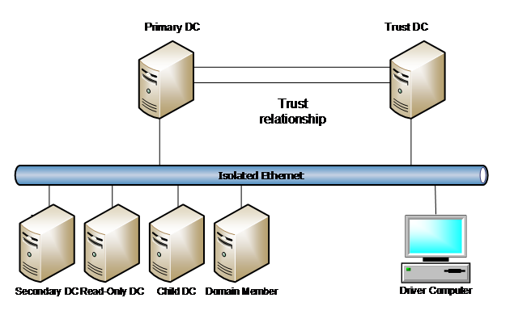

| &#32;| &#32;| &#32;| &#32;| &#32;| &#32; |
| -------------| -------------| -------------| -------------| -------------| ------------- |
| Machine Name/Access Point| NIC| IPv4| Subnet Mask| Default Gateway| DNS Server| 
| PDC| External1| 192.168.111.1| 255.255.255.0| 192.168.111.1| 192.168.111.1 192.168.111.2| 
| | | | | | 192.168.111.5| 
| SDC| External1| 192.168.111.2| 255.255.255.0| 192.168.111.1| 192.168.111.1| 
| RODC| External1| 192.168.111.3| 255.255.255.0| 192.168.111.1| 192.168.111.1| 
| CDC| External1| 192.168.111.4| 255.255.255.0| 192.168.111.1| 192.168.111.1| 
| TDC| External1| 192.168.111.5| 255.255.255.0| 192.168.111.1| 192.168.111.1| 
| | | | | | 192.168.111.5| 
| DM| External1| 192.168.111.6| 255.255.255.0| 192.168.111.1| 192.168.111.1| 
| ENDPOINT| External1| 192.168.111.101| 255.255.255.0| 192.168.111.1| 192.168.111.1| 
| | | | | | 192.168.111.4| 
| | | | | | 192.168.111.5| 

### <a name="_Toc426639781"/>2.2 Partner Test Environment
Partner can replace PDC/SDC/RODC/CDC/TDC/DM using partner’s own machine.

## <a name="_Toc426639782"/>Test Suite Design
Test scenarios are categorized as below table and will be described in following sections.

| &#32;| &#32;| &#32; |
| -------------| -------------| ------------- |
| Category| Test Cases| Comments| 
| MS-ADTS-LDAP| 380| Both Model-Based approach and Traditional approach are adopted. Traditional test cases are designed to handle requirements which may not be validated due to the limitations of the model design.| 
| MS-ADTS-PublishDC| 11| Traditional approach is adopted. Test cases are designed and implemented manually to validate the requirements. Message Analyzer validation will be used for some specific test scenarios.| 
| MS-ADTS-Schema| 45| Traditional approach is adopted. | 
| | | AD System model is used to obtain the definitions of AD Schema attributes and classes from XML versions of Technical Documents for the validation of attributes and classes as a part of Data Schema feature. | 
| MS-ADTS-Security| 693| Both Model-Based approach and Traditional approach are adopted. The traditional cases are used to cover the statements which are not suitable to cover by Model-Based test cases. About Model-Based Testing, please see [Spec Explorer](http://msdn.microsoft.com/en-us/library/ee620411.aspx)| 
| MS-APDS| 29| Traditional approach is adopted. | 
| MS-DRSR| 150| Traditional approach is adopted.| 
| MS-FRS2| 61| Both Model-Based approach and Traditional approach are adopted.| 
| MS-LSAD| 1747| Model-Based approach is adopted.| 
| MS-LSAT| 105| Model-Based approach is adopted.| 
| MS-NRPC| 188| Both Model-Based approach and Traditional approach are adopted.| 
| MS-SAMR| 213| Traditional approach is adopted.| 

### <a name="_Toc426639783"/>3.1 MS-ADTS-LDAP

#### <a name="_Toc426639784"/>3.1.1 Test Approach
The LDAP Operations for this test suite consist Search, Add, Modify, ModifyDN and Delete against the Active Directory. The results of each action can either be success or one of the several possible errors described in the TD. Test suite essentially covers all possible combinations of Success and Error return values for these operations as specified in the ADTS technical document. While the LDAP protocol itself has few states, the condition required to generate actions to cover requirements depend heavily on the state of the Active Directory in terms of objects and attributes that exist. Therefore, the test suite establishes minimum set of conditions (states) on AD to stimulate the service in all the necessary ways to meet the requirements.

MS-ADTS protocol defines a specific procedure for every LDAP operation on Active Directory (AD). Performing an LDAP operation on an AD involves minimal state changes.

MS-ADTS model includes an abstract model and a Spec Explorer (SE) model.

Abstract Model: 

To capture the required set of initial conditions, update conditions as necessary, an Abstract Model is utilized to provide a simplified representation of the Active Directory server state. The abstract model is used to generate all the variable combinations for each action as applied to the AD server. The expected response from the server is also provided from the abstract model. This approach allows the Spec Explorer model to be relatively simple. Abstract model maintains the initial state of AD with required class, attribute schemas and their corresponding objects.

Abstract model defines four classes (More classes can be added depending on the usage of ConfigNC and ApplicationNC):

* ModelDomainController: Holds AD server GUID and implements LDAP operations (Add, Modify, Delete and Search) on the data members of DomainNC and SchemaNC classes.

* DomainNC: Maintains data members to provide the mapping between the objects, classes and containers. Also, provides methods to load the initial state of AD with respect to DomainNC.

* ConfigNC: Maintains data members to provide mapping between the objects, classes and containers. Also, provides methods to load initial state of AD with respect to configNC.

* SchemaNC: Maintains data members to hold the class schema, attribute schema and methods to load the initial state of AD with respect to SchemaNC.

Spec Explorer (SE) Model: 

The Spec Explorer (SE) Model contains all actions and their enabling conditions describing the TD behavior. AD is the only state variable that governs the state changes in the model.

The figure below presents the interaction of Spec Explorer model and Abstract model.

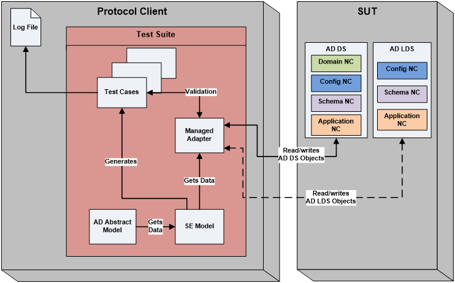

**Figure** **3** **-1** **:** **MS-ADTS-LDAP Test Suite Architecture**

Initial state is maintained by loading necessary schema and objects in the abstract model. SE model interacts with abstract model to know the initial state and to perform LDAP operations on the abstract data. SE model then generates test cases for every possible parameter combination in a specific scenario.
Following are the six LDAP operations performed on the abstract data model as a part of this Test Suite:

* Add 

* Modify

* Delete 

* Search  

* ModifyDN

* LDAP Extended operations

Security considerations, constraints enforced on every operation will be handled by their corresponding model actions and with the required abstract model data update. 

Operations covered as part of this test suite shall be considered in different scenarios as described in the following. Scenarios are designed to handle requirements specific to a particular operation. In few scenarios, certain prerequisites like adding or modifying an object may be involved, in such cases scenarios involve calls to operations like Add or modify prior to the calling of scenario specific method.

#### <a name="_Toc426639785"/>3.1.2 Scenarios

| &#32;| &#32; |
| -------------| ------------- |
|  **Scenario Name**|  **Scenario Description**| 
| LDAPSearch| Search operation is restricted to the objects that match the search filter which supports Approximate Match, Equality Match and searches using objectCategory attribute. | 
| LDAPSearch using ExtendedControls| Search operation using extended controls to perform search operation in different ways.| 
| | Existing Search operation is modified to include extended controls to perform the operation.| 
| LDAPADDObject| Addition of a new object to the directory by checking the constraints on different attributes while performing this operation. A parameter to distinguish AD/DS and AD/LDS operations is induced in the method signature to cover requirements pertaining to add operation on AD/LDS as well as AD/DS. In this case, the parameter is set to AD/DS.| 
| WellKnownObjects| Covers modification of WellKnownObjects value by checking the constraints.| 
| LinkAttributes| Checks the value of linkId attribute if it is forward link or backward link.| 
| LDAPAdd_AD/LDS| Add operation on AD/LDS. A parameter to distinguish AD/DS and AD/LDS operations is induced in the method signature to cover requirements pertaining to Add operation on AD/LDS as well along with AD/DS. In this case, the parameter is set to AD/LDS.| 
| LDAPModifyObject| Modification of an existing object in the directory by checking the constraints on different attributes while performing this operation.| 
| | A parameter to distinguish AD/DS and AD/LDS operations is induced in the method signature to cover requirements pertaining to Modify operation on AD/LDS as well along with AD/DS. In this case, the parameter is set to AD/DS.| 
| LDAPModify_AD/LDS| Modify operation on AD/LDS. A parameter to distinguish AD/DS and AD/LDS operations is induced in the method signature to cover requirements pertaining to Modify operation on AD/LDS as well as AD/DS. In this case, the parameter is set to AD/LDS.| 
| Undelete Operation| The undelete operation is used to revert the effects of a delete operation; that is, to turn a tombstone into a regular object. Document describes constraints on Undelete operation as a combination of both Modify and ModifyDN operations. | 
| IntraDomainModify DN| The Modify DN originating update operation modifies the DN of the object. This scenario is achieved by calling ModifyDN operation with the OID “LDAP_SERVER_CROSSDOM_MOVE_TARGET_OID LDAP” not set.| 
| Cross Domain Move| Moves an object across domains. This scenario is achieved by calling ModifyDN operation with the OID “LDAP_SERVER_CROSSDOM_MOVE_TARGET_OID LDAP” set.| 
| TreeDelete Operation| Delete Operation which deletes trees of objects.| 
| Delete Operation| Delete an existing object. It includes tombstone invariants maintained for deleted objects.| 
| LDAPOperations_DefunctObject| LDAP Operations which affect the Defunct classes and isDefunct attribute in different forest functional levels.| 
| | Defunct Scenario is split into three sub scenarios as the number of calls made in the scenario are beyond the limit SE supports.| 
| LDAPOperations_DynamicObjects| LDAP Operations on Dynamic objects.| 
| LDAPPolicies and IPDenyList| This Scenario covers LDAP Policies that are checked with LDAPAdminLimits attribute, and the list that gives IP addresses to which LDAP connections cannot be established. This scenario is achieved by performing a search operation for the object bearing LDAP policies and IPDenyList.| 
| QueryRootDSEAttributes| This scenario is achieved by performing a search operation on RootDSE attributes.| 
| RootDSEModifyOperations| Modifies the RootDSE attributes that are used to trigger behaviors on a specific DC. This scenario is achieved by performing RootDSE Modify operations.| 
| Updates on RODC| LDAP operations on RODC. This scenario is achieved by running the test suite on RODC. No extra implementation is required to achieve this.| 
| Domain Join| This Scenario is made as traditional. This scenario checks for related updates on attributes after the domain join is performed.| 
| DeleteOperationWithRecycleBinEnabled| This Scenario is made as traditional. This scenario checks the delete operation when the recycle bin optional feature is enabled.| 
| DeleteOperationWithRecycleBinNotEnabled| This Scenario is made as traditional. This scenario checks the delete operation when the recycle bin optional feature is not enabled.| 

### <a name="_Toc426639786"/>3.2 MS-ADTS-PublishDC

#### <a name="_Toc426639787"/>3.2.1 Test Approach
The traditional approach to validate this test suite involves Pre-capture mode validation and validation of LDAP Search query response. Pre-capture mode validation captures the Netlogon response to analyze it with Message Analyzer API. This mode captures the triggered Netlogon response by the ResponseTrigger application. The LDAP Search request is used for testing general filter settings.

Almost 50% of the requirements are validated using Pre-capture mode validation. The remaining requirements are validated using LDAP Search query response by using the class of System.DirectoryServices.Protocols namespace to connect to the server, bind, and send an LDAP request.

In Pre-capture mode validation, Message Analyzer captures containing the traffic (NETLOGON_Response and NETLOGON_ResponseEx messages) for validating these requirements are expected to be deployed on the test suite prior to execution. If the server is a Non-Windows server and the tool capturing the traffic is not Message Analyzer, the adapter implementation to validate the captures is expected to be changed accordingly.

Another approach to validate the other half of the requirements involves issuing an LDAP search query and getting response to validate the requirements.

Two managed adapters, one for the Pre-capture mode and the other for LDAP Search query are designed to validate all the requirements.

The figure below depicts the interaction between test cases, adapter and the server.

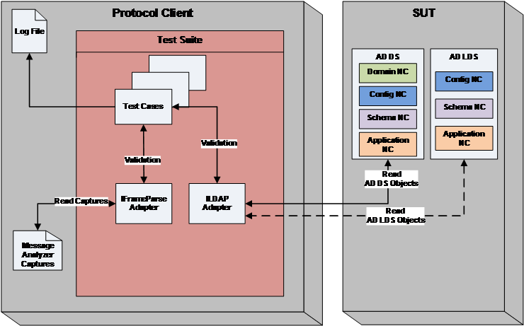

***Figure 3-2: MS-ADTS-PublishDC Test Suite Architecture***

In the above diagram, test cases are designed to interact with the managed adapters to validate the requirements against the expected values as per the requirements. 

Managed adapter (ILDAPAdapter) is designed to perform LDAP Search request, interacting with the server to provide the results corresponding to the arguments passed in the LDAP Search query. The other managed adapter (IFrameParseAdapter) just runs through the captured frames and extracts the required fields.

#### <a name="_Toc426639788"/>3.2.2 Scenarios

| &#32;| &#32; |
| -------------| ------------- |
|  **Scenario Name**|  **Scenario Description**| 
| Scenario0| Connect and send an LDAP bind request to LDAP Server. If success, the return value is 0.| 
| TestCaseSamLogonResponseEx| Validates the requirements which are related to “TestCaseSamLogonResponseEx” structure. This includes requirements which are part of the “TestCaseSamLogonResponseEx” structure or the requirements corresponding to the conditions that result in “TestCaseSamLogonResponseEx” structure.| 
| TestCaseSamLogonResponse| Validates the requirements which are related to “TestCaseSamLogonResponse” structure. This includes requirements which are part of the “TestCaseSamLogonResponse” structure or the requirements corresponding to the conditions that result in “TestCaseSamLogonResponse” structure.| 
| ADLDSDCPublication| Validates the requirements corresponding to ADLDS DC Publications.| 
| DnsBasedDiscovery| Validates the requirements corresponding to DNS based discovery.| 
| LDAPPing| Validates all the requirements involving LDAP ping operation.| 

### <a name="_Toc426639789"/>3.3 MS-ADTS-Schema

#### <a name="_Toc426639790"/>3.3.1 Test Approach
Test suite consists of AD system model, Adapter interface and Test methods (Test Cases), as shown in diagram Figure 3-3. First part of the Test suite will validate the syntactical and content of MS-ADA1-3, MS-ADSC, MS-ADLS data structure documents using AD System Model. Second part of the Test suite validates the schema requirements captured from the MS-ADTS document.

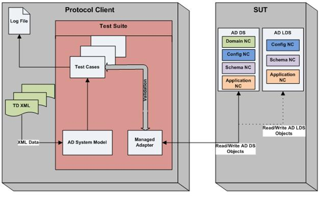

**Figure** **3** **-** **3** **:**  **MS-** **AD** **TS-** **Schema Test Suite**  **Architecture**

#### <a name="_Toc426639791"/>3.3.2 Scenarios

| &#32;| &#32; |
| -------------| ------------- |
|  **Scenario ID**|  **Description**| 
| SchemaInternalConsistency| Validates if TD XMLs are loaded correctly on Virtual Directory Information Tree. Prints the internal structure of the Virtual DIT in a separate log file.| 
| | This will be validated only for System Model.| 
| SchemaClasses| Validates if the loaded TD XML classes of AD/DS are syntactically valid by comparing with the AD/DS classes on Active Directory server. | 
| LDSSchemaClasses| Validates if the loaded TD XML classes of AD/LDS are syntactically valid by comparing with the AD/LDS classes on Active Directory server. | 
| SchemaAttributes| Validates if the loaded TD XML attributes of AD/DS are syntactically valid by comparing with the AD/DS attributes on Active Directory server. | 
| LDSSchemaAttributes| Validates if the loaded TD XML attributes of AD/LDS are syntactically valid by comparing with the AD/LDS attributes on Active Directory server. | 
| SystemOnly| Validates if the attributes of attributeSchema and classSchema have the systemOnly attribute set to TRUE in AD/DS. Read the ‘systemOnly’ attribute of an attributeSchema and classSchema class objects and verify if the value is True. | 
| LDSSystemOnly| Validates if the attributes of attributeSchema and classSchema have the systemOnly attribute set to TRUE in AD/LDS. Read the ‘systemOnly’ attribute of an attributeSchema and classSchema class objects and verify if the value is True.| 
| UniqueID| Validates requirements of the UniqueID scenario of AD/DS. This test case will read the GUID and verify if it is unique in the NC. | 
| LDSUniqueID| Validates requirements of the UniqueID scenario of AD/LDS. This test case will read the GUID and verify if it is unique in the NC. | 
| SchemaSyntaxes| Validates the Syntaxes requirements of AD/DS from MS-ADTS document. This test case validates the requirements with the schema attributes. By mapping oMSyntax and oMObjectClass it identifies the attribute syntax.| 
| LDSSchemaSyntaxes| Validates the Syntaxes requirements of AD/LDS from MS-ADTS document. This test case validates the requirements with the schema attributes. By mapping oMSyntax and oMObjectClass it identifies the attribute syntax. | 
| IsSingleValued| Validates the attribute isSingleValued or multiValued of AD/DS in schemaNC. This test case will count the values of an attribute to verify. | 
| LDSIsSingleValued| Validates the attribute isSingleValued or multiValued of AD/LDS in schemaNC. This test case will count the values of an attribute to verify. | 
| ConsistencyRule| Validates the consistency rules requirements of AD/DS from MS-ADTS document. This test case will validate Content, Structure rules, object class and inheritance. | 
| LDSConsistencyRule| Validates the consistency rules requirements of AD/LDS from MS-ADTS document. This test case will validate Content, Structure rules, object class and inheritance.| 
| SchemaModifications| Validates creating new object of classSchema/attributeSchema, modifying existing object of classSchema/attributeSchema and checking the syntax for ldapDisplayName and systemFlags requirements of the SchemaModifications present in the SchemaNC of AD/DS.| 
| LDSSchemaModifications| Validates creating new object of classSchema/attributeSchema, modifying existing object of classSchema/attributeSchema and verifying the syntax for ldapDisplayName and systemFlags requirements of the SchemaModifications present in the SchemaNC of AD/LDS.| 
| ConstructedAttributes| Validates the constructed attributes of AD/DS mentioned in the MS-ATDS Document.| 
| LDSConstructedAttributes| Validates the constructed attributes of AD/LDS mentioned in the MS-ATDS Document.| 
| QueryNC| Validates requirements of the QueryNC scenario of AD/DS. | 
| LDSQueryNC| Validates requirements of the QueryNC scenario of AD/LDS. | 
| CrossRefContainer| Validates the containment, parent, child objects and objectClass requirements of the crossRef Container present in the ConfigNC of AD/DS. | 
| LDSCrossRefContainer| Validates the containment, parent, child objects and objectClass requirements of the crossRef Container present in the ConfigNC of AD/LDS (ADAM instance). | 
| SiteContainer| Validates the containment, parent, child objects and objectClass requirements of the Site Container present in the ConfigNC of AD/DS.| 
| LDSSiteContainer| Validates the containment, parent, child objects and objectClass requirements of the Site Container present in the ConfigNC of AD/LDS.| 
| ServerContainer| Validates requirements of the Server Container available in the Sites Container of ConfigNC of AD/DS.| 
| LDSServerContainer| Validates requirements of the Server Container available in the Sites Container of ConfigNC of AD/LDS.| 
| ServicesAndQueryPolicyContainer| Validates the containment, parent, child objects and objectClass requirements of the Services and Query-Policies Container available in the ConfigNC of AD/DS.| 
| LDSServicesAndQueryPolicyContainer| Validates the containment, parent, child objects and objectClass requirements of the Services and Query-Policies Container available in the ConfigNC of AD/LDS.| 
| WellKnownSecurityPrincipal| Validates the containment, parent, child objects and objectSid requirements of the WellKnown Security Principal Container available in the ConfigNC of AD/DS.| 
| ExtendedRights| Validates the Extended-Rights requirements of AD/DS from MS-ADTS document. | 
| LDSExtendedRights| Validates the Extended-Rights requirements of AD/LDS from MS-ADTS document. | 
| ForestUpdatesContainer| Validates requirements of the Forest Updates Container of ConfigNC of AD/DS.| 
| WellKnownObjects| Validates requirements of Well-Known Objects of AD/DS within each NC (excluding the schema NC).| 
| LDSWellKnownObjects| Validates requirements of Well-Known Objects of AD/LDS within each NC (excluding the schema NC).| 
| LDSRolesContainer| Validates the containment, parent, child objects and objectClass requirements of the Roles Container in the Config NC and Application NC of AD/LDS (ADAM instance).| 
| WellKnownSecurityDomainPrincipal| Validates the containment, parent, child objects, objectClass and groupType requirements of the Wellknown Security Domain Principal present in the Domain NC of AD/DS.| 
| LDSWellKnownSecurityDomainPrincipal| Validates the containment, parent, child objects, objectClass and groupType requirements of the Wellknown Security Domain Principal present in the Domain NC of AD/LDS.| 
| FunctionalLevel| Validates the requirements related to Functional levels (Such as Domain, DC, Forest) and the critical system objects related attributes in both AD/DS and AD/LDS.| 
| ReadOnlyDomainController| Validates RODC related attributes.| 
| DRSRRequirement| Validates the requirements related to Replication information.| 
| OptionalFeature| Validates the Optional Feature settings, Recycle Bin Feature settings, Deleted Objects NC settings, and recycle timer settings of AD/DS.| 
| LDSOptionalFeature| Validates the Optional Feature settings, Recycle Bin Feature settings and Deleted Objects NC settings of AD/LDS.| 

### <a name="_Toc426639792"/>3.4 MS-ADTS-Security

#### <a name="_Toc426639793"/>3.4.1 Test Approach
MS_ADTS Security test suite aims to validate the following sections in the MS-ADTS technical document:

* LDAP Security Authentication

* LDAP Security Authorization

* Special Objects and Forest Invariants – Trust Objects

* FSMO Roles

* Password Change Options

A Model-Based Testing (MBT) approach is followed for modeling the behavior and validating the requirements pertaining to Security features from the MS-ADTS protocol.

The figure below depicts the interaction between test cases, adapter and the server.

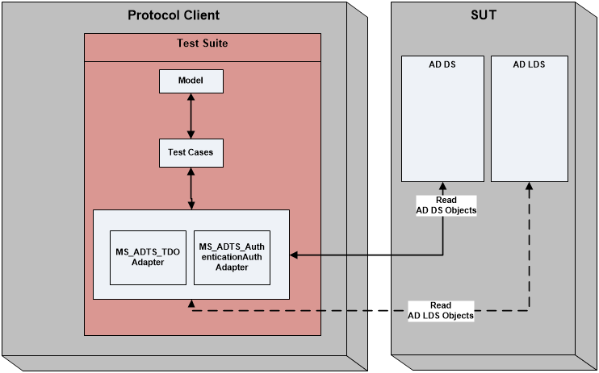

**Figure** **3** **-** **4** **:**  **MS-** **AD** **TS-** **Security Test Suite**  **Architecture**

#### <a name="_Toc426639794"/>3.4.2 Scenarios

| &#32;| &#32; |
| -------------| ------------- |
|  **Scenario Name**|  **Scenario Description**| 
| TDOOperation_Scenario1| TDOOperation_Scenario1 deals with observing the TDO Operations response for different values of the following attributes: Security Descriptor and for Trust Direction Outbound and Disabled.| 
| | Since the Trust Direction is not set as Outbound or disabled, maintaining inter-domain trust information is not required.      | 
| | For other attributes of TDO, default values are used.| 
| TDOOperation_Scenario2| TDOScenario2 deals with observing the TDO Operations response for trust direction INBOUND and BIDIRECTIONAL. CreateTrustedAccounts needs to be invoked in order to maintain inter domain trust account info.| 
| TDOOperation_Scenario3| TDOOperation_Scenario3 deals with observing the TDO Operation response for different trust attributes values. Hence inter domain trust account information is not required because Trust Direction is disabled. For other attributes of TDO, default values are used.| 
| TDOOperation_Scenario4| TDOScenario4 deals with observing the server behavior when attempts are made to create a Trusted Domain Object with duplicate Flat Name or SID or Trust Partner. For other attributes of TDO, default values are used.| 
| TDOOperation_Scenario5| If the trust attributes of a TDO is TRUST_ATTRIBUTE_FOREST_TRANSITIVE, then Forest Trust Information of the records for the trust object can be maintained. The Forest Information of the Records for different TDOs can have same NetBios name if the NDC flags are set. If the trust attribute of a TDO is not TRUST_ATTRIBUTE_FOREST_TRANSITIVE then Forest Trust Information Records cannot be stored for the TDO. The system rejects attempts of doing so. TDOOperation_Scenario5 deals with observing the server response when attempts are made to maintain Trust Forest Information of another TDO with duplicate NetBios Name. Creation of Trust Information Records under those circumstances will depend on the NDC Flag’s status.| 
| TDOOperation_Scenario6| If the trust attributes of a TDO is TRUST_ATTRIBUTE_FOREST_TRANSITIVE, then Forest Trust Information of the records for the trust object can be maintained. The Forest Information of the Records for different TDOs can have same SID Value if the SDC flags are set. If the trust attribute of a TDO is not TRUST_ATTRIBUTE_FOREST_TRANSITIVE then Forest Trust Information Records cannot be stored for the TDO. The system rejects attempts of doing so. TDOOperation_Scenario6 deals with observing the server response when attempts are made to maintain Trust Forest Information of another TDO with duplicate SID Values. Creation of Trust Information Records under those circumstances will depend on the SDC Flag’s status.| 
| SimpleAuthentication| Scenario SimpleAuthentication models the behaviors and generates test cases which deals with Simple Authentication scheme, Authorization and Password Change operation.| 
| SASLAuthentication| Scenario SASLAuthentication models the behaviors and generates test cases which deals with SASL Authentication scheme, Authorization and Administrative Password Change operations.| 
| SicilyAuthentication| Scenario SicilyAuthentication models the behaviors and generates test cases which deals with Sicily Authentication scheme, Authorization.| 
| MutualAuthentication| Scenario MutualAuthentication models the behaviors and generates test cases which deals with Mutual Authentication scheme, Authorization and Administrative Password Change operations.| 
| AdditionalAttributeCheck| Scenario AdditionalAttributeCheck models the behaviors and generates test cases which deals with SASL Authentication scheme on LDAP_SSL_PORT Authorization. For various combinations of Access Rights and Control Access Rights, Authorization Check will be performed for some attributes and operations.| 
| UserPasswordCheck| Scenario UserPasswordCheck checks the modeled behavior for accessing the userPassword attribute under different conditions of fUserPwdSupportFlag.| 
| FastAuthentication| Scenario FastAuthentication models the behaviors and generates test cases which deals with Fast Authentication scheme.| 

### <a name="_Toc426639795"/>3.5 MS-APDS

#### <a name="_Toc426639796"/>3.5.1 Test Approach
Test suite for server endpoint covers all requirements pertaining to return status and response messages sent by DC which is APDS Server (SUT) for completing authentication sequence.

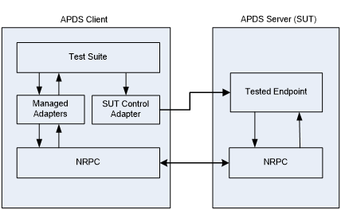

***Figure 3-5: MS-APDS Test Suite Architecture***

* Test suite uses APDSServerAdapter:

	* To construct and send request packet to APDS protocol server, and to decrypt the response blob.

* APDSServerAdapter uses NRPC stub to:

	* To call NRPC methods used to establish secure channel and to call generic pass through methods.

* Test suite uses SUT Control Adapter:

	* To modify configurations on the tested endpoint for different test cases.

The basic common steps for APDS test cases consist of the following:

* Generate the credential/signature for current test case.

* Establish secure channel using NRPC methods.

* Set up the corresponding request structure.

* Call the NRPC NetrLogonSamLogonEx method with parameters from test case and structures from step 3.

* Capture and validate the response and log the requirements.

#### <a name="_Toc426639797"/>3.5.2 Scenarios

#####3.5.2.1 NTLM Validation
Send the NTLM Interactive/Network logon request message through NRPC pass through mechanism from Protocol client to Protocol server (i.e. domain controller). Domain controller will validate the credentials and completes the authentication sequence by returning the response message to protocol client. 

If the verification is successful, the message contains the user’s authorization data. If the verification is unsuccessful, logon is denied.

***Figure 3-6: NTLM Validation***

#####3.5.2.2 Privilege Attribute Certificate (PAC) Validation
Create Kerberos PAC request message using PAC signature contained in kerberos TGS response and forward Kerberos PAC validation request message from protocol client to protocol server (i.e., domain controller) through NRPC generic pass through mechanism. DC will validate the signature and completes authentication sequence by returning response message to the application server. 

If verification is successful, RPC code indicating success is returned. If verification is unsuccessful, RPC code indicating error will be returned.

Cases for this scenario are added into Kerberos Test Suite.

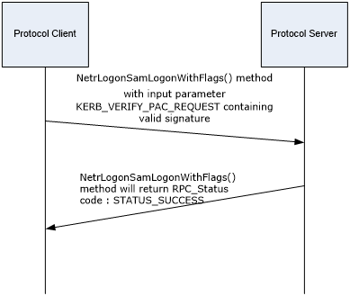

***Figure 3-7: Kerberos Privilege Attribute Certificate (PAC) Validation***

#####3.5.2.3 Digest Validation
Send Digest Validation request message from Protocol client to Protocol server (i.e., domain controller) through NRPC generic pass through mechanism. Domain controller verifies the hashed credentials and completes the authentication sequence by returning the response message to protocol client.

If verification is successful, response message indicating successful authentication will be returned to the protocol client. If the verification is unsuccessful, response message indicating failed authentication will be returned to protocol client.

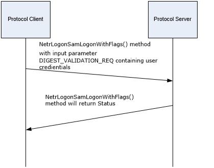

***Figure 3-8: Digest Validation***

### <a name="_Toc426639798"/>3.6 MS-DRSR

#### <a name="_Toc426639799"/>3.6.1 Test Approach
Test suite for server endpoint covers all requirements pertaining to return status and response messages sent by DC which is DRSR Server (SUT).

The basic common steps for DRSR test cases consist of the following:

* Use LDAP to query object data in Active Directory to be used by test case.

* Establish RPC channel and use IDL_DRSBind to bind to SUT.

* Set up the corresponding request structure.

* Capture and validate the response and log the requirements.

#### <a name="_Toc426639800"/>3.6.2 Scenarios
There is one test scenario for each DRSR operation. Operation name will be used for the test case name.

### <a name="_Toc426639801"/>3.7 MS-FRS2

#### <a name="_Toc426639802"/>3.7.1 Test Approach
The test suite is Model Based and uses IDL FRS2 RPC Methods for generating protocol messages. 

Both FRS2 Server and Client are SUT for FRS2 protocol. The following block diagram explains the SUT for FRS2 protocol.

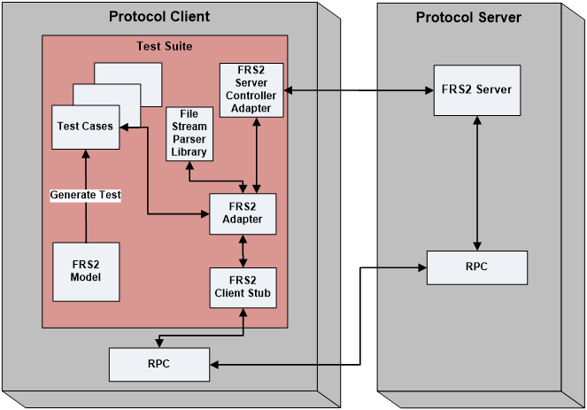

***Figure 3-9: MS-FRS2 Test Suite Architecture***

Test Suite interacts with RPC transport using managed Adapter and FRS2 Client Stub. Test cases are generated by the Model and are responsible to call FRS2 RPC Methods in Adapter.

The methods in the Adapter, corresponding to FRS2 IDL RPC methods are called to generate the traffic. The out parameters and the structures to be validated are passed to the test suite. Test suite is responsible for validating the requirements by checking the return codes and output parameter values.

The protocol adapter of FRS2 test suite will have the following modules:

* FRS2ClientStub: Unmanaged Client Stub is generated from FRS2 IDL that will have the FRS2 RPC Methods. 

* FRS2 Adapter: Consists of a wrapper, written to marshal C++ interfaces to C &#35;  interfaces. All the parameters of FRS2 RPC Methods would remain unchanged. FRS2 Adapter implements all the FRS2 RPC Methods that are defined in the protocol IDL.

* FRS2 Server Controller Adapter: Contains the set of methods: 

	* To get the Replication Folder properties from the server.

	* To retrieve server object variables.

	* Overload methods to validate various types of Active Directory requirements.

	* To retrieve msDFSR-FileFilters and msDFSR-DirectoryFilters.

* File Stream Parser Library: This library is used to parse the data buffer returned by the DFSR server when a call to InitializeFileTransferAsync is made. The DFSR server replicates the files in the form of streams which contain the metadata, security and data information of the file. These streams are used on the client side to reconstitute the file.

* Decompressor: This module is internally referenced by the File Stream Data Parser Library when the data sent by the server is in compressed format. This module takes in the compressed data and returns the uncompressed byte array. The uncompressed byte array is fed to the parser for validation.

#### <a name="_Toc426639803"/>3.7.2 Scenarios
Following are the scenarios identified for FRS2 protocol.

* TestScenario1 (Normal File Transfer) – S1.

* TestScenario2 (Normal File Transfer Async) – S2.

* TestScenario3 (Compressed File Transfer) – S3.

* TestScenario4 (Compressed File Transfer Async) – S4.

* TestScenario5 (Slow Sync File Transfer) – S5.

* TestScenario6 (Update Cancel) – S6.

* TestScenario7 (Connectivity Connection Session) – S7.

* TestScenario8 (ValidateFileStreamData) - S8.

* TestScenario9 (TraditionalTestCasesForFRS2) - S9

The scenarios are separated based on specific functionality provided by the protocol.

* Normal File Transfer: 

	* When the client calls RawGetFileData method to retrieve the file data –S1.

	* When the client calls RawGetFileDataAsync method to retrieve the file data –S2.

* Compressed File Transfer: 

	* When the client calls RdcGetFileData method to retrieve the file data –S3.

	* When the client calls RdcGetFileDataAsync method to retrieve the file data –S4.

* Slow Sync File Transfer:

	* When the client calls RequestRecords method to retrieve the UIDs and GVSNs from the server –S5.

* Update Cancel 

	* When the client is unable to process a particular update, calls to UpdateCancel method to communicate to the server about it –S6.

* Connectivity Connection Session

	* This scenario provides all possible combinations of parameters for CheckConnectivity, EstablishConnection and EstablishSession RPC methods. Different access level behaviors are explored using this scenario -S7.

* Traditional Test cases

	* The Traditional Test Cases are written for capturing FSCC and BKUP requirements. And also the requirements which are having traces in the FRS2 Model Test Cases but due to events not getting covered in the Model.

### <a name="_Toc426639804"/>3.8 MS-LSAD

#### <a name="_Toc426639805"/>3.8.1 Test Approach
LSAD protocol is being tested in Model-Based Approach and the factors considered for deterministic model approach are as follows:

Every sequence performs a definite job and deals with set of inter-dependent methods. Every sequence starts with a Begin method (LsarOpenPolicy) and final method (LsarClose) which plays an important role in establishing its respective sequence. Some of the dependent methods, thus, depend on the handle given by this method to perform their tasks. 

Consider manipulating account object scenario, it begins with LsarOpenpolicy2 method to get RPC handle, pass that handle to LsarCreateSecret method for creating new account, open the same account  with LsarOpenAccount  method. Once the account is opened successfully, sequence of operation can be performed on that account object:

* Setting and getting security descriptor.

* Add privileges to account object, get privileges of account object.

* Setting account access rights and Getting account access rights.

The following diagrams depict the conceptual flow of MS-LSAD and recommends for Modeling:

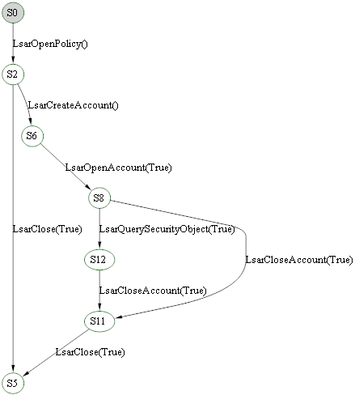

**Figure**  **3-10** **: State diagram of Query security Objects**

It is concluded that the test approach for this protocol would be a model-based because it provides a systematic approach to deal with the server states and the ease in implementing the sequences specified in the protocol document. 

The following diagrams depict the conceptual flow of MS-LSAD and recommends for Modeling:

Case 1: Manipulating Account Objects

**Figure 3** **-11** **: Account Objects Manipulation Sequence**

Case 2: Manipulating Secret Objects

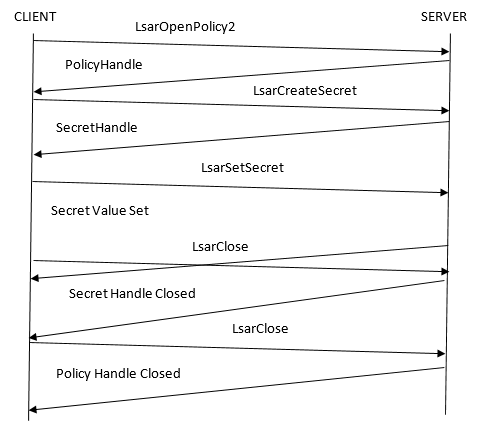

**Figure**  **3-12** **: Secret Objects Manipulation sequence**

Case 3: Manipulating Trusted Domain Objects

**Figure**  **3-13** **: Trusted Domain Objects Manipulation sequence**

#### <a name="_Toc426639806"/>3.8.2 Scenarios
Scenarios are written to cover as many requirements without disturbing the logical grouping of the methods, thus, maintaining the sequencing as specified in the document.

According to the usage of each method in the interface of MS-LSAD protocol, the following 36 scenarios are abstracted to verify the requirements. The following table lists the scenarios used in the MS-LSAD Test Suite.

|  **No.**|  **Scenario ID**|  **Description**| 
| -------------| -------------| ------------- |
| 1| Scenario 0| This is to bind to the server to check the environment configuration.| 
| 2| Scenario 1| This is for setting the policy information to the server using information types from POLICY_INFORMATION_CLASS enumeration.| 
| 3| Scenario 2| This is for querying the policy information from the server using information types from POLICY_INFORMATION_CLASS enumeration.| 
| 4| Scenario 3| This is for setting the policy information to the server using information types from POLICY_INFORMATION_CLASS enumeration.| 
| 5| Scenario 4| This is for querying the policy information from the server using information types from POLICY_INFORMATION_CLASS enumeration.| 
| 6| Scenario 5| This is for setting domain policy information to the server and querying the policy information set on the server using information types.| 
| 7| Scenario 6| This is for creating a new account object by CreateAccount, adding privileges to the newly created object by AddprivilegesToAccount, enumerating the privileges added by Calling EnumeratePrivilegesAccount; remove the privileges from the newly created account object by calling RemovePrivilegesFromAccount, deleting the created account object Handle by calling DeleteObject and passing the AccountHandle to it and closing the opened policy handle by calling Close.| 
| 8| Scenario 7| This is for creating a new account object by calling CreateAccount, opening an existing account object by OpenAccount, adding account rights to it by implementing AddAccountRights, enumerate account rights from it, enumerate accounts that have a specific account right by implementing EnumerateAccountsWithUserRight, removing the account rights from the account object by calling RemoveAccountRights, deleting the created account object by passing the Account handle to DeleteObject and closing the open policy handle by calling Close.| 
| 9| Scenario 8| This is for creating a new account object, adding system access rights to the newly created object by passing specific rights to SetSystemAccessAccount, remove the system access rights from the account object, querying all the System Access Rights that the system has on the server by calling GetSystemAccessAccount, deleting the created account object by calling DeleteObject and closing the opened policy handle by calling Close.| 
| 10| Scenario 9| This is for enumerating the list of account objects in the server database by implementing EnumerateAccounts.| 
| 11| Scenario 10| This is for creating a new secret object with the specified constraints by calling CreateSecret, setting secret values for the secret object by calling SetSecret, querying the secret values from it by implementing QuerySecret, deleting the created secret object by passing the secret handle to DeleteObject and closing the open policy handle by calling Close.| 
| 12| Scenario 11| This is for creating a new secret object by calling CreateSecret, opening an existing secret object by calling OpenSecret, storing secret values to it by calling StorePrivateData (which encrypts the data to be stored and sends it on the wire), retrieving secret values from it by calling RetrievePrivateData, deleting the created secret object by calling DeleteObject with an secret handle as the parameter and closing the opened policy handle by calling Close.| 
| 13| Scenario 12| This is for creating a new trusted domain object(CreateTrustedDomain) using trusted domain information of type LSAPR_TRUST_INFORMATION structure, setting Policy Information on  it using the InformationTypes provided in the TRUSTED_INFORMATION_CLASS by implementing SetTrustedDomainInfo, deleting the created trusted domain object by passing the TrustedDomainHandle to DeleteTrustedDomain and closing the opened policy handle by calling Close.| 
| 14| Scenario 13| Create a Trusted Domain Object using CreateTrustedDomain, set the information on the Object using SetTrustedDomainInfo and finally delete the Trusted Domain Object using DeleteTrustedDomain.| 
| 15| Scenario 14| This is for creating a new trusted domain object(CreateTrustedDomain) using trusted domain information of type LSAPR_TRUST_INFORMATION structure, querying Policy Information from it using the InformationTypes provided in the TRUSTED_INFORMATION_CLASS by implementing QueryTrustedDomainInfo, deleting the created trusted domain object by passing the TrustedDomainHandle to DeleteTrustedDomain and closing the opened policy handle by calling Close.| 
| 16| Scenario 15| This is for creating a trusted domain object (CreateTrustedDomain), opening an existing trusted domain object by its NetBios Name (OpenTrustedDomainByName), setting Policy information pertaining to a domain using the domain name of opened trusted domain object (SetTrustedDomainInfoByName), deleting the opened trusted domain object by calling DeleteTrustedDoman with the TrustDomainHandle as the parameter and closing the opened policy handle by calling Close.| 
| 17| Scenario 16| This is for creating a trusted domain object (CreateTrustedDomain), opening an existing trusted domain object by its NetBios Name (OpenTrustedDomainByName), querying information from the trust domain object using the NetBios name of the Domain (QueryTrustedDomainInfoByName), deleting the opened trusted domain object by calling DeletetrustedDomain with the TrustDomainHandle as the parameter and closing the opened policy handle by calling Close.| 
| 18| Scenario 17| This is for creating a new trusted domain object (CreateTrustedDomainEx) using trusted domain information of type LSAPR_TRUST_INFORMATION_EX structure and authentication information of type LSAPR_TRUSTED_DOMAIN_AUTH_INFORMATION, setting policy information related to the trust domain using the trusted domain object (SetInformationTrustedDomain), deleting the created trusted domain object by calling DeletTrustedDomain and closing the opened policy handle by calling Close.| 
| 19| Scenario 18| This is for creating a new trusted domain object (CreateTrustedDomainEx) using trusted domain information of type LSAPR_TRUST_INFORMATION_EX structure and authentication information of type LSAPR_TRUSTED_DOMAIN_AUTH_INFORMATION, querying Trust Information from it using the trusted domain object (QueryInfoTrustedDomain), deleting the created trusted domain object by calling DeleteTrustedDomain and closing the opened policy handle by calling Close.| 
| 20| Scenario 19| This is for creating a new trusted domain object (CreateTrustedDomainEx2) using trusted domain information of type LSAPR_TRUST_INFORMATION_EX structure and authentication information of type LSAPR_TRUSTED_DOMAIN_AUTH_INFORMATION_INTERNAL and then deleting the newly created trusted domain object using DeleteTrustedDomain method.| 
| 21| Scenario 20| This is for creating a trusted domain object (CreatTrustedDomainEx), setting information about a trust relationship with another forest by calling SetForestTrustInformation, and querying Trust information with another forest by implementing QueryForestTrustInformation, deleting the created trusted domain object by calling DeleteObject and closing the opened policy handle by calling Close.| 
| 22| Scenario 21| This is for privileges look up based on their LUID (LookUpPrivilegeName), look up privilege based on their name (LookUpPrivilegeValue), look up privileges using the Client language (LookUpPrivlegeDisplayName)| 
| 23| Scenario 22| This is for creating a new account object by calling CreateAccount, creating a trusted domain object by calling CreateTrustedDomain, setting security descriptor for it by implementing SetSecurityObject, querying security information from the account object by calling QuerySecurityObject and then deleting the newly created account object by calling DeleteObject with the account handle as the parameter.| 
| 24| Scenario 23| This is for enumerating trusted domain objects in the server’s database.| 
| 25| Scenario 24| This is for requesting list of trusted domain objects from the server’s database.| 
| 26| Scenario 25| This is for creating a new account object by calling CreateAccount, add user rights to account, enumerate account rights from it, enumerate accounts that have a specific account right by implementing EnumerateAccountsWithUserRight, deleting the created account object by passing the Account handle to DeleteObject and closing the open policy handle by calling Close.| 
| 27| Scenario 26| This is for getting policy handle by calling actions OpenPolicy and OpenPolicy2.| 
| 28| Scenario 27| This is for requesting list of trusted domain objects from the server’s database.| 
| 29| Scenario 30| This is for creating a new trusted domain object twice by calling CreateTrustedDomain twice, then by CreateTrustedDomainEx and CreateTrustedDomainEx2 to validate objectNameCollision return value case, setting forest trust information of trusted domain object by calling  SetForestTrustInformation and querying forest trust information of trusted domain object by calling QueryForestTrustInformation for Objects that does not have the Forest Attributes enabled, deleting the created trusted domain object by calling DeleteTrustedDomain and closing the opened policy handle by calling Close.| 
| 30| Scenario 31| This is for creating a new trusted domain object twice by calling CreateTrustedDomain twice, then by CreateTrustedDomainEx and CreateTrustedDomainEx2 to validate objectNameCollision return value case, open the created trusted domain object by calling OpenTrustedDomain, querying the forest trust information of the created trusted domain object, deleting the created trusted domain object by calling DeleteTrustedDomain and closing the opened policy handle by calling Close. This scenario is to run on Non Domain controller.| 
| 31| Scenario 33| This is for setting and querying the policy information from the server using information types from POLICY_INFORMATION_CLASS enumeration. The enumeration contains 14 values which can be set. We set the policy information using SetInformationPolicy and SetInformationPolicy2. This scenario is to run on Non domain controller.| 
| 32| Scenario 34| This is for setting and querying the policy information from the server using information types from POLICY_INFORMATION_CLASS enumeration.| 
| 33| Scenario 35| This is for setting and querying the policy information from the server using information types from POLICY_INFORMATION_CLASS enumeration.| 
| 34| Scenario 36| Deals with the behavior of CreateTrustedDomain, CreateTrustedDomainEx, CreateTrustedDomainEx2, SetTrustedDomainInfoByName, SetTrustedDomainInfo and DeleteTrustedDomain in a Read-Only Domain Controller Configuration.| 
| 35| Scenario 37| Scenario 37 is used for opening a policy handle, creating a new secret object, and finally closing the opened policy handle.| 
| 36| TestScenarioNotDomainAdmins| Scenario TestScenarioNotDomainAdmins used when the caller is not a member of the Domain Admins Group. It deals with the behavior of CreateTrustedDomainEx2.| 

For every scenario, the first state of the server is the ‘Init’ state where in the Initialize method is called. Then follow the method sequencing as given below:

**Scenario 0**

This is to bind to the server to check the environment configuration.                                            

**Scenario 1**

This is to set the policy information to the server using information types from POLICY_INFORMATION_CLASS enumeration. The enumeration contains 14 values which can be set. 

The basic message sequencing diagram for this scenario can be depicted as given below:

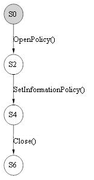

* The sequence starts with OpenPolicy method call, which opens the policy handle with the desired access given.

* SetInformationPolicy takes the policy handle opened by the previous method. The handle must be given the required permission depending upon the information class type being set. Incorrect permission value will fail this method with AccessDenied error code. Also, the information class type given as an input must be valid (within enumeration range of POLICY_INFORMATION_CLASS). Any value out of range will result in InvalidParameter error code. Other return codes can be NotImplemented where information class cannot be set. InvalidHandle where policy handle input is invalid and Success where the information class is set successfully.

* The next method in the sequence is Close which takes the policy handle opened by OpenPolicy method. If the context handle passed as an input is not valid then it returns InvalidHandle error code. Other return code is Success where the resources held by the context handle are freed successfully.

**Scenario 2**

This is for querying the policy information from the server using information types from POLICY_INFORMATION_CLASS enumeration. The enumeration contains 14 values which can be queried. 

The basic message sequencing diagram for this scenario can be depicted as given below:

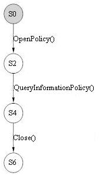

* The sequence starts with OpenPolicy method call, which opens the policy handle with the desired access given. 

* The next method in the sequence is QueryInformationPolicy. QueryInformationPolicy takes the policy handle opened by the OpenPolicy method. The handle must be given the required permission depending upon the information class type being queried. Incorrect permission value will fail this method with AccessDenied error code. Also, the information class type given as an input must be valid (within enumeration range of POLICY_INFORMATION_CLASS). Any value out of range will result in InvalidParameter error code. Other return codes can be NotSupported where information class provided is not supported by the server, InvalidHandle where policy handle input is invalid and Success where the information class is queried successfully.

* The next method in the sequence is Close which takes the policy handle opened by OpenPolicy method. If the context handle passed as an input is not valid then it returns InvalidHandle error code. Other return code is Success where the resources held by the context handle are freed successfully.

**Scenario 3**

This is for setting the policy information to the server using information types from POLICY_INFORMATION_CLASS enumeration. The enumeration contains 14 values which can be set. 

The basic message sequencing diagram for this scenario can be depicted as given below:

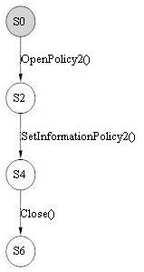

* The sequence starts with OpenPolicy2 method call, which opens the policy handle with the desired access given.

* SetInformationPolicy2 takes the policy handle opened by the previous method. The handle must be given the required permission depending upon the information class type being set. Incorrect permission value will fail this method with AccessDenied error code. Also, the information class type given as an input must be valid (within enumeration range of POLICY_INFORMATION_CLASS). Any value out of range will result in InvalidParameter error code. Other return codes can be NotImplemented where information class cannot be set, InvalidHandle where policy handle input is invalid and Success where the information class is set successfully. 

* The next method in the sequence is Close which takes the policy handle opened by OpenPolicy2 method. If the context handle passed as an input is not valid then it returns InvalidHandle error code. Other return code is Success where the resources held by the context handle are freed successfully.

**Scenario 4**

This is for querying the policy information from the server using information types from POLICY_INFORMATION_CLASS enumeration. The enumeration contains 14 values which can be queried. 

The basic message sequencing diagram for this scenario can be depicted as given below:

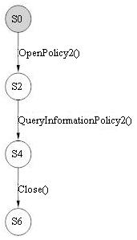

* The sequence starts with OpenPolicy2 method call, which opens the policy handle with the desired access given.

* The next method in the sequence is QueryInformationPolicy2. QueryInformationPolicy2 takes the policy handle opened by the OpenPolicy2 method. The handle must be given the required permission depending upon the information class type being queried. Incorrect permission value will fail this method with AccessDenied error code. Also, the information class type given as an input must be valid (within enumeration range of POLICY_INFORMATION_CLASS). Any value out of range will result in InvalidParameter error code. Other return codes can be NotSupported where information class provided is not supported by the server, InvalidHandle where policy handle input is invalid and Success where the information class is queried successfully.

* The next method in the sequence is Close which takes the policy handle opened by OpenPolicy2 method. If the context handle passed as an input is not valid then it returns InvalidHandle error code. Other return code is Success where the resources held by the context handle are freed successfully.

**Scenario 5**

This is for setting domain policy information in the server and querying the policy information set on the server using information types.

The basic message sequencing diagram for this scenario can be depicted as given below:

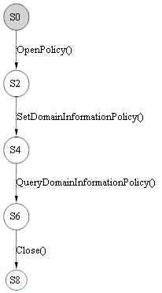

* The sequence starts with OpenPolicy method call, which opens the policy handle with the desired access given.

* SetDomainInformationPolicy takes the policy handle opened by the previous method. The handle must be given the required permission depending upon the domain information class type being set. Incorrect permission value will fail this method with AccessDenied error code. Also, the information class type given as an input must be valid (within enumeration range of POLICY_INFORMATION_CLASS). Any value out of range will result in InvalidParameter error code. Other return codes can be InvalidHandle where policy handle input is invalid and Success where the domain information class is set successfully.

* The next method in the sequence is QueryDomainInformationPolicy. It takes the policy handle opened by the OpenPolicy method. The handle must be given the required permission depending upon the information class type being queried. Incorrect permission value will fail this method with AccessDenied error code. Also, the domain information class type given as an input must be valid (within enumeration range of POLICY_INFORMATION_CLASS). Any value outside the range will result in InvalidParameter error code. Other return codes can be ObjectNameNotFound where domain information class provided is not been set before, InvalidHandle where policy handle input is invalid and Success where the domain information class is queried successfully.

* The next method in the sequence is Close which takes the policy handle opened by OpenPolicy method. If the context handle passed as an input is not valid then it returns InvalidHandle error code. Other return code is Success where the resources held by the context handle are freed successfully.

**Scenario 6**

This is for creating a new account object by CreateAccount, adding privileges to the newly created object by AddprivilegesToAccount, enumerating the privileges added by calling EnumeratePrivilegesAccount, removing the privileges from the newly created account object by calling RemovePrivilegesFromAccount, deleting the created account object Handle by calling DeleteObject and passing the AccountHandle to it and closing the opened policy handle by calling Close.

The basic message sequencing diagram for this scenario can be depicted as given below:

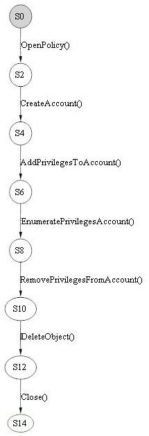

* The sequence starts with OpenPolicy method call, which opens the policy handle with the desired access given.

* CreateAccount method takes the policy handle opened by the previous method. The handle must be given the permission POLICY_CREATE_ACCOUNT. Incorrect permission value will fail this method with AccessDenied error code. Also, the Account Sid given as an input must be valid. Any invalid parameter as an input will result in InvalidParameter. Other return codes can be ObjectNameCollision where account object already exists, InvalidHandle where policy handle input is invalid and Success where the account object is created successfully.

* The next method in the sequence is AddPrivilegesToAccount. AddPrivilegesToAccount takes the account handle opened by the CreateAccount method. The handle must be given the permission ACCOUNT_ADJUST_PRIVILEGES. Incorrect permission value will fail this method with AccessDenied error code. Also, the privileges LUID given as an input must be valid. Any invalid parameter as an input will result in InvalidParameter. Other return codes can be InvalidHandle where account handle input is invalid and Success where the privileges are added to the account successfully.

* The next method in the sequence is EnumeratePrivilegesAccount. EnumeratePrivilegesAccount takes the account handle opened by the CreateAccount method. The handle must be given the permission ACCOUNT_VIEW. Incorrect permission value will fail this method with AccessDenied error code. Other return codes can be InvalidHandle where account handle input is invalid and Success where the privileges are enumerated from the account successfully.

* The next method in the sequence is RemovePrivilegesFromAccount. It takes the account handle opened by the CreateAccount method. The handle must be given the permission ACCOUNT_ADJUST_PRIVILEGES. Incorrect permission value will fail this method with AccessDenied error code. Also, the privileges LUID given as an input must be valid. Any invalid parameter as an input will result in InvalidParameter. Other return codes can be InvalidHandle where account handle input is invalid and Success where the privileges are removed from the account successfully.

* The next method in the sequence is DeleteObject. Here DeleteObject takes the account handle opened by CreateAccount method. If the context handle passed as an input is not valid then it returns InvalidHandle error code. Other return code can be InvalidParameter where the handle passed is a policy handle, Success where the opened object is deleted successfully.

* The next method in the sequence is Close which takes the policy handle opened by OpenPolicy method. If the context handle passed as an input is not valid then it returns InvalidHandle error code. Other return code is Success where the resources held by the context handle are freed successfully.

**Scenario 7**

This is for creating a new account object by calling CreateAccount, opening an existing account object by OpenAccount, adding account rights to it by implementing AddAccountRights, removing the account rights from the account object by calling RemoveAccountRights, deleting the created account object by passing the Account handle to DeleteObject and closing the open policy handle by calling Close.

The basic message sequencing diagram for this scenario can be depicted as given below:

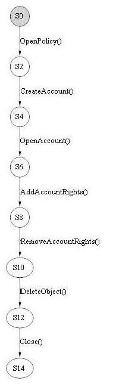

* The sequence starts with OpenPolicy method call, which opens the policy handle with the desired access given.

* CreateAccount method takes the policy handle opened by the previous method. The handle must be given the permission POLICY_CREATE_ACCOUNT. Incorrect permission value will fail this method with AccessDenied error code. Also, the Account Sid given as an input must be valid. Any invalid parameter as an input will result in InvalidParameter. Other return codes can be ObjectNameCollision where account object already exists, InvalidHandle where policy handle input is invalid and Success where the account object is created successfully.

* OpenAccount method takes the policy handle opened by the previous method. The Account Sid given as an input must be valid. Any invalid parameter as an input will result in InvalidParameter. The requested permission to the account handle should be allowed by the object’s security descriptor. Incorrect permission value will fail this method with AccessDenied error code. Other return codes can be ObjectNameNotFound where account object with given Sid does not exists, InvalidHandle where policy handle input is invalid and Success where the account object is opened successfully.

* The next method in the sequence is AddAccountRights. AddAccountRights takes the policy handle opened by the OpenPolicy method. The Account Sid given as an input must be valid. Any invalid parameter as an input will result in InvalidParameter. If the account Sid passed does not exists then policy handle must be given the permission POLICY_CREATE_ACCOUNT and if account Sid exists then the permissions associative to the account Sid passed should be ACCOUNT_ADJUST_PRIVILEGES, ACCOUNT_ADJUST_SYSTEM_ACCESS and ACCOUNT_VIEW. Incorrect permission values will fail this method with AccessDenied error code. Other return codes can NoSuchPrivilege where account rights passed are not valid, InvalidHandle where policy handle input is invalid and Success where the system access rights and privileges are added to the account successfully.

* The next method in the sequence is RemoveAccountRights. RemoveAccountRights takes the policy handle opened by the OpenPolicy method. The Account Sid given as an input must be valid. Any invalid parameter as an input will result in InvalidParameter. If the account Sid passed does not exists then the method fails with ObjectNameNotFound error code and if account Sid exists then the permissions associative to the account Sid passed should be ACCOUNT_ADJUST_PRIVILEGES, ACCOUNT_ADJUST_SYSTEM_ACCESS, ACCOUNT_VIEW and DELETE. Incorrect permission values will fail this method with AccessDenied error code. Other return codes can be NoSuchPrivilege where account rights passed are not valid, InvalidHandle where policy handle input is invalid, NotSupported where some of the account rights removal is not supported by the server and Success where the system access rights and privileges are removed from the account successfully.

* The next method in the sequence is DeleteObject. Here DeleteObject takes the account handle opened by CreateAccount method. If the context handle passed as an input is not valid then it returns InvalidHandle error code. Other return code can be InvalidParameter where the handle passed is a policy handle, Success where the opened object is deleted successfully.

* The next method in the sequence is Close which takes the policy handle opened by OpenPolicy method. If the context handle passed as an input is not valid then it returns InvalidHandle error code. Other return code is Success where the resources held by the context handle are freed successfully.

**Scenario 8**

This is for creating a new account object, adding system access rights to the newly created object by passing specific rights to SetSystemAccessAccount, removing the system access rights from the account object, querying all the system access rights that the system has on the server by calling GetSystemAccessAccount, deleting the created account object by calling DeleteObject and closing the opened policy handle by calling Close.

The basic message sequencing diagram for this scenario can be depicted as given below:

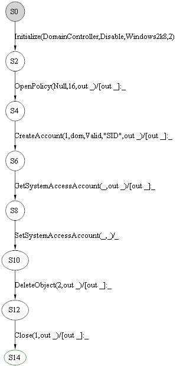

* The sequence starts with OpenPolicy method call, which opens the policy handle with the desired access given.

* CreateAccount method takes the policy handle opened by the previous method. The handle must be given the permission POLICY_CREATE_ACCOUNT. Incorrect permission value will fail this method with AccessDenied error code. Also, the Account Sid given as an input must be valid. Any invalid parameter as an input will result in InvalidParameter. Other return codes can be ObjectNameCollision where account object already exists, InvalidHandle where policy handle input is invalid and Success where the account object is created successfully.

* The next method in the sequence is GetSystemAccessAccount. GetSystemAccessAccount takes the account handle opened by the CreateAccount method. The handle must be given the permission ACCOUNT_VIEW. Incorrect permission value will fail this method with AccessDenied error code. Other return codes can be InvalidHandle where account handle input is invalid and Success where the system access rights are queried from the account successfully.

* The next method in the sequence is SetSystemAccessAccount. SetSystemAccessAccount takes the account handle opened by the CreateAccount method. The handle must be given the permission ACCOUNT_ADJUST_SYSTEM_ACCESS. Incorrect permission value will fail this method with AccessDenied error code. Also, the system access rights given as an input must be valid (within the range of set of system access rights). Any invalid parameter as an input will result in InvalidParameter. Other return codes can be InvalidHandle where account handle input is invalid and Success where the system access rights are set to the account successfully.

* The next method in the sequence is DeleteObject. Here DeleteObject takes the account handle opened by CreateAccount method. If the context handle passed as an input is not valid then it returns InvalidHandle error code. Other return code can be InvalidParameter where the handle passed is a policy handle, Success where the opened object is deleted successfully.

* The next method in the sequence is Close which takes the policy handle opened by OpenPolicy method. If the context handle passed as an input is not valid then it returns InvalidHandle error code. Other return code is Success where the resources held by the context handle are freed successfully.

**Scenario 9**

This is for enumerating the list of account objects in the server database by implementing EnumerateAccounts.

The basic message sequencing diagram for this scenario can be depicted as given below:

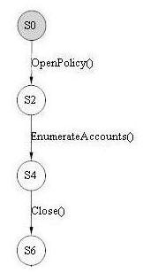

* The sequence starts with OpenPolicy method call, which opens the policy handle with the desired access given.

* EnumerateAccounts method takes the policy handle opened by the previous method. The handle must be given the permission POLICY_VIEW_LOCAL_INFORMATION. Incorrect permission value will fail this method with AccessDenied error code. Other return codes can be MoreEntries where complete accounts from the list of accounts are not enumerated, NoMoreEntries where no more accounts are there to be enumerated from the list, InvalidHandle where policy handle input is invalid and Success where the account objects is enumerated successfully.

* The next method in the sequence is Close which takes the policy handle opened by OpenPolicy method. If the context handle passed as an input is not valid then it returns InvalidHandle error code. Other return code is Success where the resources held by the context handle are freed successfully.

**Scenario 10**

This is for creating a new secret object with the specified constraints by calling CreateSecret, setting secret values for the secret object by calling SetSecret, querying the secret values from it by implementing QuerySecret, deleting the created secret object by passing the secret handle to DeleteObject and closing the open policy handle by calling Close.

The basic message sequencing diagram for this scenario can be depicted as given below:

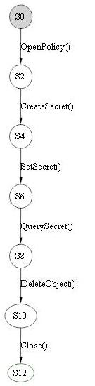

* The sequence starts with OpenPolicy method call, which opens the policy handle with the desired access given.

* CreateSecret method takes the policy handle opened by the previous method. The handle must be given the permission POLICY_CREATE_SECRET. Incorrect permission value will fail this method with AccessDenied error code. Also, the Secret name given as an input must be valid (must follow the syntax restrictions). Any invalid parameter as an input will result in InvalidParameter. Other return codes can be ObjectNameCollision where secret name passed already exists, NameTooLong where server does not allow secret name exceeding 128 characters, InvalidHandle where policy handle input is invalid and Success where the secret object is created successfully.

* The next method in the sequence is SetSecret. SetSecret takes the account handle opened by the CreateSecret method. The handle must be given the permission SECRET_SET_VALUE. Incorrect permission value will fail this method with AccessDenied error code. Also, the cipher current value and cipher old value given as an input must be valid. Any invalid parameter as an input will result in InvalidParameter. Other return codes can be InvalidHandle where secret handle input is invalid and Success where the cipher current value and cipher old values are set to the secret object successfully.

* The next method in the sequence is QuerySecret. QuerySecret takes the account handle opened by the CreateSecret method. The handle must be given the permission SECRET_QUERY_VALUE. Incorrect permission value will fail this method with AccessDenied error code. Other return codes can be InvalidHandle where secret handle input is invalid and Success where the cipher current value and cipher old values are queried from the secret object successfully.

* The next method in the sequence is DeleteObject. Here DeleteObject takes the secret handle opened by CreateSecret method. If the context handle passed as an input is not valid then it returns InvalidHandle error code. Other return code can be InvalidParameter where the handle passed is a policy handle, Success where the opened object is deleted successfully.

* The next method in the sequence is Close which takes the policy handle opened by OpenPolicy method. If the context handle passed as an input is not valid then it returns InvalidHandle error code. Other return code is Success where the resources held by the context handle are freed successfully.

**Scenario 11**

This is for creating a new secret object by calling CreateSecret, opening an existing secret object by calling OpenSecret, storing secret values to it by calling StorePrivateData (which encrypts the data to be stored and sends it on the wire), retrieving secret values from it by calling RetrievePrivateData, deleting the created secret object by calling DeleteObject with an secret handle as the parameter and closing the opened policy handle by calling Close.

The basic message sequencing diagram for this scenario can be depicted as given below:

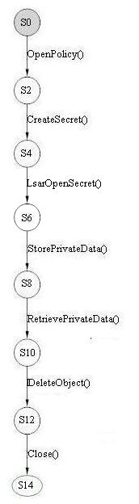

* The sequence starts with OpenPolicy method call, which opens the policy handle with the desired access given.

* CreateSecret method takes the policy handle opened by the previous method. The handle must be given the permission POLICY_CREATE_SECRET. Incorrect permission value will fail this method with AccessDenied error code. Also, the Secret name given as an input must be valid (must follow the syntax restrictions). Any invalid parameter as an input will result in InvalidParameter. Other return codes can be ObjectNameCollision where secret name passed already exists, NameTooLong where server does not allow secret name exceeding 128 characters, InvalidHandle where policy handle input is invalid and Success where the secret object is created successfully.

* LsarOpenSecret method takes the policy handle opened by the previous method. The Secret name given as an input must be valid (must follow the syntax restrictions). Any invalid parameter as an input will result in STATUS_INVALID_PARAMETER. The handle must be given the permission POLICY_CREATE_SECRET. Incorrect permission value will fail this method with STATUS_ACCESS_DENIED error code. Other return codes can be STATUS_OBJECT_NAME_NOT_FOUND where secret name passed does not exists, STATUS_INVALID_HANDLE where policy handle input is invalid and STATUS_SUCCESS where the secret object is opened successfully.

* The next method in the sequence is StorePrivateData. StorePrivateData takes the policy handle opened by the OpenPolicy method. The encrypted data is given as an input parameter. If encrypted data is not NULL and secret name passed as an input parameter does not exists then the policy handle must be given the permission POLICY_CREATE_SECRET. If encrypted data is not NULL and secret name passed as an input exists then the secret object must have its associative permission as SECRET_SET_VALUE. If encrypted data is NULL then the secret object must have its associative permission as DELETE. Incorrect permission value will fail this method with AccessDenied error code. Other return codes can be InvalidHandle where policy handle input is invalid and Success where the secret value is stored to the secret object successfully. 

* The next method in the sequence is RetrievePrivateData. RetrievePrivateData takes the policy handle opened by the OpenPolicy method. The encrypted data is given as an input parameter. The secret object must have its associative permission as SECRET_QUERY_VALUE. Incorrect permission value will fail this method with AccessDenied error code. Other return codes can be ObjectNameNotFound where the secret name passed as an input does not exists, InvalidHandle where policy handle input is invalid and Success where the secret value is stored to the secret object successfully.

* The next method in the sequence is DeleteObject. Here DeleteObject takes the secret handle opened by CreateSecret method. If the context handle passed as an input is not valid then it returns InvalidHandle error code. Other return code can be InvalidParameter where the handle passed is a policy handle, Success where the opened object is deleted successfully.

* The next method in the sequence is Close which takes the policy handle opened by OpenPolicy method. If the context handle passed as an input is not valid then it returns InvalidHandle error code. Other return code is Success where the resources held by the context handle are freed successfully.

**Scenario 12**

This is for creating a new trusted domain object (CreateTrustedDomain) using trusted domain information of type LSAPR_TRUST_INFORMATION structure, setting Policy Information on it using the InformationTypes provided in the TRUSTED_INFORMATION_CLASS by implementing SetTrustedDomainInfo, and finally deleting the created trusted domain object by passing the TrustedDomainHandle to DeleteTrustedDomain.

The basic message sequencing diagram for this scenario can be depicted as given below:

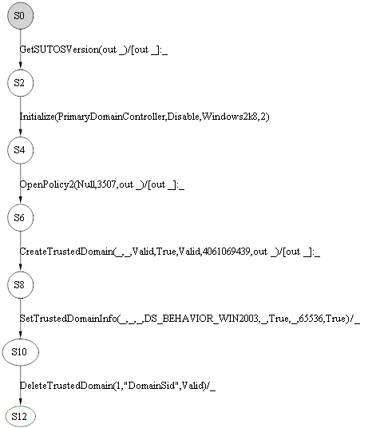

* The sequence starts with OpenPolicy2 method call, which opens the policy handle with the desired access given.

* CreateTrustedDomain method takes the policy handle opened by the previous method. The requested permission depends upon the trusted domain information class type. Incorrect permission value will fail this method with AccessDenied error code. The trusted domain information class type given as an input must be valid (must be within the enumeration range). Any invalid parameter as an input will result in InvalidParameter. Other return codes can be NotSupportedOnSBS where small business server 2003 does not support this operation, InvalidDomainState where this operation is cannot complete in the current state of the domain, InvalidSID where trusted domain Sid passed as an input is not valid, CurrentDomainNotAllowed where trust establishment on the current domain is not allowed, DirectoryServiceRequired where active directory service is not available on the server, ObjectNameCollision where the trusted domain name passed as an input already exists, InvalidHandle where policy handle input is invalid and Success where the trusted domain object is created successfully.

* SetTrustedDomainInfo method takes the policy handle opened by the previous method. The requested permission depends upon the trusted domain information class type. Incorrect permission value will fail this method with AccessDenied error code. The trusted domain information class type given as an input must be valid (must be within the enumeration range). Any invalid parameter as an input will result in InvalidParameter. Other return codes can be STATUS_NO_SUCH_DOMAIN where trusted domain name passed as an input does not exist in the trusted domain object database, InvalidHandle where policy handle input is invalid and Success where the trusted domain information is set in the trusted domain object successfully.

* DeleteTrustedDomain method takes the policy handle opened by the previous method. The caller must have TRUSTED_QUERY_DOMAIN_NAME and DELETE permissions to the trusted domain object. Incorrect permission value will fail this method with AccessDenied error code. The trusted domain Sid given as an input must be valid (must be in format of SID). Any invalid parameter as an input will result in InvalidParameter. Other return codes can be NoSuchDomain where trusted domain Sid passed as an input does not exist, InvalidHandle where policy handle input is invalid and Success where the trusted domain object is deleted from the trusted domain object successfully.

**Scenario 13**

Scenario 13 is used to create a Trusted Domain Object using CreateTrustedDomain, set the information on the object using SetTrustedDomainInfo and finally delete the Trusted Domain Object using DeleteTrustedDomain.

The basic message sequencing diagram for this scenario can be depicted as given below:

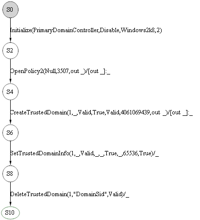

* The sequence starts with OpenPolicy2 method call, which opens the policy handle with the desired access given.

* CreateTrustedDomain method takes the policy handle opened by the previous method. The requested permission depends upon the trusted domain information class type. Incorrect permission value will fail this method with AccessDenied error code. The trusted domain information class type given as an input must be valid (must be within the enumeration range). Any invalid parameter as an input will result in InvalidParameter. Other return codes can be NotSupportedOnSBS where small business server 2003 does not support this operation, InvalidDomainState where this operation is cannot complete in the current state of the domain, InvalidSID where trusted domain Sid passed as an input is not valid, CurrentDomainNotAllowed where trust establishment on the current domain is not allowed, DirectoryServiceRequired where active directory service is not available on the server, ObjectNameCollision where the trusted domain name passed as an input already exists, InvalidHandle where policy handle input is invalid and Success where the trusted domain object is created successfully.

* SetTrustedDomainInfo method takes the policy handle opened by the previous method. The requested permission depends upon the trusted domain information class type. Incorrect permission value will fail this method with AccessDenied error code. The trusted domain information class type given as an input must be valid (must be within the enumeration range). Any invalid parameter as an input will result in InvalidParameter. Other return codes can be STATUS_NO_SUCH_DOMAIN where trusted domain name passed as an input does not exist in the trusted domain object database, InvalidHandle where policy handle input is invalid and Success where the trusted domain information is set in the trusted domain object successfully.

* DeleteTrustedDomain method takes the policy handle opened by the previous method. The caller must have TRUSTED_QUERY_DOMAIN_NAME and DELETE permissions to the trusted domain object. Incorrect permission value will fail this method with AccessDenied error code. The trusted domain Sid given as an input must be valid (must be in format of SID). Any invalid parameter as an input will result in InvalidParameter. Other return codes can be NoSuchDomain where trusted domain Sid passed as an input does not exist, InvalidHandle where policy handle input is invalid and Success where the trusted domain object is deleted from the trusted domain object successfully.

**Scenario 14**

This is for creating a new trusted domain object (CreateTrustedDomain) using trusted domain information of type LSAPR_TRUST_INFORMATION structure, querying Policy Information from it using the InformationTypes provided in the TRUSTED_INFORMATION_CLASS by implementing QueryTrustedDomainInfo, and finally deleting the created trusted domain object by passing the TrustedDomainHandle to DeleteTrustedDomain.

The basic message sequencing diagram for this scenario can be depicted as given below:

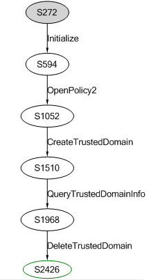

* The sequence starts with OpenPolicy2 method call, which opens the policy handle with the desired access given.

* CreateTrustedDomain method takes the policy handle opened by the previous method. The requested permission depends upon the trusted domain information class type. Incorrect permission value will fail this method with AccessDenied error code. The trusted domain information class type given as an input must be valid (must be within the enumeration range). Any invalid parameter as an input will result in InvalidParameter. Other return codes can be NotSupportedOnSBS where small business server 2003 does not support this operation, InvalidDomainState where this operation is cannot complete in the current state of the domain, InvalidSID where trusted domain Sid passed as an input is not valid, CurrentDomainNotAllowed where trust establishment on the current domain is not allowed, DirectoryServiceRequired where active directory service is not available on the server, ObjectNameCollision where the trusted domain name passed as an input already exists, InvalidHandle where policy handle input is invalid and Success where the trusted domain object is created successfully.

* QueryTrustedDomainInfo method takes the policy handle opened by the previous method. The requested permission depends upon the trusted domain information class type. Incorrect permission value will fail this method with AccessDenied error code. The trusted domain information class type given as an input must be valid (must be within the enumeration range). Any invalid parameter as an input will result in InvalidParameter. Other return codes can be NoSuchDomain where trusted domain name passed as an input does not exist in the trusted domain object database, NotImplemented where the specified trusted domain information type is not supported by the server, InvalidHandle where policy handle input is invalid and Success where the trusted domain information is queried from the trusted domain object successfully.

* DeleteTrustedDomain method takes the policy handle opened by the previous method. The caller must have TRUSTED_QUERY_DOMAIN_NAME and DELETE permissions to the trusted domain object. Incorrect permission value will fail this method with AccessDenied error code. The trusted domain Sid given as an input must be valid (must be in format of SID). Any invalid parameter as an input will result in InvalidParameter. Other return codes can be NoSuchDomain where trusted domain Sid passed as an input does not exist, InvalidHandle where policy handle input is invalid and Success where the trusted domain object is deleted from the trusted domain object successfully.

**Scenario 15**

This is for creating a trusted domain object (CreateTrustedDomain), opening an existing trusted domain object by its NetBios Name (OpenTrustedDomainByName), setting Policy information pertaining to a domain using the domain name of opened trusted domain object (SetTrustedDomainInfoByName), and finally deleting the opened trusted domain object by calling DeleteTrustedDoman with the TrustDomainHandle as the parameter.

The basic message sequencing diagram for this scenario can be depicted as given below:                                            

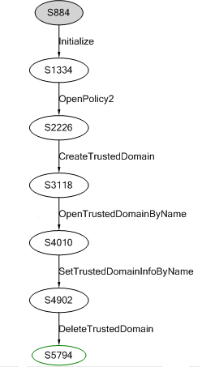

* The sequence starts with OpenPolicy2 method call, which opens the policy handle with the desired access given.

* CreateTrustedDomain method takes the policy handle opened by the previous method. The requested permission depends upon the trusted domain information class type. Incorrect permission value will fail this method with AccessDenied error code. The trusted domain information class type given as an input must be valid (must be within the enumeration range). Any invalid parameter as an input will result in InvalidParameter. Other return codes can be NotSupportedOnSBS where small business server 2003 does not support this operation, InvalidDomainState where this operation is cannot complete in the current state of the domain, InvalidSID where trusted domain Sid passed as an input is not valid, CurrentDomainNotAllowed where trust establishment on the current domain is not allowed, DirectoryServiceRequired where active directory service is not available on the server, ObjectNameCollision where the trusted domain name passed as an input already exists, InvalidHandle where policy handle input is invalid and Success where the trusted domain object is created successfully.

* OpenTrustedDomainByName method takes the policy handle opened by the previous method. The desired access for the trusted domain handle must be allowed by the security descriptor of trusted domain object. Incorrect permission value will fail this method with AccessDenied error code. The trusted domain name given as an input must be valid (must follow the syntax of Unicode string). Any invalid parameter as an input will result in InvalidParameter. Other return codes can be ObjectNameNotFound where the trusted domain name passed as an input does not exist, InvalidHandle where policy handle input is invalid and Success where the trusted domain object is opened successfully.

* SetTrustedDomainInfoByName method takes the policy handle opened by the previous method. The requested permission depends upon the trusted domain information class type. Incorrect permission value will fail this method with AccessDenied error code. The trusted domain information class type given as an input must be valid (must be within the enumeration range). Any invalid parameter as an input will result in InvalidParameter. Other return codes can be ObjectNameNotFound where trusted domain name passed as an input does not exist in the trusted domain object database, InvalidDomainState, where the domain is in the wrong state to perform the operation, InvalidHandle where policy handle input is invalid and Success where the trusted domain information is set in the trusted domain object successfully.

* DeleteTrustedDomain method takes the policy handle opened by the previous method. The caller must have TRUSTED_QUERY_DOMAIN_NAME and DELETE permissions to the trusted domain object. Incorrect permission value will fail this method with AccessDenied error code. The trusted domain Sid given as an input must be valid (must be in format of SID). Any invalid parameter as an input will result in InvalidParameter. Other return codes can be NoSuchDomain where trusted domain Sid passed as an input does not exist, InvalidHandle where policy handle input is invalid and Success where the trusted domain object is deleted from the trusted domain object successfully.

**Scenario 16**

This is for creating a trusted domain object (CreateTrustedDomain), querying information from the trust domain object using the NetBios name of the Domain (QueryTrustedDomainInfoByName), and finally deleting the opened trusted domain object by calling DeletetrustedDomain with the TrustDomainHandle as the parameter.

The basic message sequencing diagram for this scenario can be depicted as given below:                                            

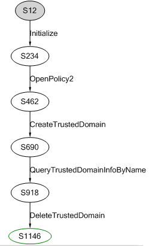

* The sequence starts with OpenPolicy2 method call, which opens the policy handle with the desired access given.

* CreateTrustedDomain method takes the policy handle opened by the previous method. The requested permission depends upon the trusted domain information class type. Incorrect permission value will fail this method with AccessDenied error code. The trusted domain information class type given as an input must be valid (must be within the enumeration range). Any invalid parameter as an input will result in InvalidParameter. Other return codes can be NotSupportedOnSBS where small business server 2003 does not support this operation, InvalidDomainState where this operation is cannot complete in the current state of the domain, InvalidSID where trusted domain Sid passed as an input is not valid, CurrentDomainNotAllowed where trust establishment on the current domain is not allowed, DirectoryServiceRequired where active directory service is not available on the server, ObjectNameCollision where the trusted domain name passed as an input already exists, InvalidHandle where policy handle input is invalid and Success where the trusted domain object is created successfully.

* QueryTrustedDomainInfoByName method takes the policy handle opened by the previous method. The requested permission depends upon the trusted domain information class type. Incorrect permission value will fail this method with AccessDenied error code. The trusted domain information class type given as an input must be valid (must be within the enumeration range). Any invalid parameter as an input will result in InvalidParameter. Other return codes can be ObjectNameNotFound where trusted domain name passed as an input does not exist in the trusted domain object database, InvalidInfoClass where the specified trusted domain information class type is not supported by the server, InvalidHandle where policy handle input is invalid and Success where the trusted domain information is queried from the trusted domain object successfully.

* DeleteTrustedDomain method takes the policy handle opened by the previous method. The caller must have TRUSTED_QUERY_DOMAIN_NAME and DELETE permissions to the trusted domain object. Incorrect permission value will fail this method with AccessDenied error code. The trusted domain Sid given as an input must be valid (must be in format of SID). Any invalid parameter as an input will result in InvalidParameter. Other return codes can be NoSuchDomain where trusted domain Sid passed as an input does not exist, InvalidHandle where policy handle input is invalid and Success where the trusted domain object is deleted from the trusted domain object successfully.

**Scenario 17**

This is for creating a new trusted domain object (CreateTrustedDomainEx) using trusted domain information type of LSAPR_TRUST_INFORMATION_EX structure and authentication information type of LSAPR_TRUSTED_DOMAIN_AUTH_INFORMATION, setting policy information related to the trust domain using the trusted domain object (SetInformationTrustedDomain), and finally deleting the created trusted domain object by calling DeleteTrustedDomain.

The basic message sequencing diagram for this scenario can be depicted as given below:

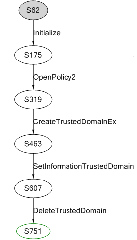

* The sequence starts with OpenPolicy2 method call, which opens the policy handle with the desired access given.

* CreateTrustedDomainEx method takes the policy handle opened by the previous method. The requested permission depends upon the trusted domain information class type. Incorrect permission value will fail this method with AccessDenied error code. The trusted domain information class type given as an input must be valid (must be within the enumeration range). Any invalid parameter as an input will result in InvalidParameter. Other return codes can be STATUS_NOT_SUPPORTED_ON_SBS where small business server 2003 does not support this operation, InvalidDomainState where this operation is cannot complete in the current state of the domain, InvalidSID where trusted domain Sid passed as an input is not valid, CurrentDomainNotAllowed where trust establishment on the current domain is not allowed, DirectoryServiceRequired where active directory service is not available on the server, ObjectNameCollision where the trusted domain name passed as an input already exists, InvalidHandle where policy handle input is invalid and Success where the trusted domain object is created successfully.

* SetInformationTrustedDomain method takes the trusted domain handle opened by the CreateTrustedDomainEx method. The requested permission depends upon the trusted domain information class type. Incorrect permission value will fail this method with AccessDenied error code. The trusted domain information class type given as an input must be valid (must be within the enumeration range). Any invalid parameter as an input will result in InvalidParameter. Other return codes can be ObjectNameNotFound where trusted domain name passed as an input to set is not supported by the server, InvalidDomainState where the domain is in the wrong state to perform the operation, InvalidHandle where trusted domain handle input is invalid and Success where the trusted domain information is set in the trusted domain object successfully.

* DeleteTrustedDomain method takes the policy handle opened by the previous method. The caller must have TRUSTED_QUERY_DOMAIN_NAME and DELETE permissions to the trusted domain object. Incorrect permission value will fail this method with AccessDenied error code. The trusted domain Sid given as an input must be valid (must be in format of SID). Any invalid parameter as an input will result in InvalidParameter. Other return codes can be NoSuchDomain where trusted domain Sid passed as an input does not exist, InvalidHandle where policy handle input is invalid and Success where the trusted domain object is deleted from the trusted domain object successfully.

**Scenario 18**

This is for creating a new trusted domain object (CreateTrustedDomainEx) using trusted domain information type of LSAPR_TRUST_INFORMATION_EX structure and authentication information type of LSAPR_TRUSTED_DOMAIN_AUTH_INFORMATION, querying trust information from it using the trusted domain object (QueryInfoTrustedDomain), and finally deleting the created trusted domain object by calling DeleteTrustedDomain.

The basic message sequencing diagram for this scenario can be depicted as given below:

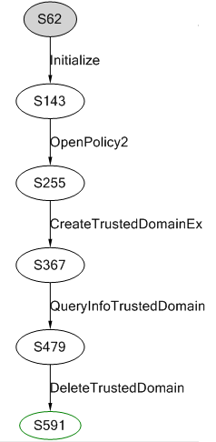

* The sequence starts with OpenPolicy2 method call, which opens the policy handle with the desired access given.

* CreateTrustedDomainEx method takes the policy handle opened by the previous method. The requested permission depends upon the trusted domain information class type. Incorrect permission value will fail this method with AccessDenied error code. The trusted domain information class type given as an input must be valid (must be within the enumeration range). Any invalid parameter as an input will result in InvalidParameter. Other return codes can be STATUS_NOT_SUPPORTED_ON_SBS where small business server 2003 does not support this operation, InvalidDomainState where this operation is cannot complete in the current state of the domain, InvalidSID where trusted domain Sid passed as an input is not valid, CurrentDomainNotAllowed where trust establishment on the current domain is not allowed, DirectoryServiceRequired where active directory service is not available on the server, ObjectNameCollision where the trusted domain name passed as an input already exists, InvalidHandle where policy handle input is invalid and Success where the trusted domain object is created successfully.

* QueryInfoTrustedDomain method takes the trusted domain handle opened by the CreateTrustedDomainEx method. The requested permission depends upon the trusted domain information class type. Incorrect permission value will fail this method with AccessDenied error code. The trusted domain information class type given as an input must be valid (must be within the enumeration range). Any invalid parameter as an input will result in InvalidParameter. Other return codes can be InvalidInfoClass where the specified trusted domain information class type is not supported by the server, InvalidHandle where trusted domain handle input is invalid and Success where the trusted domain information is queried from the trusted domain object successfully. 

* DeleteTrustedDomain method takes the policy handle opened by the previous method. The caller must have TRUSTED_QUERY_DOMAIN_NAME and DELETE permissions to the trusted domain object. Incorrect permission value will fail this method with AccessDenied error code. The trusted domain Sid given as an input must be valid (must be in format of SID). Any invalid parameter as an input will result in InvalidParameter. Other return codes can be NoSuchDomain where trusted domain Sid passed as an input does not exist, InvalidHandle where policy handle input is invalid and Success where the trusted domain object is deleted from the trusted domain object successfully.

**Scenario 19**

This is for creating a new trusted domain object (CreateTrustedDomainEx2) using trusted domain information type of LSAPR_TRUST_INFORMATION_EX structure and authentication information type of LSAPR_TRUSTED_DOMAIN_AUTH_INFORMATION_INTERNAL, obtaining a handle to the Created Object using OpenTrustedDomain, and finally deleting the newly created trusted domain object using DeleteTrustedDomain method.

The basic message sequencing diagram for this scenario can be depicted as given below:

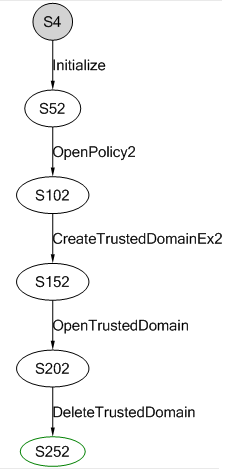

* The sequence starts with OpenPolicy2 method call, which opens the policy handle with the desired access given.

* CreateTrustedDomainEx2 method takes the policy handle opened by the previous method. The requested permission depends upon the trusted domain information class type. Incorrect permission value will fail this method with AccessDenied error code. The trusted domain information class type given as an input must be valid (must be within the enumeration range). Any invalid parameter as an input will result in InvalidParameter. Other return codes can be NotSupportedOnSBS where small business server 2003 does not support this operation, InvalidDomainState where this operation is cannot complete in the current state of the domain, InvalidSID where trusted domain Sid passed as an input is not valid, CurrentDomainNotAllowed where trust establishment on the current domain is not allowed, DirectoryServiceRequired where active directory service is not available on the server, ObjectNameCollision where the trusted domain name passed as an input already exists, InvalidHandle where policy handle input is invalid and Success where the trusted domain object is created successfully.

* OpenTrustedDomain method takes the policy handle opened by the previous method. The requested permission must be allowed by the trusted domain object’s discretionary access control list. Incorrect permission value will fail this method with AccessDenied error code. The trusted domain Sid given as an input must be valid (must be in format of a SID). Any invalid parameter as an input will result in InvalidParameter. Other return codes can be NoSuchDomain where the trusted domain Sid passed as an input does not exist, DirectoryServiceRequired where there is no active directory in the server, InvalidHandle where policy handle input is invalid and Success where the trusted domain object is created successfully.

* DeleteTrustedDomain method takes the policy handle opened by the previous method. The caller must have TRUSTED_QUERY_DOMAIN_NAME and DELETE permissions to the trusted domain object. Incorrect permission value will fail this method with AccessDenied error code. The trusted domain Sid given as an input must be valid (must be in format of SID). Any invalid parameter as an input will result in InvalidParameter. Other return codes can be NoSuchDomain where trusted domain Sid passed as an input does not exist, InvalidHandle where policy handle input is invalid and Success where the trusted domain object is deleted from the trusted domain object successfully.

**Scenario 20**

This is for creating a trusted domain object (CreatTrustedDomainEx), setting information about a trust relationship with another forest by calling SetForestTrustInformation, and querying trust information with another forest by implementing QueryForestTrustInformation, and finally deleting the created trusted domain object by calling DeleteTrustedDomain.

The basic message sequencing diagram for this scenario can be depicted as given below:                                                     

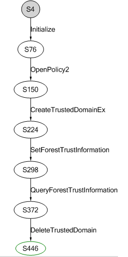

* The sequence starts with OpenPolicy2 method call, which opens the policy handle with the desired access given.

* CreateTrustedDomainEx method takes the policy handle opened by the previous method. The requested permission depends upon the trusted domain information class type. Incorrect permission value will fail this method with AccessDenied error code. The trusted domain information class type given as an input must be valid (must be within the enumeration range). Any invalid parameter as an input will result in InvalidParameter. Other return codes can be STATUS_NOT_SUPPORTED_ON_SBS where small business server 2003 does not support this operation, InvalidDomainState where this operation is cannot complete in the current state of the domain, InvalidSID where trusted domain Sid passed as an input is not valid, CurrentDomainNotAllowed where trust establishment on the current domain is not allowed, DirectoryServiceRequired where active directory service is not available on the server, ObjectNameCollision where the trusted domain name passed as an input already exists, InvalidHandle where policy handle input is invalid and Success where the trusted domain object is created successfully.

* SetForestTrustInformation method takes the policy handle opened by the previous method. The caller must have TRUSTED_SET_AUTH to the trusted domain object. Incorrect permission value will fail this method with AccessDenied error code. If the TRUST_ATTRIBUTE_FOREST_TRANSITIVE attribute is not set or the highest record type value is greater in values than the value recognized by the server then it will result in InvalidParameter. Other return codes can be NoSuchDomain where trusted domain name passed as an input does not exist, InvalidDomainState where the server is not a trusted domain object in the root domain of the forest, InvalidDomainRole where the server is not a primary domain controller, InvalidHandle where policy handle input is invalid and Success where the forest trust information is set successfully.

* QueryForestTrustInformation method takes the policy handle opened by the previous method. The caller must have TRUSTED_QUERY_AUTH to the trusted domain object. Incorrect permission value will fail this method with AccessDenied error code. The trusted domain object is not of the type that which supports a forest trust then it will result in InvalidParameter. Other return codes can be NoSuchDomain where trusted domain name passed as an input does not exist, InvalidDomainState where the server is not a domain controller, NotFound where the forest trust information does not exist, InvalidHandle where policy handle input is invalid and Success where the forest trust information is queried successfully.

* DeleteTrustedDomain method takes the policy handle opened by the previous method. The caller must have TRUSTED_QUERY_DOMAIN_NAME and DELETE permissions to the trusted domain object. Incorrect permission value will fail this method with AccessDenied error code. The trusted domain Sid given as an input must be valid (must be in format of SID). Any invalid parameter as an input will result in InvalidParameter. Other return codes can be NoSuchDomain where trusted domain Sid passed as an input does not exist, InvalidHandle where policy handle input is invalid and Success where the trusted domain object is deleted from the trusted domain object successfully.

**Scenario 21**

This is for privileges look up based on their LUID (LookUpPrivilegeName), based on their name (LookUpPrivilegeValue) and based on Client language (LookUpPrivlegeDisplayName).

The basic message sequencing diagram for this scenario can be depicted as given below:

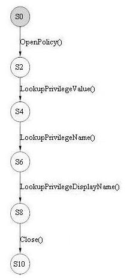

* The sequence starts with OpenPolicy method call, which opens the policy handle with the desired access given.

* LookUpPrivilegeValue method takes the policy handle opened by the previous method. The handle must be given permission POLICY_LOOKUP_NAMES. Incorrect permission value will fail this method with AccessDenied error code. If the privilege name passed as an input is invalid (not following the syntax of a Unicode string) then it will result in InvalidParameter. Other return codes can be NoSuchPrivilege where privilege name passed as an input is not recognized by server, InvalidHandle where policy handle input is invalid and Success where the privilege name is converted to privilege LUID successfully.

* LookUpPrivilegeName method takes the policy handle opened by the previous method. The handle must be given permission POLICY_LOOKUP_NAMES. Incorrect permission value will fail this method with AccessDenied error code. If the privilege LUID passed as an input is invalid (not following the format of LUID) then it will result in InvalidParameter. Other return codes can be NoSuchPrivilege where privilege name passed as an input is not recognized by server, InvalidHandle where policy handle input is invalid and Success where the LUID of privilege is converted to privilege name successfully.

* LookUpPrivilegeDisplayName method takes the policy handle opened by the previous method. The handle must be given permission POLICY_LOOKUP_NAMES. Incorrect permission value will fail this method with AccessDenied error code. If the privilege name passed as an input is invalid (not following the syntax of a Unicode string) then it will result in InvalidParameter. Other return codes can be NoSuchPrivilege where privilege name passed as an input is not recognized by server, InvalidHandle where policy handle input is invalid and Success where the privilege name is converted to display text string successfully.

* The next method in the sequence is Close which takes the policy handle opened by OpenPolicy method. If the context handle passed as an input is not valid then it returns InvalidHandle error code. Other return code is Success where the resources held by the context handle are freed successfully.

**Scenario 22**

This is for creating a new account object by calling CreateAccount, creating a trusted domain object by calling CreateTrustedDomain, querying security information from the account object by calling QuerySecurityObject, setting security descriptor for it by implementing SetSecurityObject, deleting the newly created account object by calling DeleteObject with the account handle as the parameter, and finally closing the open policy handle by calling Close.

The basic message sequencing diagram for this scenario can be depicted as given below:

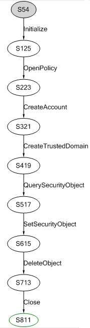

* The sequence starts with OpenPolicy method call, which opens the policy handle with the desired access given.

* CreateAccount method takes the policy handle opened by the previous method. The handle must be given the permission POLICY_CREATE_ACCOUNT. Incorrect permission value will fail this method with AccessDenied error code. Also, the Account Sid given as an input must be valid. Any invalid parameter as an input will result in InvalidParameter. Other return codes can be ObjectNameCollision where account object already exists, InvalidHandle where policy handle input is invalid and Success where the account object is created successfully.

* CreateTrustedDomain method takes the policy handle opened by the previous method. The requested permission depends upon the trusted domain information class type. Incorrect permission value will fail this method with AccessDenied error code. The trusted domain information class type given as an input must be valid (must be within the enumeration range). Any invalid parameter as an input will result in InvalidParameter. Other return codes can be NotSupportedOnSBS where small business server 2003 does not support this operation, InvalidDomainState where this operation is cannot complete in the current state of the domain, InvalidSID where trusted domain Sid passed as an input is not valid, CurrentDomainNotAllowed where trust establishment on the current domain is not allowed, DirectoryServiceRequired where active directory service is not available on the server, ObjectNameCollision where the trusted domain name passed as an input already exists, InvalidHandle where policy handle input is invalid and Success where the trusted domain object is created successfully.

* The next method in the sequence is QuerySecurityObject. QuerySecurityObject takes the account handle opened by the CreateAccount method. The handle must have the permission depending upon the security information passed as an input. Incorrect permission value will fail this method with AccessDenied error code. Other return codes can be NotSupported where the server does not support this operation, InvalidHandle where object handle input is invalid and Success where the security descriptor is set on an object successfully.

* The next method in the sequence is SetSecurityObject. SetSecurityObject takes the account handle opened by the CreateAccount method. The handle must have the permission depending upon the security information passed as an input. Incorrect permission value will fail this method with AccessDenied error code. The Security descriptor passed as an input must be valid; otherwise it will result in InvalidSecurityDescr. The Security descriptor passed as an input is NULL then it will result in InvalidParameter. Other return codes can be STATUS_NOT_SUPPORTED where the server does not support this operation, InvalidHandle where object handle input is invalid and Success where the security descriptor is set on an object successfully.

* The next method in the sequence is DeleteObject. Here DeleteObject takes the secret handle opened by CreateAccount method. If the context handle passed as an input is not valid then it returns InvalidHandle error code. Other return code can be InvalidParameter where the handle passed is a policy handle, Success where the opened object is deleted successfully.

* The next method in the sequence is Close which takes the policy handle opened by OpenPolicy method. If the context handle passed as an input is not valid then it returns InvalidHandle error code. Other return code is Success where the resources held by the context handle are freed successfully.

**Scenario 23**

This is for enumerating trusted domain objects in the server’s database.

The basic message sequencing diagram for this scenario can be depicted as given below:

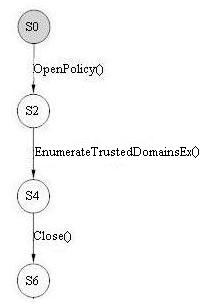

* The sequence starts with OpenPolicy method call, which opens the policy handle with the desired access given.

* EnumerateTrustedDomainsEx method takes the policy handle opened by the previous method. The handle must be given the permission POLICY_VIEW_LOCAL_INFORMATION. Incorrect permission value will fail this method with AccessDenied error code. Other return codes can be MoreEntries where complete accounts from the list of accounts are not enumerated, NoMoreEntries where no more accounts are there to be enumerated from the list, InvalidHandle where policy handle input is invalid and Success where the account objects is enumerated successfully. 

* The next method in the sequence is Close which takes the policy handle opened by OpenPolicy method. If the context handle passed as an input is not valid then it returns InvalidHandle error code. Other return code is Success where the resources held by the context handle are freed successfully.

**Scenario 24**

This is for requesting list of trusted domain objects from the server’s database.

The basic message sequencing diagram for this scenario can be depicted as given below:

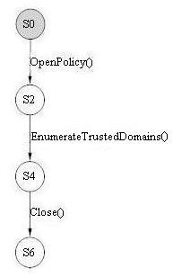

* The sequence starts with OpenPolicy method call, which opens the policy handle with the desired access given.

* EnumerateTrustedDomains method takes the policy handle opened by the previous method. The handle must be given the permission POLICY_VIEW_LOCAL_INFORMATION. Incorrect permission value will fail this method with AccessDenied error code. Other return codes can be MoreEntries where complete accounts from the list of accounts are not enumerated, NoMoreEntries where no more accounts are there to be enumerated from the list, InvalidHandle where policy handle input is invalid and Success where the account objects is enumerated successfully.

* The next method in the sequence is Close which takes the policy handle opened by OpenPolicy method. If the context handle passed as an input is not valid then it returns InvalidHandle error code. Other return code is Success where the resources held by the context handle are freed successfully.

**Scenario 25**

This is for creating a new account object by calling CreateAccount, adding user rights to account, enumerate account rights from it, enumerating accounts that have a specific account right by implementing EnumerateAccountsWithUserRight, deleting the created account object by passing the account handle to DeleteObject and closing the open policy handle by calling Close.

The basic message sequencing diagram for this scenario can be depicted as given below:

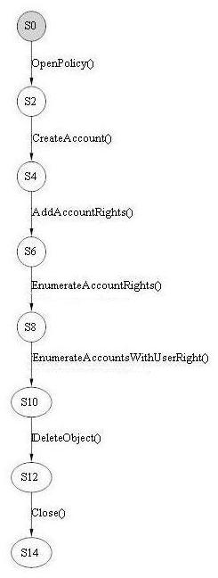

* The sequence starts with OpenPolicy method call, which opens the policy handle with the desired access given.

* CreateAccount method takes the policy handle opened by the previous method. The handle must be given the permission POLICY_CREATE_ACCOUNT. Incorrect permission value will fail this method with AccessDenied error code. Also, the Account Sid given as an input must be valid. Any invalid parameter as an input will result in InvalidParameter. Other return codes can be ObjectNameCollision where account object already exists, InvalidHandle where policy handle input is invalid and Success where the account object is created successfully.

* The next method in the sequence is AddAccountRights. AddAccountRights takes the policy handle opened by the OpenPolicy method. The Account Sid given as an input must be valid. Any invalid parameter as an input will result in InvalidParameter. If the account Sid passed does not exists then policy handle must be given the permission POLICY_CREATE_ACCOUNT and if account Sid exists then the permissions associative to the account Sid passed should be ACCOUNT_ADJUST_PRIVILEGES, ACCOUNT_ADJUST_SYSTEM_ACCESS and ACCOUNT_VIEW. Incorrect permission values will fail this method with AccessDenied error code. Other return codes can NoSuchPrivilege where account rights passed are not valid, InvalidHandle where policy handle input is invalid and Success where the system access rights and privileges are added to the account successfully.

* The next method in the sequence is EnumerateAccountRights. EnumerateAccountRights takes the policy handle opened by the OpenPolicy method. The Account Sid given as an input must be valid. Any invalid parameter as an input will result in InvalidParameter. The permission associative to the account Sid passed should be ACCOUNT_VIEW. Incorrect permission value will fail this method with AccessDenied error code. Other return codes can be ObjectNameNotFound where the object with account Sid passed does not exist, InvalidHandle where policy handle input is invalid and Success where the account rights are enumerated from the account successfully.

* The next method in the sequence is EnumerateAccountWithUserRights. EnumerateAccountWithUserRights takes the policy handle opened by the OpenPolicy method. Incorrect permission value will fail this method with AccessDenied error code. The handle must be given permission of POLICY_VIEW_LOCAL_INFORMATION. The Account rights given as an input must be valid. Any invalid parameter as an input will result in InvalidParameter. Other return codes can be NoSuchPrivilege where the Account right passed does not exist in list of account rights, NoMoreEntries where no more accounts are there to be enumerated, InvalidHandle where policy handle input is invalid and Success where the accounts are enumerated from the account successfully.

* The next method in the sequence is DeleteObject. Here DeleteObject takes the account handle opened by CreateAccount method. If the context handle passed as an input is not valid then it returns InvalidHandle error code. Other return code can be InvalidParameter where the handle passed is a policy handle, Success where the opened object is deleted successfully.

* The next method in the sequence is Close which h takes the policy handle opened by OpenPolicy method. If the context handle passed as an input is not valid then it returns InvalidHandle error code. Other return code is Success where the resources held by the context handle are freed successfully.

**Scenario 26**

This is for getting policy handle by calling actions OpenPolicy and OpenPolicy2. 

The basic message sequencing diagram for this scenario can be depicted as given below:

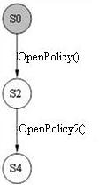

* The sequence starts with the calling of OpenPolicy method which opens the policy handle with the desired access given.

* The next action in the sequence is OpenPolicy2 method which opens the policy handle with the desired access given.

**Scenario 27**

This is for requesting list of trusted domain objects from the server’s database.

The basic message sequencing diagram for this scenario can be depicted as given below: 

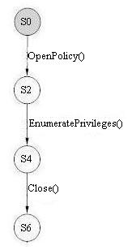

* The sequence starts with OpenPolicy method call, which opens the policy handle with the desired access given.

* EnumeratePrivileges method takes the policy handle opened by the previous method. The handle must be given permission POLICY_VIEW_LOCAL_INFORMATION. Incorrect permission value will fail this method with AccessDenied error code. If enumeration context passed as input is NULL then it will result in InvalidParameter. Other return codes can be MoreEntries where not all privileges are enumerated from the system, NoMoreEntries where there are no more privileges to be enumerated, InvalidHandle where policy handle input is invalid and Success where the privileges from the system are enumerated successfully.

* The next method in the sequence is Close which takes the policy handle opened by OpenPolicy method. If the context handle passed as an input is not valid then it returns InvalidHandle error code. Other return code is Success where the resources held by the context handle are freed successfully.

**Scenario 30**

This is for creating a new trusted domain object twice by calling CreateTrustedDomain twice, then by CreateTrustedDomainEx and CreateTrustedDomainEx2 to validate objectNameCollision return value case, setting forest trust information of trusted domain object by calling SetForestTrustInformation and querying forest trust information of trusted domain object by calling QueryForestTrustInformation for objects that does not have the forest attributes enabled, and finally deleting the created trusted domain object by calling DeleteTrustedDomain.

The basic message sequencing diagram for this scenario can be depicted as given below:           

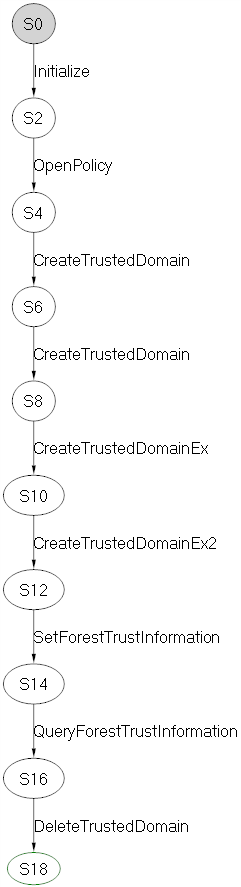

* The sequence starts with OpenPolicy method call, which opens the policy handle with the desired access given.

* CreateTrustedDomain method takes the policy handle opened by the previous method. The requested permission depends upon the trusted domain information class type. Incorrect permission value will fail this method with AccessDenied error code. The trusted domain information class type given as an input must be valid (must be within the enumeration range). Any invalid parameter as an input will result in InvalidParameter. Other return codes can be NotSupportedOnSBS where small business server 2003 does not support this operation, InvalidDomainState where this operation is cannot complete in the current state of the domain, InvalidSID where trusted domain Sid passed as an input is not valid, CurrentDomainNotAllowed where trust establishment on the current domain is not allowed, DirectoryServiceRequired where active directory service is not available on the server, ObjectNameCollision where the trusted domain name passed as an input already exists, InvalidHandle where policy handle input is invalid and Success where the trusted domain object is created successfully. This method is called again to get objectNameCollision return value.

* CreateTrustedDomainEx method takes the policy handle opened by the previous method. This method is called to create the same trusted domain object created by first call of CreateTrustedDomain to get objectNameCollision return value.

* CreateTrustedDomainEx2 method takes the policy handle opened by the previous method. This method is called to create the same trusted domain object created by first call of CreateTrustedDomain to get objectNameCollision return value.

* SetForestTrustInformation method takes the policy handle opened by the previous method. The caller must have TRUSTED_SET_AUTH to the trusted domain object. Incorrect permission value will fail this method with AccessDenied error code. If the TRUST_ATTRIBUTE_FOREST_TRANSITIVE attribute is not set or the highest record type value is greater in values than the value recognized by the server then it will result in InvalidParameter. Other return codes can be NoSuchDomain where trusted domain name passed as an input does not exist, InvalidDomainState where the server is not a trusted domain object in the root domain of the forest, InvalidDomainRole where the server is not a primary domain controller, InvalidHandle where policy handle input is invalid and Success where the forest trust information is set successfully.

* QueryForestTrustInformation method takes the policy handle opened by the previous method. The caller must have TRUSTED_QUERY_AUTH to the trusted domain object. Incorrect permission value will fail this method with AccessDenied error code. The trusted domain object is not of the type that which supports a forest trust then it will result in InvalidParameter. Other return codes can be NoSuchDomain where trusted domain name passed as an input does not exist, InvalidDomainState where the server is not a domain controller, NotFound where the forest trust information does not exist, InvalidHandle where policy handle input is invalid and Success where the forest trust information is queried successfully.

* The next method in the sequence is DeleteTrustedDomain. Here DeleteTrustedDomain takes the trusted handle opened by CreateTrustedDomain method. If the context handle passed as an input is not valid then it returns InvalidHandle error code. Other return code can be InvalidParameter where the handle passed is a policy handle, Success where the opened object is deleted successfully.

**Scenario 31**

This is for creating a new trusted domain object twice by calling CreateTrustedDomain, then by CreateTrustedDomainEx and CreateTrustedDomainEx2 to validate objectNameCollision return value case, opening the created trusted domain object by calling OpenTrustedDomain, setting forest trust information of trusted domain object by calling SetForestTrustInformation querying the forest trust information of the created trusted domain object by calling QueryForestTrustInformation, and finally deleting the created trusted domain object by calling DeleteTrustedDomain. This scenario is to run on Non Domain controller.

The basic message sequencing diagram for this scenario can be depicted as given below:

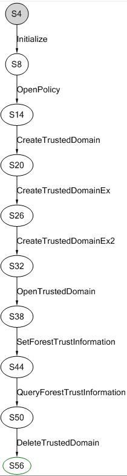

* The sequence starts with OpenPolicy method call, which opens the policy handle with the desired access given.

* CreateTrustedDomain method takes the policy handle opened by the previous method. The requested permission depends upon the trusted domain information class type. Incorrect permission value will fail this method with AccessDenied error code. The trusted domain information class type given as an input must be valid (must be within the enumeration range). Any invalid parameter as an input will result in InvalidParameter. Other return codes can be NotSupportedOnSBS where small business server 2003 does not support this operation, InvalidDomainState where this operation is cannot complete in the current state of the domain, InvalidSID where trusted domain Sid passed as an input is not valid, CurrentDomainNotAllowed where trust establishment on the current domain is not allowed, DirectoryServiceRequired where active directory service is not available on the server, ObjectNameCollision where the trusted domain name passed as an input already exists, InvalidHandle where policy handle input is invalid and Success where the trusted domain object is created successfully. This method is called again to get objectNameCollision return value.

* CreateTrustedDomainEx method takes the policy handle opened by the previous method. This method is called to create the same trusted domain object created by first call of CreateTrustedDomain to get objectNameCollision return value.

* CreateTrustedDomainEx2 method takes the policy handle opened by the previous method. This method is called to create the same trusted domain object created by first call of CreateTrustedDomain to get objectNameCollision return value.

* OpenTrustedDomain method takes the policy handle opened by OpenPolicy2 method. The requested permission depends upon the trusted domain object’s DACL. If DACL does not allow the request the method fails with AccessDenied error code. The trusted domain sid given as an input must be valid. Any invalid parameter as an input will result in InvalidParameter. Other return codes can be NoSuchDomain where passed in trusted domain sid does not exist, DirectoryServiceRequired where server is non domain controller, InvalidHandle where policy handle input is invalid and Success where the trusted domain object is opened successfully.

* SetForestTrustInformation method takes the policy handle opened by the previous method. The caller must have TRUSTED_SET_AUTH to the trusted domain object. Incorrect permission value will fail this method with AccessDenied error code. If the TRUST_ATTRIBUTE_FOREST_TRANSITIVE attribute is not set or the highest record type value is greater in values than the value recognized by the server then it will result in InvalidParameter. Other return codes can be NoSuchDomain where trusted domain name passed as an input does not exist, InvalidDomainState where the server is not a trusted domain object in the root domain of the forest, InvalidDomainRole where the server is not a primary domain controller, InvalidHandle where policy handle input is invalid and Success where the forest trust information is set successfully.

* QueryForestTrustInformation method takes the policy handle opened by the previous method. The caller must have TRUSTED_QUERY_AUTH to the trusted domain object. Incorrect permission value will fail this method with AccessDenied error code. The trusted domain object is not of the type that which supports a forest trust then it will result in InvalidParameter. Other return codes can be NoSuchDomain where trusted domain name passed as an input does not exist, InvalidDomainState where the server is not a domain controller, NotFound where the forest trust information does not exist, InvalidHandle where policy handle input is invalid and Success where the forest trust information is queried successfully.

* The next method in the sequence is DeleteTrustedDomain. Here DeleteTrustedDomain takes the trusted handle opened by CreateTrustedDomain method. If the context handle passed as an input is not valid then it returns InvalidHandle error code. Other return code can be InvalidParameter where the handle passed is a policy handle, Success where the opened object is deleted successfully.

**Scenario 33**

This is for setting and querying the policy information from the server using information types from POLICY_INFORMATION_CLASS enumeration. The enumeration contains 14 values which can be set. We set the policy information using SetInformationPolicy and SetInformationPolicy2. This scenario is to run on Non domain controller.

The basic message sequencing diagram for this scenario can be depicted as given below:

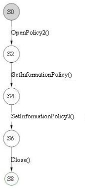

* The sequence starts with OpenPolicy method call, which opens the policy handle with the desired access given.

* SetInformationPolicy takes the policy handle opened by the previous method. The handle must be given the required permission depending upon the information class type being set. Incorrect permission value will fail this method with AccessDenied error code. Also, the information class type given as an input must be valid (within enumeration range of POLICY_INFORMATION_CLASS). Any value outside the range will result in InvalidParameter error code. Other return codes can be NotImplemented where information class cannot be set, InvalidHandle where policy handle input is invalid and Success where the information class is set successfully.

* SetInformationPolicy2 takes the policy handle opened by the previous method. The handle must be given the required permission depending upon the information class type being set. Incorrect permission value will fail this method with AccessDenied error code. Also, the information class type given as an input must be valid (within enumeration range of POLICY_INFORMATION_CLASS). Any value outside the range will result in InvalidParameter error code. Other return codes can be NotImplemented where information class cannot be set, InvalidHandle where policy handle input is invalid and Success where the information class is set successfully.

* The next method in the sequence is Close which takes the policy handle opened by OpenPolicy method. If the context handle passed as an input is not valid then it returns InvalidHandle error code. Other return code is Success where the resources held by the context handle are freed successfully.

**Scenario 34**

This is for setting and querying the policy information from the server using information types from POLICY_INFORMATION_CLASS enumeration. The enumeration contains 14 values which can be queried. We query the policy information using QueryInformationPolicy and QueryInformationPolicy2. This scenario is to run on Non domain controller.

The basic message sequencing diagram for this scenario can be depicted as given below:  

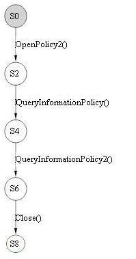

* The sequence starts with OpenPolicy method call, which opens the policy handle with the desired access given.

* The next method in the sequence is QueryInformationPolicy. QueryInformationPolicy takes the policy handle opened by the OpenPolicy method. The handle must be given the required permission depending upon the information class type being queried. Incorrect permission value will fail this method with AccessDenied error code. Also, the information class type given as an input must be valid (within enumeration range of POLICY_INFORMATION_CLASS). Any value outside the range will result in InvalidParameter error code. Other return codes can be NotSupported where information class provided is not supported by the server, InvalidHandle where policy handle input is invalid and Success where the information class is queried successfully.

* The next method in the sequence is QueryInformationPolicy2. QueryInformationPolicy2 takes the policy handle opened by the OpenPolicy method. The handle must be given the required permission depending upon the information class type being queried. Incorrect permission value will fail this method with AccessDenied error code. Also, the information class type given as an input must be valid (within enumeration range of POLICY_INFORMATION_CLASS). Any value outside the range will result in InvalidParameter error code. Other return codes can be NotSupported where information class provided is not supported by the server, InvalidHandle where policy handle input is invalid and Success where the information class is queried successfully.

* The next method in the sequence is Close which takes the policy handle opened by OpenPolicy method. If the context handle passed as an input is not valid then it returns InvalidHandle error code. Other return code is Success where the resources held by the context handle are freed successfully.

**Scenario 35**

This is for setting and querying the policy information from the server using information types from POLICY_INFORMATION_CLASS enumeration. The enumeration contains 14 values which can be queried. We Set the policy information using SetInformationPolicy and SetInformationPolicy2 and query the policy information using QueryInformationPolicy and QueryInformationPolicy2. 

The basic message sequencing diagram for this scenario can be depicted as given below:

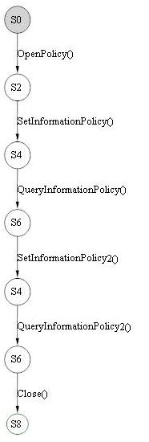

* The sequence starts with OpenPolicy method call, which opens the policy handle with the desired access given.

* SetInformationPolicy takes the policy handle opened by the previous method. The handle must be given the required permission depending upon the information class type being set. Incorrect permission value will fail this method with AccessDenied error code. Also, the information class type given as an input must be valid (within enumeration range of POLICY_INFORMATION_CLASS). Any value outside the range will result in InvalidParameter error code. Other return codes can be NotImplemented where information class cannot be set, InvalidHandle where policy handle input is invalid and Success where the information class is set successfully.

* The next method in the sequence is QueryInformationPolicy. QueryInformationPolicy takes the policy handle opened by the OpenPolicy method. The handle must be given the required permission depending upon the information class type being queried. Incorrect permission value will fail this method with AccessDenied error code. Also, the information class type given as an input must be valid (within enumeration range of POLICY_INFORMATION_CLASS). Any value outside the range will result in InvalidParameter error code. Other return codes can be NotSupported where information class provided is not supported by the server, InvalidHandle where policy handle input is invalid and Success where the information class is queried successfully.

* SetInformationPolicy2 takes the policy handle opened by the previous method. The handle must be given the required permission depending upon the information class type being set. Incorrect permission value will fail this method with AccessDenied error code. Also, the information class type given as an input must be valid (within enumeration range of POLICY_INFORMATION_CLASS). Any value outside the range will result in InvalidParameter error code. Other return codes can be NotImplemented where information class cannot be set, InvalidHandle where policy handle input is invalid and Success where the information class is set successfully.

* The next method in the sequence is QueryInformationPolicy2. QueryInformationPolicy2 takes the policy handle opened by the OpenPolicy method. The handle must be given the required permission depending upon the information class type being queried. Incorrect permission value will fail this method with AccessDenied error code. Also, the information class type given as an input must be valid (within enumeration range of POLICY_INFORMATION_CLASS). Any value outside the range will result in InvalidParameter error code. Other return codes can be NotSupported where information class provided is not supported by the server, InvalidHandle where policy handle input is invalid and Success where the information class is queried successfully.

* The next method in the sequence is Close which takes the policy handle opened by OpenPolicy method. If the context handle passed as an input is not valid then it returns InvalidHandle error code. Other return code is Success where the resources held by the context handle are freed successfully.

**Scenario 36**

Scenario S36 deals with the behavior of CreateTrustedDomain, CreateTrustedDomainEx, CreateTrustedDomainEx2, SetTrustedDomainInfoByName, SetTrustedDomainInfo and DeleteTrustedDomain in a Read-Only Domain Controller Configuration.

The basic message sequencing diagram for this scenario can be depicted as given below:

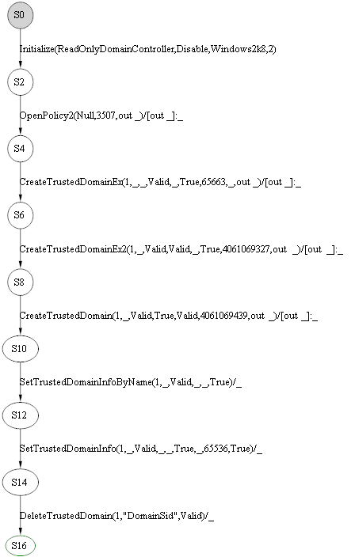

* The sequence starts with OpenPolicy2 method call, which opens the policy handle with the desired access given.

* CreateTrustedDomainEx method takes the policy handle opened by the previous method. The requested permission depends upon the trusted domain information class type. Incorrect permission value will fail this method with AccessDenied error code. The trusted domain information class type given as an input must be valid (must be within the enumeration range). Any invalid parameter as an input will result in InvalidParameter. Other return codes can be NotSupportedOnSBS where small business server 2003 does not support this operation, InvalidDomainState where this operation is cannot complete in the current state of the domain, InvalidSID where trusted domain Sid passed as an input is not valid, CurrentDomainNotAllowed where trust establishment on the current domain is not allowed, DirectoryServiceRequired where active directory service is not available on the server, ObjectNameCollision where the trusted domain name passed as an input already exists, InvalidHandle where policy handle input is invalid and Success where the trusted domain object is created successfully.

* CreateTrustedDomainEx2 method takes the policy handle opened by the OpenPolicy2 method. This method is called to create the same trusted domain object created by first call of CreateTrustedDomain to get objectNameCollision return value.

* CreateTrustedDomain method takes the policy handle opened by the OpenPolicy2 method. The requested permission depends upon the trusted domain information class type. Incorrect permission value will fail this method with AccessDenied error code. The trusted domain information class type given as an input must be valid (must be within the enumeration range). Any invalid parameter as an input will result in InvalidParameter. Other return codes can be NotSupportedOnSBS where small business server 2003 does not support this operation, InvalidDomainState where this operation is cannot complete in the current state of the domain, InvalidSID where trusted domain Sid passed as an input is not valid, CurrentDomainNotAllowed where trust establishment on the current domain is not allowed, DirectoryServiceRequired where active directory service is not available on the server, ObjectNameCollision where the trusted domain name passed as an input already exists, InvalidHandle where policy handle input is invalid and Success where the trusted domain object is created successfully.

* SetTrustedDomainInfoByName mothod takes the policy handle opened by the OpenPolicy2 method. The requested permission depends upon the trusted domain information class type. Incorrect permission value will fail this method with AccessDenied error code. The trusted domain information class type given as an input must be valid (must be within the enumeration range). Any invalid parameter as an input will result in InvalidParameter. Other return codes can be STATUS_NO_SUCH_DOMAIN where trusted domain name passed as an input does not exist in the trusted domain object database, InvalidHandle where policy handle input is invalid and Success where the trusted domain information is set in the trusted domain object successfully.

* SetTrustedDomainInfo method takes the policy handle opened by the previous method. The requested permission depends upon the trusted domain information class type. Incorrect permission value will fail this method with AccessDenied error code. The trusted domain information class type given as an input must be valid (must be within the enumeration range). Any invalid parameter as an input will result in InvalidParameter. Other return codes can be STATUS_NO_SUCH_DOMAIN where trusted domain name passed as an input does not exist in the trusted domain object database, InvalidHandle where policy handle input is invalid and Success where the trusted domain information is set in the trusted domain object successfully.

**TestScenarioNotDomainAdmins** 

Scenario TestScenarioNotDomainAdmins used when the caller is not a member of the Domain Admins group, it deals with the behavior of CreateTrustedDomainEx2.

The basic message sequencing diagram for this scenario can be depicted as given below:

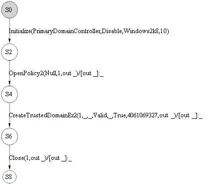

* The sequence starts with OpenPolicy2 method call, which opens the policy handle with the desired access given.

* CreateTrustedDomainEx2 method takes the policy handle opened by the OpenPolicy2 method. This method is called to create the same trusted domain object created by first call of CreateTrustedDomain to get objectNameCollision return value.

* The next method in the sequence is Close which takes the policy handle opened by OpenPolicy2 method. If the context handle passed as an input is not valid then it returns InvalidHandle error code. Other return code is Success where the resources held by the context handle are freed successfully.

**Scenario 37**

Scenario 37 is used for opening a policy handle, creating a new secret object, and finally closing the opened policy handle.

The basic message sequencing diagram for this scenario can be depicted as given below:

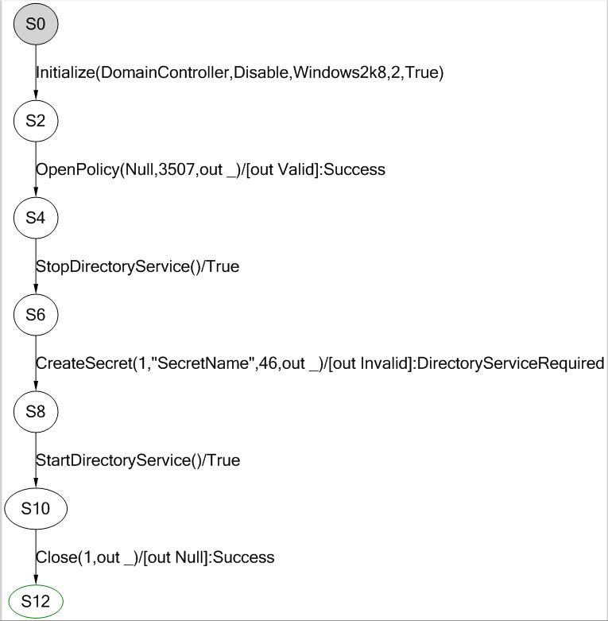

* The sequence starts with OpenPolicy method call, which opens the policy handle with the desired access given.

* StopDirectoryService method stops directory service on the machine specified by remoteServerName parameter.

* CreateSecret method takes the policy handle opened by the previous method. The handle must be given the permission POLICY_CREATE_SECRET. Incorrect permission value will fail this method with AccessDenied error code. Also, the Secret name given as an input must be valid (must follow the syntax restrictions). Any invalid parameter as an input will result in InvalidParameter. Other return codes can be ObjectNameCollision where secret name passed already exists, NameTooLong where server does not allow secret name exceeding 128 characters, InvalidHandle where policy handle input is invalid and Success where the secret object is created successfully.

* StartDirectoryService method starts directory service on the machine specified by remoteServerName parameter.

* The next method in the sequence is Close which takes the policy handle opened by OpenPolicy method. If the context handle passed as an input is not valid then it returns InvalidHandle error code. Other return code is Success where the resources held by the context handle are freed successfully.

### <a name="_Toc426639807"/>3.9 MS-LSAT

#### <a name="_Toc426639808"/>3.9.1 Test Approach
LSAT protocol is being tested in Model Based Approach.

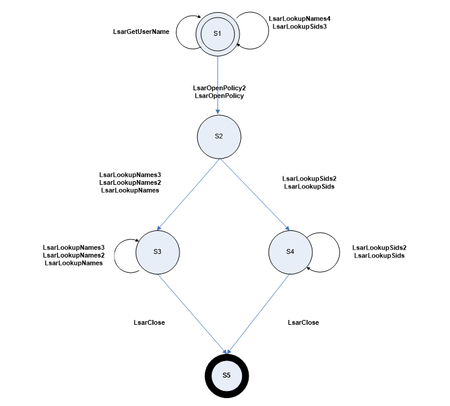

***Figure 3-14: Simple State Diagram on Translation of Names and SIDs***

The main components for MS-LSAT are as follows:

* Model: This component abstracts MS-LSAT logic based on the specification in the Technical Document (TD), and generates test cases according to the model.

* Protocol Adapter: This component communicates with the SUT by using the SDK to invoke RPC operations. It generates and sends the request messages, receives and parses the response messages, verifies the requirements and passes the information to the test cases to verify the logic relevant requirements.

* SMB and TCP/IP are transports for LSAT client to send requests to and receive responses from the server.

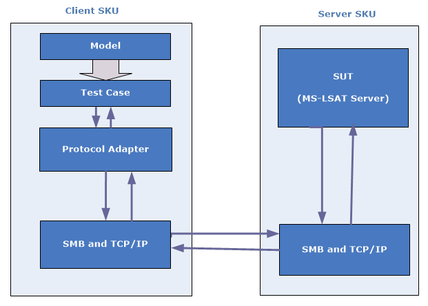

* ***Figure 3-15: MS-LSAT Test Suite Architecture***

#### <a name="_Toc426639809"/>3.9.2 Scenarios
**Scenario 1**

This is for translating the security principal names to their respective security principal using LSA handle. The basic message sequencing diagram for this scenario can be depicted as given below:

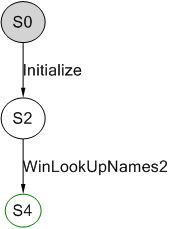

* The sequence starts with calling Initialize method. This method is used to do all initial settings and bind to the server.

* The sequence then calls WinLookUpNames2 method, by taking the implicit LSA handle. The handle must be valid. In all other cases, this method will fail with AccessDenied error code. Also, the names given as an input must be valid (some may not be mapped). Any invalid parameter as an input will result in InvalidParameter. Other error conditions can be NoneMapped where no name could be mapped, SomeNotMapped where some of the names could not be mapped and Success where all names were successfully mapped.

**Scenario 2**

This is for translating the security principal names to their respective security principal SIDs or vice versa using the policy handle obtained from OpenPolicy2 method. The basic message sequencing diagram for this scenario can be depicted as given below:                                                  

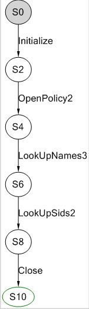

* The sequence starts with calling Initialize method. This method is used to do all initial settings and bind to the server.

* The sequence then calls OpenPolicy2 method which opens the policy handle with the desired access given.

* LookUpNames3 takes the policy handle opened by the previous method. The handle must be given the permission of LOOK_UP_NAMES. In all other cases, these methods will fail with AccessDenied error code. Also, the names given as an input must be valid (some may not be mapped). Any invalid parameter as an input will result in InvalidParameter. Other error conditions can be NoneMapped where no name could be mapped, SomeNotMapped where some of the names could not be mapped and Success where all names were successfully mapped.

* The next method in the sequence is LookupSids2. LookUpSids2 takes the policy handle opened by the previous method. The handle must be given the permission of LOOK_UP_SIDS. In all other cases, these methods will fail with AccessDenied error code. Also, SIDs given as an input (the output of the previous method LookupNames3) must be valid (some may not be mapped). Any invalid parameter as an input will result in InvalidParameter. Other error conditions can be NoneMapped where no SID could be mapped, SomeNotMapped where some of the SIDs could not be mapped and Success where all SIDs were successfully mapped.

* The final method call, in the sequence is Close which closes the handle opened by the OpenPolicy2. This method takes the policy handle as its input. If the handle is not valid, this method will fail with InvalidParameter. In other cases, it will return Success indicating successful completion.

**Scenario3**

This is for translating the security principal names to their respective security principal SIDs using the policy handles obtained from OpenPolicy2 method. The basic message sequencing diagram for this scenario can be depicted as given below:                                   

* The sequence starts with calling Initialize method. This method is used to do all initial settings and bind to the server.

* The sequence then calls OpenPolicy2 method which opens the policy handle with desired access given.

* LookUpNames2 takes the policy handle opened by the previous method. The handle must be given LOOK_UP_NAMES   permission. In all other cases, these methods will fail with AccessDenied error code. Also, the names given as an input must be valid (some may not be mapped). Any invalid parameter as an input will result in InvalidParameter. Other error conditions can be NoneMapped where no name could be mapped, SomeNotMapped where some of the names could not be mapped and Success where all the names were successfully mapped, but translated SIDs output structure do not have Sid field. 

* The final method call in the sequence is Close which closes the handle opened by the OpenPolicy2. This method takes the policy handle as its input. If the handle is not valid, this method will fail with InvalidParameter. In other cases, it will return Success indicating successful completion.

**Scenario 4**

This is for translating the security principal names to their respective security principal SIDs using the policy handles obtained from OpenPolicy method. The basic message sequencing diagram for this scenario can be depicted as given below:              

* The sequence starts with calling Initialize method. This method is used to do all initial settings and bind to the server.

* The sequence then calls OpenPolicy method which opens the policy handle with the desired access given.

* LookupNames takes the policy handle opened by the previous method. The handle must be given LOOK_UP_NAMES permission. In all other cases, these methods will fail with AccessDenied error code. Also, the names given as an input must be valid (some may not be mapped). Any invalid parameter as an input will result in InvalidParameter. Other error conditions can be NoneMapped where no name could be mapped, SomeNotMapped where some of the names could not be mapped and Success where all the names were successfully mapped, but translated SIDs output structure do not have Sid field. 

* The final method call in the sequence is Close which closes the handle opened by the OpenPolicy. This method takes the policy handle as its input. If the handle is not valid, this method will fail with InvalidParameter. In other cases, it will return Success indicating successful.

**Scenario 5**

This is for translating the security principal SIDs to their respective security principal names using the policy handle obtained from OpenPolicy2 method. The basic message sequencing diagram for this scenario can be depicted as given below:                                

* The sequence starts with calling Initialize method. This method is used to do all initial settings and bind to the server.

* The sequence then calls OpenPolicy2 method which opens the policy handle with the desired access given.

* LookUpNames3 takes the policy handle opened by the previous method. The handle must be given the permission of LOOK_UP_NAMES. In all other cases, these methods will fail with AccessDenied error code. Also, the names given as an input must be valid (some may not be mapped). Any invalid parameter as an input will result in InvalidParameter. Other error conditions can be NoneMapped where no name could be mapped, SomeNotMapped where some of the names could not be mapped and Success where all names were successfully mapped.

* The next method in the sequence is LookupSids. LookUpSids takes the policy handle opened by the previous method. The handle must be given the permission of LOOK_UP_NAMES. In all other cases, these methods will fail with AccessDenied error code. Also, SIDs given as an input (the output of the previous method LookupNames3) must be valid (some may not be mapped). Any invalid parameter as an input will result in InvalidParameter. Other error conditions can be NoneMapped where no SID could be mapped, SomeNotMapped where some of the SIDs could not be mapped and Success where all SIDs were successfully mapped.

* The final method call in the sequence is Close which closes the handle opened by the OpenPolicy2. This method takes in the policy handle as its input. If the handle is not valid, this method will fail with InvalidParameter. In other cases, it will return Success indicating successful completion.

**Scenario 6**

This is for getting username and domain name for a particular user (client). The basic message sequencing diagram for this scenario can be depicted as given below:

* The sequence starts with calling Initialize method. This method is used to do all initial settings and bind to the server.

* The sequence then calls GetUserName method, by taking the implicit RPC handle will return the username and, domain name for a particular user (client).

**Scenario 7**

Scenario 7 is for getting policy handle by calling actions OpenPolicy and OpenPolicy2. The basic message sequencing diagram for this scenario can be depicted as given below:                                                          

* The sequence starts with calling Initialize method. This method is used to do all initial settings and bind to the server.

* The sequence then calls OpenPolicy method which opens the policy handle with the desired access given.

* The next action in the sequence is OpenPolicy2 method which opens the policy handle with the desired access given.

### <a name="_Toc426639810"/>3.10 MS-NRPC

#### <a name="_Toc426639811"/>3.10.1 Test Approach
Model-Based testing (MBT) and traditional testing were chosen as the test approaches in the MS-NRPC test suite.

#####3.10.1.1 Test Suite Overview
System Under Test (SUT):

* From the third party point of view, an SUT is a component which implements MS-NRPC.

* In Window implementations, both the Domain Controller and the Non-Domain Controller are SUTs.

Test Suite Architecture:
The below figure illustrates the architecture of the MS-NRPC Test Suite.

  ***Figure 3-16: MS-NRPC Test Suite Architecture***

The MS-NRPC test suite consists of the following components:

* MS-NRPC test cases are test logic which invokes the NRPC Adapter methods to perform NetLogon operations.

* An NRPC Adapter utilizes the SDK to perform NetLogon RPC operations. The messages is sent to the server through either TCP/IP transport or named pipe transport.

* The SUT can be either a Domain Controller or a Non-Domain Controller server.

* The SUT control adapter is used for configuring the SUT status and getting the status of the SUT.

* The Non-Domain Controller server sends Lightweight Directory Access Protocol (LDAP) request message and receives the response message with Domain Controller. 

#####3.10.1.2 Model Plan
Model Pattern: 

Abstract identifiers are used for the model design pattern in MS-NRPC test suite.

* Abstract identifiers are applied to the complex parameters involved in actions in the MS-NRPC Test Suite. The MS-NRPC model uses a set of values in a simple type (int, string, enum) for the concrete values. For example, an enum ComputerNameType is defined to specify the name of computers, and then the model can get the name of the computer if it exists.

Model Actions:

There are 42 actions in all designed in the MS-NRPC test suite. 30 actions specified in [MS-NRPC] are abstracted into the MS-NRPC test suite. 
In addition, there are 12 actions in the model that are not abstracted from [MS-NRPC]. They are specified as the following: 

* 7 of 42 actions are designed for driving the SUT control adapter.

* 5 actions are designed for verifying the behaviors that related to the server’s operating system version and the client account type. 

Adapter Approach:

There are two kinds of adapters designed for the MS-NRPC Test Suite: Protocol Adapter and SUT control adapter, where NRPC Adapter belongs to the Protocol adapter.

#####3.10.1.3 Protocol Adapter
There is one protocol adapter in the MS-NRPC test suite, which is the NRPC Adapter.

* NRPC Adapter Overview

	* The NRPC Adapter sends request messages to the server and receives the response from the server.

* Adapter Interfaces

	* There are 43 methods defined in the NRPC Adapter interface.

	40 Methods
	40 methods defined in the MS-NRPC model according to the RPC actions specified in TD.
	3 Methods
	Two additional methods are going to be designed in the NRPC Adapter:

	* The test suite needs to verify the behaviors that related to the server’s operating system version, so this adapter implements the GetPlatform to get the operating system version for the server machine.

	* The test suite needs to verify the behaviors that related to the client account type in the domain, so this adapter implements the GetClientAccountType to get the client account type.

	* The test suite needs to verify whether the user account has sufficient privilege, so this adapter implements the SwitchUserAccount to switch the user account.

* Message generation 

	* Protocol Adapter calls NRPC SDK to generate NRPC messages, and then receives these generated messages by the SDK.

* Message Consumption

	* When the NRPC Adapter finishes sending NRPC messages, it will wait until the response messages are returned. It is the SDK that receives and parses the response messages and returns them to the NRPC Adapter. The NRPC Adapter will capture and verify the structures of these messages while parsing the returned value to the test cases to verify.

#### <a name="_Toc426639812"/>3.10.2 Scenarios

|  **Scenario ID**|  **Test Approach**|  **Description**| 
| -------------| -------------| ------------- |
| [MS-NRPC_S1_LocateDc](#S1)| MBT| This scenario is designed to test methods that are used to locate a domain controller.| 
| [MS-NRPC_S2_EstablishSecureChannel](#S2)| MBT| This scenario is designed to test methods that are used to establish a secure channel.| 
| [MS-NRPC_S3_MaintainSecureChannel](#S3)| MBT| This scenario is designed to test methods that are used to maintain a secure channel.| 
| [MS-NRPC_S4_PassThroughAuthenticate](#S4)| MBT| This scenario is designed to test methods that are used for generic pass-through user logon and logoff.| 
| [MS-NRPC_S5_RetrieveTrustInfo](#S5)| MBT| This scenario is designed to test methods that are used to retrieve trust data about domain, forest and account information.| 
| [MS-NRPC_S6_AuthenticateMessage](#S6)| MBT| This scenario is designed to test methods on authentication message.| 
| [MS-NRPC_S7_QueryAndControlNetlogonBehavior](#S7)| MBT| This scenario is designed to test methods that are used to query and control Netlogon behavior.| 
| [MS-NRPC_S8_ObsoleteMethods](#S8)| MBT| This scenario is designed to test the obsolete methods, these methods was for the support of LAN Manager products.| 
| [MS-NRPC_S9_TraditionalScenario](#_MS-NRPC_S10_GenerateSSPToken)| Traditional| This scenario is used to test SHOULD requirements related windows behaviors and verify the server behavior when the client send an out of sequence request message if security channel is used. | 
| [MS-NRPC_S10_ServerToDCInteractions](#S10)| Manual| This scenario is used to test the behaviors between the server and the Domain Controller (DC).| 

### <a name="_Toc426639813"/>3.11 MS-SAMR

#### <a name="_Toc426639814"/>3.11.1 Test Approach
Traditional approach is used to design the MS-SAMR test scenarios. The test suite for the SAMR protocol validates protocol server behavior and plays the role of protocol client to generate SAMR requests. The SUT is the server which implements SAMR protocol. The test suite architecture is shown as below. 

***Figure 3-17: MS-SAMR Test Suite Architecture***

There is one adapter used in the test suite: a protocol adapter. 
There is no SUT (System Under Test) control adapter, since there is no need to configure server in the protocol server behavior. 
Message Generation 

SAMR test suite synthesizes protocol messages using supplied IDL/data types defined in the document. SAMR is a RPC-based protocol with Interface Definition Language (IDL) provided as part of the Technical Document. 
Adapter approach 

The protocol adapter is used to send request messages to/receive response messages from the SUT. 
Message Validation  
Server responses are validated by checking the SAMR methods’ return values and out parameters. Response from the Server as part of the return values and “out” parameters of SAMR protocol methods will suffice for validation of the protocol. 

#### <a name="_Toc426639815"/>3.11.2 Scenarios

The scenarios will be divided into the following perspectives:

Server Management

SamrConnect5

SamrConnect4

SamrConnect2

SamrSetSecurityObject

SamrQuerySecurityObject

SamrEnumerateDomainsInSamServer

SamrLookupDomainInSamServer

SamrCloseHandle

Domain Management

SamrOpenDomain

SamrSetSecurityObject

SamrQuerySecurityObject

SamrLookupNamesInDomain

SamrLookupIdsInDomain

SamrSetInformationDomain

SamrQueryInformationDomain

SamrQueryInformationDomain2

SamrCloseHandle

Group Management

SamrOpenGroup

SamrEnumerateGroupsInDomain

SamrCreateGroupInDomain

SamrGetDisplayEnumerationIndex (DomainDisplayGroup)

SamrGetDisplayEnumerationIndex2

SamrQueryDisplayInformation

SamrQueryDisplayInformation2

SamrQueryDisplayInformation3

SamrSetSecurityObject

SamrQuerySecurityObject

SamrQueryInformationGroup

SamrSetInformationGroup

SamrDeleteGroup

SamrAddMemberToGroup

SamrRemoveMemberFromGroup

SamrGetMembersInGroup

SamrCloseHandle

SamrSetMemberAttributesOfGroup

SamrCloseHandle

SamrRidToSid

Alias Management

SamrOpenAlias

SamrEnumerateAliasesInDomain

SamrCreateAliasInDomain

SamrGetDisplayEnumerationIndex (DomainDisplayGroup)

SamrGetDisplayEnumerationIndex2

SamrQueryDisplayInformation

SamrQueryDisplayInformation2

SamrQueryDisplayInformation3

SamrGetAliasMembership

SamrRemoveMemberFromForeignDomain

SamrSetSecurityObject

SamrQuerySecurityObject

SamrQueryInformationAlias

SamrSetInformationAlias

SamrDeleteAlias

SamrAddMemberToAlias

SamrRemoveMemberFromAlias

SamrGetMembersInAlias

SamrAddMultipleMembersToAlias

SamrRemoveMultipleMembersFromAlias

SamrRidToSid

User Management

SamrOpenAlias

SamrEnumerateAliasesInDomain

SamrCreateAliasInDomain

SamrGetDisplayEnumerationIndex (DomainDisplayUser, DomainDisplayMachine)

SamrGetDisplayEnumerationIndex2

SamrQueryDisplayInformation

SamrQueryDisplayInformation2

SamrQueryDisplayInformation3

SamrSetSecurityObject

SamrQuerySecurityObject

SamrQueryInformationUser

SamrQueryInformationUser2

SamrSetInformationUser

SamrSetInformationUser2

SamrDeleteUser

SamrGetGroupsForUser

SamrCloseHandle

SamrRidToSid

Password Management

SamrChangePasswordUser

SamrGetUserDomainPasswordInformation

SamrOemChangePasswordUser2

SamrUnicodeChangePasswordUser2

SamrGetDomainPasswordInformation

SamrSetDSRMPassword

SamrValidatePassword

Non-DC

This part covers the test scenarios on non-DC configuration which depend on different method implementations. 