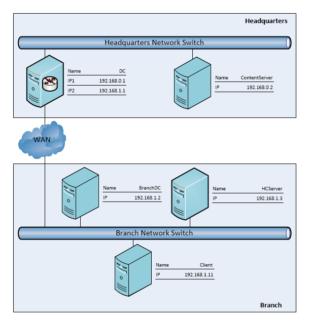

###BranchCache Protocol Test Design Specification

##Contents
* [Test Environment](#_Toc462327666)
    * [Windows Test Environment](#_Toc462327667)
    * [Partner Test Environment](#_Toc462327668)
* [Test Scenario Design](#_Toc462327669)
    * [Overview](#_Toc462327670)
    * [Content Server](#_Toc462327671)
		* [ContentServer_ContentInformationRetrieval](#_Toc462327672)
		* [ContentServer_ForcedHashGenerationContentInformationRetrieval](#_Toc462327673)
		* [ContentServer_MissingContentRetrieval_HTTPOnly](#_Toc462327674)
		* [ContentServer_PCCRTPServer](#_Toc462327675)
		* [ContentServer_SMBServer_SrvReadHash](#_Toc462327676)
		* [ContentServer_PCCRCServer](#_Toc462327677)
    * [HostedCacheServer](#_Toc462327678)
		* [HostedCacheServer_CacheOfferingRetrieval](#_Toc462327679)
		* [HostedCacheServer_PCHCServer_MessageHeader](#_Toc462327680)
		* [HostedCacheServer_PCHCServer_InitialOffer](#_Toc462327681)
		* [HostedCacheServer_PCHCServer_SegmentInfo](#_Toc462327682)
		* [HostedCacheServer_PCHCServer_BatchedOffer](#_Toc462327683)
		* [HostedCacheServer_PCCRRServer_MessageHeader](#_Toc462327684)
		* [HostedCacheServer_PCCRRServer_GetBlockList](#_Toc462327685)
		* [HostedCacheServer_PCCRRServer_GetBlocks](#_Toc462327686)
		* [HostedCacheServer_PCCRRServer_GetSegList](#_Toc462327687)
		* [HostedCacheServer_PCCRRClient_MessageHeader](#_Toc462327688)
		* [HostedCacheServer_PCCRRServer_BlockList](#_Toc462327689)
		* [HostedCache_Server_PCCRRServer_GetBlocks](#_Toc462327690)
		* [HostedCacheServer_PCCRRServer_GetSegList](#_Toc462327691)
* [Test Case Design](#_Toc462327692)
    * [Content Server](#_Toc462327693)
		* [ContentServer_ContentInformationRetrieval_V1 (BVT)](#_Toc462327694)
		* [ContentServer_ContentInformationRetrieval_V2 (BVT)](#_Toc462327695)
		* [ContentServer_ForcedHashGenerationContentInformationRetrieval_V1 (BVT)](#_Toc462327696)
		* [ContentServer_ForcedHashGenerationContentInformationRetrieval_V2 (BVT)](#_Toc462327697)
		* [ContentServer_MissingContentRetrieval_HTTPOnly_V1 (BVT)](#_Toc462327698)
		* [ContentServer_MissingContentRetrieval_HTTPOnly_V2 (BVT)](#_Toc462327699)
		* [ContentServer_SmbServer_HashV1FileBased](#_Toc462327700)
		* [ContentServer_SmbServer_OffsetInvalid](#_Toc462327701)
		* [ContentServer_SmbServer_HashVersionInvalid](#_Toc462327702)
		* [ContentServer_SmbServer_HashRetrivalTypeInvalid](#_Toc462327703)
		* [ContentServer_SmbServer_HashV2HashBased](#_Toc462327704)
		* [ContentServer_SmbServer_HashTypeInvalid](#_Toc462327705)
		* [ContentServer_SmbServer_HashV1FileBased_Smb2002](#_Toc462327706)
		* [ContentServer_SmbServer_HashV2HashBased_Smb21](#_Toc462327707)
		* [ContentServer_PccrtpServer_MissingDataRequestInvalid](#_Toc462327708)
		* [ContentServer_PccrtpServer_MissingDataRequestFalse](#_Toc462327709)
		* [ContentServer_PccrtpServer_ContentEncodingNotHavaPeerDist](#_Toc462327710)
		* [ContentServer_PccrtpServer_ContentInformationVersionIncompatible](#_Toc462327711)
		* [ContentServer_PccrcServer_MultipleSegments](#_Toc462327712)
    * [Hosted Cache Server](#_Toc462327713)
		* [HostedCacheServer_CacheOfferingRetrieval_V1 (BVT)](#_Toc462327714)
		* [HostedCacheServer_CacheOfferingRetrieval_V2 (BVT)](#_Toc462327715)
		* [HostedCacheServer_PchcServer_InitialOffer_ContentRetrieved](#_Toc462327716)
		* [HostedCacheServer_PchcServer_InitialOffer_SegmentInfoRetrieved](#_Toc462327717)
		* [HostedCacheServer_PchcServer_GetBlocks_SizeOfBlockNotMatch](#_Toc462327718)
		* [HostedCacheServer_PchcServer_GetBlocks_SizeOfIVBlockNotMatch](#_Toc462327719)
		* [HostedCacheServer_PchcServer_MessageHeader(VersionIncompatible\TypeInvalid)](#_Toc462327720)
		* [HostedCacheServer_PchcServer_SegmentIofo(HashAlgoInvalid\VersionIncompatible)](#_Toc462327721)
		* [HostedCacheServer_PchcServer_SegmentInfo(SegmentsEmpty\SegmentsMultiple)](#_Toc462327722)
		* [HostedCacheServer_PchcServer_BatchedOffer(SegmentDescriptorTooMany\SegmentDescriptorEmpty)](#_Toc462327723)
		* [HostedCacheServer_PchcServer_BatchedOffer(HashAlgoInvalid\ContentTagEmpty)](#_Toc462327724)
		* [HostedCacheServer_PchcServer_BatchedOffer_ContentRetrieved](#_Toc462327725)
		* [HostedCacheServer_PccrrServer_MessageHeader(ProtoVerIncompatible\VersionIncompatible\CryptoAlgoIdInvalid)](#_Toc462327726)
		* [HostedCacheServer_PccrrServer_MessageHeader(CryptoAlgoIdNoEncryption\CryptoAlgoIdAES192\CryptoAlgoIdAES256)](#_Toc462327727)
		* [HostedCacheServer_PccrrClient_MessageHeader(CryptoAlgoIdNoEncryption\CryptoAlgoIdAES192\CryptoAlgoIdAES256)](#_Toc462327728)
		* [HostedCacheServer_PccrrClient_MessageHeader(TypeInvalid)](#_Toc462327729)
		* [HostedCacheServer_PccrrServer_MessageHeader_MsgTypeInvalid](#_Toc462327730)
		* [HostedCacheServer_PcrrServer_GetBlocks_BlockRangeCountNotMatch](#_Toc462327731)
		* [HostedCacheServer_PccrrServer_GetBlocks_BlockRangesEmpty](#_Toc462327732)
		* [HostedCacheServer_PccrrServer_GetBlockList_BlockRangeCountNotMatch](#_Toc462327733)
		* [HostedCacheServer_PccrrServer_GetBlockList_BlockRangesEmpty](#_Toc462327734)
		* [HostedCacheServer_PccrrServer_GetSegList_ExtensibleBlob](#_Toc462327735)
		* [HostedCacheServer_PccrrServer_GetSegList_SegmentIDEmpty](#_Toc462327736)
		* [HostedCacheServer_PccrrServer_GetSegList_SegmentIDCountNotMatch](#_Toc462327737)

## <a name="_Toc462327666"/>Test Environment

### <a name="_Toc462327667"/>Windows Test Environment
The following environment topology is used to demonstrate how Windows uses Branch Cache family protocols to accelerate remote file access from a branch office. To simplify the environment, all objects are created under Hyper-V manager and use VMs instead of physical machines.

**Network Overview**

**Machine Details**

| &#32;| &#32;| &#32;| &#32; |
| -------------| -------------| -------------| ------------- |
| Machine Name| IP Address| OS| Role| 
| DC| 192.168.0.1| Windows Server 8| Main domain controller| 
| | 192.168.1.1| | | 
| | | | Router to bridge two subnets| 
| ContentServer| 192.168.0.2| Windows Server 8| Content server| 
| | | | Replaceable SUT| 
| BranchDC| 192.168.1.2| Windows Server 8| Branch side Read-only DC| 
| HCServer| 192.168.1.3| Windows Server 8| Hosted cache server| 
| | | | Replaceable SUT| 
| Client| 192.168.1.11| Windows 8| Client| 
| | | | Test driver machine| 

### <a name="_Toc462327668"/>Partner Test Environment
Partners should replace ContentServer, HostedCacheServer respectively according to the testing scenarios. 

| &#32;| &#32;| &#32;| &#32;| &#32; |
| -------------| -------------| -------------| -------------| ------------- |
| Partner Implements| Partner Replaces (SUT)| Mode| Test Suite Acts as| Major Scenario| 
| Content Server| ContentServer| Distributed| Client| Client requests content informationinformation from SUT| 
|  |  | Hosted|  |  | 
| Hosted Cache Server| HostedCacheServer| Distributed| NA| NA| 
|  |  | Hosted| Client| Client retrieves cache from SUT. Client offers content to SUT. SUT retrieves content from client| 

## <a name="_Toc462327669"/>Test Scenario Design

### <a name="_Toc462327670"/>Overview
The following are the major scenarios for this test suite

| &#32;| &#32;| &#32; |
| -------------| -------------| ------------- |
| SUT| Mode| Scenario| 
| Content Server| Distributed & Hosted| ContentServer_InformationContentInformationRetrieval| 
|  |  | ContentServer_ForcedHashGenerationContentInformationInformationRetrieval  &#42; 1| 
|  |  | ContentServer_MissingContentRetrieval_HTTPOnly  &#42; 2| 
| Hosted Cache Server| Hosted| HostedCacheServer_ContentOfferingRetrieval| 

1 On windows platform this scenario is only applicable for SMB2 since IIS could only generate hash when the file is downloaded over network. 
2 This scenario is only applicable for HTTP since SMB2 uses read command to retrieve the content.

There are also some additional test cases for individual protocols to test boundary and negative conditions

| &#32;| &#32;| &#32; |
| -------------| -------------| ------------- |
| SUT| Mode| Protocol Role| 
| Content Server| Distributed & Hosted| MS-PCCRTP Server| 
| | | MS-SMB2 Server| 
| | | MS-PCCRC| 
| Hosted Cache Server| Hosted| MS-PCHC ServerMS-PCCRR ServerMS-PCCRR Client| 

### <a name="_Toc462327671"/>Content Server

#### <a name="_Toc462327672"/>ContentServer_ContentInformationRetrieval

| &#32;| &#32; |
| -------------| ------------- |
|  **Description**| Client retrieves content information from content server| 
|  **Message Sequence**| HTTP:| 
| | Client sends content information request to ContentServer| 
| | ContentServer sends content to Client| 
| | Client sends content information request to ContentServer| 
| | ContentServer sends content information to Client| 
| | SMB2:| 
| | Client sends content information request to ContentServer| 
| | ContentServer sends error code to Client| 
| | Client sends content request to ContentServer| 
| | ContentServer sends content response to Client| 
| | Client sends content information request to ContentServer| 
| | ContentServer sends content information to Client| 

#### <a name="_Toc462327673"/>ContentServer_ForcedHashGenerationContentInformationRetrieval

| &#32;| &#32; |
| -------------| ------------- |
|  **Description**| Client retrieves force generated content information from content server| 
|  **Message Sequence**| Force content server to generate content information| 
| | Client sends content information request to ContentServer| 
| | ContentServer sends content information to Client| 

#### <a name="_Toc462327674"/>ContentServer_MissingContentRetrieval_HTTPOnly

| &#32;| &#32; |
| -------------| ------------- |
|  **Description**| Client retrieves missing content from content server| 
|  **Message Sequence**| Client sends content information request to ContentServer| 
| | ContentServer sends content information to Client| 
| | Client sends file download request to ContentServer via HTTP with PCCRTP MissingContentRequest header| 
| | ContentServer sends file content response to Client| 

#### <a name="_Toc462327675"/>ContentServer_PCCRTPServer

| &#32;| &#32; |
| -------------| ------------- |
|  **Parameter Settings**| ContentEncodingNotHavePeerDist| 
| | VersionIncompatible| 
| | MissingDataRequestFalse| 
| | MissingDataRequestInvalid| 
| | VersionIncompatible| 

#### <a name="_Toc462327676"/>ContentServer_SMBServer_SrvReadHash

| &#32;| &#32; |
| -------------| ------------- |
|  **Parameter Settings**| HashTypeInvalid| 
| | HashVersionInvalid| 
| | HashRetrivalTypeInvalid | 
| | OffsetInvalid| 
| | HashV1FileBased| 
| | HashV2HashBased| 

#### <a name="_Toc462327677"/>ContentServer_PCCRCServer

| &#32;| &#32; |
| -------------| ------------- |
|  **Parameter Settings**| MultipleSegment| 
| | SingleBlock| 

### <a name="_Toc462327678"/>HostedCacheServer

#### <a name="_Toc462327679"/>HostedCacheServer_CacheOfferingRetrieval

| &#32;| &#32; |
| -------------| ------------- |
|  **Description**| Client retrieves content from hosted cache server| 
|  **Message Sequence**| Client sends cached content retrieval request to HostedCacheServer| 
| | Server sends cache missing response to Client| 
| | Client sends cache offering request to HostedCacheServer| 
| | HostedCacheServer sends interested response to Client| 
| | HostedCacheServer sends cache retrieval request to Client| 
| | Client sends cached content to HostedCacheServer| 
| | Client sends cached content retrieval request to HostedCacheServer| 
| | Server sends cached content response to Client| 

#### <a name="_Toc462327680"/>HostedCacheServer_PCHCServer_MessageHeader

| &#32;| &#32; |
| -------------| ------------- |
|  **Parameter Settings**| VersionIncompatible| 
| | TypeInvalid| 

#### <a name="_Toc462327681"/>HostedCacheServer_PCHCServer_InitialOffer

| &#32;| &#32; |
| -------------| ------------- |
|  **Parameter Settings**| SegmentInfoRetrieved| 
| | ContentRetrieved| 

#### <a name="_Toc462327682"/>HostedCacheServer_PCHCServer_SegmentInfo

| &#32;| &#32; |
| -------------| ------------- |
|  **Parameter Settings**| VersionIncompatible| 
| | HashAlgoInvalid| 
| | SegmentsEmpty| 
| | SegmentsMultiple| 

#### <a name="_Toc462327683"/>HostedCacheServer_PCHCServer_BatchedOffer

| &#32;| &#32; |
| -------------| ------------- |
|  **Parameter Settings**| SegmentDescriptorEmpty| 
| | SegmentDescriptorTooMany| 
| | ContentTagEmpty| 
| | HashAlgoInvalid| 

#### <a name="_Toc462327684"/>HostedCacheServer_PCCRRServer_MessageHeader

| &#32;| &#32; |
| -------------| ------------- |
|  **Parameter Settings**| VersionIncompatible| 
| | MsgTypeInvalid| 
| | CryptoAlgoIdNoEncryption| 
| | CryptoAlgoIdAes192| 
| | CryptoAlgoIdAes256| 
| | CryptoAlgoIdInvalid| 

#### <a name="_Toc462327685"/>HostedCacheServer_PCCRRServer_GetBlockList

| &#32;| &#32; |
| -------------| ------------- |
|  **Parameter Settings**| BlockRangeCountNotMatch| 
| | BlockRangesEmpty| 

#### <a name="_Toc462327686"/>HostedCacheServer_PCCRRServer_GetBlocks

| &#32;| &#32; |
| -------------| ------------- |
|  **Parameter Settings**| BlockRangeCountNotMatch| 
| | BlockRangesEmpty| 

#### <a name="_Toc462327687"/>HostedCacheServer_PCCRRServer_GetSegList

| &#32;| &#32; |
| -------------| ------------- |
|  **Parameter Settings**| SegmentIDCountNotMatch| 
| | SegmentIDEmpty| 
| | ExtensionBlob| 

#### <a name="_Toc462327688"/>HostedCacheServer_PCCRRClient_MessageHeader

| &#32;| &#32; |
| -------------| ------------- |
|  **Parameter Settings**| ProtoVerIncompatible| 
| | TypeInvalid| 
| | CryptoAlgoIdNoEncryption| 
| | CryptoAlgoIdAes192| 
| | CryptoAlgoIdAes256| 
| | CryptoAlgoIdInvalid| 

#### <a name="_Toc462327689"/>HostedCacheServer_PCCRRServer_BlockList

| &#32;| &#32; |
| -------------| ------------- |
|  **Parameter Settings**| BlockRangeCountNotMatch| 
| | BlockRangesEmpty| 

#### <a name="_Toc462327690"/>HostedCache_Server_PCCRRServer_GetBlocks

| &#32;| &#32; |
| -------------| ------------- |
|  **Parameter Settings**| BlockRangeCountNotMatch| 
| | BlockRangesEmpty| 

#### <a name="_Toc462327691"/>HostedCacheServer_PCCRRServer_GetSegList

| &#32;| &#32; |
| -------------| ------------- |
|  **Parameter Settings**| SegmentIDCountNotMatch| 
| | SegmentIDEmpty| 
| | ExtensibleBlob| 

## <a name="_Toc462327692"/>Test Case Design

### <a name="_Toc462327693"/>Content Server

#### <a name="_Toc462327694"/>ContentServer_ContentInformationRetrieval_V1 (BVT)

| &#32;| &#32; |
| -------------| ------------- |
|  **Description**| BranchCache1.0: Client retrieves content information from content server| 
|  **Test Initialization**|  | 
|  **Message Sequence**| HTTP:| 
| | Client sends HTTP request with PCCRTP “Accept-Encoding: peerdist” to ContentServer| 
| | ContentServer sends content to Client| 
| | Client sends HTTP request with PCCRTP “Accept-Encoding: peerdist” to ContentServer| 
| | ContentServer sends v1 content information to Client| 
| | SMB2:| 
| | Client sends SRV_READ_HASH v1 request to ContentServer| 
| | ContentServer sends error response to Client| 
| | Client sends READ request to ContentServer| 
| | ContentServer sends content to Client| 
| | Client sends SRV_READ_HASH v1 request to ContentServer| 
| | ContentServer sends SRV_READ_HASH v1 response to Client| 
|  **Test Cleanup**| Clear hash on ContentServer| 

#### <a name="_Toc462327695"/>ContentServer_ContentInformationRetrieval_V2 (BVT)

| &#32;| &#32; |
| -------------| ------------- |
|  **Description**| BranchCache2.0: Client retrieves content information from content server| 
|  **Test Initialization**|  | 
|  **Message Sequence**| HTTP:| 
| | Client sends HTTP request with PCCRTP “Accept-Encoding: peerdist; X-P2P-PeerDist: Version=1.1; X-P2P-PeerDistEx: MinContentInformation=1.0, MaxContentInformation=2.0” to ContentServer| 
| | ContentServer sends content to Client| 
| | Client sends HTTP request with PCCRTP “Accept-Encoding: peerdist; X-P2P-PeerDist: Version=1.1; X-P2P-PeerDistEx: MinContentInformation=1.0, MaxContentInformation=2.0” to ContentServer| 
| | ContentServer sends v2 content information to Client| 
| | SMB2:| 
| | Client sends SRV_READ_HASH v2 request to ContentServer| 
| | ContentServer sends error response to Client| 
| | Client sends READ request to ContentServer| 
| | ContentServer sends content to Client| 
| | Client sends SRV_READ_HASH v2 request to ContentServer| 
| | ContentServer sends SRV_READ_HASH v2 response to Client| 
|  **Test Cleanup**| Clear hash on ContentServer| 

#### <a name="_Toc462327696"/>ContentServer_ForcedHashGenerationContentInformationRetrieval_V1 (BVT)

| &#32;| &#32; |
| -------------| ------------- |
|  **Description**| BranchCache1.0: Client retrieves force generated content information from content server| 
|  **Test Initialization**|  | 
|  **Message Sequence**| Force content server to generate v1 content information| 
| | HTTP:| 
| | Client sends HTTP request with PCCRTP “Accept-Encoding: peerdist” to ContentServer| 
| | ContentServer sends v1 content information to Client| 
| | SMB2:| 
| | Client sends SRV_READ_HASH v1 request to ContentServer| 
| | ContentServer sends SRV_READ_HASH v1 response to Client| 
|  **Test Cleanup**| Clear hash on ContentServer| 

#### <a name="_Toc462327697"/>ContentServer_ForcedHashGenerationContentInformationRetrieval_V2 (BVT)

| &#32;| &#32; |
| -------------| ------------- |
|  **Description**| BranchCache2.0: Client retrieves force generated content information from content server| 
|  **Test Initialization**|  | 
|  **Message Sequence**| Force content server to generate v2 content information| 
| | HTTP:| 
| | Client sends HTTP request with PCCRTP “Accept-Encoding: peerdist; X-P2P-PeerDist: Version=1.1; X-P2P-PeerDistEx: MinContentInformation=1.0, MaxContentInformation=2.0” to ContentServer| 
| | ContentServer sends v2 content information to Client| 
| | SMB2:| 
| | Client sends SRV_READ_HASH v2 request to ContentServer| 
| | ContentServer sends SRV_READ_HASH v2 response to Client| 
|  **Test Cleanup**| Clear hash on ContentServer| 

#### <a name="_Toc462327698"/>ContentServer_MissingContentRetrieval_HTTPOnly_V1 (BVT)

| &#32;| &#32; |
| -------------| ------------- |
|  **Description**| BranchCache1.0: Client retrieves missing content from content server| 
|  **Test Initialization**|  | 
|  **Message Sequence**| Client sends HTTP request with PCCRTP “Accept-Encoding: peerdist” to ContentServer| 
| | ContentServer sends content to Client and generates hash| 
| | Client sends HTTP request with PCCRTP “Accept-Encoding: peerdist; X-P2P-PeerDist: Version=1.0;MissingDataRequest=true” to ContentServer| 
| | ContentServer sends content to Client| 
|  **Test Cleanup**| Clear hash on ContentServer| 

#### <a name="_Toc462327699"/>ContentServer_MissingContentRetrieval_HTTPOnly_V2 (BVT)

| &#32;| &#32; |
| -------------| ------------- |
|  **Description**| BranchCache2.0: Client retrieves missing content from content server| 
|  **Test Initialization**|  | 
|  **Message Sequence**| Client sends HTTP request with PCCRTP “Accept-Encoding: peerdist” to ContentServer| 
| | ContentServer sends content to Client and generates hash| 
| | Client sends HTTP request with PCCRTP “Accept-Encoding: peerdist; X-P2P-PeerDist: Version=1.1;MissingDataRequest=true to ContentServer| 
| | ContentServer sends content to Client| 
|  **Test Cleanup**| Clear hash on ContentServer| 

#### <a name="_Toc462327700"/>ContentServer_SmbServer_HashV1FileBased

| &#32;| &#32; |
| -------------| ------------- |
|  **Description**| BranchCache1.0 &2.0: Client receives error response from ContentServer| 
|  **Test Initialization**|  | 
|  **Message Sequence**| Client sends SRV_READ_HASH v1 and SRV_HASH_RETRIEVE_FILE_BASED request to ContentServer| 
| | ContentServer sends response with error code| 
|  **Test Cleanup**| Clear hash on ContentServer| 

#### <a name="_Toc462327701"/>ContentServer_SmbServer_OffsetInvalid

| &#32;| &#32; |
| -------------| ------------- |
|  **Description**| BranchCache1.0 &2.0: Client receives error response from ContentServer | 
|  **Test Initialization**|  | 
|  **Message Sequence**| Client sends request with invalid offset to ContentServer| 
| | ContentServer sends error response to Client| 
|  **Test Cleanup**| Clear hash on ContentServer| 

#### <a name="_Toc462327702"/>ContentServer_SmbServer_HashVersionInvalid

| &#32;| &#32; |
| -------------| ------------- |
|  **Description**| BranchCache1.0 &2.0: Client receives error response from ContentServer| 
|  **Test Initialization**|  | 
|  **Message Sequence**| Client sends request with invalid hash version to ContentServer| 
| | ContentServer sends error response to Client| 
|  **Test Cleanup**| Clear hash on ContentServer| 

#### <a name="_Toc462327703"/>ContentServer_SmbServer_HashRetrivalTypeInvalid

| &#32;| &#32; |
| -------------| ------------- |
|  **Description**| BranchCache1.0 &2.0: Client receives error response from ContentServer| 
|  **Test Initialization**|  | 
|  **Message Sequence**| Client sends request with invalid hash retrieval type to ContentServer| 
| | ContentServer sends error response to Client| 
|  **Test Cleanup**| Clear hash on ContentServer| 

#### <a name="_Toc462327704"/>ContentServer_SmbServer_HashV2HashBased

| &#32;| &#32; |
| -------------| ------------- |
|  **Description**| BranchCache1.0 &2.0: Client receives error response from ContentServer| 
|  **Test Initialization**|  | 
|  **Message Sequence**| Client sends request with SRV_HASH_VER_2 and SRV_HASH_RETRIEVE_HASH_BASED to ContentServer| 
| | ContentServer sends error response to Client| 
|  **Test Cleanup**| Clear hash on ContentServer| 

#### <a name="_Toc462327705"/>ContentServer_SmbServer_HashTypeInvalid

| &#32;| &#32; |
| -------------| ------------- |
|  **Description**| BranchCache1.0 &2.0: Client receives error response from ContentServer| 
|  **Test Initialization**|  | 
|  **Message Sequence**| Client sends request with invalid hash type to ContentServer| 
| | ContentServer sends error response to Client| 
|  **Test Cleanup**| Clear hash on ContentServer| 

#### <a name="_Toc462327706"/>ContentServer_SmbServer_HashV1FileBased_Smb2002

| &#32;| &#32; |
| -------------| ------------- |
|  **Description**| BranchCache1.0 &2.0: Client receives error response from ContentServer| 
|  **Test Initialization**|  | 
|  **Message Sequence**| Client sends request with invalid hash type to ContentServer| 
| | ContentServer sends error response to Client| 
|  **Test Cleanup**| Clear hash on ContentServer| 

#### <a name="_Toc462327707"/>ContentServer_SmbServer_HashV2HashBased_Smb21

| &#32;| &#32; |
| -------------| ------------- |
|  **Description**| BranchCache1.0 &2.0: Client receives error response from ContentServer| 
|  **Test Initialization**|  | 
|  **Message Sequence**| Client sends request with invalid hash type to ContentServer| 
| | ContentServer sends error response to Client| 
|  **Test Cleanup**| Clear hash on ContentServer| 

#### <a name="_Toc462327708"/>ContentServer_PccrtpServer_MissingDataRequestInvalid

| &#32;| &#32; |
| -------------| ------------- |
|  **Description**| BranchCache1.0 &2.0: Client retrieves missing data from ContentServer| 
|  **Test Initialization**|  | 
|  **Message Sequence**| Client sends PCCRTP request to ContentServer| 
| | ContentServer sends content to Cient1 and generate hash| 
| | Client sends PCCRTP request with “Version=1.0, MissingDataRequest=Invalid Value”| 
| | ContentServer sends missing content to Client| 
|  **Test Cleanup**| Clear hash on ContentServer| 

#### <a name="_Toc462327709"/>ContentServer_PccrtpServer_MissingDataRequestFalse

| &#32;| &#32; |
| -------------| ------------- |
|  **Description**| BranchCache1.0 &2.0: Client retrieves missing data from ContentServer| 
|  **Test Initialization**|  | 
|  **Message Sequence**| Client sends PCCRTP request to ContentServer| 
| | ContentServer sends content to Client and generate hash| 
| | Client sends PCCRTP request with “Version=1.0, MissingDataRequest=false”| 
| | ContentServer sends content information to Client| 
|  **Test Cleanup**| Clear hash on ContentServer| 

#### <a name="_Toc462327710"/>ContentServer_PccrtpServer_ContentEncodingNotHavaPeerDist

| &#32;| &#32; |
| -------------| ------------- |
|  **Description**| BranchCache1.0 &2.0: Client retrieves content from ContentServer| 
|  **Test Initialization**|  | 
|  **Message Sequence**| Client sends PCCRTP request to ContentServer| 
| | ContentServer sends content to Client and generate hash| 
| | Client sends PCCRTP request without peerdist Accept-Encoding to ContentServer| 
| | ContentServer sends content to Clietn1| 
|  **Test Cleanup**| Clear hash on ContentServer| 

#### <a name="_Toc462327711"/>ContentServer_PccrtpServer_ContentInformationVersionIncompatible

| &#32;| &#32; |
| -------------| ------------- |
|  **Description**| BranchCache1.0 &2.0: Client sends invalid request to ContentServer| 
|  **Test Initialization**|  | 
|  **Message Sequence**| Client sends PCCRTP request to ContentServer| 
| | ContentServer sends content to Client and generate hash| 
| | Client sends PCCRTP request with incompatible version to ContentServer sends response with ContentEncoding not equal “peerdist” and content to Client| 
|  **Test Cleanup**| Clear hash on ContentServer| 

#### <a name="_Toc462327712"/>ContentServer_PccrcServer_MultipleSegments

| &#32;| &#32; |
| -------------| ------------- |
|  **Description**| BranchCache1.0: Client retrieves multiple segments from ContentServer| 
|  **Test Initialization**|  | 
|  **Message Sequence**| Client sends request to ContentServer to retrieve the file with multiple segments| 
| | ContentServer sends content to Client and generate hash| 
| | Client sends request to ContentServer| 
| | ContentServer sends content information to Client| 
|  **Test Cleanup**| Clear hash on ContentServer| 

### <a name="_Toc462327713"/>Hosted Cache Server

#### <a name="_Toc462327714"/>HostedCacheServer_CacheOfferingRetrieval_V1 (BVT)

| &#32;| &#32;| &#32; |
| -------------| -------------| ------------- |
|  **Description**| BranchCache1.0: Client downloads content from content server and offers to hosted cache server, then download the cache from hosted cache server| | 
|  **Test Initialization**| |  | 
|  **Message Sequence**| HTTP:| | 
| | Client sends HTTP request with PCCRTP “Accept-Encoding: peerdist” to ContentServer| | 
| | ContentServer sends content to Client| | 
| | Client sends HTTP request with PCCRTP “Accept-Encoding: peerdist” to ContentServer| | 
| | ContentServer sends v1 content information to Client| | 
| | SMB2:| | 
| | Client sends SRV_READ_HASH v1 request to ContentServer| | 
| | ContentServer sends error response to Client| | 
| | Client sends READ request to ContentServer| | 
| | ContentServer sends content to Client| | 
| | Client sends SRV_READ_HASH v1 request to ContentServer| | 
| | ContentServer sends SRV_READ_HASH v1 response to Client| | 
| | Client sends MSG_NEGO_REQ cached content retrieval request to HostedCacheServer with MinSupportedProtocolVersion and MaxSupportedProtocolVersion set to 1.0| | 
| | Server sends MSG_NEGO_RESP to Client| | 
| | Client sends MSG_GETBLKLIST to HostedCacheServer| | 
| | HostedCacheServer sends MSG_BLKLIST to Client indicating cache missing| | 
| | Client sends MSG_GETBLK to HostedCacheServer| | 
| | HostedCacheServer sends MSG_BLK to Client indicating cache missing| | 
| | Client sends INITIAL_OFFER_MESSAGE to HostedCacheServer| | 
| | HostedCacheServer sends response code INTERESTED to Client| | 
| | Client sends SEGMENT_INFO_MESSAGE to HostedCacheServer| | 
| | HostedCacheServer sends response code OK to Client| | 
| | HostedCacheServer optionally sends MSG_NEGO_REQ to Client| | 
| | Client sends MSG_NEGO_RESP to HostedCacheServer with MinSupportedProtocolVersion and MaxSupportedProtocolVersion set to 1.0 if negotiation request is received| | 
| | HostedCacheServer optionally sends MSG_GETBLKLIST to Client| | 
| | Client sends MSG_BLKLIST to HostedCacheServer| | 
| | HostedCacheServer sends MSG_GETBLKS to Client| | 
| | Client sends MSG_BLKS to HostedCacheServer| | 
| | Client sends MSG_NEGO_REQ to HostedCacheServer with MinSupportedProtocolVersion and MaxSupportedProtocolVersion set to 1.0| | 
| | Server sends MSG_NEGO_RESP to Client| | 
| | Client sends MSG_GETBLKLIST to HostedCacheServer| | 
| | HostedCacheServer sends MSG_BLKLIST to Client| | 
| | Client sends MSG_GETBLKS to HostedCacheServer| | 
| | HostedCacheServer sends MSG_BLKS to Client| | 
|  **Test Cleanup**| Clear hash on ContentServer| | 
| | Clear cache on HostedCacheServer| | 

#### <a name="_Toc462327715"/>HostedCacheServer_CacheOfferingRetrieval_V2 (BVT)

| &#32;| &#32;| &#32; |
| -------------| -------------| ------------- |
|  **Description**| BranchCache2.0: Client downloads content from content server and offers to hosted cache server, then download the cache from hosted cache server| | 
|  **Test Initialization**| |  | 
|  **Message Sequence**| HTTP:| | 
| | Client sends HTTP request with PCCRTP “Accept-Encoding: peerdist; X-P2P-PeerDist: Version=1.1; X-P2P-PeerDistEx: MinContentInformation=1.0, MaxContentInformation=2.0” to ContentServer| | 
| | ContentServer sends content to Client| | 
| | Client sends HTTP request with PCCRTP “Accept-Encoding: peerdist; X-P2P-PeerDist: Version=1.1; X-P2P-PeerDistEx: MinContentInformation=1.0, MaxContentInformation=2.0” to ContentServer| | 
| | ContentServer sends v2 content information to Client| | 
| | SMB2:| | 
| | Client sends SRV_READ_HASH v2 request to ContentServer| | 
| | ContentServer sends error response to Client| | 
| | Client sends READ request to ContentServer| | 
| | ContentServer sends content to Client| | 
| | Client sends SRV_READ_HASH v2 request to ContentServer| | 
| | ContentServer sends SRV_READ_HASH v2 response to Client| | 
| | Client sends MSG_NEGO_REQ cached content retrieval request to HostedCacheServer with MinSupportedProtocolVersion set to 1.0 and MaxSupportedProtocolVersion set to 2.0| | 
| | Server sends MSG_NEGO_RESP to Client| | 
| | Client sends MSG_GETSEGLIST to HostedCacheServer| | 
| | HostedCacheServer sends MSG_SEGLIST to Client indicating cache missing| | 
| | Client sends MSG_GETBLK to HostedCacheServer| | 
| | HostedCacheServer sends MSG_BLK to Client indicating cache missing| | 
| | Client sends BATCHED_OFFER_MESSAGE to HostedCacheServer| | 
| | HostedCacheServer sends response code OK to Client| | 
| | Client sends SEGMENT_INFO_MESSAGE to HostedCacheServer| | 
| | HostedCacheServer sends response code OK to Client| | 
| | HostedCacheServer optionally sends MSG_NEGO_REQ to Client| | 
| | Client sends MSG_NEGO_RESP to HostedCacheServer with MinSupportedProtocolVersion to 2.0 and MaxSupportedProtocolVersion set to 2.0 if negotiation request is received| | 
| | HostedCacheServer optionally sends MSG_GETBLKLIST to Client| | 
| | Client sends MSG_BLKLIST to HostedCacheServer| | 
| | HostedCacheServer sends MSG_GETBLKS to Client| | 
| | Client sends MSG_BLKS to HostedCacheServer| | 
| | Client sends MSG_NEGO_REQ to HostedCacheServer with MinSupportedProtocolVersion and MaxSupportedProtocolVersion set to 1.0| | 
| | Server sends MSG_NEGO_RESP to Client| | 
| | Client sends MSG_GETBLKLIST to HostedCacheServer| | 
| | HostedCacheServer sends MSG_BLKLIST to Client| | 
| | Client sends MSG_GETBLKS to HostedCacheServer| | 
| | HostedCacheServer sends MSG_BLKS to Client| | 
|  **Test Cleanup**| Clear hash on ContentServer| | 
| | Clear cache on HostedCacheServer| | 

#### <a name="_Toc462327716"/>HostedCacheServer_PchcServer_InitialOffer_ContentRetrieved

| &#32;| &#32;| &#32; |
| -------------| -------------| ------------- |
|  **Description**| BranchCache1.0: Client sends initial offer message to HostedCacheServer| | 
|  **Test Initialization**| |  | 
|  **Message Sequence**| Client sends INITIAL_OFFER_MESSAGE to HostedCacheServer| | 
| | HostedCacheServer sends response with INTERESTED code to Client| | 
| | Client sends SEGMENT_INFO_MESSAGE to HostedCacheServer| | 
| | HostedCacheServer sends request to Client to retrieve content| | 
| | Client sends the same INITIAL_OFFER_MESSAGE to HostedCacheServer again| | 
| | HostedCacheServer sends response with OK code to Client| | 
|  **Test Cleanup**| Clear hash on ContentServer| | 
| | Clear cache on HostedCacheServer| | 

#### <a name="_Toc462327717"/>HostedCacheServer_PchcServer_InitialOffer_SegmentInfoRetrieved

| &#32;| &#32;| &#32; |
| -------------| -------------| ------------- |
|  **Description**| BranchCache1.0: Client offers segment information to HostedCacheServer| | 
|  **Test Initialization**| |  | 
|  **Message Sequence**| Client sends INITIAL_OFFER_MESSAGE to HostedCacheServer| | 
| | HostedCacheServer sends response with INTERESTED code to Client| | 
| | Client sends SEGMENT_INFO_MESSAGE to HostedCacheServer| | 
| | Client sends the same INITIAL_OFFER_MESSAGE to HostedCacheServer again| | 
| | HostedCacheServer sends response with OK code to Client| | 
|  **Test Cleanup**| Clear hash on ContentServer| | 
| | Clear cache on HostedCacheServer| | 

#### <a name="_Toc462327718"/>HostedCacheServer_PchcServer_GetBlocks_SizeOfBlockNotMatch

| &#32;| &#32;| &#32; |
| -------------| -------------| ------------- |
|  **Description**| BranchCache1.0&2.0: Client retrieves content from HostedCacheServer| | 
|  **Test Initialization**| |  | 
|  **Message Sequence**| Client sends SEGMENT_INFO_MESSAGE to HostedCacheServer| | 
| | HostedCacheServer sends request to Clietn1 to retrieve content| | 
| | Client sends response with SizeOfIVBlock field set to 0 to HostedCacheServer| | 
| | Client sends request to HostedCacheServer to retrieve content| | 
| | HostedCacheServer sends response with SizeOfBlock field set to 0 to Client| | 
|  **Test Cleanup**| Clear hash on ContentServer| | 
| | Clear cache on HostedCacheServer| | 

#### <a name="_Toc462327719"/>HostedCacheServer_PchcServer_GetBlocks_SizeOfIVBlockNotMatch

| &#32;| &#32;| &#32; |
| -------------| -------------| ------------- |
|  **Description**| BranchCache1.0&2.0: Client retrieves content from HostedCacheServer| | 
|  **Test Initialization**| |  | 
|  **Message Sequence**| Client sends SEGMENT_INFO_MESSAGE to HostedCacheServer| | 
| | HostedCacheServer sends request to Clietn1 to retrieve content| | 
| | Client sends response with SizeOfIVBlock field set to 0 to HostedCacheServer| | 
| | Client sends request to HostedCacheServer to retrieve content| | 
| | HostedCacheServer sends response with SizeOfBlock field set to 0 to Client| | 
|  **Test Cleanup**| Clear hash on ContentServer| | 
| | Clear cache on HostedCacheServer| | 

#### <a name="_Toc462327720"/>HostedCacheServer_PchcServer_MessageHeader(VersionIncompatible\TypeInvalid)

| &#32;| &#32;| &#32; |
| -------------| -------------| ------------- |
|  **Description**| BranchCache1.0&2.0: Client sends initial offer request to HostedCacheServer with invalid message header| | 
|  **Test Initialization**| |  | 
|  **Message Sequence**| Client sends INITIAL_OFFER_REQUEST with incompatible version or invalid type to HostedCacheServer| | 
| | HostedCacheServer silently discards the error messages.| | 
|  **Test Cleanup**| Clear hash on ContentServer| | 
| | Clear cache on HostedCacheServer| | 

#### <a name="_Toc462327721"/>HostedCacheServer_PchcServer_SegmentIofo(HashAlgoInvalid\VersionIncompatible)

| &#32;| &#32;| &#32; |
| -------------| -------------| ------------- |
|  **Description**| BranchCache1.0: Client sends segment info message to HostedCacheServer with invalid message header| | 
|  **Test Initialization**| |  | 
|  **Message Sequence**| Client sends SEGMENT_INFO_MESSAGE with invalid HashAlgo\incompatible Version to HostedCacheServer| | 
| | HostedCacheServer sends response with OK code to Client| | 
|  **Test Cleanup**| Clear hash on ContentServer| | 
| | Clear cache on HostedCacheServer| | 

#### <a name="_Toc462327722"/>HostedCacheServer_PchcServer_SegmentInfo(SegmentsEmpty\SegmentsMultiple)

| &#32;| &#32;| &#32; |
| -------------| -------------| ------------- |
|  **Description**| BranchCache1.0: Client sends segment info message to HostedCacheServer| | 
|  **Test Initialization**| |  | 
|  **Message Sequence**| Client sends SEGMENT_INFO_MESSAGE with empty\multiple segments to HostedCacheServer| | 
| | HostedCacheServer sends response with OK code to Client.| | 
|  **Test Cleanup**| Clear hash on ContentServer| | 
| | Clear cache on HostedCacheServer| | 

#### <a name="_Toc462327723"/>HostedCacheServer_PchcServer_BatchedOffer(SegmentDescriptorTooMany\SegmentDescriptorEmpty)

| &#32;| &#32;| &#32; |
| -------------| -------------| ------------- |
|  **Description**| BranchCache2.0: Client sends batched offer with invalid segment descriptor to HostedCacheServer| | 
|  **Test Initialization**| |  | 
|  **Message Sequence**| Client sends BATCHED_OFFER_MESSAGE with many\empty segments to HostedCacheServer| | 
| | HostedCacheServer silently drop invalid batched offer message.| | 
|  **Test Cleanup**| Clear hash on ContentServer| | 
| | Clear cache on HostedCacheServer| | 

#### <a name="_Toc462327724"/>HostedCacheServer_PchcServer_BatchedOffer(HashAlgoInvalid\ContentTagEmpty)

| &#32;| &#32;| &#32; |
| -------------| -------------| ------------- |
|  **Description**| BranchCache2.0: Client sends invalid batched offer to HostedCacheServer| | 
|  **Test Initialization**| |  | 
|  **Message Sequence**| Client sends BATCHED_OFFER_MESSAGE with invalid HashAlgo\empty ContentTag to HostedCacheServer| | 
| | HostedCacheServer silently drop invalid batched offer message.| | 
|  **Test Cleanup**| Clear hash on ContentServer| | 
| | Clear cache on HostedCacheServer| | 

#### <a name="_Toc462327725"/>HostedCacheServer_PchcServer_BatchedOffer_ContentRetrieved

| &#32;| &#32;| &#32; |
| -------------| -------------| ------------- |
|  **Description**| BranchCache2.0: Client sends batched offer to HostedCacheServer| | 
|  **Test Initialization**| |  | 
|  **Message Sequence**| Client sends BATCHED_OFFER_MESSAGE to HostedCacheServer| | 
| | HostedCacheServer retrieves content from HostedCacheServer| | 
| | Client sends BATCHED_OFFER_MESSAGE to HostedCacheServer again| | 
| | HosteCacheServer sends response with OK code to HostedCacheServer| | 
|  **Test Cleanup**| Clear hash on ContentServer| | 
| | Clear cache on HostedCacheServer| | 

#### <a name="_Toc462327726"/>HostedCacheServer_PccrrServer_MessageHeader(ProtoVerIncompatible\VersionIncompatible\CryptoAlgoIdInvalid)

| &#32;| &#32;| &#32; |
| -------------| -------------| ------------- |
|  **Description**| BranchCache1.0&2.0: Client sends PCCRR request with invalid message header to HostedCacheServer| | 
|  **Test Initialization**| |  | 
|  **Message Sequence**| Client sends pccrr negotiate request with incompatible ProtoVer, incompatible version or invalid CryptoAlgoId to HostedCacheServer| | 
| | HostedCacheServer silently discards the error messages.| | 
|  **Test Cleanup**| Clear hash on ContentServer| | 
| | Clear cache on HostedCacheServer| | 

#### <a name="_Toc462327727"/>HostedCacheServer_PccrrServer_MessageHeader(CryptoAlgoIdNoEncryption\CryptoAlgoIdAES192\CryptoAlgoIdAES256)

| &#32;| &#32;| &#32; |
| -------------| -------------| ------------- |
|  **Description**| BranchCache1.0&2.0: Client sends PCCRR request with different CryptoAlgoId to HostedCacheServer| | 
|  **Test Initialization**| |  | 
|  **Message Sequence**| Client sends pccrr request with CryptoAlgoId value set as NoEncryption, AES192, or AES256 to HostedCacheServer| | 
| | HostedCacheServer sends response to Client.| | 
|  **Test Cleanup**| Clear hash on ContentServer| | 
| | Clear cache on HostedCacheServer| | 

#### <a name="_Toc462327728"/>HostedCacheServer_PccrrClient_MessageHeader(CryptoAlgoIdNoEncryption\CryptoAlgoIdAES192\CryptoAlgoIdAES256)

| &#32;| &#32;| &#32; |
| -------------| -------------| ------------- |
|  **Description**| BranchCache1.0&2.0: Client offers PCCRR response with different CryptoAlgoId to HostedCacheServer| | 
|  **Test Initialization**| |  | 
|  **Message Sequence**| Client sends PCHC request to HostedCacheServer.| | 
| | Client sends PCCRR response with CryptoAlgoId value set as CryptoAlgoIdNoEncryption, CryptoAlgoIdAES192, or CryptoAlgoIdAES256| | 
| | Client sends PCCRR request to HostedCacheServer to retrieve content.| | 
| | HostedCacheServer sends content to HostedCacheServer.| | 
|  **Test Cleanup**| Clear hash on ContentServer| | 
| | Clear cache on HostedCacheServer| | 

#### <a name="_Toc462327729"/>HostedCacheServer_PccrrClient_MessageHeader(TypeInvalid)

| &#32;| &#32;| &#32; |
| -------------| -------------| ------------- |
|  **Description**| BranchCache1.0&2.0: Client offers PCCRR response with invalid message header to HostedCacheServer| | 
|  **Test Initialization**| |  | 
|  **Message Sequence**| Client sends PCHC request to HostedCacheServer.| | 
| | Client sends PCCRR response with invalid type or incompatible protover to HostedCacheServer| | 
| | HostedCacheServer silently discards the error message.| | 
|  **Test Cleanup**| Clear hash on ContentServer| | 
| | Clear cache on HostedCacheServer| | 

#### <a name="_Toc462327730"/>HostedCacheServer_PccrrServer_MessageHeader_MsgTypeInvalid

| &#32;| &#32;| &#32; |
| -------------| -------------| ------------- |
|  **Description**| BranchCache1.0&2.0: Client offers PCCRR response with invalid message header to HostedCacheServer| | 
|  **Test Initialization**| |  | 
|  **Message Sequence**| Client sends PCHC request to HostedCacheServer.| | 
| | Client sends PCCRR response with invalid type or incompatible protover to HostedCacheServer| | 
| | HostedCacheServer silently discards the error message.| | 
|  **Test Cleanup**| Clear hash on ContentServer| | 
| | Clear cache on HostedCacheServer| | 

#### <a name="_Toc462327731"/>HostedCacheServer_PcrrServer_GetBlocks_BlockRangeCountNotMatch

| &#32;| &#32;| &#32; |
| -------------| -------------| ------------- |
|  **Description**| BranchCache1.0&2.0: Client offers PCCRR response with invalid message header to HostedCacheServer| | 
|  **Test Initialization**| |  | 
|  **Message Sequence**| Client sends PCHC request to HostedCacheServer.| | 
| | Client sends PCCRR response with invalid type or incompatible protover to HostedCacheServer| | 
| | HostedCacheServer silently discards the error message.| | 
|  **Test Cleanup**| Clear hash on ContentServer| | 
| | Clear cache on HostedCacheServer| | 

#### <a name="_Toc462327732"/>HostedCacheServer_PccrrServer_GetBlocks_BlockRangesEmpty

| &#32;| &#32;| &#32; |
| -------------| -------------| ------------- |
|  **Description**| BranchCache1.0&2.0: Client offers PCCRR response with invalid message header to HostedCacheServer| | 
|  **Test Initialization**| |  | 
|  **Message Sequence**| Client sends PCHC request to HostedCacheServer.| | 
| | Client sends PCCRR response with invalid type or incompatible protover to HostedCacheServer| | 
| | HostedCacheServer silently discards the error message.| | 
|  **Test Cleanup**| Clear hash on ContentServer| | 
| | Clear cache on HostedCacheServer| | 

#### <a name="_Toc462327733"/>HostedCacheServer_PccrrServer_GetBlockList_BlockRangeCountNotMatch

| &#32;| &#32;| &#32; |
| -------------| -------------| ------------- |
|  **Description**| BranchCache1.0&2.0: Client offers PCCRR response with invalid message header to HostedCacheServer| | 
|  **Test Initialization**| |  | 
|  **Message Sequence**| Client sends PCHC request to HostedCacheServer.| | 
| | Client sends PCCRR response with invalid type or incompatible protover to HostedCacheServer| | 
| | HostedCacheServer silently discards the error message.| | 
|  **Test Cleanup**| Clear hash on ContentServer| | 
| | Clear cache on HostedCacheServer| | 

#### <a name="_Toc462327734"/>HostedCacheServer_PccrrServer_GetBlockList_BlockRangesEmpty

| &#32;| &#32;| &#32; |
| -------------| -------------| ------------- |
|  **Description**| BranchCache1.0&2.0: Client offers PCCRR response with invalid message header to HostedCacheServer| | 
|  **Test Initialization**| |  | 
|  **Message Sequence**| Client sends PCHC request to HostedCacheServer.| | 
| | Client sends PCCRR response with invalid type or incompatible protover to HostedCacheServer| | 
| | HostedCacheServer silently discards the error message.| | 
|  **Test Cleanup**| Clear hash on ContentServer| | 
| | Clear cache on HostedCacheServer| | 

#### <a name="_Toc462327735"/>HostedCacheServer_PccrrServer_GetSegList_ExtensibleBlob

| &#32;| &#32;| &#32; |
| -------------| -------------| ------------- |
|  **Description**| BranchCache1.0&2.0: Client offers PCCRR response with invalid message header to HostedCacheServer| | 
|  **Test Initialization**| |  | 
|  **Message Sequence**| Client sends PCHC request to HostedCacheServer.| | 
| | Client sends PCCRR response with invalid type or incompatible protover to HostedCacheServer| | 
| | HostedCacheServer silently discards the error message.| | 
|  **Test Cleanup**| Clear hash on ContentServer| | 
| | Clear cache on HostedCacheServer| | 

#### <a name="_Toc462327736"/>HostedCacheServer_PccrrServer_GetSegList_SegmentIDEmpty

| &#32;| &#32;| &#32; |
| -------------| -------------| ------------- |
|  **Description**| BranchCache1.0&2.0: Client offers PCCRR response with invalid message header to HostedCacheServer| | 
|  **Test Initialization**| |  | 
|  **Message Sequence**| Client sends PCHC request to HostedCacheServer.| | 
| | Client sends PCCRR response with invalid type or incompatible protover to HostedCacheServer| | 
| | HostedCacheServer silently discards the error message.| | 
|  **Test Cleanup**| Clear hash on ContentServer| | 
| | Clear cache on HostedCacheServer| | 

#### <a name="_Toc462327737"/> HostedCacheServer_PccrrServer_GetSegList_SegmentIDCountNotMatch

| &#32;| &#32;| &#32; |
| -------------| -------------| ------------- |
|  **Description**| BranchCache1.0&2.0: Client offers PCCRR response with invalid message header to HostedCacheServer| | 
|  **Test Initialization**| |  | 
|  **Message Sequence**| Client sends PCHC request to HostedCacheServer.| | 
| | Client sends PCCRR response with invalid type or incompatible protover to HostedCacheServer| | 
| | HostedCacheServer silently discards the error message.| | 
|  **Test Cleanup**| Clear hash on ContentServer| | 
| | Clear cache on HostedCacheServer| | 

