# BranchCache Test Suite User Guide 

## Contents
* [Introduction](#_Toc395793784)
* [License Information](#_Toc395793785)
* [Further Assistance](#_Toc395793786)
* [Quick Start Checklist](#_Toc395793787)
* [Requirements](#_Toc395793788)
    * [5.1 Network Infrastructure](#_Toc395793789)
    * [5.2 Environment](#_Toc395793790)
    * [5.3 Hosted Cache Mode](#_Toc395793791)
    * [5.4 Distributed Mode](#_Toc395793792)
    * [5.5 DC Computer](#_Toc395793793)
    * [5.6 ContentServer Computer](#_Toc395793794)
    * [5.7 HostedCacheServer Computer](#_Toc395793795)
    * [5.8 BranchDC Computer](#_Toc395793796)
    * [5.9 Client Computer](#_Toc395793797)
    * [5.10 Software](#_Toc395793799)
* [Network Setup](#_Toc395793800)
    * [Domain Environment](#_Toc395793801)
* [Computer Setup](#_Toc395793802)
    * [7.1 Setup the DC Computer](#_Toc395793803)
    * [7.2 Setup the ContentServer Computer](#_Toc395793804)
    * [7.3 Setup the BranchDC Computer](#_Toc395793805)
    * [7.4 Setup the HostedCacheServer Computer](#_Toc395793806)
    * [7.5 Setup the Client Computer](#_Toc395793807)
    * [7.6 Verify the Connectivity](#_Toc395793808)
    * [7.7 Installed Files and Folders](#_Toc395793809)
* [Configuration](#_Toc395793810)
    * [8.1 Configure the Content Server Computer](#_Toc395793811)
    * [8.2 Configure the HostedCacheServer Computer](#_Toc395793812)
    * [8.3 Configure the Client Computer](#_Toc395793813)
    * [8.4 Configure the Branch Cache Test Suite](#_Toc395793814)
		* [8.4.1 Required Configuration Settings](#_Toc395793815)
		* [8.4.2 Optional Configuration Settings](#_Toc395793816)
* [Run Test Cases](#_Toc395793817)
    * [9.1 Run the BVT Test](#_Toc395793818)
    * [9.2 Run All Test Cases](#_Toc395793819)
    * [9.3 Run Test Cases with source code from Visual Studio](#_Toc395793820)
    * [9.4 Check Test Results](#_Toc395793821)
		* [9.4.1 Review the log files](#_Toc395793822)
		* [9.4.2 Manage the generation of log files](#_Toc395793823)
* [Debug Test Cases](#_Toc395793824)
* [Troubleshooting](#_Toc395793825)

## <a name="_Toc395793784"/>Introduction

This guide provides information about how to install, configure, and run Branch Cache family Test Suite and its environment. This suite of tools is designed to test implementations of Branch Cache family protocols, as specified in the Microsoft document. _The Content Caching and Retrieval System (also known as Branch Cache)_ consists of a set of protocols, including _MS-PCCRTP, MS-PCCRD, MS-PCCRR, MS-PCHC and MS-PCCRC,_ which collectively enable a content caching system. This guide provides information about using this test suite on the Microsoft® Windows® operating system. 

This suite of tools tests only the protocol implementation behaviors that are observed on the wire. For detailed information about the design of this test suite, see _BranchCache_TestDesignSpecification.md. 

## <a name="_Toc395793785"/>License Information

For licensing information, see the End User License Agreement (EULA) that was provided with this test suite. The EULA is contained in the EULA.rtf file in the installation folder.

## <a name="_Toc395793786"/>Further Assistance

If you need further information about this test suite or assistance in troubleshooting issues related to this test suite, contact dochelp@microsoft.com.

## <a name="_Toc395793787"/>Quick Start Checklist

The following checklist summarizes the steps you need to complete to get the test suite up and running. The checklist also provides references to documentation that can help you get started. 

Note 

>For workgroup environments, omit tasks that are related to the setup and configuration of domain controllers.

|  **Check**|  **Task**|  **Topic**| 
| -------------| -------------| ------------- |
| □| Download the test suite for protocol implementation.| For a list of the files that the download package contains, see [Installed Files and Folders](#_Toc395793809)| 
| □| Confirm that your test environment and computers meet the requirements of the test suite.| For information about test suite requirements, see [Requirements](#_Toc395793788)| 
| □| Install the prerequisite software.| For information about software that must be installed on the computers in your test environment before the test suite is installed, see [Software](#_Toc395793799)| 
| □| Setup the network.| See [Network Setup](#_Toc395793800)| 
| □| Verify the connection between Client-ContentServer and Client-HostedCacheServer.| See [Verify Connectivity](#_Toc395793808)| 
| □| Setup the DC.| See [Setup the DC](#_Toc395793803)| 
| □| Setup the Content Server Computer.| See [Setup the Content Server](#_Toc395793804)| 
| □| Setup the BranchDC.| See [Setup the BranchDC](#_Toc395793805)| 
| □| Setup the HostedCacheServer Computer (Hosted Mode Only).| See [Setup the HostedCacheServer](#_Toc395793806)| 
| □| Setup the Client Computer.| See [Setup the Client](#_Toc395793807)| 
| □| Configure the Content Server Computer.| See [Configure the Content Server Computer](#_Toc395793811) | 
| □| Configure the HostedCacheServer Computer.| See [Configure the HostedCacheServer Computer](#_Toc395793812)| 
| □| Configure the Client Computer | See [Configure the Client Computer](#_Toc395793813)| 
| □| Configure the test suite settings| See [Configuring the Branche Cache Test Suite](#_Toc395793814)| 
| □| Run a BVT test to verify that the test suite is properly installed and configured| See [Run the BVT Test](#_Toc395793818)| 

You can use the following quick reference to learn how to complete common tasks.

|  **How do I…?**|  **For more information…**| 
| -------------| ------------- |
| Setup the test environment.| [Network Setup](#_Toc395793800) and [Computer Setup](#_Toc395793802)| 
| Verify the connectivity from the test driver computer to other computers in the test environment.| [Verify the connectivity](#_Toc395793808)| 
| Configure the Content Server Computer.| [Configure the Content Server Computer](#_Toc395793811) | 
| Configure the HostedCacheServer Computer.| [Configure the HostedCacheServer Computer](#_Toc395793812)| 
| Configure the Client Computer.| [Configure the Client Computer](#_Toc395793813)| 
| Configure the test suite settings.| [Configuring the Test Suite](#_Toc395793814)| 
| Run a BVT test.| [Run the BVT Test](#_Toc395793818)| 
| Run test cases.| [Run All Test Cases](#_Toc395793819) [Run Specified Test Cases](#_Toc395793820)| 
| Debug my own test cases.| [Debugging Test Cases](#_Toc395793824)| 
| Get the results of test runs.| [Check Test Results](#_Toc395793821)| 
| Troubleshoot problems.| [Troubleshooting](#_Toc395793825)| 

## <a name="_Toc395793788"/>Requirements 
This section describes the requirements for the test environment that are used to run this test suite.

### <a name="_Toc395793789"/>Network Infrastructure

* A test network is required to connect the test computer systems

* It must consist of an isolated hub or switch

* It must not be connected to a production network or used for any other business or personal communications or operations

* It must not be connected to the internet 

* IP addresses must be assigned for a test network

* Computer names should be assigned in a test network infrastructure

* User credentials used on the system must be dedicated to the test network infrastructure

* Details including computer IP addresses, names and credentials are saved in log files

    * Refer to the Detailed Logging Support section 

Refer to the Privacy Statement and EULA for further information

### <a name="_Toc395793790"/>Environment

Run this test suite in an environment that contains the following networks and computers, physical or virtual: 

* Two separated networks.

* A computer set up as DC which runs Windows Server 2012 R2 (or above version).

* A computer set up as Content Server computer which runs Windows Server 2012 R2 (or above version).

* A computer set up as BranchDC computer which runs Windows Server 2012 R2 (or above version).

* (Optional) A computer set up as HostedCacheServer computer which runs Windows Server 2012 R2 (or above version). 

* Two computer set up as Client and runs Windows 8.1 (or above version).

### <a name="_Toc395793791"/>Hosted Cache Mode

The Hosted Cache Mode environment requires interactions between the following computers. 

* The DC hosts Active Directory Domain Services (AD DS) and provides domain service. It also acts as the router between the headquarter network and branch network. 

* The ContentServer computer runs an implementation of the protocol that is being tested. It responds to the request that the client computer sends.

* The HCServer computer runs an implementation of the protocol that is being tested. It sends a request to client computer and responds to the request that the client computer sends.

* The BranchDC acts as Read-Only Domain Controller and provides domain service for branch network.

* The Client computer runs the test cases and interacts with ContentServer computer and HostedCacheServer computer.

### <a name="_Toc395793792"/>Distributed Mode

The Distributed Mode environment requires interactions between the following computers.

* The DC hosts Active Directory Domain Services (AD DS) and provides domain service. It also act as the router between headquarter network and branch network. 

* The ContentServer computer runs an implementation of the protocol that is being tested. It responds to the request that the client computer sends.

* The BranchDC hosts the Read-Only Domain Services (AD DS) and provides domain service for branch network.

* The Client computer runs the test cases and interacts with ContentServer computer. It runs an implementation of the protocol that is being tested. It sends request to the other client computer and responds to the request that the other client computer sends.

### <a name="_Toc395793793"/>DC Computer

The minimum requirements for the Headquarters DC are as follows.

|  **Requirement**|  **Description**| 
| -------------| ------------- |
| Operating system| For Windows platform: Microsoft Windows Server 2012 R2, Standard Edition or later versions, or a SUT implementation that is not based on the Windows operating system| 
| Services| For Windows platform:| 
| | Active Directory Domain Services (AD DS)| 
| | Routing of Remote Access Service| 
| | DNS Service| 
| Memory| 1 GB RAM| 
| Disk space| 60 GB| 

### <a name="_Toc395793794"/>ContentServer Computer

The minimum requirements for the content server computer are as follows.

|  **Requirement**|  **Description**| 
| -------------| ------------- |
| Operating system| For Windows platform: Microsoft Windows Server 2012 R2, Standard Edition or later versions, or a SUT implementation that is not based on the Windows operating system| 
| Services| For Windows platform:| 
| | File Server Service| 
| | BranchCache for Network Files| 
| | Storage Services| 
| | Web Server (IIS)| 
| | BranchCache Feature| 
| Memory| 1 GB RAM| 
| Disk space| 60 GB| 

### <a name="_Toc395793795"/>HostedCacheServer Computer

The minimum requirements for the HostedCacheServer computer are as follows.

|  **Requirement**|  **Description**| 
| -------------| ------------- |
| Operating system| For Windows platform: Microsoft Windows Server 2012 R2, Standard Edition or later versions, or a SUT implementation that is not based on the Windows operating system| 
| Services| For Windows platform:| 
| | BranchCache Feature| 
| Memory| 1 GB RAM| 
| Disk space| 60 GB| 

### <a name="_Toc395793796"/>BranchDC Computer

The minimum requirements for the Branch DC computer are as follows.

|  **Requirement**|  **Description**| 
| -------------| ------------- |
| Operating system| For Windows platform: Microsoft Windows Server 2012 R2, Standard Edition or later versions, or a SUT implementation that is not based on the Windows operating system| 
| Services| For Windows platform:| 
| | Read-Only Active Directory Domain Services (AD DS)| 
| | DNS Service| 
| Memory| 1 GB RAM| 
| Disk space| 60 GB| 

### <a name="_Toc395793797"/>Client Computer

The minimum requirements for the client computer are as follows. 

|  **Requirement**|  **Description**| 
| -------------| ------------- |
| Operating system| Microsoft Windows 8.1, Enterprise Edition or later versions| 
| Memory| 2 GB RAM| 
| Services| BranchCache Feature| 
| Disk space| 60 GB | 

### <a name="_Toc395793799"/>Software 
All of the following software must be installed on the driver computer. They have some dependencies on each other, it is recommended to install them in the order listed below so that they can work correctly.

**Required Software**

All common softwares listed in [prerequisites](https://github.com/microsoft/WindowsProtocolTestSuites#prerequisites) for running Windows Protocol Test Suites.

**Optional Software**

* **Protocol Test Manager**

    **Protocol Test Manager** provides a graphical user interface (UI) to facilitate configuration and execution of Microsoft® Windows Protocol Test Suite tests. Its use is highly recommended.

* **Microsoft Message Analyzer**

    **Microsoft® Message Analyzer** (MMA) is listed here as an optional tool because the test cases of themselves neither perform live captures or capture verifications during execution. However, MMA can be helpful with debugging test case results, by analyzing ETL files that are generated by the Test Cases, that is, if you enable the the Automatic Network Capturing feature in the Protocol Test Manager (PTM) during test case configuration. The Automatic Network Capturing feature is further described in the [PTF User Guide](https://github.com/Microsoft/ProtocolTestFramework/blob/staging/docs/PTFUserGuide.md#-automatic-network-capturing).

    Note

    November 25 2019 - Microsoft Message Analyzer (MMA) has been retired and removed from public-facing sites on microsoft.com. A private MMA build is available for testing purposes; to request it, send an email to [getmma@microsoft.com](mailto:getmma@microsoft.com).

## <a name="_Toc395793800"/>Network Setup 

Run this test suite in a domain environment using either physical or virtual machines. This section describes the test environment using virtual machines. 

For information about configuring a virtual machine, see [https://docs.microsoft.com/en-us/virtualization/hyper-v-on-windows/quick-start/create-virtual-machine](https://docs.microsoft.com/en-us/virtualization/hyper-v-on-windows/quick-start/create-virtual-machine). The configuration of virtual machines for use with this test suite is out of the scope of this guide. 

### <a name="_Toc395793801"/>Domain Environment
The following figure shows the domain environment with recommended network configurations for reference:

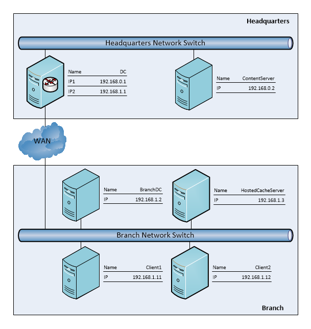

| &#32;| &#32;| &#32;| &#32;| &#32;| &#32; | &#32; |
| -------------| -------------| -------------| -------------| -------------| ------------- | ------------- |
| Role Name| Machine Name/Address Point| NIC| IPv4| Subnet Mask| Default Gateway| DNS Server| 
| DC| DC | Private| 192.168.0.1| 255.255.255.0|  &#60; empty &#62; | 127.0.0.1| 
| | | Private| 192.168.1.1| 255.255.255.0|  &#60; empty &#62; | 127.0.0.1| 
| ContentServer| ContentServer | Private| 192.168.0.2| 255.255.255.0| 192.168.0.1| 192.168.0.1| 
| BranchDC| BranchDC| Private| 192.168.1.2| 255.255.255.0| 192.168.1.1| 192.168.1.1| 
| HostedCacheServer | HCServer| Private| 192.168.1.3| 255.255.255.0|  &#60; empty &#62; | 192.168.1.2| 
| Client| Client| Private| 192.168.1.11| 255.255.255.0| 192.168.1.1| 192.168.1.2| 

## <a name="_Toc395793802"/>Computer Setup 

This section provides a general list of steps that you can use to setup the computers in a Windows-based test environment. For specific information about how to complete these steps, see the administrative guide for your operating system.

### <a name="_Toc395793803"/>Setup the DC Computer

* Setup the machine with Microsoft Windows Server 2012R2 or later. Create an account with name “administrator” and password “Password01!”

* Turn off Windows Firewall from the control panel.

* Install Active Directory Domain Services and DNS Server.

* From **Server Manager** click **Add Roles and Features**, and then click **Next** with default settings until reaching **Server Roles** page.

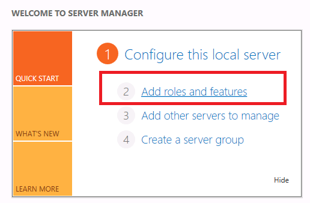

* On the **Server Roles** page of **Add Roles and Features Wizard,** check **Active Directory Domain Services** and **DNS Server**.

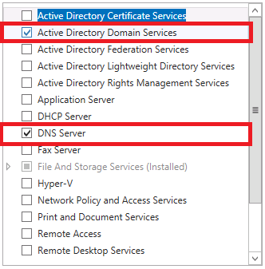

Click **Next** with default settings, **install** the services on the last wizard page.

* Create domain with the name “contoso.com”.

Promote DC configuration: Open the ADDS Configuration Wizard and choose “Add a new forest” and input the domain name (e.g. contoso.com)

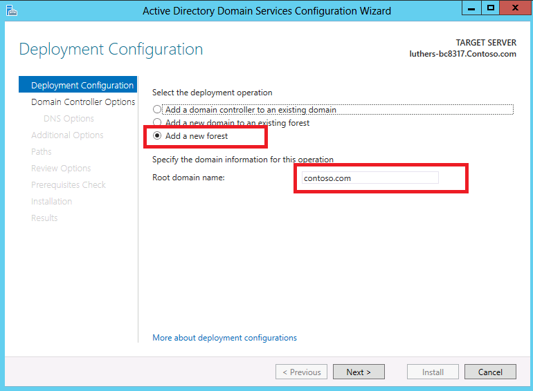

Keep the default settings and set the password, such as “Password01!”

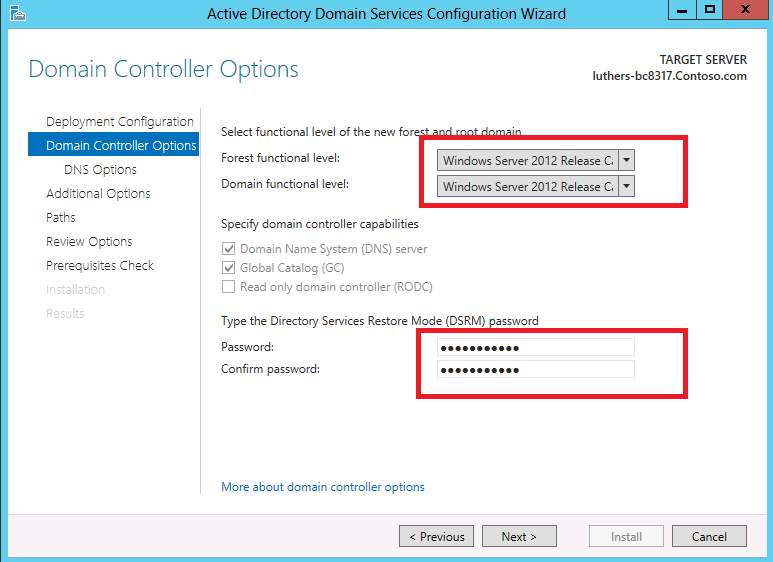

Click **Next** through each section keeping default settings, and click **Install** to finish the configuration.

* Install and configure the routing service

From **Server Manager** click **Add Roles and Features.**

Click **Next** with default settings until reaching the **Server Roles** page. Select **Remote Access** and make sure to check **Routing** on the **Role Services** page. Then click **Next** with default settings, **install** the services on the last wizard page.

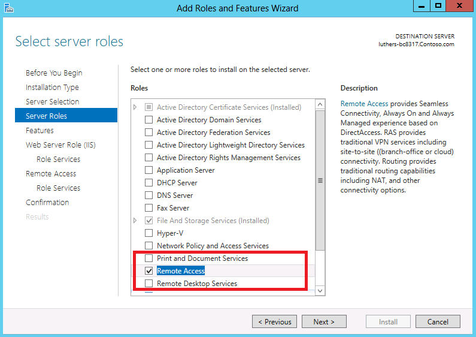

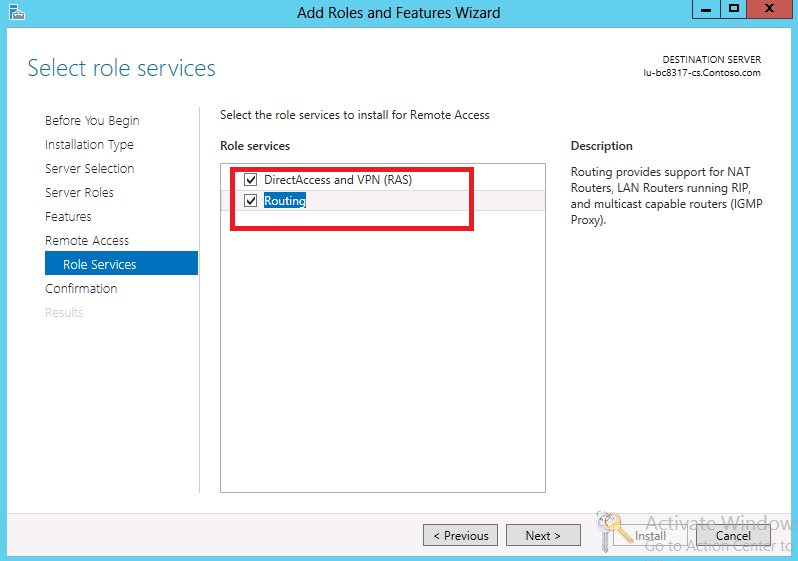

* Open **Server Manager** and choose “**Routing and Remote Access**” from “**Tools**”, then open the routing and remote access console:

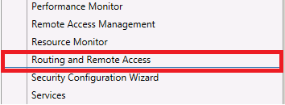

Right click the local machine name and choose **Configure and Enable Routing and Remote Access**:

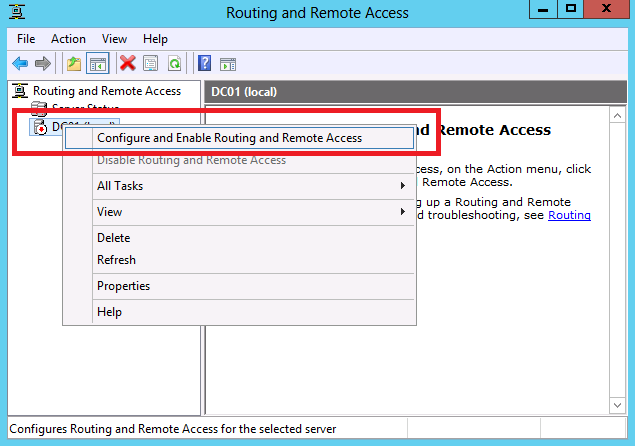

Follow the wizard and Click **Next**, on **Routing and Remote Access Server Setup Wizard**, choosing **Custom Configuration:**

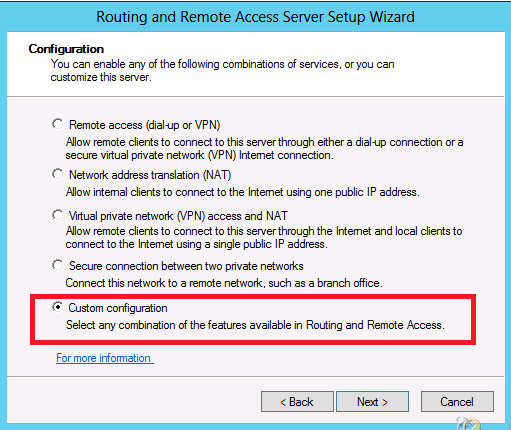

Click **Next** and choose **LAN routing**:

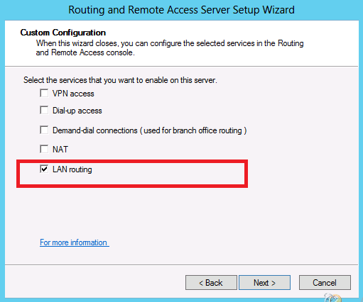

Click **Finish** with default settings to finish the configuration and click **Start service** to enable the routing service:

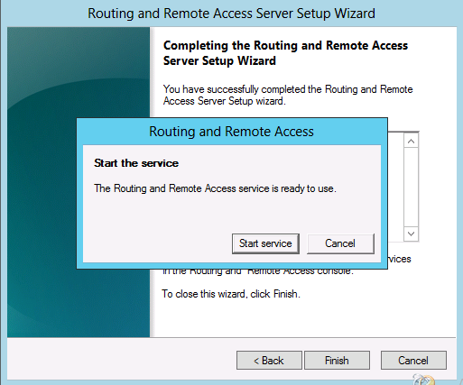

### <a name="_Toc395793804"/>Setup the ContentServer Computer

* Setup the machine with Microsoft Windows Server 2012R2 (or above version). Create an account with name “administrator” and password “Password01!”

*  Join domain “contoso.com”.

* Turn off Windows Firewall from the control panel

### <a name="_Toc395793805"/>Setup the BranchDC Computer

*  Setup the machine with Microsoft Windows Server 2012R2 (or above version). Create an account with name “administrator” and password “Password01!”

* Turn off Windows Firewall from the control panel.

* Install Active Directory Domain Services and DNS server.

* From **Server Manager** click **Add Roles and Features** and click **Next** with default settings.

* On the **Server Roles** page of Add Roles and Features Wizard, check **Active Directory Domain Services** and **DNS Server**.

Click **Next** with default settings and click **install** to install the services on the last wizard page.

* Configure the computer as a RODC (Read-Only Domain Controller) for “contoso.com” domain. 

**Promote** the configuration after installation finishes.

Click the **notifications** and choose **Promote this server to a domain controller**.

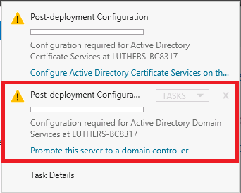

On the **Deployment Configuration** page, choose **Add a domain controller to an existing domain**. Then **Select** or **Fill** the Domain name field provided by Headquarters DC (e.g.contoso.com), and supply the credentials to perform the operation.

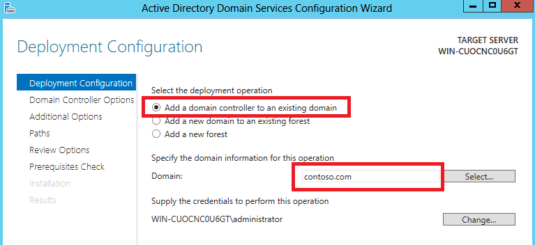

Click **Next** with default settings. On the Domain Controller Options page, check **RODC**, and choose the **Site name**, enter the password and click **Next**.

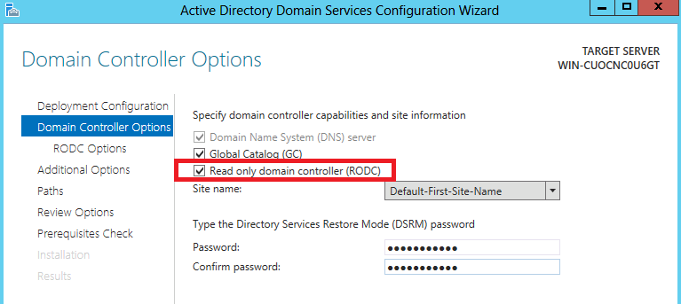

Click **Next**, on the **Additional Options** page, choose **Replicate from** the DC installed on Headquarters network (e.g.HeadquartersDC.Contoso.com)

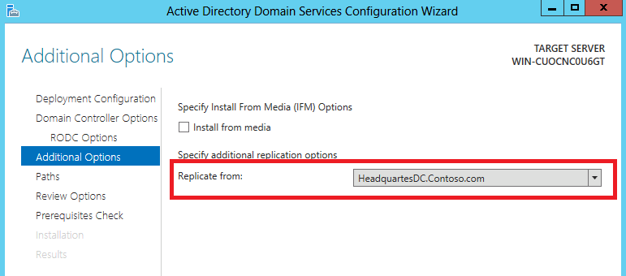

Click **Next**, on the **Paths** page, choose the storage locations for the specified folders or use default settings:

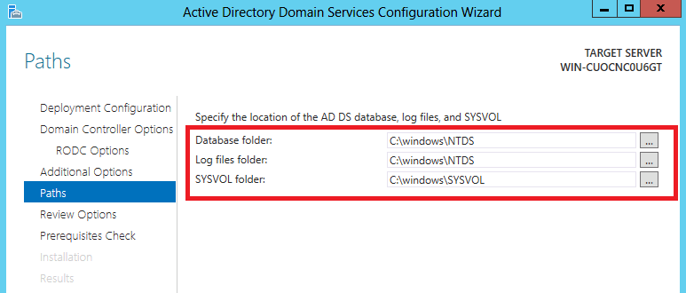

Click **Next** with default settings until reaching the **Prerequisites Check** page**.** Click **Install** to install all the features configured above.

### <a name="_Toc395793806"/>Setup the HostedCacheServer Computer

* Setup the machine with Microsoft Windows Server 2012R2 (or above version). Create an account with name “administrator” and password “Password01!”

* Join domain “contoso.com”.

* Turn off Windows Firewall from control panel.

### <a name="_Toc395793807"/>Setup the Client Computer

* Setup the machine with Microsoft Windows 8.1. Create an account with name “administrator” and password “Password01!”

* Join domain “contoso.com”.

* Turn off Windows Firewall from the control panel.

### <a name="_Toc395793808"/>Verify the Connectivity

After the network setup is finished, verify the connectivity from Client to ContentServer and from Client to HostedCacheServer. Log in Client and then use the following command to check the connectivity between the computers:

* Open PowerShell window;

* Type following commands below to check:

	_Ping ContentServer_ 

	_Ping HCServer_

Do not proceed with the configuration of the test suite until connectivity is confirmed. Any issue with network connectivity must be resolved before test suite configuration.

### <a name="_Toc395793809"/>Installed Files and Folders

Install BranchCache.msi on Client, after installation succeed, the following folders and files will be added, which you can find in the location: C:\MicrosoftProtocolTests\BranchCache\ _&#60; version &#35;  &#62;_ \

Note 

>The  _&#60; version &#35;  &#62;_  placeholder indicates the installed build of the test suite.

|  **File or Folder**|  **Description**| 
| -------------| ------------- |
| Batch| Command files that you can use to run test cases| 
| Bin| Test suite binaries and configuration files| 
| Docs| The version of each of the following protocol specifications used to develop this test suite:| 
| | **MS-PCCRC.pdf** | 
| | **MS-PCCRD.pdf** | 
| | **MS-PCCRTP.pdf** | 
| | **MS-PCCRR.pdf**| 
| | **MS-PCHC.pdf** | 
| | **BranchCache_UserGuide.md** – A user guide that explains how to install and configure the DC, the ContentServer, the BranchDC, the HostedCacheServer, the Client, and how to run test cases.| 
| | **BranchCache_TestDesignSpecification.md** – An overview document containing references to the test suite designs for MS-PCCRC, MS-PCCRD, MS-PCCRTP, MS-PCHC and MS-PCCRR.| 
| Infrastructure| The protocol SDK source code| 
| Source| Test suite source code| 
| EULA.rtf| The End User License Agreement| 

## <a name="_Toc395793810"/>Configuration 

This section explains how to configure computers for a Windows-based test environment. 

### <a name="_Toc395793811"/>Configure the Content Server Computer

* Install BranchCache roles

On the **Server Roles** page of the Add Roles and Features Wizard, expand  **File And Storage Services**, then expand **File and iSCSI Services.** Check **BranchCache for Network Files** and **Web Server (IIS)**, and then click **Next**.

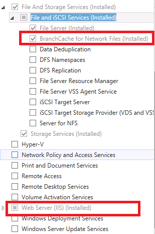

On the next page, check **BranchCache** feature:

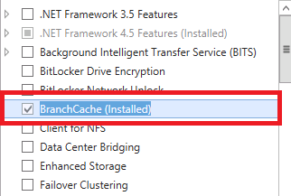

* Click **Next** with default settings until installation finished.

* Set PowerShell’s execution policy

Start PowerShell window with administrator privileges and run the following command

_Set-ExecutionPolicy Unrestricted_

**Note** 

_If the OS is 64 bits, launch the 32 bits PowerShell with administrator privileges     from %SystemRoot%\SysWOW64\WindowsPowerShell\v1.0\ PowerShell.exe and run the above command again._

* Set the secret key for Content Server

Start PowerShell window with administrator privileges and run the following command

_Netsh branchcache set key “server secret”_

* Restart branch cache service

Start PowerShell window with administrator privileges and run the following command

_Restart-service peerdistsvc_

* Enable the Content Server support SMB transport for BranchCache V1 and V2: 

Start PowerShell window and type “gpedit” to open Local Group Policy Editor, and then expand **Computer Configuration- &#62; Administrative Templates- &#62; Network- &#62; Lanman Server**:

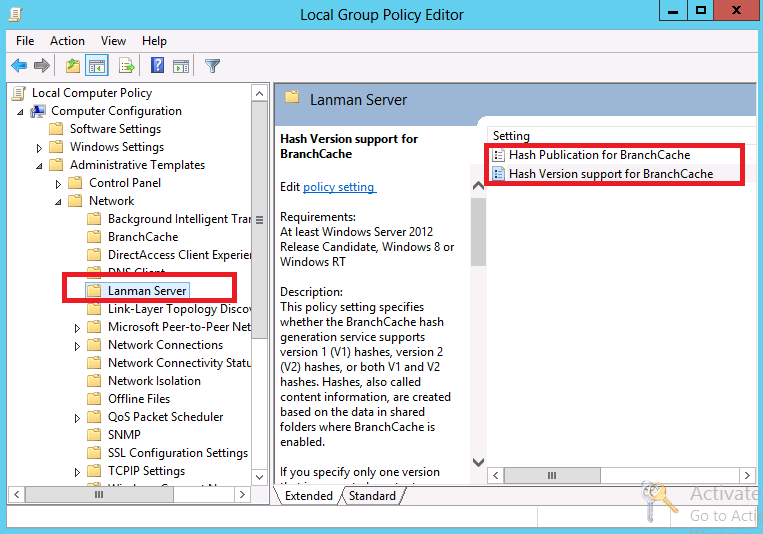

Double-click **Hash** **Publication for BranchCache**, and choose **Enabled** to allow hash publication for all shared folders:

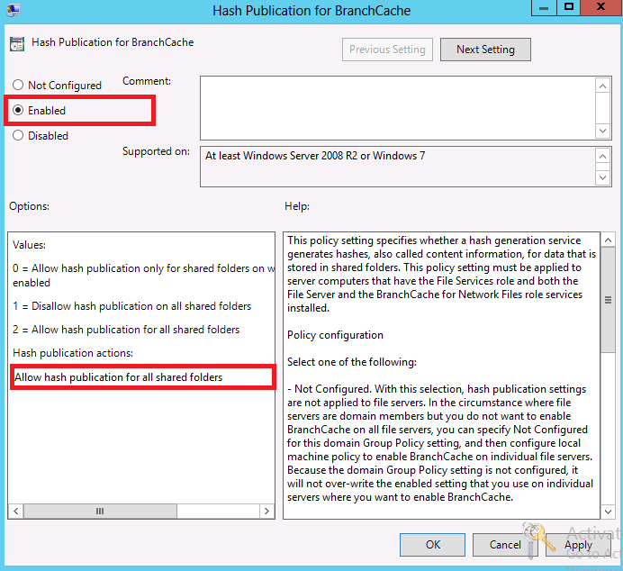

Double-click **Hash Version support for BranchCache**, and choose **Enabled.** For the **Hash version supported** choose **supports V1 as well as V2 versions**.

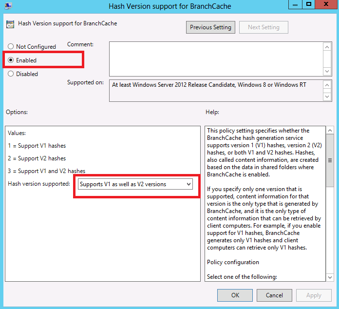

### <a name="_Toc395793812"/>Configure the HostedCacheServer Computer

* Install branch cache related roles and features

From **Server Manager** click **Add Roles and Features** and click **Next** with default settings.

Click **next** with default settings until reaching the **features** page. Check the **BranchCache** feature：

Click **Next** with default settings until installation finished.

* Set PowerShell execution policy

Start PowerShell window with administrator privileges and run the following command

_Set-ExecutionPolicy Unrestricted_

**Note** 

_If the OS is 64 bits, launch the 32 bits PowerShell with administrator privileges      from %SystemRoot%\SysWOW64\WindowsPowerShell\v1.0\PowerShell.exe and run the above command again._

* Generate a self-signed certificate by command on the powershell.

Start PowerShell window with administrator privileges and run the following command:

_New-SelfSignedCertificate -DnsName "CN= HCServer" -CertStoreLocation "cert:\LocalMachine\My"_

* Run the command to add the cert to SSLCert. Copy the thumbprint value without spaces from the “Details” tab and insert into “ &#60; thumbprint &#62; ” in the command below.

Start PowerShell window with administrator privileges and run the following command:

_NETSH HTTP ADD SSLCERT IPPORT=0.0.0.0:443 CERTHASH=” &#60; thumbprint &#62; ” APPID=”{d673f5ee-a714-454d-8de2-492e4c1bd8f8}”_

* Enable the hosted cache server role

Start PowerShell window with administrator privileges and run the following command

_Enable-BCHostedServer_

* Restart branch cache service

Start PowerShell window with administrator privileges and run the following command

 _Restart-service peerdistsvc_

### <a name="_Toc395793813"/>Configure the Client Computer

* **Note** 

The following configuration is needed for Client

* Set PowerShell execution policy

Start PowerShell window with administrator privileges and run the following command

_Set-ExecutionPolicy Unrestricted_

If the OS is 64 bits, launch the 32 bits PowerShell with administrator privileges from %SystemRoot%\SysWOW64\WindowsPowerShell\v1.0\PowerShell.exe and run the above command again.

* Trust HostedCacheServer certificate

Copy the certificate generated on HostedCacheServer

Run mmc.exe to open the console, under **File** tab, choose **Add/Remove Snap-in** to open the window

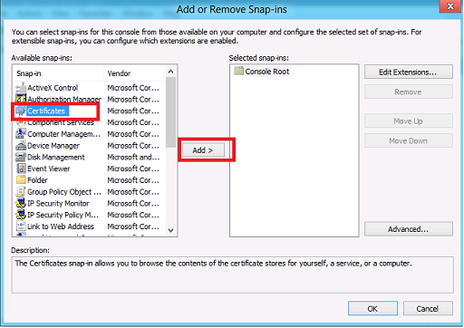

Choose **Certificate,** and then click **Add** and choose **Computer account**:

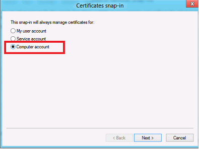

Click **Next** with default settings to finish the snap-in. On the console, expand the **Certificates (Local Computer)**, and right click **Trusted Root Certification Authorities- &#62; All Tasks- &#62; Import** to import the cert. Then follow the import wizard with default settings to finish the import.

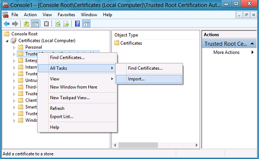

### <a name="_Toc395793814"/>Configure the Branch Cache Test Suite

This test suite is installed with default configuration settings. You may need to change these settings if you use a customized test environment or if you customize your test runs. 

 **Note** 

>The property values of the .ptfconfig file are automatically set during the configuration process.

To change configuration settings, edit the **BranchCache_TestSuite.deployment.ptfconfig** file. You can find this file in the directory:

_C:\MicrosoftProtocolTests\BranchCache\_ &#60; version &#35;  &#62; _\Bin._

#### <a name="_Toc395793815"/>Required Configuration Settings

The following table describes the required properties that are defined in the test suite configuration file.

|  **Property**|  **Description**| 
| -------------| ------------- |
|  **ContentServerHTTPListenPort**| The port number used to listen for ContentServer HTTP connection requests.| 
| | Default Value: **80**| 
|  **HostedCacheServerHTTPListenPort**| The port number used to listen for HostedCacheServer HTTP connection requests.| 
| | Default Value: **80**| 
|  **HostedCacheServerHTTPSListenPort**| The port number used to listen for HostedCacheServer HTTPS connection requests.| 
| | Default Value: **443**| 
|  **ClientContentRetrievalListenPort**| The port number used to listen for client content retrieve requests.| 
| | Default Value: **8282**| 
|  **Timeout**| The maximum time in seconds to wait for the message arrive, operation finish.| 
| | Default Value: **60**| 
|  **RetryInterval**| The retry interval in seconds.| 
| | Default Value: **1**| 
|  **NegativeTestTimeout**| The maximum time in seconds to wait for the message arrive, operation finish, used in negative test cases.| 
| | Default Value: **10**| 

#### <a name="_Toc395793816"/>Optional Configuration Settings

The following table describes the optional configuration properties and provides sample values. 

|  **Property**|  **Description**| 
| -------------| ------------- |
|  **DomainName**| If using domain environment, use this setting to define the domain name of the test environment | 
| | Default value: **contoso.com**| 
|  **UserName**| Use this setting to define the security account user name for all the computers in a domain environment. | 
| | Default value: **administrator**| 
|  **UserPassword**| The password for the UserName account for all the computers in a domain environment.| 
| | Default value: **Password01!**| 
|  **ContentServerComputerName**| The machine name for the computer acts as content server.| 
| | Default value: **ContentServer**| 
|  **HostedCacheServerComputerName**| The machine name for the computer acts as hosted cache server (only in hosted cache mode).| 
| | Default value: **HCServer**| 
|  **ContentTransport**| The transport protocol used to retrieve content, the value can be set as **SMB2** or **PCCRTP** according to customer choice.| 
| | Default value: **PCCRTP**| 
|  **SupportBranchCacheV1**| The value specifies whether the test case supports BranchCache V1 or not.| 
| | Default value: **true**| 
|  **SupportBranchCacheV2**| The value specifies whether the test case supports BranchCache V2 or not (BranchCache V2 is supported only in Win8 and later version).| 
| | Default value: **true**| 
|  **SecurityPackageType**| The value specifies the security package for file share authentication, can be set as **Negotiate**, **Kerberos** or **Ntlm**.| 
| | Default value: **Negotiate**| 
|  **ServerSecret**| The value used by ContentServer to derive key in hash.| 
| | Default value: **server** **secret**| 
|  **WebsiteLocalPath**| The value specifies the local path of the folder containing web files.| 
| | Default value: **c:\inetpub\wwwroot**| 
|  **SharedFolderName**| The value specifies the folder name contains the files for share.| 
| | Default value: **FileShare**| 
|  **FileShareLocalPath**| The value specifies the local path of the shared folder.| 
| | Default value: **c:\FileShare**| 
|  **NameOfFileWithMultipleSegments**| The value specifies the name of the test file which will be divided into multiple segments.| 
| | Default value: **MultipleSegments.txt**| 
|  **NameOfFileWithMultipleBlocks**| The value specifies the name of the test file which will be divided into multiple blocks.| 
| | Default value: **MultipleBlocks.txt**| 
|  **NameOfFileWithSingleBlock**| The value specifies the name of the test file which will be only divided into one block.| 
| | Default value: **SingleBlock.txt**| 
|  **SupportWebsiteForcedHashGeneration**| The value specifies whether the test suite supports forced hash generation for website or not. | 
| | Default value: **false**| 
|  **SupportFileShareForcedHashGeneration**| The value specifies whether the test suite supports forced hash generation for file share or not. | 
| | Default value: **true**| 

Note

* _MultipleSegments.txt: The size of this file should be larger than 32MB to make sure that it can be divided into multiple segments for testing._

* _MultipleBlocks.txt: The size of this file should be larger than 64KB and smaller than 10MB to make sure that it can be divided into multiple blocks for testing._

* _SingleBlock.txt: The size of this file should be smaller than 64KB to make sure that it can be only divided into one block testing._
The following settings should be applied on **ContentServer**:
Put these files(Including MultipleSegments.txt, MultipleBlocks.txt and SingleBlock.txt) under **C:\FileShare**, set the properties as below to make it can be shared by everyone: Right-click the property of the folder and select **sharing**  tab, click **share** and input **everyone** to make it can be shared by everyone. And then click **Advanced Sharing** to open a new Advanced Sharing Window, click **Caching** on this window to open **Offline Settings** and check **Enable BranchCache.** 
Also need to put these files under **C:\inetpub\wwwroot** for **PCCRTP** transport using.

## <a name="_Toc395793817"/>Run Test Cases 

Note

Before running the test cases, you can modify the configuration file accordingly: from the              desktop double-click **Open Branch Cache Test Suite Directory** and go to **Bin** folder, open **BranchCache_TestSuite.deployment.ptfconfig** and modify it if needed.

Log on to **Client** with account **contoso\administrator** and password **Password01!**

### <a name="_Toc395793818"/>Run the BVT Test

This test suite includes a set of basic tests called "BVT". Together these test cases perform a basic functionality test to evaluate the implementation on ContentServer and HostedCacheServer. Use the options below to run all BVT test cases.

* From the desktop double-click the **Run Branch Cache Test Cases** shortcut

* Select the SUT (System under test)

* Select content information transport (Optional, only when Content Server is selected as SUT)
**Note** 

* _There are two kinds of transport test cases currently support: PCCRTP and SMB2. From batch file, you can select one of them to run. Select PCCRTP means that all the test cases with category PCCRTP are in the ready to run list, under this situation, you need to update the the property value in named “ContentTransport” in BranchCache_TestSuite.deployment.ptfconfig to “PCCRTP”, so does for transport “SMB2”._

* Select the branch cache version

* Select the BVT only test cases

### <a name="_Toc395793819"/>Run All Test Cases

Use the steps below to run all test cases.

* From the desktop double-click the **Run Branch Cache Test Cases** shortcut

* Select the SUT (System Under Test)

* Select the  content information transport (Optional, only when Content Server is selected as SUT)

* Select the branch cache version

* Select all test cases

### <a name="_Toc395793820"/>Run Test Cases with source code from Visual Studio

Use the steps below to run specific test cases.

* From the desktop, double-click the **Open Branch Cache Test Suite Directory** shortcut

* Double click through Source\BranchCache\TestCode

* Start Visual Studio with administrator privileges

* Open BranchCache.sln in the previously started Visual Studio, and build the solution

* When you build the test project, the test cases appear in **Test Explorer**. If Test Explorer is not visible, choose **Test** on the Visual Studio menu, choose **Windows**, and then choose **Test Explorer**

* Select test cases and run

### <a name="_Toc395793821"/>Check Test Results
The handling of test results involves both the review of the log files and the management of their generation. This section describes those topics.

#### <a name="_Toc395793822"/>Review the log files

You can find the log files in the **TestResults** directory, a subdirectory of Batch folder in the test suite installation directory. The log files that contain test suite results use a  **&#42; .trx** file name, in which the asterisk (" &#42; ") character represents the user name, the protocol name, or both.

Additional log files are used for generating requirement coverage reports and diagnosing test issues. Their settings can be found in the  **&#42; .ptfconfig** or  **&#42; .deployment.ptfconfig** files. The file names, corresponding paths, and formats can be set in the Sinks node of the configuration file. 

The following instruction provides an example of how to cause log entries for the "XMLLog" logging sink to be written into the BranchCache_Log.xml file in the current directory, you can remove this rule if you don’t want to write this entry into log.

&#60; File id="XMLLog" directory=".\TestLog" file="BranchCache_Log.xml" format="xml"/ &#62; 

#### <a name="_Toc395793823"/>Manage the generation of log files
For further information about logging in the Protocol Test Framework (PTF), see the _PTF User Guide_ in the PTF installation directory.

## <a name="_Toc395793824"/>Debug Test Cases 

You can use the Visual Studio solution (.sln) file included with this test suite to debug additional test cases created to test protocol implementations.

Note 
Copy BranchCache_TestSuite.deployment.ptfconfig from C:\MicrosoftProtocolTests\BranchCache\ &#60; version &#35;  &#62; \Bin to C:\MicrosoftProtocolTests\BranchCache\ &#60; version &#35;  &#62; \Source\BranchCache\TestCode\TestSuite and replace the original file.

To debug a test case

* On the computer running the test suite, use Microsoft® Visual Studio® with Administrator privileges to open the following solution file:
C:\MicrosoftProtocolTests\BranchCache\ _&#60; version &#35;  &#62;_ \Source\BranchCache\TestCode\BranchCache.sln

* In the Solution Explorer window of Visual Studio, right-click the **Solution 'BranchCache'**, and select **Build Solution**.

* When you build the test project, the test cases appear in **Test Explorer**. If Test Explorer is not visible, choose **Test** on the Visual Studio menu, choose Windows, and then choose Test Explorer.

* Select the test cases from **Test Explorer** and debug them.

To use the debug tool

Note 

>This **Hash Generation and Verification Tool** is used to verify whether the hash value recieved from the remote server is consistent with local calculations. The tool can also be used just to calculate the hash value of a local file.

* This debug tool can be found on the desktop after the BranchCache test suite is installed, double-click the shortcut to open the tool. The window is shown as below:

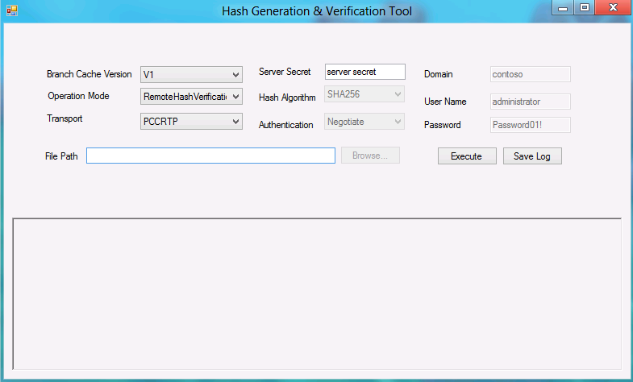

* Configure the options below to enable the debug tool:

	* **Branch Cache Version:** Choose V1 or V2 to support the BranchCache according to the implementation guidelines.
	
	* **Operation Mode:** **RemoteHashVerification** is used to verify whether the hash generation of remote server is consistent with the local-calculated one; **LocalHashGeneration** is used to calculate the hash value of the appointed local file. 
	
	* **Transport:** The transport supports PCCRTP and SMB2. If PCCRTP is chosen, you should input the file path like “[http://Server/FileName.txt](http://server/FileName.txt)” in the next File Path; Else if SMB2 is chosen, the file path input should be like [\\Server\SharedFolder\FileName.txt](file://server/SharedFolder/FileName.txt). Otherwise you can use **Browse** to point to the remote file location.

	* **Hash Algorithm:** This option is set according to the version you choose. This is based on the protocol and not configurable.

	* For other options, such as Domain, User Name, Password, Authentication, you can configure them in the input box, or read them from configuration file.

* After the above configurations are set, click **Execute** to run the tool. If there are no errors during verification, the result will be shown as below:

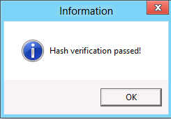

Otherwise, the result will be shown as below:

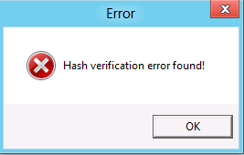

And the specific error information is shown on the panel with highlight prompt as below:

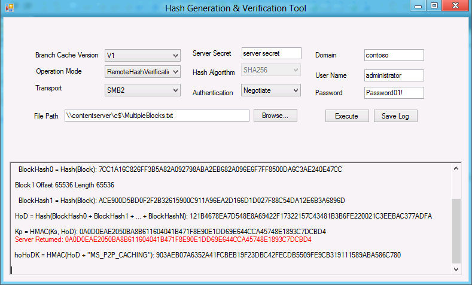

* You can save the error log to a specified location by clicking **Save Log**.

## <a name="_Toc395793825"/>Troubleshooting 

This section describes how to troubleshoot common issues in running test cases.

**Ping failure:**

| &#32;| &#32; |
| -------------| ------------- |
| PROBLEM| The ContentServer does not respond to pings from the Client computer.| 
| CAUSE| The LAN Routing service of DC hasn’t been started, or the ContentServer firewall is enabled. | 
| RESOLUTION| Start the LAN Routing service or disable the SUT firewall.| 

| &#32;| &#32; |
| -------------| ------------- |
| PROBLEM| The HostedCacheServer does not respond to pings from the Client computer.| 
| CAUSE| The Client computer is not in the same network segment, or the HostedCacheServer firewall is enabled. | 
| RESOLUTION| Move the Client computer and the HostedCacheServer to the same network segment or disable the SUT firewall.| 

**Add SSL cert failure:**

| &#32;| &#32; |
| -------------| ------------- |
| PROBLEM| The HostedCacheServer cannot add the self-signed certificate to appointed ipport.| 
| CAUSE| The generated cert didn’t include a private key or caused by windows issues. | 
| RESOLUTION| Re-generate a self-signed cert with a private key or export the cert and import again, please refer to [Configure the HostedCacheServer Computer.](#_Toc395793812)| 

**Load test container failure:**

| &#32;| &#32; |
| -------------| ------------- |
| PROBLEM| Unable to load the test container or one of its dependencies.| 
| CAUSE| Protocol Test Framework is not installed.| 
| RESOLUTION| Install Protocol Test Framework, refer to [section 5.11](#_Toc395793799) for more details.| 

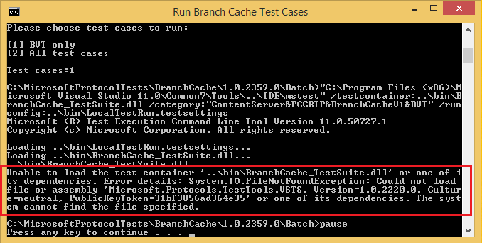

