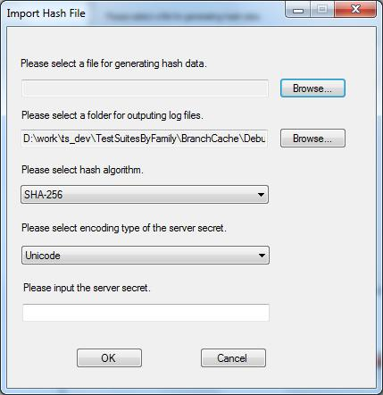
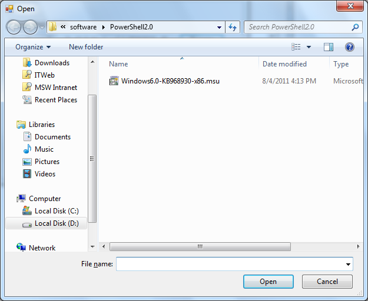
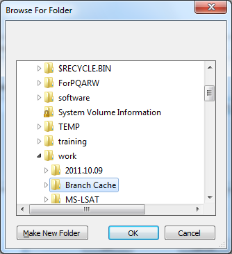
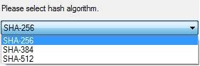
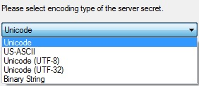
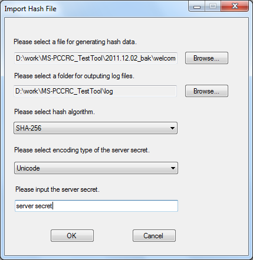
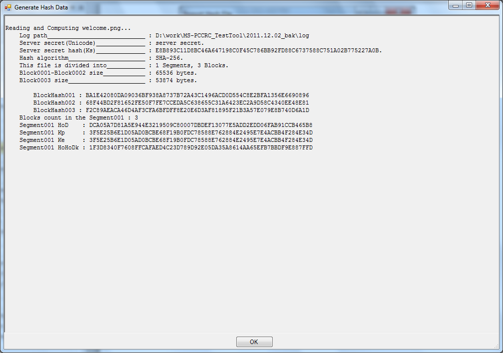

###MS-PCCRC Debug Tool User Guide 

## **Contents**
* [Using the MS-PCCRC Debug Tool](#_Toc314234421)
    * [About MS-PCCRC Debug Tool](#_Toc314234422)
		* [Features Highlights](#_Toc314234423)
		* [Required Software to Use MS-PCCRC Debug Tool](#_Toc314234424)
		* [Supported Operating Systems](#_Toc314234425)
    * [Installing MS-PCCRC Debug Tool](#_Toc314234426)
    * [Using MS-PCCRC Debug Tool](#_Toc314234427)
    * [Examples of MS-PCCRC Debug Tool Output Log](#_Toc314234428)

### <a name="_Toc314234421"/>**Using the MS-PCCRC Debug Tool**

MS-PCCRC Debug Tool is software to enable a user to verify the implementation of the MS-PCCRC formulae that is used to generate ContentInfo. This guide contains the following topics:

* “[About MS-PCCRC Debug Tool](#abouttool)” on page 3.

* “[Installing MS-PCCRC Debug Tool](#installtool)” on page 3.

* “[Using MS-PCCRC Debug Tool](#usingtool)” on page 3.

* “[Example of Using MS-PCCRC Debug Tool](#example)” on page 7.

### <a name="_Toc314234422"/>**About MS-PCCRC Debug Tool**
You can use MS-PCCRC debug tool to read a file to generate the hash data. The tool can help you to record the generating process and output the segments and block information to different log files. The output results contain Ks, block data, block hash data, HoD, Kp, Ke and HoHoDk. You can find the mistakes of the MS-PCCRC formulae implementation by comparing with your results.

#### <a name="_Toc314234423"/>**Features Highlights**

* The output box shows the hash data generation process and the results of each process.

* All the results are output to log files that contain all segments and blocks information.

#### <a name="_Toc314234424"/>**Required Software to Use MS-PCCRC Debug Tool**
You need to install Net Framework 4.0 before using the MS-PCCRC Debug Tool

#### <a name="_Toc314234425"/>**Supported Operating Systems**
MS-PCCRC Debug Tool supports the operating systems Windows 7 and Win2K8 R2(or above version). Other OS is not tested and not official supported.

### <a name="_Toc314234426"/>**Installing MS-PCCRC Debug Tool**
The MS-PCCRC Debug Tool is available as an .exe file. Double Click the .exe file.
For instructions on running the tool, see the following section.

### <a name="_Toc314234427"/>**Using MS-PCCRC Debug Tool**
The following are step by step instructions for a Windows using:

* Figure-1 shows after double click the .exe file:

* If you want to select a file for generating hash data, please click the first ‘Browse’ button in [figure-1](#figure1), and you can see the figure-2. 

* Select a local file and then click the ‘Open’ button to set selected path to text box. 

* If you click ‘Cancel’ button, will be back to the [figure-1](#figure1) with noting selected. 

* Set a folder for outputting the log files, the default path is current directory, if you want to change the path, please click the second ‘Browse’ button in [figure-1](#figure1), and you can see the figure-3.

* If you want to create a new folder, please click the ‘Make New Folder’ button and then click ‘Ok’ button;

* If you  want to select an existed folder, please select it and click ‘ Ok’ button;

* If you want to quit the selection, please click ‘Cancel’ button.

* If you want to select hash algorithm, please select one from the list in the figure-4. There are three types of hash algorithm and the default one is ‘SHA-256’.

* If you want to select encoding type of the server secret, please select one from the list in the figure-5. There are five encoding types and the default one is ‘Unicode’.

* If you want to input the server secret, please fill-in a non-empty string in the blank dialog in [figure-1](#figure1). 

* If you complete all the sections and information inputting in the step 1, you can see figure-6:

* If you click ‘Ok’ button in figure-6, you can see figure-7 that records the hash data generation process as well as the results in each step. Click ‘Ok’ button, you will be back to [figure-6.](#figure6)

* If you click ‘Close’ button in figure-7, you will exit MS-PCCRC debug tool.

### <a name="_Toc314234428"/>**Examples of MS-PCCRC Debug Tool**  **Output Log**

* Output the file info under the directory LogPath\welcome2. The file “FileInfo.log” contains Ks, Hash Algorithm, Segment count, Block count and every Block size.

* Output the segment001 info under the directory LogPath\welcome2\Segment001.

* The file “Segment001Info.log” contains HoD, Kp, Ke and HoHoDk.

* Output the block001 data and block001 hash data of the segment001 under the directory LogPath**\**welcome2\Segment001\Block001. The file “Block001Data.log” contains the block001 data. The file “Block001Hash.log” contains the block001 hash data.