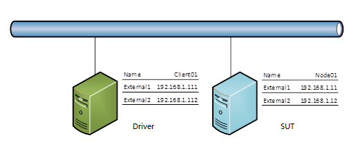
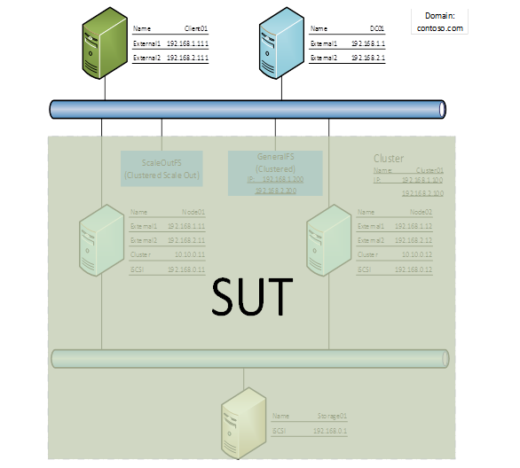

# File Server Protocol Family Setup Script User Guide

## 1. Introduction

This guide provides instructions for using the automated setup scripts to configure test environments for the File Server Protocol Family Test Suite. These scripts automate many of the manual steps described in the [FileServerUserGuide.md](https://github.com/microsoft/WindowsProtocolTestSuites/blob/main/TestSuites/FileServer/docs/FileServerUserGuide.md).

The scripts support three environment configurations:
- **WORKGROUP** - Simple peer-to-peer environment with two machines
- **DOMAIN** - Domain environment with three or more machines. Most closely resembles a real world environment containing a Domain Controller
- **CLUSTER** - Domain environment with failover clustering for high availability testing

**Tip**

To learn more about the common environment in which test cases are run for all **Test Suites**, see the [Protocol Test Framework User Guide](https://github.com/microsoft/ProtocolTestFramework/blob/main/docs/PTFUserGuide.md).


## 2. Prerequisites

Before using these scripts, ensure you have:
- Windows systems with supported operating systems
  - SUT: Windows Server 2012 R2 or later
  - Driver: Operating system that can install .NET 5.0
  - Domain Controller (if applicable): Windows Server 2012 R2 or later
- Network connectivity between all machines
- Administrator access on all machines
- Sufficient disk space (at least 60 GB per machine)
- Windows PowerShell 5.1 or later


-- **REFER to [FileServerUserGuide.md](https://github.com/microsoft/WindowsProtocolTestSuites/blob/main/TestSuites/FileServer/docs/FileServerUserGuide.md) for more information** --

A configuration file is required to run any of the setup scripts. Here's a summary of some of the data needed in the configuration file:

| **Category** | **Field**       | **Scenario**                                                                   | **Example Value**                           | **Comment**                                                                                           |
| ------------ | --------------- | ------------------------------------------------------------------------------ | ------------------------------------------- | ----------------------------------------------------------------------------------------------------- |
| Core         | Username        | ALL                                                                            | Administrator                               | Username for the machines                                                                             |
|              | Password        | ALL                                                                            |                                             | Password for the machines                                                                             |
|              | TestSuiteName   | ALL                                                                            | FileServer                                  | Name of the test suite                                                                                |
|              | Scenario        | ALL -  [Workgroup \|\| Domain \|\| Cluster]                                    | Cluster                                     | Scenario type (Cluster, Domain or Workgroup)                                                          |
|              | DomainName      | Domain, Cluster                                                                | contoso.com                                 | Domain name for the machines                                                                          |
|              | RegressionType  | ALL -  [Local]                                                                 | Local                                       | Type of regression                                                                                    |
|              | UseAgent        | ALL  -  [true \|\| false]                                                      | false                                       | true if setting up remotely, i.e. using an agent [Coming Soon]                                        |
| Machine      | Role            | ALL -  [DC \|\| Storage \|\|  SUT \|\| Node01 \|\| Node02 \|\| DriverComputer] | DC, Storage, Node01, Node02, DriverComputer | Role of the machine                                                                                   |
|              | HyperVName      | ALL                                                                            | DC01, Storage01, Node01, Node02, Driver     | Hyper-V name of the machine/preferred HyperVisor                                                      |
|              | ComputerName    | ALL                                                                            | DC01, Storage, Node01, Node02, Client01     | Name of the machine                                                                                   |
|              | OS              | ALL - [Windows \|\| Linux]                                                     | Windows                                     | Operating System of the machine                                                                       |
|              | IsClusterNode   | Cluster                                                                        | true/false                                  | true if the machine is a cluster node                                                                 |
|              | Domain          | Domain, Cluster                                                                | contoso.com, Workgroup                      | Domain name of the machine; set to Workgroup if workgroup configuration or leave empty as appropriate |
|              | iSCSITarget     | Cluster -  [true \|\| false]                                                   | true                                        | true if the machine is an iSCSI target [Required for Cluster setup]                                   |
|              | iSCSITargetName | Cluster                                                                        | ClusterTarget                               | Name of the iSCSI target [Required for Cluster setup]                                                 |
| Network      | NIC             | ALL                                                                            | External1, External2, iSCSI, Cluster        | Name of the network interface card                                                                    |
|              | Ip              | ALL                                                                            | Various (e.g., 192.168.1.1, 10.10.0.11)     | IP address of the machine or endpoint                                                                 |
|              | Subnet          | ALL                                                                            | 255.255.255.0                               | Subnet mask of the machine                                                                            |
|              | Gateway         | Domain/ Cluster                                                                | Various or empty                            | Default gateway of the machine                                                                        |
|              | DNSServer       | Domain/ Cluster                                                                | Various or empty                            | DNS server of the machine                                                                             |
| Endpoints    | Endpoint Name   | Cluster                                                                        | Cluster01, GeneralFS, InfraFS, ScaleoutFS   | Names of configured endpoints                                                                         |


**Table 1. Configuration file guide**

## Workgroup Environment
The WORKGROUP environment consists of two test machines as follows:

- Driver computer - System on which the test suites will be installed and run
- SUT computer - **S**ystem **U**nder **T**est


### Network Setup


| Machine Name/Access Point | NIC       | IPv4          | Subnet Mask   |
| ------------------------- | --------- | ------------- | ------------- |
| Client01                  | External1 | 192.168.1.111 | 255.255.255.0 |
|                           | External2 | 192.168.1.112 | 255.255.255.0 |
| Node01                    | External1 | 192.168.1.11  | 255.255.255.0 |
|                           | External2 | 192.168.1.12  | 255.255.255.0 |


**Table 2. Suggested machine names and network configuration for the WORKGROUP environment**



**Note**

The addresses that are specified in the IPv4 column of this table and other tables are placeholders for actual addresses that you should specify. Also, note that the Driver computer (Client01) and the SUT computer (Node01) each require dual network interface cards (NICs), as indicated by the "External1" and "External2" designations, for complete testing of all scenarios.


### Computer Setup

Before you begin, create your configuration file. This will be used to configure your machines and the test suites. A template is provided in TestSuites\FileServer\Setup\ManualSetup\Workgroup\BaseConfig.json

Create Workgroup-Package.zip by running TestSuites\FileServer\Setup\ManualSetup\Create-Package.ps1 -Scenario Workgroup -ConfigPath "Path to your\Config.json"

Perform the following steps to set up the **SUT Computer**:
1. Set up network as described in [Workgroup Network Environment](https://github.com/microsoft/WindowsProtocolTestSuites/blob/main/TestSuites/FileServer/docs/FileServerUserGuide.md#4.1) : Node01
2. Enable Administrator Account, run these scripts using Admin Account
3. Set Powershell Execution Policy Unrestricted  [NOTE] Temporary Unrestricted while I restore signing pipeline
      ``` 
      Set-ExecutionPolicy -ExecutionPolicy Unrestricted
      ```
4. Copy Workgroup-Package.zip into your SUT
5. Extract in your working directory
6. Run Configure_SUT.ps1

Perform the following steps to set up the **Driver Computer**:
1. Set up network as described in [Workgroup Network Environment](https://github.com/microsoft/WindowsProtocolTestSuites/blob/main/TestSuites/FileServer/docs/FileServerUserGuide.md#4.1) : Client01
2. Enable Administrator Account, run these scripts using Admin Account
3. Set Powershell Execution Policy
4. Copy Workgroup-Package.zip into your Driver computer
5. Extract in your working directory
6. Run Configure_Driver.ps1


## Domain Environment

The DOMAIN environment consists of at least three test machines as follows:

- Domain Controller - Responds to security authentication requests such as logging in, checking permissions, and so on, within the domain.
- Driver computer - System on which the test suites will be installed and run
- SUT computer - **S**ystem **U**nder **T**est

### Network Setup


| Machine Name/EndPoint | NIC       | IPv4          | Subnet Mask   | Default Gateway | DNS Server  |
| --------------------- | --------- | ------------- | ------------- | --------------- | ----------- |
| DC01                  | External1 | 192.168.1.1   | 255.255.255.0 | &lt;empty&gt;   | 127.0.0.1   |
|                       | External2 | 192.168.2.1   | 255.255.255.0 | &lt;empty&gt;   | 127.0.0.1   |
| Client01              | External1 | 192.168.1.111 | 255.255.255.0 | 192.168.1.1     | 192.168.1.1 |
|                       | External2 | 192.168.2.111 | 255.255.255.0 | 192.168.2.1     | 192.168.2.1 |
| Node01                | External1 | 192.168.1.11  | 255.255.255.0 | 192.168.1.1     | 192.168.1.1 |
|                       | External2 | 192.168.2.11  | 255.255.255.0 | 192.168.2.1     | 192.168.2.1 |


**Table 3. Suggested machine names and network configuration for the DOMAIN environment**

**Note**

The addresses that are specified in the IPv4 column of this table and other tables are placeholders for actual addresses that you should specify. Also, note that the Driver computer (Client01) and the SUT computer (Node01) each require dual network interface cards (NICs), as indicated by the "External1" and "External2" designations, for complete testing of all scenarios.

### Computer Setup

Before you begin, create your configuration file. This will be used to configure your machines and the test suites. A template is provided in TestSuites\FileServer\Setup\ManualSetup\Domain\BaseConfig.json

Create Domain-Package.zip by running TestSuites\FileServer\Setup\ManualSetup\Create-Package.ps1 -Scenario Domain -ConfigPath "Path to your\Config.json"


Perform the following steps to set up the **Domain Controller**:

1. Set up network as described in [Domain Network Environment](https://github.com/microsoft/WindowsProtocolTestSuites/blob/main/TestSuites/FileServer/docs/FileServerUserGuide.md#-42-domain-network-environment) : DC01
2. Set Powershell Execution Policy

      `Set-ExecutionPolicy -ExecutionPolicy Unrestricted`

3. Copy Domain-Package.zip into your DC
4. Extract in your working directory
5. Run Configure_DC.ps1

Your computer will restart several times but if configured correctly, will automatically log in and continue in the background.

**Ensure your domain controller is fully set up before setting up the other machines.**


Perform the following steps to set up the **SUT** Computer:

1. Set up network as described in [Domain Network Environment](https://github.com/microsoft/WindowsProtocolTestSuites/blob/main/TestSuites/FileServer/docs/FileServerUserGuide.md#-42-domain-network-environment) : Node01
2. Enable Administrator Account, run these scripts using Admin Account
3. Set Powershell Execution Policy Unrestricted [NOTE] Temporary Unrestricted while I restore signing pipeline

      `Set-ExecutionPolicy -ExecutionPolicy Unrestricted`

4. Copy Domain-Package.zip into your SUT
5. Extract in your working directory
6. Run Configure_SUT.ps1

Perform the following steps to set up the **Driver Computer**:

1. Set up network as described in [Domain Network Environment](https://github.com/microsoft/WindowsProtocolTestSuites/blob/main/TestSuites/FileServer/docs/FileServerUserGuide.md#-42-domain-network-environment) : Client01
2. Enable Administrator Account, run these scripts using Admin Account
3. Set Powershell Execution Policy
4. Copy Domain-Package.zip into your Driver computer
5. Extract in your working directory
6. Run Configure_Driver.ps1


## Cluster Environment

The CLUSTER environment consists of the following test machines:

- Domain Controller - Responds to security authentication requests such as logging in, checking permissions, and so on, within the domain.
- Driver computer - System on which the test suites will be installed and run
- SUT computers - **S**ystems **U**nder **T**est - Configured as failover cluster nodes
- **Storage** **A**rea **N**etwork server - Provides backend storage for the failover cluster

### Network Setup


| Machine Name/EndPoint | NIC       | IPv4          | Subnet Mask   | Default Gateway | DNS Server    |
| --------------------- | --------- | ------------- | ------------- | --------------- | ------------- |
| DC01                  | External1 | 192.168.1.1   | 255.255.255.0 | &lt;empty&gt;   | 127.0.0.1     |
|                       | External2 | 192.168.2.1   | 255.255.255.0 | &lt;empty&gt;   | 127.0.0.1     |
| Client01              | External1 | 192.168.1.111 | 255.255.255.0 | 192.168.1.1     | 192.168.1.1   |
|                       | External2 | 192.168.2.111 | 255.255.255.0 | 192.168.2.1     | 192.168.2.1   |
| Node01                | External1 | 192.168.1.11  | 255.255.255.0 | 192.168.1.1     | 192.168.1.1   |
|                       | External2 | 192.168.2.11  | 255.255.255.0 | 192.168.2.1     | 192.168.2.1   |
|                       | Cluster   | 10.10.0.11    | 255.255.255.0 | &lt;empty&gt;   | &lt;empty&gt; |
|                       | iSCSI     | 192.168.0.11  | 255.255.255.0 | &lt;empty&gt;   | &lt;empty&gt; |
| Node02                | External1 | 192.168.1.12  | 255.255.255.0 | 192.168.1.1     | 192.168.1.1   |
|                       | External2 | 192.168.2.12  | 255.255.255.0 | 192.168.2.1     | 192.168.2.1   |
|                       | Cluster   | 10.10.0.12    | 255.255.255.0 | &lt;empty&gt;   | &lt;empty&gt; |
|                       | iSCSI     | 192.168.0.12  | 255.255.255.0 | &lt;empty&gt;   | &lt;empty&gt; |
| Storage01             | iSCSI     | 192.168.0.1   | 255.255.255.0 | &lt;empty&gt;   | &lt;empty&gt; |
| Cluster01             | External1 | 192.168.1.100 |               |                 |               |
|                       | External2 | 192.168.2.100 |               |                 |               |
| GeneralFS             | External1 | 192.168.1.200 |               |                 |               |
|                       | External2 | 192.168.2.200 |               |                 |               |

**Table 4. Suggested machine names and network configuration for the Cluster environment**



**Note**

The addresses that are specified in the IPv4 column of this table and other tables are placeholders for actual addresses that you should specify. Also, note that the Driver computer (Client01) and the SUT computer (Node01) each require dual network interface cards (NICs), as indicated by the "External1" and "External2" designations, for complete testing of all scenarios.

### Computer Setup

Before you begin, create your configuration file. This will be used to configure your machines and the test suites. A template is provided in TestSuites\FileServer\Setup\ManualSetup\Cluster\BaseConfig.json

Create Cluster-Package.zip by running TestSuites\FileServer\Setup\ManualSetup\Create-Package.ps1 -Scenario Cluster -ConfigPath "Path to your\Config.json"

**Note**

It is recommended that you set up the machines in the order stipulated below

Perform the following steps to set up the **Storage Server**:
1. Set up network as described in [Domain Network Environment](https://github.com/microsoft/WindowsProtocolTestSuites/blob/main/TestSuites/FileServer/docs/FileServerUserGuide.md#-42-domain-network-environment) or as summarized in Table 4 above: Storage01
2. Set Powershell Execution Policy

      `Set-ExecutionPolicy -ExecutionPolicy Unrestricted`

3. Set-ExecutionPolicy -ExecutionPolicy Unrestricted
4. Copy Cluster-Package.zip into your DC
5. Extract in your working directory
6. Run Configure_Storage.ps1

**Note**: The Storage Server is on an isolated network and provides backend storage for the Failover Cluster


Perform the following steps to set up the **Domain Controller**:

1. Set up network as described in [Domain Network Environment](https://github.com/microsoft/WindowsProtocolTestSuites/blob/main/TestSuites/FileServer/docs/FileServerUserGuide.md#-42-domain-network-environment) or as summarized in Table 4 above: DC01
2. Set Powershell Execution Policy

      `Set-ExecutionPolicy -ExecutionPolicy Unrestricted`

3. Copy Cluster-Package.zip into your DC
4. Extract in your working directory
5. Run Configure_DC.ps1

Your computer will restart several times but if configured correctly, will automatically log in and continue in the background.

Ensure your domain controller is fully set up before setting up the other machines.


Perform the following steps to set up the first Failover Node - Cluster **NODE01**:

1. Set up network as described in [Domain Network Environment](https://github.com/microsoft/WindowsProtocolTestSuites/blob/main/TestSuites/FileServer/docs/FileServerUserGuide.md#-42-domain-network-environment) or as summarized in Table 4 above: Node01
2. Enable Administrator Account, run these scripts using Admin Account
3. Set Powershell Execution Policy Unrestricted

      `Set-ExecutionPolicy -ExecutionPolicy Unrestricted`

4. Copy Cluster-Package.zip into your SUT
5. Extract in your working directory
6. Run Configure_Node01.ps1


Perform the following steps to set up the second Failover Node - Cluster **NODE02**:

1. Set up network as described in [Domain Network Environment](https://github.com/microsoft/WindowsProtocolTestSuites/blob/main/TestSuites/FileServer/docs/FileServerUserGuide.md#-42-domain-network-environment) or as summarized in Table 4 above: Node02
2. Enable Administrator Account, run these scripts using Admin Account
3. Set Powershell Execution Policy Unrestricted

      `Set-ExecutionPolicy -ExecutionPolicy Unrestricted`

4. Copy Cluster-Package.zip into your SUT
5. Extract in your working directory
6. Run Configure_Node02.ps1

Perform the following steps to set up the **Driver Computer**:

1. Set up network as described in [Domain Network Environment](https://github.com/microsoft/WindowsProtocolTestSuites/blob/main/TestSuites/FileServer/docs/FileServerUserGuide.md#-42-domain-network-environment) or as summarized in Table 4 above: Client01
2. Enable Administrator Account, run these scripts using Admin Account
3. Set Powershell Execution Policy
4. Copy Cluster-Package.zip into your Driver computer
5. Extract in your working directory
6. Run Configure_Driver.ps1