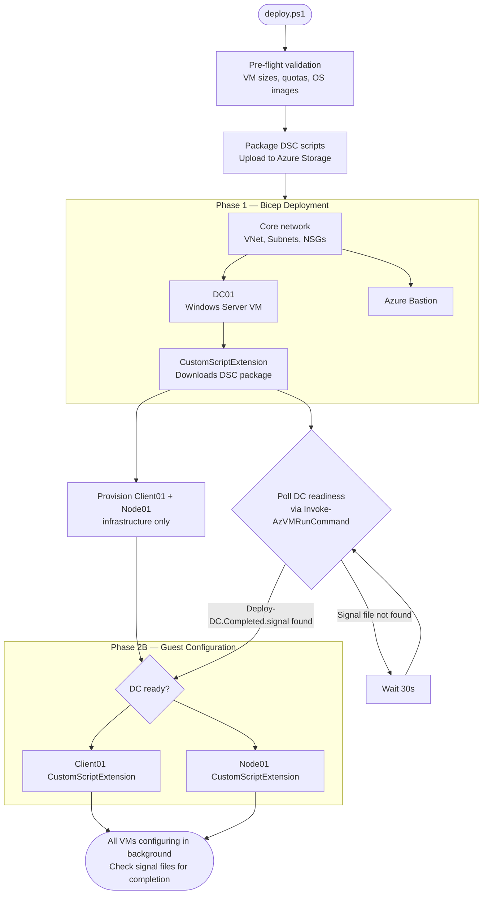
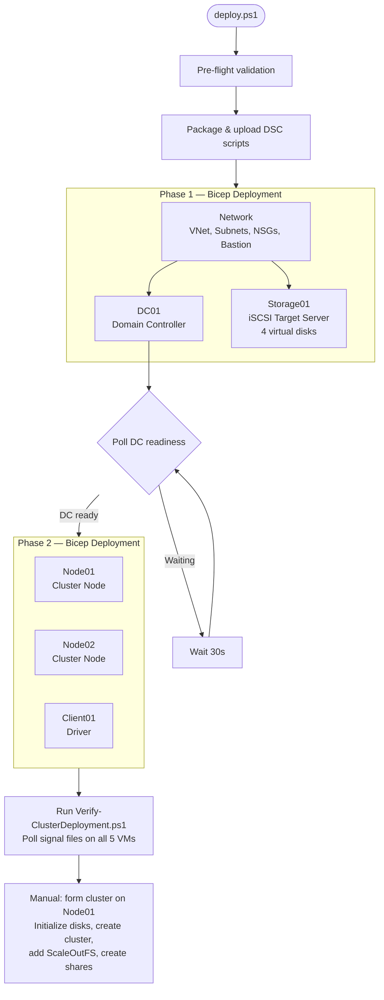
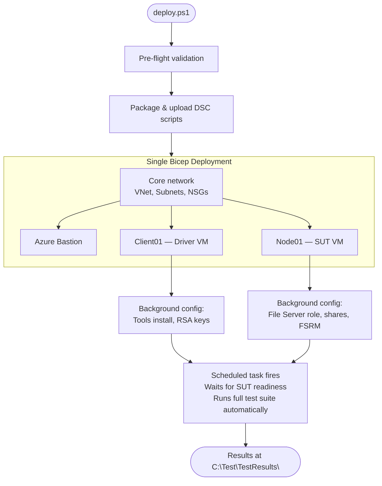
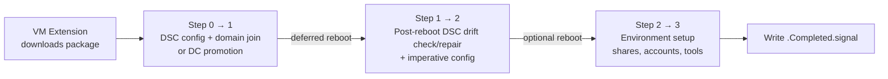

# File Server Protocol Test Suite - Azure Automated Deployment

Automated Infrastructure-as-Code (IaC) for deploying complete File Server Protocol Test Suite environments on Azure. Each scenario deploys a ready-to-use test environment with networking, VMs, Active Directory (where applicable), file server roles, and test tooling — all configured end-to-end.

## Which Scenario Do I Need?

| | [Workgroup](workgroup-bicep/README.md) | [Domain](domain-bicep/README.md) | [Cluster](cluster-bicep/README.md) |
|---|---|---|---|
| **Best for** | Quick validation, CI gates, basic SMB testing | Full protocol test coverage with AD | Failover, clustered shares, iSCSI |
| **VMs deployed** | 2 (Driver + SUT) | 3 (DC + Driver + SUT) | 5 (DC + Storage + 2 Nodes + Driver) |
| **Active Directory** | No | Yes | Yes |
| **Deploy time** | ~15 min | ~30 min | ~40 min |
| **Post-deploy manual steps** | None (tests run automatically) | None | Cluster formation (~15 min) |
| **Authentication** | Local accounts | Domain accounts (Kerberos, NTLM) | Domain accounts (Kerberos, NTLM) |
| **Test coverage** | SMB2, DFSC, FSA, SQOS, RSVD | Full suite (SMB2, FSA, DFSC, Auth, FSRVP, RSVD, SQOS, QUIC) | Full suite + ServerFailover, clustered shares |
| **Linux driver support** | Yes | Yes | Yes |
| **Custom VM images** | Yes | Yes | Yes |
| **Resume on failure** | Yes (`-Resume`) | Yes (`-SkipPhase1`) | Yes (`-SkipPhase1`) |

> **Not sure?** Start with **Domain** — it covers the full test suite with the simplest setup. Use **Workgroup** if you need fast, fully-automatic runs (e.g., CI). Use **Cluster** only when testing failover scenarios.

## Prerequisites

These apply to all three scenarios:

- **Azure subscription** with permissions to create resource groups, VMs, storage accounts, and Key Vaults
- **Azure PowerShell modules**: `Az.Accounts`, `Az.Resources`, `Az.Storage`, `Az.Compute`
  ```powershell
  Install-Module Az -Scope CurrentUser
  ```
- **Bicep CLI** (installed automatically by the deploy scripts if missing, or install manually via `az bicep install`)

## Release packages

The official OneClick release pipeline is
`pipelines/1es/FileServer-OneClick-Release.yml`. Run it only after the signed
FileServer, PTMService, and PTMCli archives are final. Supply the HTTPS URL and
SHA-256 hash for each signed archive.

The pipeline copies the deployment sources into an isolated staging directory,
pins those release assets in each publishable scenario's `Tools.json`, signs
the staged PowerShell files through ESRP, runs the tests under
`azure-automation/tests`, and builds these public, credential-free artifacts:

- `Workgroup-Package.zip`
- `Domain-Package.zip`
- `SHA256SUMS.txt`

Cluster is not included because it currently uses the phased `deploy.ps1`
workflow and does not have a `Publish-DscPackage.ps1` wrapper or a single
deploy-to-Azure template.

The pipeline publishes the files as the `FileServer-OneClick-Packages` pipeline
artifact. A release owner must download that artifact, complete the clean Azure
deployment checks, and upload the unchanged ZIP files to the `4.26.8.0`
FileServer GitHub release alongside the primary test-suite assets. Do not
rebuild or replace packages after signing.

## Quick Start

### 1. Navigate to the scenario folder

```powershell
# Pick one:
cd TestSuites/FileServer/azure-automation/domain-bicep      # Most common
cd TestSuites/FileServer/azure-automation/workgroup-bicep    # Fastest
cd TestSuites/FileServer/azure-automation/cluster-bicep      # Failover testing
```

### 2. Run the deployment

**Domain** or **Cluster**:
```powershell
$password = Read-Host -Prompt "Enter admin password" -AsSecureString

.\deploy.ps1 `
    -SubscriptionId "your-subscription-id" `
    -ResourceGroupName "fileserver-test" `
    -AdminPassword $password
```

**Workgroup** (requires a second password for the local test user):
```powershell
$adminPass = Read-Host -Prompt "Admin password" -AsSecureString
$localPass = Read-Host -Prompt "Local user password" -AsSecureString

.\deploy.ps1 `
    -SubscriptionId "your-subscription-id" `
    -ResourceGroupName "fileserver-test" `
    -AdminPassword $adminPass `
    -LocalUserPassword $localPass
```

### 3. Wait for VM configuration to finish

Azure Portal will show "Succeeded" before VMs finish their background configuration (AD promotion, domain joins, feature installation). Use the verification methods below to confirm readiness.

**All scenarios** — use the shared verification script:
```powershell
# From any scenario folder (or use the full path)
..\shared\scripts\Verify-Deployment.ps1 -ResourceGroupName "fileserver-test"
```

This auto-detects which VMs are present (Domain, Cluster, or Workgroup) and polls their signal files until all report complete.

### 4. Connect and use

Connect to any VM via **Azure Bastion** in the portal (no public IPs are exposed). For the Workgroup scenario, tests run automatically after deployment — check results at `C:\Test\TestResults\` on the Driver VM.

## Deployment Flow

All three scenarios follow the same core pattern. Domain member infrastructure can be provisioned while the Domain Controller finishes configuring, but member guest extensions and domain join remain gated on the DC readiness signal.

### Domain Scenario



### Cluster Scenario



### Workgroup Scenario



### On-VM Configuration Flow

Once Azure deploys a VM, its **CustomScriptExtension** downloads the DSC package and runs an orchestrator script (e.g., [`Deploy-DC.ps1`](shared/DSC/Deploy-DC.ps1), [`Deploy-SUT.ps1`](domain-bicep/DSC/Deploy-SUT.ps1)). These orchestrators use a multi-step pattern with automatic restarts:



Current phased orchestrators persist role-specific phase values under
`HKLM:\SOFTWARE\ProtocolTestSuites` while retaining `DeployStep` only for
backward migration. Workgroup uses `WorkgroupSutDeployPhase`; Domain uses
`DomainSutDeployPhase` and `DcDeployPhase`. The Domain SUT has one normal
feature/domain-join reboot. The DC has one foundation reboot and one mandatory
promotion reboot. The Driver verifies its one domain-join reboot and secure
channel before continuing. Unexpected extra reboots are fatal. A **TKFRSAR**
scheduled task resumes each orchestrator only across its planned boundary.

## Network Architecture

All scenarios use the same network layout (Cluster adds Storage01 and Node02):

```
Azure VNet: 192.168.0.0/16
├── AzureBastionSubnet  192.168.0.0/26    ← Secure RDP/SSH access (no public IPs)
├── External1 Subnet    192.168.1.0/24    ← Primary network
│   ├── DC01        .10     (Domain/Cluster only)
│   ├── Node01      .11     (SUT or Cluster Node 1)
│   ├── Node02      .12     (Cluster only)
│   ├── Storage01   .50     (Cluster only, NOT domain-joined)
│   └── Client01    .111    (Driver — runs test cases)
└── External2 Subnet    192.168.2.0/24    ← Secondary network
    ├── DC01        .10
    ├── Node01      .11
    ├── Node02      .12     (Cluster only)
    └── Client01    .111
```

IP addresses are configurable in each scenario's parameter files: [Domain](domain-bicep/parameters/), [Cluster](cluster-bicep/parameters/), and [Workgroup](workgroup-bicep/parameters/).

## Customization

All configuration lives in Bicep parameter files — one source of truth per scenario:

| Scenario | Parameter files |
|----------|----------------|
| Domain | [`phase1.bicepparam`](domain-bicep/parameters/phase1.bicepparam), [`phase2.bicepparam`](domain-bicep/parameters/phase2.bicepparam) |
| Cluster | [`phase1.bicepparam`](cluster-bicep/parameters/phase1.bicepparam), [`phase2.bicepparam`](cluster-bicep/parameters/phase2.bicepparam) |
| Workgroup | [`workgroup.bicepparam`](workgroup-bicep/parameters/workgroup.bicepparam) |

Common things you can change:

- **Azure region** — `param location` in the bicepparam file
- **VM sizes** — `param dcVmSize`, `param sutVmSize`, `param driverVmSize` (auto-fallback if unavailable)
- **OS versions** — `param dcOsVersion`, `param sutOsVersion`, `param driverOsVersion`
- **IP addresses** — `param dcExternal1Ip`, `param sutExternal1Ip`, `param driverExternal1Ip`
- **Domain name** — `param domainName` (default: `contoso.com`)
- **Custom VM images** — `param dcCustomImageId`, `param sutCustomImageId`, etc.
- **Linux driver** — `param driverOsType = 'Linux'` (deploys Ubuntu 24.04 LTS)
- **Auto-shutdown** — `param enableAutoShutdown`, `param autoShutdownTime`

See each scenario's README for the full parameter reference.

## Resuming Failed Deployments

Domain and Cluster deployments support resuming from Phase 2 if Phase 1 succeeded but Phase 2 failed:

```powershell
.\deploy.ps1 `
    -SubscriptionId "your-subscription-id" `
    -ResourceGroupName "fileserver-test" `
    -AdminPassword $password `
    -SkipPhase1
```

This retrieves Phase 1 outputs automatically (subnet IDs, DC IP), reuses the previously uploaded DSC package, and redeploys only Phase 2 resources.

You can also deploy Phase 1 only (`-SkipPhase2`) to inspect the DC before continuing, or validate templates without deploying (`-ValidateOnly`).

## Troubleshooting

Each scenario README has detailed troubleshooting for its specific issues:
- [Domain troubleshooting](domain-bicep/README.md#troubleshooting)
- [Cluster troubleshooting](cluster-bicep/README.md#troubleshooting)
- [Workgroup troubleshooting](workgroup-bicep/README.md#troubleshooting)

### Common across all scenarios

**Azure shows "Succeeded" but VMs aren't ready** — VM extensions report success immediately after starting background configuration. Check for `.Completed.signal` files (see [step 3 above](#3-wait-for-vm-configuration-to-finish)).

**Feature installation restarts WinRM** — Domain and Workgroup SUT/Driver orchestrators submit DSC asynchronously and poll fresh LCM status calls, so a transient `0x803381fa` WSMan disconnect is not treated as success. Completion signals are written only after the LCM reports `Success` and required features, commands, directories, tools, and applicable domain readiness checks pass. Imperative configuration is blocked while DSC prerequisites are incomplete instead of retrying the same broken environment setup indefinitely.

While DSC is active, Windows PowerShell 5.1 can report that `Start-DscConfiguration` is still in progress when status is queried. This is an expected busy response: the verifier suppresses it, continues bounded polling, and surfaces only a final LCM failure or timeout.

Workgroup and Domain SUTs compile disruptive features into dedicated feature
MOFs and apply shares, routing, remoting, and registry state through separate
post-reboot convergence MOFs. The DC similarly separates role features from
post-promotion convergence. Tool packages download to unique temporary files in
parallel and are promoted atomically into the cache; installation remains
serial and post-reboot. Role heartbeat JSON files record the current phase,
operation, elapsed time, deadline, and last checkpoint while DSC, downloads,
installers, readiness probes, or imperative setup are active.

**VM extension failure** — Check the bootstrap log on the VM:
| VM Role | Log file |
|---------|----------|
| Domain Controller | `C:\*-Package\DSC\Deploy-DC.log` |
| SUT / Cluster Node | `C:\*-Package\DSC\Deploy-SUT.log` or `Deploy-Node01.log` |
| Driver | `C:\*-Package\DSC\Deploy-Driver.log` |
| Extension bootstrap | `C:\*-setup.log` (e.g., `dc-extension-setup.log`) |

**Marketplace terms not accepted** — First deployment of a new OS image may require accepting terms:
```powershell
$image = Get-AzVMImage -Location 'West US 2' -PublisherName 'MicrosoftWindowsDesktop' `
    -Offer 'Windows-11' -Skus 'win11-25h2-ent' | Select -First 1
Get-AzMarketplaceTerms -Publisher 'MicrosoftWindowsDesktop' -Product 'Windows-11' -Name 'win11-25h2-ent' | Set-AzMarketplaceTerms -Accept
```

**Quota exceeded** — The deploy script validates quotas before deploying. If you hit limits, request a quota increase in the Azure portal or change VM sizes in the parameter files.

## Directory Structure

```
azure-automation/
├── README.md                          ← You are here
├── domain-bicep/                      ← Domain scenario (3 VMs)
│   ├── deploy.ps1                     # Phased deployment orchestrator
│   ├── phase1.bicep                   # Network + DC
│   ├── phase2.bicep                   # Driver + SUT
│   ├── modules/                       # Bicep modules (network, DC, computers)
│   ├── parameters/                    # Bicep parameter files
│   ├── DSC/                           # SUT-specific configuration scripts
│   └── README.md
├── cluster-bicep/                     ← Cluster scenario (5 VMs)
│   ├── deploy.ps1                     # Phased deployment orchestrator
│   ├── phase1.bicep                   # Network + DC + Storage
│   ├── phase2.bicep                   # Cluster Nodes + Driver
│   ├── modules/                       # Bicep modules (network, DC, storage, nodes, driver)
│   ├── parameters/                    # Bicep parameter files
│   ├── DSC/                           # Cluster-specific configuration scripts
│   ├── scripts/                       # Verify-ClusterDeployment.ps1
│   └── README.md
├── workgroup-bicep/                   ← Workgroup scenario (2 VMs)
│   ├── deploy.ps1                     # Single-phase deployment
│   ├── main.bicep                     # All resources in one template
│   ├── modules/                       # Bicep modules (network, computers)
│   ├── parameters/                    # Bicep parameter files
│   ├── DSC/                           # SUT-specific configuration scripts
│   └── README.md
└── shared/                            ← Components used by all scenarios
    ├── Deploy-Helpers.psm1            # Azure connection, storage, quota validation
    ├── Generate-ConfigJson.ps1        # Builds Config.json from bicepparam values
    ├── DSC/                           # DC and Driver orchestrators + shared scripts
    │   ├── Deploy-DC.ps1              # Domain Controller configuration orchestrator
    │   ├── Deploy-Driver.ps1          # Driver computer configuration orchestrator
    │   ├── DC-Configuration.ps1       # DSC: AD DS, DNS, LDAP, CBAC
    │   ├── Driver-Configuration.ps1   # DSC: hosts file, firewall, PS remoting
    │   ├── Invoke-DcImperativeSteps.ps1    # AD accounts, GPO, DNS records
    │   ├── Invoke-DriverImperativeSteps.ps1 # Domain join, tools, RSA keys
    │   └── Scripts/                   # Shared utilities (test execution, tools install, etc.)
    └── modules/
        └── disk-encryption-vault.bicep # Key Vault for Azure Disk Encryption
```

## Security Notes

These environments are for **testing only**:

- Windows Firewalls are disabled on all VMs
- NSGs allow broad intra-VNet access
- AutoLogon is enabled for scheduled task execution
- Default test accounts are created with deployment-provided passwords
- No public IPs are exposed (access is via Azure Bastion only)

Not suitable for production use.

## Related Documentation

- [Shared Components](shared/README.md) — How DSC packages are assembled, on-VM configuration pattern, function reference
- [File Server Test Suite User Guide](../docs/FileServerUserGuide.md) — Manual environment setup reference
- [File Server Test Design Specification](../docs/MS-FSA_ServerTestDesignSpecification.md) — Test case descriptions and pass criteria
- [Shared Helpers Module](shared/Deploy-Helpers.psm1) — Azure automation helper functions
- [Config.json Generator](shared/Generate-ConfigJson.ps1) — Dynamic test configuration from deployment parameters
- [Verify Deployment](shared/scripts/Verify-Deployment.ps1) — Universal deployment verification script
