# AUTH  Protocol Server Test Design Specification 

##Contents
* [Contents](#_Toc427487690)
* [Summary](#_Toc427487691)
* [Test Scope](#_Toc427487692)
    * [Restrictions](#_Toc427487693)
    * [Dependencies](#_Toc427487694)
		* [Prerequisites/Preconditions](#_Toc427487695)
* [Test Environment](#_Toc427487696)
* [Test Suite Design](#_Toc427487697)
    * [Kerberos Authentication](#_Toc427487698)
		* [Test Case Design](#_Toc427487699)
		* [BVT cases](#_Toc427487700)
		* [Other traditional cases](#_Toc427487701)
    * [Share Permission Check](#_Toc427487702)
		* [Test Case Design](#_Toc427487703)
		* [Preconditions](#_Toc427487704)
		* [BVT cases](#_Toc427487705)
		* [Other traditional cases](#_Toc427487706)
    * [Folder Permission Check](#_Toc427487707)
		* [Test Case Design](#_Toc427487708)
		* [Preconditions](#_Toc427487709)
		* [BVT cases](#_Toc427487710)
		* [Other traditional cases](#_Toc427487711)
    * [File Permission Check](#_Toc427487712)
		* [Test Case Design](#_Toc427487713)
		* [BVT cases](#_Toc427487714)
		* [Other traditional cases](#_Toc427487715)
    * [Claim-Based Access Control (CBAC)](#_Toc427487716)
		* [Test Case Design](#_Toc427487717)
		* [Preconditions](#_Toc427487718)

## <a name="_Toc427487691"/>Summary
The Auth_ServerTestSuite is designed to test Authentication and Authorization scenarios of MS-SMB2.
The Authentication cases cover Kerberos Authentication;
The Authorization cases cover Share Permission Check, Folder Permission Check, File Permission Check, and Claim-Based Access Control scenario.

## <a name="_Toc427487692"/>Test Scope

### <a name="_Toc427487693"/>Restrictions
None

### <a name="_Toc427487694"/>Dependencies

#### <a name="_Toc427487695"/>Prerequisites/Preconditions
SUT has joined a Windows domain (or other equivalent implementations). Users, Claims, Central Access Rules (CARs), Central Access Policies (CAPs) are configured on DC. Share folders are created and exposed on SUT.

## <a name="_Toc427487696"/>Test Environment

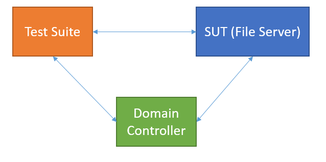

Details of the environment is specified in section 1 of FileSharing_ServerTestDesignSpecification.docx

## <a name="_Toc427487697"/>Test Suite Design

### <a name="_Toc427487698"/>Kerberos Authentication

#### <a name="_Toc427487699"/>Test Case Design
Synthetic Kerberos client is used to communicate with KDC to get the cifs Service Ticket of the target SUT.
Service Tickets, Authenticators of Kerberos and mechListMIC of GSSPNG are modified in each case to simulate different situations. Synthetic SMB2 client will then send the Kerberos tokens (included in SMB2 SESSION_SETUP Request) to the SUT, to see whether SUT can handle them correctly according to RFC 4120, RFC 4178, RFC 4121 and MS-KILE.
Service password/keytab file may be needed in order for synthetic Kerberos client to modify the Service Ticket.
17 traditional cases are designed to cover the above scenarios.

#### <a name="_Toc427487700"/>BVT cases

| &#32;| &#32; |
| -------------| ------------- |
|  **Test ID**| BVT_KerbAuth_AccessFile_Success| 
|  **Description** | This test case is designed to test whether server can handle Kerberos Authentication using GSSAPI correctly| 
|  **Test Execution Steps**| Kerberos client sends AS-REQ without PA-DATA to KDC| 
| | Kerberos client expects KRB-ERROR from KDC| 
| | Kerberos client sends AS-REQ with PA-DATA to KDC| 
| | Kerberos client expects AS-REP from KDC| 
| | Kerberos client sends TGS-REQ to KDC| 
| | Kerberos client expects TGS-REP from KDC| 
| | Decrypt SMB2 Service Ticket| 
| | Create Authenticator| 
| | Create AP-REQ| 
| | Create GSS Token| 
| | SMB2 client sends SMB2 NEGOTIATE request to AP| 
| | SMB2 client expects SMB2 NEOGTIATE response from AP| 
| | SMB2 client sends SMB2 SESSION_SETUP request to AP with GSS Token| 
| | SMB2 client expects SMB2 SESSION_SETUP response with GSS Token| 
| | Try accessing files, which should be successful| 

#### <a name="_Toc427487701"/>Other traditional cases

| &#32;| &#32; |
| -------------| ------------- |
|  **Test ID**| KerbAuth_Authenticator_CNameNotMatch| 
|  **Description**| This test case is designed to test whether server can handle wrong cname in the Authenticator in AP_REQ.| 
|  **Test Execution Steps**| Kerberos client sends AS-REQ without PA-DATA to KDC| 
| | Kerberos client expects KRB-ERROR from KDC| 
| | Kerberos client sends AS-REQ with PA-DATA to KDC| 
| | Kerberos client expects AS-REP from KDC| 
| | Kerberos client sends TGS-REQ to KDC| 
| | Kerberos client expects TGS-REP from KDC| 
| | Create Authenticator with wrong cname| 
| | Create AP-REQ| 
| | Create GSS Token| 
| | SMB2 client sends SMB2 NEGOTIATE request to AP| 
| | SMB2 client expects SMB2 NEOGTIATE response from AP| 
| | SMB2 client sends SMB2 SESSION_SETUP request to AP with GSS Token| 
| | SMB2 client expects SMB2 SESSION_SETUP response with GSS Token| 
| | Session Setup should fail because the cname or crealm in the Authenticator does not match the same field in the Ticket| 
| | SMB2 Server should return KRB_AP_ERR_BADMATCH in GSS Token| 

| &#32;| &#32; |
| -------------| ------------- |
|  **Test ID**| KerbAuth_Authenticator_CRealmNotMatch| 
|  **Description**| This test case is designed to test whether server can handle wrong crealm in the Authenticator in AP_REQ.| 
|  **Test Execution Steps**| Kerberos client sends AS-REQ without PA-DATA to KDC| 
| | Kerberos client expects KRB-ERROR from KDC| 
| | Kerberos client sends AS-REQ with PA-DATA to KDC| 
| | Kerberos client expects AS-REP from KDC| 
| | Kerberos client sends TGS-REQ to KDC| 
| | Kerberos client expects TGS-REP from KDC| 
| | Create Authenticator with wrong crealm| 
| | Create AP-REQ| 
| | Create GSS Token| 
| | SMB2 client sends SMB2 NEGOTIATE request to AP| 
| | SMB2 client expects SMB2 NEOGTIATE response from AP| 
| | SMB2 client sends SMB2 SESSION_SETUP request to AP with GSS Token| 
| | SMB2 client expects SMB2 SESSION_SETUP response with GSS Token| 
| | Session Setup should fail because the cname or crealm in the Authenticator does not match the same field in the Ticket| 
| | SMB2 Server should return KRB_AP_ERR_BADMATCH in GSS Token| 

| &#32;| &#32; |
| -------------| ------------- |
|  **Test ID**| KerbAuth_Authenticator_WrongEncKey| 
|  **Description**| This test case is designed to test whether server can handle wrong encryption key of the Ticket in AP_REQ.| 
|  **Test Execution Steps**| Kerberos client sends AS-REQ without PA-DATA to KDC| 
| | Kerberos client expects KRB-ERROR from KDC| 
| | Kerberos client sends AS-REQ with PA-DATA to KDC| 
| | Kerberos client expects AS-REP from KDC| 
| | Kerberos client sends TGS-REQ to KDC| 
| | Kerberos client expects TGS-REP from KDC| 
| | Create Authenticator| 
| | Use wrong key to encrypt authenticator| 
| | Create AP-REQ| 
| | Create GSS Token| 
| | SMB2 client sends SMB2 NEGOTIATE request to AP| 
| | SMB2 client expects SMB2 NEOGTIATE response from AP| 
| | SMB2 client sends SMB2 SESSION_SETUP request to AP with GSS Token| 
| | SMB2 client expects SMB2 SESSION_SETUP response with GSS Token| 
| | Session Setup should fail because the Authenticator cannot be correctly decrypted| 
| | SMB2 Server should return KRB_AP_ERR_MODIFIED in GSS Token| 

| &#32;| &#32; |
| -------------| ------------- |
|  **Test ID**| KerbAuth_Ticket_WrongRealm| 
|  **Description**| This test case is designed to test whether server can handle unknown Realm in the Ticket in AP_REQ.| 
|  **Test Execution Steps**| Kerberos client sends AS-REQ without PA-DATA to KDC| 
| | Kerberos client expects KRB-ERROR from KDC| 
| | Kerberos client sends AS-REQ with PA-DATA to KDC| 
| | Kerberos client expects AS-REP from KDC| 
| | Kerberos client sends TGS-REQ to KDC| 
| | Kerberos client expects TGS-REP from KDC| 
| | Decrypt cifs Ticket| 
| | Change the realm in the Ticket to wrong realm| 
| | Create Authenticator| 
| | Create AP-REQ| 
| | Create GSS Token| 
| | SMB2 client sends SMB2 NEGOTIATE request to AP| 
| | SMB2 client expects SMB2 NEOGTIATE response from AP| 
| | SMB2 client sends SMB2 SESSION_SETUP request to AP with GSS Token| 
| | SMB2 client expects SMB2 SESSION_SETUP response with GSS Token| 
| | Server would find the right key, despite of the wrong realm| 
| | Session Setup should succeed| 

| &#32;| &#32; |
| -------------| ------------- |
|  **Test ID**| KerbAuth_Ticket_WrongSName| 
|  **Description**| This test case is designed to test whether server can handle unknown SName in the Ticket in AP_REQ.| 
|  **Test Execution Steps**| Kerberos client sends AS-REQ without PA-DATA to KDC| 
| | Kerberos client expects KRB-ERROR from KDC| 
| | Kerberos client sends AS-REQ with PA-DATA to KDC| 
| | Kerberos client expects AS-REP from KDC| 
| | Kerberos client sends TGS-REQ to KDC| 
| | Kerberos client expects TGS-REP from KDC| 
| | Decrypt cifs Ticket| 
| | Change the sname in the Ticket to wrong realm| 
| | Create Authenticator| 
| | Create AP-REQ| 
| | Create GSS Token| 
| | SMB2 client sends SMB2 NEGOTIATE request to AP| 
| | SMB2 client expects SMB2 NEOGTIATE response from AP| 
| | SMB2 client sends SMB2 SESSION_SETUP request to AP with GSS Token| 
| | SMB2 client expects SMB2 SESSION_SETUP response with GSS Token| 
| | Server would find the right key, despite of the wrong realm| 
| | Session Setup should succeed| 

| &#32;| &#32; |
| -------------| ------------- |
|  **Test ID**| KerbAuth_Ticket_WrongKvno| 
|  **Description**| This test case is designed to test whether server can handle invalid KVNO in the Ticket in AP_REQ.| 
|  **Test Execution Steps**| Kerberos client expects Kerberos Error from KDC| 
| | Kerberos client sends AS request with PA-DATA set| 
| | Kerberos client expects AS response from KDC| 
| | Kerberos client sends TGS request to KDC| 
| | Kerberos client expects TGS response from KDC| 
| | Decrypt cifs Ticket| 
| | Change the KVNO of the Ticket to wrong number| 
| | Create authenticator| 
| | Create AP Request| 
| | Create GSS Token| 
| | SMB2 client sends SMB2 NEGOTIATE request to AP| 
| | SMB2 client expects SMB2 NEOGTIATE response from AP| 
| | SMB2 client sends SMB2 SESSION_SETUP request to AP with GSS Token| 
| | SMB2 client expects SMB2 SESSION_SETUP response with GSS Token| 
| | Server would find the right key, despite of the wrong realm| 
| | Session Setup should succeed| 

| &#32;| &#32; |
| -------------| ------------- |
|  **Test ID**| KerbAuth_Ticket_NotValid| 
|  **Description**| This test case is designed to test whether server can handle invalid Ticket in AP_REQ.| 
|  **Test Execution Steps**| Kerberos client sends AS-REQ without PA-DATA to KDC| 
| | Kerberos client expects KRB-ERROR from KDC| 
| | Kerberos client sends AS-REQ with PA-DATA to KDC| 
| | Kerberos client expects AS-REP from KDC| 
| | Kerberos client sends TGS-REQ to KDC| 
| | Kerberos client expects TGS-REP from KDC| 
| | Decrypt cifs Ticket| 
| | Change the Ticket start time to tomorrow| 
| | Create Authenticator| 
| | Create AP-REQ| 
| | Create GSS Token| 
| | SMB2 Client sends SMB2 NEGOTIATE request to AP| 
| | SMB2 Client expects SMB2 NEOGTIATE response from AP| 
| | SMB2 Client sends SMB2 SESSION_SETUP request to AP with GSS Token| 
| | SMB2 Client expects SMB2 SESSION_SETUP response with GSS Token| 
| | Session Setup should fail because the starttime (tomorrow) in the Ticket is later than the current time by more than the allowable clock skew| 
| | SMB2 Server should return KRB_AP_ERR_TKT_NYV in GSS Token| 

| &#32;| &#32; |
| -------------| ------------- |
|  **Test ID**| KerbAuth_Ticket_Expired| 
|  **Description**| This test case is designed to test whether server can handle expired Ticket in AP_REQ.| 
|  **Test Execution Steps**| Kerberos client sends AS-REQ without PA-DATA to KDC| 
| | Kerberos client expects KRB-ERROR from KDC| 
| | Kerberos client sends AS-REQ with PA-DATA to KDC| 
| | Kerberos client expects AS-REP from KDC| 
| | Kerberos client sends TGS-REQ to KDC| 
| | Kerberos client expects TGS-REP from KDC| 
| | Decrypt cifs Ticket| 
| | Change the Ticket endtime to yesterday| 
| | Create Authenticator| 
| | Create AP Request| 
| | Create GSS Token| 
| | SMB2 client sends SMB2 NEGOTIATE request to AP| 
| | SMB2 client expects SMB2 NEOGTIATE response from AP| 
| | SMB2 client sends SMB2 SESSION_SETUP request to AP with GSS Token| 
| | SMB2 client expects SMB2 SESSION_SETUP response with GSS Token| 
| | Session Setup should fail because the current time is later than the endtime (yesterday) in the Ticket by more than the allowable clock skew| 
| | SMB2 Server should return KRB_AP_ERR_TKT_EXPIRED in GSS Token| 

| &#32;| &#32; |
| -------------| ------------- |
|  **Test ID**| KerbAuth_Ticket_WrongEncKey| 
|  **Description**| This test case is designed to test whether server can handle wrong encryption key of the Ticket in AP_REQ.| 
|  **Test Execution Steps**| Kerberos client sends AS-REQ without PA-DATA to KDC| 
| | Kerberos client expects KRB-ERROR from KDC| 
| | Kerberos client sends AS-REQ with PA-DATA to KDC| 
| | Kerberos client expects AS-REP from KDC| 
| | Kerberos client sends TGS-REQ to KDC| 
| | Kerberos client expects TGS-REP from KDC| 
| | Use wrong key to encrypt Ticket| 
| | Create Authenticator| 
| | Create AP Request| 
| | Create GSS Token| 
| | SMB2 client sends SMB2 NEGOTIATE request to AP| 
| | SMB2 client expects SMB2 NEOGTIATE response from AP| 
| | SMB2 client sends SMB2 SESSION_SETUP request to AP with GSS Token| 
| | SMB2 client expects SMB2 SESSION_SETUP response with GSS Token| 
| | Session Setup should fail because the Ticket cannot be correctly decrypted| 
| | SMB2 Server should return KRB_AP_ERR_MODIFIED in GSS Token| 

| &#32;| &#32; |
| -------------| ------------- |
|  **Test ID**| KerbAuth_AuthData_UnknownType_Authenticator| 
|  **Description**| This test case is designed to test whether server can handle unknown AuthorizationData in the Authenticator.| 
|  **Test Execution Steps**| Kerberos client sends AS-REQ without PA-DATA to KDC| 
| | Kerberos client expects KRB-ERROR from KDC| 
| | Kerberos client sends AS-REQ with PA-DATA to KDC| 
| | Kerberos client expects AS-REP from KDC| 
| | Kerberos client sends TGS-REQ to KDC| 
| | Kerberos client expects TGS-REP from KDC| 
| | Decrypt cifs Ticket| 
| | Create Authenticator| 
| | Add a type-unknown Authorization-Data to the Authenticator| 
| | Create AP-REQ| 
| | Create GSS Token| 
| | SMB2 client sends SMB2 NEGOTIATE request to AP| 
| | SMB2 client expects SMB2 NEOGTIATE response from AP| 
| | SMB2 client sends SMB2 SESSION_SETUP request to AP with GSS Token| 
| | SMB2 client expects SMB2 SESSION_SETUP response with GSS Token| 
| | Unknown Authorization-Data in the Authenticator would not fail the request| 
| | SessionSetup should succeed| 

| &#32;| &#32; |
| -------------| ------------- |
|  **Test ID**| KerbAuth_AuthData_UnknownType_Optional_Authenticator| 
|  **Description**| This test case is designed to test whether server can handle unknown AuthorizationData contained in AD-IF-RELEVANT in the Authenticator.| 
|  **Test Execution Steps**| Kerberos client sends AS-REQ without PA-DATA to KDC| 
| | Kerberos client expects KRB-ERROR from KDC| 
| | Kerberos client sends AS-REQ with PA-DATA to KDC| 
| | Kerberos client expects AS-REP from KDC| 
| | Kerberos client sends TGS-REQ to KDC| 
| | Kerberos client expects TGS-REP from KDC| 
| | Decrypt cifs Ticket| 
| | Create authenticator| 
| | Add a type-unknown Authorization-Data which is inside AD_IF_RELEVANT to the Authenticator| 
| | Create AP-REQ| 
| | Create GSS Token| 
| | SMB2 client sends SMB2 NEGOTIATE request to AP| 
| | SMB2 client expects SMB2 NEOGTIATE response from AP| 
| | SMB2 client sends SMB2 SESSION_SETUP request to AP with GSS Token| 
| | SMB2 client expects SMB2 SESSION_SETUP response with GSS Token| 
| | Unknown Authorization-Data is in AD_IF_RELEVANT is optional.| 
| | Server should not fail the request.| 
| | SessionSetup should succeed| 

| &#32;| &#32; |
| -------------| ------------- |
|  **Test ID**| KerbAuth_AuthData_UnknownType_Ticket| 
|  **Description**| This test case is designed to test whether server can handle unknown AuthorizationData in the Ticket.| 
|  **Test Execution Steps**| Kerberos client sends AS-REQ without PA-DATA to KDC| 
| | Kerberos client expects KRB-ERROR from KDC| 
| | Kerberos client sends AS-REQ with PA-DATA to KDC| 
| | Kerberos client expects AS-REP from KDC| 
| | Kerberos client sends TGS-REQ to KDC| 
| | Kerberos client expects TGS-REP from KDC| 
| | Decrypt cifs Ticket| 
| | Add a type-unknown Authorization-Data to the ticket| 
| | Create authenticator| 
| | Create AP Request| 
| | Create GSS Token| 
| | SMB2 client sends SMB2 NEGOTIATE request to AP| 
| | SMB2 client expects SMB2 NEOGTIATE response from AP| 
| | SMB2 client sends SMB2 SESSION_SETUP request to AP with GSS Token| 
| | SMB2 client expects SMB2 SESSION_SETUP response with GSS Token| 
| | Session Setup should fail because of the unknown Authorization-Data in the Ticket| 

| &#32;| &#32; |
| -------------| ------------- |
|  **Test ID**| KerbAuth_AuthData_UnknownType_Optional_Ticket| 
|  **Description**| This test case is designed to test whether server can handle unknown AuthorizationData contained in AD-IF-RELEVANT in the Ticket.| 
|  **Test Execution Steps**| Kerberos client sends AS-REQ without PA-DATA to KDC| 
| | Client expects KRB-ERROR from KDC| 
| | Client sends AS-REQ with PA-DATA to KDC| 
| | Client expects AS-REP from KDC| 
| | Client sends TGS-REQ to KDC| 
| | Client expects TGS-REP from KDC| 
| | Decrypt cifs Ticket| 
| | Add a type-unknown Authorization-Data which is inside AD_IF_RELEVANT to the Ticket| 
| | Create authenticator| 
| | Create AP Request| 
| | Create GSS Token| 
| | Client sends SMB2 NEGOTIATE request to AP| 
| | Client expects SMB2 NEOGTIATE response from AP| 
| | Client sends SMB2 SESSION_SETUP request to AP with GSS Token| 
| | Client expects SMB2 SESSION_SETUP response with GSS Token| 
| | Unknown Authorization-Data is in AD_IF_RELEVANT is optional.| 
| | Server should not fail the request.| 

| &#32;| &#32; |
| -------------| ------------- |
|  **Test ID**| KerbAuth_Replay| 
|  **Description**| This test case is designed to test whether server can handle Replay correctly.| 
|  **Test Execution Steps**| Kerberos client sends AS-REQ without PA-DATA to KDC| 
| | Kerberos client expects KRB-ERROR from KDC| 
| | Kerberos client sends AS-REQ with PA-DATA to KDC| 
| | Kerberos client expects AS-REP from KDC| 
| | Kerberos client sends TGS-REQ to KDC| 
| | Kerberos client expects TGS-REP from KDC| 
| | Decrypt cifs Ticket| 
| | Create authenticator| 
| | Create AP Request| 
| | Create GSS Token| 
| | SMB2 client sends SMB2 NEGOTIATE request to AP| 
| | SMB2 client expects SMB2 NEOGTIATE response from AP| 
| | SMB2 client sends SMB2 SESSION_SETUP request to AP with GSS Token| 
| | SMB2 client expects SMB2 SESSION_SETUP response with GSS Token| 
| | Session Setup should fail because it uses a Replay of KRB_AP_REQ| 
| | SMB2 Server should return KRB_AP_ERR_REPEAT in GSS Token| 
| | Try accessing file using another SMB2 Client, which should succeed| 

| &#32;| &#32; |
| -------------| ------------- |
|  **Test ID**| KerbAuth_Negotiate_MechListMIC_Exchange| 
|  **Description**| This test case is designed to test whether server can handle mechListMIC in the negTokenInit correctly.| 
|  **Test Execution Steps**| Kerberos client sends AS-REQ without PA-DATA to KDC| 
| | Kerberos client expects KRB-ERROR from KDC| 
| | Kerberos client sends AS-REQ with PA-DATA to KDC| 
| | Kerberos client expects AS-REP from KDC| 
| | Kerberos client sends TGS-REQ to KDC| 
| | Kerberos client expects TGS-REP from KDC| 
| | Decrypt SMB2 Service Ticket| 
| | Create Authenticator| 
| | Create AP-REQ| 
| | Create GSS Token| 
| | Add mechListMIC to negTokenInit| 
| | SMB2 client sends SMB2 NEGOTIATE request to AP| 
| | SMB2 client expects SMB2 NEOGTIATE response from AP| 
| | SMB2 client sends SMB2 SESSION_SETUP request to AP with GSS Token| 
| | SMB2 client expects SMB2 SESSION_SETUP response with GSS Token| 
| | Try accessing files, which should be successful| 

| &#32;| &#32; |
| -------------| ------------- |
|  **Test ID**| KerbAuth_Negotiate_MechListMIC_InvalidChecksum| 
|  **Description**| This test case is designed to test whether server can handle mechListMIC with invalid checksum in the negTokenInit correctly.| 
|  **Test Execution Steps**| Kerberos client sends AS-REQ without PA-DATA to KDC| 
| | Kerberos client expects KRB-ERROR from KDC| 
| | Kerberos client sends AS-REQ with PA-DATA to KDC| 
| | Kerberos client expects AS-REP from KDC| 
| | Kerberos client sends TGS-REQ to KDC| 
| | Kerberos client expects TGS-REP from KDC| 
| | Decrypt SMB2 Service Ticket| 
| | Create Authenticator| 
| | Create AP-REQ| 
| | Create GSS Token| 
| | Add mechListMIC with invalid checksum to negTokenInit| 
| | SMB2 client sends SMB2 NEGOTIATE request to AP| 
| | SMB2 client expects SMB2 NEOGTIATE response from AP| 
| | SMB2 client sends SMB2 SESSION_SETUP request to AP with GSS Token| 
| | SMB2 client expects SMB2 SESSION_SETUP response with GSS Token| 
| | Session Setup should fail because of the invalid checksum in mechListMIC| 

### <a name="_Toc427487702"/>Share Permission Check

#### <a name="_Toc427487703"/>Test Case Design
In Share Permission Check scenario, different DACLs will be applied to SMB share(s). Test suite will try to access the share(s) using specific user accounts. The result (either Allowed or Denied) would be verified according to MS-DTYP. The following picture is an example of how to set Share Permission in Windows.

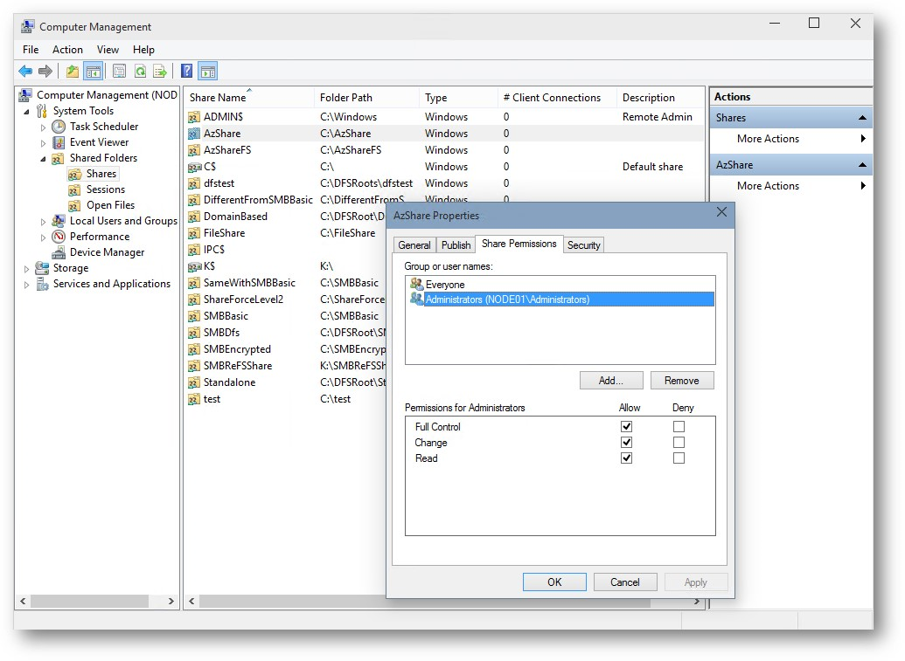

#### <a name="_Toc427487704"/>Preconditions

#####Domain Users

| User Name| SID| Member Of| Attributes| 
| -------------| -------------| -------------| ------------- |
| AzUser01| S-1-5-21-465464611-2451339954-1855217765-1106| AzGroup01|  | 
| | | Domain Users| | 

#####Domain Groups

| User Name| SID| Member Of| Attributes| 
| -------------| -------------| -------------| ------------- |
| AzGroup01| S-1-5-21-465464611-2451339954-1855217765-1105|  |  | 

* SID may be different in your environment.

#####Share(s)
If MS-SRVS is supported by SUT, test suite can dynamically set Share Permissions using MS-SRVS. One share need to be exposed, named AzShare by default. Folder (NTFS) permission should be set to allow everyone to access it.
Otherwise, 6 shares (AzShare01, …, AzShare06) are required. Share Permissions should be set respectively according to the Security Descriptor in each of the following tables. Folder (NTFS) permission should be set to allow everyone to access it.

#### <a name="_Toc427487705"/>BVT cases

| &#32;| &#32; |
| -------------| ------------- |
|  **Test ID**| BVT_SharePermission_AccessAllow_UserSid| 
|  **Description**| This test case is designed to test whether a user can access a share when ACCESS_ALLOWED_ACE with user SID exists in share Security Descriptor.| 
|  **Security Descriptor**| O:SYG:SYD:**(A;;0x1fffff;;;S-1-5-21-465464611-2451339954-1855217765-1106)**(A;;FA;;;BA)| 
|  **Access Account**| AzUser01| 

#### <a name="_Toc427487706"/>Other traditional cases

| &#32;| &#32; |
| -------------| ------------- |
|  **Test ID**| SharePermission_AccessAllow_GroupSid| 
|  **Description**| This test case is designed to test whether a user can access a share when ACCESS_ALLOWED_ACE with user's group SID exists in share Security Descriptor.| 
|  **Security Descriptor**| O:SYG:SYD:**(A;;0x1fffff;;;S-1-5-21-465464611-2451339954-1855217765-1105)**(A;;FA;;;BA)| 
|  **Access Account**| AzUser01| 

| &#32;| &#32; |
| -------------| ------------- |
|  **Test ID**| SharePermission_AccessDeny_GroupSid| 
|  **Description**| This test case is designed to test whether a user is not allowed to access a share when ACCESS_DENIED_ACE with user's group SID exists in share Security Descriptor.| 
|  **Security Descriptor**| O:SYG:SYD:**(D;;0x1fffff;;;S-1-5-21-465464611-2451339954-1855217765-1105)**(A;;FA;;;BA)| 
|  **Access Account**| AzUser01| 

| &#32;| &#32; |
| -------------| ------------- |
|  **Test ID**| SharePermission_AccessDeny_SidNoInclude| 
|  **Description**| This test case is designed to test whether a user is not allowed to access a share when user SID does not exist in share Security Descriptor.| 
|  **Security Descriptor**| O:SYG:SYD:(A;;FA;;;BA)| 
|  **Access Account**| AzUser01| 

| &#32;| &#32; |
| -------------| ------------- |
|  **Test ID**| SharePermission_AccessDeny_UserSid| 
|  **Description**| This test case is designed to test whether a user is not allowed to access a share when ACCESS_DENIED_ACE with user SID exists in share Security Descriptor.| 
|  **Security Descriptor**| O:SYG:SYD:**(D;;0x1fffff;;;S-1-5-21-465464611-2451339954-1855217765-1106)**(A;;FA;;;BA)| 
|  **Access Account**| AzUser01| 

| &#32;| &#32; |
| -------------| ------------- |
|  **Test ID**| SharePermission_AccessDeny_UserSidWithoutReadPermission| 
|  **Description**| This test case is designed to test whether a user can access a share when ACCESS_ALLOWED_ACE with user SID exists in share Security Descriptor.| 
|  **Security Descriptor**| O:SYG:SYD:**(D;;;;;S-1-5-21-465464611-2451339954-1855217765-1106)**(A;;FA;;;BA)| 
|  **Access Account**| AzUser01| 

| &#32;| &#32; |
| -------------| ------------- |
|  **Test ID**| SharePermission_CreateClose_DeleteFile_MaximalAccessNotIncludeDeleteOrGenericAll| 
|  **Description**| This case is designed to test whether server can handle delete file request when Treeconnect.MaximalAccess does not include DELETE or GENERIC_ALL.| 
|  **Security Descriptor**| O:BAG:DUD:**(A;;0x1effff;;;**  **S-1-5-21-465464611-2451339954-1855217765-1106** **)**(A;OICI;FA;;;BA)| 
|  **Access Account**| AzUser01| 
|  **Step**| Set share permission to  ALLOW user AzUsre01 to access the share target share with access mask: (STANDARD_RIGHTS_ALL  &#124;  SPECIFIC_RIGHTS_ALL) & ~DELETE| 
| | Use account AzUsre01 to access the share and create a file. This operation should succeed.| 
| | Use account AzUsre01 to delete the file just created. This operation should not succeed because Treeconnect.MaximalAccess does not include DELETE or GENERIC_ALL.| 

### <a name="_Toc427487707"/>Folder Permission Check

#### <a name="_Toc427487708"/>Test Case Design
In Folder Permission Check scenario, different DACLs will be applied to a shared folder (the folder that is exposed as an SMB share). And then test suite will try to access the share using specific user accounts. The result (either Allowed or Denied) would be verified according to MS-DTYP. The following picture is an example of how to set Folder Permission in Windows.

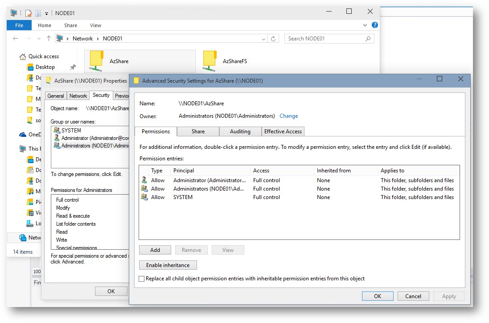

#### <a name="_Toc427487709"/>Preconditions

#####Domain Users

| User Name| SID| Member Of| Attributes| 
| -------------| -------------| -------------| ------------- |
| AzUser01| S-1-5-21-465464611-2451339954-1855217765-1106| AzGroup01|  | 
| | | Domain Users| | 

#####Domain Groups

| User Name| SID| Member Of| Attributes| 
| -------------| -------------| -------------| ------------- |
| AzGroup01| S-1-5-21-465464611-2451339954-1855217765-1105|  |  | 

* SID may be different in your environment.

#####Share(s)
One share need to be exposed, named AzFolder by default. Share Permission should be set to allow everyone to access it. Domain Admins should be granted Full Access permission to the folder.
SMB2 SET_INFO is required to run these cases.

#### <a name="_Toc427487710"/>BVT cases

| &#32;| &#32; |
| -------------| ------------- |
|  **Test ID**| BVT_FolderPermission_AccessAllow_UserSid| 
|  **Description**| This test case is designed to test whether a user can access a share when ACCESS_ALLOWED_ACE with user SID exists in folder Security Descriptor.| 
|  **Security Descriptor**| O:BAG:DUD:PAI**(A;;GR;;;S-1-5-21-465464611-2451339954-1855217765-1106)**(A;OICI;FA;;;BA)| 
|  **Access Account**| AzUser01| 

#### <a name="_Toc427487711"/>Other traditional cases

| &#32;| &#32; |
| -------------| ------------- |
|  **Test ID**| SharePermission_AccessAllow_GroupSid| 
|  **Description**| This test case is designed to test whether a user can access a share when ACCESS_ALLOWED_ACE with user's group SID exists in folder Security Descriptor.| 
|  **Security Descriptor**| O:BAG:DUD:P**(A;;GR;;;S-1-5-21-465464611-2451339954-1855217765-1106)**(A;OICI;FA;;;BA)| 
|  **Access Account**| AzUser01| 

| &#32;| &#32; |
| -------------| ------------- |
|  **Test ID**| FolderPermission_AccessDeny_GroupSid| 
|  **Description**| This test case is designed to test whether a user is not allowed to access a share when ACCESS_DENIED_ACE with user's group SID exists in folder Security Descriptor.| 
|  **Security Descriptor**| O:BAG:DUD:P**(A;;GR;;;S-1-5-21-465464611-2451339954-1855217765-1105)**(A;OICI;FA;;;BA)| 
|  **Access Account**| AzUser01| 

| &#32;| &#32; |
| -------------| ------------- |
|  **Test ID**| FolderPermission_AccessDeny_SidNoInclude| 
|  **Description**| This test case is designed to test whether a user is not allowed to access a share when user SID does not exist in folder Security Descriptor.| 
|  **Security Descriptor**| O:BAG:DUD:P(A;OICI;FA;;;BA)| 
|  **Access Account**| AzUser01| 

| &#32;| &#32; |
| -------------| ------------- |
|  **Test ID**| FolderPermission_AccessDeny_UserSid| 
|  **Description**| This test case is designed to test whether a user is not allowed to access a share when ACCESS_DENIED_ACE with user SID exists in folder Security Descriptor.| 
|  **Security Descriptor**| O:BAG:DUD:P**(D;;GR;;;S-1-5-21-465464611-2451339954-1855217765-1106)**(A;OICI;FA;;;BA)| 
|  **Access Account**| AzUser01| 

| &#32;| &#32; |
| -------------| ------------- |
|  **Test ID**| FolderPermission_AccessDeny_UserSidWithoutReadPermission| 
|  **Description**| This test case is designed to test whether a user can access a share when ACCESS_ALLOWED_ACE with user SID exists in folder Security Descriptor.| 
|  **Security Descriptor**| O:BAG:DUD:P**(A;;;;;S-1-5-21-465464611-2451339954-1855217765-1106)**(A;OICI;FA;;;BA)| 
|  **Access Account**| AzUser01| 

### <a name="_Toc427487712"/>File Permission Check

#### <a name="_Toc427487713"/>Test Case Design
In File Permission Check scenario, files with different DACLs will be created in an SMB share. And then test suite will try to access those files using specific user accounts. The result (either Allowed or Denied) would be verified according to MS-DTYP. The following picture is an example of how to set File Permission in Windows.

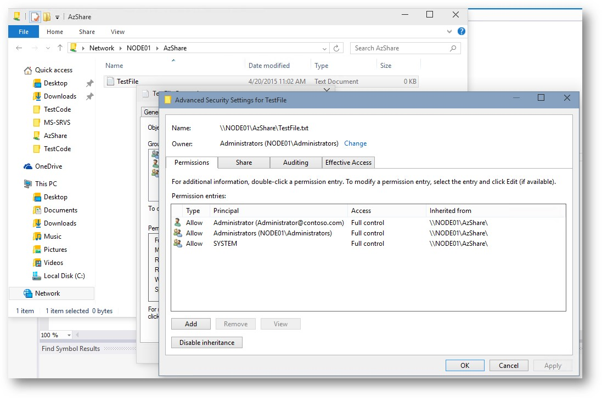

#####Domain Users

| User Name| SID| Member Of| Attributes| 
| -------------| -------------| -------------| ------------- |
| AzUser01| S-1-5-21-465464611-2451339954-1855217765-1106| AzGroup01|  | 
| | | Domain Users| | 

#####Domain Groups

| User Name| SID| Member Of| Attributes| 
| -------------| -------------| -------------| ------------- |
| AzGroup01| S-1-5-21-465464611-2451339954-1855217765-1105|  |  | 

* SID may be different in your environment.

#####Share(s)
One share need to be exposed, named AzFile by default. Share permission should be set to allow everyone accessing it. Domain Admins should be granted Full Access permission to the folder.
SMB2 SET_INFO is required to run these cases.

#### <a name="_Toc427487714"/>BVT cases

| &#32;| &#32; |
| -------------| ------------- |
|  **Test ID**| BVT_FilePermission_AccessAllow_UserSid| 
|  **Description**| This test case is designed to test whether a user can read a file when ACCESS_ALLOWED_ACE with user SID exists in file Security Descriptor.| 
|  **Security Descriptor**| O:BAG:DUD:AI**(A;;GR;;;S-1-5-21-465464611-2451339954-1855217765-1106)**(A;ID;FA;;;SY)(A;ID;FA;;;BA)| 
|  **Access Account**| AzUser01| 

#### <a name="_Toc427487715"/>Other traditional cases

| &#32;| &#32; |
| -------------| ------------- |
|  **Test ID**| FilePermission_AccessAllow_GroupSid| 
|  **Description**| This test case is designed to test whether a user can read a file when ACCESS_ALLOWED_ACE with user's group SID exists in file Security Descriptor.| 
|  **Security Descriptor**| O:BAG:DUD:AI**(A;;GR;;;S-1-5-21-465464611-2451339954-1855217765-1105)**(A;ID;FA;;;SY)(A;ID;FA;;;BA)| 
|  **Access Account**| AzUser01| 

| &#32;| &#32; |
| -------------| ------------- |
|  **Test ID**| FilePermission_AccessDeny_GroupSid| 
|  **Description**| This test case is designed to test whether a user is not allowed to read a file when ACCESS_DENIED_ACE with user's group SID exists in file Security Descriptor.| 
|  **Security Descriptor**| O:BAG:DUD:AI**(D;;GR;;;S-1-5-21-465464611-2451339954-1855217765-1105)**(A;ID;FA;;;SY)(A;ID;FA;;;BA)| 
|  **Access Account**| AzUser01| 

| &#32;| &#32; |
| -------------| ------------- |
|  **Test ID**| FilePermission_AccessDeny_SidNoInclude| 
|  **Description**| This test case is designed to test whether a user is not allowed to read a file when user SID does not exist in file Security Descriptor.| 
|  **Security Descriptor**| O:BAG:DUD:AI(A;ID;FA;;;SY)(A;ID;FA;;;BA)| 
|  **Access Account**| AzUser01| 

| &#32;| &#32; |
| -------------| ------------- |
|  **Test ID**| FolderPermission_AccessDeny_UserSid| 
|  **Description**| This test case is designed to test whether a user is not allowed to read a file when ACCESS_DENIED_ACE with user SID exists in file Security Descriptor.| 
|  **Security Descriptor**| O:BAG:DUD:AI**(D;;GR;;;S-1-5-21-465464611-2451339954-1855217765-1106)**(A;ID;FA;;;SY)(A;ID;FA;;;BA)| 
|  **Access Account**| AzUser01| 

| &#32;| &#32; |
| -------------| ------------- |
|  **Test ID**| FolderPermission_AccessDeny_UserSidWithoutReadPermission| 
|  **Description**| This test case is designed to test whether a user is not allowed to read a file when ACCESS_ALLOWED_ACE associated with the user does not have READ permission in file Security Descriptor.| 
|  **Security Descriptor**| O:BAG:DUD:AI**(A;;;;;S-1-5-21-465464611-2451339954-1855217765-1106)** (A;ID;FA;;;SY)(A;ID;FA;;;BA)| 
|  **Access Account**| AzUser01| 

### <a name="_Toc427487716"/>Claim-Based Access Control (CBAC)

#### <a name="_Toc427487717"/>Test Case Design
In Claim-Based Access Control scenario, different Central Access Policies (CAPs) will be applied to an SMB share. And then test suite will try to access the share using specific user accounts. The result (either Allowed or Denied) would be verified according to MS-DTYP. The following picture is an example of how to set CAP in Windows.

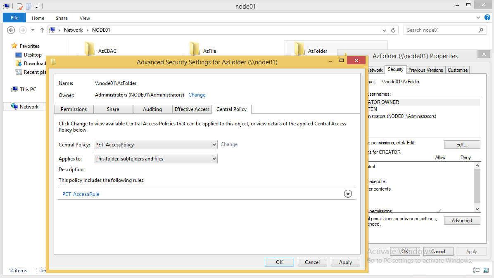

#### <a name="_Toc427487718"/>Preconditions

#####Domain Users

| User Name| SID| Member Of| Attributes| 
| -------------| -------------| -------------| ------------- |
| ITadmin01| S-1-5-21-465464611-2451339954-1855217765-1608| IT Admins| department: IT| 
| | | Domain Users| | 
| | | | countryCode: 156| 
| ITmember01| S-1-5-21-465464611-2451339954-1855217765-1609| IT| department: IT| 
| | | Domain Users| | 
| | | | countryCode: 392| 
| Payrollmemeber01| S-1-5-21-465464611-2451339954-1855217765-1611| Payroll| department: Payroll| 
| | | Domain Users| | 
| | | | countryCode: 156| 
| Payrollmemeber02| S-1-5-21-465464611-2451339954-1855217765-1612| Payroll| department: Payroll| 
| | | Domain Users| | 
| | | | countryCode: 840| 
| Payrollmemeber03| S-1-5-21-465464611-2451339954-1855217765-1613| Payroll| department: Payroll| 
| | | Domain Users| | 
| | | | countryCode: 392| 
| Payrolladmin01| S-1-5-21-465464611-2451339954-1855217765-1610| Payroll Admins| department: Payroll| 
| | | Domain Users| | 
| | | | countryCode: 840| 
| noclaimuser| S-1-5-21-465464611-2451339954-1855217765-1607| Domain Users|  | 

#####Domain Groups

| User Name| SID| Member Of| Attributes| 
| -------------| -------------| -------------| ------------- |
| IT| S-1-5-21-465464611-2451339954-1855217765-1604|  |  | 
| IT Admins| S-1-5-21-465464611-2451339954-1855217765-1605| IT|  | 
| Payroll| S-1-5-21-465464611-2451339954-1855217765-1602|  |  | 
| Payroll Admins| S-1-5-21-465464611-2451339954-1855217765-1603| Payroll|  | 

* SID may be different in your environment.

#####Claims

| Display Name| ID| Value Type| Comments| 
| -------------| -------------| -------------| ------------- |
| CountryCode| ad://ext/CountryCode| Integer|  | 
| Department| ad://ext/Department| String|  | 

#####Central Access Rules (CARs)

######CountryCodeAnyOf156Or840

Target Resources: All Resources
Current Permissions:

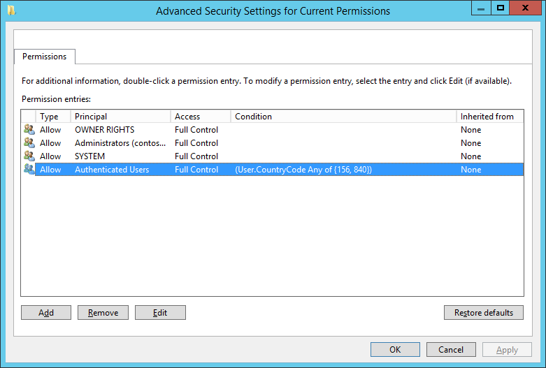

######CountryCodeEquals156AndITDepartmentRule

Target Resources: All Resources
Current Permissions:

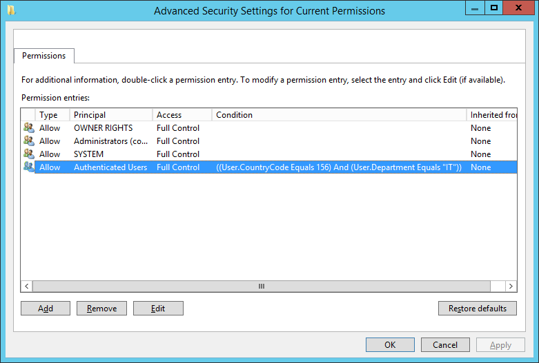

######CountryCodeEquals156OrITDepartmentRule

Target Resources: All Resources
Current Permissions:

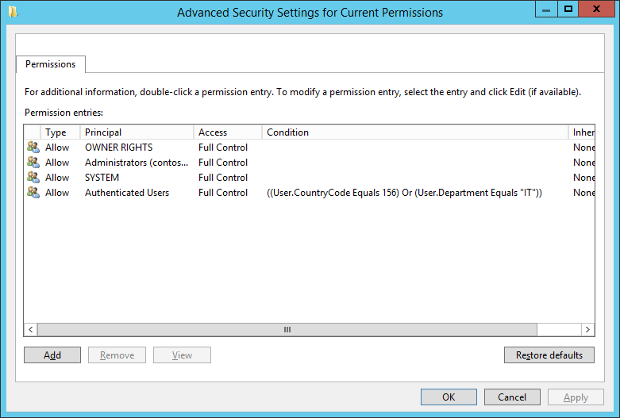

######CountryCodeEquals156Rule

Target Resources: All Resources
Current Permissions:

######CountryCodeGreaterThan392Rule

Target Resources: All Resources
Current Permissions:

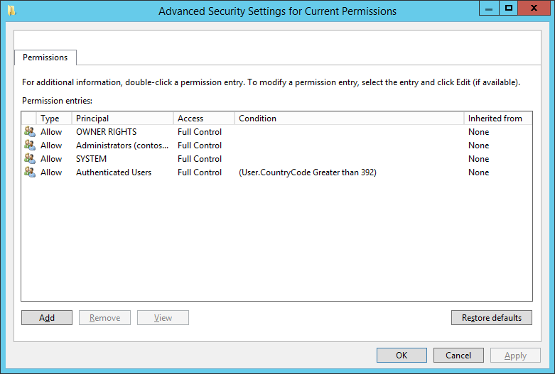

######CountryCodeGreaterThanOrEquals392Rule

Target Resources: All Resources
Current Permissions:

######CountryCodeLessThan392Rule

Target Resources: All Resources
Current Permissions:

######CountryCodeLessThanOrEquals392Rule

Target Resources: All Resources
Current Permissions:

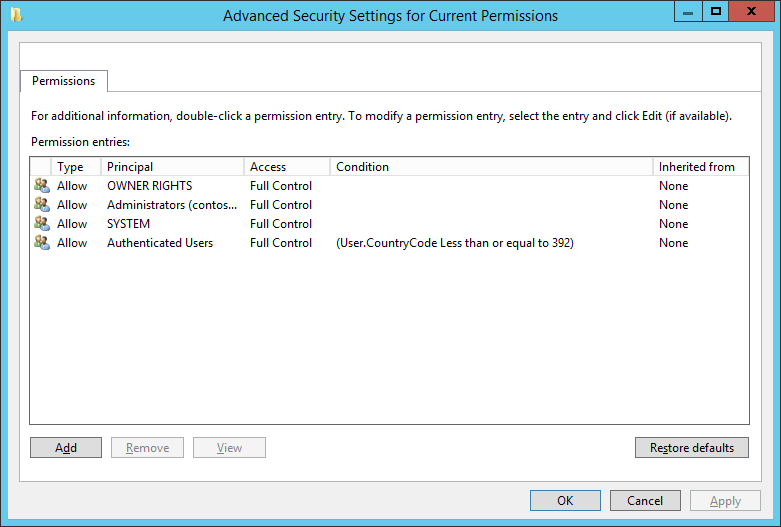

######CountryCodeNotAnyOf156Or840Rule

Target Resources: All Resources
Current Permissions:

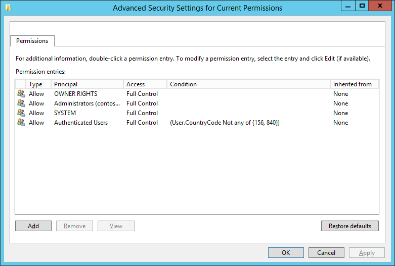

######CountryCodeNotEquals156Rule

Target Resources: All Resources
Current Permissions:

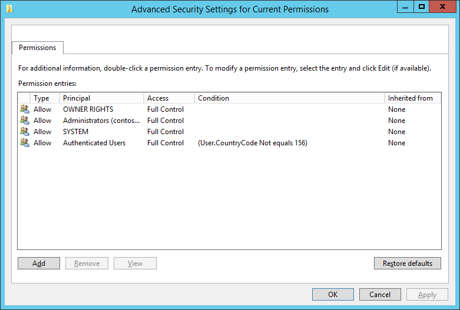

#####Central Access Policies (CAPs)

| Name| Member Central Access Rules| 
| -------------| ------------- |
| CountryCodeAnyOf156Or840Policy| CountryCodeAnyOf156Or840Rule| 
| NotMemberOfEachGroupPolicy| NotMemberOfEachGroupRule| 
| MemberOfAnyGroupPolicy| MemberOfAnyGroupRule| 
| NotMemberOfAnyGroupPolicy| NotMemberOfEachGroupRule| 
| CountryCodeEquals156Policy| CountryCodeEquals156Rule| 
| CountryCodeNotEquals156Policy| CountryCodeNotEquals156Rule| 
| CountryCodeLessThan392Policy| CountryCodeLessThan392Rule| 
| CountryCodeLessThanOrEquals392Policy| CountryCodeLessThanOrEquals392Rule| 
| CountryCodeGreaterThan392Policy| CountryCodeGreaterThan392Rule| 
| CountryCodeGreaterThanOrEquals392Policy| CountryCodeGreaterThanOrEquals392Rule| 
| CountryCodeAnyOf156Or840Policy| CountryCodeAnyOf156Or840Rule| 
| CountryCodeEquals156AndITGroupPolicy| CountryCodeEquals156AndITGroupRule| 
| CountryCodeEquals156OrITGroupPolicy| CountryCodeEquals156OrITGroupRule| 

#####Share(s)
One share need to be exposed, named AzCBAC by default. Share Permission and Folder Permission should all be set to allow everyone to access it.
SMB2 SET_INFO is required to run these cases.

#####BVT cases

| &#32;| &#32;| &#32;| &#32;| &#32; |
| -------------| -------------| -------------| -------------| ------------- |
|  **Test ID**| BVT_CBAC_CountryCodeEquals156Policy| | | | 
|  **Description**| This test case is designed to test whether users can access the share if the policy CountryCodeEquals156Policy is applied on the share.| | | | 
|  **Policy Name**| CountryCodeEquals156Policy| | | | 
|  **Expected Results**|  **User**| Payrollmember01|  **Result**| true| 
|  |  **User**| Payrollmember02|  **Result**| false| 

#####Other traditional cases

| &#32;| &#32;| &#32;| &#32;| &#32; |
| -------------| -------------| -------------| -------------| ------------- |
|  **Test ID**| CBAC_CountryCodeNotEquals156Policy| | | | 
|  **Description**| This test case is designed to test whether users can access the share if the policy CountryCodeNotEquals156Policy is applied on the share.| | | | 
|  **Policy Name**| CountryCodeNotEquals156Policy| | | | 
|  **Expected Results**|  **User**| Payrollmember01|  **Result**| false| 
|  |  **User**| Payrollmember02|  **Result**| true| 

| &#32;| &#32;| &#32;| &#32;| &#32; |
| -------------| -------------| -------------| -------------| ------------- |
|  **Test ID**| CountryCodeAnyOf156Or840Policy| | | | 
|  **Description**| This test case is designed to test whether users can access the share if the policy CountryCodeAnyOf156Or840Policy is applied on the share.| | | | 
|  **Policy Name**| CountryCodeAnyOf156Or840Policy| | | | 
|  **Expected Results**|  **User**| Payrollmember01|  **Result**| true| 
|  |  **User**| Payrollmember02|  **Result**| true| 
|  |  **User**| Payrollmember03|  **Result**| false| 

| &#32;| &#32;| &#32;| &#32;| &#32; |
| -------------| -------------| -------------| -------------| ------------- |
|  **Test ID**| CBAC_CountryCodeGreaterThan392Policy| | | | 
|  **Description**| This test case is designed to test whether users can access the share if the policy CountryCodeGreaterThan392Policy is applied on the share.| | | | 
|  **Policy Name**| CountryCodeGreaterThan392Policy| | | | 
|  **Expected Results**|  **User**| Payrollmember01|  **Result**| false| 
|  |  **User**| Payrollmember02|  **Result**| true| 
|  |  **User**| Payrollmember03|  **Result**| false| 

| &#32;| &#32;| &#32;| &#32;| &#32; |
| -------------| -------------| -------------| -------------| ------------- |
|  **Test ID**| CBAC_CountryCodeLessThan392Policy| | | | 
|  **Description**| This test case is designed to test whether users can access the share if the policy CountryCodeLessThan392Policy is applied on the share.| | | | 
|  **Policy Name**| CountryCodeLessThan392Policy| | | | 
|  **Expected Results**|  **User**| Payrollmember01|  **Result**| true| 
|  |  **User**| Payrollmember02|  **Result**| false| 
|  |  **User**| Payrollmember03|  **Result**| false| 

| &#32;| &#32;| &#32;| &#32;| &#32; |
| -------------| -------------| -------------| -------------| ------------- |
|  **Test ID**| CBAC_CountryCodeLessThanOrEquals392Policy| | | | 
|  **Description**| This test case is designed to test whether users can access the share if the policy CountryCodeLessThanOrEquals392Policy is applied on the share.| | | | 
|  **Policy Name**| CountryCodeLessThanOrEquals392Policy| | | | 
|  **Expected Results**|  **User**| Payrollmember01|  **Result**| true| 
|  |  **User**| Payrollmember02|  **Result**| false| 
|  |  **User**| Payrollmember03|  **Result**| true| 

| &#32;| &#32;| &#32;| &#32;| &#32; |
| -------------| -------------| -------------| -------------| ------------- |
|  **Test ID**| CBAC_CountryCodeEquals156OrITDepartmentPolicy| | | | 
|  **Description**| This test case is designed to test whether users can access the share if the policy CountryCodeEquals156OrITDepartmentPolicy is applied on the share.| | | | 
|  **Policy Name**| CountryCodeLessThanOrEquals392Policy| | | | 
|  **Expected Results**|  **User**| Payrollmember01|  **Result**| true| 
|  |  **User**| Payrollmember02|  **Result**| false| 
|  |  **User**| ITmember01|  **Result**| true| 
|  |  **User**| ITadmin01|  **Result**| true| 

| &#32;| &#32;| &#32;| &#32;| &#32; |
| -------------| -------------| -------------| -------------| ------------- |
|  **Test ID**| CBAC_NoUserClaimBlockWriteControl| | | | 
|  **Description**| This test case is designed to test whether noclaimuser can access the share if any policy is applied on the share.| | | | 
|  **Policy Name**| CountryCodeEquals156Policy| | | | 
|  **Expected Results**|  **User**| noclaimuser|  **Result**| true| 