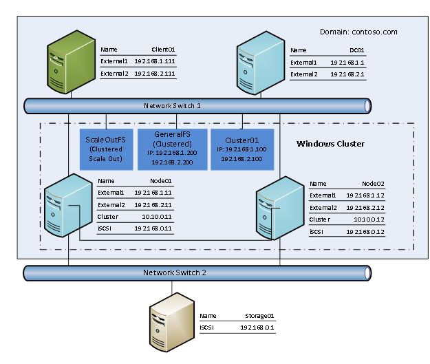
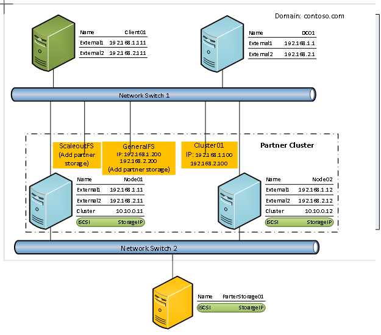

#File Server Protocol Family Server Test Design Specification 

## Content

* [  Test Environment](#1)
	* [ Windows Test Environment](#1.1)
	* [Partner Test Environment](#1.2)
* [ Test Scope](#2)
	* [Test Target](#2.1)
	* [Test Protocols](#2.2)
	* [Restrictions](#2.3)
	* [ Dependencies](#2.4)
		* [ Transport](#2.4.1)
* [Test Suite Design](#3)
	* [SMB2 BVT](#3.1)
		* [ SMB2Basic\_ChangeNotify\_NoFileListDirectoryInGrantedAccess](#3.1.1)
		* [ SMB2Basic\_CancelRegisteredChangeNotify](#3.1.2)
		* [ SMB2Basic\_QueryAndSet\_FileInfo](#3.1.3)
		* [ SMB2Basic\_LockAndUnLock](#3.1.4)
		* [ MultiCredit](#3.1.5)
		* [ Negotiation](#3.1.6)
		* [ MultipleChannel](#3.1.7)
		* [ CopyOffLoad](#3.1.8)
		* [ FileLevelTrim](#3.1.9)
		* [ IntegrityInfo](#3.1.10)
		* [ DirectoryLeasing](#3.1.11)
		* [ Encryption](#3.1.12)
		* [ AppInstanceId](#3.1.13)
		* [ AppInstanceVersion](#3.1.14)
		* [ DurableHandle](#3.1.15)
		* [ Oplock](#3.1.16)
		* [ FileLeasing](#3.1.17)
		* [ Replay](#3.1.18)
		* [ ResilientHandle](#3.1.19)
		* [ Signing](#3.1.20)
		* [ TreeMgmt](#3.1.21)
		* [ SessionMgmt](#3.1.22)
		* [ CreateClose](#3.1.23)
		* [ Compound](#3.1.24)
		* [ ValidateNegotiateInfo](#3.1.25)
		* [ EnumerateSnapShots ](#3.1.26)
		* [ SMB2Basic\_ChangeNotify\_ChangeFileName](#3.1.27)
		* [ SMB2Basic\_ChangeNotify\_ChangeDirName](#3.1.28)
		* [ SMB2Basic\_ChangeNotify\_ChangeAttributes](#3.1.29)
		* [ SMB2Basic\_ChangeNotify\_ChangeSize](#3.1.30)
		* [ SMB2Basic\_ChangeNotify\_ChangeLastAccess](#3.1.31)
		* [ SMB2Basic\_ChangeNotify\_ChangeLastWrite](#3.1.32)
		* [ SMB2Basic\_ChangeNotify\_ChangeCreation](#3.1.33)
		* [ SMB2Basic\_ChangeNotify\_ChangeEa](#3.1.34)
		* [ SMB2Basic\_ChangeNotify\_ChangeSecurity](#3.1.35)
		* [ SMB2Basic\_ChangeNotify\_ChangeStreamName](#3.1.36)
		* [ SMB2Basic\_ChangeNotify\_ChangeStreamSize](#3.1.37)
		* [ SMB2Basic\_ChangeNotify\_ChangeStreamWrite](#3.1.38)
		* [ SMB2Basic\_ChangeNotify\_ServerReceiveSmb2Close](#3.1.39)
		* [ SMB2Basic\_ChangeNotify\_NonDirectoryFile](#3.1.40)
		* [ SMB2Basic\_ChangeNotify\_MaxTransactSizeCheck\_Smb2002](#3.1.41)
		* [ SMB2Basic\_ChangeNotify\_MaxTransactSizeCheck\_Smb21](#3.1.42)
		* [ SMB2Basic\_ChangeNotify\_MaxTransactSizeCheck\_Smb30](#3.1.43)
		* [ SMB2Basic\_ChangeNotify\_MaxTransactSizeCheck\_Smb302](#3.1.44)
		* [ SMB2Basic\_ChangeNotify\_MaxTransactSizeCheck\_Smb311](#3.1.45)
		* [ HVRS\OffloadReadWrite](#3.1.46)
		* [ HVRS\SetZeroData](#3.1.47)
		* [ HVRS\FileLevelTrim](#3.1.48)
		* [ HVRS\DuplicateExtentsToFile](#3.1.49)
		* [ HVRS\SMBDialect](#3.1.50)
		* [ HVRS\PersistentHandles](#3.1.51)
		* [ HVRS\Resiliency](#3.1.52)
		* [ QueryDir\_Reopen\_OnDir](#3.1.53)
		* [ QueryDir\_Reopen\_OnFile](#3.1.54)
		* [ Query\_Quota\_Info](#3.1.55)
		* [ BVT\_SMB2Basic\_Query\_FileAllInformation](#3.1.56)
        * [ Compression](#3.1.57)
	* [SMB2 Feature Test](#3.2)
		* [ AppInstanceId](#3.2.1)
		* [ AppInstanceVersion](#3.2.2)
		* [ CreateClose](#3.2.3)
		* [ CreditMgmt](#3.2.4)
		* [ DirectoryLeasing](#3.2.5)
		* [ Encryption](#3.2.6)
		* [ Handle](#3.2.7)
		* [ Leasing](#3.2.8)
		* [ Negotiate](#3.2.9)
		* [ Oplock](#3.2.10)
		* [ Replay](#3.2.11)
		* [ ResilientHandle](#3.2.12)
		* [ SessionMgmt](#3.2.13)
		* [ MultipleChannel](#3.2.14)
		* [ Signing](#3.2.15)
		* [ TreeMgmt](#3.2.16)
		* [ ValidateNegotiateInfo](#3.2.17)
		* [ FileLevelTrim](#3.2.18)
		* [ CopyOfflaod](#3.2.19)
		* [ OperateOneFileFromTwoNodes](#3.2.20)
		* [ MixedOplockLease](#3.2.21)
		* [ Compression](#3.2.22)
	* [SMB2 Feature Combination](#3.3)
		* [ MultipleChannelWithReplay](#3.3.1)
		* [ MultipleChannelWithEncryption](#3.3.2)
		* [ MultipleChannelWithLease](#3.3.3)
		* [ MultipleChannelWithLock](#3.3.4)
		* [ AppInstanceWithEncryption](#3.3.5)
		* [ AppInstanceWithLease](#3.3.6)
		* [ AppInstanceWithLock](#3.3.7)
		* [ CompoundWithEncryption](#3.3.8)
	* [Server Failover Test](#3.4)
		* [ SWNGetInterfaceList](#3.4.1)
		* [ SWNRegistration](#3.4.2)
		* [ SWNAsyncNotification](#3.4.3)
		* [ AsmmetricShare](#3.4.4)
		* [ FileServerFailover](#3.4.5)
		* [ FileServerFailover\_Encryption](#3.4.6)
		* [ FileServerFailover\_Lease](#3.4.7)
		* [ FileServerFailover\_Lock](#3.4.8)
		* [ FileServerFailover\_DurableHandleV2](#3.4.9)
		* [ FileServerFailover\_SMB311\_Redirect\_To\_Owner\_SOFS](#3.4.10)
	* [FSRVP Test](#3.5)
		* [ VSSOperateShadowCopySet](#3.5.1)
		* [ VSSSetContext](#3.5.2)
		* [ VSSAbortShadowCopySet](#3.5.3)
	* [RSVD Test](#3.6)
		* [ OpenCloseSharedVHD](#3.6.1)
		* [ TunnelOperationToSharedVHD](#3.6.2)
		* [ ReadWriteSharedVHD](#3.6.3)
		* [ QuerySharedVirtualDiskSupport](#3.6.4)
		* [ TwoClientsAccessSameSharedVHD](#3.6.5)
		* [ QueryVHDSetFileInfo ](#3.6.7)
		* [ ConvertVHDtoVHDSet ](#3.6.8)
		* [ Checkpoint ](#3.6.9)
		* [ ExtractAndOptimizeVHDSet ](#3.6.10)
		* [ Resize ](#3.6.11)
		* [ SCSI Persistent Reservation ](#3.6.12)
		* [ ChangeTracking ](#3.6.13)
	* [ DFSC Test](#3.7)
		* [ Domain\_referral\_to\_DC](#3.7.1)
		* [ DC\_referral\_to\_DC](#3.7.2)
		* [ Sysvol\_referral\_to\_DC](#3.7.3)
		* [ Root\_referral\_to\_DC](#3.7.4)
		* [ Link\_referral\_to\_DC](#3.7.5)
		* [ Root\_and\_Link\_referral\_to\_DFSServer](#3.7.6)
		* [ Path\_Normalization\_to\_DFSServer](#3.7.7)

## <a name="1">  Test Environment

### <a name="1.1"> Windows Test Environment

Below environment topology is used to demonstrate how Windows uses MS-SMB2 protocol to access files which are hosted in remote shares. To simplify the environment, all objects are created under Hyper-V manager and use VMs instead of physical machines.

**Operating System Used**

| **Operating System**   | **Virtual Machines**            |
|------------------------|---------------------------------|
| Windows Server 2012 R2 | DC01, Node01, Node02, Storage01 |
| Windows 8.1            | Client01                        |

**Network Overview**

### <a name="1.2">Partner Test Environment
------------------------

There are 2 options for partner to reuse above test environment:

-   Replace the whole cluster and the storage.

-   Replace only the storage in the cluster.

There are 2 parts to modify if only replace storage:

-   Replace the Storage01 using partner’s storage.

-   Replace the storage in ScaleoutFS and GeneralFS.

**Network Overview**

## <a name="2"> Test Scope

### <a name="2.1">Test Target

This test suite will test the server endpoint of MS-FSRVP, MS-SMB2, MS-SWN, MS-RSVD, MS-DFSC, and test suite acts as client role.

### <a name="2.2">Test Protocols

This test suite includes test cases of following File Sharing protocols:

1.  MS-FSRVP

2.  MS-SMB2

3.  MS-SWN

4.  MS-RSVD

5.  MS-DFSC

6.  MS-HVRS

### <a name="2.3">Restrictions

1.  Named pipes and printer files are not tested.

2.  ServerStatistics is not tested.

### <a name="2.4"> Dependencies

#### <a name="2.4.1"> Transport

MS-FSRVP scenario VSSOperateShadowCopySet in test suite utilizes MS-RPCE SDK which uses SMB and SMB2 as transport. When test FSRVP server (i.e. test suite act as synthetic client), the underlying MS-RPCE SDK code on synthetic client side will first select SMB2 as transport to communicate with server, if the server side doesn’t implement/support SMB2 as transport, the client side will use SMB as transport to communicate with server.

## <a name="3">Test Suite Design

Test scenarios are categorized as below table and will be described in following sections.

| Category                 | Test Cases | Comments                                                                                                          |
|--------------------------|------------|-------------------------------------------------------------------------------------------------------------------|
| SMB2 BVT                 | 87         | SMB2 common scenarios.                                                                                            |
| SMB2 Feature Test        | 2609       | This test is divided by features. It contains both Model-Based test cases and traditional cases. The traditional cases are used to cover the statements which are not suitable to cover by Model-Based test cases.  About Model-Based Testing, please see [Spec Explorer](http://msdn.microsoft.com/en-us/library/ee620411.aspx)       |
| SMB2 Feature Combination | 12         | Extended test with more complex message sequence for new features in SMB 3.0 dialect and later.                   |
| FSRVP Test               | 14         | Test for MS-FSRVP                                                                                                 |
| Server Failover Test     | 48         | Test server failover for MS-SMB2, MS-SWN and MS-FSRVP                                                             |
| RSVD Test                | 29         | Test for MS-RSVD                                                                                                  |
| DFSC Test                | 43         | Test for MS-DFSC                                                                                                  |
| HVRS Test                | 8          | Test for MS-HVRS                                                                                                  |

### <a name="3.1">SMB2 BVT

This is used to test SMB2 common user scenarios.

#### <a name="3.1.1"> SMB2Basic\_ChangeNotify\_NoFileListDirectoryInGrantedAccess

##### <a name="3.1.1.1"> Scenario

|||
|---|---|
| **Description**               | Verify server must send an CHANGE\_NOTIFY response with STATUS\_ACCESS\_DENIED status code if CHANGE\_NOTIFY request is for a directory which GrantedAccess does not include FILE\_LIST\_DIRECTORY.|
| **Message Sequence**          | 1.  Start a client to create a directory by sending the following requests: 1. NEGOTIATE; 2. SESSION\_SETUP; 3. TREE\_CONNECT; 4. CREATE (without FILE\_LIST\_DIRECTORY in GrantedAccess). |
|                               | 2.  Client starts to register CHANGE\_NOTIFY on a directory with CompletionFilter FILE\_NOTIFY\_CHANGE\_LAST\_ACCESS. |
|                               | 3.  Tear down the client by sending the following requests: 1. CLOSE; 2. TREE\_DISCONNECT; 3. LOG\_OFF |
| **Cluster Involved Scenario** | **NO** |

##### <a name="3.1.1.2"> Test Case

|||
|---|---|
| **Test ID** | BVT\_SMB2Basic\_ChangeNotify\_NoFileListDirectoryInGrantedAccess |
| **Description** | Test whether server sends an CHANGE\_NOTIFY response with STATUS\_ACCESS\_DENIED status code if CHANGE\_NOTIFY request is for a directory which GrantedAccess does not include FILE\_LIST\_DIRECTORY. |
| **Prerequisites** ||
| **Test Execution Steps** | Create Client |
|                          | NEGOTIATE |
|                          | SESSION\_SETUP |
|                          | TREE\_CONNECT|
|                          | CREATE (Directory without FILE\_LIST\_DIRECTORY in GrantedAccess)|
|                          | CHANGE\_NOTIFY (FILE\_NOTIFY\_CHANGE\_LAST\_ACCESS for CompletionFilter) |
|                          | Expect STATUS\_ACCESS\_DENIED in CHANGE\_NOTIFY response |
|                          | CLOSE |
|                          | TREE\_DISCONNECT |
|                          | LOGOFF |
| **Cleanup**              ||

#### <a name="3.1.2"> SMB2Basic\_CancelRegisteredChangeNotify

##### <a name="3.1.2.1"> Scenario

| **Description**               | Verify that CANCEL request cancels CHANGE\_NOTIFY request when there’s no CHANGE\_NOTIFY response from server                       |
|-------------------------------|-------------------------------------------------------------------------------------------------------------------------------------|
| **Message Sequence**          | 1.  Start a client to create a file by sending the following requests: 1. NEGOTIATE; 2. SESSION\_SETUP; 3. TREE\_CONNECT; 4. CREATE 
|                               | 2.  Client starts to register CHANGE\_NOTIFY on directory.                                                                           |
|                               | 3.  Client starts to cancel the registered CHANGE\_NOTIFY on directory. |                                                             
|                               |4.  Tear down the client by sending the following requests: 1. CLOSE; 2. TREE\_DISCONNECT; 3. LOG\_OFF                               |
| **Cluster Involved Scenario** | **NO**                                                                                                                              |

##### <a name="3.1.2.2"> Test Case

|                          |                                                                                                                                              |
|--------------------------|----------------------------------------------------------------------------------------------------------------------------------------------|
| **Test ID**              | BVT\_SMB2Basic\_CancelRegisteredChangeNotify                                                                                                 |
| **Description**         | This test case is designed to verify that CANCEL request cancels CHANGE\_NOTIFY request when there's no CHANGE\_NOTIFY response from server. |
| **Prerequisites**        |                                                                                                                                              |
| **Test Execution Steps** | NEGOTIATE |                                                                                                                                   
|                          |SESSION\_SETUP |                                                                                                                               
|                          |TREE\_CONNECT|                                                                                                                                 
|                          |CREATE (Directory)|                                                                                                                            
|                          | CHANGE\_NOTIFY (FILE\_NOTIFY\_CHANGE\_LAST\_WRITE for CompletionFilter)  |                                                                     
|                          |CANCEL |                                                                                                                                        
|                          | Expect STATUS\_CANCELLED in CHANGE\_NOTIFY response |                                                                                          
|                          | CLOSE |                                                                                                                                        
|                          | TREE\_DISCONNECT |                                                                                                                             
|                          | LOGOFF                                                                                                                                       |
| **Cleanup**              |                                                                                                                                              |

#### <a name="3.1.3"> SMB2Basic\_QueryAndSet\_FileInfo

##### <a name="3.1.3.1"> Scenario

| **Description**               | Query and set the info for a file                                                                             |
|-------------------------------|---------------------------------------------------------------------------------------------------------------|
| **Message Sequence**          | 1.  Starts a client by sending the following requests: 1. NEGOTIATE; 2. SESSION\_SETUP; 3. TREE\_CONNECT.     |  
|                               | 2.  Client sends CREATE request with desired access set to CENERIC\_READ and CENERIC\_WRITE to create a file. | 
|                               | 3.  Client sends QUERY\_INFO request to query file attributes.                                                | 
|                               | 4.  Convert file basic information                                                                            | 
|                               | 5.  Client sends SetFileAttributes request to set LastAccessTime for the file                                 | 
|                               | 6.  Client sends QUERY request to query file attributes.                                                      | 
|                               | 7.  Convert lastAccessTime in QUERY\_INFO response after SET\_INFO.                                           | 
|                               | 8.  Tear down the client by sending the following requests: 1. CLOSE; 2. TREE\_DISCONNECT; 3. LOG\_OFF"       |
| **Cluster Involved Scenario** | NO                                                                                                            |

##### <a name="3.1.3.2"> Test Case

|                          |                                                                                                                            |
|--------------------------|----------------------------------------------------------------------------------------------------------------------------|
| **Test ID**              | BVT\_SMB2Basic\_QueryAndSet\_FileInfo                                                                                      |
| **Description**         | Query and set the info for a file                                                                                          |
| **Prerequisites**        |                                                                                                                            |
| **Test Execution Steps** | NEGOTIATE                                                                                                                  |
|                          |SESSION\_SETUP                                                                                                              |
|                          | TREE\_CONNECT                                                                                                              | 
|                          |CREATE (File, with desired access GENERIC\_WRITE and GENERIC\_READ)                                                         |
|                          |Parse FileBasicInformation from CREATE response                                                                             |
|                          |QUERY\_INFO (with SMB2\_0\_INFO\_FILE for InfoType and FileBasicInformation for FileInfoClass)                              |
|                          |SET\_INFO (with SMB2\_0\_INFO\_FILE for InfoType and FileBasicInformation.LastAccessTime)                                   |
|                          |QUERY\_INFO (with SMB2\_0\_INFO\_FILE for InfoType and FileBasicInformation for FileInfoClass) to verify if set info works  |
|                          |CLOSE                                                                                                                       |
|                          |TREE\_DISCONNECT                                                                                                            |
|                          |LOGOFF                                                                                                                      |
| **Cleanup**              |                                                                                                                            |

#### <a name="3.1.4"> SMB2Basic\_LockAndUnLock

##### <a name="3.1.4.1"> Scenario

| **Description**               | This test case is designed to test whether server can handle WRITE of locking content correctly. |
|-------------------------------|--------------------------------------------------------------------------------------------------|
| **Message Sequence**          | **From client1 open a file and lock a specific range**                                           
|                               | NEGOTIATE                                                                                        | 
|                               | SESSION\_SETUP                                                                                   | 
|                               | TREE\_CONNECT                                                                                    |
|                               | CREATE (File)                                                                                    | 
|                               | LOCK (with SMB2\_LOCKFLAG\_SHARED\_LOCK in SMB2\_LOCK\_ELEMENT)                                  | 
|                               | WRITE                                                                                            | 
|                               | **From client2 open the same file and try to read and write the locking range**                  | 
|                               | NEGOTIATE                                                                                        | 
|                               | SESSION\_SETUP                                                                                   | 
|                               | TREE\_CONNECT                                                                                    | 
|                               | CREATE (File)                                                                                    | 
|                               | READ (the locking range, expect success)                                                         | 
|                               | WRITE (the locking range, expect fail)                                                           | 
|                               | **From client1 unlock the range**                                                                | 
|                               | LOCK (with SMB2\_LOCKFLAG\_UNLOCK in SMB2\_LOCK\_ELEMENT)                                        | 
|                               | CLOSE                                                                                            | 
|                               | TREE\_DISCONNECT                                                                                 | 
|                               | LOGOFF                                                                                           | 
|                               | **From client2 try to write the range**                                                          | 
|                               | WRITE (the locking range, expect success)                                                        | 
|                               | CLOSE                                                                                            | 
|                               | TREE\_DISCONNECT                                                                                 | 
|                               | LOGOFF                                                                                           |
| **Cluster Involved Scenario** | **NO**                                                                                           |

##### <a name="3.1.4.2"> Test Case

|                          |                                                                                       |
|--------------------------|---------------------------------------------------------------------------------------|
| **Test ID**              | BVT\_SMB2Basic\_LockAndUnLock                                                         |
| **Description**         | Verify locking range could not be written and after unlock the range could be written |
| **Prerequisites**        |                                                                                       |
| **Test Execution Steps** | **From client1 open a file and lock a specific range**                                |
|                          |NEGOTIATE                                                                              |
|                          |SESSION\_SETUP                                                                         |
|                          |TREE\_CONNECT                                                                          |
|                          |CREATE (File)                                                                          |
|                          |LOCK (with SMB2\_LOCKFLAG\_SHARED\_LOCK in SMB2\_LOCK\_ELEMENT)                        |
|                          | WRITE                                                                                 | 
|                          | **From client2 open the same file and try to read and write the locking range**       | 
|                          | NEGOTIATE                                                                             | 
|                          | SESSION\_SETUP                                                                        |  
|                          | TREE\_CONNECT                                                                         | 
|                          | CREATE (File)                                                                         | 
|                          | READ (the locking range, expect success)                                              | 
|                          | WRITE (the locking range, expect fail)                                                | 
|                          | **From client1 unlock the range**                                                     | 
|                          | LOCK (with SMB2\_LOCKFLAG\_UNLOCK in SMB2\_LOCK\_ELEMENT)                             | 
|                          | CLOSE                                                                                 | 
|                          | TREE\_DISCONNECT                                                                      | 
|                          | LOGOFF                                                                                | 
|                          | **From client2 try to write the range**                                               | 
|                          | WRITE (the locking range, expect success)                                             | 
|                          | CLOSE                                                                                 | 
|                          | TREE\_DISCONNECT                                                                      | 
|                          | LOGOFF                                                                                |
| **Cleanup**              |                                                                                       |

#### <a name="3.1.5"> MultiCredit

##### <a name="3.1.5.1"> Scenario

| **Description**               | Send request which consume more than 1 credit              |
|-------------------------------|------------------------------------------------------------|
| **Message Sequence**          | NEGOTIATE                                                  |
|                               | SESSION\_SETUP                                             | 
|                               | TREE\_CONNECT                                              | 
|                               | CREATE (File and request multiple credit at the same time) | 
|                               | Send request which consumes more than 1 credit             | 
|                               | CLOSE                                                      | 
|                               | TREE\_DISCONNECT                                           | 
|                               | LOGOFF                                                     |
| **Cluster Involved Scenario** | NO                                                         |

##### <a name="3.1.5.2"> Test Case

|                          |                                                                                                               |
|--------------------------|---------------------------------------------------------------------------------------------------------------|
| **Test ID**              | BVT\_MultiCredit\_OneRequestWithMultiCredit                                                                   |
| **Description**         | This test case is designed to test whether server can handle one request which consumes more than one credit. |
| **Prerequisites**        |                                                                                                               |
| **Test Execution Steps** | NEGOTIATE                                                                                                     | 
|                          | SESSION\_SETUP                                                                                                | 
|                          | TREE\_CONNECT                                                                                                 | 
|                          | CREATE (File and request multiple credit at the same time)                                                    | 
|                          | WRITE request which consumes more than 1 credits                                                              | 
|                          | READ request which consumes more than 1 credits                                                               | 
|                          | CLOSE                                                                                                         | 
|                          | TREE\_DISCONNECT                                                                                              | 
|                          | LOGOFF                                                                                                        |
| **Cleanup**              |                                                                                                               |

#### <a name="3.1.6"> Negotiation

##### <a name="3.1.6.1"> Scenario

|                               |                                                                   |
|-------------------------------|-------------------------------------------------------------------|
| **Description**               | SMB 3 protocol negotiation, this is non-cluster involved scenario |
| **Message Sequence**          | SMB\_COM\_NEGOTIATE (Optional)                                    |  
|                               | NEGOTIATE                                                         |
| **Cluster Involved Scenario** | NO                                                                |

##### <a name="3.1.6.2"> Test Case

|                          |                                                                                                    |
|--------------------------|----------------------------------------------------------------------------------------------------|
| **Test ID**              | BVT\_Negotiate\_Compatible\_Wildcard                                                               |
| **Description**         | This test case is designed to test whether server can handle NEGOTIATE with Smb2 dialect wildcard. |
| **Prerequisites**        |                                                                                                    |
| **Test Execution Steps** | 1.  Client sends SMB\_COM\_NEGOTIATE containing SMB2.??? Dialect and SMB2.002                      |
|                          | 2.  Server returns SMB2 NEGOTIATE response with SMB2.FF dialect                                    | 
|                          | 3.  Client sends SMB2 NEGOTIATE request containing SMB2.002, SMB2.1, SMB3 dialects                 | 
|                          | 4.  Server returns SMB2 NEGOTIATE response with SMB3 dialect                                       |
| **Cleanup**              |                                                                                                    |

|                          |                                                                  |
|--------------------------|------------------------------------------------------------------|
| **Test ID**              | BVT\_Negotiate\_Compatible\_2002                                 |
| **Description**         | Ensure server could handle compatible negotiate                  |
| **Prerequisites**        |                                                                  |
| **Test Execution Steps** | 1.  Client sends SMB\_COM\_NEGOTIATE containing SMB2.002         |
|                          |  2.  Server returns SMB2 NEGOTIATE response with SMB2.002 dialect|
| **Cleanup**              |                                                                  |

|                          |                                                                                                |
|--------------------------|------------------------------------------------------------------------------------------------|
| **Test ID**              | BVT\_Negotiate\_SMB2002                                                                        |
| **Description**         | This test case is designed to test whether server can handle NEGOTIATE with Smb 2.002 dialect. |
| **Prerequisites**        |                                                                                                |
| **Test Execution Steps** | 1.  Client sends SMB2 NEGOTIATE containing SMB2.002                                            |
|                          | 2.  Server returns SMB2 NEGOTIATE response with SMB2.002 dialect                               |
| **Cleanup**              |                                                                                                |

|                          |                                                                                                  |
|--------------------------|--------------------------------------------------------------------------------------------------|
| **Test ID**              | BVT\_Negotiate\_SMB21                                                                            |
| **Description**         | This test case is designed to test whether server can handle NEGOTIATE with Smb 2.1 dialect.     |
| **Prerequisites**        |                                                                                                  |
| **Test Execution Steps** | 1.  Client sends SMB2 NEGOTIATE containing SMB2.002 and SMB2.1                                   |
|                          | 2.  Server returns SMB2 NEGOTIATE response with the max common dialect client and server support |
| **Cleanup**              |                                                                                                  |

|                          |                                                                                                  |
|--------------------------|--------------------------------------------------------------------------------------------------|
| **Test ID**              | BVT\_Negotiate\_SMB30                                                                            |
| **Description**         | This test case is designed to test whether server can handle NEGOTIATE with Smb 3.0 dialect.     |
| **Prerequisites**        |                                                                                                  |
| **Test Execution Steps** | 1.  Client sends SMB2 NEGOTIATE containing SMB2.002, SMB2.1 and SMB3.0                           |
|                          | 2.  Server returns SMB2 NEGOTIATE response with the max common dialect client and server support |
| **Cleanup**              |                                                                                                  |

|                          |                                                                                                  |
|--------------------------|--------------------------------------------------------------------------------------------------|
| **Test ID**              | BVT\_Negotiate\_SMB302                                                                           |
| **Description**         | This test case is designed to test whether server can handle NEGOTIATE with Smb 3.02 dialect.    |
| **Prerequisites**        |                                                                                                  |
| **Test Execution Steps** | 1.  Client sends SMB2 NEGOTIATE containing SMB2.002, SMB2.1, SMB3.0 and SMB3.02                  |
|                          | 2.  Server returns SMB2 NEGOTIATE response with the max common dialect client and server support |
| **Cleanup**              |                                                                                                  |

|                          |                                                                                                    |
|--------------------------|----------------------------------------------------------------------------------------------------|
| **Test ID**              | BVT\_Negotiate\_SigningEnabled                                                                     |
| **Description**         | This test case is designed to test whether server can handle NEGOTIATE with Signing Enabled.       |
| **Prerequisites**        |                                                                                                    |
| **Test Execution Steps** | 1.  Client sends NEGOTIATE request containing SMB2.002, SMB2.1, SMB3 dialects with signing enabled |
|                          | 2.  Server returns NEGOTIATE response with SMB3 dialect                                            |
| **Cleanup**              |                                                                                                    |

|                          |                                                                                                                                                                            |
|--------------------------|----------------------------------------------------------------------------------------------------------------------------------------------------------------------------|
| **Test ID**              | BVT\_Negotiate\_SMB311                                                                                                                                                     |
| **Description**         | This test case is designed to test whether server (including the server doesn't implement dialect 3.11) can handle NEGOTIATE with Smb 3.11 dialect and Negotiate Contexts. |
| **Prerequisites**        |                                                                                                                                                                            |
| **Test Execution Steps** | 1.  Client sends Negotiate request with dialect SMB 3.11, SMB2\_PREAUTH\_INTEGRITY\_CAPABILITIES context and SMB2\_ENCRYPTION\_CAPABILITIES context.                        |
|                          | 2.  Server returns correct SMB2 NEGOTIATE response according to their supported dialect.                                                                                   |
| **Cleanup**              |                                                                                                                                                                            |

|                          |                                                                                                                                                       |
|--------------------------|-------------------------------------------------------------------------------------------------------------------------------------------------------|
| **Test ID**              | BVT\_Negotiate\_SMB311\_Preauthentication                                                                                                             |
| **Description**         | This test case is designed to test whether server can handle NEGOTIATE with Smb 3.11 dialect and SMB2\_PREAUTH\_INTEGRITY\_CAPABILITIES context only. |
| **Prerequisites**        | The server implements dialect 3.11.                                                                                                                   |
| **Test Execution Steps** | 1.  Client sends Negotiate request with dialect SMB 3.11, SMB2\_PREAUTH\_INTEGRITY\_CAPABILITIES context.                                              |
|                          | 2.  Server returns SMB2 NEGOTIATE response with dialect 3.11 and the correct SMB2\_PREAUTH\_INTEGRITY\_CAPABILITIES context.                          |
| **Cleanup**              |                                                                                                                                                       |

|                          |                                                                                                                                                       |
|--------------------------|-------------------------------------------------------------------------------------------------------------------------------------------------------------------------------------------|
| **Test ID**              | BVT\_Negotiate\_SMB311\_Preauthentication\_Encryption\_CCM                                                                                                                                |
| **Description**         | This test case is designed to test whether server can handle NEGOTIATE with Smb 3.11 dialect and SMB2\_PREAUTH\_INTEGRITY\_CAPABILITIES context and SMB2\_ENCRYPTION\_CAPABILITIES context with AES-128-CCM preferred. |
| **Prerequisites**        | The server implements dialect 3.11.                                                                                                                                                       |
| **Test Execution Steps** | 1.  Client sends Negotiate request with dialect SMB 3.11, SMB2\_PREAUTH\_INTEGRITY\_CAPABILITIES context and SMB2\_ENCRYPTION\_CAPABILITIES context with AES-128-CCM preferred.            |
|                          | 2.  Server returns SMB2 NEGOTIATE response with dialect 3.11 and the correct Ciphers in SMB2\_ENCRYPTION\_CAPABILITIES context.                                                           |
| **Cleanup**              |                                                                                                                                                                                           |

|                          |                                                                                                                                                       |
|--------------------------|-------------------------------------------------------------------------------------------------------------------------------------------------------------------------------------------|
| **Test ID**              | BVT\_Negotiate\_SMB311\_Preauthentication\_Encryption\_GCM                                                                                                                                |
| **Description**         | This test case is designed to test whether server can handle NEGOTIATE with Smb 3.11 dialect and SMB2\_PREAUTH\_INTEGRITY\_CAPABILITIES context and SMB2\_ENCRYPTION\_CAPABILITIES context with AES-128-GCM preferred. |
| **Prerequisites**        | The server implements dialect 3.11.                                                                                                                                                       |
| **Test Execution Steps** | 1.  Client sends Negotiate request with dialect SMB 3.11, SMB2\_PREAUTH\_INTEGRITY\_CAPABILITIES context and SMB2\_ENCRYPTION\_CAPABILITIES context with AES-128-GCM preferred.            |
|                          | 2.  Server returns SMB2 NEGOTIATE response with dialect 3.11 and the correct Ciphers in SMB2\_ENCRYPTION\_CAPABILITIES  context.                                                          |
| **Cleanup**              |                                                                                                                                                                                           |

|                          |                                                                                                                                                       |
|--------------------------|-------------------------------------------------------------------------------------------------------------------------------------------------------------------------------------------|
| **Test ID**              | BVT_Negotiate_SMB311_CompressionEnabled |
| **Description**          | This test case is designed to test whether server can handle NEGOTIATE with supported compression algorithms in SMB2_COMPRESSION_CAPABILITIES context. |
| **Prerequisites**        | The server implements dialect 3.11 and compression feature. |
| **Test Execution Steps** | 1.  Client sends Negotiate request with dialect SMB 3.11, SMB2_PREAUTH_INTEGRITY_CAPABILITIES context and SMB2_COMPRESSION_CAPABILITIES context with all supported compression algorithms. |
|                          | 2.  Server returns SMB2 NEGOTIATE response with the expected SMB2_COMPRESSION_CAPABILITIES, if it supports the compression feature, as below: |
|                          |     a.  If server is Windows, CompressionAlgorithms is set to the first common algorithm supported by the client and server. |
|                          |     b.  If server is non-Windows, CompressionAlgorithms is set to all the algorithms in the CompressionAlgorithms field of Negotiate request, in the order they are received. |
| **Cleanup**              |                                                                                                                                                                                           |

#### <a name="3.1.7"> MultipleChannel

##### <a name="3.1.7.1"> Scenario

|                               |                                                |
|-------------------------------|------------------------------------------------|
| **Description**               | Bind session to multiple connections           |
| **Message Sequence**          | **Create main channel**                        |
|                               | NEGOTIATE                                      | 
|                               | SESSION\_SETUP                                 | 
|                               | TREE\_CONNECT (IPC$)                           | 
|                               | IOCTL (FSCTL\_QUERY\_NETWORK\_INTERFACE\_INFO) | 
|                               | TREE\_CONNECT                                  | 
|                               | CREATE                                         | 
|                               | WRITE                                          | 
|                               | **Create alterative channel**                  | 
|                               | NEGOTIATE                                      | 
|                               | SESSION\_SETUP (SMB2\_SESSION\_FLAG\_BINDING)  | 
|                               | READ                                           | 
|                               | CLOSE                                          | 
|                               | TREE\_DISCONNECT                               | 
|                               | LOGOFF                                         |
| **Cluster Involved Scenario** | **NO**                                         |

##### <a name="3.1.7.2"> Test Case

|                          |                                                                                                                                     |
|--------------------------|-------------------------------------------------------------------------------------------------------------------------------------|
| **Test ID**              | BVT\_MultipleChannel\_NicRedundantOnBoth                                                                                            |
| **Description**         | This test case is designed to test the basic functionality of Multiple Channel, assuming that both client and server have two NICs. |
| **Prerequisites**        |                                                                                                                                     |
| **Test Execution Steps** | SETUP\_CONNECTION from client NIC\_1 to SUT NIC\_1                                                                                  |
|                          | NEGOTIATE                                                                                                                           | 
|                          | SESSION\_SETUP                                                                                                                      | 
|                          | TREE\_CONNECT                                                                                                                       | 
|                          | CREATE                                                                                                                              | 
|                          | WRITE                                                                                                                               | 
|                          | SETUP\_CONNECTION from client NIC\_2 to SUT NIC\_2                                                                                  | 
|                          | NEGOTIATE                                                                                                                           | 
|                          | SESSION\_SETUP binding to the previous one                                                                                          | 
|                          | TREE\_CONNECT                                                                                                                       | 
|                          | CREATE                                                                                                                              | 
|                          | READ                                                                                                                                | 
|                          | Verify WRITE and READ data should be identical                                                                                      |
| **Cleanup**              |                                                                                                                                     |

#### <a name="3.1.8"> CopyOffLoad

##### <a name="3.1.8.1"> Scenario

|                               |                                                           |
|-------------------------------|-----------------------------------------------------------|
| **Description**               | Offload the copy operation to intelligent storage devices |
| **Message Sequence**          | NEGOTIATE                                                 |   
|                               | SESSION\_SETUP                                            |    
|                               | TREE\_CONNECT                                             |   
|                               | CREATE                                                    |   
|                               | IOCtl with FSCTL\_OFFLOAD\_READ                           |    
|                               | IOCtl with FSCTL\_OFFLOAD\_WRITE                          |    
|                               | READ                                                      |    
|                               | CLOSE                                                     |    
|                               | TREE\_DISCONNECT                                          |   
|                               | LOGOFF                                                    |
| **Cluster Involved Scenario** | NO                                                        |

##### <a name="3.1.8.2"> Test Case

|                          |                                                                                                                               |
|--------------------------|-------------------------------------------------------------------------------------------------------------------------------|
| **Test ID**              | BVT\_CopyOffload                                                                                                              |
| **Description**         | This test case is designed to test whether server can handle offload copy correctly when copy content between two files.      |
| **Prerequisites**        |                                                                                                                               |
| **Test Execution Steps** | 1.  Client sends NEGOTIATE request                                                                                            |
|                          | 2.  Server sends NEGOTIATE response                                                                                           |   
|                          | 3.  Client sends SESSION\_SETUP request                                                                                       | 
|                          | 4.  Server sends SESSION\_SETUP response                                                                                      | 
|                          | 5.  According to the status code of last step, client may send more SESSION\_SETUP request as needed                          |   
|                          | 6.  Client sends TREE\_CONNECT request                                                                                        |  
|                          | 7.  Server sends TREE\_CONNECT response                                                                                       | 
|                          | 8.  Client sends CREATE request to create a test file as source of offload copy.                                              | 
|                          | 9.  Server sends CREATE response                                                                                              | 
|                          | 10. Client sends WRITE request to prepare content test file.                                                                  | 
|                          | 11. Server sends WRITE response.                                                                                              | 
|                          | 12. Client sends FLUSH request to make sure the content is written to backend storage.                                        | 
|                          | 13. Server sends FLUSH response.                                                                                              | 
|                          | 14. Client sends IOCTL request with FSCTL\_OFFLOAD\_READ to ask server to generate the token of the content for offload copy. | 
|                          | 15. Server sends IOCTL response                                                                                               | 
|                          | 16. Client sends CREATE request to create another file as destination of offload copy.                                        | 
|                          | 17. Server sends CREATE response.                                                                                             | 
|                          | 18. Client sends IOCTL request with FSCTL\_OFFLOAD\_WRITE to ask server to copy the content from source to destination.       | 
|                          | 19. Server sends IOCTL response                                                                                               | 
|                          | 20. Client sends READ request                                                                                                 | 
|                          | 21. Server sends READ response                                                                                                | 
|                          | 22. Compare the read content is identical to written content.                                                                 | 
|                          | 23. Client sends CLOSE request                                                                                                | 
|                          | 24. Server sends CLOSE response                                                                                               | 
|                          | 25. Client sends TREE\_DISCONNECT request                                                                                     | 
|                          | 26. Server sends TREE\_DISCONNECT response                                                                                    |
|                          | 27. Client sends LOGOFF request                                                                                               | 
|                          | 28. Server sends LOGOFF response                                                                                              |
| **Cleanup**              |                                                                                                                               |

#### <a name="3.1.9"> FileLevelTrim

##### <a name="3.1.9.1"> Scenario

| **Description**               | Trim a range of a file, then read that range again |
|-------------------------------|----------------------------------------------------|
| **Message Sequence**          | NEGOTIATE                                          |
|                               | SESSION\_SETUP                                     | 
|                               | TREE\_CONNECT                                      | 
|                               | CREATE                                             | 
|                               | WRITE                                              | 
|                               | CREATE                                             | 
|                               | IOCTL (with FSCTL\_FILE\_LEVEL\_TRIM)              | 
|                               | CREATE                                             | 
|                               | READ                                               | 
|                               | CLOSE                                              | 
|                               | TREE\_DISCONNECT                                   | 
|                               |  LOGOFF                                            |
| **Cluster Involved Scenario** | NO                                                 |

##### <a name="3.1.9.2"> Test Case

|                          |                                                                                     |
|--------------------------|-------------------------------------------------------------------------------------|
| **Test ID**              | BVT\_FileLevelTrim                                                                  |
| **Description**         | This test case is designed to test basic functionality of FSCTL\_FILE\_LEVEL\_TRIM. |
| **Prerequisites**        |                                                                                     |
| **Test Execution Steps** | NEGOTIATE                                                                           |
|                          | SESSION\_SETUP                                                                      | 
|                          | TREE\_CONNECT                                                                       | 
|                          | CREATE                                                                              | 
|                          | WRITE                                                                               | 
|                          | CREATE                                                                              | 
|                          | IOCTL (with FSCTL\_FILE\_LEVEL\_TRIM)                                               | 
|                          | CREATE                                                                              | 
|                          | READ                                                                                | 
|                          | CLOSE                                                                               | 
|                          | TREE\_DISCONNECT                                                                    | 
|                          | LOGOFF                                                                              |
| **Cleanup**              |                                                                                     |

#### <a name="3.1.10"> IntegrityInfo

##### <a name="3.1.10.1"> Scenario

| **Description**               | Underlying ReFS format is required              |
|-------------------------------|-------------------------------------------------|
| **Message Sequence**          | NEGOTIATE                                       |
|                               | SESSION\_SETUP                                  | 
|                               | TREE\_CONNECT                                   | 
|                               | CREATE (File)                                   | 
|                               | IOCTL (with FSCTL\_GET\_INTEGRITY\_INFORMATION) | 
|                               | IOCTL (with FSCTL\_SET\_INTEGRITY\_INFORMATION) | 
|                               | IOCTL (with FSCTL\_GET\_INTEGRITY\_INFORMATION) | 
|                               | CLOSE                                           | 
|                               | TREE\_DISCONNECT                                | 
|                               | LOGOFF                                          |
| **Cluster Involved Scenario** | NO                                              |

##### <a name="3.1.10.2"> Test Case

|                          |                                                                                                                                                                                                      |
|--------------------------|------------------------------------------------------------------------------------------------------------------------------------------------------------------------------------------------------|
| **Test ID**              | BVT\_SetGetIntegrityInfo                                                                                                                                                                             |
| **Description**         | This test case is designed to test whether server can handle IOCTL FSCTL\_GET\_INTEGRITY\_INFORMATION and FSCTL\_SET\_INTEGRITY\_INFORMATION.                                                        |
| **Prerequisites**        |                                                                                                                                                                                                      |
| **Test Execution Steps** | 1.  Client creates a file by sending the following requests: 1. NEGOTIATE; 2. SESSION\_SETUP; 3. TREE\_CONNECT; 4. CREATE                                                                            |
|                          | 2.  Client sends IOCTL request with FSCTL\_GET\_INTEGRITY\_INFORMATION.                                                                                                                              |
|                          | 3.  Client sends IOCTL request with FSCTL\_SET\_INTEGRITY\_INFORMATION after changed the value of the following fields in FSCTL\_SET\_INTEGRIY\_INFO\_INPUT: ChecksumAlgorithm, Flags, and Reserved. | 
|                          | 4.  Client sends IOCTL request with FSCTL\_GET\_INTEGRITY\_INFORMATION.                                                                                                                              | 
|                          | 5.  Tear down the client by sending the following requests: 1. CLOSE; 2. TREE\_DISCONNECT; 3. LOG\_OFF                                                                                               |
| **Cleanup**              |                                                                                                                                                                                                      |

#### <a name="3.1.11">DirectoryLeasing

##### <a name="3.1.11.1"> Basic

###### <a name="3.1.11.1.1"> Scenario

|                               |                                                           |
|-------------------------------|-----------------------------------------------------------|
| **Description**               | Obtain lease for directory (with lease request v2)        |
| **Message Sequence**          | NEGOTIATE                                                 |
|                               | SESSION\_SETUP                                            | 
|                               | TREE\_CONNECT                                             |  
|                               | CREATE (Directory, with SMB2\_CREATE\_REQUEST\_LEASE\_V2) | 
|                               | LEASE\_BREAK                                              | 
|                               | CLOSE                                                     | 
|                               | TREE\_DISCONNECT                                          | 
|                               | LOGOFF                                                    |
| **Cluster Involved Scenario** | NO                                                        |

###### <a name="3.1.11.1.2"> Test Case

|                          |                                                                                                                                                                                                      |
|--------------------------|------------------------------------------------------------------------------------------------------------------------------------------------------------------------------------------------------|
| **Test ID**              | BVT\_DirectoryLeasing\_ReadWriteHandleCaching                                                                                                                                                        |
| **Description**         | This test case is designed to test whether server can handle READ|WRITE|HANDLE leasing on a directory correctly.                                                                                     |
| **Prerequisites**        |                                                                                                                                                                                                      |
| **Test Execution Steps** | 1.  Client sends NEGOTIATE request                                                                                                                                                                   |
|                          | 2.  Server sends NEGOTIATE response                                                                                                                                                                  | 
|                          | 3.  Client sends SESSION\_SETUP request                                                                                                                                                              | 
|                          | 4.  Server sends SESSION\_SETUP response                                                                                                                                                             |
|                          | 5.  According to the status code of last step, client may send more SESSION\_SETUP request as needed                                                                                                 | 
|                          | 6.  Client sends TREE\_CONNECT request                                                                                                                                                               | 
|                          | 7.  Server sends TREE\_CONNECT response                                                                                                                                                              | 
|                          | 8.  Client sends CREATE request for a directory with SMB2\_CREATE\_REQUEST\_LEASE\_V2, LeaseState setting to SMB2\_LEASE\_READ\_CACHING | SMB2\_LEASE\_WRITE\_CACHING | SMB2\_LEASE\_HANDLE\_CACHING | 
|                          | 9.  Server sends CREATE response                                                                                                                                                                     | 
|                          | 10. Server sends LEASE\_BREAK notification                                                                                                                                                           | 
|                          | 11. Client sends LEASE\_BREAK acknowledgement                                                                                                                                                        | 
|                          | 12. Server sends LEASE\_BREAK response                                                                                                                                                               | 
|                          | 13. Client sends CLOSE request                                                                                                                                                                       | 
|                          | 14. Server sends CLOSE response                                                                                                                                                                      | 
|                          | 15. Client sends TREE\_DISCONNECT request                                                                                                                                                            | 
|                          | 16. Server sends TREE\_DISCONNECT response                                                                                                                                                           | 
|                          | 17. Client sends LOGOFF request                                                                                                                                                                      | 
|                          |  18. Server sends LOGOFF response                                                                                                                                                                    |
| **Cleanup**              |                                                                                                                                                                                                      |

##### <a name="3.1.11.2"> DirectoryLeasing\_LeaseBreakOnMultiClients

###### <a name="3.1.11.2.1"> Scenario

| **Description**               | This tests lease break notification when multiple clients request caching lease                                                     |
|-------------------------------|-------------------------------------------------------------------------------------------------------------------------------------|
| **Message Sequence**          | **From client1**                                                                                                                    |
|                               | NEGOTIATE                                                                                                                           | 
|                               | SESSION\_SETUP                                                                                                                      | 
|                               | TREE\_CONNECT                                                                                                                       | 
|                               | CREATE (Directory, with SMB2\_CREATE\_REQUEST\_LEASE\_V2 and lease state SMB2\_LEASE\_READ\_CACHING | SMB2\_LEASE\_HANDLE\_CACHING) | 
|                               | **From client2 to access same directory to trigger leasing break**                                                                  | 
|                               | NEGOTIATE                                                                                                                           | 
|                               | SESSION\_SETUP                                                                                                                      | 
|                               | TREE\_CONNECT                                                                                                                       | 
|                               | CREATE (Directory, with SMB2\_CREATE\_REQUEST\_LEASE\_V2 and lease state SMB2\_LEASE\_READ\_CACHING | SMB2\_LEASE\_HANDLE\_CACHING) | 
|                               | **From client3 to access same directory to trigger leasing break**                                                                  | 
|                               | NEGOTIATE                                                                                                                           | 
|                               | SESSION\_SETUP                                                                                                                      | 
|                               | TREE\_CONNECT                                                                                                                       | 
|                               | CREATE (with DELETE)                                                                                                                | 
|                               | **From client1 and client2**                                                                                                        | 
|                               | Receive LEASE\_BREAK                                                                                                                | 
|                               | Send LEASE\_BREAK\_ACK                                                                                                              | 
|                               | CLOSE                                                                                                                               | 
|                               | TREE\_DISCONNECT                                                                                                                    | 
|                               | LOGOFF                                                                                                                              |
| **Cluster Involved Scenario** | **NO**                                                                                                                              |

###### <a name="3.1.11.2.2"> Test Case

|                          |                                                                                                                                     |
|--------------------------|-------------------------------------------------------------------------------------------------------------------------------------|
| **Test ID**              | BVT\_DirectoryLeasing\_LeaseBreakOnMultiClients                                                                                     |
| **Description**         | Test whether server can handle lease break notification when multiple clients request caching lease.                                |
| **Prerequisites**        |                                                                                                                                     |
| **Test Execution Steps** | **From client1**                                                                                                                    |
|                          | NEGOTIATE                                                                                                                           | 
|                          | SESSION\_SETUP                                                                                                                      | 
|                          | TREE\_CONNECT                                                                                                                       | 
|                          | CREATE (Directory, with SMB2\_CREATE\_REQUEST\_LEASE\_V2 and lease state SMB2\_LEASE\_READ\_CACHING | SMB2\_LEASE\_HANDLE\_CACHING) | 
|                          | **From client2 to access same directory to trigger leasing break**                                                                  | 
|                          | NEGOTIATE                                                                                                                           | 
|                          | SESSION\_SETUP                                                                                                                      | 
|                          | TREE\_CONNECT                                                                                                                       | 
|                          | CREATE (Directory, with SMB2\_CREATE\_REQUEST\_LEASE\_V2 and lease state SMB2\_LEASE\_READ\_CACHING | SMB2\_LEASE\_HANDLE\_CACHING) | 
|                          | **From client3 to access same directory to trigger leasing break**                                                                  | 
|                          | NEGOTIATE                                                                                                                           | 
|                          | SESSION\_SETUP                                                                                                                      | 
|                          | TREE\_CONNECT                                                                                                                       | 
|                          | CREATE (with DELETE)                                                                                                                | 
|                          | **From client1 and client2**                                                                                                        | 
|                          | Receive LEASE\_BREAK                                                                                                                | 
|                          | Send LEASE\_BREAK\_ACK                                                                                                              | 
|                          | CLOSE                                                                                                                               | 
|                          | TREE\_DISCONNECT                                                                                                                    | 
|                          | LOGOFF                                                                                                                              |
| **Cleanup**              |                                                                                                                                     |

#### <a name="3.1.12">Encryption

##### <a name="3.1.12.1"> Scenario

|                               |                                                       |
|-------------------------------|-------------------------------------------------------|
| **Description**               | Send and receive commands with encryption enabled     |
| **Message Sequence**          | NEGOTIATE (with SMB2\_GLOBAL\_CAP\_ENCRYPTION)        |
|                               | SESSION\_SETUP                                        | 
|                               | TREE\_CONNECT (expect SMB2\_SHAREFLAG\_ENCRYPT\_DATA) | 
|                               | CREATE                                                | 
|                               | WRITE                                                 | 
|                               | READ                                                  | 
|                               | CLOSE                                                 | 
|                               | TREE\_DISCONNECT                                      | 
|                               | LOGOFF                                                |
| **Cluster Involved Scenario** | NO                                                    |

##### <a name="3.1.12.2"> Test Case

|                          |                                                                                                      |
|--------------------------|------------------------------------------------------------------------------------------------------|
| **Test ID**              | BVT\_Encryption\_GlobalEncryptionEnabled                                                             |
| **Description**         | Ensure server could handle encrypted requests correctly while global encryption is enabled           |
| **Prerequisites**        |                                                                                                      |
| **Test Execution Steps** | 1.  Client sends NEGOTIATE request with SMB2\_GLOBAL\_CAP\_ENCRYPTION                                |
|                          | 2.  Server sends NEGOTIATE response with SMB2\_GLOBAL\_CAP\_ENCRYPTION                               |
|                          | 3.  Client sends SESSION\_SETUP request                                                              |
|                          | 4.  Server sends SESSION\_SETUP response                                                             |
|                          | 5.  According to the status code of last step, client may send more SESSION\_SETUP request as needed |
|                          | 6.  Client sends encrypted TREE\_CONNECT request                                                     |
|                          | 7.  Server sends TREE\_CONNECT response with SMB2\_SHAREFLAG\_ENCRYPT\_DATA                          |
|                          | 8.  Client sends encrypted CREATE request                                                            |
|                          | 9.  Server sends encrypted CREATE response                                                           |
|                          | 10. Client sends encrypted WRITE request                                                             |
|                          | 11. Server sends encrypted WRITE response                                                            |
|                          | 12. Client sends encrypted READ request to read the content written in previous message.             |
|                          | 13. Server sends encrypted READ response                                                             |
|                          | 14. Client check whether the decrypted content is consistent with the original one.                  |
|                          | 15. Client sends encrypted CLOSE request                                                             |
|                          | 16. Server sends encrypted CLOSE response                                                            |
|                          | 17. Client sends encrypted TREE\_DISCONNECT request                                                  |
|                          | 18. Server sends encrypted TREE\_DISCONNECT response                                                 |
|                          | 19. Client sends LOGOFF request                                                                      |
|                          | 20. Server sends LOGOFF response                                                                     |
| **Cleanup**              |                                                                                                      |

|                          |                                                                                                              |
|--------------------------|--------------------------------------------------------------------------------------------------------------|
| **Test ID**              | BVT\_Encryption\_PerShareEncryptionEnabled                                                                   |
| **Description**         | Ensure server could handle encrypted requests correctly while client requests to connect to encrypted share. |
| **Prerequisites**        |                                                                                                              |
| **Test Execution Steps** | 1.  Client sends NEGOTIATE request with SMB2\_GLOBAL\_CAP\_ENCRYPTION                                        |
|                          | 2.  Server sends NEGOTIATE response with SMB2\_GLOBAL\_CAP\_ENCRYPTION                                       |
|                          | 3.  Client sends SESSION\_SETUP request                                                                      |
|                          | 4.  Server sends SESSION\_SETUP response                                                                     |
|                          | 5.  According to the status code of last step, client may send more SESSION\_SETUP request as needed         |
|                          | 6.  Client sends TREE\_CONNECT request to connect an encrypted share                                         |
|                          | 7.  Server sends TREE\_CONNECT response with SMB2\_SHAREFLAG\_ENCRYPT\_DATA                                  |
|                          | 8.  Client sends encrypted CREATE request                                                                    |
|                          | 9.  Server sends encrypted CREATE response                                                                   |
|                          | 10. Client sends encrypted WRITE request                                                                     |
|                          | 11. Server sends encrypted WRITE response                                                                    |
|                          | 12. Client sends encrypted READ request to read the content written in previous message                      |
|                          | 13. Server sends encrypted READ response                                                                     |
|                          | 14. Client check whether the decrypted content is consistent with the original one                           |
|                          | 15. Client sends encrypted CLOSE request                                                                     |
|                          | 16. Server sends encrypted CLOSE response                                                                    |
|                          | 17. Client sends encrypted TREE\_DISCONNECT request                                                          |
|                          | 18. Server sends encrypted TREE\_DISCONNECT response                                                         |
|                          | 19. Client sends LOGOFF request                                                                              |
|                          | 20. Server sends LOGOFF response                                                                             |
| **Cleanup**              |                                                                                                              |

|||
|--------------------------|-------------------------------------------------------------------------------------------------------------------------------------------------------------------|
| **Test ID**              | BVT_Encryption_SMB311                                                                                                                                    |
| **Description**         | This case is to ensure server could handle encrypted requests correctly with dialect 3.11, SMB2\_ENCRYPTION\_CAPABILITIES context.  | 
| **Prerequisites**        | The server implement dialect 3.11.                                                                                                                                           |
| **Test Execution Steps** | 1.  Client sends NEGOTIATE request with dialect 3.11, SMB2\_ENCRYPTION\_CAPABILITIES context. AES-128-GCM and AES-128-CCM are both sent as the cipher algorithms. Server should reply NEGOTIATE response with dialect 3.11, SMB2_ENCRYPTION_CAPABILITIES context and one of the cipher algorithm.                                                                                                                         |
|                          | 2.  Client sends SESSION\_SETUP request and gets response.                                                                                                                   |
|                          | 3.  Client sends encrypted TREE\_CONNECT, Create, Write, Read, Close, TREE\_DISCONNECT and Logoff request and gets successful responses.                                     |
| **Cleanup**              |                                                                                                                                                                               |

|||
|--------------------------|-------------------------------------------------------------------------------------------------------------------------------------------------------------------|
| **Test ID**              | BVT_Encryption_SMB311_CCM                                                                                                                                    |
| **Description**         | This case is to ensure server could handle encrypted requests correctly with dialect 3.11, SMB2\_ENCRYPTION\_CAPABILITIES context and AES-128-CCM as encryption algorithm.  | 
| **Prerequisites**        | The server implement dialect 3.11.                                                                                                                                           |
| **Test Execution Steps** | 1.  Client sends NEGOTIATE request with dialect 3.11, SMB2\_ENCRYPTION\_CAPABILITIES context. AES-128-CCM is as the preferred cipher algorithm. Server should reply NEGOTIATE response with dialect 3.11, SMB2\_ENCRYPTION\_CAPABILITIES context and AES-128-CCM as cipher algorithm.                                                                                                                         |
|                          | 2.  Client sends SESSION\_SETUP request and gets response.                                                                                                                   |
|                          | 3.  Client sends encrypted TREE\_CONNECT, Create, Write, Read, Close, TREE\_DISCONNECT and Logoff request and gets successful responses.                                     |
| **Cleanup**              |                                                                                                                                                                               |

|||
|--------------------------|------------------------------------------------------------------------------------------------------------------------------------------------------------------------------|
| **Test ID**              | BVT_Encryption_SMB311_GCM                                                                                                                                                 |
| **Description**         | This case is to ensure server could handle encrypted requests correctly with dialect 3.11, SMB2\_ENCRYPTION\_CAPABILITIES context and AES-128-GCM as encryption algorithm.   |
| **Prerequisites**        | The server implement dialect 3.11.                                                                                                                                           |
| **Test Execution Steps** | 1.  Client sends NEGOTIATE request with dialect 3.11, SMB2\_ENCRYPTION\_CAPABILITIES context. AES-128-GCM is as the preferred cipher algorithm. Server should reply NEGOTIATE response with dialect 3.11, SMB2\_ENCRYPTION\_CAPABILITIES context and AES-128-GCM as cipher algorithm.            | 
|                          | 2.  Client sends SESSION\_SETUP request and gets response.                                                                                                                   |
|                          | 3.  Client sends encrypted TREE\_CONNECT, Create, Write, Read, Close, TREE\_DISCONNECT and Logoff request, and gets successful  responses.                                   |
| **Cleanup**              |                                                                                                                                                                              |

#### <a name="3.1.13"> AppInstanceId

##### <a name="3.1.13.1"> Scenario

|                               |                                          |
|-------------------------------|------------------------------------------|
| **Description**               | Client cluster failover                  |
| **Message Sequence**          | ***Based on NIC1, create Client1:***     |
|                               | NEGOTIATE                                |
|                               | SESSION\_SETUP                           |
|                               | TREE\_CONNECT                            | 
|                               | CREATE (With AppID)                      | 
|                               | WRITE                                    | 
|                               | ***Switch to NIC2 and create Client2:*** | 
|                               | NEGOTIATE                                | 
|                               | SESSION\_SETUP                           | 
|                               | TREE\_CONNECT                            | 
|                               | CREATE (With the same AppID)             | 
|                               | READ                                     | 
|                               | CLOSE                                    | 
|                               | TREE\_DISCONNECT                         | 
|                               | LOGOFF                                   |
| **Cluster Involved Scenario** | **NO**                                   |

##### <a name="3.1.13.2"> Test Case

|||
|---|---|
|**Test ID**|BVT_AppInstanceId|
|**Description**|Check when client fails over to a new client, the previous opened file can be reopened with the same AppInstanceId. |
|**Prerequisites**||
|**Test Execution Steps**|Via NIC1|
||1. Start the first client by sending the following requests: NEGOTIATE; SESSION_SETUP; TREE_CONNECT|
||2. The first client sends CREATE request for exclusive open with SMB2_CREATE_APP_INSTANCE_ID create context.|
||3. The first client sends WRITE request.|
||Via NIC2|
||4. Start the second client by sending the following requests: NEGOTIATE; SESSIONSETUP; TREE_CONNECT|
||5. The second client sends CREATE request for exclusive open with the same SMB2_CREATE_APP_INSTANCE_ID of the first client.|
||6. The second client sends READ request.|
||Via NIC1|
||7. The first client sends another WRITE request.|
||Via NIC2|
||8. Tear down the second client by sending the following requests: CLOSE; TREE_DISCONNECT; LOG_OFF; DISCONNECT|
|**Cleanup**||

#### <a name="3.1.14"> AppInstanceVersion

##### <a name="3.1.14.1"> Scenario

|||
|---|---|
|**Description**|Client cluster failover v2|
|**Message Sequence**|**Client1:**|
||NEGOTIATE|
||SESSION_SETUP|
||TREE_CONNECT|
||CREATE (With AppInstanceID and AppInstanceVersion)|
||**Client2:**|
||NEGOTIATE|
||SESSION_SETUP|
||TREE_CONNECT|
||CREATE (With the same AppInstanceID and same or different AppInstanceVersion)|
||**Client1:**|
||Write and check the result|
|**Cluster Involved Scenario**|**NO**|

##### <a name="3.1.14.2"> Test Case

|||
|---|---|
|**Test ID**|BVT_AppInstanceVersion_SMB311_GreaterVersion|
|**Description**|Check when client fails over to a new client, the previous opened file can be reopened with a greater AppInstanceVersion.|
|**Prerequisites**|The server implements dialect 3.11.|
|**Test Execution Steps**|1. Start the first client by sending the following requests: NEGOTIATE; SESSION_SETUP; TREE_CONNECT.|
||2. The first client sends CREATE request with AppInstanceVersionHigh = 1, AppInstanceVersionLow = 0.|
||3. Start the second client by sending the following requests: NEGOTIATE; SESSIONSETUP; TREE_CONNECT.|
||4. The second client sends CREATE request with AppInstanceVersionHigh = 2, AppInstanceVersionLow = 1 and succeeds.|
||5. Client1 sends another WRITE request.|
||6. The first client sends another WRITE request and failed since the open is closed.|
||7. Tear down the two clients by sending the following requests: CLOSE; TREE_DISCONNECT; LOG_OFF; DISCONNECT|
|**Cleanup**||

|||
|---|---|
|**Test ID**|BVT_AppInstanceVersion_SMB311_SameVersion|
|**Description**|Check when client fails over to a new client, the previous opened file can NOT be reopened with the same AppInstanceVersion.|
|**Prerequisites**|The server implements dialect 3.11.|
|**Test Execution Steps**|1. Start the first client by sending the following requests: NEGOTIATE; SESSION_SETUP; TREE_CONNECT.|
||2. The first client sends CREATE request with AppInstanceVersionHigh = 1, AppInstanceVersionLow = 0.|
||3. Start the second client by sending the following requests: NEGOTIATE; SESSIONSETUP; TREE_CONNECT.|
||4. The second client sends CREATE request with AppInstanceVersionHigh = 2, AppInstanceVersionLow = 0 and succeeds.|
||5. Client1 sends another WRITE request and failed since the open is closed.|
||6. Client1 sends another CREATE request with same AppInstanceVersion as Client2 and gets STATUS_FILE_FORCED_CLOSED.|
||7. Tear down the two clients by sending the following requests: CLOSE; TREE_DISCONNECT; LOG_OFF; DISCONNECT|
|**Cleanup**||

|||
|---|---|
|**Test ID**|BVT_AppInstanceVersion_SMB311_LowerAppInstanceVersionHigh|
|**Description**|Check when client fails over to a new client, the previous opened file can NOT be reopened with lower AppInstanceVersion.AppInstanceVersionHigh.|
|**Prerequisites**|The server implements dialect 3.11.|
|**Test Execution Steps**|1. Start the first client by sending the following requests: NEGOTIATE; SESSION_SETUP; TREE_CONNECT.|
||2. The first client sends CREATE request with AppInstanceVersionHigh = 2, AppInstanceVersionLow = 0.|
||3. Start the second client by sending the following requests: NEGOTIATE; SESSIONSETUP; TREE_CONNECT.|
||4. The second client sends CREATE request with AppInstanceVersionHigh = 1, AppInstanceVersionLow = 0 and gets failure.|
||5. Client1 sends another WRITE request and succeeds since the open is not closed.|
||6. Tear down the two clients by sending the following requests: CLOSE; TREE_DISCONNECT; LOG_OFF; DISCONNECT|
|**Cleanup**||

|||
|---|---|
|**Test ID**|BVT_AppInstanceVersion_SMB311_LowerAppInstanceVersionLow|
|**Description**|Check when client fails over to a new client, the previous opened file can NOT be reopened with lower AppInstanceVersion.AppInstanceVersionLow.|
|**Prerequisites**|The server implements dialect 3.11.|
|**Test Execution Steps**|1. Start the first client by sending the following requests: NEGOTIATE; SESSION_SETUP; TREE_CONNECT.|
||2. The first client sends CREATE request with AppInstanceVersionHigh = 1, AppInstanceVersionLow = 2.|
||3. Start the second client by sending the following requests: NEGOTIATE; SESSIONSETUP; TREE_CONNECT.|
||4. The second client sends CREATE request with AppInstanceVersionHigh = 1, AppInstanceVersionLow = 1 and gets failure.|
||5. Client1 sends another WRITE request and succeeds since the open is not closed.|
||6. Tear down the two clients by sending the following requests: CLOSE; TREE_DISCONNECT; LOG_OFF; DISCONNECT|
|**Cleanup**||

#### <a name="3.1.15">DurableHandle

##### <a name="3.1.15.1"> Scenario

|||
|---|---|
|**Description**|DurableHandle|
|**Message Sequence**|NEGOTIATE|
||SESSION_SETUP|
||TREE_CONNECT|
||CREATE (With DurableHandleRequest)|
||WRITE|
||NEGOTIATE|
||SESSION_SETUP|
||TREE_CONNECT|
||CREATE (With DurableHandleReconnect)|
||READ|
||CLOSE|
||TREE_DISCONNECT|
||LOGOFF|
|**Cluster Involved Scenario**|**NO**|

##### <a name="3.1.15.2"> Test Case
|||
|---|---|
|**Test ID**|BVT_DurableHandleV1_Reconnect_WithBatchOplock|
|**Description**|This test case is designed to test whether server can create a durable open v1 with batch oplock correctly.|
|**Prerequisites**||
|**Test Execution Steps**|Client sends NEGOTIATE request|
||Server sends NEGOTIATE response|
||Client sends SESSION_SETUP request|
||Server sends SESSION_SETUP response|
||According to the status code of last step, client may send more SESSION_SETUP request as needed|
||Client sends TREE_CONNECT request|
||Server sends TREE_CONNECT response|
||Client sends CREATE request for exclusive open with DurableHandleV1 create context and BatchOpLock|
||Server sends CREATE response|
||Client sends WRITE request|
||Server sends WRITE response|
||Client disconnect|
||Create another client and the following requests are sent via this client|
||Client sends NEGOTIATE request|
||Server sends NEGOTIATE response|
||Client sends SESSION_SETUP request|
||Server sends SESSION_SETUP response|
||According to the status code of last step, client may send more SESSION_SETUP request as needed|
||Client sends CREATE request for exclusive open with DurableHandleReconnectV1 and BatchOpLock|
||Server sends CREATE response|
||Client sends READ request|
||Server sends READ response|
||Client sends CLOSE request|
||Server sends CLOSE response|
||Client sends TREE_DISCONNECT request|
||Server sends TREE_DISCONNECT response|
||Client sends LOGOFF request|
||Server sends LOGOFF response|
|**Cleanup**||

|||
|---|---|
|**Test ID**|BVT_DurableHandleV1_Reconnect_WithLeaseV1|
|**Description**|Test reconnect with DurableHandleV1 and LeaseV1 context. |
|**Prerequisites**||
|**Test Execution Steps**|Client sends NEGOTIATE request|
||Server sends NEGOTIATE response|
||Client sends SESSION_SETUP request|
||Server sends SESSION_SETUP response|
||According to the status code of last step, client may send more SESSION_SETUP request as needed|
||Client sends TREE_CONNECT request|
||Server sends TREE_CONNECT response|
||Client sends CREATE request for exclusive open with DurableHandleV1 and LeaseV1 create context|
||Server sends CREATE response|
||Client sends WRITE request|
||Server sends WRITE response|
||Client disconnect|
||Create another client and the following requests are sent via this client|
||Client sends NEGOTIATE request|
||Server sends NEGOTIATE response|
||Client sends SESSION_SETUP request|
||Server sends SESSION_SETUP response|
||According to the status code of last step, client may send more SESSION_SETUP request as needed|
||Client sends CREATE request for exclusive open with DurableHandleReconnectV1 and LeaseV1 create context|
||Server sends CREATE response|
||Client sends READ request|
||Server sends READ response|
||Client sends CLOSE request|
||Server sends CLOSE response|
||Client sends TREE_DISCONNECT request|
||Server sends TREE_DISCONNECT response|
||Client sends LOGOFF request|
||Server sends LOGOFF response|
|**Cleanup**||

|||
|---|---|
|**Test ID**|BVT_DurableHandleV2_Reconnect_WithBatchOplock|
|**Description**|Test reconnect with DurableHandleV2 and BatchOplock.|
|**Prerequisites**||
|**Test Execution Steps**|Client sends NEGOTIATE request|
||Server sends NEGOTIATE response|
||Client sends SESSION_SETUP request|
||Server sends SESSION_SETUP response|
||According to the status code of last step, client may send more SESSION_SETUP request as needed|
||Client sends TREE_CONNECT request|
||Server sends TREE_CONNECT response|
||Client sends CREATE request for exclusive open with DurableHandleV2 create context and BatchOpLock|
||Server sends CREATE response|
||Client sends WRITE request|
||Server sends WRITE response|
||Client disconnect|
||Create another client and the following requests are sent via this client|
||Client sends NEGOTIATE request|
||Server sends NEGOTIATE response|
||Client sends SESSION_SETUP request|
||Server sends SESSION_SETUP response|
||According to the status code of last step, client may send more SESSION_SETUP request as needed|
||Client sends CREATE request for exclusive open with DurableHandleReconnectV1 and BatchOpLock|
||Server sends CREATE response|
||Client sends READ request|
||Server sends READ response|
||Client sends CLOSE request|
||Server sends CLOSE response|
||Client sends TREE_DISCONNECT request|
||Server sends TREE_DISCONNECT response|
||Client sends LOGOFF request|
||Server sends LOGOFF response|
|**Cleanup**||

|||
|---|---|
|**Test ID**|BVT_DurableHandleV2_Reconnect_WithLeaseV1|
|**Description**|Test reconnect with DurableHandleV2 and LeaseV1 context.|
|**Prerequisites**||
|**Test Execution Steps**|Client sends NEGOTIATE request|
||Server sends NEGOTIATE response|
||Client sends SESSION_SETUP request|
||Server sends SESSION_SETUP response|
||According to the status code of last step, client may send more SESSION_SETUP request as needed|
||Client sends TREE_CONNECT request|
||Server sends TREE_CONNECT response|
||Client sends CREATE request for exclusive open with DurableHandleV2 and LeaseV1 create context|
||Server sends CREATE response|
||Client sends WRITE request|
||Server sends WRITE response|
||Client disconnect|
||Create another client and the following requests are sent via this client|
||Client sends NEGOTIATE request|
||Server sends NEGOTIATE response|
||Client sends SESSION_SETUP request|
||Server sends SESSION_SETUP response|
||According to the status code of last step, client may send more SESSION_SETUP request as needed|
||Client sends CREATE request for exclusive open with DurableHandleReconnectV2 and LeaseV1 create context|
||Server sends CREATE response|
||Client sends READ request|
||Server sends READ response|
||Client sends CLOSE request|
||Server sends CLOSE response|
||Client sends TREE_DISCONNECT request|
||Server sends TREE_DISCONNECT response|
||Client sends LOGOFF request|
||Server sends LOGOFF response|
|**Cleanup**||

|||
|---|---|
|**Test ID**|BVT_PersistentHandle_Reconnect|
|**Description**|Test reconnect with persistent handle |
|**Prerequisites**||
|**Test Execution Steps**|Client sends NEGOTIATE request|
||Server sends NEGOTIATE response|
||Client sends SESSION_SETUP request|
||Server sends SESSION_SETUP response|
||According to the status code of last step, client may send more SESSION_SETUP request as needed|
||Client sends TREE_CONNECT request|
||Server sends TREE_CONNECT response|
||Client sends CREATE request for exclusive open with PersistentHandle create context |
||Server sends CREATE response|
||Client sends WRITE request|
||Server sends WRITE response|
||Client disconnect|
||Create another client and the following requests are sent via this client|
||Client sends NEGOTIATE request|
||Server sends NEGOTIATE response|
||Client sends SESSION_SETUP request|
||Server sends SESSION_SETUP response|
||According to the status code of last step, client may send more SESSION_SETUP request as needed|
||Client sends CREATE request for exclusive open with PersistentHandle |
||Server sends CREATE response|
||Client sends READ request|
||Server sends READ response|
||Client sends CLOSE request|
||Server sends CLOSE response|
||Client sends TREE_DISCONNECT request|
||Server sends TREE_DISCONNECT response|
||Client sends LOGOFF request|
||Server sends LOGOFF response|
|**Cleanup**||

#### <a name="3.1.16"> Oplock

##### <a name="3.1.16.1"> Scenario

|||
|---|---|
|**Description**|This scenario is to test whether server can handle Oplock break correctly.|
|**Message Sequence**|**Based on NIC1, create Client1:**|
||NEGOTIATE|
||SESSION_SETUP|
||TREE_CONNECT|
||CREATE (With BatchOplock)|
||WRITE|
||**Switch to NIC2 and create Client2:**|
||NEGOTIATE|
||SESSION_SETUP|
||TREE_CONNECT|
||CREATE|
||**Switch to NIC1 and Client1:**|
||OplockBreakNotification|
||OpLockBreakAcknowlegement|
|**Cluster Involved Scenario**|**NO**|

##### <a name="3.1.16.2"> Test Case

|||
|---|---|
|**Test ID**|BVT_OpLockBreak |
|**Description**|This test case is designed to test whether sever can handle OplockBreak correctly.|
|**Prerequisites**||
|**Test Execution Steps**|Via NIC1|
||Client sends NEGOTIATE request|
||Server sends NEGOTIATE response|
||Client sends SESSION_SETUP request|
||Server sends SESSION_SETUP response|
||According to the status code of last step, client may send more SESSION_SETUP request as needed|
||Client sends TREE_CONNECT request|
||Server sends TREE_CONNECT response|
||Client sends CREATE request with BatchOpLock|
||Server sends CREATE response|
||Via NIC2|
||Create another client and the following requests are sent via this client|
||Client sends NEGOTIATE request|
||Server sends NEGOTIATE response|
||Client sends SESSION_SETUP request|
||Server sends SESSION_SETUP response|
||According to the status code of last step, client may send more SESSION_SETUP request as needed|
||Client sends CREATE request on the same file|
||Via NIC1|
||Server sends OPLOCK_BREAK_NOTIFICATION response|
||Client sends OPLOCK_BREAK_ACKNOWLEDGEMENT request|
||Server sends OPLOCK_BREAK_RESPONSE response|
||Via NIC2|
||Server sends CREATE response|
||Via NIC1|
||Tear down the client by sending CLOSE, TREE_DISCONNECT and LOG_OFF.|
||Via NIC2|
||Tear down the client by sending CLOSE, TREE-CONNECT and LOG_OFF.|
|**Cleanup**||

#### <a name="3.1.17">FileLeasing

##### <a name="3.1.17.1"> Scenario

|||
|---|---|
|**Description**|This scenario is to test whether server can handle lease correctly.|
|**Message Sequence**|**Based on NIC1, create Client1:**|
||NEGOTIATE|
||SESSION_SETUP|
||TREE_CONNECT|
||CREATE (With Lease context)|
||WRITE|
||**Switch to NIC2 and create Client2:**|
||NEGOTIATE|
||SESSION_SETUP|
||TREE_CONNECT|
||CREATE|
||**Switch to NIC1 and Client1:**|
||LeaseBreakNotification|
||LeaseBreakAcknowlegement|
|**Cluster Involved Scenario**|**NO**|

##### <a name="3.1.17.2"> Test Case

|||
|---|---|
|**Test ID**|BVT_Leasing_FileLeasingV1|
|**Description**|This test case is designed to test whether server can handle LeaseV1 context correctly on a file.|
|**Prerequisites**||
|**Test Execution Steps**|Via NIC1|
||Client sends NEGOTIATE request|
||Server sends NEGOTIATE response|
||Client sends SESSION_SETUP request|
||Server sends SESSION_SETUP response|
||According to the status code of last step, client may send more SESSION_SETUP request as needed|
||Client sends TREE_CONNECT request|
||Server sends TREE_CONNECT response|
||Client sends CREATE request with LeaseV1|
||Server sends CREATE response|
||Via NIC2|
||Create another client and the following requests are sent via this client|
||Client sends NEGOTIATE request|
||Server sends NEGOTIATE response|
||Client sends SESSION_SETUP request|
||Server sends SESSION_SETUP response|
||According to the status code of last step, client may send more SESSION_SETUP request as needed|
||Client sends CREATE request on the same file|
||Via NIC1|
||Server sends LEASE_BREAK_NOTIFICATION response|
||Client sends Lease_BREAK_ACKNOWLEDGEMENT request, breaking Lease to RH|
||Server sends Lease_BREAK_RESPONSE response|
||Via NIC2|
||Server sends CREATE response|
||Client sends Write request|
||Via NIC1|
||Server sends LEASE_BREAK_NOTIFICATION response|
||Client sends Lease_BREAK_ACKNOWLEDGEMENT request, breaking Lease to None|
||Server sends Lease_BREAK_RESPONSE response|
||Via NIC2|
||Server sends WRITE response|
||Via NIC1|
||Client sends CLOSE request|
||Server sends CLOSE response|
||Client sends TREE_DISCONNECT request|
||Server sends TREE_DISCONNECT response|
||Client sends LOGOFF request|
||Server sends LOGOFF response|
||Via NIC2|
||Client sends CLOSE request|
||Server sends CLOSE response|
||Client sends TREE_DISCONNECT request|
||Server sends TREE_DISCONNECT response|
||Client sends LOGOFF request|
||Server sends LOGOFF response|
|**Cleanup**||

|||
|---|---|
|**Test ID**|BVT_Leasing_FileLeasingV2|
|**Description**|This test case is designed to test whether server can handle LeaseV2 context correctly on a file.|
|**Prerequisites**||
|**Test Execution Steps**|Via NIC1|
||Client sends NEGOTIATE request|
||Server sends NEGOTIATE response|
||Client sends SESSION_SETUP request|
||Server sends SESSION_SETUP response|
||According to the status code of last step, client may send more SESSION_SETUP request as needed|
||Client sends TREE_CONNECT request|
||Server sends TREE_CONNECT response|
||Client sends CREATE request with LeaseV2|
||Server sends CREATE response|
||Via NIC2|
||Create another client and the following requests are sent via this client|
||Client sends NEGOTIATE request|
||Server sends NEGOTIATE response|
||Client sends SESSION_SETUP request|
||Server sends SESSION_SETUP response|
||According to the status code of last step, client may send more SESSION_SETUP request as needed|
||Client sends CREATE request on the same file|
||Via NIC1|
||Server sends LEASE_BREAK_NOTIFICATION response|
||Client sends Lease_BREAK_ACKNOWLEDGEMENT request, breaking Lease to RH|
||Server sends Lease_BREAK_RESPONSE response|
||Via NIC2|
||Server sends CREATE response|
||Client sends Write request|
||Via NIC1|
||Server sends LEASE_BREAK_NOTIFICATION response|
||Client sends Lease_BREAK_ACKNOWLEDGEMENT request, breaking Lease to None|
||Server sends Lease_BREAK_RESPONSE response|
||Via NIC2|
||Server sends WRITE response|
||Via NIC1|
||Client sends CLOSE request|
||Server sends CLOSE response|
||Client sends TREE_DISCONNECT request|
||Server sends TREE_DISCONNECT response|
||Client sends LOGOFF request|
||Server sends LOGOFF response|
||Via NIC2|
||Client sends CLOSE request|
||Server sends CLOSE response|
||Client sends TREE_DISCONNECT request|
||Server sends TREE_DISCONNECT response|
||Client sends LOGOFF request|
||Server sends LOGOFF response|
|**Cleanup**||

#### <a name="3.1.18">Replay

##### <a name="3.1.18.1"> Test Case

|||
|---|---|
|**Test ID**|BVT_Replay_WriteWithInvalidChannelSequence|
|**Description**|This test case is designed to test whether server can handle the Replay request with invalid channel sequence correctly.|
|**Prerequisites**||
|**Test Execution Steps**|Via NIC1|
||Start a client from main channel by sending the following requests: 1. NEGOTIATE; 2. SESSION_SETUP; 3. TREE_CONNECT; 4. CREATE.|
||Via NIC2|
||Start a client from alternative channel by sending NEGOTIATE request.|
||The alternative client sends SESSION_SETUP request binding by the previous session created by the main channel client.|
||Via NIC1|
||The main channel client sends WRITE request to write content to file|
||Via NIC1|
||The main channel client sends WRITE request to write content to file.|
||Tear down the main channel client by sending DISCONNECT request.|
||Via NIC2|
||Set the channel sequence of the alternative channel client to an invalid value.|
||The alternative client sends WRITE request to write content to the file created by the main channel client.|
||Tear down the alternative channel client by sending TREE_DISCONNECT and LOG_OFF requests.|
|**Cleanup**||

|||
|---|---|
|**Test ID**|BVT_Replay_ReplayCreate|
|**Description**|This test case is designed to test whether server can handle Replay operation correctly.|
|**Prerequisites**||
|**Test Execution Steps**|Via NIC1|
||Start a client from main channel, and send NEGOTIATE and SESSION_SETUP requests via NIC2|
||Start another client from alternative channel, and send NEGOTIATE and SESSION_SETUP requests.|
||Via NIC1|
||The main channel client sends TREE_CONNECT request.|
||The main channel client sends CREATE request with SMB2_CREATE_DURABLE_HANDLE_REQUEST_V2 create context.|
||Tear down the main channel client by sending DISCONNECT request|
||Via NIC2|
||Tear the alternative channel client by sending TREE_DISCONNECT and LOG_OFF requests.|
|**Cleanup**||

#### <a name="3.1.19"> ResilientHandle

##### <a name="3.1.19.1"> Test Case

|||
|---|---|
|**Test ID**|BVT_ResilientHandle_Reconnect|
|**Description**|Test whether server can request a durable open when receiving FSCTL_LMR_REQUEST_RESILLIENNCY successfully.|
|**Prerequisites**||
|**Test Execution Steps**|Start the first client to create a file by sending the following requests: 1. NEGOTIATE; 2. SESSION_SETUP; 3. TREE_CONNECT|
||The first client sends an IOCTL FSCTL_LMR_REQUEST_RESILLIENCY request.|
||Tear down the first client by sending DISCONNECT request.|
||Start a second client by sending the following requests: 1. NEGOTIATE; 2. SESSION_SETUP; 3. TREE_CONNECT|
||The second client sends CREATE request with SMB2_CREATE_DURABLE_HANDLE_RECONNECT create context to open the same file created by the first client.|
||Tear down the second client by sending the following requests: 1. CLOSE; 2. TREE_DISCONNECT; 3. LOG_OFF|
|**Cleanup**||

|||
|---|---|
|**Test ID**|BVT_ResilientHandle_LockSequence|
|**Description**|This test case is designed to test whether server can handle Lock request with specified LockSequence.|
|**Prerequisites**||
|**Test Execution Steps**|Start the first client to create a file by sending the following requests: 1. NEGOTIATE; 2. SESSION_SETUP; 3. TREE_CONNECT; 4. CREATE. The first client sends an IOCTL FSCTL_LMR_REQUEST_RESILLIENCY request|
||The first client sends WRITE request.|
||The first client sends Flush request.|
||The first client sends LOCK request with LockSequence set to (BucketNumber<< 4) + BucketSequence"|
||Start the second client to reconnect to the file created by the first client by sending the following requests: 1. NEGOTIATE; 2. SESSION_SETUP; 3. TREE_CONNECT; 4.CREATE (with SMB2_CREATE_DURABLE_HANDLE_RECONNECT Create Context).|
||The second client sends LOCK request with the same LockSequence with the first client.|
||Tear down the second client by sending the following requests: 1. CLOSE; 2. TREE_DISCONNECT; 3. LOG_OFF|
|**Cleanup**||

#### <a name="3.1.20">Signing

##### <a name="3.1.20.1"> Test Case

|||
|---|---|
|**Test ID**|BVT_Signing|
|**Description**|This test case is designed to test whether server can handle NEGOTIATE and SESSION_SETUP requests with NEGOTIATE_SIGNING_REQUIRED set.|
|**Prerequisites**||
|**Test Execution Steps**|Client sends NEGOTIATE request with NEGOTIATE_SIGNING_REQUIRED flag set|
||Server sends NEGOTIATE response|
||Client sends SESSION_SETUP request NEGOTIATE_SIGNING_REQUIRED flag set|
||Server sends SESSION_SETUP response|
||According to the status code of last step, client may send more SESSION_SETUP request as needed|
|**Cleanup**||
|--------------------------|--------------------------------------------------------------------------------------------------------------|
| **Test ID**              | Signing_VerifySignatureWhenEncrypted                                                                   |
| **Description**          | This test case is designed to test whether server set the Signature field to zero in Encrypted message.      |
| **Prerequisites**        |                                                                                                              |
| **Test Execution Steps** | 1.  Client sends NEGOTIATE request with SMB2\_GLOBAL\_CAP\_ENCRYPTION                                        |
|                          | 2.  Server sends NEGOTIATE response with SMB2\_GLOBAL\_CAP\_ENCRYPTION                                       |
|                          | 3.  Client sends SESSION\_SETUP request                                                                      |
|                          | 4.  Server sends SESSION\_SETUP response                                                                     |
|                          | 5.  According to the status code of last step, client may send more SESSION\_SETUP request as needed         |
|                          | 6.  Client sends TREE\_CONNECT request to connect an encrypted share                                         |
|                          | 7.  Server sends TREE\_CONNECT response with SMB2\_SHAREFLAG\_ENCRYPT\_DATA                                  |
|                          | 8.  Client sends encrypted CREATE request                                                                    |
|                          | 9.  Server sends encrypted CREATE response                                                                   |
|                          | 10. Client sends encrypted CLOSE request                                                                     |
|                          | 11. Server sends encrypted CLOSE response                                                                    |
|                          | 12. Client sends encrypted TREE\_DISCONNECT request                                                          |
|                          | 13. Server sends encrypted TREE\_DISCONNECT response                                                         |
|                          | 14. Client sends LOGOFF request                                                                              |
|                          | 15. Server sends LOGOFF response                                                                             |
| **Cleanup**              |                                                                                                              |

#### <a name="3.1.21"> TreeMgmt

##### <a name="3.1.21.1"> Test Case

|||
|---|---|
|**Test ID**|BVT_TreeMgmt_TreeConnectAndDisconnect|
|**Description**|This test case is designed to test whether server can handle TREE_CONNECT and TREE_DISCONNECT requests correctly.|
|**Prerequisites**||
|**Test Execution Steps**|Client sends NEGOTIATE request with NEGOTIATE_SIGNING_REQUIRED flag set|
||Server sends NEGOTIATE response|
||Client sends SESSION_SETUP request NEGOTIATE_SIGNING_REQUIRED flag set|
||Server sends SESSION_SETUP response|
||According to the status code of last step, client may send more SESSION_SETUP request as needed|
||Client sends TREE_CONNECT request|
||Server sends TREE_CONNECT response|
||Client sends TREE_DISCONNECT request|
||Server sends TREE_DISCONNECT response|
|**Cleanup**||

|||
|---|---|
|**Test ID**|BVT_TreeMgmt_SMB311_Disconnect_NoSignedNoEncryptedTreeConnect|
|**Description**|This test case is designed to test whether server can disconnect the connection when Connection.Dialect is 3.1.1 and the TreeConnect request is not signed or not encrypted.|
|**Prerequisites**|The server implements dialect 3.11.|
|**Test Execution Steps**|Client sends NEGOTIATE request without NEGOTIATE_SIGNING_REQUIRED and GLOBAL_CAP_ENCRYPTION set and gets response.|
||Client sends SESSION_SETUP request without NEGOTIATE_SIGNING_REQUIRED flag set and gets response.|
||Client sends TREE_CONNECT request which is not signed or not encrypted and expects server disconnects the connection.|
|**Cleanup**||

|||
|---|---|
|**Test ID**|TreeMgmt_SMB311_TREE_CONNECT_EXTENSION_PRESENT|
|**Description**|Once a client has successfully connected to a infrastructure share it must set the SMB2_SHAREFLAG_EXTENSION_PRESENT flag and use SMB2 TREE_CONNECT Request Extension for tree connect requests.|
||This test case is designed to test server can handle a TreeConnect request with flag SMB2_SHAREFLAG_EXTENSION_PRESENT successfully.|
|**Prerequisites**|The server implements dialect 3.11 and the server supports infrastructure share (for windows)|
|**Test Execution Steps**|Start a client by sending the following requests: NEGOTIATE (dialect 3.11); SESSION_SETUP (with domain credential).|
||Client sends TREE_CONNECT request with flag SMB2_SHAREFLAG_EXTENSION_PRESENT and SMB2_REMOTED_IDENTITY_TREE_CONNECT context (with local administrator account passed in the context) and expects STATUS_SUCCESS.|
||Client sends CREATE request and expects STATUS_SUCCESS.|
||Tear down the client.|
|**Cleanup**||

#### <a name="3.1.22">SessionMgmt

##### <a name="3.1.22.1"> Test Case

|||
|---|---|
|**Test ID**|BVT_SessionMgmt_NewSession|
|**Description**|This test case is designed to test whether server can handle a new session.|
|**Prerequisites**||
|**Test Execution Steps**|Client sends NEGOTIATE request|
||Server sends NEGOTIATE response|
||Client sends SESSION_SETUP request with sessionid set zero|
||Server sends SESSION_SETUP response|
|**Cleanup**||

|||
|---|---|
|**Test ID**|BVT_SessionMgmt_ReconnectSessionSetup|
|**Description**|This test case is designed to test whether server can handle authentication after disconnection|
|**Prerequisites**||
|**Test Execution Steps**|Client1 sends NEGOTIATE request|
||Server sends NEGOTIATE response|
||Client1 sends SESSION_SETUP request with sessionid set zero|
||Server sends SESSION_SETUP response|
||Client1 disconnect.|
||Client2 sends NEGOTIATE request|
||Server sends NEGOTIATE response|
||Client2 sends SESSION_SETUP request with SESSION_ID set to the value in the previous SESSION_SETUP response.|
||Client2 disconnect.|
|**Cleanup**||

|||
|---|---|
|**Test ID**|BVT_SessionMgmt_Reauthentication|
|**Description**|This test case is designed to test whether server can handle reauthentication successfully.|
|**Test Execution Steps**|Client sends NEGOTIATE request. |
||Client sends SESSION_SETUP request with SESSION_ID set to ZERO. |
||Client sends SESSION-SETUP request with SESSION_ID set to the value in the previous SESSION_SETUP response. |
||Check server response.|
|**Cleanup**||

#### <a name="3.1.23">CreateClose

##### <a name="3.1.23.1"> Test Case

|||
|---|---|
|**Test ID**|BVT_CreateClose_CreateAndCloseFile|
|**Description**|This case is designed to test whether server can handle Create and Delete operations on file correctly.|
|**Message Sequence**|NEGOTIATE|
||SESSION_SETUP|
||TREE_CONNECT|
||CREATE (CreateOption: FILE_NON_DIRECTORY_FILE; CreateDisposition: FILE_CREATE)|
||CLOSE|
||TREE_DISCONNECT|
||LOGOFF|
||NEGOTIATE|
||SESSION_SETUP|
||TREE_CONNECT|
||CREATE (CreateOption: FILE_NON_DIRECTORY_FILE &#124; FILE_DELETE_ON_CLOSE; CreateDisposition: FILE_OPEN)|
||CLOSE|
||TREE_DISCONNECT|
||LOGOFF|

|||
|---|---|
|**Test ID**|BVT_CreateClose_CreateAndCloseDirectory|
|**Description**|This case is designed to test whether server can handle Create and Delete operations on directory correctly.|
|**Message Sequence**|NEGOTIATE|
||SESSION_SETUP|
||TREE_CONNECT|
||CREATE (CreateOption: FILE_DIRECTORY_FILE; CreateDisposition: FILE_CREATE)|
||CLOSE|
||TREE_DISCONNECT|
||LOGOFF|
||NEGOTIATE|
||SESSION_SETUP|
||TREE_CONNECT|
||CREATE (CreateOption: FILE_DIRECTORY_FILE &#124; FILE_DELETE_ON_CLOSE; CreateDisposition: FILE_OPEN)|
||CLOSE|
||TREE_DISCONNECT|
||LOGOFF|

#### <a name="3.1.24"> Compound

##### <a name="3.1.24.1"> Test Case

|||
|---|---|
|**Test ID**|BVT_Compound_RelatedRequests|
|**Message Sequence**|NEGOTIATE|
||SESSION_SETUP|
||TREE_CONNECT|
||COMPOUND related request (CREATE, WRITE, and CLOSE to a same file)|
||Verify COMPOUND response|
||TREEDISCONNECT|
||LOGOFF|

|||
|---|---|
|**Test ID**|BVT_Compound_UnrelatedRequests|
|**Message Sequence**|NEGOTIATE|
||SESSION_SETUP|
||TREE_CONNECT|
||COMPOUND unrelated request (two CREATE requests to two different files)|
||Verify responses to the COMPOUND request|
||TREEDISCONNECT|
||LOGOFF|

#### <a name="3.1.25"> ValidateNegotiateInfo

##### <a name="3.1.25.1"> Scenario

|||
|---|---|
|**Description**|Request validation of a previous SMB2 NEGOTIATE|
|**Message Sequence**|NEGOTIATE|
||SESSION_SETUP|
||TREE_CONNECT|
||IOCTL: FSCTL_VALIDATE_NEGOTIATE_INFO|
||Expect success or disconnection|
||TREE_DISCONNECT (optional)|
||LOGOFF (optional)|
|**Cluster Involved Scenario**|**NO**|

##### <a name="3.1.25.2"> Test Case

|||
|---|---|
|**Test ID**|BVT_ValidateNegotiateInfo|
|**Description**|Test whether server can handle IOCTL FSCTL_VALIDATE_NEGOTIATE_INFO.|
|**Prerequisites**||
|**Test Execution Steps**|NEGOTIATE|
||SESSION_SETUP|
||TREE_CONNECT|
||IOCTL (with valid FSCTL_VALIDATE_NEGOTIATE_INFO)|
||Expected success in IOCTL response|
||TREE_DISCONNECT|
||LOGOFF|
|**Cleanup**||

#### <a name="3.1.26"> EnumerateSnapShots

##### <a name="3.1.26.1"> Scenario

|||
|---|---|
|**Description**|Request enumerate snapshots (previous versions) of a file|
|**Message Sequence**|NEGOTIATE|
||SESSION_SETUP|
||TREE_CONNECT|
||IOCTL: FSCTL_SRV_ENUMERATE_SNAPSHOTS|
||Expect success or disconnection|
||TREE_DISCONNECT (optional)|
||LOGOFF (optional)|
|**Cluster Involved Scenario**|**NO**|

##### <a name="3.1.26.2"> Test Case

|||
|---|---|
|**Test ID**|BVT_EnumerateSnapShots|
|**Description**|Test whether server can handle IOCTL FSCTL_SRV_ENUMERATE_SNAPSHOTS.|
|**Prerequisites**||
|**Test Execution Steps**|NEGOTIATE|
||SESSION_SETUP|
||TREE_CONNECT|
||IOCTL (with valid FSCTL_SRV_ENUMERATE_SNAPSHOTS)|
||Expected success in IOCTL response and verify the SRV_SNAPSHOT_ARRAY in the response|
||TREE_DISCONNECT|
||LOGOFF|
|**Cleanup**||

#### <a name="3.1.27"> SMB2Basic\_ChangeNotify\_ChangeFileName

##### <a name="3.1.27.1"> Scenario

|||
|---|---|
| **Description**               | Verify ChangeNotify for CompletionFilter FILE\_NOTIFY\_CHANGE\_FILE\_NAME is handled correctly. |
| **Message Sequence**          | 1.  Start a client1 to create a directory by sending the following requests: 1. NEGOTIATE; 2. SESSION\_SETUP; 3. TREE\_CONNECT; 4. CREATE. |
|                               | 2.  Client1 starts to register CHANGE\_NOTIFY on directory with CompletionFilter FILE\_NOTIFY\_CHANGE\_FILE\_NAME and flag WATCH\_TREE. |
|                               | 3.  Client1 starts to create a file under directory by sending CREATE request. |
|                               | 4.  Start a client2 to open a file by sending the following requests: 1. NEGOTIATE; 2. SESSION\_SETUP; 3. TREE\_CONNECT; 4. CREATE. |
|                               | 5.  Client2 renames the file by sending SET\_INFO request. |
|                               | 6.  Tear down the client2 by sending the following requests: 1. CLOSE; 2. TREE\_DISCONNECT; 3. LOG\_OFF |
|                               | 7.  Tear down the client1 by sending the following requests: 1. CLOSE; 2. TREE\_DISCONNECT; 3. LOG\_OFF |
| **Cluster Involved Scenario** | **NO** |

##### <a name="3.1.27.2"> Test Case

|||
|---|---|
| **Test ID** | BVT\_SMB2Basic\_ChangeNotify\_ChangeFileName |
| **Description** | Test whether ChangeNotify with CompletionFilter FILE\_NOTIFY\_CHANGE\_FILE\_NAME is handled correctly. |
| **Prerequisites** ||
| **Test Execution Steps** | Create Client1 |
|                          | NEGOTIATE |
|                          | SESSION\_SETUP |
|                          | TREE\_CONNECT|
|                          | CREATE (Directory)|
|                          | CHANGE\_NOTIFY (FILE\_NOTIFY\_CHANGE\_FILE\_NAME for CompletionFilter and WATCH\_TREE for flag) |
|                          | CREATE (File) |
|                          | Create Client2 |
|                          | NEGOTIATE |
|                          | SESSION\_SETUP |
|                          | TREE\_CONNECT|
|                          | CREATE (Open File) |
|                          | SET\_INFO (FileRenameInformation) |
|                          | Expect STATUS\_SUCCESS in CHANGE\_NOTIFY response |
|                          | Close Client2 |
|                          | CLOSE |
|                          | TREE\_DISCONNECT |
|                          | LOGOFF |
|                          | Close Client1 |
|                          | CLOSE |
|                          | TREE\_DISCONNECT |
|                          | LOGOFF |
| **Cleanup**              ||

#### <a name="3.1.28"> SMB2Basic\_ChangeNotify\_ChangeDirName

##### <a name="3.1.28.1"> Scenario

|||
|---|---|
| **Description**               | Verify ChangeNotify for CompletionFilter FILE\_NOTIFY\_CHANGE\_DIR\_NAME is handled correctly.|
| **Message Sequence**          | 1.  Start a client1 to create a directory by sending the following requests: 1. NEGOTIATE; 2. SESSION\_SETUP; 3. TREE\_CONNECT; 4. CREATE. |
|                               | 2.  Client1 starts to register CHANGE\_NOTIFY on directory with CompletionFilter FILE\_NOTIFY\_CHANGE\_DIR\_NAME and flag WATCH\_TREE. |
|                               | 3.  Client1 starts to create a directory under directory by sending CREATE request. |
|                               | 4.  Start a client2 to open a directory by sending the following requests: 1. NEGOTIATE; 2. SESSION\_SETUP; 3. TREE\_CONNECT; 4. CREATE. |
|                               | 5.  Client2 renames the directory by sending SET\_INFO request. |
|                               | 6.  Tear down the client2 by sending the following requests: 1. CLOSE; 2. TREE\_DISCONNECT; 3. LOG\_OFF |
|                               | 7.  Tear down the client1 by sending the following requests: 1. CLOSE; 2. TREE\_DISCONNECT; 3. LOG\_OFF |
| **Cluster Involved Scenario** | **NO** |

##### <a name="3.1.28.2"> Test Case

|||
|---|---|
| **Test ID** | BVT\_SMB2Basic\_ChangeNotify\_ChangeDirName |
| **Description** | Test whether ChangeNotify with CompletionFilter FILE\_NOTIFY\_CHANGE\_DIR\_NAME is handled correctly. |
| **Prerequisites** ||
| **Test Execution Steps** | Create Client1 |
|                          | NEGOTIATE |
|                          | SESSION\_SETUP |
|                          | TREE\_CONNECT|
|                          | CREATE (Directory)|
|                          | CHANGE\_NOTIFY (FILE\_NOTIFY\_CHANGE\_DIR\_NAME for CompletionFilter and WATCH\_TREE for flag) |
|                          | CREATE (Directory) |
|                          | Create Client2 |
|                          | NEGOTIATE |
|                          | SESSION\_SETUP |
|                          | TREE\_CONNECT|
|                          | CREATE (Open Directory) |
|                          | SET\_INFO (FileRenameInformation) |
|                          | Expect STATUS\_SUCCESS in CHANGE\_NOTIFY response |
|                          | Close Client2 |
|                          | CLOSE |
|                          | TREE\_DISCONNECT |
|                          | LOGOFF |
|                          | Close Client1 |
|                          | CLOSE |
|                          | TREE\_DISCONNECT |
|                          | LOGOFF |
| **Cleanup**              ||

#### <a name="3.1.29"> SMB2Basic\_ChangeNotify\_ChangeAttributes

##### <a name="3.1.29.1"> Scenario

|||
|---|---|
| **Description**               | Verify ChangeNotify for CompletionFilter FILE\_NOTIFY\_CHANGE\_ATTRIBUTES is handled correctly.|
| **Message Sequence**          | 1.  Start a client1 to create a directory by sending the following requests: 1. NEGOTIATE; 2. SESSION\_SETUP; 3. TREE\_CONNECT; 4. CREATE. |
|                               | 2.  Client1 starts to register CHANGE\_NOTIFY on directory with CompletionFilter FILE\_NOTIFY\_CHANGE\_ATTRIBUTES and flag WATCH\_TREE. |
|                               | 3.  Client1 starts to create a file under directory by sending CREATE request. |
|                               | 4.  Start a client2 to open a file by sending the following requests: 1. NEGOTIATE; 2. SESSION\_SETUP; 3. TREE\_CONNECT; 4. CREATE. |
|                               | 5.  Client2 sets file attribute for the file to FILE\_ATTRIBUTE\_HIDDEN by sending SET\_INFO request. |
|                               | 6.  Tear down the client2 by sending the following requests: 1. CLOSE; 2. TREE\_DISCONNECT; 3. LOG\_OFF |
|                               | 7.  Tear down the client1 by sending the following requests: 1. CLOSE; 2. TREE\_DISCONNECT; 3. LOG\_OFF |
| **Cluster Involved Scenario** | **NO** |

##### <a name="3.1.29.2"> Test Case

|||
|---|---|
| **Test ID** | BVT\_SMB2Basic\_ChangeNotify\_ChangeAttributes |
| **Description** | Test whether ChangeNotify with CompletionFilter FILE\_NOTIFY\_CHANGE\_ATTRIBUTES is handled correctly. |
| **Prerequisites** ||
| **Test Execution Steps** | Create Client1 |
|                          | NEGOTIATE |
|                          | SESSION\_SETUP |
|                          | TREE\_CONNECT|
|                          | CREATE (Directory)|
|                          | CHANGE\_NOTIFY (FILE\_NOTIFY\_CHANGE\_ATTRIBUTES for CompletionFilter and WATCH\_TREE for flag) |
|                          | CREATE (File) |
|                          | Create Client2 |
|                          | NEGOTIATE |
|                          | SESSION\_SETUP |
|                          | TREE\_CONNECT|
|                          | CREATE (Open File) |
|                          | SET\_INFO (FileBasicInformation with FileAttribute FILE\_ATTRIBUTE\_HIDDEN) |
|                          | Expect STATUS\_SUCCESS in CHANGE\_NOTIFY response |
|                          | Close Client2 |
|                          | CLOSE |
|                          | TREE\_DISCONNECT |
|                          | LOGOFF |
|                          | Close Client1 |
|                          | CLOSE |
|                          | TREE\_DISCONNECT |
|                          | LOGOFF |
| **Cleanup**              ||

#### <a name="3.1.30"> SMB2Basic\_ChangeNotify\_ChangeSize

##### <a name="3.1.30.1"> Scenario

|||
|---|---|
| **Description**               | Verify ChangeNotify for CompletionFilter FILE\_NOTIFY\_CHANGE\_SIZE is handled correctly.|
| **Message Sequence**          | 1.  Start a client1 to create a directory by sending the following requests: 1. NEGOTIATE; 2. SESSION\_SETUP; 3. TREE\_CONNECT; 4. CREATE. |
|                               | 2.  Client1 starts to create a file under directory by sending CREATE request and write data to it by sending WRITE request. |
|                               | 3.  Client1 starts to register CHANGE\_NOTIFY on directory with CompletionFilter FILE\_NOTIFY\_CHANGE\_SIZE and flag WATCH\_TREE. |
|                               | 4.  Start a client2 to open a file by sending the following requests: 1. NEGOTIATE; 2. SESSION\_SETUP; 3. TREE\_CONNECT; 4. CREATE. |
|                               | 5.  Client2 sets new EoF position for the file by sending SET\_INFO request. |
|                               | 6.  Tear down the client2 by sending the following requests: 1. CLOSE; 2. TREE\_DISCONNECT; 3. LOG\_OFF |
|                               | 7.  Tear down the client1 by sending the following requests: 1. CLOSE; 2. TREE\_DISCONNECT; 3. LOG\_OFF |
| **Cluster Involved Scenario** | **NO** |

##### <a name="3.1.30.2"> Test Case

|||
|---|---|
| **Test ID** | BVT\_SMB2Basic\_ChangeNotify\_ChangeSize |
| **Description** | Test whether ChangeNotify with CompletionFilter FILE\_NOTIFY\_CHANGE\_SIZE is handled correctly. |
| **Prerequisites** ||
| **Test Execution Steps** | Create Client1 |
|                          | NEGOTIATE |
|                          | SESSION\_SETUP |
|                          | TREE\_CONNECT|
|                          | CREATE (Directory)|
|                          | CREATE (File) |
|                          | WRITE (File) |
|                          | CHANGE\_NOTIFY (FILE\_NOTIFY\_CHANGE\_SIZE for CompletionFilter and WATCH\_TREE for flag) |
|                          | Create Client2 |
|                          | NEGOTIATE |
|                          | SESSION\_SETUP |
|                          | TREE\_CONNECT|
|                          | CREATE (Open File) |
|                          | SET\_INFO (FileEndOfFileInformation by a new EoF position) |
|                          | Expect STATUS\_SUCCESS in CHANGE\_NOTIFY response |
|                          | Close Client2 |
|                          | CLOSE |
|                          | TREE\_DISCONNECT |
|                          | LOGOFF |
|                          | Close Client1 |
|                          | CLOSE |
|                          | TREE\_DISCONNECT |
|                          | LOGOFF |
| **Cleanup**              ||

#### <a name="3.1.31"> SMB2Basic\_ChangeNotify\_ChangeLastAccess

##### <a name="3.1.31.1"> Scenario

|||
|---|---|
| **Description**               | Verify ChangeNotify for CompletionFilter FILE\_NOTIFY\_CHANGE\_LAST\_ACCESS is handled correctly.|
| **Message Sequence**          | 1.  Start a client1 to create a directory by sending the following requests: 1. NEGOTIATE; 2. SESSION\_SETUP; 3. TREE\_CONNECT; 4. CREATE. |
|                               | 2.  Client1 starts to register CHANGE\_NOTIFY on directory with CompletionFilter FILE\_NOTIFY\_CHANGE\_LAST\_ACCESS and flag WATCH\_TREE. |
|                               | 3.  Client1 starts to create a file under directory by sending CREATE request. |
|                               | 4.  Start a client2 to open a file by sending the following requests: 1. NEGOTIATE; 2. SESSION\_SETUP; 3. TREE\_CONNECT; 4. CREATE. |
|                               | 5.  Client2 sets LastAccessTime for the file by sending SET\_INFO request. |
|                               | 6.  Tear down the client2 by sending the following requests: 1. CLOSE; 2. TREE\_DISCONNECT; 3. LOG\_OFF |
|                               | 7.  Tear down the client1 by sending the following requests: 1. CLOSE; 2. TREE\_DISCONNECT; 3. LOG\_OFF |
| **Cluster Involved Scenario** | **NO** |

##### <a name="3.1.31.2"> Test Case

|||
|---|---|
| **Test ID** | BVT\_SMB2Basic\_ChangeNotify\_ChangeLastAccess |
| **Description** | Test whether ChangeNotify with CompletionFilter FILE\_NOTIFY\_CHANGE\_LAST\_ACCESS is handled correctly. |
| **Prerequisites** ||
| **Test Execution Steps** | Create Client1 |
|                          | NEGOTIATE |
|                          | SESSION\_SETUP |
|                          | TREE\_CONNECT|
|                          | CREATE (Directory)|
|                          | CHANGE\_NOTIFY (FILE\_NOTIFY\_CHANGE\_LAST\_ACCESS for CompletionFilter and WATCH\_TREE for flag) |
|                          | CREATE (File) |
|                          | Create Client2 |
|                          | NEGOTIATE |
|                          | SESSION\_SETUP |
|                          | TREE\_CONNECT|
|                          | CREATE (Open File) |
|                          | SET\_INFO (FileBasicInformation with new LastAccessTime) |
|                          | Expect STATUS\_SUCCESS in CHANGE\_NOTIFY response |
|                          | Close Client2 |
|                          | CLOSE |
|                          | TREE\_DISCONNECT |
|                          | LOGOFF |
|                          | Close Client1 |
|                          | CLOSE |
|                          | TREE\_DISCONNECT |
|                          | LOGOFF |
| **Cleanup**              ||

#### <a name="3.1.32"> SMB2Basic\_ChangeNotify\_ChangeLastWrite

##### <a name="3.1.32.1"> Scenario

|||
|---|---|
| **Description**               | Verify ChangeNotify for CompletionFilter FILE\_NOTIFY\_CHANGE\_LAST\_WRITE is handled correctly.|
| **Message Sequence**          | 1.  Start a client1 to create a directory by sending the following requests: 1. NEGOTIATE; 2. SESSION\_SETUP; 3. TREE\_CONNECT; 4. CREATE. |
|                               | 2.  Client1 starts to register CHANGE\_NOTIFY on directory with CompletionFilter FILE\_NOTIFY\_CHANGE\_LAST\_WRITE and flag WATCH\_TREE. |
|                               | 3.  Client1 starts to create a file under directory by sending CREATE request. |
|                               | 4.  Start a client2 to open a file by sending the following requests: 1. NEGOTIATE; 2. SESSION\_SETUP; 3. TREE\_CONNECT; 4. CREATE. |
|                               | 5.  Client2 sets LastWriteTime for the file by sending SET\_INFO request. |
|                               | 6.  Tear down the client2 by sending the following requests: 1. CLOSE; 2. TREE\_DISCONNECT; 3. LOG\_OFF |
|                               | 7.  Tear down the client1 by sending the following requests: 1. CLOSE; 2. TREE\_DISCONNECT; 3. LOG\_OFF |
| **Cluster Involved Scenario** | **NO** |

##### <a name="3.1.32.2"> Test Case

|||
|---|---|
| **Test ID** | BVT\_SMB2Basic\_ChangeNotify\_ChangeLastWrite |
| **Description** | Test whether ChangeNotify with CompletionFilter FILE\_NOTIFY\_CHANGE\_LAST\_WRITE is handled correctly. |
| **Prerequisites** ||
| **Test Execution Steps** | Create Client1 |
|                          | NEGOTIATE |
|                          | SESSION\_SETUP |
|                          | TREE\_CONNECT|
|                          | CREATE (Directory)|
|                          | CHANGE\_NOTIFY (FILE\_NOTIFY\_CHANGE\_LAST\_WRITE for CompletionFilter and WATCH\_TREE for flag) |
|                          | CREATE (File) |
|                          | Create Client2 |
|                          | NEGOTIATE |
|                          | SESSION\_SETUP |
|                          | TREE\_CONNECT|
|                          | CREATE (Open File) |
|                          | SET\_INFO (FileBasicInformation with new LastWriteTime) |
|                          | Expect STATUS\_SUCCESS in CHANGE\_NOTIFY response |
|                          | Close Client2 |
|                          | CLOSE |
|                          | TREE\_DISCONNECT |
|                          | LOGOFF |
|                          | Close Client1 |
|                          | CLOSE |
|                          | TREE\_DISCONNECT |
|                          | LOGOFF |
| **Cleanup**              ||

#### <a name="3.1.33"> SMB2Basic\_ChangeNotify\_ChangeCreation

##### <a name="3.1.33.1"> Scenario

|||
|---|---|
| **Description**               | Verify ChangeNotify for CompletionFilter FILE\_NOTIFY\_CHANGE\_CREATION is handled correctly.|
| **Message Sequence**          | 1.  Start a client1 to create a directory by sending the following requests: 1. NEGOTIATE; 2. SESSION\_SETUP; 3. TREE\_CONNECT; 4. CREATE. |
|                               | 2.  Client1 starts to register CHANGE\_NOTIFY on directory with CompletionFilter FILE\_NOTIFY\_CHANGE\_CREATION and flag WATCH\_TREE. |
|                               | 3.  Client1 starts to create a file under directory by sending CREATE request. |
|                               | 4.  Start a client2 to open a file by sending the following requests: 1. NEGOTIATE; 2. SESSION\_SETUP; 3. TREE\_CONNECT; 4. CREATE. |
|                               | 5.  Client2 sets CreationTime for the file by sending SET\_INFO request. |
|                               | 6.  Tear down the client2 by sending the following requests: 1. CLOSE; 2. TREE\_DISCONNECT; 3. LOG\_OFF |
|                               | 7.  Tear down the client1 by sending the following requests: 1. CLOSE; 2. TREE\_DISCONNECT; 3. LOG\_OFF |
| **Cluster Involved Scenario** | **NO** |

##### <a name="3.1.33.2"> Test Case

|||
|---|---|
| **Test ID** | BVT\_SMB2Basic\_ChangeNotify\_ChangeCreation |
| **Description** | Test whether ChangeNotify with CompletionFilter FILE\_NOTIFY\_CHANGE\_CREATION is handled correctly. |
| **Prerequisites** ||
| **Test Execution Steps** | Create Client1 |
|                          | NEGOTIATE |
|                          | SESSION\_SETUP |
|                          | TREE\_CONNECT|
|                          | CREATE (Directory)|
|                          | CHANGE\_NOTIFY (FILE\_NOTIFY\_CHANGE\_CREATION for CompletionFilter and WATCH\_TREE for flag) |
|                          | CREATE (File) |
|                          | Create Client2 |
|                          | NEGOTIATE |
|                          | SESSION\_SETUP |
|                          | TREE\_CONNECT|
|                          | CREATE (Open File) |
|                          | SET\_INFO (FileBasicInformation with new CreationTime) |
|                          | Expect STATUS\_SUCCESS in CHANGE\_NOTIFY response |
|                          | Close Client2 |
|                          | CLOSE |
|                          | TREE\_DISCONNECT |
|                          | LOGOFF |
|                          | Close Client1 |
|                          | CLOSE |
|                          | TREE\_DISCONNECT |
|                          | LOGOFF |
| **Cleanup**              ||

#### <a name="3.1.34"> SMB2Basic\_ChangeNotify\_ChangeEa

##### <a name="3.1.34.1"> Scenario

|||
|---|---|
| **Description**               | Verify ChangeNotify for CompletionFilter FILE\_NOTIFY\_CHANGE\_EA is handled correctly.|
| **Message Sequence**          | 1.  Start a client to create a directory by sending the following requests: 1. NEGOTIATE; 2. SESSION\_SETUP; 3. TREE\_CONNECT; 4. CREATE. |
|                               | 2.  Client starts to register CHANGE\_NOTIFY on directory with CompletionFilter FILE\_NOTIFY\_CHANGE\_EA and flag WATCH\_TREE. |
|                               | 3.  Client starts to create a file under directory by sending CREATE request. |
|                               | 4.  Client sets extended attribute information for the file by sending SET\_INFO request. |
|                               | 5.  Tear down the client by sending the following requests: 1. CLOSE; 2. TREE\_DISCONNECT; 3. LOG\_OFF |
| **Cluster Involved Scenario** | **NO** |

##### <a name="3.1.34.2"> Test Case

|||
|---|---|
| **Test ID** | BVT\_SMB2Basic\_ChangeNotify\_ChangeEa |
| **Description** | Test whether ChangeNotify with CompletionFilter FILE\_NOTIFY\_CHANGE\_EA is handled correctly. |
| **Prerequisites** ||
| **Test Execution Steps** | Create Client |
|                          | NEGOTIATE |
|                          | SESSION\_SETUP |
|                          | TREE\_CONNECT|
|                          | CREATE (Directory)|
|                          | CHANGE\_NOTIFY (FILE\_NOTIFY\_CHANGE\_EA for CompletionFilter and WATCH\_TREE for flag) |
|                          | CREATE (File) |
|                          | SET\_INFO (FileFullEAInfo) |
|                          | Expect STATUS\_SUCCESS in CHANGE\_NOTIFY response |
|                          | Close Client |
|                          | CLOSE |
|                          | TREE\_DISCONNECT |
|                          | LOGOFF |
| **Cleanup**              ||

#### <a name="3.1.35"> SMB2Basic\_ChangeNotify\_ChangeSecurity

##### <a name="3.1.35.1"> Scenario

|||
|---|---|
| **Description**               | Verify ChangeNotify for CompletionFilter FILE\_NOTIFY\_CHANGE\_SECURITY is handled correctly.|
| **Message Sequence**          | 1.  Start a client to create a directory by sending the following requests: 1. NEGOTIATE; 2. SESSION\_SETUP; 3. TREE\_CONNECT; 4. CREATE. |
|                               | 2.  Client starts to register CHANGE\_NOTIFY on directory with CompletionFilter FILE\_NOTIFY\_CHANGE\_SECURITY and flag WATCH\_TREE. |
|                               | 3.  Client starts to create a file under directory by sending CREATE request. |
|                               | 4.  Client sets SACL\_SECURITY\_INFORMATION for the file by sending SET\_INFO request. |
|                               | 5.  Tear down the client by sending the following requests: 1. CLOSE; 2. TREE\_DISCONNECT; 3. LOG\_OFF |
| **Cluster Involved Scenario** | **NO** |

##### <a name="3.1.35.2"> Test Case

|||
|---|---|
| **Test ID** | BVT\_SMB2Basic\_ChangeNotify\_ChangeSecurity |
| **Description** | Test whether ChangeNotify with CompletionFilter FILE\_NOTIFY\_CHANGE\_SECURITY is handled correctly. |
| **Prerequisites** ||
| **Test Execution Steps** | Create Client |
|                          | NEGOTIATE |
|                          | SESSION\_SETUP |
|                          | TREE\_CONNECT|
|                          | CREATE (Directory)|
|                          | CHANGE\_NOTIFY (FILE\_NOTIFY\_CHANGE\_SECURITY for CompletionFilter and WATCH\_TREE for flag) |
|                          | CREATE (File) |
|                          | SET\_INFO (SACL\_SECURITY\_INFORMATION) |
|                          | Expect STATUS\_SUCCESS in CHANGE\_NOTIFY response |
|                          | Close Client |
|                          | CLOSE |
|                          | TREE\_DISCONNECT |
|                          | LOGOFF |
| **Cleanup**              ||

#### <a name="3.1.36"> SMB2Basic\_ChangeNotify\_ChangeStreamName

##### <a name="3.1.36.1"> Scenario

|||
|---|---|
| **Description**               | Verify ChangeNotify for CompletionFilter FILE\_NOTIFY\_CHANGE\_STREAM\_NAME is handled correctly.|
| **Message Sequence**          | 1.  Start a client1 to create a directory by sending the following requests: 1. NEGOTIATE; 2. SESSION\_SETUP; 3. TREE\_CONNECT; 4. CREATE. |
|                               | 2.  Client1 starts to create a file under directory by sending CREATE request. |
|                               | 3.  Client1 starts to register CHANGE\_NOTIFY on directory with CompletionFilter FILE\_NOTIFY\_CHANGE\_STREAM\_NAME and flag WATCH\_TREE. |
|                               | 4.  Start a client2 to open a file by sending the following requests: 1. NEGOTIATE; 2. SESSION\_SETUP; 3. TREE\_CONNECT; 4. CREATE. |
|                               | 5.  Client2 starts to create a data stream of a file under directory by sending CREATE request and write data to it by sending WRITE request. |
|                               | 6.  Tear down the client2 by sending the following requests: 1. CLOSE; 2. TREE\_DISCONNECT; 3. LOG\_OFF |
|                               | 7.  Tear down the client1 by sending the following requests: 1. CLOSE; 2. TREE\_DISCONNECT; 3. LOG\_OFF |
| **Cluster Involved Scenario** | **NO** |

##### <a name="3.1.36.2"> Test Case

|||
|---|---|
| **Test ID** | BVT\_SMB2Basic\_ChangeNotify\_ChangeStreamName |
| **Description** | Test whether ChangeNotify with CompletionFilter FILE\_NOTIFY\_CHANGE\_STREAM\_NAME is handled correctly. |
| **Prerequisites** ||
| **Test Execution Steps** | Create Client1 |
|                          | NEGOTIATE |
|                          | SESSION\_SETUP |
|                          | TREE\_CONNECT|
|                          | CREATE (Directory)|
|                          | CREATE (File) |
|                          | CHANGE\_NOTIFY (FILE\_NOTIFY\_CHANGE\_STREAM\_NAME for CompletionFilter and WATCH\_TREE for flag) |
|                          | Create Client2 |
|                          | NEGOTIATE |
|                          | SESSION\_SETUP |
|                          | TREE\_CONNECT|
|                          | CREATE (Open File) |
|                          | CREATE (Data Stream) |
|                          | Expect STATUS\_SUCCESS in CHANGE\_NOTIFY response |
|                          | Close Client2 |
|                          | CLOSE |
|                          | TREE\_DISCONNECT |
|                          | LOGOFF |
|                          | Close Client1 |
|                          | CLOSE |
|                          | TREE\_DISCONNECT |
|                          | LOGOFF |
| **Cleanup**              ||

#### <a name="3.1.37"> SMB2Basic\_ChangeNotify\_ChangeStreamSize

##### <a name="3.1.37.1"> Scenario

|||
|---|---|
| **Description**               | Verify ChangeNotify for CompletionFilter FILE\_NOTIFY\_CHANGE\_STREAM\_SIZE is handled correctly.|
| **Message Sequence**          | 1.  Start a client1 to create a directory by sending the following requests: 1. NEGOTIATE; 2. SESSION\_SETUP; 3. TREE\_CONNECT; 4. CREATE. |
|                               | 2.  Client1 starts to create a file under directory by sending CREATE request. |
|                               | 3.  Client1 starts to create a data stream of a file under directory by sending CREATE request and write data to it by sending WRITE request. |
|                               | 4.  Client1 starts to register CHANGE\_NOTIFY on directory with CompletionFilter FILE\_NOTIFY\_CHANGE\_STREAM\_SIZE and flag WATCH\_TREE. |
|                               | 5.  Start a client2 to open a file by sending the following requests: 1. NEGOTIATE; 2. SESSION\_SETUP; 3. TREE\_CONNECT; 4. CREATE. |
|                               | 6.  Client2 starts to open a data stream of a file under directory by sending CREATE request and write data to it by sending WRITE request. |
|                               | 7.  Tear down the client2 by sending the following requests: 1. CLOSE; 2. TREE\_DISCONNECT; 3. LOG\_OFF |
|                               | 8. Tear down the client1 by sending the following requests: 1. CLOSE; 2. TREE\_DISCONNECT; 3. LOG\_OFF |
| **Cluster Involved Scenario** | **NO** |

##### <a name="3.1.37.2"> Test Case

|||
|---|---|
| **Test ID** | BVT\_SMB2Basic\_ChangeNotify\_ChangeStreamName |
| **Description** | Test whether ChangeNotify with CompletionFilter FILE\_NOTIFY\_CHANGE\_STREAM\_SIZE is handled correctly. |
| **Prerequisites** ||
| **Test Execution Steps** | Create Client1 |
|                          | NEGOTIATE |
|                          | SESSION\_SETUP |
|                          | TREE\_CONNECT|
|                          | CREATE (Directory)|
|                          | CREATE (File) |
|                          | CREATE (Data Stream) |
|                          | WRITE (Data Stream) |
|                          | CHANGE\_NOTIFY (FILE\_NOTIFY\_CHANGE\_STREAM\_SIZE for CompletionFilter and WATCH\_TREE for flag) |
|                          | Create Client2 |
|                          | NEGOTIATE |
|                          | SESSION\_SETUP |
|                          | TREE\_CONNECT|
|                          | CREATE (Open File) |
|                          | CREATE (Open Data Stream) |
|                          | WRITE (Data Stream) |
|                          | Expect STATUS\_SUCCESS in CHANGE\_NOTIFY response |
|                          | Close Client2 |
|                          | CLOSE |
|                          | TREE\_DISCONNECT |
|                          | LOGOFF |
|                          | Close Client1 |
|                          | CLOSE |
|                          | TREE\_DISCONNECT |
|                          | LOGOFF |
| **Cleanup**              ||

#### <a name="3.1.38"> SMB2Basic\_ChangeNotify\_ChangeStreamWrite

##### <a name="3.1.38.1"> Scenario

|||
|---|---|
| **Description**               | Verify ChangeNotify for CompletionFilter FILE\_NOTIFY\_CHANGE\_STREAM\_WRITE is handled correctly.|
| **Message Sequence**          | 1.  Start a client1 to create a directory by sending the following requests: 1. NEGOTIATE; 2. SESSION\_SETUP; 3. TREE\_CONNECT; 4. CREATE. |
|                               | 2.  Client1 starts to create a file under directory by sending CREATE request. |
|                               | 3.  Client1 starts to create a data stream of a file under directory by sending CREATE request and write data to it by sending WRITE request. |
|                               | 4.  Client1 starts to register CHANGE\_NOTIFY on directory with CompletionFilter FILE\_NOTIFY\_CHANGE\_STREAM\_WRITE and flag WATCH\_TREE. |
|                               | 5.  Start a client2 to open a file by sending the following requests: 1. NEGOTIATE; 2. SESSION\_SETUP; 3. TREE\_CONNECT; 4. CREATE. |
|                               | 6.  Client2 starts to open a data stream of a file under directory by sending CREATE request and write data to it by sending WRITE request. |
|                               | 7.  Tear down the client2 by sending the following requests: 1. CLOSE; 2. TREE\_DISCONNECT; 3. LOG\_OFF |
|                               | 8. Tear down the client1 by sending the following requests: 1. CLOSE; 2. TREE\_DISCONNECT; 3. LOG\_OFF |
| **Cluster Involved Scenario** | **NO** |

##### <a name="3.1.38.2"> Test Case

|||
|---|---|
| **Test ID** | BVT\_SMB2Basic\_ChangeNotify\_ChangeStreamWrite |
| **Description** | Test whether ChangeNotify with CompletionFilter FILE\_NOTIFY\_CHANGE\_STREAM\_WRITE is handled correctly. |
| **Prerequisites** ||
| **Test Execution Steps** | Create Client1 |
|                          | NEGOTIATE |
|                          | SESSION\_SETUP |
|                          | TREE\_CONNECT|
|                          | CREATE (Directory)|
|                          | CREATE (File) |
|                          | CREATE (Data Stream) |
|                          | WRITE (Data Stream) |
|                          | CHANGE\_NOTIFY (FILE\_NOTIFY\_CHANGE\_STREAM\_WRITE for CompletionFilter and WATCH\_TREE for flag) |
|                          | Create Client2 |
|                          | NEGOTIATE |
|                          | SESSION\_SETUP |
|                          | TREE\_CONNECT|
|                          | CREATE (Open File) |
|                          | CREATE (Open Data Stream) |
|                          | WRITE (Data Stream) |
|                          | Expect STATUS\_SUCCESS in CHANGE\_NOTIFY response |
|                          | Close Client2 |
|                          | CLOSE |
|                          | TREE\_DISCONNECT |
|                          | LOGOFF |
|                          | Close Client1 |
|                          | CLOSE |
|                          | TREE\_DISCONNECT |
|                          | LOGOFF |
| **Cleanup**              ||

#### <a name="3.1.39"> SMB2Basic\_ChangeNotify\_ServerReceiveSmb2Close

##### <a name="3.1.39.1"> Scenario

|||
|---|---|
| **Description**               | Verify server must send an ChangeNotify response with STATUS\_NOTIFY\_CLEANUP status code for all pending ChangeNotify requests associated with the FileId that is closed.|
| **Message Sequence**          | 1.  Start a client to create a directory by sending the following requests: 1. NEGOTIATE; 2. SESSION\_SETUP; 3. TREE\_CONNECT; 4. CREATE. |
|                               | 2.  Client starts to register CHANGE\_NOTIFY on directory with CompletionFilter FILE\_NOTIFY\_CHANGE\_LAST\_ACCESS. |
|                               | 3.  Client starts to close a directory by sending a CLOSE request. |
|                               | 4.  Tear down the client1 by sending the following requests: 1. TREE\_DISCONNECT; 2. LOG\_OFF |
| **Cluster Involved Scenario** | **NO** |

##### <a name="3.1.39.2"> Test Case

|||
|---|---|
| **Test ID** | BVT\_SMB2Basic\_ChangeNotify\_ServerReceiveSmb2Close |
| **Description** | Test whether server sends an ChangeNotify response with STATUS\_NOTIFY\_CLEANUP status code for all pending ChangeNotify requests associated with the FileId that is closed. |
| **Prerequisites** ||
| **Test Execution Steps** | Create Client1 |
|                          | NEGOTIATE |
|                          | SESSION\_SETUP |
|                          | TREE\_CONNECT|
|                          | CREATE (Directory)|
|                          | CHANGE\_NOTIFY (FILE\_NOTIFY\_CHANGE\_LAST\_ACCESS for CompletionFilter) |
|                          | CLOSE |
|                          | Expect STATUS\_NOTIFY\_CLEANUP in CHANGE\_NOTIFY response |
|                          | TREE\_DISCONNECT |
|                          | LOGOFF |
| **Cleanup**              ||

#### <a name="3.1.40"> SMB2Basic\_ChangeNotify\_NonDirectoryFile

##### <a name="3.1.40.1"> Scenario

|||
|---|---|
| **Description**               | Verify server must send an ChangeNotify response with STATUS\_INVALID\_PARAMETER status code if CHANGE_NOTIFY request is for a non-directory file.|
| **Message Sequence**          | 1.  Start a client to create a file by sending the following requests: 1. NEGOTIATE; 2. SESSION\_SETUP; 3. TREE\_CONNECT; 4. CREATE. |
|                               | 2.  Client starts to register CHANGE\_NOTIFY on a non-directory file with CompletionFilter FILE\_NOTIFY\_CHANGE\_LAST\_ACCESS. |
|                               | 3.  Tear down the client by sending the following requests: 1. CLOSE; 2. TREE\_DISCONNECT; 3. LOG\_OFF |
| **Cluster Involved Scenario** | **NO** |

##### <a name="3.1.40.2"> Test Case

|||
|---|---|
| **Test ID** | BVT\_SMB2Basic\_ChangeNotify\_NonDirectoryFile |
| **Description** | Test whether server sends an ChangeNotify response with STATUS\_INVALID\_PARAMETER status code if CHANGE_NOTIFY request is for a non-directory file. |
| **Prerequisites** ||
| **Test Execution Steps** | Create Client |
|                          | NEGOTIATE |
|                          | SESSION\_SETUP |
|                          | TREE\_CONNECT|
|                          | CREATE (File)|
|                          | CHANGE\_NOTIFY (FILE\_NOTIFY\_CHANGE\_LAST\_ACCESS for CompletionFilter) |
|                          | Expect STATUS\_INVALID\_PARAMETER in CHANGE\_NOTIFY response |
|                          | CLOSE |
|                          | TREE\_DISCONNECT |
|                          | LOGOFF |
| **Cleanup**              ||

#### <a name="3.1.41"> SMB2Basic\_ChangeNotify\_MaxTransactSizeCheck\_Smb2002

##### <a name="3.1.41.1"> Scenario

|||
|---|---|
| **Description**               | Verify the MaxTransactSize in ChangeNotify request in SMB 2.0.2. |
| **Message Sequence**          | 1.  Start a client to create a file by sending the following requests: 1. NEGOTIATE; 2. SESSION\_SETUP; 3. TREE\_CONNECT; 4. CREATE. |
|                               | 2.  Client starts to register CHANGE\_NOTIFY on a directory with CompletionFilter FILE\_NOTIFY\_CHANGE\_LAST\_ACCESS and maxOutputBufferLength MaxTransactSize + 1. |
|                               | 3.  Tear down the client by sending the following requests: 1. CLOSE; 2. TREE\_DISCONNECT; 3. LOG\_OFF |
| **Cluster Involved Scenario** | **NO** |

##### <a name="3.1.41.2"> Test Case

|||
|---|---|
| **Test ID** | BVT\_SMB2Basic\_ChangeNotify\_MaxTransactSizeCheck\_Smb2002 |
| **Description** | Test whether server sends an ChangeNotify response with STATUS\_INVALID\_PARAMETER status code on invalid maxOutputBufferLength in ChangeNotify request. |
| **Prerequisites** ||
| **Test Execution Steps** | Create Client |
|                          | NEGOTIATE |
|                          | SESSION\_SETUP |
|                          | TREE\_CONNECT|
|                          | CREATE (Directory)|
|                          | CHANGE\_NOTIFY (FILE\_NOTIFY\_CHANGE\_LAST\_ACCESS for CompletionFilter and MaxTransactSize + 1 for maxOutputBufferLength) |
|                          | Expect STATUS\_INVALID\_PARAMETER in CHANGE\_NOTIFY response |
|                          | CLOSE |
|                          | TREE\_DISCONNECT |
|                          | LOGOFF |
| **Cleanup**              ||

#### <a name="3.1.42"> SMB2Basic\_ChangeNotify\_MaxTransactSizeCheck\_Smb21

##### <a name="3.1.42.1"> Scenario

|||
|---|---|
| **Description**               | Verify the MaxTransactSize in ChangeNotify request in SMB 2.1. |
| **Message Sequence**          | 1.  Start a client to create a file by sending the following requests: 1. NEGOTIATE; 2. SESSION\_SETUP; 3. TREE\_CONNECT; 4. CREATE. |
|                               | 2.  Client starts to register CHANGE\_NOTIFY on a directory with CompletionFilter FILE\_NOTIFY\_CHANGE\_LAST\_ACCESS and maxOutputBufferLength MaxTransactSize + 1. |
|                               | 3.  Tear down the client by sending the following requests: 1. CLOSE; 2. TREE\_DISCONNECT; 3. LOG\_OFF |
| **Cluster Involved Scenario** | **NO** |

##### <a name="3.1.42.2"> Test Case

|||
|---|---|
| **Test ID** | BVT\_SMB2Basic\_ChangeNotify\_MaxTransactSizeCheck\_Smb21 |
| **Description** | Test whether server sends an ChangeNotify response with STATUS\_INVALID\_PARAMETER status code on invalid maxOutputBufferLength in ChangeNotify request. |
| **Prerequisites** ||
| **Test Execution Steps** | Create Client |
|                          | NEGOTIATE |
|                          | SESSION\_SETUP |
|                          | TREE\_CONNECT|
|                          | CREATE (Directory)|
|                          | CHANGE\_NOTIFY (FILE\_NOTIFY\_CHANGE\_LAST\_ACCESS for CompletionFilter and MaxTransactSize + 1 for maxOutputBufferLength) |
|                          | Expect STATUS\_INVALID\_PARAMETER in CHANGE\_NOTIFY response |
|                          | CLOSE |
|                          | TREE\_DISCONNECT |
|                          | LOGOFF |
| **Cleanup**              ||

#### <a name="3.1.43"> SMB2Basic\_ChangeNotify\_MaxTransactSizeCheck\_Smb30

##### <a name="3.1.43.1"> Scenario

|||
|---|---|
| **Description**               | Verify the MaxTransactSize in ChangeNotify request in SMB 3.0. |
| **Message Sequence**          | 1.  Start a client to create a file by sending the following requests: 1. NEGOTIATE; 2. SESSION\_SETUP; 3. TREE\_CONNECT; 4. CREATE. |
|                               | 2.  Client starts to register CHANGE\_NOTIFY on a directory with CompletionFilter FILE\_NOTIFY\_CHANGE\_LAST\_ACCESS and maxOutputBufferLength MaxTransactSize + 1. |
|                               | 3.  Tear down the client by sending the following requests: 1. CLOSE; 2. TREE\_DISCONNECT; 3. LOG\_OFF |
| **Cluster Involved Scenario** | **NO** |

##### <a name="3.1.43.2"> Test Case

|||
|---|---|
| **Test ID** | BVT\_SMB2Basic\_ChangeNotify\_MaxTransactSizeCheck\_Smb30 |
| **Description** | Test whether server sends an ChangeNotify response with STATUS\_INVALID\_PARAMETER status code on invalid maxOutputBufferLength in ChangeNotify request. |
| **Prerequisites** ||
| **Test Execution Steps** | Create Client |
|                          | NEGOTIATE |
|                          | SESSION\_SETUP |
|                          | TREE\_CONNECT|
|                          | CREATE (Directory)|
|                          | CHANGE\_NOTIFY (FILE\_NOTIFY\_CHANGE\_LAST\_ACCESS for CompletionFilter and MaxTransactSize + 1 for maxOutputBufferLength) |
|                          | Expect STATUS\_INVALID\_PARAMETER in CHANGE\_NOTIFY response |
|                          | CLOSE |
|                          | TREE\_DISCONNECT |
|                          | LOGOFF |
| **Cleanup**              ||

#### <a name="3.1.44"> SMB2Basic\_ChangeNotify\_MaxTransactSizeCheck\_Smb302

##### <a name="3.1.44.1"> Scenario

|||
|---|---|
| **Description**               | Verify the MaxTransactSize in ChangeNotify request in SMB 3.0.2. |
| **Message Sequence**          | 1.  Start a client to create a file by sending the following requests: 1. NEGOTIATE; 2. SESSION\_SETUP; 3. TREE\_CONNECT; 4. CREATE. |
|                               | 2.  Client starts to register CHANGE\_NOTIFY on a directory with CompletionFilter FILE\_NOTIFY\_CHANGE\_LAST\_ACCESS and maxOutputBufferLength MaxTransactSize + 1. |
|                               | 3.  Tear down the client by sending the following requests: 1. CLOSE; 2. TREE\_DISCONNECT; 3. LOG\_OFF |
| **Cluster Involved Scenario** | **NO** |

##### <a name="3.1.44.2"> Test Case

|||
|---|---|
| **Test ID** | BVT\_SMB2Basic\_ChangeNotify\_MaxTransactSizeCheck\_Smb302 |
| **Description** | Test whether server sends an ChangeNotify response with STATUS\_INVALID\_PARAMETER status code on invalid maxOutputBufferLength in ChangeNotify request. |
| **Prerequisites** ||
| **Test Execution Steps** | Create Client |
|                          | NEGOTIATE |
|                          | SESSION\_SETUP |
|                          | TREE\_CONNECT|
|                          | CREATE (Directory)|
|                          | CHANGE\_NOTIFY (FILE\_NOTIFY\_CHANGE\_LAST\_ACCESS for CompletionFilter and MaxTransactSize + 1 for maxOutputBufferLength) |
|                          | Expect STATUS\_INVALID\_PARAMETER in CHANGE\_NOTIFY response |
|                          | CLOSE |
|                          | TREE\_DISCONNECT |
|                          | LOGOFF |
| **Cleanup**              ||

#### <a name="3.1.45"> SMB2Basic\_ChangeNotify\_MaxTransactSizeCheck\_Smb311

##### <a name="3.1.45.1"> Scenario

|||
|---|---|
| **Description**               | Verify the MaxTransactSize in ChangeNotify request in SMB 3.1.1. |
| **Message Sequence**          | 1.  Start a client to create a file by sending the following requests: 1. NEGOTIATE; 2. SESSION\_SETUP; 3. TREE\_CONNECT; 4. CREATE. |
|                               | 2.  Client starts to register CHANGE\_NOTIFY on a directory with CompletionFilter FILE\_NOTIFY\_CHANGE\_LAST\_ACCESS and maxOutputBufferLength MaxTransactSize + 1. |
|                               | 3.  Tear down the client by sending the following requests: 1. CLOSE; 2. TREE\_DISCONNECT; 3. LOG\_OFF |
| **Cluster Involved Scenario** | **NO** |

##### <a name="3.1.45.2"> Test Case

|||
|---|---|
| **Test ID** | BVT\_SMB2Basic\_ChangeNotify\_MaxTransactSizeCheck\_Smb311 |
| **Description** | Test whether server sends an ChangeNotify response with STATUS\_INVALID\_PARAMETER status code on invalid maxOutputBufferLength in ChangeNotify request. |
| **Prerequisites** ||
| **Test Execution Steps** | Create Client |
|                          | NEGOTIATE |
|                          | SESSION\_SETUP |
|                          | TREE\_CONNECT|
|                          | CREATE (Directory)|
|                          | CHANGE\_NOTIFY (FILE\_NOTIFY\_CHANGE\_LAST\_ACCESS for CompletionFilter and MaxTransactSize + 1 for maxOutputBufferLength) |
|                          | Expect STATUS\_INVALID\_PARAMETER in CHANGE\_NOTIFY response |
|                          | CLOSE |
|                          | TREE\_DISCONNECT |
|                          | LOGOFF |
| **Cleanup**              ||

#### <a name="3.1.46"> HVRS\OffloadReadWrite

##### <a name="3.1.46.1"> Scenario

|||
|---|---|
| **Description**               | Verify the FSCTL_OFFLOAD_READ and FSCTL_OFFLOAD_WRITE |
| **Message Sequence**          | 1.  Start a client to create and write to a file by sending the following requests: 1. NEGOTIATE; 2. SESSION\_SETUP; 3. TREE\_CONNECT; 4. CREATE; 5. WRITE; 6. FLUSH. |
|                               | 2.  Client sends IOCTL request with FSCTL_OFFLOAD_READ. |
|                               | 3.  Client create another file as the destination of offload copy. |
|                               | 4.  Client sends IOCTL request with FSCTL_OFFLOAD_WRITE. |
|                               | 5.  Read the content in destination of offload copy. |
|                               | 6.  Tear down the client by sending the following requests: 1. CLOSE; 2. TREE\_DISCONNECT; 3. LOG\_OFF |
| **Cluster Involved Scenario** | **NO** |

##### <a name="3.1.46.2"> Test Case

|||
|---|---|
| **Test ID** | BVT_OffloadReadWrite |
| **Description** | Test whether the server supports the FSCTL_OFFLOAD_READ and FSCTL_OFFLOAD_WRITE. |
| **Prerequisites** ||
| **Test Execution Steps** | Create Client |
|                          | NEGOTIATE |
|                          | SESSION\_SETUP |
|                          | TREE\_CONNECT|
|                          | CREATE (File)|
|                          | WRITE |
|                          | FLUSH |
|                          | IOCtl with FSCTL\_OFFLOAD\_READ |
|                          | CREATE (File)|
|                          | IOCtl with FSCTL\_OFFLOAD\_WRITE |
|                          | READ |
|                          | TREE\_DISCONNECT |
|                          | LOGOFF |
| **Cleanup**              ||

#### <a name="3.1.47"> HVRS\SetZeroData

##### <a name="3.1.47.1"> Scenario

|||
|---|---|
| **Description**               | Verify the FSCTL_SET_ZERO_DATA |
| **Message Sequence**          | 1.  Start a client to create and write to a file by sending the following requests: 1. NEGOTIATE; 2. SESSION\_SETUP; 3. TREE\_CONNECT; 4. CREATE; 5. WRITE; 6. FLUSH. |
|                               | 2.  Client sends IOCTL request with FSCTL_SET_ZERO_DATA. |
| **Cluster Involved Scenario** | **NO** |

##### <a name="3.1.47.2"> Test Case

|||
|---|---|
| **Test ID** | BVT_SetZeroData |
| **Description** | Test whether the server supports the FSCTL_SET_ZERO_DATA. |
| **Prerequisites** ||
| **Test Execution Steps** | Create Client |
|                          | NEGOTIATE |
|                          | SESSION\_SETUP |
|                          | TREE\_CONNECT|
|                          | CREATE (File)|
|                          | WRITE |
|                          | FLUSH |
|                          | IOCtl with FSCTL_SET_ZERO_DATA |
| **Cleanup**              ||

#### <a name="3.1.48"> HVRS\FileLevelTrim

##### <a name="3.1.48.1"> Scenario

|||
|---|---|
| **Description**               | Verify the FFSCTL_FILE_LEVEL_TRIM |
| **Message Sequence**          | 1.  Start a client to create and write to a file by sending the following requests: 1. NEGOTIATE; 2. SESSION\_SETUP; 3. TREE\_CONNECT; 4. CREATE; 5. WRITE. |
|                               | 2.  Client sends FSCTL_FILE_LEVEL_TRIM. |
|                               | 3.  Tear down the client by sending the following requests: 1. CLOSE; 2. TREE\_DISCONNECT; 3. LOG\_OFF |
| **Cluster Involved Scenario** | **NO** |

##### <a name="3.1.48.2"> Test Case

|||
|---|---|
| **Test ID** | BVT_FileLevelTrim |
| **Description** | Test whether the server supports the FSCTL_FILE_LEVEL_TRIM. |
| **Prerequisites** ||
| **Test Execution Steps** | Create Client |
|                          | NEGOTIATE |
|                          | SESSION\_SETUP |
|                          | TREE\_CONNECT|
|                          | CREATE (File)|
|                          | WRITE |
|                          | CLOSE |
|                          | CREATE (File)|
|                          | IOCtl with FSCTL_FILE_LEVEL_TRIM (with key field zero) |
|                          | CLOSE |
|                          | TREE\_DISCONNECT |
|                          | LOGOFF |
| **Cleanup**              ||

|||
|---|---|
| **Test ID** | FileLevelTrim_Negative_NonZeroKeyInRequest |
| **Description** | Test the server response when non-zero value is set to the Key field of FSCTL_FILE_LEVEL_TRIM request. |
| **Prerequisites** ||
| **Test Execution Steps** | Create Client |
|                          | NEGOTIATE |
|                          | SESSION\_SETUP |
|                          | TREE\_CONNECT|
|                          | CREATE (File)|
|                          | WRITE |
|                          | CLOSE |
|                          | CREATE (File)|
|                          | IOCtl with FSCTL_FILE_LEVEL_TRIM (with key field a non-zero value) |
|                          | CLOSE |
|                          | TREE\_DISCONNECT |
|                          | LOGOFF |
| **Cleanup**              ||

#### <a name="3.1.49"> HVRS\DuplicateExtentsToFile

##### <a name="3.1.49.1"> Scenario

|||
|---|---|
| **Description**               | Verify the FSCTL_DUPLICATE_EXTENTS_TO_FILE |
| **Message Sequence**          | 1.  Start a client to create and write to a file by sending the following requests: 1. NEGOTIATE; 2. SESSION\_SETUP; 3. TREE\_CONNECT; 4. CREATE; 5. WRITE; 6. FLUSH. |
|                               | 2.  Client sends FSCTL_DUPLICATE_EXTENTS_TO_FILE. |
| **Cluster Involved Scenario** | **No** |

##### <a name="3.1.49.2"> Test Case

|||
|---|---|
| **Test ID** | BVT_DuplicateExtentsToFile |
| **Description** | Test whether the server supports the FSCTL_DUPLICATE_EXTENTS_TO_FILE. |
| **Prerequisites** ||
| **Test Execution Steps** | Create Client |
|                          | NEGOTIATE |
|                          | SESSION\_SETUP |
|                          | TREE\_CONNECT|
|                          | CREATE (File)|
|                          | WRITE |
|                          | FLUSH |
|                          | IOCtl with FSCTL_DUPLICATE_EXTENTS_TO_FILE|
| **Cleanup**              ||

#### <a name="3.1.50"> HVRS\SMBDialect

##### <a name="3.1.50.1"> Scenario

|||
|---|---|
| **Description**               | Test whether the server supports the SMB 3.0 or higher dialect |
| **Message Sequence**          | 1.  NEGOTIATE. |
| **Cluster Involved Scenario** | **NO** |

##### <a name="3.1.50.2"> Test Case

|||
|---|---|
| **Test ID** | BVT_SMBDialect |
| **Description** | Test whether the server supports the SMB 3.0 or higher dialect. |
| **Prerequisites** ||
| **Test Execution Steps** | Create Client |
|                          | NEGOTIATE |
| **Cleanup**              ||

#### <a name="3.1.51"> HVRS\PersistentHandles

##### <a name="3.1.51.1"> Scenario

|||
|---|---|
| **Description**               |Test whether the server supports persistent handles |
| **Message Sequence**          | 1.  NEGOTIATE. |
| **Cluster Involved Scenario** | **NO** |

##### <a name="3.1.51.2"> Test Case

|||
|---|---|
| **Test ID** | BVT_PersistentHandles |
| **Description** |Test whether the server supports persistent handles.|
| **Prerequisites** ||
| **Test Execution Steps** | Create Client |
|                          | NEGOTIATE |
| **Cleanup**              ||

#### <a name="3.1.52"> HVRS\Resiliency

##### <a name="3.1.52.1"> Scenario

|||
|---|---|
| **Description**               |Test whether the server supports the FSCTL_LMR_REQUEST_RESILIENCY |
| **Message Sequence**          | 1.  Start a client to create a file by sending the following requests: 1. NEGOTIATE; 2. SESSION\_SETUP; 3. TREE\_CONNECT; 4. CREATE.|
|                               | 2.  Client sends FSCTL_LMR_REQUEST_RESILIENCY. |
| **Cluster Involved Scenario** | **NO** |

##### <a name="3.1.52.2"> Test Case

|||
|---|---|
| **Test ID** | BVT_Resiliency |
| **Description** | Test whether the server supports the FSCTL_LMR_REQUEST_RESILIENCY.|
| **Prerequisites** ||
| **Test Execution Steps** | Create Client |
|                          | NEGOTIATE |
|                          | SESSION\_SETUP |
|                          | TREE\_CONNECT|
|                          | CREATE (File)|
|                          | IOCtl with FSCTL_LMR_REQUEST_RESILIENCY |
|                          | CLOSE |
|                          | TREE\_DISCONNECT |
|                          | LOGOFF |
| **Cleanup**              ||

#### <a name="3.1.53"> QueryDir\_Reopen\_OnDir

##### <a name="3.1.53.1"> Scenario

|||
|---|---|
| **Description**               | Verify QUERY\_DIRECTORY with flag SMB2\_REOPEN to a directory is handled correctly |
| **Message Sequence**          | 1.  Start a client to create a directory by sending the following requests: 1. NEGOTIATE; 2. SESSION\_SETUP; 3. TREE\_CONNECT; 4. CREATE.|
|                               | 2.  Client sends QUERY\_DIRECTORY request with flag SMB2\_REOPEN to query directory information on a directory. |
|                               | 3.  Tear down the client by sending the following requests: CLOSE; TREE\_DISCONNECT; LOG\_OFF. |
| **Cluster Involved Scenario** | **NO** |

##### <a name="3.1.53.2"> Test Case

|||
|---|---|
| **Test ID** | BVT\_SMB2Basic\_QueryDir\_Reopen\_OnDir |
| **Description** | Verify QUERY\_DIRECTORY with flag SMB2\_REOPEN to a directory is handled correctly. |
| **Prerequisites** ||
| **Test Execution Steps** | Create Client |
|                          | NEGOTIATE |
|                          | SESSION\_SETUP |
|                          | TREE\_CONNECT|
|                          | CREATE (Directory)|
|                          | QUERY\_DIRECTORY(flags: SMB2\_REOPEN, target: directory) |
|                          | CLOSE |
|                          | TREE\_DISCONNECT |
|                          | LOGOFF |
| **Cleanup**              ||

#### <a name="3.1.54"> QueryDir\_Reopen\_OnFile

##### <a name="3.1.54.1"> Scenario

|||
|---|---|
| **Description**               | Verify QUERY\_DIRECTORY with flag SMB2\_REOPEN to a file is handled correctly |
| **Message Sequence**          | 1.  Start a client to create a file by sending the following requests: 1. NEGOTIATE; 2. SESSION\_SETUP; 3. TREE\_CONNECT; 4. CREATE.|
|                               | 2.  Client sends QUERY\_DIRECTORY request with flag SMB2\_REOPEN to query directory information on a file. |
|                               | 3.  Tear down the client by sending the following requests: CLOSE; TREE\_DISCONNECT; LOG\_OFF. |
| **Cluster Involved Scenario** | **NO** |

##### <a name="3.1.54.2"> Test Case

|||
|---|---|
| **Test ID** | BVT\_SMB2Basic\_QueryDir\_Reopen\_OnFile |
| **Description** | Verify QUERY\_DIRECTORY with flag SMB2\_REOPEN to a file is handled correctly. |
| **Prerequisites** ||
| **Test Execution Steps** | Create Client |
|                          | NEGOTIATE |
|                          | SESSION\_SETUP |
|                          | TREE\_CONNECT|
|                          | CREATE (File)|
|                          | QUERY\_DIRECTORY(flags: SMB2\_REOPEN, target: File) |
|                          | CLOSE |
|                          | TREE\_DISCONNECT |
|                          | LOGOFF |
| **Cleanup**              ||

#### <a name="3.1.55"> Query\_Quota\_Info

##### <a name="3.1.55.1"> Scenario

|||
|---|---|
| **Description**               | Verify the behavior of querying quota information with FILE\_GET\_QUOTA\_INFO in SidBuffer. |
| **Message Sequence**          | 1.  Start a client to create a file by sending the following requests: 1. NEGOTIATE; 2. SESSION\_SETUP; 3. TREE\_CONNECT; 4. CREATE.|
|                               | 2.  Client queries quota information by sending QUERY_INFO request. |
|                               | 3.  Tear down the client by sending the following requests: CLOSE; TREE_DISCONNECT; LOG_OFF. |
| **Cluster Involved Scenario** | **NO** |

##### <a name="3.1.55.2"> Test Case

|||
|---|---|
| **Test ID** | BVT\_SMB2Basic\_Query\_Quota\_Info |
| **Description** | Verify the behavior of querying quota information with FILE\_GET\_QUOTA\_INFO in SidBuffer. |
| **Prerequisites** ||
| **Test Execution Steps** | Create Client |
|                          | NEGOTIATE |
|                          | SESSION\_SETUP |
|                          | TREE\_CONNECT|
|                          | CREATE (File)|
|                          | QUERY_INFO(SMB2\_0\_INFO\_QUOTA) |
|                          | CLOSE |
|                          | TREE\_DISCONNECT |
|                          | LOGOFF |
| **Cleanup**              ||

#### <a name="3.1.56"> BVT\_SMB2Basic\_Query\_FileAllInformation

##### <a name="3.1.56.1"> Scenario

|||
|---|---|
| **Description**               | Verify whether server can handle QUERY requests to a file for FileAllInformation correctly. |
| **Message Sequence**          | 1.  Start a client to create a file by sending the following requests: 1. NEGOTIATE; 2. SESSION\_SETUP; 3. TREE\_CONNECT; 4. CREATE.|
|                               | 2.  Client queries FileAllInformation by sending QUERY\_INFO request. |
|                               | 3.  Tear down the client by sending the following requests: CLOSE; TREE\_DISCONNECT; LOG\_OFF. |
| **Cluster Involved Scenario** | **NO** |

##### <a name="3.1.56.2"> Test Case

|||
|---|---|
| **Test ID** | BVT\_SMB2Basic\_Query\_FileAllInformation |
| **Description** | Verify whether server can handle QUERY requests to a file for FileAllInformation correctly. |
| **Prerequisites** ||
| **Test Execution Steps** | Create Client |
|                          | NEGOTIATE |
|                          | SESSION\_SETUP |
|                          | TREE\_CONNECT|
|                          | CREATE (File)|
|                          | QUERY\_INFO(SMB2\_0\_INFO\_FILE) |
|                          | CLOSE |
|                          | TREE\_DISCONNECT |
|                          | LOGOFF |
| **Cleanup**              ||

#### <a name="3.1.57"> Compression

##### <a name="3.1.57.1"> Scenario

|||
|---|---|
| **Description**               | Verify whether server can decompress WRITE request and compress read response correctly. |
| **Message Sequence**          | 1.  Start a client to create a file by sending the following requests: 1. NEGOTIATE; 2. SESSION\_SETUP; 3. TREE\_CONNECT; 4. CREATE.|
|                               | 2.  Client write copmressible data to server by sending compressed WRITE request. |
|                               | 3.  Client read the data just written by sending READ request with SMB2_READFLAG_REQUEST_COMPRESSED specified. | 
|                               | 4.  Verifies the READ reponse is compressed correctly and data read out are equal to the written one. | 
|                               | 5.  Tear down the client by sending the following requests: CLOSE; TREE\_DISCONNECT; LOG\_OFF. |
| **Cluster Involved Scenario** | **NO** |

##### <a name="3.1.57.2"> Test Case

|||
|---|---|
| **Test ID** | BVT_SMB2Compression_LZNT1 |
| **Description** | This test case is designed to test whether server can decompress WRITE request and compress read response correctly using LZNT1. |
| **Prerequisites** | The server implements dialect 3.11 and compression feature. |
| **Test Execution Steps** | 1.  Start a client to create a file by sending the following requests: 1. NEGOTIATE with compression algorithms set to LZNT1; 2. SESSION\_SETUP; 3. TREE\_CONNECT; 4. CREATE.|
|                          | 2.  Client write copmressible data to server by sending WRITE request compressed with LZNT1. |
|                          | 3.  Client read the data just written by sending READ request with SMB2_READFLAG_REQUEST_COMPRESSED specified. | 
|                          | 4.  Verifies the READ reponse is compressed with LZNT1 and data read out are equal to the written one. | 
|                          | 5.  Tear down the client by sending the following requests: CLOSE; TREE\_DISCONNECT; LOG\_OFF. |
| **Cleanup**              ||

|||
|---|---|
| **Test ID** | BVT_SMB2Compression_LZ77 |
| **Description** | This test case is designed to test whether server can decompress WRITE request and compress read response correctly using LZ77. |
| **Prerequisites** | The server implements dialect 3.11 and compression feature. |
| **Test Execution Steps** | 1.  Start a client to create a file by sending the following requests: 1. NEGOTIATE with compression algorithms set to LZ77; 2. SESSION\_SETUP; 3. TREE\_CONNECT; 4. CREATE.|
|                          | 2.  Client write copmressible data to server by sending WRITE request compressed with LZ77. |
|                          | 3.  Client read the data just written by sending READ request with SMB2_READFLAG_REQUEST_COMPRESSED specified. | 
|                          | 4.  Verifies the READ reponse is compressed with LZ77 and data read out are equal to the written one. | 
|                          | 5.  Tear down the client by sending the following requests: CLOSE; TREE\_DISCONNECT; LOG\_OFF. |
| **Cleanup**              ||

|||
|---|---|
| **Test ID** | BVT_SMB2Compression_LZ77Huffman |
| **Description** | This test case is designed to test whether server can decompress WRITE request and compress read response correctly using LZ77 Huffman. |
| **Prerequisites** | The server implements dialect 3.11 and compression feature. |
| **Test Execution Steps** | 1.  Start a client to create a file by sending the following requests: 1. NEGOTIATE with compression algorithms set to LZ77 Huffman; 2. SESSION\_SETUP; 3. TREE\_CONNECT; 4. CREATE.|
|                          | 2.  Client write copmressible data to server by sending WRITE request compressed with LZ77 Huffman. |
|                          | 3.  Client read the data just written by sending READ request with SMB2_READFLAG_REQUEST_COMPRESSED specified. | 
|                          | 4.  Verifies the READ reponse is compressed with LZ77 Huffman and data read out are equal to the written one. | 
|                          | 5.  Tear down the client by sending the following requests: CLOSE; TREE\_DISCONNECT; LOG\_OFF. |
| **Cleanup**              ||

|||
|---|---|
| **Test ID** | BVT_SMB2Compression_LZNT1_Encrypted |
| **Description** | This test case is designed to test whether server can decompress WRITE request and compress read response correctly using LZNT1 when encryption is enabled. |
| **Prerequisites** | The server implements dialect 3.11, encryption and compression feature. |
| **Test Execution Steps** | 1.  Start a client to create a file by sending the following requests: 1. NEGOTIATE with global encryption enabled and compression algorithms set to LZNT1; 2. SESSION\_SETUP; 3. TREE\_CONNECT; 4. CREATE.|
|                          | 2.  Client write copmressible data to server by sending WRITE request compressed with LZNT1. |
|                          | 3.  Client read the data just written by sending READ request with SMB2_READFLAG_REQUEST_COMPRESSED specified. | 
|                          | 4.  Verifies the READ reponse is compressed with LZNT1 and data read out are equal to the written one. | 
|                          | 5.  Tear down the client by sending the following requests: CLOSE; TREE\_DISCONNECT; LOG\_OFF. |
| **Cleanup**              ||

|||
|---|---|
| **Test ID** | BVT_SMB2Compression_LZ77_Encrypted |
| **Description** | This test case is designed to test whether server can decompress WRITE request and compress read response correctly using LZ77 when encryption is enabled. |
| **Prerequisites** | The server implements dialect 3.11, encryption and compression feature. |
| **Test Execution Steps** | 1.  Start a client to create a file by sending the following requests: 1. NEGOTIATE with global encryption enabled and compression algorithms set to LZ77; 2. SESSION\_SETUP; 3. TREE\_CONNECT; 4. CREATE.|
|                          | 2.  Client write copmressible data to server by sending WRITE request compressed with LZ77. |
|                          | 3.  Client read the data just written by sending READ request with SMB2_READFLAG_REQUEST_COMPRESSED specified. | 
|                          | 4.  Verifies the READ reponse is compressed with LZ77 and data read out are equal to the written one. | 
|                          | 5.  Tear down the client by sending the following requests: CLOSE; TREE\_DISCONNECT; LOG\_OFF. |
| **Cleanup**              ||

|||
|---|---|
| **Test ID** | BVT_SMB2Compression_LZ77Huffman_Encrypted |
| **Description** | This test case is designed to test whether server can decompress WRITE request and compress read response correctly using LZ77 Huffman when encryption is enabled. |
| **Prerequisites** | The server implements dialect 3.11, encryption and compression feature. |
| **Test Execution Steps** | 1.  Start a client to create a file by sending the following requests: 1. NEGOTIATE with global encryption enabled and compression algorithms set to LZ77 Huffman; 2. SESSION\_SETUP; 3. TREE\_CONNECT; 4. CREATE.|
|                          | 2.  Client write copmressible data to server by sending WRITE request compressed with LZ77 Huffman. |
|                          | 3.  Client read the data just written by sending READ request with SMB2_READFLAG_REQUEST_COMPRESSED specified. | 
|                          | 4.  Verifies the READ reponse is compressed with LZ77 Huffman and data read out are equal to the written one. | 
|                          | 5.  Tear down the client by sending the following requests: CLOSE; TREE\_DISCONNECT; LOG\_OFF. |
| **Cleanup**              ||

### <a name="3.2">SMB2 Feature Test

Test scenarios are prioritized and designed based on customer interests and SMB3 new features.

#### <a name="3.2.1">AppInstanceId

Allow an application to failover on a new client and open a file that was previously opened using an application instance identifier.

##### <a name="3.2.1.1"> Model

###### <a name="3.2.1.1.1"> Coverage

**AppInstanceId** Model covers all statements of the following sections:

-   3.3.5.9.13 Handling the SMB2\_CREATE\_APP\_INSTANCE\_ID Create Context

-   2.2.13.2.13 SMB2\_CREATE\_APP\_INSTANCE\_ID

###### <a name="3.2.1.1.2"> Assumptions/Restrictions

N/A

###### <a name="3.2.1.1.3"> Scenario Design 

|||
|---|---|
|**Scenario Name**|AppInstanceId|
|**Description**|Basic scenario:|
||Create an open first with/without AppInstanceId, then send create request again to see if the open can be closed or not.|
|**Machine**|ReadConfig;|
||PrepareOpen;|
||OpenRequest;|
||OpenResponse;|

##### <a name="3.2.1.2"> Traditional Case

Scenario see [Scenario](#3.1.13.1)

|||
|---|---|
|**Test ID**|Negative_AppInstanceId_DifferentAppInstanceIdAfterFailover|
|**Description**|Open a file with a different AppInstanceId after failover so that server treat the open differently|
|**Prerequisites**||
|**Test Execution Steps**|Based on NIC1, create Client1:|
||NEGOTIATE|
||SESSION_SETUP|
||TREE_CONNECT|
||CREATE (With AppInstanaceID)|
||WRITE|
||Disable NIC1|
||Switch to NIC2 and create Client2:|
||NEGOTIATE|
||SESSION_SETUP|
||TREE_CONNECT|
||CREATE (With a different AppInstanceID)|
||Expect error in CREATE response|
||TREE_DISCONNECT|
||LOGOFF|
|**Cleanup**|Enable NIC1|

|||
|---|---|
|**Test ID**|AppInstanceId_Negative_DifferentAppInstanceIdInReopen|
|**Description**|This test case is designed to check that if a client fails over to a new client, whether the previously opened file can be reopened with different AppInstanceId.|
|**Prerequisites**||
|**Test Execution Steps**|Client1 sends the following requests: NEGOTIATE; SESSION_SETUP; TREE_CONNECT|
||Server responses successfully.|
||Client1 sends CREATE request with the contexts of SMB2_CREATE_DURABLE_HANDLE_REQUEST_V2 and SMB2_CREATE_APP_INSTANCE_ID.|
||Server responses successfully.|
||Client2 sends the following requests: |
||NEGOTIATE; SESSION_SETUP; TREE_CONNECT|
||Server responses successfully.|
||Client2 sends CREATE request to the same file with client1, and with SMB2_CREATE_DURABLE_HANDLE_REQUEST_V2 and different AppInstanceId.|
||Client1 sends WRITE request to write content.|
||Server responses successfully.|
||Tear down client1.|
||Tear down client2.|
|**Cleanup**|Enable NIC1|

|||
|---|---|
|**Test ID**|AppInstanceId_Smb311|
|**Description**|The case is designed to test if the server implements dialect 3.11, and when client fails over to a new client, the previous open can be closed by the new client with the same AppInstanceId. AppInstanceId should work without DH2Q create context.|
|**Prerequisites**|The server implements dialect 3.11.|
|**Test Execution Steps**|Client1 sends NEGOTIATE request with dialect 3.11 and gets NEGOTIATE response also with dialect 3.11.|
||Client1 sends the following requests: SESSION_SETUP; TREE_CONNECT.|
||Server responses successfully.|
||Client1 sends CREATE request with the context SMB2_CREATE_APP_INSTANCE_ID, without DH2Q create context.|
||Server responses successfully.|
||Client2 sends the following requests: |
||NEGOTIATE; SESSION_SETUP; TREE_CONNECT.|
||Server responses successfully.|
||Client2 sends CREATE request to the same file with client1, and same AppInstanceId, and without DH2Q create context. Client2 should create the open successfully.|
||The first client sends another WRITE request and gets failure because the open is closed.|
||Tear down client1.|
||Tear down client2.|
|**Cleanup**||

#### <a name="3.2.2">AppInstanceVersion

##### <a name="3.2.2.1"> Scenario

See section [Scenario](#3.1.14.1).

##### <a name="3.2.2.2"> Test Case

|||
|---|---|
|**Test ID**|Negative_AppInstanceVersion_SMB311_NoVersion|
|**Description**|Check when client fails over to a new client, the previous opened file can NOT be reopened with no AppInstanceVersion.|
|**Prerequisites**|The server implements dialect 3.11.|
|**Test Execution Steps**|Start the first client by sending the following requests: NEGOTIATE; SESSION_SETUP; TREE_CONNECT.|
||The first client sends CREATE request with AppInstanceVersionHigh = 1, AppInstanceVersionLow = 0.|
||Start the second client by sending the following requests: NEGOTIATE; SESSIONSETUP; TREE_CONNECT.|
||The second client sends CREATE request without AppInstanceVersion and gets failure.|
||Client1 sends another WRITE request and succeeds since the open is not closed.|
||Tear down the two clients by sending the following requests: CLOSE; TREE_DISCONNECT; LOG_OFF; DISCONNECT|
|**Cleanup**||

|||
|---|---|
|**Test ID**|AppInstanceVersion_SMB311_SMB302|
|**Description**|Check if server can fail the create request if the second Client sends a create request with dialect302 and AppInstanceID create context.|
|**Prerequisites**|The server implements dialect 3.11.|
|**Test Execution Steps**|Start the first client by sending the following requests: NEGOTIATE with dialect 3.11; SESSION_SETUP; TREE_CONNECT.|
||The first client sends CREATE request with AppInstanceVersionHigh = 1, AppInstanceVersionLow = 0.|
||Start the second client by sending the following requests: NEGOTIATE with dialect 3.02; SESSIONSETUP; TREE_CONNECT.|
||The second client sends CREATE request with a valid AppInstanceId, but no AppInstanceVersion, and gets failure.|
||Client1 sends another WRITE request and succeeds since the open is not closed.|
||Tear down the two clients by sending the following requests: CLOSE; TREE_DISCONNECT; LOG_OFF; DISCONNECT|
|**Cleanup**||

|||
|---|---|
|**Test ID**|AppInstanceVersion_SMB302_SMB311|
|**Description**|Check when the first client negotiates dialect 3.02, the second client negotiates dialect 3.11, the create request with SMB2_CREATE_APP_INSTANCE_VERSION create context sent by the second client should succeed.|
|**Prerequisites**|The server implements dialect 3.11.|
|**Test Execution Steps**|Start the first client by sending the following requests: NEGOTIATE with dialect 3.02; SESSION_SETUP; TREE_CONNECT.|
||The first client sends CREATE request with an AppInstanceId context.|
||Start the second client by sending the following requests: NEGOTIATE with dialect 3.11; SESSIONSETUP; TREE_CONNECT.|
||The second client sends CREATE request with a valid AppInstanceId and AppInstanceVersion and succeeds.|
||Client1 sends another WRITE request and gets failure since the open is closed.|
||Tear down the two clients by sending the following requests: CLOSE; TREE_DISCONNECT; LOG_OFF; DISCONNECT|
|**Cleanup**||

#### <a name="3.2.3"> CreateClose

Client uses create operation to request either creation or access to a file, and uses close to close a file that was opened previously with a successful create.

The feature has 34 model-based test cases and several traditional test cases.

##### <a name="3.2.3.1">  Model

###### <a name="3.2.3.1.1"> Coverage

**CreateClose** Model covers all statements (except which are mentioned in “Assumptions/Restrictions”) of the following sections:

-   3.3.5.9 Receiving an SMB2 CREATE Request

-   3.3.5.10 Receiving an SMB2 CLOSE Request

-   2.2.13 SMB2 CREATE Request

-   2.2.14 SMB2 CREATE Response

-   2.2.15 SMB2 CLOSE Request

-   2.2.16 SMB2 CLOSE Response

###### <a name="3.2.3.1.2"> Assumptions/Restrictions

-   This model doesn’t test all the flag combination of fields FileAttributes/ShareAccess/CreateDisposition/CreateOptions of CREATE Request. It picks the ones mentioned in “section 3.3.5.9 Receiving an SMB2 CREATE Request”.

-   This model doesn’t test create contexts. The create contexts are tested in individual Feature Tests.

###### <a name="3.2.3.1.3"> Scenario Design

|||
|---|---|
|**Scenario Name**|CreateClose|
|**Description**|Basic scenario to test how the server handles CREATE Request and CLOSE Request.|
|**Machine**|ReadConfig;|
||SetupConnection;   //Negotiate, Session Setup, Tree Connect|
||CreateRequest;|
||CreateResponse;|
||(|
||&emsp;&emsp;CloseRequest;|
||&emsp;&emsp;CloseResponse;|
||)*;|

##### <a name="3.2.3.2"> Traditional Case

|||
|---|---|
|**Test ID**|CreateClose_SymbolicLinkInMiddle|
|**Description**|This case is designed to test whether server can handle Create operation with symbolic link in middle of file path.|
|**Message Sequence**|NEGOTIATE|
||SESSION_SETUP|
||TREE_CONNECT|
||CREATE (CreateOption: FILE_DIRECTORY_FILE; CreateDisposition: FILE_CREATE, file name contains symbolic link in the middle.)|
||Expect server failed with STATUS_STOPPED_ON_SYMLINK.|
||CLOSE|
||TREE_DISCONNECT|
||LOGOFF|

|||
|---|---|
|**Test ID**|CreateClose_SymbolicLinkAtLast|
|**Description**|This case is designed to test whether server can handle Create operation with symbolic link at last of file path.|
|**Message Sequence**|NEGOTIATE|
||SESSION_SETUP|
||TREE_CONNECT|
||CREATE (CreateOption: FILE_DIRECTORY_FILE; CreateDisposition: FILE_CREATE, file name contains symbolic link in the last of file path.)|
||Expect server failed with STATUS_STOPPED_ON_SYMLINK.|
||CLOSE|
||TREE_DISCONNECT|
||LOGOFF|

|||
|---|---|
|**Test ID**|CreateClose_InvalidSymbolicLink|
|**Description**|This case is designed to test whether server can handle Create operation with other invalid symbolic link.|
|**Message Sequence**|NEGOTIATE|
||SESSION_SETUP|
||TREE_CONNECT|
||CREATE (CreateOption: FILE_DIRECTORY_FILE; CreateDisposition: FILE_CREATE, file name contains symbolic link in the middle.)|
||Expect server failed with STATUS_STOPPED_ON_SYMLINK.|
||CLOSE|
||TREE_DISCONNECT|
||LOGOFF|

|||
|---|---|
|**Test ID**|CreateClose_DeleteFile_DesiredAccessNotIncludeDeleteOrGenericAll|
|**Description**|This case is designed to test whether server can handle delete file request when desired access does not include DELETE or GENERIC_ALL.|
|**Message Sequence**|NEGOTIATE|
||SESSION_SETUP|
||TREE_CONNECT|
||CREATE (CreateOption: FILE_DIRECTORY_FILE; CreateDisposition: FILE_CREATE, file name contains symbolic link in the middle.)|
||Expect server failed with specific error code according to server's implementation.|
||CLOSE|
||TREE_DISCONNECT|
||LOGOFF|

|||
|---|---|
|**Test ID**|InvalidCreateRequestStructureSize|
|**Description**|Test the server response when it receives an invalid structure size of CREATE request.|
|**Message Sequence**|NEGOTIATE|
||SESSION_SETUP|
||TREE_CONNECT|
||CREATE with invalid structure size.|
||Expect server sends error response STATUS_INVALID_PARAMETER.|
||CLOSE|
||TREE_DISCONNECT|
||LOGOFF|

#### <a name="3.2.4">CreditMgmt

**CreditMgmt** model verify that server handles the request correctly when client sends READ (for response payload verification)/WRITE (for request payload verification) requests with different MessageId, CreditCharge, CreditRequest and payload length.

This feature contains 49 model-based test cases.

##### <a name="3.2.4.1"> Model

###### <a name="3.2.4.1.1"> Coverage

**CreditMgmt** model covers the statements in following sections with exceptions mentioned in Assumptions/Restrictions section

-   3.3.1.1 Algorithm for Handling Available Message Sequence Numbers by the Server

-   3.3.1.2 Algorithm for the Granting of Credits

-   3.3.4.1.2 Granting Credits to the Client

-   3.3.5.2.3 Verifying the Sequence Number

-   3.3.5.2.5 Verifying the Credit Charge and the Payload Size

###### <a name="3.2.4.1.2"> Assumptions/Restrictions

-   The model assumes the situation that the underlying connection supports multi-credit request (i.e. no NetBIOS transport used)

-   The model does not cover credit verification for async/compounded/cancel requests

###### <a name="3.2.4.1.3"> Scenario Design

|||
|---|---|
|**Scenario Name**|CreditMgmt|
|**Description**|This scenario covers basic message sequence with various MessageId, CreditCharge, CreditRequest and payload length to test server behavior of credit verification.|
|**Machine**|ReadConfig;|
||SetupConnection;    //Negotiate,SessionSetup,TreeConnect,Create|
||(|
||&emsp;&emsp;CreditOperationRequest;|
||&emsp;&emsp;CreditOperationResponse?;ExpectDisconnect?;|
||);|

#### <a name="3.2.5">DirectoryLeasing

##### <a name="3.2.5.1"> Basic

###### <a name="3.2.5.1.1"> Scenario

See [Scenario](#3.1.11.1.1)

###### <a name="3.2.5.1.2"> Test Case

|||
|---|---|
|**Test ID**|DirectoryLeasing_ReadCaching|
|**Description**|Ensure server could handle read directory leasing correctly|
|**Prerequisites**||
|**Test Execution Steps**|Client sends NEGOTIATE request|
||Server sends NEGOTIATE response|
||Client sends SESSION_SETUP request|
||Server sends SESSION_SETUP response|
||According to the status code of last step, client may send more SESSION_SETUP request as needed|
||Client sends TREE_CONNECT request|
||Server sends TREE_CONNECT response|
||Client sends CREATE request for a directory with SMB2_CREATE_REQUEST_LEASE_V2, LeaseState setting to SMB2_LEASE_READ_CACHING|
||Server sends CREATE response|
||Write to the directory with another client|
||Server sends LEASE_BREAK notification|
||Client sends LEASE_BREAK acknowledgement|
||Server sends LEASE_BREAK response|
||Client sends CLOSE request|
||Server sends CLOSE response|
||Client sends TREE_DISCONNECT request|
||Server sends TREE_DISCONNECT response|
||Client sends LOGOFF request|
||Server sends LOGOFF response|
|**Cleanup**||

|||
|---|---|
|**Test ID**|DirectoryLeasing_ReadWriteCaching|
|**Description**|Ensure server could handle READ_WRITE directory leasing correctly|
|**Prerequisites**||
|**Test Execution Steps**|Client sends NEGOTIATE request|
||Server sends NEGOTIATE response|
||Client sends SESSION_SETUP request|
||Server sends SESSION_SETUP response|
||According to the status code of last step, client may send more SESSION_SETUP request as needed|
||Client sends TREE_CONNECT request|
||Server sends TREE_CONNECT response|
||Client sends CREATE request for a directory with SMB2_CREATE_REQUEST_LEASE_V2, LeaseState setting to SMB2_LEASE_READ_CACHING | SMB2_LEASE_WRITE_CACHING|
||Server sends CREATE response|
||Read the directory content with another client|
||Server sends LEASE_BREAK notification|
||Client sends LEASE_BREAK acknowledgement|
||Server sends LEASE_BREAK response|
||Client sends CLOSE request|
||Server sends CLOSE response|
||Client sends TREE_DISCONNECT request|
||Server sends TREE_DISCONNECT response|
||Client sends LOGOFF request|
||Server sends LOGOFF response|
|**Cleanup**||

|||
|---|---|
|**Test ID**|DirectoryLeasing_ReadHandleCaching|
|**Description**|Ensure server could handle READ_HANDLE directory leasing correctly|
|**Prerequisites**||
|**Test Execution Steps**|Client sends NEGOTIATE request|
||Server sends NEGOTIATE response|
||Client sends SESSION_SETUP request|
||Server sends SESSION_SETUP response|
||According to the status code of last step, client may send more SESSION_SETUP request as needed|
||Client sends TREE_CONNECT request|
||Server sends TREE_CONNECT response|
||Client sends CREATE request for a directory with SMB2_CREATE_REQUEST_LEASE_V2, LeaseState setting to SMB2_LEASE_READ_CACHING | SMB2_LEASE_HANDLE_CACHING|
||Server sends CREATE response|
||Delete the directory with another client|
||Server sends LEASE_BREAK notification|
||Client sends LEASE_BREAK acknowledgement|
||Server sends LEASE_BREAK response|
||Client sends CLOSE request|
||Server sends CLOSE response|
||Client sends TREE_DISCONNECT request|
||Server sends TREE_DISCONNECT response|
||Client sends LOGOFF request|
||Server sends LOGOFF response|
|**Cleanup**||

|||
|---|---|
|**Test ID**|Negative_DirectoryLeasing_SMB21|
|**Description**|Negative test case to test SMB3 directory leasing feature using SMB2.1 dialect.|
|**Prerequisites**||
|**Test Execution Steps**|Client sends NEGOTIATE request with dialect SMB2.002 and SMB2.1.|
||Server sends NEGOTIATE response with dialect SMB2.1|
||Client sends SESSION_SETUP request|
||Server sends SESSION_SETUP response|
||According to the status code of last step, client may send more SESSION_SETUP request as needed|
||Client sends TREE_CONNECT request|
||Server sends TREE_CONNECT response|
||Client sends CREATE request for a directory with SMB2_CREATE_REQUEST_LEASE_V2, LeaseState setting to SMB2_LEASE_READ_CACHING | SMB2_LEASE_WRITE_CACHING | SMB2_LEASE_HANDLE_CACHING|
||Server sends CREATE response|
||Write to the directory with another client|
||Server sends LEASE_BREAK notification|
||Client sends LEASE_BREAK acknowledgement|
||Server sends LEASE_BREAK response|
||Client sends CLOSE request|
||Server sends CLOSE response|
||Client sends TREE_DISCONNECT request|
||Server sends TREE_DISCONNECT response|
||Client sends LOGOFF request|
||Server sends LOGOFF response|
|**Cleanup**||

|||
|---|---|
|**Test ID**|Negative_DirectoryLeasing_SMB2002|
|**Description**|Negative test case to test SMB3 directory leasing feature using SMB2.002 dialect.|
|**Prerequisites**||
|**Test Execution Steps**|Client sends NEGOTIATE request with only SMB2.002 dialect.|
||Server sends NEGOTIATE response with dialect SMB2.002|
||Client sends SESSION_SETUP request|
||Server sends SESSION_SETUP response|
||According to the status code of last step, client may send more SESSION_SETUP request as needed|
||Client sends TREE_CONNECT request|
||Server sends TREE_CONNECT response|
||Client sends CREATE request for a directory with SMB2_CREATE_REQUEST_LEASE_V2, LeaseState setting to SMB2_LEASE_READ_CACHING | SMB2_LEASE_WRITE_CACHING | SMB2_LEASE_HANDLE_CACHING|
||Server sends CREATE response|
||Write to the directory with another client|
||Server sends LEASE_BREAK notification|
||Client sends LEASE_BREAK acknowledgement|
||Server sends LEASE_BREAK response|
||Client sends CLOSE request|
||Server sends CLOSE response|
||Client sends TREE_DISCONNECT request|
||Server sends TREE_DISCONNECT response|
||Client sends LOGOFF request|
||Server sends LOGOFF response|
|**Cleanup**||

|||
|---|---|
|**Test ID**|DirectoryLeasing_InvalidClientGuidInLeaseBreakAck|
|**Description**|The LEASE_BREAK_ACK for open which is already closed|
|**Prerequisites**||
|**Test Execution Steps**|**Test preparation**|
||Create a directory on a share|
||**From client1**|
||NEGOTIATE|
||SESSION_SETUP|
||TREE_CONNECT|
||CREATE (Directory, with SMB2_CREATE_REQUEST_LEASE_V2 and lease state SMB2_LEASE_READ_CACHING | SMB2_LEASE_HANDLE_CACHING)|
||**From SUT adapter to access same directory to trigger leasing break**|
||**From client1**|
||Receive LEASE_BREAK|
||CLOSE|
||Send LEASE_BREAK_ACK |
||Expect error in response|
||TREE_DISCONNECT|
||LOGOFF|
|**Cleanup**||

|||
|---|---|
|**Test ID**|DirectoryLeasing_InvalidLeaseStateInLeaseBreakAck|
|**Description**|The info in LEASE_BREAK_ACK contains invalid LeaseState|
|**Prerequisites**||
|**Test Execution Steps**|**Test preparation**|
||Create a directory on a share|
||**From client1**|
||NEGOTIATE|
||SESSION_SETUP|
||TREE_CONNECT|
||CREATE (Directory, with SMB2_CREATE_REQUEST_LEASE_V2 and lease state SMB2_LEASE_READ_CACHING | SMB2_LEASE_HANDLE_CACHING)|
||**From SUT adapter to access same directory to trigger leasing break**|
||**From client1**|
||Receive LEASE_BREAK|
||Send LEASE_BREAK_ACK (with invalid LeaseState)|
||Expect error in response|
||CLOSE|
||TREE_DISCONNECT|
||LOGOFF|
|**Cleanup**||

|||
|---|---|
|**Test ID**|DirectoryLeasing_Invalid LeaseKeyInLeaseBreakAck|
|**Description**|The info in LEASE_BREAK_ACK contains invalid LeaseKey|
|**Prerequisites**||
|**Test Execution Steps**|**Test preparation**|
||Create a directory on a share|
||**From client1**|
||NEGOTIATE|
||SESSION_SETUP|
||TREE_CONNECT|
||CREATE (Directory, with SMB2_CREATE_REQUEST_LEASE_V2 and lease state SMB2_LEASE_READ_CACHING | SMB2_LEASE_HANDLE_CACHING)|
||**From SUT adapter to access same directory to trigger leasing break**|
||**From client1**|
||Receive LEASE_BREAK|
||Send LEASE_BREAK_ACK (with invalid LeaseKey)|
||Expect error in response|
||CLOSE|
||TREE_DISCONNECT|
||LOGOFF|
|**Cleanup**||

##### <a name="3.2.5.2"> DirectoryLeasing\_BreakByAccurateOperation

| RequestLeaseStateFromClient1 | BreakOperationByClient2 |
|------------------------------|-------------------------|
| R                            | ChildRenamed            |
| R                            | ChildDeleted            |
| R                            | ChildModified           |
| RH                           | ConflictOpen            |
| RH                           | ParentDeleted           |
| RH                           | ParentRenamed           |

###### <a name="3.2.5.2.1"> Scenario

|||
|---|---|
|**Description**|Trigger the lease break by specific operations|
|**Message Sequence**|**Test preparation**|
||Create a directory on a share|
||**From client1**|
||NEGOTIATE|
||SESSION_SETUP|
||TREE_CONNECT|
||CREATE (Directory, with SMB2_CREATE_REQUEST_LEASE_V2)|
||**From client2 to trigger lease break by specific operation**|
||**From client1**|
||Receive LEASE_BREAK if expect one|
||Send LEASE_BREAK_ACK if there's LEASE_BREAK|
||CLOSE|
||TREE_DISCONNECT|
||LOGOFF|
||**From client2**|
||CLOSE|
||TREE_DISCONNECT|
||LOGOFF|
|**Cluster Involved Scenario**|**NO**|

###### <a name="3.2.5.2.2"> Test Case

|||
|---|---|
|**Test ID**|DirectoryLeasing_BreakReadCachingByChildRenamed|
|**Description**|Test whether server can handle READ lease break notification triggered by renaming child item on a directory.|
|**Prerequisites**||
|**Test Execution Steps**|**Test preparation**|
||Create a directory on a share|
||Create a file in the directory|
||**From client1**|
||NEGOTIATE|
||SESSION_SETUP|
||TREE_CONNECT|
||CREATE (Directory, with SMB2_CREATE_REQUEST_LEASE_V2 with LeaseState SMB2_LEASE_READ_CACHING)|
||**From client2 to trigger lease break by renaming the child item**|
||NEGOTIATE|
||SESSION_SETUP|
||TREE_CONNECT|
||CREATE (File in the directory with DELETE access mask)|
||SetInfo with FileRenameInformation to rename the file|
||**From client1**|
||Receive LEASE_BREAK|
||Send LEASE_BREAK_ACK if server requires|
||CLOSE|
||TREE_DISCONNECT|
||LOGOFF|
||**From client2**|
||CLOSE|
||TREE_DISCONNECT|
||LOGOFF|
|**Cleanup**||

|||
|---|---|
|**Test ID**|DirectoryLeasing_BreakReadCachingByChildDeleted|
|**Description**|Test whether server can handle READ lease break notification triggered by deleting child item on a directory.|
|**Prerequisites**||
|**Test Execution Steps**|**Test preparation**|
||Create a directory on a share|
||Create a file in the directory|
||**From client1**|
||NEGOTIATE|
||SESSION_SETUP|
||TREE_CONNECT|
||CREATE (Directory, with SMB2_CREATE_REQUEST_LEASE_V2 with LeaseState SMB2_LEASE_READ_CACHING)|
||**From client2 to trigger lease break by deleting the child item**|
||NEGOTIATE|
||SESSION_SETUP|
||TREE_CONNECT|
||CREATE (File in the directory, with DELETE access mask and FILE_DELETE_ON_CLOSE create option)|
||CLOSE to commit the delete|
||**From client1**|
||Receive LEASE_BREAK|
||Send LEASE_BREAK_ACK if server requires|
||CLOSE|
||TREE_DISCONNECT|
||LOGOFF|
||**From client2**|
||TREE_DISCONNECT|
||LOGOFF|
|**Cleanup**||

|||
|---|---|
|**Test ID**|DirectoryLeasing_BreakReadCachingByChildAdded|
|**Description**|Test whether server can handle READ lease break notification triggered by adding child item on a directory.|
|**Prerequisites**||
|**Test Execution Steps**|**Test preparation**|
||Create a directory on a share|
||Create a file in the directory|
||**From client1**|
||NEGOTIATE|
||SESSION_SETUP|
||TREE_CONNECT|
||CREATE (Directory, with SMB2_CREATE_REQUEST_LEASE_V2 with LeaseState SMB2_LEASE_READ_CACHING)|
||**From client2 to trigger lease break by adding the child item**|
||NEGOTIATE|
||SESSION_SETUP|
||TREE_CONNECT|
||CREATE (File in the directory, with ADD access mask create option)|
||CLOSE to commit the add|
||**From client1**|
||Receive LEASE_BREAK|
||Send LEASE_BREAK_ACK if server requires|
||CLOSE|
||TREE_DISCONNECT|
||LOGOFF|
||**From client2**|
||TREE_DISCONNECT|
||LOGOFF|
|**Cleanup**||

|||
|---|---|
|**Test ID**|DirectoryLeasing_BreakReadCachingByChildModified|
|**Description**|Test whether server can handle READ lease break notification triggered by modifying child item on a directory.|
|**Prerequisites**||
|**Test Execution Steps**|**Test preparation**|
||Create a directory on a share|
||Create a file in the directory|
||**From client1**|
||NEGOTIATE|
||SESSION_SETUP|
||TREE_CONNECT|
||CREATE (Directory, with SMB2_CREATE_REQUEST_LEASE_V2 with LeaseState SMB2_LEASE_READ_CACHING)|
||**From client2 to trigger lease break by modifying the child item**|
||NEGOTIATE|
||SESSION_SETUP|
||TREE_CONNECT|
||CREATE (File in the directory, with WRITE access mask)|
||WRITE content to the file|
||CLOSE to commit the write|
||**From client1**|
||Receive LEASE_BREAK|
||Send LEASE_BREAK_ACK if server requires|
||CLOSE|
||TREE_DISCONNECT|
||LOGOFF|
||**From client2**|
||TREE_DISCONNECT|
||LOGOFF|
|**Cleanup**||

|||
|---|---|
|**Test ID**|DirectoryLeasing_BreakHandleCachingByConflictOpen|
|**Description**|Test whether server can handle HANDLE lease break notification triggered by a conflict open.|
|**Prerequisites**||
|**Test Execution Steps**|**Test preparation**|
||Create a directory on a share|
||**From client1**|
||NEGOTIATE|
||SESSION_SETUP|
||TREE_CONNECT|
||CREATE (Directory, with SMB2_CREATE_REQUEST_LEASE_V2 with LeaseState SMB2_LEASE_HANDLE_CACHING | SMB2_LEASE_READ_CACHING and with NO share access)|
||**From client2 to trigger lease break by sharing_violate access**|
||NEGOTIATE|
||SESSION_SETUP|
||TREE_CONNECT|
||CREATE (File in the directory, with WRITE access mask)|
||**From client1**|
||Receive LEASE_BREAK|
||Send LEASE_BREAK_ACK if server requires|
||CLOSE|
||TREE_DISCONNECT|
||LOGOFF|
||**From client2**|
||TREE_DISCONNECT|
||LOGOFF|
|**Cleanup**||

|||
|---|---|
|**Test ID**|DirectoryLeasing_BreakHandleCachingByParentDeleted|
|**Description**|Test whether server can handle HANDLE lease break notification triggered by deleting parent directory.|
|**Prerequisites**||
|**Test Execution Steps**|**Test preparation**|
||Create a parent directory on a share|
||Create a test directory in the parent directory|
||**From client1**|
||NEGOTIATE|
||SESSION_SETUP|
||TREE_CONNECT|
||CREATE (on test directory, with SMB2_CREATE_REQUEST_LEASE_V2 with LeaseState SMB2_LEASE_HANDLE_CACHING | SMB2_LEASE_READ_CACHING)|
||**From client2 to trigger lease break by deleting the parent directory**|
||NEGOTIATE|
||SESSION_SETUP|
||TREE_CONNECT|
||CREATE (on the parent directory, with DELETE access mask and FILE_DELETE_ON_CLOSE create option)|
||SetInfo (FileDispositionInformation with DeletePending = 1)|
||CLOSE to commit the delete|
||// Additional CREATE to open the parent directory to trigger the lease break|
||// It's the same way for Windows attempt to delete the parent directory when //child is opened by others|
||CREATE (on the parent directory, with DELETE access mask and FILE_DELETE_ON_CLOSE create option)|
||**From client1**|
||Receive LEASE_BREAK|
||Send LEASE_BREAK_ACK if server requires|
||CLOSE|
||TREE_DISCONNECT|
||LOGOFF|
||**From client2**|
||TREE_DISCONNECT|
||LOGOFF|
|**Cleanup**||

|||
|---|---|
|**Test ID**|DirectoryLeasing_BreakHandleCachingByParentRenamed|
|**Description**|Test whether server can handle HANDLE lease break notification triggered by renaming parent directory.|
|**Prerequisites**||
|**Test Execution Steps**|**Test preparation**|
||Create a parent directory on a share|
||Create a test directory in the parent directory|
||**From client1**|
||NEGOTIATE|
||SESSION_SETUP|
||TREE_CONNECT|
||CREATE (on the test directory, with SMB2_CREATE_REQUEST_LEASE_V2 with LeaseState SMB2_LEASE_READ_CACHING | SMB2_LEASE_HANDLE_CACHING)|
||**From client2 to trigger lease break by renaming the parent directory**|
||NEGOTIATE|
||SESSION_SETUP|
||TREE_CONNECT|
||CREATE (on the parent directory, with DELETE access mask and FILE_DELETE_ON_CLOSE create option)|
||SetInfo ( with FileRenameInformation to rename the file)|
||**From client1**|
||Receive LEASE_BREAK|
||Send LEASE_BREAK_ACK if server requires|
||CLOSE|
||TREE_DISCONNECT|
||LOGOFF|
||**From client2**|
||TREE_DISCONNECT|
||LOGOFF|
|**Cleanup**||

##### <a name="3.2.5.3"> DirectoryLeasing\_WriteCachingCleared

###### <a name="3.2.5.3.1"> Scenario

|||
|---|---|
|**Description**|Verify WRITE caching is cleared when server grants lease|
|**Message Sequence**|**Test preparation**|
||Create a directory on a share|
||**From client1**|
||NEGOTIATE|
||SESSION_SETUP|
||TREE_CONNECT|
||CREATE (Directory, with SMB2_CREATE_REQUEST_LEASE_V2)|
||Verify no WRITE caching is granted by server|
||CLOSE|
||TREE_DISCONNECT|
||LOGOFF|
|**Cluster Involved Scenario**|**NO**|

###### <a name="3.2.5.3.2"> Test Case

|||
|---|---|
|**Test ID**|DirectoryLeasing_RWGrantedAsR|
|**Description**|Verify only SMB2_LEASE_READ_CACHING granted when client request SMB2_LEASE_READ_CACHING | SMB2_LEASE_WRITE_CACHING|
|**Prerequisites**||
|**Test Execution Steps**|**Test preparation**|
||Create a directory on a share|
||**From client1**|
||NEGOTIATE|
||SESSION_SETUP|
||TREE_CONNECT|
||CREATE (Directory, with SMB2_CREATE_REQUEST_LEASE_V2 and LeaseState SMB2_LEASE_READ_CACHING | SMB2_LEASE_WRITE_CACHING)|
||Verify server only granted SMB2_LEASE_READ_CACHING in response|
||CLOSE|
||TREE_DISCONNECT|
||LOGOFF|
|**Cleanup**||

|||
|---|---|
|**Test ID**|DirectoryLeasing_RWHGrantedAsRH|
|**Description**|Verify only SMB2_ SMB2_LEASE_READ_CACHING | SMB2_LEASE_HANDLE_CACHING granted when client request SMB2_LEASE_READ_CACHING | SMB2_LEASE_WRITE_CACHING | SMB2_LEASE_HANDLE_CACHING|
|**Prerequisites**||
|**Test Execution Steps**|**Test preparation**|
||Create a directory on a share|
||**From client1**|
||NEGOTIATE|
||SESSION_SETUP|
||TREE_CONNECT|
||CREATE (Directory, with SMB2_CREATE_REQUEST_LEASE_V2 and LeaseState SMB2_LEASE_READ_CACHING | SMB2_LEASE_WRITE_CACHING | SMB2_LEASE_HANDLE_CACHING)|
||Verify server only granted SMB2_LEASE_READ_CACHING | SMB2_LEASE_HANDLE_CACHING in response|
||CLOSE|
||TREE_DISCONNECT|
||LOGOFF|
|**Cleanup**||

#### <a name="3.2.6">Encryption

##### <a name="3.2.6.1"> Model

**Encryption** Model is to test whether the server can handle encryption functionality correctly according to client request and server configuration.

The feature has 90 Model-Based test cases and 5 traditional test case.

###### <a name="3.2.6.1.1"> Coverage

**Encryption** Model covers all statements (except which are mentioned in “Assumptions/Restrictions”) of the following sections:

3.1.4.3 Encrypting the Message

3.2.5.1.3 Verifying the Signature

3.2.5.3.1 Handling a New Authentication

3.2.5.5 Receiving an SMB2 TREE\_CONNECT Response

###### <a name="3.2.6.1.2"> Assumptions/Restrictions

This model doesn’t test the specific algorithm mentioned in section 2.2.41, which will be covered with traditional test cases.

This model doesn’t test TRANSFORM\_HEADER message type, which will be covered with traditional test cases

###### <a name="3.2.6.1.3"> Scenario Design

This model has one scenario:

|||
|---|---|
|**Scenario Name**|Encryption|
|**Description**|It's a basic scenario to test how the server handles encryption request under different situation.|
|**Machine**|ReadConfig;|
||SetupConnection;   //Negotiate|
||(|
||&emsp;&emsp;SessionSetupRequest;|
||&emsp;&emsp;SessionSetupResponse;|
||&emsp;&emsp;TreeConnectRequest;|
||&emsp;&emsp;(TreeConnectResponse|ExpectDisconnect);|
||&emsp;&emsp;( |
||&emsp;&emsp;&emsp;&emsp;FileOperationVerifyEncryptionRequest;  //Write, Read|
||&emsp;&emsp;&emsp;&emsp;(FileOperationVerifyEncryptionResponse|ExpectDisconnect);|
||//If the server which does not support encryption receive encrypted message, it will disconnect the connection|
||&emsp;&emsp;)?;            |
||);|

##### <a name="3.2.6.2"> Traditional case

For traditional encryption BVT test cases, refer to section [Encryption](#3.1.12).

##### <a name="3.2.6.3"> For other traditional encryption test cases, refer to section [FileServerFailover_Encryption](#3.4.6).

#### <a name="3.2.7"> Handle

##### <a name="3.2.7.1"> Model

###### <a name="3.2.7.1.1"> Coverage

**Handle** Model covers all statements (except which are mentioned in “Assumptions/Restrictions”) of the following sections:

-   3.3.5.6 Receiving an SMB2 LOGOFF Request

-   3.3.5.9 Receiving an SMB2 CREATE Request.

-   3.3.5.9.6 Handling the SMB2\_CREATE\_DURABLE\_HANDLE\_REQUEST Create Context

-   3.3.5.9.7 Handling the SMB2\_CREATE\_DURABLE\_HANDLE\_RECONNECT Create Context

-   3.3.5.9.10 Handling the SMB2\_CREATE\_DURABLE\_HANDLE\_REQUEST\_V2 Create Context

-   3.3.5.9.12 Handling the SMB2\_CREATE\_DURABLE\_HANDLE\_RECONNECT\_V2 Create Context

###### <a name="3.2.7.1.2"> Assumptions/Restrictions

-   All lease state used in this model is SMB2\_LEASE\_HANDLE\_CACHING | SMB2\_LEASE\_READ\_CACHING

-   The model does not cover the scenario that the file name in ReconnectOpenRequest is different from PrepareOpen.

-   Open in this model is an open to a non-directory file.

-   The model does not cover the scenario that the dialect negotiated in ReconnectOpenRequest is different from PrepareOpen.

###### <a name="3.2.7.1.3"> Scenario Design

This model has 10 scenarios:

|||
|---|---|
|**Scenario Name**|RequestDurableHandleV1BatchOplock|
|**Description**|Basic scenario to test create durable handle v1 with batch oplock|
|**Machine**|        ReadConfig;|
||OpenRequest(|
||&emsp;&emsp;{ModelDialectRevision.Smb21, ModelDialectRevision.Smb30, ModelDialectRevision.Smb302}, // clientMaxDialect|
||&emsp;&emsp;PersistentBitType.PersistentBitNotSet,|
||&emsp;&emsp;CAShareType.NonCAShare,|
||&emsp;&emsp;{OplockLeaseType.BatchOplock, OplockLeaseType.NoOplockOrLease},|
||&emsp;&emsp;_, // durableV1RequestContext|
||&emsp;&emsp;DurableV2RequestContext.DurableV2RequestContextNotExist,|
||&emsp;&emsp;_, // durableV1ReconnectContext|
||&emsp;&emsp;DurableV2ReconnectContext.DurableV2ReconnectContextNotExist);|
||OpenResponse;|

|||
|---|---|
|**Scenario Name**|RequestDurableHandleV1LeaseV1|
|**Description**|Basic scenario to test create durable handle v1 with lease v1|
|**Machine**|ReadConfig;|
||OpenRequest(|
||&emsp;&emsp;{ModelDialectRevision.Smb21, ModelDialectRevision.Smb30, ModelDialectRevision.Smb302}, // clientMaxDialect|
||&emsp;&emsp;PersistentBitType.PersistentBitNotSet,|
||&emsp;&emsp;CAShareType.NonCAShare,|
||&emsp;&emsp;{OplockLeaseType.LeaseV1, OplockLeaseType.NoOplockOrLease},|
||&emsp;&emsp;_, // durableV1RequestContext|
||&emsp;&emsp;DurableV2RequestContext.DurableV2RequestContextNotExist,|
||&emsp;&emsp;_, // durableV1ReconnectContext|
||&emsp;&emsp;DurableV2ReconnectContext.DurableV2ReconnectContextNotExist);|
||OpenResponse;|

|||
|---|---|
|**Scenario Name**|RequestDurableHandleV2BatchOplock|
|**Description**|Basic scenario to test create durable handle v2 with batch oplock|
|**Machine**|ReadConfig;|
||OpenRequest(|
||&emsp;&emsp;{ModelDialectRevision.Smb30, ModelDialectRevision.Smb302}, // clientMaxDialect|
||&emsp;&emsp;PersistentBitType.PersistentBitNotSet,|
||&emsp;&emsp;CAShareType.NonCAShare,|
||&emsp;&emsp;{OplockLeaseType.BatchOplock, OplockLeaseType.NoOplockOrLease},|
||&emsp;&emsp;DurableV1RequestContext.DurableV1RequestContextNotExist,|
||&emsp;&emsp;{DurableV2RequestContext.DurableV2RequestContextExistWithoutPersistent, DurableV2RequestContext.DurableV2RequestContextNotExist}, |
||&emsp;&emsp;DurableV1ReconnectContext.DurableV1ReconnectContextNotExist,|
||&emsp;&emsp;{DurableV2ReconnectContext.DurableV2ReconnectContextExistWithoutPersistent, DurableV2ReconnectContext.DurableV2ReconnectContextNotExist}); |
||OpenResponse;|

|||
|---|---|
|**Scenario Name**|RequestDurableHandleV2LeaseV1|
|**Description**|Basic scenario to test create durable handle v2 with lease v1|
|**Machine**|ReadConfig;|
||OpenRequest(|
||&emsp;&emsp;{ModelDialectRevision.Smb30, ModelDialectRevision.Smb302}, // clientMaxDialect|
||&emsp;&emsp;PersistentBitType.PersistentBitNotSet,|
||&emsp;&emsp;CAShareType.NonCAShare,|
||&emsp;&emsp;{OplockLeaseType.LeaseV1, OplockLeaseType.NoOplockOrLease},|
||&emsp;&emsp;DurableV1RequestContext.DurableV1RequestContextNotExist,|
||&emsp;&emsp;{DurableV2RequestContext.DurableV2RequestContextExistWithoutPersistent, DurableV2RequestContext.DurableV2RequestContextNotExist}, |
||&emsp;&emsp;DurableV1ReconnectContext.DurableV1ReconnectContextNotExist,|
||&emsp;&emsp;{DurableV2ReconnectContext.DurableV2ReconnectContextExistWithoutPersistent, DurableV2ReconnectContext.DurableV2ReconnectContextNotExist}); |
||OpenResponse;|

|||
|---|---|
|**Scenario Name**|RequestDurableHandleV2LeaseV2|
|**Description**|Basic scenario to test create durable handle v2 with lease v2|
|**Machine**|ReadConfig;|
||OpenRequest(|
||&emsp;&emsp;{ModelDialectRevision.Smb30, ModelDialectRevision.Smb302}, // clientMaxDialect|
||&emsp;&emsp;PersistentBitType.PersistentBitNotSet,|
||&emsp;&emsp;CAShareType.NonCAShare,|
||&emsp;&emsp;{OplockLeaseType.LeaseV1, OplockLeaseType.NoOplockOrLease},|
||&emsp;&emsp;DurableV1RequestContext.DurableV1RequestContextNotExist,|
||&emsp;&emsp;{DurableV2RequestContext.DurableV2RequestContextExistWithoutPersistent, DurableV2RequestContext.DurableV2RequestContextNotExist}, |
||&emsp;&emsp;DurableV1ReconnectContext.DurableV1ReconnectContextNotExist,|
||&emsp;&emsp;{DurableV2ReconnectContext.DurableV2ReconnectContextExistWithoutPersistent, DurableV2ReconnectContext.DurableV2ReconnectContextNotExist}); |
||OpenResponse;|

|||
|---|---|
|**Scenario Name**|RequestPersistentHandle|
|**Description**|Basic scenario to test create persistent handle|
|**Machine**|ReadConfig;|
||OpenRequest(|
||&emsp;&emsp;{ModelDialectRevision.Smb30, ModelDialectRevision.Smb302}, // clientMaxDialect|
||&emsp;&emsp;_, // persistentBit|
||&emsp;&emsp;_, // connectToCAShare|
||&emsp;&emsp;OplockLeaseType.NoOplockOrLease,|
||&emsp;&emsp;DurableV1RequestContext.DurableV1RequestContextNotExist,|
||&emsp;&emsp;{DurableV2RequestContext.DurableV2RequestContextExistWithPersistent, DurableV2RequestContext.DurableV2RequestContextNotExist}, |
||&emsp;&emsp;DurableV1ReconnectContext.DurableV1ReconnectContextNotExist,|
||&emsp;&emsp;{DurableV2ReconnectContext.DurableV2ReconnectContextExistWithPersistent, DurableV2ReconnectContext.DurableV2ReconnectContextNotExist}); |
||OpenResponse;|

|||
|---|---|
|**Scenario Name**|DurableHandleV1PreparedWithBatchOplockReconnect|
|**Description**|Test reconnect durable handle|
||The durablev1 open is created with batch lock|
||Client does Logoff/Disconnect/Nothing.|
||Client reconnects the open.|
|**Machine**|ReadConfig;|
||PrepareOpen(|
||&emsp;&emsp;{ModelDialectRevision.Smb21, ModelDialectRevision.Smb30, ModelDialectRevision.Smb302}, // clientMaxDialect|
||&emsp;&emsp;PersistentBitType.PersistentBitNotSet,|
||&emsp;&emsp;CAShareType.NonCAShare, |
||&emsp;&emsp;ModelHandleType.DurableHandleV1,|
||&emsp;&emsp;OplockLeaseType.BatchOplock);|
||(LogOff|Disconnect)?;|
||ReconnectOpenRequest(|
||&emsp;&emsp;_, // durableV1ReconnectContext|
||&emsp;&emsp;DurableV2ReconnectContext.DurableV2ReconnectContextNotExist,|
||&emsp;&emsp;{OplockLeaseType.BatchOplock, OplockLeaseType.NoOplockOrLease},|
||&emsp;&emsp;_, // leaseKeyDifferentialType|
||&emsp;&emsp;_, // clientIdType|
||&emsp;&emsp;_);// createGuidType|
||OpenResponse;|

|||
|---|---|
|**Scenario Name**|DurableHandleV1PreparedWithLeaseV1Reconnect|
|**Description**|Test reconnect durable handle|
||The durablev1 open is created with lease v1|
||Client does Logoff/Disconnect/Nothing.|
||Client reconnects the open.|
|**Machine**|ReadConfig;|
||PrepareOpen(|
||&emsp;&emsp;{ModelDialectRevision.Smb21, ModelDialectRevision.Smb30, ModelDialectRevision.Smb302},|
||&emsp;&emsp;PersistentBitType.PersistentBitNotSet,|
||&emsp;&emsp;CAShareType.NonCAShare, |
||&emsp;&emsp;ModelHandleType.DurableHandleV1,|
||&emsp;&emsp;OplockLeaseType.LeaseV1);|
||(LogOff|Disconnect)?;|
||ReconnectOpenRequest(|
||&emsp;&emsp;_, // durableV1ReconnectContext|
||&emsp;&emsp;DurableV2ReconnectContext.DurableV2ReconnectContextNotExist,|
||&emsp;&emsp;{OplockLeaseType.LeaseV1, OplockLeaseType.NoOplockOrLease},|
||&emsp;&emsp;_, // leaseKeyDifferentialType|
||&emsp;&emsp;_, // clientIdType|
||&emsp;&emsp;_);// createGuidType|
||OpenResponse;|

|||
|---|---|
|**Scenario Name**|DurableHandleV2PreparedWithBatchOplockReconnect|
|**Description**|Test reconnect durable handle|
||The durablev2 open is created with batch oplock|
||Client does Logoff/Disconnect/Nothing.|
||Client reconnects the open.|
||The cases are only applied for Dialect 3.0 or later.|
|**Machine**|ReadConfig;|
||PrepareOpen(|
||&emsp;&emsp;{ModelDialectRevision.Smb30, ModelDialectRevision.Smb302},|
||&emsp;&emsp;PersistentBitType.PersistentBitNotSet,|
||&emsp;&emsp;CAShareType.NonCAShare, |
||&emsp;&emsp;ModelHandleType.DurableHandleV2,|
||&emsp;&emsp;OplockLeaseType.BatchOplock);|
||(LogOff|Disconnect)?;|
||ReconnectOpenRequest(|
||&emsp;&emsp;DurableV1ReconnectContext.DurableV1ReconnectContextNotExist,|
||&emsp;&emsp;{DurableV2ReconnectContext.DurableV2ReconnectContextExistWithoutPersistent, DurableV2ReconnectContext.DurableV2ReconnectContextNotExist},|
||&emsp;&emsp;{OplockLeaseType.BatchOplock, OplockLeaseType.NoOplockOrLease},|
||&emsp;&emsp;_, // leaseKeyDifferentialType|
||&emsp;&emsp;_, // clientIdType|
||&emsp;&emsp;_);// createGuidType|
||OpenResponse;|

|||
|---|---|
|**Scenario Name**|DurableHandleV2PreparedWithLeaseV1Reconnect|
|**Description**|Test reconnect durable handle|
||The durablev2 open is created with lease v1|
||Client does Logoff/Disconnect/Nothing.|
||Client reconnects the open.|
||The cases are only applied for Dialect 3.0 or later.|
|**Machine**|ReadConfig;|
||PrepareOpen(|
||&emsp;&emsp;{ModelDialectRevision.Smb30, ModelDialectRevision.Smb302},|
||&emsp;&emsp;PersistentBitType.PersistentBitNotSet,|
||&emsp;&emsp;CAShareType.NonCAShare, |
||&emsp;&emsp;ModelHandleType.DurableHandleV2,|
||&emsp;&emsp;OplockLeaseType.LeaseV1);|
||(LogOff|Disconnect)?;|
||ReconnectOpenRequest(|
||&emsp;&emsp;DurableV1ReconnectContext.DurableV1ReconnectContextNotExist,|
||&emsp;&emsp;{DurableV2ReconnectContext.DurableV2ReconnectContextExistWithoutPersistent, DurableV2ReconnectContext.DurableV2ReconnectContextNotExist},|
||&emsp;&emsp;{OplockLeaseType.LeaseV1, OplockLeaseType.NoOplockOrLease},|
||&emsp;&emsp;_, // leaseKeyDifferentialType|
||&emsp;&emsp;_, // clientIdType|
||&emsp;&emsp;_);// createGuidType|
||OpenResponse;|

|||
|---|---|
|**Scenario Name**|DurableHandleV2PreparedWithLeaseV2Reconnect|
|**Description**|Test reconnect durable handle|
||The durablev2 open is created with lease v2|
||Client does Logoff/Disconnect/Nothing.|
||Client reconnects the open.|
||The cases are only applied for Dialect 3.0 or later.|
|**Machine**|ReadConfig;|
||PrepareOpen(|
||&emsp;&emsp;{ModelDialectRevision.Smb30, ModelDialectRevision.Smb302},|
||&emsp;&emsp;PersistentBitType.PersistentBitNotSet,|
||&emsp;&emsp;CAShareType.NonCAShare, |
||&emsp;&emsp;ModelHandleType.DurableHandleV2,|
||&emsp;&emsp;OplockLeaseType.LeaseV2);|
||(LogOff|Disconnect)?;|
||ReconnectOpenRequest(|
||&emsp;&emsp;DurableV1ReconnectContext.DurableV1ReconnectContextNotExist,|
||&emsp;&emsp;{DurableV2ReconnectContext.DurableV2ReconnectContextExistWithoutPersistent, DurableV2ReconnectContext.DurableV2ReconnectContextNotExist},|
||&emsp;&emsp;{OplockLeaseType.LeaseV2, OplockLeaseType.NoOplockOrLease},|
||&emsp;&emsp;_, // leaseKeyDifferentialType|
||&emsp;&emsp;_, // clientIdType|
||&emsp;&emsp;_);// createGuidType|
||OpenResponse;|

|||
|---|---|
|**Scenario Name**|PersistentHandleReconnect|
|**Description**|Test reconnect persistent handle|
|| The persistent open is created.|
|| Client does Logoff/Disconnect.|
|| Client reconnects to the open.|
|| The cases are only applied for Dialect 3.0 or later.|
|**Machine**|ReadConfig;|
||PrepareOpen(|
||&emsp;&emsp;{ModelDialectRevision.Smb30, ModelDialectRevision.Smb302},|
||&emsp;&emsp;_, // persistentBit|
||&emsp;&emsp;CAShareType.CAShare, // connectToCAShare|
||&emsp;&emsp;ModelHandleType.PersistentHandle,|
||&emsp;&emsp;OplockLeaseType.NoOplockOrLease);|
||(LogOff|Disconnect);|
||ReconnectOpenRequest(|
||&emsp;&emsp;DurableV1ReconnectContext.DurableV1ReconnectContextNotExist,|
||&emsp;&emsp;_, // durableV2ReconnectContext|
||&emsp;&emsp;OplockLeaseType.NoOplockOrLease,|
||&emsp;&emsp;_, // leaseKeyDifferentialType|
||&emsp;&emsp;_, // clientIdType|
||&emsp;&emsp;_);// createGuidType|
||OpenResponse;|

##### <a name="3.2.7.2"> Traditional case

The traditional test case is used to cover the below statement in section 3.3.5.9.7:

If the user represented by SessionSecurityContext is not the same user denoted by Open.DurableOwner, the server MUST fail the request with STATUS\_ACCESS\_DENIED. 

If the server disconnect the connection, the reconnect will be successful.

|||
|---|---|
|**Test ID**|DurableHandleV2_Reconnection_WithDifferentDurableOwner|
|**Description**|Test reconnect with different durable owner will fail with STATUS_ACCESS_DENIED|
|**Message Sequence**|**Open a file and request durable handle v2 then write content to file**|
||NEGOTIATE|
||SESSION_SETUP|
||TREE_CONNECT|
||CREATE (with CREATE_DURABLE_HANDLE_REQUEST_V2)|
||WRITE|
||**Disconnect/Reconnect the network to simulate network failure**|
||**Reconnect previous durable handle v2 and read content from file**|
||NEGOTIATE|
||SESSION_SETUP (Reconnect using different account credential)|
||TREE_CONNECT|
||CREATE (with CREATE_DURABLE_HANDLE_RECONNECT_V2) |
||CLOSE|
||TREE_DISCONNECT|
||LOGOFF|
|**Cluster Involved Scenario**|**NO**|

|||
|---|---|
|**Test ID**|DurableHandleV1_Reconnect_WithoutLogoffOrDisconnect_WithPreviousSessionIdSet|
|**Description**|Test reconnect with DurableHandleV1, without log off or disconnect but with previous session id.|
|**Message Sequence**|**Open a file and request durable handle v1 then write content to file**|
||NEGOTIATE|
||SESSION_SETUP|
||TREE_CONNECT|
||CREATE (with CREATE_DURABLE_HANDLE_REQUEST_V1)|
||WRITE|
||**Reconnect previous durable handle v2 and read content from file**|
||NEGOTIATE|
||SESSION_SETUP (Reconnect using SessionId in above step as PreviousSessionId)|
||TREE_CONNECT|
||CREATE (with CREATE_DURABLE_HANDLE_RECONNECT_V1) |
||CLOSE|
||TREE_DISCONNECT|
||LOGOFF|
|**Cluster Involved Scenario**|**NO**|

|||
|---|---|
|**Test ID**|DurableHandleV1_Reconnect_WithoutLogoffOrDisconnect_WithoutPreviousSessionIdSet|
|**Description**|Test reconnect with DurableHandleV1, without log off or disconnect but without previous session id.|
|**Message Sequence**|**Open a file and request durable handle v1 then write content to file**|
||NEGOTIATE|
||SESSION_SETUP|
||TREE_CONNECT|
||CREATE (with CREATE_DURABLE_HANDLE_REQUEST_V1)|
||WRITE|
||**Reconnect previous durable handle v2 and read content from file**|
||NEGOTIATE|
||SESSION_SETUP (Reconnect not using SessionId in above step as PreviousSessionId)|
||TREE_CONNECT|
||CREATE (with CREATE_DURABLE_HANDLE_RECONNECT_V1) |
||CLOSE|
||TREE_DISCONNECT|
||LOGOFF|
|**Cluster Involved Scenario**|**NO**|

|||
|---|---|
|**Test ID**|DurableHandleV1_Reconnect_AfterServerDisconnect|
|**Description**|Test reconnect with durable handle V1 with server disconnect|
|**Message Sequence**|**Open a file and request durable handle v2 then write content to file**|
||NEGOTIATE|
||SESSION_SETUP|
||TREE_CONNECT|
||CREATE (with CREATE_DURABLE_HANDLE_REQUEST_V1)|
||WRITE|
||**Send Negotiate after create to make server disconnect the connection**|
||**Reconnect previous durable handle v1**|
||NEGOTIATE|
||SESSION_SETUP (Reconnect using SessionId in above step as PreviousSessionId)|
||TREE_CONNECT|
||CREATE (with CREATE_DURABLE_HANDLE_RECONNECT_V1) |
||CLOSE|
||TREE_DISCONNECT|
||LOGOFF|
|**Cluster Involved Scenario**|**NO**|

|||
|---|---|
|**Test ID**|DurableHandleV2_NoPersistenceGrantedOnNonCAShare|
|**Description**|Test no persistent handle is granted by the server when the share doesn't have CA capability|
|**Prerequisites**||
|**Test Execution Steps**|Client sends NEGOTIATE request|
||Server sends NEGOTIATE response|
||Client sends SESSION_SETUP request|
||Server sends SESSION_SETUP response|
||According to the status code of last step, client may send more SESSION_SETUP request as needed|
||Client sends TREE_CONNECT request to connect share without CA capability|
||Server sends TREE_CONNECT response (no SMB2_SHARE_CAP_CONTINUOUS_AVAILABILITY flag set in Capability)|
||Client sends CREATE request with CREATE_DURABLE_HANDLE_REQUEST_V2 create context|
||Server sends CREATE response (server should not grant persistent handle in response)|
|**Cleanup**||

|||
|---|---|
|**Test ID**|DurableHandleV2_Reconnection_WithoutPersistence|
|**Description**|Test durable handle V2 without persistence could be reconnected|
|**Prerequisites**||
|**Test Execution Steps**|Client sends NEGOTIATE request|
||Server sends NEGOTIATE response|
||Client sends SESSION_SETUP request|
||Server sends SESSION_SETUP response|
||According to the status code of last step, client may send more SESSION_SETUP request as needed|
||Client sends TREE_CONNECT request|
||Server sends TREE_CONNECT response|
||Client sends CREATE request with CREATE_DURABLE_HANDLE_REQUEST_V2 create context|
||Client sends WRITE request|
||Server sends WRITE response|
|||
||**Disconnect the client to simulate network failure**|
|||
||Client sends NEGOTIATE request|
||Server sends NEGOTIATE response|
||Client sends SESSION_SETUP request|
||Server sends SESSION_SETUP response|
||According to the status code of last step, client may send more SESSION_SETUP request as needed|
||Client sends TREE_CONNECT request|
||Server sends TREE_CONNECT response|
||Client sends CREATE request (with CREATE_DURABLE_HANDLE_RECONNECT_V2) |
||Server sends CREATE response|
||Client sends READ request|
||Server sends READ response|
||Client sends CLOSE request|
||Server sends CLOSE response|
||Client sends TREE_DISCONNECT request|
||Server sends TREE_DISCONNECT response|
||Client sends LOGOFF request|
||Server sends LOGOFF response|
|**Cleanup**||

#### <a name="3.2.8">Leasing

**Leasing** means the client can cache specified data in local. There are three different capabilities within a lease: READ, WRITE and HANDLE.

-   READ caching permits the SMB2 client to cache data read from the object.

-   WRITE caching permits the SMB2 client to cache writes and byte-range locks on an object.

-   HANDLE caching permits one or more SMB2 clients to delay closing handles it holds open, or to defer sending opens.

The feature has 379 Model-Based test cases and 2 traditional test case.

For traditional BVT test cases, please refer to section [DirectoryLeasing](#3.1.11) and [FileLeasing](#3.1.17)

##### <a name="3.2.8.1"> Model

###### <a name="3.2.8.1.1"> Coverage

This model covers all statements (except which are mentioned in “Assumptions/Restrictions”) of the following sections:

-   2.2.13.2.8 SMB2\_CREATE\_REQUEST\_LEASE

-   2.2.13.2.10 SMB2\_CREATE\_REQUEST\_LEASE\_V2

-   2.2.23.2 Lease Break Notification

-   2.2.24.2 Lease Break Acknowledgment

-   2.2.25.2 Lease Break Response

-   3.3.1.4 Algorithm for Leasing in an Object Store

-   3.3.4.7 Object Store Indicates a Lease Break

-   3.3.5.9 Receiving an SMB2 CREATE Request

-   3.3.5.9.8 Handling the SMB2\_CREATE\_REQUEST\_LEASE Create Context

-   3.3.5.9.11 Handling the SMB2\_CREATE\_REQUEST\_LEASE\_V2 Create Context

-   3.3.5.22.2 Processing a Lease Acknowledgment

###### <a name="3.2.8.1.2"> Assumptions/Restrictions

1.  This model only covers the lease on a file and does not cover the lease on a directory.

2.  This model does not cover the statements in section “3.3.6.1 Oplock Break Acknowledgment Timer Event”.

###### <a name="3.2.8.1.3"> Scenario Design

This model has 4 scenarios.

* BreakReadLeaseV1

|||
|---|---|
|**Description**|It's a scenario to test how the server handles read leasing for LeaseV1 |
|**Machine**|ReadConfig;|
||SetupConnection;|
||CreateRequest(ConnectTargetType.ConnectToNonDirectory, LeaseContextType.LeaseV1, LeaseKeyType.ValidLeaseKey, 1, |
||&emsp;&emsp;_, _);|
||CreateResponse; |
||(|
||&emsp;&emsp;FileOperationToBreakLeaseRequest({FileOperation.OPEN_OVERWRITE, FileOperation.WRITE_DATA, FileOperation.SIZE_CHANGED, FileOperation.RANGE_LOCK}, {OperatorType.SameClientGuidDifferentLeaseKey, OperatorType.SecondClient}, _, out _);|
||&emsp;&emsp;// 1 R -> None|
||&emsp;&emsp;OnLeaseBreakNotification(_, LEASE_BREAK_Notification_Packet_Flags_Values.None, 1, 0);|
||&emsp;&emsp;FileOperationToBreakLeaseResponse;|
||)?;|

* BreakReadLeaseV2

|||
|---|---|
|**Description**|It's a scenario to test how the server handles read leasing for LeaseV2.|
|**Machine**|ReadConfig;|
||SetupConnection({ModelDialectRevision.Smb30, ModelDialectRevision.Smb302}, _);|
||CreateRequest(ConnectTargetType.ConnectToNonDirectory, LeaseContextType.LeaseV2, LeaseKeyType.ValidLeaseKey, 1, |
||&emsp;&emsp;_, _);|
||CreateResponse; |
||(|
||&emsp;&emsp;FileOperationToBreakLeaseRequest({FileOperation.OPEN_OVERWRITE, FileOperation.WRITE_DATA, FileOperation.SIZE_CHANGED, FileOperation.RANGE_LOCK}, {OperatorType.SameClientGuidDifferentLeaseKey, OperatorType.SecondClient}, _, out _);|
||&emsp;&emsp;// 1 R -> None|
||&emsp;&emsp;OnLeaseBreakNotification(_, LEASE_BREAK_Notification_Packet_Flags_Values.None, 1, 0);|
||&emsp;&emsp;FileOperationToBreakLeaseResponse;|
||)?;|

* BreakReadWriteLeaseV1

|||
|---|---|
|**Description**|It's a scenario to test how the server handles Read&Write leasing for LeaseV1 |
|**Machine**|ReadConfig;|
||SetupConnection;|
||CreateRequest(ConnectTargetType.ConnectToNonDirectory, LeaseContextType.LeaseV1, LeaseKeyType.ValidLeaseKey, 5, |
||&emsp;LeaseFlagsValues.SMB2_LEASE_FLAG_PARENT_LEASE_KEY_SET, ParentLeaseKeyType.ValidParentLeaseKey);|
||CreateResponse;|
||(|
||&emsp;FileOperationToBreakLeaseRequest({FileOperation.OPEN_WITHOUT_OVERWRITE}, OperatorType.SameClientId, _, out _);|
||&emsp;FileOperationToBreakLeaseResponse;|
||&emsp;(|
||&emsp;&emsp;(|
||&emsp;&emsp;&emsp;FileOperationToBreakLeaseRequest(FileOperation.OPEN_OVERWRITE, {OperatorType.SameClientGuidDifferentLeaseKey, OperatorType.SecondClient}, _, out _);|
||&emsp;&emsp;&emsp;// 1 RW -> None|
||&emsp;&emsp;&emsp;OnLeaseBreakNotification(_, LEASE_BREAK_Notification_Packet_Flags_Values.SMB2_NOTIFY_BREAK_LEASE_FLAG_ACK_REQUIRED, 5, 0);|
||&emsp;&emsp;&emsp;LeaseBreakAcknowledgmentRequest(ModelLeaseKeyType.ValidLeaseKey, 0);|
||&emsp;&emsp;&emsp;LeaseBreakResponse(ModelSmb2Status.STATUS_SUCCESS, 0);|
||&emsp;&emsp;&emsp;FileOperationToBreakLeaseResponse;|
||&emsp;&emsp;) &#124; (|
||&emsp;&emsp;&emsp;FileOperationToBreakLeaseRequest({FileOperation.OPEN_WITHOUT_OVERWRITE}, {OperatorType.SameClientGuidDifferentLeaseKey, OperatorType.SecondClient}, _, out _);|
||&emsp;&emsp;&emsp;((|
||&emsp;&emsp;&emsp;&emsp;// 2 RW -> R|
||&emsp;&emsp;&emsp;&emsp;OnLeaseBreakNotification(_, LEASE_BREAK_Notification_Packet_Flags_Values.SMB2_NOTIFY_BREAK_LEASE_FLAG_ACK_REQUIRED, 5, 1);|
||&emsp;&emsp;&emsp;&emsp;LeaseBreakAcknowledgmentRequest(ModelLeaseKeyType.ValidLeaseKey, 1);|
||&emsp;&emsp;&emsp;&emsp;LeaseBreakResponse(ModelSmb2Status.STATUS_SUCCESS, 1);|
||&emsp;&emsp;&emsp;&emsp;FileOperationToBreakLeaseResponse;|
||&emsp;&emsp;&emsp;&emsp;FileOperationToBreakLeaseRequest({FileOperation.OPEN_OVERWRITE, FileOperation.WRITE_DATA, FileOperation.SIZE_CHANGED, FileOperation.RANGE_LOCK}, {OperatorType.SameClientGuidDifferentLeaseKey, OperatorType.SecondClient}, _, out _);|
||&emsp;&emsp;&emsp;&emsp;// 2.1 R -> None|
||&emsp;&emsp;&emsp;&emsp;OnLeaseBreakNotification(_, LEASE_BREAK_Notification_Packet_Flags_Values.None, 1, 0);|
||&emsp;&emsp;&emsp;&emsp;FileOperationToBreakLeaseResponse;|
||&emsp;&emsp;&emsp;) &#124; (|
||&emsp;&emsp;&emsp;&emsp;// 3 RW -> None|
||&emsp;&emsp;&emsp;&emsp;OnLeaseBreakNotification(_, LEASE_BREAK_Notification_Packet_Flags_Values.SMB2_NOTIFY_BREAK_LEASE_FLAG_ACK_REQUIRED, 5, 0);|
||&emsp;&emsp;&emsp;&emsp;LeaseBreakAcknowledgmentRequest(ModelLeaseKeyType.ValidLeaseKey, 0);|
||&emsp;&emsp;&emsp;&emsp;LeaseBreakResponse(ModelSmb2Status.STATUS_SUCCESS, 0);|
||&emsp;&emsp;&emsp;&emsp;FileOperationToBreakLeaseResponse;|
||&emsp;&emsp;&emsp;))|
||&emsp;&emsp;)|
||&emsp;);|
||)?;|

* BreakReadWriteLeaseV2

|||
|---|---|
|**Description**|It's a scenario to test how the server handles Read&Write leasing for LeaseV2|
|**Machine**|ReadConfig;|
||SetupConnection({ModelDialectRevision.Smb30, ModelDialectRevision.Smb302}, _);|
||CreateRequest(ConnectTargetType.ConnectToNonDirectory, LeaseContextType.LeaseV2, LeaseKeyType.ValidLeaseKey, 5, |
||&emsp;LeaseFlagsValues.SMB2_LEASE_FLAG_PARENT_LEASE_KEY_SET, ParentLeaseKeyType.ValidParentLeaseKey);|
||CreateResponse;|
||(|
||&emsp;FileOperationToBreakLeaseRequest({FileOperation.OPEN_WITHOUT_OVERWRITE}, OperatorType.SameClientId, _, out _);|
||&emsp;FileOperationToBreakLeaseResponse;|
||&emsp;(|
||&emsp;&emsp;(|
||&emsp;&emsp;&emsp;FileOperationToBreakLeaseRequest(FileOperation.OPEN_OVERWRITE, {OperatorType.SameClientGuidDifferentLeaseKey, OperatorType.SecondClient}, _, out _);|
||&emsp;&emsp;&emsp;// 1 RW -> None|
||&emsp;&emsp;&emsp;OnLeaseBreakNotification(_, LEASE_BREAK_Notification_Packet_Flags_Values.SMB2_NOTIFY_BREAK_LEASE_FLAG_ACK_REQUIRED, 5, 0);|
||&emsp;&emsp;&emsp;LeaseBreakAcknowledgmentRequest(ModelLeaseKeyType.ValidLeaseKey, 0);|
||&emsp;&emsp;&emsp;LeaseBreakResponse(ModelSmb2Status.STATUS_SUCCESS, 0);|
||&emsp;&emsp;&emsp;FileOperationToBreakLeaseResponse;|
||&emsp;&emsp;) &#124;  (|
||&emsp;&emsp;&emsp;FileOperationToBreakLeaseRequest({FileOperation.OPEN_WITHOUT_OVERWRITE}, {OperatorType.SameClientGuidDifferentLeaseKey, OperatorType.SecondClient}, _, out _);|
||&emsp;&emsp;&emsp;((|
||&emsp;&emsp;&emsp;&emsp;// 2 RW -> R|
||&emsp;&emsp;&emsp;&emsp;OnLeaseBreakNotification(_, LEASE_BREAK_Notification_Packet_Flags_Values.SMB2_NOTIFY_BREAK_LEASE_FLAG_ACK_REQUIRED, 5, 1);|
||&emsp;&emsp;&emsp;&emsp;LeaseBreakAcknowledgmentRequest(ModelLeaseKeyType.ValidLeaseKey, 1);|
||&emsp;&emsp;&emsp;&emsp;LeaseBreakResponse(ModelSmb2Status.STATUS_SUCCESS, 1);|
||&emsp;&emsp;&emsp;&emsp;FileOperationToBreakLeaseResponse;|
||&emsp;&emsp;&emsp;&emsp;FileOperationToBreakLeaseRequest({FileOperation.OPEN_OVERWRITE, FileOperation.WRITE_DATA, FileOperation.SIZE_CHANGED, FileOperation.RANGE_LOCK}, {OperatorType.SameClientGuidDifferentLeaseKey, OperatorType.SecondClient}, _, out _);|
||&emsp;&emsp;&emsp;&emsp;// 2.1 R -> None|
||&emsp;&emsp;&emsp;&emsp;OnLeaseBreakNotification(_, LEASE_BREAK_Notification_Packet_Flags_Values.None, 1, 0);|
||&emsp;&emsp;&emsp;&emsp;FileOperationToBreakLeaseResponse;|
||&emsp;&emsp;&emsp;) &#124;  (|
||&emsp;&emsp;&emsp;&emsp;// 3 RW -> None|
||&emsp;&emsp;&emsp;&emsp;OnLeaseBreakNotification(_, LEASE_BREAK_Notification_Packet_Flags_Values.SMB2_NOTIFY_BREAK_LEASE_FLAG_ACK_REQUIRED, 5, 0);|
||&emsp;&emsp;&emsp;&emsp;LeaseBreakAcknowledgmentRequest(ModelLeaseKeyType.ValidLeaseKey, 0);|
||&emsp;&emsp;&emsp;&emsp;LeaseBreakResponse(ModelSmb2Status.STATUS_SUCCESS, 0);|
||&emsp;&emsp;&emsp;&emsp;FileOperationToBreakLeaseResponse;|
||&emsp;&emsp;&emsp;))|
||&emsp;&emsp;)|
||&emsp;);|
||)?;|

* BreakReadHandleLeasingV1

|||
|---|---|
|**Description**|It's a scenario to test how the server handles Read&Handle leasing for LeaseV1 |
|**Machine**|ReadConfig;|
||SetupConnection;|
||CreateRequest(ConnectTargetType.ConnectToNonDirectory, LeaseContextType.LeaseV1, LeaseKeyType.ValidLeaseKey, 3, |
||&emsp;LeaseFlagsValues.SMB2_LEASE_FLAG_PARENT_LEASE_KEY_SET, ParentLeaseKeyType.ValidParentLeaseKey);|
||CreateResponse;|
||(|
||&emsp;FileOperationToBreakLeaseRequest({FileOperation.OPEN_SHARING_VIOLATION, FileOperation.OPEN_SHARING_VIOLATION_WITH_OVERWRITE, FileOperation.RENAMEED}, OperatorType.SameClientId, _, out _);|
||&emsp;FileOperationToBreakLeaseResponse;|
||&emsp;((|
||&emsp;&emsp;FileOperationToBreakLeaseRequest(FileOperation.DELETED, {OperatorType.SameClientGuidDifferentLeaseKey, OperatorType.SecondClient}, _, out _);|
||&emsp;&emsp;((|
||&emsp;&emsp;&emsp;// 1 RH -> R, and no other operation after delete|
||&emsp;&emsp;&emsp;OnLeaseBreakNotification(_, LEASE_BREAK_Notification_Packet_Flags_Values.SMB2_NOTIFY_BREAK_LEASE_FLAG_ACK_REQUIRED, 3, 1);|
||&emsp;&emsp;&emsp;LeaseBreakAcknowledgmentRequest(ModelLeaseKeyType.ValidLeaseKey, 1);|
||&emsp;&emsp;&emsp;LeaseBreakResponse(ModelSmb2Status.STATUS_SUCCESS, 1);|
||&emsp;&emsp;&emsp;FileOperationToBreakLeaseResponse;|
||&emsp;&emsp;) &#124;  (|
||&emsp;&emsp;&emsp;// 2 RH -> None|
||&emsp;&emsp;&emsp;OnLeaseBreakNotification(_, LEASE_BREAK_Notification_Packet_Flags_Values.SMB2_NOTIFY_BREAK_LEASE_FLAG_ACK_REQUIRED, 3, 0);|
||&emsp;&emsp;&emsp;LeaseBreakAcknowledgmentRequest(ModelLeaseKeyType.ValidLeaseKey, 0);|
||&emsp;&emsp;&emsp;LeaseBreakResponse(ModelSmb2Status.STATUS_SUCCESS, 0);|
||&emsp;&emsp;&emsp;FileOperationToBreakLeaseResponse;|
||&emsp;&emsp;))|
||&emsp;) &#124;  (|
||&emsp;&emsp;// 3 RH -> RH, and no other operation after delete|
||&emsp;&emsp;FileOperationToBreakLeaseRequest(FileOperation.DELETED, OperatorType.SameClientId, _, out _);|
||&emsp;&emsp;FileOperationToBreakLeaseResponse;|
||&emsp;) &#124;  (|
||&emsp;&emsp;FileOperationToBreakLeaseRequest({FileOperation.OPEN_SHARING_VIOLATION, FileOperation.OPEN_SHARING_VIOLATION_WITH_OVERWRITE, FileOperation.RENAMEED}, {OperatorType.SameClientGuidDifferentLeaseKey, OperatorType.SecondClient}, _, out _);|
||&emsp;&emsp;((|
||&emsp;&emsp;&emsp;// 4 RH -> R|
||&emsp;&emsp;&emsp;OnLeaseBreakNotification(_, LEASE_BREAK_Notification_Packet_Flags_Values.SMB2_NOTIFY_BREAK_LEASE_FLAG_ACK_REQUIRED, 3, 1);|
||&emsp;&emsp;&emsp;LeaseBreakAcknowledgmentRequest(ModelLeaseKeyType.ValidLeaseKey, 1);|
||&emsp;&emsp;&emsp;LeaseBreakResponse(ModelSmb2Status.STATUS_SUCCESS, 1);|
||&emsp;&emsp;&emsp;FileOperationToBreakLeaseResponse;|
||&emsp;&emsp;&emsp;FileOperationToBreakLeaseRequest({FileOperation.OPEN_OVERWRITE, FileOperation.WRITE_DATA, FileOperation.SIZE_CHANGED, FileOperation.RANGE_LOCK}, {OperatorType.SameClientGuidDifferentLeaseKey, OperatorType.SecondClient}, _, out _);|
||&emsp;&emsp;&emsp;// 4.1 R -> None|
||&emsp;&emsp;&emsp;OnLeaseBreakNotification(_, LEASE_BREAK_Notification_Packet_Flags_Values.None, 1, 0);|
||&emsp;&emsp;&emsp;FileOperationToBreakLeaseResponse;|
||&emsp;&emsp;) &#124;  (|
||&emsp;&emsp;&emsp;// 5 RH -> None|
||&emsp;&emsp;&emsp;OnLeaseBreakNotification(_, LEASE_BREAK_Notification_Packet_Flags_Values.SMB2_NOTIFY_BREAK_LEASE_FLAG_ACK_REQUIRED, 3, 0);|
||&emsp;&emsp;&emsp;LeaseBreakAcknowledgmentRequest(ModelLeaseKeyType.ValidLeaseKey, 0);|
||&emsp;&emsp;&emsp;LeaseBreakResponse(ModelSmb2Status.STATUS_SUCCESS, 0);|
||&emsp;&emsp;&emsp;FileOperationToBreakLeaseResponse;|
||&emsp;&emsp;))|
||&emsp;) &#124;  (|
||&emsp;&emsp;FileOperationToBreakLeaseRequest({FileOperation.PARENT_DIR_RENAMED}, _, _, out _);|
||&emsp;&emsp;((|
||&emsp;&emsp;&emsp;// 6 RH -> R|
||&emsp;&emsp;&emsp;OnLeaseBreakNotification(_, LEASE_BREAK_Notification_Packet_Flags_Values.SMB2_NOTIFY_BREAK_LEASE_FLAG_ACK_REQUIRED, 3, 1);|
||&emsp;&emsp;&emsp;LeaseBreakAcknowledgmentRequest(ModelLeaseKeyType.ValidLeaseKey, 1);|
||&emsp;&emsp;&emsp;LeaseBreakResponse(ModelSmb2Status.STATUS_SUCCESS, 1);|
||&emsp;&emsp;&emsp;FileOperationToBreakLeaseResponse;|
||&emsp;&emsp;&emsp;FileOperationToBreakLeaseRequest({FileOperation.OPEN_OVERWRITE, FileOperation.WRITE_DATA, FileOperation.SIZE_CHANGED, FileOperation.RANGE_LOCK}, {OperatorType.SameClientGuidDifferentLeaseKey, OperatorType.SecondClient}, _, out _);|
||&emsp;&emsp;&emsp;// 6.1 R -> None|
||&emsp;&emsp;&emsp;OnLeaseBreakNotification(_, LEASE_BREAK_Notification_Packet_Flags_Values.None, 1, 0);|
||&emsp;&emsp;&emsp;FileOperationToBreakLeaseResponse;|
||&emsp;&emsp;) &#124;  (|
||&emsp;&emsp;&emsp;// 7 RH -> None|
||&emsp;&emsp;&emsp;OnLeaseBreakNotification(_, LEASE_BREAK_Notification_Packet_Flags_Values.SMB2_NOTIFY_BREAK_LEASE_FLAG_ACK_REQUIRED, 3, 0);|
||&emsp;&emsp;&emsp;LeaseBreakAcknowledgmentRequest(ModelLeaseKeyType.ValidLeaseKey, 0);|
||&emsp;&emsp;&emsp;LeaseBreakResponse(ModelSmb2Status.STATUS_SUCCESS, 0);|
||&emsp;&emsp;&emsp;FileOperationToBreakLeaseResponse;|
||&emsp;&emsp;))|
||&emsp;));|
||)?;|

* BreakReadHandleLeasingV2

|||
|---|---|
|**Description**|It's a scenario to test how the server handles Read&Handle leasing for LeaseV2|
|**Machine**|ReadConfig;|
||SetupConnection({ModelDialectRevision.Smb30, ModelDialectRevision.Smb302}, _);|
||CreateRequest(ConnectTargetType.ConnectToNonDirectory, LeaseContextType.LeaseV2, LeaseKeyType.ValidLeaseKey, 3, |
||&emsp;LeaseFlagsValues.SMB2_LEASE_FLAG_PARENT_LEASE_KEY_SET, ParentLeaseKeyType.ValidParentLeaseKey);|
||CreateResponse;|
||(|
||&emsp;FileOperationToBreakLeaseRequest({FileOperation.OPEN_SHARING_VIOLATION, FileOperation.OPEN_SHARING_VIOLATION_WITH_OVERWRITE, FileOperation.RENAMEED}, OperatorType.SameClientId, _, out _);|
||&emsp;FileOperationToBreakLeaseResponse;|
||&emsp;((|
||&emsp;&emsp;FileOperationToBreakLeaseRequest(FileOperation.DELETED, {OperatorType.SameClientGuidDifferentLeaseKey, OperatorType.SecondClient}, _, out _);|
||&emsp;&emsp;((|
||&emsp;&emsp;&emsp;// 1 RH -> R, and no other operation after delete|
||&emsp;&emsp;&emsp;OnLeaseBreakNotification(_, LEASE_BREAK_Notification_Packet_Flags_Values.SMB2_NOTIFY_BREAK_LEASE_FLAG_ACK_REQUIRED, 3, 1);|
||&emsp;&emsp;&emsp;LeaseBreakAcknowledgmentRequest(ModelLeaseKeyType.ValidLeaseKey, 1);|
||&emsp;&emsp;&emsp;LeaseBreakResponse(ModelSmb2Status.STATUS_SUCCESS, 1);|
||&emsp;&emsp;&emsp;FileOperationToBreakLeaseResponse;|
||&emsp;&emsp;) &#124;  (|
||&emsp;&emsp;&emsp;// 2 RH -> None|
||&emsp;&emsp;&emsp;OnLeaseBreakNotification(_, LEASE_BREAK_Notification_Packet_Flags_Values.SMB2_NOTIFY_BREAK_LEASE_FLAG_ACK_REQUIRED, 3, 0);|
||&emsp;&emsp;&emsp;LeaseBreakAcknowledgmentRequest(ModelLeaseKeyType.ValidLeaseKey, 0);|
||&emsp;&emsp;&emsp;LeaseBreakResponse(ModelSmb2Status.STATUS_SUCCESS, 0);|
||&emsp;&emsp;&emsp;FileOperationToBreakLeaseResponse;|
||&emsp;&emsp;))|
||&emsp;) &#124;  (|
||&emsp;&emsp;// 3 RH -> RH, and no other operation after delete|
||&emsp;&emsp;FileOperationToBreakLeaseRequest(FileOperation.DELETED, OperatorType.SameClientId, _, out _);|
||&emsp;&emsp;FileOperationToBreakLeaseResponse;|
||&emsp;) &#124;  (|
||&emsp;&emsp;FileOperationToBreakLeaseRequest({FileOperation.OPEN_SHARING_VIOLATION, FileOperation.OPEN_SHARING_VIOLATION_WITH_OVERWRITE, FileOperation.RENAMEED}, {OperatorType.SameClientGuidDifferentLeaseKey, OperatorType.SecondClient}, _, out _);|
||&emsp;&emsp;((|
||&emsp;&emsp;&emsp;// 4 RH -> R|
||&emsp;&emsp;&emsp;OnLeaseBreakNotification(_, LEASE_BREAK_Notification_Packet_Flags_Values.SMB2_NOTIFY_BREAK_LEASE_FLAG_ACK_REQUIRED, 3, 1);|
||&emsp;&emsp;&emsp;LeaseBreakAcknowledgmentRequest(ModelLeaseKeyType.ValidLeaseKey, 1);|
||&emsp;&emsp;&emsp;LeaseBreakResponse(ModelSmb2Status.STATUS_SUCCESS, 1);|
||&emsp;&emsp;&emsp;FileOperationToBreakLeaseResponse;|
||&emsp;&emsp;&emsp;FileOperationToBreakLeaseRequest({FileOperation.OPEN_OVERWRITE, FileOperation.WRITE_DATA, FileOperation.SIZE_CHANGED, FileOperation.RANGE_LOCK}, {OperatorType.SameClientGuidDifferentLeaseKey, OperatorType.SecondClient}, _, out _);|
||&emsp;&emsp;&emsp;// 4.1 R -> None|
||&emsp;&emsp;&emsp;OnLeaseBreakNotification(_, LEASE_BREAK_Notification_Packet_Flags_Values.None, 1, 0);|
||&emsp;&emsp;&emsp;FileOperationToBreakLeaseResponse;|
||&emsp;&emsp;) &#124;  (|
||&emsp;&emsp;&emsp;// 5 RH -> None|
||&emsp;&emsp;&emsp;OnLeaseBreakNotification(_, LEASE_BREAK_Notification_Packet_Flags_Values.SMB2_NOTIFY_BREAK_LEASE_FLAG_ACK_REQUIRED, 3, 0);|
||&emsp;&emsp;&emsp;LeaseBreakAcknowledgmentRequest(ModelLeaseKeyType.ValidLeaseKey, 0);|
||&emsp;&emsp;&emsp;LeaseBreakResponse(ModelSmb2Status.STATUS_SUCCESS, 0);|
||&emsp;&emsp;&emsp;FileOperationToBreakLeaseResponse;|
||&emsp;&emsp;))|
||&emsp;) &#124; (|
||&emsp;&emsp;FileOperationToBreakLeaseRequest({FileOperation.PARENT_DIR_RENAMED}, _, _, out _);|
||&emsp;&emsp;((|
||&emsp;&emsp;&emsp;// 6 RH -> R|
||&emsp;&emsp;&emsp;OnLeaseBreakNotification(_, LEASE_BREAK_Notification_Packet_Flags_Values.SMB2_NOTIFY_BREAK_LEASE_FLAG_ACK_REQUIRED, 3, 1);|
||&emsp;&emsp;&emsp;LeaseBreakAcknowledgmentRequest(ModelLeaseKeyType.ValidLeaseKey, 1);|
||&emsp;&emsp;&emsp;LeaseBreakResponse(ModelSmb2Status.STATUS_SUCCESS, 1);|
||&emsp;&emsp;&emsp;FileOperationToBreakLeaseResponse;|
||&emsp;&emsp;&emsp;FileOperationToBreakLeaseRequest({FileOperation.OPEN_OVERWRITE, FileOperation.WRITE_DATA, FileOperation.SIZE_CHANGED, FileOperation.RANGE_LOCK}, {OperatorType.SameClientGuidDifferentLeaseKey, OperatorType.SecondClient}, _, out _);|
||&emsp;&emsp;&emsp;// 6.1 R -> None|
||&emsp;&emsp;&emsp;OnLeaseBreakNotification(_, LEASE_BREAK_Notification_Packet_Flags_Values.None, 1, 0);|
||&emsp;&emsp;&emsp;FileOperationToBreakLeaseResponse;|
||&emsp;&emsp;) &#124; (|
||&emsp;&emsp;&emsp;// 7 RH -> None|
||&emsp;&emsp;&emsp;OnLeaseBreakNotification(_, LEASE_BREAK_Notification_Packet_Flags_Values.SMB2_NOTIFY_BREAK_LEASE_FLAG_ACK_REQUIRED, 3, 0);|
||&emsp;&emsp;&emsp;LeaseBreakAcknowledgmentRequest(ModelLeaseKeyType.ValidLeaseKey, 0);|
||&emsp;&emsp;&emsp;LeaseBreakResponse(ModelSmb2Status.STATUS_SUCCESS, 0);|
||&emsp;&emsp;&emsp;FileOperationToBreakLeaseResponse;|
||&emsp;&emsp;))|
||&emsp;));|
||)?;|

* BreakReadWriteHandleLeasingV1

|||
|---|---|
|**Description**|It's a scenario to test how the server handles Read&Write&Handle leasing for LeaseV1.|
|**Machine**|ReadConfig;|
||SetupConnection;|
||CreateRequest(ConnectTargetType.ConnectToNonDirectory, LeaseContextType.LeaseV1, LeaseKeyType.ValidLeaseKey, 7, |
||&emsp;LeaseFlagsValues.SMB2_LEASE_FLAG_PARENT_LEASE_KEY_SET, ParentLeaseKeyType.ValidParentLeaseKey);|
||CreateResponse;|
||(|
||&emsp;(|
||&emsp;&emsp;(|
||&emsp;&emsp;&emsp;FileOperationToBreakLeaseRequest({FileOperation.OPEN_SHARING_VIOLATION, FileOperation.OPEN_SHARING_VIOLATION_WITH_OVERWRITE}, {OperatorType.SameClientGuidDifferentLeaseKey, OperatorType.SecondClient}, _, out _)|
||&emsp;&emsp;&emsp;&#124;|
||&emsp;&emsp;&emsp;FileOperationToBreakLeaseRequest(FileOperation.PARENT_DIR_RENAMED, _, _, out _)|
||&emsp;&emsp;);|
||&emsp;&emsp;((|
||&emsp;&emsp;&emsp;// 1 RWH -> RW|
||&emsp;&emsp;&emsp;OnLeaseBreakNotification(_, LEASE_BREAK_Notification_Packet_Flags_Values.SMB2_NOTIFY_BREAK_LEASE_FLAG_ACK_REQUIRED, 7, 5);|
||&emsp;&emsp;&emsp;LeaseBreakAcknowledgmentRequest(ModelLeaseKeyType.ValidLeaseKey, 5);|
||&emsp;&emsp;&emsp;LeaseBreakResponse(ModelSmb2Status.STATUS_SUCCESS, 5);|
||&emsp;&emsp;&emsp;FileOperationToBreakLeaseResponse;|
||&emsp;&emsp;&emsp;(|
||&emsp;&emsp;&emsp;&emsp;(|
||&emsp;&emsp;&emsp;&emsp;&emsp;FileOperationToBreakLeaseRequest(FileOperation.OPEN_OVERWRITE, {OperatorType.SameClientGuidDifferentLeaseKey, OperatorType.SecondClient}, _, out _);|
||&emsp;&emsp;&emsp;&emsp;&emsp;// 1.1 RW -> None|
||&emsp;&emsp;&emsp;&emsp;&emsp;OnLeaseBreakNotification(_, LEASE_BREAK_Notification_Packet_Flags_Values.SMB2_NOTIFY_BREAK_LEASE_FLAG_ACK_REQUIRED, 5, 0);|
||&emsp;&emsp;&emsp;&emsp;&emsp;LeaseBreakAcknowledgmentRequest(ModelLeaseKeyType.ValidLeaseKey, 0);|
||&emsp;&emsp;&emsp;&emsp;&emsp;LeaseBreakResponse(ModelSmb2Status.STATUS_SUCCESS, 0);|
||&emsp;&emsp;&emsp;&emsp;&emsp;FileOperationToBreakLeaseResponse;|
||&emsp;&emsp;&emsp;&emsp;) &#124; (|
||&emsp;&emsp;&emsp;&emsp;&emsp;FileOperationToBreakLeaseRequest({FileOperation.OPEN_WITHOUT_OVERWRITE}, {OperatorType.SameClientGuidDifferentLeaseKey, OperatorType.SecondClient}, _, out _);|
||&emsp;&emsp;&emsp;&emsp;&emsp;((|
||&emsp;&emsp;&emsp;&emsp;&emsp;&emsp;// 1.2 RW -> R|
||&emsp;&emsp;&emsp;&emsp;&emsp;&emsp;OnLeaseBreakNotification(_, LEASE_BREAK_Notification_Packet_Flags_Values.SMB2_NOTIFY_BREAK_LEASE_FLAG_ACK_REQUIRED, 5, 1);|
||&emsp;&emsp;&emsp;&emsp;&emsp;&emsp;LeaseBreakAcknowledgmentRequest(ModelLeaseKeyType.ValidLeaseKey, 1);|
||&emsp;&emsp;&emsp;&emsp;&emsp;&emsp;LeaseBreakResponse(ModelSmb2Status.STATUS_SUCCESS, 1);|
||&emsp;&emsp;&emsp;&emsp;&emsp;&emsp;FileOperationToBreakLeaseResponse;|
||&emsp;&emsp;&emsp;&emsp;&emsp;&emsp;FileOperationToBreakLeaseRequest({FileOperation.OPEN_OVERWRITE, FileOperation.WRITE_DATA, FileOperation.SIZE_CHANGED, FileOperation.RANGE_LOCK}, {OperatorType.SameClientGuidDifferentLeaseKey, OperatorType.SecondClient}, _, out _);|
||&emsp;&emsp;&emsp;&emsp;&emsp;&emsp;// 1.2.1 R -> None|
||&emsp;&emsp;&emsp;&emsp;&emsp;&emsp;OnLeaseBreakNotification(_, LEASE_BREAK_Notification_Packet_Flags_Values.None, 1, 0);|
||&emsp;&emsp;&emsp;&emsp;&emsp;&emsp;FileOperationToBreakLeaseResponse;|
||&emsp;&emsp;&emsp;&emsp;&emsp;) &#124; (|
||&emsp;&emsp;&emsp;&emsp;&emsp;&emsp;// 1.3 RW -> None|
||&emsp;&emsp;&emsp;&emsp;&emsp;&emsp;OnLeaseBreakNotification(_, LEASE_BREAK_Notification_Packet_Flags_Values.SMB2_NOTIFY_BREAK_LEASE_FLAG_ACK_REQUIRED, 5, 0);|
||&emsp;&emsp;&emsp;&emsp;&emsp;&emsp;LeaseBreakAcknowledgmentRequest(ModelLeaseKeyType.ValidLeaseKey, 0);|
||&emsp;&emsp;&emsp;&emsp;&emsp;&emsp;LeaseBreakResponse(ModelSmb2Status.STATUS_SUCCESS, 0);|
||&emsp;&emsp;&emsp;&emsp;&emsp;&emsp;FileOperationToBreakLeaseResponse;|
||&emsp;&emsp;&emsp;&emsp;&emsp;))|
||&emsp;&emsp;&emsp;&emsp;)|
||&emsp;&emsp;&emsp;);|
||&emsp;&emsp;) &#124; (|
||&emsp;&emsp;&emsp;// 2 RWH -> None|
||&emsp;&emsp;&emsp;OnLeaseBreakNotification(_, LEASE_BREAK_Notification_Packet_Flags_Values.SMB2_NOTIFY_BREAK_LEASE_FLAG_ACK_REQUIRED, 7, 0);|
||&emsp;&emsp;&emsp;LeaseBreakAcknowledgmentRequest(ModelLeaseKeyType.ValidLeaseKey, 0);|
||&emsp;&emsp;&emsp;LeaseBreakResponse(ModelSmb2Status.STATUS_SUCCESS, 0);|
||&emsp;&emsp;&emsp;FileOperationToBreakLeaseResponse;|
||&emsp;&emsp;));|
||&emsp;) &#124; (|
||&emsp;&emsp;FileOperationToBreakLeaseRequest({FileOperation.OPEN_WITHOUT_OVERWRITE}, {OperatorType.SameClientGuidDifferentLeaseKey, OperatorType.SecondClient}, _, out _);|
||&emsp;&emsp;((|
||&emsp;&emsp;&emsp;// 3 RWH -> RH|
||&emsp;&emsp;&emsp;OnLeaseBreakNotification(_, LEASE_BREAK_Notification_Packet_Flags_Values.SMB2_NOTIFY_BREAK_LEASE_FLAG_ACK_REQUIRED, 7, 3);|
||&emsp;&emsp;&emsp;LeaseBreakAcknowledgmentRequest(ModelLeaseKeyType.ValidLeaseKey, 3);|
||&emsp;&emsp;&emsp;LeaseBreakResponse(ModelSmb2Status.STATUS_SUCCESS, 3);|
||&emsp;&emsp;&emsp;FileOperationToBreakLeaseResponse;|
||&emsp;&emsp;&emsp;((|
||&emsp;&emsp;&emsp;&emsp;FileOperationToBreakLeaseRequest(FileOperation.DELETED, {OperatorType.SameClientGuidDifferentLeaseKey, OperatorType.SecondClient}, _, out _);|
||&emsp;&emsp;&emsp;&emsp;((|
||&emsp;&emsp;&emsp;&emsp;&emsp;// 3.1 RH -> R, and no other operation after delete|
||&emsp;&emsp;&emsp;&emsp;&emsp;OnLeaseBreakNotification(_, LEASE_BREAK_Notification_Packet_Flags_Values.SMB2_NOTIFY_BREAK_LEASE_FLAG_ACK_REQUIRED, 3, 1);|
||&emsp;&emsp;&emsp;&emsp;&emsp;LeaseBreakAcknowledgmentRequest(ModelLeaseKeyType.ValidLeaseKey, 1);|
||&emsp;&emsp;&emsp;&emsp;&emsp;LeaseBreakResponse(ModelSmb2Status.STATUS_SUCCESS, 1);|
||&emsp;&emsp;&emsp;&emsp;&emsp;FileOperationToBreakLeaseResponse;|
||&emsp;&emsp;&emsp;&emsp;) &#124; (|
||&emsp;&emsp;&emsp;&emsp;&emsp;// 3.2 RH -> None|
||&emsp;&emsp;&emsp;&emsp;&emsp;OnLeaseBreakNotification(_, LEASE_BREAK_Notification_Packet_Flags_Values.SMB2_NOTIFY_BREAK_LEASE_FLAG_ACK_REQUIRED, 3, 0);|
||&emsp;&emsp;&emsp;&emsp;&emsp;LeaseBreakAcknowledgmentRequest(ModelLeaseKeyType.ValidLeaseKey, 0);|
||&emsp;&emsp;&emsp;&emsp;&emsp;LeaseBreakResponse(ModelSmb2Status.STATUS_SUCCESS, 0);|
||&emsp;&emsp;&emsp;&emsp;&emsp;FileOperationToBreakLeaseResponse;|
||&emsp;&emsp;&emsp;&emsp;))|
||&emsp;&emsp;&emsp;) &#124; (|
||&emsp;&emsp;&emsp;&emsp;// 3.3 RH -> RH, and no other operation after delete|
||&emsp;&emsp;&emsp;&emsp;FileOperationToBreakLeaseRequest(FileOperation.DELETED, OperatorType.SameClientId, _, out _);|
||&emsp;&emsp;&emsp;&emsp;FileOperationToBreakLeaseResponse;|
||&emsp;&emsp;&emsp;) &#124; (|
||&emsp;&emsp;&emsp;&emsp;FileOperationToBreakLeaseRequest({FileOperation.OPEN_SHARING_VIOLATION, FileOperation.OPEN_SHARING_VIOLATION_WITH_OVERWRITE, FileOperation.RENAMEED}, {OperatorType.SameClientGuidDifferentLeaseKey, OperatorType.SecondClient}, _, out _);|
||&emsp;&emsp;&emsp;&emsp;((|
||&emsp;&emsp;&emsp;&emsp;&emsp;// 3.4 RH -> R|
||&emsp;&emsp;&emsp;&emsp;&emsp;OnLeaseBreakNotification(_, LEASE_BREAK_Notification_Packet_Flags_Values.SMB2_NOTIFY_BREAK_LEASE_FLAG_ACK_REQUIRED, 3, 1);|
||&emsp;&emsp;&emsp;&emsp;&emsp;LeaseBreakAcknowledgmentRequest(ModelLeaseKeyType.ValidLeaseKey, 1);|
||&emsp;&emsp;&emsp;&emsp;&emsp;LeaseBreakResponse(ModelSmb2Status.STATUS_SUCCESS, 1);|
||&emsp;&emsp;&emsp;&emsp;&emsp;FileOperationToBreakLeaseResponse;|
||&emsp;&emsp;&emsp;&emsp;&emsp;FileOperationToBreakLeaseRequest({FileOperation.OPEN_OVERWRITE, FileOperation.WRITE_DATA, FileOperation.SIZE_CHANGED, FileOperation.RANGE_LOCK}, {OperatorType.SameClientGuidDifferentLeaseKey, OperatorType.SecondClient}, _, out _);|
||&emsp;&emsp;&emsp;&emsp;&emsp;// 3.4.1 R -> None|
||&emsp;&emsp;&emsp;&emsp;&emsp;OnLeaseBreakNotification(_, LEASE_BREAK_Notification_Packet_Flags_Values.None, 1, 0);|
||&emsp;&emsp;&emsp;&emsp;&emsp;FileOperationToBreakLeaseResponse;|
||&emsp;&emsp;&emsp;&emsp;) &#124; (|
||&emsp;&emsp;&emsp;&emsp;&emsp;// 3.5 RH -> None|
||&emsp;&emsp;&emsp;&emsp;&emsp;OnLeaseBreakNotification(_, LEASE_BREAK_Notification_Packet_Flags_Values.SMB2_NOTIFY_BREAK_LEASE_FLAG_ACK_REQUIRED, 3, 0);|
||&emsp;&emsp;&emsp;&emsp;&emsp;LeaseBreakAcknowledgmentRequest(ModelLeaseKeyType.ValidLeaseKey, 0);|
||&emsp;&emsp;&emsp;&emsp;&emsp;LeaseBreakResponse(ModelSmb2Status.STATUS_SUCCESS, 0);|
||&emsp;&emsp;&emsp;&emsp;&emsp;FileOperationToBreakLeaseResponse;|
||&emsp;&emsp;&emsp;&emsp;))|
||&emsp;&emsp;&emsp;) &#124; (|
||&emsp;&emsp;&emsp;&emsp;FileOperationToBreakLeaseRequest({FileOperation.PARENT_DIR_RENAMED}, _, _, out _);|
||&emsp;&emsp;&emsp;&emsp;((|
||&emsp;&emsp;&emsp;&emsp;&emsp;// 3.6 RH -> R|
||&emsp;&emsp;&emsp;&emsp;&emsp;OnLeaseBreakNotification(_, LEASE_BREAK_Notification_Packet_Flags_Values.SMB2_NOTIFY_BREAK_LEASE_FLAG_ACK_REQUIRED, 3, 1);|
||&emsp;&emsp;&emsp;&emsp;&emsp;LeaseBreakAcknowledgmentRequest(ModelLeaseKeyType.ValidLeaseKey, 1);|
||&emsp;&emsp;&emsp;&emsp;&emsp;LeaseBreakResponse(ModelSmb2Status.STATUS_SUCCESS, 1);|
||&emsp;&emsp;&emsp;&emsp;&emsp;FileOperationToBreakLeaseResponse;|
||&emsp;&emsp;&emsp;&emsp;&emsp;FileOperationToBreakLeaseRequest({FileOperation.OPEN_OVERWRITE, FileOperation.WRITE_DATA, FileOperation.SIZE_CHANGED, FileOperation.RANGE_LOCK}, {OperatorType.SameClientGuidDifferentLeaseKey, OperatorType.SecondClient}, _, out _);|
||&emsp;&emsp;&emsp;&emsp;&emsp;// 3.6.1 R -> None|
||&emsp;&emsp;&emsp;&emsp;&emsp;OnLeaseBreakNotification(_, LEASE_BREAK_Notification_Packet_Flags_Values.None, 1, 0);|
||&emsp;&emsp;&emsp;&emsp;&emsp;FileOperationToBreakLeaseResponse;|
||&emsp;&emsp;&emsp;&emsp;) &#124; (|
||&emsp;&emsp;&emsp;&emsp;&emsp;// 3.7 RH -> None|
||&emsp;&emsp;&emsp;&emsp;&emsp;OnLeaseBreakNotification(_, LEASE_BREAK_Notification_Packet_Flags_Values.SMB2_NOTIFY_BREAK_LEASE_FLAG_ACK_REQUIRED, 3, 0);|
||&emsp;&emsp;&emsp;&emsp;&emsp;LeaseBreakAcknowledgmentRequest(ModelLeaseKeyType.ValidLeaseKey, 0);|
||&emsp;&emsp;&emsp;&emsp;&emsp;LeaseBreakResponse(ModelSmb2Status.STATUS_SUCCESS, 0);|
||&emsp;&emsp;&emsp;&emsp;&emsp;FileOperationToBreakLeaseResponse;|
||&emsp;&emsp;&emsp;&emsp;))|
||&emsp;&emsp;&emsp;));|
||&emsp;&emsp;) &#124; (|
||&emsp;&emsp;&emsp;// 4 RWH -> None|
||&emsp;&emsp;&emsp;OnLeaseBreakNotification(_, LEASE_BREAK_Notification_Packet_Flags_Values.SMB2_NOTIFY_BREAK_LEASE_FLAG_ACK_REQUIRED, 7, 0);|
||&emsp;&emsp;&emsp;LeaseBreakAcknowledgmentRequest(ModelLeaseKeyType.ValidLeaseKey, 0);|
||&emsp;&emsp;&emsp;LeaseBreakResponse(ModelSmb2Status.STATUS_SUCCESS, 0);|
||&emsp;&emsp;&emsp;FileOperationToBreakLeaseResponse;|
||&emsp;&emsp;))|
||&emsp;)|
||)?;|

* BreakReadWriteHandleLeasingV2

|||
|---|---|
|**Description**|It's a scenario to test how the server handles Read&Write&Handle leasing for LeaseV2.|
|**Machine**|ReadConfig;|
||SetupConnection({ModelDialectRevision.Smb30, ModelDialectRevision.Smb302}, _);|
||CreateRequest(ConnectTargetType.ConnectToNonDirectory, LeaseContextType.LeaseV2, LeaseKeyType.ValidLeaseKey, 7, |
||&emsp;LeaseFlagsValues.SMB2_LEASE_FLAG_PARENT_LEASE_KEY_SET, ParentLeaseKeyType.ValidParentLeaseKey);|
||CreateResponse;|
||(|
||&emsp;(|
||&emsp;&emsp;(|
||&emsp;&emsp;&emsp;FileOperationToBreakLeaseRequest({FileOperation.OPEN_SHARING_VIOLATION, FileOperation.OPEN_SHARING_VIOLATION_WITH_OVERWRITE}, {OperatorType.SameClientGuidDifferentLeaseKey, OperatorType.SecondClient}, _, out _)|
||&emsp;&emsp;&emsp;&#124;&#124;
||&emsp;&emsp;&emsp;FileOperationToBreakLeaseRequest(FileOperation.PARENT_DIR_RENAMED, _, _, out _)|
||&emsp;&emsp;);|
||&emsp;&emsp;((|
||&emsp;&emsp;&emsp;// 1 RWH -> RW|
||&emsp;&emsp;&emsp;OnLeaseBreakNotification(_, LEASE_BREAK_Notification_Packet_Flags_Values.SMB2_NOTIFY_BREAK_LEASE_FLAG_ACK_REQUIRED, 7, 5);|
||&emsp;&emsp;&emsp;LeaseBreakAcknowledgmentRequest(ModelLeaseKeyType.ValidLeaseKey, 5);|
||&emsp;&emsp;&emsp;LeaseBreakResponse(ModelSmb2Status.STATUS_SUCCESS, 5);|
||&emsp;&emsp;&emsp;FileOperationToBreakLeaseResponse;|
||&emsp;&emsp;&emsp;(|
||&emsp;&emsp;&emsp;&emsp;(|
||&emsp;&emsp;&emsp;&emsp;&emsp;FileOperationToBreakLeaseRequest(FileOperation.OPEN_OVERWRITE, {OperatorType.SameClientGuidDifferentLeaseKey, OperatorType.SecondClient}, _, out _);|
||&emsp;&emsp;&emsp;&emsp;&emsp;// 1.1 RW -> None|
||&emsp;&emsp;&emsp;&emsp;&emsp;OnLeaseBreakNotification(_, LEASE_BREAK_Notification_Packet_Flags_Values.SMB2_NOTIFY_BREAK_LEASE_FLAG_ACK_REQUIRED, 5, 0);|
||&emsp;&emsp;&emsp;&emsp;&emsp;LeaseBreakAcknowledgmentRequest(ModelLeaseKeyType.ValidLeaseKey, 0);|
||&emsp;&emsp;&emsp;&emsp;&emsp;LeaseBreakResponse(ModelSmb2Status.STATUS_SUCCESS, 0);|
||&emsp;&emsp;&emsp;&emsp;&emsp;FileOperationToBreakLeaseResponse;|
||&emsp;&emsp;&emsp;&emsp;) &#124; (|
||&emsp;&emsp;&emsp;&emsp;&emsp;FileOperationToBreakLeaseRequest({FileOperation.OPEN_WITHOUT_OVERWRITE}, {OperatorType.SameClientGuidDifferentLeaseKey, OperatorType.SecondClient}, _, out _);|
||&emsp;&emsp;&emsp;&emsp;&emsp;((|
||&emsp;&emsp;&emsp;&emsp;&emsp;&emsp;// 1.2 RW -> R|
||&emsp;&emsp;&emsp;&emsp;&emsp;&emsp;OnLeaseBreakNotification(_, LEASE_BREAK_Notification_Packet_Flags_Values.SMB2_NOTIFY_BREAK_LEASE_FLAG_ACK_REQUIRED, 5, 1);|
||&emsp;&emsp;&emsp;&emsp;&emsp;&emsp;LeaseBreakAcknowledgmentRequest(ModelLeaseKeyType.ValidLeaseKey, 1);|
||&emsp;&emsp;&emsp;&emsp;&emsp;&emsp;LeaseBreakResponse(ModelSmb2Status.STATUS_SUCCESS, 1);|
||&emsp;&emsp;&emsp;&emsp;&emsp;&emsp;FileOperationToBreakLeaseResponse;|
||&emsp;&emsp;&emsp;&emsp;&emsp;&emsp;FileOperationToBreakLeaseRequest({FileOperation.OPEN_OVERWRITE, FileOperation.WRITE_DATA, FileOperation.SIZE_CHANGED, FileOperation.RANGE_LOCK}, {OperatorType.SameClientGuidDifferentLeaseKey, OperatorType.SecondClient}, _, out _);|
||&emsp;&emsp;&emsp;&emsp;&emsp;&emsp;// 1.2.1 R -> None|
||&emsp;&emsp;&emsp;&emsp;&emsp;&emsp;OnLeaseBreakNotification(_, LEASE_BREAK_Notification_Packet_Flags_Values.None, 1, 0);|
||&emsp;&emsp;&emsp;&emsp;&emsp;&emsp;FileOperationToBreakLeaseResponse;|
||&emsp;&emsp;&emsp;&emsp;&emsp;) &#124; (|
||&emsp;&emsp;&emsp;&emsp;&emsp;&emsp;// 1.3 RW -> None|
||&emsp;&emsp;&emsp;&emsp;&emsp;&emsp;OnLeaseBreakNotification(_, LEASE_BREAK_Notification_Packet_Flags_Values.SMB2_NOTIFY_BREAK_LEASE_FLAG_ACK_REQUIRED, 5, 0);|
||&emsp;&emsp;&emsp;&emsp;&emsp;&emsp;LeaseBreakAcknowledgmentRequest(ModelLeaseKeyType.ValidLeaseKey, 0);|
||&emsp;&emsp;&emsp;&emsp;&emsp;&emsp;LeaseBreakResponse(ModelSmb2Status.STATUS_SUCCESS, 0);|
||&emsp;&emsp;&emsp;&emsp;&emsp;&emsp;FileOperationToBreakLeaseResponse;|
||&emsp;&emsp;&emsp;&emsp;&emsp;))|
||&emsp;&emsp;&emsp;&emsp;)|
||&emsp;&emsp;&emsp;);|
||&emsp;&emsp;) &#124; (|
||&emsp;&emsp;&emsp;// 2 RWH -> None|
||&emsp;&emsp;&emsp;OnLeaseBreakNotification(_, LEASE_BREAK_Notification_Packet_Flags_Values.SMB2_NOTIFY_BREAK_LEASE_FLAG_ACK_REQUIRED, 7, 0);|
||&emsp;&emsp;&emsp;LeaseBreakAcknowledgmentRequest(ModelLeaseKeyType.ValidLeaseKey, 0);|
||&emsp;&emsp;&emsp;LeaseBreakResponse(ModelSmb2Status.STATUS_SUCCESS, 0);|
||&emsp;&emsp;&emsp;FileOperationToBreakLeaseResponse;|
||&emsp;&emsp;));|
||&emsp;) &#124; (|
||&emsp;&emsp;FileOperationToBreakLeaseRequest({FileOperation.OPEN_WITHOUT_OVERWRITE}, {OperatorType.SameClientGuidDifferentLeaseKey, OperatorType.SecondClient}, _, out _);|
||&emsp;&emsp;((|
||&emsp;&emsp;&emsp;// 3 RWH -> RH|
||&emsp;&emsp;&emsp;OnLeaseBreakNotification(_, LEASE_BREAK_Notification_Packet_Flags_Values.SMB2_NOTIFY_BREAK_LEASE_FLAG_ACK_REQUIRED, 7, 3);|
||&emsp;&emsp;&emsp;LeaseBreakAcknowledgmentRequest(ModelLeaseKeyType.ValidLeaseKey, 3);|
||&emsp;&emsp;&emsp;LeaseBreakResponse(ModelSmb2Status.STATUS_SUCCESS, 3);|
||&emsp;&emsp;&emsp;FileOperationToBreakLeaseResponse;|
||&emsp;&emsp;&emsp;((|
||&emsp;&emsp;&emsp;&emsp;FileOperationToBreakLeaseRequest(FileOperation.DELETED, {OperatorType.SameClientGuidDifferentLeaseKey, OperatorType.SecondClient}, _, out _);|
||&emsp;&emsp;&emsp;&emsp;((|
||&emsp;&emsp;&emsp;&emsp;&emsp;// 3.1 RH -> R, and no other operation after delete|
||&emsp;&emsp;&emsp;&emsp;&emsp;OnLeaseBreakNotification(_, LEASE_BREAK_Notification_Packet_Flags_Values.SMB2_NOTIFY_BREAK_LEASE_FLAG_ACK_REQUIRED, 3, 1);|
||&emsp;&emsp;&emsp;&emsp;&emsp;LeaseBreakAcknowledgmentRequest(ModelLeaseKeyType.ValidLeaseKey, 1);|
||&emsp;&emsp;&emsp;&emsp;&emsp;LeaseBreakResponse(ModelSmb2Status.STATUS_SUCCESS, 1);|
||&emsp;&emsp;&emsp;&emsp;&emsp;FileOperationToBreakLeaseResponse;|
||&emsp;&emsp;&emsp;&emsp;) &#124; (|
||&emsp;&emsp;&emsp;&emsp;&emsp;// 3.2 RH -> None|
||&emsp;&emsp;&emsp;&emsp;&emsp;OnLeaseBreakNotification(_, LEASE_BREAK_Notification_Packet_Flags_Values.SMB2_NOTIFY_BREAK_LEASE_FLAG_ACK_REQUIRED, 3, 0);|
||&emsp;&emsp;&emsp;&emsp;&emsp;LeaseBreakAcknowledgmentRequest(ModelLeaseKeyType.ValidLeaseKey, 0);|
||&emsp;&emsp;&emsp;&emsp;&emsp;LeaseBreakResponse(ModelSmb2Status.STATUS_SUCCESS, 0);|
||&emsp;&emsp;&emsp;&emsp;&emsp;FileOperationToBreakLeaseResponse;|
||&emsp;&emsp;&emsp;&emsp;))|
||&emsp;&emsp;&emsp;) &#124; (|
||&emsp;&emsp;&emsp;&emsp;// 3.3 RH -> RH, and no other operation after delete|
||&emsp;&emsp;&emsp;&emsp;FileOperationToBreakLeaseRequest(FileOperation.DELETED, OperatorType.SameClientId, _, out _);|
||&emsp;&emsp;&emsp;&emsp;FileOperationToBreakLeaseResponse;|
||&emsp;&emsp;&emsp;) &#124; (|
||&emsp;&emsp;&emsp;&emsp;FileOperationToBreakLeaseRequest({FileOperation.OPEN_SHARING_VIOLATION, FileOperation.OPEN_SHARING_VIOLATION_WITH_OVERWRITE, FileOperation.RENAMEED}, {OperatorType.SameClientGuidDifferentLeaseKey, OperatorType.SecondClient}, _, out _);|
||&emsp;&emsp;&emsp;&emsp;((|
||&emsp;&emsp;&emsp;&emsp;&emsp;// 3.4 RH -> R|
||&emsp;&emsp;&emsp;&emsp;&emsp;OnLeaseBreakNotification(_, LEASE_BREAK_Notification_Packet_Flags_Values.SMB2_NOTIFY_BREAK_LEASE_FLAG_ACK_REQUIRED, 3, 1);|
||&emsp;&emsp;&emsp;&emsp;&emsp;LeaseBreakAcknowledgmentRequest(ModelLeaseKeyType.ValidLeaseKey, 1);|
||&emsp;&emsp;&emsp;&emsp;&emsp;LeaseBreakResponse(ModelSmb2Status.STATUS_SUCCESS, 1);|
||&emsp;&emsp;&emsp;&emsp;&emsp;FileOperationToBreakLeaseResponse;|
||&emsp;&emsp;&emsp;&emsp;&emsp;FileOperationToBreakLeaseRequest({FileOperation.OPEN_OVERWRITE, FileOperation.WRITE_DATA, FileOperation.SIZE_CHANGED, FileOperation.RANGE_LOCK}, {OperatorType.SameClientGuidDifferentLeaseKey, OperatorType.SecondClient}, _, out _);|
||&emsp;&emsp;&emsp;&emsp;&emsp;// 3.4.1 R -> None|
||&emsp;&emsp;&emsp;&emsp;&emsp;OnLeaseBreakNotification(_, LEASE_BREAK_Notification_Packet_Flags_Values.None, 1, 0);|
||&emsp;&emsp;&emsp;&emsp;&emsp;FileOperationToBreakLeaseResponse;|
||&emsp;&emsp;&emsp;&emsp;) &#124; (|
||&emsp;&emsp;&emsp;&emsp;&emsp;// 3.5 RH -> None|
||&emsp;&emsp;&emsp;&emsp;&emsp;OnLeaseBreakNotification(_, LEASE_BREAK_Notification_Packet_Flags_Values.SMB2_NOTIFY_BREAK_LEASE_FLAG_ACK_REQUIRED, 3, 0);|
||&emsp;&emsp;&emsp;&emsp;&emsp;LeaseBreakAcknowledgmentRequest(ModelLeaseKeyType.ValidLeaseKey, 0);|
||&emsp;&emsp;&emsp;&emsp;&emsp;LeaseBreakResponse(ModelSmb2Status.STATUS_SUCCESS, 0);|
||&emsp;&emsp;&emsp;&emsp;&emsp;FileOperationToBreakLeaseResponse;|
||&emsp;&emsp;&emsp;&emsp;))|
||&emsp;&emsp;&emsp;) &#124; (|
||&emsp;&emsp;&emsp;&emsp;FileOperationToBreakLeaseRequest({FileOperation.PARENT_DIR_RENAMED}, _, _, out _);|
||&emsp;&emsp;&emsp;&emsp;((|
||&emsp;&emsp;&emsp;&emsp;&emsp;// 3.6 RH -> R|
||&emsp;&emsp;&emsp;&emsp;&emsp;OnLeaseBreakNotification(_, LEASE_BREAK_Notification_Packet_Flags_Values.SMB2_NOTIFY_BREAK_LEASE_FLAG_ACK_REQUIRED, 3, 1);|
||&emsp;&emsp;&emsp;&emsp;&emsp;LeaseBreakAcknowledgmentRequest(ModelLeaseKeyType.ValidLeaseKey, 1);|
||&emsp;&emsp;&emsp;&emsp;&emsp;LeaseBreakResponse(ModelSmb2Status.STATUS_SUCCESS, 1);|
||&emsp;&emsp;&emsp;&emsp;&emsp;FileOperationToBreakLeaseResponse;|
||&emsp;&emsp;&emsp;&emsp;&emsp;FileOperationToBreakLeaseRequest({FileOperation.OPEN_OVERWRITE, FileOperation.WRITE_DATA, FileOperation.SIZE_CHANGED, FileOperation.RANGE_LOCK}, {OperatorType.SameClientGuidDifferentLeaseKey, OperatorType.SecondClient}, _, out _);|
||&emsp;&emsp;&emsp;&emsp;&emsp;// 3.6.1 R -> None|
||&emsp;&emsp;&emsp;&emsp;&emsp;OnLeaseBreakNotification(_, LEASE_BREAK_Notification_Packet_Flags_Values.None, 1, 0);|
||&emsp;&emsp;&emsp;&emsp;&emsp;FileOperationToBreakLeaseResponse;|
||&emsp;&emsp;&emsp;&emsp;) &#124; (|
||&emsp;&emsp;&emsp;&emsp;&emsp;// 3.7 RH -> None|
||&emsp;&emsp;&emsp;&emsp;&emsp;OnLeaseBreakNotification(_, LEASE_BREAK_Notification_Packet_Flags_Values.SMB2_NOTIFY_BREAK_LEASE_FLAG_ACK_REQUIRED, 3, 0);|
||&emsp;&emsp;&emsp;&emsp;&emsp;LeaseBreakAcknowledgmentRequest(ModelLeaseKeyType.ValidLeaseKey, 0);|
||&emsp;&emsp;&emsp;&emsp;&emsp;LeaseBreakResponse(ModelSmb2Status.STATUS_SUCCESS, 0);|
||&emsp;&emsp;&emsp;&emsp;&emsp;FileOperationToBreakLeaseResponse;|
||&emsp;&emsp;&emsp;&emsp;))|
||&emsp;&emsp;&emsp;));|
||&emsp;&emsp;) &#124; (|
||&emsp;&emsp;&emsp;// 4 RWH -> None|
||&emsp;&emsp;&emsp;OnLeaseBreakNotification(_, LEASE_BREAK_Notification_Packet_Flags_Values.SMB2_NOTIFY_BREAK_LEASE_FLAG_ACK_REQUIRED, 7, 0);|
||&emsp;&emsp;&emsp;LeaseBreakAcknowledgmentRequest(ModelLeaseKeyType.ValidLeaseKey, 0);|
||&emsp;&emsp;&emsp;LeaseBreakResponse(ModelSmb2Status.STATUS_SUCCESS, 0);|
||&emsp;&emsp;&emsp;FileOperationToBreakLeaseResponse;|
||&emsp;&emsp;))|
||&emsp;)|
||)?;|

#### <a name="3.2.9">Negotiate

**Negotiate** means the client can exchange the capabilities with the server.

The feature has 94 Model-Based test cases and 24 traditional test cases.

For traditional test cases, please refer to section [Negotiation](#3.1.6)

##### <a name="3.2.9.1"> Model

###### <a name="3.2.9.1.1"> Coverage

This Model covers all statements (except which are mentioned in “Assumptions/Restrictions”) of the following sections:

-   2.2.3 SMB2 NEGOTIATE Request

-   2.2.4 SMB2 NEGOTIATE Response

-   3.3.5.2.2 Verifying the Connection State

-   3.3.5.2.3 Verifying the Sequence Number

-   3.3.5.3 Receiving an SMB\_COM\_NEGOTIATE

-   3.3.5.3.1 SMB 2.1 or SMB 3.0 Support

-   3.3.5.3.2 SMB 2.002 Support

-   3.3.5.4 Receiving an SMB2 NEGOTIATE Request

###### <a name="3.2.9.1.2"> Assumptions/Restrictions

1.  This model does not test all flags combination of fields in section 2.2.3 and 2.2.4.

2.  This model focuses on different dialects and different sequences.

###### <a name="3.2.9.1.3"> Scenario Design

This model has 1 scenario.

|||
|---|---|
|**Description**|It's a basic scenario to test how the server handles Negotiate Request and ComNegotiate Request with different dialects and different sequences.|
|**Machine**|ReadConfig;|
||SetupConnection;|
||(|
||&emsp;&emsp;(ComNegotiateRequest | NegotiateRequest);|
||&emsp;&emsp;(NegotiateResponse | ExpectDisconnect)|
||)+;|

##### <a name="3.2.9.2"> Traditional Case

Scenario see section [Scenario](#3.1.6.1).

|||
|---|---|
|**Test ID**|Negotiate_SMB311_WithAllContexts|
|**Description**|This test case is designed to test whether server can handle NEGOTIATE with Smb 3.11 dialect and with all the three Negotiate Contexts.|
|**Prerequisites**|The server implements dialect 3.11.|
|**Test Execution Steps**|Client sends Negotiate request with dialect SMB 3.11, and with all the three Negotiate Contexts.|
||Verify server returns STATUS_SUCCESS, check the selected dialect, capabilities and negotiate contexts according to server's configuration.|
|**Cleanup**||

|||
|---|---|
|**Test ID**|Negotiate_SMB311_WithoutAnyContexts|
|**Description**|This test case is designed to test whether server can handle NEGOTIATE with Smb 3.11 dialect and without any Negotiate Contexts.|
|**Prerequisites**|The server implements dialect 3.11.|
|**Test Execution Steps**|Client sends Negotiate request with dialect SMB 3.11, and without any Negotiate Contexts.|
||Verify server fails the negotiate request with STATUS_INVALID_PARAMETER.|
|**Cleanup**||

|||
|---|---|
|**Test ID**|Negotiate_SMB311_WithEncryptionContextWithoutIntegrityContext|
|**Description**|This test case is designed to test whether server can handle NEGOTIATE with Smb 3.11 dialect, with SMB2_ENCRYPTION_CAPABILITIES Context and without SMB2_PREAUTH_INTEGRITY_CAPABILITIES Context.|
|**Prerequisites**|The server implements dialect 3.11.|
|**Test Execution Steps**|Send Negotiate request with dialect SMB 3.11, with SMB2_ENCRYPTION_CAPABILITIES context, without SMB2_PREAUTH_INTEGRITY_CAPABILITIES context.|
||Verify server fails the negotiate request with STATUS_INVALID_PARAMETER.|
|**Cleanup**||

|||
|---|---|
|**Test ID**|Negotiate_SMB311_WithCompressionContextWithoutIntegrityContext|
|**Description**|This test case is designed to test whether server can handle NEGOTIATE with Smb 3.11 dialect, with SMB2_COMPRESSION_CAPABILITIES Context and without SMB2_PREAUTH_INTEGRITY_CAPABILITIES Context.|
|**Prerequisites**|The server implements dialect 3.11.|
|**Test Execution Steps**|Send Negotiate request with dialect SMB 3.11, with SMB2_COMPRESSION_CAPABILITIES Context and without SMB2_PREAUTH_INTEGRITY_CAPABILITIES Context.|
||Verify server fails the negotiate request with STATUS_INVALID_PARAMETER.|
|**Cleanup**||

|||
|---|---|
|**Test ID**|Negotiate_SMB311_WithEncryptionAndCompressionContextsWithoutIntegrityContext|
|**Description**|This test case is designed to test whether server can handle NEGOTIATE with Smb 3.11 dialect, with SMB2_ENCRYPTION_CAPABILITIES and SMB2_COMPRESSION_CAPABILITIES Contexts and without SMB2_PREAUTH_INTEGRITY_CAPABILITIES Context.|
|**Prerequisites**|The server implements dialect 3.11.|
|**Test Execution Steps**|Send Negotiate request with dialect SMB 3.11, with SMB2_ENCRYPTION_CAPABILITIES and SMB2_COMPRESSION_CAPABILITIES Contexts and without SMB2_PREAUTH_INTEGRITY_CAPABILITIES Context.|
||Verify server fails the negotiate request with STATUS_INVALID_PARAMETER.|
|**Cleanup**||

|||
|---|---|
|**Test ID**|Negotiate_SMB311_InvalidHashAlgorithm|
|**Description**|This test case is designed to test whether server can handle NEGOTIATE with Smb 3.11 dialect and with an invalid HashAlgorithm in SMB2_PREAUTH_INTEGRITY_CAPABILITIES Context.|
|**Prerequisites**|The server implements dialect 3.11.|
|**Test Execution Steps**|Client sends Negotiate request with dialect SMB 3.11, SMB2_PREAUTH_INTEGRITY_CAPABILITIES context and set HashAlgorithm to an invalid value: 0xFFFF.|
||Verify server fails the negotiate request with STATUS_SMB_NO_PREAUTH_INTEGRITY_HASH_OVERLAP.|
|**Cleanup**||

|||
|---|---|
|**Test ID**|Negotiate_SMB311_InvalidCipher|
|**Description**|This test case is designed to test whether server can handle NEGOTIATE with Smb 3.11 dialect and with an invalid Cihper in SMB2_ENCRYPTION_CAPABILITIES Context.|
|**Prerequisites**|The server implements dialect 3.11.|
|**Test Execution Steps**|Client sends Negotiate request with dialect SMB 3.11, SMB2_ENCRYPTION_CAPABILITIES context and set Cipher to an invalid value: 0xFFFF.|
||Verify that server sets Connection.CipherId to 0 from the response.|
|**Cleanup**||

|||
|---|---|
|**Test ID**|Negotiate_SMB311_Compression_CompressionAlgorithmNotSupported|
|**Description**|This test case is designed to test whether server can handle NEGOTIATE with unsupported compression algorithms in SMB2_COMPRESSION_CAPABILITIES context.|
|**Prerequisites**|The server implements dialect 3.11 and compression feature.|
|**Test Execution Steps**|Client sends Negotiate request with dialect SMB 3.11, SMB2_COMPRESSION_CAPABILITIES context and set CompressionAlgorithms to a unsupported value: 0x0004.|
||Verify that server returns a Negotiate response, setting SMB2_COMPRESSION_CAPABILITIES negotiate response context with CompressionAlgorithmCount set to 1 and CompressionAlgorithms set to "NONE".|
|**Cleanup**||

|||
|---|---|
|**Test ID**|Negotiate_SMB311_Compression_InvalidSmbDialect|
|**Description**|This test case is designed to test whether server ignores SMB2_COMPRESSION_CAPABILITIES context when negotiate with SMB dialect less than 3.1.1.|
|**Prerequisites**|The server implements dialect 3.11 and compression feature.|
|**Test Execution Steps**|Client sends Negotiate request with dialects less than SMB 3.11, SMB2_COMPRESSION_CAPABILITIES context and set CompressionAlgorithms to all supported compression algorithms.|
||Verify that server returns a Negotiate response without SMB2_COMPRESSION_CAPABILITIES.|
|**Cleanup**||

|||
|---|---|
|**Test ID**|Negotiate_SMB311_Compression_CompressionContextInvalidDataLength|
|**Description**|This test case is designed to test whether server handle SMB2_COMPRESSION_CAPABILITIES context with invalid DataLength field when negotiate.|
|**Prerequisites**|The server implements dialect 3.11 and compression feature.|
|**Test Execution Steps**|Client sends Negotiate request with dialect SMB 3.11, SMB2_COMPRESSION_CAPABILITIES context and set DataLength to 4 which is less than the size of SMB2_COMPRESSION_CAPABILITIES.|
||Verify that server returns a Negotiate response with Status set to STATUS_INVALID_PARAMETER.|
|**Cleanup**||

|||
|---|---|
|**Test ID**|Negotiate_SMB311_Compression_CompressionAlgorithmEmpty|
|**Description**|This test case is designed to test whether server handle SMB2_COMPRESSION_CAPABILITIES context with invalid CompressionAlgorithmCount field when negotiate.|
|**Prerequisites**|The server implements dialect 3.11 and compression feature.|
|**Test Execution Steps**|Client sends Negotiate request with dialect SMB 3.11, SMB2_COMPRESSION_CAPABILITIES context and set CompressionAlgorithmCount field to zero.|
||Verify that server returns a Negotiate response with Status set to STATUS_INVALID_PARAMETER.|
|**Cleanup**||

|||
|---|---|
|**Test ID**|Negotiate_SMB311_ContextID_NetName|
|**Description**|This test case is designed to test whether server can ignore SMB2_NETNAME_NEGOTIATE_CONTEXT_ID context when negotiate.|
|**Prerequisites**|The server implements dialect 3.11.|
|**Test Execution Steps**|Client sends Negotiate request with dialect SMB 3.11, SMB2_PREAUTH_INTEGRITY_CAPABILITIES context, SMB2_ENCRYPTION_CAPABILITIES context and SMB2_NETNAME_NEGOTIATE_CONTEXT_ID context.|
||Verify that server returns a Negotiate response with Status set to STATUS_SUCCESS and ignore the SMB2_NETNAME_NEGOTIATE_CONTEXT_ID.|
|**Cleanup**||

#### <a name="3.2.10">Oplock

**Oplock** model verifies that server handles Oplock request and acknowledgement correctly when client requests different Oplock levels on various types of shares with a follow-up request break previous Oplock.

The feature contains 336 model-based test cases in 4 scenarios.

##### <a name="3.2.10.1"> Model

###### <a name="3.2.10.1.1"> Coverage

**Oplock** model covers the statements in following sections with exceptions mentioned in Assumptions/Restrictions section

-   3.3.4.6 Object Store Indicates an Oplock Break

-   3.3.5.9 Receiving an SMB2 CREATE Request (“Oplock Acquisition:”) (By default, covered by CreateClose Model)

-   3.3.5.22.1 Processing an Oplock Acknowledgment

###### <a name="3.2.10.1.2"> Assumption/Restriction

-   The model does not cover Oplock requested on a directory which is not supported.

###### <a name="3.2.10.1.3"> Scenario Design

|||
|---|---|
|**Scenario Name**|OplockOnShareWithoutForceLevel2OrSOFS|
|**Description**|Scenario for Share.ForceLevel2Oplock is FALSE and Share.Type does not includes STYPE_CLUSTER_SOFS|
|**Machine**|ReadConfig;|
||SetupConnection(_, ModelShareFlag.NO_SMB2_SHAREFLAG_FORCE_LEVELII_OPLOCK, ModelShareType.NO_STYPE_CLUSTER_SOFS); //Negotiate,SessionSetup,TreeConnect|
||RequestOplockAndOperateFileRequest(_, _, out _, out _);//Request Oplock and do another operation on same file to attempt to trigger Oplock break|
||OplockBreakNotification?; // If no notification arrival, ack on non-breaking oplock will be tested|
||OplockBreakAcknowledgementRequest;|
||OplockBreakResponse;|

|||
|---|---|
|**Scenario Name**|OplockOnShareWithoutForceLevel2WithSOFS|
|**Description**|Scenario for Share.ForceLevel2Oplock is FALSE and Share.Type includes STYPE_CLUSTER_SOFS|
|**Machine**|ReadConfig;|
||SetupConnection(_, ModelShareFlag.NO_SMB2_SHAREFLAG_FORCE_LEVELII_OPLOCK, ModelShareType.STYPE_CLUSTER_SOFS); //Negotiate,SessionSetup,TreeConnect|
||RequestOplockAndOperateFileRequest(_, _, out _, out _);//Request Oplock and do another operation on same file to attempt to trigger Oplock break|
||OplockBreakNotification?; // If no notification arrival, ack on non-breaking oplock will be tested|
||OplockBreakAcknowledgementRequest;|
||OplockBreakResponse;|

|||
|---|---|
|**Scenario Name**|OplockOnShareWithForceLevel2WithoutSOFS|
|**Description**|Scenario for Share.ForceLevel2Oplock is TRUE and Share.Type does not includes STYPE_CLUSTER_SOFS|
|**Machine**|ReadConfig;|
||SetupConnection(_, ModelShareFlag.SMB2_SHAREFLAG_FORCE_LEVELII_OPLOCK, ModelShareType.NO_STYPE_CLUSTER_SOFS); //Negotiate,SessionSetup,TreeConnect|
||RequestOplockAndOperateFileRequest(_, _, out _, out _);//Request Oplock and do another operation on same file to attempt to trigger Oplock break|
||OplockBreakNotification?; // If no notification arrival, ack on non-breaking oplock will be tested|
||OplockBreakAcknowledgementRequest;|
||OplockBreakResponse;|

|||
|---|---|
|**Scenario Name**|OplockOnShareWithForceLevel2AndSOFS|
|**Description**|Scenario for Share.ForceLevel2Oplock is TRUE and Share.Type includes STYPE_CLUSTER_SOFS|
|**Machine**|ReadConfig;|
||SetupConnection(_, ModelShareFlag.SMB2_SHAREFLAG_FORCE_LEVELII_OPLOCK, ModelShareType.STYPE_CLUSTER_SOFS); //Negotiate,SessionSetup,TreeConnect|
||RequestOplockAndOperateFileRequest(_, _, out _, out _); //Request Oplock and do another operation on same file to attempt to trigger Oplock break|
||OplockBreakNotification?; // If no notification arrival, ack on non-breaking oplock will be tested|
||OplockBreakAcknowledgementRequest;|
||OplockBreakResponse;|

#### <a name="3.2.11">Replay

**Replay** means the client can resend the request to the server and receive the same response.

The feature has 555 Model-Based test cases and 2 traditional test case.

For traditional test cases, please refer to section [Replay](#3.1.18)

##### <a name="3.2.11.1"> Model

###### <a name="3.2.11.1.1"> Coverage

This model covers part of statements of the following sections which are related with replay:

-   2.2.1.1 SMB2 Packet Header - ASYNC

-   2.2.1.2 SMB2 Packet Header - SYNC

-   2.2.13.2.3 SMB2\_CREATE\_DURABLE\_HANDLE\_REQUEST

-   2.2.13.2.8 SMB2\_CREATE\_REQUEST\_LEASE

-   2.2.13.2.10 SMB2\_CREATE\_REQUEST\_LEASE\_V2

-   2.2.13.2.11 SMB2\_CREATE\_DURABLE\_HANDLE\_REQUEST\_V2

-   2.2.14.2.3 SMB2\_CREATE\_DURABLE\_HANDLE\_RESPONSE

-   2.2.14.2.10 SMB2\_CREATE\_RESPONSE\_LEASE

-   2.2.14.2.11 SMB2\_CREATE\_RESPONSE\_LEASE\_V2

-   2.2.14.2.12 SMB2\_CREATE\_DURABLE\_HANDLE\_RESPONSE\_V2

-   2.2.31.3 NETWORK\_RESILIENCY\_REQUEST Request

-   2.2.32 SMB2 IOCTL Response

-   2.2.39 SMB2 SET\_INFO Request

-   2.2.40 SMB2 SET\_INFO Response

-   3.3.5.9.6 Handling the SMB2\_CREATE\_DURABLE\_HANDLE\_REQUEST Create Context

-   3.3.5.9.8 Handling the SMB2\_CREATE\_REQUEST\_LEASE Create Context

-   3.3.5.9.11 Handling the SMB2\_CREATE\_REQUEST\_LEASE\_V2 Create Context

-   3.3.5.15.9 Handling a Resiliency Request

-   3.3.5.21.1 Handling SMB2\_0\_INFO\_FILE

-   3.3.7.1 Handling Loss of a Connection

This model covers all statements (except which are mentioned in “Assumptions/Restrictions” of the following sections:

-   3.3.4.1 Sending Any Outgoing Message

-   3.3.5.2.10 Verifying the Channel Sequence Number

-   3.3.5.9.10 Handling the SMB2\_CREATE\_DURABLE\_HANDLE\_REQUEST\_V2 Create Context

###### <a name="3.2.11.1.2"> Assumptions/Restrictions

1.  This model focuses on the flag SMB2\_FLAGS\_REPLAY\_OPERATION and ChannelSequence in the SMB2 header.

2.  This model focuses on how to handle the Handling the SMB2\_CREATE\_DURABLE\_HANDLE\_REQUEST\_V2 Create Context.

3.  This model also involves multi channels and leasing but only cover those behaviors related with replay operations.

4.  This model select READ as negative operation. Both the flag SMB2\_FLAGS\_REPLAY\_OPERATION and ChannelSequence should not impact the response.

5.  This model selects NETWORK\_RESILIENCY\_REQUEST Request to test IOCtl operation.

###### <a name="3.2.11.1.3"> Scenario Design

This model has 6 scenarios.

* ReplayCreateWithoutHandle

|||
|---|---|
|**Description**|It's a scenario to test how the server handles a create request with/without replay flag and valid/invalid channel sequence when no handle is created.|
|**Machine**|ReadConfig;|
||CreateRequest(|
||&emsp;&emsp;{ModelDialectRevision.Smb30, ModelDialectRevision.Smb302},|
||&emsp;&emsp; _, // ReplayModelShareType|
||&emsp;&emsp; _, // ReplayModelClientSupportPersistent|
||&emsp;&emsp; ReplayModelSwitchChannelType.MainChannel,|
||&emsp;&emsp; _, // ReplayModelChannelSequenceType|
||&emsp;&emsp; _, // ReplayModelSetReplayFlag|
||&emsp;&emsp; _, // ReplayModelDurableHandle|
||&emsp;&emsp; _, // ReplayModelRequestedOplockLevel|
||&emsp;&emsp; _, // ReplayModelLeaseState|
||&emsp;&emsp;ReplayModelFileName.DefaultFileName,|
||&emsp;&emsp;ReplayModelCreateGuid.DefaultCreateGuid,|
||&emsp;&emsp;ReplayModelFileAttributes.DefaultFileAttributes,|
||&emsp;&emsp;ReplayModelCreateDisposition.DefaultCreateDisposition,|
||&emsp;&emsp;ReplayModelLeaseKey.DefaultLeaseKey);|
||        CreateResponse;|

* ReplayCreateNormalHandle

|||
|---|---|
|**Description**|It's a scenario to test how the server handles a create request with/without replay flag and valid/invalid channel sequence when a normal handle is created.|
|**Machine**|        ReadConfig;|
||        PrepareCreate(|
||&emsp;&emsp;_,|
||&emsp;&emsp;ReplayModelClientSupportPersistent.ClientNotSupportPersistent,|
||&emsp;&emsp;ReplayModelDurableHandle.NormalHandle,|
||&emsp;&emsp;ReplayModelShareType.NonCAShare,|
||&emsp;&emsp;ReplayModelRequestedOplockLevel.OplockLevelNone,|
||&emsp;&emsp;ReplayModelLeaseState.LeaseStateIsNone);|
||        CreateRequest;|
||        CreateResponse;|

* ReplayCreateDurableHandleV1

|||
|---|---|
|**Description**|It's a scenario to test how the server handles a create request with/without replay flag and valid/invalid channel sequence when a durableV1 handle is created.|
|**Machine**|        ReadConfig;|
||        PrepareCreate(|
||&emsp;&emsp;_,|
||&emsp;&emsp;ReplayModelClientSupportPersistent.ClientNotSupportPersistent,|
||&emsp;&emsp;ReplayModelDurableHandle.DurableHandleV1,|
||&emsp;&emsp;ReplayModelShareType.NonCAShare,|
||&emsp;&emsp;ReplayModelRequestedOplockLevel.OplockLevelBatch,|
||&emsp;&emsp;{ReplayModelLeaseState.LeaseStateIsNone});|
||        CreateRequest;|
||        CreateResponse;|

* ReplayCreateDurableHandleV2

|||
|---|---|
|**Description**|It's a scenario to test how the server handles a create request with/without replay flag and valid/invalid channel sequence when a durableV2 handle (Non persistent) is created.|
|**Machine**|        ReadConfig;|
||        PrepareCreate(|
||&emsp;&emsp;_,|
||&emsp;&emsp;ReplayModelClientSupportPersistent.ClientNotSupportPersistent,|
||&emsp;&emsp;ReplayModelDurableHandle.DurableHandleV2,|
||&emsp;&emsp;ReplayModelShareType.NonCAShare,|
||&emsp;&emsp;{ReplayModelRequestedOplockLevel.OplockLevelLeaseV1, ReplayModelRequestedOplockLevel.OplockLevelLeaseV2},|
||&emsp;&emsp;{ReplayModelLeaseState.LeaseStateIncludeH});|
||        CreateRequest;|
||        CreateResponse;|

* ReplayCreateDurableHandleV2Persistent

|||
|---|---|
|**Description**|It's a scenario to test how the server handles a create request with/without replay flag and valid/invalid channel sequence when a persistent handle is created.|
|**Machine**|        ReadConfig;|
||        PrepareCreate(|
||&emsp;&emsp;_,|
||&emsp;&emsp;ReplayModelClientSupportPersistent.ClientSupportPersistent,|
||&emsp;&emsp;ReplayModelDurableHandle.DurableHandleV2Persistent,|
||&emsp;&emsp;ReplayModelShareType.CAShare,|
||&emsp;&emsp;{ReplayModelRequestedOplockLevel.OplockLevelLeaseV1, ReplayModelRequestedOplockLevel.OplockLevelLeaseV2},|
||&emsp;&emsp;{ReplayModelLeaseState.LeaseStateIncludeH});|
||        CreateRequest;|
||        CreateResponse;|

* ReplayFileOperation

|||
|---|---|
|**Description**|It's a scenario to test how the server handles a READ/WRITE/IOCTL/SET\_INFO request with/without replay flag and valid/invalid channel sequence.|
|**Machine**|        ReadConfig;|
||        PrepareFileOperation({ModelDialectRevision.Smb30, ModelDialectRevision.Smb302}, requestCommand)?;|
||        FileOperationRequest(_, _, requestCommand, _, _, _);|
||        FileOperationResponse;|

#### <a name="3.2.12">ResilientHandle

**ResilientHandle** provides the capability to preserve the open even if there is intermittent losses in the network connectivity.

##### <a name="3.2.12.1"> Model

###### <a name="3.2.12.1.1"> Coverage

**ResilientHandle** Model covers all statements (except which are mentioned in “Assumptions/Restrictions”) of section 3.3.5.15.9 in \[MS-SMB2\]. And also ResilientHandle Model covers the statements related to Resilient Handle when Log Off or Loss Connection.

###### <a name="3.2.12.1.2"> Assumptions/Restrictions

-   This model does not cover the logic related to Lock/Unlock, which will be cover in Lock/Unlock Model.

-   This model does not cover the logic related to Durable Handle, which is covered in Handle Model.

-   This model does not cover the logic related to Resilient Scavenger Timer, which is covered in traditional test case.

-   This model does not cover logic related to feature combination of Resilient Handle and Lease/OpLock Break, which will be covered in future Model for feature combination.

-   This model does not cover logic related to feature combination of Persistent Handle and Resilient Handle, which will be covered in traditional test case.

-   Do not cover common logic related to Receiving IoCtl Request, which will be in scope of IoCtrl Model.

###### <a name="3.2.12.1.3"> Scenario Design

|||
|---|---|
|**Scenario ID**|ResilientHandleBasic|
|**Description**|Basic scenario to test how the server handles Resiliency Request and Resilient Handle when Log Off and Loss Connection.|
|**Machine**|ReadConfig;|
||// Negotiate, SessionSetup, TreeConnect, Create with no durable handle request|
||PrepareOpen(_, DurableHandle.NoDurableHandle);|
||IoCtlResiliencyRequest; IoCtlResiliencyResponse; |
||( LogOff; | Disconnect; );|
||// Re-Establish a Resilient Open according to the section 3.2.4.4 in [MS-SMB2]|
||ReEstablishResilientOpenRequest; |
||ReEstablishResilientOpenResponse;|

|||
|---|---|
|**Scenario ID**|ResilientHandleDurable|
|**Description**|Test how the server handles Resiliency Request on durable handle and Resilient Handle when Log Off and Loss Connection.|
|**Machine**|ReadConfig;|
||// Negotiate, SessionSetup, TreeConnect, Create with durable handle request V1|
||PrepareOpen(_, DurableHandle.DurableHandle);|
||IoCtlResiliencyRequest; IoCtlResiliencyResponse; |
||( LogOff; | Disconnect; );|
||// Re-Establish a Resilient Open according to the section 3.2.4.4 in [MS-SMB2]|
||ReEstablishResilientOpenRequest; |
||ReEstablishResilientOpenResponse;|

##### <a name="3.2.12.2"> Traditional Case

The traditional case is used to cover the below statement in section 3.3.5.9:

The server MUST verify the request size. If the size of the SMB2 CREATE Request (excluding the SMB2 header) is less than specified in the StructureSize field, then the request MUST be failed with STATUS\_ INVALID\_PARAMETER.

###### <a name="3.2.12.2.1"> Resilient Handle with Persistent Handle

####### <a name="3.2.12.2.1.1"> Scenario

|||
|---|---|
|**Description**|Request Resilient Handle on Persistent Handle.|
||It covers the below statement in section 3.3.5.9:|
||If Connection.Dialect is "3.000" and the request does not contain SMB2_CREATE_DURABLE_HANDLE_RECONNECT Create Context |
||or SMB2_CREATE_DURABLE_HANDLE_RECONNECT_V2 Create Context, the server MUST look up an existing open in the GlobalOpenTable where Open.FileName matches the file name in the Buffer field of the request. If an Open entry is found, if Open.IsPersistent is TRUE, *Open.IsResilient is TRUE* and if Open.Connection is NULL, the server MUST fail the request with STATUS_FILE_NOT_AVAILABLE.|
|**Message Sequence**|Open Persistent Handle with lease|
||Send Resiliency Request|
||Disconnect|
||Open the same file from different client (Different client guid)|
||Verify the OPEN is created successfully|
|**Cluster Involved Scenario**|**NO**|

####### <a name="3.2.12.2.1.2"> Test Case

|||
|---|---|
|**Test ID**|ResilientWithPersistentHandle_OpenFromDiffClient|
|**Description**|Verify that whether Open.IsResilient will impact persistent handle.|
|**Prerequisites**||
|**Test Execution Steps**|SMB2 Negotiate with SUT|
||SMB2 Session Setup|
||SMB2 Tree Connect to Share|
||SMB2 Create with no create context|
||SMB2 Resiliency Request|
||Disconnect|
||SMB2 Negotiate with SUT using new Client Guid|
||SMB2 Session Setup|
||SMB2 Tree Connect to the same Share|
||SMB2 Create with same file name|
||Verify the Create Response with Status STATUS_FILE_NOT_AVAILABLE |

###### <a name="3.2.12.2.2"> Resilient Open Scavenger Timer

####### <a name="3.2.12.2.2.1"> Scenario

|||
|---|---|
|**Description**|Resilient Open Scavenger Timer|
|**Message Sequence**|Open File|
||Send Resiliency Request with specific Timeout value|
||Disconnect|
||Wait for period time|
||Verify the OPEN is terminated or not.|
|**Cluster Involved Scenario**|**NO**|

####### <a name="3.2.12.2.2.2"> Test Case 

|||
|---|---|
|**Test ID**|ResilientOpenScavengerTimer_ReconnectAfterTimeout|
|**Description**|Verify that the Open will be terminated after Resilient Open Scavenger Timer is expired.|
|**Prerequisites**||
|**Test Execution Steps**|SMB2 Negotiate with SUT|
||SMB2 Session Setup|
||SMB2 Tree Connect to Share|
||SMB2 Create with no create context|
||SMB2 Resiliency Request with Timeout = 150 seconds|
||Disconnect|
||Wait for (150 + 10) seconds|
||Re-Establish Resilient Open as section 3.2.4.4 [MS-SMB2]|
||Verify the returned status is STATUS_OBJECT_NAME_NOT_FOUND.|

|||
|---|---|
|**Test ID**|ResilientOpenScavengerTimer_ReconnectBeforeTimeout|
|**Description**|Verify that the Open will be preserved before Resilient Open Scavenger Timer is expired.|
|**Prerequisites**||
|**Test Execution Steps**|SMB2 Negotiate with SUT|
||SMB2 Session Setup|
||SMB2 Tree Connect to Share|
||SMB2 Create with no create context|
||SMB2 Resiliency Request with Timeout = 150 seconds|
||Disconnect|
||Wait for (150 鈥?1) seconds|
||Re-Establish Resilient Open as section 3.2.4.4 [MS-SMB2]|
||Verify the returned status is STATUS_SUCCESS.|

#### <a name="3.2.13">SessionMgmt

**SessionMgmt** includes setup a session and logoff.

The feature has 251 Model-Based test cases and 3 traditional test cases.

For traditional test cases, please refer to section [SessionMgmt](#3.1.22)

##### <a name="3.2.13.1"> Model

###### <a name="3.2.13.1.1"> Coverage

**SessionMgmt** model covers all statements of the following sections:

-   2.2.5 SMB2 SESSION\_SETUP Request

-   2.2.6 SMB2 SESSION\_SETUP Response

-   2.2.7 SMB2 LOGOFF Request

-   2.2.8 SMB2 LOGOFF Request

-   3.3.5.5 Receiving an SMB2 SESSION\_SETUP Request

-   3.3.5.6 Receiving an SMB2 LOGOFF Request

###### <a name="3.2.13.1.2">  Assumptions/Restrictions

NA

###### <a name="3.2.13.1.3"> Scenario Design

This model has five scenarios:

|||
|---|---|
|**Scenario Name**|SessionMgmtNewSession|
|**Description**|It's a basic scenario to test how the server handles SESSION_SETUP Request and LOGOFF Request. Reconnection and binding is excluded.|
|**Machine**|ReadConfig;|
||(|
||&emsp;SetupConnection(ModelConnectionId.MainConnection,_);|
||&emsp;(|
||&emsp;&emsp;SessionSetupRequest(ModelConnectionId.MainConnection,_,_,ModelSigned.SignFlagNotSet,_,_,ModelAllowReauthentication.AllowReauthentication);|
||&emsp;&emsp;SessionSetupResponse;|
||&emsp;)+;|
||&emsp;(|
||&emsp;&emsp;(|
||&emsp;&emsp;&emsp;LogOffRequest(ModelConnectionId.MainConnection,_);|
||&emsp;&emsp;&emsp;(LogOffResponse|ExpectDisconnect(ModelConnectionId.MainConnection,_));|
||&emsp;&emsp;)|
||&emsp;)*;|
||)|

|||
|---|---|
|**Scenario Name**|SessionMgmtReconnectSession|
|**Description**|This scenario is to test session reconnection. |
|**Machine**|ReadConfig;|
||(|
||&emsp;&emsp;SetupConnection(ModelConnectionId.MainConnection,_);|
||&emsp;&emsp;SessionSetupRequest(ModelConnectionId.MainConnection, ModelSessionId.ZeroSessionId, ModelSessionId.ZeroSessionId, ModelSigned.SignFlagNotSet, ModelFlags.NotBinding, ModelUser.DefaultUser, ModelAllowReauthentication.AllowReauthentication);|
||&emsp;&emsp;SessionSetupResponse;|
||&emsp;&emsp;(|
||&emsp;&emsp;&emsp;&emsp;TerminateConnection(ModelConnectionId.MainConnection);|
||&emsp;&emsp;)?;|
||&emsp;&emsp;SetupConnection(ModelConnectionId.AlternativeConnection,_);|
||&emsp;&emsp;SessionSetupRequest(ModelConnectionId.AlternativeConnection, ModelSessionId.ZeroSessionId, {ModelSessionId.MainSessionId, ModelSessionId.ZeroSessionId, ModelSessionId.AlternativeSessionId},ModelSigned.SignFlagNotSet,ModelFlags.NotBinding,ModelUser.DefaultUser,ModelAllowReauthentication.AllowReauthentication);|
||&emsp;&emsp;SessionSetupResponse;|
||)|

|||
|---|---|
|**Scenario Name**|SessionMgmtBindSession|
|**Description**|This scenario is to test session binding. |
|**Machine**|ReadConfig;|
||(|
||&emsp;&emsp;SetupConnection(ModelConnectionId.MainConnection,_);|
||            SessionSetupRequest(ModelConnectionId.MainConnection,ModelSessionId.ZeroSessionId,ModelSessionId.ZeroSessionId,ModelSigned.SignFlagNotSet,ModelFlags.NotBinding,ModelUser.DefaultUser,ModelAllowReauthentication.NotAllowReauthentication);|
||&emsp;&emsp;SessionSetupResponse;|
||&emsp;&emsp;SetupConnection(ModelConnectionId.AlternativeConnection,_);|
||&emsp;&emsp;SessionSetupRequest(ModelConnectionId.AlternativeConnection,{ModelSessionId.MainSessionId, ModelSessionId.ZeroSessionId, ModelSessionId.AlternativeSessionId},ModelSessionId.ZeroSessionId,_,ModelFlags.Binding,_,ModelAllowReauthentication.AllowReauthentication);|
||&emsp;&emsp;SessionSetupResponse;|
||)|

|||
|---|---|
|**Scenario Name**|SessionMgmtBindSessionAfterLogOff|
|**Description**|This scenario is to test session binding after logoff. |
|**Machine**|ReadConfig;|
||(|
||&emsp;&emsp;SetupConnection(ModelConnectionId.MainConnection,_);|            ||&emsp;&emsp;SessionSetupRequest(ModelConnectionId.MainConnection,ModelSessionId.ZeroSessionId,ModelSessionId.ZeroSessionId,ModelSigned.SignFlagNotSet,ModelFlags.NotBinding,ModelUser.DefaultUser,ModelAllowReauthentication.AllowReauthentication);|
||&emsp;&emsp;SessionSetupResponse;|
||&emsp;&emsp;(|
||&emsp;&emsp;&emsp;&emsp;LogOffRequest(ModelConnectionId.MainConnection,ModelSessionId.MainSessionId);|
||&emsp;&emsp;&emsp;&emsp;(LogOffResponse|ExpectDisconnect(ModelConnectionId.MainConnection,_));|
||&emsp;&emsp;);|
||&emsp;&emsp;SetupConnection(ModelConnectionId.AlternativeConnection,_);|
||&emsp;&emsp;SessionSetupRequest(ModelConnectionId.AlternativeConnection,{ModelSessionId.MainSessionId, ModelSessionId.ZeroSessionId, ModelSessionId.AlternativeSessionId},ModelSessionId.ZeroSessionId,_,ModelFlags.Binding,_,ModelAllowReauthentication.AllowReauthentication);|
||&emsp;&emsp;SessionSetupResponse;|
||)|

|||
|---|---|
|**Scenario Name**|SessionMgmtBindSessionAfterDisconnection|
|**Description**|This scenario is to test session binding after disconnection. |
|**Machine**|ReadConfig;|
||(|
||&emsp;&emsp;SetupConnection(ModelConnectionId.MainConnection,_);|            ||&emsp;&emsp;SessionSetupRequest(ModelConnectionId.MainConnection,ModelSessionId.ZeroSessionId,ModelSessionId.ZeroSessionId,ModelSigned.SignFlagNotSet,ModelFlags.NotBinding,ModelUser.DefaultUser,ModelAllowReauthentication.AllowReauthentication);|
||&emsp;&emsp;SessionSetupResponse;|
||&emsp;&emsp;(|
||&emsp;&emsp;&emsp;&emsp;TerminateConnection(ModelConnectionId.MainConnection);|
||&emsp;&emsp;);|
||&emsp;&emsp;SetupConnection(ModelConnectionId.AlternativeConnection,_);|
||&emsp;&emsp;SessionSetupRequest(ModelConnectionId.AlternativeConnection,{ModelSessionId.MainSessionId, ModelSessionId.ZeroSessionId, ModelSessionId.AlternativeSessionId},ModelSessionId.ZeroSessionId,_,ModelFlags.Binding,_,ModelAllowReauthentication.AllowReauthentication);|
||&emsp;&emsp;SessionSetupResponse;|
||)|

##### <a name="3.2.13.2"> Traditional Case

Scenario see [SessionMgmt](#3.1.22)

|||
|---|---|
|**Test ID**|SessionMgmt_ReconnectWithDifferentDialect|
|**Description**|This test case is designed to test whether server can handle reconnect with different dialect.|
|**Message Sequence**|Client1 sends NEGOTIATE request|
||Server sends NEGOTIATE response|
||Client1 sends SESSION_SETUP request with sessionid set zero|
||Server sends SESSION_SETUP response|
||Client1 disconnect.|
||Client2 sends NEGOTIATE request, with different dialect from the one used by Client1.|
||Server sends NEGOTIATE response|
||Client2 sends SESSION_SETUP request with SESSION_ID set to the value in the previous SESSION_SETUP response.|
||Expect server sends response with STATUS_USER_SESSION_DELETED.|
||Client2 disconnect.|
|**Cluster Involved Scenario**|NO|

#### <a name="3.2.14"> MultipleChannel

##### <a name="3.2.14.1"> Traditional Case

Scenario see [Scenario](#3.1.7.1)

|||
|---|---|
|**Test ID**|MultipleChannel_NicRedundantOnClient|
|**Description**|Operate file via multi-channel with 2 Nics on client.|
|**Message Sequence**|**SETUP_CONNECTION from client NIC_1 to SUT NIC_1**|
||NEGOTIATE|
||SESSION_SETUP|
||TREE_CONNECT|
||CREATE|
||WRITE|
||**SETUP_CONNECTION from client NIC_2 to SUT NIC_1**|
||NEGOTIATE|
||SESSION_SETUP binding to the previous one|
||TREE_CONNECT|
||CREATE|
||READ|
||**Verify WRITE and READ data should be identical**|
|**Cluster Involved Scenario**|NO|

|||
|---|---|
|**Test ID**|MultipleChannel_NicRedundantOnServer|
|**Description**|Operate file via multi-channel with 2 Nics on server.|
|**Message Sequence**|**SETUP_CONNECTION from client NIC_1 to SUT NIC_1**|
||NEGOTIATE|
||SESSION_SETUP|
||TREE_CONNECT|
||CREATE|
||WRITE|
||**SETUP_CONNECTION from client NIC_1 to SUT NIC_2**|
||NEGOTIATE|
||SESSION_SETUP binding to the previous one|
||TREE_CONNECT|
||CREATE|
||READ|
||**Verify WRITE and READ data should be identical**|
|**Cluster Involved Scenario**|NO|

|||
|---|---|
|**Test ID**|MultipleChannel_MultiChannelOnSameNic|
|**Description**|Operate file via multi-channel on same Nic.|
|**Message Sequence**|**SETUP_CONNECTION from client NIC_1 to SUT NIC_1**|
||NEGOTIATE|
||SESSION_SETUP|
||TREE_CONNECT|
||CREATE|
||WRITE|
||**SETUP_CONNECTION from client NIC_1 to SUT NIC_1**|
||NEGOTIATE|
||SESSION_SETUP binding to the previous one|
||TREE_CONNECT|
||CREATE|
||READ|
||**Verify WRITE and READ data should be identical**|
|**Cluster Involved Scenario**|NO|

|||
|---|---|
|**Test ID**|Negative_MultipleChannel_SMB21|
|**Description**|Operate file via multi-channel with SMB21 dialect, expect failure with error code STATUS_REQUEST_NOT_ACCEPTED.|
|**Message Sequence**|**SETUP_CONNECTION from client NIC_1 to SUT NIC_1**|
||NEGOTIATE with dialect SMB2.1|
||SESSION_SETUP|
||TREE_CONNECT|
||CREATE|
||WRITE|
||**SETUP_CONNECTION from client NIC_1 to SUT NIC_2**|
||NEGOTIATE with dialect SMB2.1|
||SESSION_SETUP binding to the previous one|
||TREE_CONNECT|
||CREATE|
||READ|
||**Expect failure with error code STATUS_REQUEST_NOT_ACCEPTED**|
|**Cluster Involved Scenario**|NO|

|||
|---|---|
|**Test ID**|Negative_MultipleChannel_SMB2002|
|**Description**|Operate file via multi-channel with SMB2002 dialect, expect failure with error code STATUS_REQUEST_NOT_ACCEPTED.|
|**Message Sequence**|**SETUP_CONNECTION from client NIC_1 to SUT NIC_1**|
||NEGOTIATE with dialect SMB2.1|
||SESSION_SETUP|
||TREE_CONNECT|
||CREATE|
||WRITE|
||**SETUP_CONNECTION from client NIC_1 to SUT NIC_2**|
||NEGOTIATE with dialect SMB2.002|
||SESSION_SETUP binding to the previous one|
||TREE_CONNECT|
||CREATE|
||READ|
||**Expect failure with error code STATUS_REQUEST_NOT_ACCEPTED**|
|**Cluster Involved Scenario**|NO|

|||
|---|---|
|**Test ID**|MultipleChannel_SecondChannelSessionSetupFailAtFirstTime|
|**Description**|This case is to test whether server calculates PreauthIntegrityHashValue correctly if it returns failure for the first session setup.|
|**Message Sequence**|**SETUP_CONNECTION from client NIC_1 to SUT NIC_1**|
||NEGOTIATE|
||SESSION_SETUP|
||TREE_CONNECT|
||CREATE|
||WRITE|
||**SETUP_CONNECTION from client NIC_2 to SUT NIC_2**|
||NEGOTIATE|
||SESSION_SETUP binding to the previous one but with an invalid token|
||SESSION_SETUP binding to the previous one and succeed|
||READ|
||**Verify WRITE and READ data should be identical**|
|**Cluster Involved Scenario**|NO|

#### <a name="3.2.15">Signing

**Signing** Model is designed to test the server can handle signing according to client request and server configuration.

The feature has 95 Model-Based test cases, 1 traditional test case

For traditional test case, please refer to section [Signing](#3.1.20)

##### <a name="3.2.15.1"> Model

###### <a name="3.2.15.1.1"> Coverage

**Signing** Model covers all statements (except which are mentioned in "Assumptions/Restrictions") of the following sections:

-   2.2.3 SMB2 NEGOTIATE Request

-   2.2.4 SMB2 NEGOTIATE Response

-   2.2.5 SMB2 SESSION\_SETUP Request

-   3.1.4.1 Signing An Outgoing Message

-   3.2.5.1.3 Verifying the Signature

-   3.2.5.3.1 Handling a New Authentication

-   3.2.5.3.2 Handling a Reauthentication

###### <a name="3.2.15.1.2"> Assumptions/Restrictions

This model doesn’t test the algorithm of calculating the signature, for which will be covered with traditional test cases.

###### <a name="3.2.15.1.3"> Scenario Design

This model has one scenario:

|||
|---|---|
|**Scenario Name**|Signing|
|**Description**|It’s a basic scenario to test how the server handles signing.|
|**Machine**|ReadConfig;|
||(|
||&emsp;NegotiateRequest;|
||&emsp;NegotiateResponse;|
||&emsp;(|
||&emsp;&emsp;SessionSetupRequest;|
||&emsp;&emsp;SessionSetupResponse;|
||&emsp;&emsp;(|
||&emsp;&emsp;&emsp;TreeConnectRequest;|
||&emsp;&emsp;&emsp;TreeConnectResponse;|
||&emsp;&emsp;)?;|
||&emsp;)?;|
||);|

#### <a name="3.2.16">TreeMgmt

**TreeMgmt** test the server behavior of receiving TreeConnect and TreeDisconnect.

##### <a name="3.2.16.1"> Model

###### <a name="3.2.16.1.1"> Coverage

**TreeMgmt** Model covers all statements (except which are mentioned in “Assumptions/Restrictions”) of the following sections:

-   3.3.5.7 Receiving an SMB2 TREE\_CONNECT Request

-   3.3.5.8 Receiving an SMB2 TREE\_DISCONNECT Request

-   2.2.9 SMB2 TREE\_CONNECT Request

-   2.2.10 SMB2 TREE\_CONNECT Response

-   2.2.11 SMB2 TREE\_DISCONNECT Request

-   2.2.12 SMB2 TREE\_DISCONNECT Response

###### <a name="3.2.16.1.2"> Assumptions/Restrictions

-   This model only contains single session with single tree connect.

-   Does not cover encryption related logic which has been covered in Encryption model.

-   Does not cover session related logic which has been covered in Session Management model.

-   Does not cover validation of Negotiate logic which has been covered in Validate Negotiate Info model.

-   Does not cover signing related logic which will be covered in Signing model.

-   Does not cover Share Flags SMB2\_SHAREFLAG\_DFS and SMB2\_SHAREFLAG\_DFS\_ROOT and Capability SMB2\_SHARE\_CAP\_DFS in TREE\_CONNECT response, which is in the scope of DFS test suite.

-   Does not cover Capabilities SMB2\_SHARE\_CAP\_SCALEOUT, SMB2\_SHARE\_CAP\_CLUSTER and SMB2\_SHARE\_CAP\_CONTINUOUS\_AVAILABILITY in TREE\_CONNECT response, which is in the scope of Cluster test suite.

-   Does not cover Share Flag SMB2\_SHAREFLAG\_ENABLE\_HASH in TREE\_CONNECT response, which is in the scope of BranchCache test suite.

-   Does not cover Share Flag SMB2\_SHAREFLAG\_FORCE\_LEVELII\_OPLOCK in TREE\_CONNECT response, which is in the scope of Leasing model and OpLock model.

-   Does not cover Share Flag SMB2\_SHAREFLAG\_ACCESS\_BASED\_DIRECTORY\_ENUM in TREE\_CONNECT response, which is in the scope of Set/Query Info model.

-   Does not cover Share Flags SMB2\_SHAREFLAG\_RESTRICT\_EXCLUSIVE\_OPENS and SMB2\_SHAREFLAG\_FORCE\_SHARED\_DELETE and MaximalAccess in TREE\_CONNECT response, which is in the scope of Create/Close Model.

-   Does not cover Offline. It costs much effort to change the SUT control adapter for one not important feature.

-   Only cover ShareType.Disk. Currently Share Type "Pipe" and "Print" is not in the scope of FileSharing Test Suite Family.

-   Does not cover detail test of Share Path (example, server name is NetBIOS, FQDN or IP address) in TreeConnect request, which is in the scope of MS-SRVS.

###### <a name="3.2.16.1.3"> Scenario Design

|||
|---|---|
|**Scenario Name**|ResilientHandleBasic|
|**Description**|TreeMgmt Model basic|
|**Machine**|ReadConfig;|
||// Negotiate, SessionSetup|
||SetupConnection;|
||(TreeConnectRequest; TreeConnectResponse;)?;|
||(TreeDisconnectRequest; TreeDisconnectResponse;)+;|

##### <a name="3.2.16.2"> Traditional Case

|||
|---|---|
|**Test ID**|TreeMgmt_SMB311_CLUSTER_RECONNECT|
|**Description**|Once a client has successfully connected to a clustered share it must set the CLUSTER_RECONNECT flag on all subsequent clustered tree connect requests to the same server.|
||This test case is designed to test server can handle a TreeConnect request with flag SMB2_SHAREFLAG_CLUSTER_RECONNECT successfully.|
|**Prerequisites**|The server implements dialect 3.11.|
|**Test Execution Steps**|Start a client by sending the following requests: NEGOTIATE (dialect 3.11); SESSION_SETUP.|
||Client sends TREE_CONNECT request with flag SMB2_SHAREFLAG_CLUSTER_RECONNECT and expects STATUS_SUCCESS.|
||Tear down the client.|
|**Cleanup**||

#### <a name="3.2.17">ValidateNegotiateInfo

Client uses an SMB2 IOCTL Request FSCTL\_VALIDATE\_NEGOTIATE\_INFO to request validation of a previous SMB2 NEGOTIATE.

##### <a name="3.2.17.1"> Model

###### <a name="3.2.17.1.1"> Coverage

**ValidateNegotiateInfo** Model covers all statements of the following sections:

-   3.3.5.15.12 Handling a Validate Negotiate Info Request

-   2.2.31.4 VALIDATE\_NEGOTIATE\_INFO Request

-   2.2.32.6 VALIDATE\_NEGOTIATE\_INFO Response

###### <a name="3.2.17.1.2"> Assumptions/Restrictions

-   This model doesn’t cover all the parameters’ combination of Negotiate request.

###### <a name="3.2.17.1.3"> Scenario Design

|||
|---|---|
|**Scenario Name**|ValidateNegotiateInfo|
|**Description**|Basic scenario to test how the server handles ValidateNegotiateInfo Request|
|**Machine**|ReadConfig;|
||SetupConnection;  // Negotiate, Session Setup, Tree Connect|
||ValidateNegotiateInfoRequest;|
||(ValidateNegotiateInfoResponse | TerminateConnection);      |

##### <a name="3.2.17.2"> Traditional Case

Scenario see section [Scenario](#3.1.25.1)

|||
|---|---|
|**Test ID**|ValidateNegotiateInfo_Negative_InvalidGuid |
|**Description**|Test whether the server terminates the transport connection and free the Connection object, if the Guid received in the VALIDATE_NEGOTIATE_INFO request structure is not equal to the Connection.ClientGuid.|
|**Prerequisites**|The server implements dialect 3.0.|
|**Test Execution Steps**|NEGOTIATE|
||SESSION_SETUP|
||TREE_CONNECT|
||IOCTL (with FSCTL_VALIDATE_NEGOTIATE_INFO having Guid not equal to original ClientGuid)|
||Expected server disconnects the connection|
|**Cleanup**||

|||
|---|---|
|**Test ID**|ValidateNegotiateInfo_Negative_InvalidDialects_NoCommonDialect|
|**Description**|Test whether server terminates the transport connection and free the connection object if no dialect is matched when determine the greatest common dialect between the dialects it implements and the dialects array of VALIDATE_NEGOTIATE_INFO request.|
|**Prerequisites**|The server implements dialect 3.0.|
|**Test Execution Steps**|NEGOTIATE with dialect larger or equal to 3.0|
||SESSION_SETUP|
||TREE_CONNECT|
||IOCTL (with FSCTL_VALIDATE_NEGOTIATE_INFO having Dialect set to an unknown value)|
||Expected server disconnects the connection|
|**Cleanup**||

|||
|---|---|
|**Test ID**|ValidateNegotiateInfo_Negative_InvalidDialects_CommonDialectNotExpected|
|**Description**|Test whether the server terminates the transport connection and free the Connection object, if the value is not equal to Connection.Dialect when determine the greatest common dialect between the dialects it implements and the Dialects array of the VALIDATE_NEGOTIATE_INFO request.|
|**Prerequisites**|The server implements dialect 3.0.|
|**Test Execution Steps**|NEGOTIATE with dialect larger or equal to 3.0|
||SESSION_SETUP|
||TREE_CONNECT|
||IOCTL (with FSCTL_VALIDATE_NEGOTIATE_INFO having Dialects set to {smb 2.002, smb 2.1})|
||Expected server disconnects the connection|
|**Cleanup**||

|||
|---|---|
|**Test ID**|ValidateNegotiateInfo_Negative_InvalidGuid|
|**Description**|Test whether the server terminates the transport connection and free the Connection object, if the Guid received in the VALIDATE_NEGOTIATE_INFO request structure is not equal to the Connection.ClientGuid.|
|**Prerequisites**|The server implements dialect 3.0.|
|**Test Execution Steps**|NEGOTIATE |
||SESSION_SETUP|
||TREE_CONNECT|
||IOCTL (with FSCTL_VALIDATE_NEGOTIATE_INFO having Guid field different from the ClientGuid in Negotiate)|
||Expected server disconnects the connection|
|**Cleanup**||

|||
|---|---|
|**Test ID**|ValidateNegotiateInfo_Negative_InvalidSecurityMode|
|**Description**|Test whether the server terminates the transport connection and free the Connection object, if the SecurityMode received in the VALIDATE_NEGOTIATE_INFO request structure is not equal to Connection.ClientSecurityMode.|
|**Prerequisites**|The server implements dialect 3.0.|
|**Test Execution Steps**|NEGOTIATE |
||SESSION_SETUP|
||TREE_CONNECT|
||IOCTL (with FSCTL_VALIDATE_NEGOTIATE_INFO having SecurityMode field different from the one in Negotiate)|
||Expected server disconnects the connection|
|**Cleanup**||

|||
|---|---|
|**Test ID**|ValidateNegotiateInfo_Negative_InvalidCapabilities|
|**Description**|Test whether the server terminates the transport connection and free the Connection object, if Connection.ClientCapabilities is not equal to the Capabilities received in the VALIDATE_NEGOTIATE_INFO request structure.|
|**Prerequisites**|The server implements dialect 3.0.|
|**Test Execution Steps**|NEGOTIATE |
||SESSION_SETUP|
||TREE_CONNECT|
||IOCTL (with FSCTL_VALIDATE_NEGOTIATE_INFO having ClientCapabilities field different from the one in Negotiate)|
||Expected server disconnects the connection|
|**Cleanup**||

|||
|---|---|
|**Test ID**|ValidateNegotiateInfo_Negative_InvalidMaxOutputResponse|
|**Description**|Test whether the server terminates the transport connection and free the Connection object, if MaxOutputResponse in the IOCTL request is less than the size of a VALIDATE_NEGOTIATE_INFO Response.|
|**Prerequisites**|The server implements dialect 3.0.|
|**Test Execution Steps**|NEGOTIATE |
||SESSION_SETUP|
||TREE_CONNECT|
||IOCTL (with FSCTL_VALIDATE_NEGOTIATE_INFO having MaxOutputResponse field less than the size of a VALIDATE_NEGOTIATE_INFO Response)|
||Expected server disconnects the connection|
|**Cleanup**||

|||
|---|---|
|**Test ID**|ValidateNegotiateInfo_Negative_SMB311|
|**Description**|Test whether the server can terminate the transport connection when receiving a VALIDATE_NEGOTIATE_INFO request if the negotiated dialect is 3.11.|
|**Prerequisites**|The server implements dialect 3.11.|
|**Test Execution Steps**|NEGOTIATE with dialect 3.11|
||SESSION_SETUP|
||TREE_CONNECT|
||IOCTL (with valid FSCTL_VALIDATE_NEGOTIATE_INFO) |
||Expected server disconnects the connection|
|**Cleanup**||

#### <a name="3.2.18"> FileLevelTrim

This feature is to call IOCTL request with FSCTL\_FILE\_LEVEL\_TRIM to trim unused space of a file.

##### <a name="3.2.18.1"> Model

Will not cover this feature in model.

##### <a name="3.2.18.2"> Traditional Case

Scenario see [Scenario](#3.1.9.1)

|||
|---|---|
|**Test ID**|FileLevelTrim_Negative_NonZeroKeyInRequest|
|**Description**|Test the server response when non-zero value is set to the Key field of FSCTL_FILE_LEVEL_TRIM request.|
|**Prerequisites**||
|**Test Execution Steps**|NEGOTIATE|
||SESSION_SETUP|
||TREE_CONNECT|
||CREATE|
||WRITE|
||CREATE|
||IOCTL (with FSCTL_FILE_LEVEL_TRIM, Key field is set to a non-zero random value)|
||Expect to get error response with "STATUS_INVALID_PARAMETER"|
||CLOSE|
||TREE_DISCONNECT|
||LOGOFF|
|**Cleanup**||

#### <a name="3.2.19"> CopyOfflaod

This feature is call IOCTL request with FSCTL\_OFFLOAD\_READ and FSCTL\_OFFLOAD\_WRITE to copy file content.

##### <a name="3.2.19.1"> Model

Will not cover this feature in model.

##### <a name="3.2.19.2"> Traditional Case

Scenario see section [Scenario](#3.1.8.1)

|||
|---|---|
|**Test ID**|CopyOffload_CopyContentWithinSameFile|
|**Description**|This test case is designed to test whether server can handle offload copy correctly when copy content in the same file.|
|**Prerequisites**||
|**Test Execution Steps**|Client sends NEGOTIATE request|
||Server sends NEGOTIATE response|
||Client sends SESSION_SETUP request|
||Server sends SESSION_SETUP response|
||According to the status code of last step, client may send more SESSION_SETUP request as needed|
||Client sends TREE_CONNECT request|
||Server sends TREE_CONNECT response|
||Client sends CREATE request to create a test file.|
||Server sends CREATE response|
||Client sends WRITE request to prepare content test file.|
||Server sends WRITE response.|
||Client sends FLUSH request to make sure the content is written to backend storage.|
||Server sends FLUSH response.|
||Client sends IOCTL request with FSCTL_OFFLOAD_READ to ask server to generate the token of the 1st half of file content in the file for offload copy.|
||Server sends IOCTL response|
||Client sends IOCTL request with FSCTL_OFFLOAD_WRITE to ask server to copy the content to 2nd half in the file.|
||Server sends IOCTL response|
||Client sends READ request to read content of 2nd half in the file.|
||Server sends READ response|
||Compare the read content is identical to the content of 1st half in the file.|
||Client sends CLOSE request|
||Server sends CLOSE response|
||Client sends TREE_DISCONNECT request|
||Server sends TREE_DISCONNECT response|
||Client sends LOGOFF request|
||Server sends LOGOFF response|
|**Cleanup**||

#### <a name="3.2.20">OperateOneFileFromTwoNodes

##### <a name="3.2.20.1"> Model

###### <a name="3.2.20.1.1"> Coverage

This model is designed to test the conflicting scenario:

Two clients do file operations to the same file by connecting to two Nodes of the scaleout file server. The file operations may have conflict.

This model covers part of the below sections:

-   2.2.26 SMB2 LOCK Request

-   3.3.5.14 Receiving an SMB2 LOCK Request

-   2.2.13 SMB2 CREATE Request

-   2.2.19 SMB2 READ Request

-   2.2.21 SMB2 WRITE Request

-   2.2.15 SMB2 CLOSE Request

###### <a name="3.2.20.1.2"> Assumptions/Restrictions

N/A

###### <a name="3.2.20.1.3"> Scenario Design

|||
|---|---|
|**Scenario Name**|Conflict|
|**Description**|  1. Prepare a test file and initialize two clients. |
||  2. The first client does some file operation from one node to the test file successfully.|
||  3. The second client does some file operation from another node to the same test file.|
||  4. Verify the response to step 3.|
|**Machine**|        Preparation;|
||        ConflictRequest;|
||        ConflictResponse;|

#### <a name="3.2.21"> MixedOplockLease

##### <a name="3.2.21.1"> Model

###### <a name="3.2.21.1.1"> Coverage

This model is designed to test the below scenario:

One client requests Oplock, and another client requests Lease.

The model will verify if there should be an oplock or lease break, and if the granted OplockLevel or LeaseState is correct. (Note: the verification is based on Windows behavior)

This model covers part of the below sections:

-   3.3.4.7 Object Store Indicates a Lease Break

-   3.3.4.6 Object Store Indicates an Oplock Break

###### <a name="3.2.21.1.2"> Assumptions/Restrictions

N/A

###### <a name="3.2.21.1.3"> Scenario Design

|||
|---|---|
|**Scenario Name**|OplockLeaseScenario|
|**Description**|  1. Initialize two clients. |
||  2. The first client requests Oplock|
||  3. The second client requests Lease|
||  4. Verify if there's an oplock break and if the granted LeaseState is correct.|
|**Machine**|        Preparation;|
||        RequestOplock;|
||        RequestLease;|
||        Verification;|

|||
|---|---|
|**Scenario Name**|LeaseOplockScenario|
|**Description**|  1. Initialize two clients. |
||  2. The first client requests Lease|
||  3. The second client requests Oplock|
||  4. Verify if there's a lease break and if the granted OplockLevel is correct.|
|**Machine**|        Preparation;|
||        RequestLease;|
||        RequestOplock;|
||        Verification;|

##### <a name="3.2.21.2"> Traditional Case

No traditional cases for this feature.

#### <a name="3.2.22"> Compression

**Compression** tests the server behavior of sending and receiving compressed SMB2 messages.

##### <a name="3.2.22.1"> Model

Will not cover this feature in model.

##### <a name="3.2.22.2"> Traditional Case

Scenario see [Scenario](#3.1.57).

|||
|---|---|
|**Test ID**| SMB2Compression_CompressedWriteRequest|
|**Description**| This test case is designed to test whether server can handle compressed WRITE request correctly using supported compression algorithms. |
| **Prerequisites** | The server implements dialect 3.11 and compression feature. |
| **Test Execution Steps** | 1.  Start a client to create a file by sending the following requests: 1. NEGOTIATE with compression algorithms set to all supported ones; 2. SESSION\_SETUP; 3. TREE\_CONNECT; 4. CREATE.|
|                          | 2.  Client iterates through all comression algorithm supported by SUT as below: 
|                          |         a.  Client write copmressible data to server by sending WRITE request compressed with the given compression algorithm. |
|                          |         b.  Client read the data just written by sending READ request without SMB2_READFLAG_REQUEST_COMPRESSED specified. | 
|                          |         c.  Verifies the READ reponse is compressed with supported algorithm and data read out are equal to the written one. | 
|                          | 3.  Tear down the client by sending the following requests: CLOSE; TREE\_DISCONNECT; LOG\_OFF. |
| **Cleanup**              ||

|||
|---|---|
|**Test ID**| SMB2Compression_CompressibleReadResponse |
|**Description**| This test case is designed to test whether server can compress read request correctly if SMB2_READFLAG_REQUEST_COMPRESSED is specified in request and response is compressible. |
| **Prerequisites** | The server implements dialect 3.11 and compression feature. |
| **Test Execution Steps** | 1.  Start a client to create a file by sending the following requests: 1. NEGOTIATE with compression algorithms set to all supported ones; 2. SESSION\_SETUP; 3. TREE\_CONNECT; 4. CREATE.|
|                          | 2.  Client write copmressible data to server by sending uncompressed WRITE request. |
|                          | 3.  Client read the data just written by sending READ request with SMB2_READFLAG_REQUEST_COMPRESSED specified. | 
|                          | 4.  Verifies the READ reponse is compressed with supported algorithm and data read out are equal to the written one. | 
|                          | 5.  Tear down the client by sending the following requests: CLOSE; TREE\_DISCONNECT; LOG\_OFF. |
| **Cleanup**              ||

|||
|---|---|
|**Test ID**| SMB2Compression_IncompressibleReadResponse |
|**Description**| This test case is designed to test whether server will not compress read request if SMB2_READFLAG_REQUEST_COMPRESSED is specified in request and response is incompressible. |
| **Prerequisites** | The server implements dialect 3.11 and compression feature. |
| **Test Execution Steps** | 1.  Start a client to create a file by sending the following requests: 1. NEGOTIATE with compression algorithms set to all supported ones; 2. SESSION\_SETUP; 3. TREE\_CONNECT; 4. CREATE.|
|                          | 2.  Client write incopmressible data to server by sending uncompressed WRITE request. |
|                          | 3.  Client read the data just written by sending READ request with SMB2_READFLAG_REQUEST_COMPRESSED specified. | 
|                          | 4.  Verifies the READ reponse is not compressed with supported algorithm is the reponse is not shrinkable by compression and data read out are equal to the written one. | 
|                          | 5.  Tear down the client by sending the following requests: CLOSE; TREE\_DISCONNECT; LOG\_OFF. |
| **Cleanup**              ||

|||
|---|---|
|**Test ID**| SMB2Compression_InvalidCompressedPacketLength |
|**Description**| This test case is designed to test whether server will disconnect the connection if it received a compressed message with invalid length. |
| **Prerequisites** | The server implements dialect 3.11 and compression feature. |
| **Test Execution Steps** | 1.  Start a client to create a file by sending the following requests: 1. NEGOTIATE with compression algorithms set to all supported ones; 2. SESSION\_SETUP; 3. TREE\_CONNECT; 4. CREATE.|
|                          | 2.  Client sends a compressed message with invalid length, which is less than the size of SMB2 COMPRESSION_TRANSFORM_HEADER. |
|                          | 3.  Verifies the SMB2 connection is closed by SUT. | 
| **Cleanup**              ||

|||
|---|---|
|**Test ID**| SMB2Compression_InvalidDecompressedProtocolId |
|**Description**| This test case is designed to test whether server will disconnect the connection if the ProtocolId in the decompressed message is invalid. |
| **Prerequisites** | The server implements dialect 3.11 and compression feature. |
| **Test Execution Steps** | 1.  Start a client to create a file by sending the following requests: 1. NEGOTIATE with compression algorithms set to all supported ones; 2. SESSION\_SETUP; 3. TREE\_CONNECT; 4. CREATE.|
|                          | 2.  Client sends a compressed message with the ProtocolId in the decompressed message is invalid, which is of value 0xFFFFFFFF. |
|                          | 3.  Verifies the SMB2 connection is closed by SUT. | 
| **Cleanup**              ||

|||
|---|---|
|**Test ID**| SMB2Compression_InvalidCompressionAlgorithm |
|**Description**| This test case is designed to test whether server will disconnect the connection if the CompressionAlgorithm in the compressed message is invalid. |
| **Prerequisites** | The server implements dialect 3.11 and compression feature. |
| **Test Execution Steps** | 1.  Start a client to create a file by sending the following requests: 1. NEGOTIATE with compression algorithms set to all supported ones; 2. SESSION\_SETUP; 3. TREE\_CONNECT; 4. CREATE.|
|                          | 2.  Client sends a compressed message with invalid CompressionAlgorithm with value 0x0004, which should be unsupported by SUT. |
|                          | 3.  Verifies the SMB2 connection is closed by SUT. | 
| **Cleanup**              ||

### <a name="3.3">SMB2 Feature Combination

Following scenarios extend “SMB2 Feature Test” by adding more complex message sequence in test.

#### <a name="3.3.1"> MultipleChannelWithReplay

##### <a name="3.3.1.1"> Scenario

|||
|---|---|
|**Description**|Replay the request via alternative channel when main channel connection lost|
|**Message Sequence**|**Create main channel via connection1**|
||NEGOTIATE|
||SESSION_SETUP|
||TREE_CONNECT|
||**Create alterative channel via connection2**|
||NEGOTIATE|
||SESSION_SETUP (SMB2_SESSION_FLAG_BINDING)|
||**Send CREATE request via main channel**|
||CREATE (with no share access so that same CREATE without SMB2_FLAGS_REPLAY_OPERATION flag would fail)|
||**Disconnect connection1**|
||**Replay the CREATE request via alternative channel**|
||CREATE (with SMB2_FLAGS_REPLAY_OPERATION flag in header)|
||CLOSE|
||TREE_DISCONNECT|
||LOGOFF|
|**Cluster Involved Scenario**|**NO**|

##### <a name="3.3.1.2"> Test Case

|||
|---|---|
|**Test Id**|MultipleChannel_CreateReplay|
|**Description**|Replay the request via alternative channel when main channel connection lost|
|**Prerequisites**||
|**Test Execution Steps**|**Create main channel via connection1**|
||Client sends NEGOTIATE request|
||Server sends NEGOTIATE response|
||Client sends SESSION_SETUP request|
||Server sends SESSION_SETUP response|
||According to the status code of last step, client may send more SESSION_SETUP request as needed|
||Client sends TREE_CONNECT request|
||Server sends TREE_CONNECT response|
||**Create alterative channel via connection2**|
||Client sends NEGOTIATE request|
||Server sends NEGOTIATE response|
||Client sends SESSION_SETUP request (SMB2_SESSION_FLAG_BINDING)|
||Server sends SESSION_SETUP response|
||**Send CREATE request via main channel**|
||Client sends CREATE request (with no share access so that same CREATE without SMB2_FLAGS_REPLAY_OPERATION flag would fail)|
||Server sends CREATE response|
||**Disconnect connection1**|
||**Replay the CREATE request via alternative channel**|
||Client sends same CREATE request (with SMB2_FLAGS_REPLAY_OPERATION flag in header)|
||Server sends CREATE response|
||Client sends CLOSE request|
||Server sends CLOSE response|
||Client sends TREE_DISCONNECT request|
||Server sends TREE_DISCONNECT response|
||Client sends LOGOFF request|
||Server sends LOGOFF response|
|**Cleanup**||

#### <a name="3.3.2"> MultipleChannelWithEncryption

##### <a name="3.3.2.1"> Scenario

|||
|---|---|
|**Description**|Operate file via multi-channel with/without encryption on one channel or both channels|
|**Message Sequence**|**Create main channel**|
||NEGOTIATE (with/without SMB2_GLOBAL_CAP_ENCRYPTION)|
||SESSION_SETUP|
||TREE_CONNECT (IPC$)|
||IOCTL (FSCTL_QUERY_NETWORK_INTERFACE_INFO)|
||TREE_CONNECT|
||CREATE (File)|
||WRITE|
||**Create alterative channel**|
||NEGOTIATE (with/without SMB2_GLOBAL_CAP_ENCRYPTION)|
||SESSION_SETUP (SMB2_SESSION_FLAG_BINDING)|
||READ |
||CLOSE|
||TREE_DISCONNECT|
||LOGOFF|
|**Cluster Involved Scenario**|**NO**|

##### <a name="3.3.2.2"> Test Case

|||
|---|---|
|**Test ID**|MultipleChannel_EncryptionOnBothChannels|
|**Description**|Operate file via multi-channel with encryption on both channels.|
|**Prerequisites**||
|**Test Execution Steps**|Create main channel|
||NEGOTIATE (with/without SMB2_GLOBAL_CAP_ENCRYPTION)|
||SESSION_SETUP|
||TREE_CONNECT (IPC$)|
||IOCTL (FSCTL_QUERY_NETWORK_INTERFACE_INFO)|
||TREE_CONNECT|
||CREATE (File)|
||WRITE|
||Create alterative channel|
||NEGOTIATE (with/without SMB2_GLOBAL_CAP_ENCRYPTION)|
||SESSION_SETUP (SMB2_SESSION_FLAG_BINDING)|
||READ |
||CLOSE|
||TREE_DISCONNECT|
||LOGOFF|
|**Cleanup**||

|||
|---|---|
|**Test ID**|MultipleChannel_Negative_EncryptionOnMainChannel|
|**Description**|Operate file via multi-channel only with encryption on main channel.|
|**Prerequisites**||
|**Test Execution Steps**|Create main channel|
||NEGOTIATE (with SMB2_GLOBAL_CAP_ENCRYPTION)|
||SESSION_SETUP|
||TREE_CONNECT (IPC$)|
||IOCTL (FSCTL_QUERY_NETWORK_INTERFACE_INFO)|
||TREE_CONNECT|
||CREATE (File)|
||WRITE|
||Create alterative channel|
||NEGOTIATE (without SMB2_GLOBAL_CAP_ENCRYPTION)|
||SESSION_SETUP (SMB2_SESSION_FLAG_BINDING)|
||READ |
||CLOSE|
||TREE_DISCONNECT|
||LOGOFF|
|**Cleanup**||

|||
|---|---|
|**Test ID**|MultipleChannel_Negative_EncryptionOnAlternativeChannel|
|**Description**|Operate file via multi-channel only with encryption on alternative channel|
|**Prerequisites**||
|**Test Execution Steps**|Create main channel|
||NEGOTIATE (without SMB2_GLOBAL_CAP_ENCRYPTION)|
||SESSION_SETUP|
||TREE_CONNECT (IPC$)|
||IOCTL (FSCTL_QUERY_NETWORK_INTERFACE_INFO)|
||TREE_CONNECT|
||CREATE (File)|
||WRITE|
||Create alterative channel|
||NEGOTIATE (with SMB2_GLOBAL_CAP_ENCRYPTION)|
||SESSION_SETUP (SMB2_SESSION_FLAG_BINDING)|
||READ |
||CLOSE|
||TREE_DISCONNECT|
||LOGOFF|
|**Cleanup**||

#### <a name="3.3.3"> MultipleChannelWithLease

##### <a name="3.3.3.1"> Scenario

|||
|---|---|
|**Description**|Operate file via multi-channel with file lease and the lease break is expected from main channel|
|**Message Sequence**|**Create main channel via connection1**|
||NEGOTIATE|
||SESSION_SETUP|
||TREE_CONNECT (IPC$)|
||IOCTL (FSCTL_QUERY_NETWORK_INTERFACE_INFO)|
||TREE_CONNECT|
||CREATE (File, with SMB2_CREATE_REQUEST_LEASE_V2 and lease state)|
||WRITE|
||**Create alterative channel via connection2**|
||NEGOTIATE|
||SESSION_SETUP (SMB2_SESSION_FLAG_BINDING)|
||READ |
||**From 3rd client to access the same file to trigger lease break**|
||NEGOTIATE|
||SESSION_SETUP|
||TREE_CONNECT|
||CREATE (with specific create flag)|
||**From main channel via connection1**|
||Expected to receive LEASE_BREAK|
||Send LEASE_BREAK_ACK|
||TREE_DISCONNECT|
||LOGOFF|
|**Cluster Involved Scenario**|**NO**|

##### <a name="3.3.3.2"> Test Case

|||
|---|---|
|**Test ID**|MultipleChannel_FileLease|
|**Description**|Operate file via multi-channel with file lease and the lease break is expected from main channel.|
|**Prerequisites**||
|**Test Execution Steps**|**Create main channel via connection1**|
||NEGOTIATE|
||SESSION_SETUP|
||TREE_CONNECT (IPC$)|
||IOCTL (FSCTL_QUERY_NETWORK_INTERFACE_INFO)|
||TREE_CONNECT|
||CREATE (File, with SMB2_CREATE_REQUEST_LEASE_V2 and lease state)|
||WRITE|
||**Create alterative channel via connection2**|
||NEGOTIATE|
||SESSION_SETUP (SMB2_SESSION_FLAG_BINDING)|
||READ |
||**From 3rd client to access the same file to trigger lease break**|
||NEGOTIATE|
||SESSION_SETUP|
||TREE_CONNECT|
||CREATE (with specific create flag)|
||**From main channel via connection1**|
||Expected to receive LEASE_BREAK|
||Send LEASE_BREAK_ACK|
||TREE_DISCONNECT|
||LOGOFF|
|**Cleanup**||

#### <a name="3.3.4"> MultipleChannelWithLock

##### <a name="3.3.4.1"> Scenario

|||
|---|---|
|**Description**|Operate file via multi-channel with lock operation on same/different channel|
|**Message Sequence**|**Create main channel**|
||NEGOTIATE|
||SESSION_SETUP|
||TREE_CONNECT (IPC$)|
||IOCTL (FSCTL_QUERY_NETWORK_INTERFACE_INFO)|
||TREE_CONNECT|
||CREATE (File)|
||LOCK (with SMB2_LOCKFLAG_SHARED_LOCK in SMB2_LOCK_ELEMENT)|
||WRITE|
||**Create alterative channel**|
||NEGOTIATE|
||SESSION_SETUP (SMB2_SESSION_FLAG_BINDING)|
||READ (the locking range, expect success)|
||WRITE (the locking range, expect success)|
||**From client3 open the same file and try to read and write the locking range**|
||NEGOTIATE|
||SESSION_SETUP|
||TREE_CONNECT|
||CREATE (File)|
||READ (the locking range, expect success)|
||WRITE (the locking range, expect fail)|
||**From main/alternative  channel to unlock the range**|
||LOCK (with SMB2_LOCKFLAG_UNLOCK in SMB2_LOCK_ELEMENT)|
||CLOSE|
||TREE_DISCONNECT|
||LOGOFF|
||**From client3 try to write the range** |
||WRITE (the locking range, expect success)|
||CLOSE|
||TREE_DISCONNECT|
||LOGOFF|
|**Cluster Involved Scenario**|**NO**|

##### <a name="3.3.4.2"> Test Case

|||
|---|---|
|**Test ID**|MultipleChannel_LockUnlockOnSameChannel|
|**Description**|Operate file via multi-channel with lock operation on same channel.|
|**Prerequisites**||
|**Test Execution Steps**|**Create main channel**|
||NEGOTIATE|
||SESSION_SETUP|
||TREE_CONNECT (IPC$)|
||IOCTL (FSCTL_QUERY_NETWORK_INTERFACE_INFO)|
||TREE_CONNECT|
||CREATE (File)|
||LOCK (with SMB2_LOCKFLAG_SHARED_LOCK in SMB2_LOCK_ELEMENT)|
||WRITE|
||**Create alterative channel**|
||NEGOTIATE|
||SESSION_SETUP (SMB2_SESSION_FLAG_BINDING)|
||READ (the locking range, expect success)|
||WRITE (the locking range, expect failed)|
||**From client3 open the same file and try to read and write the locking range**|
||NEGOTIATE|
||SESSION_SETUP|
||TREE_CONNECT|
||CREATE (File)|
||READ (the locking range, expect success)|
||WRITE (the locking range, expect fail)|
||**From main channel unlock the range**|
||LOCK (with SMB2_LOCKFLAG_UNLOCK in SMB2_LOCK_ELEMENT)|
||CLOSE|
||TREE_DISCONNECT|
||LOGOFF|
||**From client3 try to write the range** |
||WRITE (the locking range, expect success)|
||CLOSE|
||TREE_DISCONNECT|
||LOGOFF|
|**Cleanup**||

|||
|---|---|
|**Test ID**|MultipleChannel_LockUnlockOnDiffChannel|
|**Description**|Operate file via multi-channel with lock operation on different channels.|
|**Prerequisites**||
|**Test Execution Steps**|**Create main channel**|
||NEGOTIATE|
||SESSION_SETUP|
||TREE_CONNECT (IPC$)|
||IOCTL (FSCTL_QUERY_NETWORK_INTERFACE_INFO)|
||TREE_CONNECT|
||CREATE (File)|
||LOCK (with SMB2_LOCKFLAG_SHARED_LOCK in SMB2_LOCK_ELEMENT)|
||WRITE|
||**Create alterative channel**|
||NEGOTIATE|
||SESSION_SETUP (SMB2_SESSION_FLAG_BINDING)|
||READ (the locking range, expect success)|
||WRITE (the locking range, expect failed)|
||**From client3 open the same file and try to read and write the locking range**|
||NEGOTIATE|
||SESSION_SETUP|
||TREE_CONNECT|
||CREATE (File)|
||READ (the locking range, expect success)|
||WRITE (the locking range, expect fail)|
||**From alternative channel unlock the range**|
||LOCK (with SMB2_LOCKFLAG_UNLOCK in SMB2_LOCK_ELEMENT)|
||CLOSE|
||TREE_DISCONNECT|
||LOGOFF|
||**From client3 try to write the range**|
||WRITE (the locking range, expect success)|
||CLOSE|
||TREE_DISCONNECT|
||LOGOFF|
|**Cleanup**||

#### <a name="3.3.5"> AppInstanceWithEncryption

##### <a name="3.3.5.1"> Scenario

|||
|---|---|
|**Description**|Operate files with/without encryption before client failover or after failover|
|**Message Sequence**|**Based on NIC1, create client1:**|
||NEGOTIATE (with/without SMB2_GLOBAL_CAP_ENCRYPTION)|
||SESSION_SETUP|
||TREE_CONNECT|
||CREATE (With AppInstanceId)|
||WRITE|
||Disable NIC1|
||Switch to NIC2 and create Client2:|
||NEGOTIATE (with/without SMB2_GLOBAL_CAP_ENCRYPTION)|
||SESSION_SETUP|
||TREE_CONNECT|
||CREATE (With the same AppInstanceId)|
||READ|
||CLOSE|
||TREE_DISCONNECT|
||LOGOFF|
|**Cluster Involved Scenario**|**NO**|

##### <a name="3.3.5.2"> Test Case

|||
|---|---|
|**Test ID**|AppInstanceId_Encryption|
|**Description**|Operate files with encrypted message before and after client failover|
|**Prerequisites**||
|**Test Execution Steps**|**Based on NIC1, create client1:**|
||NEGOTIATE (with SMB2_GLOBAL_CAP_ENCRYPTION)|
||SESSION_SETUP|
||TREE_CONNECT (EncryptedShare)|
||Send following messages encrypted|
||CREATE (With AppID, exclusive open)|
||WRITE|
||Disable NIC1|
||**Switch to NIC2 and create Client2:**|
||NEGOTIATE (with SMB2_GLOBAL_CAP_ENCRYPTION)|
||SESSION_SETUP|
||TREE_CONNECT (EncryptedShare)|
||Send following messages encrypted|
||CREATE (With the same AppID)|
||READ|
||CLOSE|
||TREE_DISCONNECT|
||LOGOFF|
|**Cleanup**||

|||
|---|---|
|**Test ID**|AppInstanceId_Negative_NoEncryptionInInitialOpen_EncryptionInReOpen|
|**Description**|Operate files with encrypted message before client failover but with unencrypted message after failover|
|**Prerequisites**||
|**Test Execution Steps**|**Based on NIC1, create client1:**|
||NEGOTIATE (with SMB2_GLOBAL_CAP_ENCRYPTION)|
||SESSION_SETUP|
||TREE_CONNECT (EncryptedShare)|
||Send following messages encrypted|
||CREATE (With AppID, exclusive open)|
||WRITE|
||Disable NIC1|
||**Switch to NIC2 and create Client2:**|
||NEGOTIATE (with SMB2_GLOBAL_CAP_ENCRYPTION)|
||SESSION_SETUP|
||TREE_CONNECT (EncryptedShare)|
||Send following messages unencrypted|
||CREATE (With the same AppID)|
||Expect error STATUS_ACCESS_DENIED in response|
||TREE_DISCONNECT|
||Expect error STATUS_ACCESS_DENIED in response|
||LOGOFF|
|**Cleanup**||

|||
|---|---|
|**Test ID**|AppInstanceId_Negative_EncryptionInInitialOpen_NoEncryptionInReOpen|
|**Description**|Operate files with encrypted message before failover but with unencrypted message after failover|
|**Prerequisites**||
|**Test Execution Steps**|**Based on NIC1, create client1:**|
||NEGOTIATE (with SMB2_GLOBAL_CAP_ENCRYPTION)|
||SESSION_SETUP|
||TREE_CONNECT (EncryptedShare)|
||Send following messages encrypted|
||CREATE (With AppID, exclusive open)|
||Expect error STATUS_ACCESS_DENIED in response|
||Disable NIC1|
||**Switch to NIC2 and create Client2:**|
||NEGOTIATE (with SMB2_GLOBAL_CAP_ENCRYPTION)|
||SESSION_SETUP|
||TREE_CONNECT (EncryptedShare)|
||Send following messages encrypted|
||CREATE (With the same AppID)|
||CLOSE|
||TREE_DISCONNECT|
||LOGOFF|
|**Cleanup**||

#### <a name="3.3.6"> AppInstanceWithLease

##### <a name="3.3.6.1"> Scenario

|||
|---|---|
|**Description**|Operate file/directory with lease before client failover and expect no lease state is maintained after client failover|
|**Message Sequence**|**Based on NIC1, create client1:**|
||NEGOTIATE|
||SESSION_SETUP|
||TREE_CONNECT|
||CREATE (File/Directory, with AppInstanceId, SMB2_CREATE_REQUEST_LEASE_V2 and lease state request)|
||WRITE |
||Disable NIC1|
||**Switch to NIC2 and create client2:**|
||NEGOTIATE|
||SESSION_SETUP|
||TREE_CONNECT|
||CREATE (File/Directory, with the same AppInstanceId with no lease state)|
||READ |
||**From client3 on NIC2**|
||NEGOTIATE|
||SESSION_SETUP|
||TREE_CONNECT|
||CREATE (with WRITE)|
||Receive the CREATE response (no lease state kept on server after client failover)|
||CLOSE|
||TREE_DISCONNECT|
||LOGOFF|
||**From client2 no lease break notification received**|
||CLOSE|
||TREE_DISCONNECT|
||LOGOFF|
|**Cluster Involved Scenario**|**NO**|

##### <a name="3.3.6.2"> Test Case

|||
|---|---|
|**Test ID**|AppInstanceId_FileLeasing_NoLeaseInReOpen|
|**Description**|Operate file with lease before client failover and expect no lease state is maintained after client failover|
|**Prerequisites**||
|**Test Execution Steps**|**Based on NIC1, create client1:**|
||NEGOTIATE|
||SESSION_SETUP|
||TREE_CONNECT|
||CREATE (File, with AppInstanceId, SMB2_CREATE_REQUEST_LEASE_V2 and lease state request)|
||WRITE |
||Disable NIC1|
||**Switch to NIC2 and create client2:**|
||NEGOTIATE|
||SESSION_SETUP|
||TREE_CONNECT|
||CREATE (File, with the same AppInstanceId with no lease state)|
||READ |
||**From client3 on NIC2**|
||NEGOTIATE|
||SESSION_SETUP|
||TREE_CONNECT|
||CREATE (with WRITE)|
||Receive the CREATE response (no lease state kept on server after client failover)|
||CLOSE|
||TREE_DISCONNECT|
||LOGOFF|
||**From client2 no lease break notification received**|
||CLOSE|
||TREE_DISCONNECT|
||LOGOFF|
|**Cleanup**||

|||
|---|---|
|**Test ID**|AppInstanceId_DirectoryLeasing_NoLeaseInReOpen|
|**Description**|Operate file with lease before client failover and expect no lease state is maintained after client failover|
|**Prerequisites**||
|**Test Execution Steps**|**Based on NIC1, create client1:**|
||NEGOTIATE|
||SESSION_SETUP|
||TREE_CONNECT|
||CREATE (Directory, with AppInstanceId, SMB2_CREATE_REQUEST_LEASE_V2 and lease state request)|
||Disable NIC1|
||**Switch to NIC2 and create client2:**|
||NEGOTIATE|
||SESSION_SETUP|
||TREE_CONNECT|
||CREATE (Directory, with the same AppInstanceId with no lease state)|
||**From client3 on NIC2**|
||NEGOTIATE|
||SESSION_SETUP|
||TREE_CONNECT|
||CREATE (with WRITE)|
||Receive the CREATE response (no lease state kept on server after client failover)|
||CLOSE|
||TREE_DISCONNECT|
||LOGOFF|
||**From client2 no lease break notification received**|
||CLOSE|
||TREE_DISCONNECT|
||LOGOFF|
|**Cleanup**||

#### <a name="3.3.7"> AppInstanceWithLock

##### <a name="3.3.7.1"> Scenario

|||
|---|---|
|**Description**|Operate file with lock during client failover and expect no lock is maintained after failover |
|**Message Sequence**|**Based on NIC1, create client1:**|
||NEGOTIATE|
||SESSION_SETUP|
||TREE_CONNECT|
||CREATE (File, with AppInstanceId)|
||WRITE|
||LOCK (with SMB2_LOCKFLAG_SHARED_LOCK in SMB2_LOCK_ELEMENT)|
||Disable NIC1|
||**Switch to NIC2 and create client2:**|
||NEGOTIATE|
||SESSION_SETUP|
||TREE_CONNECT|
||CREATE (File, with the same AppInstanceId)|
||READ (the locking range, expect success)|
||**From client3 on NIC2** |
||NEGOTIATE|
||SESSION_SETUP|
||TREE_CONNECT|
||CREATE (with WRITE)|
||READ (the locking range, expect success)|
||WRITE (the locking range, expect success)|
||CLOSE|
||TREE_DISCONNECT|
||LOGOFF|
|**Cluster Involved Scenario**|**NO**|

##### <a name="3.3.7.2"> Test Case

|||
|---|---|
|**Test ID**|AppInstanceId_Lock_ExpectNoLockInReOpen|
|**Description**|Operate file with lock during client failover and expect no lock is maintained after failover|
|**Prerequisites**||
|**Test Execution Steps**|**Based on NIC1, create client1:**|
||NEGOTIATE|
||SESSION_SETUP|
||TREE_CONNECT|
||CREATE (File, with AppInstanceId)|
||WRITE|
||LOCK (with SMB2_LOCKFLAG_SHARED_LOCK in SMB2_LOCK_ELEMENT)|
||Disable NIC1|
||**Switch to NIC2 and create client2:**|
||NEGOTIATE|
||SESSION_SETUP|
||TREE_CONNECT|
||CREATE (File, with the same AppInstanceId)|
||READ (the locking range, expect success)|
||**From client3 on NIC2** |
||NEGOTIATE|
||SESSION_SETUP|
||TREE_CONNECT|
||CREATE (with WRITE)|
||READ (the locking range, expect success)|
||WRITE (the locking range, expect success)|
||CLOSE|
||TREE_DISCONNECT|
||LOGOFF|
|**Cleanup**||

#### <a name="3.3.8"> CompoundWithEncryption

##### <a name="3.3.8.1"> Scenario

|||
|---|---|
|**Description**|Send encrypted and compounded requests to SUT and verify response|
|**Message Sequence**|NEGOTIATE|
||SESSION_SETUP|
||TREE_CONNECT|
||Encrypted COMPOUND request|
||Verify COMPOUND response|
||TREEDISCONNECT|
||LOGOFF|
|**Cluster Involved Scenario**|**NO**|

##### <a name="3.3.8.2"> Test Case

|||
|---|---|
|**Test ID**|Compound_Encrypt_RelatedRequests|
|**Description**|Send encrypted and compounded related requests (Create, Write and Close a same file) to SUT and verify response.|
|**Message Sequence**|NEGOTIATE|
||SESSION_SETUP|
||TREE_CONNECT|
||Encrypted COMPOUND related request (CREATE, WRITE, and CLOSE to a same file)|
||Verify COMPOUND response|
||TREEDISCONNECT|
||LOGOFF|

|||
|---|---|
|**Test ID**|Compound_Encrypt_UnrelatedRequests|
|**Description**|Send encrypted and compounded unrelated requests (two Creates request to different files) to SUT and verify response.|
|**Message Sequence**|NEGOTIATE|
||SESSION_SETUP|
||TREE_CONNECT|
||Encrypted COMPOUND unrelated request (two Create requests to two different files)|
||Verify COMPOUND response|
||TREEDISCONNECT|
||LOGOFF|

### <a name="3.4">Server Failover Test

|                                         |                |                               |                                 |
|-----------------------------------------|----------------|-------------------------------|---------------------------------|
| **Scenario**                            | **Test Cases** | **SMB 3.0 New Feature**       | **Hyper-V Scenario Importance** |
| **SWNGetInterfaceList**                 | 2              | **Yes**                       | Optional                        |
| **SWNRegistration**                     | 9              | **Yes**                       | Optional                        |
| **SWNAsyncNotification**                | 8              | **Yes**                       | **Critical**                    |
| **AsmmetricShare**                      | 4              | **No (SMB 3.02 new feature)** | **Critical**                    |
| **FileServerFailover**                  | 5              | **Yes**                       | **Critical**                    |
| **FileServerFailover\_Encryption**      | 3              | **Yes**                       | Optional                        |
| **FileServerFailover\_Lease**           | 2              | **Yes**                       | **Critical**                    |
| **FileServerFailover\_Lock**            | 1              | **Yes**                       | **Critical**                    |
| **FileServerFailover\_DurableHandleV2** | 1              | **Yes**                       | **Critical**                    |

#### <a name="3.4.1"> SWNGetInterfaceList

##### <a name="3.4.1.1"> Scenario

| **Description**               | Get SWN interface list.  |
|-------------------------------|--------------------------|
| **Call Sequence**             | WitnessrGetInterfaceList |
| **Cluster Involved Scenario** | **YES**                  |

##### <a name="3.4.1.2"> Test Case

|||
|---|---|
|**Test ID**|BVT_SWNGetInterfaceList_ClusterSingleNode|
|**Description**|Ensure that the cluster does not response the interface list correctly until there is an available node.|
|**Prerequisites**|Only Node1 provides the service. Node2 is disabled.|
|**Test Execution Steps**|Bind to cluster server|
||Invoke WitnessrGetInterfaceList|
||Client expects  timeout|
||Enable Node2 |
||Invoke WitnessrGetInterfaceList|
||Client expects Status = **ERROR_SUCCESS**, InterfaceList contains interface with|
||InterfaceGroupName = **Node2**|
||State = **AVAILABLE**|
||Flags & **INTERFACE_WITNESS(0x00000004) == true**|
||and contains interface with|
||InterfaceGroupName = **Node1**|
||State = **AVAILABLE**|
||Flags & **INTERFACE_WITNESS(0x00000004) == false**|
||Unbind|
|**Cleanup**|DeleteShareMapping|

|||
|---|---|
|**Test ID**|BVT_SWNGetInterfaceList_ScaleOutSingleNode|
|**Description**|Ensure that single node does not response the interface list correctly until there is an available node.|
|**Prerequisites**|Only Node1 provides the service. Node2 is disabled.|
|**Test Execution Steps**|Bind to Node1|
||Invoke WitnessrGetInterfaceList|
||Client expects  timeout|
||Enable Node2|
||Invoke WitnessrGetInterfaceList|
||Client expects Status = **ERROR_SUCCESS**, InterfaceList contains interface with|
||InterfaceGroupName = **Node2**|
||State = **AVAILABLE**|
||Flags & **INTERFACE_WITNESS(0x00000004) == true**|
||and contains interface with|
||InterfaceGroupName = Node1|
||State = **AVAILABLE**|
||Flags & **INTERFACE_WITNESS(0x00000004) == false**|
||Unbind|
|**Cleanup**||

#### <a name="3.4.2"> SWNRegistration

##### <a name="3.4.2.1"> Scenario

|||
|---|---|
|**Description**|Register and unregister the client.|
|**Call Sequence**|WitnessrRegister|
||WitnessUnRegister|
|**Cluster Involved Scenario**|**YES**|

##### <a name="3.4.2.2"> Test Case

|||
|---|---|
|**Test ID**|SWNRegistration_InvalidNetName|
|**Description**|Register with WitnessrRegister and invalid netname.|
|**Prerequisites**||
|**Test Execution Steps**|1. GetClusterResourceOwner|
||2. Bind to cluster server|
||3. Invoke WitnessrGetInterfaceList|
||4. Client expects  Status = ERROR_SUCCESS, InterfaceList contains interface with|
||- InterfaceGroupName != **ClusterResourceOwner**|
||- State = **AVAILABLE**|
||- Flags & **INTERFACE_WITNESS(0x00000004) == true**|
||and contains interface with|
||- InterfaceGroupName = **ClusterResourceOwner**|
||- State = **AVAILABLE**|
||- Flags & **INTERFACE_WITNESS(0x00000004) == false**|
||5. Unbind|
||6. Bind to **valid node**|
||7. Invoke WitnessrRegister with **invalid NetName**|
||8. Client expect Status = **ERROR_INVALID_PARAMETER**, Context is **EMPTY**.|
||9. Unbind|
|**Cleanup**||

|||
|---|---|
| **Test ID**              | SWNRegistration\_InvalidVersion                                                   |
| **Description**         | Register with WitnessrRegister and invalid version.                               |
| **Prerequisites**        |                                                                                   |
| **Test Execution Steps** | 1.  GetClusterResourceOwner                                                       |
||                            2.  Bind to cluster server                                                       |  
||                            3.  Invoke WitnessrGetInterfaceList                                              |  
||                            4.  Client expects Status = ERROR\_SUCCESS, InterfaceList contains interface with | 
||                                -   InterfaceGroupName != **ClusterResourceOwner**                            | 
||                                -   State = **AVAILABLE**                                                     | 
||                                -   Flags & **INTERFACE\_WITNESS(0x00000004) == true**                        | 
||                             and contains interface with                                                      |
||                            -   InterfaceGroupName = **ClusterResourceOwner**                                 | 
||                            -   State = **AVAILABLE**                                                         | 
||                            -   Flags & **INTERFACE\_WITNESS(0x00000004) == false**                           | 
||                            5.  Unbind                                                                        | 
||                            6.  Bind to **valid node**                                                        | 
||                            7.  Invoke WitnessrRegister with **invalid Version**                              | 
||                            8.  Client expect Status = **ERROR\_INVALID\_PARAMETER**, Context is **EMPTY**.   | 
||                            9.  Unbind                                                                         |
| **Cleanup**              |                                                                                   |

|||
|---|---|
| **Test ID**              | SWNRegistration\_InvalidIpAddress                                                   |
| **Description**         | Register with WitnessrRegister and invalid IpAddress.                               |
| **Prerequisites**        |                                                                                   |
| **Test Execution Steps** | 1.  GetClusterResourceOwner                                                       |
||                            2.  Bind to cluster server                                                       |  
||                            3.  Invoke WitnessrGetInterfaceList                                              |  
||                            4.  Client expects Status = ERROR\_SUCCESS, InterfaceList contains interface with | 
||                                -   InterfaceGroupName != **ClusterResourceOwner**                            | 
||                                -   State = **AVAILABLE**                                                     | 
||                                -   Flags & **INTERFACE\_WITNESS(0x00000004) == true**                        | 
||                             and contains interface with                                                      |
||                            -   InterfaceGroupName = **ClusterResourceOwner**                                 | 
||                            -   State = **AVAILABLE**                                                         | 
||                            -   Flags & **INTERFACE\_WITNESS(0x00000004) == false**                           | 
||                            5.  Unbind                                                                        | 
||                            6.  Bind to **valid node**                                                        | 
||                            7.  Invoke WitnessrRegister with **invalid IpAddress**                              | 
||                            8.  Client expect Status = **ERROR\_INVALID\_STATE**, Context is **EMPTY**.   | 
||                            9.  Unbind                                                                         |
| **Cleanup**              |                                                                                   |

|||
|---|---|
| **Test ID**              | SWNRegistration\_InvalidUnRegister                                                   |
| **Description**         | Register with WitnessrRegister and Unregister the client twice.                               |
| **Prerequisites**        |                                                                                   |
| **Test Execution Steps** | 1.  GetClusterResourceOwner                                                       |
||                            2.  Bind to cluster server                                                       |  
||                            3.  Invoke WitnessrGetInterfaceList                                              |  
||                            4.  Client expects Status = ERROR\_SUCCESS, InterfaceList contains interface with | 
||                                -   InterfaceGroupName != **ClusterResourceOwner**                            | 
||                                -   State = **AVAILABLE**                                                     | 
||                                -   Flags & **INTERFACE\_WITNESS(0x00000004) == true**                        | 
||                             and contains interface with                                                      |
||                            -   InterfaceGroupName = **ClusterResourceOwner**                                 | 
||                            -   State = **AVAILABLE**                                                         | 
||                            -   Flags & **INTERFACE\_WITNESS(0x00000004) == false**                           | 
||                            5.  Unbind                                                                        | 
||                            6.  Bind to **valid node**                                                        | 
||                            7.  Invoke WitnessrRegister                              | 
||                            8.  Invoke WitnessrUnRegister twice|
||                            9.  Client expect Status != **ERROR\_NOT\_FOUND**   | 
||                            10.  Unbind                                                                         |
| **Cleanup**              |                                                                                   |

|||
|---|---|
| **Test ID**              | SWNRegistrationEx\_InvalidNetName                                                   |
| **Description**         | Register with WitnessrRegisterEx and invalid NetName.                                  |
| **Prerequisites**        |                                                                                   |
| **Test Execution Steps** | 1.  GetClusterResourceOwner                                                       |
||                            2.  Bind to cluster server                                                       |  
||                            3.  Invoke WitnessrGetInterfaceList                                              |  
||                            4.  Client expects Status = ERROR\_SUCCESS, InterfaceList contains interface with | 
||                                -   InterfaceGroupName != **ClusterResourceOwner**                            | 
||                                -   State = **AVAILABLE**                                                     | 
||                                -   Flags & **INTERFACE\_WITNESS(0x00000004) == true**                        | 
||                             and contains interface with                                                      |
||                            -   InterfaceGroupName = **ClusterResourceOwner**                                 | 
||                            -   State = **AVAILABLE**                                                         | 
||                            -   Flags & **INTERFACE\_WITNESS(0x00000004) == false**                           | 
||                            5.  Unbind                                                                        | 
||                            6.  Bind to **valid node**                                                        | 
||                            7.  Invoke WitnessrRegisterEx with **invalid NetName**                             | 
||                            8.  Client expect Status = **ERROR\_INVALID\_PARAMETER**, Context is **EMPTY**.   | 
||                            9.  Unbind                                                                         |
| **Cleanup**              |                                                                                   |

|||
|---|---|
| **Test ID**              | SWNRegistrationEx\_InvalidVersion                                                   |
| **Description**         | Register with WitnessrRegisterEx and invalid version.                               |
| **Prerequisites**        |                                                                                   |
| **Test Execution Steps** | 1.  GetClusterResourceOwner                                                       |
||                            2.  Bind to cluster server                                                       |  
||                            3.  Invoke WitnessrGetInterfaceList                                              |  
||                            4.  Client expects Status = ERROR\_SUCCESS, InterfaceList contains interface with | 
||                                -   InterfaceGroupName != **ClusterResourceOwner**                            | 
||                                -   State = **AVAILABLE**                                                     | 
||                                -   Flags & **INTERFACE\_WITNESS(0x00000004) == true**                        | 
||                             and contains interface with                                                      |
||                            -   InterfaceGroupName = **ClusterResourceOwner**                                 | 
||                            -   State = **AVAILABLE**                                                         | 
||                            -   Flags & **INTERFACE\_WITNESS(0x00000004) == false**                           | 
||                            5.  Unbind                                                                        | 
||                            6.  Bind to **valid node**                                                        | 
||                            7.  Invoke WitnessrRegisterEx with **invalid Version**                              | 
||                            8.  Client expect Status = **ERROR\_INVALID\_PARAMETER**, Context is **EMPTY**.   | 
||                            9.  Unbind                                                                         |
| **Cleanup**              |                                                                                   |

|||
|---|---|
| **Test ID**              | SWNRegistrationEx\_InvalidIpAddress                                                   |
| **Description**         | Register with WitnessrRegisterEx and invalid IpAddress.                               |
| **Prerequisites**        |                                                                                   |
| **Test Execution Steps** | 1.  GetClusterResourceOwner                                                       |
||                            2.  Bind to cluster server                                                       |  
||                            3.  Invoke WitnessrGetInterfaceList                                              |  
||                            4.  Client expects Status = ERROR\_SUCCESS, InterfaceList contains interface with | 
||                                -   InterfaceGroupName != **ClusterResourceOwner**                            | 
||                                -   State = **AVAILABLE**                                                     | 
||                                -   Flags & **INTERFACE\_WITNESS(0x00000004) == true**                        | 
||                             and contains interface with                                                      |
||                            -   InterfaceGroupName = **ClusterResourceOwner**                                 | 
||                            -   State = **AVAILABLE**                                                         | 
||                            -   Flags & **INTERFACE\_WITNESS(0x00000004) == false**                           | 
||                            5.  Unbind                                                                        | 
||                            6.  Bind to **valid node**                                                        | 
||                            7.  Invoke WitnessrRegisterEx with **invalid IpAddress**                              | 
||                            8.  Client expect Status = **ERROR\_INVALID\_STATE**, Context is **EMPTY**.   | 
||                            9.  Unbind                                                                         |
| **Cleanup**              |                                                                                   |

|||
|---|---|
| **Test ID**              | SWNRegistrationEx\_InvalidUnRegister                                                   |
| **Description**         | Register with WitnessrRegisterEx and Unregister the client twice.                               |
| **Prerequisites**        |                                                                                   |
| **Test Execution Steps** | 1.  GetClusterResourceOwner                                                       |
||                            2.  Bind to cluster server                                                       |  
||                            3.  Invoke WitnessrGetInterfaceList                                              |  
||                            4.  Client expects Status = ERROR\_SUCCESS, InterfaceList contains interface with | 
||                                -   InterfaceGroupName != **ClusterResourceOwner**                            | 
||                                -   State = **AVAILABLE**                                                     | 
||                                -   Flags & **INTERFACE\_WITNESS(0x00000004) == true**                        | 
||                             and contains interface with                                                      |
||                            -   InterfaceGroupName = **ClusterResourceOwner**                                 | 
||                            -   State = **AVAILABLE**                                                         | 
||                            -   Flags & **INTERFACE\_WITNESS(0x00000004) == false**                           | 
||                            5.  Unbind                                                                        | 
||                            6.  Bind to **valid node**                                                        | 
||                            7.  Invoke WitnessrRegisterEx                              | 
||                            8.  Invoke WitnessrUnRegister twice|
||                            9.  Client expect Status != **ERROR\_NOT\_FOUND**   | 
||                            10.  Unbind                                                                         |
| **Cleanup**              |                                                                                   |

|||
|---|---|
| **Test ID**              | SWNRegistrationEx\_InvalidIpAddress                                                   |
| **Description**         | Register with WitnessrRegisterEx and invalid sharename.                               |
| **Prerequisites**        |                                                                                   |
| **Test Execution Steps** | 1.  GetClusterResourceOwner                                                       |
||                            2.  Bind to cluster server                                                       |  
||                            3.  Invoke WitnessrGetInterfaceList                                              |  
||                            4.  Client expects Status = ERROR\_SUCCESS, InterfaceList contains interface with | 
||                                -   InterfaceGroupName != **ClusterResourceOwner**                            | 
||                                -   State = **AVAILABLE**                                                     | 
||                                -   Flags & **INTERFACE\_WITNESS(0x00000004) == true**                        | 
||                             and contains interface with                                                      |
||                            -   InterfaceGroupName = **ClusterResourceOwner**                                 | 
||                            -   State = **AVAILABLE**                                                         | 
||                            -   Flags & **INTERFACE\_WITNESS(0x00000004) == false**                           | 
||                            5.  Unbind                                                                        | 
||                            6.  Bind to **valid node**                                                        | 
||                            7.  Invoke WitnessrRegisterEx with **invalid sharename**                              | 
||                            8.  Client expect Status = **ERROR\_INVALID\_STATE**   | 
||                            9.  Unbind                                                                         |
| **Cleanup**              |                                                                                   |

#### <a name="3.4.3"> SWNAsyncNotification

##### <a name="3.4.3.1"> Scenario

|||
|---|---|
|**Description**|Get the asynchronous notification.|
|**Call Sequence**|WitnessrRegister|
||WitnessrAsyncNotify|
||WitnessUnRegister|
|**Cluster Involved Scenario**|**YES**|

##### <a name="3.4.3.2"> Test Case

|||
|---|---|
| **Test ID**              | BVT\_WitnessrRegister\_SWNAsyncNotification\_ClientMove                                                   |
| **Description**         | Register with WitnessrRegister and Get CLIENT\_MOVE\_NOTIFICATION on scaleout cluster server.                               |
| **Prerequisites**        |                                                                                   |
| **Test Execution Steps** | 1.  Get the address(Node01) of ScaleOutFs                                                       |
||                            2.  Bind to Node01                                                       |  
||                            3.  Invoke WitnessrGetInterfaceList                                              |  
||                            4.  Client expects Status = ERROR\_SUCCESS, InterfaceList contains interface with | 
||                                -   InterfaceGroupName != **Node02**                            | 
||                                -   State = **AVAILABLE**                                                     | 
||                                -   Flags & **INTERFACE\_WITNESS(0x00000004) == true**                        | 
||                             and contains interface with                                                      |
||                            -   InterfaceGroupName = **Node01**                                 | 
||                            -   State = **AVAILABLE**                                                         | 
||                            -   Flags & **INTERFACE\_WITNESS(0x00000004) == false**                           | 
||                            5.  Unbind                                                                        | 
||                            6.  Bind to **NODE02**                                                        | 
||                            7.  Invoke **WitnessrRegister**                              | 
||                            8.  Client expect Status = **ERROR\_SUCCESS**, Context is not **EMPTY**.   | 
||                            9.  Invoke WitnessrAsyncNotify with **valid context** |
||                            10.  Create a file on ScaleOutFs (Node01) and write buffer through SMB2.|
||                            11.  Call Move-SmbWitnessClient –ClientName X –DestinationName NODE02 on NODE01. |
||                            12.  Client expects Status = **ERROR\_SUCCESS**, **RESP\_ASYNC\_NOTIFY with MessageType( CLIENT\_MOVE\_NOTIFICATION 2) **|
||                            13.  Invoke WitnessrUnRegister with **valid context**  |
||                            14.  Client expects Status = **ERROR\_SUCCESS** |
||                            15.  Unbind                                                                         |
||                            16.  Read buffer and close the file on ScaleOutFs (Node02) through SMB2.|
| **Cleanup**              |                                                                                   |

|||
|---|---|
| **Test ID**              | BVT\_WitnessrRegisterEx\_SWNAsyncNotification\_ClientMove                                                   |
| **Description**         | Register with WitnessrRegisterEx and Get CLIENT\_MOVE\_NOTIFICATION on scaleout cluster server.                               |
| **Prerequisites**        |                                                                                   |
| **Test Execution Steps** | 1.  Get the address(Node01) of ScaleOutFs                                                       |
||                            2.  Bind to Node01                                                       |  
||                            3.  Invoke WitnessrGetInterfaceList                                              |  
||                            4.  Client expects Status = ERROR\_SUCCESS, InterfaceList contains interface with | 
||                                -   InterfaceGroupName != **Node02**                            | 
||                                -   State = **AVAILABLE**                                                     | 
||                                -   Flags & **INTERFACE\_WITNESS(0x00000004) == true**                        | 
||                             and contains interface with                                                      |
||                            -   InterfaceGroupName = **Node01**                                 | 
||                            -   State = **AVAILABLE**                                                         | 
||                            -   Flags & **INTERFACE\_WITNESS(0x00000004) == false**                           | 
||                            5.  Unbind                                                                        | 
||                            6.  Bind to **NODE02**                                                        | 
||                            7.  Invoke **WitnessrRegisterEx**                              | 
||                            8.  Client expect Status = **ERROR\_SUCCESS**, Context is not **EMPTY**.   | 
||                            9.  Invoke WitnessrAsyncNotify with **valid context** |
||                            10.  Create a file on ScaleOutFs (Node01) and write buffer through SMB2.|
||                            11.  Call Move-SmbWitnessClient –ClientName X –DestinationName NODE02 on NODE01. |
||                            12.  Client expects Status = **ERROR\_SUCCESS**, **RESP\_ASYNC\_NOTIFY with MessageType( CLIENT\_MOVE\_NOTIFICATION 2) **|
||                            13.  Invoke WitnessrUnRegister with **valid context**  |
||                            14.  Client expects Status = **ERROR\_SUCCESS** |
||                            15.  Unbind                                                                         |
||                            16.  Read buffer and close the file on ScaleOutFs (Node02) through SMB2.|
| **Cleanup**              |                                                                                   |

|||
|---|---|
| **Test ID**              | SWNAsyncNotification\_InvalidRequest                                                   |
| **Description**         | Assure that server responses correctly with invalid context.                                |
| **Prerequisites**        |                                                                                   |
| **Test Execution Steps** | 1.  GetClusterResourceOwner                                                       |
||                            2.  Bind to cluster server(GeneralFS)                                                       |  
||                            3.  Invoke WitnessrGetInterfaceList                                              |  
||                            4.  Client expects Status = ERROR\_SUCCESS, InterfaceList contains interface with | 
||                                -   InterfaceGroupName != **ClusterResourceOwner**                            | 
||                                -   State = **AVAILABLE**                                                     | 
||                                -   Flags & **INTERFACE\_WITNESS(0x00000004) == true**                        | 
||                             and contains interface with                                                      |
||                            -   InterfaceGroupName = **ClusterResourceOwner**                                 | 
||                            -   State = **AVAILABLE**                                                         | 
||                            -   Flags & **INTERFACE\_WITNESS(0x00000004) == false**                           | 
||                            5.  Unbind                                                                        | 
||                            6.  Bind to **valid node**                                                        | 
||                            7.  Invoke WitnessrAsyncNotify with **invalid context**                              | 
||                            8.  Client expect Status = **ERROR\_NOT\_FOUND**    | 
||                            9.  Unbind                                                                         |
| **Cleanup**              |                                                                                   |

|||
|---|---|
| **Test ID**              | WitnessrRegisterEx\_SWNAsyncNotification\_Timeout                                                   |
| **Description**         | Get Timeout notification on scaleout cluster server.                                 |
| **Prerequisites**        |                                                                                   |
| **Test Execution Steps** | 1.  Get the address(Node01) of ScaleOutFs                                                         |
||                            2.  Bind to Node01                                                       |  
||                            3.  Invoke WitnessrGetInterfaceList                                              |  
||                            4.  Client expects Status = ERROR\_SUCCESS, InterfaceList contains interface with | 
||                                -   InterfaceGroupName != **Node02**                            | 
||                                -   State = **AVAILABLE**                                                     | 
||                                -   Flags & **INTERFACE\_WITNESS(0x00000004) == true**                        | 
||                             and contains interface with                                                      |
||                            -   InterfaceGroupName = **Node01**                                 | 
||                            -   State = **AVAILABLE**                                                         | 
||                            -   Flags & **INTERFACE\_WITNESS(0x00000004) == false**                           | 
||                            5.  Unbind                                                                        | 
||                            6.  Bind to **NODE02**                                                        | 
||                            7.  Invoke WitnessrRegisterEx with KeepAliveTimout(10s)                                | 
||                            8.  Client expect Status = **ERROR\_SUCCESS**, Context is not **EMPTY**.      | 
||                            9.  Invoke WitnessrAsyncNotify with **valid context**  |
||                            10.  Client expects Status = **ERROR\_TIMEOUT** |
||                            11.  Invoke WitnessrUnRegister with **valid context** |
||                            12.  Client expects Status = **ERROR\_SUCCESS** |
||                            13.  Unbind                                                                         |
| **Cleanup**              |                                                                                   |

|||
|---|---|
| **Test ID**              | BVT\_WitnessrRegisterEx\_SWNAsyncNotification\_ShareMove                                                                |
| **Description**         | Get SHARE\_MOVE\_NOTIFICATION on scaleout cluster server.                                                               |
| **Prerequisites**        |                                                                                                                         |
| **Test Execution Steps** | 1.  Get the address(Node01) of ScaleOutFs                                                                               |
||                            2.  Bind to Node01                                                                                                     | 
||                            3.  Invoke WitnessrGetInterfaceList                                                                                    | 
||                            4.  Client expects Status = ERROR\_SUCCESS, InterfaceList contains interface with                                      |
||                                -  InterfaceGroupName = **Node02**                                                                                 | 
||                                -  State = **AVAILABLE**                                                                                           | 
||                                -  Flags & **INTERFACE\_WITNESS(0x00000004) == true**                                                              | 
||                                and contains interface with                                                                                        |    
||                                -  InterfaceGroupName = **Node01**                                                                                 |     
||                                -  State = **AVAILABLE**                                                                                           |     
||                                -  Flags & **INTERFACE\_WITNESS(0x00000004) == false**                                                             |     
||                            5.  Unbind                                                                                                             |  
||                            6.  Bind to **NODE02**                                                                                                 |  
||                            7  Invoke WitnessrRegisterEx with **ShareName(**“**SMBClustered”)**                                                    | 
||                            8.  Client expect Status = **ERROR\_SUCCESS**, Context is not **EMPTY**.                                               |  
||                            9.  Invoke WitnessrAsyncNotify with **valid context**                                                                  |  
||                            10.  Call Move-ClusterSharedVolume -Name “SMBScaleOutDisk” on scaleout cluster.                                        |   
||                            11.  Client expects Status = **ERROR\_SUCCESS**, **RESP\_ASYNC\_NOTIFY with MessageType( SHARE\_MOVE\_NOTIFICATION 3) **|  
||                            12.  Invoke WitnessrUnRegister with **valid context**                                                                   |  
||                            13.  Client expects Status = **ERROR\_SUCCESS**                                                                         |  
||                            14. Unbind                                                                                                               |
| **Cleanup**              |                                                                                                                         |

|||
|---|---|
| **Test ID**              | BVT\_WitnessrRegisterEx\_SWNAsyncNotification\_IPChange                                                                |
| **Description**         | Get IP\_CHANGE\_NOTIFICATION on scaleout cluster server.                                                               |
| **Prerequisites**        |                                                                                                                         |
| **Test Execution Steps** | 1.  Get the address(Node01) of ScaleOutFs                                                                               |
||                            2.  Bind to Node01                                                                                                     | 
||                            3.  Invoke WitnessrGetInterfaceList                                                                                    | 
||                            4.  Client expects Status = ERROR\_SUCCESS, InterfaceList contains interface with                                      |
||                                -  InterfaceGroupName = **Node02**                                                                                 | 
||                                -  State = **AVAILABLE**                                                                                           | 
||                                -  Flags & **INTERFACE\_WITNESS(0x00000004) == true**                                                              | 
||                                and contains interface with                                                                                        |    
||                                -  InterfaceGroupName = **Node01**                                                                                 |     
||                                -  State = **AVAILABLE**                                                                                           |     
||                                -  Flags & **INTERFACE\_WITNESS(0x00000004) == false**                                                             |     
||                            5.  Unbind                                                                                                             |  
||                            6.  Bind to **NODE02**                                                                                                 |  
||                            7  Invoke WitnessrRegisterEx with **Flags**(**WITNESS\_REGISTER\_IP\_NOTIFICATION 0x00000001)**                                                    | 
||                            8.  Client expect Status = **ERROR\_SUCCESS**, Context is not **EMPTY**.                                               |  
||                            9.  Invoke WitnessrAsyncNotify with **valid context**                                                                  |  
||                            10.  Disable and enable network adapter for Node01. | 
||                            11.  Client expects Status = **ERROR\_SUCCESS**, **RESP\_ASYNC\_NOTIFY with MessageType( IP\_CHANGE\_NOTIFICATION 4) **|  
||                            12.  Invoke WitnessrUnRegister with **valid context**                                                                   |  
||                            13.  Client expects Status = **ERROR\_SUCCESS**                                                                         |  
||                            14. Unbind                                                                                                               |
| **Cleanup**              |                                                                                                                         |

#### <a name="3.4.4">AsmmetricShare

In dialect 3.02, a new flag SMB2\_SHARE\_CAP\_ASYMMETRIC 0x00000080 is introduced in TREE\_CONNECT.Response.Capabilities. This flag indicates the share is an asymmetric share and the client needs to register SWN witness notification to the server. If the server finds that the client didn’t connect the optimum node, the owner node of the asymmetric share, the server will send an IP\_CHANGE\_NOTIFICATION to the client, and the client should reconnect to the optimum node.

##### <a name="3.4.4.1"> Scenario

|||
|---|---|
|**Description**|Test the server behavior when client connect to asymmetric share.|
|**Call Sequence**|Connect to asymmetric share|
||Register SWN witness notification to the server|
|**Cluster Involved Scenario**|**YES**|

##### <a name="3.4.4.2"> Test Case

|||
|---|---|
|**Test ID**|AsymmetricShare_OnNonOptimumNode|
|**Description**|This test case is designed to test asymmetric share when the client connects to the asymmetric share on the non-optimum node.|
|**Prerequisites**||
|**Test Execution Steps**|NEGOTIATE|
||SESSION_SETUP|
||TREE_CONNECT|
||CREATE|
||WRITE|
||READ|
||WitnessrGetInterfaceList|
||WitnessrRegisterEx|
||WitnessrAsyncNotify|
||WitnessrUnRegister|
||NEGOTIATE|
||SESSION_SETUP|
||TREE_CONNECT|
||CREATE|
||WRITE|
||READ|
||CLOSE|
||TREE_DISCONNECT|
||LOGOFF|
|**Cleanup**||

|||
|---|---|
|**Test ID**|AsymmetricShare_OnOptimumNode|
|**Description**|This test case is designed to test asymmetric share when the client connects to the asymmetric share on the optimum node.|
|**Prerequisites**||
|**Test Execution Steps**|NEGOTIATE|
||SESSION_SETUP|
||TREE_CONNECT|
||CREATE|
||WRITE|
||READ|
||WitnessrGetInterfaceList|
||WitnessrRegisterEx|
||WitnessrAsyncNotify|
||WitnessrUnRegister|
||NEGOTIATE|
||SESSION_SETUP|
||TREE_CONNECT|
||CREATE|
||WRITE|
||READ|
||CLOSE|
||TREE_DISCONNECT|
||LOGOFF|
|**Cleanup**||

|||
|---|---|
|**Test ID**|AsymmetricShare_OnNonScaleOutShare|
|**Description**|This test case is designed to test asymmetric share when the client connects to the non scaleout share.|
|**Prerequisites**||
|**Test Execution Steps**|NEGOTIATE|
||SESSION_SETUP|
||TREE_CONNECT|
||CREATE|
||WRITE|
||READ|
||WitnessrGetInterfaceList|
||WitnessrRegisterEx|
||WitnessrAsyncNotify|
||WitnessrUnRegister|
||NEGOTIATE|
||SESSION_SETUP|
||TREE_CONNECT|
||CREATE|
||WRITE|
||READ|
||CLOSE|
||TREE_DISCONNECT|
||LOGOFF|
|**Cleanup**||

|||
|---|---|
|**Test ID**|AsymmetricShare_OnSmb30|
|**Description**|This test case is designed to test asymmetric share when the client connects to the non-optimum node with Smb30 dialect.|
|**Prerequisites**||
|**Test Execution Steps**|NEGOTIATE|
||SESSION_SETUP|
||TREE_CONNECT|
||CREATE|
||WRITE|
||READ|
||WitnessrGetInterfaceList|
||WitnessrRegisterEx|
||WitnessrAsyncNotify|
||WitnessrUnRegister|
||NEGOTIATE|
||SESSION_SETUP|
||TREE_CONNECT|
||CREATE|
||WRITE|
||READ|
||CLOSE|
||TREE_DISCONNECT|
||LOGOFF|
|**Cleanup**||

#### <a name="3.4.5"> FileServerFailover

##### <a name="3.4.5.1"> Scenario

|||
|---|---|
|**Description**|File sharing cluster failover|
|**Message Sequence**|NEGOTIATE|
||SESSION_SETUP|
||TREE_CONNECT|
||CREATE (with durable handle request)|
||WRITE|
||Disable current node of the Cluster which owns the connection|
||NEGOTIATE|
||SESSION_SETUP|
||TREE_CONNECT|
||CREATE (With durable handle reconnect)|
||READ|
||CLOSE|
||TREE_DISCONNECT|
||LOGOFF|
|**Cluster Involved Scenario**|YES|

##### <a name="3.4.5.2"> Test Case

|||
|---|---|
|**Test ID**|FileServerFailover_FileServer |
|**Description**|This test case is designed to test whether server can handle failover to another node of continuous available file servers.|
|**Prerequisites**||
|**Test Execution Steps**|Start a client by sending the following requests: NEGOTIATE; SESSION_SETUP; TREE_CONNECT to GeneralFileServer.|
||Client sends CREATE request with SMB2_CREATE_DURABLE_HANDLE_REQUEST_V2 with PERSISTENT flag set.|
||Client sends WRITE request to write content to the file.|
||Client sends FLUSH request.|
||Disable owner node for general file server or the node currently provides the access for scale-out file server.|
||Wait for available server.|
||Client sends NEGOTIATE request with the same clientguid of previous client.|
||Client sends SESSION_SETUP request with the same SESSION_ID of previous client.|
||Client retries TREE_CONNECT until succeed or timeout because network path may not be available immediately.|
||Client retries to send CREATE request with SMB2_CREATE_DURABLE_HANDLE_RECONNECT_V2 context with PERSISTENT flag set until succeed or timeout.|
||Client sends READ request to read content.|
||Tear down the client by sending the following requests: CLOSE; TREE_DISCONNECT; LOG_OFF|
|**Cleanup**|Enable Node1|

|||
|---|---|
|**Test ID**|FileServerFailover_ScaleOutFileServer|
|**Description**|This test case is designed to test whether server can handle failover to another node of continuous available scale out file servers.|
|**Prerequisites**||
|**Test Execution Steps**|Start a client by sending the following requests: NEGOTIATE; SESSION_SETUP; TREE_CONNECT to ScaleOutFileServer.|
||Client sends CREATE request with SMB2_CREATE_DURABLE_HANDLE_REQUEST_V2 with PERSISTENT flag set.|
||Client sends WRITE request to write content to the file.|
||Client sends FLUSH request.|
||Disable owner node for general file server or the node currently provides the access for scale-out file server.|
||Wait for available server.|
||Client sends NEGOTIATE request with the same clientguid of previous client.|
||Client sends SESSION_SETUP request with the same SESSION_ID of previous client.|
||Client retries TREE_CONNECT until succeed or timeout because network path may not be available immediately.|
||Client retries to send CREATE request with SMB2_CREATE_DURABLE_HANDLE_RECONNECT_V2 context with PERSISTENT flag set until succeed or timeout.|
||Client sends READ request to read content.|
||Tear down the client by sending the following requests: CLOSE; TREE_DISCONNECT; LOG_OFF|
|**Cleanup**|Enable Node1|

|||
|---|---|
|**Test ID**|FileServerFailover_ScaleOutFileServer_ReconnectWithoutFailover|
|**Description**|Ensure persistent handle could be re-connected via connection with another node without failover|
|**Prerequisites**||
|**Test Execution Steps**|**Establish connection to node01**|
||Client sends NEGOTIATE request|
||Server sends NEGOTIATE response|
||Client sends SESSION_SETUP request|
||Server sends SESSION_SETUP response|
||According to the status code of last step, client may send more SESSION_SETUP request as needed|
||Client sends TREE_CONNECT request|
||Server sends TREE_CONNECT response|
||Client sends CREATE request with CREATE_DURABLE_HANDLE_REQUEST_V2 create context|
||Server sends CREATE response|
||Client sends WRITE request|
||Server sends WRITE response|
||**Establish connection to node02**|
||Repeat step 1 to 7|
||Client sends CREATE request with SMB2_CREATE_DURABLE_HANDLE_RECONNECT_V2|
||Server sends CREATE response|
||Client sends READ request|
||Server sends READ response|
||Client sends CLOSE request|
||Server sends CLOSE response|
||Client sends TREE_DISCONNECT request|
||Server sends TREE_DISCONNECT response|
||Client sends LOGOFF request|
||Server sends LOGOFF response|
|**Cleanup**||

|||
|---|---|
|**Test ID**|SWNFileServerFailover_FileServer|
|**Description**|Get WitnessrAsyncNotify notification on cluster server.|
|**Prerequisites**||
|**Test Execution Steps**|1. GetClusterResourceOwner|
||2. Bind to cluster server(GeneralFS)|
||3. Invoke WitnessrGetInterfaceList|
||4. Client expects  Status = ERROR_SUCCESS, InterfaceList contains interface with|
||- InterfaceGroupName != **ClusterResourceOwner**|
||- State = **AVAILABLE**|
||- Flags & **INTERFACE_WITNESS(0x00000004) == true**|
||and contains interface with|
||- InterfaceGroupName = **ClusterResourceOwner**|
||- State = **AVAILABLE**|
||- Flags & **INTERFACE_WITNESS(0x00000004) == false**|
||5. Unbind|
||6. Bind to **valid node**|
||7. Invoke WitnessrRegister|
||8. Client expect Status = **ERROR_SUCCESS**, Context is not EMPTY.|
||9. Invoke WitnessrAsyncNotify with **valid context**|
||10. Create a file on cluster (GeneralFS) and write buffer through SMB2.|
||11. Disable **ClusSvc** on **ClusterResourceOwner**|
||12. Client expects Status = **ERROR_SUCCESS**,  **RESOURCE_CHANGE** |
||- ChangeType = **0xFFFFFFFF**|
||- ResourceName = **ClusterResourceOwner**|
||13. Invoke WitnessrAsyncNotify with **valid context**|
||14. Client expects Status = **ERROR_SUCCESS**, **RESOURCE_CHANGE** |
||- ChangeType = **0x00000001**|
||- ResourceName = **NewNode**|
||15. Invoke  WitnessrUnRegister with valid context|
||16. Client expects Status = **ERROR_SUCCESS**|
||17. Unbind |
||18. Read buffer and close the file on cluster (GeneralFS) through SMB2.|
|**Cleanup**||

|||
|---|---|
|**Test ID**|SWNFileServerFailover_ScaleOutFileServer|
|**Description**|Get WitnessrAsyncNotify notification on scaleout cluster server.|
|**Prerequisites**||
|**Test Execution Steps**|1. Get the address(Node01) of ScaleOutFs|
||2. Bind to Node01 |
||3. Invoke WitnessrGetInterfaceList|
||4. Client expects  Status = ERROR_SUCCESS, InterfaceList contains interface with|
||- InterfaceGroupName != **Node02**|
||- State = **AVAILABLE**|
||- Flags & **INTERFACE_WITNESS(0x00000004) == true**|
||and contains interface with|
||- InterfaceGroupName = **Node01**|
||- State = **AVAILABLE**|
||- Flags & **INTERFACE_WITNESS(0x00000004) == false**|
||5. Unbind|
||6. Bind to NODE02|
||7. Invoke WitnessrRegister|
||8. Client expect Status = **ERROR_SUCCESS**, Context is not EMPTY.|
||9. Invoke WitnessrAsyncNotify with **valid context**|
||10. Create a file on ScaleOutFs (Node01) and write buffer through SMB2.|
||11. Disable **ClusSvc** on **ClusterResourceOwner**|
||12. Client expects Status = **ERROR_SUCCESS**, **RESOURCE_CHANGE** |
||- ChangeType = **0xFFFFFFFF**|
||- ResourceName = **Node01**|
||13. Invoke WitnessrAsyncNotify with **valid context**|
||14. Client expects Status = **ERROR_SUCCESS**, **RESOURCE_CHANGE** |
||- ChangeType = 0x00000001|
||- ResourceName = Node02|
||15. Invoke  WitnessrUnRegister with **valid context**|
||16. Client expects Status = **ERROR_SUCCESS**|
||17. Unbind |
||18. Read buffer and close the file on ScaleOutFs (Node02) through SMB2.|
|**Cleanup**||

#### <a name="3.4.6">FileServerFailover\_Encryption

##### <a name="3.4.6.1"> Scenario

|||
|---|---|
|**Description**|Operate files with/without encryption before/after server failover and after failover|
|**Message Sequence**|**From client1**|
||NEGOTIATE (with/without SMB2_GLOBAL_CAP_ENCRYPTION)|
||SESSION_SETUP|
||TREE_CONNECT|
||CREATE (with durable handle request)|
||WRITE|
||Disable current node of the Cluster which owns the connection|
||**From client2**|
||NEGOTIATE (with/without SMB2_GLOBAL_CAP_ENCRYPTION)|
||SESSION_SETUP|
||TREE_CONNECT|
||CREATE (With durable handle reconnect)|
||READ|
||CLOSE|
||TREE_DISCONNECT|
||LOGOFF|
|**Cluster Involved Scenario**|**YES**|

##### <a name="3.4.6.2"> Test Case

|||
|---|---|
|**Test ID**|FileServerFailover_Encryption|
|**Description**|Operate files with encryption before server failover and after failover|
|**Prerequisites**||
|**Test Execution Steps**|**From client1**|
||NEGOTIATE (with SMB2_GLOBAL_CAP_ENCRYPTION)|
||SESSION_SETUP|
||TREE_CONNECT|
||CREATE (with durable handle request)|
||WRITE|
||Disable current node of the Cluster which owns the connection|
||**From client2**|
||NEGOTIATE (with SMB2_GLOBAL_CAP_ENCRYPTION)|
||SESSION_SETUP|
||TREE_CONNECT|
||CREATE (With durable handle reconnect)|
||READ|
||CLOSE|
||TREE_DISCONNECT|
||LOGOFF|
|**Cleanup**||

|||
|---|---|
|**Test ID**|FileServerFailover_Negative_EncryptionBeforeFailover_NoEncryptionAfterFailover|
|**Description**|Operate files with encryption before server failover but without encryption after failover|
|**Prerequisites**||
|**Test Execution Steps**|**From client1**|
||NEGOTIATE (with SMB2_GLOBAL_CAP_ENCRYPTION)|
||SESSION_SETUP|
||TREE_CONNECT|
||CREATE (with durable handle request)|
||WRITE|
||**Disable current node of the Cluster which owns the connection**|
||**From client2**|
||NEGOTIATE (without SMB2_GLOBAL_CAP_ENCRYPTION)|
||SESSION_SETUP|
||TREE_CONNECT|
||CREATE (With durable handle reconnect)|
||Expect error STATUS_ACCESS_DENIED|
|| in response|
||TREE_DISCONNECT|
||Expect error STATUS_ACCESS_DENIED |
|| in response|
||LOGOFF|
|**Cleanup**||

|||
|---|---|
|**Test ID**|FileServerFailover_Negative_NoEncryptionBeforeFailover_EncrytpionAfterFailover|
|**Description**|Operate files without encryption before failover but with encryption after failover|
|**Prerequisites**||
|**Test Execution Steps**|**From client1**|
||NEGOTIATE (without SMB2_GLOBAL_CAP_ENCRYPTION)|
||SESSION_SETUP|
||TREE_CONNECT|
||CREATE (with durable handle request)|
||Expect error STATUS_ACCESS_DENIED in response |
||**Disable current node of the Cluster which owns the connection**|
||**From client2**|
||NEGOTIATE (with SMB2_GLOBAL_CAP_ENCRYPTION)|
||SESSION_SETUP|
||TREE_CONNECT|
||CREATE (With durable handle reconnect)|
||Expect error STATUS_OBJECT_NAME_NOT_FOUND|
|| in response|
||TREE_DISCONNECT|
||LOGOFF|
|**Cleanup**||

#### <a name="3.4.7"> FileServerFailover\_Lease

##### <a name="3.4.7.1"> Scenario

|||
|---|---|
|**Description**|Operate file/directory with lease and durable handle before server failover and expect lease break notification|
|**Message Sequence**|**From client1 **|
||NEGOTIATE|
||SESSION_SETUP|
||TREE_CONNECT|
||CREATE (File, with durable handle and SMB2_CREATE_REQUEST_LEASE_V2 and lease state)|
||Disable current node of the Cluster which owns the connection|
||**From client2**|
||NEGOTIATE|
||SESSION_SETUP|
||TREE_CONNECT|
||CREATE (File, durable handle request with same lease state)|
||**From client3 to access same file to trigger leasing break**|
||NEGOTIATE|
||SESSION_SETUP|
||TREE_CONNECT|
||CREATE (with WRITE)|
||**From client2**|
||Receive LEASE_BREAK|
||Send LEASE_BREAK_ACK|
||CLOSE|
||TREE_DISCONNECT|
||LOGOFF|
||**From client3**|
||CLOSE|
||TREE_DISCONNECT|
||LOGOFF|
|**Cluster Involved Scenario**|**YES**|

##### <a name="3.4.7.2"> Test Case

|||
|---|---|
|**Test ID**|FileServerFailover_DirectoryLeasing|
|**Description**|Operate directory with lease and durable handle before server failover and expect lease break notification|
|**Prerequisites**||
|**Test Execution Steps**|**From client1 **|
||NEGOTIATE|
||SESSION_SETUP|
||TREE_CONNECT|
||CREATE (directory, with durable handle and SMB2_CREATE_REQUEST_LEASE_V2 and lease state SMB2_LEASE_READ_CACHING | SMB2_LEASE_HANDLE_CACHING)|
||Disable current node of the Cluster which owns the connection|
||**From client2**|
||NEGOTIATE|
||SESSION_SETUP|
||TREE_CONNECT|
||CREATE (directory, durable handle request with same lease state SMB2_LEASE_READ_CACHING | SMB2_LEASE_HANDLE_CACHING)|
||**From client3 to access same file to trigger leasing break**|
||NEGOTIATE|
||SESSION_SETUP|
||TREE_CONNECT|
||CREATE (with DELETE)|
||**From client2**|
||Receive LEASE_BREAK|
||Send LEASE_BREAK_ACK|
||CLOSE|
||TREE_DISCONNECT|
||LOGOFF|
||**From client3**|
||CLOSE|
||TREE_DISCONNECT|
||LOGOFF|
|**Cleanup**||

|||
|---|---|
|**Test ID**|FileServerFailover\_FileLeasing|
|**Description**|Operate file with lease and durable handle before server failover and expect lease break notification|
|**Prerequisites**||
|**Test Execution Steps**|**From client1 **|
||NEGOTIATE|
||SESSION_SETUP|
||TREE_CONNECT|
||CREATE (File, with durable handle and SMB2_CREATE_REQUEST_LEASE_V2 and lease state SMB2_LEASE_READ_CACHING | SMB2_LEASE_HANDLE_CACHING | SMB2_LEASE_WRITE_CACHING )|
||Disable current node of the Cluster which owns the connection|
||**From client2**|
||NEGOTIATE|
||SESSION_SETUP|
||TREE_CONNECT|
||CREATE (File, durable handle request with same lease state SMB2_LEASE_READ_CACHING | SMB2_LEASE_HANDLE_CACHING | SMB2_LEASE_WRITE_CACHING)|
||**From client3 to access same file to trigger leasing break**|
||NEGOTIATE|
||SESSION_SETUP|
||TREE_CONNECT|
||CREATE (with WRITE)|
||**From client2**|
||Receive LEASE_BREAK|
||Send LEASE_BREAK_ACK|
||CLOSE|
||TREE_DISCONNECT|
||LOGOFF|
||**From client3**|
||CLOSE|
||TREE_DISCONNECT|
||LOGOFF|
|**Cleanup**||

#### <a name="3.4.8"> FileServerFailover\_Lock

##### <a name="3.4.8.1"> Scenario

|||
|---|---|
|**Test case**|FileServer\_Failover\_Lock|
|**Description**|Operate files with lock during failover and expect the lock is maintained after failover|
|**Message Sequence**|**From client1 open a file and lock a specific range**|
||NEGOTIATE|
||SESSION_SETUP|
||TREE_CONNECT|
||CREATE (File, with durable handle request)|
||WRITE|
||LOCK (with SMB2_LOCKFLAG_SHARED_LOCK in SMB2_LOCK_ELEMENT)|
||Disable current node of the Cluster which owns the connection|
||**From client2**|
||NEGOTIATE|
||SESSION_SETUP|
||TREE_CONNECT|
||CREATE (with durable handle reconnect)|
||READ (the locking range, expect success)|
||WRITE (the locking range, expect success)|
||**From client3 open the same file and try to read and write the locking range**|
||NEGOTIATE|
||SESSION_SETUP|
||TREE_CONNECT|
||CREATE (File)|
||READ (the locking range, expect success)|
||WRITE (the locking range, expect fail)|
||**From client2 unlock the range**|
||LOCK (with SMB2_LOCKFLAG_UNLOCK in SMB2_LOCK_ELEMENT)|
||CLOSE|
||TREE_DISCONNECT|
||LOGOFF|
||**From client3 try to write the range **|
||WRITE (the locking range, expect success)|
||CLOSE|
||TREE_DISCONNECT|
||LOGOFF|
|**Cluster Involved Scenario**|**YES**|

##### <a name="3.4.8.2"> Test Case

|||
|---|---|
|**Test ID**|FileServerFailover\_Lock|
|**Description**|Operate files with lock during failover and expect the lock is maintained after failover|
|**Prerequisites**||
|**Test Execution Steps**|**From client1 open a  file and lock a specific range**|
||NEGOTIATE|
||SESSION_SETUP|
||TREE_CONNECT|
||CREATE (File, with durable handle request)|
||WRITE|
||LOCK (with SMB2\_LOCKFLAG\_SHARED\_LOCK in SMB2\_LOCK\_ELEMENT)|
||Disable current node of the Cluster which owns the connection|
||**From client2**|
||NEGOTIATE|
||SESSION_SETUP|
||TREE_CONNECT|
||CREATE (with durable handle reconnect)|
||READ (the locking range, expect success)|
||WRITE (the locking range, expect success)|
||**From client3 open the same file and try to read and write the locking range**|
||NEGOTIATE|
||SESSION_SETUP|
||TREE_CONNECT|
||CREATE (File)|
||READ (the locking range, expect success)|
||WRITE (the locking range, expect fail)|
||**From client2 unlock the range**|
||LOCK (with SMB2_LOCKFLAG_UNLOCK in SMB2_LOCK_ELEMENT)|
||CLOSE|
||TREE_DISCONNECT|
||LOGOFF|
||**From client3 try to write the range**|
||WRITE (the locking range, expect success)|
||CLOSE|
||TREE_DISCONNECT|
||LOGOFF|
|**Cleanup**||

#### <a name="3.4.9"> FileServerFailover\_DurableHandleV2

##### <a name="3.4.9.1"> Scenario

|||
|---|---|
|**Description**|Test the CREATE request from different client could not success after failover when persistent handle is requested|
|**Message Sequence**|**From one client open a file and request persistent handle**|
||NEGOTIATE|
||SESSION_SETUP|
||TREE_CONNECT|
||CREATE(with CREATE\_DURABLE\_HANDLE\_REQUEST\_V2 create context)|
||**Disable Node1to simulate failover**|
||**From different client try to open the same file**|
||Repeat step 1 to 3|
||CREATE (Incompatible share access with previous CREATE request and will result violation)|
||Expect error in response from server|
||TREE_DISCONNECT|
||LOGOFF|
|**Cluster Involved Scenario**|**YES**|

##### <a name="3.4.9.2"> Test Case

|||
|---|---|
|**Test ID**|FileServerFailover_BlockCreateFromDifferentClient|
|**Description**|Test the CREATE request from different client could succeed after failover when persistent handle is requested|
|**Prerequisites**||
|**Test Execution Steps**|**From one client open a file and request persistent handle**|
||Client sends NEGOTIATE request|
||Server sends NEGOTIATE response|
||Client sends SESSION_SETUP request|
||Server sends SESSION_SETUP response|
||According to the status code of last step, client may send more SESSION_SETUP request as needed|
||Client sends TREE_CONNECT request|
||Server sends TREE_CONNECT response|
||Client sends CREATE request with CREATE_DURABLE_HANDLE_REQUEST_V2 create context|
||Server sends CREATE response|
||**Disable Node1to simulate failover**|
||**From different client try to open the same file**|
||Repeat step 1 to 7|
||Client sends CREATE request|
||Expect error in response from server|
||Client sends TREE_DISCONNECT request|
||Server sends TREE_DISCONNECT response|
||Client sends LOGOFF request|
||Server sends LOGOFF response|
|**Cleanup**||

#### <a name="3.4.10"> FileServerFailover\_SMB311\_Redirect\_To\_Owner\_SOFS

##### <a name="3.4.10.1"> Scenario

|||
|---|---|
|**Description**        |Test server can handle a TreeConnect request with flag SMB2\_SHAREFLAG\_REDIRECT\_TO\_OWNER when SMB dialect is 3.1.1 and share type includes STYPE\_CLUSTER\_SOFS.|
| **Message Sequence**  | 1.  Start a client by sending the following requests: 1. NEGOTIATE; 2. SESSION\_SETUP; |
|                       | 2.  Client sends TREE\_CONNECT request with TREE\_CONNECT flag SMB2\_SHAREFLAG\_REDIRECT\_TO\_OWNER. |
|                       | 3.  Tear down the client by sending LOG\_OFF |
|**Cluster Involved Scenario**|**YES**|

##### <a name="3.4.10.2"> Test Case

|||
|---|---|
|**Test ID**|FileServerFailover\_SMB311\_Redirect\_To\_Owner\_SOFS|
|**Description**|Test server can handle a TreeConnect request with flag SMB2\_SHAREFLAG\_REDIRECT\_TO\_OWNER when SMB dialect is 3.1.1 and share type includes STYPE\_CLUSTER\_SOFS.|
|**Prerequisites**||
| **Test Execution Steps** | Create Client |
|                          | NEGOTIATE |
|                          | SESSION\_SETUP |
|                          | TREE\_CONNECT (with SMB2\_SHAREFLAG\_REDIRECT\_TO\_OWNER) |
|                          | LOGOFF |
|**Cleanup**||

### <a name="3.5">FSRVP Test

|                             |                |                         |                                 |
|-----------------------------|----------------|-------------------------|---------------------------------|
| **Scenario**                | **Test Cases** | **SMB 3.0 New Feature** | **Hyper-V Scenario Importance** |
| **VSSOperateShadowCopySet** | 6              | **Yes**                 | **Critical**                    |
| **VSSSetContext**           | 5              | **Yes**                 | **Critical**                    |
| **VSSAbortShadowCopySet**   | 3              | **Yes**                 | **Critical**                    |

#### <a name="3.5.1"> VSSOperateShadowCopySet

##### <a name="3.5.1.1"> Scenario

|||
|---|---|
|**Description**|Operate a shadow copy set. |
|**Call Sequence**|IsPathSupported|
||GetSupportedVersion|
||SetContext|
||StartShadowCopySet|
||AddToShadowCopySet|
||PrepareShadowCopySet|
||CommitShadowCopySet|
||ExposeShadowCopySet|
||GetShareMapping|
||RecoveryCompleteShadowCopySet|
||IsPathShadowCopied|
||DeleteShareMapping|
|**Cluster Involved Scenario**|YES|

##### <a name="3.5.1.2"> Test Case

|||
|---|---|
|**Test ID**|BVT_VSSOperateShadowCopySet_WritableSnapshot_GeneralFileServer|
|**Description**|Check if the general file server supports the VSS provider to create a writable snapshot for remote files.|
|**Prerequisites**||
|**Test Execution Steps**|IsPathSupported("\\GeneralFS.contoso.com\SMBBasic")|
||GetSupportedVersion|
||SetContext(0x00400000)|
||StartShadowCopySet|
||AddToShadowCopySet|
||PrepareShadowCopySet|
||CommitShadowCopySet|
||ExposeShadowCopySet|
||GetShareMapping|
||Create a file in the exposed share and expect the success.|
||RecoveryCompleteShadowCopySet|
||IsPathShadowCopied|
||DeleteShareMapping|
|**Cleanup**|AbortShadowCopySet|
||DeleteShareMapping|

|||
|---|---|
|**Test ID**|BVT_VSSOperateShadowCopySet_WritableSnapshot_ScaleoutFileServer|
|**Description**|Check if the scaleout file server supports the VSS provider to create a writable snapshot for remote files.|
|**Prerequisites**||
|**Test Execution Steps**|IsPathSupported("\\ScaleOutFS.contoso.com\SMBBasic")|
||GetSupportedVersion|
||SetContext(0x00400000)|
||StartShadowCopySet|
||AddToShadowCopySet|
||PrepareShadowCopySet|
||CommitShadowCopySet|
||ExposeShadowCopySet|
||GetShareMapping|
||Create a file in the exposed share and expect the success.|
||RecoveryCompleteShadowCopySet|
||IsPathShadowCopied|
||DeleteShareMapping|
|**Cleanup**|AbortShadowCopySet|
||DeleteShareMapping|

|||
|---|---|
|**Test ID**|BVT_VSSOperateShadowCopySet_WritableSnapshot_SingleNode|
|**Description**|Check if the server supports the VSS provider to create a writable snapshot for remote files.|
|**Prerequisites**||
|**Test Execution Steps**|IsPathSupported("\\Node01\SMBBasic")|
||GetSupportedVersion|
||SetContext(0x00400000)|
||StartShadowCopySet|
||AddToShadowCopySet|
||PrepareShadowCopySet|
||CommitShadowCopySet|
||ExposeShadowCopySet|
||GetShareMapping|
||Create a file in the exposed share and expect the success.|
||RecoveryCompleteShadowCopySet|
||IsPathShadowCopied|
||DeleteShareMapping|
|**Cleanup**|AbortShadowCopySet|
||DeleteShareMapping|

|||
|---|---|
|**Test ID**|VSSOperateShadowCopySet_DifferentNodeSharePath|
|**Description**|Check if the server returns correctly when adding different sharePath on multi nodes to a shadow copy set.|
|**Prerequisites**||
|**Test Execution Steps**|IsPathSupported("\\Node01\SMBBasic")|
||GetSupportedVersion|
||SetContext(0x00400000)|
||StartShadowCopySet|
||AddToShadowCopySet("\\Node01\SMBBasic") |
||AddToShadowCopySet("\\Node02\SMBBasic")|
||Expect the server returns an error code E_INVALIDARG (0x80070057).|
|**Cleanup**|AbortShadowCopySet|
||DeleteShareMapping|

|||
|---|---|
|**Test ID**|BVT_VSSOperateShadowCopySet_ClusterSharePath_OwnerNode|
|**Description**|Check if the server returns correctly when adding different sharePath on the cluster and the owner node to a shadow copy set.|
|**Prerequisites**||
|**Test Execution Steps**|Get the owner of cluster resource "GeneralFS"
||IsPathSupported("\\GeneralFS\SMBClustered")|
||GetSupportedVersion|
||SetContext(0x00400000)|
||StartShadowCopySet|
||AddToShadowCopySet("\\GeneralFS\SMBClustered") |
||AddToShadowCopySet("\\Owner\SMBBasic")|
||PrepareShadowCopySet|
||CommitShadowCopySet|
||ExposeShadowCopySet|
||GetShareMapping|
||Create a file in the exposed share and expect the success.|
||RecoveryCompleteShadowCopySet|
||IsPathShadowCopied|
||DeleteShareMapping|
|**Cleanup**|AbortShadowCopySet|
||DeleteShareMapping|

|||
|---|---|
|**Test ID**|BVT_VSSOperateShadowCopySet_ClusterSharePath_NonOwnerNode|
|**Description**|Check if the server returns correctly when adding different sharePath on the cluster and the non-owner node to a shadow copy set.|
|**Prerequisites**||
|**Test Execution Steps**|Get the owner of cluster resource "GeneralFS"
||IsPathSupported("\\GeneralFS\SMBClustered")|
||GetSupportedVersion|
||SetContext(0x00400000)|
||StartShadowCopySet|
||AddToShadowCopySet("\\GeneralFS\SMBClustered") |
||AddToShadowCopySet("\\NonOwner\SMBBasic")|
||Expect the server returns an error code E_INVALIDARG (0x80070057).|
|**Cleanup**|AbortShadowCopySet|
||DeleteShareMapping|

#### <a name="3.5.2"> VSSSetContext

##### <a name="3.5.2.1"> Scenario

|||
|---|---|
|**Description**|Test important context. |
|**Call Sequence**|IsPathSupported|
||GetSupportedVersion|
||SetContext|
||StartShadowCopySet|
||AddToShadowCopySet|
||PrepareShadowCopySet|
||CommitShadowCopySet|
||ExposeShadowCopySet|
||GetShareMapping|
||RecoveryCompleteShadowCopySet|
||IsPathShadowCopied|
||DeleteShareMapping|
|**Cluster Involved Scenario**|NO|

##### <a name="3.5.2.2"> Test Case

|||
|---|---|
|**Test ID**|BVT_VSSSetContext_ReadonlySnapshot_BACKUP|
|**Description**|Check if the server supports FsrvpContextValues.FSRVP_CTX_BACKUP|FsrvpShadowCopyAttributes.FSRVP_ATTR_NO_AUTO_RECOVERY (0x00000002).|
|**Prerequisites**||
|**Test Execution Steps**|IsPathSupported|
||GetSupportedVersion|
||SetContext(0x00000002)|
||StartShadowCopySet|
||AddToShadowCopySet|
||PrepareShadowCopySet|
||CommitShadowCopySet|
||ExposeShadowCopySet|
||GetShareMapping|
||Create a file in the exposed share and expect the failure.|
||RecoveryCompleteShadowCopySet|
||IsPathShadowCopied|
||DeleteShareMapping|
|**Cleanup**|AbortShadowCopySet|
||DeleteShareMapping|

|||
|---|---|
|**Test ID**|VSSSetContext_ReadonlySnapshot_APP_ROLLBACK|
|**Description**|Check if the server supports FsrvpContextValues.FSRVP_CTX_APP_ROLLBACK|FsrvpShadowCopyAttributes.FSRVP_ATTR_NO_AUTO_RECOVERY (0x0000000B).|
|**Prerequisites**||
|**Test Execution Steps**|IsPathSupported|
||GetSupportedVersion|
||SetContext(0x0000000B)|
||StartShadowCopySet|
||AddToShadowCopySet|
||PrepareShadowCopySet|
||CommitShadowCopySet|
||ExposeShadowCopySet|
||GetShareMapping|
||Create a file in the exposed share and expect the failure.|
||RecoveryCompleteShadowCopySet|
||IsPathShadowCopied|
||DeleteShareMapping|
|**Cleanup**|AbortShadowCopySet|
||DeleteShareMapping|

|||
|---|---|
|**Test ID**|VSSSetContext_ReadonlySnapshot_NAS_ROLLBACK|
|**Description**|Check if the server supports FsrvpContextValues.FSRVP_CTX_NAS_ROLLBACK (0x00000010).|
|**Prerequisites**||
|**Test Execution Steps**|IsPathSupported|
||GetSupportedVersion|
||SetContext(0x00000010)|
||StartShadowCopySet|
||AddToShadowCopySet|
||PrepareShadowCopySet|
||CommitShadowCopySet|
||ExposeShadowCopySet|
||GetShareMapping|
||Create a file in the exposed share and expect the failure.|
||RecoveryCompleteShadowCopySet|
||IsPathShadowCopied|
||DeleteShareMapping|
|**Cleanup**|AbortShadowCopySet|
||DeleteShareMapping|

|||
|---|---|
|**Test ID**|VSSSetContext_ReadonlySnapshot_FILE_SHARE_BACKUP|
|**Description**|Check if the server supports FsrvpContextValues.FSRVP_CTX_FILE_SHARE_BACKUP (0x00000019).|
|**Prerequisites**||
|**Test Execution Steps**|IsPathSupported|
||GetSupportedVersion|
||SetContext(0x00000019)|
||StartShadowCopySet|
||AddToShadowCopySet|
||PrepareShadowCopySet|
||CommitShadowCopySet|
||ExposeShadowCopySet|
||GetShareMapping|
||Create a file in the exposed share and expect the failure.|
||RecoveryCompleteShadowCopySet|
||IsPathShadowCopied|
||DeleteShareMapping|
|**Cleanup**|AbortShadowCopySet|
||DeleteShareMapping|

|||
|---|---|
|**Test ID**|VSSSetContext_Invalid|
|**Description**|Check if the server does not support FsrvpShadowCopyAttributes.FSRVP_ATTR_NO_AUTO_RECOVERY|FsrvpShadowCopyAttributes.FSRVP_ATTR_AUTO_RECOVERY (0x00400002).|
|**Prerequisites**||
|**Test Execution Steps**|IsPathSupported|
||GetSupportedVersion|
||SetContext(0x00400002)|
||Expect the server returns an error code FSRVP_E_UNSUPPORTED_CONTEXT (0x8004231B).|
|**Cleanup**|AbortShadowCopySet|
||DeleteShareMapping|

#### <a name="3.5.3"> VSSAbortShadowCopySet

##### <a name="3.5.3.1"> Scenario

|||
|---|---|
|**Description**|Test to abort a shadow copy set in specific state. |
|**Call Sequence**|IsPathSupported|
||GetSupportedVersion|
||SetContext|
||StartShadowCopySet (AbortShadowCopySet)|
||AddToShadowCopySet (AbortShadowCopySet)|
||PrepareShadowCopySet|
||CommitShadowCopySet|
||ExposeShadowCopySet|
||GetShareMapping|
||RecoveryCompleteShadowCopySet (AbortShadowCopySet)|
||IsPathShadowCopied|
||DeleteShareMapping|
|**Cluster Involved Scenario**|NO|

##### <a name="3.5.3.2"> Test Case

|||
|---|---|
|**Test ID**|VSSAbortShadowCopySet_Started|
|**Description**|Check if the server supports AbortShadowCopySet after calling StartShadowCopySet.|
|**Prerequisites**||
|**Test Execution Steps**|IsPathSupported|
||GetSupportedVersion|
||SetContext(0x00000000)|
||StartShadowCopySet|
||AbortShadowCopySet|
||Expect the server returns SUCCESS(0x00000000)|
|**Cleanup**|AbortShadowCopySet|
||DeleteShareMapping|

|||
|---|---|
|**Test ID**|VSSAbortShadowCopySet_Added|
|**Description**|Check if the server supports AbortShadowCopySet after calling AddShadowCopySet.|
|**Prerequisites**||
|**Test Execution Steps**|IsPathSupported|
||GetSupportedVersion|
||SetContext(0x00000000)|
||StartShadowCopySet|
||AddShadowCopySet|
||AbortShadowCopySet|
||Expect the server returns SUCCESS(0x00000000)|
|**Cleanup**|AbortShadowCopySet|
||DeleteShareMapping|

|||
|---|---|
|**Test ID**|VSSAbortShadowCopySet_Recovered|
|**Description**|Check if the server responses with FSRVP_E_BAD_STATE when calling AbortShadowCopySet after called RecoveryCompleteShadowCopySet.|
|**Prerequisites**||
|**Test Execution Steps**|IsPathSupported|
||GetSupportedVersion|
||SetContext(0x00000000)|
||StartShadowCopySet|
||AddShadowCopySet|
||PrepareShadowCopySet|
||CommitShadowCopySet|
||ExposeShadowCopySet|
||RecoveryCompleteShadowCopySet|
||AbortShadowCopySet|
||Expect the server returns an error code FSRVP_E_BAD_STATE(0x80042301)|
|**Cleanup**|AbortShadowCopySet|
||DeleteShareMapping|

### <a name="3.6">RSVD Test

|||
|---|---|
|**Scenario**|**Test Cases**|
|**OpenCloseSharedVHD**|3|
|**TunnelOperationToSharedVHD**|6|
|**ReadWriteSharedVHD**|2|
|**QuerySharedVirtualDiskSupport**|1|
|**TwoClientsAccessSameSharedVHD**|2|
|**QueryVHDSetFileInfo**|2|
|**ConvertVHDtoVHDSet**|1|
|**Checkpoint**|4|
|**ExtractAndOptimizeVHDSet**|2|
|**ChangeTracking**|1|
|**Resize**|1|

#### <a name="3.6.1"> OpenCloseSharedVHD

##### <a name="3.6.1.1"> Scenario

|||
|---|---|
|**Description**|Check if server handles the request to open/close a shared virtual disk file correctly.|
|**Message Sequence**|OpenSharedVirtualDisk|
||CloseSharedVirtualDisk|
|**Cluster Involved Scenario**|YES|

##### <a name="3.6.1.2"> Test Case

|||
|---|---|
|**Test ID**|BVT_OpenCloseSharedVHD_V1|
|**Description**|Check if the server supports V1 opening/closing a shared virtual disk file.|
|**Prerequisites**||
|**Test Execution Steps**|Client opens a shared virtual disk file with SMB2 create context SVHDX_OPEN_DEVICE_CONTEXT and expects success.|
||Client closes the file and expect success.|
|**Cleanup**|N/A|

|||
|---|---|
|**Test ID**|BVT_OpenCloseSharedVHD_V2|
|**Description**|Check if the server supports V2 opening/closing a shared virtual disk file.|
|**Prerequisites**||
|**Test Execution Steps**|Client opens a shared virtual disk file with SMB2 create context SVHDX_OPEN_DEVICE_CONTEXT_V2 and expects success.|
||Client closes the file and expect success.|
|**Cleanup**|N/A|

|||
|---|---|
|**Test ID**|ReconnectSharedVHDWithoutDeviceContext|
|**Description**|Check if the client can reconnect the persistent handle to the shared virtual disk file without carrying device context.|
|**Prerequisites**||
|**Test Execution Steps**|Client opens a shared virtual disk file with SMB2 create contexts SVHDX_OPEN_DEVICE_CONTEXT and SMB2_CREATE_DURABLE_HANDLE_REQUEST_V2 (persistent bit is set). |
||Client disconnects from the server.|
||Client reconnects the persistent handle without create context SVHDX_OPEN_DEVICE_CONTEXT and expects success.|
|**Cleanup**|N/A|

#### <a name="3.6.2"> TunnelOperationToSharedVHD

##### <a name="3.6.2.1"> Scenario

|||
|---|---|
|**Description**|Check if server handles the tunnel operation request to a shared virtual disk file correctly.|
|**Message Sequence**|OpenSharedVirtualDisk|
||TunnelOperation|
||CloseSharedVirtualDisk|
|**Cluster Involved Scenario**|YES|

##### <a name="3.6.2.2"> Test Case

|||
|---|---|
|**Test ID**|BVT_TunnelGetFileInfoToSharedVHD|
|**Description**|Check if server supports handling tunnel operation RSVD_TUNNEL_GET_FILE_INFO_OPERATION.|
|**Prerequisites**||
|**Test Execution Steps**|Client opens a shared virtual disk file successfully.|
||Client sends tunnel operation RSVD_TUNNEL_GET_FILE_INFO_OPERATION to server and expects success.|
||Client closes the file.|
|**Cleanup**|N/A|

|||
|---|---|
|**Test ID**|BVT_TunnelSCSIToSharedVHD|
|**Description**|Check if server supports handling tunnel operation RSVD_TUNNEL_SCSI_OPERATION.|
|**Prerequisites**||
|**Test Execution Steps**|Client opens a shared virtual disk file successfully.|
||Client sends tunnel operation RSVD_TUNNEL_SCSI_OPERATION to server and expects success.|
||Client closes the file.|
|**Cleanup**|N/A|

|||
|---|---|
|**Test ID**|BVT_TunnelCheckConnectionStatusToSharedVHD|
|**Description**|Check if server supports handling tunnel operation RSVD_TUNNEL_CHECK_CONNECTION_STATUS_OPERATION.|
|**Prerequisites**||
|**Test Execution Steps**|Client opens a shared virtual disk file successfully.|
||Client sends tunnel operation RSVD_TUNNEL_CHECK_CONNECTION_STATUS_OPERATION to server and expects success.|
||Client closes the file.|
|**Cleanup**|N/A|

|||
|---|---|
|**Test ID**|BVT_TunnelSRBStatusToSharedVHD|
|**Description**|Check if server supports handling tunnel operation RSVD_TUNNEL_SRB_STATUS_OPERATION.|
|**Prerequisites**||
|**Test Execution Steps**|Client opens a shared virtual disk file successfully.|
||Read fail|
||Client sends tunnel operation RSVD_TUNNEL_SRB_STATUS_OPERATION to server and expects success.|
||Client closes the file.|
|**Cleanup**|N/A|

|||
|---|---|
|**Test ID**|BVT_TunnelGetDiskInfoToSharedVHD|
|**Description**|Check if server supports handling tunnel operation RSVD_TUNNEL_GET_DISK_INFO_OPERATION.|
|**Prerequisites**||
|**Test Execution Steps**|Client opens a shared virtual disk file successfully.|
||Client sends tunnel operation RSVD_TUNNEL_GET_DISK_INFO_OPERATION to server and expects success.|
||Client closes the file.|
|**Cleanup**|N/A|

|||
|---|---|
|**Test ID**|BVT_TunnelValidateDiskToSharedVHD|
|**Description**|Check if server supports handling tunnel operation RSVD_TUNNEL_VALIDATE_DISK_OPERATION.|
|**Prerequisites**||
|**Test Execution Steps**|Client opens a shared virtual disk file successfully.|
||Client sends tunnel operation RSVD_TUNNEL_VALIDATE_DISK_OPERATION to server and expects success.|
||Client closes the file.|
|**Cleanup**|N/A|

#### <a name="3.6.3">ReadWriteSharedVHD

##### <a name="3.6.3.1"> Scenario

|||
|---|---|
|**Description**|Check if server handles Read/Write request to a shared virtual disk file correctly.|
|**Message Sequence**|OpenSharedVirtualDisk|
||ReadContent|
||WriteContent|
||CloseSharedVirtualDisk|
|**Cluster Involved Scenario**|YES|

##### <a name="3.6.3.2"> Test Case

|||
|---|---|
|**Test ID**|BVT_ReadSharedVHD|
|**Description**|Check if server handles Read request to a shared virtual disk file correctly.|
|**Prerequisites**||
|**Test Execution Steps**|Client opens a shared virtual disk file successfully.|
||Client reads file content successfully.|
||Client closes the file.|
|**Cleanup**|N/A|

|||
|---|---|
|**Test ID**|BVT_WriteSharedVHD|
|**Description**|Check if server handles Write request to a shared virtual disk file correctly.|
|**Prerequisites**||
|**Test Execution Steps**|Client opens a shared virtual disk file successfully.|
||Client writes file content successfully.|
||Client closes the file.|
|**Cleanup**|N/A|

#### <a name="3.6.4"> QuerySharedVirtualDiskSupport

##### <a name="3.6.4.1"> Scenario

|||
|---|---|
|**Description**|Check if server handles SHARED_VIRTUAL_DISK_SUPPORT request to a shared virtual disk file correctly.|
|**Message Sequence**|OpenSharedVirtualDisk|
||QuerySharedVirtualDiskSupport|
||CloseSharedVirtualDisk|
|**Cluster Involved Scenario**|YES|

##### <a name="3.6.4.2"> Test Case

|||
|---|---|
|**Test ID**|BVT_QuerySharedVirtualDiskSupport|
|**Description**|Check if server handles SHARED_VIRTUAL_DISK_SUPPORT request to a shared virtual disk file correctly.|
|**Prerequisites**||
|**Test Execution Steps**|Client opens a shared virtual disk file successfully.|
||Client sends SVHDX_SHARED_VIRTUAL_DISK_SUPPORT_REQUEST to server and expects success.|
||Client closes the file.|
|**Cleanup**|N/A|

#### <a name="3.6.5">TwoClientsAccessSameSharedVHD

##### <a name="3.6.5.1"> Scenario

|||
|---|---|
|**Description**|Check if server handles requests to the same shared virtual disk file from two clients correctly.|
|**Message Sequence**|The first client does some operation to the shared virtual disk file.|
||The second client does some operation to the same shared virtual disk file.|
||The two clients closes the shared virtual disk file.|
|**Cluster Involved Scenario**|YES|

##### <a name="3.6.5.2"> Test Case

|||
|---|---|
|**Test ID**|TwoClientsReadSameSharedVHD|
|**Description**|Check if server handles Read request to a shared virtual disk file from two clients correctly.|
|**Prerequisites**||
|**Test Execution Steps**|The first client opens a shared virtual disk file successfully.|
||The first client reads file content successfully.|
||The second client opens the same shared virtual disk file successfully.|
||The second client reads file content successfully.|
||The first client closes the file.|
||The second client closes the file.|
|**Cleanup**|N/A|

|||
|---|---|
|**Test ID**|TwoClientsWriteSameSharedVHD|
|**Description**|Check if server handles Write request to a shared virtual disk file from two clients correctly.|
|**Prerequisites**|N/A|
|**Test Execution Steps**|The first client opens a shared virtual disk file successfully.|
||The first client writes file content successfully.|
||The second client opens the same shared virtual disk file successfully.|
||The second client writes file content successfully.|
||The first client closes the file.|
||The second client closes the file.|
|**Cleanup**|N/A|

#### <a name="3.6.7"> QueryVHDSetFileInfo 

##### <a name="3.6.7.1"> Scenario

|||
|---|---|
|**Description**|Check if server handles the tunnel operation request to query a shared virtual disk set file information correctly.|
|**Message Sequence**|OpenSharedVirtualDisk|
||SvhdxTunnelVhdSetQueryInformation|
||CloseSharedVirtualDisk|
|**Cluster Involved Scenario**|YES|

##### <a name="3.6.7.2"> Test Case

|||
|---|---|
|**Test ID**|BVT_Query_VHDSet_FileInfo_SnapshotList |
|**Description**|Check if server supports handling tunnel operation SVHDX_TUNNEL_VHDSET_FILE_QUERY_INFORMATION_REQUEST while SetFileInfo is set to SvhdxVHDSetFileInformationTypeSnapshotList|
|**Prerequisites**||
|**Test Execution Steps**|Client opens a shared virtual disk set file successfully.|
||Client sends tunnel operation SVHDX_TUNNEL_VHDSET_FILE_QUERY_INFORMATION_REQUEST with SetFileInfo set to SvhdxVHDSetFileInformationTypeSnapshotList to server and expects success.|
||Client closes the file.|
|**Cleanup**|N/A|

|||
|---|---|
|**Test ID**|BVT_Query_VHDSet_FileInfo_SnapshotEntry|
|**Description**|Check if server supports handling tunnel operation SVHDX_TUNNEL_VHDSET_FILE_QUERY_INFORMATION_REQUEST while SetFileInfo is set to SvhdxVHDSetFileInformationTypeSnapshotEntry|
|**Prerequisites**||
|**Test Execution Steps**|Client opens a shared virtual disk set file successfully.|
||Client sends tunnel operation SVHDX_TUNNEL_VHDSET_FILE_QUERY_INFORMATION_REQUEST with SetFileInfo set to SvhdxVHDSetFileInformationTypeSnapshotEntry to server and expects success.|
||Client closes the file.|
|**Cleanup**|N/A|

#### <a name="3.6.8"> ConvertVHDtoVHDSet 

##### <a name="3.6.8.1"> Scenario

|||
|---|---|
|**Description**|Check if server handles the tunnel operation request to convert a shared virtual disk file into a shared virtual disk set file correctly.|
|**Message Sequence**|OpenSharedVirtualDisk|
||SvhdxMetaOperationStart |
||CloseSharedVirtualDisk|
|**Cluster Involved Scenario**|YES|

##### <a name="3.6.8.2"> Test Case

|||
|---|---|
|**Test ID**|BVT_Convert_VHDFile_to_VHDSetFile  |
|**Description**|Check if server supports handling tunnel operation SVHDX_META_OPERATION_START_REQUEST with SVHDX_META_OPERATION_CONVERT_TO_VHDSET in the payload to convert the .vhdx file into the .vhds file correctly.|
|**Prerequisites**||
|**Test Execution Steps**|Client opens a shared virtual disk set file successfully.|
||Client sends tunnel operation SVHDX_META_OPERATION_START_REQUEST with SVHDX_META_OPERATION_CONVERT_TO_VHDSET structure in the payload to server and expects success.|
||Client closes the file.|
|**Cleanup**|N/A|

#### <a name="3.6.9"> Checkpoint 

##### <a name="3.6.9.1"> Scenario

|||
|---|---|
|**Description**|Check if server handles the tunnel operation request to create, delete, apply a checkpoint on a shared virtual disk set file, including querying virtual disk changes between snapshots and opening the virtual disk file by a target specifier.|
|**Message Sequence**|OpenSharedVirtualDisk|
||SvhdxMetaOperationStart|
||SvhdxMetaOperationStart |
||SvhdxTunnelDeleteSnapshot|
||CloseSharedVirtualDisk|
|**Cluster Involved Scenario**|YES|

##### <a name="3.6.9.2"> Test Case

|||
|---|---|
|**Test ID**|BVT_Create_Delete_Checkpoint|
|**Description**|Check if server supports handling tunnel operation to create and delete checkpoint on a shared virtual disk set file correctly.|
|**Prerequisites**||
|**Test Execution Steps**|Client opens a shared virtual disk set file successfully.|
||Client sends the first SVHDX_META_OPERATION_START_REQUEST with SVHDX_META_OPERATION_CREATE_SNAPSHOT structure in the payload to server to do initialization and expects success.|
||Client sends the second SVHDX_META_OPERATION_START_REQUEST with SVHDX_META_OPERATION_CREATE_SNAPSHOT structure in the payload to server to take a snapshot and expects success.|
||Client sends the SVHDX_TUNNEL_DELETE_SNAPSHOT_REQUEST to server to delete the created snapshot and expects success.|
||Client closes the file.|
|**Cleanup**|N/A|

|||
|---|---|
|**Test ID**|BVT_QueryVirtualDiskChanges|
|**Description**|Check if server supports querying a list of changed ranges since the designated snapshot.|
|**Prerequisites**||
|**Test Execution Steps**|Client opens a shared virtual disk set file successfully.|
||Client sends the first snapshot.|
||Client closes the open.|
||Client reopens the shared virtual disk file and expects success.|
||Client sends Write request and expects success.|
||Client creates another snapshot.|
||Client sends the tunnel operation SVHDX_TUNNEL_QUERY_VIRTUAL_DISK_CHANGES_REQUEST to query the changes since the first snapshot.|
||Client deletes the two snapshots.|
||Client closes the file.|
|**Cleanup**|N/A|

|||
|---|---|
|**Test ID**|BVT_ApplySnapshot|
|**Description**|Check if server supports applying a specified snapshot.|
|**Prerequisites**||
|**Test Execution Steps**|Client opens a shared virtual disk set file successfully.|
||Client reads 512 bytes and saves it for later comparation.|
||Client creates a snapshot.|
||Client closes the open.|
||Client reopens the shared virtual disk file and expects success.|
||Client sends Write request to change the file and expects success.|
||Client sends Apply Snapshot request to apply the previous snapshot.|
||Client rereads 512 bytes and compares it with the previously saved bytes.|
||Client deletes ths snapshot.|
||Client closes the file.|
|**Cleanup**|N/A|

|||
|---|---|
|**Test ID**|BVT_OpenSharedVHDSetByTargetSpecifier|
|**Description**|Check if the server supports opening a shared VHD set file with using a Target Specifier.|
|**Prerequisites**||
|**Test Execution Steps**|Client opens a shared virtual disk set file successfully.|
||Client sends the first tunnel operation SVHDX_META_OPERATION_START_REQUEST to create a snapshot.|
||Client closes the file.|
||Client reopens the shared virtual disk file using a Target Specifier and expects success.|
||Client closes the file.|
|**Cleanup**|N/A|

#### <a name="3.6.10"> ExtractAndOptimizeVHDSet 

##### <a name="3.6.10.1"> Scenario

|||
|---|---|
|**Description**|Check if server handles the tunnel operation request to extract/optimize the shared virtual disk set file correctly.|
|**Message Sequence**|OpenSharedVirtualDisk|
||SvhdxMetaOperationStart |
||CloseSharedVirtualDisk|
|**Cluster Involved Scenario**|YES|

##### <a name="3.6.10.2"> Test Case

|||
|---|---|
|**Test ID**|BVT_Extract_VHDSet|
|**Description**|Check if server supports handling tunnel operation to extract the shared virtual disk set file correctly.|
|**Prerequisites**||
|**Test Execution Steps**|Client opens a shared virtual disk set file successfully.|
||Client sends the SVHDX_META_OPERATION_START_REQUEST with SVHDX_META_OPERATION_EXTRACT structure in the payload to server and expects success.|
||Client closes the file.|
|**Cleanup**|N/A|

|||
|---|---|
|**Test ID**|BVT_Optimize|
|**Description**|Check if server supports handling an Optimize request.|
|**Prerequisites**||
|**Test Execution Steps**|Client opens a shared virtual disk set file successfully.|
||Client sends the tunnel operation SVHDX_META_OPERATION_START_REQUEST with an Optimize request and expects success.|
||Client closes the file.|
|**Cleanup**|N/A|

#### <a name="3.6.11"> Resize

##### <a name="3.6.11.1"> Scenario

|||
|---|---|
|**Description**|Check if server supports Resize.|
|**Message Sequence**|OpenSharedVirtualDisk|
||Resize |
||CloseSharedVirtualDisk|
||OpenSharedVirtualDisk again and verify if the size is changed|
||CloseSharedVirtualDisk|
|**Cluster Involved Scenario**|YES|

##### <a name="3.6.11.2"> Test Case

|||
|---|---|
|**Test ID**|BVT_Resize|
|**Description**|Check if server supports handling tunnel operation to resize a VHDSet file.|
|**Prerequisites**||
|**Test Execution Steps**|Client opens a shared virtual disk set file successfully.|
||Client sends the tunnel operation SVHDX_META_OPERATION_START_REQUEST to resize a VHDSet file and expects success.|
||Client closes the file.|
||Client reopens the virtual disk file and expects VirtualSize is changed to 2G.|
||Client closes the file.|
|**Cleanup**|N/A|

#### <a name="3.6.12"> SCSI Persistent Reservation

##### <a name="3.6.12.1"> Scenario

|||
|---|---|
|**Description**|Check if server supports SCSI Persistent Reservation by using RSVD as transport.|
|**Message Sequence**|OpenSharedVirtualDisk|
||SCSI Persistent Reserver Out Command |
||CloseSharedVirtualDisk|
|**Cluster Involved Scenario**|YES|

##### <a name="3.6.12.2"> Test Case

|||
|---|---|
|**Test ID**|BVT_TunnelSCSIPersistentReserve_RegisterAndReserve|
|**Description**|Check if server supports SCSI persistent reservation service actions: Register and Reserve, by tunnel operation RSVD_TUNNEL_SCSI_OPERATION.|
|**Prerequisites**||
|**Test Execution Steps**|Client opens a shared virtual disk file and expects success.|
||Client sends Register service action of SCSI Persistent Reserve Out command by tunnel operation RSVD_TUNNEL_SCSI_OPERATION to server and expects success.|
||Client sends Reserve service action of SCSI Persistent Reserve Out command by tunnel operation RSVD_TUNNEL_SCSI_OPERATION to server and expects success.|
||Client closes the file.|
|**Cleanup**|N/A|

|||
|---|---|
|**Test ID**|BVT_TunnelSCSIPersistentReserve_ReserveConflict|
|**Description**|Check if server can handle SCSI Persistent Reservation Conflict by tunnel operation RSVD_TUNNEL_SCSI_OPERATION.|
|**Prerequisites**||
|**Test Execution Steps**|The first client opens a shared virtual disk file and expects success.|
||The second client opens a shared virtual disk file and expects success.|
||The first client sends Register service action of SCSI Persistent Reserve Out command by tunnel operation RSVD_TUNNEL_SCSI_OPERATION to server and expects success.|
||The first client sends Reserve service action of SCSI Persistent Reserve Out command by tunnel operation RSVD_TUNNEL_SCSI_OPERATION to server and expects success.|
||The second client sends Register service action of SCSI Persistent Reserve Out command by tunnel operation RSVD_TUNNEL_SCSI_OPERATION to server and expects success|
||The second client sends Reserve service action of SCSI Persistent Reserve Out command by tunnel operation RSVD_TUNNEL_SCSI_OPERATION to server and expects server returns Reservation Conflict.|
||The first client closes the file.|
||The second client closes the file.|
|**Cleanup**|N/A|

|||
|---|---|
|**Test ID**|BVT_TunnelSCSIPersistentReserve_ReserveAndRelease|
|**Description**|Check if server supports SCSI persistent reservation service actions: Reserve and Release, by tunnel operation RSVD_TUNNEL_SCSI_OPERATION.|
|**Prerequisites**||
|**Test Execution Steps**|The first client opens a shared virtual disk file and expects success.|
||The second client opens a shared virtual disk file and expects success.|
||The first client sends Register service action of SCSI Persistent Reserve Out command by tunnel operation RSVD_TUNNEL_SCSI_OPERATION to server and expects success.|
||The first client sends Reserve service action of SCSI Persistent Reserve Out command by tunnel operation RSVD_TUNNEL_SCSI_OPERATION to server and expects success.|
||The first client sends Release service action of SCSI Persistent Reserve Out command by tunnel operation RSVD_TUNNEL_SCSI_OPERATION to server and expects success.|
||The second client sends Register service action of SCSI Persistent Reserve Out command by tunnel operation RSVD_TUNNEL_SCSI_OPERATION to server and expects success|
||The second client sends Reserve service action of SCSI Persistent Reserve Out command by tunnel operation RSVD_TUNNEL_SCSI_OPERATION to server and expects success.|
||The first client closes the file.|
||The second client closes the file.|
|**Cleanup**|N/A|

|||
|---|---|
|**Test ID**|BVT_TunnelSCSIPersistentReserve_Preempt|
|**Description**|Check if server supports SCSI persistent reservation service action: Preempt, by tunnel operation RSVD_TUNNEL_SCSI_OPERATION.|
|**Prerequisites**||
|**Test Execution Steps**|The first client opens a shared virtual disk file and expects success.|
||The second client opens a shared virtual disk file and expects success.|
||The first client sends Register service action of SCSI Persistent Reserve Out command by tunnel operation RSVD_TUNNEL_SCSI_OPERATION to server and expects success.|
||The first client sends Reserve service action of SCSI Persistent Reserve Out command by tunnel operation RSVD_TUNNEL_SCSI_OPERATION to server and expects success.|
||The second client sends Register service action of SCSI Persistent Reserve Out command by tunnel operation RSVD_TUNNEL_SCSI_OPERATION to server and expects success|
||The second client sends Preempt service action of SCSI Persistent Reserve Out command by tunnel operation RSVD_TUNNEL_SCSI_OPERATION to server and expects success.|
||The first client closes the file.|
||The second client closes the file.|
|**Cleanup**|N/A|

#### <a name="3.6.13"> ChangeTracking 

##### <a name="3.6.13.1"> Scenario

|||
|---|---|
|**Description**|Check if server supports change tracking.|
|**Message Sequence**|OpenSharedVirtualDisk|
||Start Change Tracking |
||Make some changes|
||Stop Change Tracking|
||CloseSharedVirtualDisk|
|**Cluster Involved Scenario**|YES|

##### <a name="3.6.13.2"> Test Case

|||
|---|---|
|**Test ID**|BVT_ChangeTracking|
|**Description**|Check if server supports handling change tracking.|
|**Prerequisites**||
|**Test Execution Steps**|Client opens a shared virtual disk set file successfully.|
||Client sends the tunnel operation SVHDX_CHANGE_TRACKING_START_REQUEST to start change tracking.|
||Client sends Write request to change the vhds file.|
||Client sends the tunnel operation RSVD_TUNNEL_CHANGE_TRACKING_GET_PARAMETERS to get the change tracking status.|
||Client sends the tunnel operation SVHDX_CHANGE_TRACKING_STOP_REQUEST to stop change tracking.|
||Client closes the file.|
|**Cleanup**|N/A|

### <a name="3.7"> DFSC Test

|                                              |                |
|----------------------------------------------|----------------|
| **Scenario**                                 | **Test Cases** |
| **Domain\_referral\_to\_DC**                 | 5              |
| **DC\_referral\_to\_DC**                     | 6              |
| **Sysvol\_referral\_to\_DC**                 | 7              |
| **Root\_referral\_to\_DC**                   | 5              |
| **Link\_referral\_to\_DC**                   | 7              |
| **Root\_and\_Link\_referral\_to\_DFSServer** | 11             |
| **Path\_Normalization\_to\_DFSServer**       | 2              |

The test cases are designed with below assumptions, and these terms will be used in test case description or test steps:

-   **Domain name**: contoso.com

-   **DFS Server name**: node01

-   **Domain-based namespace**: DomainBased

-   **Stand-alone namespace**: Standalone

-   **DFS Link path**: DFSLink

-   **DFS interlink**: \\node01\\SMBDfs\\SMBDfsShare (This is another DFS link)

**The following scenarios are out of scope in DFSC test suite:**

-   The necessity of maintaining and sorting the root/link targets in the test environment and the metadata at the DFS server side is abstracted out and these are handled by the lower layer protocols. This includes the Client Target Failback feature.

-   Scenarios with domains in trusted forests in relationship to the client’s domain.

-   DFS referral target caches.

#### <a name="3.7.1"> Domain\_referral\_to\_DC

##### <a name="3.7.1.1"> Scenario

|||
|---|---|
|**Description**|Check if server handles domain referral requests correctly.|
|**Message Sequence**|Client establishes SMB2 connection to server.|
||Client sends domain referral request to server.|
||Check server responses correctly.|
||Disconnect and logoff SMB2 connection.|
|**Cluster Involved Scenario**|NO|

##### <a name="3.7.1.2"> Test Case

|||
|---|---|
|**Test ID**|BVT_DomainReferralV3ToDC|
|**Description**|Client sends a version 3 Domain referral request to DC and expects positive response|
|**Prerequisites**|Common prerequisites|
|**Test Execution Steps**|1. Client establishes a SMB connection between client and DC server.|
||2. Client sends a Domain referral v3 REQ_GET_DFS_REFERRAL message (RequestFileName is empty, MaxReferralLevel is 3) to DC.|
||3. Client expects STATUS == STATUS_SUCCESS and verify the accuracy of the response.|
||4. Disconnect and logoff.|
|**Cleanup**|N/A|

|||
|---|---|
|**Test ID**|DomainReferralV1ToDC|
|**Description**|Client sends a v1 Domain referral request to DC,  and expects negative response|
|**Prerequisites**|Common prerequisites|
|**Test Execution Steps**|1. Client establishes an SMB connection between client and DC server.|
||2. Client sends a Domain referral v1 REQ_GET_DFS_REFERRAL message (RequestFileName is empty, MaxReferralLevel is 1) to DC.|
||3. Client expects STATUS == STATUS_UNSUCCESSFUL.|
||4. Disconnect and logoff.|
|**Cleanup**|N/A|

|||
|---|---|
|**Test ID**|DomainReferralV2ToDC|
|**Description**|Client sends a v2 Domain referral request to DC,  and expects negative response|
|**Prerequisites**|Common prerequisites|
|**Test Execution Steps**|1. Client establishes an SMB connection between client and DC server.|
||2. Client sends a Domain referral v2 REQ_GET_DFS_REFERRAL message (RequestFileName is empty, MaxReferralLevel is 2) to DC.|
||3. Client expects STATUS == STATUS_UNSUCCESSFUL.|
||4. Disconnect and logoff.|
|**Cleanup**|N/A|

|||
|---|---|
|**Test ID**|DomainReferralV4EXSiteToDC|
|**Description**|Client sends a v4 Domain referral request EX to DC,  and expects positive response|
|**Prerequisites**|Common prerequisites|
|**Test Execution Steps**|1. Client establishes an SMB connection between client and DC server.|
||2. Client sends a Domain referral v4 REQ_GET_DFS_REFERRAL_EX message (RequestFileName is empty, MaxReferralLevel is 4, SiteName flag is set) to DC.|
||3. Client expects STATUS == STATUS_SUCCESS and RESP GET_DFS_REFERRAL message version is v3.|
||4. Verify the accuracy of the response.|
||5. Disconnect and logoff.|
|**Cleanup**|N/A|

|||
|---|---|
|**Test ID**|DomainReferralV4EXToDC|
|**Description**|Client sends v4 Domain referral request EX to DC and expects positive response|
|**Prerequisites**|Common prerequisites|
|**Test Execution Steps**|1. Client establishes an SMB connection between client and DC server.|
||2. Client sends a Domain referral v4 REQ_GET_DFS_REFERRAL_EX message (RequestFileName is empty, MaxReferralLevel is 4, SiteName flag is not set) to DC.|
||3. Client expects STATUS == STATUS_SUCCESS and RESP GET_DFS_REFERRAL message version is v4.|
||4. Verify the accuracy of the response.|
||5. Disconnect and logoff.|
|**Cleanup**|N/A|

#### <a name="3.7.2"> DC\_referral\_to\_DC

##### <a name="3.7.2.1"> Scenario

|||
|---|---|
|**Description**|Check if server handles DC referral request correctly.|
|**Message Sequence**|Client establishes SMB2 connection to server.|
||Client sends DC referral request to server.|
||Check server responses correctly.|
||Disconnect and logoff SMB2 connection.|
|**Cluster Involved Scenario**|NO|

##### <a name="3.7.2.2"> Test Case

|||
|---|---|
|**Test ID**|BVT_DCReferralV3ToDC|
|**Description**|Client sends a version 3 DC referral request with a valid domain name(FQDN) to DC and expects positive response|
|**Prerequisites**|Common prerequisites|
|**Test Execution Steps**|1. Client establishes a SMB connection between client and DC server.|
||2. Client sends a DC referral v3 REQ_GET_DFS_REFERRAL message (RequestFileName is "\contoso.com",  MaxReferralLevel is 3) to DC.|
||3. Client expects STATUS == STATUS_SUCCESS and RESP GET_DFS_REFERRAL message version is v3.|
||4. Verify the name format is FQDN in response.|
||5. Verify the response contains all DCs in the domain.|
||6. Disconnect and logoff.|
|**Cleanup**|N/A|

|||
|---|---|
|**Test ID**|DCReferralV1ToDC|
|**Description**|Client sends a v1 DC referral request to DC and expects negative response|
|**Prerequisites**|Common prerequisites|
|**Test Execution Steps**|1. Client establishes an SMB connection between client and DC server.|
||2. Client sends a DC referral v1 REQ_GET_DFS_REFERRAL message (RequestFileName is "\contoso.com",  MaxReferralLevel is 1) to DC.|
||3. Client expects STATUS == STATUS_UNSUCCESSFUL.|
||4. Disconnect and logoff.|
|**Cleanup**|N/A|

|||
|---|---|
|**Test ID**|DCReferralV2ToDC|
|**Description**|Client sends a v2 DC referral request to DC and expects negative response|
|**Prerequisites**|Common prerequisites|
|**Test Execution Steps**|1. Client establishes an SMB connection between client and DC server.|
||2. Client sends a DC referral v2 REQ_GET_DFS_REFERRAL message (RequestFileName is "\contoso.com",  MaxReferralLevel is 2) to DC.|
||3. Client expects STATUS == STATUS_UNSUCCESSFUL|
||4. Disconnect and logoff.|
|**Cleanup**|N/A|

|||
|---|---|
|**Test ID**|DCReferralV4EXNetbiosToDC|
|**Description**|Client sends a v4 DC referral request EX with a valid domain name(NETBIOS) to DC and expects positive response|
|**Prerequisites**|Common prerequisites|
|**Test Execution Steps**|1. Client establishes an SMB connection between client and DC server.|
||2. Client sends a DC referral v4 REQ_GET_DFS_REFERRAL_EX message (RequestFileName is "\contoso", MaxReferralLevel is 4, SiteName flag is not set) to DC.|
||3. Client expects STATUS == STATUS_SUCCESS and RESP GET_DFS_REFERRAL message version is v3.|
||4. Verify the name format is NETBIOS in response.|
||5. Verify the response contains all DCs in the domain.|
||6. Disconnect and logoff.|
|**Cleanup**|N/A|

|||
|---|---|
|**Test ID**|DCReferralV4EXSiteToDC|
|**Description**|Client sends a v4 DC referral request EX with a site name to DC and expects positive response.|
|**Prerequisites**|Common prerequisites|
|**Test Execution Steps**|1. Client establishes an SMB connection between client and DC server.|
||2. Client sends a DC referral v4 REQ_GET_DFS_REFERRAL_EX message (RequestFileName is "\contoso", MaxReferralLevel is 4, SiteName flag is set) to DC.|
||3. Client expects STATUS == STATUS_SUCCESS and RESP GET_DFS_REFERRAL message version is v3.|
||4. Verify the response.|
||5. Disconnect and logoff.|
|**Cleanup**|N/A|

|||
|---|---|
|**Test ID**|InvalidDCReferralToDC|
|**Description**|Client sends a v4 DC referral request with an invalid domain name(NETBIOS) to DC and expects negative response|
|**Prerequisites**|Common prerequisites|
|**Test Execution Steps**|1. Client establishes an SMB connection between client and DC server.|
||2. Client sends a DC referral v4 REQ_GET_DFS_REFERRAL message (RequestFileName is "\Invalid", MaxReferralLevel is 4) to DC.|
||3. Client expects STATUS == STATUS_INVALID_PARAMETER.|
||4. Disconnect and logoff.|
|**Cleanup**|N/A|

#### <a name="3.7.3"> Sysvol\_referral\_to\_DC

##### <a name="3.7.3.1"> Scenario

|||
|---|---|
|**Description**|Check if server handles Sysvol request correctly.|
|**Message Sequence**|Client establishes SMB2 connection to server.|
||Client sends Sysvol referral request to server.|
||Check server responses correctly.|
||Disconnect and logoff SMB2 connection.|
|**Cluster Involved Scenario**|NO|

##### <a name="3.7.3.2"> Test Case

|||
|---|---|
|**Test ID**|BVT_SysvolReferralV3ToDCNetlogonPath|
|**Description**|Client sends a version 3 sysvol referral request with NETLOGON directory to DC,  and expects positive response|
|**Prerequisites**|Common prerequisites|
|**Test Execution Steps**|1. Client establishes a SMB connection between client and DC server.|
||2. Client sends a Sysvol referral v3 REQ_GET_DFS_REFERRAL message (RequestFileName is "\contoso\NETLOGON",  MaxReferralLevel is 3) to DC.|
||3. Client expects STATUS == STATUS_SUCCESS and verifies the accuracy of the response.|
||4. Disconnect and logoff.|
|**Cleanup**|N/A|

|||
|---|---|
|**Test ID**|BVT_SysvolReferralV4ToDCSysvolPath|
|**Description**|Client sends a v4 Sysvol referral request with SYSVOL directory to DC,  and expects positive response|
|**Prerequisites**|Common prerequisites|
|**Test Execution Steps**|1. Client establishes an SMB connection between client and DC server.|
||2. Client sends a Sysvol referral v4 REQ_GET_DFS_REFERRAL_EX message (RequestFileName is "\contoso.com\NETLOGON", MaxReferralLevel is 4) to DC.|
||3. Client expects STATUS == STATUS_SUCCESS and verify the accuracy of the response.|
||4. Disconnect and logoff.|
|**Cleanup**|N/A|

|||
|---|---|
|**Test ID**|InvalidSysvolReferralToDC|
|**Description**|Client sends a v1 Sysvol referral request with invalid Domain name to DC and expects negative response|
|**Prerequisites**|Common prerequisites|
|**Test Execution Steps**|1. Client establishes an SMB connection between client and DC server.|
||2. Client sends a Sysvol referral v1 REQ_GET_DFS_REFERRAL message (RequestFileName is "\Invalid\SYSVOL", MaxReferralLevel is 1) to DC.|
||3. Client expects STATUS == STATUS_NOT_FOUND.|
||4. Disconnect and logoff.|
|**Cleanup**|N/A|

|||
|---|---|
|**Test ID**|SysvolReferralV1EXSiteToDCSysvolPath|
|**Description**|Client sends a v1 Sysvol referral request(EX) with SYSVOL directory to DC and expects positive response|
|**Prerequisites**|Common prerequisites|
|**Test Execution Steps**|1. Client establishes an SMB connection between client and DC server.|
||2. Client sends a Sysvol referral v1 REQ_GET_DFS_REFERRAL_EX message (RequestFileName is "\contoso.com\SYSVOL", MaxReferralLevel is 1, SiteName flag is set) to DC.|
||3. Client expects STATUS == STATUS_SUCCESS and verify the response.|
||4. Disconnect and logoff.|
|**Cleanup**|N/A|

|||
|---|---|
|**Test ID**|SysvolReferralV1ToDCSysvolPath|
|**Description**|Client sends v1 Sysvol referral request with SYSVOL directory to DC and expects positive response|
|**Prerequisites**|Common prerequisites|
|**Test Execution Steps**|1. Client establishes an SMB connection between client and DC server.|
||2. Client sends a Sysvol referral v1 REQ_GET_DFS_REFERRAL message (RequestFileName is "\contoso.com\SYSVOL",  MaxReferralLevel is 1) to DC.|
||3. Client expects STATUS == STATUS_SUCCESS and verify the response.|
||4. Disconnect and logoff.|
|**Cleanup**|N/A|

|||
|---|---|
|**Test ID**|SysvolReferralV2ToDCNetlogonPath|
|**Description**|Client sends a v2 Sysvol referral request with NETLOGON path to DC and expects positive response|
|**Prerequisites**|Common prerequisites|
|**Test Execution Steps**|1. Client establishes an SMB connection between client and DC server.|
||2. Client sends a Sysvol referral v2 REQ_GET_DFS_REFERRAL message (RequestFileName is "\contoso.com\NETLOGON", MaxReferralLevel is 2) to DC.|
||3. Client expects STATUS == STATUS_SUCCESS and verify the response.|
||4. Disconnect and logoff.|
|**Cleanup**|N/A|

|||
|---|---|
|**Test ID**|SysvolReferralV2EXToDCNetlogonPath|
|**Description**|Client sends a v2 Sysvol referral request(EX) with NETLOGON directory to DC and expects positive response|
|**Prerequisites**|Common prerequisites|
|**Test Execution Steps**|1. Client establishes an SMB connection between client and DC server.|
||2. Client sends a Sysvol referral v2 REQ_GET_DFS_REFERRAL_EX message (RequestFileName is "\contoso.com\SYSVOL", MaxReferralLevel is 1, SiteName flag is not set) to DC.|
||3. Client expects STATUS == STATUS_SUCCESS and verify the response.|
||4. Disconnect and logoff.|
|**Cleanup**|N/A|

#### <a name="3.7.4"> Root\_referral\_to\_DC

##### <a name="3.7.4.1"> Scenario

|||
|---|---|
|**Description**|Check if server handles Root referral request correctly.|
|**Message Sequence**|Client establishes SMB2 connection to server.|
||Client sends Root referral request to server.|
||Check server responses correctly.|
||Disconnect and logoff SMB2 connection.|
|**Cluster Involved Scenario**|NO|

##### <a name="3.7.4.2"> Test Case

|||
|---|---|
|**Test ID**|BVT_RootReferralV4ToDC|
|**Description**|Client sends a v4 Root referral request to DC,  and expects positive response|
|**Prerequisites**|Common prerequisites|
|**Test Execution Steps**|1. Client establishes an SMB connection between client and DC server.|
||2. Client sends a Root referral v4 REQ_GET_DFS_REFERRAL message (RequestFileName is "\contoso.com\Root", MaxReferralLevel is 4) to DC.|
||3. Client expects STATUS == STATUS_SUCCESS and RESP GET_DFS_REFERRAL message version is v4.|
||4. Verify the response.|
||5. Disconnect and logoff.|
|**Cleanup**|N/A|

|||
|---|---|
|**Test ID**|RootReferralV1ToDC|
|**Description**|Client sends a v1 Root referral request to DC and expects positive response|
|**Prerequisites**|Common prerequisites|
|**Test Execution Steps**|1. Client establishes an SMB connection between client and DC server.|
||2. Client sends a Root referral v1 REQ_GET_DFS_REFERRAL message (RequestFileName is "\contoso.com\DomainBased", MaxReferralLevel is 1) to DC.|
||3. Client expects STATUS == STATUS_SUCCESS and RESP GET_DFS_REFERRAL message version is v1.|
||4. Verify the response.|
||5. Disconnect and logoff.|
|**Cleanup**|N/A|

|||
|---|---|
|**Test ID**|RootReferralV2EXToDC|
|**Description**|Client sends a v2 Root referral request to DC and expects positive response|
|**Prerequisites**|Common prerequisites|
|**Test Execution Steps**|1. Client establishes an SMB connection between client and DC server.|
||2. Client sends a Root referral v2 REQ_GET_DFS_REFERRAL_EX message (RequestFileName is "\contoso.com\DomainBased", MaxReferralLevel is 2, SiteName Flag is not set) to DC.|
||3. Client expects STATUS == STATUS_SUCCESS and RESP GET_DFS_REFERRAL message version is v2.|
||4. Verify the response.|
||5. Disconnect and logoff.|
|**Cleanup**|N/A|

|||
|---|---|
|**Test ID**|RootReferralV3EXSiteToDC|
|**Description**|Client sends a v3 Root referral request to DC and expects positive response|
|**Prerequisites**|Common prerequisites|
|**Test Execution Steps**|1. Client establishes an SMB connection between client and DC server.|
||2. Client sends a Root referral v3 REQ_GET_DFS_REFERRAL_EX message (RequestFileName is "\contoso.com\DomainBased", MaxReferralLevel is 3, SiteName flag is set) to DC.|
||3. Client expects STATUS == STATUS_SUCCESS and RESP GET_DFS_REFERRAL message version is v3.|
||4. Verify the response.|
||5. Disconnect and logoff.|
|**Cleanup**|N/A|

|||
|---|---|
|**Test ID**|InvalidRootReferralToDC|
|**Description**|Client sends an invalid v4 Root referral request to DC and expects negative response|
|**Prerequisites**|Common prerequisites|
|**Test Execution Steps**|1. Client establishes an SMB connection between client and DC server.|
||2. Client sends a Root referral v4 REQ_GET_DFS_REFERRAL message (RequestFileName is "\contoso.com\Invalid", MaxReferralLevel is 4) to DC.|
||3. Client expects STATUS == STATUS_NO_SUCH_FILE.|
||4. Disconnect and logoff.|
|**Cleanup**|N/A|

#### <a name="3.7.5"> Link\_referral\_to\_DC

##### <a name="3.7.5.1"> Scenario

|||
|---|---|
|**Description**|Check if server handles Link referral request correctly.|
|**Message Sequence**|Client establishes SMB2 connection to server.|
||Client sends Link referral request to server.|
||Check server responses correctly.|
||Disconnect and logoff SMB2 connection.|
|**Cluster Involved Scenario**|NO|

##### <a name="3.7.5.2"> Test Case

|||
|---|---|
|**Test ID**|LinkReferralV4ToDC|
|**Description**|Client sends a v4 Link referral request to DC, and expects positive response or STATUS_NOT_FOUND depends on if the DC is hosting DFS server.|
|**Prerequisites**|Common prerequisites|
|**Test Execution Steps**|1. Client establishes an SMB connection between client and DC server.|
||2. Client sends a Link referral v4 REQ_GET_DFS_REFERRAL message (RequestFileName is "\contoso.com\DomainBased\DFSLink", MaxReferralLevel is 4) to DC.|
||3. If DC is hosting DFS server, then client expects STATUS == STATUS_SUCCESS and RESP GET_DFS_REFERRAL message version is v4. Otherwise, client expects STATUS_NOT_FOUND from DC.|
||4. Verify the response if any.|
||5. Disconnect and logoff.|
|**Cleanup**|N/A|

|||
|---|---|
|**Test ID**|LinkReferralV1ToDC|
|**Description**|Client sends a v1 Link referral request to DC, and expects positive response or STATUS_NOT_FOUND depends on if the DC is hosting DFS server.|
|**Prerequisites**|Common prerequisites|
|**Test Execution Steps**|1. Client establishes an SMB connection between client and DC server.|
||2. Client sends a Link referral v1 REQ_GET_DFS_REFERRAL message (RequestFileName is "\contoso.com\DomainBased\DFSLink", MaxReferralLevel is 1) to DC.|
||3.  If DC is hosting DFS server, then client expects STATUS == STATUS_SUCCESS and RESP GET_DFS_REFERRAL message version is v1. Otherwise, client expects STATUS_NOT_FOUND from DC.|
||4. Verify the response.|
||5. Disconnect and logoff.|
|**Cleanup**|N/A|

|||
|---|---|
|**Test ID**|LinkReferralV2EXToDC|
|**Description**| Client sends a v2 Link referral request to DC, and expects positive response or STATUS_NOT_FOUND depends on if the DC is hosting DFS server.|
|**Prerequisites**|Common prerequisites|
|**Test Execution Steps**|1. Client establishes an SMB connection between client and DC server.|
||2. Client sends a Link referral v2 REQ_GET_DFS_REFERRAL_EX message (RequestFileName is "\contoso.com\DomainBased\DFSLink", MaxReferralLevel is 2, SiteName flag is not set) to DC.|
||3.  If DC is hosting DFS server, then client expects STATUS == STATUS_SUCCESS and RESP GET_DFS_REFERRAL message version is v2. Otherwise, client expects STATUS_NOT_FOUND from DC.|
||4. Verify the response.|
||5. Disconnect and logoff.|
|**Cleanup**|N/A|

|||
|---|---|
|**Test ID**|LinkReferralV3EXSiteToDC|
|**Description**|Client sends a v3 Link referral request to DC, and expects positive response or STATUS_NOT_FOUND depends on if the DC is hosting DFS server.|
|**Prerequisites**|Common prerequisites|
|**Test Execution Steps**|1. Client establishes an SMB connection between client and DC server.|
||2. Client sends a Link referral v3 REQ_GET_DFS_REFERRAL_EX message (RequestFileName is "\contoso.com\DomainBased\DFSLink", MaxReferralLevel is 3, SiteName flag is set) to DC.|
||3.  If DC is hosting DFS server, then client expects STATUS == STATUS_SUCCESS and RESP GET_DFS_REFERRAL message version is v3. Otherwise, client expects STATUS_NOT_FOUND from DC.|
||4. Verify the response.|
||5. Disconnect and logoff.|
|**Cleanup**|N/A|

|||
|---|---|
|**Test ID**|InvalidDomainNameLinkReferralToDC|
|**Description**|Client sends a v2 Link referral request with invalid Domain name to DC, expect negative response|
|**Prerequisites**|Common prerequisites|
|**Test Execution Steps**|1. Client establishes an SMB connection between client and DC server.|
||2. Client sends a Link referral v2 REQ_GET_DFS_REFERRAL message with invalid domain name (RequestFileName is "\Invalid\DomainBased\DFSLink", MaxReferralLevel is 2) to DC.|
||3. Client expects STATUS == STATUS_NOT_FOUND.|
||4. Disconnect and logoff.|
|**Cleanup**|N/A|

|||
|---|---|
|**Test ID**|InvalidLinkNameLinkReferralToDC|
|**Description**|Client sends a v3 Link referral request with invalid link name to DC, expect negative response|
|**Prerequisites**|Common prerequisites|
|**Test Execution Steps**|1. Client establishes an SMB connection between client and DC server.|
||2. Client sends a Link referral v3 REQ_GET_DFS_REFERRAL message (RequestFileName is "\contoso.com\DomainBased\Invalid", MaxReferralLevel is 3) to DC.|
||3. Client expects STATUS == STATUS_NOT_FOUND.|
||4. Disconnect and logoff.|
|**Cleanup**|N/A|

|||
|---|---|
|**Test ID**|InvalidNamespaceLinkReferralToDC|
|**Description**|Client sends a v4 Link referral request to DC with invalid namespace, expect negative response|
|**Prerequisites**|Common prerequisites|
|**Test Execution Steps**|1. Client establishes an SMB connection between client and DC server.|
||2. Client sends a Link referral v4 REQ_GET_DFS_REFERRAL message (RequestFileName is "\contoso.com\Invalid\DFSLink", MaxReferralLevel is 4) to DC.|
||3. Client expects STATUS == STATUS_NOT_FOUND.|
||4. Disconnect and logoff.|
|**Cleanup**|N/A|

#### <a name="3.7.6"> Root\_and\_Link\_referral\_to\_DFSServer

##### <a name="3.7.6.1"> Scenario

|||
|---|---|
|**Description**|Check if server handles root and link referral request correctly.|
|**Message Sequence**|Client establishes SMB2 connection to server.|
||Client sends root and link referral request to server.|
||Check server responses correctly.|
||Disconnect and logoff SMB2 connection.|
|**Cluster Involved Scenario**|NO|

##### <a name="3.7.6.2"> Test Case

|||
|---|---|
|**Test ID**|BVT_RootAndLinkReferralStandaloneV4ToDFSServer|
|**Description**|Client sends a DFS root referral request v4 to DFS Server first, and then link referral request v4.|
|**Prerequisites**|Common prerequisites|
|**Test Execution Steps**|1. Client establishes an SMB connection between client and DFS server.|
||2. Client sends a Root referral v4 REQ_GET_DFS_REFERRAL message (RequestFileName is "\node01\Standalone\", MaxReferralLevel is 4) to DFS server.|
||5. Client expects STATUS = STATUS_SUCCESS and returns the same path.|
||6. Client sends a Link referral v4 REQ_GET_DFS_REFERRAL message (RequestFileName is "\node01\Standalone\DFSLink", MaxReferralLevel is 4) to DFS server.|
||7. Client expects STATUS == STATUS_SUCCESS and verifies response.|
||4. Disconnect and logoff.|
|**Cleanup**|N/A|

|||
|---|---|
|**Test ID**|BVT_RootAndLinkReferralDomainV4ToDFSServer|
|**Description**|Client sends a DFS root referral request v4 to DFS Server first, and then link referral request v4.|
|**Prerequisites**|Common prerequisites|
|**Test Execution Steps**|1. Client establishes an SMB connection between client and DFS server.|
||2. Client sends a Root referral v4 REQ_GET_DFS_REFERRAL message (RequestFileName is "\contoso.com\DomainBased\", MaxReferralLevel is 4) to DFS server.|
||5. Client expects STATUS = STATUS_SUCCESS and returns the same path.|
||6. Client sends a Link referral v4 REQ_GET_DFS_REFERRAL message (RequestFileName is "\node01\DomainBased\DFSLink", MaxReferralLevel is 4) to DFS server.|
||7. Client expects STATUS == STATUS_SUCCESS and verifies response.|
||4. Disconnect and logoff.|
|**Cleanup**|N/A|

|||
|---|---|
|**Test ID**|RootAndLinkReferralStandaloneV2ToDFSServer|
|**Description**|Client sends a DFS root referral request v2 to DFS Server first, and then link referral request v2.|
|**Prerequisites**|Common prerequisites|
|**Test Execution Steps**|1. Client establishes an SMB connection between client and DFS server.|
||2. Client sends a Root referral v2 REQ_GET_DFS_REFERRAL message (RequestFileName is "\node01\Standalone\", MaxReferralLevel is 2) to DFS server.|
||5. Client expects STATUS = STATUS_SUCCESS and returns the same path.|
||6. Client sends a Link referral v2 REQ_GET_DFS_REFERRAL message (RequestFileName is "\node01\Standalone\DFSLink", MaxReferralLevel is 2) to DFS server.|
||7. Client expects STATUS == STATUS_SUCCESS and verifies the response.|
||4. Disconnect and logoff.|
|**Cleanup**|N/A|

|||
|---|---|
|**Test ID**|RootAndLinkReferralEXStandaloneV1ToDFSServer|
|**Description**|Client sends a DFS root referral request v1 first, and then link referral request v1.|
|**Prerequisites**|Common prerequisites|
|**Test Execution Steps**|1. Client establishes an SMB connection between client and DFS server.|
||2. Client sends a Root referral v1 REQ_GET_DFS_REFERRAL message (RequestFileName is "\node01\Standalone\", MaxReferralLevel is 1) to DFS server.|
||5. Client expects STATUS = STATUS_SUCCESS and returns the same path.|
||6. Client sends a Link referral v1 REQ_GET_DFS_REFERRAL message (RequestFileName is "\node01\Standalone\DFSLink", MaxReferralLevel is 1) to DFS server.|
||7. Client expects STATUS == STATUS_SUCCESS and verifies the response.|
||4. Disconnect and logoff.|
|**Cleanup**|N/A|

|||
|---|---|
|**Test ID**|LinkReferralStandaloneToDFSServerReturnRootTarget|
|**Description**|Client sends a DFS link referral request v3 to DFS Server first and expects root target returned.|
|**Prerequisites**|Common prerequisites|
|**Test Execution Steps**|1. Client establishes an SMB connection between client and DFS server.|
||2. Client sends a Link referral v3 REQ_GET_DFS_REFERRAL message (RequestFileName is "\node01\Standalone\Invalid", MaxReferralLevel is 3) to DFS server.|
||3. Client expects STATUS == STATUS_SUCCESS and returns the root target (\node01\Standalone).|
||4. Disconnect and logoff.|
|**Cleanup**|N/A|

|||
|---|---|
|**Test ID**|LinkReferralStandaloneToDFSServerReturnInterlink|
|**Description**|Client sends a DFS link referral request v4 and expects interlink returned.|
|**Prerequisites**|Common prerequisites|
|**Test Execution Steps**|1. Client establishes an SMB connection between client and DFS server.|
||2. Client sends a Link referral v4 REQ_GET_DFS_REFERRAL message (RequestFileName is "\node01\Standalone\Interlink", MaxReferralLevel is 4) to DFS server.|
||3. Client expects STATUS == STATUS_SUCCESS and returns interlink (\node01\SMBDfs\SMBDfsShare).|
||4. Disconnect and logoff.|
|**Cleanup**|N/A|

|||
|---|---|
|**Test ID**|LinkReferralDomainV1ToDFSServer|
|**Description**|Client sends a DFS link referral request v1 to DFS Server and expects positive response.|
|**Prerequisites**|Common prerequisites|
|**Test Execution Steps**|1. Client establishes an SMB connection between client and DFS server.|
||2. Client sends a Link referral v1 REQ_GET_DFS_REFERRAL message (RequestFileName is "\contoso.com\DomainBased\DFSlink", MaxReferralLevel is 1) to DFS server.|
||3. Client expects STATUS == STATUS_SUCCESS and verifies response.|
||4. Disconnect and logoff.|
|**Cleanup**|N/A|

|||
|---|---|
|**Test ID**|LinkReferralDomainToDFSServerReturnRootTarget|
|**Description**|Client sends a DFS link referral request v4 and expects root target returned.|
|**Prerequisites**|Common prerequisites|
|**Test Execution Steps**|1. Client establishes an SMB connection between client and DFS server.|
||2. Client sends a Link referral v4 REQ_GET_DFS_REFERRAL message (RequestFileName is "\contoso.com\DomainBased\Invalid", MaxReferralLevel is 1) to DFS server.|
||3. Client expects STATUS == STATUS_SUCCESS and verifies returned root target.|
||4. Disconnect and logoff.|
|**Cleanup**|N/A|

|||
|---|---|
|**Test ID**|LinkReferralDomainToDFSServerReturnInterlink|
|**Description**|Client sends a DFS link referral request v4 to DFS Server and expects interlink returned.|
|**Prerequisites**|Common prerequisites|
|**Test Execution Steps**|1. Client establishes an SMB connection between client and DFS server.|
||2. Client sends a Link referral v4 REQ_GET_DFS_REFERRAL message (RequestFileName is "\contoso.com\DomainBased\Interlink", MaxReferralLevel is 4) to DFS server.|
||3. Client expects STATUS == STATUS_SUCCESS and returns interlink (\node01\SMBDfs\SMBDfsShare).|
||4. Disconnect and logoff.|
|**Cleanup**|N/A|

|||
|---|---|
|**Test ID**|InvalidRootReferralStandaloneToDFSServer|
|**Description**|Client sends a v4 invalid Root referral request to DFS server and expects negative response|
|**Prerequisites**|Common prerequisites|
|**Test Execution Steps**|1. Client establishes an SMB connection between client and DFS server.|
||2. Client sends a Root referral v4 REQ_GET_DFS_REFERRAL message (RequestFileName is "\node01\Invalid", MaxReferralLevel is 4) to DFS server.|
||3. Client expects STATUS == STATUS_NOT_FOUND.|
||4. Disconnect and logoff.|
|**Cleanup**|N/A|

|||
|---|---|
|**Test ID**|InvalidRootReferralDomainToDFSServer|
|**Description**|Client sends a v4 invalid Root referral request to DFS server and expects negative response|
|**Prerequisites**|Common prerequisites|
|**Test Execution Steps**|1. Client establishes an SMB connection between client and DFS server.|
||2. Client sends a Root referral v4 REQ_GET_DFS_REFERRAL message (RequestFileName is "\contoso.com\Invalid", MaxReferralLevel is 4) to DFS server.|
||3. Client expects STATUS == STATUS_NOT_FOUND for non-windows platform and STATUS_DFS_UNAVAILABLE for windows platform.|
||4. Disconnect and logoff.|
|**Cleanup**|N/A|

#### <a name="3.7.7"> Path\_Normalization\_to\_DFSServer

##### <a name="3.7.7.1"> Scenario

|||
|---|---|
|**Description**|Check if server handles path normalization request correctly.|
|**Message Sequence**|Client establishes SMB2 connection to server.|
||Client sends path normalization request to server.|
||Check server responses correctly.|
||Disconnect and logoff SMB2 connection.|
|**Cluster Involved Scenario**|NO|

##### <a name="3.7.7.2"> Test Case

|||
|---|---|
|**Test ID**|NormalizePathWithDFSLink|
|**Description**|Client sends SMB2 create request to open a file in a DFS path with DFS Link, verify if server normalize the path correctly.|
|**Prerequisites**|Common prerequisites|
|**Test Execution Steps**|1. Client establishes an SMB connection between client and DFS server.|
||2. Client sends a SMB2 CREATE message with DFS path containing DFSLink to DFS server.|
||3. Client expects STATUS = STATUS_PATH_NOT_COVERED.|
||4. Disconnect and logoff.|
|**Cleanup**|N/A|

|||
|---|---|
|**Test ID**|NormalizePathWithoutDFSlink|
|**Description**|Client sends SMB2 create request to open a file in a DFS path without DFS Link, verify if server normalize the path correctly.|
|**Prerequisites**|Common prerequisites|
|**Test Execution Steps**|1. Client establishes an SMB connection between client and DFS server.|
||2. Client sends a SMB2 CREATE with DFS path but not containing DFSLink to DFS server.|
||3. Client expects STATUS = STATUS_SUCCESS.|
||4. Disconnect and logoff.|
|**Cleanup**|N/A|

