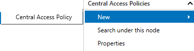
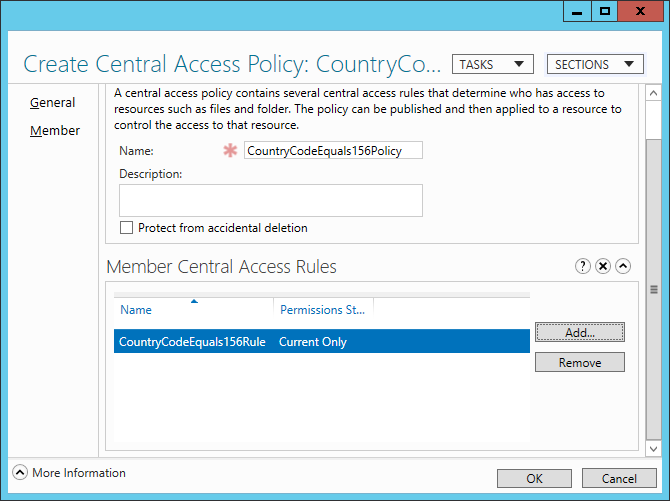
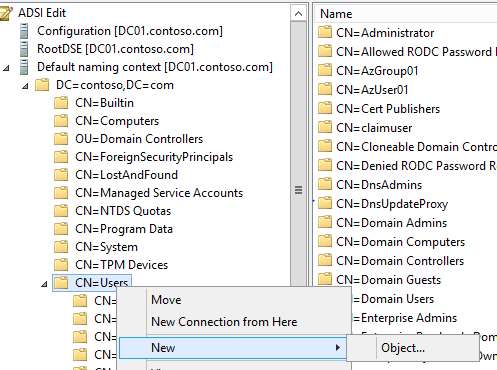
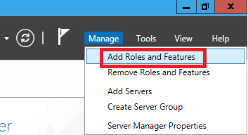
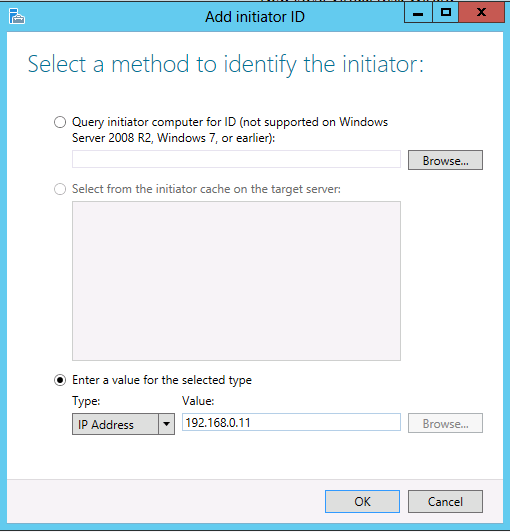
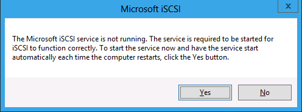
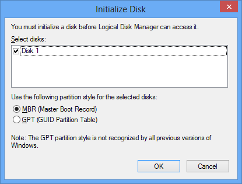
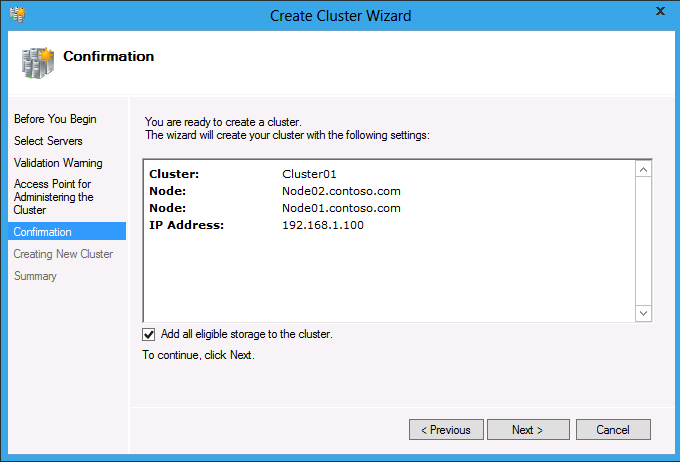
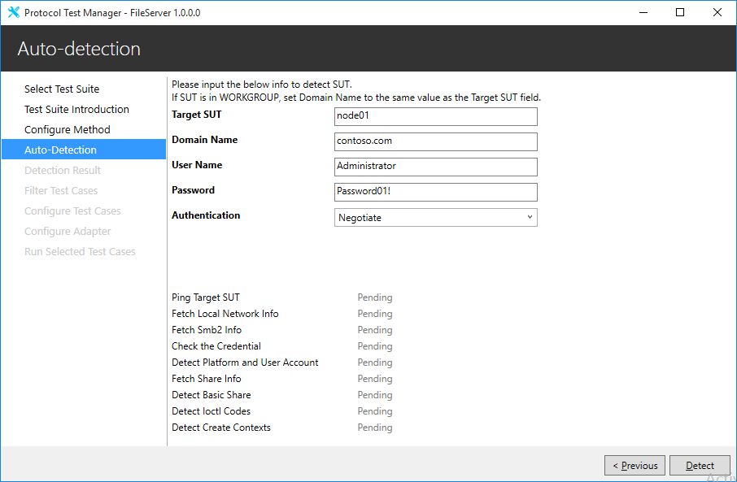
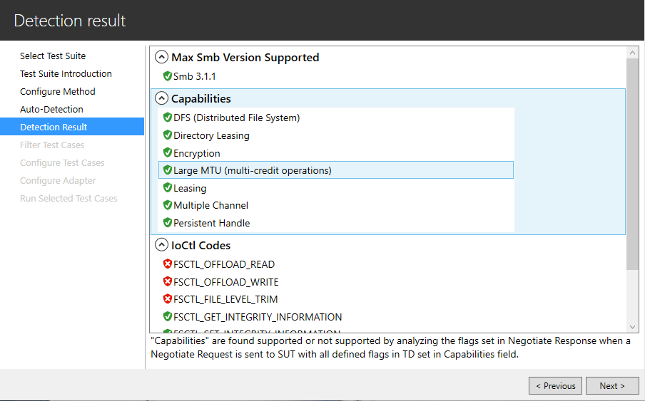

# File Server Protocol Family Test Suite User Guide
> This guide takes you through the fundamentals of using the **File Server Protocol Family Test Suite**. You will learn how to setup the test environment, how to install and configure the test suite, and how to run test cases.

## Table of Contents

* [1. Introduction](#1)
* [2. Quickstart Checklist](#2)
* [3. Requirements](#3)
    * [3.1. Network Infrastructure](#3.1)
    * [3.2. Environment](#3.2)
    * [3.3. Driver Computer](#3.3)
    * [3.4. System Under Test (SUT)](#3.4)
    * [3.5. Domain Controller (DC)](#3.5)
	* [3.6. SAN Storage Server](#3.6)
    * [3.7. Software](#3.7)
* [4. Network Setup](#4)
    * [4.1. Workgroup Environment](#4.1)
    * [4.2. Domain Environment](#4.2)
    * [4.3. Verify Connectivity from the Driver Computer](#4.3)
* [5. Computer Setup](#5)
    * [5.1. Workgroup Environment](#5.1)
		* [5.1.1. Setup the Driver Computer](#5.1.1)
		* [5.1.2. Setup the SUT](#5.1.2)
			* [5.1.2.1. Common Setup](#5.1.2.1)
			* [5.1.2.2. Setup to test SMB2](#5.1.2.2)
				* [5.1.2.2.1. Create a basic share](#5.1.2.2.1)
				* [5.1.2.2.2. Create a share with Encrypt data access enabled](#5.1.2.2.2)
				* [5.1.2.2.3. Other configurations](#5.1.2.2.3)
					* [5.1.2.2.3.1 Create a share with Oplock Force Level 2 enabled](#5.1.2.2.3.1)
					* [5.1.2.2.3.2. Create a share named SameWithSMBBasic](#5.1.2.2.3.2)
					* [5.1.2.2.3.3. Create a share named DifferentFromSMBBasic](#5.1.2.2.3.3)
					* [5.1.2.2.3.4. Create Symbolic Links](#5.1.2.2.3.4)
					* [5.1.2.2.3.5. Create a share on volume supporting integrity](#5.1.2.2.3.5)
					* [5.1.2.2.3.6. Modify the Signing configurations](#5.1.2.2.3.6)
			* [5.1.2.3. Setup to test DFSC](#5.1.2.3)
			* [5.1.2.4. Setup to test RSVD](#5.1.2.4)
			* [5.1.2.5. Setup to test SQOS](#5.1.2.5)
			* [5.1.2.6. Setup to test FSA](#5.1.2.6)
    * [5.2. Domain Environment](#5.2)
		* [5.2.1. Setup the Domain Controller (DC)](#5.2.1)
			* [5.2.1.1. Promote DC](#5.2.1.1)
			* [5.2.1.2. Start the Routing service](#5.2.1.2)
			* [5.2.1.3. Create Domain User accounts](#5.2.1.3)
			* [5.2.1.4. Setup to test Claimed Based Access Control (CBAC)](#5.2.1.4)
		* [5.2.2. Setup the Driver Computer](#5.2.2)
		* [5.2.3. Setup the SAN storage server](*5.2.3)
		* [5.2.4. Setup the SUT](#5.2.4)
			* [5.2.4.1. Common Setup](#5.2.4.1)
			* [5.2.4.2. Setup to test SMB2](#5.2.4.2)
			* [5.2.4.3. Setup to test DFSC](#5.2.4.3)
			* [5.2.4.4. Setup to test Server Failover/FSRVP/SWN](#5.2.4.4)
			* [5.2.4.5. Setup to test RSVD](#5.2.4.5)
			* [5.2.4.6. Setup to test SQOS](#5.2.4.6)
			* [5.2.4.7. Setup to test Authorization](#5.2.4.7)
			* [5.2.4.8. Setup to test FSA](#5.2.4.8)
	* [5.3. Setup Details for Windows Platform](#5.3)
		* [5.3.1. Create a share](#5.3.1)
		* [5.3.2. Set NTFS Permissions](#5.3.2)
		* [5.3.3. Set Share Permissions](#5.3.3)
		* [5.3.4. Add a share SameWithSMBBasic to an existing share SMBBasic](#5.3.4)
		* [5.3.5. Create symbolic links](#5.3.5)
		* [5.3.6. Enable Encrypt Data Access on a share named SMBEncrypted](#5.3.6)
		* [5.3.7. Enable FORCE_LEVELII_OPLOCK on a share named ShareForceLevel2](#5.3.7)
		* [5.3.8. Create a share on a volume supporting integrity](#5.3.8)
		* [5.3.9. Setup a Windows-based DC](#5.3.9)
			* [5.3.9.1. Install DNS and Active Directory Domain Services and create a specific domain](#5.3.9.1)
			* [5.3.9.2. Install Routing Service](#5.3.9.2)
			* [5.3.9.3. Configure and start Routing service](#5.3.9.3)
			* [5.3.9.4. Create a Domain Non-Admin user account](#5.3.9.4)
			* [5.3.9.5. Enable Guest user account](#5.3.9.5)
			* [5.3.9.6. Create a Domain group](#5.3.9.6)
			* [5.3.9.7. Create a Domain account that belongs to a Domain group](#5.3.9.7)
			* [5.3.9.8. Configure Claimed Based Access Control (CBAC)](#5.3.9.8)
				* [5.3.9.8.1. Create User Claim](#5.3.9.8.1)
				* [5.3.9.8.2. Create Central Access Rules](#5.3.9.8.2)
				* [5.3.9.8.3. Create Central Access Policies](#5.3.9.8.3)
				* [5.3.9.8.4. Create Users](#5.3.9.8.4)
				* [5.3.9.8.5. Apply Central Access Policies](#5.3.9.8.5)
		* [5.3.10. Setup Distributed File System (DFS)](#5.3.10)
			* [5.3.10.1. Install Roles and Features for DFS](#5.3.10.1)
			* [5.3.10.2. Create a share named FileShare](#5.3.10.2)
			* [5.3.10.3. Create DFS name spaces](#5.3.10.3)
				* [5.3.10.3.1. Create Stand-alone namespace: SMBDfs](#5.3.10.3.1)
				* [5.3.10.3.2. Create Stand-alone namespace: Standalone](#5.3.10.3.2)
				* [5.3.10.3.3. Create Domain-based namespace: DomainBased](#5.3.10.3.3)
			* [5.3.10.4. Create DFS link for the namespaces](#5.3.10.4)
				* [5.3.10.4.1. Add folder SMBDfsLink to namespace SMBDfs](#5.3.10.4.1)
				* [5.3.10.4.2. Add two folders to namespace: Standalone](#5.3.10.4.2)
				* [5.3.10.4.3. Add two folders to namespace: DomainBased](#5.3.10.4.3)
		* [5.3.11. Setup SAN Storage Server](#5.3.11)
			* [5.3.11.1. Install iSCSI Target](#5.3.11.1)
			* [5.3.11.2. Create virtual disks for failover cluster nodes](#5.3.11.2)
		* [5.3.12. Setup Cluster](#5.3.12)
			* [5.3.12.1. Connect to the iSCSI disks provided by the SAN Storage Server from two nodes](#5.3.12.1)
			* [5.3.12.2. Install Roles and Features on each failover cluster node](#5.3.12.2)
			* [5.3.12.3. Create failover cluster in either node](#5.3.12.3)
			* [5.3.12.4. Create file server on failover cluster](#5.3.12.4)
			* [5.3.12.5. Add Scale-out Share volume](#5.3.12.5)
			* [5.3.12.6. Create file share for cluster](#5.3.12.6)
			* [5.3.12.7. Create file share with Oplock Force Level 2 enabled for cluster](#5.3.12.7)
			* [5.3.12.8. Create file share with Encrypt data enabled for cluster](#5.3.12.8)
		* [5.3.13. Turn off Firewall](#5.3.13)
		* [5.3.14. Create a Local Admin User Account](#5.3.14)
		* [5.3.15. Create a Local Non-Admin User Account](#5.3.15)
		* [5.3.16. Enable the Local Guest Account](#5.3.16)
		* [5.3.17. Reset Password to Local Users](#5.3.17)
		* [5.3.18. Create an Asymmetric share](#5.3.18)
		* [5.3.19. Create the virtual hard disk file](#5.3.19)
		* [5.3.20. Create the virtual hard disk set file](#5.3.20)
		* [5.3.21. Modify the Signing configuration](#5.3.21)
		* [5.3.22. Manually Setup Computer Password](#5.3.22)
		* [5.3.23. Create an SQOS policy](#5.3.23)
		* [5.3.24. How to start console with Administrator privilege](#5.3.24)
		* [5.3.25. Enable short name](#5.3.25)
		* [5.3.26. Create a volume shadow copy](#5.3.26)
		* [5.3.27. Create a volume mount point](#5.3.27)
* [6. Installed Files and Folders](#6)
* [7. Configure and Run Test Cases](#7)
    * [7.1. Configure and Run Test Cases Using Protocol Test Manager](#7.1)
    * [7.2. Configure Test Suite Manually](#7.2)
		* [7.2.1. Brief introduction to Configuration Settings](#7.2.1)
	* [7.3. Run Test Cases by Batch Script](#7.3)
		* [7.3.1. Run the BVT Test](#7.3.1)
		* [7.3.2. Run All Test Cases](#7.3.2)
		* [7.3.3. Check Test Results](#7.3.3)
    * [7.3.3. Check Test Results](#7.3)
* [8. Debugging Test Cases](#8)

##<a name="1"/> 1. Introduction

This test suite is designed to test the implementations of file server protocol family including [**[MS-SMB2]**](https://msdn.microsoft.com/en-us/library/cc246482.aspx) (Server Message Block (SMB) Protocol Version 2 and 3), [**[MS-FSRVP]**](https://msdn.microsoft.com/en-us/library/hh554852.aspx) (File Server Remote VSS Protocol), [**[MS-SWN]**](https://msdn.microsoft.com/en-us/library/hh536748.aspx) (Service Witness Protocol), [**[MS-DFSC]**](https://msdn.microsoft.com/en-us/library/cc226982.aspx) Distributed File System (DFS): Namespace Referral Protocol, [**[MS-FSA]**](https://msdn.microsoft.com/en-us/library/ff469524.aspx) (File System Algorithms), [**[MS-SQOS]**](https://msdn.microsoft.com/en-us/library/mt226249.aspx) (Storage Quality of Service Protocol) and [**[MS-RSVD]**](https://msdn.microsoft.com/en-us/library/dn393384.aspx) (Remote Shared Virtual Disk Protocol) as specified in the Microsoft® [Windows Protocols](https://msdn.microsoft.com/en-us/library/jj712081.aspx). This guide provides you detailed information about how to use this test suite on both Microsoft® Windows® operating systems and non-Windows based operating systems.

This suite tests only the protocol implementation behaviors that are observed over the wire. For detailed information about the design of this test suite, please see more in [File Server Protocol Family Test Design Specification](./FileServerTestDesignSpecification.md), [Authentication Protocol Server Test Design Specification](./Auth_ServerTestDesignSpecification.md), [MS-FSA Protocol Server Test Design Specification](./MS-FSA_ServerTestDesignSpecification.md), and [MS-SQOS Protocol Server Test Design Specification](./MS-SQOS_ServerTestDesignSpecification.md).

##<a name="2"/> 2. Quickstart Checklist

The following checklist summarizes the tasks you will need to complete in order to get the test suite up and running. It also links you to the right sections that is providing you more details on how to complete the task.

>	Note

>	&emsp;&emsp;The test suite supports running in two kinds of test environments, **WORKGROUP** and **DOMAIN**. If you only want to run your tests in a **WORKGROUP** environment, please skip all the steps that are related to the **DOMAIN** environment within each task. Whether the step is domain related or not will be mentioned in the detailed sections.

| Check | Task                                                                                     | Topic                                                                                                                            |
|-------|------------------------------------------------------------------------------------------|----------------------------------------------------------------------------------------------------------------------------------|
| □     | Download the test suite for the protocol implementation                                  | For a complete list of files that the download package contains, please see [6. Installed Files and Folders](#6).                |
| □     | Confirm that your test environment and computers meet the requirements of the test suite | For requirements of the test suite, please see [3. Requirements](#3).                                                            |
| □     | Setup the Domain Controller (DC)                                                         | For more details, please see [5.2.1. Setup the Domain Controller (DC)](#5.2.1).                                                  |
| □     | Setup the system under test (SUT)                                                        | For more details, plase see [Setup the SUT in Workgroup Environment](#5.1.2) or [Setup the SUT in Domain Environment](#5.2.4).   |
| □     | Setup the driver computer                                                                | For more details, see [5.1.1. Setup the Driver Computer](#5.1.1) in **WORKGROUP** Environment or [5.2.2 Setup the Driver Computer](#5.2.2) in **DOMAIN** Environment. |
| □     | Setup the network                                                                        | For more details, see [4. Network Setup](#4).                                                                                    |
| □     | Verify the connections from the driver computer to the SUT and other computers           | For more details, see [4.3. Verify Connectivity from the Driver Computer](#4.3).                                                 |
| □     | Install the software prerequisites                                                       | For a complete list of software that must be installed prior to the test suite installation, please see [3.7. Software](#3.7).   |
| □     | Configure the test suite settings                                                        | For how to configure your test suite settings, please see [7. Configure and Run Test Cases](#7).                                 |
| □     | Run a BVT test                                                                           | For more details, see [7.3.1. Run the BVT Test](#7.3.1).                                                                         |
| □     | Run test cases                                                                           | For more details, see [7.3.2. Run All Test Cases](#7.3.2).                                                                       |
| □     | Debug my own test cases                                                                  | For more details, see [8. Debugging Test Cases](#8).                                                                             |
| □     | Get the results of test runs                                                             | For more details, see [7.3.3. Check Test Results](#7.3.3).                                                                       |

##<a name="3"/> 3. Requirements 

This section lists all the requirements to setup the test environment, including network infrastructure, hardware requirements, and software requirements.

###<a name="3.1"/> 3.1. Network Infrastructure

The network infrastructure for this test suite requires the following:

-   A test network is required to connect the test computer systems.

	-   It must consist of an isolated hub or switch.

	-   It must neither be connected to a production network, nor be used for any other business or personal communications and operations.

	-   It must not be connected to the internet.

-   IP addresses must be assigned for this test network.

-   Computer names must be assigned in the test network infrastructure.

-   User credentials used on the system must be dedicated to the test network infrastructure.

###<a name="3.2"/> 3.2. Environment

This test suite can be executed in two kinds of environments, **WORKGROUP** and **DOMAIN**.

-	In order to run the test suite in a **WORKGROUP** environment, the following test machines are required (either physical or virtual):

	-   A driver computer, it must be the Microsoft® Windows 8.1 Enterprise operating system or later. Please see [3.3. Driver Computer](#3.3) for hardware requirements, and [5.1.1. Setup the Driver Computer](#5.1.1) for how to setup.

	-   An SUT computer, it can be either Windows or Non-Windows implementation. Please see [3.4. System Under Test (SUT)](#3.4) for hardware requirements, and [5.1.2. Setup the SUT](#5.1.2) for how to setup. 

-	In order to run the test suite in a **DOMAIN** environment, the following test machines are required (either physical or virtual):

	-   A Domain Controller (DC), it can be either Windows or Non-Windows implementation. Please see [3.5. Domain Controller (DC)](#3.5) for hardware requirements, and [5.2.1. Setup the Domain Controller](#5.2.1) for how to setup.
	
	-   A driver computer, it must be the Microsoft® Windows 8.1 Enterprise operating system or later. Please see [3.3. Driver Computer](#3.3) for hardware requirements, and [5.2.2. Setup the Driver Computer](#5.2.2) for how to setup.

	-	If you want to test the cluster scenarios, you will need:

		-   A SAN storage server, it can be either Windows or Non-Windows implementation. Please see [3.6. SAN Storage Server](#3.6) for hardware requirements, and [5.2.3. Setup the SAN storage server](#5.2.3) for how to setup.

		-   A failover cluster, it can be either Windows or Non-Windows implementation. Two SUT computers will be needed if you are deploying a Windows implementation. Please see [3.4. System Under Test (SUT)](#3.4) for hardware requirements, and [5.2.4. Setup the SUT](#5.2.4) for how to setup.

	-   If you do not want to test cluster involving scenarios, you will need:
		
		-	An SUT computer, it can be either Windows or Non-Windows implementation. To simplify your deployment steps and reuse what you already have, you can choose any one node in the failover cluster as an SUT computer for testing the non-cluster scenarios.

>	Note

>	&emsp;&emsp;For more information about failover cluster scenarios, please refer to the [File Server Protocol Family Test Design Specification](./FileServerTestDesignSpecification.md) section "Test Suite Design".

###<a name="3.3"/> 3.3 Driver Computer 

The minimum requirements for the Driver computer are as follows.

| Requirement      | Description                                                  |                          
|:-----------------|:-------------------------------------------------------------|
| Operating system | Microsoft® Windows 8.1, Enterprise Edition or later versions |
| Memory           | 2 GB RAM                                                     |
| Disk space       | 60 GB                                                        |

###<a name="3.4"/> 3.4. System Under Test (SUT)

The minimum requirements for the SUT computer are as follows. The requirements apply to both SUT computers in the cluster for a **DOMAIN** environment. 

>	Note

>	&emsp;&emsp;The requirements in this section apply only to the Windows-based computers in the test environment.

| Requirement      | Description                                                                              |
|:-----------------|:-----------------------------------------------------------------------------------------|
| Operating system | Microsoft® Windows Server 2012 R2, Standard Edition or later versions                    |
| Features         | Failover Clustering                                                                      |                  
| Role Services    | File Server, DFS Namespaces, File Server Resource Manager, File Server VSS Agent Service | 
| Memory           | 2 GB RAM                                                                                 |
| Disk space       | 60 GB                                                                                    |

###<a name="3.5"/> 3.5 Domain Controller (DC)

The minimum requirements for the Domain Controller computer are as follows.

>	Note

>	&emsp;&emsp;The requirements in this section apply only to the Windows-based computers in the test environment.

| Requirement      | Description                                                           |
|:-----------------|:----------------------------------------------------------------------|
| Operating system | Microsoft® Windows Server 2012 R2, Standard Edition or later versions |
| Services         | Active Directory Domain Services (AD DS)                              |
| Memory           | 1 GB RAM                                                              |
| Disk space       | 60 GB                                                                 |

###<a name="3.6"/> 3.6. SAN Storage Server

The minimum requirements for the SAN storage server computer are as follows.

>	Note

>	&emsp;&emsp;The requirements in this section apply only to the Windows-based computers in the test environment.

| Requirement      | Description                                                           |
|:-----------------|:----------------------------------------------------------------------|
| Operating system | Microsoft® Windows Server 2012 R2, Standard Edition or later versions |
| Services         | File Server, iSCSI Target Server                                      |
| Memory           | 1 GB RAM                                                              |
| Disk space       | 60 GB                                                                 | 

###<a name="3.7"/> 3.7. Software

All of the following software must be installed on the [**Driver Computer**](#3.2) before the test suite can be executed. There are some dependencies between each other, so it is truely recommended to install them sequentially in the order below.

1.  Install **Microsoft® Visual Studio®** or **Test Agent for Visual Studio®**.

	-	The test execution requires the `vstest.console.exe` utility which is installed along with either Visual Studio or Test Agent.

	-	**Microsoft® Visual Studio®** provides you the capability to run test cases. Additionally it provides you the capability to update, build, debug and contribute to the test cases. You can download Visual Studio Ultimate 2012, Visual Studio 2012 Update 4, or later versions of the Visual Studio. The optional components of Visual Studio are not required to be installed.

	-	**Test Agent for Visual Studio®** provides you the capability to run test cases without having to install the whole pack of Visual Studio. You can download Agents for Visual Studio 2012 Update 4 or later versions of the Test Agent. This is recommended to be used when you only want to do some test against your own implementations and have no intention to make changes.

2.	Install **Spec Explorer** [3.5.3146.0](<http://visualstudiogallery.msdn.microsoft.com/271d0904-f178-4ce9-956b-d9bfa4902745/>) or later versions.

	-	Spec Explorer is a model based testing tool used by the test suite to design models and generate test cases. It has some dependencies on [VC++ 9.0 redistributable package](https://www.microsoft.com/en-us/download/details.aspx?id=5582) which should also be installed.

3. 	Install **Protocol Test Framework** [1.0](https://github.com/Microsoft/ProtocolTestFramework/releases/download/1.0/ProtocolTestFrameworkInstallerForModel.msi) or clone the [repository](https://github.com/Microsoft/ProtocolTestFramework.git) to build one msi package by yourself.

4.	Install **File Server Test Suite** [1.0](https://github.com/Microsoft/WindowsProtocolTestSuites/releases/download/1.0/FileServer-TestSuite-ServerEP.msi) or clone the [repository](https://github.com/Microsoft/WindowsProtocolTestSuites.git) and build one msi package by yourself.

5.	(Optional) Install **Protocol Test Manager** [1.0](https://github.com/Microsoft/WindowsProtocolTestSuites/releases/download/1.0/ProtocolTestManager.msi) or clone the [repository](https://github.com/Microsoft/WindowsProtocolTestSuites.git) and build one msi package by yourself.

    -	**Protocol Test Manager** provides a graphical UI to facilitate your configuration and execution of the Microsoft® Windows Protocol Test Suites.

6. 	(Optional) Install **Microsoft® Message Analyzer** [1.4](http://www.microsoft.com/en-us/download/details.aspx?id=44226) or later versions.

    -	**Microsoft® Message Analyzer** is listed as an optional tool because our test cases won’t do live capture and capture verification during execution. MMA can be helpful with debugging when users want to look at any issues in the test results. In other words, these test suites don’t have dependencies on MMA. It is a useful tool that can help you view the network traces and ETW logs which could possibly be generated by Automatic Network Capturing feature in Protocol Test Framework.

##<a name="4"/> 4. Network Setup

This test suite can be executed in two kinds of environments, **WORKGROUP** and **DOMAIN**, see [3.2. Environment](#3.2).

This section gives you instructions on how to setup the network for both environments.

>	Note

>	&emsp;&emsp;This test suite can be deployed on either physical or virtual machines. This section will describe the deployment on physical machines. For more information about how to configure a virtual machine, please see <http://www.microsoft.com/virtualization/en/us/solution-appliance-test.aspx>.

###<a name="4.1"/> 4.1. Workgroup Environment

Computers in the **WORKGROUP** environment interact with each other according to the following rules:

-   A driver computer sends requests over the wire in the form of protocol messages by running the test cases.

-   An SUT responds to the requests from the driver computer by running an implementation of the protocol.

The following diagram shows the **WORKGROUP** environment with recommended network configurations for your reference, all the settings are configurable:

>	Note

>	&emsp;&emsp;The following diagram applies to both Windows based computers and Non-Windows based computers in the **WORKGROUP** environment.


>	Note

>	&emsp;&emsp;For Non-Windows, `Node01` could be replaced by the implementation-specific SUT.

| Machine Name/Access Point | NIC       | IPv4          | Subnet Mask   |
|---------------------------|-----------|---------------|---------------|
| Client01                  | External1 | 192.168.1.111 | 255.255.255.0 |
|                           | External2 | 192.168.1.112 | 255.255.255.0 |
| Node01                    | External1 | 192.168.1.11  | 255.255.255.0 |
|                           | External2 | 192.168.1.12  | 255.255.255.0 |

###<a name="4.2"/> 4.2. Domain Environment

Computers in the **DOMAIN** environment interact with each other according to the following rules:

-   A driver computer that sends requests over the wire in the form of protocol messages by running the test cases.

-   An SUT that responds to the requests from the driver computer by running an implementation of the protocol.

-   A domain controller (DC) that responds to the security authentication requests (logging in, checking permissions, etc.) within the domain.

-   Any other additional computers that are specified to provide functionality that is required to test the protocol implementation.

The following diagram shows the **DOMAIN** environment with recommended network configurations for your reference, all the settings are configurable:

>	Note

>	&emsp;&emsp;The following diagram applies only to the Windows based computers in the **DOMAIN** environment.

>	&emsp;&emsp;For cluster scenarios, the driver computer will simulate a physical machine to contact `Node01` and `Node02` which are built as failover cluster nodes for the SUT. SAN storage server `Storage01` is on an isolated network to provide backend storage for the failover cluster.

>	&emsp;&emsp;For non-cluster scenarios, the driver computer will simulate a physical machine that contacts either node which is acting as the SUT.


>	Note

>	&emsp;&emsp;`Cluster01` represents the Failover Cluster while `GeneralFS` represents the File Server role provided by the Failover Cluster.

>	&emsp;&emsp;For Non-Windows, `Node01`, `Node02` and `Storage01` could be replaced by the implementation-specific SUT.

| Machine Name/Access Point | NIC       | IPv4          | Subnet Mask   | Default Gateway | DNS Server    |
|---------------------------|-----------|---------------|---------------|-----------------|---------------|
| DC01                      | External1 | 192.168.1.1   | 255.255.255.0 | &lt;empty&gt;   | 127.0.0.1     |
|                           | External2 | 192.168.2.1   | 255.255.255.0 | &lt;empty&gt;   | 127.0.0.1     |
| Client01                  | External1 | 192.168.1.111 | 255.255.255.0 | 192.168.1.1     | 192.168.1.1   |
|                           | External2 | 192.168.2.111 | 255.255.255.0 | 192.168.2.1     | 192.168.2.1   |
| Node01                    | External1 | 192.168.1.11  | 255.255.255.0 | 192.168.1.1     | 192.168.1.1   |
|                           | External2 | 192.168.2.11  | 255.255.255.0 | 192.168.2.1     | 192.168.2.1   |
|                           | Cluster   | 10.10.0.11    | 255.255.255.0 | &lt;empty&gt;   | &lt;empty&gt; |
|                           | iSCSI     | 192.168.0.11  | 255.255.255.0 | &lt;empty&gt;   | &lt;empty&gt; |
| Node02                    | External1 | 192.168.1.12  | 255.255.255.0 | 192.168.1.1     | 192.168.1.1   |
|                           | External2 | 192.168.2.12  | 255.255.255.0 | 192.168.2.1     | 192.168.2.1   |
|                           | Cluster   | 10.10.0.12    | 255.255.255.0 | &lt;empty&gt;   | &lt;empty&gt; |
|                           | iSCSI     | 192.168.0.12  | 255.255.255.0 | &lt;empty&gt;   | &lt;empty&gt; |
| Storage01                 | iSCSI     | 192.168.0.1   | 255.255.255.0 | &lt;empty&gt;   | &lt;empty&gt; |
| Cluster01                 | External1 | 192.168.1.100 |               |                 |               |
|                           | External2 | 192.168.2.100 |               |                 |               |
| GeneralFS                 | External1 | 192.168.1.200 |               |                 |               |
|                           | External2 | 192.168.2.200 |               |                 |               |

###<a name="4.3"/> 4.3. Verify Connectivity from the Driver Computer

After setting up the hostnames and networks in either **WORKGROUP** or **DOMAIN** environment, verify the connectivity between any of the two computers in your test environment. 

You can perform the following steps to test the connectivity between two Windows based computers. For further information, please see administrative guide of your operating system.

>	Note

>	&emsp;&emsp;Disable active firewalls in the test environment before you go through the following steps. For Windows, please refer to [5.3.13. Turn off Firewall](#5.3.13).

To check the connectivity from the driver computer to the SUT:

1.  Click the **Start** button, and then click **Run**.

2.  In the **Run** dialog box, type `cmd` and then click **OK**.

3.  At the command prompt, type `ping` followed by the hostname or IP address of the SUT, and then press **Enter**. The following example checks the connectivity from driver to an SUT named `Node01`:
	```
		ping Node01
	```

4.  Repeat these steps until you confirm the connectivity between all computers in the test environment.

>	Note

>	&emsp;&emsp;Do not proceed until connectivity is verified for all the machines. Any issues with network connectivity may block you in further configuration steps.

##<a name="5"/> 5. Computer Setup 

This test suite can be executed in two kinds of environments, **WORKGROUP** and **DOMAIN**, see [3.2. Environment](#3.2).

This section gives you instructions on how to setup the computers for both environments.

###<a name="5.1"/> 5.1. Workgroup Environment

The **WORKGROUP** environment consists of two test machines, see [3.2. Environment](#3.2):

-   A driver computer, operating system must be Microsoft® Windows 8.1 Enterprise or later versions.

-   An SUT computer, can be either Windows or Non-Windows implementation.

####<a name="5.1.1"/> 5.1.1. Setup the Driver Computer

This section describes how to Setup the driver computer.

>	Important

>	&emsp;&emsp;Microsoft® Visual Studio, Protocol Test Framework, and Spec Explorer must be installed on the driver computer before you run the test suite installer. See [Software Requirements](#3.7).

To setup the driver computer:

1.  Configure IP addresses and set the computer name to `Client01`. See [4.1. Workgroup Environment](#4.1).

2.  Make sure firewalls are turned off. 
>	For Windows platform, please refer to [5.3.13. Turn off Firewall](#5.3.13).

3.  Install the required and optional software. See [3.7. Software](#3.7).

4.  Start Windows PowerShell (x64) from `%SystemRoot%\System32\WindowsPowerShell\v1.0\` with Administrator privilege, and then type following command.
	```
		Set-ExecutionPolicy Unrestricted
	```

5.  Start Windows PowerShell (x86) from `%SystemRoot%\syswow64\WindowsPowerShell\v1.0\` with Administrator privilege, and execute the same command as above.

6.  Copy the **FileServer-TestSuite-ServerEP.msi** package onto the driver computer, double click the package and install it with the **Install Test Suite on Driver Computer** option. See [3.7. Software](#3.7).

7.  Create a new folder with path `%SystemDrive%\FileServerCaptureFileDirectory`. This folder will be used to save the capture files automatically generated by the [Microsoft® Message Analyzer](#3.7).

####<a name="5.1.2"/> 5.1.2. Setup the SUT

This section describes how to Setup the SUT computer.

#####<a name="5.1.2.1"/> 5.1.2.1. Common Setup

To setup the SUT computer:

1.  Configure IP addresses on the SUT node and set the computer name to `Node01`. See [4.1. Workgroup Environment](#4.1).

2.  Make sure firewalls are turned off.
>	For Windows platform, please refer to [5.3.13. Turn off Firewall](#5.3.13).

3.  Create a local Administrator account named **Administrator** and a local Non-Admin account named **nonadmin**. 
>	For Windows platform, please refer to [5.3.14. Create a Local Admin User Account](#5.3.14) for creating an Admin user and [5.3.15. Create a Local Non-Admin User Account](#5.3.15) for creating a Non-Admin user.

4.  Enable the **Guest** account.
>	For Windows platform, please refer to [5.3.16. Enable the Local Guest Account](#5.3.16).

5.  The password for all the above accounts should be set to **Password01!**. 
>	For Windows platform, please refer to [5.3.17. Reset Password to Local Users](#5.3.17).

6.	Configure the following steps from [5.1.2.2. Setup to test SMB2](#5.1.2.2) to [5.1.2.5. Setup to test SQOS](#5.1.2.5) regarding to your test requirements.

#####<a name="5.1.2.2"/> 5.1.2.2. Setup to test SMB2

This configuration is used to test the **[MS-SMB2]** protocol.

######<a name="5.1.2.2.1"/> 5.1.2.2.1. Create a basic share

This configuration is used to test **Basic** features of **[MS-SMB2]** protocol.

1.  Create a share named **SMBBasic** on `Node01`.

2.  Share it with **Read/Write** permission level to the local Administrator account **Administrator**.
>	For Windows platform, please refer to [5.3.1. Create a share](#5.3.1).

######<a name="5.1.2.2.2"/> 5.1.2.2.2. Create a share with Encrypt data access enabled

This configuration is used to test **Encryption** feature of **[MS-SMB2]** protocol. If **Encryption** is not supported, this section can be ignored.

1.  Create a share named **SMBEncrypted** on `Node01`.

2.  Share it with **Read/Write** permission level to the local Administrator account **Administrator**.
>	For Windows platform, please refer to [5.3.1. Create a share](#5.3.1).

3.  Enable **Encrypt data access** on the share which indicates that the server requires messages to be encrypted when accessing this share.
>	For Windows platform, please refer to [5.3.6. Enable Encrypt Data Access on a share named SMBEncrypted](#5.3.6).

######<a name="5.1.2.2.3"/> 5.1.2.2.3. Other configurations

#######<a name="5.1.2.2.3.1"/> 5.1.2.2.3.1. Create a share with Oplock Force Level 2 enabled

This configuration is used to test **Oplock** feature of **[MS-SMB2]** protocol.

1.  Create a share named **ShareForceLevel2** on `Node01`.

2.  Share it with **Read/Write** permission level to the local Administrator account **Administrator**.
>	For Windows platform, please refer to [5.3.1. Create a share](#5.3.1).

3.  Enable **FORCE_LEVELII_OPLOCK** on the share.
>	For Windows platform, please refer to [5.3.7. Enable FORCE_LEVELII_OPLOCK on a share named ShareForceLevel2](#5.3.7).

#######<a name="5.1.2.2.3.2"/> 5.1.2.2.3.2. Create a share named SameWithSMBBasic

This configuration is used to test some negative cases of **AppInstanceId** feature of **[MS-SMB2]** protocol. If **AppInstanceId** is not supported, this section can be ignored.

1.	Create a share named **SameWithSMBBasic** on `Node01`, this share should have the same path as the **SMBBasic** share.
>	For Windows platform, please refer to [5.3.4. Add a share SameWithSMBBasic to an existing share SMBBasic](#5.3.4).

Summary of the test case design:

-	The case creates an Open under the share **SMBBasic**. There's an **AppInstanceId** in the Create Request.

-	The case connects the share **SameWithSMBBasic** and sends a second Create Request to SUT with the same **AppInstanceId**.

-	Verify the first Open is not forced to close by the second create request because the second create request is connecting to a different share.

#######<a name="5.1.2.2.3.3"/> 5.1.2.2.3.3. Create a share named DifferentFromSMBBasic

This configuration is used to test some negative cases (similar to [5.1.2.2.3.2. Create a share named SameWithSMBBasic](#5.1.2.2.3.2)) of **AppInstanceId** feature of **[MS-SMB2]** protocol. If **AppInstanceId** is not supported, this section can be ignored.

1.  Create a share named **DifferentFromSMBBasic** on `Node01`, this share should have a different path from **SMBBasic** share. For example, if **SMBBasic** has path `%SystemDrive%\SMBBasic`, then **DifferentFromSMBBasic** should have path `%SystemDrive%\DifferentFromSMBBasic`.

2.  Share it with **Read/Write** permission level to the local Administrator account **Administrator**.
>	For Windows platform, please refer to [5.3.1. Create a share](#5.3.1).

#######<a name="5.1.2.2.3.4"/> 5.1.2.2.3.4. Create Symbolic Links

This configuration is used to test some negative cases of **Create/Close** feature of **[MS-SMB2]** protocol. For more details, please see **[MS-SMB2]** section 3.3.5.9.

1.  Add a **Symbolic Link** to **%SystemDrive%**.

	-	In folder **SMBBasic**, add a symbolic link named **Symboliclink**, which links to **%SystemDrive%**.

2.	Add a **Symbolic Link** to **SMBBasic**.
	
	-	Add a new folder **Sub** under **SMBBasic**.
	
	-	In folder **Sub**, add another symbolic link named **Symboliclink2**, which links to **SMBBasic**.

>	For Windows platform, please refer to [5.3.5. Create symbolic links](#5.3.5).

#######<a name="5.1.2.2.3.5"/> 5.1.2.2.3.5. Create a share on volume supporting integrity

This configuration is used to test **Integrity** feature of **[MS-SMB2]** protocol, namely the IoCtl codes **FSCTL\_GET\_INTEGRITY\_INFORMATION** and **FSCTL\_SET\_INTEGRITY\_INFORMATION**. If **Integrity** is not supported by file system, this section can be ignored. For more details about the two IoCtl codes, please see **[MS-FSCC]**.

1.  Create a share named **SMBReFSShare** in the **ReFS** format volume on `Node01`.

	-	The file system of the volume containing the specified share should support the use of **Integrity**.

2.  Share it with **Read/Write** permission level to the local Administrator account **Administrator**.

>	For Windows platform, please refer to [5.3.8. Create a share on a volume supporting integrity](#5.3.8).

#######<a name="5.1.2.2.3.6"/> 5.1.2.2.3.6. Modify the Signing configurations

This configuration is used to test the **Signing** feature of the **[MS-SMB2]** protocol. If **Signing** is not supported, this section can be ignored.

1. 	Enable or disable the **SigningRequired** on the SUT computer on your demand.
>	For Windows platform, please refer to [5.3.21. Modify the Signing configuration](#5.3.21) on how to enable or disable **SigningRequired**.

2.  Open the [CommonTestSuite.deployment.ptfconfig](#7.2) file on the driver computer.

	-  If **SigningRequired** is enabled on SUT, set the value of property **IsRequireMessageSigning** to **TRUE** in the ptfconfig file mentioned above.

	-  If **SigningRequired** is disabled on SUT, set the value of property **IsRequireMessageSigning** to **FALSE** in the ptfconfig file mentioned above.

#####<a name="5.1.2.3"/> 5.1.2.3. Setup to test DFSC

This configuration is used to test the **[MS-DFSC]** protocol. If **DFS** is not supported, this section can be ignored.

1.  Create DFS namespaces.

	-    Two Stand-alone namespaces: **SMBDfs** and **Standalone**.

2.  Create a share **FileShare** on SUT.

    -	Share with Read/Write permission level to Admin User.

3.  Add one folder to namespace **SMBDfs**.

    -	Folder name is **SMBDfsLink** and link target is **\\\\Node01\\FileShare**.

4.  Add two folders to namespace **Standalone**.

    -	Folder name is **DFSLink** and link target is **\\\\Node01\\FileShare**.

    -	Folder name is **Interlink** and link target is **\\\\Node01\\SMBDfs\\SMBDfsLink**.

>	For Windows platform, please refer to [5.3.10. Setup Distributed File System (DFS)](#5.3.10).

#####<a name="5.1.2.4"/> 5.1.2.4. Setup to test RSVD

>	Note

>	&emsp;&emsp;The testing of RSVD is not applicable for **WORKGROUP** environment in Windows platform. But you could still test it if your implementation supports this feature in **WORKGROUP** environment.

>	Please reference [5.2.4.5. Setup to test RSVD](#5.2.4.5) for how to setup.

#####<a name="5.1.2.5"/> 5.1.2.5. Setup to test SQOS

>	Note

>	&emsp;&emsp;The testing of SQOS is not applicable for **WORKGROUP** environment of Windows platform. But you could still test it if your implementation supports this feature in **WORKGROUP** environment.

>	Please reference [5.2.4.6. Setup to test SQOS](#5.2.4.6) for how to setup.

#####<a name="5.1.2.6"/> 5.1.2.6. Setup to test FSA

This configuration is used to test the **[MS-FSA]** protocol. 

1.  Create a share **FileShare** on SUT. If this share is already created, skip this step.

    -	Share with Read/Write permission level to Admin User.
	
>	For Windows platform, please refer to [5.3.1. Create a share](#5.3.1).	
	
2.  Create a folder **ExistingFolder** under the **FileShare**.

3.  Create a file **ExistingFile.txt** under the **FileShare**.

4.  Create a link **link.txt** under the **FileShare**, and link it to **ExistingFile.txt**.

>	For Windows platform, please refer to [5.3.5. Create symbolic links](#5.3.5).	

5.  Create a mount point **MountPoint**, link to the volume where the **FileShare** locates.

>   For Windows platform, please refer to [5.3.27. Create a volume mount point](#5.3.27).

6.  Enable **short name** (**8.3 filename**) on the volume where the **FileShare** locates.

>   For Windows platform, please refer to [5.3.25. Enable short name](#5.3.25).

7.  Create 3 volume shadow copies on the volume where the **FileShare** locates. Modify the file **ExistingFile.txt** before every creation, then **ExistingFile.txt** will have 3 previous versions.

>   For Windows platform, please refer to [5.3.26. Create a volume shadow copy](#5.3.26).

8.  Repeat step 2 to 7 under the share **SMBReFSShare**, which is created in section [5.1.2.2.3.5 Create a share on volume supporting integrity](#5.1.2.2.3.5).

	If **Integrity** is not supported by file system, this step can be ignored.

###<a name="5.2"/> 5.2. Domain Environment

The **DOMAIN** environment consists of 4-5 test machines, see [3.2. Environment](#3.2):

-   A driver computer, operating system must be Microsoft® Windows 8.1 Enterprise or later versions.

-   A failover cluster SUT, can be either Windows or Non-Windows implementation.

	-   If you want to test cluster involving scenarios, you will have to prepare a failover cluster SUT. Two computers will be needed if you are deploying a Windows implementation.

	-   If you do not want to test cluster involving scenarios, you will only need one SUT computer. To simplify your deployment steps and reuse what you already have, you can use any one node in the failover cluster as the SUT computer for testing non-cluster scenarios.

-   A Domain Controller (DC), can be either Windows or Non-Windows implementation.

-   A SAN storage server, can be either Windows or Non-Windows implementation.

####<a name="5.2.1"/> 5.2.1. Setup the Domain Controller (DC)

This section describes how to setup the Domain Controller (DC).

To setup the Domain Controller:

1.  Configure IP addresses on the Domain Controller and set the computer name to `DC01`. See [4.2. Domain Environment](#4.2).

2.  Make sure firewalls are turned off.
>	For Windows platform, please refer to [5.3.13. Turn off Firewall](#5.3.13).

3.  Create a local Administrator account named **Administrator**.
>	For Windows platform, please refer to [5.3.14. Create a Local Admin User Account](#5.3.14) for creating an Admin user.

4.  The password for Administrator account should be set to **Password01!**. 
>	For Windows platform, please refer to [5.3.17. Reset Password to Local Users](#5.3.17).

5.	Configure the following steps from [5.2.1.1. Promote DC](#5.2.1.1) to [5.2.1.4. Setup to test Claimed Based Access Control (CBAC)](#5.2.1.4) regarding to your test requirements.

#####<a name="5.2.1.1"/> 5.2.1.1. Promote DC

1. Promote the computer to be a Domain Controller.

>	For Windows platform, please refer to [5.3.9.1. Install DNS and Active Directory Domain Services and create a specific domain](#5.3.9.1).

>	Note

>	&emsp;&emsp;Non-Windows Domain Controllers may need to configure DNS records for all the test machines manually.

#####<a name="5.2.1.2"/> 5.2.1.2. Start the Routing service

This configuration is for routing two different networks which are used in multiple channel test cases.

1. Install Remote Access Role and configure the Routing and Remote Access service.
>	For Windows platform, please refer to [5.3.9.2. Install Routing Service](#5.3.9.2).

2. Configure and start the Routing service.
>	For Windows platform, please refer to [5.3.9.3. Configure and start Routing service](#5.3.9.3).

#####<a name="5.2.1.3"/> 5.2.1.3. Create Domain User accounts 

To create domain (Non-Admin) users:

1.  Create a non-admin domain user account named **nonadmin** in Active Directory.
>	For Windows platform, please refer to [5.3.9.4. Create a Domain Non-Admin user account](#5.3.9.4).

2.  Enable the **Guest** account.
>	For Windows platform, please refer to [5.3.9.5. Enable Guest user account](#5.3.9.5).

3.  Create a domain group **AzGroup01** in Active Directory.
>	For Windows platform, please refer to [5.3.9.6. Create a Domain group](#5.3.9.6).

4.  Create a domain user **AzUser01** within the domain group **AzGroup01** in Active Directory.
>	For Windows platform, please refer to [5.3.9.7. Create a Domain account that belongs to a Domain group](#5.3.9.7).

5.  Password of all the accounts should be set to **Password01!**.

#####<a name="5.2.1.4"/> 5.2.1.4. Setup to test Claimed Based Access Control (CBAC)

This configuration is used to test the authentication and authorization protocols.

>	For Windows platform, please refer to [5.3.9.8. Configure Claimed Based Access Control (CBAC)](#5.3.9.8).

####<a name="5.2.2"/> 5.2.2. Setup the Driver Computer

To setup the driver computer:

1.  Complete steps specified in [5.1.1. Setup the Driver Computer](#5.1.1). See [4.2. Domain Environment](#4.2) for hostname and IP address configurations.

2.  Join the Driver Computer to the domain provided by the DC.

####<a name="5.2.3"/> 5.2.3. Setup the SAN storage server

The whole section can be ignored if you do not want to test the cluster scenarios.  

To setup the SAN storage server computer:

1.  Configure IP addresses on the SAN storage server and set the computer name to `Storage01`. See [4.2. Domain Environment](#4.2).

2.  Make sure firewalls are turned off.
>	For Windows platform, please refer to [5.3.13. Turn off Firewall](#5.3.13).

3.	Install iSCSI target and create virtual disks for the failover cluster.
>	For Windows platform, please refer to [5.3.11. Setup SAN Storage Server](#5.3.11)

####<a name="5.2.4"/> 5.2.4. Setup the SUT

This section describes how to setup the SUT computer. For the two SUT computers in a cluster environment, the setup steps are the same.

#####<a name="5.2.4.1"/> 5.2.4.1. Common Setup 

To setup the SUT computer:

1.  Join the SUT to the domain provided by the DC. And logon with domain administrator account.
>	If there are two SUT computers in the environment (i.e. `Node01` and `Node02`), join both to the domain then continue.

2.  Complete [5.1.2.1. Common Setup](#5.1.2.1) specified in the **WORKGROUP** environment. See [4.2. Domain Environment](#4.2) for hostname and IP address configurations.

3.  Setup the computer password for SUT.
>	For Windows platform, please refer to [5.3.22. Manually Setup Computer Password](#5.3.22).

4.	Configure the following steps from [5.2.4.2. Setup to test SMB2](#5.2.4.2) to [5.2.4.7. Setup to test Authorization](#5.2.4.7) regarding to your test requirements.

#####<a name="5.2.4.2"/> 5.2.4.2. Setup to test SMB2

This configuration is used to test the **[MS-SMB2]** protocol.

1.  Complete [5.1.2.2. Setup to test SMB2](#5.1.2.2) specified in the **WORKGROUP** environment.

2.  Share all the shares with Domain Admin User.

#####<a name="5.2.4.3"/> 5.2.4.3. Setup to test DFSC

This configuration is used to test the **[MS-DFSC]** protocol. If **DFS** is not supported, this section can be ignored.

1.  Complete [5.1.2.3. Setup to test DFSC](#5.1.2.3) specified in the **WORKGROUP** environment.

2.  Create one Domain-based namespace: **DomainBased**.

3.  Add two folders to namespace **DomainBased**.

	-	One folder is **DFSLink.** If there is a `Node02` in the environment, link target is **\\\\Node02\\FileShare**, otherwise link target is **\\\\Node01\\FileShare**.

	-	The other is **Interlink**, link target is **\\\\Node01\\SMBDfs\\SMBDfsLink**.

>	For Windows platform, please refer to [5.3.10. Setup Distributed File System (DFS)](#5.3.10).

#####<a name="5.2.4.4"/> 5.2.4.4. Setup to test Server Failover/FSRVP/SWN (cluster scenarios in domain environment only)

>	Note

>	&emsp;&emsp;The testing of Server Failover/FSRVP/SWN is not applicable for **WORKGROUP** environment in Windows platform.

This configuration is used to test the **[MS-FSRVP]**, **[MS-SWN]**, **[MS-SRVS]** protocols. it can be ignored if you do not want to test the cluster scenarios. 

1.  Create a share named **SMBClustered**, set the property **Share.IsCA** to **TRUE**, set **Share.Type** to include **STYPE\_CLUSTER\_SOFS**, and make the share is asymmetric.
>	For Windows platform, please refer to [5.3.18. Create an Asymmetric share](#5.3.18).

    - **Share.IsCA** is set to **TRUE** when **SHI1005\_FLAGS\_ENABLE\_CA** bit in **shi1005\_flags** is set as documented in **[MS-SRVS]** section 2.2.4.29.

    - **STYPE\_CLUSTER\_SOFS** is one of **Share Types** documented in **[MS-SRVS]** section 2.2.2.4.

2.  Create a share named **SMBClusteredEncrypted** with the properties **Share.IsCA** and **Share.EncryptData** set to **TRUE**.

3.  Create a share named **SMBClusteredForceLevel2**, set the property **Share.ForceLevel2Oplock** to **TRUE** and set **Share.Type** to include **STYPE\_CLUSTER\_SOFS**. 

	- **Share.ForceLevel2Oplock** is set to **TRUE** when **SHI1005\_FLAGS\_FORCE\_LEVELII\_OPLOCK** bit in **shi1005\_flags** is set as specified in **[MS-SRVS]** section 2.2.4.29.

	- **STYPE\_CLUSTER\_SOFS** is one of **Share Types** documented in **[MS-SRVS]** section 2.2.2.4.

4.	Connect to the iSCSI disks and setup the failover cluster.
>	For Windows platform, please refer to [5.3.12. Setup Cluster](#5.3.12).

#####<a name="5.2.4.5"/> 5.2.4.5. Setup to test RSVD

>	Note

>	&emsp;&emsp;The testing of RSVD is not applicable for **WORKGROUP** environment in Windows platform. But your could still test it if your implementation supports this feature in **WORKGROUP** environment.

This configuration is used to test the **[MS-RSVD]** protocol. If **RSVD** is not supported, this section can be ignored.

1. 	Create a share on SUT where virtual hard disk files will be copied. For Windows platform, name the share as **\\\\scaleoutfs\\SMBClustered**.

2.	Save the share name to the property: **ShareContainingSharedVHD** in the [MS-RSVD_ServerTestSuite.deployment.ptfconfig](#7.2) file.

>	For Windows platform,

>	&emsp;&emsp;About how to create a virtual hard disk file, please refer to [5.3.19. Create the virtual hard disk file](#5.3.19).

#####<a name="5.2.4.6"/> 5.2.4.6. Setup to test SQOS

>	Note

>	&emsp;&emsp;The testing of SQOS is not applicable for **WORKGROUP** environment of Windows platform. But your could still test it if your implementation supports this feature in **WORKGROUP** environment.

This configuration is used to test the **[MS-SQOS]** protocol. If **SQOS** is not supported, this section can be ignored.

1.  Create a virtual hard disk file named **sqos.vhdx** with maximum size 1 GB.

2.	Copy the file in a share on SUT. For Windows platform, the share should be **\\\\scaleoutfs\\SMBClustered**.

3.  Create a new SQOS policy with MinimumIoRate: 100, MaximumIoRate: 200 and MaximumBandwidth: 1600 KB.

4.	Save the policy id to the property: **SqosPolicyId** in the [MS-SQOS_ServerTestSuite.deployment.ptfconfig](#7.2) file.

>	For Windows platform,

>	&emsp;&emsp;About how to create a virtual hard disk file, please refer to [5.3.19. Create the virtual hard disk file](#5.3.19).

>	&emsp;&emsp;About how to create the new policy, please refer to section [5.3.23. Create an SQOS policy](#5.3.23)

#####<a name="5.2.4.7"/> 5.2.4.7. Setup to test Authorization (domain environment only)

>	Note

>	&emsp;&emsp;The testing of Authorization is not applicable for **WORKGROUP** environment in Windows platform.

This configuration is used to test the authentication and authorization protocols. It only needs to be configured once on `Node1`.

1.  Create a share named **AzShare**.

| NTFS Permission      | Share Permission        |
|----------------------|-------------------------|
| Allow Everyone       | Allow Domain Admins     |

2.  Create a share named **AzFolder**.

| NTFS Permission      | Share Permission        |
|----------------------|-------------------------|
| Allow Domain Admins  | Allow Everyone          |

3.  Create a share named **AzFile**.

| NTFS Permission      | Share Permission        |
|----------------------|-------------------------|
| Allow Domain Admins  | Allow Everyone          |

4.  Create a share named **AzCBAC**.

| NTFS Permission      | Share Permission        |
|----------------------|-------------------------|
| Allow Everyone       | Allow Everyone          |

5. 	If **[MS-SRVS]** (Server Service Remote Protocol) is not supported, create 6 shares on the SUT: **AzShare01**...**AzShare06**.	Share permissions should be set according to the following table:

| Share Name | Permissions                                                    |
|------------|----------------------------------------------------------------|
| AzShare01  | O:SYG:SYD:(A;;0x1fffff;;;\[SID of AzUser01\])(A;;FA;;;BA)      |
| AzShare02  | O:SYG:SYD:(A;;0x1fffff;;; \[SID of AzGroup01\])(A;;FA;;;BA)    |
| AzShare03  | O:SYG:SYD:(D;;0x1fffff;;; \[SID of AzUser01\])(A;;FA;;;BA)     |
| AzShare04  | O:SYG:SYD:(D;;0x1fffff;;; \[SID of AzGroup01\])(A;;FA;;;BA)    |
| AzShare05  | O:SYG:SYD:(A;;FA;;;BA)                                         |
| AzShare06  | O:SYG:SYD:(D;;;;; \[SID of AzUser01\])(A;;FA;;;BA)             |

The steps to create the above shares are similar to creating share **SMBBasic**.

>	For Windows platform,

>	&emsp;&emsp;About how to create a share, please refer to [5.3.1. Create a share](#5.3.1).

>	&emsp;&emsp;About how to set NTFS permissions on a share, please refer to [5.3.2. Set NTFS Permissions](#5.3.2).

>	&emsp;&emsp;About how to set share permissions, please refer to [5.3.3. Set Share Permissions](#5.3.3).

#####<a name="5.2.4.8"/> 5.2.4.8. Setup to test FSA

This configuration is used to test the **[MS-FSA]** protocol.

1.  Complete [5.1.2.6. Setup to test FSA](#5.1.2.6) specified in the **WORKGROUP** environment.

2.  Share all the shares with Domain Admin User.

###<a name="5.3"/> 5.3. Setup Details for Windows Platform

This section describes detailed setup steps on a Windows platform.

####<a name="5.3.1"/> 5.3.1. Create a share

Take the share named **SMBBasic** as an example:

1.	Create a new folder at **%SystemDrive%\\SMBBasic**:

	-	Open the **File Explorer** and go to **%SystemDrive%**, right click in the blank space and select **New** -&gt; **Folder** to create a new folder.

		

	-	Type `SMBBasic` for the new folder's name.

		

2.	Share it with name **SMBBasic** and Read/Write permission level to **Node01\\Administrator** (and **CONTOSO\\Administrator** if **DOMAIN** environment).

	-	Right click the **SMBBasic** folder and select **Properties**.

		

	-	On **Sharing** tab, click the **Share...** button.

		

	-	In the **Choose people to share with** panel, verify if the **Node01\\Administrator** account is there. If not, type `Node01\Administrator` and click **Add**.

		

	-	Click the arrow in the **Permission Level** column of the **Node01\\Administrator** account and select **Read/Write**. Then click **Share**.

		

	-	In the **Your folder is shared.** panel, click **Done**. Then click **Close** in the **SMBBasic Properties** panel.

		

####<a name="5.3.2"/ 5.3.2. Set NTFS Permissions

1.	Right the shared folder and select **Properties**.

	

2.	In the **Security** tab, click **Advanced**.

	

3.	In the **Permissions** tab, click **Add** or **Remove** to edit NTFS Permissions.

	

####<a name="5.3.3"/> 5.3.3. Set Share Permissions

1.	Start the console window with Administrator privilege.
>	For more details, please refer to [5.3.24. How to start console with Administrator privilege](#5.3.24).

2. 	Execute `compmgmt.msc` in the console window to launch **Computer Management**.

3.	Expand **Shared Folders** -&gt; **Shares** on the left, then choose the folder to set Share Permissions.

	

####<a name="5.3.4"/> 5.3.4. Add a share SameWithSMBBasic to an existing share SMBBasic 

1.  Make sure the folder **%SystemDrive%\\SMBBasic** is created and shared with **Read/Write** permission level to **Node01\\Administrator** (and **CONTOSO\\Administrator** if **DOMAIN** environment).
>	For more details, please refer to [5.3.1. Create a share](#5.3.1).

2.	Add another share with name **SameWithSMBBasic** to this **%SystemDrive%\\SMBBasic** folder.

	-	Right click the **SMBBasic** folder and select **Properties**.

		

	- 	On **Sharing** tab, click the **Advanced Sharing...** button.

		

	-	In the **Advanced Sharing** panel, click the **Add** button.

		

	-	In the **New Share** panel, type `SameWithSMBBasic` in the **Share name** textbox. Then click **OK**.

		

####<a name="5.3.5"/> 5.3.5. Create symbolic links

1.	Logon to the SUT computer. And start the console window with Administrator privilege.
>	For more details, please refer to [5.3.24. How to start console with Administrator privilege](#5.3.24).

2.	If you want to create a directory symbolic link under e.g. share **SMBBasic**, type the following commands in the console windows, and press **Enter**.
```
	cd %SystemDrive%\SMBBasic
	mklink /D Symboliclink %SystemDrive%\FileShare
```

3.  If you want to create a file symbolic link under e.g. share **FileShare**, type the following commands in the console windows, and press **Enter**.
```
	cd %SystemDrive%\FileShare
	mklink link.txt ExistingFile.txt
```


####<a name="5.3.6"/> 5.3.6. Enable Encrypt Data Access on a share named SMBEncrypted

1.  Make sure the folder **%SystemDrive%\\SMBEncrypted** is created and shared with **Read/Write** permission level to **Node01\\Administrator** (and **CONTOSO\\Administrator** if **DOMAIN** environment).
>	For more details, please refer to [5.3.1. Create a share](#5.3.1).

2.  Enable the share with **Encrypt data**.

	-	Open **Server Manager**, and then click **File and Storage Services** on the left.

		

	-	Click **Shares**, and find **SMBEncrypted** share in the listview. Right click the **SMBEncrypted** share and select **Properties**.

		

	-	In the **SMBEncrypted Properties** panel, click **Settings** on the left, and then select the **Encrypt data access** checkbox.

		

	-	Click **OK** to apply the changes and close the panel.

####<a name="5.3.7"/> 5.3.7. Enable FORCE_LEVELII_OPLOCK on a share named ShareForceLevel2

1.	Make sure the folder **%SystemDrive%\\ShareForceLevel2** is created and shared with **Read/Write** permission level to **Node01\\Administrator** (and **CONTOSO\\Administrator** if **DOMAIN** environment).
>	For more details, please refer to [5.3.1. Create a share](#5.3.1).

2.	Make sure [**File Server Test Suite**](#3.7) has already been installed on the driver computer.

3.	Logon to the driver computer. Find the `ShareUtil.exe` file under folder `%SystemDrive%\MicrosoftProtocolTests\FileServer\Server-Endpoint\<version#>\Bin` and copy it to the SUT computer.

4.	Logon to the SUT computer. And start the console window with Administrator privilege.
>	For more details, please refer to [5.3.24. How to start console with Administrator privilege](#5.3.24).

5.	Type the following commands in the console windows, and press **Enter**.
```
	cd <ShareUtil.exe file path on SUT>
	ShareUtil.exe <computer name of the share> <share name> <flag> true

	# Modify the parameters <ShareUtil.exe file path on SUT>, <computer name of the share>, <share name> and <flag> according to your own environment. For example,

	# (1) If you want to enable SHI1005_FLAGS_FORCE_LEVELII_OPLOCK flag on share \\Node01\ShareForceLevel2, run:
	cd c:\
	ShareUtil.exe Node01 ShareForceLevel2 SHI1005_FLAGS_FORCE_LEVELII_OPLOCK true

	# (2) If you want to enable SHI1005_FLAGS_FORCE_LEVELII_OPLOCK flag on share \\ScaleOutFS\SMBClusteredForceLevel2, run:
	cd c:\
	ShareUtil.exe ScaleOutFS SMBClusteredForceLevel2 SHI1005_FLAGS_FORCE_LEVELII_OPLOCK true
```

####<a name="5.3.8"/> 5.3.8. Create a share on a volume supporting integrity

1.	Start the console window with Administrator privilege.
>	For more details, please refer to [5.3.24. How to start console with Administrator privilege](#5.3.24).

2. 	Execute `diskmgmt.msc` in the console window to launch **Disk Management**, and create **ReFS** format volume. You need some **Unallocated** space to create a new simple volume.

	-	 If you do not have **Unallocated** space on **Disk 0**, right-click **Disk 0** and select **Shrink volume** to free some spaces first.

	

	-	In the **Shrink C:** panel, type `5120` in the **Enter the amount of space to shrink in MB:** textbox. Then click **Shrink**.

	

3. 	Right-click the **Unallocated** space on **Disk 0**, and select **New Simple Volume...**.

	

4.	Click **Next** until you reach the **Format Partition** page. Select **ReFS** for **File system** in the **Format this volume with the following settings** radio button. And click **Next** then **Finish**.

	

5.	After the new volume is created, click **Start** in the prompt **Format New Volume** panel. Then click **Close**.

	

6.	Create a share in the new volume with share name **SMBReFSShare** and share it with **Read/Write** permission level to **Node01\\Administrator** (and **CONTOSO\\Administrator** if **DOMAIN** environment).
>	For more details, please refer to [5.3.1. Create a share](#5.3.1).

####<a name="5.3.9"/> 5.3.9. Setup a Windows-based DC

#####<a name="5.3.9.1"/> 5.3.9.1. Install DNS and Active Directory Domain Services and create a specific domain

1.	In **Server Manager** -&gt; **Dashboard**, click **Manage** on the upper right corner and then click **Add Roles and Features**. 

	

2.	Click **Next** under the **Select server roles** tab. In the **Roles** treeview, select **Active Directory Domain Services**.

	

3.	Click **Add Features** in the pop-up window to install **AD DS Tools**.

	

4.	In the **Roles** treeview, select **DNS server**.

	

5.	Click **Add Features** in the pop-up window to install **DNS Server Tools**.

	

6.	Click **Next** until you get to the **Confirmation** page. And click **Install** to start installation. Wait for the installation to complete.

7.	Click **Promote this server to a domain controller** to create a new domain (e.g. `contoso.com`). 

	

8.	Select **Add a new forest**, and type `contoso.com` in the **Root domain name** textbox. Click **Next**.

	

9.	Type `Password01!` in both **Password** and **Confirm password** textboxes. Click **Next**.

	

10.	Click **Next** until **Prerequisites Check**, then click **Install**. If your machine did not automatically restart, restart it by yourself.

	

#####<a name="5.3.9.2"/> 5.3.9.2. Install Routing Service

1.	In **Server Manager** -&gt; **Dashboard**, click **Manage** on the upper right corner and then click **Add Roles and Features**. 

	

2.	Click **Next** under the **Select server roles** tab. In the **Roles** treeview, select **Remote Access** and **Web Server (IIS)**.

	

3.	Click **Add Features** in the pop-up window to install **IIS Management Console** tools.

	

4.	Click **Next** until **Role Services** tab, and check **Routing**. **DirectAccess and VPN (RAS)** will be automatically selected.

	

5.	Click **Add Features** in the pop-up window to install all the tools.

	

6.	Click **Next** until the **Confirmation** tab, and click **Install** to submit Confirmation. Then click **Close**.

	

#####<a name="5.3.9.3"/> 5.3.9.3. Configure and start Routing service

1.  In **Server Manager** -&gt; **Dashboard**, click **Tools** on the upper right corner and then click **Routing and Remote Access**.

	

2. 	Right-click **DC01**, and select **Configure and Enable Routing and Remote Access**.

	

3.	Click **Next** until the **Configuration** page, then select **Custom configuration** in , and click **Next**.

	

4.	Select **LAN routing** in the **Custom Configuration** page, and click **Next**.

	

5.	Then click **Finish** and **Start service** to start the service.

	

#####<a name="5.3.9.4"/> 5.3.9.4. Create a Domain Non-Admin user account 

1.	Logon to the Domain Controller. And start the console window with Administrator privilege.
>	For more details, please refer to [5.3.24. How to start console with Administrator privilege](#5.3.24).

2.	Type the following commands in the console windows, and press **Enter**.
```
	dsadd user "CN=nonadmin,CN=Users,DC=contoso,DC=com" -pwd Password01! -desc contoso -disabled no -mustchpwd no -pwdneverexpires yes
```

#####<a name="5.3.9.5"/> 5.3.9.5. Enable Guest user account 

1.  In **Server Manager** -&gt; **Dashboard**, click **Tools** on the upper right corner and then click **Active Directory Users and Computers**.

2.	Right Click **Guest**, click **Enable Account** in the popup menu.

	

3.	Right Click **Guest**, click **Reset Password...**, and set the password to **Password01!**.

	

#####<a name="5.3.9.6"/> 5.3.9.6. Create a Domain group

1.	Logon to the Domain Controller. And start the console window with Administrator privilege.
>	For more details, please refer to [5.3.24. How to start console with Administrator privilege](#5.3.24).

2.	Type the following commands in the console windows, and press **Enter**.
```
	dsadd group "CN=AzGroup01,CN=Users,DC=contoso,DC=com"
```

#####<a name="5.3.9.7"/> 5.3.9.7. Create a Domain account that belongs to a Domain group

1.	Logon to the Domain Controller. And start the console window with Administrator privilege.
>	For more details, please refer to [5.3.24. How to start console with Administrator privilege](#5.3.24).

2.	Type the following commands in the console windows, and press **Enter**.
```
	dsadd user "CN=AzUser01,CN=Users,DC=contoso,DC=com" -pwd Password01! -desc contoso -memberof "CN=AzGroup01,CN=Users,DC=contoso,DC=com" -disabled no -mustchpwd no -pwdneverexpires yes
```

#####<a name="5.3.9.8"/> 5.3.9.8. Configure Claimed Based Access Control (CBAC)

######<a name="5.3.9.8.1"/> 5.3.9.8.1. Create User Claim

1.  In **Server Manager** -&gt; **Dashboard**, click **Tools** on the upper right corner and then click **Active Directory Administrative Center**.

	

2.	In **Active Directory Administrative Center**, select **Dynamic Access Control**, then select **Claim Types**. On the right, click **New**, then **Claim Type**.

	

3.	Type `department` in the **Filter** to select the department attribute as the base claim, and select the `department` attribute in the listview.

	

5.	Type `Department` in the **Display Name** textbox for this claim, and then add value `IT` and `Payroll` to **Suggested Values** by clicking **Add...**.

	

6.	Repeat step 2-5, and add another claim based on the `countryCode` attribute, and set **Suggested Values** to `156`, `840` and `392`.

	

######<a name="5.3.9.8.2"/> 5.3.9.8.2. Create Central Access Rules

1.  In **Server Manager** -&gt; **Dashboard**, click **Tools** on the upper right corner and then click **Active Directory Administrative Center**.

	

2.	In **Active Directory Administrative Center**, select **Dynamic Access Control**, then select **Central Access Rules**. On the right, click **New**, then **Central Access Rule**.

	

3.	Type `CountryCodeEquals156Rule` in the **Name** textbox.

	

4.	In the **Permissions** tab, click **Edit**.

	

5.	In the **Advanced Security Settings for Permissions** panel, click **Add**.

	

6.	In the **Permission Entry for Permissions** panel, click **Select a principal**

	

7.	Type `Authenticated Users` in the object name textbox, then click **Check Names** and **OK**.

	

8.	Select **Full Control** in **Basic permissions**, click **Add a condition**, and select `CountryCode` Equals `156` and click **OK**.

	
	
9.	In the **Create Central Access Rule** page, and click **OK**.

	

10.	Repeat steps 2-9 to create the rest of the 9 rules.

	

-	Conditions of the 9 rules:

	-	**CountryCodeAnyOf156Or840Rule**: User.CountryCode Any of {156,840}

	-	**CountryCodeEquals156AndITDepartmentRule**: (User.CountryCode Equals 156) And (User.Department Equals "IT")

	-	**CountryCodeEquals156OrITDepartmentRule**: (User.CountryCode Equals 156) Or (User.Department Equals "IT")

	-	**CountryCodeGreaterThan392Rule**: User.CountryCode Greater than 392

	-	**CountryCodeGreaterThanOrEquals392Rule**: User.CountryCode Greater than or equal to 392

	-	**CountryCodeLessThan392Rule**: User.CountryCode Less than 392

	-	**CountryCodeLessThanOrEquals392Rule**: User.CountryCode Less than or equal to 392

	-	**CountryCodeNotAnyOf156Or840Rule**: User.CountryCode Not any of {156, 840}

	-	**CountryCodeNotEquals156Rule**: User.CountryCode Not equals 156

######<a name="5.3.9.8.3"/> 5.3.9.8.3. Create Central Access Policies

1.	Navigate to **Server Manager** -&gt; **Tools** -&gt; **Active Directory Administrative Center** -&gt; **Dynamic Access Control** -&gt; **Create Central Access Policies**.

2.	In the right panel, select **New** -&gt; **Central Access Policy**.

	

3.	In the **Create Central Access Policy** page, type `CountryCodeEquals156Policy` in **Name** textbox, and click **Add** to select rule `CountryCodeEquals156Rule`, then click **OK**.

	

	

4.	Repeat steps 2-3 and add the rest of the 9 policies.

	

######<a name="5.3.9.8.4"/> 5.3.9.8.4. Create Users

1.	Navigate to **Server Manager** -&gt; **Tools** -&gt; **ADSI Edit**.

	

2.	In the right panel, right click **ADSI Edit**, and select **Connect to**.

	

3.	Click **OK**.

	

4.	Expand **Default naming context** -&gt; **DC=contoso,DC=com**, right click **CN=Users**, select **New** -&gt; **Object**.

	

5.	Select **user** and click **Next** to create a user object.

	

6.	Type `ITadmin01` for the **cn** attribute and then **Next**.

	

7.	Type `ITadmin01` for the **sAMAccountName** attribute and then **Next**

	

8.	Press **Finish**.

	

9.	Right click the newly created user object **CN=ITadmin01**, and select **Properties**.

	

10.	Select **countryCode** in **Attribute Editor** tab, type `156`, and then click **OK**.

	

11.	Select **department**  in **Attribute Editor** tab, type `IT`, and then click **OK**.

	

12.	Repeat steps 4-11 to add the 4 users and their corresponding attributes as the following:

	-	**ITmember01,** department: IT, countrycode: 392

	-	**Payrollmember01,** department: Payroll, countrycode: 156

	-	**Payrollmember02,** department: Payroll, countrycode: 840

	-	**Payrollmember03,** department: Payroll, countrycode: 392

######<a name="5.3.9.8.5"/> 5.3.9.8.5. Apply Central Access Policies

1.	Open **Run** -&gt; type `gpme.msc`, select **Default Domain Policy** and click **OK**.

	

2.	In the right panel, navigate to **Computer Configuration** -&gt; **Policies** -&gt; **Windows Settings** -&gt; **Security Settings** -&gt; **File System** -&gt; **Central Access Policy**.

	

3.	Right click **Central Access Policy** and select **Manage Central Access Policies...**.

	

4.	Select all the 10 rules added in [5.3.9.8.2. Create Central Access Rules](#5.3.9.8.2), click **Add**, and then click **OK**.

	

5.	Start Windows PowerShell (x86) from `%SystemRoot%\syswow64\WindowsPowerShell\v1.0\` with Administrator privilege, and update group policies first in `DC01`, and then in `Node01` by executing the following command:
```
	gpupdate /force
```

####<a name="5.3.10"/> 5.3.10. Setup Distributed File System (DFS)

#####<a name="5.3.10.1"/> 5.3.10.1. Install Roles and Features for DFS

1.	In **Server Manager** -&gt; **Dashboard**, click **Manage** on the upper right corner and then click **Add Roles and Features**. 

	

2.	Click **Next** under the **Select server roles** tab. In the **Roles** treeview, expand **File And Storage Services** -&gt; **File and iSCSI Services** and select **DFS Namespaces**.

	

3.	Click **Add Features** in the pop-up window to install **DFS Management Tools**.

	

4.	Click **Next** until you get to the **Confirmation** page. And click **Install** to start installation. Wait for the installation to complete and click **Close**.

	

#####<a name="5.3.10.2"/> 5.3.10.2. Create a share named FileShare 

1.	Create a folder with path **%SystemDrive%\\FileShare**.

	-	If there is a `Node02` in the environment, create the folder on `Node02`. And share it with **Read/Write** permission level to **Node02\\Administrator** (and **CONTOSO\\Administrator** if **DOMAIN** environment).

	-	Otherwise, create the folder on `Node01`. And share it with **Read/Write** permission level to **Node01\\Administrator** (and **CONTOSO\\Administrator** if **DOMAIN** environment).

>	For more details, please refer to [5.3.1. Create a share](#5.3.1).

#####<a name="5.3.10.3"/> 5.3.10.3. Create DFS name spaces

######<a name="5.3.10.3.1"/> 5.3.10.3.1. Create Stand-alone namespace: SMBDfs

1.  In **Server Manager** -&gt; **Dashboard**, click **Tools** on the upper right corner and then click **DFS Management** to launch **DFS Management** on `Node01`.

	

2.  Right-click **Namespace** and select **New Namespace...**.

	

3.  Type `Node01` in the **Server** textbox to specify the server name that will host the namespace. Then click **Next**.

	

4.  Type `SMBDfs` in the **Name** textbox to specify the name of the namespace. Then click **Edit Settings...** to set access permissions.

	

5.	In the **Edit Settings** panel, select **Administrators have full access; other users have read-only permissions**, and click **OK**. Then click **Next**.

	

6.  Select **Stand-alone namespace** as namespace type and click **Next**.

	

7.	Click **Create**, then **Close** to complete the wizard.

	

######<a name="5.3.10.3.2"/> 5.3.10.3.2. Create Stand-alone namespace: Standalone

1.	Repeat steps 1 to 7 in [5.3.10.3.1. Create Stand-alone namespace: SMBDfs](#5.3.10.3.1) to create another Stand-alone namespace with name: `Standalone`.

######<a name="5.3.10.3.3"/> 5.3.10.3.3. Create Domain-based namespace: DomainBased (domain environment only)

1.	Repeat steps 1 to 5 in [5.3.10.3.1. Create Stand-alone namespace: SMBDfs](#5.3.10.3.1) to create another Domain-based namespace with name: `DomainBased`.

2.	Select **Domain-based namespace** and click **Next**.

	

3.	Click **Create** to complete the wizard.

	

#####<a name="5.3.10.4"/> 5.3.10.4. Create DFS link for the namespaces

######<a name="5.3.10.4.1"/>  5.3.10.4.1. Add folder SMBDfsLink to namespace SMBDfs

1.	In **DFS Management**, right-click the newly created namespace **\\\\Node01\\SMBDfs** and click **New Folder...** to add new folder to this share.

	

2.	Type `SMBDfsLink` in **Name** textbox to specify the folder name, and click **Add...** to add the folder target.

	

3.	Type  `\\Node02\FileShare` in **Path to folder target** textbox, and click **Browse...** button.

	-	If there is no `Node02` in the environment, set the target to **\\\\Node01\\FileShare**. Whether the `FileShare` is located on `Node01` or `Node02` depend on whether you want to test cluster environment, see [5.3.10.2. Create a share named FileShare](#5.3.10.2)

	

4.	In the **Browse for Shared Folders** panel, select **FileShare** in the **Shared folders** listview. Then click **OK**.

	

######<a name="5.3.10.4.2"/> 5.3.10.4.2. Add two folders to namespace: Standalone

1.	In **DFS Management**, right-click the newly created namespace **\\\\Node01\\Standalone** and click **New Folder...** to add two new folders to this namespace.

	

2.	Type `DFSLink` in **Name** textbox to specify the folder name, and click **Add...** to add the folder target.

	

3.	Type `\\Node02\FileShare` in **Path to folder target** textbox, and click **Browse...** button. Then click **OK**.

	-	If there is no `Node02` in the environment, set the target to **\\\\Node01\\FileShare**. Whether the `FileShare` is located on `Node01` or `Node02` depend on whether you want to test cluster environment, see [5.3.10.2. Create a share named FileShare](#5.3.10.2)

	

4.	Repeat step 1, then type `Interlink` in **Name** textbox to specify the folder name, and click **Add...** to add the folder target.

	

5.	Type  `\\Node01\SMBDfs\SMBDfsLink` in **Path to folder target** textbox, and click **Browse...** button. Then click **OK**. 

	

6. 	Verify the two folders under the **Standalone** namespace.

	

######<a name="5.3.10.4.3"/> 5.3.10.4.3. Add two folders to namespace: DomainBased

1.	In **DFS Management**, right-click the newly created namespace **\\\\contoso.com\\DomainBased** and click **New Folder...** to add two new folders to this namespace.

	

2.	Type `DFSLink` in **Name** textbox to specify the folder name, and click **Add...** to add the folder target.

	

3.	Type `\\Node02\FileShare` in **Path to folder target** textbox, and click **Browse...** button. Then click **OK**.

	-	If there is no `Node02` in the environment, set the target to **\\\\Node01\\FileShare**. Whether the `FileShare` is located on `Node01` or `Node02` depend on whether you want to test cluster environment, see [5.3.10.2. Create a share named FileShare](#5.3.10.2)

	

4.	Repeat step 1, then type `Interlink` in **Name** textbox to specify the folder name, and click **Add...** to add the folder target.

	

5.	Type  `\\Node01\SMBDfs\SMBDfsLink` in **Path to folder target** textbox, and click **Browse...** button. Then click **OK**.

	

6. Verify the two folders under the **DomainBased** namespace.

	

####<a name="5.3.11"/> 5.3.11. Setup SAN Storage Server

1.	This section provides information about how to setup a SAN storage server for use with this test suite.

>	Note

>	&emsp;&emsp;This server may not have to be joined to the domain provided by the DC.

#####<a name="5.3.11.1"/> 5.3.11.1. Install iSCSI Target

1.	From **Server Manager**, click **Add Roles and Features**, and click **Next** with default settings until **Server Roles** page.

	

2.  Expand **File And Storage Services**, select **File Server** and **iSCSI Target Server** to install.

	

3. 	Confirm to add required features for iSCSI Target Server by clicking **Add Features**.

	

4.	Click **Next** with default settings until last **Confirmation** tab and click **Install**.

	

#####<a name="5.3.11.2"/> 5.3.11.2. Create virtual disks for failover cluster nodes

1.	After installing the [iSCSI Target](#5.3.11.1), navigate to **Server Manager** -&gt; **File and Storage Services** -&gt; **iSCSI Virtual Disks** and click **launch the New Virtual Disk wizard to create a virtual disk**.

	

2.	Choose either **Select by volume** or **Type a custom path** for the new virtual disk location.

	

3.	Specify the name as `Quorumdisk` and size as `1 GB` for the virtual disk.

	

	

4. 	Select **New iSCSI target** for failover cluster node access.

	

5.	Specify the **Name** of the iSCSI target as `TargetForCluster01`.

	

6.	Specify the initiators of failover cluster nodes which need to access the virtual disk and target by clicking **Add...**

	

7. 	There're multiple ways for you to give the target access to a specific machine.

	-	You could select the IQNs of failover cluster nodes from the list if **Select from the initiator cache on the target server** option is available. 

	-	You could add the values in specific type of the failover cluster nodes if the **Enter a value for the selected type** option is selected and a type is specified. Here, **IP Address** type will be used in this example.

	

	

8.	Click **Next** with default settings and click **Create** in the **Confirmation** tab to complete the wizard.

	

9.	After the first virtual disk has been created, right click from the blank space in **iSCSI VIRTUAL DISKS** listview and select **New iSCSI Virtual Disk...** to launch a new wizard.

	

10. Repeat steps 2-9 to create more virtual disks as shared storages for the failover cluster use.

	-	Please notice that you must select the **Existing iSCSI target** which was created in the previous step [5.3.11.1. Install iSCSI Target](#5.3.11.1).

	

	-	The following table gives recommended settings for virtual disks used by this test suite:

| Disk Name     | Size     | Purpose                                                                        |
|---------------|----------|--------------------------------------------------------------------------------|
| Quorumdisk    | 1 GB     | Quorum disk for a two-node cluster                                             |
| FSDisk01      | 10 GB    | Storage used by file server for general use on failover cluster                |
| FSDisk02      | 10 GB    | Storage used by file server for scale-out application data on failover cluster |

11.	After iSCSI target is created, you could find iSCSI target name as below when selecting any one of the virtual disks in the listview.

	

####<a name="5.3.12"/> 5.3.12. Setup Cluster 

#####<a name="5.3.12.1"/> 5.3.12.1. Connect to the iSCSI disks provided by the SAN Storage Server from two nodes

1.	From **Server Manager** of each failover cluster node (i.e. **Node01** and **Node02**), click **iSCSI Initiator** and select **Yes** to start **Microsoft® iSCSI service** when prompted for its first use.

	

	

2.	Add the **IP address** of the SAN storage server in the **Discover Target Portal** prompt from the **Discovery** tab.

	

3.	Navigate to **Targets** tab, click **Refresh** and then **Connect**.

	

4.	On either of the failover cluster nodes, open **Run** and type `diskmgmt.msc` to launch disk manager. The three disks can be found if you have followed the recommended disk settings. **Online** and **initiate** them as either **GPT** or **MBR** disk, and then create simple volumes with **NTFS** format by following the next steps. Do not forget to formatting the disks before you go on any further configurations.

	

5.	Right click **Disk 1** in the left panel, select **Online**. And then select **Initialize Disk**.

	

6.	Select either **MBR** or **GPT**, and click **OK**.

	

7.	Then right click **Disk 1** in the right panel, select **New Simple Volume...**

	

8.	Press **Next**.

	

9.	Press **Next**.

	

10.	Press **Next**.

	

11.	Press **Next**.

	

12.	Press **Finish**.

	

13. Repeat steps 5-12 to format the other two disks.

#####<a name="5.3.12.2"/> 5.3.12.2. Install Roles and Features on each failover cluster node

1.	Logon to both failover cluster nodes (i.e. `Node01` and `Node02`) using a domain account.

2.	In **Server Roles** -&gt; **File And Storage Services**, select **File Server**, **File Server Resource Manager**, **File Server VSS Agent Service**.

	

3.	In **Features** tab, select **Failover Clustering**.

	

4.	Click **Add Features** when prompt to install the **Failover Clustering Tools**.

	

5.	Click **Install** in the **Confirmation** tab to complete the wizard.

#####<a name="5.3.12.3"/> 5.3.12.3. Create failover cluster in either node

1.	Logon to either of the failover cluster nodes (i.e. `Node01` and `Node02`) using a domain account which has permission to create computer object to Active Directory.

2.	Navigate to **Server Manager** -&gt; **Tools** -&gt; **Failover Cluster Manager** to open the management console.

3.	Create cluster using **Create Cluster...** wizard.
>	Note

>	&emsp;&emsp;Prior to creating the cluster, the shared storage needs to be created and added to the failover cluster nodes. For more information about how to do this, please see [5.3.11. Setup SAN Storage Server](#5.3.11)

	

4.	Type the computer name of failover cluster nodes.

	

5.	(Optional) Select **Yes** if you want do cluster configuration validation tests. For simplicity, you can select **No** to skip this step.

	

6.	Specify the cluster name as `Cluster01` and IP addresses of the cluster if the cluster nodes are using static IP addresses in a subnet  (e.g. `192.168.1.100`, and `192.168.2.100`). You could ignore specifying the IP addresses in the subnet which are used for cluster internal traffic.

	

	

	

7.	Press **Finish**.

#####<a name="5.3.12.4"/> 5.3.12.4. Create file server on failover cluster

1.	In **Failover Cluster Manager** from either failover cluster node (i.e. `Node01` and `Node02`), right click on **Roles**, and select **Configure Role...**

	

	

2.	Select **File Server for general use**.

	

3.	Specify the access point name as `GeneralFS` and IP addresses of the cluster if the cluster nodes are using static IP addresses in a subnet (e.g. `192.168.1.200`, `192.168.2.200`).

	

4.	Select a disk for the file server consumption.

	

5.	Click **Next** in following pages, and then **Finish** to complete the wizard.

	

6.	Repeat steps 1-5 with the following differences:

	-	In step 2, select **Scale-Out File Server for application data** to create file server for scale-out application data.

	

	-	In step 3, specify the access point name as `ScaleOutFS`.

		

##### <a name="5.3.12.5"/> 5.3.12.5. Add Scale-out Share volume

1.	Choose an existing Cluster Disk with the **Assigned To** property set to **Available Storage**.

2.	Right click the Cluster Disk, and select **Add to Cluster Shared Volumes** to create a file share on the file server for scale-out application data.

	

#####<a name="5.3.12.6"/> 5.3.12.6. Create file share for cluster

1.	Select **Roles** from **Failover Cluster Manager**, and choose a File Server item with **Type** property set to **File Server** (e.g. `GeneralFS`).

2.	Right click the File Server item, and select **Add Shared Folder** to create a file share on file server for general use.

	

3.	Select **SMB Share – Quick**.

	

4.	Select **Select by volume**.

	

5.	Specify the share name as `SMBClustered`.

	

6.	Check **Enable continuous availability** and **Allow caching of share** in **Other Settings** tab.

	

7.	Grant **Full Control** to the account that will be used to access the file share.

	

	

	

	

	

	

8.	Repeat steps 1-7 for the other File Server item (e.g. `ScaleOutFS`).

	

#####<a name="5.3.12.7"/> 5.3.12.7. Create file share with Oplock Force Level 2 enabled for cluster 

1.	Repeat all the steps in [5.3.12.6. Create file share for cluster](#5.3.12.6).

	-	In step 5, set the share name to `SMBClusteredForceLevel2`.

2.	Enable **FORCE\_LEVELII\_OPLOCK** on this share. Please refer to [5.3.7. Enable FORCE_LEVELII_OPLOCK on a share named ShareForceLevel2](#5.3.7).

#####<a name="5.3.12.8"/> 5.3.12.8. Create file share with Encrypt data enabled for cluster

1. 	Repeat all the steps in [5.3.12.6. Create file share for cluster](#5.3.12.6).

	-	In step 5, set the share name to `SMBClusteredEncrypted`.

	-	In step 6, select the additional option **Encrypt data access** in **Other Settings** tab.

####<a name="5.3.13"/> 5.3.13. Turn off Firewall

1.	Start the console window with Administrator privilege.
>	For more details, please refer to [5.3.24. How to start console with Administrator privilege](#5.3.24).

2.	Type the following commands in the console windows, and press **Enter**.
```
	netsh advfirewall set allprofiles state off
```

####<a name="5.3.14"/> 5.3.14. Create a Local Admin User Account

1.	Do not need to create a new user. Just use the existing **Administrator**.

2.	If the operating system of the SUT is a Windows client SKU, you need to enable build-in Administrator by running the following command:
```
	net.exe user Administrator /active:yes
```

####<a name="5.3.15"/> 5.3.15. Create a Local Non-Admin User Account

1.	Start the console window with Administrator privilege.
>	For more details, please refer to [5.3.24. How to start console with Administrator privilege](#5.3.24).

2.	Type the following commands in the console windows, and press **Enter**.
```
	net.exe user nonadmin Password01! /add
```

####<a name="5.3.16"/> 5.3.16. Enable the Local Guest Account

1.	Start the console window with Administrator privilege.
>	For more details, please refer to [5.3.24. How to start console with Administrator privilege](#5.3.24).

2.	Type the following commands in the console windows, and press **Enter**.lege:
```
	net.exe user Guest /active:yes
```

3.	If the operating system of the SUT is a Windows client SKU, you need to grant the **Guest** user "log on" access right as the following:

	-	Open the **Group Policy Management Editor**. To do so, click **Start**, type `gpedit.msc`, and then press **Enter**.

	-	If the **User Account Control** dialog box appears, confirm that the action it displays is what you want, and then click **Continue**.

	-	In the navigation pane, navigate to **Computer Configuration** -&gt; **Windows Settings** -&gt; **Security Settings** -&gt; **Local Policies** -&gt; **User Rights Assignment**.

	-	In the details pane, double-click **Deny log on locally** or **Deny access to this computer from the network**.

	-	Select the user or group account you want to remove, and then click **Remove**.

	-	Click **OK** to save your changes to the GPO.

	-	Users that are currently logged on must log off and back on to make the changed GPO settings take effect.

####<a name="5.3.17"/> 5.3.17. Reset Password to Local Users

1.	Start the console window with Administrator privilege.
>	For more details, please refer to [5.3.24. How to start console with Administrator privilege](#5.3.24).

2.	Type the following commands in the console windows, and press **Enter**.
```
	net.exe user Administrator Password01!
```

####<a name="5.3.18"/> 5.3.18. Create an Asymmetric share

1.	Start the console window with Administrator privilege.
>	For more details, please refer to [5.3.24. How to start console with Administrator privilege](#5.3.24).

2.	Type the following commands in the console windows on both nodes (i.e. `Node01` and `Node02`):, and press **Enter**.
```
	REG ADD HKLM\System\CurrentControlSet\Services\LanmanServer\Parameters /v AsymmetryMode /t REG_DWORD /d 2 /f
```

####<a name="5.3.19"/> 5.3.19. Create the virtual hard disk file

There are two ways to create the virtual hard disk file: **PowerShell** and **Manually**. Hyper-V Role is required to be installed for both ways to work.

For example, if we want to create a virtual hard disk named `rsvd.vhdx`.

-	**PowerShell**

	-	Start Windows PowerShell (x86) from `%SystemRoot%\syswow64\WindowsPowerShell\v1.0\` with Administrator privilege and execute the following command:
	```
		"create vdisk file=%SystemDrive%\rsvd.vhdx maximum=1024 type=expandable" | diskpart.exe
	```

	> For more details, please reference <https://technet.microsoft.com/en-us/library/gg252579(v=ws.11).aspx>.

-	**Manually**

	-	Open **Hyper-V manager** in the right panel, click **New** -&gt; **Hard Disk**.

	-	Choose **VHDX** for **Disk Format**.

	

	-	Choose **Dynamically expanding** for **Disk Type**.

	

	-	Type the name of the virtual hard disk file in the **Name** field.

	

	-	Type `1` for the **Size** field. And click **Finish** to create the virtual disk file.

	

####<a name="5.3.20"/> 5.3.20. Create the virtual hard disk set file

There are two ways to create the virtual hard disk set file: **PowerShell** and **Manually**.

For example, if we want to create a virtual hard disk set named `rsvd.vhds`.

-	**PowerShell**

	-	Start Windows PowerShell (x86) from `%SystemRoot%\syswow64\WindowsPowerShell\v1.0\` with Administrator privilege and execute the following command:
	```
		New-VHD "$env:SystemDrive\rsvd.vhds" -SizeBytes 1GB -Fixed -LogicalSectorSizeBytes 512
	```

-	**Manually**

	-	Open **Hyper-V manager** in the right panel, click **New** -&gt; **Hard Disk**.

	-	Choose **VHD Set** for **Disk Format**.

	

	
	
	-	Choose **Fixed size** for **Disk Type**.

	-	Type the name of the virtual hard disk set file in the **Name** field.

	

	-	Type `1` for **Size** field. And click **Finish** to create the virtual disk file.

	

####<a name="5.3.21"/> 5.3.21. Modify the Signing configuration

1.	Start the console window with Administrator privilege.
>	For more details, please refer to [5.3.24. How to start console with Administrator privilege](#5.3.24).

2.	Type the following commands in the console windows, and press **Enter**.
```
	# To enable SigningRequired:
	cmd /C reg ADD "HKLM\System\ControlSet001\Services\LanmanServer\Parameters" /f /v requiresecuritysignature /t REG_DWORD /d 1

	# To disable SigningRequired:
	cmd /C reg DELETE "HKLM\System\ControlSet001\Services\LanmanServer\Parameters" /f /v requiresecuritysignature
```

####<a name="5.3.22"/>  5.3.22. Manually Setup Computer Password

To set the password for the computer's domain account.

1.	Run the following command in a console window:
```
	ksetup /SetComputerPassword <password>
```

2.	Restart the computer.

####<a name="5.3.23"/> 5.3.23. Create an SQOS policy 

To create a MultiInstance sqos policy in the scale out file server.

1.	Start Windows PowerShell (x86) from `%SystemRoot%\syswow64\WindowsPowerShell\v1.0\` with Administrator privilege and execute the following command:
```
	# If you are configuring on a platform earlier than Windows Server 2016 TP5, run the following command.
	$policy = New-StorageQosPolicy -Name sqostest -PolicyType MultiInstance -MinimumIops 100 -MaximumIops 200
	
	# If you are configuring on a platform with Windows Server 2016 TP5 or later, run the following command.
	$policy = New-StorageQosPolicy -Name sqostest -PolicyType Aggregated -MinimumIops 100 -MaximumIops 200 -MaximumIOBandwidth 1600
```

2.	Get the policy id by running the following command in the same console as above:
```
	$policy.PolicyId
```

####<a name="5.3.24"/> 5.3.24. How to start console with Administrator privilege

To start the console window with Administrator privilege.

1.	Click **Start**, and type `cmd`. Then right click **Command Prompt**, and select **Run as Administrator**.

	
	
####<a name="5.3.25"/> 5.3.25. Enable short name

1.	Start the console window with Administrator privilege.
>	For more details, please refer to [5.3.24. How to start console with Administrator privilege](#5.3.24).

2.	If you want to enable short name on volume e.g. C:, type the following commands in the console windows:
```
	fsutil 8dot3name set c:\ 0
```

####<a name="5.3.26"/> 5.3.26. Create a volume shadow copy

1.	Start the console window with Administrator privilege.
>	For more details, please refer to [5.3.24. How to start console with Administrator privilege](#5.3.24).

2.	If you want to create a shadow copy on volume e.g. C:, type the following commands in the console windows:
```
	vssadmin.exe Create Shadow /For=c:\ /AutoRetry=2
```

####<a name="5.3.27"/> 5.3.27. Create a volume mount point

1.	Start the console window with Administrator privilege.
>	For more details, please refer to [5.3.24. How to start console with Administrator privilege](#5.3.24).

2.  First create a new folder (e.g. name is MountPoint), type the following command in the console windows:
```
	mkdir MountPoint
```

    Then list the mounted volume (e.g. volume C:) name:
```
	mountvol c: /l
```

	Then create the mount point. The output of the above command is the volume name, it will be used in the command below:
```
	mountvol MountPoint [volume name copied from the above command]
```
	
##<a name="6"/> 6. Installed Files and Folders

The installation process adds the following folders and files to the driver computer: `%SystemDrive%\MicrosoftProtocolTests\FileServer\Server-Endpoint\<version#>\`

>	Note

>	&emsp;&emsp;This path may vary based on your own configuration.

The &lt;*version\#&gt;* placeholder indicates the installed build version number of the test suite.

| File or Folder     | Description                                                               |
|--------------------|---------------------------------------------------------------------------|
| Batch              | Command files you can use to run individual test cases or all test cases. |                                                                                                           
| Bin                | Test suite binaries and configuration files.                              |                                                                                                       
| License.rtf        | The End User License Agreement.                                           |

##<a name="7"/> 7. Configure and Run Test Cases 

This section explains how to configure the test suite and how to run test cases.

There are two ways to configure your test suite: by **Protocol Test Manager** and **Manually**.

There are three ways to run your test cases: by **Protocol Test Manager**, **Batch Script** and **Visual Studio or Test Agent**. 

###<a name="7.1"/> 7.1 Configure and Run Test Cases Using Protocol Test Manager

**Protocol Test Manager** is a UI tool that helps you configure and run the test cases.

You can follow the steps below to configure your test suite:

1.  Double click the **ProtocolTestManager.msi** and install the **Protocol Test Manager**.

2.  Launch the **Protocol Test Manager** by the shortcut on the desktop.

3.	In the **Select Test Suite** tab, selected the test suite you want to configure, and click **Configure Wizard**.

	

4.  In the **Test Suite Introduction** tab, general information about the test suite is provided. Click **Deployment Guide**.

	

5.  In the **Test Environment** page, information about the test environment is provided. Click **Next**.

	

6.  In the **Configure Method** tab, select a method for configuration. **Protocol Test Manager** supports three ways of configuration, namely **Auto-Detection**, **Manual Configuration** and **Load Profile**.

	

	-	Configure the test suite by **Auto-Detection**:

		-   Click **Run Auto-Detection** and navigate to the **Auto-Detection** tab.

		-   In the **Auto-Detection** tab, fill in the prerequisites for auto-detection or just use the default values loaded from the [ptfconfig files](#7.2). 

		-	Click **Detect**. If your SUT is in **WORKGROUP** environment, set the **Domain Name** field to the same value as **Target SUT**.

		

		-   After detection has been finished, click **Next** to check the **Detection Result**.

		-	In the **Detection Result** tab, a summary with be provided for your SUT. The summary includes information like the **Capabilities** or **IoCtl Codes** that the SUT supports. You can check the results by expanding the treeview.

		-	Click **Next**.

		

		-   In the **Filter Test Cases** tab, the test cases are automatically selected by the detection results in the previous step. If detection result shows that your SUT is not supporting some feature, the feature name will become italic. You can also edit the selection on demand.

		

	-	Configure the test suite **Manually**:
		
		-   Click **Do Manual Configuration** and navigate directly to the **Filter Test Cases** tab.
		
		-   In the **Filter Test Cases** tab, select the test cases that you want to run.

		

	-	Configure the test suite by **Load Profile**:
		
		-	The **Profile** should be previously saved by step 11. The **Profile** includes information about previously selected test cases and all the configurations.
		
		-   Click **Load Profile**, select an existing profile and navigate directly to the **Filter Test Cases** tab.

		

		-	In the **Filter Test Cases** tab, the checked cases are read from the **Profile**. You can also edit the selection on demand.

		

7.  In the **Configure Test Cases** tab, verify the default property values set according to the detection result. You can still edit the values on demand. Click **Next** when everything looks fine to you.

	

8.  In the **Configure Adapter** tab, choose an **SUT control adapter** type. Click **Next**.

	

9.  In the **Run Selected Test Cases** tab, there are several ways to run test cases:

	-	Click **Run All** to run all test cases.

	-	Select test cases, and click **Run Selected Test** to run the selected test cases.

	-	If a test case has been executed, you can select this test case in the treeview, and view the test logs in the **Test logs** window on the right.

	>	Note

	>	&emsp;&emsp;You can drag the seperator between the case list and the log to adjust the width of the window.

	

	>	Note

	>	&emsp;&emsp;You can right-click on test case treeview, and click **Uncheck All** to uncheck all the selected test cases.

	

10.	After the test execution completes, click the hyperlink at the upper-right corner to open the **Result** folder of the test suite run.

	

11. After the test execution completes, click the **Export/Import** menu and select **Save Profile** to save the selected test cases of the previous run and all your configurations.

	

12.	Protocol Test Manager has a **command line interface (ptmcli.exe)** which can be used for automation test run.

	-	The **command line interface (ptmcli.exe)** is located in the `bin` folder under the Protocol Test Manager installation path. To use this command line, you need to provide a profile using the `-p` option.

	-	You can use `ptmcli.exe -h` to show more information.

###<a name="7.2"/> 7.2. Configure Test Suite Manually

This test suite is installed with default configuration settings. You can manually change these settings according to your own test environment.

-	You can configure the test suite for various purposes including, for example, to:

	-   Define the settings of the test environment, including computer names and IP addresses.

	-   Define the folders and formats used for output from test runs.

-	To change configuration settings, edit the `\*.deployment.ptfconfig` files including:

	-   CommonTestSuite.deployment.ptfconfig

	-   ServerFailoverTestSuite.deployment.ptfconfig

	-   MS-DFSC\_ServerTestSuite.deployment.ptfconfig

	-   MS-FSRVP\_ServerTestSuite.deployment.ptfconfig

	-   MS-SMB2\_ServerTestSuite.deployment.ptfconfig

	-   MS-SMB2Model\_ServerTestSuite.deployment.ptfconfig

	-   MS-RSVD\_ServerTestSuite.deployment.ptfconfig

	-   MS-SQOS\_ServerTestSuite.deployment.ptfconfig

	-   Auth\_ServerTestSuite.deployment.ptfconfig

-	You can find the ptfconfig files at `%SystemDrive%\MicrosoftProtocolTests\FileServer\Server-Endpoint\<version#>\Bin` after the test suite is installed. These files will be used when running tests through **batch scripts** or **Protocol Test Manager**.

####<a name="7.2.1"/> 7.2.1. Brief introduction to Configuration Settings

1.  **Common Settings**

	-	Common settings in `CommonTestSuite.deployment.ptfconfig` are shared by all the sub test suites.

2.  **Settings for file server failover test suite**

	-	Settings in `ServerFailoverTestSuite.deployment.ptfconfig` are for the File server failover test suite.

3.  **Settings for DFSC server test suite**

	-	Settings in `MS-DFSC_ServerTestSuite.deployment.ptfconfig` are for the DFSC server test suite.

4.  **Settings for FSRVP server test suite**

	-	Settings in `MS-FSRVP_ServerTestSuite.deployment.ptfconfig` are for the FSRVP server test suite.

5.  **Settings for SMB2 server test suite**

    -	Settings in `MS-SMB2_ServerTestSuite.deployment.ptfconfig` are for the SMB2 server test suite.

6.  **Settings for SMB2 server model test suite**

    -	Settings in `MS-SMB2Model_ServerTestSuite.deployment.ptfconfig` are for the SMB2 server model test suite.

7.  **Settings for RSVD server test suite**

    -	Settings in `MS-RSVD_ServerTestSuite.deployment.ptfconfig` are for the RSVD server test suite.

8.  **Settings for SQOS server test suite**

    -	Settings in `MS-SQOS_ServerTestSuite.deployment.ptfconfig` are for the SQOS server test suite.

9.  **Settings for Auth server test suite**

    -	Settings in `Auth_ServerTestSuite.deployment.ptfconfig` are for the Auth test suite.

Please refer to the corresponding `\*.deployment.ptfconfig` files for configuration details.

###<a name="7.3"/> 7.3. Run Test Cases by Batch Script

This test suite includes command files that you can use to complete some basic test cases. Each test case verifies the protocol implementation based on a given scenario.

-	You can find and run these test cases in the following directory:
```
	%SystemDrive%\MicrosoftProtocolTests\FileServer\Server-Endpoint\<version#>\Batch
```

-	You can run these command files at the command prompt, or by selecting and clicking one or more of the files from the directory.

####<a name="7.3.1"/> 7.3.1. Run the BVT Test

This test suite includes a set of basic tests called "BVT". Together these test cases perform a basic functionality test to evaluate the implementation on SUT machine. Use the following steps to run all BVT test cases:

-	To run the **BVT** test cases in a **DOMAIN** environment

	-   From the desktop of the driver computer, double-click the **Run Server-Domain\_BVTTestCases** shortcut. This shortcut is created during the installation process.

	-	Alternatively, go to `%SystemDrive%\MicrosoftProtocolTests\FileServer\Server-Endpoint\<version#>\Batch`, and double-click the **Domain\_RunBVTTestCases.cmd** file.

-	To run the **BVT** test cases in a **WORKGROUP** environment

	-   From the desktop of the driver computer, double-click the **Run Server-Workgroup\_BVTTestCases** shortcut. This shortcut is created during the installation process.

	-	Alternatively, go to `%SystemDrive%\MicrosoftProtocolTests\FileServer\Server-Endpoint\<version#>\Batch`, and double-click the **Workgroup\_RunBVTTestCases.cmd** file.

####<a name="7.3.2"/> 7.3.2. Run All Test Cases

Use the following steps to run all test cases:

-	To run all test cases in a **DOMAIN** environment

	-   From the desktop of the driver computer, double-click the **Run Server-Domain\_AllTestCases** shortcut. This shortcut is created during the installation process.

	-	Alternatively, go to `%SystemDrive%\MicrosoftProtocolTests\FileServer\Server-Endpoint\<version#>\Batch`, and double-click the **Domain\_RunAllTestCases.cmd** file.

-	To run all test cases in a **WORKGROUP** environment

	-   From the desktop of the driver computer, double-click the **Run Server-Workgroup\_AllTestCases** shortcut. This shortcut is created during the installation process.

	-	Alternatively, go to `%SystemDrive%\MicrosoftProtocolTests\FileServer\Server-Endpoint\<version#>\Batch`, and double-click the **Workgroup\_RunAllTestCases.cmd** file.

####<a name="7.3.3"/> 7.3.3. Check Test Results

Test suite generates test result files in different paths based on the way how test case is executed.

-	For running test case with **batch scripts**, results will be saved in `%SystemDrive%\MicrosoftProtocolTests\FileServer\Server-Endpoint\<version#>\TestResults`.

-	For running test case with **Protocol Test Manager**, results will be saved in `%SystemDrive%\MicrosoftProtocolTests\FileServer\Server-Endpoint\<version#>\TestResults`.

-	For further information about logging in the **Protocol Test Framework (PTF)**, please see the [PTF User Guide](https://github.com/microsoft/protocoltestframework) in the PTF installation directory.

##<a name="8"/> 8. Debugging Test Cases

You can use the Visual Studio solution (.sln) file included with this test suite to debug the test cases that you create for your own protocol implementations.


>	Note

>	&emsp;&emsp;While using Microsoft® Visual Studio® 2012 or above to run test cases, test suite may throw exception with message of **Cannot get test site**. To solve this issue, navigate to **Test** -#&gt; **Test Settings** -#&gt; **Select Test Settings File**, and select a test settings file that you want to use.

To debug a test case:

1.  On the driver computer, use Microsoft® Visual Studio® to open the following solution file: **FileServer.sln**.

2.  In Visual Studio, in the Solution Explorer window, right-click the **Solution 'FileServer'**, and select **Build Solution**.

3.  When you build the test project, the tests appear in **Test Explorer**. If Test Explorer is not visible, choose **Test** on the Visual Studio menu, choose **Windows**, and then choose **Test Explorer**.

4.  Select your test cases from Test Explorer and run or debug them.