# File Server Protocol Family Test Suite User Guide

## Table of Contents

* [1 Introduction](#1)
  * [1.1 Testing Environments](#1.1)
* [2 Test Suite Setup Overview](#2)
  * [2.1 Installed Files and Folders](#2.1)
* [3 Requirements](#3)
  * [3.1 Network Infrastructure](#3.1)
  * [3.2 Environment Configuration](#3.2)
  * [3.3 Hardware](#3.3)
    * [3.3.1 Driver Computer Minimum Requirements](#3.3.1)
    * [3.3.2 System Under Test (SUT) Minimum Requirements](#3.3.2)
    * [3.3.3 Domain Controller (DC) Minimum Requirements](#3.3.3)
    * [3.3.4 SAN Storage Server Minimum Requirements](#3.3.4)
  * [3.4 Software](#3.4)
* [4 Network Setup](#4)
  * [4.1 Workgroup Network Environment](#4.1)
    * [4.1.1 Workgroup Message Architecture](#4.1.1)
    * [4.1.2 Workgroup Network Architecture](#4.1.2)
  * [4.2 Domain Network Environment](#4.2)
    * [4.2.1 Domain Message Architecture](#4.2.1)
    * [4.2.2 Domain Network Architecture](#4.2.2)
  * [4.3 Verify Connectivity from the Driver Computer](#4.3)
* [5 Computer Setup](#5)
  * [5.1 Workgroup Environment](#5.1)
    * [5.1.1 Set up the Driver Computer for the Workgroup Environment](#5.1.1)
    * [5.1.2 Set up the SUT Computer in the Workgroup Environment](#5.1.2)
  * [5.2 Domain Environment](#5.2)
    * [5.2.1 Set up the Domain Controller (DC) for the Domain Environment](#5.2.1)
    * [5.2.2 Set up the Driver Computer for the Domain Environment](#5.2.2)
    * [5.2.3 Set up the SAN Storage Server in the Domain Environment](#5.2.3)
    * [5.2.4 Set up the SUT in the Domain Environment](#5.2.4)
  * [5.3 General Setup Details for Windows Platforms](#5.3)
    * [5.3.1 Create a share](#5.3.1)
    * [5.3.2 Set NTFS Permissions](#5.3.2)
    * [5.3.3 Set Share Permissions](#5.3.3)
    * [5.3.4 Add a share SameWithSMBBasic with the same Path of Share SMBBasic](#5.3.4)
    * [5.3.5 Create symbolic links](#5.3.5)
    * [5.3.6 Enable Encrypt Data Access on a Share Named SMBEncrypted](#5.3.6)
    * [5.3.7 Enable FORCE_LEVELII_OPLOCK on a Share Named ShareForceLevel2](#5.3.7)
    * [5.3.8 Create a Share on a Volume Supporting Integrity](#5.3.8)
    * [5.3.9 Set up a Windows-based Domain Controller](#5.3.9)
    * [5.3.10 Set up the Distributed File System (DFS)](#5.3.10)
    * [5.3.11 Set up the SAN Storage Server](#5.3.11)
    * [5.3.12 Set up a Cluster](#5.3.12)
    * [5.3.13 Turn off Firewalls](#5.3.13)
    * [5.3.14 Enable the Local Administrator Account](#5.3.14)
    * [5.3.15 Create a Local Non-Admin User Account](#5.3.15)
    * [5.3.16 Enable the Local Guest Account](#5.3.16)
    * [5.3.17 Reset the Password for Local Users](#5.3.17)
    * [5.3.18 Create an Asymmetric Share](#5.3.18)
    * [5.3.19 Create a Virtual Hard Disk File](#5.3.19)
    * [5.3.20 Create a Shared Virtual Hard Disk File](#5.3.20)
    * [5.3.21 Modify the Signing Configuration](#5.3.21)
    * [5.3.22 Manually Set the Domain Account Computer Password](#5.3.22)
    * [5.3.23 Create an SQOS Policy](#5.3.23)
    * [5.3.24 How to Start the Command Console with Administrator Privileges](#5.3.24)
    * [5.3.25 Enable Short Name format](#5.3.25)
    * [5.3.26 Create a Volume Shadow Copy](#5.3.26)
    * [5.3.27 Create a Volume Mount Point](#5.3.27)
* [6 Installed Files and Folders](#6)
* [7 Configure and Run Test Cases](#7)
  * [7.1 Configure and Run Test Cases Using Protocol Test Manager](#7.1)
  * [7.2 Configure Test Suite Manually](#7.2)
  * [7.3 Run Test Cases with Batch Script](#7.3)
    * [7.3.1 Run the BVT Test](#7.3.1)
    * [7.3.2 Run All Test Cases](#7.3.2)
  * [7.4 Reviewing Test Results](#7.4)
* [8 Creating a Custom Test Environment](#8)
* [9 Debugging Test cases](#9)

## <a name="1"/> 1 Introduction

This user guide provides the fundamentals for using the **File Server Protocol Family Test Suite**. In this guide, you will learn how to do the following:

* Install the test suite.
* Configure the network for the test environment.
* Set up the Driver computer, system under test (SUT), and other computers.
* Set up the test configuration.
* Run the test cases

The **File Server Protocol Family Test Suite**, hereinafter referred to as the **Test Suite**, is designed to test implementations of the File Server protocol family, which includes [the following protocols that are documented on the Microsoft Technical Documents site](https://msdn.microsoft.com/en-us/library/jj712081.aspx):

* [**[MS-SMB2]**](https://msdn.microsoft.com/en-us/library/cc246482.aspx) (Server Message Block (SMB) Protocol Version 2 and 3)
* [**[MS-FSRVP]**](https://msdn.microsoft.com/en-us/library/hh554852.aspx) (File Server Remote VSS Protocol)
* [**[MS-SWN]**](https://msdn.microsoft.com/en-us/library/hh536748.aspx) (Service Witness Protocol)
* [**[MS-DFSC]**](https://msdn.microsoft.com/en-us/library/cc226982.aspx) Distributed File System (DFS): Namespace Referral Protocol
* [**[MS-SQOS]**](https://msdn.microsoft.com/en-us/library/mt226249.aspx) (Storage Quality of Service Protocol)
* [**[MS-RSVD]**](https://msdn.microsoft.com/en-us/library/dn393384.aspx) (Remote Shared Virtual Disk Protocol
* [**[MS-FSA]**](https://msdn.microsoft.com/en-us/library/ff469524.aspx) (File System Algorithms)

This guide specifies the details for using the **Test Suite**  with both Microsoft® Windows® operating system and non-Windows based operating system environments. However, the details about non-Windows systems are limited to generalities, as the focus of setup and configuration is on Windows systems in this User Guide.

### <a name="1.1"/> 1.1 Testing Environments

You can use the **Test Suite** to perform test cases against your implementation in either a **WORKGROUP** or **DOMAIN** environment. You might choose the **WORKGROUP** environment if you are new to the protocol test suites or if you want to simplify the setup and environment in which to perform test cases. On the other hand, you might choose the **DOMAIN** environment if you want to run test cases against your implementation in a more comprehensive environment that more closely resembles a real world environment containing a Domain Controller, File Server, Storage Server, and Clustering.

Whichever environment you choose, the details in this document specify the steps you should take to set up the chosen environment in which you plan to run your tests. For example, if you choose the **WORKGROUP** environment, you would simply ignore the steps that apply to the **DOMAIN** environment and vice-versa.

**Note**

The **Test Suite** examines protocol implementation behaviors that are observed over the wire only.

**More Information**

To learn more about File Server Test Suite design, see the following documentation:
  
* [File Server Protocol Family Test Design Specification](./FileServerTestDesignSpecification.md)
* [Authentication Protocol Server Test Design Specification](./Auth_ServerTestDesignSpecification.md)
* [MS-FSA Protocol Server Test Design Specification](./MS-FSA_ServerTestDesignSpecification.md)
* [MS-SQOS Protocol Server Test Design Specification](./MS-SQOS_ServerTestDesignSpecification.md)

**Tip**

To learn more about the common environment in which test cases are run for all **Test Suites**, see the [Protocol Test Framework User Guide](https://github.com/microsoft/ProtocolTestFramework/blob/staging/docs/PTFUserGuide.md).

## <a name="2"/> 2 Test Suite Setup Overview

The following table summarizes the tasks that are required to get the **File Server Test Suite** up and running. Each task in the list also provides one or more links to related topics in this User Guide that you can review prior to actually performing the tasks. After you review (or complete) each task, you can optionally print out Table 1 and check off completed items.

<a name="table.1"></a>

**Table 1. Overview of Test Suite setup tasks**

| Check | Task Overview                                                                                                       | Related Topic                                                                                                                                                                          |
|-------|---------------------------------------------------------------------------------------------------------------------|----------------------------------------------------------------------------------------------------------------------------------------------------------------------------------------|
| □     | Download the Test Suite installer file **FileServer-TestSuite-ServerEP.msi** here.                                  | For a complete list of files contained in the Test Suite installer, please see section [6 Installed Files and Folders](#6).                                                            |
| □     | Plan your test environment and computer configurations with respect to the **File Server Test Suite** requirements. | To review the network, environment, and hardware requirements for the **Test Suite**, see section [3 Requirements](#3).                                                                |
| □     | Install the **File Server Test Suite** and supporting software on what will be your Driver computer.                | To review the complete list of software that must be sequentially installed, which includes the **Test Suite** and supporting software, see section [3.4 Software Requirements](#3.4). |
| □     | Set up the network.                                                                                                 | To review details, see section [4 Network Setup](#4).                                                                                                                                  |
| □     | Verify connectivity between the Driver computer, SUT, and other network computers, as necessary.                    | To review details, see section [4.3 Verifying Network Computer Connectivity](#4.3).                                                                                                    |
| □     | Set up a Workgroup environment.                                                                                     | To review details, see section [5.1 Workgroup Environment](#5.1).                                                                                                                      |
| □     | Set up a Domain environment.                                                                                        | To review details, see section [5.2 Domain Environment](#5.2).                                                                                                                         |
| □     | Configure the **Test Suite** settings.                                                                              | To review the details about configuring your Test Suite settings, see section [7 Configure and Run Test Cases Using Protocol Test Manager](#7).                                        |
| □     | Run build verification tests (BVT).                                                                                 | To review details, see section [7.3.1 Run the BVT Tests](#7.3.1).                                                                                                                      |
| □     | Run test cases.                                                                                                     | To review details, see section [7.3.2 Run All Test Cases](#7.3.2).                                                                                                                     |
| □     | Assess the results of test cases you have run.                                                                      | To review details, see section [7.4 Reviewing Test Results](#7.4).                                                                                                                     |
| □     | Create your own test cases.                                                                                         | For further details, see section [8 Creating a Custom Test Environment](#8).                                                                                                           |
| □     | Debug your test cases.                                                                                              | For further details, see section [9 Debugging Test Cases](#9).                                                                                                                         |

## <a name="3"/> 3 Requirements

This section specifies what is necessary to set up the test environment, which includes requirements for the following:
  
* [Network Infrastructure](#3.1)
* [Environment Configuration](#3.2)
* [Hardware](#3.3)
* [Software](#3.4)

### <a name="3.1"/> 3.1 Network Infrastructure

The network infrastructure for the Test Suite requires the following:

* A test network that connects the test computer systems and has the following characteristics:
  * It must utilize an isolated hub or switch.
  * It must not be connected to a production network nor should it be used for any other business or personal operations.
  * It must not be connected to the internet.
* IP addresses that you will assign for this test network.
* Computer names that you will assign in the test network.
* User credentials that are dedicated to the test network components.

### <a name="3.2"/> 3.2 Environment Configuration

You can execute the Test Suite test cases in either a **WORKGROUP** or **DOMAIN** environment.

* To run the **Test Suite** in a **WORKGROUP** environment, the test machines in the list that follows are required (either physical or virtual). See [Figure 1: Workgroup environment network configuration](#fig.1) for reference.

  **Note**
  
  Although you can install and run the **Test Suite** components on virtual machines, this User Guide describes the setup of physical machines only.

  * **Driver computer** (Client01) − this machine must be running the Microsoft® Windows 8.1 Enterprise operating system or later.

    See section [3.3.1 Driver Computer Minimum Requirements](#3.3.1) for hardware requirements and section [5.1.1 Set up the Driver Computer in the Workgroup Environment](#5.1.1) for setup instructions.

  * **SUT computer** (Node01) − this machine can be for hosting either a Windows or non-Windows implementation. For a Windows implementation, the SUT computer must be running the Microsoft® Windows Server 2012 R2, Standard Edition or later operating system.

    See section [3.3.2 System Under Test (SUT) Minimum Requirements](#3.3.2) for hardware requirements and section [5.1.2 Setup the SUT Computer in the Workgroup Environment](#5.1.2) for setup instructions.

* To run the Test Suite in a DOMAIN environment, the test machines in the list that follows are required (either physical or virtual). See [Figure 2: Domain environment network configuration](#fig.2) for reference.

  * **Domain Controller** (DC01) – this machine can be running either a Windows or non-Windows operating system.

    **Note**

    If you choose to set up a non-Windows computer, you do so at your own discretion.

    See section [3.3.3 Domain Controller (DC) Minimum Requirements](#3.3.3) for hardware requirements and section [5.2.1 Set up the Domain Controller for the Domain Environment](#5.2.1) for setup instructions.

  * **Driver computer** (Client01) − this machine must be running the Microsoft® Windows 8.1 Enterprise operating system or later.

    See section [3.3.1 Driver Computer Minimum Requirements](#3.3.1) for hardware requirements and section [5.2.2 Set up the Driver Computer for the Domain Environment](#5.2.2) for setup instructions.

  * **Clustering** − if you want to test cluster scenarios, you will need the following machines:

    * **Storage Area Network (SAN) server** (Storage01) − as part of the SUT configuration, this machine can be for testing either a Windows or non-Windows implementation.

      See section [3.3.4 SAN Storage Server](#3.3.4) for hardware requirements and section [5.2.3 Set up the SAN Storage Server](#5.2.3) for setup instructions.

    * **Failover cluster computers** (Node01, Node02) − as part of the SUT configuration, these machines can be for testing either a Windows or non-Windows implementation. Note that 2 SUT computers are required if you are deploying a Windows implementation.

      See section [3.3.2 System Under Test (SUT) Minimum Requirements](#3.2.2) for hardware requirements and section [5.2.4 Set up the SUT for the Domain Environment](#5.2.4) for setup instructions.

  * **Non Clustering** − if you are not testing clustering scenarios, you will need the following:

    * **SUT computer** − this machine can be for testing either a Windows or non-Windows implementation.

      **Note**

      If you want to adjust an existing environment for testing non-clustering scenarios, you can simplify your deployment steps by using a node in an existing Failover Cluster configuration as the SUT computer.

**More Information**

To learn more about Failover Cluster scenarios, see the **Test Suite Design** section in the [File Server Protocol Family Test Design Specification](./FileServerTestDesignSpecification.md).

### <a name="3.3"/> 3.3 Hardware

Hardware requirements for the test computers in the **WORKGROUP** and **DOMAIN** environments are described in this section.

#### <a name="3.3.1"/> 3.3.1 Driver Computer Minimum Requirements

The minimum requirements for the Driver computer are specified in Table 2 that follows.

**Note**

The requirements that follow apply only to a Windows-based Driver computer in the **WORKGROUP** or **DOMAIN** environments.

<a name="table.2"></a>

**Table 2. Driver computer minimum requirements in WORKGROUP or DOMAIN environment**

| Requirement       | Description                                                  |
|-------------------|--------------------------------------------------------------|
| Computer name     | Client01                                                     |
| Operating system  | Microsoft® Windows 8.1, Enterprise Edition or later versions |
| Memory            | 2 GB RAM                                                     |
| Disk space        | 60 GB                                                        |
| Network interface | Requires dual network interface cards (NICs)                 |

#### <a name="3.3.2"/> 3.3.2 System Under Test (SUT) Minimum Requirements

The minimum requirements for the SUT computer in the Windows environment are specified herein. Table 3 below specifies the requirements that apply to the SUT computer in the **WORKGROUP** environment. Table 4 specifies the requirements that apply to both SUT computers for a Windows implementation that uses a File Server, Storage, and Failover clustering configuration in the **DOMAIN** environment.  

**Note**

The requirements that follow apply only to Windows-based SUT computers in the test environment.

<a name="table.3"></a>

**Table 3. SUT computer minimum requirements in the WORKGROUP environment**

| Requirement       | Description                                                                                                                               |
|-------------------|-------------------------------------------------------------------------------------------------------------------------------------------|
| Computer name     | Node01                                                                                                                                    |
| Operating system  | Microsoft® Windows Server 2012 R2, Standard Edition or later versions. Note that this computer is **not** set up as a domain controller (DC). |
| Features          | N/A                                                                                                                                       |
| Role Services     | File Server                                                                                                                               |
| Memory            | 2 GB RAM                                                                                                                                  |
| Disk space        | 60 GB                                                                                                                                     |
| Network interface | Requires dual network interface cards (NICs)                                                                                              |

<a name="table.4"></a>

**Table 4. SUT computer minimum requirements in the DOMAIN environment**

| Requirement       | Description                                                                              |
|-------------------|------------------------------------------------------------------------------------------|
| Computer name     | Node01,Node02                                                                            |
| Operating system  | Microsoft® Windows Server 2012 R2, Standard Edition or later versions.                   |
| Features          | Failover Clustering                                                                      |
| Role Services     | File Server, DFS Namespaces, File Server Resource Manager, File Server VSS Agent Service |
| Memory            | 2 GB RAM                                                                                 |
| Disk space        | 60 GB                                                                                    |
| Network interface | Requires dual network interface cards (NICs)                                             |

#### <a name="3.3.3"/> 3.3.3 Domain Controller (DC) Minimum Requirements

The minimum requirements for the Domain Controller computer are specified in Table 5 that follows.

**Note**

The requirements that follow apply only to a Windows-based DC in the test environment.

<a name="table.5"></a>

**Table 5. Domain Controller computer minimum requirements in the DOMAIN environment**

| Requirement       | Description                                                            |
|-------------------|------------------------------------------------------------------------|
| Computer name     | DC01                                                                   |
| Operating system  | Microsoft® Windows Server 2012 R2, Standard Edition or later versions. |
| Features          | AD DS Tools, DNS Server Tools                                          |
| Role Services     | Active Directory Domain Services (AD DS), DNS Server                   |
| Memory            | 1 GB RAM                                                               |
| Disk space        | 60 GB                                                                  |
| Network interface | Requires dual network interface cards (NICs)                           |

#### <a name="3.3.4"/> 3.3.4 SAN Storage Server Minimum Requirements

The minimum requirements for the storage area network (SAN) server computer are as follows.

**Note**

The requirements that follow apply only to a Windows-based SAN server in the test environment.

<a name="table.6"></a>

**Table 6. SAN server computer minimum requirements in DOMAIN environment**

| Requirement      | Description                                                            |
|------------------|------------------------------------------------------------------------|
| Computer name    | Storage01                                                              |
| Operating system | Microsoft® Windows Server 2012 R2, Standard Edition or later versions. |
| Features         | N/A                                                                    |
| Role Services    | File Server, iSCSI Target Server                                       |
| Memory           | 1 GB RAM                                                               |
| Disk space       | 60 GB                                                                  |

### <a name="3.4"/> 3.4 Software

All of the following software must be installed on the driver computer. They have some dependencies on each other, it is recommended to install them in the order listed below so that they can work correctly.

**Required Software**

All common softwares listed in [prerequisites](https://github.com/microsoft/WindowsProtocolTestSuites#prerequisites) for running Windows Protocol Test Suites.

**Optional Software**

* **Protocol Test Manager**

    **Protocol Test Manager** provides a graphical user interface (UI) to facilitate configuration and execution of Microsoft® Windows Protocol Test Suite tests. Its use is highly recommended.

* **Microsoft Message Analyzer**

    **Microsoft® Message Analyzer** (MMA) is listed here as an optional tool because the test cases of themselves neither perform live captures or capture verifications during execution. However, MMA can be helpful with debugging test case results, by analyzing ETL files that are generated by the Test Cases, that is, if you enable the the Automatic Network Capturing feature in the Protocol Test Manager (PTM) during test case configuration. The Automatic Network Capturing feature is further described in the [PTF User Guide](https://github.com/Microsoft/ProtocolTestFramework/blob/staging/docs/PTFUserGuide.md#-automatic-network-capturing).

    Note

    November 25 2019 - Microsoft Message Analyzer (MMA) has been retired and removed from public-facing sites on microsoft.com. A private MMA build is available for testing purposes; to request it, send an email to [getmma@microsoft.com](mailto:getmma@microsoft.com).

## <a name="4"/> 4 Network Setup

This section describes how to set up the network for both the **WORKGROUP** and **DOMAIN** environments, which are described earlier in section [3.2 Environment Configuration](#3.2).

**Note**

You can deploy the **Test Suite** on either physical or virtual machines. However, the sections that follow describe the deployment on physical machines only.

**More Information**

To learn more about how to configure a virtual machine, see
[Create Virtual Machine with Hyper-V on Windows 10](https://docs.microsoft.com/en-us/virtualization/hyper-v-on-windows/quick-start/create-virtual-machine)

### <a name="4.1"/> 4.1 Workgroup Network Environment

#### <a name="4.1.1"/> 4.1.1 Workgroup Message Architecture

Computers in the **WORKGROUP** network environment interact with each other as follows:

* The Driver computer (Client01) runs test cases which generate  requests that are sent over the wire as protocol messages to the SUT (Node01) computer.

* The SUT computer responds to the requests from the Driver computer by running an implementation of the test protocol, which returns a response that is evaluated by a particular test case.

#### <a name="4.1.2"/> 4.1.2 Workgroup Network Architecture

The following diagram shows the **WORKGROUP** environment with recommended network configurations for reference. Note that all the settings are configurable.

**Note**

The suggested settings in the following diagram apply to both Windows-based computers and non-Windows based computers in a **WORKGROUP** environment, however, note that this User Guide documents the Windows case only.

<a name="fig.1"></a>


Figure 1. Workgroup environment network configuration

**Note**

As a non-Windows SUT computer, **Node01** should host an implementation-specific system under test.

<a name="table.7"></a>

**Table 7. Suggested machine names and network configuration for the WORKGROUP environment**

| Machine Name/Access Point | NIC       | IPv4          | Subnet Mask   |
|---------------------------|-----------|---------------|---------------|
| Client01                  | External1 | 192.168.1.111 | 255.255.255.0 |
|                           | External2 | 192.168.1.112 | 255.255.255.0 |
| Node01                    | External1 | 192.168.1.11  | 255.255.255.0 |
|                           | External2 | 192.168.1.12  | 255.255.255.0 |

**Note**

The addresses that are specified in the IPv4 column of this table and other tables are placeholders for actual addresses that you should specify. Also, note that the Driver computer (Client01) and the SUT computer (Node01) each require dual network interface cards (NICs), as indicated by the "External1" and "External2" designations, for complete testing of all scenarios.

### <a name="4.2"/> 4.2 Domain Network Environment

#### <a name="4.2.1"/> 4.2.1 Domain Message Architecture

Computers in the **DOMAIN** environment interact with each other as follows:

* The Driver computer runs test cases which generate requests that are sent over the wire as protocol messages to one or more SUT computers, for example, computers comprising a Failover Cluster configuration.

* The SUT/s respond/s to requests from the Driver computer by running an implementation of the protocol which returns a reply that is evaluated by a particular test case.

* The domain controller (DC) responds to security authentication requests such as logging in, checking permissions, and so on, within the domain.

* Other interactions include when the Driver computer runs test cases to generate messages over the wire that run protocol implementations for testing the functions and capabilities of the storage area network (SAN) backend storage for the Failover Cluster.

#### <a name="4.2.2"/> 4.2.2 Domain Network Architecture

The following diagram shows the **DOMAIN** environment with recommended network configurations for reference. Note that all settings are configurable.

**Note**

The suggested settings in the following diagram apply to Windows based computers in the DOMAIN environment only.  However, non-Windows based computers are also supported in this environment. Note that dual network interface cards (NICs) are required on the Driver, SUT, and DC computers, as indicated by the "External1" and "External2" designations.

In Clustering scenarios, the Driver computer (Client01 in figure 2) contacts the **Node01** and **Node02** SUT computers, which are configured as Failover Cluster nodes. The Storage Area Network (SAN) server computer **Storage01** is on an isolated network and provides backend storage for the Failover Cluster.

In non-clustering scenarios as well, the Driver computer contacts whichever node is acting as the SUT computer.

<a name="fig.2"></a>

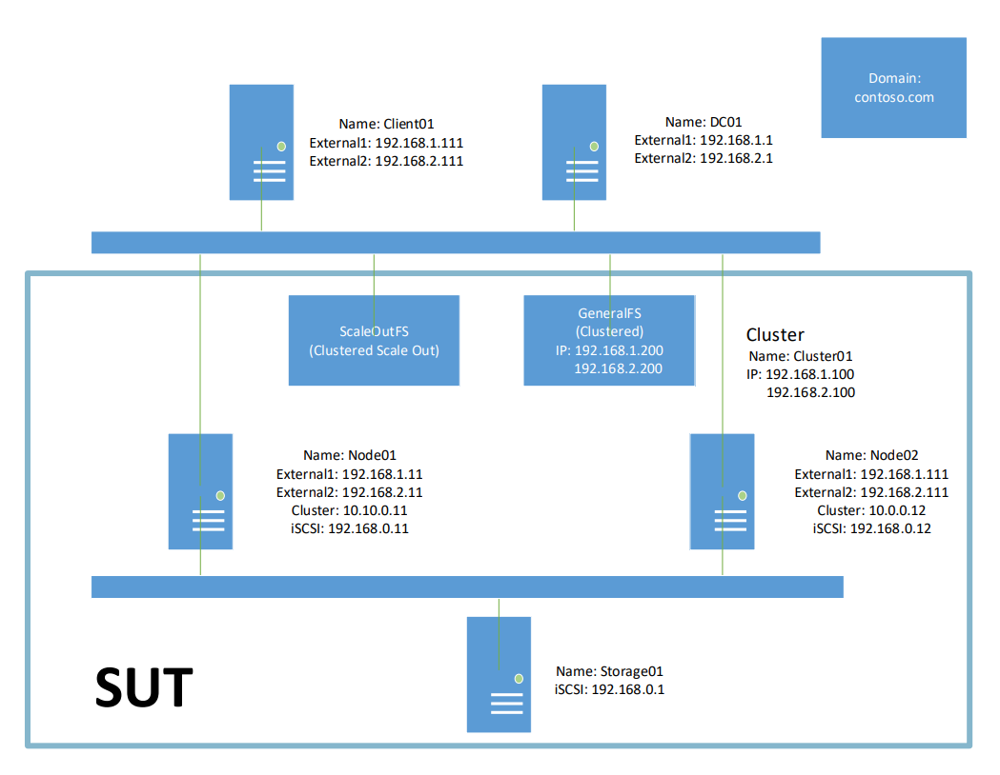

Figure 2. Domain environment network configuration

**Note**

In Figure 2, **Cluster01** represents the Failover Cluster computers that are identified as **Node01** and **Node02**, while **GeneralFS** represents the File Server role provided by the Failover Cluster, and **ScaleOutFS** represents the Scale-Out File Server role provided by the same cluster.

In non-Windows environments, the **Node01**, **Node02**, and **Storage01** computers could be replaced by  some other implementation-specific system under test (SUT).

<a name="table.8"></a>

**Table 8. Suggested machine names and network configuration for the DOMAIN environment**

| Machine Name/EndPoint | NIC       | IPv4          | Subnet Mask   | Default Gateway | DNS Server    |
|-----------------------|-----------|---------------|---------------|-----------------|---------------|
| DC01                  | External1 | 192.168.1.1   | 255.255.255.0 | &lt;empty&gt;   | 127.0.0.1     |
|                       | External2 | 192.168.2.1   | 255.255.255.0 | &lt;empty&gt;   | 127.0.0.1     |
| Client01              | External1 | 192.168.1.111 | 255.255.255.0 | 192.168.1.1     | 192.168.1.1   |
|                       | External2 | 192.168.2.111 | 255.255.255.0 | 192.168.2.1     | 192.168.2.1   |
| Node01                | External1 | 192.168.1.11  | 255.255.255.0 | 192.168.1.1     | 192.168.1.1   |
|                       | External2 | 192.168.2.11  | 255.255.255.0 | 192.168.2.1     | 192.168.2.1   |
|                       | Cluster   | 10.10.0.11    | 255.255.255.0 | &lt;empty&gt;   | &lt;empty&gt; |
|                       | iSCSI     | 192.168.0.11  | 255.255.255.0 | &lt;empty&gt;   | &lt;empty&gt; |
| Node02                | External1 | 192.168.1.12  | 255.255.255.0 | 192.168.1.1     | 192.168.1.1   |
|                       | External2 | 192.168.2.12  | 255.255.255.0 | 192.168.2.1     | 192.168.2.1   |
|                       | Cluster   | 10.10.0.12    | 255.255.255.0 | &lt;empty&gt;   | &lt;empty&gt; |
|                       | iSCSI     | 192.168.0.12  | 255.255.255.0 | &lt;empty&gt;   | &lt;empty&gt; |
| Storage01             | iSCSI     | 192.168.0.1   | 255.255.255.0 | &lt;empty&gt;   | &lt;empty&gt; |
| Cluster01             | External1 | 192.168.1.100 |               |                 |               |
|                       | External2 | 192.168.2.100 |               |                 |               |
| GeneralFS             | External1 | 192.168.1.200 |               |                 |               |
|                       | External2 | 192.168.2.200 |               |                 |               |

### <a name="4.3"/> 4.3 Verify Network Computer Connectivity

After setting up the host computers and the network configurations in either the **WORKGROUP** or **DOMAIN** environment, perform the following steps to test connectivity between Windows-based computers.

**More Information**

To learn more about testing computer connectivity, see the Administrative Guide for your operating system.

**Note**

Before performing the steps that follow, disable all active firewalls in the test environment . For Windows computers, see section [5.3.13 Turn off Firewalls](#5.3.13).

To check connectivity from the Driver computer to the SUT computer/s as well as other computers in your test environment, perform the following steps:

  1. Click the **Start** button on the Driver computer **Client01** and then click **Run**.

  2. In the **Run** dialog box, type `cmd` and then click **OK**.

  3. At the command prompt on the Driver computer, type the command `ping` followed by a space and then type the hostname or IP address of the SUT **Node01** computer, for example:

  ```
      ping Node01
  ```

  4. Press the **Enter** key on the Driver computer keyboard and verify that you receive 4 ping responses at the command line from the **pinged** computer.

  5. Repeat these steps for other computers in your test environment to confirm that there are no network connectivity issues.

**Caution**

Do not proceed further with the setup until you have verified the proper connectivity of all machines in your environment, according to the previous procedure. Otherwise, network connectivity issues may block  further configuration in the steps that follow.

## <a name="5"/> 5 Computer Setup

As indicated earlier, the Test Suite can be executed in either the **WORKGROUP** or **DOMAIN** environment, as described in section [3.2 Environment Configuration](#3.2).

**Important**

When setting up the Driver and SUT computers in either the **WORKGROUP** or **DOMAIN** environment, the procedures specify the use of particular names for items such as passwords, sharenames, and so on. Note that in most cases these are only suggested names that you can change to accommodate your specific environment, at your discretion.

### <a name="5.1"/> 5.1 Workgroup Environment

The **WORKGROUP** environment consists of two test machines as follows:

* **Driver computer** – must be running the Microsoft® Windows 8.1 Enterprise or later operating system version.

* **SUT computer** – must be running the Microsoft® Windows Server 2012 R2, Standard Edition or later version operating system for implementations in the Windows environment; in non-Windows environments, the operating system running on the SUT computer is at your own discretion, as is the implementation being tested on that computer.

#### <a name="5.1.1"/> 5.1.1 Set up the Driver Computer for the Workgroup Environment

This section describes how to set up the Driver computer for the **WORKGROUP** environment.

**Important**

Microsoft® Visual Studio, the Protocol Test Framework, and Spec Explorer must be installed on the Driver computer **before** you run the **Test Suite** installer. See section [3.4 Software Requirements](#3.4).

Perform the steps that follow to set up the Driver computer:

1. Configure IP addresses along with subnet masks and set the computer name to **Client01**. See section [4.1 Workgroup Environment](#4.1).

2. Make sure all firewall are turned off.

**Note**

For more information about turning off the firewall on Windows platforms, see section [5.3.13 Turn off Firewalls](#5.3.13).

3. Install the required software, as described in section [3.4 Software Requirements](#3.4), which includes installing the **FileServer-TestSuite-ServerEP.msi** package onto the Driver computer.

4. For x64-based machines, start Windows PowerShell (x64) with Administrator privileges by right-clicking the Windows **Start** menu and selecting **Windows Power Shell (Admin)**; then type following command:  

  ```
    Set-ExecutionPolicy Unrestricted
  ```

5. For x86-based machines, start Windows PowerShell (x86) with Administrator privileges by right-clicking the Windows **Start** menu and selecting **Windows Power Shell (Admin)**; then execute the same command as immediately above.

6. Create a new folder with path **%SystemDrive%\\FileServerCaptureFileDirectory**. This folder can be used to save the event trace log (ETL) files automatically generated by the Test Cases, which files you can analyze with Microsoft® Message Analyzer. Note that generation of ETL files will occur only if you enable **NetworkCapture** on the **Configure Test Cases** tab of the PTM and that you run the PTM as Administrator.

#### <a name="5.1.2"/> 5.1.2 Setup the SUT Computer in the Workgroup Environment

This section describes several ways to set up the SUT computer, according to the subsections that  follow:

* [Common Setup](#5.1.2.1)(section 5.1.2.1)
* [Setup to test SMB2](#5.1.2.2)(section 5.1.2.2)
* [Setup to test DFSC](#5.1.2.3)(section 5.1.2.3)
* [Setup to test RSVD](#5.1.2.4)(section 5.1.2.4)
* [Setup to test SQOS](#5.1.2.5)(section 5.1.2.5)
* [Setup to test FSA](#5.1.2.6)(section 5.1.2.6)

##### <a name="5.1.2.1"/> 5.1.2.1 Common Setup

Perform the following steps to create a common setup for the SUT computer in a Windows **WORKGROUP** environment:

1. Configure IP addresses on the SUT computer and set the computer name to **Node01**, as described in section [4.1 Workgroup Environment](#4.1).

2. Turn off the SUT computer firewall.

    For Windows platforms, see section [5.3.13 Turn off Firewalls](#5.3.13).

3. Ensure that the local **Administrator** account is enabled (which should be enabled by default) and create a local non-Administrative account named **nonadmin** for use with some test cases.

    For Windows platforms, see the following sections:

    [5.3.14 Enable the Local Administrator Account](#5.3.14)

    [5.3.15 Create a Local Non-Admin User Account](#5.3.15)

4. Ensure that the password for the local **Administrator** and **nonadmin** accounts are set to **Password01!**.

    See section [5.3.17 Reset Password for Local Users](#5.3.17).

5. Enable the Windows **Guest** account as described in section [5.3.16 Enable the Local Guest Account](#5.3.16). The Guest account is used in some test cases.

6. Reset the password for the **Guest** account to **Password01!**.

    See section [5.3.17 Reset Password for Local Users](#5.3.17).

In sections [5.1.2.2 Setup to test SMB2](#5.1.2.2) through [5.1.2.5 Setup to test SQOS](#5.1.2.5) that follow, you will create the configurations necessary for testing the Server Message Block (SMB) and other protocols.

##### <a name="5.1.2.2"/> 5.1.2.2 Setup to test SMB2

The procedures in the subsections that follow create the test configurations that you will use to test an MS-SMB2 protocol implementation.

###### <a name="5.1.2.2.1"/> 5.1.2.2.1 Create a basic share

This configuration is used to test the basic features of an MS-SMB2 protocol implementation, for example, the **Encryption** and **Oplock** features.

To create a basic SMB share, perform the steps that follow:

  1. Create a shared folder named **SMBBasic** on the SUT computer (**Node01**).

  2. Ensure that the **SMBBasic** folder is shared with **Read/Write** permissions to the local **Administrator** account that is enabled by default or you enabled earlier in section [5.1.2.1 Common Setup](#5.1.2.1).

  3. For Windows platforms, see section [5.3.1 Create a share](#5.3.1) for additional process details.

###### <a name="5.1.2.2.2"/> 5.1.2.2.2 Create a share with Encrypt data access enabled

This configuration is used to test the **Encryption** feature of an MS-SMB2 protocol implementation.  If **Encryption** is not supported in your implementation, please ignore this section.

To create a share with encrypted access, perform the steps that follow:

  1. Create a shared folder named **SMBEncrypted** on **%systemdrive%** of the SUT (**Node01**) computer.  

  2. Share the **SMBEncrypted** folder with **Read/Write** permissions to the local **Administrator** account that you enabled in section [5.1.2.1 Common Setup](#5.1.2.1). For Windows and non-Windows platforms, proceed to section [5.3.1 Create a share](#5.3.1) for additional process details.

  3. For Windows and non-Windows platforms, after step 3 is complete, proceed to section [5.3.6 Enable Encrypt Data Access on a share named SMBEncrypted](#5.3.6) for additional process details.  

      This will enable **Encrypt data access** on the **SMBEncrypted** share, to enforce the requirement that messages must be encrypted whenever this share is accessed.

###### <a name="5.1.2.2.3"/> 5.1.2.2.3 Other configurations

###### <a name="5.1.2.2.3.1"/> 5.1.2.2.3.1 Create a share with Oplock Force Level 2 enabled

This configuration is used to test the **Oplock** feature of an MS-SMB2 protocol implementation.

To create a share with Oplock Force Level 2 enabled, perform the steps that follow:

  1. Create a shared folder named **ShareForceLevel2** on the SUT (**Node01**) computer, as described in section [5.3.1 Create a share](#5.3.1).

  2. Share the **ShareForceLevel2** folder with **Read/Write** permissions to the local **Administrator** account.

  3. For Windows platforms, proceed to section [5.3.7 Enable FORCE_LEVELII_OPLOCK on a share named ShareForceLevel2](5.3.7) to enable **FORCE_LEVELII_OPLOCK** on the specified share.

###### <a name="5.1.2.2.3.2"/> 5.1.2.2.3.2 Create a Share Named SameWithSMBBasic

This configuration is used to test some negative cases of the **AppInstanceId** feature in a Windows implementation of the MS-SMB2 protocol. If **AppInstanceId** is not supported in your implementation, please ignore this section.

To create a share named SameWithSMBBasic, perform the steps that follow:

  1. Create a shared folder named **SameWithSMBBasic** on the SUT (**Node01**) computer. This share should have the same path as the **SMBBasic** shared folder that you created in section [5.1.2.2.1 Create a basic share](#5.1.2.2.1).

  2. For Windows platforms, proceed to section [5.3.4 Add a share SameWithSMBBasic with the same Path of Share SMBBasic](#5.3.4) for the process to create and locate the SameWithSMBBasic share.

**Note**

* The test case creates a file under the **SMBBasic** share in the first create request and a second create request creates a file of the same name under the **SameWithSMBBasic** share.

* The test case then connects with the share **SameWithSMBBasic** and sends a second Create Request to the SUT with the same **AppInstanceId**.

* The test case verifies that the first Open is not forced to close by the second Create Request because the second Create Request is connecting to a different share.

###### <a name="5.1.2.2.3.3"/> 5.1.2.2.3.3 Create a share named DifferentFromSMBBasic

This configuration is used to test some negative cases (similar to section [5.1.2.2.3.2 Create a share named SameWithSMBBasic](#5.1.2.2.3.2)) of the **AppInstanceId** feature of an MS-SMB2 protocol implementation. If **AppInstanceId** is not supported in your implementation, please ignore this section.

To create a share named **DifferentFromSMBBasic**, perform the steps that follow:

  1. Create a shared folder named **DifferentFromSMBBasic** on the SUT (**Node01**) computer. This share should have a different path from that of the **SMBBasic** share. For example, if the path to **SMBBasic** is **%SystemDrive%\SMBBasic**, then the path to **DifferentFromSMBBasic** should be **%SystemDrive%\DifferentFromSMBBasic**.

  2. Share the **DifferentFromSMBBasic** with **Read/Write** permissions to the local Administrator account **Administrator**.

For Windows platforms, see section [5.3.1 Create a share](#5.3.1) for additional information.

###### <a name="5.1.2.2.3.4"/> 5.1.2.2.3.4 Create Symbolic Links

This configuration is used to test some negative cases of the **Create/Close** feature of an **MS-SMB2** protocol implementation. For more details, see section 3.3.5.9 of the [**MS-SMB2**] document.

This configuration is used to test some negative cases of **Create/Close** feature of **[MS-SMB2]** protocol.

The following summarizes the steps for creating symbolic links.

  1. Add a **Symbolic Link** to **%SystemDrive%**.  

      * In the folder **SMBBasic**, add a symbolic link named **Symboliclink**, which will link to **%SystemDrive%**.

  2. Add a **Symbolic Link** to the **SMBBasic** folder:

      * Add a new folder named **Sub** under the **SMBBasic** folder.

      * In the **Sub** folder, add a symbolic link named **Symboliclink2**, which will link to **SMBBasic**.

For Windows platforms, proceed to section [5.3.5 Create symbolic links](#5.3.5) for the details on creating the specified symbolic links for the applicable share and folder mentioned in the previous steps.

###### <a name="5.1.2.2.3.5"/> 5.1.2.2.3.5 Create a Share on a Volume that Supports Integrity

This configuration is used to test the **Integrity** feature of an **MS-SMB2** protocol implementation, namely the **IoCtl** codes **FSCTL_GET_INTEGRITY_INFORMATION** and **FSCTL_SET_INTEGRITY_INFORMATION**. If Integrity is not supported by your file system, please ignore this section. For more details about the cited **IoCtl** codes, please see the [MS-FSCC] document.

To create a shared folder named **SMBReFSShare** in a new **ReFS**-formatted volume, you will perform the tasks described in the steps that follow:

  1. On the SUT (**Node01**) computer, use the **Disk Management** console to allocate a new 5 GB volume and configure the volume to the resilient file system (**ReFS**) format.

  2. Create a shared folder named **SMBReFSShare** on the **ReFS**-formatted volume on the SUT (**Node01**) computer.

  **Note**
  
  The file system of the volume containing the specified share must support the use of **Integrity**, such as **ReFS**-formatted volumes do.

  3. Share the **SMBReFSShare** folder with **Read/Write** permissions to the local **Administrator** account that you enabled earlier.

For Windows platforms, see section [5.3.8 Create a share on a volume supporting integrity](#5.3.8) for further details on creating the new volume and share.

###### <a name="5.1.2.2.3.6"/> 5.1.2.2.3.6 Modify the Signing configurations

This configuration is used to test the **Signing** feature of an **MS-SMB2** protocol implementation. If **Signing** is not supported in your implementation, please ignore this section.

To enable the Signing feature on the SUT (**Node01**) computer, perform the steps that follow.

  1. Enable the **SigningRequired** feature on the SUT (**Node01**) computer at your discretion. Note that you can also disable SigningRequired.

      For Windows platforms, see section [5.3.21 Modify the Signing configuration](#5.3.21), on how to enable (or disable) **SigningRequired**.
  
  2. On the Driver (**Client01**) computer, open the [CommonTestSuite.deployment.ptfconfig](#7.2) file with Microsoft Visual Studio Ultimate 2012 and do one of the following:

      * If you enabled **SigningRequired** on the SUT (**Node01**) computer, set the value of the **IsRequireMessageSigning** property to `true` in the specified ptfconfig file. Note that `true` should be the default.

      * If you disabled **SigningRequired** on the SUT computer, set the value of the **IsRequireMessageSigning** property to `false` in the specified ptfconfig file.

##### <a name="5.1.2.3"/> 5.1.2.3 Setup to test DFSC

This configuration is used to test an implementation of the [**MS-DFSC**] protocol. If the distributed file system (**DFS**) is not supported, please ignore this section.

The following steps summarize the tasks that enable you to set up DFS on the SUT (**Node01**) computer.

  1. Use **Server Manager** to install DFS services on the SUT.

  2. Create two stand-alone DFS namespaces entitled **SMBDfs** and **Standalone**.

  3. Create a shared folder named **FileShare** on the SUT computer.

  4. Share the **FileShare** folder with Read/Write permissions to the Administrator account that you enabled earlier.

      For Windows platforms, see section [5.3.1 Create a share](#5.3.1) for additional information.

  5. Add a folder named **SMBDfsLink** with a symbolic link target as **\\\\Node01\\FileShare** to the **SMBDfs** namespace.

  6. Add the following two folders to the **Standalone** namespace.

      * A folder named **DFSLink** with a symbolic link target as **\\\\Node01\\FileShare**.

      * A folder named **Interlink** with a symbolic link target as **\\\\Node01\\SMBDfs\\SMBDfsLink**.

To complete these tasks on Windows platforms, see section [5.3.10 Set up Distributed File System (DFS)](#5.3.10). Perform all procedures in this section with exception of those that apply to the **DOMAIN** environment only.

##### <a name="5.1.2.4"/> 5.1.2.4 Setup to test RSVD

**Note**

RSVD testing is not applicable to the Windows **WORKGROUP** environment. However, you can still perform RSVD testing if you have a non-Windows computer as the SUT and your implementation supports this feature in the **WORKGROUP** environment. To perform RSVD testing in the **DOMAIN** environment, see section [5.2.4.5 Setup to test RSVD](#5.2.4.5).

##### <a name="5.1.2.5"/> 5.1.2.5 Setup to test SQOS

**Note**

Storage Quality of Service (SQOS) testing is not applicable to the Windows **WORKGROUP** environment. However, you can still perform SQOS testing if your implementation supports this feature in the **WORKGROUP** environment. To perform SQOS testing in the **DOMAIN** environment, see section [5.2.4.6 Setup to test SQOS](#5.2.4.6).

##### <a name="5.1.2.6"/> 5.1.2.6 Setup to test the File System Algorithms (FSA)

This configuration is used to test the [**MS-FSA**] protocol.

The general tasks you will need to perform are outlined in the steps that follow:

  1. Create a share named **FileShare** on the SUT computer. Skip this step and the next if this share already exists and Read/Write permissions have been set.

  2. Configure the share with the Read/Write permissions to the Administrator account.

      On Windows platforms, see section [5.3.1 Create a share](#5.3.1), for further details.

  3. Create a folder named **ExistingFolder** under the **FileShare**.

  4. Create a file named **ExistingFile.txt** under the **FileShare**.

  5. Create a symbolic link named **link.txt** under the **FileShare** folder and link it to the **ExistingFile.txt** file.

      On Windows platforms, see section [5.3.5 Create symbolic links](#5.3.5), for further details.

  6. Create a mount point named **MountPoint** under the **FileShare** and link to the volume where the **FileShare** folder is located.

      On Windows platforms, see section [5.3.27 Create a volume mount point](#5.2.27), for further details.

  7. Enable **short name** (**8.3 filename**) on the volume where the **FileShare** folder is located.

      On Windows platforms, see section [5.3.25 Enable short name](#5.3.25) for further details.

  8. Create 3 volume shadow copies on the volume where the **FileShare folder** is located. Modify and save the contents of file **ExistingFile.txt** prior to creating each volume shadow copy, so that the **ExistingFile.txt** file will have 3 previous versions.

      On Windows platforms, see section [5.3.26 Create a volume shadow copy](#5.3.26), for further details.

  9. Repeat steps 3 through 6 for the share **SMBReFSShare**, which should have been already created in section [5.1.2.2.3.5 Create the share on a volume supporting integrity](#5.1.2.2.3.5).

      **Note**

      If **Integrity** is not supported by the file system, please ignore this step.

### <a name="5.2"/> 5.2 Domain Environment

The **DOMAIN** environment consists of 4-5 test machines, as described in section [3.2 Environment](#3.2). The following requirements apply to the domain environment:

* The Driver computer must use the Microsoft® Windows 8.1 Enterprise or later version operating system.

* The failover cluster SUT, can be for either a Windows or Non-Windows implementation.

  * If you want to test cluster scenarios, you will need to prepare a Failover Cluster SUT. Moreover, for a Windows implementation, two computers are required.

  * If you do not want to test cluster scenarios, you will need a single SUT computer only. To simplify your deployment steps and reuse any existing configurations you might already have, you can use any one node in the Failover Cluster as the SUT computer when testing non-cluster scenarios.

* The Domain Controller (DC) can be either a Windows or non-Windows system.

* The SAN storage server can be for either a Windows or non-Windows implementation.

#### <a name="5.2.1"/> 5.2.1 Set up the Domain Controller (DC) for the Domain Environment

This section describes how to set up a computer as the Domain Controller (DC). For a basic setup in Windows, perform the following steps:

  1. Configure IP addresses on the **DC** and configure the computer name as **DC01**. For further details, see section [4.2 Domain Environment](#4,2).

  2. Turn off all firewalls on all computers in the Domain Environment.

      For Windows platforms, see section [5.3.13 Turn off the Firewall](#5.3.13).

  3. Create a local Administrator account named **Administrator**.

      For Windows platforms, see section [5.3.14 Create a Local Admin User Account](#5.3.14).

  4. Set the Administrator account password to **Password01!**.

      For Windows platforms, see section [5.3.17 Reset the Password for Local Users](#5.3.17).

  5. Perform the steps in the following subsections [5.2.1.1](#5.2.1.1) through [5.2.1.4](5.2.1.4) to continue DC setup.

##### <a name="5.2.1.1"/> 5.2.1.1 Promote the DC

1. Promote the computer to Domain Controller.

  For Windows platforms, see section [5.3.9.1 Install DNS and Active Directory Domain Services](#5.3.9.1) to create a specified domain.

**Note**

In non-Windows Domain Controller environments, it may be necessary to manually configure DNS records for all test machines.

##### <a name="5.2.1.2"/> 5.2.1.2 Start the Routing service

The steps that follow create the configuration for routing two different networks that are used in multiplechannel test cases.

  1. Install the Routing Service and configure the Remote Access Role feature.

      For Windows platforms, see section [5.3.9.2 Install Routing Service](5.3.9.2).

  2. Configure and start the Routing and Remote Access service.

      For Windows platforms, see section [5.3.9.3 Configure and start Routing service](5.3.9.3).

##### <a name="5.2.1.3"/> 5.2.1.3 Create the Domain User accounts

To create domain (non-Admin) user accounts:

  1. Create a non-Admin domain user account named **nonadmin** in Active Directory.

      For Windows platforms, see section [5.3.9.4 Create a Domain Non-Admin user account](#5.3.9.4).

  2. Enable the **Guest** account.

      For Windows platforms, see section [5.3.9.5 Enable Guest user account](#5.3.9.5).

  3. Create a domain group **AzGroup01** in Active Directory.

      For Windows platforms, see section [5.3.9.6 Create a Domain group](#5.3.9.6).

  4. Create a domain user **AzUser01** within the domain group **AzGroup01** in Active Directory.

      For Windows platforms, see section [5.3.9.7 Create a Domain account that belongs to a Domain group](#5.3.9.7).

  5. Set the password for all the accounts to **Password01!**.

##### <a name="5.2.1.4"/> 5.2.1.4 Setup to test Claimed Based Access Control (CBAC)

This configuration is used to test the authentication and authorization protocols.

For Windows platforms, see section [5.3.9.8 Configure Claimed Based Access Control (CBAC)](#5.3.9.8).

#### <a name="5.2.2"/> 5.2.2 Set up the Driver Computer for the Domain Environment

To set up the Driver computer:

  1. Complete the steps specified in [5.1.1 Set up the Driver computer for the Workgroup Environment](#5.1.1).

  2. See section [4.2 Domain Environment](#4.2) for hostname and IP address configurations.

  3. Join the Driver computer to the domain provided by the DC.

#### <a name="5.2.3"/> 5.2.3 Set up the SAN Storage Server in the Domain Environment

Perform the following steps to set up the SAN storage server computer:

**Note**

If you will not be testing cluster scenarios, please ignore this section.

  1. Configure IP addresses on the SAN storage server and set the computer name to **Storage01**. See section [4.2 Domain Environment](#4.2) for IP details.

  2. Install iSCSI target and create virtual disks for the Failover cluster.

For Windows platforms, see section [5.3.11 Set up SAN Storage Server](#5.3.11).

#### <a name="5.2.4"/> 5.2.4 Set up the SUT in the Domain Environment

The subsections that follow describe how to setup the SUT computer. For all SUT computers in a Cluster environment, the setup steps are identical.

##### <a name="5.2.4.1"/> 5.2.4.1 Common Setup

Perform the steps that follow to set up the SUT computer:

  1. Join the SUT to the Domain provided by the DC.

      If there are two SUT computers in the environment (i.e. **Node01** and **Node02**), join both to the Domain and continue.

  2. Logon to the SUT computers with Domain Administrator account.

  3. Complete section [5.1.2.1 Common Setup](#5.1.2.1) specified for the **WORKGROUP** environment. See section [4.2 Domain Environment](#4.2) for hostname and IP address configurations.

  4. Create the password/s for the SUT computer/s.

      For Windows platforms, see section [5.3.22 Manually Set up Computer Password](#5.3.22).

  5. Perform the steps in the following subsections [5.2.4.2](5.2.4.2) through [5.2.4.7](5.2.4.7) to continue set up of Test Suite components.

##### <a name="5.2.4.2"/> 5.2.4.2  Set up to test SMB2

Perform the steps that follow to create the configuration that is used to test the **MS-SMB2** protocol.

1. Complete the steps in section [5.1.2.2 Setup to test SMB2](5.1.2.2), as specified for the **WORKGROUP** environment.

2. Share all the shares with the Domain Admin User.

##### <a name="5.2.4.3"/> 5.2.4.3 Setup to test DFSC

Perform the steps that follow to create the configuration that is used to test the **MS-DFSC** protocol. If **DFS** is not supported, please ignore this section.

1. Complete the steps in section [5.1.2.3 Setup to test DFSC](#5.1.2.3), as specified for the **WORKGROUP** environment.

2. Create a Domain-based namespace entitled **DomainBased**.

3. Add two folders to the namespace **DomainBased**.

    * Add the first folder named **DFSLink**. If there is a **Node02** in the environment, the link target is **\\\\Node02\\FileShare**, otherwise the link target is **\\\\Node01\\FileShare**.

    * Add another folder named **Interlink**, with the link target set to **\\\\Node01\\SMBDfs\\SMBDfsLink**.

    For Windows platforms, see section [5.3.10 Set up the Distributed File System (DFS)](#5.3.10).

##### <a name="5.2.4.4"/> 5.2.4.4 Setup to test Server Failover/FSRVP/SWN (cluster scenarios in Domain environment only)

Perform the steps that follow to create the configuration that is used to test the **MS-FSRVP**, **MS-SWN**, and **MS-SRVS** protocols. Please ignore this section, if you are not planning to test the Cluster scenarios.

**Note**

Server Failover/FSRVP/SWN testing is not applicable to the **WORKGROUP** environment on Windows platforms.

1. Create a share named **SMBClustered**, set the property **Share.IsCA** to **TRUE**, set **Share.Type** to include **STYPE_CLUSTER_SOFS**, and make the share is asymmetric.
  
    For Windows platforms, see section [5.3.18 Create an Asymmetric share](#5.3.18).

    * **Share.IsCA** is set to **TRUE** when the **SHI1005\_FLAGS\_ENABLE\_CA** bit in the **shi005\_flags** is set as documented in **[MS-SRVS]** section 2.2.4.29.

    * **STYPE\_CLUSTER\_SOFS** is one of **Share Types** documented in **[MS-SRVS]** section 2.2.2.4.

2. Create a share named **SMBClusteredEncrypted** with the properties **Share.IsCA** and **Share.EncryptData** set to **TRUE**.

3. Create a share named **SMBClusteredForceLevel2**, set the property **Share.ForceLevel2Oplock** to **TRUE**, and set **Share.Type** to include **STYPE_CLUSTER_SOFS**.

    * **Share.ForceLevel2Oplock** is set to **TRUE** when **SHI1005\_FLAGS\_FORCE\_LEVELII\_OPLOCK** bit in **shi1005\_flags** is set as specified in **[MS-SRVS]** section 2.2.4.29.

    * **STYPE\_CLUSTER\_SOFS** is one of **Share Types** documented in **[MS-SRVS]** section 2.2.2.4.4.

4. Connect to the iSCSI disks and set up the failover Cluster.

    For Windows platforms, see section [5.3.12 Set up the Cluster](#5.3.12).

##### <a name="5.2.4.5"/> 5.2.4.5 Setup to test RSVD

Perform the steps that follow to create the configuration that is used to test the **MS-RSVD** protocol. If the **RSVD** protocol is not supported, please ignore this section.

**Note**

RSVD testing is not applicable in the **WORKGROUP** environment on Windows platforms. However, you can still test it if your implementation is on a non-windows computer that supports this feature in the **WORKGROUP** environment.

1. Create a virtual hard disk file named **rsvd.vhdx** and **rsvd.vhds** with maximum size of 1 GB.

2. Copy the file in a share on the SUT computer. For Windows platforms, the share should be **\\\\scaleoutfs\\SMBClustered**.

3. Save the share name to the property: **ShareContainingSharedVHD** in the [MSRSVD_ServerTestSuite.deployment.ptfconfig](#7.2) file.

> To learn more about how to create a virtual hard disk (set) file on Windows platforms, see section [5.3.19 Create the virtual hard disk file](#5.3.19) and section [5.3.20 Create the virtual hard disk set file](#5.3.20).

##### <a name="5.2.4.6"/> 5.2.4.6 Setup to test SQOS

Perform the following steps to create the configuration that is used to test the **MS-SQOS** protocol. Please ignore this section if your implementation does not support **SQOS**.

**Note**

Storage Quality of Service (SQOS) protocol testing is not applicable in the **WORKGROUP** environment on Windows platforms. However, you can still test it if your implementation supports this feature in the **WORKGROUP** environment.

1. Create a virtual hard disk file named **sqos.vhdx** with maximum size of 1 GB.

2. Copy the file in a share on the SUT computer. For Windows platforms, the share should be **\\\\scaleoutfs\\SMBClustered**.

3. Create a new SQOS policy with MinimumIoRate: 100, MaximumIoRate: 200 and MaximumBandwidth: 1600 KB.

4. Save the policy **Id** to the property: **SqosPolicyId** in the [MSSQOS_ServerTestSuite.deployment.ptfconfig](#7.2) file. See section [5.3.23 Create an SQOS policy](#5.3.23) for how to create the policy Id.

To learn more about how to create a virtual hard disk file on Windows platforms, see section [5.3.19](#5.3.19).

To learn more about how to create a new policy, see section [5.3.23 Create an SQOS policy](#5.3.23).

##### <a name="5.2.4.7"/> 5.2.4.7  Setup to test Authorization (domain environment only)

Perform the following steps to create the configuration that is used to test the authentication and authorization protocols. Create this configuration once on the Node1 computer only.

**Note**

Authorization testing is not applicable to the **WORKGROUP** environment on Windows platforms.

1. Create a share named **AzShare** with the following permissions configuration:

    | NTFS Permission      | Share Permission        |
    |----------------------|-------------------------|
    | Allow Everyone       | Allow Domain Admins     |

2. Create a share named **AzFolder** with the following permissions configuration:

    | NTFS Permission      | Share Permission        |
    |----------------------|-------------------------|
    | Allow Domain Admins  | Allow Everyone          |

3. Create a share named **AzFile** with the following permissions configuration:

    | NTFS Permission      | Share Permission        |
    |----------------------|-------------------------|
    | Allow Domain Admins  | Allow Everyone          |

4. Create a share named **AzCBAC** with the following permissions configuration:

    | NTFS Permission      | Share Permission        |
    |----------------------|-------------------------|
    | Allow Everyone       | Allow Everyone          |

5. If the Server Service Remote Protocol (**MS-SRVS**) is not supported, create shares **AzShare01** through AzShare06 on the SUT computer. Permissions for each share should be set as specified in the following table:

    | Share Name | Permissions                                                 |
    |------------|-------------------------------------------------------------|
    | AzShare01  | O:SYG:SYD:(A;;0x1fffff;;; \[SID of AzUser01\])(A;;FA;;;BA)  |
    | AzShare02  | O:SYG:SYD:(A;;0x1fffff;;; \[SID of AzGroup01\])(A;;FA;;;BA) |
    | AzShare03  | O:SYG:SYD:(D;;0x1fffff;;; \[SID of AzUser01\])(A;;FA;;;BA)  |
    | AzShare04  | O:SYG:SYD:(D;;0x1fffff;;; \[SID of AzGroup01\])(A;;FA;;;BA) |
    | AzShare05  | O:SYG:SYD:(A;;FA;;;BA)                                      |
    | AzShare06  | O:SYG:SYD:(D;;;;; \[SID of AzUser01\])(A;;FA;;;BA)          |

**Note**

The steps to create the above shares are similar to creating share **SMBBasic**.

For Windows platforms, see the following sections to facilitate creating shares and permissions in the above procedure:

* [5.3.1 Create a share](#5.3.1)

* [5.3.2 Set NTFS Permissions](#5.3.2)

* [5.3.3 Set Share Permissions](#5.3.3)

##### <a name="5.2.4.8"/> 5.2.4.8 Setup to test FSA

Perform the following steps to create the configuration that is used to test the **MS-FSA** protocol.

1. Complete [5.1.2.6. Setup to test FSA](#5.1.2.6), as specified for the **WORKGROUP** environment.

2. Share all the shares with the Domain Admin User.

### <a name="5.3"/> 5.3 General Setup Details for Windows Platforms

This section describes detailed setup steps for Windows platforms in **WORKGROUP** and **DOMAIN** environments.

#### <a name="5.3.1"/> 5.3.1 Create a share

To create a share, perform the steps that follow.

**Note**

The procedure that follows specifically creates an **SMBBasic** share. However, you can use this procedure as a general guideline to create any share, for example, **AzShare**.

1. Create new folder **%SystemDrive%\SMBBasic**, as follows:

    * Open **File Explorer** and go to **%SystemDrive%**, right-click in the blank space,  and select **New** -&gt; **Folder** to create a new folder.

    <a name="fig.3"></a>

    

    Figure 3. Location for the **SMBBasic** share

    * Type `SMBBasic` for the new folder's name.

    <a name="fig.4"></a>

    

    Figure 4. Creating the **SMBBasic** share

2. Share the **SMBBasic** folder with **Read/Write** permissions to the **Node01\Administrator** or **CONTOSO\Administrator** if you are using the **DOMAIN** environment, as follows:

    * Right-click the **SMBBasic** folder and select **Properties**.

    <a name="fig.5"></a>

    

    Figure 5. Opening the **SMBBasic** share folder properties

    * On the **Sharing** tab, click the **Share...** button.

    <a name="fig.6"></a>

    

    Figure 6. Sharing the **SMBBasic** folder

    * In the **Choose people to share with** dialog, verify that the **Node01\Administrator** account is present. If not, type `Node01\Administrator` and then click **Add**.

    <a name="fig.7"></a>

    

    Figure 7. Adding permissions to the **SMBBasic** share

    * Click the arrow in the **Permission Level** column of the **Administrator** account, select **Read/Write**, and then click the **Share** button.

    <a name="fig.8"></a>

    

    Figure 8. Adding permission levels to the **SMBBasic** share

    * In the **Your folder is shared.** dialog, click **Done** and then click **Close** in the **SMBBasic** **Properties** dialog.

    <a name="fig.9"></a>

    

    Figure 9. Confirmation of the **SMBBasic** folder share status

#### <a name="5.3.2"/> 5.3.2 Set NTFS Permissions

To set NTFS permissions on the shared **AzShare** folder that you created by following the steps in section [5.3.1](#5.3.1), perform the steps that follow.

1. Right-click the shared folder and select **Properties**.

  <a name="fig.10"></a>

  

  Figure 10. Opening the **AzShare** properties to set NTFS permissions

2. On the **Security** tab of the **AzShare** **Properties** dialog, click **Advanced**.

  <a name="fig.11"></a>

  

  Figure 11. **Security** tab of the **AzShare** **Properties** dialog

3. On the **Permissions** tab of the **Advanced Security Settings** for **AzShare** dialog, edit NTFS Permissions by selecting security principal **Administrator** (**Node01\\Administrator**) and clicking the **Edit** button.

  **Note**

  If you want to add or remove a security principal, click Add or Remove as required.

  <a name="fig.12"></a>

  

  Figure 12. Specifying advanced security settings for the **AzShare** share

#### <a name="5.3.3"/> 5.3.3 Set Share Permissions

To set permissions on a specified share, perform the steps that follow.

1. Start the console window with Administrator privileges.

    For further details, see section [5.3.24 How to start the console with Administrator privilege](#5.3.24).

2. Execute the command `compmgmt.msc` in the console window to launch the **Computer Management** console.

3. Expand **Shared Folders** -&gt; **Shares** in the left pane of the management console, then select the folder for which you want to set share permissions.

4. Right-click the shared folder and select **Properties** to open the shared folder **Properties** dialog.

5. Click the **Share Permissions** tab in the **Properties** dialog and set the permissions specified in section [5.2.4.7](#5.2.4.7).

  <a name="fig.13"></a>

  

  Figure 13. Setting permissions for a specified share

#### <a name="5.3.4"/> 5.3.4 Add a share SameWithSMBBasic with the same path of Share SMBBasic

To add the **SameWithSMBBasic** share to the existing **SMBBasic** share, perform the steps that follow.

1. Ensure that the folder **%SystemDrive%\SMBBasic** is already created and shared with **Read/Write** permission level to the **Node01\Administrator** (or  **CONTOSO\Administrator** if you are using the **DOMAIN** environment).

    For further details, see section [5.3.1 Create a share](#5.3.1).

2. Add another share with the name **SameWithSMBBasic** to the **%SystemDrive%\SMBBasic** folder, as follows.

    * Right-click the **SMBBasic** folder and select **Properties** to display the **SMBBasic** **Properties** dialog.

    <a name="fig.14"></a>

    

    Figure 14. **SMBBasic** folder properties selection

    * On the **Sharing** tab of the dialog, click the **Advanced Sharing...** button to display the **Advanced Sharing** dialog.

    <a name="fig.15"></a>

    

    Figure 15. **SMBBasic** Properties dialog

    * In the **Advanced Sharing** dialog, click the **Add** button to display the **New Share** dialog.

    <a name="fig.16"></a>

    

    Figure 16. **SMBBasic** Advanced Sharing dialog

    * In the **New Share** dialog, type `SameWithSMBBasic` in the **Share name** textbox, then click OK.

    <a name="fig.17"></a>

    

    Figure 17. Adding the **SameWithSMBBasic** share in the **New Share** dialog

#### <a name="5.3.5"/> 5.3.5 Create symbolic links

To create symbolic links, perform the steps that follow.

1. Logon to the SUT computer and start the command console with Administrator privileges.

    For further details, see section [5.3.24 How to start the command console with Administrator privileges](#5.3.24).

2. If you are creating a directory symbolic link under the share **SMBBasic**, type the following commands in a command console running as Administrator, and then press **Enter** on the SUT computer keyboard.

    ```
      cd %SystemDrive%\SMBBasic
      mklink /D Symboliclink %SystemDrive%
    ```

3. If you are creating a directory symbolic link under the folder **SMBBasic\Sub**, type the following commands in a command console running as Administrator, and then press **Enter** on the SUT computer keyboard:

    ```
      cd %SystemDrive%\SMBBasic\Sub\
      mklink /D Symboliclink2 %SystemDrive%\SMBBasic
    ```

4. If you are creating a file symbolic link under the share **FileShare**, type the following commands in a command console running as Administrator, and then press **Enter** on the SUT computer keyboard.

    ```
      cd %SystemDrive%\FileShare
      mklink link.txt ExistingFile.txt
    ```

#### <a name="5.3.6"/> 5.3.6 Enable Encrypt Data Access on a Share Named SMBEncrypted

To enable the **SMBEncrypted** share with **Encrypt data**, perform the steps that follow:

1. Ensure that the folder **%SystemDrive%\SMBEncrypted** is already created and shared with **Read/Write** permission level to the **Node01\Administrator** ( or **CONTOSO\Administrator** if you are using the DOMAIN environment).

    For further details, see section [5.3.1 Create a share](#5.3.1).

2. Open **Server Manager** and then click **File and Storage Services** in the left-hand pane.

    <a name="fig.18"></a>

    

    Figure 18. Server Manager dashboard

3. In **Server Manager**, click **Shares** and locate the **SMBEncrypted** share in the list view of the righthand pane. Right-click the **SMBEncrypted** share and then select **Properties** to display the **SMBEncrypted** **Properties** dialog.

    <a name="fig.19"></a>

    

    Figure 19. Accessing the **SMBEncrypted** share Properties

4. In the **SMBEncrypted** **Properties** dialog, click **Settings** in the left-hand pane, and then select the **Encrypt data access** checkbox in the right-hand pane of the dialog.

    <a name="fig.20"></a>

    

    Figure 20. Setting Encrypted data access in the **SMBEncrypted** **Properties** dialog

5. Click **Apply** and then **OK** to apply the changes and close the **SMBEncrypted** **Properties** dialog.

#### <a name="5.3.7"/> 5.3.7 Enable FORCE_LEVELII_OPLOCK on a Share Named ShareForceLevel2

To enable an OpLock on a share, perform the steps that follow.

1. Ensure that the folder **%SystemDrive%\ShareForceLevel2** is already created and shared with **Read/Write** permission level to the **Node01\Administrator** ( or **CONTOSO\Administrator** you are using the DOMAIN environment).

    For further details, see section [5.3.1 Create a share](#5.3.1).

2. Logon to the Driver computer and locate the **ShareUtil.exe file** in the following folder: **%SystemDrive%\\MicrosoftProtocolTests\\FileServer\\Server-Endpoint\\&lt;version#&gt;\\Bin\\**

    Copy the file to the SUT computer.

3. Logon to the SUT computer and start the console window with Administrator privileges.

    For further details, see section [5.3.24 How to start console with Administrator privilege](#5.3.24).

4. Type the following commands in the appropriate console window, and then press **Enter** on the SUT computer keyboard.

    ```
      cd <ShareUtil.exe file path on SUT>
      ShareUtil.exe <computer name of the share> <share name> <flag> true
    ```

    Modify the parameters `<ShareUtil.exe file path on SUT>`, `<computer name of  the share>`, `<share name>` and `<flag>` according to your own environment. For example:

      (1) If you want to enable **SHI1005_FLAGS_FORCE_LEVELII_OPLOCK** flag on share **\\\\Node01\\ShareForceLevel2**, run the following:

      ```
          cd c:\
          ShareUtil.exe Node01 ShareForceLevel2 SHI1005_FLAGS_FORCE_LEVELII_OPLOCK true
      ```

      (2) If you want to enable **SHI1005_FLAGS_FORCE_LEVELII_OPLOCK** flag on share **\\\\ScaleOutFS\\SMBClusteredForceLevel2**, run the following:

      ```
          cd c:\
          ShareUtil.exe ScaleOutFS SMBClusteredForceLevel2 SHI1005_FLAGS_FORCE_LEVELII_OPLOCK true
      ```

#### <a name="5.3.8"/> 5.3.8 Create a Share on a Volume Supporting Integrity

To create a share on a volume that supports integrity, perform the steps that follow.

1. Start the command console with Administrator privileges.

    For further details, see section [5.3.24 How to start the command console with Administrator privileges](#5.3.24).

2. Execute the command `diskmgmt.msc` in the command console to launch the **Disk Management** MMC in order to create a Resilient File System (**ReFS**)-formatted volume.

**Note**

You will need at least **5GB** of **Unallocated** space to create a new simple volume.

3. In the **Disk Management** console, right-click **Disk 0** and select **Shrink volume** in the context menu that displays to free some disk space.

    This action starts a query that determines the available shrink space that is on Disk 0:

    <a name="fig.21"></a>

    

    Figure 21. Volume query for shrink space

4. If you have sufficient **Unallocated** space on **Disk 0**, then do the following in the **Shrink C:** dialog:

    * Select the **5120** value in the up-down control to the right of the **Enter the amount of space to shrink in MB:** label.

    Click **Shrink** to resize **Disk 0** by the specified amount. If you do not have sufficient **Unallocated** space on **Disk 0**, repeat steps 3 and 4 on another volume.  If you do not have sufficient Unallocated space on any Disk, you will be unable to obtain results for  ReFS-related Test Cases

    <a name="fig.22"></a>

    

    Figure 22. Shrinking a volume by a specified shrink space value

5. Right-click the **Unallocated** space on **Disk 0**, and then select **New Simple Volume....** to display the **New Simple Volume Wizard**.

    <a name="fig.23"></a>

    

    Figure 23. Creating a new simple volume on the unallocated disk space

6. Click **Next** until the **Format Partition** page displays.

7. Select the **Format this volume with the following settings** option and then select **ReFS** in the **File system** drop-down.

8. Click **Next** and then click **Finish**.

    <a name="fig.24"></a>

    

    Figure 24. Specifying the Resilient Format File System (ReFS) setting

9. After the new volume is created, click **Start** in the **Format New Volume** dialog. When the process completes, click **Close**.

    <a name="fig.25"></a>

    

    Figure 25. Applying ReFS formatting to the new volume

10. Create a share on the new volume with the name **SMBReFSShare** and share it with **Read/Write** permission level to the **Node01\Administrator** account (or **CONTOSO\Administrator** if you are using the DOMAIN environment).

    For further details, see section [5.3.1 Create a share](#5.3.1).

#### <a name="5.3.9"/> 5.3.9 Set up a Windows-based Domain Controller

##### <a name="5.3.9.1"/> 5.3.9.1 Install DNS, Active Directory Domain Services, and Create a Specific Domain

To set up a Windows Domain Controller (DC), perform the steps that follow.

1. Open **Server Manager** from the Start menu.

2. In **Server Manager** -&gt; **Dashboard**, click the **Manage** drop-down in the upper-right corner of the management dashboard and then click **Add Roles and Features** in the drop-down list that displays.

    <a name="fig.26"></a>

    

    Figure 26. Server Manager Add Roles and Features

3. Click **Next** under the **Select server roles** tab.

4. In the **Roles** treeview of the **Add Roles and Features Wizard**, select **Active Directory Domain Services**., then click **Next**.

    <a name="fig.27"></a>

    

    Figure 27. Selecting the Active Directory Domain Services role

5. Click **Add Features** in the pop-up dialog that displays to install **AD DS Tools**.

    <a name="fig.28"></a>

    

    Figure 28. Adding features required by Active Directory domain services

6. In the **Roles** treeview of the **Add Roles and Features Wizard**, select **DNS server**, then click **Next**.

    <a name="fig.29"></a>

    

    Figure 29. Selecting the DNS role

7. Click **Add Features** in the pop-up dialog that displays to install **DNS Server Tools**.

    <a name="fig.30"></a>

    

    Figure 30. Adding required features for DNS Server

8. Click **Next** until the **Confirmation** page displays.

9. When ready, click **Install** to start the installation of selected roles and features.

10. When the installation completes, click the **Promote this server to a domain controller** link on the **Results** tab of the **Add Roles and Features Wizard** under **Active Directory Domain Services** to create a new domain (e.g. **contoso.com**).

    <a name="fig.31"></a>

    

    Figure 31. Promoting the server to a domain controller

11. When the **Active Directory Domain Services Configuration Wizard** displays, select **Add a new forest**, type the domain name in the **Root domain name** textbox, for example `contoso.com`, and then click **Next**.

    <a name="fig.32"></a>

    

    Figure 32. Configuring an Active Directory forest for the root domain

12. In the right-hand pane of the **Domain Controller Options** dialog, type `Password01!` in both the **Password** and **Confirm password** textboxes, and then click **Next**.

    <a name="fig.33"></a>

    

    Figure 33. Adding a password for the directory services

13. Repeatedly click **Next** until the **Prerequisites Check** dialog displays, verify that the check succeeded, and then click **Install**. If the check did not succeed, assess the **View Result** pane items and address issues as necessary, then click **Rerun prerequisite checks**.

    **Note**

    If your machine does not reboot automatically after the **promote to DC process** completes, then perform a manual restart.

    <a name="fig.34"></a>

    

    Figure 34. Results of Prerequisites Check

##### <a name="5.3.9.2"/> 5.3.9.2 Install the Routing Service

To install the Routing Service on the domain controller, perform the steps that follow:

1. Navigate **Server Manager** -&gt; **Dashboard**, click the **Manage** drop-down in the upper-right corner and then click **Add Roles and Features** in the drop-down list that displays.

    <a name="fig.35"></a>

    

    Figure 35. Adding roles and features in Server Manager

2. In the **Roles** treeview of the **Add Roles and Features Wizard**, select the **Remote Access** and **Web Server (IIS)** checkboxes and then click **Next**.

    <a name="fig.36"></a>

    

    Figure 36. Selecting the Remote Access and Web Server roles

3. In the **Add features that are required for Web Server (IIS)?** dialog that displays, click **Add Features** to install the **IIS Management Console** tools.

    <a name="fig.37"></a>

    

    Figure 37. Adding features required for the Web Server role

4. Repeatedly click **Next** until the **Role Services** tab is selected and then verify that the **DirectAccess and VPN (RAS)** service and **Routing** service are selected in the **Role services** treeview.

    <a name="fig.38"></a>

    

    Figure 38. Selecting the DirectAccess and VPN (RAS), and Routing services for installation

5. In the **Add features that are required for Routing?** dialog that displays, click **Add Features** to install the required tools.

    <a name="fig.39"></a>

    

    Figure 39. Adding the features required for the Routing service

6. Repeatedly click **Next** until the **Confirmation** tab is selected and then click **Install** after you confirm the installation selections.

7. When the installation completes, click **Close**.

    <a name="fig.40"></a>

    

    Figure 40. Confirming DirectAccess and VPN (RAS), and Routing services and features to install

##### <a name="5.3.9.3"/> 5.3.9.3 Configure and start Routing service

To configure and start the Routing Service, perform the following steps.

1. Navigate **Server Manager** -> **Dashboard**, click the **Tools** drop-down in the upper-right corner of the management dashboard, and then click **Routing and Remote Access** in the drop-down list that displays.

    <a name="fig.41"></a>

    

    Figure 41. Server Manager dashboard: selecting Routing and Remote Access

2. In the **Routing and Remote Access** dialog that displays, right-click **DC01**, and then select **Configure and Enable Routing and Remote Access** from the context menu.

    <a name="fig.42"></a>

    

    Figure 42. Opening the Routing and Remote Access Server Setup Wizard

3. Click **Next** until the **Configuration** screen displays in the **Routing and Remote Access Server Setup Wizard**, select **Custom configuration**, and then click **Next**.

    <a name="fig.43"></a>

    

    Figure 43. Selecting Custom configuration for Routing and Remote Access

4. Select **LAN routing** in the **Custom Configuration** screen of the **Routing and Remote Access Server Setup Wizard** and then click **Next**.

    <a name="fig.44"></a>

    

    Figure 44. Setting LAN routing for custom configuration

5. Click **Finish** to close the Routing and Remote Access Server Setup Wizard.

6. In the **Routing and Remote Access** dialog, click the **Start service** button to start the **Routing and Remove Access** service.

    <a name="fig.45"></a>

    

    Figure 45. Starting the Routing and Remote Access service

##### <a name="5.3.9.4"/> 5.3.9.4 Create a Domain Non-Admin user account

To create a non-administrative user account for the domain, perform the following steps.

1. Logon to the domain controller (DC) computer and start the console window with Administrator privileges.

    For further details, see section [5.3.24 How to start console with Administrator privilege](#5.3.24).

2. Type the following commands in the appropriate console window and press **Enter** on the domain controller computer keyboard.

    ```
      dsadd user "CN=nonadmin,CN=Users,DC=contoso,DC=com" -pwd Password01 -desc contoso -disabled no -mustchpwd no -pwdneverexpires yes
    ```

##### <a name="5.3.9.5"/> 5.3.9.5 Enable Guest user account

To enable the Guest user account in Active Directory, perform the following steps:

1. In **Server Manager** -> **Dashboard**, click the **Tools** drop-down in the upper-right corner of the management interface and then click **Active Directory Users and Computers** in the drop-down list that displays.

2. In **Active Directory Users and Computers**, right click the **Guest** account in the accounts treeview and then click **Enable Account** in the context menu that displays.

    <a name="fig.46"></a>

    

    Figure 46. Enabling the Guest account

3. Right-click the **Guest** account again and then click **Reset Password...**.

4. In the **Reset Password** dialog, type `Password01!` in the **New password** and **Confirm password** text boxes.

    <a name="fig.47"></a>

    

    Figure 47. Resetting the Guest account password

##### <a name="5.3.9.6"/> 5.3.9.6 Create a Domain group

To create a Domain group, perform the following steps.

1. Logon to the DC computer and start the console window with Administrator privileges.

    For further details, see section [5.3.24 How to start console with Administrator privilege](#5.3.24).

2. Type the following command in the appropriate console window and then press **Enter** on the DC computer keyboard.

    ```
      dsadd group "CN=AzGroup01,CN=Users,DC=contoso,DC=com"
    ```

##### <a name="5.3.9.7"/> 5.3.9.7 Create a Domain account that belongs to a Domain group

To create a Domain account that is associated with a Domain group, perform the following steps.

1. Logon to the DC computer and start the console window with Administrator privileges.

    For further details, see section [5.3.24 How to start console with Administrator privilege](#5.3.24).

2. Type the following command in the appropriate console window and then press **Enter** on the DC computer keyboard.

    ```
      dsadd user "CN=AzUser01,CN=Users,DC=contoso,DC=com" -pwd Password01! -desc contoso memberof "CN=AzGroup01,CN=Users,DC=contoso,DC=com" -disabled no -mustchpwd no -pwdneverexpires yes
    ```

##### <a name="5.3.9.8"/> 5.3.9.8  Configure Claimed Based Access Control (CBAC)

###### <a name="5.3.9.8.1"/> 5.3.9.8.1 Create User Claim

To create a user claim, perform the steps that follow.

1. In **Server Manager** -> **Dashboard**, click the **Tools** drop-down in the upper-right corner of the management dashboard and then click **Active Directory Administrative Center** in the drop-down list that displays.

    <a name="fig.48"></a>

    

    Figure 48. Launching the Active Directory Administrative Center

2. In the left pane of the **Active Directory Administrative Center** dashboard, select **Dynamic Access Control**, then select **Claim Types** in the **Dynamic Access Control** treeview. In the **Tasks** pane on the right side of the dashboard, click **New** and then select **Claim Type**.

    <a name="fig.49"></a>

    

    Figure 49. Starting a new Claim Type

3. Type `department` in the **Source Attribute** filter to populate the treeview with source attributes.

4. Select the **department** attribute in the treeview in order to set the department attribute as the base claim.

    <a name="fig.50"></a>

    

    Figure 50. Creating a **department** Claim Type

5. Type `Department` in the **Display Name** textbox for this claim, and then add **IT** and **Payroll** as **Suggested Values** for this claim by clicking **Add...**.

6. Select **The following values are suggested** radio button, check **Computer** under **Claims of this type can be issued for the following classes**, then click the **Add** button in the lower right section of the user interface to add the **IT** and **Payroll** suggested values for this claim.

    <a name="fig.51"></a>

    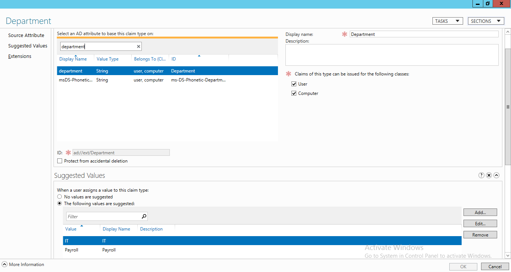

    Figure 51. Setting Suggested Values for the claim

7. Repeat steps 2 through 5 to add another claim based on the **countryCode** attribute, and set the associated Suggested Values to **156**, **840**, and **392**.

    <a name="fig.52"></a>

    

    Figure 52. Creating another claim based on the countryCode attribute

###### <a name="5.3.9.8.2"/> 5.3.9.8.2  Create Central Access Rules

To create central access rules, perform the steps that follow.

1. In **Server Manager** -> **Dashboard**, click the **Tools** drop-down in the upper-right corner of the management dashboard and then click **Active Directory Administrative Center** in the drop-down list that displays.

    <a name="fig.53"></a>

    

    Figure 53. Server Manager dashboard

2. In the **Active Directory Administrative Center** interface, select **Dynamic Access Control**, then select **Central Access Rules**.

3. In the **Tasks** pane on the right side of the **Active Directory Administrative Center** interface, click **New** and then click **Central Access Rule**.

    <a name="fig.54"></a>

    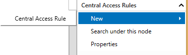

    Figure 54. Central Access Rule configuration

4. In the **Name** textbox on the **General** tab of the **Create Central Access Rule** dialog, type `CountryCodeEquals156Rule`.

    <a name="fig.55"></a>

    

    Figure 55. Creating the **CountryCodeEquals156Rule** access rule

5. On the **Permission**s tab of the **Create Central Access Rule** dialog, click **Edit**.

    <a name="fig.56"></a>

    

    Figure 56. Navigating to Advanced Security Settings for Permissions

6. In the **Advanced Security Settings for Permissions** dialog, click **Add**.

    <a name="fig.57"></a>

    

    Figure 57. Adding a new permission entry

7. In the **Permission Entry for Permissions** dialog, click **Select a principal**.

    <a name="fig.58"></a>

    

    Figure 58. Adding a principal for the permission entry

8. Type `Authenticated Users` in the object name textbox, click **Check Names**, and then click **OK**.

    <a name="fig.59"></a>

    

    Figure 59. Selecting the Authenticated Users object for permissions configuration

9. In the **Permission Entry for Permissions** dialog, select **Full Control** under Basic permissions, click **Add a condition** in the lower pane of the dialog, and then specify the the conditions configuration indicated in the figure below for **CountryCode Equals 156**. Click **OK** when finished.

    <a name="fig.60"></a>

    

    Figure 60. Configuring permissions for the Authenticated Users group

10. On the **Permissions** tab of the **Create Central Access Rule** dialog, click **OK**.

    <a name="fig.61"></a>

    

    Figure 61. Completing permissions configuration for the **CountryCodeEquals156Rule** access rule

11. Repeat steps 2 through 10 to create the remaining 9 rules, as specified in the figure that follows.

    <a name="fig.62"></a>

    

    Figure 62. Central Access Rule list

    The conditions configuration for the remaining 9 rules are as follows:

      * **CountryCodeAnyOf156Or840Rule**: **User.CountryCode Any of {156,840}**

      * **CountryCodeEquals156AndITDepartmentRule**: **(User.CountryCode Equals 156) And (User.Department Equals "IT")**

      * **CountryCodeEquals156OrITDepartmentRule**: **(User.CountryCode Equals 156) Or (User.Department Equals "IT")**

      * **CountryCodeGreaterThan392Rule**: **User.CountryCode Greater than 392**

      * **CountryCodeGreaterThanOrEquals392Rule**: **User.CountryCode Greater than or equal to 392**

      * **CountryCodeLessThan392Rule**: **User.CountryCode Less than 392**

      * **CountryCodeLessThanOrEquals392Rule**: **User.CountryCode Less than or equal to 392**

      * **CountryCodeNotAnyOf156Or840Rule**: **User.CountryCode Not any of {156, 840}**

      * **CountryCodeNotEquals156Rule**: **User.CountryCode Not equals 156**

###### <a name="5.3.9.8.3"/> 5.3.9.8.3 Create Central Access Policies

1. Navigate to **Server Manager** -> **Tools** -> **Active Directory Administrative Center** -> **Dynamic Access Control** -> **Create Central Access Policies**.

    <a name="fig.63"></a>

    

    Figure 63. Starting to create a new Central Access Policy rule

2. In the right-hand pane of the **Create Central Access Policies** dialog shown in the figure that follows, click the **Tasks** drop-down and select **New** -> **Central Access Policy**.

    <a name="fig.64"></a>

    

    Figure 64. Starting configuration of a new Central Access Policy rule

3. In the **Name** textbox of the **Create Central Access Policy** dialog, type `CountryCodeEquals156Policy` and then click **Add** to enable selection of the CountryCodeEquals156Policy rule in the treeview of the **Add Central Access Rules** dialog.

4. In the **Add Central Access Rules** dialog, highlight the **CountryCodeEquals156Rule** in the right-side tree view, and then click the left-pointing transfer button.

5. When complete, click **OK** in the **Add Central Access Rules** dialog.

    <a name="fig.65"></a>

    

    Figure 65. Adding the Central Access Policy Rule to the configuration

6. Click **OK** in the **Create Central Access Policy** dialog to complete the configuration.

    <a name="fig.66"></a>

    

    Figure 66. Completing the Central Access Policy Rules configuration

7. Repeat steps 2 through 6 to add the remainder of the 9 policies shown in the figure that follows.

    <a name="fig.67"></a>

    

    Figure 67. Central Access Policy Rules list

###### <a name="5.3.9.8.4"/> 5.3.9.8.4 Create Users

To create user accounts in Active Directory, perform the steps that follow.

1. Navigate to **Server Manager** -> **Tools** -> **ADSI Edit** or type `adsiedit.msc` in the **Run** dialog to open the ADSI Edit management console.

    <a name="fig.68"></a>

    

    Figure 68. Opening the ADSI Edit management console

2. In the right-hand pane of the ADSI Edit console, right-click **ADSI Edit** and select **Connect to** in the context menu that displays.

    <a name="fig.69"></a>

    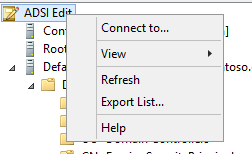

    Figure 69. Opening the Connection Settings dialog

3. While using the defaults in the **Connection Settings** dialog, click **OK**.

    <a name="fig.70"></a>

    

    Figure 70. Connection Settings dialog

4. In the ADSI Edit console, expand **Default naming context** -> **DC=contoso,DC=com**, right-click **CN=Users**, and then select **New** -> **Object** in the context menus that display.

    <a name="fig.71"></a>

    

    Figure 71. Configuring a new user

5. In the **Create Object** dialog, select **user** and then click **Next** to create a user object.

    <a name="fig.72"></a>

    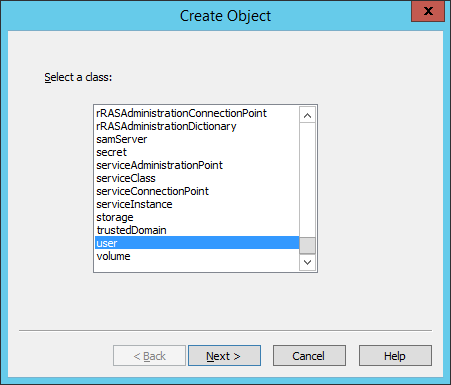

    Figure 72. Creating a new user object

6. In the **Value** text box of the **Create Object** dialog, type `ITadmin01` for the cn attribute and then click **Next**.

    <a name="fig.73"></a>

    

    Figure 73. Specifying the container name

7. In the **Value** text box of the **Create Object** dialog, type `ITadmin01` for the **sAMAccountName** attribute, and then click **Next**.

    <a name="fig.74"></a>

    

    Figure 74. Configuring the sAMAccountName

8. When object configuration is complete, click **Finish**.

    <a name="fig.75"></a>

    

    Figure 75. Completing the Create Object dialog

9. In the ADSI MMC, right-click the newly created user object **CN=ITadmin01** and then select **Properties** in the context menu that displays.

    <a name="fig.76"></a>

    

    Figure 76. Opening the CN=ITadmin01 Properties dialog

10. On the **Attribute Editor** tab of the **CN=ITadmin01** **Properties** dialog, select **countryCode** in the **Attributes** list, click **Edit**, and then type `156` in the **Integer Attribute Editor** dialog. When complete, click **OK**.

    <a name="fig.77"></a>

    

    Figure 77. Configuring the **countryCode** value

11. On the **Attribute Editor** tab of the **CN=ITadmin01** **Properties** dialog, select **department** in the **Attributes** list, click **Edit**, and then type `IT` in the **String Attribute Editor** dialog. When complete, click **OK**.

    <a name="fig.78"></a>

    

    Figure 78. Specifying the **department** value

12. Repeat steps 4 through 11 to configure the additional users and associated attributes indicated in the table that follows.

    <a name="table.9"></a>

    **Table 9. Department and countryCode values**

    | user                | department | countryCode |
    |---------------------|------------|-------------|
    | **ITmember01**      | IT         | 392         |
    | **Payrollmember01** | Payroll    | 156         |
    | **Payrollmember02** | Payroll    | 840         |
    | **Payrollmember03** | Payroll    | 392         |

###### <a name="5.3.9.8.5"/> 5.3.9.8.5 Apply Central Access Policies

To apply central access policies, perform the steps that follow.

1. From the **Start** menu, open the **Run** dialog and type `gpme.msc`. to start the **Group Policy Management Editor** console.

2. In the **Browse for a Group Policy Object** dialog that displays, select **Default Domain Policy** and then click **OK**.

    <a name="fig.79"></a>

    

    Figure 79. Selecting the Default Domain Policy in the Browse for a Group Policy Object dialog

3. In the left pane of the **Group Policy Management Editor** console that displays, navigate to **Computer Configuration** -> **Policies** -> **Windows Settings** -> **Security Settings** -> **File System** -> **Central Access Policy**.

    <a name="fig.80"></a>

    

    Figure 80. Selecting the Central Access Policy node in the Group Policy management console

4. Right-click the **Central Access Policy** node and select **Manage Central Access Policies...** in the context menu that displays.

    <a name="fig.81"></a>

    

    Figure 81. Opening the Central Access Policies Configuration dialog

5. In the **Central Access Policies Configuration** dialog, select all 10 rules that you created in section [5.3.9.8.2 Create Central Access Rules](#5.3.9.8.2), click Add, and then click OK.

    <a name="fig.82"></a>

    

    Figure 82. Central Access Policy rule selection

6. Open a command shell with Administrative privileges and update group policies first on **DC01**, and then on **Node01** by executing the following command:

    ```
      gpupdate /force
    ```

    Optionally, start Windows PowerShell (x86) from **%SystemRoot%\\syswow64\WindowsPowerShell\\v1.0\\** with Administrator privileges and execute the same command.

#### <a name="5.3.10"/> 5.3.10 Setup Distributed File System (DFS)

##### <a name="5.3.10.1"/> 5.3.10.1 Install Roles and Features for DFS

To install Roles and Features for DFS, perform the steps that follow.

1. In **Server Manager** -> **Dashboard**, click **Manage** in the upper-right sector of the management dashboard and then click **Add Roles and Features** in the drop-down list that displays.

    <a name="fig.83"></a>

    

    Figure 83. Server Manager Dashboard: Installing DFS Roles and Features

2. In the **Add Roles and Feature Wizard**, click **Next** repeatedly until the **Select server roles** page displays, while ensuring that the default selections on the **Installation Type** and **Server Selection** pages of the wizard appear valid.

3. In the **Roles** treeview of the **Add Roles and Feature Wizard**, expand the **File And Storage Services** node, expand the **File and iSCSI Services** node, and then select the **DFS Namespaces** checkbox to display the **Add features that are required for DFS Namespaces** dialog.

    <a name="fig.84"></a>

    

    Figure 84. Add Roles and Features Wizard: Selecting the DFS Namespaces checkbox

4. In the **Add features that are required for DFS Namespaces** dialog that displays in the **Add Roles and Features Wizard**, click **Add Features** to install the **DFS Management Tools**.

    <a name="fig.85"></a>

    

    Figure 85. Adding the features required for DFS Namespaces

5. Click **Next** repeatedly until the **Confirm instllation selections** page of the wizard displays, while accepting any default selections, and then verify the installation components.

6. When ready, click **Install** to start the installation. When the installation completes, click **Close**.

  <a name="fig.86"></a>

  

  Figure 86. Confirming installation selections for DFS Namespaces feature

##### <a name="5.3.10.2"/> 5.3.10.2 Create a share named FileShare

To create a share named FileShare, perform the steps that follow.

1. Create a folder named **FileShare** in the path **%SystemDrive%\FileShare** on the Node02 computer, that is, if you have a Node02 computer in your **DOMAIN** environment. Otherwise, proceed to step 3 for the Node01 computer in the **WORKGROUP** environment.

2. Share the **FileShare** folder with **Read/Write** permissions to the **CONTOSO\Administrator**. Skip steps 3 and 4.

3. If you do not have a Node02 computer in your environment, create a folder named **FileShare** in the path **%SystemDrive%\FileShare** on the SUT (Node01) computer in the **WORKGROUP** environment.

4. Share the **FileShare** folder with **Read/Write** permissions to the **Node01\Administrator** account for the **WORKGROUP** environment (or to the **CONTOSO\Administrator** if in the **DOMAIN** environment).

    For further details, see section [5.3.1 Create a share](#5.3.1).

##### <a name="5.3.10.3"/> 5.3.10.3 Create DFS name spaces

###### <a name="5.3.10.3.1"/> 5.3.10.3.1 Create Stand-alone namespace: SMBDfs

To create a stand-alone DFS namespace, perform the steps that follow.

1. In **Server Manager** -> **Dashboard**, click the **Tools** drop-down in the upper-right sector of the management dashboard, and then click **DFS Management** to start the  **DFS Management** console on the SUT (Node01) computer.

    <a name="fig.87"></a>

    

    Figure 87. Server Manager Dashboard: Selecting DFS Management in the Tools menu

2. In the left pane of the **DFS Management** console, right-click the **Namespaces** node and then select **New Namespace...** in the context menu that displays.

    <a name="fig.88"></a>

    

    Figure 88. DFS Management console: Creating a new Namespace

3. On the **Namespace server** tab of the **New Namespace Wizard**, type `Node01` (or `Node02` if appropriate) in the **Server** textbox to specify the server name where the namespace is to be hosted. When complete, click **Next**.

    <a name="fig.89"></a>

    

    Figure 89. New Namespace Wizard: Specifying the Server name to host the Namespace

4. On the **Namespace Name and Settings** tab of the **New Namespace Wizard**, type `SMBDfs` in the **Name** textbox to specify the name of the namespace. When complete, click the **Edit Settings...** button to display the Edit Settings dialog from where you can create access permission settings.

    <a name="fig.90"></a>

    

    Figure 90. New Namespace Wizard: Specifying the Namespace name

5. In the **Edit Settings** dialog, under **Shared folder permissions**, select the option **Administrators have full access; other users have read-only permissions**, and click **OK**. When complete, click **Next**.

    <a name="fig.91"></a>

    

    Figure 91. Edit Settings dialog: Setting Shared folder permissions

6. On the **Namespace Type** tab of the **New Namespace Wizard**, select the **Stand-alone namespace** type and then click **Next**.

    <a name="fig.92"></a>

    

    Figure 92. New Namespace Wizard: Specifying the Namespace Type as Stand-Alone

7. From the **Review Settings and Create Namespace** page of the **New Namespace Wizard**, click **Create**. When processing is finished, click **Close** to complete the wizard.

    <a name="fig.93"></a>

    

    Figure 93. New Namespace Wizard: Reviewing Settings and Creating the SMBDfs Namespace

###### <a name="5.3.10.3.2"/> 5.3.10.3.2 Create the Stand-alone namespace: Standalone

To create a stand-alone namespace named Standalone, perform the indicated step that follows.

1. Repeat steps 2 through 7 in section [5.3.10.3.1 Create Stand-alone namespace: SMBDfs](#5.3.10.3.1), to create another stand-alone namespace with the name **Standalone**.

###### <a name="5.3.10.3.3"/> 5.3.10.3.3 Create Domain-based namespace: DomainBased (DOMAIN Environment Only)

To create a stand-alone namespace named **DomainBased**, perform the steps that follow.

1. Repeat steps 1 to 5 in section [5.3.10.3.1 Create Stand-alone namespace: SMBDfs](#5.3.10.3.1) to create a Domainbased namespace with the name **DomainBased**.

2. Thereafter, on the **Namespace Type** tab of the **New Namespace Wizard**, select **Domain-based namespace** and then click **Next**.

    <a name="fig.94"></a>

    

    Figure 94. New Namespace Wizard: Specifying the Namespace Type for the **DomainBased** Namespace

3. From the **Review Settings and Create Namespace** page of the **New Namespace Wizard**, click **Create**. When processing is finished, click **Close** to complete the wizard.

    <a name="fig.95"></a>

    

    Figure 95. New Namespace Wizard: Reviewing Settings and Creating the **DomainBased** Namespace

##### <a name="5.3.10.4"/> 5.3.10.4 Create DFS Link for the Namespaces

###### <a name="5.3.10.4.1"/> 5.3.10.4.1 Add Folder SMBDfsLink to Namespace SMBDfs

To add the folder SMBDfsLink to the SMBSDfs namespace, perform the steps that follow.

1. In the **DFS Management** console, as described in section [5.3.10.3.1 Create Stand-alone namespace: SMBDfs](#5.3.10.3.1), right-click the newly created namespace **\\\\Node01\\\SMBDfs** and then click **New Folder...** in the context menu that displays to add a new folder to this share.

    <a name="fig.96"></a>

    

    Figure 96. DFS Management console: Creating a New Folder in the SMBDfs Namespace

2. In the **Name** textbox of the **New Folder** dialog, type `SMBDfsLink` to specify the new folder name and then click **Add...** to display the **Add Folder Target** dialog, from where you will add the path to the folder target.

    <a name="fig.97"></a>

    

    Figure 97. New Folder dialog: Adding an SMBDfsLink Folder to the SMBDfs Namespace

3. In the **Path to folder target** textbox of the **Add Folder Target** dialog, type `\\Node02\FileShare` and then click OK.

    If the **Node02** computer does not exist in your environment, set the folder target to **\\\\Node01\\FileShare**. Note that the **FileShare** folder will be located on the **Node02** computer, only if you are testing a cluster configuration. For more information, see [Figure 2](#fig.2) in section [4.2 Domain Environment](#4.2) and section [5.3.10.2 Create a share named FileShare](#5.3.10.2).

    <a name="fig.98"></a>

    

    Figure 98. Add Folder Target dialog: Specifying FileShare as the Folder Target

4. In the **Browse for Shared Folders** dialog, select **FileShare** in the Shared folders listview and then click **OK**.

    <a name="fig.99"></a>

    

    Figure 99. Browse for Shared Folders dialog: Selecting the FileShare shared folder

5. When complete, click **OK** in the **New Folder** dialog.

###### <a name="5.3.10.4.2"/> 5.3.10.4.2 Add Two Folders to Standalone Namespace

To add two folders to the Standalone namespace, perform the steps that follow.

1. In the **DFS Management** console, right-click the newly created namespace **\\\\Node01\\Standalone** and then click **New Folder...** in the context menu that displays.

    <a name="fig.100"></a>

    

    Figure 100. DFS Management console: Creating a New Folder in the Standalone Namespace

2. In the **Name** textbox of the **New Folder** dialog, type `DFSLink` to specify the new folder name, and then click **Add...** to display the **Add Folder Target** dialog, from where you will add the path to the folder target.

    <a name="fig.101"></a>

    

    Figure 101. New Folder dialog: Creating a DFSLink folder in the Standalone Namespace

3. In the **Path to folder target** textbox, type `\\Node02\FileShare` in the **Add Folder Target** dialog. When complete, click **OK** and then click **OK** again in the **New Folder** dialog.

    If the **Node02** computer does not exist in your environment, set the folder target to **\\\\Node01\\FileShare**. Note that the **FileShare** folder will be located on the **Node02** computer, only if you are testing a cluster configuration. For more information, see [Figure 2](#fig.2) in section [4.2 Domain Environment](#4.2) and section [5.3.10.2 Create a share named FileShare](#5.3.10.2).

    <a name="fig.102"></a>

    

    Figure 102. Add Folder Target dialog: Specifying the path to the folder target

4. Repeat step 1 and then in the **Name** textbox of the **New Folder** dialog, type `Interlink` to specify the new folder name. When complete, click **Add...** to display the **Add Folder Target** dialog, from where you will add the path to the next folder target.

    <a name="fig.103"></a>

    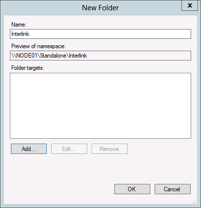

    Figure 103. New Folder dialog: Adding the Interlink folder to the Standalone Namespace

5. In the **Path to folder target** textbox of the **Add Folder Target** dialog, type `\\Node01\SMBDfs\SMBDfsLink`. When complete, click **OK** and then click **OK** again in the **New Folder** dialog.

    <a name="fig.104"></a>

    

    Figure 104. Add Folder Target dialog: Specifying the folder target path for the Interlink folder

6. In the **DFS Management** console, verify the presence of the two newly created folders under the **Standalone** namespace.

    <a name="fig.105"></a>

    

    Figure 105. DFS Management console: Verifying the new Standalone Namespace folders

###### <a name="5.3.10.4.3"/> 5.3.10.4.3 Add Two Folders to the Namespace: DomainBased (DOMAIN Environment Only)

To add two new folders to the **DomainBased** namespace, perform the steps that follow.

1. In the **DFS Management** console, right-click the newly created namespace **\\\\contoso.com\\DomainBased** and then click **New Folder...** in the context menu that displays, in order to display the **New Folder** dialog.

    <a name="fig.106"></a>

    

    Figure 106. DFS Management console: Creating a new folder in the **DomainBased** Namespace

2. In the **Name** textbox of the **New Folder** dialog, type `DFSLink` to specify the new folder name and then click **Add...** to display the **Add Folder Target** dialog, from  where you can specify the path to the folder target.

    <a name="fig.107"></a>

    

    Figure 107. New Folder dialog: Naming the "DFSLink" folder

3. In the **Path to folder target** textbox of the **Add Folder Target** dialog, type `\\Node02\FileShare`. When complete, click **OK**.

    If the **Node02** computer does not exist in your environment, set the target to **\\\\Node01\\FileShare**. Note that the **FileShare** folder will be located on the **Node02** computer, only if you are testing a cluster configuration. For more information, see [Figure 2](#fig.2) in section [4.2 Domain Environment](#4.2) and section [5.3.10.2 Create a share named FileShare](#5.3.10.2).

    <a name="fig.108"></a>

    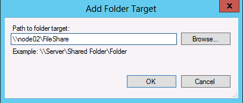

    Figure 108. Add Folder Target: Specifying the folder target for the DFSLink folder

4. Repeat step 1 of this procedure.

5. In **Name** textbox of the **New Folder** dialog, type `Interlink` to specify the new folder name and then click **Add...** to display the **Add Folder Target** dialog from where you can specify the path to the folder target.

    <a name="fig.109"></a>

    

    Figure 109. New Folder dialog: Naming the "Interlink" folder

6. In the **Path to folder target** textbox of the **Add Folder Target** dialog, type `\\Node01\SMBDfs\SMBDfsLink` and then click the **Browse...** button. When complete, click OK.

    <a name="fig.110"></a>

    

    Figure 110. Add Folder Target: Specifying the folder target for the Interlink folder

7. In the **DFS Management** console, verify the presence of the two newly created folders under the **DomainBased** namespace.

    <a name="fig.111"></a>

    

    Figure 111. DFS Management console: Verifying the new DFSLink and Interlink folders

#### <a name="5.3.11"/> 5.3.11 Setup SAN Storage Server

This section describes how to set up a storage area network (SAN) storage server for use with this Test Suite.

> **Note**
>
> Do not join the SAN Storage Server to the domain provided by the DC.

##### <a name="5.3.11.1"/> 5.3.11.1 Install iSCSI Target

To install the **File Server** and **iSCSI Target Server** roles on the Storage01 computer, perform the steps that follow.

1. From the **Manage** drop-down in **Server Manager**, click the **Add Roles and Features** list item.

    <a name="fig.112"></a>

    

    Figure 112. Server Manager: Launching the Add Roles and Features Wizard

2. In the **Add Roles and Features Wizard**, repeatedly click the **Next** button while accepting all the default settings, until the **Select server roles** page of the wizard is displayed.

3. Expand the **File And Storage Services** node and select the **File Server** and **iSCSI Target Server** checkboxes to install these roles on the destination **Storage01** computer. When complete, click **Next**.

    <a name="fig.113"></a>

    

    Figure 113. Add Roles and Features Wizard:  Adding the File Server and iSCSI Target Server roles

4. Click the **Add Features** button in the **Add features that are required for iSCSI Target Server?** page of the wizard to confirm addition of the required features.

    <a name="fig.114"></a>

    

    Figure 114. Add Roles and Features Wizard: Adding the File Server feature

5. In the **Add Roles and Features Wizard**, repeatedly click **Next** while accepting any default settings, until the **Confirm installation selections** page of the wizard displays. When confirmation is complete, click **Install**.

    <a name="fig.115"></a>

    

    Figure 115. Add Roles and Features Wizard: Confirming roles for installation

##### <a name="5.3.11.2"/> 5.3.11.2 Create Virtual Disks for Failover Cluster Nodes

To create virtual disks for the failover cluster node, perform the steps that follow.

**Note**

This procedure should be performed only after installing the iSCSI target via section [5.3.11.1 Install iSCSI Target](#5.3.11.1).

1. Navigate to **Server Manager** -> **File and Storage Services** -> **iSCSI Virtual Disks** and then click **Launch the New Virtual Disk wizard to create a virtual disk**.

    <a name="fig.116"></a>

    

    Figure 116. Server Manager: Launching the New iSCSI Virtual Disk Wizard

2. In the **New iSCSI Virtual Disk Wizard**, select either the **Select by volume** or **Type a custom path** option under **Storage location**: for the location of the new virtual disk. When complete, click **Next**.

    <a name="fig.117"></a>

    

    Figure 117. New iSCSI Virtual Disk Wizard: Choosing the disk storage location

3. On the **Virtual Disk Name** tab of the New iSCSI Virtual Disk Wizard, type the virtual disk name `QuorumDisk` in the **Name** textbox.

    <a name="fig.118"></a>

    

    Figure 118. New iSCSI Virtual Disk Wizard: Specifying the iSCSI virtual disk name

4. On the **Virtual Disk Size** tab of the New iSCSI Virtual Disk Wizard, configure the virtual disk size as 1GB by typing `1` in the **Size** textbox and selecting **GB** in the associated drop-down.

    <a name="fig.119"></a>

    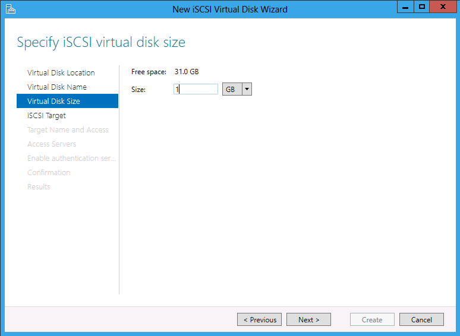

    Figure 119. New iSCSI Virtual Disk Wizard: Specifying the iSCSI virtual disk size

5. On the **iSCSI Target** tab of the **New iSCSI Virtual Disk Wizard**, select the **New iSCSI target** option for failover cluster node access.

    <a name="fig.120"></a>

    

    Figure 120. New iSCSI Virtual Disk Wizard: Specifying the New iSCSI target

6. On the **Target Name and Access** tab of the wizard, type `TargetForCluster01` in the **Name** textbox as the iSCSI target.

    <a name="fig.121"></a>

    

    Figure 124. New iSCSI Virtual Disk Wizard: Specifying the iSCSI target Name

7. On the **Access Servers** tab of the wizard, click **Add** to display the **Add initiator ID** dialog, from where you can specify the iSCSI initiators of the Failover Cluster node that will access the iSCSI virtual disk and target.

    <a name="fig.122"></a>

    

    Figure 122. New iSCSI Virtual Disk Wizard: displaying the Add Initiator ID dialog

8. There are several ways to provide target access to a specific machine, as follows.

    * If the **Select from the initiator cache on the target server** option is available and the list is populated, select the iSCSI Qualified Names (IQNs) of failover cluster nodes from the list.

    * If the **Enter a value for the selected type** option is selected and a type appears in the **Type** drop-down, specify one or more values for the iSCSI initiators of failover cluster nodes in the **Value** textbox. In this example, an **IP Address** type is used.

    When complete, click **OK** to return to the **Access Servers** tab in the wizard.

    **Note**

    If you wish to add another value, repeat steps 7 and 8.

    <a name="fig.123"></a>

    

    Figure 123. New iSCSI Virtual Disk Wizard: Specifying target access to a specific machine

    <a name="fig.124"></a>

    

    Figure 124. New iSCSI Virtual Disk Wizard: Specifying iSCSI initiators to access iSCSI virtual disk

9. Repeatedly click **Next** while accepting any existing default settings until the **Confirm selections** page of the wizard displays.

10. Verify correctness of the settings specified on the **Confirmation** tab and then click **Create** to complete the wizard.

    <a name="fig.125"></a>

    

    Figure 125. New iSCSI Virtual Disk Wizard: Confirming iSCSI settings

11. After creating the first virtual disk, create one or more additional virtual disks by right-clicking the white space in the **iSCSI VIRTUAL DISKS** listview and selecting **New iSCSI Virtual Disk...** in the context menu that displays; this action launches the **New iSCSI Virtual Disk Wizard** again.

    <a name="fig.126"></a>

    

    Figure 126. New iSCSI Virtual Disk Wizard: Creating a new iSCSI virtual disk

12. Repeat steps 2 through 5 and 7 through 10 to create additional virtual disks as shared storage for the failover cluster to use. As you are performing step 5 in the specified range, ensure that you do the following:

    * From the **iSCSI Target** tab of the **Assign iSCSI target** page of the wizard, select the **Existing iSCSI target** option which specifies the **targetforcluster01** created in section [5.3.11.1 Install iSCSI Target](#5.3.11.1), as shown in the following figure.

    * When complete, click **Next**.

    <a name="fig.127"></a>

    

    Figure 127. New iSCSI Virtual Disk Wizard: Specifying an existing iSCSI target

13. Using the disk name and size properties that are recommended for this **Test Suite**, as specified in the table that follows, create new virtual storage disks **FSDisk01** and **FSDisk02** for the failover cluster.

    <a name="table.10"></a>

    **Table 10. New virtual storage disks**

    | Disk Name     | Size     | Purpose                                                                        |
    |---------------|----------|--------------------------------------------------------------------------------|
    | Quorumdisk    | 1 GB     | Quorum disk for a two-node cluster                                             |
    | FSDisk01      | 10 GB    | Storage used by file server for general use on failover cluster                |
    | FSDisk02      | 10 GB    | Storage used by file server for scale-out application data on failover cluster |

    **Note**

    After you finish creating the iSCSI virtual disks **FSDisk01** and **FSDisk02** for the failover cluster, you can correlate the iSCSI target names with additional details in Server Manager, as shown in the figure that follows, by selecting any one of the virtual disks in the listview.

    <a name="fig.128"></a>

    

    Figure 128. Server Manager: iSCSI targets for Storage01

#### <a name="5.3.12"/> 5.3.12 Set up a Cluster

##### <a name="5.3.12.1"/> 5.3.12.1 Connect to the iSCSI Disks Provided by the SAN Storage Server From two Nodes

To establish a connection to iSCSI disks from failover cluster nodes, perform the steps that follow.

1. From the **Tools** drop-down of **Server Manager** on each failover cluster node (i.e., **Node01** and **Node02**), click **iSCSI Initiator** and then click **Yes** in the **Microsoft iSCSI** dialog to start the **Microsoft® iSCSI service**.

    <a name="fig.129"></a>

    

    

    Figure 129. Server Manager: iSCSI Initiator and iSCSI Service startup

2. From the **Discovery** tab of the **iSCSI Initiator Properties** dialog, click **Discover Portal...** to display the Discover Target Portal dialog from where you can add the **IP address** of the SAN storage server to the **IP address or DNS name** textbox. When complete, click **OK** to exit the **Discover Target Portal** dialog.

    <a name="fig.130"></a>

    

    Figure 130. iSCSI Initiator Properties dialog : Opening the Discover Portal dialog

    <a name="fig.131"></a>

    

    Figure 131. iSCSI Initiator Properties dialog : Specifying the IP address of the SAN storage server

3. From the **Targets** tab of the **iSCSI Initiator Properties** dialog, click **Refresh**, click **Connect**, and then click **OK** in the **Connect to Target** dialog that displays.

    <a name="fig.132"></a>

    

    Figure 132. iSCSI Initiator Properties dialog: Connecting to the Target

4. On either the Failover Cluster **Node01** or **Node02** computer, open the **Run** dialog from the Windows **Start** menu and type `diskmgmt.msc` to launch the **Disk Management** console shown ahead in [Figure 132](#fig.132).

5. Verify that  **Disk 1**, **Disk 2**, and **Disk 3** that you created earlier all appear in the lower sector of the **Disk Management** console.

    In the steps that follow, you will set these disks to online status and then initiatialize them as either **Master Boot Record (MBR)** or **GUID Partition Table (GPT)** disks. You are then required to create them as simple volumes with **NTFS** formatting.

    <a name="fig.133"></a>

    

    Figure 133. Disk Management console: Disk verification

6. Right-click the **Disk 1** identifier pane and then select **Online** in the context menu that displays.

7. In the next context menu that appears, select the **Initialize Disk** item.

    <a name="fig.134"></a>

    

    Figure 134. Disk Management console: Disk initialization

8. In the **Initialize Disk** dialog, select either **MBR** or **GPT** and then click OK.

    <a name="fig.135"></a>

    

    Figure 135. Disk Management console: Initialize Disk dialog

9. In the **Disk Management** console. rightclick the **Unallocated** space panel and select **New Simple Volume...** in the context menu that displays.

    <a name="fig.136"></a>

    

    Figure 136. Disk Management console: Displaying the New Simple Volume Wizard

10. In the **New Simple Volume Wizard** that displays, click **Next**.

    <a name="fig.137"></a>

    

    Figure 137. Disk Management console: New Simple Volume Wizard

11. Repeatedly click **Next**, while accepting all the default settings, until the **Completing the New Simple Volume Wizard** page displays.

12. Click **Finish** to exit the wizard.

    <a name="fig.138"></a>

    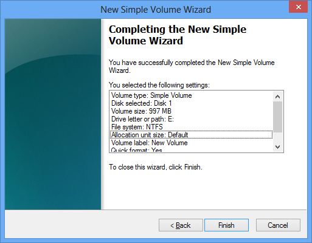

    Figure 141. New Simple Volume Wizard: Completing the wizard

13. Repeat steps 5 through 11 for **Disk 2** and **Disk 3**.

##### <a name="5.3.12.2"/> 5.3.12.2 Install Roles and Features on Each Failover Cluster Node

To install **Roles** and other **Features** on the Failover Cluster **Node01** and **Node02** computers, perform the steps that follow.

1. Logon to both the **Node01** and **Node02** computers with a domain account and perform the steps that follow on both computers.

2. In **Server Manager**, click **Add Roles and Features** in the right-hand pane to start the **Add Roles and Features Wizard**.

3. On the **Server Roles** tab of the **Add Roles and Features Wizard** under **File And Storage Services**, select the **File Server**, **File Server Resource Manager**, and **File Server VSS Agent Service** check boxes.

    <a name="fig.139"></a>

    

    Figure 139. Add Roles and Features Wizard: Configuring File and Storage services

4. On the **Features** tab of the **Add Roles and Features Wizard**, select the **Failover Clustering** check box. When complete, click **Next**.

    <a name="fig.140"></a>

    

    Figure 140. Add Roles and Features Wizard: Selecting the Failover Clustering check box

5. Click **Add Features** in the **Add features that are required for Failover Clustering** page of the wizard.

    <a name="fig.141"></a>

    

    Figure 141. Add Roles and Features Wizard: Add Features required for Failover Clustering

6. When the **Confirmation** tab of the wizard appears, click **Install** to complete the configuration.

##### <a name="5.3.12.3"/> 5.3.12.3 Create Failover Cluster in Either Node

To create a Failover Cluster on the **Node01** or **Node02** computer, perform the steps that follow.

1. Logon to the Failover Cluster **Node01** computer using a domain account that has permissions to create Active Directory computer objects.

2. In **Server Manager**, click the **Tools** drop-down, and then select the **Failover Cluster Manager** list item to open the **Failover Cluster Manager** console.

3. In **Server Manager**, click **Create Cluster...** to open the **Create Cluster Wizard**, from where you can create a cluster configuration comprising the **Node01** and **Node02** computers.

    **Important**

    Before creating the cluster configuration, ensure that shared storage has been created/added to the failover cluster **Node01** and **Node02** computers. For more information,  see section [5.3.11 Set up the SAN Storage Server](#5.3.11).

    <a name="fig.142"></a>

    

    Figure 142. Server Manager: Launching the Create Cluster Wizard

4. On the **Select Servers** tab of the **Create Cluster Wizard**, type the name of the Failover Cluster `Node01` computer in the **Enter server name** textbox and then click the **Add** button to add the server name to the **Selected servers** list.

    <a name="fig.143"></a>

    

    Figure 143. Create Cluster Wizard: Adding servers to the cluster

5. On the **Validation Warning** tab of the **Create Cluster Wizard**, optionally select **Yes** if you want cluster configuration validation tests to run automatically. Select **No** to skip these tests. When complete, click Next to continue the wizard.

    <a name="fig.144"></a>

    

    Figure 144. Create Cluster Wizard: Setting up for running configuration validation tests

6. On the **Access Point for Administering the Cluster** tab of the **Create Cluster Wizard**, type `Cluster01` in the **Cluster Name** textbox and specify the IP addresses of the cluster if the cluster nodes are using static IP addresses in a subnet (for example, `192.168.1.100` and `192.168.2.100`).  When complete, click **Next**.

    <a name="fig.145"></a>

    

    Figure 145. Create Cluster Wizard : Naming the Cluster access point

7. On the **Confirmation** tab of the **Create Cluster Wizard**, verify the correctness of the cluster configuration settings.  When complete, click **Next** to begin creating your cluster.

    <a name="fig.146"></a>

    

    Figure 146. Create Cluster Wizard: Verifying the cluster settings

8. Click Finish to exit the wizard.

    <a name="fig.147"></a>

    

    Figure 147. Create Cluster Wizard: Completing the Create Cluster Wizard

##### <a name="5.3.12.4"/> 5.3.12.4 Create File Server on Failover Cluster

To create a File Server on the failover cluster, perform the steps that follow.

1. From either the failover cluster **Node01** or **Node02** computer, open **Server Manager**, click the **Tools** drop-down, and then select the **Failover Cluster Manager** list item to open the **Failover Cluster Manager** console.

2. In the left pane of the **Failover Cluster Manager**, right-click **Roles** and then select **Configure Role...** in the context menu that displays.

    <a name="fig.148"></a>

    

    Figure 148. Failover Cluster Manager: Launching the High Availability Wizard to configure the File Server role

3. On the **Select Role** tab of the **High Availability Wizard**, select the File Server role and then click **Next**.

    <a name="fig.149"></a>

    

    Figure 149. High Availability Wizard: Selecting the File Server Role

4. On the **File Server Type** tab of the **High Availability Wizard**, select the **File Server for general use** option and then click **Next**.

    <a name="fig.150"></a>

    

    Figure 150. High Availability Wizard: Specifying the File Server Type

5. In the **Name** textbox on the **Client Access Point** tab of the **High Availability Wizard**, type `GeneralFS` as the access point name and then specify the IP addresses of the cluster role, that is, if the clustered role is using static IP addresses in a subnet (for example, `192.168.1.200` and `192.168.2.200`), and so on. When complete, click Next.

    <a name="fig.151"></a>

    

    Figure 151. High Availability Wizard: Specifying the client access point Name and cluster IP addresses

6. On the **Select Storage** tab of the **High Availability Wizard**, select a storage volume that you want to assign to the cluster. When complete click **Next**.

    <a name="fig.152"></a>

    

    Figure 152. High Availability Wizard: Specifying the storage volume for the clustered Role

7. Click **Next** repeatedly, while accepting the wizard default values, until the **Summary** tab of the **High Availability Wizard** displays and then click **Finish** to complete the wizard.

    <a name="fig.153"></a>

    

    Figure 153. High Availability Wizard: Completing the High Availability Wizard

8. To set up a File Server for the scale-out of application data, repeat the steps of this procedure with the following differences:

    * In step 4, select the **Scale-Out File Server for application data** option to create a File Server for the scale-out of application data.

        Click **Next** when complete.

    <a name="fig.154"></a>

    

    Figure 154. High Availability Wizard: Specifying the Scale-Out File Server option

    * In step 5, type `ScaleOutFS` in the **Name** textbox as the client access point name.

    <a name="fig.155"></a>

    

    Figure 155. High Availability Wizard: Naming the client access point as ScaleOutFS

##### <a name="5.3.12.5"/> 5.3.12.5 Add Scale-out Share Volume

To configure an Add Scale-out share volume, perform the steps that follow.

1. In the **Failover Cluster Manager**, click the **Storage** node in the left-hand pane of the console and then select  an existing **Cluster Disk** with the **Assigned To** property set to **Available Storage**.

2. Right-click the selected **Cluster Disk** and choose **Add to Cluster Shared Volumes** in the context menu that displays to create a file share on the File Server for the scale-out of application data.

    <a name="fig.156"></a>

    

    Figure 156. Failover Cluster Manager console: Adding a Cluster Disk to the Cluster Shared Volumes

##### <a name="5.3.12.6"/> 5.3.12.6 Create a File Share for the Cluster

To  create a file share on the File Server, perform the steps that follow.

1. In the left pane of the **Failover Cluster Manager**, select the **Roles** node in the console tree view and choose a server **Name** whose **Type** property is set to **File Server**, for example,  **GeneralFS** in the figure below.

2. Right-click the server **Name** and then select **Add Shared Folder** in the context menu that displays to create a file share on the File Server for general use.

    <a name="fig.157"></a>

    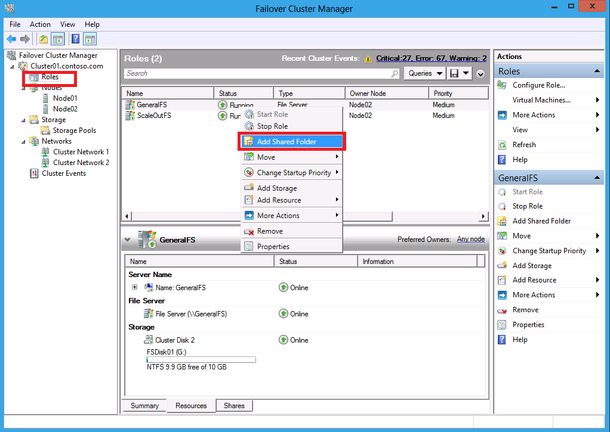

    Figure 157. Failover Cluster Manager: Launching the New Share Wizard to create a file share on the File Server

3. On the **Select Profile** tab of the **New Share Wizard**, select **SMB Share – Quick** in the **File share profile** list and then click **Next**.

    <a name="fig.158"></a>

    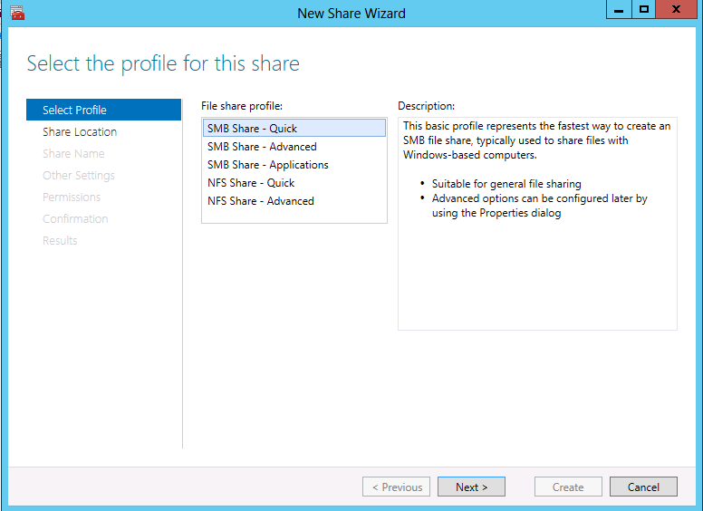

    Figure 158. New Share Wizard: Creating an SMB share with SMB Share – Quick

4. On the **Share Location** tab of the **New Share Wizard**, select the **Select by volume** option and then click **Next**.

    <a name="fig.159"></a>

    

    Figure 159. New Share Wizard: Specifying the Select by volume option

5. In the **Share name** textbox on the **Share Name** tab of the **New Share Wizard**, type `SMBClustered` for the share name and then click **Next**.

    <a name="fig.160"></a>

    

    Figure 160. New Share Wizard: Specifying the share name as **SMBClustered**

6. On the **Other Settings** tab of the **New Share Wizard**, select the **Enable continuous availability** and **Allow caching of share** options and then click **Next**.

    <a name="fig.161"></a>

    

    Figure 161. New Share Wizard: Configuring share settings

7. Grant **Full Control** to the account that will be used to access the file share, according to the steps that follow while using the figures that follow as a reference:

    * On the **Permissions** tab of the **New Share Wizard**, click the **Customize Permissions** button to display the **Advanced Security Settings for SMBClustered** dialog.

    * On the **Share** tab of the **Advanced Security Settings for SMBClustered** dialog, click the **Add** button to display the **Permission Entry for SMBClustered** dialog.

    * In the P**ermission Entry for SMBClustered** dialog, click the **Select a principal** link to display the **Select User, Computer, Service Account, or Group** dialog and then type the name of the account for which you want to specify permissions.

        Click **Check Names** if necessary and then click **OK** when complete.

    * On the **Confirmation** tab of the **New Share Wizard**, verify the correctness of the settings you made for the File Server and then click the **Create** button to begin the configuration process.

    * On the **Results** tab of the **New Share Wizard**, ensure that creating the SMB share and setting SMB permissions successfully completed and then **Close** the wizard.

    <a name="fig.162"></a>

    

    Figure 162. New Share Wizard: Customizing permissions

    <a name="fig.163"></a>

    

    Figure 163. New Share Wizard: displaying the Permission Entry for SMBClustered dialog

    <a name="fig.164"></a>

    

    Figure 164. New Share Wizard: Locating the account for which to specify permissions

    <a name="fig.165"></a>

    

    Figure 165. New Share Wizard: Configuring the Permissions levels

    <a name="fig.166"></a>

    

    Figure 166. New Share Wizard: Confirming the wizard settings

    <a name="fig.167"></a>

    

    Figure 167. New Share Wizard: Confirming the wizard results

    <a name="fig.168"></a>

8. Repeat steps 1 through 7 for the other Server named **ScaleOutFS**.

    

    Figure 168. New Share Wizard: Configuring a new share on the Scale-Out File Server

##### <a name="5.3.12.7"/> 5.3.12.7 Create a File Share with Oplock Force Level 2 Enabled for the Cluster

To create a file share with Oplock Force Level 2, perform the steps that follow.

1. Repeat the steps of the procedure in section [5.3.12.6 Create a file share for the cluster](#5.3.12.6), while making the following modification:

    * In step 5, type `SMBClusteredForceLevel2` in the **Share name** textbox on the **Share Name** tab of the **New Share Wizard**.

2. Enable **FORCE_LEVELII_OPLOCK** on this share.

    For further details, see section [5.3.7 Enable FORCE_LEVELII_OPLOCK on a share named ShareForceLevel2](#5.3.7).

##### <a name="5.3.12.8"/> 5.3.12.8 Create a File Share with Encrypt data Enabled for the Cluster

To create a file share with Encrypt data enabled, perform the steps that follow.

1. Repeat the steps of the procedure in section [5.3.12.6 and create a file share for the cluster](#5.3.12.6), while making the following modifications:

    * In step 5, type `SMBClusteredEncrypted` in the **Share name** textbox on the **Share Name** tab of the **New Share Wizard**.

    * In step 6, also include selection of the **Encrypt data access** option on the **Other Settings** tab of the **New Share Wizard**.

#### <a name="5.3.13"/> 5.3.13 Turn off Firewalls

To turn off the Firewall on the local computer, perform the steps that follow.

1. Start the command console window with Administrator privileges.

    For further details, see section [5.3.24 How to start the command console with Administrator privileges](#5.3.24).

2. Type the following command in the console window and then press **Enter** on the keyboard.

    ```
      netsh advfirewall set allprofiles state off
    ```

#### <a name="5.3.14"/> 5.3.14 Enable the Administrator Account

To enable the Administrator account, perform the step that follows.

**Note**

The Administrator account is enabled by default when Windows Server is the operating system, however, if it is disabled for some reason, you can enable it by using the procedure that follows.

1. If the SUT computer is running the Microsoft® Windows Server 2012 R2 or later operating system, enable a disabled built-in Administrator account by running the following command:

    ```
      net.exe user Administrator /active:yes
    ```

#### <a name="5.3.15"/> 5.3.15 Create a Local Non-Admin User Account

To create a local non-Administrator user account, perform the steps that follow.

1. Start the command console window with Administrator privileges.

    For further details, see section [5.3.24 How to start the command console with Administrator privileges](#5.3.24).

2. Type the following command in the command console window and then press **Enter** on the keyboard.

    ```
      net.exe user nonadmin Password01! /add
    ```

#### <a name="5.3.16"/> 5.3.16 Enable the Local Guest Account

To enable the local Guest account, perform the steps that follow.

1. Start the command console window with Administrator privileges.

    For further details, see section [5.3.24 How to start the command console with Administrator privileges](#5.3.24).

2. Type the following command in the command console window and then press **Enter** on the keyboard:

    ```
      net.exe user Guest /active:yes
    ```

#### <a name="5.3.17"/> 5.3.17 Reset the Password for Local Users

To reset a local account password, perform the steps that follow.

1. Start the command console with Administrator privileges.

    For further details, see section [5.3.24 How to start the command console with Administrator privileges](#5.3.24).

2. Type the following command in the console window while substituting the appropriate user account name, and then press Enter on the keyboard.

    ```
      net.exe user <userName> Password01!
    ```

#### <a name="5.3.18"/> 5.3.18 Create an Asymmetric Share

To create an asymmetric share, perform the steps that follow.

1. Start the command console with Administrator privileges.

    For further details, see section [5.3.24 How to start the command console with Administrator privileges](#5.3.24).

2. Type the following command string in the command console window on both the **Node01** and **Node02** computers, and then press **Enter** on the keyboard of each.

    ```
      REG ADD HKLM\System\CurrentControlSet\Services\LanmanServer\Parameters /v AsymmetryMode /t REG_DWORD /d 2 /f
    ```

#### <a name="5.3.19"/> 5.3.19 Create a Virtual Hard Disk File

There are two tools you can use to create a virtual hard disk file, as follows:

* Command line
* New Virtual Hard Disk Wizard

**Important**

To use either of these tools, you will need to first install the Hyper-V Role on a server OS computer with the use of **Server Manager**.

* **Commnad line**

    To create a virtual hard disk file named rsvd.vhdx by using a command string, perform the following steps.

    1. Start a command console with Administrator privileges.

    2. Execute the following command from the command console:

        ```
          "create vdisk file=%SystemDrive%\rsvd.vhdx maximum=1024 type=expandable" | diskpart.exe
        ```

    3. Copy the rsvd.vhdx file to the **SMBClustered** share.

    > For further details on the create vdisk command, see [Create vDisk](https://docs.microsoft.com/en-us/previous-versions/windows/it-pro/windows-server-2012-R2-and-2012/gg252579(v=ws.11)) on Technet.

* **New Virtual Hard Disk Wizard**

    To create a virtual hard disk file named rsvd.vhdx with the **New Virtual Hard Disk Wizard**, perform the following steps.

    1. Open **Hyper-V Manager** from the **Start** menu.

    2. In the right-hand pane of **Hyper-V Manager**, click **New** -> **Hard Disk** to launch the **New Virtual Hard Disk Wizard**.

        <a name="fig.169"></a>

        

        Figure 169. Hyper-V Manager: New -> Hard Disk

    3. On the **Choose Disk Format** tab of the **New Virtual Hard Disk** Wizard, select the **VHDX** option and then click **Next**.

        <a name="fig.170"></a>

        

        Figure 170. New Virtual Hard Disk Wizard: Specifying the virtual hard disk format

    4. On the **Choose Disk Type** tab of the **New Virtual Hard Disk Wizard**, select the **Dynamically expanding** option for the disk type, and then click **Next**.

        <a name="fig.171"></a>

        

        Figure 171. New Virtual Hard Disk Wizard: Specifying the virtual hard disk type

    5. In the **Name** textbox on the **Specify Name and Location** tab of the **New Virtual Hard Disk Wizard**, type the name of the virtual hard disk file as `rsvd.vhdx`.

        Also, in the **Location** textbox, **Browse-to** or type the following directory specification: `C:\Users\Public\Documents\Hyper-V\Virtual Hard Disks\`

        When complete, click **Next**.

        <a name="fig.172"></a>

        

        Figure 172. New Virtual Hard Disk Wizard: Specifying the virtual hard disk name and location

    6. In the **Size** textbox on the **Configure Disk** tab of the **New Virtual Hard Disk Wizard**,  type `1` and then click **Finish** to create the virtual disk file.

        <a name="fig.173"></a>

        

        Figure 173. New Virtual Hard Disk Wizard: Specifying the new virtual hard disk size

#### <a name="5.3.20"/> 5.3.20 Create a Virtual Hard Disk set File

There are two tools you can use to create a shared virtual hard disk file, as follows:

* PowerShell
* New Virtual Hard Disk Wizard

**Important**

To use either of these tools, you will need to first install the Hyper-V Role on a server computer with the use of **Server Manager**.

* **PowerShell**

    To create a shared virtual hard disk named rsvd.vhds by using PowerShell, perform the following steps.

    1. Start Windows PowerShell (x86) from **%SystemRoot%\\syswow64\\WindowsPowerShell\\v1.0\\** with Administrator privileges.

    2. In the PowerShell command console, execute the following command:

        ```
          New-VHD "$env:SystemDrive\rsvd.vhds" -SizeBytes 1GB -Fixed -LogicalSectorSizeBytes 512
        ```

* **New Virtual Hard Disk Wizard**

    To create a shared virtual hard disk named rsvd.vhds, with the New Virtual Hard Disk Wizard, perform the steps that follow.

    1. Open **Hyper-V Manager** from the **Start** menu.

    2. Click **New** -> **Hard Disk** in the right-hand pane of **Hyper-V Manager** to launch the **New Virtual Hard Disk Wizard**.

        <a name="fig.174"></a>

        

        Figure 174. Hyper-V Manager: New -> Hard Disk

    3. On the **Choose Disk Format** tab of the **New Virtual Hard Disk Wizard**, select **VHD Set** for the disk format and then click **Next**.

        <a name="fig.175"></a>

        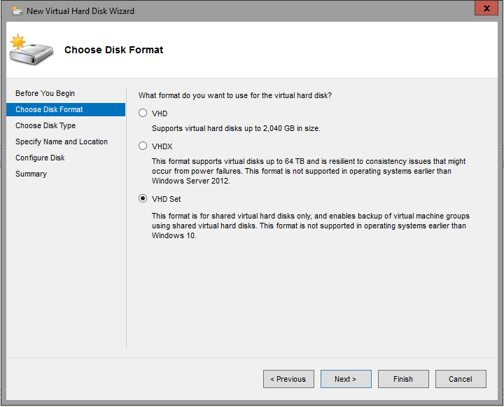

        Figure 175. New Virtual Hard Disk Wizard: Specifying the shared virtual hard disk format

    4. On the **Choose Disk Type** tab of the **New Virtual Hard Disk Wizard**, select the **Fixed size** option for the disk type and then click **Next**.

        <a name="fig.176"></a>

        

        Figure 176. New Virtual Hard Disk Wizard: Specifying the shared virtual hard disk type

    5. type the name of the shared virtual hard disk file in the **Name** text box as `rsvd.vhds`. Also, in the **Location** textbox, **Browse**-to or type the following directory specification: `C:\Users\Public\Documents\Hyper-V\Virtual Hard Disks\`

        <a name="fig.177"></a>

        

        Figure 177. New Virtual Hard Disk Wizard: Specifying the shared virtual hard disk name and location

    6. In the **Size** field on the **Configure Disk** tab of the **New Virtual Hard Disk Wizard**, type `1` and then click **Finish** to create the shared virtual disk file.

        <a name="fig.178"></a>

        

        Figure 178. New Virtual Hard Disk Wizard: Specifying the shared virtual hard disk size

#### <a name="5.3.21"/> 5.3.21 Modify the Signing Configuration

To modify the signing configuration, perform the steps that follow.

1. Start the command console with Administrator privileges.

    For further details, see section [5.3.24 How to start the command console with Administrator privileges](#5.3.24).

2. On the SUT computer, type the appropriate command string below in the command console, to either enable or disable the signing requirement, respectively, and then press **Enter** on the computer keyboard.

    **To enable SigningRequired**:

    ```
      cmd /C reg ADD "HKLM\System\ControlSet001\Services\LanmanServer\Parameters" /f /v requiresecuritysignature /t REG_DWORD /d 1
    ```

    **To disable SigningRequired**:

    ```
      cmd /C reg DELETE "HKLM\System\ControlSet001\Services\LanmanServer\Parameters" /f /v requiresecuritysignature
    ```

#### <a name="5.3.22"/>  5.3.22 Manually Set the Domain Account Computer Password

To set the password for the computer's domain account, perform the steps that follow.

1. Run the following command in a command console enabled with Administrative privileges.

    ```
      ksetup /SetComputerPassword <password>
    ```

2. Restart the computer.

#### <a name="5.3.23"/> 5.3.23 Create an SQOS Policy

To create a Multi-instance SQOS policy in the scale out File Server, perform the steps that follow.

1. Start Windows PowerShell (x86) from **%SystemRoot%\\syswow64\\WindowsPowerShell\\v1.0\\** with Administrator privileges and execute one of the following commands, depending on your operating system:

    If you are configuring on a platform earlier than Windows Server 2016 TP5, run the following command:

    ```
      $policy = New-StorageQosPolicy -Name sqostest -PolicyType MultiInstance -MinimumIops 100 -MaximumIops 200
    ```

    If you are configuring on a platform with Windows Server 2016 TP5 or later, run the following command:

    ```
      $policy = New-StorageQosPolicy -Name sqostest -PolicyType Aggregated -MinimumIops 100 -MaximumIops 200 -MaximumIOBandwidth 1600
    ```

2. Get the policy ID by running the following command in the existing PowerShell command console.

    ```
      $policy.PolicyId
    ```

    When complete, set the policy Id to the **SqosPolicyId** property in the MS-SQOS ServerTestSuite.deployment.ptfconfig file. For more information, see section [5.2.4.6 Setup to Test SQOS](#5.2.4.6).

#### <a name="5.3.24"/> 5.3.24 How to Start the Command Console with Administrator Privileges

To start the command console with Administrator privileges, perform the steps that follow.

1. Click the computer Start menu and then type `cmd`.

2. When the **Command Prompt** desktop app appears in the Start menu, right-click it and then select **Run as Administrator** in the context menu that displays

    <a name="fig.179"></a>

    

    Figure 179. Starting the command console with Administrator privileges

#### <a name="5.3.25"/> 5.3.25 Enable Short Name format

To enable the short name format on a volume, perform the steps that follow.

1. Start the command console with Administrator privileges.

    For further details, see section [5.3.24 How to start the command console with Administrator privileges](#5.3.24).

2. Enable the short name format on a volume such as C: by typing the following command in the command console:

    ```
      fsutil 8dot3name set c: 0
    ```

#### <a name="5.3.26"/> 5.3.26 Create a Volume Shadow Copy

To create a volume shadow copy, perform the steps that follow.

1. Start the command console with Administrator privileges.

    For further details, see section [5.3.24 How to start the command console with Administrator privileges](#5.3.24).

2. Create a shadow copy on volume such as C: by typing the following command in the command console:

    ```
      vssadmin.exe Create Shadow /For=c:\ /AutoRetry=2
    ```

#### <a name="5.3.27"/> 5.3.27 Create a Volume Mount Point

To create a volume mount point, perform the steps that follow.

1. Start the command console with Administrator privileges.

    For further details, see section [5.3.24 How to start the command console with Administrator privileges](#5.3.24).

2. Create a new folder named **MountPoint** by typing and executing the following command in the command console:

    ```
      mkdir MountPoint
    ```

3. List the mounted volume name by typing and executing the following command in the command console:

    ```
      mountvol c: /l
    ```

4. Create the mount point by typing and executing the following command in the command console. Note that the output of the command in step 3 is the &lt;volume name&gt; used in the command string that follows:

    ```
      mountvol MountPoint <volume name>
    ```

## <a name="6"/> 6 Installed Files and Folders

The installation process adds the folders and files to the Driver computer in this location: **%SystemDrive%\\MicrosoftProtocolTests\\FileServer\\Server-Endpoint\\&lt;version#&gt;\\**

**Note**

This path may vary based on your setup. Also, the &lt;version#&gt; placeholder indicates the installed build version number of the **Test Suite**. The installed folders and files are described in the Table that follows.

<a name="table.11"></a>

**Table 11. Installed files and folders**

| File or Folder | Description                                                                |
|----------------|----------------------------------------------------------------------------|
| Batch          | Command files that you use to run individual test cases or all test cases. |
| Bin            | Test Suite binaries and configuration files. This folder contains the following sub-folders:<br>&emsp;&emsp;- Common — contains .ps scripts* that are called by specific test cases.<br>&emsp;&emsp;- ServerFailover — contains .ps scripts* that are called by specific test cases.<br>&emsp;&emsp;- Scripts — contains .ps scripts that are used to set up the test environment.                                         |
| License.rtf    | The End User License Agreement.                                            |

\*PowerShell scripts are located in the **SutProtocolControlAdapter** under the **Common** directory and in the **WindowsSutControlAdapter** folder under the **ServerFailover** directory.

## <a name="7"/> 7 Configure and Run Test Cases

This section explains how to configure the **Test Suite** and how to run test cases.

* **Configuring Tests** − You can configure your **Test Suite** in either of the following ways:

  * Using **Protocol Test Manager**

  * Performing manual configuration

* **Running Tests** − You can run your test cases by using any of the following:

  * **Protocol Test Manager**

  * **Batch Script** and **Visual Studio**

  * **Test Agent**

### <a name="7.1"/> 7.1 Configure and Run Test Cases Using Protocol Test Manager

**Protocol Test Manager** (**PTM**) is a user interface (UI)-based tool that helps you configure and run test cases.

To configure the **Test Suite**, perform that steps that follow.

1. If you have not already done so, install the Protocol Test Manager on the Driver (Client01) computer by double-clicking the ProtocolTestManager.msi and following the steps of the **Protocol Test Manager Setup Wizard**. For more information, see section [3.4 Software Requirements](#3.4).

2. When complete, launch the Protocol Test Manager application from the desktop shortcut that was created during Protocol Test Manager installation on the Driver (Client01) computer. On the **Select Test Suite** tab of **Protocol Test Manager**, select the **File Server** test suite to begin configuration, and then click **Configure Wizard**.

    <a name="fig.180"></a>

    

    Figure 180. Protocol Test Manager: Launching the File Server test suite

3. On the **Test Suite Introduction** tab of **Protocol Test Manager**, review the general information about the **File Server Protocol Family Server Test Suite** and then click **Deployment Guide** or **Next**.

    <a name="fig.181"></a>

    

    Figure 181. Protocol Test Manager: Launching the Deployment Guide

4. On the **Test Suite Introduction** tab of **Protocol Test Manager** review the diagrammatic information about the **Test Environment**, and then click **Next**.

    **Note**

    If you have already setup your test environment according to the instructions provided earlier in this document, you can skip the details that appear when clicking **Domain Environment** or **Workgroup Environment**.

    <a name="fig.182"></a>

    

    Figure 182. Protocol Test Manager: Reviewing the Test Environment

5. On the **Configure Method** tab of **Protocol Test Manager**, you will need to select a configuration method option such as one of the following:

    * **Run Auto-Detection**
    * **Do Manual Configuration**
    * **Load Profile**

     The bullet points that follow provide additional instructions for each method.

    <a name="fig.183"></a>

    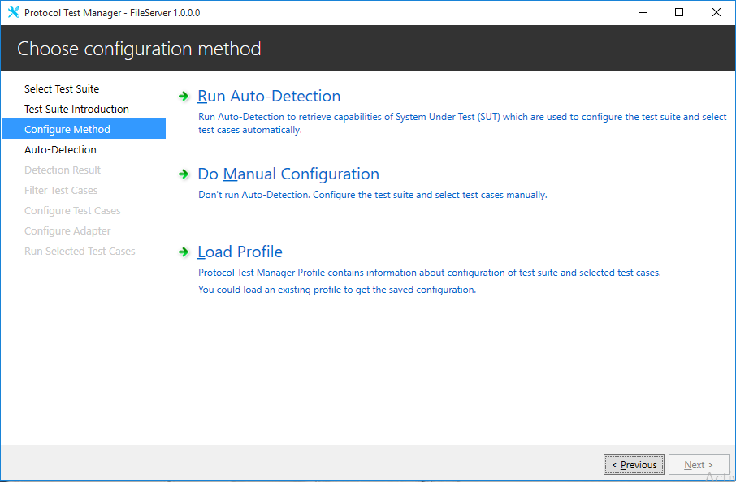

    Figure 183. Protocol Test Manager: Selecting a configuration method

    * Configure the **Test Suite** by using the **Auto-Detection** option:

      * Click **Run Auto-Detection** and navigate to the **Auto-Detection** tab.

      * On the **Auto-Detection** tab of **Protocol Test Manager**, ensure that the prerequisite information from auto-detection is correct based on the default values loaded from the .ptfconfig files, and make any necessary corrections.

      * On the **Auto-Detection** tab click the **Detect** button.

        **Note**

        If your SUT is in a **WORKGROUP** environment, leave the **Domain Name** field blank when providing prerequisite information.

        <a name="fig.184"></a>

        

        Figure 184. Protocol Test Manager: Providing information for auto-detection

      * After detection has successfully completed, as indicated by the **Finished** flag next to each item in the Auto Detection list, click **Next** to check the **Detection Result**.

      * On the **Detection Result** tab of **Protocol Test Manager**, a summary is provided within  information nodes that may include **Capabilities**, **IoCtl Codes**, **Remote Shared Virtual Disk**, and so on, to indicate what is supported by your SUT configuration. Review this information to ensure it's accuracy.

        To expose or hide result details, perform clicks on any node to toggle the results.

      * When your review is complete, click **Next**.

        <a name="fig.185"></a>

        

        Figure 185. Protocol Test Manager: Reviewing detection results

      * In the **Selected Test Cases** pane on the **Filter Test Cases** tab of **Protocol Test Manager**, you will see the test cases automatically displayed from the detection results obtained in the previous step. If the detection results show that your SUT is not supporting a particular feature, that feature name will be rendered in italics under the **Feature** node. Note that you can manually select or unselect tests in the selection list as needed.

        <a name="fig.186"></a>

        

        Figure 186. Protocol Test Manager: Reviewing test cases

    * Configure the **Test Suite** by using the **Do Manual Configuration** option:

      **Important**

      If you choose the **Do Manual Configuration** option, you will need to manually provide information that is normally obtained during **Auto Detect**, such as target share, domain name, user name, password, and so forth. You will need to provide this information in the **Common** and **SMB** groups on the **Configure Test Cases** tab of **PTM**.

      To use the **Do Manual Configuration** option, proceed as follows:

      * On the **Configuration Method** tab of the **Protocol Test Manager**, click **Do Manual Configuration** and navigate directly to the **Filter Test Cases** tab.

      * On the **Filter Test Cases** tab of **Protocol Test Manager**, select the test cases that you want to run by setting check boxes in the **Filter** and **Feature** tree lists.

        <a name="fig.187"></a>

        

        Figure 187. Protocol Test Manager: Manually selecting test cases

    * Configure the **Test Suite** by using the **Load Profile** option:

      In order to use this option, you will need to have run the **Test Suite** at least once and saved a Profile that contains selected test cases and related configuration information, following test execution. You can save a Profile in step 9 of this procedure and then use it in subsequent reruns of the profiled test environment where you specify use of the **Load Profile** option in the **Protocol Test Manager**.

      When this is the case, proceed to the bullet points that follow to load and use a Profile with the **Load Profile** option.

      * On the **Configuration Method** tab of the **Protocol Test Manager**, click **Load Profile**, select an existing profile, and then click the **Open** button.

        Thereafter, navigate directly to the **Filter Test Cases** tab of **Protocol Test Manager**.

        <a name="fig.188"></a>

        

        Figure 188. Protocol Test Manager: Locating an existing Profile

      * On the **Filter Test Cases** tab of **Protocol Test Manager**, verify that the checked test cases appear as expected from the **Profile** data that you imported. Note that you can still modify your selections as necessary by selecting or unselecting them.

        <a name="fig.189"></a>

        

        Figure 189. Protocol Test Manager: Verifying the presence of Profile test cases

6. On the **Configure test case properties** tab of **Protocol Test Manager**, verify the correctness of the default property values that were set for the specified **Groups**, with respect to your detection results. Note that you can edit the values  if necessary.

    For example, you can verify the properties values for the **Common** group to ensure that they match your environment. To verify the default values for **Common** group items, mouse-hover over any particular property to show a tool tip that contains the default property values, as shown in the figure that follows.

    **Note**

    If there appears to be a persistent disparity in property values that deviate from what you expect, you might consider running **Auto-Detect** again. If the issue persists, you may need to use the **Do Manual Configuration** option.

    Note that if you are already using the **Do Manual Configuration** or **Load Profile** option, the properties are always set at the default values, which you can modify manually as needed

    When complete, click **Next**.

    **Tip**

    You can also mouse-hover over any item in the **Properties** column on the **Configure test case properties** tab of **Protocol Test Manager** to display a tool tip that contains the meaning of the item over which your mouse is hovering, also indicated in the figure that follows.

    **Important**

    If you want to enable capture of event trace logs (ETL) with Message Analyzer during test case execution, you must set the **Enabled** field of the **NetworkCapture** property to True in the **PTF Group** on the **Configure Test Cases** tab of **PTM**.

    <a name="fig.190"></a>

    

    Figure 190. Protocol Test Manager: Verifying the Common property values

7. On the **Configure Adapter** tab of **Protocol Test Manager**, choose an **SUT control adapter** from the **Type** drop-down or use the typical default setting of **PowerShell**, and then click **Next**.

    <a name="fig.191"></a>

    

    Figure 191. Protocol Test Manager: Configuring the SUT control adapter

    * On the **Run Selected Test Cases** tab of **Protocol Test Manager**, run test cases in either of the following ways:

      * **Run All** – click this link to run all test cases.

      * **Run Selected Test** – click this link to run the selected test cases.

      After the test cases complete execution, you can view test case logs to the right of the test case listview, by selecting any test case in the listview.

      **Note**

      You can drag the separator between the test case treeview and the log pane to adjust the width of the window for better viewing.

      **Important**

      If you run all the core/preconfigured test cases and your environment does not support certain features, you will see errors in the command console, in the test cases listview, and in the right-hand side log pane of PTM, with respect to methods that failed when attempting to test those features. To avoid this, you can simply run only the test cases that apply to your environment.

      <a name="fig.192"></a>

      

      Figure 192. Protocol Test Manager: Running the test cases

      **Note**

      As shown in the figure that follows, you can also run test cases from the context menu that appears when you right-click the test case listview, for example, with commands such as **Run Selected Tests** and **Run All Tests**. In addition, you can select the **Uncheck All** command to uncheck all selected test cases.

      <a name="fig.193"></a>

      

      Figure 193. Protocol Test Manager: Uncheck All context menu item

8. After test execution is complete, click the results hyperlink in the upper-right corner of **Protocol Test Manager** to open the **Result** folder for the **Test Suite** run.

    <a name="fig.194"></a>

    

    Figure 194. Protocol Test Manager: Displaying the test case results

9. To save a Profile that encapsulates the current test case configuration, click the **Export/Import** drop-down and select **Save Profile** to save the selected test cases of this run and all the related configurations.

    You can then use the saved Profile with subsequent re-runs of the current Test Suite configuration where you employ the **Load Profile** option from the **Configuration Method** tab of **Protocol Test Manager**.

    <a name="fig.195"></a>

    

    Figure 195. Protocol Test Manager: Saving a test cases Profile

    **Note**

    **Protocol Test Manager** also has a command line interface (**ptmcli.exe**) that you can use to automate the running of test cases with a selected Profile.
    * You can locate the **ptmcli.exe** tool in the **..\\bin** folder under the **Protocol Test Manager** installation path in the **Program Files** directory. To use this tool, you will need to specify the path to a saved Profile name with the `-p` switch:

      `ptmcli.exe -p <profileName>`

    * To display help for the **ptmcli.exe** tool, specify the `-h` switch at the command line:

      `ptmcli.exe -h`

### <a name="7.2"/> 7.2 Configure the Test Suite Manually

The **File Server Protocol Family Test Suite** is installed with default configuration settings. However, you have the option to modify these settings according to your specific test environment needs. For example, you can configure the **Test Suite** in the following ways:

* Define the settings of the test environment, including computer names, IP addresses, passwords, and so on. For example, you could modify these particular entities from the **CommonTestSuite.deployment.ptfconfig** file in Visual Studio. The directory location for the **.ptfconfig** files is specified later in this section.

You can also change configuration settings by editing the **\\*.deployment.ptfconfig** files, which includes  the files in the following list. A brief description of each file is also included here:

* CommonTestSuite.deployment.ptfconfig – the common settings in the **CommonTestSuite.deployment.ptfconfig** file are shared by all the sub test suites that follow.

* ServerFailoverTestSuite.deployment.ptfconfig − settings in **ServerFailoverTestSuite.deployment.ptfconfig** file are for the File Server failover test suite.

* MS-DFSC_ServerTestSuite.deployment.ptfconfig − settings in the **MSDFSC_ServerTestSuite.deployment.ptfconfig** file are for the Distributed File System (DFSC) server test suite.

* MS-FSRVP_ServerTestSuite.deployment.ptfconfig − settings in the **MSFSRVP_ServerTestSuite.deployment.ptfconfig** file are for the File Server Remote VSS Protocol (FSRVP) server test suite.

* MS-SMB2_ServerTestSuite.deployment.ptfconfig − settings in the **MSSMB2_ServerTestSuite.deployment.ptfconfig** file are for the Server Message Block (SMB2) test suite.

* MS-SMB2Model_ServerTestSuite.deployment.ptfconfig − settings in the **MSSMB2Model_ServerTestSuite.deployment.ptfconfig** file are for the Server Message Block (SMB2) model test suite.

* MS-RSVD_ServerTestSuite.deployment.ptfconfig − settings in the **MSRSVD_ServerTestSuite.deployment.ptfconfig** file are for the Remote Shared Virtual Disk (RSVD) server test suite.

* MS-SQOS_ServerTestSuite.deployment.ptfconfig − settings in the **MSSQOS_ServerTestSuite.deployment.ptfconfig** file are for the Storage Quality of Service (SQOS) server test suite.

* Auth_ServerTestSuite.deployment.ptfconfig − settings in the **Auth_ServerTestSuite.deployment.ptfconfig** file are for the Auth test suite.

**Note**

You can locate the .ptfconfig files in the following directory location after the **File Server Protocol Family Test Suite** is installed:  **%SystemDrive%\\MicrosoftProtocolTests\\FileServer\\Server-Endpoint\\&lt;version#&gt;\Bin\\** The data in these XML files is invoked whenever you run test cases with the use of either **batch scripts** or the **Protocol Test Manager**.

**Important**

For specific configuration details, refer to a corresponding \*.deployment.ptfconfig file. The configuration files contain &lt;Description&gt; tags that describe the purpose of configurable items.

### <a name="7.3"/> 7.3 Run Test Cases with Batch Scripts

The **File Server Protocol Family Test Suite** includes command (**.cmd**) batch files that you can use to run some basic test cases. Each test case verifies a protocol implementation based on a predefined scenario. You can run the .cmd test case files directly from the following directory:

**%SystemDrive%\\MicrosoftProtocolTests\\FileServer\\Server-Endpoint\\&lt;version#&gt;\\Batch\\**

To run these batch files, either double-click one or more of them directly from the specified directory location or run them from a command prompt.

#### <a name="7.3.1"/> 7.3.1 Run the BVT Tests

This **Test Suite** includes a set of basic tests known as BVT tests. Together these test cases perform basic functionality tests that evaluate an implementation residing on an SUT computer. The BVT test cases are basic tests of specific features that should pass, which therefore makes them high priority tests.  You are advised to run the BVT test cases first and then run other test cases.

To run the BVT test cases in a **WORKGROUP** or **DOMAIN** environment, perform the appropriate steps that follow:

1. To run the **BVT** test cases in a **WORKGROUP** environment:

    * From the desktop of the Driver computer, double-click the **Run FileServer ServerWorkgroup_BVTTestCases** shortcut that was created during the installation process.

    * Alternatively, open the **%SystemDrive%\\MicrosoftProtocolTests\\FileServer\\ServerEndpoint\\&lt;version#&gt;\Batch\\** directory and double-click the **Workgroup_RunBVTTestCases.cmd** file.

2. To run the **BVT** test cases in a **DOMAIN** environment:

    * From the desktop of the Driver computer, double-click the **Run FileServer ServerDomain_BVTTestCases** shortcut that was created during the installation process.

    * Alternatively, open the **%SystemDrive%\\MicrosoftProtocolTests\\FileServer\\ServerEndpoint\\&lt;version#&gt;\Batch\\** directory and double-click the **Domain_RunBVTTestCases.cmd** file.

#### <a name="7.3.2"/> 7.3.2 Run All Test Cases

Perform the steps that follow to run all test cases in either the WORKGROUP or DOMAIN environment, as required:

1. To run all test cases in a **WORKGROUP** environment:

    * From the desktop of the Driver computer, double-click the **Run FileServer ServerWorkgroup_AllTestCases** shortcut that was created during the installation process.

    * Alternatively, open the **%SystemDrive%\\MicrosoftProtocolTests\\FileServer\\ServerEndpoint\\&lt;version#&gt;\\Batch\\** directory and double-click the **Workgroup_RunAllTestCases.cmd** file.

    **Note**

    If you run all core/preconfigured test cases and your environment does not support certain features, you will see errors in the command console and in the PTM with respect to methods that failed when attempting to test those features.

2. To run test cases with the RunTestCasesByCategory.cmd script, do the following:

    * From the desktop of the Driver computer, double-click the **RunTestCasesByCategory** shortcut.

    **Note**

    To run a specific group of test cases that are categorized by feature names, input the name of the appropriate test categories that are listed in the command console that appears when you run the **RunTestCasesByCategory.cmd** script.

3. To run all test cases in a **DOMAIN** environment:

    * From the desktop of the Driver computer, double-click the **Run FileServer ServerDomain_AllTestCases** shortcut that was created during the installation process.

    * Alternatively, open the **%SystemDrive%\\MicrosoftProtocolTests\\FileServer\\ServerEndpoint\\&lt;version#&gt;\\Batch\\** directory and double-click the **Domain_RunAllTestCases.cmd** file.

### <a name="7.4"/> 7.4 Reviewing Test Results

The **File Server Protocol Family Test Suite** generates test result files in different file paths, depending on the manner in which test cases were executed. For example, when running test cases from the following sources, results are saved in the specified locations:

* **Batch scripts (.cmd)** − results are saved in this location: **%SystemDrive%\\MicrosoftProtocolTests\\FileServer\\ServerEndpoint\\&lt;version#&gt;\\Batch\\TestResults\\**

* **Protocol Test Manager** − results are saved in this location: **%SystemDrive%\\MicrosoftProtocolTests\\FileServer\\Server-Endpoint\\&lt;version#&gt;\\TestResults\\**

When your tests are complete, you can review the results in the respective locations as cited above.

**More Information**

For further information about the meaning of logging in the **Protocol Test Framework** (**PTF**), please see the [PTF User Guide](https://github.com/microsoft/protocoltestframework) on **GitHub**.

You can also review test results in the following ways:

* In terms of tests that **Passed**, **Failed**, or were **Inconclusive**.

* Selecting how results are grouped: by test **Category** or by **Outcome**

* Assessment of logged data in the **StandardOutput**, **ErrorStackTrace**, and **ErrorMessage** categories.

**Note**

The StandardOutput data can also be displayed separately in HTML format.

## <a name="8"/> 8 Creating a Custom Test Environment

If you want to create a Test Suite to customize a testing environment and test cases to your own specifications, review the following documentation:

[Getting Started Guide for the Protocol Test Framework](https://github.com/Microsoft/ProtocolTestFramework/blob/master/docs/PTFUserGuide.md)

[Spec Explorer](https://docs.microsoft.com/en-us/previous-versions/visualstudio/spec-explorer/ee620411(v=specexplorer.10))

## <a name="9"/> 9 Debugging Test Cases

You can use the Visual Studio solution (.sln) file included with the  **File Server Protocol Family Test Suite** to debug the test cases that you run against your own protocol implementations. The **FileServer.sln** file is located [here](../../src/).

**Note**

While using Microsoft® Visual Studio® 2017 or later to run test cases, the **Test Suite** may throw an exception with the message: **Cannot get test site**. To resolve this issue, navigate to **Test** -&gt; **Test Settings** -&gt; **Select Test Settings File**, and then select the test settings file ServerLocalTestRun.testrunconfig (under this folder <https://github.com/Microsoft/WindowsProtocolTestSuites/tree/staging/TestSuites/FileServer/src>)

<a name="fig.196"></a>

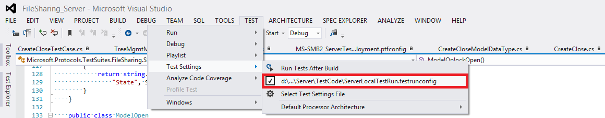

Figure 196. Microsoft Visual Studio: Correcting the exception **Cannot get test site**

To debug a test case, perform the steps that follow.

1. On the Driver computer, use Microsoft® Visual Studio® to open the following solution file: [FileServer.sln](../../src/).

2. In Visual Studio, in the Solution Explorer window, right-click the **Solution** **FileServer**, and then select **Build Solution**.

3. When you build the test project, the tests appear in **Test Explorer**. If Test Explorer is not visible, choose **Test** on the Visual Studio menu, select **Windows**, and then select **Test Explorer**.

4. Select your test cases from Test Explorer and run or debug them.
