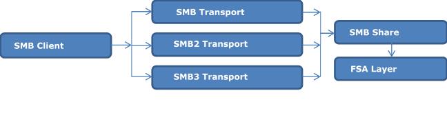

# MS-FSA Protocol Server Test Design Specification

## Contents

* [Introduction](#Introduction)
* [MS-FSA Overview](#MS-FSA-Overview)
* [Test Approach](#Test-Approach)
    * [Test Suite Overview](#Test-Suite-Overview)
    * [Test initialization and cleanup](#Test-initialization-and-cleanup)
* [MS-FSA Test Environment](#MS-FSA-Test-Environment)
* [Scenario and Test Case Summary](#Scenario-and-Test-Case-Summary)
    * [Traditional Test cases](#Traditional-Test-cases)
    * [MBT Test cases](#MBT-Test-cases)
* [Traditional Test Scenarios Design](#Traditional-Test-Scenarios-Design)
    * [Scenarios for CommonAlgorithm](#Scenarios-for-CommonAlgorithm)
        * [Algorithm_Noting_FileModified](#Algorithm_Noting_FileModified)
        * [Algorithm_Noting_FileAccessed](#Algorithm_Noting_FileAccessed)
    * [Scenarios for FileInformation](#Scenarios-for-FileInformation)
        * [FileInfo_IsCompressionSupported](#FileInfo_IsCompressionSupported)
        * [FileInfo_IsEASupported](#FileInfo_IsEASupported)
        * [FileInfo_IsIntegritySupported](#FileInfo_IsIntegritySupported)
        * [FileInfo_IsFileLinkInfoSupported](#FileInfo_IsFileLinkInfoSupported)
        * [FileInfo_IsFileValidDataLengthInfoSupported](#FileInfo_IsFileValidDataLengthInfoSupported)
        * [FileInfo_IsShortNameSupported](#FileInfo_IsShortNameSupported)
        * [FileInfo_FileIdInformationSupported](#FileInfo_FileIdInformationSupported)
        * [FileInfo_FileAccessInformationSupported](#FileInfo_FileAccessInformationSupported)
        * [FileInfo_SetFileBasicInformationSupported](#FileInfo_SetFileBasicInformationSupported)
        * [FileInfo_CreationTime](#FileInfo_CreationTime)
        * [FileInfo_Set_FileBasicInformation_Timestamp_Zero](#FileInfo_Set_FileBasicInformation_Timestamp_Zero)
        * [FileInfo_Set_FileBasicInformation_Timestamp_MinusOne](#FileInfo_Set_FileBasicInformation_Timestamp_MinusOne)
        * [FileInfo_Set_FileBasicInformation_Timestamp_MinusTwo](#FileInfo_Set_FileBasicInformaiton_Timestamp_MinusTwo)
    * [Scenarios for FileSystemInformation](#Scenarios-for-FileSystemInformation)
        * [FsInfo_FileFsAttributeInformation](#FsInfo_FileFsAttributeInformation)
        * [FsInfo_IsObjectIdSupported](#FsInfo_IsObjectIdSupported)
        * [FsInfo_FileFsSizeInformation_ClusterSize](#FsInfo_FileFsSizeInformation_ClusterSize)
        * [FsInfo_Query_FileFsSectorSizeInformation](#FsInfo_Query_FileFsSectorSizeInformation)
    * [Scenarios for FsControlRequest](#Scenarios-for-FsControlRequest)
        * [FsCtl_Get_IntegrityInformation](#FsCtl_Get_IntegrityInformation)
        * [FsCtl_Set_IntegrityInformation](#FsCtl_Set_IntegrityInformation)
        * [FsCtl_Offload_Read](#FsCtl_Offload_Read)
        * [FsCtl_Offload_Write](#FsCtl_Offload_Write)
        * [FsCtl_IsAllocatedRangesSupported](#FsCtl_IsAllocatedRangesSupported)
        * [FsCtl_IsReparsePointSupported](#FsCtl_IsReparsePointSupported)
        * [FsCtl_IsSparseFileSupported](#FsCtl_IsSparseFileSupported)
        * [FsCtl_IsZeroDataSupported](#FsCtl_IsZeroDataSupported)
        * [FsCtl_IsDuplicateExtentsToFileExSupported](#FsCtl_IsDuplicateExtentsToFileExSupported)
        * [FsCtl_Get_Volume_Data](#FsCtl_Get_Volume_Data)
        * [FsCtl_Query_File_Regions](#FsCtl_Query_File_Regions)
        * [FsCtl_Get_Compression](#FsCtl_Get_Compression)
        * [FsCtl_Set_Compression](#FsCtl_Set_Compression)
        * [FsCtl_RefsStreamSnapshotManagement](#FsCtl_RefsStreamSnapshotManagement)
        * [FsCtl_RefsStreamSnapshotOperationCreate](#FsCtl_RefsStreamSnapshotOperationCreate)
        * [FsCtl_RefsStreamSnapshotOperationQueryDeltas](#FsCtl_RefsStreamSnapshotOperationQueryDeltas)
        * [FsCtl_Mark_Handle](#FsCtl_Mark_Handle)
        * [FsCtl_RefsStreamSnapshotOperationList](#FsCtl_RefsStreamSnapshotOperationList)
    * [Scenarios for QuotaInformation](#Scenarios-for-QuotaInformation)
        * [QuotaInfo_IsQuotaInfoSupported](#QuotaInfo_IsQuotaInfoSupported)
    * [Scenarios for Alternate Data Stream](#Scenarios-for-Alternate-Data-Stream)
        * [AlternateDataStream_CreateStream](#AlternateDataStream_CreateStream)
        * [AlternateDataStream_ListStreams](#AlternateDataStream_ListStreams)
        * [AlternateDataStream_DeleteStream](#AlternateDataStream_DeleteStream)
        * [AlternateDataStream_RenameStream](#AlternateDataStream_RenameStream)
        * [AlternateDataStream_WriteAndRead](#AlternateDataStream_WriteAndRead)
        * [AlternateDataStream_LockAndUnlock](#AlternateDataStream_LockAndUnlock)
        * [AlternateDataStream_QueryAndSet_FileInformation](#AlternateDataStream_QueryAndSet_FileInformation)
        * [AlternateDataStream_FsControl](#AlternateDataStream_FsControl)
    * [Scenarios for Create and Query Directory](#Scenarios-for-Create-And-Query-Directory)
        * [Query Directory](#Scenario-QueryDirectory)
    * [Scenarios for File and Directory Leasing](#Test-cases-for-File-And-Directory-Leasing)
        * [CompareLeaseKeys](#CompareLeaseKeys)
    * [Other Scenarios](#Other-Scenarios)
        * [CreateFile_InvalidStreamName](#Scenario-CreateFile_InvalidStreamName)
        * [CreateFile_InvalidColon](#Scenario-CreateFile_InvalidColon)
        * [CreateFile_BackSlash](#Scenario-CreateFile_BackSlash)
        * [CreateFile_FindAllFiles](#Scenario-CreateFile_FindAllFiles)
* [Traditional Test Case Design](#Traditional-Test-Case-Design)
    * [Test cases for CommonAlgorithm](#Test-cases-for-CommonAlgorithm)
        * [NotingFileModified](#NotingFileModified)
            * [Algorithm_NotingFileModified_File_LastModificationTime](#Algorithm_NotingFileModified_File_LastModificationTime)
            * [Algorithm_NotingFileModified_Dir_LastModificationTime](#Algorithm_NotingFileModified_Dir_LastModificationTime)
            * [Algorithm_NotingFileModified_File_LastChangeTime](#Algorithm_NotingFileModified_File_LastChangeTime)
            * [Algorithm_NotingFileModified_Dir_LastChangeTime](#Algorithm_NotingFileModified_Dir_LastChangeTime)
            * [Algorithm_NotingFileModified_File_LastAccessTime](#Algorithm_NotingFileModified_File_LastAccessTime)
            * [Algorithm_NotingFileModified_Dir_LastAccessTime](#Algorithm_NotingFileModified_Dir_LastAccessTime)
            * [Algorithm_NotingFileModified_File_Archive](#Algorithm_NotingFileModified_File_Archive)
            * [Algorithm_NotingFileModified_Dir_Archive](#Algorithm_NotingFileModified_Dir_Archive)
        * [NotingFileAccessed](#NotingFileAccessed)
            * [Algorithm_NotingFileAccessed_File_LastAccessTime](#Algorithm_NotingFileAccessed_File_LastAccessTime)
            * [Algorithm_NotingFileAccessed_Dir_LastAccessTime](#Algorithm_NotingFileAccessed_Dir_LastAccessTime)
    * [Test cases for FileInformation](#Test-cases-for-FileInformation)
        * [IsEASupported](#IsEASupported)
            * [FileInfo_Set_FileFullEaInformation_File_IsEASupported](#FileInfo_Set_FileFullEaInformation_File_IsEASupported)
            * [FileInfo_Set_FileFullEaInformation_Dir_IsEASupported](#FileInfo_Set_FileFullEaInformation_Dir_IsEASupported)
            * [FileInfo_Query_FileFullEaInformation_File_IsEASupported](#FileInfo_Query_FileFullEaInformation_File_IsEASupported)
            * [FileInfo_Query_FileFullEaInformation_Dir_IsEASupported](#FileInfo_Query_FileFullEaInformation_Dir_IsEASupported)
            * [FileInfo_Set_FileEaInformation_File_IsEASupported](#FileInfo_Set_FileEaInformation_File_IsEASupported)
            * [FileInfo_Set_FileEaInformation_Dir_IsEASupported](#FileInfo_Set_FileEaInformation_Dir_IsEASupported)
            * [FileInfo_Query_FileEaInformation_File_IsEASupported](#FileInfo_Query_FileEaInformation_File_IsEASupported)
            * [FileInfo_Query_FileEaInformation_Dir_IsEASupported](#FileInfo_Query_FileEaInformation_Dir_IsEASupported)
        * [IsFileLinkInfoSupported](#IsFileLinkInfoSupported)
            * [FileInfo_Set_FileLinkInfo_File_IsFileLinkInfoSupported](#FileInfo_Set_FileLinkInfo_File_IsFileLinkInfoSupported)
            * [FileInfo_Set_FileLinkInfo_Dir_IsFileLinkInfoSupported](#FileInfo_Set_FileLinkInfo_Dir_IsFileLinkInfoSupported)
        * [IsShortNameSupported](#IsShortNameSupported)
            * [FileInfo_Set_FileShortNameInfo_File_IsShortNameSupported](#FileInfo_Set_FileShortNameInfo_File_IsShortNameSupported)
            * [FileInfo_Set_FileShortNameInfo_Dir_IsShortNameSupported](#FileInfo_Set_FileShortNameInfo_Dir_IsShortNameSupported)
        * [IsCompressionSupported](#IsCompressionSupported)
            * [FileInfo_Query_FileCompressionInfo_File_IsCompressionSupported](#FileInfo_Query_FileCompressionInfo_File_IsCompressionSupported)
            * [FileInfo_Query_FileCompressionInfo_Dir_IsCompressionSupported](#FileInfo_Query_FileCompressionInfo_Dir_IsCompressionSupported)
        * [IsFileValidDataLengthInfoSupported](#IsFileValidDataLengthInfoSupported)
            * [FileInfo_Set_FileValidDataLengthInformation_File_IsSupported](#FileInfo_Set_FileValidDataLengthInformation_File_IsSupported)
            * [FileInfo_Set_FileValidDataLengthInformation_Dir_IsSupported](#FileInfo_Set_FileValidDataLengthInformation_Dir_IsSupported)
        * [IsIntegritySupported](#IsIntegritySupported)
            * [FileInfo_Query_FileBasicInfo_File_IsIntegritySupported (BVT)](#FileInfo_Query_FileBasicInfo_File_IsIntegritySupported-BVT)
            * [FileInfo_Query_FileBasicInfo_Dir_IsIntegritySupported](#FileInfo_Query_FileBasicInfo_Dir_IsIntegritySupported)
            * [FileInfo_Query_FileAttributeTagInfo_File_IsIntegritySupported](#FileInfo_Query_FileAttributeTagInfo_File_IsIntegritySupported)
            * [FileInfo_Query_FileAttributeTagInfo_Dir_IsIntegritySupported](#FileInfo_Query_FileAttributeTagInfo_Dir_IsIntegritySupported)
            * [FileInfo_Query_FileNetworkOpenInfo_File_IsIntegritySupported](#FileInfo_Query_FileNetworkOpenInfo_File_IsIntegritySupported)
            * [FileInfo_Query_FileNetworkOpenInfo_Dir_IsIntegritySupported](#FileInfo_Query_FileNetworkOpenInfo_Dir_IsIntegritySupported)
        * [IsFileIdInformationSupported](#IsFileIdInformationSupported)
            * [FileInfo_Query_FileIdInformation_File](#FileInfo_Query_FileIdInformation_File)
            * [FileInfo_Query_FileIdInformation_Dir](#FileInfo_Query_FileIdInformation_Dir)
        * [FileNormalizedNameInformation](#FileNormalizedNameInformation)
            * [FileInfo_Query_FileNormalizedNameInfo_File](#FileInfo_Query_FileNormalizedNameInfo_File)
            * [FileInfo_Query_FileNormalizedNameInfo_Dir](#FileInfo_Query_FileNormalizedNameInfo_Dir)
        * [FileAccessInformation](#FileAccessInformation)
            * [FileInfo_Query_FileAccessInformation_DataSuffix](#FileInfo_Query_FileAccessInformation_DataSuffix)
        * [FileAlignmentInformation](#FileAlignmentInformation)
            * [FileInfo_Query_FileAlignmentInformation](#FileInfo_Query_FileAlignmentInformation)
        * [FileAlternateNameInformation](#FileAlternateNameInformation)
            * [FileInfo_Query_FileAlternateNameInformation](#FileInfo_Query_FileAlternateNameInformation)
        * [FileInternalInformation](#FileInternalInformation)
            * [FileInfo_Query_FileInternalInformation](#FileInfo_Query_FileInternalInformation)
        * [FileModeInformation](#FileModeInformation)
            * [FileInfo_Query_FileModeInformation](#FileInfo_Query_FileModeInformation)
        * [FilePositionInformation](#FilePositionInformation)
            * [FileInfo_Query_FilePositionInformation](#FileInfo_Query_FilePositionInformation)
        * [FileBasicInformation](#FileBasicInformation)
            * [FileInfo_Set_FileBasicInformation_File_Negative](#FileInfo_Set_FileBasicInformation_File_Negative)
            * [FileInfo_Set_FileBasicInformation_Dir_Negative](#FileInfo_Set_FileBasicInformation_Dir_Negative)
            * [FileInfo_Set_FileBasicInformation_File_LastWriteTime](#FileInfo_Set_FileBasicInformation_File_LastWriteTime)
            * [FileInfo_Set_FileBasicInformation_Dir_LastWriteTime](#FileInfo_Set_FileBasicInformation_Dir_LastWriteTime)
            * [FileInfo_Set_FileBasicInformation_File_CreationTime](#FileInfo_Set_FileBasicInformation_File_CreationTime)
            * [FileInfo_Set_FileBasicInformation_Dir_CreationTime](#FileInfo_Set_FileBasicInformation_Dir_CreationTime)
            * [FileInfo_Set_FileBasicInformation_File_ChangeTime](#FileInfo_Set_FileBasicInformation_File_ChangeTime)
            * [FileInfo_Set_FileBasicInformation_Dir_ChangeTime](#FileInfo_Set_FileBasicInformation_Dir_ChangeTime)
            * [FileInfo_Set_FileBasicInformation_File_LastAccessTime](#FileInfo_Set_FileBasicInformation_File_LastAccessTime)
            * [FileInfo_Set_FileBasicInformation_Dir_LastAccessTime](#FileInfo_Set_FileBasicInformation_Dir_LastAccessTime)
        * [CreationTime](#CreationTime)        
            * [FileInfo_Query_FileBasicInformation_File_CreationTime](#FileInfo_Query_FileBasicInformation_File_CreationTime)
            * [FileInfo_Query_FileBasicInformation_Dir_CreationTime](#FileInfo_Query_FileBasicInformation_Dir_CreationTime)
            * [FileInfo_Query_FileBasicInformation_File_CreationTime_Zero](#FileInfo_Query_FileBasicInformation_File_CreationTime_Zero)
            * [FileInfo_Query_FileBasicInformation_Dir_CreationTime_Zero](#FileInfo_Query_FileBasicInformation_Dir_CreationTime_Zero)
            * [FileInfo_Query_FileBasicInformation_File_CreationTime_MinusTwo](#FileInfo_Query_FileBasicInformation_File_CreationTime_MinusTwo)
            * [FileInfo_Query_FileBasicInformation_Dir_CreationTime_MinusTwo](#FileInfo_Query_FileBasicInformation_Dir_CreationTime_MinusTwo)
            * [FileInfo_Query_FileBasicInformation_File_CreationTime_Negative](#FileInfo_Query_FileBasicInformation_File_CreationTime_Negative)
            * [FileInfo_Query_FileBasicInformation_Dir_CreationTime_Negative](#FileInfo_Query_FileBasicInformation_Dir_CreationTime_Negative)
            * [FileInfo_Query_FileBothDirectoryInformation_Dir_CreationTime](#FileInfo_Query_FileBothDirectoryInformation_Dir_CreationTime)
            * [FileInfo_Query_FileFullDirectoryInformation_Dir_CreationTime](#FileInfo_Query_FileFullDirectoryInformation_Dir_CreationTime)
            * [FileInfo_Query_FileIdGlobalTxDirectoryInformation_Dir_CreationTime](#FileInfo_Query_FileIdGlobalTxDirectoryInformation_Dir_CreationTime)
        * [FileInfo_Set_FileBasicInformation_Timestamp_Zero](#FileInfo_Set_FileBasicInformation_Timestamp_Zero)
            * [FileInfo_Set_FileBasicInformation_Timestamp_Zero_Dir_ChangeTime](#FileInfo_Set_FileBasicInformation_Timestamp_Zero_Dir_ChangeTime)
            * [FileInfo_Set_FileBasicInformation_Timestamp_Zero_File_LastWriteTime](#FileInfo_Set_FileBasicInformation_Timestamp_Zero_File_LastWriteTime)
            * [FileInfo_Set_FileBasicInformation_Timestamp_Zero_Dir_LastWriteTime](#FileInfo_Set_FileBasicInformation_Timestamp_Zero_Dir_LastWriteTime)
            * [FileInfo_Set_FileBasicInformation_Timestamp_Zero_File_LastAccessTime](#FileInfo_Set_FileBasicInformation_Timestamp_Zero_File_LastAccessTime)
            * [FileInfo_Set_FileBasicInformation_Timestamp_Zero_Dir_LastAccessTime](#FileInfo_Set_FileBasicInformation_Timestamp_Zero_Dir_LastAccessTime)
            * [FileInfo_Set_FileBasicInformation_Timestamp_Zero_File_CreationTime](#FileInfo_Set_FileBasicInformation_Timestamp_Zero_File_CreationTime)
            * [FileInfo_Set_FileBasicInformation_Timestamp_Zero_Dir_CreationTime](#FileInfo_Set_FileBasicInformation_Timestamp_Zero_Dir_CreationTime)
        * [FileInfo_Set_FileBasicInformation_Timestamp_MinusOne](#FileInfo_Set_FileBasicInformation_Timestamp_MinusOne)
            * [FileInfo_Set_FileBasicInformation_Timestamp_MinusOne_File_ChangeTime](#FileInfo_Set_FileBasicInformation_Timestamp_MinusOne_File_ChangeTime)
            * [FileInfo_Set_FileBasicInformation_Timestamp_MinusOne_Dir_ChangeTime](#FileInfo_Set_FileBasicInformation_Timestamp_MinusOne_Dir_ChangeTime)
            * [FileInfo_Set_FileBasicInformation_Timestamp_MinusOne_File_LastWriteTime](#FileInfo_Set_FileBasicInformation_Timestamp_MinusOne_File_LastWriteTime)
            * [FileInfo_Set_FileBasicInformation_Timestamp_MinusOne_Dir_LastWriteTime](#FileInfo_Set_FileBasicInformation_Timestamp_MinusOne_Dir_LastWriteTime)
            * [FileInfo_Set_FileBasicInformation_Timestamp_MinusOne_File_LastAccessTime](#FileInfo_Set_FileBasicInformation_Timestamp_MinusOne_File_LastAccessTime)
            * [FileInfo_Set_FileBasicInformation_Timestamp_MinusOne_Dir_LastAccessTime](#FileInfo_Set_FileBasicInformation_Timestamp_MinusOne_Dir_LastAccessTime)
            * [FileInfo_Set_FileBasicInformation_Timestamp_MinusOne_File_CreationTime](#FileInfo_Set_FileBasicInformation_Timestamp_MinusOne_File_CreationTime)
            * [FileInfo_Set_FileBasicInformation_Timestamp_MinusOne_Dir_CreationTime](#FileInfo_Set_FileBasicInformation_Timestamp_MinusOne_Dir_CreationTime)
        * [FileInfo_Set_FileBasicInformation_Timestamp_MinusTwo](#FileInfo_Set_FileBasicInformaiton_Timestamp_MinusTwo)
            * [FileInfo_Set_FileBasicInformation_Timestamp_MinusTwo_File_ChangeTime](#FileInfo_Set_FileBasicInformation_Timestamp_MinusTwo_File_ChangeTime)
            * [FileInfo_Set_FileBasicInformation_Timestamp_MinusTwo_Dir_ChangeTime](#FileInfo_Set_FileBasicInformation_Timestamp_MinusTwo_Dir_ChangeTime)
            * [FileInfo_Set_FileBasicInformation_Timestamp_MinusTwo_File_LastWriteTime](#FileInfo_Set_FileBasicInformation_Timestamp_MinusTwo_File_LastWriteTime)
            * [FileInfo_Set_FileBasicInformation_Timestamp_MinusTwo_Dir_LastWriteTime](#FileInfo_Set_FileBasicInformation_Timestamp_MinusTwo_Dir_LastWriteTime)
            * [FileInfo_Set_FileBasicInformation_Timestamp_MinusTwo_File_LastAccessTime](#FileInfo_Set_FileBasicInformation_Timestamp_MinusTwo_File_LastAccessTime)
            * [FileInfo_Set_FileBasicInformation_Timestamp_MinusTwo_File_CreationTime](#FileInfo_Set_FileBasicInformation_Timestamp_MinusTwo_File_CreationTime)
            * [FileInfo_Set_FileBasicInformation_Timestamp_MinusTwo_Dir_CreationTime](#FileInfo_Set_FileBasicInformation_Timestamp_MinusTwo_Dir_CreationTime)
            * [FileInfo_Set_FileBasicInformation_Timestamp_Negative_File_LastAccessTime](#FileInfo_Set_FileBasicInformation_Timestamp_Negative_File_LastAccessTime)
            * [FileInfo_Set_FileBasicInformation_Timestamp_Negative_Dir_LastAccessTime](#FileInfo_Set_FileBasicInformation_Timestamp_Negative_Dir_LastAccessTime)
            * [FileInfo_Set_FileBasicInformation_Timestamp_Negative_File_LastWriteTime](#FileInfo_Set_FileBasicInformation_Timestamp_Negative_File_LastWriteTime)
            * [FileInfo_Set_FileBasicInformation_Timestamp_Negative_Dir_LastWriteTime](#FileInfo_Set_FileBasicInformation_Timestamp_Negative_Dir_LastWriteTime)
            * [FileInfo_Set_FileBasicInformation_Timestamp_Negative_File_ChangeTime](#FileInfo_Set_FileBasicInformation_Timestamp_Negative_File_ChangeTime)
            * [FileInfo_Set_FileBasicInformation_Timestamp_Negative_Dir_ChangeTime](#FileInfo_Set_FileBasicInformation_Timestamp_Negative_Dir_ChangeTime)
            * [FileInfo_Set_FileBasicInformation_Timestamp_Negative_File_CreationTime](#FileInfo_Set_FileBasicInformation_Timestamp_Negative_File_CreationTime)
            * [FileInfo_Set_FileBasicInformation_Timestamp_Negative_Dir_CreationTime](#FileInfo_Set_FileBasicInformation_Timestamp_Negative_Dir_CreationTime)
    * [Test cases for FileSystemInformation](#Test-cases-for-FileSystemInformation)
        * [IsObjectIdSupported](#IsObjectIdSupported)
            * [FsInfo_Query_FileFsObjectIdInformation_File_IsObjectIdSupported (BVT)](#FsInfo_Query_FileFsObjectIdInformation_File_IsObjectIdSupported-BVT)
            * [FsInfo_Query_FileFsObjectIdInformation_Dir_IsObjectIdSupported](#FsInfo_Query_FileFsObjectIdInformation_Dir_IsObjectIdSupported)
        * [IsFsSectorSizeInformationSupported](#IsFsSectorSizeInformationSupported)
            * [FsInfo_Query_FileFsSectorSizeInformation_File_OutputBufferSize (3TCs, 1BVT)](#FsInfo_Query_FileFsSectorSizeInformation_File_OutputBufferSize-3TCs-BVT)
            * [FsInfo_Query_FileFsSectorSizeInformation_Dir_OutputBufferSize (3TCs)](#FsInfo_Query_FileFsSectorSizeInformation_Dir_OutputBufferSize-3TCs)
            * [FsInfo_Query_FileFsSectorSizeInformation_File_OutputValue_Common](#FsInfo_Query_FileFsSectorSizeInformation_File_OutputValue_Common)
            * [FsInfo_Query_FileFsSectorSizeInformation_Dir_OutputValue_Common](#FsInfo_Query_FileFsSectorSizeInformation_Dir_OutputValue_Common)
            * [FsInfo_Set_FileFsSectorSizeInformation_File_InvalidInfoClass](#FsInfo_Set_FileFsSectorSizeInformation_File_InvalidInfoClass)
            * [FsInfo_Set_FileFsSectorSizeInformation_Dir_InvalidInfoClass](#FsInfo_Set_FileFsSectorSizeInformation_Dir_InvalidInfoClass)
        * [IsFsAttributeInformationSupported](#IsFsAttributeInformationSupported)
            * [FsInfo_Query_FileFsAttributeInformation_File_IsCompressionSupported (BVT)](#FsInfo_Query_FileFsAttributeInformation_File_IsCompressionSupported-BVT)
            * [FsInfo_Query_FileFsAttributeInformation_Dir_IsCompressionSupported](#FsInfo_Query_FileFsAttributeInformation_Dir_IsCompressionSupported)
            * [FsInfo_Query_FileFsAttributeInformation_File_IsIntegritySupported (BVT)](#FsInfo_Query_FileFsAttributeInformation_File_IsIntegritySupported-BVT)
            * [FsInfo_Query_FileFsAttributeInformation_Dir_IsIntegritySupported](#FsInfo_Query_FileFsAttributeInformation_Dir_IsIntegritySupported)
            * [FsInfo_Query_FileFsAttributeInformation_File_IsEncryptionSupported (BVT)](#FsInfo_Query_FileFsAttributeInformation_File_IsEncryptionSupported-BVT)
            * [FsInfo_Query_FileFsAttributeInformation_Dir_IsEncryptionSupported](#FsInfo_Query_FileFsAttributeInformation_Dir_IsEncryptionSupported)
            * [FsInfo_Query_FileFsAttributeInformation_File_IsObjectIdSupported (BVT)](#FsInfo_Query_FileFsAttributeInformation_File_IsObjectIDsSupported-BVT)
            * [FsInfo_Query_FileFsAttributeInformation_Dir_IsObjectIdSupported](#FsInfo_Query_FileFsAttributeInformation_Dir_IsObjectIDsSupported)
        * [IsFsSizeInformationSupported](#IsFsSizeInformationSupported)
            * [FsInfo_Query_FileFsSizeInformation_File_SectorsPerAllocationUnit (BVT)](#FsInfo_Query_FileFsSizeInformation_File_SectorsPerAllocationUnit-BVT)
            * [FsInfo_Query_FileFsSizeInformation_Dir_SectorsPerAllocationUnit](#FsInfo_Query_FileFsSizeInformation_Dir_SectorsPerAllocationUnit)
    * [Test cases for FsControlRequest](#Test-cases-for-FsControlRequest)
        * [IsAllocatedRangesSupported](#IsAllocatedRangesSupported)
            * [FsCtl_Query_AllocatedRanges_File_IsAllocatedRangesSupported](#FsCtl_Query_AllocatedRanges_File_IsAllocatedRangesSupported)
            * [FsCtl_Query_AllocatedRanges_Dir_IsAllocatedRangesSupported](#FsCtl_Query_AllocatedRanges_Dir_IsAllocatedRangesSupported)
        * [IsReparsePointSupported](#IsReparsePointSupported)
            * [FsCtl_Get_ReparsePoint_IsReparsePointSupported](#FsCtl_Get_ReparsePoint_IsReparsePointSupported)
        * [IsSparseFileSupported](#IsSparseFileSupported)
            * [FsCtl_Set_Sparse_File_IsSparseFileSupported](#FsCtl_Set_Sparse_File_IsSparseFileSupported)
            * [FsCtl_Set_Sparse_Dir_IsSparseFileSupported](#FsCtl_Set_Sparse_Dir_IsSparseFileSupported)
        * [IsZeroDataSupported](#IsZeroDataSupported)
            * [FsCtl_Set_ZeroData_File_IsZeroDataSupported](#FsCtl_Set_ZeroData_File_IsZeroDataSupported)
            * [FsCtl_Set_ZeroData_Dir_IsZeroDataSupported](#FsCtl_Set_ZeroData_Dir_IsZeroDataSupported)
        * [IsDuplicateExtentsToFileExSupported](#IsDuplicateExtentsToFileExSupported)
            * [BVT_FsCtl_DuplicateExtentsToFileEx_IsBasicSupported](#BVT_FsCtl_DuplicateExtentsToFileEx_IsBasicSupported)
            * [BVT_FsCtl_DuplicateExtentsToFileEx_IsSourceAtomicSupported](#BVT_FsCtl_DuplicateExtentsToFileEx_IsSourceAtomicSupported)
        * [IsGetIntegrityInformationSupported](#IsGetIntegrityInformationSupported)
            * [FsCtl_Get_IntegrityInformation_File_IsIntegritySupported (BVT)](#FsCtl_Get_IntegrityInformation_File_IsIntegritySupported-BVT)
            * [FsCtl_Get_IntegrityInformation_Dir_IsIntegritySupported (BVT)](#FsCtl_Get_IntegrityInformation_Dir_IsIntegritySupported-BVT)
            * [FsCtl_Get_IntegrityInformation_File_InvalidParameter (2TCs)](#FsCtl_Get_IntegrityInformation_File_InvalidParameter-2TCs)
            * [FsCtl_Get_IntegrityInformation_Dir_InvalidParameter (2TCs)](#FsCtl_Get_IntegrityInformation_Dir_InvalidParameter-2TCs)
            * [FsCtl_Get_IntegrityInformation_File_OutputValue (2TCs)](#FsCtl_Get_IntegrityInformation_File_OutputValue-2TCs)
            * [FsCtl_Get_IntegrityInformation_Dir_OutputValue (2TCs)](#FsCtl_Get_IntegrityInformation_Dir_OutputValue-2TCs)
        * [IsSetIntegrityInformationSupported](#IsSetIntegrityInformationSupported)
            * [FsCtl_Set_IntegrityInformation_File_IsIntegritySupported (BVT)](#FsCtl_Set_IntegrityInformation_File_IsIntegritySupported-BVT)
            * [FsCtl_Set_IntegrityInformation_Dir_IsIntegritySupported (BVT)](#FsCtl_Set_IntegrityInformation_Dir_IsIntegritySupported-BVT)
            * [FsCtl_Set_IntegrityInformation_File_InvalidParameter (3TCs)](#FsCtl_Set_IntegrityInformation_File_InvalidParameter-3TCs)
            * [FsCtl_Set_IntegrityInformation_Dir_InvalidParameter (2TCs)](#FsCtl_Set_IntegrityInformation_Dir_InvalidParameter-2TCs)
            * [FsCtl_Set_IntegrityInformation_File_WriteProtected](#FsCtl_Set_IntegrityInformation_File_WriteProtected)
            * [FsCtl_Set_IntegrityInformation_Dir_WriteProtected](#FsCtl_Set_IntegrityInformation_Dir_WriteProtected)
            * [FsCtl_Set_IntegrityInformation_File_ChecksumAlgorithm (2TCs)](#FsCtl_Set_IntegrityInformation_File_ChecksumAlgorithm-2TCs)
            * [FsCtl_Set_IntegrityInformation_Dir_ChecksumAlgorithm(2TCs)](#FsCtl_Set_IntegrityInformation_Dir_ChecksumAlgorithm-2TCs)
            * [FsCtl_Set_IntegrityInformation_File_Flag_Invalid](#FsCtl_Set_IntegrityInformation_File_Flag_Invalid)
            * [FsCtl_Set_IntegrityInformation_Dir_Flag_Invalid](#FsCtl_Set_IntegrityInformation_Dir_Flag_Invalid)
            * [FsCtl_Set_IntegrityInformation_File_CheckSumEnforcement_CheckSumType_None](#FsCtl_Set_IntegrityInformation_File_CheckSumEnforcement_CheckSumType_None)
            * [FsCtl_Set_IntegrityInformation_Dir_CheckSumEnforcement_CheckSumType_None](#FsCtl_Set_IntegrityInformation_Dir_CheckSumEnforcement_CheckSumType_None)
            * [FsCtl_Set_IntegrityInformation_File_CheckSumEnforcement_CheckSumType_Unchanged](#FsCtl_Set_IntegrityInformation_File_CheckSumEnforcement_CheckSumType_Unchanged)
            * [FsCtl_Set_IntegrityInformation_Dir_CheckSumEnforcement_CheckSumType_Unchanged](#FsCtl_Set_IntegrityInformation_Dir_CheckSumEnforcement_CheckSumType_Unchanged)
        * [IsOffloadReadSupported](#IsOffloadReadSupported)
            * [FsCtl_Offload_Read_File_IsOffloadSupported (BVT)](#FsCtl_Offload_Read_File_IsOffloadSupported-BVT)
        * [IsOffloadWriteSupported](#IsOffloadWriteSupported)
            * [FsCtl_Offload_Write_File_IsOffloadSupported (BVT)](#FsCtl_Offload_Write_File_IsOffloadSupported-BVT)
        * [IsSetCompressionSupported](#IsSetCompressionSupported)
            * [FsCtl_Set_Compression_File_IsCompressionSupported](#FsCtl_Set_Compression_File_IsCompressionSupported)
            * [FsCtl_Set_Compression_Dir_IsCompressionSupported](#FsCtl_Set_Compression_Dir_IsCompressionSupported)
        * [IsGetCompressionSupported](#IsGetCompressionSupported)
            * [FsCtl_Get_Compression_File_IsCompressionSupported](#FsCtl_Get_Compression_File_IsCompressionSupported)
            * [FsCtl_Get_Compression_Dir_IsCompressionSupported](#FsCtl_Get_Compression_Dir_IsCompressionSupported)
        * [IsGetVolumeDataSupported](#IsGetVolumeDataSupported)
            * [FsCtl_Get_REFS_Volume_Data_File](#FsCtl_Get_REFS_Volume_Data_File)
            * [FsCtl_Get_REFS_Volume_Data_Dir](#FsCtl_Get_REFS_Volume_Data_Dir)
            * [FsCtl_Get_NTFS_Volume_Data_File](#FsCtl_Get_NTFS_Volume_Data_File)
            * [FsCtl_Get_NTFS_Volume_Data_Dir](#FsCtl_Get_NTFS_Volume_Data_Dir)
        * [IsQueryFileRegionsSupported](#IsQueryFileRegionsSupported)
            * [BVT_FsCtl_Query_File_Regions](#BVT_FsCtl_Query_File_Regions)
            * [BVT_FsCtl_Query_File_Regions_WithInputData](#BVT_FsCtl_Query_File_Regions_WithInputData)
        * [IsRefsStreamSnapshotManagementSupported](#IsRefsStreamSnapshotManagementSupported)
            * [BVT_FsCtl_RefsStreamSnapshotManagement_Create_IsSupported](#BVT_FsCtl_RefsStreamSnapshotManagement_Create_IsSupported)
            * [BVT_FsCtl_RefsStreamSnapshotManagement_List_IsSupported](#BVT_FsCtl_RefsStreamSnapshotManagement_List_IsSupported)
            * [BVT_FsCtl_RefsStreamSnapshotManagement_Query_Deltas_IsSupported](#BVT_FsCtl_RefsStreamSnapshotManagement_Query_Deltas_IsSupported)
            * [BVT_FsCtl_RefsStreamSnapshotManagement_Revert_IsSupported](#BVT_FsCtl_RefsStreamSnapshotManagement_Revert_IsSupported)
            * [BVT_FsCtl_RefsStreamSnapshotManagement_Set_ShadowBTree_IsSupported](#BVT_FsCtl_RefsStreamSnapshotManagement_Set_ShadowBTree_IsSupported)
            * [BVT_FsCtl_RefsStreamSnapshotManagement_Clear_ShadowBTree_IsSupported](#BVT_FsCtl_RefsStreamSnapshotManagement_Clear_ShadowBTree_IsSupported)
            * [BVT_FsCtl_RefsStreamSnapshotManagement_Invalid_IsSupported](#BVT_FsCtl_RefsStreamSnapshotManagement_Invalid_IsSupported)
            * [FsCtl_RefsStreamSnapshotManagement_BufferTooSmall_OperationInputBufferLengthNotZero](#FsCtl_RefsStreamSnapshotManagement_BufferTooSmall_OperationInputBufferLengthNotZero)
            * [FsCtl_RefsStreamSnapshotManagement_InvalidParameter_SnapshotNameLengthZero](#FsCtl_RefsStreamSnapshotManagement_InvalidParameter_SnapshotNameLengthZero)
            * [FsCtl_RefsStreamSnapshotManagement_InvalidParameter_SnapshotNameLengthNotAligned](#FsCtl_RefsStreamSnapshotManagement_InvalidParameter_SnapshotNameLengthNotAligned)
            * [FsCtl_RefsStreamSnapshotManagement_Create_InvalidParameter_OutputBufferSizeNotZero](#FsCtl_RefsStreamSnapshotManagement_Create_InvalidParameter_OutputBufferSizeNotZero)
            * [FsCtl_RefsStreamSnapshotManagement_List_InvalidParameter_SnapshotNameLengthZero](#FsCtl_RefsStreamSnapshotManagement_List_InvalidParameter_SnapshotNameLengthZero)
            * [FsCtl_RefsStreamSnapshotManagement_List_InvalidParameter_OutputBufferSizeZero](#FsCtl_RefsStreamSnapshotManagement_List_InvalidParameter_OutputBufferSizeZero)
            * [FsCtl_RefsStreamSnapshotManagement_QueryDeltas_InvalidParameter_SnapshotNameLengthZero](#FsCtl_RefsStreamSnapshotManagement_QueryDeltas_InvalidParameter_SnapshotNameLengthZero)
            * [FsCtl_RefsStreamSnapshotManagement_QueryDeltas_InvalidParameter_OperationBufferLengthInvalid](#FsCtl_RefsStreamSnapshotManagement_QueryDeltas_InvalidParameter_OperationBufferLengthInvalid)
            * [FsCtl_RefsStreamSnapshotManagement_QueryDeltas_InvalidParameter_OutputBufferSizeZero](#FsCtl_RefsStreamSnapshotManagement_QueryDeltas_InvalidParameter_OutputBufferSizeZero)
            * [FsCtl_RefsStreamSnapshotManagement_List_AccessDenied_LacksReadAttribute](#FsCtl_RefsStreamSnapshotManagement_List_AccessDenied_LacksReadAttribute)
            * [FsCtl_RefsStreamSnapshotManagement_QueryDeltas_AccessDenied_LacksReadAttribute](#FsCtl_RefsStreamSnapshotManagement_QueryDeltas_AccessDenied_LacksReadAttribute)
            * [FsCtl_RefsStreamSnapshotManagement_Create_AccessDenied_LacksWriteAttribute](#FsCtl_RefsStreamSnapshotManagement_Create_AccessDenied_LacksWriteAttribute)
        * [RefsStreamSnapshotOperation_Create](#RefsStreamSnapshotOperation_Create)
            * [BVT_FsCtl_RefsStreamSnapshotOperation_Create_Positive](#BVT_FsCtl_RefsStreamSnapshotOperation_Create_Positive)
            * [FsCtl_RefsStreamSnapshotOperation_Create_Negative](#FsCtl_RefsStreamSnapshotOperation_Create_Negative)        
        * [RefsStreamSnapshotOperation_QueryDeltas](#RefsStreamSnapshotOperation_QueryDeltas)
            * [BVT_FsCtl_RefsStreamSnapshotOperation_QueryDeltas_Positive](#BVT_FsCtl_RefsStreamSnapshotOperation_QueryDeltas_Positive)
            * [FsCtl_RefsStreamSnapshotOperation_QueryDeltas_Negative](#FsCtl_RefsStreamSnapshotOperation_QueryDeltas_Negative)
        * [IsMarkHandleSupported](#IsMarkHandleSupported)
            * [FsCtl_MarkHandle_File_IsSupported (4TCs)](#FsCtl_MarkHandle_File_IsSupported-4TCs)
            * [Fsctl_MarkHandle_File_BufferedNotSupported](Fsctl_MarkHandle_File_BufferedNotSupported)
            * [Fsctl_MarkHandle_File_RedundantMedia (4TCs)](#Fsctl_MarkHandle_File_RedundantMedia-4TCs)
            * [FsCtl_MarkHandle_Dir_NotSupported (4TCs)](#FsCtl_MarkHandle_Dir_NotSupported-4TCs)
        * [RefsStreamSnapshotOperation_List](#RefsStreamSnapshotOperation_List)
            * [BVT_FsCtl_RefsStreamSnapshotOperation_List_SingleEntry](#BVT_FsCtl_RefsStreamSnapshotOperation_List_SingleEntry)
            * [BVT_FsCtl_RefsStreamSnapshotOperation_List_MultipleEntry](#BVT_FsCtl_RefsStreamSnapshotOperation_List_MultipleEntry)
            * [FsCtl_RefsStreamSnapshotOperation_List_NoEntry](#FsCtl_RefsStreamSnapshotOperation_List_NoEntry)
    * [Test cases for QuotaInformation](#Test-cases-for-QuotaInformation)
        * [IsQuotaInfoSupported](#IsQuotaInfoSupported)
            * [QuotaInfo_Query_QuotaInformation_IsQuotaInfoSupported](#QuotaInfo_Query_QuotaInformation_IsQuotaInfoSupported)
            * [QuotaInfo_Set_QuotaInformation_IsQuotaInfoSupported](#QuotaInfo_Set_QuotaInformation_IsQuotaInfoSupported)
    * [Test cases for Alternate Data Stream](#Test-cases-for-Alternate-Data-Stream)
        * [IsCreateStreamSupported](#IsCreateStreamSupported)
            * [BVT_AlternateDataStream_CreateStream_File (BVT)](#BVT_AlternateDataStream_CreateStream_File-BVT)
            * [BVT_AlternateDataStream_CreateStream_Dir (BVT)](#BVT_AlternateDataStream_CreateStream_Dir-BVT)
        * [IsListStreamsSupported](#IsListStreamsSupported)
            * [BVT_AlternateDataStream_ListStreams_File (BVT)](#BVT_AlternateDataStream_ListStreams_File-BVT)
            * [BVT_AlternateDataStream_ListStreams_Dir (BVT)](#BVT_AlternateDataStream_ListStreams_Dir-BVT)
        * [IsDeleteStreamSupported](#IsDeleteStreamSupported)
            * [BVT_AlternateDataStream_DeleteStream_File (BVT)](#BVT_AlternateDataStream_DeleteStream_File-BVT)
            * [BVT_AlternateDataStream_DeleteStream_Dir (BVT)](#BVT_AlternateDataStream_DeleteStream_Dir-BVT)
        * [IsRenameStreamSupported](#IsRenameStreamSupported)
            * [BVT_AlternateDataStream_RenameStream_File (BVT)](#BVT_AlternateDataStream_RenameStream_File-BVT)
            * [BVT_AlternateDataStream_RenameStream_Dir (BVT)](#BVT_AlternateDataStream_RenameStream_Dir-BVT)
        * [IsWriteAndReadSupported](#IsWriteAndReadSupported)
            * [BVT_AlternateDataStream_WriteAndRead_File (BVT)](#BVT_AlternateDataStream_WriteAndRead_File-BVT)
            * [BVT_AlternateDataStream_WriteAndRead_Dir (BVT)](#BVT_AlternateDataStream_WriteAndRead_Dir-BVT)
        * [IsLockAndUnlockSupported](#IsLockAndUnlockSupported)
            * [BVT_AlternateDataStream_LockAndUnlock_File (BVT)](#BVT_AlternateDataStream_LockAndUnlock_File-BVT)
            * [BVT_AlternateDataStream_LockAndUnlock_Dir (BVT)](#BVT_AlternateDataStream_LockAndUnlock_Dir-BVT)
        * [IsQueryAndSetFileInformationSupported](#IsQueryAndSetFileInformationSupported)
            * [AlternateDataStream_Query_FileAccessInformation_File](#AlternateDataStream_Query_FileAccessInformation_File)
            * [AlternateDataStream_Query_FileAccessInformation_Dir](#AlternateDataStream_Query_FileAccessInformation_Dir)
            * [AlternateDataStream_Query_FileBasicInformation_File](#AlternateDataStream_Query_FileBasicInformation_File)
            * [AlternateDataStream_Query_FileBasicInformation_Dir](#AlternateDataStream_Query_FileBasicInformation_Dir)
            * [AlternateDataStream_Query_FileCompressionInformation_File](#AlternateDataStream_Query_FileCompressionInformation_File)
            * [AlternateDataStream_Query_FileCompressionInformation_Dir](#AlternateDataStream_Query_FileCompressionInformation_Dir)
            * [AlternateDataStream_Query_FileNetworkOpenInformation_File](#AlternateDataStream_Query_FileNetworkOpenInformation_File)
            * [AlternateDataStream_Query_FileNetworkOpenInformation_Dir](#AlternateDataStream_Query_FileNetworkOpenInformation_Dir)
            * [AlternateDataStream_Query_FileStandardInformation_File](#AlternateDataStream_Query_FileStandardInformation_File)
            * [AlternateDataStream_Query_FileStandardInformation_Dir](#AlternateDataStream_Query_FileStandardInformation_Dir)
            * [AlternateDataStream_Set_FileEaInformation_File](#AlternateDataStream_Set_FileEaInformation_File)
            * [AlternateDataStream_Set_FileEaInformation_Dir](#AlternateDataStream_Set_FileEaInformation_Dir)
            * [AlternateDataStream_Set_FileShortNameInformation_File](#AlternateDataStream_Set_FileShortNameInformation_File)
            * [AlternateDataStream_Set_FileShortNameInformation_Dir](#AlternateDataStream_Set_FileShortNameInformation_Dir)
            * [AlternateDataStream_Set_FileValidDataLengthInformation_File](#AlternateDataStream_Set_FileValidDataLengthInformation_File)
            * [AlternateDataStream_Set_FileValidDataLengthInformation_Dir](#AlternateDataStream_Set_FileValidDataLengthInformation_Dir)
        * [IsFsControlSupported](#IsFsControlSupported)
            * [AlternateDataStream_FsCtl_Get_Compression_File](#AlternateDataStream_FsCtl_Get_Compression_File)
            * [AlternateDataStream_FsCtl_Get_Compression_Dir](#AlternateDataStream_FsCtl_Get_Compression_Dir)
            * [AlternateDataStream_FsCtl_Get_IntegrityInformation_File](#AlternateDataStream_FsCtl_Get_IntegrityInformation_File)
            * [AlternateDataStream_FsCtl_Get_IntegrityInformation_Dir](#AlternateDataStream_FsCtl_Get_IntegrityInformation_Dir)
            * [AlternateDataStream_FsCtl_Query_AllocatedRanges_File](#AlternateDataStream_FsCtl_Query_AllocatedRanges_File)
            * [AlternateDataStream_FsCtl_Query_AllocatedRanges_Dir](#AlternateDataStream_FsCtl_Query_AllocatedRanges_Dir)
            * [AlternateDataStream_FsCtl_Set_Compression_File](#AlternateDataStream_FsCtl_Set_Compression_File)
            * [AlternateDataStream_FsCtl_Set_Compression_Dir](#AlternateDataStream_FsCtl_Set_Compression_Dir)
            * [AlternateDataStream_FsCtl_Set_ZeroData_File](#AlternateDataStream_FsCtl_Set_ZeroData_File)
            * [AlternateDataStream_FsCtl_Set_ZeroData_Dir](#AlternateDataStream_FsCtl_Set_ZeroData_Dir)
    * [Test cases for Create and Query Directory Scenarios](#Test-cases-for-Create-and-Query-Directory-Scenarios)
        * [Query Directory](#Query-Directory)
            * [Fs_CreateDirectory_QueryDirectory_Suffix_I30_INDEX_ALLOCATION](#Fs_CreateDirectory_QueryDirectory_Suffix_I30_INDEX_ALLOCATION)
            * [Fs_CreateDirectory_QueryDirectory_Suffix_INDEX_ALLOCATION](#Fs_CreateDirectory_QueryDirectory_Suffix_INDEX_ALLOCATION)
            * [Fs_CreateFiles_QueryDirectory_With_Single_Entry_Flag](#Fs_CreateFiles_QueryDirectory_With_Single_Entry_Flag)
            * [BVT_QueryDirectory_FileNamesInformation](#BVT_QueryDirectory_FileNamesInformation)
            * [BVT_QueryDirectory_FileDirectoryInformation](#BVT_QueryDirectory_FileDirectoryInformation)
            * [BVT_QueryDirectory_FileFullDirectoryInformation](#BVT_QueryDirectory_FileFullDirectoryInformation)
            * [BVT_QueryDirectory_FileIdFullDirectoryInformation](#BVT_QueryDirectory_FileIdFullDirectoryInformation)
            * [BVT_QueryDirectory_FileBothDirectoryInformation](#BVT_QueryDirectory_FileBothDirectoryInformation)
            * [BVT_QueryDirectory_FileIdBothDirectoryInformation](#BVT_QueryDirectory_FileIdBothDirectoryInformation)
            * [BVT_QueryDirectoryBySearchPattern_FileBothDirectoryInformation_AsteriskWildCard](#BVT_QueryDirectoryBySearchPattern_FileBothDirectoryInformation_AsteriskWildCard)
            * [BVT_QueryDirectoryBySearchPattern_FileBothDirectoryInformation_SpecialCase_AsteriskWildCard](#BVT_QueryDirectoryBySearchPattern_FileBothDirectoryInformation_SpecialCase_AsteriskWildCard)
            * [BVT_QueryDirectoryBySearchPattern_FileBothDirectoryInformation_WildCard_QuestionMark](#BVT_QueryDirectoryBySearchPattern_FileBothDirectoryInformation_WildCard_QuestionMark)
            * [BVT_QueryDirectoryBySearchPattern_FileBothDirectoryInformation_AsteriskInStringWildCard](#BVT_QueryDirectoryBySearchPattern_FileBothDirectoryInformation_AsteriskInStringWildCard)
            * [BVT_QueryDirectoryBySearchPattern_FileBothDirectoryInformation_DOS_STAR_WildCard](#BVT_QueryDirectoryBySearchPattern_FileBothDirectoryInformation_DOS_STAR_WildCard)
            * [BVT_QueryDirectoryBySearchPattern_FileBothDirectoryInformation_DOS_QM_WildCard](#BVT_QueryDirectoryBySearchPattern_FileBothDirectoryInformation_DOS_QM_WildCard)
            * [BVT_QueryDirectoryBySearchPattern_FileBothDirectoryInformation_DOS_DOT_WildCard](#BVT_QueryDirectoryBySearchPattern_FileBothDirectoryInformation_DOS_DOT_WildCard)
            * [BVT_QueryDirectoryBySearchPattern_FileDirectoryInformation_AsteriskWildCard](#BVT_QueryDirectoryBySearchPattern_FileDirectoryInformation_AsteriskWildCard)
            * [BVT_QueryDirectoryBySearchPattern_FileDirectoryInformation_SpecialCase_AsteriskWildCard](#BVT_QueryDirectoryBySearchPattern_FileDirectoryInformation_SpecialCase_AsteriskWildCard)
            * [BVT_QueryDirectoryBySearchPattern_FileDirectoryInformation_WildCard_QuestionMark](#BVT_QueryDirectoryBySearchPattern_FileDirectoryInformation_WildCard_QuestionMark)
            * [BVT_QueryDirectoryBySearchPattern_FileDirectoryInformation_AsteriskInStringWildCard](#BVT_QueryDirectoryBySearchPattern_FileDirectoryInformation_AsteriskInStringWildCard)
            * [BVT_QueryDirectoryBySearchPattern_FileDirectoryInformation_DOS_STAR_WildCard](#BVT_QueryDirectoryBySearchPattern_FileDirectoryInformation_DOS_STAR_WildCard)
            * [BVT_QueryDirectoryBySearchPattern_FileDirectoryInformation_DOS_QM_WildCard](#BVT_QueryDirectoryBySearchPattern_FileDirectoryInformation_DOS_QM_WildCard)
            * [BVT_QueryDirectoryBySearchPattern_FileDirectoryInformation_DOS_DOT_WildCard](#BVT_QueryDirectoryBySearchPattern_FileDirectoryInformation_DOS_DOT_WildCard)
            * [BVT_QueryDirectoryBySearchPattern_FileFullDirectoryInformation_AsteriskWildCard](#BVT_QueryDirectoryBySearchPattern_FileFullDirectoryInformation_AsteriskWildCard)
            * [BVT_QueryDirectoryBySearchPattern_FileFullDirectoryInformation_SpecialCase_AsteriskWildCard](#BVT_QueryDirectoryBySearchPattern_FileFullDirectoryInformation_SpecialCase_AsteriskWildCard)
            * [BVT_QueryDirectoryBySearchPattern_FileFullDirectoryInformation_WildCard_QuestionMark](#BVT_QueryDirectoryBySearchPattern_FileFullDirectoryInformation_WildCard_QuestionMark)
            * [BVT_QueryDirectoryBySearchPattern_FileFullDirectoryInformation_AsteriskInStringWildCard](#BVT_QueryDirectoryBySearchPattern_FileFullDirectoryInformation_AsteriskInStringWildCard)
            * [BVT_QueryDirectoryBySearchPattern_FileFullDirectoryInformation_DOS_STAR_WildCard](#BVT_QueryDirectoryBySearchPattern_FileFullDirectoryInformation_DOS_STAR_WildCard)
            * [BVT_QueryDirectoryBySearchPattern_FileFullDirectoryInformation_DOS_QM_WildCard](#BVT_QueryDirectoryBySearchPattern_FileFullDirectoryInformation_DOS_QM_WildCard)
            * [BVT_QueryDirectoryBySearchPattern_FileFullDirectoryInformation_DOS_DOT_WildCard](#BVT_QueryDirectoryBySearchPattern_FileFullDirectoryInformation_DOS_DOT_WildCard)
            * [BVT_QueryDirectoryBySearchPattern_FileIdBothDirectoryInformation_AsteriskWildCard](#BVT_QueryDirectoryBySearchPattern_FileIdBothDirectoryInformation_AsteriskWildCard)
            * [BVT_QueryDirectoryBySearchPattern_FileIdBothDirectoryInformation_SpecialCase_AsteriskWildCard](#BVT_QueryDirectoryBySearchPattern_FileIdBothDirectoryInformation_SpecialCase_AsteriskWildCard)
            * [BVT_QueryDirectoryBySearchPattern_FileIdBothDirectoryInformation_WildCard_QuestionMark](#BVT_QueryDirectoryBySearchPattern_FileIdBothDirectoryInformation_WildCard_QuestionMark)
            * [BVT_QueryDirectoryBySearchPattern_FileIdBothDirectoryInformation_AsteriskInStringWildCard](#BVT_QueryDirectoryBySearchPattern_FileIdBothDirectoryInformation_AsteriskInStringWildCard)
            * [BVT_QueryDirectoryBySearchPattern_FileIdBothDirectoryInformation_DOS_STAR_WildCard](#BVT_QueryDirectoryBySearchPattern_FileIdBothDirectoryInformation_DOS_STAR_WildCard)
            * [BVT_QueryDirectoryBySearchPattern_FileIdBothDirectoryInformation_DOS_QM_WildCard](#BVT_QueryDirectoryBySearchPattern_FileIdBothDirectoryInformation_DOS_QM_WildCard)
            * [BVT_QueryDirectoryBySearchPattern_FileIdBothDirectoryInformation_DOS_DOT_WildCard](#BVT_QueryDirectoryBySearchPattern_FileIdBothDirectoryInformation_DOS_DOT_WildCard)
            * [BVT_QueryDirectoryBySearchPattern_FileIdFullDirectoryInformation_AsteriskWildCard](#BVT_QueryDirectoryBySearchPattern_FileIdFullDirectoryInformation_AsteriskWildCard)
            * [BVT_QueryDirectoryBySearchPattern_FileIdFullDirectoryInformation_SpecialCase_AsteriskWildCard](#BVT_QueryDirectoryBySearchPattern_FileIdFullDirectoryInformation_SpecialCase_AsteriskWildCard)
            * [BVT_QueryDirectoryBySearchPattern_FileIdFullDirectoryInformation_WildCard_QuestionMark](#BVT_QueryDirectoryBySearchPattern_FileIdFullDirectoryInformation_WildCard_QuestionMark)
            * [BVT_QueryDirectoryBySearchPattern_FileIdFullDirectoryInformation_AsteriskInStringWildCard](#BVT_QueryDirectoryBySearchPattern_FileIdFullDirectoryInformation_AsteriskInStringWildCard)
            * [BVT_QueryDirectoryBySearchPattern_FileIdFullDirectoryInformation_DOS_STAR_WildCard](#BVT_QueryDirectoryBySearchPattern_FileIdFullDirectoryInformation_DOS_STAR_WildCard)
            * [BVT_QueryDirectoryBySearchPattern_FileIdFullDirectoryInformation_DOS_QM_WildCard](#BVT_QueryDirectoryBySearchPattern_FileIdFullDirectoryInformation_DOS_QM_WildCard)
            * [BVT_QueryDirectoryBySearchPattern_FileIdFullDirectoryInformation_DOS_DOT_WildCard](#BVT_QueryDirectoryBySearchPattern_FileIdFullDirectoryInformation_DOS_DOT_WildCard)
            * [BVT_QueryDirectoryBySearchPattern_FileNamesInformation_AsteriskWildCard](#BVT_QueryDirectoryBySearchPattern_FileNamesInformation_AsteriskWildCard)
            * [BVT_QueryDirectoryBySearchPattern_FileNamesInformation_SpecialCase_AsteriskWildCard](#BVT_QueryDirectoryBySearchPattern_FileNamesInformation_SpecialCase_AsteriskWildCard)
            * [BVT_QueryDirectoryBySearchPattern_FileNamesInformation_WildCard_QuestionMark](#BVT_QueryDirectoryBySearchPattern_FileNamesInformation_WildCard_QuestionMark)
            * [BVT_QueryDirectoryBySearchPattern_FileNamesInformation_AsteriskInStringWildCard](#BVT_QueryDirectoryBySearchPattern_FileNamesInformation_AsteriskInStringWildCard)
            * [BVT_QueryDirectoryBySearchPattern_FileNamesInformation_DOS_STAR_WildCard](#BVT_QueryDirectoryBySearchPattern_FileNamesInformation_DOS_STAR_WildCard)
            * [BVT_QueryDirectoryBySearchPattern_FileNamesInformation_DOS_QM_WildCard](#BVT_QueryDirectoryBySearchPattern_FileNamesInformation_DOS_QM_WildCard)
            * [BVT_QueryDirectoryBySearchPattern_FileNamesInformation_DOS_DOT_WildCard](#BVT_QueryDirectoryBySearchPattern_FileNamesInformation_DOS_DOT_WildCard)
    * [Test cases for File and Directory Leasing](#Test-cases-for-File-And-Directory-Leasing)
        * [Compare Lease Keys](#CompareLeaseKeys)
            * [Comparing_Same_File_LeaseKeysV1](#Comparing_Same_File_LeaseKeysV1)
            * [Comparing_Same_Directory_LeaseKeysV1](#Comparing_Same_Directory_LeaseKeysV1)
            * [Comparing_Same_LeaseKeysV2](#Comparing_Same_LeaseKeysV2)
            * [Compare_Zero_LeaseFlag_ParentLeaseKey](#Compare_Zero_LeaseFlag_ParentLeaseKey)
            * [DirectoryComparing_LeaseKeysV2](#DirectoryComparing_LeaseKeysV2)
            * [DirectoryComparing_ParentLeaseKey_ChildLeaseKey](#DirectoryComparing_ParentLeaseKey_ChildLeaseKey)
            * [DirectoryComparing_Child_Invalid_ParentLeaseKeys](#DirectoryComparing_Child_Invalid_ParentLeaseKeys)
    * [Test cases for Other Scenarios](#Test-cases-for-Other-Scenarios)
        * [IsCreateFileSupported](#IsCreateFileSupported)
            * [CreateFile_InvalidStreamName](#CreateFile_InvalidStreamName)
        * [CreateFile_BackSlash](#CreateFile_BackSlash)
            * [CreateDirectory_EndWithBackSlash](#CreateDirectory_EndWithBackSlash)
            * [CreateFile_EndWithInvalidBackSlash](#CreateFile_EndWithInvalidBackSlash)
            * [CreateFile_WithDoubleBackSlashInMiddle](#CreateFile_WithDoubleBackSlashInMiddle)
        * [CreateFile_InvalidColon](#CreateFile_InvalidColon)
            * [CreateDirectory_InvalidColon](#CreateDirectory_InvalidColon)
            * [CreateFile_InvalidColon](#CreateFile_InvalidColon)
        * [FindAllFiles](#FindAllFiles)
            * [CreateFile_CheckNoFilesFound](#CreateFile_CheckNoFilesFound)
            * [CreateFile_CheckSingleFileFound](#CreateFile_CheckSingleFileFound)
            * [CreateFile_CheckSubDirAndSingleFileFound](#CreateFile_CheckSubDirAndSingleFileFound)
            * [CreateFile_CheckMultipleFilesFound](#CreateFile_CheckMultipleFilesFound)
* [MBT Test Design](#MBT-Test-Design)
    * [Model Design](#Model-Design)
    * [Adapter Design](#Adapter-Design)
        * [Protocol Adapter](#Protocol-Adapter)
        * [Transport Adapter](#Transport-Adapter)
        * [Message Sequence](#Message-Sequence)
    * [Scenarios](#Scenarios)

## <a name="Introduction"/>Introduction

This document provides information about how MS-FSA test suite is designed to test the usability and accuracy of MS-FSA technical document. It gives the analysis of MS-FSA technical document content, and describes test assumptions, scope and constraints of the test suite. It also specifies test approach, test scenarios, detail test cases, test suite architecture and adapter design.

## <a name="MS-FSA-Overview"/>MS-FSA Overview

MS-FSA is an algorithm technical document, with detail algorithm implementation. Below diagram shows the basic 11 operations for MS-FSA.

## <a name="Test-Approach"/>Test Approach

In MS-FSA test suite, MBT test method and traditional approach will work together.

* **MBT**

    Model-based test will mostly cover the return codes for the algorithm operations.

* **Traditional**

    Traditional test is used to cover some negative test cases, and the object store changes during operations, and make sure if-conditions are covered.

    This document will cover only traditional scenarios and test cases.

### <a name="Test-Suite-Overview"/>Test Suite Overview

The following flow chart shows the overview for MS-FSA test suite design.

### <a name="Test-initialization-and-cleanup"/>Test initialization and cleanup

In the test design, MS-FSA uses a common test initialization and cleanup method, which will be used commonly in the test cases:

* FsaInitial: It includes the following operations: **select transport**, **connect**, **negotiate**, **session setup** and **tree connect**.

* Cleanup: **Logoff** and **disconnect** from server.

## <a name="MS-FSA-Test-Environment"/>MS-FSA Test Environment

The following diagram shows the basic test environment for MS-FSA. The **DC01** is optional.

## <a name="Scenario-and-Test-Case-Summary"/>Scenario and Test Case Summary

### <a name="Traditional-Test-cases"/>Traditional Test cases

Traditional Test cases are designed specific to new algorithms in Win8, ReFS file system and Alternate Data Stream.
There are 221 test cases in total:

|  **Category** |  **Scenarios** | **Test cases (BVT)** |
| ------------- | -------------- | -------------------- |
| Scenarios for FileInformation | 11 | 81 (32) |
| Scenarios for FileSystemInformation | 4 | 22 (7) |
| Scenarios for FsControlRequest | 13 | 89 (26) |
| Scenarios for Alternate Data Stream | 9 | 41 (12) |
| Scenarios for QuotaInformation | 1 | 2 (0) |
| Scenarios for File And Directory Leasing | 1 | 7 (0) |
| Scenarios for FileAccess | 1 | 2 (0) |
| Scenarios for CommonAlgorithm | 2 | 11 (11) |
| Scenarios for Query Directory | 1 | 51 (48) |
| Other Scenarios | 4 | 10 (0) |

### <a name="MBT-Test-cases"/>MBT Test cases

Model-based test cases are designed to cover most of algorithm details.
There are 343 test cases in total:

| **Category** | **Test Cases** |
| ------------ | -------------- |
| Open | 30 |
| Create | 25 |
| Read | 3 |
| Write | 1 |
| Close | 1 |
| Flush Cached Data | 1 |
| Lock and Unlock | 2 |
| Change Notification | 2 |
| IoCtl Request | 71 |
| Query Directory | 20 |
| Query FileInfo | 44 |
| Query FsInfo | 24 |
| Query SecurityInfo | 12 |
| Set FileInfo | 89 |
| Set SecurityInfo | 18 |

## <a name="Traditional-Test-Scenarios-Design"/>Traditional Test Scenarios Design

### <a name="Scenarios-for-CommonAlgorithm"/>Scenarios for CommonAlgorithm

#### <a name="Algorithm_Noting_FileModified"/>Algorithm_Noting_FileModified

| &#32;| &#32; |
| -------------| ------------- |
| Description| To test if LastWriteTime, LastChangeTime, LastAccessTime and Archive is updated by File System when file is modified.|
| | Note: The **FAT32** file system doesn’t process the ChangeTime field |
| | Test environment: FAT32, NTFS, ReFS|
| | Test object: DataFile, DirectoryFile|
| | Test coverage:|
| | FileInfoClass: FileBasicInformation|
| | If supported, the LastWriteTime, LastChangeTime and LastAccessTime is set to current system time.|
| | If supported, the Archive attribute is set to true.|
| Message Sequence| CreateFile.|
| | Modify file|
| | Verify LastWriteTime, LastChangeTime and LastAccessTime is set to current system time|
| | Verify Archive attribute is set to true|

#### <a name="Algorithm_Noting_FileAccessed"/>Algorithm_Noting_FileAccessed

| &#32;| &#32; |
| -------------| ------------- |
| Description| To test if LastAccessTime is updated by File System when file is accessed.|
| | Test environment: FAT32, NTFS, ReFS|
| | Test object: DataFile, DirectoryFile|
| | Test coverage:|
| | FileInfoClass: FileBasicInformation|
| | If supported, the LastAccessTime is set to current system time.|
| Message Sequence| CreateFile.|
| | Read file|
| | Verify LastAccessTime is set to current system time|

### <a name="Scenarios-for-FileInformation"/>Scenarios for FileInformation

#### <a name="FileInfo_IsCompressionSupported"/>FileInfo_IsCompressionSupported

| &#32;| &#32; |
| -------------| ------------- |
| Description| To test if compression is supported for different file systems.|
| | Test environment: FAT32, NTFS, ReFS|
| | Test object: DataFile, DirectoryFile|
| | Test coverage:|
| | FileInfoClass: FileCompressionInformation|
| | If the object store does not implement this functionality, the operation MUST be failed with **STATUS_INVALID_PARAMETER**.|
| | If supported, the operation returns **STATUS_SUCCESS**.|
| Message Sequence| CreateFile.|
| | SetInfo for FileInfoClass.FileCompressionInformation.|
| | Verify server return with **STATUS_SUCCESS** for supported file systems.|
| | Or failed the request with **STATUS_INVALID_PARAMETER**.|

#### <a name="FileInfo_IsEASupported"/>FileInfo_IsEASupported

| &#32;| &#32; |
| -------------| ------------- |
| Description| To test if extended attribute is supported for different file systems.|
| | Note: Only **NTFS** implements EAs.|
| | Test environment: FAT32, NTFS, ReFS|
| | Test object: DataFile, DirectoryFile|
| | Test coverage:|
| | FileInfoClass: FileFullEaInformation, FileEaInformation|
| | If the object store does not support extended attribute, the EA size should be 0.|
| | If supported, the EA size should be greater than 0.|
| Message Sequence| CreateFile.|
| | SetInfo for FileInfoClass.FileFullEaInformation or FileEaInformation.|
| | Verify server return EA size &#62; 0 for supported file systems.|
| | Or EA size == 0 for unsupported file systems.

#### <a name="FileInfo_IsIntegritySupported"/>FileInfo_IsIntegritySupported

| &#32;| &#32; |
| -------------| ------------- |
| Description| To test if integrity is supported for different file systems.|
| | Note: Only **ReFS** supports integrity.|
| | Test environment: FAT32, NTFS, ReFS|
| | Test object: DataFile, DirectoryFile|
| | Test coverage:|
| | FileInfoClass: FileBasicInformation, FileAttributeTagInformation, FileNetworkOpenInformation|
| | If the object store support this functionality, **FILE_ATTRIBUTE_INTEGRITY_STREAM** is set in OutputBuffer.FileAttributes.|
| | If not support, **FILE_ATTRIBUTE_INTEGRITY_STREAM** is not set in OutputBuffer.FileAttributes.|
| Message Sequence| CreateFile|
| | QueryInfo with FileInfoClass = FileAttributeTagInformation/FileBasicInformation/FileNetworkOpenInformation.|
| | Verify the **FILE_ATTRIBUTE_INTEGRITY_STREAM** is set or not in OutputBuffer.FileAttributes.|

#### <a name="FileInfo_IsFileLinkInfoSupported"/>FileInfo_IsFileLinkInfoSupported

| &#32;| &#32; |
| -------------| ------------- |
| Description| To test if FileLinkInformation is supported for different file systems.|
| | Note: Only **NTFS** supports FileLinkInformation.|
| | Test environment: FAT32, NTFS, ReFS|
| | Test object: DataFile, DirectoryFile|
| | Test coverage:|
| | FileInfoClass: FileLinkInformation|
| | If the tested file system is FAT32, the operation failed with **STATUS_INVALID_DEVICE_REQUEST**.|
| | If the object store does not support this functionality, the operation failed with **STATUS_NOT_SUPPORTED**.|
| | If support, returns **STATUS_SUCCESS**.|
| Message Sequence| CreateFile.|
| | SetInfo with FileInfoClass.FileLinkInformation.|
| | Verify server responses accordingly.|

#### <a name="FileInfo_IsFileValidDataLengthInfoSupported"/>FileInfo_IsFileValidDataLengthInfoSupported

| &#32;| &#32; |
| -------------| ------------- |
| Description| To test the FileValidDataLengthInformation for different file systems.|
| | Test environment: FAT32, NTFS, ReFS|
| | Test object: DataFile, DirectoryFile|
| | Test coverage:|
| | FileInfoClass: FileValidDataLengthInformation|
| | If the object store does not support this functionality, the operation failed with **STATUS_INVALID_PARAMETER**.|
| | If support, returns **STATUS_SUCCESS**.|
| Message Sequence| CreateFile.|
| | SetInfo with FileInfoClass = FileValidDataLengthInformation.|
| | Verify server responses accordingly.|

#### <a name="FileInfo_IsShortNameSupported"/>FileInfo_IsShortNameSupported

| &#32;| &#32; |
| -------------| ------------- |
| Description| To test if short name supported for different file systems.|
| | Note: **ReFS** does not implement short names.|
| | Test environment: FAT32, NTFS, ReFS|
| | Test object: DataFile, DirectoryFile|
| | Test coverage:|
| | FileInfoClass: FileShortNameInformation|
| | If not supported, the operation failed with **STATUS_INVALID_PARAMETER**.|
| | If supported, The operation returns **STATUS_SUCCESS**.|
| Message Sequence| CreateFile.|
| | SetInfo with FileInfoClass.FileShortNameInformation.|
| | Verify server response with ShortName info for supported file systems.|
| | Or failed the request for unsupported file systems.|

#### <a name="FileInfo_FileIdInformationSupported"/>FileInfo_FileIdInformationSupported

| &#32;| &#32; |
| -------------| ------------- |
| Description| To test if FileIdInformation supported for different file systems.|
| | Test environment: NTFS, ReFS|
| | Test object: DataFile, DirectoryFile|
| | Test coverage:|
| | FileInfoClass: FileIdInformation|
| | If supported, The operation returns **STATUS_SUCCESS**.|
| | And FileId of FileIdInformation is verified by sending **FSCTL_READ_FILE_USN_DATA**, VolumeSerialNumber of FileIdInformation is verified by sending **FSCTL_GET_NTFS_VOLUME_DATA** or **FSCTL_GET_REFS_VOLUME_DATA**.|
| Message Sequence| CreateFile.|
| | QueryInfo with FileInfoClass.FileIdInformation|
| | Get FileReferenceNumber by sending **FSCTL_READ_FILE_USN_DATA** to server.|
| | Verify FileId when querying FileIdInformation should be the same with FileReferenceNumber when sending **FSCTL_READ_FILE_USN_DATA**.|
| | Get VolumeSerialNumber by sending **FSCTL_GET_NTFS_VOLUME_DATA** or **FSCTL_GET_REFS_VOLUME_DATA** to server.|
| | Verify VolumeSerialNumber when querying FileIdInformation should be the same with VolumeSerialNumber when sending **FSCTL_GET_NTFS_VOLUME_DATA** or **FSCTL_GET_REFS_VOLUME_DATA**.|

#### <a name="FileInfo_FileAccessInformationSupported"/>FileInfo_FileAccessInformationSupported

| &#32;| &#32; |
| -------------| ------------- |
| Description| To test if FileAccessInformation supported for different file systems.|
| | Test environment: NTFS, ReFS|
| | Test object: DataFile, DirectoryFile|
| | Test coverage:|
| | FileInfoClass: FileAccessInformation|
| | If supported, The operation returns **STATUS_SUCCESS**.|
| Message Sequence| CreateFile.|
| | QueryInfo with FileInfoClass.FileAccessInformation|
| | Verify server responses accordingly.|

#### <a name="FileInfo_SetFileBasicInformationSupported"/>FileInfo_SetFileBasicInformationSupported

| &#32;| &#32; |
| -------------| ------------- |
| Description| To test if set values for FileBasicInformation attributes supported by different file systems.|
| | Note: The **FAT32** file system doesn’t process the ChangeTime field|
| | Test environment: FAT32, NTFS, ReFS|
| | Test object: DataFile, DirectoryFile|
| | Test coverage:|
| | FileInfoClass: FileBasicInformation|
| | If the file system supports the attribute values, The system responds according to [MS-FSA] 2.1.5.14.2 FileBasicInformation. |
| Message Sequence| CreateFile.|
| | SetInfo with FileInfoClass.FileBasicInformation|
| | QueryInfo with FileInfoClass.FileBasicInformation|
| | Verify server responses accordingly.|

#### <a name="FileInfo_CreationTime"/>FileInfo_CreationTime

| &#32;| &#32; |
| -------------| ------------- |
| Description| To test if CreationTime is handled by different File Systems.|
| | Note: **Only** NTFS, ReFS support value -2 for timestamps|
| | Test environment: FAT32, NTFS, ReFS|
| | Test object: DataFile, DirectoryFile|
| | Test coverage:|
| | FileInfoClass: FileBasicInformation, FileBothDirectoryInformation, FileFullDirectoryInformation, FileIdGlobalTxDirectoryInformation|
| | If supported, CreationTime is set to current system time when file is created.|
| | If supported, CreationTime is never updated in response to file system calls such as read and write.|
| Message Sequence| CreateFile.|
| | Verify CreationTime is set to current system time|
| | Modify file|
| | Verify CreationTime is not changed|

#### <a name="FileInfo_Set_FileBasicInformation_Timestamp_Zero"/>FileInfo_Set_FileBasicInformation_Timestamp_Zero

| &#32;| &#32; |
| -------------| ------------- |
| Description| To test if setting timestamps value to 0 is handled by different File Systems.|
| | Note: **Only** NTFS, ReFS support value -2 for timestamps|
| | Test environment: FAT32, NTFS, ReFS|
| | Test object: DataFile, DirectoryFile|
| | Test coverage:|
| | FileInfoClass: FileBasicInformation|
| | If supported, timestamp is not changed if value is set to 0.|
| Message Sequence| CreateFile.|
| | Set timestamp to value 0|
| | Verify timestamp attribute is not changed|

#### <a name="FileInfo_Set_FileBasicInformation_Timestamp_MinusOne"/>FileInfo_Set_FileBasicInformation_Timestamp_MinusOne

| &#32;| &#32; |
| -------------| ------------- |
| Description| To test if setting timestamps value to -1 is handled by different File Systems.|
| | Note: **Only** NTFS, ReFS support value -2 for timestamps|
| | Test environment: FAT32, NTFS, ReFS|
| | Test object: DataFile, DirectoryFile|
| | Test coverage:|
| | FileInfoClass: FileBasicInformation|
| | If supported, timestamp is not changed if IO operation is performed after timestamp value is set to -1|
| Message Sequence| CreateFile.|
| | Set timestamp to value -1|
| | Modify file|
| | Verify timestamp attribute is not changed|

#### <a name="FileInfo_Set_FileBasicInformation_Timestamp_MinusTwo"/>FileInfo_Set_FileBasicInformation_Timestamp_MinusTwo

| &#32;| &#32; |
| -------------| ------------- |
| Description| To test if setting timestamps value  to -2 is handled by different File Systems.|
| | Note: **Only** NTFS, ReFS support value -2 for timestamps|
| | Test environment: FAT32, NTFS, ReFS|
| | Test object: DataFile, DirectoryFile|
| | Test coverage:|
| | FileInfoClass: FileBasicInformation|
| | If supported, timestamp is set to current time if IO operation is performed after timestamp value is set to -1 and subsquently -2 |
| Message Sequence| CreateFile.|
| | Set timestamp to value -1|
| | Modify file|
| | Verify timestamp attribute is not changed|
| | Set timestamp to value -2|
| | Modify file|
| | Verify timestamp attribute is set to current time|
### <a name="Scenarios-for-FileSystemInformation"/>Scenarios for FileSystemInformation

#### <a name="FsInfo_FileFsAttributeInformation"/>FsInfo_FileFsAttributeInformation

| &#32;| &#32; |
| -------------| ------------- |
| Description| To query FileFsAttributeInformation for supported features in the file system.|
| | Test environment: FAT32, NTFS, ReFS|
| | Test object: DataFile, DirectoryFile|
| | Test coverage:|
| | FileFsAttributes: FILE_SUPPORTS_ENCRYPTION, FILE_SUPPORTS_OBJECT_IDS, FILE_SUPPORTS_REPARSE_POINTS, FILE_SUPPORTS_SPARSE_FILES, FILE_FILE_COMPRESSION, FILE_SUPPORT_INTEGRITY_STREAMS|
| | FsInfoClass: FileFsAttributeInformation|
| | If the object store support this functionality, according attribute is set in OutputBuffer.FileSystemAttributes.|
| | If not support, according attribute is not set in OutputBuffer.FileSystemAttributes.|
| Message Sequence| CreateFile.|
| | QueryInfo with FsInfoClass.FileFsAttributeInformation.|
| | Verify the file system attribute is set correctly.|

#### <a name="FsInfo_IsObjectIdSupported"/>FsInfo_IsObjectIdSupported

| &#32;| &#32; |
| -------------| ------------- |
| Description| To test if object id is supported for different file systems.|
| | Note: ReFS does not support object IDs.|
| | Test environment: FAT32, NTFS, ReFS|
| | Test object: DataFile, DirectoryFile|
| | Test coverage:|
| | FsInfoClass: FileObjectIdInformation|
| | If the object store does not implement this functionality, the operation MUST be failed with **STATUS_INVALID_PARAMETER**.|
| | If supported, the operation returns **STATUS_SUCCESS**.|
| Message Sequence| CreateFile.|
| | SetInfo with FsInfoClass.FileObjectIdInformation.|
| | Verify server return with **STATUS_SUCCESS** for supported file systems.|
| | Or failed the request with **STATUS_INVALID_PARAMETER**.|

#### <a name="FsInfo_FileFsSizeInformation_ClusterSize"/>FsInfo_FileFsSizeInformation_ClusterSize

| &#32;| &#32; |
| -------------| ------------- |
| Description| To test cluster size for different file system.|
| | For ClusterSize:|
| | FAT32 uses a default cluster size of 4KB.|
| | NTFS uses a default cluster size of 4KB.|
| | ReFS uses a default cluster size of 64KB.|
| | For LogicalBytesPerSector:|
| | MUST be greater than or equal to 512 bytes.|
| | For FileFsSizeInformation:|
| | OutputBuffer.SectorsPerAllocationUnit set to Open.File.Volume.ClusterSize / Open.File.Volume.LogicalBytesPerSector.|
| | So for FAT32, SectorsPerAllocationUnit = 4KB/512 bytes = 8.|
| | For NTFS, SectorsPerAllocationUnit = 4KB/512 bytes = 8.|
| | For ReFS, SectorsPerAllocationUnit = 64KB/512 bytes = 128.|
| | Test environment: FAT32, NTFS, ReFS|
| | Test object: DataFile, DirectoryFile|
| | Test coverage:|
| | FsInfoClass: FileFsSizeInformation|
| | For FAT32, SectorsPerAllocationUnit = 4KB/512 bytes = 8.|
| | For NTFS, SectorsPerAllocationUnit = 4KB/512 bytes = 8.|
| | For ReFS, SectorsPerAllocationUnit = 64KB/512 bytes = 128.|
| Message Sequence| CreateFile.|
| | QueryInfo with FsInfoClass.FileFsSizeInformation.|
| | Verify the OutputBuffer.SectorsPerAllocationUnit is correctly set according to default cluster size or to Open.File.Volume.ClusterSize / Open.File.Volume.LogicalBytesPerSector.|

#### <a name="FsInfo_Query_FileFsSectorSizeInformation"/>FsInfo_Query_FileFsSectorSizeInformation

| &#32;| &#32; |
| -------------| ------------- |
| Description| To test query file system info with FsInfoClass.FileFsSectorSizeInformation.|
| | Test environment: FAT32, NTFS, ReFS|
| | Test object: DataFile, DirectoryFile|
| | Test coverage:|
| | FsInfoClass: FILE_FS_SECTOR_SIZE_INFORMATION|
| | Input parameter test:|
| | If OutputBufferSize is equal to or greaten than sizeof(**FILE_FS_SECTOR_INFORMATION**), then operation returns **STATUS_SUCCESS**.|
| | If OutputBufferSize is smaller than sizeof(**FILE_FS_SECTOR_SIZE_INFORMATION**), the operation MUST be failed with **STATUS_INFO_LENGTH_MISMATCH**.|
| | Operation test:|
| | Upon successful completion of the operation, returns **STATUS_SUCCESS**.|
| | Verify each data element in OutputBuffer for **FILE_FS_SECTOR_SIZE_INFORMATION** structure.|
| Message Sequence| CreateFile.|
| | QueryInfo with FsInfoClass.FileFsSectorSizeInformation.|
| | Verify server responses accordingly to the input parameters.|

### <a name="Scenarios-for-FsControlRequest"/>Scenarios for FsControlRequest

#### <a name="FsCtl_Get_IntegrityInformation"/>FsCtl_Get_IntegrityInformation

| &#32;| &#32; |
| -------------| ------------- |
| Description| To test FSCTL request: **FSCTL_GET_INTEGRITY_INFORMATION**|
| | Note: Only **ReFS** supports integrity.|
| | Test environment: FAT32, NTFS, ReFS|
| | Test object: DataFile, DirectoryFile|
| | Test coverage:|
| | FsCtl: FSCTL_GET_INTEGRITY_INFORMATION|
| | Supporting test:|
| | If not implemented, failed with **STATUS_INVALID_DEVICE_REQUEST**.|
| | Input parameter test:|
| | The operation MUST be failed with **STATUS_INVALID_PARAMETER** under any of the following conditions:|
| | OutputBufferSize is less than sizeof(**FSCTL_GET_INTEGRITY_INFORMATION_BUFFER**).|
| | Open.Stream.StreamType is not DirectoryStream or FileStream.|
| | Open.File.FileAttributes.FILE_ATTRIBUTE_SYSTEM is TRUE.|
| | Operation test:|
| | Upon successful completion of the operation, server returns **STATUS_SUCCESS**.|
| | Verify OutputBuffer.CheckSumAlgorithm is set correctly.|
| | Verify OutputBuffer.ChecksumChunkShift is set correctly.|
| | Verify OutputBuffer.ClusterShift is set correctly.|
| | Verify OutputBuffer.Flags for **CHECKSUM_ENFORCEMENT_OFF** is set correctly.|
| | Verify ByteCount == sizeof(**FSCTL_GET_INTEGRITY_INFORMATION_BUFFER**).|
| Message Sequence| CreateFile.|
| | FSCTL request with **FSCTL_GET_INTEGRITY_INFORMATION**.|
| | Verify server responses accordingly to input parameters.|

#### <a name="FsCtl_Set_IntegrityInformation"/>FsCtl_Set_IntegrityInformation

| &#32;| &#32; |
| -------------| ------------- |
| Description| To test FSCTL request: **FSCTL_SET_INTEGRITY_INFORMATION**|
| | Note: Only **ReFS** supports integrity.|
| | Test environment: FAT32, NTFS, ReFS|
| | Test object: DataFile, DirectoryFile|
| | Test coverage:|
| | FsCtl: FSCTL_SET_INTEGRITY_INFORMATION|
| | Supporting test:|
| | If not implemented, failed with **STATUS_INVALID_DEVICE_REQUEST**.|
| | Input parameter test:|
| | The operation MUST be failed with **STATUS_INVALID_PARAMETER** under any of the following conditions:|
| | OutputBufferSize is less than sizeof(**FSCTL_SET_INTEGRITY_INFORMATION_BUFFER**).|
| | Open.Stream.StreamType is not DirectoryStream or FileStream.|
| | Open.File.FileAttributes.FILE_ATTRIBUTE_SYSTEM is TRUE.|
| | Operation test:|
| | Upon successful completion of the operation, server returns **STATUS_SUCCESS**.|
| | Verify OutputBuffer.CheckSumAlgorithm is set correctly.|
| | Verify OutputBuffer.ChecksumChunkShift is set correctly.|
| | Verify OutputBuffer.ClusterShift is set correctly.|
| | Verify OutputBuffer.Flags for **CHECKSUM_ENFORCEMENT_OFF** is set correctly.|
| | Verify ByteCount == sizeof(**FSCTL_SET_INTEGRITY_INFORMATION_BUFFER**).|
| Message Sequence| CreateFile.|
| | FSCTL request with **FSCTL_SET_INTEGRITY_INFORMATION**.|
| | Verify server responses accordingly to input parameters.|

#### <a name="FsCtl_Offload_Read"/>FsCtl_Offload_Read

| &#32;| &#32; |
| -------------| ------------- |
| Description| To test FSCTL request: **FSCTL_OFFLOAD_READ**|
| | Note: Support for this read operation is optional.|
| | Test environment: FAT32, NTFS, ReFS|
| | Test object: DataFile, DirectoryFile|
| | Test coverage:|
| | FsCtl: FSCTL_OFFLOAD_READ|
| | Supporting test:|
| | If not implement, failed with **STATUS_INVALID_DEVICE_REQUEST**.|
| | Input parameter test:|
| | Test with different parameter, verify server returns different status code accordingly: **STATUS_NOT_SUPPORTED**, **STATUS_BUFFER_TOO_SMALL**, **STATUS_INVALID_PARAMETER**, **STATUS_SUCCESS**, **STATUS_OFFLOAD_READ_FILE_NOT_SUPPORTED**, **STATUS_FILE_DELETED**,  **STATUS_END_OF_FILE**,  **OFFLOAD_READ_FLAG_ALL_ZERO_BEYOND_CURRENT_RANGE**.|
| | Operation test:|
| | Upon successful completion of the operation, returns **STATUS_SUCCESS**.|
| | **BytesReturned** set to OutputBufferLength.|
| Message Sequence| CreateFile.|
| | FSCTL request with **FSCTL_OFFLOAD_READ**.|
| | Verify server responses accordingly to input parameters.|

#### <a name="FsCtl_Offload_Write"/>FsCtl_Offload_Write

| &#32;| &#32; |
| -------------| ------------- |
| Description| To test FSCTL request: **FSCTL_OFFLOAD_WRITE**|
| | Note:Support for this read operation is optional.|
| | Test environment: FAT32, NTFS, ReFS|
| | Test object: DataFile, DirectoryFile|
| | Test coverage:|
| | FsCtl: FSCTL_OFFLOAD_WRITE|
| | Supporting test:|
| | If not implement, failed with **STATUS_INVALID_DEVICE_REQUEST**.|
| | Input parameter test:|
| | Test with different parameter, verify server returns different status code accordingly: **STATUS_NOT_SUPPORTED**, **STATUS_BUFFER_TOO_SMALL**, **STATUS_INVALID_PARAMETER**, **STATUS_SUCCESS**, **STATUS_OFFLOAD_READ_FILE_NOT_SUPPORTED**, **STATUS_FILE_DELETED**, **STATUS_END_OF_FILE**,  **OFFLOAD_READ_FLAG_ALL_ZERO_BEYOND_CURRENT_RANGE**.|
| | Operation test:|
| | Upon successful completion of the operation, returns **STATUS_SUCCESS**.|
| | **BytesReturned** set to OutputBufferLength.|
| Message Sequence| CreateFile.|
| | FSCTL request with **FSCTL_OFFLOAD_WRITE**.|
| | Verify server responses correctly.|

#### <a name="FsCtl_IsAllocatedRangesSupported"/>FsCtl_IsAllocatedRangesSupported

| &#32;| &#32; |
| -------------| ------------- |
| Description| To test if **FSCTL_QUERY_ALLOCATED_RANGES** is supported for different file systems.|
| | Note: This is only implemented by the **ReFS** and **NTFS** file systems.|
| | Test environment: FAT32, NTFS, ReFS|
| | Test object: DataFile|
| | Test coverage:|
| | FsCtl: FSCTL_QUERY_ALLOCATED_RANGES|
| | If the object store does not implement this functionality, the operation MUST be failed with **STATUS_INVALID_DEVICE_REQUEST**.|
| | If support, returns **STATUS_SUCCESS**.|
| Message Sequence| CreateFile.|
| | FsCtl request with **FSCTL_QUERY_ALLOCATED_RANGES**.|
| | Verify server returns **STATUS_SUCCESS** for supported file systems|
| | Or returns **STATUS_INVALID_DEVICE_REQUEST** for unsupported file systems.|

#### <a name="FsCtl_IsReparsePointSupported"/>FsCtl_IsReparsePointSupported

| &#32;| &#32; |
| -------------| ------------- |
| Description| To test if **FSCTL_GET_REPARSE_POINT** is supported for different file systems.|
| | Note: This is only implemented by the **ReFS** and **NTFS** file systems.|
| | Test environment: FAT32, NTFS, ReFS|
| | Test object: DirectoryFile|
| | Test coverage:|
| | FsCtl: FSCTL_GET_REPARSE_POINT|
| | If the object store does not implement this functionality, the operation MUST be failed with **STATUS_INVALID_DEVICE_REQUEST**.|
| | If support, returns **STATUS_SUCCESS**.|
| Message Sequence| CreateFile.|
| | FsCtl request with **FSCTL_GET_REPARSE_POINT**.|
| | Verify server returns **STATUS_SUCCESS** for supported file systems.|
| | Or returns **STATUS_INVALID_DEVICE_REQUEST** for unsupported file systems.|

#### <a name="FsCtl_IsSparseFileSupported"/>FsCtl_IsSparseFileSupported

| &#32;| &#32; |
| -------------| ------------- |
| Description| To test if **FSCTL_SET_SPARSE** is supported for different file systems.|
| | Note: This is only implemented by the **NTFS** file system.|
| | Test environment: FAT32, NTFS, ReFS|
| | Test object: DataFile, DirectoryFile|
| | Test coverage:|
| | FsCtl: FSCTL_SET_SPARSE|
| | If the object store does not implement this functionality, the operation MUST be failed with **STATUS_INVALID_DEVICE_REQUEST**.|
| | If support, returns **STATUS_SUCCESS**.|
| Message Sequence| CreateFile.|
| | FsCtl request with **FSCTL_SET_SPARSE**.|
| | Verify server returns **STATUS_SUCCESS** for supported file systems.|
| | Or returns **STATUS_INVALID_DEVICE_REQUEST** for unsupported file systems.|

#### <a name="FsCtl_IsZeroDataSupported"/>FsCtl_IsZeroDataSupported

| &#32;| &#32; |
| -------------| ------------- |
| Description| To test if **FSCTL_SET_ZERO_DATA** is supported for different file systems.|
| | Note: This is only implemented by the **NTFS** file system.|
| | Test environment: FAT32, NTFS, ReFS|
| | Test object: DataFile, DirectoryFile|
| | Test coverage:|
| | FsCtl: FSCTL_SET_ZERO_DATA|
| | If the object store does not implement this functionality, the operation MUST be failed with **STATUS_INVALID_DEVICE_REQUEST**.|
| | If support, returns **STATUS_SUCCESS**.|
| Message Sequence| CreateFile.|
| | FsCtl request with **FSCTL_SET_ZERO_DATA**.|
| | Verify server returns **STATUS_SUCCESS** for supported file systems.|
| | Or returns **STATUS_INVALID_DEVICE_REQUEST** for unsupported file systems.|

#### <a name="FsCtl_IsDuplicateExtentsToFileExSupported"/>FsCtl_IsDuplicateExtentsToFileExSupported

| &#32;| &#32; |
| -------------| ------------- |
| Description| To test if **FSCTL_DUPLICATE_EXTENTS_TO_FILE_EX** with **DUPLICATE_EXTENTS_DATA_EX_SOURCE_ATOMIC** is supported.|
| | Note: This is only implemented by the **ReFS** file system.|
| | Test environment: ReFS|
| | Test object: DataFile|
| | Test coverage:|
| | FsCtl: FSCTL_DUPLICATE_EXTENTS_TO_FILE_EX|
| Message Sequence| Create test file and fill up first two clusters with random data.|
| | FSCTL request with **FSCTL_DUPLICATE_EXTENTS_TO_FILE_EX** and different additional flags to duplicate the file extent of first cluster to the second.|
| | Verify returned **NTSTATUS** code and file content by checking the following:|
| | 1. The returned status is **STATUS_SUCCESS**.|
| | 2. The file content of the second cluster is the same as the first.|

#### <a name="FsCtl_Get_Volume_Data"/>FsCtl_Get_Volume_Data

| &#32;| &#32; |
| -------------| ------------- |
| Description| To test if **FSCTL_GET_REFS_VOLUME_DATA**/**FSCTL_GET_NTFS_VOLUME_DATA** is supported.|
| | Note: This is only implemented by the **ReFS** file system and **NTFS** file system.|
| | Test environment: NTFS, ReFS|
| | Test object: DataFile, DirectoryFile|
| | Test coverage:|
| | FsCtl: FSCTL_GET_REFS_VOLUME_DATA, FSCTL_GET_NTFS_VOLUME_DATA|
| Message Sequence| Create test file.|
| | Query **FileIdInformation**.|
| | Query **FileFsFullSizeInformation**.|
| | FSCTL request with **FSCTL_GET_NTFS_VOLUME_DATA**/**FSCTL_GET_REFS_VOLUME_DATA**.|
| | Verify returned **STATUS_SUCCESS** and Verify returned **REFS_VOLUME_DATA_BUFFER** or **NTFS_VOLUME_DATA_BUFFER**:|
| | 1. VolumeSerialNumber of **VOLUME_DATA_BUFFER** should be the same with VolumeSerialNumber of **FileIdInformation**.|
| | 2. TotalClusters of **VOLUME_DATA_BUFFER** should be the same with TotalAllocationUnits of **FileFsFullSizeInformation**.|
| | 3. BytesPerSector of **VOLUME_DATA_BUFFER** should be the same with BytesPerSector of **FileFsFullSizeInformation**.|

#### <a name="FsCtl_Query_File_Regions"/>FsCtl_Query_File_Regions

| &#32;| &#32; |
| -------------| ------------- |
| Description| To test if **FSCTL_QUERY_FILE_REGIONS** is supported.|
| | Note: This is only implemented by the **ReFS** file system and **NTFS** file system.|
| | Test environment: NTFS, ReFS|
| | Test object: DataFile|
| | Test coverage:|
| | FsCtl: FSCTL_QUERY_FILE_REGIONS|
| Message Sequence| Create test file and fill it up with random data.|
| | FSCTL request with **FSCTL_QUERY_FILE_REGIONS** (containing or not containing input data).|
| | Verify returned **STATUS_SUCCESS** and Verify returned **FILE_REGION_OUTPUT**:|
| | 1. RegionEntryCount of the output data element should be 1.|
| | 2. TotalRegionEntryCount of the output data element should be 1.|
| | 3. FileOffset of the **FILE_REGION_INFO** data element should be zero.|
| | 4. Length of the **FILE_REGION_INFO** data element should be the size written to the file.|
| | 5. **FILE_REGION_USAGE_VALID_CACHED_DATA** should be set for NTFS, or **FILE_REGION_USAGE_VALID_NONCACHED_DATA** should be set for ReFS.|

#### <a name="FsCtl_Get_Compression"/>FsCtl_Get_Compression

| &#32;| &#32; |
| -------------| ------------- |
| Description| To test if **FSCTL_GET_COMPRESSION** is supported.|
| | Note: This is only implemented by the **ReFS** file system and **NTFS** file system.|
| | Test environment: FAT32, NTFS, ReFS|
| | Test object: DataFile, DirectoryFile|
| | Test coverage:|
| | FsCtl: FSCTL_GET_COMPRESSION|
| Message Sequence| CreateFile.|
| | FSCTL request with **FSCTL_GET_COMPRESSION**.|
| | If the object store does not implement this functionality, the operation MUST be failed with **STATUS_INVALID_DEVICE_REQUEST**.|
| | If support, returns **STATUS_SUCCESS**.|

#### <a name="FsCtl_Set_Compression"/>FsCtl_Set_Compression

| &#32;| &#32; |
| -------------| ------------- |
| Description| To test if **FSCTL_SET_COMPRESSION** is supported.|
| | Note: This is only implemented by the **ReFS** file system and **NTFS** file system.|
| | Test environment: FAT32, NTFS, ReFS|
| | Test object: DataFile, DirectoryFile|
| | Test coverage:|
| | FsCtl: FSCTL_SET_COMPRESSION|
| | Input parameter test: |
| | Test with different parameter, verify server returns different status code accordingly: **STATUS_NOT_SUPPORTED**, **STATUS_INVALID_DEVICE_REQUEST**, **STATUS_ACCESS_DENIED**, **STATUS_SUCCESS**.|
| Message Sequence| CreateFile.|
| | FSCTL request with **FSCTL_SET_COMPRESSION**.|
| | Verify server responses correctly.|

#### <a name="FsCtl_RefsStreamSnapshotManagement"/>FsCtl_RefsStreamSnapshotManagement

| &#32;| &#32; |
| -------------| ------------- |
| Description| To test FSCTL request: **FSCTL_REFS_STREAM_SNAPSHOT_MANAGEMENT**|
| | Note: Support for this operation is optional.|
| | Test environment: ReFS|
| | Test object: DataFile|
| | Test coverage:|
| | FsCtl: FSCTL_REFS_STREAM_SNAPSHOT_MANAGEMENT|
| | Supporting test:|
| | If not supported by operating system, failed with **STATUS_NOT_SUPPORTED**.|
| | If not implemented, failed with **STATUS_INVALID_DEVICE_REQUEST**.|
| | Input parameter test:|
| | Test with different REFS_STREAM_SNAPSHOT_OPERATION parameter, verify server returns status code accordingly: **STATUS_NOT_SUPPORTED**, **STATUS_INVALID_DEVICE_REQUEST**, **STATUS_INVALID_PARAMETER**, **STATUS_BUFFER_TOO_SMALL**, **STATUS_ACCESS_DENIED**, **STATUS_SUCCESS**.|
| | Operation test:|
| | Upon successful completion of the operation, returns **STATUS_SUCCESS**.|
| Message Sequence| CreateFile.|
| | FSCTL request with **FSCTL_REFS_STREAM_SNAPSHOT_MANAGEMENT**.|
| | Verify server responds according to input parameters.|

#### <a name="FsCtl_RefsStreamSnapshotOperationCreate"/>FsCtl_RefsStreamSnapshotOperationCreate

| &#32;| &#32; |
| -------------| ------------- |
| Description| To test FSCTL request: **FSCTL_REFS_STREAM_SNAPSHOT_OPERATION_CREATE**|
| | Note: Support for this operation is optional.|
| | Test environment: ReFS|
| | Test object: DataFile|
| | Test coverage:|
| | FsCtl: FSCTL_REFS_STREAM_SNAPSHOT_OPERATION_CREATE|
| | Supporting test:|
| | If not supported by operating system, failed with **STATUS_NOT_SUPPORTED**.|
| | If not implemented, failed with **STATUS_INVALID_DEVICE_REQUEST**.|
| | Input parameter test:|
| | Test with single snapshot created and duplicate snapshot name created.|
| | Operation test:|
| | Upon successful completion of the operation, returns **STATUS_SUCCESS**.|
| Message Sequence| CreateFile.|
| | FSCTL request with **FSCTL_REFS_STREAM_SNAPSHOT_OPERATION_CREATE**.|
| | Verify snapshot is created.|

#### <a name="FsCtl_RefsStreamSnapshotOperationQueryDeltas"/>FsCtl_RefsStreamSnapshotOperationQueryDeltas

| &#32;| &#32; |
| -------------| ------------- |
| Description| To test FSCTL request: **REFS_STREAM_SNAPSHOT_OPERATION_QUERY_DELTAS**|
| | Note: Support for this operation is optional.|
| | Test environment: ReFS|
| | Test object: DataFile|
| | Test coverage:|
| | FsCtl: REFS_STREAM_SNAPSHOT_OPERATION_QUERY_DELTAS|
| | Supporting test:|
| | If not supported by operating system, failed with **STATUS_NOT_SUPPORTED**.|
| | If not implemented, failed with **STATUS_INVALID_DEVICE_REQUEST**.|
| | Input parameter test:|
| | Test with modified file and unmodified file.|
| | Operation test:|
| | Upon successful completion of the operation, returns **STATUS_SUCCESS**.|
| Message Sequence| CreateFile and fill with random data.|
| | FSCTL request with **REFS_STREAM_SNAPSHOT_OPERATION_QUERY_DELTAS**.|
| | Verify that modification extents are returned.|

#### <a name="FsCtl_Mark_Handle"/>FsCtl_Mark_Handle
	
| &#32;| &#32; |
| -------------| ------------- |
| Description| To test if **FSCTL_MARK_HANDLE** is supported.|
| | Note: This is implemented by the **ReFS** file system and **NTFS** file system.|
| | Test environment: FAT32, NTFS, ReFS|
| | Test object: DataFile, DirectoryFile|
| | Test coverage:|
| | FsCtl: FSCTL_MARK_HANDLE|
| | Input parameter test: |
| | Test with different parameter, verify server returns different status code accordingly: **STATUS_DIRECTORY_NOT_SUPPORTED**, **STATUS_INVALID_DEVICE_REQUEST**, **STATUS_NOT_REDUNDANT_STORAGE**, **STATUS_INVALID_PARAMETER**, **STATUS_RESIDENT_FILE_NOT_SUPPORTED**, **STATUS_SUCCESS**.|
| Message Sequence| CreateFile.|
| | FSCTL request with **FSCTL_MARK_HANDLE**.|
| | Verify server response is correct.|

#### <a name="FsCtl_RefsStreamSnapshotOperationList"/>FsCtl_RefsStreamSnapshotOperationList

| &#32;| &#32; |
| -------------| ------------- |
| Description| To test FSCTL request: **REFS_STREAM_SNAPSHOT_OPERATION_LIST**|
| | Note: Support for this operation is optional.|
| | Test environment: ReFS|
| | Test object: DataFile|
| | Test coverage:|
| | FsCtl: REFS_STREAM_SNAPSHOT_OPERATION_LIST|
| | Supporting test:|
| | If not supported by operating system, failed with **STATUS_NOT_SUPPORTED**.|
| | If not implemented, failed with **STATUS_INVALID_DEVICE_REQUEST**.|
| | Input parameter test:|
| | Test with multiple snapshot created. Verify that single entry, multiple entry and no entry returned appropriately.|
| | Operation test:|
| | Upon successful completion of the operation, returns **STATUS_SUCCESS**.|
| Message Sequence| CreateFile |
| | FSCTL request with **FSCTL_REFS_STREAM_SNAPSHOT_OPERATION_CREATE**.|
| | FSCTL request with **REFS_STREAM_SNAPSHOT_OPERATION_LIST**.|
| | Verify that correct number of entry is returned.|

### <a name="Scenarios-for-QuotaInformation"/>Scenarios for QuotaInformation

#### <a name="QuotaInfo_IsQuotaInfoSupported"/>QuotaInfo_IsQuotaInfoSupported

| &#32;| &#32; |
| -------------| ------------- |
| Description| To test if quota info is supported for different file systems.|
| | Note: Only **NTFS** supports quotas.|
| | Test environment: FAT32, NTFS, ReFS|
| | Test object: DataFile, DirectoryFile|
| | Test coverage:|
| | If the object store does not implement this functionality, the operation MUST be failed with **STATUS_OBJECT_PATH_NOT_FOUND** or **STATUS_OBJECT_NAME_NOT_FOUND** |
| | If support, returns **STATUS_SUCCESS**.|
| Message Sequence| CreateFile.|
| | Query Quota Information|
| | Verify server responses accordingly.|

### <a name="Scenarios-for-FileAccess"/>Scenarios for FileAccess

#### <a name="FileAccess_WriteReadOnlyFile"/>FileAccess_WriteReadOnlyFile

| &#32;| &#32; |
| -------------| ------------- |
| Description| To write a read only file and check the returned status code.|
| | Test environment: FAT32, NTFS, ReFS|
| | Test object: DataFile|
| | Test coverage:|
| | If file type is DataFile, file attributes is read only and desired access is write data or append data, server will return STATUS_ACCESS_DENIED |
| Message Sequence| Create readonly data file.|
| | Write the read only data file|
| | Verify server responses accordingly.|

#### <a name="FileAccess_DeleteReadOnlyDataFile"/>FileAccess_DeleteReadOnlyDataFile

| &#32;| &#32; |
| -------------| ------------- |
| Description| To delete a read only data file and check the returned status code.|
| | Test environment: FAT32, NTFS, ReFS|
| | Test object: DataFile|
| | Test coverage:|
| | If file attributes is read only and create options is  FILE_DELETE_ON_CLOSE, server will return STATUS_CANNOT_DELETE. |
| Message Sequence| Create readonly data file.|
| | Delete the read only data file|
| | Verify server responses accordingly.|

### <a name="Scenarios-for-Alternate-Data-Stream"/>Scenarios for Alternate Data Stream

#### <a name="AlternateDataStream_CreateStream"/>AlternateDataStream_CreateStream

| &#32;| &#32; |
| -------------| ------------- |
| Description| To create Alternate Data Streams on a file in the file system.|
| | Test environment: NTFS|
| | Test object: DataFile, DirectoryFile|
| | Test coverage:|
| Message Sequence| CreateFile.|
| | Create an Alternate Data Stream and write 2048 bytes to the stream.|
| | Create another Alternate Data Stream and write 4096 bytes to the stream.|
| | Verify server return with **STATUS_SUCCESS** for supported file systems.|

#### <a name="AlternateDataStream_ListStreams"/>AlternateDataStream_ListStreams

| &#32;| &#32; |
| -------------| ------------- |
| Description| To list the Alternate Data Streams on a file in the file system.|
| | Test environment: NTFS|
| | Test object: DataFile, DirectoryFile|
| | Test coverage:|
| Message Sequence| CreateFile.|
| | Create an Alternate Data Stream and write 2048 bytes to the stream.|
| | Create another Alternate Data Stream and write 4096 bytes to the stream.|
| | List all the Alternate Data Streams created on this file.|
| | Verify server return with **STATUS_SUCCESS** for supported file systems.|
| | Verify server return with StreamName and StreamSize.|

#### <a name="AlternateDataStream_DeleteStream"/>AlternateDataStream_DeleteStream

| &#32;| &#32; |
| -------------| ------------- |
| Description| To delete the Alternate Data Streams on a file in the file system.|
| | Test environment: NTFS|
| | Test object: DataFile, DirectoryFile|
| | Test coverage:|
| Message Sequence| CreateFile.|
| | Create an Alternate Data Stream and write 2048 bytes to the stream.|
| | Create another Alternate Data Stream and write 4096 bytes to the stream.|
| | Delete the second Alternate Data Stream created on this file.|
| | Verify server return with **STATUS_SUCCESS** for supported file systems.|
| | List all the Alternate Data Streams created on this file.|
| | Verify server return with StreamName and StreamSize.|

#### <a name="AlternateDataStream_RenameStream"/>AlternateDataStream_RenameStream

| &#32;| &#32; |
| -------------| ------------- |
| Description| To rename the Alternate Data Streams on a file in the file system.|
| | Test environment: NTFS|
| | Test object: DataFile, DirectoryFile|
| | Test coverage:|
| Message Sequence| CreateFile.|
| | Create an Alternate Data Stream and write 2048 bytes to the stream.|
| | Create another Alternate Data Stream and write 4096 bytes to the stream.|
| | List all the Alternate Data Streams created on this file.|
| | Verify server return with StreamName and StreamSize.|
| | Rename the second Alternate Data Stream created on this file.|
| | Verify server return with **STATUS_SUCCESS** for supported file systems.|
| | List all the Alternate Data Streams created on this file.|
| | Verify server return with StreamName and StreamSize.|

#### <a name="AlternateDataStream_WriteAndRead"/>AlternateDataStream_WriteAndRead

| &#32;| &#32; |
| -------------| ------------- |
| Description| To write and read from the Alternate Data Streams on a file in the file system.|
| | Test environment: NTFS|
| | Test object: DataFile, DirectoryFile|
| | Test coverage:|
| Message Sequence| CreateFile.|
| | Create an Alternate Data Stream and write 2048 bytes to the stream.|
| | Read the bytes from the Alternate Data Streams created on this file.|
| | Verify server return with **STATUS_SUCCESS** for supported file systems.|
| | Verify the bytes read and the bytes written on this stream.|
| | Create another Alternate Data Stream and write 4096 bytes to the stream.|
| | Read the bytes from the Alternate Data Streams created on this file.|
| | Verify server return with **STATUS_SUCCESS** for supported file systems.|
| | Verify the bytes read and the bytes written on this stream.|

#### <a name="AlternateDataStream_LockAndUnlock"/>AlternateDataStream_LockAndUnlock

| &#32;| &#32; |
| -------------| ------------- |
| Description| To lock and unlock a byte range of the Alternate Data Streams on a file in the file system.|
| | Test environment: NTFS|
| | Test object: DataFile, DirectoryFile|
| | Test coverage:|
| Message Sequence| CreateFile.|
| | Create an Alternate Data Stream and write 2048 bytes to the stream.|
| | Create another Alternate Data Stream and write 4096 bytes to the stream.|
| | Lock a byte range of the second Alternate Data Stream created on this file.|
| | Verify server return with **STATUS_SUCCESS** for supported file systems.|
| | Unlock the byte range of the second Alternate Data Stream created on this file.|
| | Verify server return with **STATUS_SUCCESS** for supported file systems.|

#### <a name="AlternateDataStream_QueryAndSet_FileInformation"/>AlternateDataStream_QueryAndSet_FileInformation

| &#32;| &#32; |
| -------------| ------------- |
| Description| To query or set the file information of the Alternate Data Streams on a file in the file system.|
| | Test environment: NTFS|
| | Test object: DataFile, DirectoryFile|
| | Test coverage:|
| Message Sequence| CreateFile.|
| | Create an Alternate Data Stream and write 2048 bytes to the stream.|
| | Query or set the file information on this Alternate Data Stream created on this file.|
| | Verify server return with **STATUS_SUCCESS** for supported file systems.|

#### <a name="AlternateDataStream_FsControl"/>AlternateDataStream_FsControl

| &#32;| &#32; |
| -------------| ------------- |
| Description| To request a FsControl on the Alternate Data Streams on a file in the file system.|
| | Test environment: NTFS|
| | Test object: DataFile, DirectoryFile|
| | Test coverage:|
| Message Sequence| CreateFile.|
| | Create an Alternate Data Stream and write 2048 bytes to the stream.|
| | Request a FsControl on this Alternate Data Stream created on this file.|
| | Verify server return with **STATUS_SUCCESS** for supported file systems.|

#### <a name="AlternateDataStream_FileShareAccess_DataFileExisted"/>AlternateDataStream_FileShareAccess_DataFileExisted

| &#32;| &#32; |
| -------------| ------------- |
| Description| To create a data file and then create another alternate data stream with granted access.|
| | Test environment: NTFS|
| | Test object: DataFile|
| | Test coverage:|
| Message Sequence| Create a data file.|
| | Create an Alternate Data Stream with granted access.|
| | Verify server return with **STATUS_SHARING_VIOLATION** for supported file systems.|

#### <a name="AlternateDataStream_FileShareAccess_DirectoryExisted"/>AlternateDataStream_FileShareAccess_DirectoryExisted

| &#32;| &#32; |
| -------------| ------------- |
| Description| To create a directory file and then create another alternate data stream with granted access.|
| | Test environment: NTFS|
| | Test object: DirectoryFile|
| | Test coverage:|
| Message Sequence| Create a directory file.|
| | Create an Alternate Data Stream with granted access.|
| | Verify server return with **STATUS_SHARING_VIOLATION** for supported file systems.|

#### <a name="AlternateDataStream_FileShareAccess_AlternateStreamExisted"/>AlternateDataStream_FileShareAccess_AlternateStreamExisted

| &#32;| &#32; |
| -------------| ------------- |
| Description| To Create an alternate data stream and then create a data file with granted access.|
| | Test environment: NTFS|
| | Test object: DataFile|
| | Test coverage:|
| Message Sequence| Create an alternate data stream with granted access.|
| | Create an data file with granted access.|
| | Verify server return with **STATUS_SHARING_VIOLATION** for supported file systems.|

### <a name="Scenarios-for-Create-And-Query-Directory"/>Scenarios for Create and Query Directory

#### <a name="Scenario-QueryDirectory"/>Query Directory

| &#32;| &#32; |
| -------------| ------------- |
| Description| To test if Create and Query directory is supported.|
| | Test environment: NTFS, ReFS, FAT32|
| | Test object: DirectoryFile|
| | Test coverage:|
| Message Sequence| Create a directory file.|
| | Create a file (files) under the newly created directory.|
| | Query server directory with created directory name.|
| | Verify server response.|

### <a name="Other-Scenarios"/>Other Scenarios

#### <a name="Scenario-CreateFile_InvalidStreamName"/>CreateFile_InvalidStreamName

| &#32;| &#32; |
| -------------| ------------- |
| Description| To test create a directory file with a invalid stream name in the file system.|
| | Test environment: FAT32, NTFS, ReFS|
| | Test object: DirectoryFile|
| Message Sequence| Create a directory file with a invalid stream name.|
| | Verify server return with **STATUS_INVALID_PARAMETER** for NTFS and ReFS, and **STATUS_OBJECT_NAME_INVALID** for other file systems.|

#### <a name="Scenario-CreateFile_InvalidColon"/>CreateFile_InvalidColon

| &#32;| &#32; |
| -------------| ------------- |
| Description| To test create a directory or data file with invalid colon.|
| | Test environment: FAT32, NTFS, ReFS|
| | Test object: DirectoryFile, DataFile|
| Message Sequence| Create a directory or data file with a invalid colon contained in file name.|
| | Verify server return with **STATUS_OBJECT_NAME_INVALID** for supported file systems.|

#### <a name="Scenario-CreateFile_BackSlash"/>CreateFile_BackSlash

| &#32;| &#32; |
| -------------| ------------- |
| Description| To test create a directory or data file with a invalid back slash.|
| | Test environment: FAT32, NTFS, ReFS|
| | Test object: DirectoryFile, DataFile|
| Message Sequence| Create a directory or data file with back slash contained in file name.|
| | Verify server response for supported file systems.|

#### <a name="Scenario-CreateFile_FindAllFiles"/>CreateFile_FindAllFiles

| &#32;| &#32; |
| -------------| ------------- |
| Description| To test finding all files under a directory|
| | Test environment: FAT32, NTFS, ReFS|
| | Test object: DirectoryFile, DataFile|
| Message Sequence| Create a directory|
| | Create file(s) under the directory|
| | Query the directory|
| | Verify that all files existing in the directory are returned|

## <a name="Traditional-Test-Case-Design"/>Traditional Test Case Design

### <a name="Test-cases-for-CommonAlgorithm"/>Test cases for CommonAlgorithm

#### <a name="NotingFileModified"/>NotingFileModified

##### <a name="Algorithm_NotingFileModified_File_LastModificationTime"/>Algorithm_NotingFileModified_File_LastModificationTime

| &#32;| &#32; |
| -------------| ------------- |
| Description| To test if LastWriteTime is updated by different file systems when file is modified.|
| | Test environment: FAT32, NTFS, ReFS|
| Message Sequence| CreateFile (DataFile)|
| | Write to file|
| | Verify LastWriteTimeBeforeFileModified is less than LastWriteTimeAfterFileModified|

##### <a name="Algorithm_NotingFileModified_Dir_LastModificationTime"/>Algorithm_NotingFileModified_Dir_LastModificationTime

| &#32;| &#32; |
| -------------| ------------- |
| Description| To test if LastWriteTime is updated by different file systems when directory is modified.|
| | Test environment: FAT32, NTFS, ReFS|
| Message Sequence| CreateFile (DirectoryFile)|
| | Create file into directory|
| | Verify LastWriteTimeBeforeFileModified is less than LastWriteTimeAfterFileModified|

##### <a name="Algorithm_NotingFileModified_File_LastChangeTime"/>Algorithm_NotingFileModified_File_LastChangeTime

| &#32;| &#32; |
| -------------| ------------- |
| Description| To test if LastChangeTime is updated by different file systems when file is modified.|
| | Note: the **FAT32** file system doesn’t process the ChangeTime field|
| | Test environment: FAT32, NTFS, ReFS|
| Message Sequence| CreateFile (DataFile)|
| | Write to file|
| | Verify LastChangeTimeBeforeFileModified is less than LastChangeTimeAfterFileModified|

##### <a name="Algorithm_NotingFileModified_Dir_LastChangeTime"/>Algorithm_NotingFileModified_Dir_LastChangeTime

| &#32;| &#32; |
| -------------| ------------- |
| Description| To test if LastChangeTime is updated by different file systems when directory is modified.|
| | Note: the **FAT32** file system doesn’t process the ChangeTime field|
| | Test environment: FAT32, NTFS, ReFS|
| Message Sequence| CreateFile (DirectoryFile)|
| | Create file into directory|
| | Verify LastChangeTimeBeforeFileModified is less than LastChangeTimeAfterFileModified|

##### <a name="Algorithm_NotingFileModified_File_LastAccessTime"/>Algorithm_NotingFileModified_File_LastAccessTime

| &#32;| &#32; |
| -------------| ------------- |
| Description| To test if LastAccessTime is updated by different file systems when file is modified.|
| | Test environment: FAT32, NTFS, ReFS|
| Message Sequence| CreateFile (DataFile)|
| | Write data into file|
| | Verify LastAccessTimeBeforeFileModified is less than LastAccessTimeAfterFileModified|

##### <a name="Algorithm_NotingFileModified_Dir_LastAccessTime"/>Algorithm_NotingFileModified_Dir_LastAccessTime

| &#32;| &#32; |
| -------------| ------------- |
| Description| To test if LastAccessTime is updated by different file systems when directory is modified.|
| | Test environment: FAT32, NTFS, ReFS|
| Message Sequence| CreateFile (DirectoryFile)|
| | Create file into directory|
| | Verify LastAccessTimeBeforeFileModified is less than LastAccessTimeAfterFileModified|

##### <a name="Algorithm_NotingFileModified_File_Archive"/>Algorithm_NotingFileModified_File_Archive

| &#32;| &#32; |
| -------------| ------------- |
| Description| To test if Archive is updated by different file systems when file is modified.|
| | Test environment: FAT32, NTFS, ReFS|
| Message Sequence| CreateFile (DataFile)|
| | Write to file|
| | Verify Archive is true|

##### <a name="Algorithm_NotingFileModified_Dir_Archive"/>Algorithm_NotingFileModified_Dir_Archive

| &#32;| &#32; |
| -------------| ------------- |
| Description| To test if Archive is updated by different file systems when directory is modified.|
| | Test environment: FAT32, NTFS, ReFS|
| Message Sequence| CreateFile (DirectoryFile)|
| | Create file into directory|
| | Verify Archive is true|

#### <a name="NotingFileAccessed"/>NotingFileAccessed

##### <a name="Algorithm_NotingFileAccessed_File_LastAccessTime"/>Algorithm_NotingFileAccessed_File_LastAccessTime

| &#32;| &#32; |
| -------------| ------------- |
| Description| To test if LastAccessTime is updated by different file systems when file is read.|
| | Test environment: FAT32, NTFS, ReFS|
| Message Sequence| CreateFile (DataFile)|
| | Write to file|
| | Query FileBasicInformation and store LastAccessTimeBeforeFileAccessed|
| | Read file|
| | Query FileBasicInformation and store LastAccessTimeAfterFileAccessed|
| | Verify LastAccessTimeBeforeFileAccessed is less than LastAccessTimeAfterFileAccessed|

##### <a name="Algorithm_NotingFileAccessed_Dir_LastAccessTime"/>Algorithm_NotingFileAccessed_Dir_LastAccessTime

| &#32;| &#32; |
| -------------| ------------- |
| Description| To test if LastAccessTime is updated by different file systems when directory is read.|
| | Test environment: FAT32, NTFS, ReFS|
| Message Sequence| CreateFile (DirectoryFile)|
| | Write files in directory|
| | Query FileBasicInformation and store LastAccessTimeBeforeFileAccessed|
| | Query files in directory|
| | Query FileBasicInformation and store LastAccessTimeAfterFileAccessed|
| | Verify LastAccessTimeBeforeFileModified is less than LastAccessTimeAfterFileAccessed|
### <a name="Test-cases-for-FileInformation"/>Test cases for FileInformation

#### <a name="IsEASupported"/>IsEASupported

##### <a name="FileInfo_Set_FileFullEaInformation_File_IsEASupported"/>FileInfo_Set_FileFullEaInformation_File_IsEASupported

| &#32;| &#32; |
| -------------| ------------- |
| Description| To test if extended attribute is supported for different file systems.|
| | Note: Only **NTFS** implements EAs.|
| | Test environment: FAT32, NTFS, ReFS|
| | Parameter combination|
| | Parameter&nbsp;&#124;&nbsp;Expected Result|
| | IsEASupported == True&nbsp;&#124;&nbsp;STATUS_SUCCESS|
| | IsEASupported == False&nbsp;&#124;&nbsp;STATUS_INVALID_DEVICE_REQUEST|
| Message Sequence| CreateFile (DataFile)|
| | SetInfo with FileInfoClass.FileFullEaInformation|
| | If (IsEASupported == True) {|
| | &nbsp;&nbsp;&nbsp;&nbsp;Assert.AreEqual(**STATUS_SUCCESS**, ActualResult);|
| | } Else {
| | &nbsp;&nbsp;&nbsp;&nbsp;Assert.AreEqual(**STATUS_INVALID_DEVICE_REQUEST**, ActualResult);|
| | }|

##### <a name="FileInfo_Set_FileFullEaInformation_Dir_IsEASupported"/>FileInfo_Set_FileFullEaInformation_Dir_IsEASupported

| &#32;| &#32; |
| -------------| ------------- |
| Description| To test if extended attribute is supported for different file systems.|
| | Note: Only **NTFS** implements EAs.|
| | Test environment: FAT32, NTFS, ReFS|
| | Parameter combination|
| | Parameter&nbsp;&#124;&nbsp;Expected Result|
| | IsEASupported == True&nbsp;&#124;&nbsp;STATUS_SUCCESS|
| | IsEASupported == False&nbsp;&#124;&nbsp;STATUS_INVALID_DEVICE_REQUEST|
| Message Sequence| CreateFile (DirectoryFile)|
| | SetInfo with FileInfoClass.FileFullEaInformation|
| | If (IsEASupported == True) {|
| | &nbsp;&nbsp;&nbsp;&nbsp;Assert.AreEqual(**STATUS_SUCCESS**, ActualResult);|
| | } Else {|
| | &nbsp;&nbsp;&nbsp;&nbsp;Assert.AreEqual(**STATUS_INVALID_DEVICE_REQUEST**, ActualResult);|
| | }|

##### <a name="FileInfo_Query_FileFullEaInformation_File_IsEASupported"/>FileInfo_Query_FileFullEaInformation_File_IsEASupported

| &#32;| &#32; |
| -------------| ------------- |
| Description| To test if extended attribute is supported for different file systems.|
| | Note: Only **NTFS** implements EAs.|
| | Test environment: FAT32, NTFS, ReFS|
| | Parameter combination|
| | Parameter&nbsp;&#124;&nbsp;Expected Result|
| | IsEASupported == True&nbsp;&#124;&nbsp;STATUS_SUCCESS|
| | IsEASupported == False&nbsp;&#124;&nbsp;INVALID_DEVICE_REQUEST|
| Message Sequence| CreateFile (DataFile)|
| | QueryInfo with FileInfoClass.FileFullEaInformation|
| | If (IsEASupported == True) {|
| | &nbsp;&nbsp;&nbsp;&nbsp;Assert.AreEqual(**STATUS_SUCCESS**, ActualResult);|
| | } Else {|
| | &nbsp;&nbsp;&nbsp;&nbsp;Assert.AreEqual(**INVALID_DEVICE_REQUEST**, ActualResult);|
| | }|

##### <a name="FileInfo_Query_FileFullEaInformation_Dir_IsEASupported"/>FileInfo_Query_FileFullEaInformation_Dir_IsEASupported

| &#32;| &#32; |
| -------------| ------------- |
| Description| To test if extended attribute is supported for different file systems.|
| | Note: Only **NTFS** implements EAs.|
| | Test environment: FAT32, NTFS, ReFS|
| | Parameter combination|
| | Parameter&nbsp;&#124;&nbsp;Expected Result|
| | IsEASupported == True&nbsp;&#124;&nbsp;STATUS_SUCCESS|
| | IsEASupported == False&nbsp;&#124;&nbsp;INVALID_DEVICE_REQUEST|
| Message Sequence| CreateFile (DirectoryFile)|
| | QueryInfo with FileInfoClass.FileFullEaInformation|
| | If (IsEASupported == True) {|
| | &nbsp;&nbsp;&nbsp;&nbsp;Assert.AreEqual(**STATUS_SUCCESS**, ActualResult);|
| | } Else {|
| | &nbsp;&nbsp;&nbsp;&nbsp;Assert.AreEqual(**INVALID_DEVICE_REQUEST**, ActualResult);|
| | }|

##### <a name="FileInfo_Set_FileEaInformation_File_IsEASupported"/>FileInfo_Set_FileEaInformation_File_IsEASupported

| &#32;| &#32; |
| -------------| ------------- |
| Description| To test if extended attribute is supported for different file systems.|
| | Note: Only **NTFS** implements EAs.|
| | Test environment: FAT32, NTFS, ReFS|
| Message Sequence| CreateFile (DataFile)|
| | SetInfo with FileInfoClass.FileEaInformation|
| | Assert.AreEqual(**STATUS_INVALID_INFO_CLASS**, ActualResult);|

##### <a name="FileInfo_Set_FileEaInformation_Dir_IsEASupported"/>FileInfo_Set_FileEaInformation_Dir_IsEASupported

| &#32;| &#32; |
| -------------| ------------- |
| Description| To test if extended attribute is supported for different file systems.|
| | Note: Only **NTFS** implements EAs.|
| | Test environment: FAT32, NTFS, ReFS|
| Message Sequence| CreateFile (DirectoryFile)|
| | SetInfo with FileInfoClass.FileEaInformation|
| | Assert.AreEqual(**STATUS_INVALID_INFO_CLASS**, ActualResult);|

##### <a name="FileInfo_Query_FileEaInformation_File_IsEASupported"/>FileInfo_Query_FileEaInformation_File_IsEASupported

| &#32;| &#32; |
| -------------| ------------- |
| Description| To test if extended attribute is supported for different file systems.|
| | Note: Only **NTFS** implements EAs.|
| | Test environment: FAT32, NTFS, ReFS|
| | Parameter combination|
| | Parameter&nbsp;&#124;&nbsp;Expected Result|
| | IsEASupported == True&nbsp;&#124;&nbsp;EaSize &gt; 0|
| | IsEASupported == False&nbsp;&#124;&nbsp;EaSize == 0|
| Message Sequence| CreateFile (DataFile)|
| | QueryInfo with FileInfoClass.FileEaInformation|
| | If (IsEASupported == True) {|
| | &nbsp;&nbsp;&nbsp;&nbsp;Verify EaSize &gt; 0;|
| | } Else {|
| | &nbsp;&nbsp;&nbsp;&nbsp;Verify EaSize == 0;|
| | }|

##### <a name="FileInfo_Query_FileEaInformation_Dir_IsEASupported"/>FileInfo_Query_FileEaInformation_Dir_IsEASupported

| &#32;| &#32; |
| -------------| ------------- |
| Description| To test if extended attribute is supported for different file systems.|
| | Note: Only **NTFS** implements EAs.|
| | Test environment: FAT32, NTFS, ReFS|
| | Parameter combination|
| | Parameter&nbsp;&#124;&nbsp;Expected Result|
| | IsEASupported == True&nbsp;&#124;&nbsp;EaSize &gt; 0|
| | IsEASupported == False&nbsp;&#124;&nbsp;EaSize == 0|
| Message Sequence| CreateFile (DirectoryFile)|
| | QueryInfo with FileInfoClass.FileEaInformation|
| | If (IsEASupported == True) {|
| | &nbsp;&nbsp;&nbsp;&nbsp;Verify EaSize &gt; 0;|
| | } Else {|
| | &nbsp;&nbsp;&nbsp;&nbsp;Verify EaSize == 0;|
| | }|

#### <a name="IsFileLinkInfoSupported"/>IsFileLinkInfoSupported

##### <a name="FileInfo_Set_FileLinkInfo_File_IsFileLinkInfoSupported"/>FileInfo_Set_FileLinkInfo_File_IsFileLinkInfoSupported

| &#32;| &#32; |
| -------------| ------------- |
| Description| To test if FileLinkInformation is supported for different file systems.|
| | Note: Only NTFS supports FileLinkInformation|
| | Test environment: FAT32, NTFS, ReFS|
| | Test object: DataFile|
| | Input parameter: FileInfoClass.FileLinkInformation|
| | Parameter combination|
| | Parameter&nbsp;&#124;&nbsp;Expected Result|
| | Transport == SMB&nbsp;&#124;&nbsp;STATUS_NOT_SUPPORTED|
| | FileSystem == FAT32&nbsp;&#124;&nbsp;STATUS_INVALID_DEVICE_REQUEST|
| | IsFileLinkInfoSupported == True&nbsp;&#124;&nbsp;STATUS_SUCCESS|
| | IsFileLinkInfoSupported == False&nbsp;&#124;&nbsp;STATUS_NOT_SUPPORTED|
| Message Sequence| CreateFile (DataFile)|
| | SetInfo with FileInfoClass.FileLinkInformation|
| | If (Transport == SMB) {|
| | &nbsp;&nbsp;&nbsp;&nbsp;Assert.AreEqual(**STATUS_NOT_SUPPORTED**, ActualResult);|
| | &nbsp;&nbsp;&nbsp;&nbsp;Return;|
| | }|
| | If (FileSystem == FAT32) {|
| | &nbsp;&nbsp;&nbsp;&nbsp;Assert.AreEqual(**STATUS_INVALID_DEVICE_REQUEST**, ActualResult);|
| | &nbsp;&nbsp;&nbsp;&nbsp;Return;|
| | }|
| | If (IsFileLinkInfoSupported == True) {|
| | &nbsp;&nbsp;&nbsp;&nbsp;Assert.AreEqual(**STATUS_SUCCESS**, ActualResult);|
| | } Else {|
| | &nbsp;&nbsp;&nbsp;&nbsp;Assert.AreEqual(**STATUS_NOT_SUPPORTED**, ActualResult);|
| | }|

##### <a name="FileInfo_Set_FileLinkInfo_Dir_IsFileLinkInfoSupported"/>FileInfo_Set_FileLinkInfo_Dir_IsFileLinkInfoSupported

| &#32;| &#32; |
| -------------| ------------- |
| Description| To test if FileLinkInformation is supported for different file systems.|
| | Note: Only NTFS supports FileLinkInformation|
| | Test environment: FAT32, NTFS, ReFS|
| | Test object: DirectoryFile|
| | Input parameter: FileInfoClass.FileLinkInformation|
| | Parameter combination|
| | Parameter&nbsp;&#124;&nbsp;Expected Result|
| | Transport == SMB&nbsp;&#124;&nbsp;STATUS_NOT_SUPPORTED|
| | FileSystem == FAT32&nbsp;&#124;&nbsp;STATUS_INVALID_DEVICE_REQUEST|
| Message Sequence| CreateFile (DirectoryFile)|
| | SetInfo with FileInfoClass.FileLinkInformation|
| | If (Transport == SMB) {|
| | &nbsp;&nbsp;&nbsp;&nbsp;Assert.AreEqual(**STATUS_NOT_SUPPORTED**, ActualResult);|
| | &nbsp;&nbsp;&nbsp;&nbsp;Return;|
| | }|
| | If (FileSystem == FAT32) {|
| | &nbsp;&nbsp;&nbsp;&nbsp;Assert.AreEqual(**STATUS_INVALID_DEVICE_REQUEST**, ActualResult);|
| | &nbsp;&nbsp;&nbsp;&nbsp;Return;|
| | }|
| | Assert.AreEqual(**STATUS_FILE_IS_A_DIRECTORY**, ActualResult);|

#### <a name="IsShortNameSupported"/>IsShortNameSupported

##### <a name="FileInfo_Set_FileShortNameInfo_File_IsShortNameSupported"/>FileInfo_Set_FileShortNameInfo_File_IsShortNameSupported

| &#32;| &#32; |
| -------------| ------------- |
| Description| To test if short name supported for different file system.|
| | Note: **ReFS** does not implement short names.|
| | Test environment: FAT32, NTFS, ReFS|
| | Parameter combination|
| | Parameter&nbsp;&#124;&nbsp;Expected Result|
| | IsShortNameSupported == True&nbsp;&#124;&nbsp;STATUS_SUCCESS|
| | IsShortNameSupported == False&nbsp;&#124;&nbsp;STATUS_INVALID_PARAMETER|
| Message Sequence| CreateFile (DataFile)|
| | SetInfo with FileInfoClass.FileShortNameInformation|
| | If (IsShortNameSupported == True) {|
| | &nbsp;&nbsp;&nbsp;&nbsp;Assert.AreEqual(**STATUS_SUCCESS**, ActualResult);|
| | } Else {|
| | &nbsp;&nbsp;&nbsp;&nbsp;Assert.AreEqual(**STATUS_INVALID_PARAMETER**, ActualResult);|
| | }|

##### <a name="FileInfo_Set_FileShortNameInfo_Dir_IsShortNameSupported"/>FileInfo_Set_FileShortNameInfo_Dir_IsShortNameSupported

| &#32;| &#32; |
| -------------| ------------- |
| Description| To test if short name supported for different file system.|
| | Note: **ReFS** does not implement short names.|
| | Test environment: FAT32, NTFS, ReFS|
| | Parameter combination|
| | Parameter&nbsp;&#124;&nbsp;Expected Result|
| | IsShortNameSupported == True&nbsp;&#124;&nbsp;STATUS_SUCCESS|
| | IsShortNameSupported == False&nbsp;&#124;&nbsp;STATUS_INVALID_PARAMETER|
| Message Sequence| CreateFile (DirectoryFile)|
| | SetInfo with FileInfoClass.FileShortNameInformation|
| | If (IsShortNameSupported == True) {|
| | &nbsp;&nbsp;&nbsp;&nbsp;Assert.AreEqual(**STATUS_SUCCESS**, ActualResult);|
| | } Else {|
| | &nbsp;&nbsp;&nbsp;&nbsp;Assert.AreEqual(**STATUS_INVALID_PARAMETER**, ActualResult);|
| | }|

#### <a name="IsCompressionSupported"/>IsCompressionSupported

##### <a name="FileInfo_Query_FileCompressionInfo_File_IsCompressionSupported"/>FileInfo_Query_FileCompressionInfo_File_IsCompressionSupported

| &#32;| &#32; |
| -------------| ------------- |
| Description| To test if compression is supported for different file systems.|
| | Test environment: FAT32, NTFS, ReFS|
| | Parameter combination|
| | Parameter&nbsp;&#124;&nbsp;Expected Result|
| | FileSystem == FAT32&nbsp;&#124;&nbsp;STATUS_INVALID_PARAMETER|
| | IsCompressionSupported == True&nbsp;&#124;&nbsp;CompressionFormat & COMPRESSION_FORMAT_LZNT1 == COMPRESSION_FORMAT_LZNT1|
| | IsCompressionSupported == False&nbsp;&#124;&nbsp;CompressionFormat & COMPRESSION_FORMAT_LZNT1 != COMPRESSION_FORMAT_LZNT1|
| Message Sequence| CreateFile (DataFile)|
| | QueryInfo for FileInfoClass.FileCompressionInformation|
| | If (FileSystem == FAT32) {|
| | &nbsp;&nbsp;&nbsp;&nbsp;Assert.AreEqual(**STATUS_INVALID_PARAMETER**, ActualResult);|
| | &nbsp;&nbsp;&nbsp;&nbsp;Return;|
| | }|
| | If (IsCompressionSupported == True) {|
| | &nbsp;&nbsp;&nbsp;&nbsp;Verify CompressionFormat & COMPRESSION_FORMAT_LZNT1 == COMPRESSION_FORMAT_LZNT1;|
| | } Else {|
| | &nbsp;&nbsp;&nbsp;&nbsp;Verify CompressionFormat & COMPRESSION_FORMAT_LZNT1 != COMPRESSION_FORMAT_LZNT1;|
| | }|

##### <a name="FileInfo_Query_FileCompressionInfo_Dir_IsCompressionSupported"/>FileInfo_Query_FileCompressionInfo_Dir_IsCompressionSupported

| &#32;| &#32; |
| -------------| ------------- |
| Description| To test if compression is supported for different file systems.|
| | Test environment: FAT32, NTFS, ReFS|
| | Parameter combination|
| | Parameter&nbsp;&#124;&nbsp;Expected Result|
| | FileSystem == FAT32&nbsp;&#124;&nbsp;STATUS_INVALID_PARAMETER|
| | IsCompressionSupported == True&nbsp;&#124;&nbsp;CompressionFormat & COMPRESSION_FORMAT_LZNT1 == COMPRESSION_FORMAT_LZNT1|
| | IsCompressionSupported == True && FileSystem == CSVFS&nbsp;&#124;&nbsp;CompressionFormat & COMPRESSION_FORMAT_LZNT1 != COMPRESSION_FORMAT_LZNT1|
| | IsCompressionSupported == False&nbsp;&#124;&nbsp;CompressionFormat & COMPRESSION_FORMAT_LZNT1 != COMPRESSION_FORMAT_LZNT1|
| Message Sequence| CreateFile (DirectoryFile)|
| | QueryInfo for FileInfoClass.FileCompressionInformation|
| | If (FileSystem == FAT32) {|
| | &nbsp;&nbsp;&nbsp;&nbsp;Assert.AreEqual(**STATUS_INVALID_PARAMETER**, ActualResult);|
| | &nbsp;&nbsp;&nbsp;&nbsp;Return;|
| | }|
| | If (IsCompressionSupported == True) {|
| | &nbsp;&nbsp;&nbsp;&nbsp;If (FileSystem == CSVFS) {|
| | &nbsp;&nbsp;&nbsp;&nbsp;&nbsp;&nbsp;&nbsp;&nbsp;Verify CompressionFormat & COMPRESSION_FORMAT_LZNT1 != COMPRESSION_FORMAT_LZNT1;|
| | &nbsp;&nbsp;&nbsp;&nbsp;} Else {|
| | &nbsp;&nbsp;&nbsp;&nbsp;&nbsp;&nbsp;&nbsp;&nbsp;Verify CompressionFormat & COMPRESSION_FORMAT_LZNT1 == COMPRESSION_FORMAT_LZNT1;|
| | &nbsp;&nbsp;&nbsp;&nbsp;}|
| | } Else {|
| | &nbsp;&nbsp;&nbsp;&nbsp;Verify CompressionFormat & COMPRESSION_FORMAT_LZNT1 != COMPRESSION_FORMAT_LZNT1;|
| | }|

#### <a name="IsFileValidDataLengthInfoSupported"/>IsFileValidDataLengthInfoSupported

##### <a name="FileInfo_Set_FileValidDataLengthInformation_File_IsSupported"/>FileInfo_Set_FileValidDataLengthInformation_File_IsSupported

| &#32;| &#32; |
| -------------| ------------- |
| Description| To test the FileValidDataLengthInformation for different file systems.|
| | Test environment: FAT32, NTFS, ReFS|
| | Input parameter: FileInfoClass.FileValidDataLengthInformation|
| | Parameter combination|
| | Parameter&emsp;&emsp;&nbsp;&#124;&nbsp;Expected Result|
| | IsFileValidDataLengthInfoSupported == True&nbsp;&#124;&nbsp;STATUS_SUCCESS|
| | IsFileValidDataLengthInfoSupported == False&nbsp;&#124;&nbsp;STATUS_INVALID_PARAMETER|
| Message Sequence| CreateFile (DataFile)|
| | SetInfo with FileInfoClass = FileValidDataLengthInformation|
| | If (IsFileValidDataLengthInfoSupported == True) {|
| | &nbsp;&nbsp;&nbsp;&nbsp;Assert.AreEqual(**STATUS_SUCCESS**, ActualResult);|
| | } Else {|
| | &nbsp;&nbsp;&nbsp;&nbsp;Assert.AreEqual(**STATUS_INVALID_PARAMETER**, ActualResult);|
| | }|

##### <a name="FileInfo_Set_FileValidDataLengthInformation_Dir_IsSupported"/>FileInfo_Set_FileValidDataLengthInformation_Dir_IsSupported

| &#32;| &#32; |
| -------------| ------------- |
| Description| To test the FileValidDataLengthInformation for different file systems.|
| | Test environment: FAT32, NTFS, ReFS|
| | Input parameter: FileInfoClass.FileValidDataLengthInformation|
| | Parameter combination|
| | Parameter&emsp;&emsp;&nbsp;&#124;&nbsp;Expected Result|
| | IsFileValidDataLengthInfoSupported == True&nbsp;&#124;&nbsp;STATUS_SUCCESS|
| | IsFileValidDataLengthInfoSupported == False&nbsp;&#124;&nbsp;STATUS_INVALID_PARAMETER|
| Message Sequence| CreateFile (DirectoryFile)|
| | SetInfo with FileInfoClass = FileValidDataLengthInformation|
| | If (IsFileValidDataLengthInfoSupported == True) {|
| | &nbsp;&nbsp;&nbsp;&nbsp;Assert.AreEqual(**STATUS_SUCCESS**, ActualResult);|
| | } Else {|
| | &nbsp;&nbsp;&nbsp;&nbsp;Assert.AreEqual(**STATUS_INVALID_PARAMETER**, ActualResult);|
| | }|

#### <a name="IsIntegritySupported"/>IsIntegritySupported

##### <a name="FileInfo_Query_FileBasicInfo_File_IsIntegritySupported-BVT"/>FileInfo_Query_FileBasicInfo_File_IsIntegritySupported (BVT)

| &#32;| &#32; |
| -------------| ------------- |
| Description| To test if integrity is supported for different file systems.|
| | Note: Only **ReFS** supports integrity.|
| | Test environment: FAT32, NTFS, ReFS|
| | Input parameter: FileInfoClass.FileBasicInformation|
| | Expected Result:|
| | If the object store support this functionality, **FILE_ATTRIBUTE_INTEGRITY_STREAM** is set in OutputBuffer.FileAttributes.|
| | If not support, **FILE_ATTRIBUTE_INTEGRITY_STREAM** is not set in OutputBuffer.FileAttributes.|
| Message Sequence| CreateFile DataFile with **FileAttribute**.INTEGRITY_STREAM|
| | QueryInfo with FileInfoClass = FileBasicInformation|
| | If (IsIntegritySupported == True) {|
| | &nbsp;&nbsp;&nbsp;&nbsp;Verify OutputBuffer.FileAttributes.FILE_ATTRIBUTE_INTEGRITY_STREAM is set.|
| | } Else {|
| | &nbsp;&nbsp;&nbsp;&nbsp;Verify OutputBuffer.FileAttributes.FILE_ATTRIBUTE_INTEGRITY_STREAM is not set.|
| | }|

##### <a name="FileInfo_Query_FileBasicInfo_Dir_IsIntegritySupported"/>FileInfo_Query_FileBasicInfo_Dir_IsIntegritySupported

| &#32;| &#32; |
| -------------| ------------- |
| Description| To test if integrity is supported for different file systems.|
| | Note: Only **ReFS** supports integrity.|
| | Test environment: FAT32, NTFS, ReFS|
| | Input parameter: FileInfoClass.FileBasicInformation|
| | Expected Result:|
| | If the object store support this functionality, **FILE_ATTRIBUTE_INTEGRITY_STREAM** is set in OutputBuffer.FileAttributes.|
| | If not support, **FILE_ATTRIBUTE_INTEGRITY_STREAM** is not set in OutputBuffer.FileAttributes.|
| Message Sequence| CreateFile DirectoryFile with **FileAttribute**.INTEGRITY_STREAM|
| | QueryInfo with FileInfoClass = FileBasicInformation|
| | If (IsIntegritySupported == True) {|
| | &nbsp;&nbsp;&nbsp;&nbsp;Verify OutputBuffer.FileAttributes.FILE_ATTRIBUTE_INTEGRITY_STREAM is set.|
| | } Else {|
| | &nbsp;&nbsp;&nbsp;&nbsp;Verify OutputBuffer.FileAttributes.FILE_ATTRIBUTE_INTEGRITY_STREAM is not set.|
| | }|

##### <a name="FileInfo_Query_FileAttributeTagInfo_File_IsIntegritySupported"/>FileInfo_Query_FileAttributeTagInfo_File_IsIntegritySupported

| &#32;| &#32; |
| -------------| ------------- |
| Description| To test if integrity is supported for different file systems.|
| | Note: Only **ReFS** supports integrity.|
| | Test environment: FAT32, NTFS, ReFS|
| | Input parameter: FileInfoClass.FileAttributeTagInformation|
| | Expected Results:|
| | If the file system is FAT32, the request will be failed with **STATUS_INVALID_PARAMETER**.|
| | If the object store support this functionality, **FILE_ATTRIBUTE_INTEGRITY_STREAM** is set in OutputBuffer.FileAttributes.|
| | If not support, **FILE_ATTRIBUTE_INTEGRITY_STREAM** is not set in OutputBuffer.FileAttributes.|
| Message Sequence| CreateFile DataFile with **FileAttribute**.INTEGRITY_STREAM|
| | QueryInfo with FileInfoClass = FileAttributeTagInformation|
| | If (FileSystem == FAT32) {|
| | &nbsp;&nbsp;&nbsp;&nbsp;Assert.AreEqual(**STATUS_INVALID_PARAMETER**, ActualResult);|
| | &nbsp;&nbsp;&nbsp;&nbsp;Return;|
| | }|
| | If (IsIntegritySupported == True) {|
| | &nbsp;&nbsp;&nbsp;&nbsp;Verify OutputBuffer.FileAttributes.FILE_ATTRIBUTE_INTEGRITY_STREAM is set.|
| | } Else {|
| | &nbsp;&nbsp;&nbsp;&nbsp;Verify OutputBuffer.FileAttributes.FILE_ATTRIBUTE_INTEGRITY_STREAM is not set.|
| | }|

##### <a name="FileInfo_Query_FileAttributeTagInfo_Dir_IsIntegritySupported"/>FileInfo_Query_FileAttributeTagInfo_Dir_IsIntegritySupported

| &#32;| &#32; |
| -------------| ------------- |
| Description| To test if integrity is supported for different file systems.|
| | Note: Only **ReFS** supports integrity.|
| | Test environment: FAT32, NTFS, ReFS|
| | Input parameter: FileInfoClass.FileAttributeTagInformation|
| | Expected Results:|
| | If the file system is FAT32, the request will be failed with **STATUS_INVALID_PARAMETER**.|
| | If the object store support this functionality, **FILE_ATTRIBUTE_INTEGRITY_STREAM** is set in OutputBuffer.FileAttributes.|
| | If not support, **FILE_ATTRIBUTE_INTEGRITY_STREAM** is not set in OutputBuffer.FileAttributes.|
| Message Sequence| CreateFile DirectoryFile with **FileAttribute**.INTEGRITY_STREAM|
| | QueryInfo with FileInfoClass = FileAttributeTagInformation|
| | If (FileSystem == FAT32) {|
| | &nbsp;&nbsp;&nbsp;&nbsp;Assert.AreEqual(**STATUS_INVALID_PARAMETER**, ActualResult);|
| | &nbsp;&nbsp;&nbsp;&nbsp;Return;|
| | }|
| | If (IsIntegritySupported == True) {|
| | &nbsp;&nbsp;&nbsp;&nbsp;Verify OutputBuffer.FileAttributes.FILE_ATTRIBUTE_INTEGRITY_STREAM is set.|
| | } Else {|
| | &nbsp;&nbsp;&nbsp;&nbsp;Verify OutputBuffer.FileAttributes.FILE_ATTRIBUTE_INTEGRITY_STREAM is not set.|
| | }|

##### <a name="FileInfo_Query_FileNetworkOpenInfo_File_IsIntegritySupported"/>FileInfo_Query_FileNetworkOpenInfo_File_IsIntegritySupported

| &#32;| &#32; |
| -------------| ------------- |
| Description| To test if integrity is supported for different file systems.|
| | Note: Only **ReFS** supports integrity.|
| | Test environment: FAT32, NTFS, ReFS|
| | Input parameter: FileInfoClass.FileNetworkOpenInformation|
| | Expected Results:|
| | If the object store support this functionality, **FILE_ATTRIBUTE_INTEGRITY_STREAM** is set in OutputBuffer.FileAttributes.|
| | If not support, **FILE_ATTRIBUTE_INTEGRITY_STREAM** is not set in OutputBuffer.FileAttributes.|
| Message Sequence| CreateFile DataFile with **FileAttribute**.INTEGRITY_STREAM|
| | QueryInfo with FileInfoClass = FileNetworkOpenInformation|
| | If (IsIntegritySupported == True) {|
| | &nbsp;&nbsp;&nbsp;&nbsp;Verify OutputBuffer.FileAttributes.FILE_ATTRIBUTE_INTEGRITY_STREAM is set.|
| | } Else {|
| | &nbsp;&nbsp;&nbsp;&nbsp;Verify OutputBuffer.FileAttributes.FILE_ATTRIBUTE_INTEGRITY_STREAM is not set.|
| | }|

##### <a name="FileInfo_Query_FileNetworkOpenInfo_Dir_IsIntegritySupported"/>FileInfo_Query_FileNetworkOpenInfo_Dir_IsIntegritySupported

| &#32;| &#32; |
| -------------| ------------- |
| Description| To test if integrity is supported for different file systems.|
| | Note: Only **ReFS** supports integrity.|
| | Test environment: FAT32, NTFS, ReFS|
| | Input parameter: FileInfoClass.FileNetworkOpenInformation|
| | Expected Results:|
| | If the object store support this functionality, **FILE_ATTRIBUTE_INTEGRITY_STREAM** is set in OutputBuffer.FileAttributes.|
| | If not support, **FILE_ATTRIBUTE_INTEGRITY_STREAM** is not set in OutputBuffer.FileAttributes.|
| Message Sequence| CreateFile DirectoryFile with **FileAttribute**.INTEGRITY_STREAM|
| | QueryInfo with FileInfoClass = FileNetworkOpenInformation|
| | If (IsIntegritySupported == True) {|
| | &nbsp;&nbsp;&nbsp;&nbsp;Verify OutputBuffer.FileAttributes.FILE_ATTRIBUTE_INTEGRITY_STREAM is set.|
| | } Else {|
| | &nbsp;&nbsp;&nbsp;&nbsp;Verify OutputBuffer.FileAttributes.FILE_ATTRIBUTE_INTEGRITY_STREAM is not set.|
| | }|

#### <a name="IsFileIdInformationSupported"/>IsFileIdInformationSupported

##### <a name="FileInfo_Query_FileIdInformation_File">FileInfo_Query_FileIdInformation_File

| &#32;| &#32; |
| -------------| ------------- |
| Description| To test if FileIdInformation supported for different file system.|
| | Test environment: NTFS, ReFS|
| | Input parameter: FileInfoClass.FileIdInformation|
| | Expected Results:|
| | If supported, The operation returns **STATUS_SUCCESS**.|
| | And FileId of FileIdInformation is verified by sending **FSCTL_READ_FILE_USN_DATA**, VolumeSerialNumber of FileIdInformation is verified by sending **FSCTL_GET_NTFS_VOLUME_DATA** or **FSCTL_GET_REFS_VOLUME_DATA**. |
| Message Sequence| CreateFile DataFile|
| | QueryInfo with FileInfoClass.FileIdInformation|
| | Get FileReferenceNumber by sending **FSCTL_READ_FILE_USN_DATA** to server.|
| | Verify FileId when querying FileIdInformation should be the same with FileReferenceNumber when sending **FSCTL_READ_FILE_USN_DATA**.|
| | Get VolumeSerialNumber by sending **FSCTL_GET_NTFS_VOLUME_DATA** or **FSCTL_GET_REFS_VOLUME_DATA** to server.|
| | Verify VolumeSerialNumber when querying FileIdInformation should be the same with VolumeSerialNumber when sending **FSCTL_GET_NTFS_VOLUME_DATA** or **FSCTL_GET_REFS_VOLUME_DATA**.|

##### <a name="FileInfo_Query_FileIdInformation_Dir">FileInfo_Query_FileIdInformation_Dir

| &#32;| &#32; |
| -------------| ------------- |
| Description| To test if FileIdInformation supported for different file system.|
| | Test environment: NTFS, ReFS|
| | Input parameter: FileInfoClass.FileIdInformation|
| | Expected Results:|
| | If supported, The operation returns **STATUS_SUCCESS**.|
| | And FileId of FileIdInformation is verified by sending **FSCTL_READ_FILE_USN_DATA**, VolumeSerialNumber of FileIdInformation is verified by sending **FSCTL_GET_NTFS_VOLUME_DATA** or **FSCTL_GET_REFS_VOLUME_DATA**. |
| Message Sequence| CreateFile DirectoryFile|
| | QueryInfo with FileInfoClass.FileIdInformation|
| | Get FileReferenceNumber by sending **FSCTL_READ_FILE_USN_DATA** to server.|
| | Verify FileId when querying FileIdInformation should be the same with FileReferenceNumber when sending **FSCTL_READ_FILE_USN_DATA**.|
| | Get VolumeSerialNumber by sending **FSCTL_GET_NTFS_VOLUME_DATA** or **FSCTL_GET_REFS_VOLUME_DATA** to server.|
| | Verify VolumeSerialNumber when querying FileIdInformation should be the same with VolumeSerialNumber when sending **FSCTL_GET_NTFS_VOLUME_DATA** or **FSCTL_GET_REFS_VOLUME_DATA**.|

#### <a name="FileNormalizedNameInformation"/>FileNormalizedNameInformation

##### <a name="FileInfo_Query_FileNormalizedNameInfo_File"/>FileInfo_Query_FileNormalizedNameInfo_File

| &#32;| &#32; |
| -------------| ------------- |
| Description| To test if query FileNormalizedNameInformation on file is supported for different file systems.|
| | Note: Windows 10 v1709, Windows Server v1709 operating system and prior do not support the FileNormalizedNameInformation information class.|
| | File information class: FileNormalizedNameInformation|
| Message Sequence| CreateFile (DataFile)|
| | QueryInfo request with FileNormalizedNameInformation|
| | If (status == **STATUS_NOT_SUPPORTED**) {|
| | &nbsp;&nbsp;&nbsp;&nbsp;Assert.Inconclusive();|
| | } Else If (status == **STATUS_SUCCESS**) {|
| | &nbsp;&nbsp;&nbsp;&nbsp;Verify OutputBuffer as FileNameInformation;|
| | } Else {|
| | &nbsp;&nbsp;&nbsp;&nbsp;Assert.Fail();|
| | }|

##### <a name="FileInfo_Query_FileNormalizedNameInfo_Dir"/>FileInfo_Query_FileNormalizedNameInfo_Dir

| &#32;| &#32; |
| -------------| ------------- |
| Description| To test if query FileNormalizedNameInformation on directory is supported for different file systems.|
| | Note: Windows 10 v1709, Windows Server v1709 operating system and prior do not support the FileNormalizedNameInformation information class.|
| | File information class: FileNormalizedNameInformation|
| Message Sequence| CreateFile (DirectoryFile)|
| | QueryInfo request with FileNormalizedNameInformation|
| | If (status == **STATUS_NOT_SUPPORTED**) {|
| | &nbsp;&nbsp;&nbsp;&nbsp;Assert.Inconclusive();|
| | } Else If (status == **STATUS_SUCCESS**) {|
| | &nbsp;&nbsp;&nbsp;&nbsp;Verify OutputBuffer as FileNameInformation;|
| | } Else {|
| | &nbsp;&nbsp;&nbsp;&nbsp;Assert.Fail();|
| | }|

#### <a name="FileAccessInformation"/>FileAccessInformation

##### <a name="FileInfo_Query_FileAccessInformation_DataSuffix"/>FileInfo_Query_FileAccessInformation_DataSuffix

| &#32;| &#32; |
| -------------| ------------- |
| Description| To test if FileAccessInformation is supported for a file with ::$DATA as suffix.|
| Message Sequence| CreateFile with ::$Data as file name suffix.|
| | QueryInfo with FileInfoClass.FileAccessInformation|
| | Verify server responses accordingly.|

#### <a name="FileAlignmentInformation"/>FileAlignmentInformation

##### <a name="FileInfo_Query_FileAlignmentInformation"/>FileInfo_Query_FileAlignmentInformation

| &#32;| &#32; |
| -------------| ------------- |
| Description| The test case is used to query the buffer alignment required by the underlying device.|
| Message Sequence| CreateFile with normal file name.|
| | QueryInfo with FileInfoClass.FileAlignmentInformation|
| | Verify server returned status and returned AlignmentRequirement and bytecount accordingly.|

#### <a name="FileAlternateNameInformation"/>FileAlternateNameInformation

##### <a name="FileInfo_Query_FileAlternateNameInformation"/>FileInfo_Query_FileAlternateNameInformation

| &#32;| &#32; |
| -------------| ------------- |
| Description| To test if SUT (NTFS) supports the alternate name and then query file alternate name info.|
| Message Sequence| CreateFile with file name not compliant with restrictions for file names under MS-DOS and 16-bit Window (logger than 8).|
| | QueryInfo with FileInfoClass.FileAlternateNameInformation|
| | Verify server returned status and altername accordingly.|

#### <a name="FileInternalInformation"/>FileInternalInformation

##### <a name="FileInfo_Query_FileInternalInformation"/>FileInfo_Query_FileInternalInformation

| &#32;| &#32; |
| -------------| ------------- |
| Description| To test is used to query the file system's 8-byte file reference number for a file.|
| Message Sequence| CreateFile with normal file name.|
| | QueryInfo with FileInfoClass.FileInternalInformation|
| | Verify server returned status accordingly.|

#### <a name="FileModeInformation"/>FileModeInformation

##### <a name="FileInfo_Query_FileModeInformation"/>FileInfo_Query_FileModeInformation

| &#32;| &#32; |
| -------------| ------------- |
| Description| The case is used to query the mode of the file.|
| Message Sequence| CreateFile with normal file name and mode NO_INTERMEDIATE_BUFFERING, WRITE_THROUGH.|
| | QueryInfo with FileInfoClass.FileModeInformation|
| | Verify server returned status and verify the mode of FileModeInformation accordingly.|

#### <a name="FilePositionInformation"/>FilePositionInformation

##### <a name="FileInfo_Query_FilePositionInformation"/>FileInfo_Query_FilePositionInformation

| &#32;| &#32; |
| -------------| ------------- |
| Description| The case is used to query the position of the file pointer within a file.|
| Message Sequence| CreateFile with normal file name.|
| | SetFilePositionInfo to file on server and verify the return value. |
| | QueryInfo with FileInfoClass.FilePositionInformation|
| |  Verify server returned satus.|

#### <a name="FileBasicInformation"/>FileBasicInformation

##### <a name="FileInfo_Set_FileBasicInformation_File_Negative"/>FileInfo_Set_FileBasicInformation_File_Negative

| &#32;| &#32; |
| -------------| ------------- |
| Description| To test if setting invalid values for file basic information attributes are handled by different file systems for data file|
| | File information class: FileBasicInformation|
| Message Sequence| CreateFile (DataFile).|
| | SetInfo with FileInfoClass.FileBasicInformation where InputBufferSize less than sizeOf(FILE_BASIC_INFORMATION) |
| | Verify status returned is **STATUS_INFO_LENGTH_MISMATCH** |
| | SetInfo with FileInfoClass.FileBasicInformation where **InputBuffer.FileAttributes.FILE_ATTRIBUTE_DIRECTORY** is TRUE |
| | Verify status returned is **STATUS_INVALID_PARAMETER** |

##### <a name="FileInfo_Set_FileBasicInformation_Dir_Negative"/>FileInfo_Set_FileBasicInformation_Dir_Negative

| &#32;| &#32; |
| -------------| ------------- |
| Description|  To test if setting invalid values for file basic information attributes are handled by different file systems for directory |
| | File information class: FileBasicInformation|
| Message Sequence| CreateFile (DirectoryFile).|
| | SetInfo with FileInfoClass.FileBasicInformation where InputBufferSize less than sizeOf(FILE_BASIC_INFORMATION) |
| | Verify status returned should be **STATUS_INFO_LENGTH_MISMATCH** |
| | SetInfo with FileInfoClass.FileBasicInformation where **InputBuffer.FileAttributes.FILE_ATTRIBUTE_TEMPORARY** is TRUE |
| | Verify status returned should be **STATUS_INVALID_PARAMETER** |

##### <a name="FileInfo_Set_FileBasicInformation_File_LastWriteTime"/>FileInfo_Set_FileBasicInformation_File_LastWriteTime

| &#32;| &#32; |
| -------------| ------------- |
| Description|  To test if setting LastWriteTime with FileBasicInformation are supported by different file systems for data file|
| | File information class: FileBasicInformation|
| Message Sequence| CreateFile (DataFile).|
| | SetInfo with FileInfoClass.FileBasicInformation where LastWriteTime is set to valid timestamp|
| | QueryInfo with FileInfoClass.FileBasicInformation for LastWriteTime|
| | Verify returned values for LastWriteTime matches set values|

##### <a name="FileInfo_Set_FileBasicInformation_Dir_LastWriteTime"/>FileInfo_Set_FileBasicInformation_Dir_LastWriteTime

| &#32;| &#32; |
| -------------| ------------- |
| Description|  To test if setting LastWriteTime with FileBasicInformation are supported by different file systems for directory file|
| | File information class: FileBasicInformation|
| Message Sequence| CreateFile (DirectoryFile).|
| | SetInfo with FileInfoClass.FileBasicInformation where LastWriteTime is set to valid timestamp|
| | QueryInfo with FileInfoClass.FileBasicInformation for LastWriteTime|
| | Verify returned values for LastWriteTime matches set values|

##### <a name="FileInfo_Set_FileBasicInformation_File_CreationTime"/>FileInfo_Set_FileBasicInformation_File_CreationTime

| &#32;| &#32; |
| -------------| ------------- |
| Description|  To test if setting CreationTime with FileBasicInformation are supported by different file systems for data file|
| | File information class: FileBasicInformation|
| Message Sequence| CreateFile (DataFile).|
| | SetInfo with FileInfoClass.FileBasicInformation where CreationTime is set to valid timestamp|
| | QueryInfo with FileInfoClass.FileBasicInformation for CreationTime|
| | Verify returned values for CreationTime matches set values|

##### <a name="FileInfo_Set_FileBasicInformation_Dir_CreationTime"/>FileInfo_Set_FileBasicInformation_Dir_CreationTime

| &#32;| &#32; |
| -------------| ------------- |
| Description|  To test if setting CreationTime with FileBasicInformation are supported by different file systems for directory file|
| | File information class: FileBasicInformation|
| Message Sequence| CreateFile (DirectoryFile).|
| | SetInfo with FileInfoClass.FileBasicInformation where CreationTime is set to valid timestamp|
| | QueryInfo with FileInfoClass.FileBasicInformation for CreationTime|
| | Verify returned values for CreationTime matches set values|

##### <a name="FileInfo_Set_FileBasicInformation_File_ChangeTime"/>FileInfo_Set_FileBasicInformation_File_ChangeTime

| &#32;| &#32; |
| -------------| ------------- |
| Description|  To test if setting ChangeTime with FileBasicInformation are supported by different file systems for data file|
| | Note: The **FAT32** file system doesn’t process the ChangeTime field|
| | File information class: FileBasicInformation|
| Message Sequence| CreateFile (DataFile).|
| | SetInfo with FileInfoClass.FileBasicInformation where ChangeTime is set to valid timestamp|
| | QueryInfo with FileInfoClass.FileBasicInformation for ChangeTime|
| | Verify returned values for ChangeTime matches set values|

##### <a name="FileInfo_Set_FileBasicInformation_Dir_ChangeTime"/>FileInfo_Set_FileBasicInformation_Dir_ChangeTime

| &#32;| &#32; |
| -------------| ------------- |
| Description|  To test if setting ChangeTime with FileBasicInformation are supported by different file systems for directory file|
| | Note: The **FAT32** file system doesn’t process the ChangeTime field|
| | File information class: FileBasicInformation|
| Message Sequence| CreateFile (DirectoryFile).|
| | SetInfo with FileInfoClass.FileBasicInformation where ChangeTime is set to valid timestamp|
| | QueryInfo with FileInfoClass.FileBasicInformation for ChangeTime|
| | Verify returned values for ChangeTime matches set values|

##### <a name="FileInfo_Set_FileBasicInformation_File_LastAccessTime"/>FileInfo_Set_FileBasicInformation_File_LastAccessTime

| &#32;| &#32; |
| -------------| ------------- |
| Description|  To test if setting LastAccessTime with FileBasicInformation are supported by different file systems for data file|
| | File information class: FileBasicInformation|
| Message Sequence| CreateFile (DataFile).|
| | SetInfo with FileInfoClass.FileBasicInformation where LastAccessTime is set to valid timestamp|
| | QueryInfo with FileInfoClass.FileBasicInformation for LastAccessTime|
| | Verify returned values for LastAccessTime matches set values|

##### <a name="FileInfo_Set_FileBasicInformation_Dir_LastAccessTime"/>FileInfo_Set_FileBasicInformation_Dir_LastAccessTime

| &#32;| &#32; |
| -------------| ------------- |
| Description|  To test if setting LastAccessTime with FileBasicInformation are supported by different file systems for directory file|
| | File information class: FileBasicInformation|
| Message Sequence| CreateFile (DirectoryFile).|
| | SetInfo with FileInfoClass.FileBasicInformation where LastAccessTime is set to valid timestamp|
| | QueryInfo with FileInfoClass.FileBasicInformation for LastAccessTime|
| | Verify returned values for LastAccessTime matches set values|

#### <a name="CreationTime"/>CreationTime

##### <a name="FileInfo_Query_FileBasicInformation_File_CreationTime"/>FileInfo_Query_FileBasicInformation_File_CreationTime

| &#32;| &#32; |
| -------------| ------------- |
| Description| To test if CreationTime is handled by different file systems for data file using FileBasicInformation|
| | File information class: FileBasicInformation|
| Message Sequence| CreateFile (DataFile).|
| | Query CreationTime |
| | Write to file |
| | Query CreationTime |
| | Verify CreationTime was not changed |

##### <a name="FileInfo_Query_FileBasicInformation_Dir_CreationTime"/>FileInfo_Query_FileBasicInformation_Dir_CreationTime

| &#32;| &#32; |
| -------------| ------------- |
| Description| To test if CreationTime is handled by different file systems for directory file using FileBasicInformation|
| | File information class: FileBasicInformation|
| Message Sequence| CreateFile (DirectoryFile).|
| | Query CreationTime |
| | Create file into directory |
| | Query CreationTime |
| | Verify CreationTime was not changed |

##### <a name="FileInfo_Query_FileBasicInformation_File_CreationTime_Zero"/>FileInfo_Query_FileBasicInformation_File_CreationTime_Zero

| &#32;| &#32; |
| -------------| ------------- |
| Description| To test if CreationTime is handled by different file systems for data file when CreationTime is set to 0|
| | File information class: FileBasicInformation|
| Message Sequence| CreateFile (DataFile).|
| | Query CreationTime |
| | Set CreationTime to 0 |
| | Query CreationTime |
| | Verify CreationTime was not changed |

##### <a name="FileInfo_Query_FileBasicInformation_Dir_CreationTime_Zero"/>FileInfo_Query_FileBasicInformation_Dir_CreationTime_Zero

| &#32;| &#32; |
| -------------| ------------- |
| Description| To test if CreationTime is handled by different file systems for directory file when CreationTime is set to 0|
| | File information class: FileBasicInformation|
| Message Sequence| CreateFile (DirectoryFile).|
| | Query CreationTime |
| | Set CreationTime to 0 |
| | Query CreationTime |
| | Verify CreationTime was not changed |

##### <a name="FileInfo_Query_FileBasicInformation_File_CreationTime_MinusTwo"/>FileInfo_Query_FileBasicInformation_File_CreationTime_MinusTwo

| &#32;| &#32; |
| -------------| ------------- |
| Description| To test if CreationTime is handled by different file systems for data file when CreationTime is set to -2|
| | File information class: FileBasicInformation|
| Message Sequence| CreateFile (DataFile).|
| | Query CreationTime |
| | Set CreationTime to -1 |
| | Write to file |
| | Query CreationTime |
| | Verify CreationTime was not changed |
| | Set CreationTime to -2 |
| | Write to file |
| | Query CreationTime |
| | Verify CreationTime was not changed |

##### <a name="FileInfo_Query_FileBasicInformation_Dir_CreationTime_MinusTwo"/>FileInfo_Query_FileBasicInformation_Dir_CreationTime_MinusTwo

| &#32;| &#32; |
| -------------| ------------- |
| Description| To test if CreationTime is handled by different file systems for directory file when CreationTime is set to -2|
| | File information class: FileBasicInformation|
| Message Sequence| CreateFile (DirectoryFile).|
| | Query CreationTime |
| | Set CreationTime to -1 |
| | Create file into directory |
| | Query CreationTime |
| | Verify CreationTime was not changed |
| | Set CreationTime to -2 |
| | Create file into directory |
| | Query CreationTime |
| | Verify CreationTime was not changed |

##### <a name="FileInfo_Query_FileBasicInformation_File_CreationTime_Negative"/>FileInfo_Query_FileBasicInformation_File_CreationTime_Negative

| &#32;| &#32; |
| -------------| ------------- |
| Description| To test if CreationTime value less than -2 is handled by different file systems for data file using FileBasicInformation|
| | File information class: FileBasicInformation|
| Message Sequence| CreateFile (DataFile).|
| | Set CreationTime to -3 |
| | Verify status returned should be **STATUS_INVALID_PARAMETER** |

##### <a name="FileInfo_Query_FileBasicInformation_Dir_CreationTime_Negative"/>FileInfo_Query_FileBasicInformation_Dir_CreationTime_Negative

| &#32;| &#32; |
| -------------| ------------- |
| Description| To test if CreationTime value less than -2 is handled by different file systems for directory using FileBasicInformation|
| | File information class: FileBasicInformation|
| Message Sequence| CreateFile (DirectoryFile).|
| | Set CreationTime to -3 |
| | Verify status returned should be **STATUS_INVALID_PARAMETER** |

##### <a name="FileInfo_Query_FileBothDirectoryInformation_Dir_CreationTime"/>FileInfo_Query_FileBothDirectoryInformation_Dir_CreationTime

| &#32;| &#32; |
| -------------| ------------- |
| Description| To test if CreationTime is handled by different file systems for directory file using FileBothDirectoryInformation|
| | File information class: FileBothDirectoryInformation|
| Message Sequence| CreateFile (DirectoryFile).|
| | Query CreationTime |
| | Create file into directory |
| | Query CreationTime |
| | Verify CreationTime was not changed |

##### <a name="FileInfo_Query_FileFullDirectoryInformation_Dir_CreationTime"/>FileInfo_Query_FileFullDirectoryInformation_Dir_CreationTime

| &#32;| &#32; |
| -------------| ------------- |
| Description| To test if CreationTime is handled by different file systems for directory file using FileFullDirectoryInformation|
| | File information class: FileFullDirectoryInformation|
| Message Sequence| CreateFile (DirectoryFile).|
| | Query CreationTime |
| | Create file into directory |
| | Query CreationTime |
| | Verify CreationTime was not changed |

##### <a name="FileInfo_Query_FileIdGlobalTxDirectoryInformation_Dir_CreationTime"/>FileInfo_Query_FileIdGlobalTxDirectoryInformation_Dir_CreationTime

| &#32;| &#32; |
| -------------| ------------- |
| Description| To test if CreationTime is handled by different file systems for directory file using FileIdGlobalTxDirectoryInformation|
| | File information class: FileIdGlobalTxDirectoryInformation|
| Message Sequence| CreateFile (DirectoryFile).|
| | Query CreationTime |
| | Create file into directory |
| | Query CreationTime |
| | Verify CreationTime was not changed |

#### <a name="FileInfo_Set_FileBasicInformation_Timestamp_Zero"/>FileInfo_Set_FileBasicInformation_Timestamp_Zero

##### <a name="FileInfo_Set_FileBasicInformation_Timestamp_Zero_Dir_ChangeTime"/>FileInfo_Set_FileBasicInformation_Timestamp_Zero_Dir_ChangeTime

| &#32;| &#32; |
| -------------| ------------- |
| Description| To test if setting ChangeTime value to 0 is handled by different file systems for directory|
| | File information class: FileBasicInformation|
| Message Sequence| CreateFile (DirectoryFile).|
| | Query ChangeTime |
| | Set ChangeTime to 0 |
| | Query ChangeTime |
| | Verify ChangeTime was not changed |

##### <a name="FileInfo_Set_FileBasicInformation_Timestamp_Zero_File_LastWriteTime"/>FileInfo_Set_FileBasicInformation_Timestamp_Zero_File_LastWriteTime

| &#32;| &#32; |
| -------------| ------------- |
| Description| To test if setting LastWriteTime value to 0 is handled by different file systems for data file|
| | File information class: FileBasicInformation|
| Message Sequence| CreateFile (DataFile).|
| | Query LastWriteTime |
| | Set LastWriteTime to 0 |
| | Query LastWriteTime |
| | Verify LastWriteTime was not changed |

##### <a name="FileInfo_Set_FileBasicInformation_Timestamp_Zero_Dir_LastWriteTime"/>FileInfo_Set_FileBasicInformation_Timestamp_Zero_Dir_LastWriteTime

| &#32;| &#32; |
| -------------| ------------- |
| Description| To test if setting LastWriteTime value to 0 is handled by different file systems for directory file|
| | File information class: FileBasicInformation|
| Message Sequence| CreateFile (DirectoryFile).|
| | Query LastWriteTime |
| | Set LastWriteTime to 0 |
| | Query LastWriteTime |
| | Verify LastWriteTime was not changed |

##### <a name="FileInfo_Set_FileBasicInformation_Timestamp_Zero_File_LastAccessTime"/>FileInfo_Set_FileBasicInformation_Timestamp_Zero_File_LastAccessTime

| &#32;| &#32; |
| -------------| ------------- |
| Description| To test if setting LastAccessTime value to 0 is handled by different file systems for data file|
| | File information class: FileBasicInformation|
| Message Sequence| CreateFile (DataFile).|
| | Query LastAccessTime |
| | Set LastAccessTime to 0 |
| | Query LastAccessTime |
| | Verify LastAccessTime was not changed |

##### <a name="FileInfo_Set_FileBasicInformation_Timestamp_Zero_Dir_LastAccessTime"/>FileInfo_Set_FileBasicInformation_Timestamp_Zero_Dir_LastAccessTime

| &#32;| &#32; |
| -------------| ------------- |
| Description| To test if setting LastAccessTime value to 0 is handled by different file systems for directory file|
| | File information class: FileBasicInformation|
| Message Sequence| CreateFile (DirectoryFile).|
| | Query LastAccessTime |
| | Set LastAccessTime to 0 |
| | Query LastAccessTime |
| | Verify LastAccessTime was not changed |

##### <a name="FileInfo_Set_FileBasicInformation_Timestamp_Zero_File_CreationTime"/>FileInfo_Set_FileBasicInformation_Timestamp_Zero_File_CreationTime

| &#32;| &#32; |
| -------------| ------------- |
| Description| To test if setting CreationTime value to 0 is handled by different file systems for data file|
| | File information class: FileBasicInformation|
| Message Sequence| CreateFile (DataFile).|
| | Query CreationTime |
| | Set CreationTime to 0 |
| | Query CreationTime |
| | Verify CreationTime was not changed |

##### <a name="FileInfo_Set_FileBasicInformation_Timestamp_Zero_Dir_CreationTime"/>FileInfo_Set_FileBasicInformation_Timestamp_Zero_Dir_CreationTime

| &#32;| &#32; |
| -------------| ------------- |
| Description| To test if setting CreationTime value to 0 is handled by different file systems for directory file|
| | File information class: FileBasicInformation|
| Message Sequence| CreateFile (DirectoryFile).|
| | Query CreationTime |
| | Set CreationTime to 0 |
| | Query CreationTime |
| | Verify CreationTime was not changed |

#### <a name="FileInfo_Set_FileBasicInformation_Timestamp_MinusOne"/>FileInfo_Set_FileBasicInformation_Timestamp_MinusOne

##### <a name="FileInfo_Set_FileBasicInformation_Timestamp_MinusOne_File_ChangeTime"/>FileInfo_Set_FileBasicInformation_Timestamp_MinusOne_File_ChangeTime

| &#32;| &#32; |
| -------------| ------------- |
| Description| To test if setting ChangeTime value to -1 is handled by different file systems for data file|
| | File information class: FileBasicInformation|
| Message Sequence| CreateFile (DataFile).|
| | Query ChangeTime |
| | Set ChangeTime to -1 |
| | Write to file |
| | Query ChangeTime |
| | Verify ChangeTime was not changed |

##### <a name="FileInfo_Set_FileBasicInformation_Timestamp_MinusOne_Dir_ChangeTime"/>FileInfo_Set_FileBasicInformation_Timestamp_MinusOne_Dir_ChangeTime

| &#32;| &#32; |
| -------------| ------------- |
| Description| To test if setting ChangeTime value to -1 is handled by different file systems for directory file|
| | File information class: FileBasicInformation|
| Message Sequence| CreateFile (DirectoryFile).|
| | Query ChangeTime |
| | Set ChangeTime to -1 |
| | Write to file |
| | Query ChangeTime |
| | Verify ChangeTime was not changed |

##### <a name="FileInfo_Set_FileBasicInformation_Timestamp_MinusOne_File_LastWriteTime"/>FileInfo_Set_FileBasicInformation_Timestamp_MinusOne_File_LastWriteTime

| &#32;| &#32; |
| -------------| ------------- |
| Description| To test if setting LastWriteTime value to -1 is handled by different file systems for data file|
| | File information class: FileBasicInformation|
| Message Sequence| CreateFile (DataFile).|
| | Query LastWriteTime |
| | Set LastWriteTime to -1 |
| | Write to file |
| | Query LastWriteTime |
| | Verify LastWriteTime was not changed |

##### <a name="FileInfo_Set_FileBasicInformation_Timestamp_MinusOne_Dir_LastWriteTime"/>FileInfo_Set_FileBasicInformation_Timestamp_MinusOne_Dir_LastWriteTime

| &#32;| &#32; |
| -------------| ------------- |
| Description| To test if setting LastWriteTime value to -1 is handled by different file systems for directory file|
| | File information class: FileBasicInformation|
| Message Sequence| CreateFile (DirectoryFile).|
| | Query LastWriteTime |
| | Set LastWriteTime to -1 |
| | Write to file |
| | Query LastWriteTime |
| | Verify LastWriteTime was not changed |

##### <a name="FileInfo_Set_FileBasicInformation_Timestamp_MinusOne_File_LastAccessTime"/>FileInfo_Set_FileBasicInformation_Timestamp_MinusOne_File_LastAccessTime

| &#32;| &#32; |
| -------------| ------------- |
| Description| To test if setting LastAccessTime value to -1 is handled by different file systems for data file|
| | File information class: FileBasicInformation|
| Message Sequence| CreateFile (DataFile).|
| | Query LastAccessTime |
| | Set LastAccessTime to -1 |
| | Write to file |
| | Query LastAccessTime |
| | Verify LastAccessTime was not changed |

##### <a name="FileInfo_Set_FileBasicInformation_Timestamp_MinusOne_Dir_LastAccessTime"/>FileInfo_Set_FileBasicInformation_Timestamp_MinusOne_Dir_LastAccessTime

| &#32;| &#32; |
| -------------| ------------- |
| Description| To test if setting LastAccessTime value to -1 is handled by different file systems for directory file|
| | File information class: FileBasicInformation|
| Message Sequence| CreateFile (DirectoryFile).|
| | Query LastAccessTime |
| | Set LastAccessTime to -1 |
| | Write to file |
| | Query LastAccessTime |
| | Verify LastAccessTime was not changed |

##### <a name="FileInfo_Set_FileBasicInformation_Timestamp_MinusOne_File_CreationTime"/>FileInfo_Set_FileBasicInformation_Timestamp_MinusOne_File_CreationTime

| &#32;| &#32; |
| -------------| ------------- |
| Description| To test if setting CreationTime value to -1 is handled by different file systems for data file|
| | File information class: FileBasicInformation|
| Message Sequence| CreateFile (DataFile).|
| | Query CreationTime |
| | Set CreationTime to -1 |
| | Write to file |
| | Query CreationTime |
| | Verify CreationTime was not changed |

##### <a name="FileInfo_Set_FileBasicInformation_Timestamp_MinusOne_Dir_CreationTime"/>FileInfo_Set_FileBasicInformation_Timestamp_MinusOne_Dir_CreationTime

| &#32;| &#32; |
| -------------| ------------- |
| Description| To test if setting CreationTime value to -1 is handled by different file systems for directory file|
| | File information class: FileBasicInformation|
| Message Sequence| CreateFile (DirectoryFile).|
| | Query CreationTime |
| | Set CreationTime to -1 |
| | Write to file |
| | Query CreationTime |
| | Verify CreationTime was not changed |

#### <a name="FileInfo_Set_FileBasicInformation_Timestamp_MinusTwo"/>FileInfo_Set_FileBasicInformation_Timestamp_MinusTwo

##### <a name="FileInfo_Set_FileBasicInformation_Timestamp_MinusTwo_File_ChangeTime"/>FileInfo_Set_FileBasicInformation_Timestamp_MinusTwo_File_ChangeTime

| &#32;| &#32; |
| -------------| ------------- |
| Description| To test if setting ChangeTime value to -2 is handled by different file systems for data file|
| | File information class: FileBasicInformation|
| Message Sequence| CreateFile (DataFile).|
| | Query ChangeTime |
| | Set ChangeTime to -1 |
| | Write to file |
| | Query ChangeTime |
| | Verify ChangeTime was not changed |
| | Set ChangeTime to -2 |
| | Write to file |
| | Query ChangeTime |
| | Verify ChangeTime was updated to current time |

##### <a name="FileInfo_Set_FileBasicInformation_Timestamp_MinusTwo_Dir_ChangeTime"/>FileInfo_Set_FileBasicInformation_Timestamp_MinusTwo_Dir_ChangeTime

| &#32;| &#32; |
| -------------| ------------- |
| Description| To test if setting ChangeTime value to -2 is handled by different file systems for directory file|
| | File information class: FileBasicInformation|
| Message Sequence| CreateFile (DirectoryFile).|
| | Query ChangeTime |
| | Set ChangeTime to -1 |
| | Write to AlternativeDataStream |
| | Query ChangeTime |
| | Verify ChangeTime was not changed |
| | Set ChangeTime to -2 |
| | Write to AlternativeDataStream |
| | Query ChangeTime |
| | Verify ChangeTime was updated to current time |

##### <a name="FileInfo_Set_FileBasicInformation_Timestamp_MinusTwo_File_LastWriteTime"/>FileInfo_Set_FileBasicInformation_Timestamp_MinusTwo_File_LastWriteTime

| &#32;| &#32; |
| -------------| ------------- |
| Description| To test if setting LastWriteTime value to -2 is handled by different file systems for data file|
| | File information class: FileBasicInformation|
| Message Sequence| CreateFile (DataFile).|
| | Query LastWriteTime |
| | Set LastWriteTime to -1 |
| | Write to file |
| | Query LastWriteTime |
| | Verify LastWriteTime was not changed |
| | Set LastWriteTime to -2 |
| | Write to file |
| | Query LastWriteTime |
| | Verify LastWriteTime was updated to current time |

##### <a name="FileInfo_Set_FileBasicInformation_Timestamp_MinusTwo_Dir_LastWriteTime"/>FileInfo_Set_FileBasicInformation_Timestamp_MinusTwo_Dir_LastWriteTime

| &#32;| &#32; |
| -------------| ------------- |
| Description| To test if setting LastWriteTime value to -2 is handled by different file systems for directory file|
| | File information class: FileBasicInformation|
| Message Sequence| CreateFile (DirectoryFile).|
| | Query LastWriteTime |
| | Set LastWriteTime to -1 |
| | Write to AlternateDataStream |
| | Query LastWriteTime |
| | Verify LastWriteTime was not changed |
| | Set LastWriteTime to -2 |
| | Write to AlternateDataStream |
| | Query LastWriteTime |
| | Verify LastWriteTime was updated to current time |

##### <a name="FileInfo_Set_FileBasicInformation_Timestamp_MinusTwo_File_LastAccessTime"/>FileInfo_Set_FileBasicInformation_Timestamp_MinusTwo_File_LastAccessTime

| &#32;| &#32; |
| -------------| ------------- |
| Description| To test if setting LastAccessTime value to -2 is handled by different file systems for data file|
| | File information class: FileBasicInformation|
| Message Sequence| CreateFile (DataFile).|
| | Query LastAccessTime |
| | Set LastAccessTime to -1 |
| | Write to file |
| | Query LastAccessTime |
| | Verify LastAccessTime was not changed |
| | Set LastAccessTime to -2 |
| | Write to file |
| | Query LastAccessTime |
| | Verify LastAccessTime was updated to current time |

##### <a name="FileInfo_Set_FileBasicInformation_Timestamp_MinusOne_File_CreationTime"/>FileInfo_Set_FileBasicInformation_Timestamp_MinusOne_File_CreationTime

| &#32;| &#32; |
| -------------| ------------- |
| Description| To test if setting CreationTime value to -2 is handled by different file systems for data file|
| | File information class: FileBasicInformation|
| Message Sequence| CreateFile (DataFile).|
| | Query CreationTime |
| | Set CreationTime to -1 |
| | Write to file |
| | Query CreationTime |
| | Verify CreationTime was not changed |
| | Set CreationTime to -2 |
| | Write to file |
| | Query CreationTime |
| | Verify CreationTime was not changed  |

##### <a name="FileInfo_Set_FileBasicInformation_Timestamp_MinusOne_Dir_CreationTime"/>FileInfo_Set_FileBasicInformation_Timestamp_MinusOne_Dir_CreationTime

| &#32;| &#32; |
| -------------| ------------- |
| Description| To test if setting CreationTime value to -2 is handled by different file systems for data file|
| | File information class: FileBasicInformation|
| Message Sequence| CreateFile (DataFile).|
| | Query CreationTime |
| | Set CreationTime to -1 |
| | Write to file |
| | Query CreationTime |
| | Verify CreationTime was not changed |
| | Set CreationTime to -2 |
| | Write to file |
| | Query CreationTime |
| | Verify CreationTime was not changed |

##### <a name="FileInfo_Set_FileBasicInformation_Timestamp_Negative_File_LastAccessTime"/>FileInfo_Set_FileBasicInformation_Timestamp_Negative_File_LastAccessTime

| &#32;| &#32; |
| -------------| ------------- |
| Description| To test if setting LastAccessTime value less than -2 is handled by different file systems for data file|
| | File information class: FileBasicInformation|
| Message Sequence| CreateFile (DataFile).|
| | Set LastAccessTime to -3 |
| | Verify STATUS_INVALID_PARAMETER is returned |

##### <a name="FileInfo_Set_FileBasicInformation_Timestamp_Negative_Dir_LastAccessTime"/>FileInfo_Set_FileBasicInformation_Timestamp_Negative_Dir_LastAccessTime

| &#32;| &#32; |
| -------------| ------------- |
| Description| To test if setting LastAccessTime value less than -2 is handled by different file systems for directory file|
| | File information class: FileBasicInformation|
| Message Sequence| CreateFile (DirectoryFile).|
| | Set LastAccessTime to -3 |
| | Verify STATUS_INVALID_PARAMETER is returned |

##### <a name="FileInfo_Set_FileBasicInformation_Timestamp_Negative_File_LastWriteTime"/>FileInfo_Set_FileBasicInformation_Timestamp_Negative_File_LastWriteTime

| &#32;| &#32; |
| -------------| ------------- |
| Description| To test if setting LastWriteTime value less than -2 is handled by different file systems for data file|
| | File information class: FileBasicInformation|
| Message Sequence| CreateFile (DataFile).|
| | Set LastWriteTime to -3 |
| | Verify STATUS_INVALID_PARAMETER is returned |

##### <a name="FileInfo_Set_FileBasicInformation_Timestamp_Negative_Dir_LastWriteTime"/>FileInfo_Set_FileBasicInformation_Timestamp_Negative_Dir_LastWriteTime

| &#32;| &#32; |
| -------------| ------------- |
| Description| To test if setting LastAccessTime value less than -2 is handled by different file systems for directory file|
| | File information class: FileBasicInformation|
| Message Sequence| CreateFile (DirectoryFile).|
| | Set LastWriteTime to -3 |
| | Verify STATUS_INVALID_PARAMETER is returned |

##### <a name="FileInfo_Set_FileBasicInformation_Timestamp_Negative_File_ChangeTime"/>FileInfo_Set_FileBasicInformation_Timestamp_Negative_File_ChangeTime

| &#32;| &#32; |
| -------------| ------------- |
| Description| To test if setting ChangeTime value less than -2 is handled by different file systems for data file|
| | File information class: FileBasicInformation|
| Message Sequence| CreateFile (DataFile).|
| | Set ChangeTime to -3 |
| | Verify STATUS_INVALID_PARAMETER is returned |

##### <a name="FileInfo_Set_FileBasicInformation_Timestamp_Negative_Dir_ChangeTime"/>FileInfo_Set_FileBasicInformation_Timestamp_Negative_Dir_ChangeTime

| &#32;| &#32; |
| -------------| ------------- |
| Description| To test if setting ChangeTime value less than -2 is handled by different file systems for directory file|
| | File information class: FileBasicInformation|
| Message Sequence| CreateFile (DirectoryFile).|
| | Set ChangeTime to -3 |
| | Verify STATUS_INVALID_PARAMETER is returned |

##### <a name="FileInfo_Set_FileBasicInformation_Timestamp_Negative_File_CreationTime"/>FileInfo_Set_FileBasicInformation_Timestamp_Negative_File_CreationTime

| &#32;| &#32; |
| -------------| ------------- |
| Description| To test if setting CreationTime value less than -2 is handled by different file systems for data file|
| | File information class: FileBasicInformation|
| Message Sequence| CreateFile (DataFile).|
| | Set CreationTime to -3 |
| | Verify STATUS_INVALID_PARAMETER is returned |

##### <a name="FileInfo_Set_FileBasicInformation_Timestamp_Negative_Dir_CreationTime"/>FileInfo_Set_FileBasicInformation_Timestamp_Negative_Dir_CreationTime

| &#32;| &#32; |
| -------------| ------------- |
| Description| To test if setting CreationTime value less than -2 is handled by different file systems for directory file|
| | File information class: FileBasicInformation|
| Message Sequence| CreateFile (DirectoryFile).|
| | Set CreationTime to -3 |
| | Verify STATUS_INVALID_PARAMETER is returned |

### <a name="Test-cases-for-FileSystemInformation">Test cases for FileSystemInformation

#### <a name="IsObjectIdSupported"/>IsObjectIdSupported

##### <a name="FsInfo_Query_FileFsObjectIdInformation_File_IsObjectIdSupported-BVT"/>FsInfo_Query_FileFsObjectIdInformation_File_IsObjectIdSupported (BVT)

| &#32;| &#32; |
| -------------| ------------- |
| Description| To test if object id is supported for different file systems.|
| | Note: **ReFS** does not support object IDs.|
| | Test environment: FAT32, NTFS, ReFS|
| | Parameter combination|
| | Parameter&nbsp;&#124;&nbsp;Expected Result|
| | IsObjectIdSupported == True&nbsp;&#124;&nbsp;STATUS_SUCCESS|
| | IsObjectIdSupported == False&nbsp;&#124;&nbsp;STATUS_INVALID_PARAMETER|
| Message Sequence| CreateFile (DataFile)|
| | QueryInfo with FsInfoClass.FileFsObjectIdInformation|
| | If (IsObjectIdSupported == True) {|
| | &nbsp;&nbsp;&nbsp;&nbsp;Assert.AreEqual(**STATUS_SUCCESS**, ActualResult);|
| | } Else {|
| | &nbsp;&nbsp;&nbsp;&nbsp;Assert.AreEqual(**STATUS_INVALID_PARAMETER**, ActualResult);|
| | }|

##### <a name="FsInfo_Query_FileFsObjectIdInformation_Dir_IsObjectIdSupported"/>FsInfo_Query_FileFsObjectIdInformation_Dir_IsObjectIdSupported

| &#32;| &#32; |
| -------------| ------------- |
| Description| To test if object id is supported for different file systems.|
| | Note: ReFS does not support object IDs.|
| | Test environment: FAT32, NTFS, ReFS|
| | Parameter combination|
| | Parameter&nbsp;&#124;&nbsp;Expected Result|
| | IsObjectIdSupported == True&nbsp;&#124;&nbsp;STATUS_SUCCESS|
| | IsObjectIdSupported == False&nbsp;&#124;&nbsp;STATUS_INVALID_PARAMETER|
| Message Sequence| CreateFile (DirectoryFile)|
| | QueryInfo with FsInfoClass.FileFsObjectIdInformation|
| | If (IsObjectIdSupported == True) {|
| | &nbsp;&nbsp;&nbsp;&nbsp;Assert.AreEqual(**STATUS_SUCCESS**, ActualResult);|
| | } Else {|
| | &nbsp;&nbsp;&nbsp;&nbsp;Assert.AreEqual(**STATUS_INVALID_PARAMETER**, ActualResult);|
| | }|

#### <a name="IsFsSectorSizeInformationSupported"/>IsFsSectorSizeInformationSupported

##### <a name="FsInfo_Query_FileFsSectorSizeInformation_File_OutputBufferSize-3TCs-BVT"/>FsInfo_Query_FileFsSectorSizeInformation_File_OutputBufferSize (3TCs, 1BVT)

| &#32;| &#32; |
| -------------| ------------- |
| Description| To query FileFsSectorSizeInformation with different buffer sizes.|
| | Test environment: FAT32, NTFS, ReFS|
| | Parameter combination|
| | Parameter&nbsp;&#124;&nbsp;Expected Result|
| | OutputBufferSize == sizeof(FILE_FS_SECTOR_SIZE_INFORMATION) - 1&nbsp;&#124;&nbsp;STATUS_INFO_LENGTH_MISMATCH|
| | OutputBufferSize == sizeof(FILE_FS_SECTOR_SIZE_INFORMATION)&nbsp;&#124;&nbsp;STATUS_SUCCESS|
| | OutputBufferSize == sizeof(FILE_FS_SECTOR_SIZE_INFORMATION) + 1&nbsp;&#124;&nbsp;STATUS_SUCCESS|
| Message Sequence| CreateFile (DataFile)|
| | QueryInfo with FileSystemInfoClass.File_FsSectorSizeInformation|
| | If (OutputBufferSize == sizeof(FILE_FS_SECTOR_SIZE_INFORMATION) - 1) {|
| | &nbsp;&nbsp;&nbsp;&nbsp;Assert.AreEqual(**STATUS_INFO_LENGTH_MISMATCH**, ActualResult);|
| | }|
| | If (OutputBufferSize == sizeof(FILE_FS_SECTOR_SIZE_INFORMATION)) {|
| | &nbsp;&nbsp;&nbsp;&nbsp;Assert.AreEqual(**STATUS_SUCCESS**, ActualResult);|
| | }|
| | If (OutputBufferSize == sizeof(FILE_FS_SECTOR_SIZE_INFORMATION) + 1) {|
| | &nbsp;&nbsp;&nbsp;&nbsp;Assert.AreEqual(**STATUS_SUCCESS**, ActualResult);|
| | }|

##### <a name="FsInfo_Query_FileFsSectorSizeInformation_Dir_OutputBufferSize-3TCs"/>FsInfo_Query_FileFsSectorSizeInformation_Dir_OutputBufferSize (3TCs)

| &#32;| &#32; |
| -------------| ------------- |
| Description| To query FileFsSectorSizeInformation with different buffer sizes.|
| | Test environment: FAT32, NTFS, ReFS|
| | Parameter combination|
| | Parameter&nbsp;&#124;&nbsp;Expected Result|
| | OutputBufferSize == sizeof(FILE_FS_SECTOR_SIZE_INFORMATION) - 1&nbsp;&#124;&nbsp;STATUS_INFO_LENGTH_MISMATCH|
| | OutputBufferSize == sizeof(FILE_FS_SECTOR_SIZE_INFORMATION)&nbsp;&#124;&nbsp;STATUS_SUCCESS|
| | OutputBufferSize == sizeof(FILE_FS_SECTOR_SIZE_INFORMATION) + 1&nbsp;&#124;&nbsp;STATUS_SUCCESS|
| Message Sequence| CreateFile (DirectoryFile)|
| | QueryInfo with FileSystemInfoClass.File_FsSectorSizeInformation|
| | If (OutputBufferSize == sizeof(FILE_FS_SECTOR_SIZE_INFORMATION) - 1) {|
| | &nbsp;&nbsp;&nbsp;&nbsp;Assert.AreEqual(**STATUS_INFO_LENGTH_MISMATCH**, ActualResult);|
| | }|
| | If (OutputBufferSize == sizeof(FILE_FS_SECTOR_SIZE_INFORMATION)) {|
| | &nbsp;&nbsp;&nbsp;&nbsp;Assert.AreEqual(**STATUS_SUCCESS**, ActualResult);|
| | }|
| | If (OutputBufferSize == sizeof(FILE_FS_SECTOR_SIZE_INFORMATION) + 1) {|
| | &nbsp;&nbsp;&nbsp;&nbsp;Assert.AreEqual(**STATUS_SUCCESS**, ActualResult);|
| | }|

##### <a name="FsInfo_Query_FileFsSectorSizeInformation_File_OutputValue_Common"/>FsInfo_Query_FileFsSectorSizeInformation_File_OutputValue_Common

| &#32;| &#32; |
| -------------| ------------- |
| Description| To test the output buffer for FILE_FS_SECTOR_SIZE_INFORMATION.|
| | Test environment: FAT32, NTFS, ReFS|
| Message Sequence| CreateFile (DataFile)|
| | QueryInfo with FileSystemInfoClass.FileFsSectorSizeInformation|
| | Verify LogicalBytesPerSector is correctly set.|
| | Verify PhysicalBytesPerSectorForAtomicity is correctly set.|
| | Verify PhysicalBytesPerSectorForPerformance is correctly set.|
| | Verify FileSystemEffectivePhysicalBytesPerSectorForAtomicity is correctly set.|

##### <a name="FsInfo_Query_FileFsSectorSizeInformation_Dir_OutputValue_Common"/>FsInfo_Query_FileFsSectorSizeInformation_Dir_OutputValue_Common

| &#32;| &#32; |
| -------------| ------------- |
| Description| To test the output buffer for FILE_FS_SECTOR_SIZE_INFORMATION.|
| | Test environment: FAT32, NTFS, ReFS|
| Message Sequence| CreateFile (Directory)|
| | QueryInfo with FileSystemInfoClass.FileFsSectorSizeInformation|
| | Verify LogicalBytesPerSector is correctly set.|
| | Verify PhysicalBytesPerSectorForAtomicity is correctly set.|
| | Verify PhysicalBytesPerSectorForPerformance is correctly set.|
| | Verify FileSystemEffectivePhysicalBytesPerSectorForAtomicity is correctly set.|

##### <a name="FsInfo_Set_FileFsSectorSizeInformation_File_InvalidInfoClass"/>FsInfo_Set_FileFsSectorSizeInformation_File_InvalidInfoClass

| &#32;| &#32; |
| -------------| ------------- |
| Description| To test invalid operation for setting FILE_FS_SECTOR_SIZE_INFORMATION.|
| | Test environment: FAT32, NTFS, ReFS|
| Message Sequence| CreateFile (DataFile)|
| | SetInfo with FileSystemInfoClass.FileFsSectorSizeInformation|
| | Assert.AreEqual(**STATUS_INVALID_INFO_CLASS**, ActualResult);|

##### <a name="FsInfo_Set_FileFsSectorSizeInformation_Dir_InvalidInfoClass"/>FsInfo_Set_FileFsSectorSizeInformation_Dir_InvalidInfoClass

| &#32;| &#32; |
| -------------| ------------- |
| Description| To test invalid operation for setting FILE_FS_SECTOR_SIZE_INFORMATION.|
| | Test environment: NTFS, ReFS|
| Message Sequence| CreateFile (DirectoryFile)|
| | SetInfo with FileSystemInfoClass.FileFsSectorSizeInformation|
| | Assert.AreEqual(**STATUS_INVALID_INFO_CLASS**, ActualResult);|

#### <a name="IsFsAttributeInformationSupported"/>IsFsAttributeInformationSupported

##### <a name="FsInfo_Query_FileFsAttributeInformation_File_IsCompressionSupported-BVT"/>FsInfo_Query_FileFsAttributeInformation_File_IsCompressionSupported (BVT)

| &#32;| &#32; |
| -------------| ------------- |
| Description| To test if compression is supported for different file systems.|
| | Test environment: FAT32, NTFS, ReFS|
| Message Sequence| CreateFile (DataFile) |
| | QueryInfo for FileInfoClass.FileFsAttributeInformation|
| | If (IsCompressionSupported == True) {|
| | &nbsp;&nbsp;&nbsp;&nbsp;Verify FileAttribute.**FILE_FILE_COMPRESSION** is set.|
| | } Else {|
| | &nbsp;&nbsp;&nbsp;&nbsp;Verify FileAttribute.**FILE_FILE_COMPRESSION** is not set.|
| | }|

##### <a name="FsInfo_Query_FileFsAttributeInformation_Dir_IsCompressionSupported"/>FsInfo_Query_FileFsAttributeInformation_Dir_IsCompressionSupported

| &#32;| &#32; |
| -------------| ------------- |
| Description| To test if compression is supported for different file systems.|
| | Test environment: FAT32, NTFS, ReFS|
| Message Sequence| CreateFile (DirectoryFile)|
| | QueryInfo for FileInfoClass.FileFsAttributeInformation|
| | If (IsCompressionSupported == True) {|
| | &nbsp;&nbsp;&nbsp;&nbsp;Verify FileAttribute.**FILE_FILE_COMPRESSION** is set.|
| | } Else {|
| | &nbsp;&nbsp;&nbsp;&nbsp;Verify FileAttribute.**FILE_FILE_COMPRESSION** is not set.|
| | }|

##### <a name="FsInfo_Query_FileFsAttributeInformation_File_IsIntegritySupported-BVT"/>FsInfo_Query_FileFsAttributeInformation_File_IsIntegritySupported (BVT)

| &#32;| &#32; |
| -------------| ------------- |
| Description| To test if Integrity is supported for different file systems.|
| | Test environment: FAT32, NTFS, ReFS|
| Message Sequence| CreateFile (DataFile)|
| | QueryInfo for FileInfoClass.FileFsAttributeInformation|
| | If (IsIntegritySupported == True) {|
| | &nbsp;&nbsp;&nbsp;&nbsp;Verify FileAttribute.**FILE_SUPPORT_INTEGRITY_STREAMS** is set.|
| | } Else {|
| | &nbsp;&nbsp;&nbsp;&nbsp;Verify FileAttribute.**FILE_SUPPORT_INTEGRITY_STREAMS** is not set.|
| | }|

##### <a name="FsInfo_Query_FileFsAttributeInformation_Dir_IsIntegritySupported"/>FsInfo_Query_FileFsAttributeInformation_Dir_IsIntegritySupported

| &#32;| &#32; |
| -------------| ------------- |
| Description| To test if Integrity is supported for different file systems.|
| | Test environment: FAT32, NTFS, ReFS|
| Message Sequence| CreateFile (DirectoryFile)|
| | QueryInfo for FileInfoClass.FileFsAttributeInformation|
| | If (IsIntegritySupported == True) {|
| | &nbsp;&nbsp;&nbsp;&nbsp;Verify FileAttribute.**FILE_SUPPORT_INTEGRITY_STREAMS** is set.|
| | } Else {|
| | &nbsp;&nbsp;&nbsp;&nbsp;Verify FileAttribute.**FILE_SUPPORT_INTEGRITY_STREAMS** is not set.|
| | }|

##### <a name="FsInfo_Query_FileFsAttributeInformation_File_IsEncryptionSupported-BVT"/>FsInfo_Query_FileFsAttributeInformation_File_IsEncryptionSupported (BVT)

| &#32;| &#32; |
| -------------| ------------- |
| Description| To test if Encryption is supported for different file systems.|
| | Test environment: FAT32, NTFS, ReFS|
| Message Sequence| CreateFile (DataFile)|
| | QueryInfo for FileInfoClass.FileFsAttributeInformation|
| | If (IsEncryptionSupported == True) {|
| | &nbsp;&nbsp;&nbsp;&nbsp;Verify FileAttribute.**FILE_SUPPORTS_ENCRYPTION** is set.|
| | } Else {|
| | &nbsp;&nbsp;&nbsp;&nbsp;Verify FileAttribute.**FILE_SUPPORTS_ENCRYPTION** is not set.|
| | }|

##### <a name="FsInfo_Query_FileFsAttributeInformation_Dir_IsEncryptionSupported"/>FsInfo_Query_FileFsAttributeInformation_Dir_IsEncryptionSupported

| &#32;| &#32; |
| -------------| ------------- |
| Description| To test if Encryption is supported for different file systems.|
| | Test environment: FAT32, NTFS, ReFS|
| Message Sequence| CreateFile (DirectoryFile)|
| | QueryInfo for FileInfoClass.FileFsAttributeInformation|
| | If (IsEncryptionSupported == True) {|
| | &nbsp;&nbsp;&nbsp;&nbsp;Verify FileAttribute.**FILE_SUPPORTS_ENCRYPTION** is set.|
| | } Else {|
| | &nbsp;&nbsp;&nbsp;&nbsp;Verify FileAttribute.**FILE_SUPPORTS_ENCRYPTION** is not set.|
| | }|

##### <a name="FsInfo_Query_FileFsAttributeInformation_File_IsObjectIDsSupported-BVT"/>FsInfo_Query_FileFsAttributeInformation_File_IsObjectIDsSupported (BVT)

| &#32;| &#32; |
| -------------| ------------- |
| Description| To test if ObjectIDs is supported for different file systems.|
| | Test environment: FAT32, NTFS, ReFS|
| Message Sequence| CreateFile (DataFile)|
| | QueryInfo for FileInfoClass.FileFsAttributeInformation|
| | If (IsObjectIDsSupported == True) {|
| | &nbsp;&nbsp;&nbsp;&nbsp;Verify FileAttribute.**FILE_FILE_SUPPORTS_OBJECT_IDS** is set.|
| | } Else {|
| | &nbsp;&nbsp;&nbsp;&nbsp;Verify FileAttribute.**FILE_FILE_SUPPORTS_OBJECT_IDS** is not set.|
| | }|

##### <a name="FsInfo_Query_FileFsAttributeInformation_Dir_IsObjectIDsSupported"/>FsInfo_Query_FileFsAttributeInformation_Dir_IsObjectIDsSupported

| &#32;| &#32; |
| -------------| ------------- |
| Description| To test if ObjectIDs is supported for different file systems.|
| | Test environment: FAT32, NTFS, ReFS|
| Message Sequence| CreateFile (DirectoryFile)|
| | QueryInfo for FileInfoClass.FileFsAttributeInformation|
| | If (IsObjectIDsSupported == True) {|
| | &nbsp;&nbsp;&nbsp;&nbsp;Verify FileAttribute.**FILE_FILE_SUPPORTS_OBJECT_IDS** is set.|
| | } Else {|
| | &nbsp;&nbsp;&nbsp;&nbsp;Verify FileAttribute.**FILE_FILE_SUPPORTS_OBJECT_IDS** is not set.|
| | }|

#### <a name="IsFsSizeInformationSupported"/>IsFsSizeInformationSupported

##### <a name="FsInfo_Query_FileFsSizeInformation_File_SectorsPerAllocationUnit-BVT"/>FsInfo_Query_FileFsSizeInformation_File_SectorsPerAllocationUnit (BVT)

| &#32;| &#32; |
| -------------| ------------- |
| Description| To test cluster size for different file systems.|
| | For ClusterSize:|
| | FAT32 uses a default cluster size of 4KB.|
| | NTFS uses a default cluster size of 4KB.|
| | ReFS uses a default cluster size of 64KB.|
| | For LogicalBytesPerSector:|
| | MUST be greater than or equal to 512 bytes.|
| | For FileFsSizeInformation:|
| | OutputBuffer.SectorsPerAllocationUnit set to Open.File.Volume.ClusterSize / Open.File.Volume.LogicalBytesPerSector|
| | So for FAT32, SectorsPerAllocationUnit = 4KB/512 bytes = 8.|
| | For NTFS, SectorsPerAllocationUnit = 4KB/512 bytes = 8.|
| | For ReFS, SectorsPerAllocationUnit = 64KB/512 bytes = 128.|
| | Test environment: FAT32, NTFS, ReFS|
| | Parameter combination|
| | Parameter&nbsp;&#124;&nbsp;Expected Result|
| | FileSystem == FAT32&nbsp;&#124;&nbsp;SectorsPerAllocationUnit = 8|
| | FileSystem == NTFS&nbsp;&#124;&nbsp;SectorsPerAllocationUnit = 8|
| | FileSystem == ReFS&nbsp;&#124;&nbsp;SectorsPerAllocationUnit = 128|
| Message Sequence| CreateFile (DataFile)|
| | QueryInfo with FsInfoClass.FileFsSizeInformation|
| | Verify the OutputBuffer.SectorsPerAllocationUnit is correctly set according to default cluster size.|
| | If (FileSystem == FAT32) {|
| | &nbsp;&nbsp;&nbsp;&nbsp;ExpectedUnits = FAT32.DefaultClusterSize / LogicalBytesPerSector;|
| | &nbsp;&nbsp;&nbsp;&nbsp;Assert.AreEqual(ExpectedUnits, OutputBuffer.SectorsPerAllocationUnit);|
| | } Else If (FileSystem == NTFS) {|
| | &nbsp;&nbsp;&nbsp;&nbsp;ExpectedUnits = NTFS.DefaultClusterSize / LogicalBytesPerSector;|
| | &nbsp;&nbsp;&nbsp;&nbsp;Assert.AreEqual(ExpectedUnits, OutputBuffer.SectorsPerAllocationUnit);|
| | } Else If (FileSystem == ReFS) {|
| | &nbsp;&nbsp;&nbsp;&nbsp;ExpectedUnits = ReFS.DefaultClusterSize / LogicalBytesPerSector;|
| | &nbsp;&nbsp;&nbsp;&nbsp;Assert.AreEqual(ExpectedUnits, OutputBuffer.SectorsPerAllocationUnit);|
| | }|

##### <a name="FsInfo_Query_FileFsSizeInformation_Dir_SectorsPerAllocationUnit"/>FsInfo_Query_FileFsSizeInformation_Dir_SectorsPerAllocationUnit

| &#32;| &#32; |
| -------------| ------------- |
| Description| To test cluster size for different file systems.|
| | For ClusterSize:|
| | FAT32 uses a default cluster size of 4KB.|
| | NTFS uses a default cluster size of 4KB.|
| | ReFS uses a default cluster size of 64KB.|
| | For LogicalBytesPerSector:|
| | MUST be greater than or equal to 512 bytes.|
| | For FileFsSizeInformation:|
| | OutputBuffer.SectorsPerAllocationUnit set to Open.File.Volume.ClusterSize / Open.File.Volume.LogicalBytesPerSector|
| | So for FAT32, SectorsPerAllocationUnit = 4KB/512 bytes = 8.|
| | For NTFS, SectorsPerAllocationUnit = 4KB/512 bytes = 8.|
| | For ReFS, SectorsPerAllocationUnit = 64KB/512 bytes = 128.|
| | Test environment: FAT32, NTFS, ReFS|
| | Parameter combination|
| | Parameter&nbsp;&#124;&nbsp;Expected Result|
| | FileSystem == FAT32&nbsp;&#124;&nbsp;SectorsPerAllocationUnit = 8|
| | FileSystem == NTFS&nbsp;&#124;&nbsp;SectorsPerAllocationUnit = 8|
| | FileSystem == ReFS&nbsp;&#124;&nbsp;SectorsPerAllocationUnit = 128|
| Message Sequence| CreateFile (DirectoryFile)|
| | QueryInfo with FsInfoClass.FileFsSizeInformation|
| | Verify the OutputBuffer.SectorsPerAllocationUnit is correctly set according to default cluster size.|
| | If (FileSystem == FAT32) {|
| | &nbsp;&nbsp;&nbsp;&nbsp;ExpectedUnits = FAT32.DefaultClusterSize / LogicalBytesPerSector;|
| | &nbsp;&nbsp;&nbsp;&nbsp;Assert.AreEqual(ExpectedUnits, OutputBuffer.SectorsPerAllocationUnit);|
| | } Else If (FileSystem == NTFS) {|
| | &nbsp;&nbsp;&nbsp;&nbsp;ExpectedUnits = NTFS.DefaultClusterSize / LogicalBytesPerSector;|
| | &nbsp;&nbsp;&nbsp;&nbsp;Assert.AreEqual(ExpectedUnits, OutputBuffer.SectorsPerAllocationUnit);|
| | } Else If (FileSystem == ReFS) {|
| | &nbsp;&nbsp;&nbsp;&nbsp;ExpectedUnits = ReFS.DefaultClusterSize / LogicalBytesPerSector;|
| | &nbsp;&nbsp;&nbsp;&nbsp;Assert.AreEqual(ExpectedUnits, OutputBuffer.SectorsPerAllocationUnit);|
| | }|

### <a name="Test-cases-for-FsControlRequest"/>Test cases for FsControlRequest

#### <a name="IsAllocatedRangesSupported"/>IsAllocatedRangesSupported

##### <a name="FsCtl_Query_AllocatedRanges_File_IsAllocatedRangesSupported"/>FsCtl_Query_AllocatedRanges_File_IsAllocatedRangesSupported

| &#32;| &#32; |
| -------------| ------------- |
| Description| To test if FSCTL_QUERY_ALLOCATED_RANGES is supported for different file systems.|
| | Note: This is only implemented by the **ReFS** and **NTFS** file systems.|
| | Test environment: FAT32, NTFS, ReFS|
| | FsCtl Request: FSCTL_QUERY_ALLOCATED_RANGES|
| | Parameter combination|
| | Parameter&nbsp;&#124;&nbsp;Expected Result|
| | IsAllocatedRangesSupported == True&nbsp;&#124;&nbsp;STATUS_SUCCESS|
| | IsAllocatedRangesSupported == False&nbsp;&#124;&nbsp;STATUS_INVALID_DEVICE_REQUEST|
| Message Sequence| CreateFile (DataFile)|
| | FsCtl request with FSCTL_QUERY_ALLOCATED_RANGES|
| | If (IsAllocatedRangesSupported == True) {|
| | &nbsp;&nbsp;&nbsp;&nbsp;Assert.AreEqual(**STATUS_SUCCESS**, ActualResult);|
| | } Else {|
| | &nbsp;&nbsp;&nbsp;&nbsp;Assert.AreEqual(**STATUS_INVALID_DEVICE_REQUEST**, ActualResult);|
| | }|

##### <a name="FsCtl_Query_AllocatedRanges_Dir_IsAllocatedRangesSupported"/>FsCtl_Query_AllocatedRanges_Dir_IsAllocatedRangesSupported

| &#32;| &#32; |
| -------------| ------------- |
| Description| To test if FSCTL_QUERY_ALLOCATED_RANGES is supported for different file systems.|
| | Note: This is only implemented by the **ReFS** and **NTFS** file systems.|
| | Test environment: FAT32, NTFS, ReFS|
| | FsCtl Request: FSCTL_QUERY_ALLOCATED_RANGES|
| | Parameter combination|
| | Parameter&nbsp;&#124;&nbsp;Expected Result|
| | IsAllocatedRangesSupported == True&nbsp;&#124;&nbsp;STATUS_INVALID_PARAMETER|
| | IsAllocatedRangesSupported == False&nbsp;&#124;&nbsp;STATUS_INVALID_DEVICE_REQUEST|
| Message Sequence| CreateFile (DirectoryFile)|
| | FsCtl request with FSCTL_QUERY_ALLOCATED_RANGES|
| | If (IsAllocatedRangesSupported == True) {|
| | &nbsp;&nbsp;&nbsp;&nbsp;Assert.AreEqual(**STATUS_INVALID_PARAMETER**,ActualResult);|
| | } Else {|
| | &nbsp;&nbsp;&nbsp;&nbsp;Assert.AreEqual(**STATUS_INVALID_DEVICE_REQUEST**,ActualResult);|
| | }|

#### <a name="IsReparsePointSupported"/>IsReparsePointSupported

##### <a name="FsCtl_Get_ReparsePoint_IsReparsePointSupported"/>FsCtl_Get_ReparsePoint_IsReparsePointSupported

| &#32;| &#32; |
| -------------| ------------- |
| Description| To test if FSCTL_GET_REPARSE_POINT is supported for different file systems.|
| | Note: This is only implemented by the **ReFS** and **NTFS** file systems.|
| | Test environment: FAT32, NTFS, ReFS|
| | FsCtl Request: FSCTL_GET_REPARSE_POINT|
| | Parameter combination|
| | Parameter&nbsp;&#124;&nbsp;Expected Result|
| | IsReparsePointSupported == True&nbsp;&#124;&nbsp;STATUS_SUCCESS|
| | IsReparsePointSupported == False&nbsp;&#124;&nbsp;STATUS_INVALID_DEVICE_REQUEST|
| Message Sequence| CreateFile (DirectoryFile)|
| | FsCtl request with FSCTL_GET_REPARSE_POINT|
| | If (IsReparsePointSupported == True) {|
| | &nbsp;&nbsp;&nbsp;&nbsp;Assert.AreEqual(**STATUS_SUCCESS**, ActualResult);|
| | } Else {|
| | &nbsp;&nbsp;&nbsp;&nbsp;Assert.AreEqual(**STATUS_INVALID_DEVICE_REQUEST**, ActualResult);|
| | }|

#### <a name="IsSparseFileSupported"/>IsSparseFileSupported

##### <a name="FsCtl_Set_Sparse_File_IsSparseFileSupported"/>FsCtl_Set_Sparse_File_IsSparseFileSupported

| &#32;| &#32; |
| -------------| ------------- |
| Description| To test if FSCTL_SET_SPARSE is supported for different file systems.|
| | Note: This is only implemented by the **NTFS** file system.|
| | Test environment: FAT32, NTFS, ReFS|
| | FsCtl: FSCTL_SET_SPARSE|
| | Parameter combination|
| | Parameter&nbsp;&#124;&nbsp;Expected Result|
| | FileSystem == FAT32&nbsp;&#124;&nbsp;STATUS_INVALID_DEVICE_REQUEST|
| | IsSparseFileSupported == True&nbsp;&#124;&nbsp;STATUS_SUCCESS|
| | IsSparseFileSupported == False&nbsp;&#124;&nbsp;STATUS_INVALID_DEVICE_REQUEST|
| Message Sequence| CreateFile (DataFile)|
| | FsCtl request with FSCTL_SET_SPARSE|
| | If (FileSystem == FAT32) {|
| | &nbsp;&nbsp;&nbsp;&nbsp;Assert.AreEqual(**STATUS_INVALID_DEVICE_REQUEST**, ActualResult);|
| | &nbsp;&nbsp;&nbsp;&nbsp;Return;
| | }|
| | If (IsSparseFileSupported == True) {|
| | &nbsp;&nbsp;&nbsp;&nbsp;Assert.AreEqual(**STATUS_SUCCESS**, ActualResult);|
| | } Else {|
| | &nbsp;&nbsp;&nbsp;&nbsp;Assert.AreEqual(**STATUS_INVALID_DEVICE_REQUEST**, ActualResult);|
| | }|

##### <a name="FsCtl_Set_Sparse_Dir_IsSparseFileSupported"/>FsCtl_Set_Sparse_Dir_IsSparseFileSupported

| &#32;| &#32; |
| -------------| ------------- |
| Description| To test if FSCTL_SET_SPARSE is supported for different file systems.|
| | Note: This is only implemented by the **NTFS** file system.|
| | Test environment: FAT32, NTFS, ReFS|
| | FsCtl: FSCTL_SET_SPARSE|
| | Parameter combination|
| | Parameter&nbsp;&#124;&nbsp;Expected Result|
| | FileSystem == FAT32&nbsp;&#124;&nbsp;STATUS_INVALID_DEVICE_REQUEST|
| | FileSystem == CSVFS&nbsp;&#124;&nbsp;STATUS_NOT_IMPLEMENTED|
| | Other combinations&nbsp;&#124;&nbsp;STATUS_INVALID_PARAMETER|
| Message Sequence| CreateFile (DirectoryFile)|
| | FsCtl request with FSCTL_SET_SPARSE|
| | If (FileSystem == FAT32) {|
| | &nbsp;&nbsp;&nbsp;&nbsp;Assert.AreEqual(**STATUS_INVALID_DEVICE_REQUEST**, ActualResult);|
| | &nbsp;&nbsp;&nbsp;&nbsp;Return;
| | }|
| | If (FileSystem == CSVFS) {|
| | &nbsp;&nbsp;&nbsp;&nbsp;Assert.AreEqual(**STATUS_NOT_IMPLEMENTED**, ActualResult);|
| | } Else {|
| | &nbsp;&nbsp;&nbsp;&nbsp;Assert.AreEqual(**INVALID_PARAMETER**, ActualResult);|
| | }|

#### <a name="IsZeroDataSupported"/>IsZeroDataSupported

##### <a name="FsCtl_Set_ZeroData_File_IsZeroDataSupported"/>FsCtl_Set_ZeroData_File_IsZeroDataSupported

| &#32;| &#32; |
| -------------| ------------- |
| Description| To test if FSCTL_SET_ZERO_DATA is supported for different file systems.|
| | Note: This is only implemented by the ReFS and NTFS file systems.|
| | Test environment: FAT32, NTFS, ReFS|
| | FsCtl Request: FSCTL_SET_ZERO_DATA|
| | Parameter combination|
| | Parameter&nbsp;&#124;&nbsp;Expected Result|
| | IsSetZeroDataSupported == True&nbsp;&#124;&nbsp;STATUS_SUCCESS|
| | IsSetZeroDataSupported == False&nbsp;&#124;&nbsp;STATUS_INVALID_DEVICE_REQUEST|
| Message Sequence| CreateFile (DataFile)|
| | FsCtl request with FSCTL_SET_ZERO_DATA|
| | If (IsZeroDataSupported == True) {|
| | &nbsp;&nbsp;&nbsp;&nbsp;Assert.AreEqual(**STATUS_SUCCESS**, ActualResult);|
| | } Else {|
| | &nbsp;&nbsp;&nbsp;&nbsp;Assert.AreEqual(**STATUS_INVALID_DEVICE_REQUEST**, ActualResult);|
| | }|

##### <a name="FsCtl_Set_ZeroData_Dir_IsZeroDataSupported"/>FsCtl_Set_ZeroData_Dir_IsZeroDataSupported

| &#32;| &#32; |
| -------------| ------------- |
| Description| To test if FSCTL_SET_ZERO_DATA is supported for different file systems.|
| | Note: This is only implemented by the ReFS and NTFS file systems.|
| | Test environment: FAT32, NTFS, ReFS|
| | FsCtl Request: FSCTL_SET_ZERO_DATA|
| | Parameter combination|
| | Parameter&nbsp;&#124;&nbsp;Expected Result|
| | IsSetZeroDataSupported ==  True && FileSystem == CSVFS&nbsp;&#124;&nbsp;STATUS_NOT_IMPLEMENTED|
| | IsSetZeroDataSupported == True&nbsp;&#124;&nbsp;INVALID_PARAMETER|
| | IsSetZeroDataSupported == False&nbsp;&#124;&nbsp;STATUS_INVALID_DEVICE_REQUEST|
| Message Sequence| CreateFile (DirectoryFile)|
| | FsCtl request with FSCTL_SET_ZERO_DATA|
| | If (IsSetZeroDataSupported == True) {|
| | &nbsp;&nbsp;&nbsp;&nbsp;If (FileSystem == CSVFS) {|
| | &nbsp;&nbsp;&nbsp;&nbsp;&nbsp;&nbsp;&nbsp;&nbsp;Assert.AreEqual(**STATUS_NOT_IMPLEMENTED**, ActualResult);|
| | &nbsp;&nbsp;&nbsp;&nbsp;} Else {|
| | &nbsp;&nbsp;&nbsp;&nbsp;&nbsp;&nbsp;&nbsp;&nbsp;Assert.AreEqual(**INVALID_PARAMETER**, ActualResult);|
| | &nbsp;&nbsp;&nbsp;&nbsp;}|
| | } Else {|
| | &nbsp;&nbsp;&nbsp;&nbsp;Assert.AreEqual(**STATUS_INVALID_DEVICE_REQUEST**, ActualResult);|
| | }|

#### <a name="IsDuplicateExtentsToFileExSupported">IsDuplicateExtentsToFileExSupported

##### <a name="BVT_FsCtl_DuplicateExtentsToFileEx_IsBasicSupported"/>BVT_FsCtl_DuplicateExtentsToFileEx_IsBasicSupported

| &#32;| &#32; |
| -------------| ------------- |
| Description| To test if FSCTL_DUPLICATE_EXTENTS_TO_FILE_EX without additional flags is supported.|
| | Note: This is only implemented by the **REFS** file system.|
| | Test environment: ReFS|
| | FsCtl: FSCTL_DUPLICATE_EXTENTS_TO_FILE_EX|
| Message Sequence| Create test file (DataFile) and fill up first two clusters with random data.|
| | FsCtl request with **FSCTL_DUPLICATE_EXTENTS_TO_FILE_EX** and no additional flags to duplicate the file extent of first cluster to the second.|
| | Verify returned NTSTATUS code and file content by checking the following:|
| | 1. The returned status is **STATUS_SUCCESS**.|
| | 2. The file content of the second cluster is the same as the first.|

##### <a name="BVT_FsCtl_DuplicateExtentsToFileEx_IsSourceAtomicSupported"/>BVT_FsCtl_DuplicateExtentsToFileEx_IsSourceAtomicSupported

| &#32;| &#32; |
| -------------| ------------- |
| Description| To test if FSCTL_DUPLICATE_EXTENTS_TO_FILE_EX with DUPLICATE_EXTENTS_DATA_EX_SOURCE_ATOMIC is supported.|
| | Note: This is only implemented by the **REFS** file system.|
| | Test environment: ReFS|
| | FsCtl: FSCTL_DUPLICATE_EXTENTS_TO_FILE_EX|
| Message Sequence| Create test file (DataFile) and fill up first two clusters with random data.|
| | FsCtl request with **FSCTL_DUPLICATE_EXTENTS_TO_FILE_EX** and **DUPLICATE_EXTENTS_DATA_EX_SOURCE_ATOMIC** to duplicate the file extent of first cluster to the second.|
| | Verify returned NTSTATUS code and file content by checking the following:|
| | 1. The returned status is **STATUS_SUCCESS**.|
| | 2. The file content of the second cluster is the same as the first.|

#### <a name="IsGetIntegrityInformationSupported"/>IsGetIntegrityInformationSupported

##### <a name="FsCtl_Get_IntegrityInformation_File_IsIntegritySupported-BVT"/>FsCtl_Get_IntegrityInformation_File_IsIntegritySupported (BVT)

| &#32;| &#32; |
| -------------| ------------- |
| Description| To test if FSCTL request **FSCTL_GET_INTEGRITY_INFORMATION** is supported|
| | Note: Only **ReFS** supports integrity|
| | Test environment: FAT32, NTFS, ReFS|
| | Parameter combination|
| | Parameter&nbsp;&#124;&nbsp;Expected Result|
| | IsIntegritySupported == True&nbsp;&#124;&nbsp;STATUS_SUCCESS|
| | IsIntegritySupported == False&nbsp;&#124;&nbsp;STATUS_INVALID_DEVICE_REQUEST|
| Message Sequence| CreateFile (DataFile)|
| | FSCTL request with FSCTL_GET_INTEGRITY_INFORMATION|
| | If (IsIntegritySupported == True) {|
| | &nbsp;&nbsp;&nbsp;&nbsp;Assert.AreEqual(**STATUS_SUCCESS**, ActualResult);|
| | } Else {|
| | &nbsp;&nbsp;&nbsp;&nbsp;Assert.AreEqual(**STATUS_INVALID_DEVICE_REQUEST**, ActualResult);|
| | }|

##### <a name="FsCtl_Get_IntegrityInformation_Dir_IsIntegritySupported-BVT"/>FsCtl_Get_IntegrityInformation_Dir_IsIntegritySupported (BVT)

| &#32;| &#32; |
| -------------| ------------- |
| Description| To test if FSCTL request **FSCTL_GET_INTEGRITY_INFORMATION** is supported|
| | Note: Only **ReFS** supports integrity|
| | Test environment: FAT32, NTFS, ReFS|
| | Parameter combination|
| | Parameter&nbsp;&#124;&nbsp;Expected Result|
| | IsIntegritySupported == True&nbsp;&#124;&nbsp;STATUS_SUCCESS|
| | IsIntegritySupported == False&nbsp;&#124;&nbsp;STATUS_INVALID_DEVICE_REQUEST|
| Message Sequence| CreateFile (DirectoryFile)|
| | FSCTL request with FSCTL_GET_INTEGRITY_INFORMATION|
| | If (IsIntegritySupported == True) {|
| | &nbsp;&nbsp;&nbsp;&nbsp;Assert.AreEqual(**STATUS_SUCCESS**, ActualResult);|
| | } Else {|
| | &nbsp;&nbsp;&nbsp;&nbsp;Assert.AreEqual(**STATUS_INVALID_DEVICE_REQUEST**, ActualResult);|
| | }|

##### <a name="FsCtl_Get_IntegrityInformation_File_InvalidParameter-2TCs"/>FsCtl_Get_IntegrityInformation_File_InvalidParameter (2TCs)

| &#32;| &#32; |
| -------------| ------------- |
| Test case|  **FsCtl_Get_IntegrityInformation_File_OutputBufferSizeLessThanIntegrityBuffer**|
| Description| To test parameter check for invalid parameters.|
| | Note: Only **ReFS** supports integrity|
| | Test environment: FAT32, NTFS, ReFS|
| | Parameter combination|
| | Parameter&nbsp;&#124;&nbsp;Expected Result|
| | IsIntegritySupported == True&nbsp;&#124;&nbsp;STATUS_INVALID_PARAMETER|
| | IsIntegritySupported == False&nbsp;&#124;&nbsp;STATUS_INVALID_DEVICE_REQUEST|
| Message Sequence| CreateFile (DataFile)|
| | FsCtl request FSCTL_GET_INTEGRITY_INFORMATION with **OutputBufferSize = sizeof(FSCTL_GET_INTEGRITY_INFORMATION_BUFFER) -1**|
| | If (IsIntegritySupported == True) {|
| | &nbsp;&nbsp;&nbsp;&nbsp;Assert.AreEqual(**STATUS_INVALID_PARAMETER**, ActualResult);|
| | } Else {|
| | &nbsp;&nbsp;&nbsp;&nbsp;Assert.AreEqual(**STATUS_INVALID_DEVICE_REQUEST**, ActualResult);|
| | }|

| &#32;| &#32; |
| -------------| ------------- |
| Test case|  **FsCtl_Get_IntegrityInformation_File_SystemFile**|
| Description| To test parameter check for invalid parameters.|
| | Note: Only **ReFS** supports integrity|
| | Test environment: FAT32, NTFS, ReFS|
| | Parameter combination|
| | Parameter&nbsp;&#124;&nbsp;Expected Result|
| | IsIntegritySupported == True&nbsp;&#124;&nbsp;STATUS_SUCCESS|
| | IsIntegritySupported == False&nbsp;&#124;&nbsp;STATUS_INVALID_DEVICE_REQUEST|
| Message Sequence| CreateFile (DataFile) with FileAttributes.**FILE_ATTRIBUTE_SYSTEM**|
| | FSCTL request with FSCTL_GET_INTEGRITY_INFORMATION |
| | If (IsIntegritySupported == True) {|
| | &nbsp;&nbsp;&nbsp;&nbsp;Assert.AreEqual(**STATUS_SUCCESS**, ActualResult);|
| | } Else {|
| | &nbsp;&nbsp;&nbsp;&nbsp;Assert.AreEqual(**STATUS_INVALID_DEVICE_REQUEST**, ActualResult);|
| | }|

##### <a name="FsCtl_Get_IntegrityInformation_Dir_InvalidParameter-2TCs"/>FsCtl_Get_IntegrityInformation_Dir_InvalidParameter (2TCs)

| &#32;| &#32; |
| -------------| ------------- |
| Test case|  **FsCtl_Get_IntegrityInformation_Dir_OutputBufferSizeLessThanIntegrityBuffer**|
| Description| To test parameter check for invalid parameters.|
| | Note: Only **ReFS** supports integrity|
| | Test environment: FAT32, NTFS, ReFS|
| | Parameter combination|
| | Parameter&nbsp;&#124;&nbsp;Expected Result|
| | IsIntegritySupported == True&nbsp;&#124;&nbsp;STATUS_INVALID_PARAMETER|
| | IsIntegritySupported == False&nbsp;&#124;&nbsp;STATUS_INVALID_DEVICE_REQUEST|
| Message Sequence| CreateFile (DirectoryFile)|
| | FsCtl request FSCTL_GET_INTEGRITY_INFORMATION with **OutputBufferSize = sizeof(FSCTL_GET_INTEGRITY_INFORMATION_BUFFER) -1**|
| | If (IsIntegritySupported == True) {|
| | &nbsp;&nbsp;&nbsp;&nbsp;Assert.AreEqual(**STATUS_INVALID_PARAMETER**, ActualResult);|
| | } Else {|
| | &nbsp;&nbsp;&nbsp;&nbsp;Assert.AreEqual(**STATUS_INVALID_DEVICE_REQUEST**, ActualResult);|
| | }|

| &#32;| &#32; |
| -------------| ------------- |
| Test case|  **FsCtl_Get_IntegrityInformation_Dir_SystemFile**|
| Description| To test parameter check for invalid parameters.|
| | Note: Only **ReFS** supports integrity|
| | Test environment: FAT32, NTFS, ReFS|
| | Parameter combination|
| | Parameter&nbsp;&#124;&nbsp;Expected Result|
| | IsIntegritySupported == True&nbsp;&#124;&nbsp;STATUS_SUCCESS|
| | IsIntegritySupported == False&nbsp;&#124;&nbsp;STATUS_INVALID_DEVICE_REQUEST|
| Message Sequence| CreateFile (DirectoryFile) with FileAttributes.**FILE_ATTRIBUTE_SYSTEM**|
| | FSCTL request with FSCTL_GET_INTEGRITY_INFORMATION |
| | If (IsIntegritySupported == True) {|
| | &nbsp;&nbsp;&nbsp;&nbsp;Assert.AreEqual(**STATUS_SUCCESS**, ActualResult);|
| | } Else {|
| | &nbsp;&nbsp;&nbsp;&nbsp;Assert.AreEqual(**STATUS_INVALID_DEVICE_REQUEST**, ActualResult);|
| | }|

##### <a name="FsCtl_Get_IntegrityInformation_File_OutputValue-2TCs"/>FsCtl_Get_IntegrityInformation_File_OutputValue (2TCs)

| &#32;| &#32; |
| -------------| ------------- |
| Test case|  **FsCtl_Get_IntegrityInformation_File_OutputValue_Common**|
| Description| To test the output value for FSCTL_GET_INTEGRITY_INFORMATION.|
| | Note: Only **ReFS** supports integrity|
| | Test environment: FAT32, NTFS, ReFS|
| Message Sequence| CreateFile (DataFile)|
| | Send a valid FsControl request with **FSCTL_GET_INTEGRITY_INFORMATION**|
| | Verify server returns **STATUS_SUCCESS** for supported file systems.|
| | Or verify server returns **STATUS_INVALID_DEVICE_REQUEST** for unsupported file systems.|
| | Verify the following values are correct:|
| | OutputBuffer.CheckSumAlgorithm is one of the values for ChecksumAlgorithm.|
| | OutputBuffer.ClusterSizeInBytes is equal to Open.File.Volume.ClusterSizeInKB * 1024.|
| | OutputBuffer.Flags is **not** set to **CHECKSUM_ENFORCEMENT_OFF**.|

| &#32;| &#32; |
| -------------| ------------- |
| Test case|  **FsCtl_Get_IntegrityInformation_File_OutputValue_ChecksumEnforcement**|
| Description| To test the OutputBuffer.Flags for CHECKSUM_ENFORCEMENT_OFF.|
| | Note: Only **ReFS** supports integrity|
| | Test environment: FAT32, NTFS, ReFS|
| Message Sequence| CreateFile (DataFile, StreamType is DataStream)|
| | Send a valid FsControl request with **FSCTL_SET_INTEGRITY_INFORMATION** with Flags set to **CHECKSUM_ENFORCEMENT_OFF**.|
| | Verify server returns **STATUS_SUCCESS** for supported file systems.|
| | Or verify server returns **STATUS_INVALID_DEVICE_REQUEST** for unsupported file systems.|
| | Send a valid FsControl request with **FSCTL_GET_INTEGRITY_INFORMATION**.|
| | Verify OutputBuffer.Flags is set to **CHECKSUM_ENFORCEMENT_OFF**.|

##### <a name="FsCtl_Get_IntegrityInformation_Dir_OutputValue-2TCs"/>FsCtl_Get_IntegrityInformation_Dir_OutputValue (2TCs)

| &#32;| &#32; |
| -------------| ------------- |
| Test case|  **FsCtl_Get_IntegrityInformation_Dir_OutputValue_Common**|
| Description| To test the output value for FSCTL_GET_INTEGRITY_INFORMATION.|
| | Note: Only **ReFS** supports integrity|
| | Test environment: FAT32, NTFS, ReFS|
| Message Sequence| CreateFile (DirectoryFile)|
| | Send a valid FsControl request with **FSCTL_GET_INTEGRITY_INFORMATION**|
| | Verify server returns **STATUS_SUCCESS** for supported file systems.|
| | Or verify server returns **STATUS_INVALID_DEVICE_REQUEST** for unsupported file systems.|
| | Verify the following values are correct:|
| | OutputBuffer.CheckSumAlgorithm is one of the values for ChecksumAlgorithm.|
| | OutputBuffer.ClusterSizeInBytes is equal to Open.File.Volume.ClusterSizeInKB * 1024.|
| | OutputBuffer.Flags is **not** set to **CHECKSUM_ENFORCEMENT_OFF**.|

| &#32;| &#32; |
| -------------| ------------- |
| Test case|  **FsCtl_Get_IntegrityInformation_Dir_OutputValue_ChecksumEnforcement**|
| Description| To test the OutputBuffer.Flags for CHECKSUM_ENFORCEMENT_OFF.|
| | Note: Only **ReFS** supports integrity|
| | Test environment: FAT32, NTFS, ReFS|
| Message Sequence| CreateFile (DirectoryFile, StreamType is DataStream)|
| | Send a valid FsControl request with **FSCTL_SET_INTEGRITY_INFORMATION** with Flags set to **CHECKSUM_ENFORCEMENT_OFF**.|
| | Verify server returns **STATUS_SUCCESS** for supported file systems.|
| | Or verify server returns **STATUS_INVALID_DEVICE_REQUEST** for unsupported file systems.|
| | Send a valid FsControl request with **FSCTL_GET_INTEGRITY_INFORMATION**.|
| | Verify OutputBuffer.Flags is set to **CHECKSUM_ENFORCEMENT_OFF**.|

#### <a name="IsSetIntegrityInformationSupported"/>IsSetIntegrityInformationSupported

##### <a name="FsCtl_Set_IntegrityInformation_File_IsIntegritySupported-BVT"/>FsCtl_Set_IntegrityInformation_File_IsIntegritySupported (BVT)

| &#32;| &#32; |
| -------------| ------------- |
| Description| To test  if FSCTL request **FSCTL_SET_INTEGRITY_INFORMATION** is supported.|
| | Note: Only **ReFS** supports integrity|
| | Test environment: FAT32, NTFS, ReFS|
| | Parameter combination|
| | Parameter&nbsp;&#124;&nbsp;Expected Result|
| | IsIntegritySupported == True&nbsp;&#124;&nbsp;STATUS_SUCCESS|
| | IsIntegritySupported == False&nbsp;&#124;&nbsp;STATUS_INVALID_DEVICE_REQUEST|
| Message Sequence| CreateFile (DataFile)|
| | FSCTL request with FSCTL_SET_INTEGRITY_INFORMATION|
| | If (IsIntegritySupported == True) {|
| | &nbsp;&nbsp;&nbsp;&nbsp;Assert.AreEqual(**STATUS_SUCCESS**, ActualResult);|
| | } Else {|
| | &nbsp;&nbsp;&nbsp;&nbsp;Assert.AreEqual(**STATUS_INVALID_DEVICE_REQUEST**, ActualResult);|
| | }|

##### <a name="FsCtl_Set_IntegrityInformation_Dir_IsIntegritySupported-BVT"/>FsCtl_Set_IntegrityInformation_Dir_IsIntegritySupported (BVT)

| &#32;| &#32; |
| -------------| ------------- |
| Description| To test  if FSCTL request **FSCTL_SET_INTEGRITY_INFORMATION** is supported.|
| | Note: Only **ReFS** supports integrity|
| | Test environment: FAT32, NTFS, ReFS|
| | Parameter combination|
| | Parameter&nbsp;&#124;&nbsp;Expected Result|
| | IsIntegritySupported == True&nbsp;&#124;&nbsp;STATUS_SUCCESS|
| | IsIntegritySupported == False&nbsp;&#124;&nbsp;STATUS_INVALID_DEVICE_REQUEST|
| Message Sequence| CreateFile (DirectoryFile)|
| | FSCTL request with FSCTL_SET_INTEGRITY_INFORMATION|
| | If (IsIntegritySupported == True) {|
| | &nbsp;&nbsp;&nbsp;&nbsp;Assert.AreEqual(**STATUS_SUCCESS**, ActualResult);|
| | } Else {|
| | &nbsp;&nbsp;&nbsp;&nbsp;Assert.AreEqual(**STATUS_INVALID_DEVICE_REQUEST**, ActualResult);|
| | }|

##### <a name="FsCtl_Set_IntegrityInformation_File_InvalidParameter-3TCs"/>FsCtl_Set_IntegrityInformation_File_InvalidParameter (3TCs)

| &#32;| &#32; |
| -------------| ------------- |
| Test case|  **FsCtl_Set_IntegrityInformation_File_InputBufferSizeLessThanIntegrityBuffer**|
| Description| To test parameter check for invalid parameters.|
| | Note: Only **ReFS** supports integrity|
| | Test environment: FAT32, NTFS, ReFS|
| | Parameter combination|
| | Parameter&nbsp;&#124;&nbsp;Expected Result|
| | IsIntegritySupported == True&nbsp;&#124;&nbsp;STATUS_INVALID_PARAMETER|
| | IsIntegritySupported == False&nbsp;&#124;&nbsp;STATUS_INVALID_DEVICE_REQUEST|
| Message Sequence| CreateFile (DataFile)|
| | FsCtl request FSCTL_SET_INTEGRITY_INFORMATION with **InputBufferSize = sizeof(FSCTL_SET_INTEGRITY_INFORMATION_BUFFER) -1**|
| | If (IsIntegritySupported == True) {|
| | &nbsp;&nbsp;&nbsp;&nbsp;Assert.AreEqual(**STATUS_INVALID_PARAMETER**, ActualResult);|
| | } Else {|
| | &nbsp;&nbsp;&nbsp;&nbsp;Assert.AreEqual(**STATUS_INVALID_DEVICE_REQUEST**, ActualResult);|
| | }|

| &#32;| &#32; |
| -------------| ------------- |
| Test case|  **FsCtl_Set_IntegrityInformation_File_UndefinedChecksumAlgorithm**|
| Description| To test parameter check for invalid parameters.|
| | Note: Only **ReFS** supports integrity|
| | Test environment: FAT32, NTFS, ReFS|
| | Parameter combination|
| | Parameter&nbsp;&#124;&nbsp;Expected Result|
| | IsIntegritySupported == True&nbsp;&#124;&nbsp;STATUS_INVALID_PARAMETER|
| | IsIntegritySupported == False&nbsp;&#124;&nbsp;STATUS_INVALID_DEVICE_REQUEST|
| Message Sequence| CreateFile (DataFile)|
| | FsCtl request FSCTL_SET_INTEGRITY_INFORMATION with InputBuffer.ChecksumAlgorithm = 0x0003|
| | If (IsIntegritySupported == True) {|
| | &nbsp;&nbsp;&nbsp;&nbsp;Assert.AreEqual(**STATUS_INVALID_PARAMETER**, ActualResult);|
| | } Else {|
| | &nbsp;&nbsp;&nbsp;&nbsp;Assert.AreEqual(**STATUS_INVALID_DEVICE_REQUEST**, ActualResult);|
| | }|

| &#32;| &#32; |
| -------------| ------------- |
| Test case|  **FsCtl_Set_IntegrityInformation_InvalidParameter_NonEmptyFile**|
| Description| To test parameter check for invalid parameters.|
| | Note: Only **ReFS** supports integrity|
| | Test environment: FAT32, NTFS, ReFS|
| Message Sequence| CreateFile (DataFile)|
| | FsCtl request FSCTL_SET_INTEGRITY_INFORMATION with InputBuffer.ChecksumAlgorithm = CHECKSUM_TYPE_CRC64|
| | If (IsIntegritySupported == False) {|
| | &nbsp;&nbsp;&nbsp;&nbsp;Assert.AreEqual(**STATUS_INVALID_DEVICE_REQUEST**, ActualResult);|
| | &nbsp;&nbsp;&nbsp;&nbsp;Return;|
| | }|
| | FsCtl request FSCTL_GET_INTEGRITY_INFORMATION
| | Verify InputBuffer.ChecksumAlgorithm is set to CHECKSUM_TYPE_CRC64|
| | Write 1 KB data into this file to make sure it is not empty.|
| | FsCtl request FSCTL_SET_INTEGRITY_INFORMATION with InputBuffer.ChecksumAlgorithm = CHECKSUM_TYPE_NONE|
| | Assert.AreEqual(**STATUS_SUCCESS**,ActualResult);|

##### <a name="FsCtl_Set_IntegrityInformation_Dir_InvalidParameter-2TCs"/>FsCtl_Set_IntegrityInformation_Dir_InvalidParameter(2TCs)

| &#32;| &#32; |
| -------------| ------------- |
| Test case|  **FsCtl_Set_IntegrityInformation_File_InputBufferSizeLessThanIntegrityBuffer**|
| Description| To test parameter check for invalid parameters.|
| | Note: Only **ReFS** supports integrity|
| | Test environment: FAT32, NTFS, ReFS|
| | Parameter combination|
| | Parameter&nbsp;&#124;&nbsp;Expected Result|
| | IsIntegritySupported == True&nbsp;&#124;&nbsp;STATUS_INVALID_PARAMETER|
| | IsIntegritySupported == False&nbsp;&#124;&nbsp;STATUS_INVALID_DEVICE_REQUEST|
| Message Sequence| CreateFile (DirectoryFile)|
| | FsCtl request FSCTL_SET_INTEGRITY_INFORMATION with **InputBufferSize = sizeof(FSCTL_SET_INTEGRITY_INFORMATION_BUFFER) -1**|
| | If (IsIntegritySupported == True) {|
| | &nbsp;&nbsp;&nbsp;&nbsp;Assert.AreEqual(**STATUS_INVALID_PARAMETER**, ActualResult);|
| | } Else {|
| | &nbsp;&nbsp;&nbsp;&nbsp;Assert.AreEqual(**STATUS_INVALID_DEVICE_REQUEST**, ActualResult);|
| | }|

| &#32;| &#32; |
| -------------| ------------- |
| Test case|  **FsCtl_Set_IntegrityInformation_File_UndefinedChecksumAlgorithm**|
| Description| To test parameter check for invalid parameters.|
| | Note: Only **ReFS** supports integrity|
| | Test environment: FAT32, NTFS, ReFS|
| | Parameter combination|
| | Parameter&nbsp;&#124;&nbsp;Expected Result|
| | IsIntegritySupported == True&nbsp;&#124;&nbsp;STATUS_INVALID_PARAMETER|
| | IsIntegritySupported == False&nbsp;&#124;&nbsp;STATUS_INVALID_DEVICE_REQUEST|
| Message Sequence| CreateFile (DirectoryFile)|
| | FsCtl request FSCTL_SET_INTEGRITY_INFORMATION with InputBuffer.ChecksumAlgorithm = 0x0003|
| | If (IsIntegritySupported == True) {|
| | &nbsp;&nbsp;&nbsp;&nbsp;Assert.AreEqual(**STATUS_INVALID_PARAMETER**, ActualResult);|
| | } Else {|
| | &nbsp;&nbsp;&nbsp;&nbsp;Assert.AreEqual(**STATUS_INVALID_DEVICE_REQUEST**, ActualResult);|
| | }|

##### <a name="FsCtl_Set_IntegrityInformation_File_WriteProtected"/>FsCtl_Set_IntegrityInformation_File_WriteProtected

| &#32;| &#32; |
| -------------| ------------- |
| Description| Try to set integrity information for a read only volume, it should fail with STATUS_MEDIA_WRITE_PROTECTED.|
| | Note: Only **ReFS** supports integrity|
| | Test environment: FAT32, NTFS, ReFS|
| | Parameter combination|
| | Parameter&nbsp;&#124;&nbsp;Expected Result|
| | IsIntegritySupported == True&nbsp;&#124;&nbsp;STATUS_MEDIA_WRITE_PROTECTED|
| | IsIntegritySupported == False&nbsp;&#124;&nbsp;STATUS_INVALID_DEVICE_REQUEST|
| Message Sequence| Connect to a read only volume|
| | OpenFile (DataFile)|
| | FsCtl request FSCTL_SET_INTEGRITY_INFORMATION|
| | If (IsIntegritySupported == True) {|
| | &nbsp;&nbsp;&nbsp;&nbsp;Assert.AreEqual(**STATUS_MEDIA_WRITE_PROTECTED**, ActualResult);|
| | } Else {|
| | &nbsp;&nbsp;&nbsp;&nbsp;Assert.AreEqual(**STATUS_INVALID_DEVICE_REQUEST**, ActualResult);|
| | }|

##### <a name="FsCtl_Set_IntegrityInformation_Dir_WriteProtected"/>FsCtl_Set_IntegrityInformation_Dir_WriteProtected

| &#32;| &#32; |
| -------------| ------------- |
| Description| Try to set integrity information for a read only volume, it should fail with STATUS_MEDIA_WRITE_PROTECTED.|
| | Note: Only **ReFS** supports integrity|
| | Test environment: FAT32, NTFS, ReFS|
| | Parameter combination|
| | Parameter&nbsp;&#124;&nbsp;Expected Result|
| | IsIntegritySupported == True&nbsp;&#124;&nbsp;STATUS_MEDIA_WRITE_PROTECTED|
| | IsIntegritySupported == False&nbsp;&#124;&nbsp;STATUS_INVALID_DEVICE_REQUEST|
| Message Sequence| Connect to a read only volume|
| | OpenFile (DirectoryFile)|
| | FsCtl request FSCTL_SET_INTEGRITY_INFORMATION|
| | If (IsIntegritySupported == True) {|
| | &nbsp;&nbsp;&nbsp;&nbsp;Assert.AreEqual(**STATUS_MEDIA_WRITE_PROTECTED**, ActualResult);|
| | } Else {|
| | &nbsp;&nbsp;&nbsp;&nbsp;Assert.AreEqual(**STATUS_INVALID_DEVICE_REQUEST**, ActualResult);|
| | }|

##### <a name="FsCtl_Set_IntegrityInformation_File_ChecksumAlgorithm-2TCs"/>FsCtl_Set_IntegrityInformation_File_ChecksumAlgorithm (2TCs)

| &#32;| &#32; |
| -------------| ------------- |
| Test Case|  **FsCtl_Set_IntegrityInformation_File_ChecksumTypeNoneAndUnchanged**|
| Description| To set integrity information with different checksumAlgorithms.|
| | Note: Only **ReFS** supports integrity|
| | Test environment: FAT32, NTFS, ReFS|
| | To cover CHECKSUM_TYPE_NONE and CHECKSUM_TYPE_UNCHANGED|
| Message Sequence| CreateFile (DataFile)|
| | FSCTL request FSCTL_SET_INTEGRITY_INFORMATION with InputBuffer.ChecksumAlgorithm set to **CHECKSUM_TYPE_NONE**|
| | If (IsIntegritySupported == False) {|
| | &nbsp;&nbsp;&nbsp;&nbsp;Assert.AreEqual(**STATUS_INVALID_DEVICE_REQUEST**, ActualResult);|
| | &nbsp;&nbsp;&nbsp;&nbsp;Return;|
| | }|
| | FSCTL request with FSCTL_GET_INTEGRITY_INFORMATION|
| | Assert.AreEqual(**CHECKSUM_TYPE_NONE**, OutputBuffer.CheckSumAlgorithm);|
| | FSCTL request FSCTL_SET_INTEGRITY_INFORMATION with InputBuffer.ChecksumAlgorithm set to **CHECKSUM_TYPE_UNCHANGED**|
| | FSCTL request with FSCTL_GET_INTEGRITY_INFORMATION|
| | Assert.AreEqual(**CHECKSUM_TYPE_NONE**, OutputBuffer.CheckSumAlgorithm);|

| &#32;| &#32; |
| -------------| ------------- |
| Test Case|  **FsCtl_Set_IntegrityInformation_File_ChecksumTypeCrc64AndUnchanged**|
| Description| To set integrity information with different checksumAlgorithms.|
| | Note: Only **ReFS** supports integrity|
| | Test environment: FAT32, NTFS, ReFS|
| | To cover CHECKSUM_TYPE_CRC64 and CHECKSUM_TYPE_UNCHANGED|
| Message Sequence| CreateFile (DataFile)|
| | FSCTL request FSCTL_SET_INTEGRITY_INFORMATION with InputBuffer.ChecksumAlgorithm set to **CHECKSUM_TYPE_CRC64**|
| | If (IsIntegritySupported == False) {|
| | &nbsp;&nbsp;&nbsp;&nbsp;Assert.AreEqual(**STATUS_INVALID_DEVICE_REQUEST**, ActualResult);|
| | &nbsp;&nbsp;&nbsp;&nbsp;Return;|
| | }|
| | FSCTL request with FSCTL_GET_INTEGRITY_INFORMATION|
| | Assert.AreEqual(**CHECKSUM_TYPE_CRC64**, OutputBuffer.CheckSumAlgorithm);|
| | FSCTL request FSCTL_SET_INTEGRITY_INFORMATION with InputBuffer.ChecksumAlgorithm set to **CHECKSUM_TYPE_UNCHANGED**|
| | FSCTL request with FSCTL_GET_INTEGRITY_INFORMATION|
| | Assert.AreEqual(**CHECKSUM_TYPE_CRC64**, OutputBuffer.CheckSumAlgorithm);|

##### <a name="FsCtl_Set_IntegrityInformation_Dir_ChecksumAlgorithm-2TCs"/>FsCtl_Set_IntegrityInformation_Dir_ChecksumAlgorithm (2TCs)

| &#32;| &#32; |
| -------------| ------------- |
| Test Case|  **FsCtl_Set_IntegrityInformation_File_ChecksumTypeNoneAndUnchanged**|
| Description| To set integrity information with different checksumAlgorithms.|
| | Note: Only **ReFS** supports integrity|
| | Test environment: FAT32, NTFS, ReFS|
| | To cover CHECKSUM_TYPE_NONE and CHECKSUM_TYPE_UNCHANGED|
| Message Sequence| CreateFile (DirectoryFile)|
| | FSCTL request FSCTL_SET_INTEGRITY_INFORMATION with InputBuffer.ChecksumAlgorithm set to **CHECKSUM_TYPE_NONE**|
| | If (IsIntegritySupported == False) {|
| | &nbsp;&nbsp;&nbsp;&nbsp;Assert.AreEqual(**STATUS_INVALID_DEVICE_REQUEST**, ActualResult);|
| | &nbsp;&nbsp;&nbsp;&nbsp;Return;|
| | }|
| | FSCTL request with FSCTL_GET_INTEGRITY_INFORMATION|
| | Assert.AreEqual(**CHECKSUM_TYPE_NONE**, OutputBuffer.CheckSumAlgorithm);|
| | FSCTL request FSCTL_SET_INTEGRITY_INFORMATION with InputBuffer.ChecksumAlgorithm set to **CHECKSUM_TYPE_UNCHANGED**|
| | FSCTL request with FSCTL_GET_INTEGRITY_INFORMATION|
| | Assert.AreEqual(**CHECKSUM_TYPE_NONE**, OutputBuffer.CheckSumAlgorithm);|

| &#32;| &#32; |
| -------------| ------------- |
| Test Case|  **FsCtl_Set_IntegrityInformation_File_ChecksumTypeCrc64AndUnchanged**|
| Description| To set integrity information with different checksumAlgorithms.|
| | Note: Only **ReFS** supports integrity|
| | Test environment: FAT32, NTFS, ReFS|
| | To cover CHECKSUM_TYPE_CRC64 and CHECKSUM_TYPE_UNCHANGED|
| Message Sequence| CreateFile (DirectoryFile)|
| | FSCTL request FSCTL_SET_INTEGRITY_INFORMATION with InputBuffer.ChecksumAlgorithm set to **CHECKSUM_TYPE_CRC64**|
| | If (IsIntegritySupported == False) {|
| | &nbsp;&nbsp;&nbsp;&nbsp;Assert.AreEqual(**STATUS_INVALID_DEVICE_REQUEST**, ActualResult);|
| | &nbsp;&nbsp;&nbsp;&nbsp;Return;|
| | }|
| | FSCTL request with FSCTL_GET_INTEGRITY_INFORMATION|
| | Assert.AreEqual(**CHECKSUM_TYPE_CRC64**, OutputBuffer.CheckSumAlgorithm);|
| | FSCTL request FSCTL_SET_INTEGRITY_INFORMATION with InputBuffer.ChecksumAlgorithm set to **CHECKSUM_TYPE_UNCHANGED**|
| | FSCTL request with FSCTL_GET_INTEGRITY_INFORMATION|
| | Assert.AreEqual(**CHECKSUM_TYPE_CRC64**, OutputBuffer.CheckSumAlgorithm);|

##### <a name="FsCtl_Set_IntegrityInformation_File_Flag_Invalid"/>FsCtl_Set_IntegrityInformation_File_Flag_Invalid

| &#32;| &#32; |
| -------------| ------------- |
| Test Case|  **FsCtl_Set_IntegrityInformation_File_Flag_Invalid**|
| Description| Set integrity information with invalid Flag value, check if server responds correctly.|
| | Note: Only **ReFS** supports integrity|
| | Test environment: FAT32, NTFS, ReFS|
| Message Sequence| CreateFile (DataFile)|
| | FSCTL request FSCTL_SET_INTEGRITY_INFORMATION with InputBuffer.Flags set to invalid value|
| | If (IsIntegritySupported == False) {|
| | &nbsp;&nbsp;&nbsp;&nbsp;Assert.AreEqual(**STATUS_INVALID_DEVICE_REQUEST**, ActualResult);|
| | } else {|
| | &nbsp;&nbsp;&nbsp;&nbsp;Assert.AreEqual(**STATUS_INVALID_PARAMETER**, ActualResult);|
| | } |

##### <a name="FsCtl_Set_IntegrityInformation_Dir_Flag_Invalid"/>FsCtl_Set_IntegrityInformation_Dir_Flag_Invalid

| &#32;| &#32; |
| -------------| ------------- |
| Test Case|  **FsCtl_Set_IntegrityInformation_Dir_Flag_Invalid**|
| Description| Set integrity information with invalid Flag value, check if server responds correctly.|
| | Note: Only **ReFS** supports integrity|
| | Test environment: FAT32, NTFS, ReFS|
| Message Sequence| CreateFile (DirectoryFile)|
| | FSCTL request FSCTL_SET_INTEGRITY_INFORMATION with InputBuffer.Flags set to invalid value|
| | If (IsIntegritySupported == False) {|
| | &nbsp;&nbsp;&nbsp;&nbsp;Assert.AreEqual(**STATUS_INVALID_DEVICE_REQUEST**, ActualResult);|
| | } else {|
| | &nbsp;&nbsp;&nbsp;&nbsp;Assert.AreEqual(**STATUS_INVALID_PARAMETER**, ActualResult);|
| | } |

##### <a name="FsCtl_Set_IntegrityInformation_File_CheckSumEnforcement_CheckSumType_None"/>FsCtl_Set_IntegrityInformation_File_CheckSumEnforcement_CheckSumType_None

| &#32;| &#32; |
| -------------| ------------- |
| Test Case|  **FsCtl_Set_IntegrityInformation_File_CheckSumEnforcement_CheckSumType_None**|
| Description| Send FSCTL_SET_INTEGRITY_INFORMATION request to a file with ChecksumAlgorithm as CHECKSUM_TYPE_NONE and Flags as FSCTL_INTEGRITY_FLAG_CHECKSUM_ENFORCEMENT_OFF, check if server responses correctly.|
| | Note: Only **ReFS** supports integrity|
| | Test environment: FAT32, NTFS, ReFS|
| | To cover CHECKSUM_TYPE_NONE and FSCTL_INTEGRITY_FLAG_CHECKSUM_ENFORCEMENT_OFF|
| Message Sequence| CreateFile (DataFile)|
| | FSCTL request FSCTL_SET_INTEGRITY_INFORMATION with ChecksumAlgorithm as CHECKSUM_TYPE_NONE and Flags as FSCTL_INTEGRITY_FLAG_CHECKSUM_ENFORCEMENT_OFF|
| | If (IsIntegritySupported == False) {|
| | &nbsp;&nbsp;&nbsp;&nbsp;Assert.AreEqual(**STATUS_INVALID_DEVICE_REQUEST**, ActualResult);|
| | } else {|
| | &nbsp;&nbsp;&nbsp;&nbsp;Assert.AreEqual(**STATUS_INVALID_PARAMETER**, ActualResult);|
| | } |

##### <a name="FsCtl_Set_IntegrityInformation_Dir_CheckSumEnforcement_CheckSumType_None"/>FsCtl_Set_IntegrityInformation_Dir_CheckSumEnforcement_CheckSumType_None

| &#32;| &#32; |
| -------------| ------------- |
| Test Case|  **FsCtl_Set_IntegrityInformation_Dir_CheckSumEnforcement_CheckSumType_None**|
| Description| Send FSCTL_SET_INTEGRITY_INFORMATION request to a directory with ChecksumAlgorithm as CHECKSUM_TYPE_NONE and Flags as FSCTL_INTEGRITY_FLAG_CHECKSUM_ENFORCEMENT_OFF, check if server responses correctly.|
| | Note: Only **ReFS** supports integrity|
| | Test environment: FAT32, NTFS, ReFS|
| | To cover CHECKSUM_TYPE_NONE and FSCTL_INTEGRITY_FLAG_CHECKSUM_ENFORCEMENT_OFF|
| Message Sequence| CreateFile (DirectoryFile)|
| | FSCTL request FSCTL_SET_INTEGRITY_INFORMATION with ChecksumAlgorithm as CHECKSUM_TYPE_NONE and Flags as FSCTL_INTEGRITY_FLAG_CHECKSUM_ENFORCEMENT_OFF|
| | If (IsIntegritySupported == False) {|
| | &nbsp;&nbsp;&nbsp;&nbsp;Assert.AreEqual(**STATUS_INVALID_DEVICE_REQUEST**, ActualResult);|
| | } else {|
| | &nbsp;&nbsp;&nbsp;&nbsp;Assert.AreEqual(**STATUS_INVALID_PARAMETER**, ActualResult);|
| | } |

##### <a name="FsCtl_Set_IntegrityInformation_File_CheckSumEnforcement_CheckSumType_Unchanged"/>FsCtl_Set_IntegrityInformation_File_CheckSumEnforcement_CheckSumType_Unchanged

| &#32;| &#32; |
| -------------| ------------- |
| Test Case|  **FsCtl_Set_IntegrityInformation_File_CheckSumEnforcement_CheckSumType_Unchanged**|
| Description| Send FSCTL_SET_INTEGRITY_INFORMATION request to a file with ChecksumAlgorithm as CHECKSUM_TYPE_NONE and Flags FSCTL_INTEGRITY_FLAG_CHECKSUM_ENFORCEMENT_OFF, check if server responses correctly.|
| | Note: Only **ReFS** supports integrity|
| | Test environment: FAT32, NTFS, ReFS|
| | To cover CHECKSUM_TYPE_UNCHANGED and FSCTL_INTEGRITY_FLAG_CHECKSUM_ENFORCEMENT_OFF|
| Message Sequence| CreateFile (DataFile)|
| | FSCTL request FSCTL_SET_INTEGRITY_INFORMATION with ChecksumAlgorithm as CHECKSUM_TYPE_UNCHANGED and Flags as FSCTL_INTEGRITY_FLAG_CHECKSUM_ENFORCEMENT_OFF|
| | If (IsIntegritySupported == False) {|
| | &nbsp;&nbsp;&nbsp;&nbsp;Assert.AreEqual(**STATUS_INVALID_DEVICE_REQUEST**, ActualResult);|
| | } else {|
| | &nbsp;&nbsp;&nbsp;&nbsp;Assert.AreEqual(**STATUS_INVALID_PARAMETER**, ActualResult);|
| | } |

##### <a name="FsCtl_Set_IntegrityInformation_Dir_CheckSumEnforcement_CheckSumType_Unchanged"/>FsCtl_Set_IntegrityInformation_Dir_CheckSumEnforcement_CheckSumType_Unchanged

| &#32;| &#32; |
| -------------| ------------- |
| Test Case|  **FsCtl_Set_IntegrityInformation_Dir_CheckSumEnforcement_CheckSumType_Unchanged**|
| Description| Send FSCTL_SET_INTEGRITY_INFORMATION request to a directory with ChecksumAlgorithm as CHECKSUM_TYPE_NONE and Flags FSCTL_INTEGRITY_FLAG_CHECKSUM_ENFORCEMENT_OFF, check if server responses correctly.|
| | Note: Only **ReFS** supports integrity|
| | Test environment: FAT32, NTFS, ReFS|
| | To cover CHECKSUM_TYPE_UNCHANGED and FSCTL_INTEGRITY_FLAG_CHECKSUM_ENFORCEMENT_OFF|
| Message Sequence| CreateFile (DirectoryFile)|
| | FSCTL request FSCTL_SET_INTEGRITY_INFORMATION with ChecksumAlgorithm as CHECKSUM_TYPE_UNCHANGED and Flags as FSCTL_INTEGRITY_FLAG_CHECKSUM_ENFORCEMENT_OFF|
| | If (IsIntegritySupported == False) {|
| | &nbsp;&nbsp;&nbsp;&nbsp;Assert.AreEqual(**STATUS_INVALID_DEVICE_REQUEST**, ActualResult);|
| | } else {|
| | &nbsp;&nbsp;&nbsp;&nbsp;Assert.AreEqual(**STATUS_INVALID_PARAMETER**, ActualResult);|
| | } |

#### <a name="IsOffloadReadSupported"/>IsOffloadReadSupported

##### <a name="FsCtl_Offload_Read_File_IsOffloadSupported-BVT"/>FsCtl_Offload_Read_File_IsOffloadSupported (BVT)

| &#32;| &#32; |
| -------------| ------------- |
| Description| Support for this read operation is optional. If the object store does not implement this functionality, the operation MUST be failed with STATUS_INVALID_DEVICE_REQUEST.|
| | Note: Only **ReFS** supports integrity|
| | Test environment: FAT32, NTFS, ReFS|
| | Parameter combination|
| | Parameter&nbsp;&#124;&nbsp;Expected Result|
| | IsOffloadSupported == True&nbsp;&#124;&nbsp;STATUS_SUCCESS|
| | IsOffloadSupported == False&nbsp;&#124;&nbsp;STATUS_INVALID_DEVICE_REQUEST|
| Message Sequence| CreateFile (DataFile)|
| | FSCTL request with FSCTL_OFFLOAD_READ|
| | If (IsOffloadSupported == True) {|
| | &nbsp;&nbsp;&nbsp;&nbsp;Assert.AreEqual(**STATUS_SUCCESS**, ActualResult);|
| | } Else {|
| | &nbsp;&nbsp;&nbsp;&nbsp;Assert.AreEqual(**STATUS_INVALID_DEVICE_REQUEST**, ActualResult);|
| | }|

#### <a name="IsOffloadWriteSupported"/>IsOffloadWriteSupported

##### <a name="FsCtl_Offload_Write_File_IsOffloadSupported-BVT"/>FsCtl_Offload_Write_File_IsOffloadSupported (BVT)

| &#32;| &#32; |
| -------------| ------------- |
| Description| Support for this read operation is optional. If the object store does not implement this functionality, the operation MUST be failed with STATUS_INVALID_DEVICE_REQUEST.|
| | Note: Only **ReFS** supports integrity|
| | Test environment: FAT32, NTFS, ReFS|
| | Parameter combination|
| | Parameter&nbsp;&#124;&nbsp;Expected Result|
| | IsOffloadSupported == True&nbsp;&#124;&nbsp;STATUS_SUCCESS|
| | IsOffloadSupported == False&nbsp;&#124;&nbsp;STATUS_INVALID_DEVICE_REQUEST|
| Message Sequence| CreateFile (DataFile)|
| | FSCTL request with FSCTL_OFFLOAD_WRITE|
| | If (IsOffloadSupported == True) {|
| | &nbsp;&nbsp;&nbsp;&nbsp;Assert.AreEqual(**STATUS_SUCCESS**, ActualResult);|
| | } Else {|
| | &nbsp;&nbsp;&nbsp;&nbsp;Assert.AreEqual(**STATUS_INVALID_DEVICE_REQUEST**, ActualResult);|
| | }|

#### <a name="IsSetCompressionSupported"/>IsSetCompressionSupported

##### <a name="FsCtl_Set_Compression_File_IsCompressionSupported"/>FsCtl_Set_Compression_File_IsCompressionSupported

| &#32;| &#32; |
| -------------| ------------- |
| Description| To test if compression is supported for different file systems.|
| | Test environment: FAT32, NTFS, ReFS|
| | Parameter combination|
| | Parameter&nbsp;&#124;&nbsp;Expected Result|
| | IsCompressionSupported == True&nbsp;&#124;&nbsp;STATUS_SUCCESS|
| | IsCompressionSupported == False&nbsp;&#124;&nbsp;STATUS_INVALID_DEVICE_REQUEST|
| | IsCompressionSupported == False && FileSystem == ReFS&nbsp;&#124;&nbsp;STATUS_NOT_SUPPORTED|
| Message Sequence| CreateFile (DataFile)|
| | FsCtl request with FSCTL_SET_COMPRESSION|
| | If (IsCompressionSupported == True) {|
| | &nbsp;&nbsp;&nbsp;&nbsp;Assert.AreEqual(**STATUS_SUCCESS**, ActualResult);|
| | } Else {|
| | &nbsp;&nbsp;&nbsp;&nbsp;If (FileSystem == ReFS) {|
| | &nbsp;&nbsp;&nbsp;&nbsp;&nbsp;&nbsp;&nbsp;&nbsp;Assert.AreEqual(**STATUS_NOT_SUPPORTED**, ActualResult);|
| | &nbsp;&nbsp;&nbsp;&nbsp;} Else {|
| | &nbsp;&nbsp;&nbsp;&nbsp;&nbsp;&nbsp;&nbsp;&nbsp;Assert.AreEqual(**STATUS_INVALID_DEVICE_REQUEST**, ActualResult);|
| | &nbsp;&nbsp;&nbsp;&nbsp;}|
| | }|

##### <a name="FsCtl_Set_Compression_Dir_IsCompressionSupported"/>FsCtl_Set_Compression_Dir_IsCompressionSupported

| &#32;| &#32; |
| -------------| ------------- |
| Description| To test if compression is supported for different file systems.|
| | Test environment: FAT32, NTFS, ReFS|
| | Parameter combination|
| | Parameter&nbsp;&#124;&nbsp;Expected Result|
| | IsCompressionSupported == True&nbsp;&#124;&nbsp;STATUS_SUCCESS|
| | IsCompressionSupported == True && FileSystem == CSVFS&nbsp;&#124;&nbsp;STATUS_ACCESS_DENIED|
| | IsCompressionSupported == False&nbsp;&#124;&nbsp;STATUS_INVALID_DEVICE_REQUEST|
| | IsCompressionSupported == False && FileSystem == ReFS&nbsp;&#124;&nbsp;STATUS_NOT_SUPPORTED
| Message Sequence| CreateFile (DirectoryFile)|
| | FsCtl request with FSCTL_SET_COMPRESSION|
| | If (IsCompressionSupported == True) {|
| | &nbsp;&nbsp;&nbsp;&nbsp;If (FileSystem == CSVFS) {
| | &nbsp;&nbsp;&nbsp;&nbsp;&nbsp;&nbsp;&nbsp;&nbsp;Assert.AreEqual(**STATUS_ACCESS_DENIED**, ActualResult);|
| | &nbsp;&nbsp;&nbsp;&nbsp;} Else {
| | &nbsp;&nbsp;&nbsp;&nbsp;&nbsp;&nbsp;&nbsp;&nbsp;Assert.AreEqual(**STATUS_SUCCESS**, ActualResult);|
| | &nbsp;&nbsp;&nbsp;&nbsp;}
| | } Else {
| | &nbsp;&nbsp;&nbsp;&nbsp;If (FileSystem == ReFS) {
| | &nbsp;&nbsp;&nbsp;&nbsp;&nbsp;&nbsp;&nbsp;&nbsp;Assert.AreEqual(**STATUS_NOT_SUPPORTED**, ActualResult);|
| | &nbsp;&nbsp;&nbsp;&nbsp;} Else {
| | &nbsp;&nbsp;&nbsp;&nbsp;&nbsp;&nbsp;&nbsp;&nbsp;Assert.AreEqual(**STATUS_INVALID_DEVICE_REQUEST**, ActualResult);
| | &nbsp;&nbsp;&nbsp;&nbsp;}
| | }

#### <a name="IsGetCompressionSupported"/>IsGetCompressionSupported

##### <a name="FsCtl_Get_Compression_File_IsCompressionSupported"/>FsCtl_Get_Compression_File_IsCompressionSupported

| &#32;| &#32; |
| -------------| ------------- |
| Description| To test if compression is supported for different file systems.|
| | Test environment: FAT32, NTFS, ReFS|
| Message Sequence| CreateFile (DataFile)|
| | FsCtl request with FSCTL_GET_COMPRESSION|
| | If (FileSystem == NTFS \|\| FileSystem == ReFS) {|
| | &nbsp;&nbsp;&nbsp;&nbsp;Assert.AreEqual(**STATUS_SUCCESS**, ActualResult);|
| | } Else {|
| | &nbsp;&nbsp;&nbsp;&nbsp;Assert.AreEqual(**STATUS_INVALID_DEVICE_REQUEST**, ActualResult);|
| | }|

##### <a name="FsCtl_Get_Compression_Dir_IsCompressionSupported"/>FsCtl_Get_Compression_Dir_IsCompressionSupported

| &#32;| &#32; |
| -------------| ------------- |
| Description| To test if compression is supported for different file systems.|
| | Test environment: FAT32, NTFS, ReFS|
| Message Sequence| CreateFile (DirectoryFile)|
| | FsCtl request with FSCTL_GET_COMPRESSION|
| | If (FileSystem == NTFS \|\| FileSystem == ReFS) {|
| | &nbsp;&nbsp;&nbsp;&nbsp;Assert.AreEqual(**STATUS_SUCCESS**, ActualResult);|
| | } Else {|
| | &nbsp;&nbsp;&nbsp;&nbsp;Assert.AreEqual(**STATUS_INVALID_DEVICE_REQUEST**, ActualResult);|
| | }|

#### <a name="IsGetVolumeDataSupported"/>IsGetVolumeDataSupported

##### <a name="FsCtl_Get_REFS_Volume_Data_File"/>FsCtl_Get_REFS_Volume_Data_File

| &#32;| &#32; |
| -------------| ------------- |
| Description| To test if FSCTL_GET_REFS_VOLUME_DATA is supported.|
| | Note: This is only implemented by the **REFS** file system file system.|
| | Test environment: ReFS|
| | FsCtl: FSCTL_GET_REFS_VOLUME_DATA|
| Message Sequence| Create test file (DataFile).|
| | Query FileIdInformation.|
| | Query FileFsFullSizeInformation.|
| | FSCTL request with FSCTL_GET_REFS_VOLUME_DATA.|
| | Verify returned STATUS_SUCCESS and Verify returned REFS_VOLUME_DATA_BUFFER:|
| | 1. VolumeSerialNumber of REFS_VOLUME_DATA_BUFFER should be the same with VolumeSerialNumber of FileIdInformation.|
| | 2. TotalClusters of REFS_VOLUME_DATA_BUFFER should be the same with TotalAllocationUnits of FileFsFullSizeInformation.|
| | 3. BytesPerSector of REFS_VOLUME_DATA_BUFFER should be the same with BytesPerSector of FileFsFullSizeInformation.|

##### <a name="FsCtl_Get_REFS_Volume_Data_Dir"/>FsCtl_Get_REFS_Volume_Data_Dir

| &#32;| &#32; |
| -------------| ------------- |
| Description| To test if FSCTL_GET_REFS_VOLUME_DATA is supported.|
| | Note: This is only implemented by the **REFS** file system file system.|
| | FsCtl: FSCTL_GET_REFS_VOLUME_DATA|
| Message Sequence| Create test file directory (DirectoryFile).|
| | Query FileIdInformation.|
| | Query FileFsFullSizeInformation.|
| | FSCTL request with FSCTL_GET_REFS_VOLUME_DATA.|
| | Verify returned STATUS_SUCCESS and Verify returned REFS_VOLUME_DATA_BUFFER:|
| | 1. VolumeSerialNumber of REFS_VOLUME_DATA_BUFFER should be the same with VolumeSerialNumber of FileIdInformation.|
| | 2. TotalClusters of REFS_VOLUME_DATA_BUFFER should be the same with TotalAllocationUnits of FileFsFullSizeInformation.|
| | 3. BytesPerSector of REFS_VOLUME_DATA_BUFFER should be the same with BytesPerSector of FileFsFullSizeInformation.|

##### <a name="FsCtl_Get_NTFS_Volume_Data_File"/>FsCtl_Get_NTFS_Volume_Data_File

| &#32;| &#32; |
| -------------| ------------- |
| Description| To test if FSCTL_GET_NTFS_VOLUME_DATA is supported.|
| | Note: This is only implemented by the **NTFS** file system file system.|
| | Test environment: NTFS|
| | FsCtl: FSCTL_GET_NTFS_VOLUME_DATA|
| Message Sequence| Create test file (DataFile).|
| | Query FileIdInformation.|
| | Query FileFsFullSizeInformation.|
| | FSCTL request with FSCTL_GET_NTFS_VOLUME_DATA.|
| | Verify returned STATUS_SUCCESS and Verify returned NTFS_VOLUME_DATA_BUFFER:|
| | 1. VolumeSerialNumber of NTFS_VOLUME_DATA_BUFFER should be the same with VolumeSerialNumber of FileIdInformation.|
| | 2. TotalClusters of NTFS_VOLUME_DATA_BUFFER should be the same with TotalAllocationUnits of FileFsFullSizeInformation.|
| | 3. BytesPerSector of NTFS_VOLUME_DATA_BUFFER should be the same with BytesPerSector of FileFsFullSizeInformation.|

##### <a name="FsCtl_Get_NTFS_Volume_Data_Dir"/>FsCtl_Get_NTFS_Volume_Data_Dir

| &#32;| &#32; |
| -------------| ------------- |
| Description| To test if FSCTL_GET_NTFS_VOLUME_DATA is supported.|
| | Note: This is only implemented by the **NTFS** file system file system.|
| | Test environment: NTFS|
| | FsCtl: FSCTL_GET_NTFS_VOLUME_DATA|
| Message Sequence| Create test file directory (DirectoryFile).|
| | Query FileIdInformation.|
| | Query FileFsFullSizeInformation.|
| | FSCTL request with FSCTL_GET_NTFS_VOLUME_DATA.|
| | Verify returned STATUS_SUCCESS and Verify returned NTFS_VOLUME_DATA_BUFFER:|
| | 1. VolumeSerialNumber of NTFS_VOLUME_DATA_BUFFER should be the same with VolumeSerialNumber of FileIdInformation.|
| | 2. TotalClusters of NTFS_VOLUME_DATA_BUFFER should be the same with TotalAllocationUnits of FileFsFullSizeInformation.|
| | 3. BytesPerSector of NTFS_VOLUME_DATA_BUFFER should be the same with BytesPerSector of FileFsFullSizeInformation.|

#### <a name="IsQueryFileRegionsSupported"/>IsQueryFileRegionsSupported

##### <a name="BVT_FsCtl_Query_File_Regions"/>BVT_FsCtl_Query_File_Regions

| &#32;| &#32; |
| -------------| ------------- |
| Description| To test if FSCTL_QUERY_FILE_REGIONS is supported.|
| | Note: This is only implemented by the **REFS** file system and **NTFS** file system.|
| | Test environment: NTFS, ReFS|
| | FsCtl: FSCTL_QUERY_FILE_REGIONS|
| Message Sequence| Create test file (DataFile) and fill it up with random data.|
| | FSCTL request with FSCTL_QUERY_FILE_REGIONS, not containing input data.|
| | Verify returned STATUS_SUCCESS and Verify returned FILE_REGION_OUTPUT:|
| | 1. RegionEntryCount of the output data element should be 1.|
| | 2. TotalRegionEntryCount of the output data element should be 1.|
| | 3. FileOffset of the FILE_REGION_INFO data element should be zero.|
| | 4. Length of the FILE_REGION_INFO data element should be the size we wrote to the file.|
| | 5. FILE_REGION_USAGE_VALID_CACHED_DATA should be set for NTFS, or FILE_REGION_USAGE_VALID_NONCACHED_DATA should be set for REFS.|

##### <a name="BVT_FsCtl_Query_File_Regions_WithInputData"/>BVT_FsCtl_Query_File_Regions_WithInputData

| &#32;| &#32; |
| -------------| ------------- |
| Description| To test if FSCTL_QUERY_FILE_REGIONS is supported.|
| | Note: This is only implemented by the **REFS** file system and **NTFS** file system.|
| | Test environment: ReFS and NTFS|
| | FsCtl: FSCTL_QUERY_FILE_REGIONS|
| Message Sequence| Create test file (DataFile) and fill it up with random data.|
| | FSCTL request with FSCTL_QUERY_FILE_REGIONS, containing input data.|
| | Verify returned STATUS_SUCCESS and Verify returned FILE_REGION_OUTPUT:|
| | 1. RegionEntryCount of the output data element should be 1.|
| | 2. TotalRegionEntryCount of the output data element should be 1.|
| | 3. FileOffset of the FILE_REGION_INFO data element should be zero.|
| | 4. Length of the FILE_REGION_INFO data element should be the size we wrote to the file.|
| | 5. FILE_REGION_USAGE_VALID_CACHED_DATA should be set for NTFS, or FILE_REGION_USAGE_VALID_NONCACHED_DATA should be set for REFS.|

#### <a name="RefsStreamSnapshotManagement"/>RefsStreamSnapshotManagement

##### <a name="BVT_FsCtl_RefsStreamSnapshotManagement_Create_IsSupported"/>BVT_FsCtl_RefsStreamSnapshotManagement_Create_IsSupported

| &#32;| &#32; |
| -------------| ------------- |
| Description| To test if FSCTL_REFS_STREAM_SNAPSHOT_MANAGEMENT with operation REFS_STREAM_SNAPSHOT_OPERATION_CREATE is supported.|
| | Note: This is only implemented by the **REFS** file system file system.|
| | Test environment: ReFS|
| | FsCtl: FSCTL_REFS_STREAM_SNAPSHOT_MANAGEMENT|
| Message Sequence| Create test file (DataFile)|
| | FSCTL request with FSCTL_REFS_STREAM_SNAPSHOT_MANAGEMENT using operation REFS_STREAM_SNAPSHOT_OPERATION_CREATE.|
| | Verify returned NT_STATUS|
| | If (IsRefsStreamSnapshotManagementSupported == True) {|
| | &nbsp;&nbsp;&nbsp;&nbsp;Assert.AreEqual(**STATUS_SUCCESS**, ActualResult);|
| | } Else {
| | &nbsp;&nbsp;&nbsp;&nbsp;If (FileSystem != ReFS) {
| | &nbsp;&nbsp;&nbsp;&nbsp;&nbsp;&nbsp;&nbsp;&nbsp;Assert.AreEqual(**STATUS_INVALID_DEVICE_REQUEST**, ActualResult);|
| | &nbsp;&nbsp;&nbsp;&nbsp;} Else {
| | &nbsp;&nbsp;&nbsp;&nbsp;&nbsp;&nbsp;&nbsp;&nbsp;Assert.AreEqual(**STATUS_NOT_SUPPORTED**, ActualResult);
| | &nbsp;&nbsp;&nbsp;&nbsp;}
| | }
##### <a name="BVT_FsCtl_RefsStreamSnapshotManagement_List_IsSupported"/>BVT_FsCtl_RefsStreamSnapshotManagement_List_IsSupported

| &#32;| &#32; |
| -------------| ------------- |
| Description| To test if FSCTL_REFS_STREAM_SNAPSHOT_MANAGEMENT with operation REFS_STREAM_SNAPSHOT_OPERATION_LIST is supported.|
| | Note: This is only implemented by the **REFS** file system file system.|
| | Test environment: ReFS|
| | FsCtl: FSCTL_REFS_STREAM_SNAPSHOT_MANAGEMENT|
| Message Sequence| Create test file (DataFile)|
| | FSCTL request with FSCTL_REFS_STREAM_SNAPSHOT_MANAGEMENT using operation REFS_STREAM_SNAPSHOT_OPERATION_LIST.|
| | Verify returned NT_STATUS|
| | If (IsRefsStreamSnapshotManagementSupported == True) {|
| | &nbsp;&nbsp;&nbsp;&nbsp;Assert.AreEqual(**STATUS_SUCCESS**, ActualResult);|
| | } Else {
| | &nbsp;&nbsp;&nbsp;&nbsp;If (FileSystem != ReFS) {
| | &nbsp;&nbsp;&nbsp;&nbsp;&nbsp;&nbsp;&nbsp;&nbsp;Assert.AreEqual(**STATUS_INVALID_DEVICE_REQUEST**, ActualResult);|
| | &nbsp;&nbsp;&nbsp;&nbsp;} Else {
| | &nbsp;&nbsp;&nbsp;&nbsp;&nbsp;&nbsp;&nbsp;&nbsp;Assert.AreEqual(**STATUS_NOT_SUPPORTED**, ActualResult);
| | &nbsp;&nbsp;&nbsp;&nbsp;}
| | }

##### <a name="BVT_FsCtl_RefsStreamSnapshotManagement_Query_Deltas_IsSupported"/>BVT_FsCtl_RefsStreamSnapshotManagement_Query_Deltas_IsSupported

| &#32;| &#32; |
| -------------| ------------- |
| Description| To test if FSCTL_REFS_STREAM_SNAPSHOT_MANAGEMENT with operation REFS_STREAM_SNAPSHOT_OPERATION_QUERY_DELTAS is supported.|
| | Note: This is only implemented by the **REFS** file system file system.|
| | Test environment: ReFS|
| | FsCtl: FSCTL_REFS_STREAM_SNAPSHOT_MANAGEMENT|
| Message Sequence| Create test file (DataFile)|
| | FSCTL request with FSCTL_REFS_STREAM_SNAPSHOT_MANAGEMENT using operation REFS_STREAM_SNAPSHOT_OPERATION_QUERY_DELTAS.|
| | Verify returned NT_STATUS|
| | If (IsRefsStreamSnapshotManagementSupported == True) {|
| | &nbsp;&nbsp;&nbsp;&nbsp;Assert.AreEqual(**STATUS_SUCCESS**, ActualResult);|
| | } Else {
| | &nbsp;&nbsp;&nbsp;&nbsp;If (FileSystem != ReFS) {
| | &nbsp;&nbsp;&nbsp;&nbsp;&nbsp;&nbsp;&nbsp;&nbsp;Assert.AreEqual(**STATUS_INVALID_DEVICE_REQUEST**, ActualResult);|
| | &nbsp;&nbsp;&nbsp;&nbsp;} Else {
| | &nbsp;&nbsp;&nbsp;&nbsp;&nbsp;&nbsp;&nbsp;&nbsp;Assert.AreEqual(**STATUS_NOT_SUPPORTED**, ActualResult);
| | &nbsp;&nbsp;&nbsp;&nbsp;}
| | }

##### <a name="BVT_FsCtl_RefsStreamSnapshotManagement_Revert_IsSupported"/>BVT_FsCtl_RefsStreamSnapshotManagement_Revert_IsSupported

| &#32;| &#32; |
| -------------| ------------- |
| Description| To test if FSCTL_REFS_STREAM_SNAPSHOT_MANAGEMENT with operation REFS_STREAM_SNAPSHOT_OPERATION_REVERT is supported.|
| | Note: This is only implemented by the **REFS** file system file system.|
| | Test environment: ReFS|
| | FsCtl: FSCTL_REFS_STREAM_SNAPSHOT_MANAGEMENT|
| Message Sequence| Create test file (DataFile)|
| | FSCTL request with FSCTL_REFS_STREAM_SNAPSHOT_MANAGEMENT using operation REFS_STREAM_SNAPSHOT_OPERATION_REVERT.|
| | Verify returned NT_STATUS|
| | If (IsRefsStreamSnapshotManagementSupported == True) {|
| | &nbsp;&nbsp;&nbsp;&nbsp;Assert.AreEqual(**STATUS_SUCCESS**, ActualResult);|
| | } Else {
| | &nbsp;&nbsp;&nbsp;&nbsp;If (FileSystem != ReFS) {
| | &nbsp;&nbsp;&nbsp;&nbsp;&nbsp;&nbsp;&nbsp;&nbsp;Assert.AreEqual(**STATUS_INVALID_DEVICE_REQUEST**, ActualResult);|
| | &nbsp;&nbsp;&nbsp;&nbsp;} Else {
| | &nbsp;&nbsp;&nbsp;&nbsp;&nbsp;&nbsp;&nbsp;&nbsp;Assert.AreEqual(**STATUS_NOT_SUPPORTED**, ActualResult);
| | &nbsp;&nbsp;&nbsp;&nbsp;}
| | }

##### <a name="BVT_FsCtl_RefsStreamSnapshotManagement_Set_ShadowBTree_IsSupported"/>BVT_FsCtl_RefsStreamSnapshotManagement_Set_ShadowBTree_IsSupported

| &#32;| &#32; |
| -------------| ------------- |
| Description| To test if FSCTL_REFS_STREAM_SNAPSHOT_MANAGEMENT with operation REFS_STREAM_SNAPSHOT_OPERATION_SET_SHADOW_BTREE is supported.|
| | Note: This is only implemented by the **REFS** file system file system.|
| | Test environment: ReFS|
| | FsCtl: FSCTL_REFS_STREAM_SNAPSHOT_MANAGEMENT|
| Message Sequence| Create test file (DataFile)|
| | FSCTL request with FSCTL_REFS_STREAM_SNAPSHOT_MANAGEMENT using operation REFS_STREAM_SNAPSHOT_OPERATION_SET_SHADOW_BTREE.|
| | Verify returned NT_STATUS|
| | If (IsRefsStreamSnapshotManagementSupported == True) {|
| | &nbsp;&nbsp;&nbsp;&nbsp;Assert.AreEqual(**STATUS_SUCCESS**, ActualResult);|
| | } Else {
| | &nbsp;&nbsp;&nbsp;&nbsp;If (FileSystem != ReFS) {
| | &nbsp;&nbsp;&nbsp;&nbsp;&nbsp;&nbsp;&nbsp;&nbsp;Assert.AreEqual(**STATUS_INVALID_DEVICE_REQUEST**, ActualResult);|
| | &nbsp;&nbsp;&nbsp;&nbsp;} Else {
| | &nbsp;&nbsp;&nbsp;&nbsp;&nbsp;&nbsp;&nbsp;&nbsp;Assert.AreEqual(**STATUS_NOT_SUPPORTED**, ActualResult);
| | &nbsp;&nbsp;&nbsp;&nbsp;}
| | }

##### <a name="BVT_FsCtl_RefsStreamSnapshotManagement_Clear_ShadowBTree_IsSupported"/>BVT_FsCtl_RefsStreamSnapshotManagement_Clear_ShadowBTree_IsSupported

| &#32;| &#32; |
| -------------| ------------- |
| Description| To test if FSCTL_REFS_STREAM_SNAPSHOT_MANAGEMENT with operation REFS_STREAM_SNAPSHOT_OPERATION_CLEAR_SHADOW_BTREE is supported.|
| | Note: This is only implemented by the **REFS** file system file system.|
| | Test environment: ReFS|
| | FsCtl: FSCTL_REFS_STREAM_SNAPSHOT_MANAGEMENT|
| Message Sequence| Create test file (DataFile)|
| | FSCTL request with FSCTL_REFS_STREAM_SNAPSHOT_MANAGEMENT using operation REFS_STREAM_SNAPSHOT_OPERATION_CLEAR_SHADOW_BTREE.|
| | Verify returned NT_STATUS|
| | If (IsRefsStreamSnapshotManagementSupported == True) {|
| | &nbsp;&nbsp;&nbsp;&nbsp;Assert.AreEqual(**STATUS_SUCCESS**, ActualResult);|
| | } Else {
| | &nbsp;&nbsp;&nbsp;&nbsp;If (FileSystem != ReFS) {
| | &nbsp;&nbsp;&nbsp;&nbsp;&nbsp;&nbsp;&nbsp;&nbsp;Assert.AreEqual(**STATUS_INVALID_DEVICE_REQUEST**, ActualResult);|
| | &nbsp;&nbsp;&nbsp;&nbsp;} Else {
| | &nbsp;&nbsp;&nbsp;&nbsp;&nbsp;&nbsp;&nbsp;&nbsp;Assert.AreEqual(**STATUS_NOT_SUPPORTED**, ActualResult);
| | &nbsp;&nbsp;&nbsp;&nbsp;}
| | }

##### <a name="BVT_FsCtl_RefsStreamSnapshotManagement_Invalid_IsSupported"/>BVT_FsCtl_RefsStreamSnapshotManagement_Invalid_IsSupported

| &#32;| &#32; |
| -------------| ------------- |
| Description| To test if FSCTL_REFS_STREAM_SNAPSHOT_MANAGEMENT with operation REFS_STREAM_SNAPSHOT_OPERATION_INVALID is supported.|
| | Note: This is only implemented by the **REFS** file system file system.|
| | Test environment: ReFS|
| | FsCtl: FSCTL_REFS_STREAM_SNAPSHOT_MANAGEMENT|
| Message Sequence| Create test file (DataFile)|
| | FSCTL request with FSCTL_REFS_STREAM_SNAPSHOT_MANAGEMENT using operation REFS_STREAM_SNAPSHOT_OPERATION_INVALID.|
| | Verify returned NT_STATUS|
| | If (IsRefsStreamSnapshotManagementSupported == True) {|
| | &nbsp;&nbsp;&nbsp;&nbsp;Assert.AreEqual(**STATUS_INVALID_PARAMETER**, ActualResult);|
| | } Else {
| | &nbsp;&nbsp;&nbsp;&nbsp;If (FileSystem != ReFS) {
| | &nbsp;&nbsp;&nbsp;&nbsp;&nbsp;&nbsp;&nbsp;&nbsp;Assert.AreEqual(**STATUS_INVALID_DEVICE_REQUEST**, ActualResult);|
| | &nbsp;&nbsp;&nbsp;&nbsp;} Else {
| | &nbsp;&nbsp;&nbsp;&nbsp;&nbsp;&nbsp;&nbsp;&nbsp;Assert.AreEqual(**STATUS_NOT_SUPPORTED**, ActualResult);
| | &nbsp;&nbsp;&nbsp;&nbsp;}
| | }

##### <a name="FsCtl_RefsStreamSnapshotManagement_BufferTooSmall_OperationInputBufferLengthNotZero"/>FsCtl_RefsStreamSnapshotManagement_BufferTooSmall_OperationInputBufferLengthNotZero

| &#32;| &#32; |
| -------------| ------------- |
| Description| Send invalid buffer size of FSCTL_REFS_STREAM_SNAPSHOT_MANAGEMENT request with REFS_STREAM_SNAPSHOT_OPERATION_CREATE to a file and expect STATUS_BUFFER_TOO_SMALL.|
| | Note: This is only implemented by the **REFS** file system file system.|
| | Test environment: ReFS|
| | FsCtl: FSCTL_REFS_STREAM_SNAPSHOT_MANAGEMENT|
| Message Sequence| Create test file (DataFile)|
| | FSCTL request with FSCTL_REFS_STREAM_SNAPSHOT_MANAGEMENT using operation REFS_STREAM_SNAPSHOT_OPERATION_CREATE and invalid buffer size.|
| | Verify returned NT_STATUS is STATUS_BUFFER_TOO_SMALL|

##### <a name="FsCtl_RefsStreamSnapshotManagement_InvalidParameter_SnapshotNameLengthZero"/>FsCtl_RefsStreamSnapshotManagement_InvalidParameter_SnapshotNameLengthZero

| &#32;| &#32; |
| -------------| ------------- |
| Description| Send invalid SnapshotNameLength of FSCTL_REFS_STREAM_SNAPSHOT_MANAGEMENT request with REFS_STREAM_SNAPSHOT_OPERATION_CREATE to a data file and expect NTSTATUS is STATUS_INVALID_PARAMETER.|
| | Note: This is only implemented by the **REFS** file system file system.|
| | Test environment: ReFS|
| | FsCtl: FSCTL_REFS_STREAM_SNAPSHOT_MANAGEMENT|
| Message Sequence| Create test file (DataFile)|
| | FSCTL request with FSCTL_REFS_STREAM_SNAPSHOT_MANAGEMENT using operation REFS_STREAM_SNAPSHOT_OPERATION_CREATE and SnapshotNameLength equals zero.|
| | Verify returned NT_STATUS is STATUS_INVALID_PARAMETER|

##### <a name="FsCtl_RefsStreamSnapshotManagement_InvalidParameter_SnapshotNameLengthNotAligned"/>FsCtl_RefsStreamSnapshotManagement_InvalidParameter_SnapshotNameLengthNotAligned

| &#32;| &#32; |
| -------------| ------------- |
| Description| Send unaligned SnapshotNameLength of FSCTL_REFS_STREAM_SNAPSHOT_MANAGEMENT request with REFS_STREAM_SNAPSHOT_OPERATION_CREATE to a data file and expect NTSTATUS is STATUS_INVALID_PARAMETER.|
| | Note: This is only implemented by the **REFS** file system file system.|
| | Test environment: ReFS|
| | FsCtl: FSCTL_REFS_STREAM_SNAPSHOT_MANAGEMENT|
| Message Sequence| Create test file (DataFile)|
| | FSCTL request with FSCTL_REFS_STREAM_SNAPSHOT_MANAGEMENT using operation REFS_STREAM_SNAPSHOT_OPERATION_CREATE and SnapshotNameLength not aligned.|
| | Verify returned NT_STATUS is STATUS_INVALID_PARAMETER|

##### <a name="FsCtl_RefsStreamSnapshotManagement_Create_InvalidParameter_OutputBufferSizeNotZero"/>FsCtl_RefsStreamSnapshotManagement_Create_InvalidParameter_OutputBufferSizeNotZero

| &#32;| &#32; |
| -------------| ------------- |
| Description| Send invalid OutputBufferSize of FSCTL_REFS_STREAM_SNAPSHOT_MANAGEMENT request with REFS_STREAM_SNAPSHOT_OPERATION_CREATE to a data file and expect NTSTATUS STATUS_INVALID_PARAMETER.|
| | Note: This is only implemented by the **REFS** file system file system.|
| | Test environment: ReFS|
| | FsCtl: FSCTL_REFS_STREAM_SNAPSHOT_MANAGEMENT|
| Message Sequence| Create test file (DataFile)|
| | FSCTL request with FSCTL_REFS_STREAM_SNAPSHOT_MANAGEMENT using operation REFS_STREAM_SNAPSHOT_OPERATION_CREATE and OutputBufferSize equals zero.|
| | Verify returned NT_STATUS is STATUS_INVALID_PARAMETER|

##### <a name="FsCtl_RefsStreamSnapshotManagement_List_InvalidParameter_SnapshotNameLengthZero"/>FsCtl_RefsStreamSnapshotManagement_List_InvalidParameter_SnapshotNameLengthZero

| &#32;| &#32; |
| -------------| ------------- |
| Description| Send invalid SnapshotNameLength FSCTL_REFS_STREAM_SNAPSHOT_MANAGEMENT request with REFS_STREAM_SNAPSHOT_OPERATION_LIST to a data file and expect NTSTATUS is STATUS_INVALID_PARAMETER.|
| | Note: This is only implemented by the **REFS** file system file system.|
| | Test environment: ReFS|
| | FsCtl: FSCTL_REFS_STREAM_SNAPSHOT_MANAGEMENT|
| Message Sequence| Create test file (DataFile)|
| | FSCTL request with FSCTL_REFS_STREAM_SNAPSHOT_MANAGEMENT using operation REFS_STREAM_SNAPSHOT_OPERATION_LIST and SnapshotNameLength equals zero.|
| | Verify returned NT_STATUS is STATUS_INVALID_PARAMETER|

##### <a name="FsCtl_RefsStreamSnapshotManagement_List_InvalidParameter_OutputBufferSizeZero"/>FsCtl_RefsStreamSnapshotManagement_List_InvalidParameter_OutputBufferSizeZero

| &#32;| &#32; |
| -------------| ------------- |
| Description| Send invalid OutputBufferSize FSCTL_REFS_STREAM_SNAPSHOT_MANAGEMENT request with REFS_STREAM_SNAPSHOT_OPERATION_LIST to a data file and expect NTSTATUS is STATUS_INVALID_PARAMETER.|
| | Note: This is only implemented by the **REFS** file system file system.|
| | Test environment: ReFS|
| | FsCtl: FSCTL_REFS_STREAM_SNAPSHOT_MANAGEMENT|
| Message Sequence| Create test file (DataFile)|
| | FSCTL request with FSCTL_REFS_STREAM_SNAPSHOT_MANAGEMENT using operation REFS_STREAM_SNAPSHOT_OPERATION_LIST and OutputBufferSize equals zero.|
| | Verify returned NT_STATUS is STATUS_INVALID_PARAMETER|

##### <a name="FsCtl_RefsStreamSnapshotManagement_QueryDeltas_InvalidParameter_SnapshotNameLengthZero"/>FsCtl_RefsStreamSnapshotManagement_QueryDeltas_InvalidParameter_SnapshotNameLengthZero

| &#32;| &#32; |
| -------------| ------------- |
| Description| "Send invalid SnapshotNameLength of FSCTL_REFS_STREAM_SNAPSHOT_MANAGEMENT request with REFS_STREAM_SNAPSHOT_OPERATION_QUERY_DELTAS to a file and expect NTSTATUS is STATUS_INVALID_PARAMETER.|
| | Note: This is only implemented by the **REFS** file system file system.|
| | Test environment: ReFS|
| | FsCtl: FSCTL_REFS_STREAM_SNAPSHOT_MANAGEMENT|
| Message Sequence| Create test file (DataFile)|
| | FSCTL request with FSCTL_REFS_STREAM_SNAPSHOT_MANAGEMENT using operation REFS_STREAM_SNAPSHOT_OPERATION_QUERY_DELTAS and SnapshotNameLength equals zero.|
| | Verify returned NT_STATUS is STATUS_INVALID_PARAMETER|

##### <a name="FsCtl_RefsStreamSnapshotManagement_QueryDeltas_InvalidParameter_OperationBufferLengthInvalid"/>FsCtl_RefsStreamSnapshotManagement_QueryDeltas_InvalidParameter_OperationBufferLengthInvalid

| &#32;| &#32; |
| -------------| ------------- |
| Description| "Send invalid OperationBufferLength of FSCTL_REFS_STREAM_SNAPSHOT_MANAGEMENT request with REFS_STREAM_SNAPSHOT_OPERATION_QUERY_DELTAS to a file and expect NTSTATUS is STATUS_INVALID_PARAMETER.|
| | Note: This is only implemented by the **REFS** file system file system.|
| | Test environment: ReFS|
| | FsCtl: FSCTL_REFS_STREAM_SNAPSHOT_MANAGEMENT|
| Message Sequence| Create test file (DataFile)|
| | FSCTL request with FSCTL_REFS_STREAM_SNAPSHOT_MANAGEMENT using operation REFS_STREAM_SNAPSHOT_OPERATION_QUERY_DELTAS and invalid OperationBufferLength.|
| | Verify returned NT_STATUS is STATUS_INVALID_PARAMETER|

##### <a name="FsCtl_RefsStreamSnapshotManagement_QueryDeltas_InvalidParameter_OutputBufferSizeZero"/>FsCtl_RefsStreamSnapshotManagement_QueryDeltas_InvalidParameter_OutputBufferSizeZero

| &#32;| &#32; |
| -------------| ------------- |
| Description| "Send invalid OutputBufferSize of FSCTL_REFS_STREAM_SNAPSHOT_MANAGEMENT request with REFS_STREAM_SNAPSHOT_OPERATION_QUERY_DELTAS to a file and expect NTSTATUS is STATUS_INVALID_PARAMETER.|
| | Note: This is only implemented by the **REFS** file system file system.|
| | Test environment: ReFS|
| | FsCtl: FSCTL_REFS_STREAM_SNAPSHOT_MANAGEMENT|
| Message Sequence| Create test file (DataFile)|
| | FSCTL request with FSCTL_REFS_STREAM_SNAPSHOT_MANAGEMENT using operation REFS_STREAM_SNAPSHOT_OPERATION_QUERY_DELTAS and OutputBufferSize equal to zero.|
| | Verify returned NT_STATUS is STATUS_INVALID_PARAMETER|

##### <a name="FsCtl_RefsStreamSnapshotManagement_List_AccessDenied_LacksReadAttribute"/>FsCtl_RefsStreamSnapshotManagement_List_AccessDenied_LacksReadAttribute

| &#32;| &#32; |
| -------------| ------------- |
| Description| "Create data file without Read Attribute then send FSCTL_REFS_STREAM_SNAPSHOT_MANAGEMENT request with REFS_STREAM_SNAPSHOT_OPERATION_LIST to the file and expect NTSTATUS is STATUS_ACCESS_DENIED.|
| | Note: This is only implemented by the **REFS** file system file system.|
| | Test environment: ReFS|
| | FsCtl: FSCTL_REFS_STREAM_SNAPSHOT_MANAGEMENT|
| Message Sequence| Create test file (DataFile) without Read Attribute|
| | FSCTL request with FSCTL_REFS_STREAM_SNAPSHOT_MANAGEMENT using operation REFS_STREAM_SNAPSHOT_OPERATION_LIST|
| | Verify returned NT_STATUS is STATUS_ACCESS_DENIED|

##### <a name="FsCtl_RefsStreamSnapshotManagement_QueryDeltas_AccessDenied_LacksReadAttribute"/>FsCtl_RefsStreamSnapshotManagement_QueryDeltas_AccessDenied_LacksReadAttribute

| &#32;| &#32; |
| -------------| ------------- |
| Description| "Create data file without Read Attribute then send FSCTL_REFS_STREAM_SNAPSHOT_MANAGEMENT request with REFS_STREAM_SNAPSHOT_OPERATION_QUERY_DELTAS to the file and expect NTSTATUS is STATUS_ACCESS_DENIED.|
| | Note: This is only implemented by the **REFS** file system file system.|
| | Test environment: ReFS|
| | FsCtl: FSCTL_REFS_STREAM_SNAPSHOT_MANAGEMENT|
| Message Sequence| Create test file (DataFile) without Read Attribute|
| | FSCTL request with FSCTL_REFS_STREAM_SNAPSHOT_MANAGEMENT using operation REFS_STREAM_SNAPSHOT_OPERATION_QUERY_DELTAS|
| | Verify returned NT_STATUS is STATUS_ACCESS_DENIED|

##### <a name="FsCtl_RefsStreamSnapshotManagement_Create_AccessDenied_LacksWriteAttribute"/>FsCtl_RefsStreamSnapshotManagement_Create_AccessDenied_LacksWriteAttribute

| &#32;| &#32; |
| -------------| ------------- |
| Description| "Create data file without Write Attribute then send FSCTL_REFS_STREAM_SNAPSHOT_MANAGEMENT request with REFS_STREAM_SNAPSHOT_OPERATION_CREATE to the file and expect NTSTATUS is STATUS_ACCESS_DENIED.|
| | Note: This is only implemented by the **REFS** file system file system.|
| | Test environment: ReFS|
| | FsCtl: FSCTL_REFS_STREAM_SNAPSHOT_MANAGEMENT|
| Message Sequence| Create test file (DataFile) without Write Attribute|
| | FSCTL request with FSCTL_REFS_STREAM_SNAPSHOT_MANAGEMENT using operation REFS_STREAM_SNAPSHOT_OPERATION_CREATE|
| | Verify returned NT_STATUS is STATUS_ACCESS_DENIED|

#### <a name="RefsStreamSnapshotOperationCreate"/>RefsStreamSnapshotOperationCreate

##### <a name="BVT_FsCtl_RefsStreamSnapshotOperation_Create_Positive"/>BVT_FsCtl_RefsStreamSnapshotOperation_Create_Positive

| &#32;| &#32; |
| -------------| ------------- |
| Description| Create snapshot with FSCTL_REFS_STREAM_SNAPSHOT_OPERATION_CREATE then send FSCTL_REFS_STREAM_SNAPSHOT_OPERATION_LIST using snapshot name and expect one entry returned.|
| | Note: This is only implemented by the **REFS** file system file system.|
| | Test environment: ReFS|
| | FsCtl: FSCTL_REFS_STREAM_SNAPSHOT_OPERATION_CREATE|
| Message Sequence| Create test file (DataFile)|
| | FSCTL request with FSCTL_REFS_STREAM_SNAPSHOT_MANAGEMENT using operation REFS_STREAM_SNAPSHOT_OPERATION_CREATE.|
| | FSCTL request with FSCTL_REFS_STREAM_SNAPSHOT_MANAGEMENT using operation REFS_STREAM_SNAPSHOT_OPERATION_LIST using snapshot name.|
| | Verify returned NT_STATUS|
| | Verify returned snapshot count is 1|

##### <a name="FsCtl_RefsStreamSnapshotOperation_Create_Negative"/>FsCtl_RefsStreamSnapshotOperation_Create_Negative

| &#32;| &#32; |
| -------------| ------------- |
| Description| Create two snapshots with FSCTL_REFS_STREAM_SNAPSHOT_OPERATION_CREATE using the same snapshot name and expect STATUS_OBJECT_NAME_COLLISION.|
| | Note: This is only implemented by the **REFS** file system file system.|
| | Test environment: ReFS|
| | FsCtl: FSCTL_REFS_STREAM_SNAPSHOT_OPERATION_CREATE|
| Message Sequence| Create test file (DataFile)|
| | FSCTL request with FSCTL_REFS_STREAM_SNAPSHOT_MANAGEMENT using operation REFS_STREAM_SNAPSHOT_OPERATION_CREATE.|
| | FSCTL request with FSCTL_REFS_STREAM_SNAPSHOT_MANAGEMENT using operation REFS_STREAM_SNAPSHOT_OPERATION_CREATE using the same snapshot name.|
| | Verify returned NT_STATUS is OBJECT_NAME_COLLISION|

#### <a name="RefsStreamSnapshotOperationQueryDeltas"/>RefsStreamSnapshotOperationQueryDeltas

##### <a name="BVT_FsCtl_RefsStreamSnapshotOperation_QueryDeltas_Positive"/>BVT_FsCtl_RefsStreamSnapshotOperation_QueryDeltas_Positive

| &#32;| &#32; |
| -------------| ------------- |
| Description| Send FSCTL_REFS_STREAM_SNAPSHOT_MANAGEMENT request with REFS_STREAM_SNAPSHOT_OPERATION_QUERY_DELTAS to modified data file and verify extent returned.|
| | Note: This is only implemented by the **REFS** file system file system.|
| | Test environment: ReFS|
| | FsCtl: REFS_STREAM_SNAPSHOT_OPERATION_QUERY_DELTAS|
| Message Sequence| Create test file (DataFile) and fill with random data|
| | FSCTL request with FSCTL_REFS_STREAM_SNAPSHOT_MANAGEMENT using operation REFS_STREAM_SNAPSHOT_OPERATION_QUERY_DELTAS.|
| | Verify returned NT_STATUS|
| | Verify returned extent count is greater than 0|

##### <a name="FsCtl_RefsStreamSnapshotOperation_QueryDeltas_Negative"/>FsCtl_RefsStreamSnapshotOperation_QueryDeltas_Negative

| &#32;| &#32; |
| -------------| ------------- |
| Description| Send FSCTL_REFS_STREAM_SNAPSHOT_MANAGEMENT request with REFS_STREAM_SNAPSHOT_OPERATION_QUERY_DELTAS to unmodified data file and verify no extent returned.|
| | Note: This is only implemented by the **REFS** file system file system.|
| | Test environment: ReFS|
| | FsCtl: FSCTL_REFS_STREAM_SNAPSHOT_OPERATION_CREATE|
| Message Sequence| Create test file (DataFile)|
| | FSCTL request with FSCTL_REFS_STREAM_SNAPSHOT_MANAGEMENT using operation REFS_STREAM_SNAPSHOT_OPERATION_QUERY_DELTAS.|
| | Verify returned NT_STATUS|
| | Verify returned extent count is 0|

#### <a name="IsMarkHandleSupported"/>IsMarkHandleSupported

##### <a name="FsCtl_MarkHandle_File_IsSupported-4TCs"/>FsCtl_MarkHandle_File_IsSupported (4TCs)

| &#32;| &#32; |
| -------------| ------------- |
| Test Case| BVT_FsCtl_MarkHandle_File_IsSupported |
| Description| To test if FSCTL_MARK_HANDLE is supported for different file systems.|
| | Test environment: FAT32, NTFS|
| Message Sequence| CreateFile (DataFile) with NO_INTERMEDIATE_BUFFERING set |
| | FsCtl request with FSCTL_MARK_HANDLE|
| | If (FileSystem == NTFS) {|
| | &nbsp;&nbsp;&nbsp;&nbsp;Assert.AreEqual(**STATUS_SUCCESS**, ActualResult);|
| | } Else {|
| | &nbsp;&nbsp;&nbsp;&nbsp;Assert.AreEqual(**STATUS_INVALID_DEVICE_REQUEST**, ActualResult);|
| | }|

| &#32;| &#32; |
| -------------| ------------- |
| Test Case| FsCtl_MarkHandle_EmptyFile_IsSupported |
| Description| To test if FSCTL_MARK_HANDLE on an empty file is supported for different file systems.|
| | Test environment: FAT32, NTFS|
| Message Sequence| CreateFile (DataFile) with NO_INTERMEDIATE_BUFFERING set |
| | FsCtl request with FSCTL_MARK_HANDLE|
| | If (FileSystem == NTFS) {|
| | &nbsp;&nbsp;&nbsp;&nbsp;Assert.AreEqual(**STATUS_SUCCESS**, ActualResult);|
| | } Else {|
| | &nbsp;&nbsp;&nbsp;&nbsp;Assert.AreEqual(**STATUS_INVALID_DEVICE_REQUEST**, ActualResult);|
| | }|

| &#32;| &#32; |
| -------------| ------------- |
| Test Case| FsCtl_MarkHandle_NotEmptyFile_IsSupported |
| Description| To test if FSCTL_MARK_HANDLE on a non empty file is supported for different file systems.|
| | Test environment: FAT32, NTFS|
| Message Sequence| CreateFile (DataFile) with NO_INTERMEDIATE_BUFFERING set |
| | FsCtl request with FSCTL_MARK_HANDLE|
| | If (FileSystem == NTFS) {|
| | &nbsp;&nbsp;&nbsp;&nbsp;Assert.AreEqual(**STATUS_SUCCESS**, ActualResult);|
| | } Else {|
| | &nbsp;&nbsp;&nbsp;&nbsp;Assert.AreEqual(**STATUS_INVALID_DEVICE_REQUEST**, ActualResult);|
| | }|

| &#32;| &#32; |
| -------------| ------------- |
| Test Case| Fsctl_MarkHandle_File_CompressedSupported |
| Description| To test if FSCTL_MARK_HANDLE on a non empty file with Compression set is supported for different file systems.|
| | Test environment: FAT32, NTFS|
| Message Sequence| CreateFile (DataFile) with NO_INTERMEDIATE_BUFFERING set |
| | FsCtl request with FSCTL_SET_COMPRESSION with CompressionState equal COMPRESSION_FORMAT_LZNT1|
| | FsCtl request with FSCTL_MARK_HANDLE|
| | If (FileSystem == NTFS) {|
| | &nbsp;&nbsp;&nbsp;&nbsp;Assert.AreEqual(**STATUS_SUCCESS**, ActualResult);|
| | } Else {|
| | &nbsp;&nbsp;&nbsp;&nbsp;Assert.AreEqual(**STATUS_INVALID_DEVICE_REQUEST**, ActualResult);|
| | }|

##### <a name="Fsctl_MarkHandle_File_BufferedNotSupported"/>Fsctl_MarkHandle_File_BufferedNotSupported

| &#32;| &#32; |
| -------------| ------------- |
| Description| To test if FSCTL_MARK_HANDLE on a buffered file is supported for different file systems.|
| | Test environment: FAT32, NTFS, ReFS|
| Message Sequence| CreateFile (DataFile) with NO_INTERMEDIATE_BUFFERING not set |
| | FsCtl request with FSCTL_MARK_HANDLE|
| | If (FileSystem == NTFS \|\| FileSystem == ReFS) {|
| | &nbsp;&nbsp;&nbsp;&nbsp;Assert.AreEqual(**STATUS_INVALID_PARAMETER**, ActualResult);|
| | } Else {|
| | &nbsp;&nbsp;&nbsp;&nbsp;Assert.AreEqual(**STATUS_INVALID_DEVICE_REQUEST**, ActualResult);|
| | }|

##### <a name="Fsctl_MarkHandle_File_RedundantMedia-4TCs"/>Fsctl_MarkHandle_File_RedundantMedia (4TCs)

| &#32;| &#32; |
| -------------| ------------- |
| Test Case| Fsctl_MarkHandle_File_RedundantMedia_CopyNumberLessThanDataCopies_EmptyFile |
| Description| To test if FSCTL_MARK_HANDLE returns correct response on a redundant media with CopyNumber set to less than or equal to the NumberOfDataCopies of the file.|
| | Test environment: NTFS, ReFS|
| Message Sequence| CreateFile (DataFile) with NO_INTERMEDIATE_BUFFERING set |
| | FsCtl request with FSCTL_MARK_HANDLE with CopyNumber &gt; 1 &amp;&amp; CopyNumber &lt; NumberOfDataCopies|
| | If (FileSystem != NTFS &amp;&amp; FileSystem != ReFS) {|
| | &nbsp;&nbsp;&nbsp;&nbsp;Assert.AreEqual(**STATUS_INVALID_DEVICE_REQUEST**, ActualResult);|
| | } Else If (FileSystem == NTFS) {|
| | &nbsp;&nbsp;&nbsp;&nbsp;Assert.AreEqual(**STATUS_RESIDENT_FILE_NOT_SUPPORTED**, ActualResult);|
| | } Else If (IsRedundantMedia) {|
| | &nbsp;&nbsp;&nbsp;&nbsp;Assert.AreEqual(**STATUS_SUCCESS**, ActualResult);|
| | } Else {|
| | &nbsp;&nbsp;&nbsp;&nbsp;Assert.AreEqual(**STATUS_NOT_REDUNDANT_STORAGE**, ActualResult);|
| | }|

| &#32;| &#32; |
| -------------| ------------- |
| Test Case| FsCtl_MarkHandle_File_RedundantMedia_CopyNumberLessThanDataCopies_NotEmptyFileSupported |
| Description| To test if FSCTL_MARK_HANDLE returns correct response on a redundant media with CopyNumber set to less than or equal to the NumberOfDataCopies of the file.|
| | Test environment: NTFS, ReFS|
| Message Sequence| CreateFile (DataFile) with NO_INTERMEDIATE_BUFFERING set |
| | FsCtl request with FSCTL_MARK_HANDLE with CopyNumber &gt; 1 &amp;&amp; CopyNumber &lt; NumberOfDataCopies|
| | If (FileSystem != NTFS &amp;&amp; FileSystem != ReFS) {|
| | &nbsp;&nbsp;&nbsp;&nbsp;Assert.AreEqual(**STATUS_INVALID_DEVICE_REQUEST**, ActualResult);|
| | } Else If (IsRedundantMedia) {|
| | &nbsp;&nbsp;&nbsp;&nbsp;Assert.AreEqual(**STATUS_SUCCESS**, ActualResult);|
| | } Else {|
| | &nbsp;&nbsp;&nbsp;&nbsp;Assert.AreEqual(**STATUS_NOT_REDUNDANT_STORAGE**, ActualResult);|
| | }|

| &#32;| &#32; |
| -------------| ------------- |
| Test Case| Fsctl_MarkHandle_File_RedundantMedia_CompressedNotSupported |
| Description| To test if FSCTL_MARK_HANDLE returns correct response on a redundant media with Compression set, and CopyNumber set to less than or equal to the NumberOfDataCopies of the file.|
| | Test environment: NTFS|
| Message Sequence| CreateFile (DataFile) with NO_INTERMEDIATE_BUFFERING set |
| | FsCtl request with FSCTL_SET_COMPRESSION with CompressionState equal COMPRESSION_FORMAT_LZNT1|
| | FsCtl request with FSCTL_MARK_HANDLE with CopyNumber &gt; 1 &amp;&amp; CopyNumber &lt; NumberOfDataCopies|
| | If (FileSystem != NTFS &amp;&amp; IsRedundantMedia) {|
| | &nbsp;&nbsp;&nbsp;&nbsp;Assert.AreEqual(**STATUS_COMPRESSED_FILE_NOT_SUPPORTED**, ActualResult);|
| | }|

| &#32;| &#32; |
| -------------| ------------- |
| Test Case| Fsctl_MarkHandle_File_RedundantMedia_CopyNumberGreaterThanDataCopiesNotSupported |
| Description| To test if FSCTL_MARK_HANDLE returns correct response on a redundant media with CopyNumber set to greater than the NumberOfDataCopies of the file.|
| | Test environment: NTFS, ReFS|
| Message Sequence| CreateFile (DataFile) with NO_INTERMEDIATE_BUFFERING set |
| | FsCtl request with FSCTL_MARK_HANDLE with CopyNumber &gt; NumberOfDataCopies|
| | If (FileSystem != NTFS &amp;&amp; FileSystem != ReFS) {|
| | &nbsp;&nbsp;&nbsp;&nbsp;Assert.AreEqual(**STATUS_INVALID_DEVICE_REQUEST**, ActualResult);|
| | } Else If (IsRedundantMedia) {|
| | &nbsp;&nbsp;&nbsp;&nbsp;Assert.AreEqual(**INVALID_PARAMETER**, ActualResult);|
| | } Else {|
| | &nbsp;&nbsp;&nbsp;&nbsp;Assert.AreEqual(**STATUS_NOT_REDUNDANT_STORAGE**, ActualResult);|
| | }|

##### <a name="FsCtl_MarkHandle_Dir_NotSupported-4TCs"/>FsCtl_MarkHandle_Dir_NotSupported (4TCs)

| &#32;| &#32; |
| -------------| ------------- |
| Test Case| FsCtl_MarkHandle_Dir_NotSupported |
| Description| To test if FSCTL_MARK_HANDLE returns correct response for a directory.|
| | Test environment: NTFS, ReFS|
| Message Sequence| CreateFile (DirectoryFile) with NO_INTERMEDIATE_BUFFERING set |
| | FsCtl request with FSCTL_MARK_HANDLE |
| | If (FileSystem == NTFS \|\| FileSystem == ReFS) {|
| | &nbsp;&nbsp;&nbsp;&nbsp;Assert.AreEqual(**STATUS_DIRECTORY_NOT_SUPPORTED**, ActualResult);|
| | } Else {|
| | &nbsp;&nbsp;&nbsp;&nbsp;Assert.AreEqual(**STATUS_INVALID_DEVICE_REQUEST**, ActualResult);|
| | }|

| &#32;| &#32; |
| -------------| ------------- |
| Test Case| Fsctl_MarkHandle_Dir_BufferedNotSupported |
| Description| To test if FSCTL_MARK_HANDLE returns correct response for a buffered directory.|
| | Test environment: NTFS, ReFS|
| Message Sequence| CreateFile (DirectoryFile) with NO_INTERMEDIATE_BUFFERING not set |
| | FsCtl request with FSCTL_MARK_HANDLE |
| | If (FileSystem == NTFS \|\| FileSystem == ReFS) {|
| | &nbsp;&nbsp;&nbsp;&nbsp;Assert.AreEqual(**STATUS_DIRECTORY_NOT_SUPPORTED**, ActualResult);|
| | } Else {|
| | &nbsp;&nbsp;&nbsp;&nbsp;Assert.AreEqual(**STATUS_INVALID_DEVICE_REQUEST**, ActualResult);|
| | }|

| &#32;| &#32; |
| -------------| ------------- |
| Test Case| Fsctl_MarkHandle_Dir_CompressedNotSupported |
| Description| To test if FSCTL_MARK_HANDLE returns correct response for a directory with compression set.|
| | Test environment: NTFS|
| Message Sequence| CreateFile (DirectoryFile) with NO_INTERMEDIATE_BUFFERING not set |
| | FsCtl request with FSCTL_SET_COMPRESSION with CompressionState equal COMPRESSION_FORMAT_LZNT1|
| | FsCtl request with FSCTL_MARK_HANDLE |
| | If (FileSystem == NTFS) {|
| | &nbsp;&nbsp;&nbsp;&nbsp;Assert.AreEqual(**STATUS_DIRECTORY_NOT_SUPPORTED**, ActualResult);|
| | }|

| &#32;| &#32; |
| -------------| ------------- |
| Test Case| Fsctl_MarkHandle_Dir_RedundantMediaNotSupported |
| Description| To test if FSCTL_MARK_HANDLE returns correct response for a directory on redundant media.|
| | Test environment: NTFS, ReFS|
| Message Sequence| CreateFile (DirectoryFile) with NO_INTERMEDIATE_BUFFERING set |
| | FsCtl request with FSCTL_MARK_HANDLE |
| | If (FileSystem == NTFS \|\| FileSystem == ReFS) {|
| | &nbsp;&nbsp;&nbsp;&nbsp;Assert.AreEqual(**STATUS_DIRECTORY_NOT_SUPPORTED**, ActualResult);|
| | } Else {|
| | &nbsp;&nbsp;&nbsp;&nbsp;Assert.AreEqual(**STATUS_INVALID_DEVICE_REQUEST**, ActualResult);|
| | }|

#### <a name="RefsStreamSnapshotOperationList"/>RefsStreamSnapshotOperationList

##### <a name="BVT_FsCtl_RefsStreamSnapshotOperation_List_SingleEntry"/>BVT_FsCtl_RefsStreamSnapshotOperation_List_SingleEntry

| &#32;| &#32; |
| -------------| ------------- |
| Description| Create snapshot with FSCTL_REFS_STREAM_SNAPSHOT_OPERATION_CREATE then send FSCTL_REFS_STREAM_SNAPSHOT_OPERATION_LIST and expect one entry returned.|
| | Note: This is only implemented by the **REFS** file system file system.|
| | Test environment: ReFS|
| | FsCtl: FSCTL_REFS_STREAM_SNAPSHOT_OPERATION_LIST|
| Message Sequence| Create test file (DataFile)|
| | FSCTL request with FSCTL_REFS_STREAM_SNAPSHOT_MANAGEMENT using operation REFS_STREAM_SNAPSHOT_OPERATION_CREATE twice.|
| | FSCTL request with FSCTL_REFS_STREAM_SNAPSHOT_MANAGEMENT using operation REFS_STREAM_SNAPSHOT_OPERATION_LIST and one snapshot name.|
| | Verify returned NT_STATUS|
| | Verify returned snapshot is 1|

##### <a name="BVT_FsCtl_RefsStreamSnapshotOperation_List_MultipleEntry"/>BVT_FsCtl_RefsStreamSnapshotOperation_List_MultipleEntry

| &#32;| &#32; |
| -------------| ------------- |
| Description| Create snapshot with FSCTL_REFS_STREAM_SNAPSHOT_OPERATION_CREATE then send FSCTL_REFS_STREAM_SNAPSHOT_OPERATION_LIST with asterisk and expect two entry returned.|
| | Note: This is only implemented by the **REFS** file system file system.|
| | Test environment: ReFS|
| | FsCtl: FSCTL_REFS_STREAM_SNAPSHOT_OPERATION_LIST|
| Message Sequence| Create test file (DataFile)|
| | FSCTL request with FSCTL_REFS_STREAM_SNAPSHOT_MANAGEMENT using operation REFS_STREAM_SNAPSHOT_OPERATION_CREATE twice.|
| | FSCTL request with FSCTL_REFS_STREAM_SNAPSHOT_MANAGEMENT using operation FSCTL_REFS_STREAM_SNAPSHOT_OPERATION_LIST and asterisk.|
| | Verify returned NT_STATUS|
| | Verify returned snapshot is 2|

##### <a name="FsCtl_RefsStreamSnapshotOperation_List_NoEntry"/>FsCtl_RefsStreamSnapshotOperation_List_NoEntry

| &#32;| &#32; |
| -------------| ------------- |
| Description| Create two snapshots with FSCTL_REFS_STREAM_SNAPSHOT_OPERATION_CREATE then send FSCTL_REFS_STREAM_SNAPSHOT_OPERATION_LIST with wrong snapshot name and expect no entry returned.|
| | Note: This is only implemented by the **REFS** file system file system.|
| | Test environment: ReFS|
| | FsCtl: FSCTL_REFS_STREAM_SNAPSHOT_OPERATION_LIST|
| Message Sequence| Create test file (DataFile)|
| | FSCTL request with FSCTL_REFS_STREAM_SNAPSHOT_MANAGEMENT using operation REFS_STREAM_SNAPSHOT_OPERATION_CREATE twice.|
| | FSCTL request with FSCTL_REFS_STREAM_SNAPSHOT_MANAGEMENT using operation FSCTL_REFS_STREAM_SNAPSHOT_OPERATION_LIST and wrong snapshot name.|
| | Verify returned NT_STATUS|
| | Verify returned snapshot is 0|

### <a name="Test-cases-for-QuotaInformation"/>Test cases for QuotaInformation

#### <a name="IsQuotaInfoSupported"/>IsQuotaInfoSupported

##### <a name="QuotaInfo_Query_QuotaInformation_IsQuotaInfoSupported"/>QuotaInfo_Query_QuotaInformation_IsQuotaInfoSupported

| &#32;| &#32; |
| -------------| ------------- |
| Description| To test if quota info is supported for different file systems.|
| | Note: Only **NTFS** supports quotas.|
| | Test environment: FAT32, NTFS, ReFS|
| | Parameter combination|
| | Parameter&nbsp;&#124;&nbsp;Expected Result|
| | IsQuotaInfoSupported == True&nbsp;&#124;&nbsp;STATUS_SUCCESS|
| | IsQuotaInfoSupported == False&nbsp;&#124;&nbsp;STATUS_OBJECT_PATH_NOT_FOUND \|\| OBJECT_NAME_NOT_FOUND|
| Message Sequence| Open Quota file|
| | QueryInfo with FileInfoClass.FileQuotaInformation|
| | If (IsQuotaInfoSupported == True) {|
| | &nbsp;&nbsp;&nbsp;&nbsp;Assert.AreEqual(**STATUS_SUCCESS**, ActualResult);|
| | } Else {|
| | &nbsp;&nbsp;&nbsp;&nbsp;Assert.AreEqual(True, ActualResult == **STATUS_OBJECT_PATH_NOT_FOUND** \|\| ActualResult == **OBJECT_NAME_NOT_FOUND**);|
| | }|

##### <a name="QuotaInfo_Set_QuotaInformation_IsQuotaInfoSupported"/>QuotaInfo_Set_QuotaInformation_IsQuotaInfoSupported

| &#32;| &#32; |
| -------------| ------------- |
| Description| To test if quota info is supported for different file systems.|
| | Note: Only **NTFS** supports quotas.|
| | Test environment: FAT32, NTFS, ReFS|
| | Parameter combination|
| | Parameter&nbsp;&#124;&nbsp;Expected Result|
| | IsQuotaInfoSupported == True&nbsp;&#124;&nbsp;STATUS_SUCCESS|
| | IsQuotaInfoSupported == False&nbsp;&#124;&nbsp;STATUS_OBJECT_PATH_NOT_FOUND \|\| OBJECT_NAME_NOT_FOUND|
| Message Sequence| Open Quota file|
| | SetInfo with FileInfoClass.FileQuotaInformation|
| | If (IsQuotaInfoSupported == True) {|
| | &nbsp;&nbsp;&nbsp;&nbsp;Assert.AreEqual(**STATUS_SUCCESS**, ActualResult);|
| | } Else {|
| | &nbsp;&nbsp;&nbsp;&nbsp;Assert.AreEqual(True, ActualResult == **STATUS_OBJECT_PATH_NOT_FOUND** \|\| ActualResult == **OBJECT_NAME_NOT_FOUND**);|
| | }|

### <a name="Test-cases-for-Alternate-Data-Stream"/>Test cases for Alternate Data Stream

#### <a name="IsCreateStreamSupported"/>IsCreateStreamSupported

##### <a name="BVT_AlternateDataStream_CreateStream_File-BVT"/>BVT_AlternateDataStream_CreateStream_File (BVT)

| &#32;| &#32; |
| -------------| ------------- |
| Description| To test if Alternate Data Stream create is supported on a Data file|
| | Test environment: NTFS, ReFS|
| Message Sequence| CreateFile (DataFile) and write 1024 bytes to the file|
| | Create an Alternate Data Stream and write 2048 bytes to the stream|
| | Create another Alternate Data Stream and write 4096 bytes to the stream|
| | Verify server return with **STATUS_SUCCESS** for supported file system|

##### <a name="BVT_AlternateDataStream_CreateStream_Dir-BVT"/>BVT_AlternateDataStream_CreateStream_Dir (BVT)

| &#32;| &#32; |
| -------------| ------------- |
| Description| To test if Alternate Data Stream create is supported on a Directory file|
| | Test environment: NTFS, ReFS|
| Message Sequence| CreateFile (DirectoryFile)|
| | Create an Alternate Data Stream and write 2048 bytes to the stream|
| | Create another Alternate Data Stream and write 4096 bytes to the stream|
| | Verify server return with **STATUS_SUCCESS** for supported file system|

#### <a name="IsListStreamsSupported"/>IsListStreamsSupported

##### <a name="BVT_AlternateDataStream_ListStreams_File-BVT"/>BVT_AlternateDataStream_ListStreams_File (BVT)

| &#32;| &#32; |
| -------------| ------------- |
| Description| To test if Alternate Data Stream list is supported on a Data file|
| | Test environment: NTFS, ReFS|
| Message Sequence| CreateFile (DataFile) and write 1024 bytes to the file|
| | Create an Alternate Data Stream and write 2048 bytes to the stream|
| | Create another Alternate Data Stream and write 4096 bytes to the stream|
| | List all the Alternate Data Streams created on this file|
| | Verify server return with **STATUS_SUCCESS** for supported file system|
| | Verify server return with StreamName and StreamSize|

##### <a name="BVT_AlternateDataStream_ListStreams_Dir-BVT"/>BVT_AlternateDataStream_ListStreams_Dir (BVT)

| &#32;| &#32; |
| -------------| ------------- |
| Description| To test if Alternate Data Stream list is supported on a Directory file|
| | Test environment: NTFS, ReFS|
| Message Sequence| CreateFile (Directory)|
| | Create an Alternate Data Stream and write 2048 bytes to the stream|
| | Create another Alternate Data Stream and write 4096 bytes to the stream|
| | List all the Alternate Data Streams created on this file|
| | Verify server return with **STATUS_SUCCESS** for supported file system|
| | Verify server return with **StreamName** and **StreamSize**|

#### <a name="IsDeleteStreamSupported"/>IsDeleteStreamSupported

##### <a name="BVT_AlternateDataStream_DeleteStream_File-BVT"/>BVT_AlternateDataStream_DeleteStream_File (BVT)

| &#32;| &#32; |
| -------------| ------------- |
| Description| To test if Alternate Data Stream delete is supported on a Data file|
| | Test environment: NTFS, ReFS|
| Message Sequence| CreateFile (Data) and write 1024 bytes to the file|
| | Create an Alternate Data Stream and write 2048 bytes to the stream|
| | Create another Alternate Data Stream and write 4096 bytes to the stream|
| | Delete the second Alternate Data Stream created on this file|
| | Verify server return with **STATUS_SUCCESS** for supported file system|
| | List all the Alternate Data Streams created on this file|
| | Verify server return with **StreamName** and **StreamSize**|

##### <a name="BVT_AlternateDataStream_DeleteStream_Dir-BVT"/>BVT_AlternateDataStream_DeleteStream_Dir (BVT)

| &#32;| &#32; |
| -------------| ------------- |
| Description| To test if Alternate Data Stream delete is supported on a Directory file|
| | Test environment: NTFS, ReFS|
| Message Sequence| CreateFile (Directory)|
| | Create an Alternate Data Stream and write 2048 bytes to the stream|
| | Create another Alternate Data Stream and write 4096 bytes to the stream|
| | Delete the second Alternate Data Stream created on this file|
| | Verify server return with **STATUS_SUCCESS** for supported file system|
| | List all the Alternate Data Streams created on this file|
| | Verify server return with **StreamName** and **StreamSize**|

#### <a name="IsRenameStreamSupported"/>IsRenameStreamSupported

##### <a name="BVT_AlternateDataStream_RenameStream_File-BVT"/>BVT_AlternateDataStream_RenameStream_File (BVT)

| &#32;| &#32; |
| -------------| ------------- |
| Description| To test if Alternate Data Stream rename is supported on a Data file|
| | Test environment: NTFS|
| Message Sequence| CreateFile (Data) and write 1024 bytes to the file|
| | Create an Alternate Data Stream and write 2048 bytes to the stream|
| | Create another Alternate Data Stream and write 4096 bytes to the stream|
| | List all the Alternate Data Streams created on this file|
| | Verify server return with **StreamName** and **StreamSize**|
| | Rename the second Alternate Data Stream created on this file|
| | Verify server return with **STATUS_SUCCESS** for supported file system|
| | List all the Alternate Data Streams created on this file|
| | Verify server return with **StreamName** and **StreamSize**|

##### <a name="BVT_AlternateDataStream_RenameStream_Dir-BVT"/>BVT_AlternateDataStream_RenameStream_Dir (BVT)

| &#32;| &#32; |
| -------------| ------------- |
| Description| To test if Alternate Data Stream rename is supported on a Directory file|
| | Test environment: NTFS|
| Message Sequence| CreateFile (Directory) |
| | Create an Alternate Data Stream and write 2048 bytes to the stream|
| | Create another Alternate Data Stream and write 4096 bytes to the stream|
| | List all the Alternate Data Streams created on this file|
| | Verify server return with **StreamName** and **StreamSize**|
| | Rename the second Alternate Data Stream created on this file|
| | Verify server return with **STATUS_SUCCESS** for supported file system|
| | List all the Alternate Data Streams created on this file|
| | Verify server return with **StreamName** and **StreamSize**|

#### <a name="IsWriteAndReadSupported"/>IsWriteAndReadSupported

##### <a name="BVT_AlternateDataStream_WriteAndRead_File-BVT"/>BVT_AlternateDataStream_WriteAndRead_File (BVT)

| &#32;| &#32; |
| -------------| ------------- |
| Description| To test if write and read from the Alternate Data Streams is supported on a Data file|
| | Test environment: NTFS, ReFS|
| Message Sequence| CreateFile (Data) and write 1024 bytes to the file|
| | Create an Alternate Data Stream and write 2048 bytes to the stream|
| | Read the bytes from the Alternate Data Streams created on this file|
| | Verify server return with **STATUS_SUCCESS** for supported file system|
| | Create another Alternate Data Stream and write 4096 bytes to the stream|
| | Read the bytes from the Alternate Data Streams created on this file|
| | Verify server return with **STATUS_SUCCESS** for supported file system|

##### <a name="BVT_AlternateDataStream_WriteAndRead_Dir-BVT"/>BVT_AlternateDataStream_WriteAndRead_Dir (BVT)

| &#32;| &#32; |
| -------------| ------------- |
| Description| To test if write and read from the Alternate Data Streams is supported on a Directory file|
| | Test environment: NTFS, ReFS|
| Message Sequence| CreateFile (Directory) |
| | Create an Alternate Data Stream and write 2048 bytes to the stream|
| | Read the bytes from the Alternate Data Streams created on this file|
| | Verify server return with **STATUS_SUCCESS** for supported file system|
| | Create another Alternate Data Stream and write 4096 bytes to the stream|
| | Read the bytes from the Alternate Data Streams created on this file|
| | Verify server return with **STATUS_SUCCESS** for supported file system|

#### <a name="IsLockAndUnlockSupported"/>IsLockAndUnlockSupported

##### <a name="BVT_AlternateDataStream_LockAndUnlock_File-BVT"/>BVT_AlternateDataStream_LockAndUnlock_File (BVT)

| &#32;| &#32; |
| -------------| ------------- |
| Description| To test if lock and unlock a byte range of the Alternate Data Streams is supported on a Data file|
| | Test environment: NTFS, ReFS|
| Message Sequence| CreateFile (Data) and write 1024 bytes to the file|
| | Create an Alternate Data Stream and write 2048 bytes to the stream|
| | Create another Alternate Data Stream and write 4096 bytes to the stream|
| | Lock a byte range of the second Alternate Data Stream created on this file|
| | Verify server return with **STATUS_SUCCESS** for supported file system|
| | Unlock the byte range of the second Alternate Data Stream created on this file|
| | Verify server return with **STATUS_SUCCESS** for supported file system|

##### <a name="BVT_AlternateDataStream_LockAndUnlock_Dir-BVT"/>BVT_AlternateDataStream_LockAndUnlock_Dir (BVT)

| &#32;| &#32; |
| -------------| ------------- |
| Description| To test if lock and unlock a byte range of the Alternate Data Streams is supported on a Directory file|
| | Test environment: NTFS, ReFS|
| Message Sequence| CreateFile (Directory) |
| | Create an Alternate Data Stream and write 2048 bytes to the stream|
| | Create another Alternate Data Stream and write 4096 bytes to the stream|
| | Lock a byte range of the second Alternate Data Stream created on this file|
| | Verify server return with **STATUS_SUCCESS** for supported file system|
| | Unlock the byte range of the second Alternate Data Stream created on this file|
| | Verify server return with **STATUS_SUCCESS** for supported file system|

#### <a name="IsQueryAndSetFileInformationSupported"/>IsQueryAndSetFileInformationSupported

##### <a name="AlternateDataStream_Query_FileAccessInformation_File"/>AlternateDataStream_Query_FileAccessInformation_File

| &#32;| &#32; |
| -------------| ------------- |
| Description| To test if the FileAccessInformation query of the Alternate Data Streams on a file is supported on a Data file|
| | Test environment: NTFS, ReFS|
| Message Sequence| CreateFile (Data) and write 1024 bytes to the file|
| | Create an Alternate Data Stream and write 2048 bytes to the stream|
| | Query the file information with FileInfoClass.FILE_ACCESS_INFORMATION on this Alternate Data Stream created on this file|
| | Verify server return with **STATUS_SUCCESS** for supported file system|
| | Verify returned FILE_ACCESS_INFORMATION is valid|

##### <a name="AlternateDataStream_Query_FileAccessInformation_Dir"/>AlternateDataStream_Query_FileAccessInformation_Dir

| &#32;| &#32; |
| -------------| ------------- |
| Description| To test if the FileAccessInformation query of the Alternate Data Streams on a file is supported on a Directory file|
| | Test environment: NTFS, ReFS|
| Message Sequence| CreateFile (Directory) |
| | Create an Alternate Data Stream and write 2048 bytes to the stream|
| | Query the file information with FileInfoClass.FILE_ACCESS_INFORMATION on this Alternate Data Stream created on this file|
| | Verify server return with **STATUS_SUCCESS** for supported file system|
| | Verify returned FILE_ACCESS_INFORMATION structure is valid|

##### <a name="AlternateDataStream_Query_FileBasicInformation_File"/>AlternateDataStream_Query_FileBasicInformation_File

| &#32;| &#32; |
| -------------| ------------- |
| Description| To test if the FileBasicInformation query of the Alternate Data Streams on a file is supported on a Data file|
| | Test environment: NTFS, ReFS|
| Message Sequence| CreateFile (Data) and write 1024 bytes to the file|
| | Create an Alternate Data Stream and write 2048 bytes to the stream|
| | Query the file information with FileInfoClass.FILE_BASIC_INFORMATION on this Alternate Data Stream created on this file|
| | Verify server return with **STATUS_SUCCESS** for supported file system|

##### <a name="AlternateDataStream_Query_FileBasicInformation_Dir"/>AlternateDataStream_Query_FileBasicInformation_Dir

| &#32;| &#32; |
| -------------| ------------- |
| Description| To test if the FileBasicInformation query of the Alternate Data Streams on a file is supported on a Directory file|
| | Test environment: NTFS, ReFS|
| Message Sequence| CreateFile (Directory) |
| | Create an Alternate Data Stream and write 2048 bytes to the stream|
| | Query the file information with FileInfoClass.FILE_BASIC_INFORMATION on this Alternate Data Stream created on this file|
| | Verify server return with **STATUS_SUCCESS** for supported file system|

##### <a name="AlternateDataStream_Query_FileCompressionInformation_File"/>AlternateDataStream_Query_FileCompressionInformation_File

| &#32;| &#32; |
| -------------| ------------- |
| Description| To test if the FileCompressionInformation query of the Alternate Data Streams on a file is supported on a Data file|
| | Test environment: NTFS, ReFS|
| Message Sequence| CreateFile (Data) and write 1024 bytes to the file|
| | Create an Alternate Data Stream and write 2048 bytes to the stream|
| | FsCtl request with FSCTL_SET_COMPRESSION with CompressionState = COMPRESSION_FORMAT_LZNT1|
| | Query the file information with FileInfoClass.FILE_COMPRESSION_INFORMATION on this Alternate Data Stream created on this file|
| | If (IsCompressionSupported == True) {|
| | &nbsp;&nbsp;&nbsp;&nbsp;Verify OutputBuffer.CompressionFormat & COMPRESSION_FORMAT_LZNT1 == COMPRESSION_FORMAT_LZNT1|
| | } Else {|
| | &nbsp;&nbsp;&nbsp;&nbsp;Verify OutputBuffer.CompressionFormat & COMPRESSION_FORMAT_LZNT1 != COMPRESSION_FORMAT_LZNT1|
| | }|

##### <a name="AlternateDataStream_Query_FileCompressionInformation_Dir"/>AlternateDataStream_Query_FileCompressionInformation_Dir

| &#32;| &#32; |
| -------------| ------------- |
| Description| To test if the FileCompressionInformation query of the Alternate Data Streams on a file is supported on a Directory file|
| | Test environment: NTFS, ReFS|
| Message Sequence| CreateFile (Directory) |
| | Create an Alternate Data Stream and write 2048 bytes to the stream|
| | FsCtl request with FSCTL_SET_COMPRESSION with CompressionState = COMPRESSION_FORMAT_LZNT1|
| | Query the file information with FileInfoClass.FILE_COMPRESSION_INFORMATION on this Alternate Data Stream created on this file|
| | If (IsCompressionSupported == True) {|
| | &nbsp;&nbsp;&nbsp;&nbsp;Verify OutputBuffer.CompressionFormat & COMPRESSION_FORMAT_LZNT1 == COMPRESSION_FORMAT_LZNT1|
| | } Else {|
| | &nbsp;&nbsp;&nbsp;&nbsp;Verify OutputBuffer.CompressionFormat & COMPRESSION_FORMAT_LZNT1 != COMPRESSION_FORMAT_LZNT1|
| | }|

##### <a name="AlternateDataStream_Query_FileNetworkOpenInformation_File"/>AlternateDataStream_Query_FileNetworkOpenInformation_File

| &#32;| &#32; |
| -------------| ------------- |
| Description| To test if the FileNetworkOpenInformation query of the Alternate Data Streams on a file is supported on a Data file|
| | Test environment: NTFS, ReFS|
| Message Sequence| CreateFile (Data) and write 1024 bytes to the file|
| | Create an Alternate Data Stream and write 2048 bytes to the stream|
| | Query the file information with FileInfoClass.FILE_NETWORKOPEN_INFORMATION on this Alternate Data Stream created on this file|
| | Verify server return with **STATUS_SUCCESS** for supported file system|

##### <a name="AlternateDataStream_Query_FileNetworkOpenInformation_Dir"/>AlternateDataStream_Query_FileNetworkOpenInformation_Dir

| &#32;| &#32; |
| -------------| ------------- |
| Description| To test if the FileNetworkOpenInformation query of the Alternate Data Streams on a file is supported on a Directory file|
| | Test environment: NTFS, ReFS|
| Message Sequence| CreateFile (Directory) |
| | Create an Alternate Data Stream and write 2048 bytes to the stream|
| | Query the file information with FileInfoClass.FILE_NETWORKOPEN_INFORMATION on this Alternate Data Stream created on this file|
| | Verify server return with **STATUS_SUCCESS** for supported file system|

##### <a name="AlternateDataStream_Query_FileStandardInformation_File"/>AlternateDataStream_Query_FileStandardInformation_File

| &#32;| &#32; |
| -------------| ------------- |
| Description| To test if the FileStandardInformation query of the Alternate Data Streams on a file is supported on a Data file|
| | Test environment: NTFS, ReFS|
| Message Sequence| CreateFile (Data) and write 1024 bytes to the file|
| | Create an Alternate Data Stream and write 2048 bytes to the stream|
| | Query the file information with FileInfoClass.FILE_STANDARD_INFORMATION on this Alternate Data Stream created on this file|
| | Verify server return with **STATUS_SUCCESS** for supported file system|
| | Verify OutputBuffer.EndOfFile is equal to the bytes count written to the stream|

##### <a name="AlternateDataStream_Query_FileStandardInformation_Dir"/>AlternateDataStream_Query_FileStandardInformation_Dir

| &#32;| &#32; |
| -------------| ------------- |
| Description| To test if the FileStandardInformation query of the Alternate Data Streams on a file is supported on a Directory file|
| | Test environment: NTFS, ReFS|
| Message Sequence| CreateFile (Directory) |
| | Create an Alternate Data Stream and write 2048 bytes to the stream|
| | Query the file information with FileInfoClass.FILE_STANDARD_INFORMATION on this Alternate Data Stream created on this file|
| | Verify server return with **STATUS_SUCCESS** for supported file system|
| | Verify OutputBuffer.EndOfFile is equal to the bytes count written to the stream|

##### <a name="AlternateDataStream_Set_FileEaInformation_File"/>AlternateDataStream_Set_FileEaInformation_File

| &#32;| &#32; |
| -------------| ------------- |
| Description| To test if the FileEaInformation set of the Alternate Data Streams on a file is supported on a Data file|
| | Test environment: NTFS, ReFS|
| Message Sequence| CreateFile (Data) and write 1024 bytes to the file|
| | Create an Alternate Data Stream and write 2048 bytes to the stream|
| | Set the file information with FileInfoClass.FILE_EA_INFORMATION on this Alternate Data Stream created on this file|
| | Verify server return with **STATUS_INVALID_INFO_CLASS** for supported file system|

##### <a name="AlternateDataStream_Set_FileEaInformation_Dir"/>AlternateDataStream_Set_FileEaInformation_Dir

| &#32;| &#32; |
| -------------| ------------- |
| Description| To test if the FileEaInformation set of the Alternate Data Streams on a file is supported on a Directory file|
| | Test environment: NTFS, ReFS|
| Message Sequence| CreateFile (Directory) |
| | Create an Alternate Data Stream and write 2048 bytes to the stream|
| | Set the file information with FileInfoClass.FILE_EA_INFORMATION on this Alternate Data Stream created on this file|
| | Verify server return with **STATUS_INVALID_INFO_CLASS** for supported file system|

##### <a name="AlternateDataStream_Set_FileShortNameInformation_File"/>AlternateDataStream_Set_FileShortNameInformation_File

| &#32;| &#32; |
| -------------| ------------- |
| Description| To test if the FileShortNameInformation set of the Alternate Data Streams on a file is supported on a Data file|
| | Test environment: NTFS, ReFS|
| Message Sequence| CreateFile (Data) and write 1024 bytes to the file|
| | Create an Alternate Data Stream and write 2048 bytes to the stream|
| | Set the file information with FileInfoClass.FILE_SHORTNAME_INFORMATION on this Alternate Data Stream created on this file|
| | Verify server return with **STATUS_INVALID_PARAMETER** for supported file system|

##### <a name="AlternateDataStream_Set_FileShortNameInformation_Dir"/>AlternateDataStream_Set_FileShortNameInformation_Dir

| &#32;| &#32; |
| -------------| ------------- |
| Description| To test if the FileShortNameInformation set of the Alternate Data Streams on a file is supported on a Directory file|
| | Test environment: NTFS, ReFS|
| Message Sequence| CreateFile (Directory) |
| | Create an Alternate Data Stream and write 2048 bytes to the stream|
| | Set the file information with FileInfoClass.FILE_SHORTNAME_INFORMATION on this Alternate Data Stream created on this file|
| | Verify server return with **STATUS_INVALID_PARAMETER** for supported file system|

##### <a name="AlternateDataStream_Set_FileValidDataLengthInformation_File"/>AlternateDataStream_Set_FileValidDataLengthInformation_File

| &#32;| &#32; |
| -------------| ------------- |
| Description| To test if the FileValidDataLengthInformation set of the Alternate Data Streams on a file is supported on a Data file|
| | Test environment: NTFS, ReFS|
| Message Sequence| CreateFile (Data) and write 1024 bytes to the file|
| | Create an Alternate Data Stream and write 2048 bytes to the stream|
| | Set the file information with FileInfoClass.FILE_VALIDDATALENGTH_INFORMATION on this Alternate Data Stream created on this file|
| | Verify server return with **STATUS_SUCCESS** for supported file system|

##### <a name="AlternateDataStream_Set_FileValidDataLengthInformation_Dir"/>AlternateDataStream_Set_FileValidDataLengthInformation_Dir

| &#32;| &#32; |
| -------------| ------------- |
| Description| To test if the FileValidDataLengthInformation set of the Alternate Data Streams on a file is supported on a Directory file|
| | Test environment: NTFS, ReFS|
| Message Sequence| CreateFile (Directory) |
| | Create an Alternate Data Stream and write 2048 bytes to the stream|
| | Set the file information with FileInfoClass.FILE_VALIDDATALENGTH_INFORMATION on this Alternate Data Stream created on this file|
| | Verify server return with **STATUS_SUCCESS** for supported file system|

#### <a name="IsFsControlSupported"/>IsFsControlSupported

##### <a name="AlternateDataStream_FsCtl_Get_Compression_File"/>AlternateDataStream_FsCtl_Get_Compression_File

| &#32;| &#32; |
| -------------| ------------- |
| Description| To test if the FSCTL_GET_COMPRESSION request and response on the Alternate Data Streams are supported on a Data file|
| | Test environment: NTFS, ReFS|
| Message Sequence| CreateFile (Data) and write 1024 bytes to the file|
| | Create an Alternate Data Stream and write 2048 bytes to the stream|
| | FsCtl request with FSCTL_SET_COMPRESSION with CompressionState = COMPRESSION_FORMAT_DEFAULT|
| | FsCtl request with FSCTL_GET_COMPRESSION on this Alternate Data Stream created on this file|
| | Verify server return with **STATUS_SUCCESS** for supported file system|
| | If (FileSystem == NTFS) {|
| | &nbsp;&nbsp;&nbsp;&nbsp;Verify OutputBuffer.CompressionState == COMPRESSION_FORMAT_LZNT1|
| | }|

##### <a name="AlternateDataStream_FsCtl_Get_Compression_Dir"/>AlternateDataStream_FsCtl_Get_Compression_Dir

| &#32;| &#32; |
| -------------| ------------- |
| Description| To test if the FSCTL_GET_COMPRESSION request and response on the Alternate Data Streams are supported on a Directory file|
| | Test environment: NTFS, ReFS|
| Message Sequence| CreateFile (Directory)|
| | Create an Alternate Data Stream and write 2048 bytes to the stream|
| | FsCtl request with FSCTL_SET_COMPRESSION with CompressionState = COMPRESSION_FORMAT_DEFAULT|
| | FsCtl request with FSCTL_GET_COMPRESSION on this Alternate Data Stream created on this file|
| | Verify server return with **STATUS_SUCCESS** for supported file system|
| | If (FileSystem == NTFS) {|
| | &nbsp;&nbsp;&nbsp;&nbsp;Verify OutputBuffer.CompressionState == COMPRESSION_FORMAT_LZNT1|
| | }|

##### <a name="AlternateDataStream_FsCtl_Get_IntegrityInformation_File"/>AlternateDataStream_FsCtl_Get_IntegrityInformation_File

| &#32;| &#32; |
| -------------| ------------- |
| Description| To test if the FSCTL_GET_INTEGRITY_INFORMATION request and response on the Alternate Data Streams are supported on a Data file|
| | Test environment: NTFS, ReFS|
| Message Sequence| CreateFile (Data) and write 1024 bytes to the file|
| | Create an Alternate Data Stream and write 2048 bytes to the stream|
| | FsCtl request with FSCTL_GET_INTEGRITY_INFORMATION on this Alternate Data Stream created on this file|
| | Verify server return with **STATUS_INVALID_DEVICE_REQUEST** for supported file system|

##### <a name="AlternateDataStream_FsCtl_Get_IntegrityInformation_Dir"/>AlternateDataStream_FsCtl_Get_IntegrityInformation_Dir

| &#32;| &#32; |
| -------------| ------------- |
| Description| To test if the FSCTL_GET_INTEGRITY_INFORMATION request and response on the Alternate Data Streams are supported on a Directory file|
| | Test environment: NTFS, ReFS|
| Message Sequence| CreateFile (Directory) |
| | Create an Alternate Data Stream and write 2048 bytes to the stream|
| | FsCtl request with FSCTL_GET_INTEGRITY_INFORMATION on this Alternate Data Stream created on this file|
| | Verify server return with **STATUS_INVALID_DEVICE_REQUEST** for supported file system|

##### <a name="AlternateDataStream_FsCtl_Query_AllocatedRanges_File"/>AlternateDataStream_FsCtl_Query_AllocatedRanges_File

| &#32;| &#32; |
| -------------| ------------- |
| Description| To test if the FSCTL_QUERY_ALLOCATED_RANGES request and response on the Alternate Data Streams are supported on a Data file|
| | Test environment: NTFS, ReFS|
| Message Sequence| CreateFile (Data) and write 1024 bytes to the file|
| | Create an Alternate Data Stream and write 2048 bytes to the stream|
| | FsCtl request with FSCTL_QUERY_ALLOCATED_RANGES on this Alternate Data Stream created on this file|
| | Verify OutputBuffer.Length is equal to the bytes count written to the stream|
| | Verify server return with **STATUS_SUCCESS** for supported file system|

##### <a name="AlternateDataStream_FsCtl_Query_AllocatedRanges_Dir"/>AlternateDataStream_FsCtl_Query_AllocatedRanges_Dir

| &#32;| &#32; |
| -------------| ------------- |
| Description| To test if the FSCTL_QUERY_ALLOCATED_RANGES request and response on the Alternate Data Streams are supported on a Directory file|
| | Test environment: NTFS, ReFS|
| Message Sequence| CreateFile (Directory) |
| | Create an Alternate Data Stream and write 2048 bytes to the stream|
| | FsCtl request with FSCTL_QUERY_ALLOCATED_RANGES on this Alternate Data Stream created on this file|
| | Verify OutputBuffer.Length is equal to the bytes count written to the stream|
| | Verify server return with **STATUS_SUCCESS** for supported file system|

##### <a name="AlternateDataStream_FsCtl_Set_Compression_File"/>AlternateDataStream_FsCtl_Set_Compression_File

| &#32;| &#32; |
| -------------| ------------- |
| Description| To test if the FSCTL_SET_COMPRESSION request and response on the Alternate Data Streams are supported on a Data file|
| | Test environment: NTFS, ReFS|
| Message Sequence| CreateFile (Data) and write 1024 bytes to the file|
| | Create an Alternate Data Stream and write 2048 bytes to the stream|
| | FsCtl request with FSCTL_SET_COMPRESSION on this Alternate Data Stream created on this file|
| | Verify server return with **STATUS_SUCCESS** for supported file system|

##### <a name="AlternateDataStream_FsCtl_Set_Compression_Dir"/>AlternateDataStream_FsCtl_Set_Compression_Dir

| &#32;| &#32; |
| -------------| ------------- |
| Description| To test if the FSCTL_SET_COMPRESSION request and response on the Alternate Data Streams are supported on a Directory file|
| | Test environment: NTFS, ReFS|
| Message Sequence| CreateFile (Directory) |
| | Create an Alternate Data Stream and write 2048 bytes to the stream|
| | FsCtl request with FSCTL_SET_COMPRESSION on this Alternate Data Stream created on this file|
| | Verify server return with **STATUS_SUCCESS** for supported file system|

##### <a name="AlternateDataStream_FsCtl_Set_ZeroData_File"/>AlternateDataStream_FsCtl_Set_ZeroData_File

| &#32;| &#32; |
| -------------| ------------- |
| Description| To test if the FSCTL_SET_ZERO_DATA request and response on the Alternate Data Streams are supported on a Data file|
| | Test environment: NTFS, ReFS|
| Message Sequence| CreateFile (Data) and write 1024 bytes to the file|
| | Create an Alternate Data Stream and write 2048 bytes to the stream|
| | FsCtl Request with FSCTL_SET_ZERO_DATA on this Alternate Data Stream created on this file|
| | Verify server return with **STATUS_SUCCESS** for supported file system|

##### <a name="AlternateDataStream_FsCtl_Set_ZeroData_Dir"/>AlternateDataStream_FsCtl_Set_ZeroData_Dir

| &#32;| &#32; |
| -------------| ------------- |
| Description| To test if the FSCTL_SET_ZERO_DATA request and response on the Alternate Data Streams are supported on a Directory file|
| | Test environment: NTFS, ReFS|
| Message Sequence| CreateFile (Directory) |
| | Create an Alternate Data Stream and write 2048 bytes to the stream|
| | FsCtl Request with FSCTL_SET_ZERO_DATA on this Alternate Data Stream created on this file|
| | Verify server return with **STATUS_SUCCESS** for supported file system|

### <a name="Test-cases-for-Create-and-Query-Directory-Scenarios"/>Test cases for Create and Query Directory Scenarios

#### <a name="Query-Directory"/>Query Directory

##### <a name="Fs_CreateDirectory_QueryDirectory_Suffix_I30_INDEX_ALLOCATION"/>Fs_CreateDirectory_QueryDirectory_Suffix_I30_INDEX_ALLOCATION

| &#32;| &#32; |
| -------------| ------------- |
| Description| To test if Create and Query directory with stream type and stream name suffix :$I30:$INDEX_ALLOCATION is supported.|
| | Test environment: NTFS, ReFS|
| Message Sequence| CreateFile (Directory) with suffix :$I30:$INDEX_ALLOCATION|
| | Verify server return with **STATUS_SUCCESS** for supported file system|
| | Query server directory with created directory name|
| | Verify server return with **STATUS_SUCCESS** for supported file system|

##### <a name="Fs_CreateDirectory_QueryDirectory_Suffix_INDEX_ALLOCATION"/>Fs_CreateDirectory_QueryDirectory_Suffix_INDEX_ALLOCATION

| &#32;| &#32; |
| -------------| ------------- |
| Description| To test if Create and Query directory with stream type suffix ::$INDEX_ALLOCATION is supported.|
| | Test environment: NTFS, ReFS|
| Message Sequence| CreateFile (Directory) with suffix ::$INDEX_ALLOCATION|
| | Verify server return with **STATUS_SUCCESS** for supported file system|
| | Query server directory with created directory name|
| | Verify server return with **STATUS_SUCCESS** for supported file system|

##### <a name="Fs_CreateFiles_QueryDirectory_With_Single_Entry_Flag"/>Fs_CreateFiles_QueryDirectory_With_Single_Entry_Flag

| &#32;| &#32; |
| -------------| ------------- |
| Description| Create a lot of files and then query the directory info one by one with flag SMB2_RETURN_SINGLE_ENTRY.|
| | Test environment: NTFS, ReFS|
| Message Sequence| CreateFile (Directory) in share|
| | Verify server return with **STATUS_SUCCESS** for supported file system|
| | Create a lot of files under the share folder|
| | Verify server return with **STATUS_SUCCESS** for each file created in supported file system|
| | Query server directory for each entry under the directory|
| | Verify server behavior with different result for supported file system|

##### <a name="BVT_QueryDirectory_FileNamesInformation"/>BVT_QueryDirectory_FileNamesInformation

| &#32;| &#32; |
| -------------| ------------- |
| Description| Create a directory and a file and then query the directory info with FileInfoClass FileNamesInformation.|
| | Test environment: NTFS, ReFS, FAT32|
| Message Sequence| Create a directory in share|
| | Verify server returns with **STATUS_SUCCESS** for supported file system|
| | Create a file under the newly created directory folder|
| | Verify server returns with **STATUS_SUCCESS** for supported file system|
| | Query the created directory with FileNamesInformation|
| | Verify each entry of the response|

##### <a name="BVT_QueryDirectory_FileDirectoryInformation"/>BVT_QueryDirectory_FileDirectoryInformation

| &#32;| &#32; |
| -------------| ------------- |
| Prerequisites| The Clock of SUT and Driver computers should be the same. Otherwise the verifycation to CreationTime/LastAccessTime/ChangeTime/LastWriteTime may fail.|
| Description| Create a directory and a file and then query the directory info with FileInfoClass FileDirectoryInformation.|
| | Test environment: NTFS, ReFS, FAT32|
| Message Sequence| Create a directory in share|
| | Verify server returns with **STATUS_SUCCESS** for supported file system|
| | Create a file under the newly created directory folder|
| | Verify server returns with **STATUS_SUCCESS** for supported file system|
| | Query the created directory with FileDirectoryInformation|
| | Verify each entry of the response|

##### <a name="BVT_QueryDirectory_FileFullDirectoryInformation"/>BVT_QueryDirectory_FileFullDirectoryInformation

| &#32;| &#32; |
| -------------| ------------- |
| Prerequisites| The Clock of SUT and Driver computers should be the same. Otherwise the verifycation to CreationTime/LastAccessTime/ChangeTime/LastWriteTime may fail.|
| Description| Create a directory and a file and then query the directory info with FileInfoClass FileFullDirectoryInformation.|
| | Test environment: NTFS, ReFS, FAT32|
| Message Sequence| Create a directory in share|
| | Verify server returns with **STATUS_SUCCESS** for supported file system|
| | Create a file under the newly created directory folder|
| | Verify server returns with **STATUS_SUCCESS** for supported file system|
| | Query the created directory with FileFullDirectoryInformation|
| | Verify each entry of the response|

##### <a name="BVT_QueryDirectory_FileIdFullDirectoryInformation"/>BVT_QueryDirectory_FileIdFullDirectoryInformation

| &#32;| &#32; |
| -------------| ------------- |
| Prerequisites| The Clock of SUT and Driver computers should be the same. Otherwise the verifycation to CreationTime/LastAccessTime/ChangeTime/LastWriteTime may fail.|
| Description| Create a directory and a file and then query the directory info with FileInfoClass FileIdFullDirectoryInformation.|
| | Test environment: NTFS, ReFS, FAT32|
| Message Sequence| Create a directory in share|
| | Verify server returns with **STATUS_SUCCESS** for supported file system|
| | Create a file under the newly created directory folder|
| | Verify server returns with **STATUS_SUCCESS** for supported file system|
| | Query the created directory with FileIdFullDirectoryInformation|
| | Verify each entry of the response|

##### <a name="BVT_QueryDirectory_FileBothDirectoryInformation"/>BVT_QueryDirectory_FileBothDirectoryInformation

| &#32;| &#32; |
| -------------| ------------- |
| Prerequisites| The Clock of SUT and Driver computers should be the same. Otherwise the verifycation to CreationTime/LastAccessTime/ChangeTime/LastWriteTime may fail.|
| Description| Create a directory and a file and then query the directory info with FileInfoClass FileBothDirectoryInformation.|
| | Test environment: NTFS, ReFS, FAT32|
| Message Sequence| Create a directory in share|
| | Verify server returns with **STATUS_SUCCESS** for supported file system|
| | Create a file under the newly created directory folder|
| | Verify server returns with **STATUS_SUCCESS** for supported file system|
| | Query the created directory with FileBothDirectoryInformation|
| | Verify each entry of the response|

##### <a name="BVT_QueryDirectory_FileIdBothDirectoryInformation"/>BVT_QueryDirectory_FileIdBothDirectoryInformation

| &#32;| &#32; |
| -------------| ------------- |
| Prerequisites| The Clock of SUT and Driver computers should be the same. Otherwise the verifycation to CreationTime/LastAccessTime/ChangeTime/LastWriteTime may fail.|
| Description| Create a directory and a file and then query the directory info with FileInfoClass FileIdBothDirectoryInformation.|
| | Test environment: NTFS, ReFS, FAT32|
| Message Sequence| Create a directory in share|
| | Verify server returns with **STATUS_SUCCESS** for supported file system|
| | Create a file under the newly created directory folder|
| | Verify server returns with **STATUS_SUCCESS** for supported file system|
| | Query the created directory with FileIdBothDirectoryInformation|
| | Verify each entry of the response|

##### <a name="BVT_QueryDirectoryBySearchPattern_FileBothDirectoryInformation_AsteriskWildCard"/>BVT_QueryDirectoryBySearchPattern_FileBothDirectoryInformation_AsteriskWildCard

| &#32;| &#32; |
| -------------| ------------- |
| Description| Create a directory and a file and then query the directory info with FileInfoClass FileBothDirectoryInformation and check if FileName is in expression \* (Asterisk) wild card.|
| | Test environment: NTFS, ReFS, FAT32|
| Message Sequence| Create a directory in share|
| | Verify server returns with **STATUS_SUCCESS** for supported file system|
| | Create a file under the newly created directory folder|
| | Verify server returns with **STATUS_SUCCESS** for supported file system|
| | Query the created directory with FileBothDirectoryInformation and check if FileName is in expression \* (Asterisk) wild card|
| | Verify each entry of the response|

##### <a name="BVT_QueryDirectoryBySearchPattern_FileBothDirectoryInformation_SpecialCase_AsteriskWildCard"/>BVT_QueryDirectoryBySearchPattern_FileBothDirectoryInformation_SpecialCase_AsteriskWildCard

| &#32;| &#32; |
| -------------| ------------- |
| Description| Create a directory and a file and then query the directory info with FileInfoClass FileBothDirectoryInformation and check if FileName is in expression special case \*.\* (Asterisk) wild card.|
| | Test environment: NTFS, ReFS, FAT32|
| Message Sequence| Create a directory in share|
| | Verify server returns with **STATUS_SUCCESS** for supported file system|
| | Create a file under the newly created directory folder|
| | Verify server returns with **STATUS_SUCCESS** for supported file system|
| | Query the created directory with FileBothDirectoryInformation and check if FileName is in expression special case \*.\* (Asterisk) wild card|
| | Verify each entry of the response|

##### <a name="BVT_QueryDirectoryBySearchPattern_FileBothDirectoryInformation_WildCard_QuestionMark"/>BVT_QueryDirectoryBySearchPattern_FileBothDirectoryInformation_WildCard_QuestionMark

| &#32;| &#32; |
| -------------| ------------- |
| Description| Create a directory and a file and then query the directory info with FileInfoClass FileBothDirectoryInformation and check if FileName is in expression ? (Question Mark) wild card.|
| | Test environment: NTFS, ReFS, FAT32|
| Message Sequence| Create a directory in share|
| | Verify server returns with **STATUS_SUCCESS** for supported file system|
| | Create a file under the newly created directory folder|
| | Verify server returns with **STATUS_SUCCESS** for supported file system|
| | Query the created directory with FileBothDirectoryInformation and check if FileName is in expression special case ? (Question Mark) wild card|
| | Verify each entry of the response|

##### <a name="BVT_QueryDirectoryBySearchPattern_FileBothDirectoryInformation_AsteriskInStringWildCard"/>BVT_QueryDirectoryBySearchPattern_FileBothDirectoryInformation_AsteriskInStringWildCard

| &#32;| &#32; |
| -------------| ------------- |
| Description| Create a directory and a file and then query the directory info with FileInfoClass FileBothDirectoryInformation and check if FileName is in expression \* (Asterisk) wild card in string.|
| | Test environment: NTFS, ReFS, FAT32|
| Message Sequence| Create a directory in share|
| | Verify server returns with **STATUS_SUCCESS** for supported file system|
| | Create a file under the newly created directory folder|
| | Verify server returns with **STATUS_SUCCESS** for supported file system|
| | Query the created directory with FileBothDirectoryInformation and check if FileName is in expression \* (Asterisk) wild card in string|
| | Verify each entry of the response|

##### <a name="BVT_QueryDirectoryBySearchPattern_FileBothDirectoryInformation_DOS_STAR_WildCard"/>BVT_QueryDirectoryBySearchPattern_FileBothDirectoryInformation_DOS_STAR_WildCard

| &#32;| &#32; |
| -------------| ------------- |
| Description| Create a directory and a file and then query the directory info with FileInfoClass FileBothDirectoryInformation and check if FileName is in expression < (DOS Star) wild card in string.|
| | Test environment: NTFS, ReFS, FAT32|
| Message Sequence| Create a directory in share|
| | Verify server returns with **STATUS_SUCCESS** for supported file system|
| | Create a file under the newly created directory folder|
| | Verify server returns with **STATUS_SUCCESS** for supported file system|
| | Query the created directory with FileBothDirectoryInformation and check if FileName is in expression < (DOS Star) wild card in string|
| | Verify each entry of the response|

##### <a name="BVT_QueryDirectoryBySearchPattern_FileBothDirectoryInformation_DOS_QM_WildCard"/>BVT_QueryDirectoryBySearchPattern_FileBothDirectoryInformation_DOS_QM_WildCard

| &#32;| &#32; |
| -------------| ------------- |
| Description| Create a directory and a file and then query the directory info with FileInfoClass FileBothDirectoryInformation and check if FileName is in expression > (DOS QM) wild card in string.|
| | Test environment: NTFS, ReFS, FAT32|
| Message Sequence| Create a directory in share|
| | Verify server returns with **STATUS_SUCCESS** for supported file system|
| | Create a file under the newly created directory folder|
| | Verify server returns with **STATUS_SUCCESS** for supported file system|
| | Query the created directory with FileBothDirectoryInformation and check if FileName is in expression > (DOS QM) wild card in string|
| | Verify each entry of the response|

##### <a name="BVT_QueryDirectoryBySearchPattern_FileBothDirectoryInformation_DOS_DOT_WildCard"/>BVT_QueryDirectoryBySearchPattern_FileBothDirectoryInformation_DOS_DOT_WildCard

| &#32;| &#32; |
| -------------| ------------- |
| Description| Create a directory and a file and then query the directory info with FileInfoClass FileBothDirectoryInformation and check if FileName is in expression " (DOS DOT) wild card in string.|
| | Test environment: NTFS, ReFS, FAT32|
| Message Sequence| Create a directory in share|
| | Verify server returns with **STATUS_SUCCESS** for supported file system|
| | Create a file under the newly created directory folder|
| | Verify server returns with **STATUS_SUCCESS** for supported file system|
| | Query the created directory with FileBothDirectoryInformation and check if FileName is in expression " (DOS DOT) wild card in string|
| | Verify each entry of the response|

##### <a name="BVT_QueryDirectoryBySearchPattern_FileDirectoryInformation_AsteriskWildCard"/>BVT_QueryDirectoryBySearchPattern_FileDirectoryInformation_AsteriskWildCard

| &#32;| &#32; |
| -------------| ------------- |
| Description| Create a directory and a file and then query the directory info with FileInfoClass FileDirectoryInformation and check if FileName is in expression \* (Asterisk) wild card.|
| | Test environment: NTFS, ReFS, FAT32|
| Message Sequence| Create a directory in share|
| | Verify server returns with **STATUS_SUCCESS** for supported file system|
| | Create a file under the newly created directory folder|
| | Verify server returns with **STATUS_SUCCESS** for supported file system|
| | Query the created directory with FileDirectoryInformation and check if FileName is in expression \* (Asterisk) wild card|
| | Verify each entry of the response|

##### <a name="BVT_QueryDirectoryBySearchPattern_FileDirectoryInformation_SpecialCase_AsteriskWildCard"/>BVT_QueryDirectoryBySearchPattern_FileDirectoryInformation_SpecialCase_AsteriskWildCard

| &#32;| &#32; |
| -------------| ------------- |
| Description| Create a directory and a file and then query the directory info with FileInfoClass FileDirectoryInformation and check if FileName is in expression special case \*.\* (Asterisk) wild card.|
| | Test environment: NTFS, ReFS, FAT32|
| Message Sequence| Create a directory in share|
| | Verify server returns with **STATUS_SUCCESS** for supported file system|
| | Create a file under the newly created directory folder|
| | Verify server returns with **STATUS_SUCCESS** for supported file system|
| | Query the created directory with FileDirectoryInformation and check if FileName is in expression special case \*.\* (Asterisk) wild card|
| | Verify each entry of the response|

##### <a name="BVT_QueryDirectoryBySearchPattern_FileDirectoryInformation_WildCard_QuestionMark"/>BVT_QueryDirectoryBySearchPattern_FileDirectoryInformation_WildCard_QuestionMark

| &#32;| &#32; |
| -------------| ------------- |
| Description| Create a directory and a file and then query the directory info with FileInfoClass FileDirectoryInformation and check if FileName is in expression ? (Question Mark) wild card.|
| | Test environment: NTFS, ReFS, FAT32|
| Message Sequence| Create a directory in share|
| | Verify server returns with **STATUS_SUCCESS** for supported file system|
| | Create a file under the newly created directory folder|
| | Verify server returns with **STATUS_SUCCESS** for supported file system|
| | Query the created directory with FileDirectoryInformation and check if FileName is in expression special case ? (Question Mark) wild card|
| | Verify each entry of the response|

##### <a name="BVT_QueryDirectoryBySearchPattern_FileDirectoryInformation_AsteriskInStringWildCard"/>BVT_QueryDirectoryBySearchPattern_FileDirectoryInformation_AsteriskInStringWildCard

| &#32;| &#32; |
| -------------| ------------- |
| Description| Create a directory and a file and then query the directory info with FileInfoClass FileDirectoryInformation and check if FileName is in expression \* (Asterisk) wild card in string.|
| | Test environment: NTFS, ReFS, FAT32|
| Message Sequence| Create a directory in share|
| | Verify server returns with **STATUS_SUCCESS** for supported file system|
| | Create a file under the newly created directory folder|
| | Verify server returns with **STATUS_SUCCESS** for supported file system|
| | Query the created directory with FileDirectoryInformation and check if FileName is in expression \* (Asterisk) wild card in string|
| | Verify each entry of the response|

##### <a name="BVT_QueryDirectoryBySearchPattern_FileDirectoryInformation_DOS_STAR_WildCard"/>BVT_QueryDirectoryBySearchPattern_FileDirectoryInformation_DOS_STAR_WildCard

| &#32;| &#32; |
| -------------| ------------- |
| Description| Create a directory and a file and then query the directory info with FileInfoClass FileDirectoryInformation and check if FileName is in expression < (DOS Star) wild card in string.|
| | Test environment: NTFS, ReFS, FAT32|
| Message Sequence| Create a directory in share|
| | Verify server returns with **STATUS_SUCCESS** for supported file system|
| | Create a file under the newly created directory folder|
| | Verify server returns with **STATUS_SUCCESS** for supported file system|
| | Query the created directory with FileDirectoryInformation and check if FileName is in expression < (DOS Star) wild card in string|
| | Verify each entry of the response|

##### <a name="BVT_QueryDirectoryBySearchPattern_FileDirectoryInformation_DOS_QM_WildCard"/>BVT_QueryDirectoryBySearchPattern_FileDirectoryInformation_DOS_QM_WildCard

| &#32;| &#32; |
| -------------| ------------- |
| Description| Create a directory and a file and then query the directory info with FileInfoClass FileDirectoryInformation and check if FileName is in expression > (DOS QM) wild card in string.|
| | Test environment: NTFS, ReFS, FAT32|
| Message Sequence| Create a directory in share|
| | Verify server returns with **STATUS_SUCCESS** for supported file system|
| | Create a file under the newly created directory folder|
| | Verify server returns with **STATUS_SUCCESS** for supported file system|
| | Query the created directory with FileDirectoryInformation and check if FileName is in expression > (DOS QM) wild card in string|
| | Verify each entry of the response|

##### <a name="BVT_QueryDirectoryBySearchPattern_FileDirectoryInformation_DOS_DOT_WildCard"/>BVT_QueryDirectoryBySearchPattern_FileDirectoryInformation_DOS_DOT_WildCard

| &#32;| &#32; |
| -------------| ------------- |
| Description| Create a directory and a file and then query the directory info with FileInfoClass FileDirectoryInformation and check if FileName is in expression " (DOS DOT) wild card in string.|
| | Test environment: NTFS, ReFS, FAT32|
| Message Sequence| Create a directory in share|
| | Verify server returns with **STATUS_SUCCESS** for supported file system|
| | Create a file under the newly created directory folder|
| | Verify server returns with **STATUS_SUCCESS** for supported file system|
| | Query the created directory with FileDirectoryInformation and check if FileName is in expression " (DOS DOT) wild card in string|
| | Verify each entry of the response|

##### <a name="BVT_QueryDirectoryBySearchPattern_FileFullDirectoryInformation_AsteriskWildCard"/>BVT_QueryDirectoryBySearchPattern_FileFullDirectoryInformation_AsteriskWildCard

| &#32;| &#32; |
| -------------| ------------- |
| Description| Create a directory and a file and then query the directory info with FileInfoClass FileFullDirectoryInformation and check if FileName is in expression \* (Asterisk) wild card.|
| | Test environment: NTFS, ReFS, FAT32|
| Message Sequence| Create a directory in share|
| | Verify server returns with **STATUS_SUCCESS** for supported file system|
| | Create a file under the newly created directory folder|
| | Verify server returns with **STATUS_SUCCESS** for supported file system|
| | Query the created directory with FileFullDirectoryInformation and check if FileName is in expression \* (Asterisk) wild card|
| | Verify each entry of the response|

##### <a name="BVT_QueryDirectoryBySearchPattern_FileFullDirectoryInformation_SpecialCase_AsteriskWildCard"/>BVT_QueryDirectoryBySearchPattern_FileFullDirectoryInformation_SpecialCase_AsteriskWildCard

| &#32;| &#32; |
| -------------| ------------- |
| Description| Create a directory and a file and then query the directory info with FileInfoClass FileFullDirectoryInformation and check if FileName is in expression special case \*.\* (Asterisk) wild card.|
| | Test environment: NTFS, ReFS, FAT32|
| Message Sequence| Create a directory in share|
| | Verify server returns with **STATUS_SUCCESS** for supported file system|
| | Create a file under the newly created directory folder|
| | Verify server returns with **STATUS_SUCCESS** for supported file system|
| | Query the created directory with FileFullDirectoryInformation and check if FileName is in expression special case \*.\* (Asterisk) wild card|
| | Verify each entry of the response|

##### <a name="BVT_QueryDirectoryBySearchPattern_FileFullDirectoryInformation_WildCard_QuestionMark"/>BVT_QueryDirectoryBySearchPattern_FileFullDirectoryInformation_WildCard_QuestionMark

| &#32;| &#32; |
| -------------| ------------- |
| Description| Create a directory and a file and then query the directory info with FileInfoClass FileFullDirectoryInformation and check if FileName is in expression ? (Question Mark) wild card.|
| | Test environment: NTFS, ReFS, FAT32|
| Message Sequence| Create a directory in share|
| | Verify server returns with **STATUS_SUCCESS** for supported file system|
| | Create a file under the newly created directory folder|
| | Verify server returns with **STATUS_SUCCESS** for supported file system|
| | Query the created directory with FileFullDirectoryInformation and check if FileName is in expression special case ? (Question Mark) wild card|
| | Verify each entry of the response|

##### <a name="BVT_QueryDirectoryBySearchPattern_FileFullDirectoryInformation_AsteriskInStringWildCard"/>BVT_QueryDirectoryBySearchPattern_FileFullDirectoryInformation_AsteriskInStringWildCard

| &#32;| &#32; |
| -------------| ------------- |
| Description| Create a directory and a file and then query the directory info with FileInfoClass FileFullDirectoryInformation and check if FileName is in expression \* (Asterisk) wild card in string.|
| | Test environment: NTFS, ReFS, FAT32|
| Message Sequence| Create a directory in share|
| | Verify server returns with **STATUS_SUCCESS** for supported file system|
| | Create a file under the newly created directory folder|
| | Verify server returns with **STATUS_SUCCESS** for supported file system|
| | Query the created directory with FileFullDirectoryInformation and check if FileName is in expression \* (Asterisk) wild card in string|
| | Verify each entry of the response|

##### <a name="BVT_QueryDirectoryBySearchPattern_FileFullDirectoryInformation_DOS_STAR_WildCard"/>BVT_QueryDirectoryBySearchPattern_FileFullDirectoryInformation_DOS_STAR_WildCard

| &#32;| &#32; |
| -------------| ------------- |
| Description| Create a directory and a file and then query the directory info with FileInfoClass FileFullDirectoryInformation and check if FileName is in expression < (DOS Star) wild card in string.|
| | Test environment: NTFS, ReFS, FAT32|
| Message Sequence| Create a directory in share|
| | Verify server returns with **STATUS_SUCCESS** for supported file system|
| | Create a file under the newly created directory folder|
| | Verify server returns with **STATUS_SUCCESS** for supported file system|
| | Query the created directory with FileFullDirectoryInformation and check if FileName is in expression < (DOS Star) wild card in string|
| | Verify each entry of the response|

##### <a name="BVT_QueryDirectoryBySearchPattern_FileFullDirectoryInformation_DOS_QM_WildCard"/>BVT_QueryDirectoryBySearchPattern_FileFullDirectoryInformation_DOS_QM_WildCard

| &#32;| &#32; |
| -------------| ------------- |
| Description| Create a directory and a file and then query the directory info with FileInfoClass FileFullDirectoryInformation and check if FileName is in expression > (DOS QM) wild card in string.|
| | Test environment: NTFS, ReFS, FAT32|
| Message Sequence| Create a directory in share|
| | Verify server returns with **STATUS_SUCCESS** for supported file system|
| | Create a file under the newly created directory folder|
| | Verify server returns with **STATUS_SUCCESS** for supported file system|
| | Query the created directory with FileFullDirectoryInformation and check if FileName is in expression > (DOS QM) wild card in string|
| | Verify each entry of the response|

##### <a name="BVT_QueryDirectoryBySearchPattern_FileFullDirectoryInformation_DOS_DOT_WildCard"/>BVT_QueryDirectoryBySearchPattern_FileFullDirectoryInformation_DOS_DOT_WildCard

| &#32;| &#32; |
| -------------| ------------- |
| Description| Create a directory and a file and then query the directory info with FileInfoClass FileFullDirectoryInformation and check if FileName is in expression " (DOS DOT) wild card in string.|
| | Test environment: NTFS, ReFS, FAT32|
| Message Sequence| Create a directory in share|
| | Verify server returns with **STATUS_SUCCESS** for supported file system|
| | Create a file under the newly created directory folder|
| | Verify server returns with **STATUS_SUCCESS** for supported file system|
| | Query the created directory with FileFullDirectoryInformation and check if FileName is in expression " (DOS DOT) wild card in string|
| | Verify each entry of the response|

##### <a name="BVT_QueryDirectoryBySearchPattern_FileIdBothDirectoryInformation_AsteriskWildCard"/>BVT_QueryDirectoryBySearchPattern_FileIdBothDirectoryInformation_AsteriskWildCard

| &#32;| &#32; |
| -------------| ------------- |
| Description| Create a directory and a file and then query the directory info with FileInfoClass FileIdBothDirectoryInformation and check if FileName is in expression \* (Asterisk) wild card.|
| | Test environment: NTFS, ReFS, FAT32|
| Message Sequence| Create a directory in share|
| | Verify server returns with **STATUS_SUCCESS** for supported file system|
| | Create a file under the newly created directory folder|
| | Verify server returns with **STATUS_SUCCESS** for supported file system|
| | Query the created directory with FileIdBothDirectoryInformation and check if FileName is in expression \* (Asterisk) wild card|
| | Verify each entry of the response|

##### <a name="BVT_QueryDirectoryBySearchPattern_FileIdBothDirectoryInformation_SpecialCase_AsteriskWildCard"/>BVT_QueryDirectoryBySearchPattern_FileIdBothDirectoryInformation_SpecialCase_AsteriskWildCard

| &#32;| &#32; |
| -------------| ------------- |
| Description| Create a directory and a file and then query the directory info with FileInfoClass FileIdBothDirectoryInformation and check if FileName is in expression special case \*.\* (Asterisk) wild card.|
| | Test environment: NTFS, ReFS, FAT32|
| Message Sequence| Create a directory in share|
| | Verify server returns with **STATUS_SUCCESS** for supported file system|
| | Create a file under the newly created directory folder|
| | Verify server returns with **STATUS_SUCCESS** for supported file system|
| | Query the created directory with FileIdBothDirectoryInformation and check if FileName is in expression special case \*.\* (Asterisk) wild card|
| | Verify each entry of the response|

##### <a name="BVT_QueryDirectoryBySearchPattern_FileIdBothDirectoryInformation_WildCard_QuestionMark"/>BVT_QueryDirectoryBySearchPattern_FileIdBothDirectoryInformation_WildCard_QuestionMark

| &#32;| &#32; |
| -------------| ------------- |
| Description| Create a directory and a file and then query the directory info with FileInfoClass FileIdBothDirectoryInformation and check if FileName is in expression ? (Question Mark) wild card.|
| | Test environment: NTFS, ReFS, FAT32|
| Message Sequence| Create a directory in share|
| | Verify server returns with **STATUS_SUCCESS** for supported file system|
| | Create a file under the newly created directory folder|
| | Verify server returns with **STATUS_SUCCESS** for supported file system|
| | Query the created directory with FileIdBothDirectoryInformation and check if FileName is in expression special case ? (Question Mark) wild card|
| | Verify each entry of the response|

##### <a name="BVT_QueryDirectoryBySearchPattern_FileIdBothDirectoryInformation_AsteriskInStringWildCard"/>BVT_QueryDirectoryBySearchPattern_FileIdBothDirectoryInformation_AsteriskInStringWildCard

| &#32;| &#32; |
| -------------| ------------- |
| Description| Create a directory and a file and then query the directory info with FileInfoClass FileIdBothDirectoryInformation and check if FileName is in expression \* (Asterisk) wild card in string.|
| | Test environment: NTFS, ReFS, FAT32|
| Message Sequence| Create a directory in share|
| | Verify server returns with **STATUS_SUCCESS** for supported file system|
| | Create a file under the newly created directory folder|
| | Verify server returns with **STATUS_SUCCESS** for supported file system|
| | Query the created directory with FileIdBothDirectoryInformation and check if FileName is in expression \* (Asterisk) wild card in string|
| | Verify each entry of the response|

##### <a name="BVT_QueryDirectoryBySearchPattern_FileIdBothDirectoryInformation_DOS_STAR_WildCard"/>BVT_QueryDirectoryBySearchPattern_FileIdBothDirectoryInformation_DOS_STAR_WildCard

| &#32;| &#32; |
| -------------| ------------- |
| Description| Create a directory and a file and then query the directory info with FileInfoClass FileIdBothDirectoryInformation and check if FileName is in expression < (DOS Star) wild card in string.|
| | Test environment: NTFS, ReFS, FAT32|
| Message Sequence| Create a directory in share|
| | Verify server returns with **STATUS_SUCCESS** for supported file system|
| | Create a file under the newly created directory folder|
| | Verify server returns with **STATUS_SUCCESS** for supported file system|
| | Query the created directory with FileIdBothDirectoryInformation and check if FileName is in expression < (DOS Star) wild card in string|
| | Verify each entry of the response|

##### <a name="BVT_QueryDirectoryBySearchPattern_FileIdBothDirectoryInformation_DOS_QM_WildCard"/>BVT_QueryDirectoryBySearchPattern_FileIdBothDirectoryInformation_DOS_QM_WildCard

| &#32;| &#32; |
| -------------| ------------- |
| Description| Create a directory and a file and then query the directory info with FileInfoClass FileIdBothDirectoryInformation and check if FileName is in expression > (DOS QM) wild card in string.|
| | Test environment: NTFS, ReFS, FAT32|
| Message Sequence| Create a directory in share|
| | Verify server returns with **STATUS_SUCCESS** for supported file system|
| | Create a file under the newly created directory folder|
| | Verify server returns with **STATUS_SUCCESS** for supported file system|
| | Query the created directory with FileIdBothDirectoryInformation and check if FileName is in expression > (DOS QM) wild card in string|
| | Verify each entry of the response|

##### <a name="BVT_QueryDirectoryBySearchPattern_FileIdBothDirectoryInformation_DOS_DOT_WildCard"/>BVT_QueryDirectoryBySearchPattern_FileIdBothDirectoryInformation_DOS_DOT_WildCard

| &#32;| &#32; |
| -------------| ------------- |
| Description| Create a directory and a file and then query the directory info with FileInfoClass FileIdBothDirectoryInformation and check if FileName is in expression " (DOS DOT) wild card in string.|
| | Test environment: NTFS, ReFS, FAT32|
| Message Sequence| Create a directory in share|
| | Verify server returns with **STATUS_SUCCESS** for supported file system|
| | Create a file under the newly created directory folder|
| | Verify server returns with **STATUS_SUCCESS** for supported file system|
| | Query the created directory with FileIdBothDirectoryInformation and check if FileName is in expression " (DOS DOT) wild card in string|
| | Verify each entry of the response|

##### <a name="BVT_QueryDirectoryBySearchPattern_FileIdFullDirectoryInformation_AsteriskWildCard"/>BVT_QueryDirectoryBySearchPattern_FileIdFullDirectoryInformation_AsteriskWildCard

| &#32;| &#32; |
| -------------| ------------- |
| Description| Create a directory and a file and then query the directory info with FileInfoClass FileIdFullDirectoryInformation and check if FileName is in expression \* (Asterisk) wild card.|
| | Test environment: NTFS, ReFS, FAT32|
| Message Sequence| Create a directory in share|
| | Verify server returns with **STATUS_SUCCESS** for supported file system|
| | Create a file under the newly created directory folder|
| | Verify server returns with **STATUS_SUCCESS** for supported file system|
| | Query the created directory with FileIdFullDirectoryInformation and check if FileName is in expression \* (Asterisk) wild card|
| | Verify each entry of the response|

##### <a name="BVT_QueryDirectoryBySearchPattern_FileIdFullDirectoryInformation_SpecialCase_AsteriskWildCard"/>BVT_QueryDirectoryBySearchPattern_FileIdFullDirectoryInformation_SpecialCase_AsteriskWildCard

| &#32;| &#32; |
| -------------| ------------- |
| Description| Create a directory and a file and then query the directory info with FileInfoClass FileIdFullDirectoryInformation and check if FileName is in expression special case \*.\* (Asterisk) wild card.|
| | Test environment: NTFS, ReFS, FAT32|
| Message Sequence| Create a directory in share|
| | Verify server returns with **STATUS_SUCCESS** for supported file system|
| | Create a file under the newly created directory folder|
| | Verify server returns with **STATUS_SUCCESS** for supported file system|
| | Query the created directory with FileIdFullDirectoryInformation and check if FileName is in expression special case \*.\* (Asterisk) wild card|
| | Verify each entry of the response|

##### <a name="BVT_QueryDirectoryBySearchPattern_FileIdFullDirectoryInformation_WildCard_QuestionMark"/>BVT_QueryDirectoryBySearchPattern_FileIdFullDirectoryInformation_WildCard_QuestionMark

| &#32;| &#32; |
| -------------| ------------- |
| Description| Create a directory and a file and then query the directory info with FileInfoClass FileIdFullDirectoryInformation and check if FileName is in expression ? (Question Mark) wild card.|
| | Test environment: NTFS, ReFS, FAT32|
| Message Sequence| Create a directory in share|
| | Verify server returns with **STATUS_SUCCESS** for supported file system|
| | Create a file under the newly created directory folder|
| | Verify server returns with **STATUS_SUCCESS** for supported file system|
| | Query the created directory with FileIdFullDirectoryInformation and check if FileName is in expression special case ? (Question Mark) wild card|
| | Verify each entry of the response|

##### <a name="BVT_QueryDirectoryBySearchPattern_FileIdFullDirectoryInformation_AsteriskInStringWildCard"/>BVT_QueryDirectoryBySearchPattern_FileIdFullDirectoryInformation_AsteriskInStringWildCard

| &#32;| &#32; |
| -------------| ------------- |
| Description| Create a directory and a file and then query the directory info with FileInfoClass FileIdFullDirectoryInformation and check if FileName is in expression \* (Asterisk) wild card in string.|
| | Test environment: NTFS, ReFS, FAT32|
| Message Sequence| Create a directory in share|
| | Verify server returns with **STATUS_SUCCESS** for supported file system|
| | Create a file under the newly created directory folder|
| | Verify server returns with **STATUS_SUCCESS** for supported file system|
| | Query the created directory with FileIdFullDirectoryInformation and check if FileName is in expression \* (Asterisk) wild card in string|
| | Verify each entry of the response|

##### <a name="BVT_QueryDirectoryBySearchPattern_FileIdFullDirectoryInformation_DOS_STAR_WildCard"/>BVT_QueryDirectoryBySearchPattern_FileIdFullDirectoryInformation_DOS_STAR_WildCard

| &#32;| &#32; |
| -------------| ------------- |
| Description| Create a directory and a file and then query the directory info with FileInfoClass FileIdFullDirectoryInformation and check if FileName is in expression < (DOS Star) wild card in string.|
| | Test environment: NTFS, ReFS, FAT32|
| Message Sequence| Create a directory in share|
| | Verify server returns with **STATUS_SUCCESS** for supported file system|
| | Create a file under the newly created directory folder|
| | Verify server returns with **STATUS_SUCCESS** for supported file system|
| | Query the created directory with FileIdFullDirectoryInformation and check if FileName is in expression < (DOS Star) wild card in string|
| | Verify each entry of the response|

##### <a name="BVT_QueryDirectoryBySearchPattern_FileIdFullDirectoryInformation_DOS_QM_WildCard"/>BVT_QueryDirectoryBySearchPattern_FileIdFullDirectoryInformation_DOS_QM_WildCard

| &#32;| &#32; |
| -------------| ------------- |
| Description| Create a directory and a file and then query the directory info with FileInfoClass FileIdFullDirectoryInformation and check if FileName is in expression > (DOS QM) wild card in string.|
| | Test environment: NTFS, ReFS, FAT32|
| Message Sequence| Create a directory in share|
| | Verify server returns with **STATUS_SUCCESS** for supported file system|
| | Create a file under the newly created directory folder|
| | Verify server returns with **STATUS_SUCCESS** for supported file system|
| | Query the created directory with FileIdFullDirectoryInformation and check if FileName is in expression > (DOS QM) wild card in string|
| | Verify each entry of the response|

##### <a name="BVT_QueryDirectoryBySearchPattern_FileIdFullDirectoryInformation_DOS_DOT_WildCard"/>BVT_QueryDirectoryBySearchPattern_FileIdFullDirectoryInformation_DOS_DOT_WildCard

| &#32;| &#32; |
| -------------| ------------- |
| Description| Create a directory and a file and then query the directory info with FileInfoClass FileIdFullDirectoryInformation and check if FileName is in expression " (DOS DOT) wild card in string.|
| | Test environment: NTFS, ReFS, FAT32|
| Message Sequence| Create a directory in share|
| | Verify server returns with **STATUS_SUCCESS** for supported file system|
| | Create a file under the newly created directory folder|
| | Verify server returns with **STATUS_SUCCESS** for supported file system|
| | Query the created directory with FileIdFullDirectoryInformation and check if FileName is in expression " (DOS DOT) wild card in string|
| | Verify each entry of the response|

##### <a name="BVT_QueryDirectoryBySearchPattern_FileNamesInformation_AsteriskWildCard"/>BVT_QueryDirectoryBySearchPattern_FileNamesInformation_AsteriskWildCard

| &#32;| &#32; |
| -------------| ------------- |
| Description| Create a directory and a file and then query the directory info with FileInfoClass FileNamesInformation and check if FileName is in expression \* (Asterisk) wild card.|
| | Test environment: NTFS, ReFS, FAT32|
| Message Sequence| Create a directory in share|
| | Verify server returns with **STATUS_SUCCESS** for supported file system|
| | Create a file under the newly created directory folder|
| | Verify server returns with **STATUS_SUCCESS** for supported file system|
| | Query the created directory with FileNamesInformation and check if FileName is in expression \* (Asterisk) wild card|
| | Verify each entry of the response|

##### <a name="BVT_QueryDirectoryBySearchPattern_FileNamesInformation_SpecialCase_AsteriskWildCard"/>BVT_QueryDirectoryBySearchPattern_FileNamesInformation_SpecialCase_AsteriskWildCard

| &#32;| &#32; |
| -------------| ------------- |
| Description| Create a directory and a file and then query the directory info with FileInfoClass FileNamesInformation and check if FileName is in expression special case \*.\* (Asterisk) wild card.|
| | Test environment: NTFS, ReFS, FAT32|
| Message Sequence| Create a directory in share|
| | Verify server returns with **STATUS_SUCCESS** for supported file system|
| | Create a file under the newly created directory folder|
| | Verify server returns with **STATUS_SUCCESS** for supported file system|
| | Query the created directory with FileNamesInformation and check if FileName is in expression special case \*.\* (Asterisk) wild card|
| | Verify each entry of the response|

##### <a name="BVT_QueryDirectoryBySearchPattern_FileNamesInformation_WildCard_QuestionMark"/>BVT_QueryDirectoryBySearchPattern_FileNamesInformation_WildCard_QuestionMark

| &#32;| &#32; |
| -------------| ------------- |
| Description| Create a directory and a file and then query the directory info with FileInfoClass FileNamesInformation and check if FileName is in expression ? (Question Mark) wild card.|
| | Test environment: NTFS, ReFS, FAT32|
| Message Sequence| Create a directory in share|
| | Verify server returns with **STATUS_SUCCESS** for supported file system|
| | Create a file under the newly created directory folder|
| | Verify server returns with **STATUS_SUCCESS** for supported file system|
| | Query the created directory with FileNamesInformation and check if FileName is in expression special case ? (Question Mark) wild card|
| | Verify each entry of the response|

##### <a name="BVT_QueryDirectoryBySearchPattern_FileNamesInformation_AsteriskInStringWildCard"/>BVT_QueryDirectoryBySearchPattern_FileNamesInformation_AsteriskInStringWildCard

| &#32;| &#32; |
| -------------| ------------- |
| Description| Create a directory and a file and then query the directory info with FileInfoClass FileNamesInformation and check if FileName is in expression \* (Asterisk) wild card in string.|
| | Test environment: NTFS, ReFS, FAT32|
| Message Sequence| Create a directory in share|
| | Verify server returns with **STATUS_SUCCESS** for supported file system|
| | Create a file under the newly created directory folder|
| | Verify server returns with **STATUS_SUCCESS** for supported file system|
| | Query the created directory with FileNamesInformation and check if FileName is in expression \* (Asterisk) wild card in string|
| | Verify each entry of the response|

##### <a name="BVT_QueryDirectoryBySearchPattern_FileNamesInformation_DOS_STAR_WildCard"/>BVT_QueryDirectoryBySearchPattern_FileNamesInformation_DOS_STAR_WildCard

| &#32;| &#32; |
| -------------| ------------- |
| Description| Create a directory and a file and then query the directory info with FileInfoClass FileNamesInformation and check if FileName is in expression < (DOS Star) wild card in string.|
| | Test environment: NTFS, ReFS, FAT32|
| Message Sequence| Create a directory in share|
| | Verify server returns with **STATUS_SUCCESS** for supported file system|
| | Create a file under the newly created directory folder|
| | Verify server returns with **STATUS_SUCCESS** for supported file system|
| | Query the created directory with FileNamesInformation and check if FileName is in expression < (DOS Star) wild card in string|
| | Verify each entry of the response|

##### <a name="BVT_QueryDirectoryBySearchPattern_FileNamesInformation_DOS_QM_WildCard"/>BVT_QueryDirectoryBySearchPattern_FileNamesInformation_DOS_QM_WildCard

| &#32;| &#32; |
| -------------| ------------- |
| Description| Create a directory and a file and then query the directory info with FileInfoClass FileNamesInformation and check if FileName is in expression > (DOS QM) wild card in string.|
| | Test environment: NTFS, ReFS, FAT32|
| Message Sequence| Create a directory in share|
| | Verify server returns with **STATUS_SUCCESS** for supported file system|
| | Create a file under the newly created directory folder|
| | Verify server returns with **STATUS_SUCCESS** for supported file system|
| | Query the created directory with FileNamesInformation and check if FileName is in expression > (DOS QM) wild card in string|
| | Verify each entry of the response|

##### <a name="BVT_QueryDirectoryBySearchPattern_FileNamesInformation_DOS_DOT_WildCard"/>BVT_QueryDirectoryBySearchPattern_FileNamesInformation_DOS_DOT_WildCard

| &#32;| &#32; |
| -------------| ------------- |
| Description| Create a directory and a file and then query the directory info with FileInfoClass FileNamesInformation and check if FileName is in expression " (DOS DOT) wild card in string.|
| | Test environment: NTFS, ReFS, FAT32|
| Message Sequence| Create a directory in share|
| | Verify server returns with **STATUS_SUCCESS** for supported file system|
| | Create a file under the newly created directory folder|
| | Verify server returns with **STATUS_SUCCESS** for supported file system|
| | Query the created directory with FileNamesInformation and check if FileName is in expression " (DOS DOT) wild card in string|
| | Verify each entry of the response|

### <a name="Test-cases-for-File-And-Directory-Leasing"/>Test cases for File and Directory Leasing

#### <a name="CompareLeaseKeys"/>Compare Lease Keys

##### <a name="Comparing_Same_File_LeaseKeysV1"/>Comparing_Same_File_LeaseKeysV1

| &#32;| &#32; |
| -------------| ------------- |
| Description| Compare the server returned lease keys of two opens of the same file using the same lease key.|
| | This value is not valid for the SMB 2.0.2 dialect |
| | Test environment: NTFS, ReFS, FAT32 |
| Message Sequence| Create a file in share|
| | Verify LeaseOpen equals OperationOpen |
| | Verify LeaseBreakNotification not received |
| | Verify LeaseOpen.LeaseKey == OperationOpen.LeaseKey |

##### <a name="Comparing_Same_Directory_LeaseKeysV1"/>Comparing_Same_Directory_LeaseKeysV1

| &#32;| &#32; |
| -------------| ------------- |
| Description| Compare the server returned lease keys of two opens of the same directory file using the same lease key.|
| | This value is not valid for the SMB 2.0.2 dialect |
| | Test environment: NTFS, ReFS, FAT32|
| Message Sequence| Create a directory file in share|
| | Verify LeaseOpen equals OperationOpen |
| | Verify LeaseBreakNotification not received |
| | Verify LeaseOpen.LeaseKey == OperationOpen.LeaseKey |

##### <a name="Comparing_Same_LeaseKeysV2"/>Comparing_Same_LeaseKeysV2

| &#32;| &#32; |
| -------------| ------------- |
| Description| Compare the server returned lease keys of two opens of the same file using the same lease key.|
| | This is valid only for the SMB 3.x dialect family. |
| | Test environment: NTFS, ReFS, FAT32 |
| Message Sequence| Create a file in share |
| | Verify LeaseOpen equals OperationOpen |
| | Verify LeaseBreakNotification not received |
| | Verify LeaseOpen.LeaseKey == OperationOpen.LeaseKey |
| | Verify LeaseOpen.ParentLeaseKey == OperationOpen.ParentLeaseKey |

##### <a name="Compare_Zero_LeaseFlag_ParentLeaseKey"/>Compare_Zero_LeaseFlag_ParentLeaseKey

| &#32;| &#32; |
| -------------| ------------- |
| Description| The server should return an empty parentLeaseKey when leaseFlag is set to zero. |
| | This is valid only for the SMB 3.x dialect family. |
| | Test environment: NTFS, ReFS, FAT32 |
| Message Sequence| Create a file in share |
| | Verify LeaseRequest.ParentLeaseKey should not be empty |
| | Verify LeaseOpen.ParentLeaseKey MUST be empty if LeaseFlag is set to Zero |

##### <a name="DirectoryComparing_LeaseKeysV2"/>DirectoryComparing_LeaseKeysV2

| &#32;| &#32; |
| -------------| ------------- |
| Description| Compare the returned lease keys of two opens to the same directory file. |
| | This is valid only for the SMB 3.x dialect family. |
| | Test environment: NTFS, ReFS, FAT32 |
| Message Sequence| Create a directory file in share |
| | Verify LeaseOpen equals OperationOpen |
| | Verify LeaseBreakNotification not received |
| | Verify LeaseOpen.LeaseKey == OperationOpen.LeaseKey |
| | Verify LeaseOpen.ParentLeaseKey == OperationOpen.ParentLeaseKey |

##### <a name="DirectoryComparing_ParentLeaseKey_ChildLeaseKey"/>DirectoryComparing_ParentLeaseKey_ChildLeaseKey

| &#32;| &#32; |
| -------------| ------------- |
| Description| Compare the returned lease keys of two opens of a parent directory file and a child file. |
| | This is valid only for the SMB 3.x dialect family. |
| | Test environment: NTFS, ReFS, FAT32 |
| Message Sequence| Create a directory file in share and a file in that directory |
| | Verify LeaseOpen.LeaseKey MUST be equal to OperationOpen.ParentLeasekey |
| | Verify LeaseBreakNotification not received |

##### <a name="DirectoryComparing_Child_Invalid_ParentLeaseKeys"/>DirectoryComparing_Child_Invalid_ParentLeaseKeys

| &#32;| &#32; |
| -------------| ------------- |
| Description| Compare lease keys of parent directory file and a child file with an invalid parent lease key |
| | This is valid only for the SMB 3.x dialect family. |
| | Test environment: NTFS, ReFS, FAT32 |
| Message Sequence| Create a directory file in share and a file in that directory |
| | If request.ParentLeaseKey is empty
| |   Verify response.ParentLeaseKey MUST be empty
| | Verify LeaseBreakNotification is received |

### <a name="Test-cases-for-Other-Scenarios"/>Test cases for Other Scenarios

#### <a name="IsCreateFileSupported"/>IsCreateFileSupported

##### <a name="CreateFile_InvalidStreamName"/>CreateFile_InvalidStreamName

| &#32;| &#32; |
| -------------| ------------- |
| Description| Try to create a directory with invalid stream name and expect failure.|
| | Note: Only the **NTFS** and **ReFS** file systems support complex name suffixes and StreamTypeNames. File systems that do not support this return STATUS_OBJECT_NAME_INVALID.|
| | Test environment: FAT32, NTFS, ReFs|
| Message Sequence| CreateFile (DirectoryFile)|
| | If (FileSystem == NTFS \|\| FileSystem == REFS) {
| | &nbsp;&nbsp;&nbsp;&nbsp;Assert.AreEqual(**STATUS_INVALID_PARAMETER**, ActualResult);|
| | } Else {|
| | &nbsp;&nbsp;&nbsp;&nbsp;Assert.AreEqual(**STATUS_OBJECT_NAME_INVALID**, ActualResult);|
| | }|

#### <a name="CreateFile_InvalidColon"/>CreateFile_InvalidColon

##### <a name="CreateDirectory_InvalidColon"/>CreateDirectory_InvalidColon

| &#32;| &#32; |
| -------------| ------------- |
| Description| Try to create a directory with invalid colon and expect failure.|
| | Test environment: NTFS, ReFS, FAT32|
| Message Sequence| Create a directory file with invalid colon|
| | Verify server returns with **STATUS_OBJECT_NAME_INVALID** for supported file system|

##### <a name="CreateFile_InvalidColon"/>CreateFile_InvalidColon

| &#32;| &#32; |
| -------------| ------------- |
| Description| Try to create a data with invalid colon and expect failure.|
| | Test environment: NTFS, ReFS, FAT32|
| Message Sequence| Create a data file with invalid colon|
| | Verify server returns with **STATUS_OBJECT_NAME_INVALID** for supported file system|

#### <a name="CreateFile_BackSlash"/>CreateFile_BackSlash

##### <a name="CreateDirectory_EndWithBackSlash"/>CreateDirectory_EndWithBackSlash

| &#32;| &#32; |
| -------------| ------------- |
| Description| Try to create a directory end with backslash and expect success.|
| | Test environment: NTFS, ReFS, FAT32|
| Message Sequence| Create a directory end with with backslash.|
| | Verify server returns with **STATUS_SUCCESS** for supported file system|

##### <a name="CreateFile_EndWithInvalidBackSlash"/>CreateFile_EndWithInvalidBackSlash

| &#32;| &#32; |
| -------------| ------------- |
| Description| Try to create a file end with invalid backslash and expect failure.|
| | Test environment: NTFS, ReFS, FAT32|
| Message Sequence| Create a data file end with invalid backslash.|
| | Verify server returns with **STATUS_OBJECT_NAME_INVALID** for supported file system|

##### <a name="CreateFile_WithDoubleBackSlashInMiddle"/>CreateFile_WithDoubleBackSlashInMiddle

| &#32;| &#32; |
| -------------| ------------- |
| Description| Try to create a file with double backslash in the middle and expect failure.|
| | Test environment: NTFS, ReFS, FAT32|
| Message Sequence| Create a file with double backslash in the middle.|
| | Verify server returns with **STATUS_OBJECT_PATH_NOT_FOUND** for supported file system|

#### <a name="CreateFile_FindAllFiles"/>CreateFile_FindAllFiles

##### <a name="CreateFile_CheckNoFilesFound"/>CreateFile_CheckNoFilesFound

| &#32;| &#32; |
| -------------| ------------- |
| Description| Create a directory file and confirm that FoundFiles count is zero|
| | Test environment: FAT32, NTFS, ReFS|
| Message Sequence| Create a directory|
| | Query the directory|
| | Verify that no file is returned|

##### <a name="CreateFile_CheckSingleFileFound"/>CreateFile_CheckSingleFileFound

| &#32;| &#32; |
| -------------| ------------- |
| Description| Create a data file under a directory file and confirm that FoundFiles count is one|
| | Test environment: FAT32, NTFS, ReFS|
| Message Sequence| Create a directory|
| | Create a file under the directory|
| | Query the directory|
| | Verify that only the created file is returned|

##### <a name="CreateFile_CheckSubDirAndSingleFileFound"/>CreateFile_CheckSubDirAndSingleFileFound

| &#32;| &#32; |
| -------------| ------------- |
| Description| Create a data file under a subdirectory and confirm FoundFiles count|
| | Test environment: FAT32, NTFS, ReFS|
| Message Sequence| Create a root directory|
| | Create a directory file as subdirectory under the root directory|
| | Create a data file under the subdirectory|
| | Query the root directory|
| | Verify that number of files returned is 2|

##### <a name="CreateFile_CheckMultipleFilesFound"/>CreateFile_CheckMultipleFilesFound

| &#32;| &#32; |
| -------------| ------------- |
| Description| Create a data file under a subdirectory and verify FoundFiles count for the root directory and subdirectory|
| | Test environment: FAT32, NTFS, ReFS|
| Message Sequence| Create a root directory|
| | Create a directory file as subdirectory under the directory|
| | Create a data file under the subdirectory|
| | Query the root directory|
| | Query the subdirectory|
| | Verify that number of files returned by root directory is 2|
| | Verify that number of files returned by subdirectory is 1|

## <a name="MBT-Test-Design"/>MBT Test Design

### <a name="Model-Design"/>Model Design

Here is a list for Win8 newly added algorithms, the designed scenarios are based on them.

### <a name="Adapter-Design"/>Adapter Design

The MS-FSA test suite implements 2 adapters:

* Protocol Adapter

* Transport adapter (SMB_TransportAdapter or SMB2_TransportAdapter).

#### <a name="Protocol-Adapter"/>Protocol Adapter

The MS-FSA Protocol adapter is called FSAAdapter in the Test Suite. It implements the interface IFSAAdapter. Its functionality is to communicate with the transport adapter, where called relevant methods to interact with the file system. Another functionality of the Protocol Adapter is when the server replies, it parses the messages, set the output value for test.

Class Diagram

#### <a name="Transport-Adapter"/>Transport Adapter

There are 3 transport adapters implement the interface ITransportAdapter.

* SMBTransportAdapter

    It uses SMB SDK to send/receive SMB packet to/from SMB server.

    It uses SMB dialects for negotiation.

* SMB2TransportAdapter

    It uses SMB2 SDK to send/receive SMB packet to/from SMB server.

    It uses SMB2 dialects for negotiation including 0x0202 and 0x0210.

* SMB3TransportAdapter

    It uses SMB3 SDK to send/receive SMB packet to/from SMB server.

    It uses SMB3 dialects for negotiation including 0x0224 and 0x0300.

Class Diagram

#### <a name="Message-Sequence"/>Message Sequence

Below diagram shows the message sequence between FSA adapter, transport adapter and SMB server.

### <a name="Scenarios"/>Scenarios

Here is a list for MBT scenarios:

|  **Scenario**|  **Description**|
| -------------| ------------- |
| S1_MS-FSA_CreateFile| To test all requirements of creating a file.|
| S2_MS-FSA_OpenFile| To test all requirements of opening a file.|
| S3_MS-FSA_ReadFile| To test all requirements of reading a file.|
| S4_MS-FSA_WriteFile| To test all requirements of writing a file.|
| S5_MS-FSA_CloseOpen| To test all requirements of closing a file.|
| S6_MS-FSA_QueryDirectory| To test all requirements of querying a directory.|
| S7_MS-FSA_FlushCache| To test all requirements of flushing cache.|
| S8_MS-FSA_ByteRangeLockAndUnlock| To test all requirements of locking and unlocking Byte Range.|
| S9_MS-FSA_FsControl| To test all requirements of Controlling File System.|
| S10_MS-FSA_ChangeNotification| To test all requirements of change notifications.|
| S11_MS-FSA_QueryFileInfo| To test all requirements of querying file information.|
| S12_MS-FSA_QueryFSInfo| To test all requirements of querying file system information.|
| S13_MS-FSA_QuerySecurityInfo| To test all requirements of querying security information.|
| S14_MS-FSA_SetFileInfo| To test all requirements of setting file information.|
| S15_MS-FSA_SetFSInfo| To test all requirements of setting file system information.|
| S16_MS-FSA_SetSecurityInfo| To test all requirements of setting security information.|
| S17_MS-FSA_Oplock| To test all requirements of oplock.|