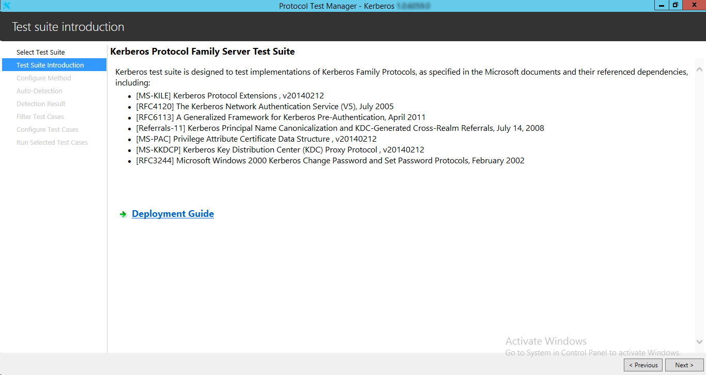
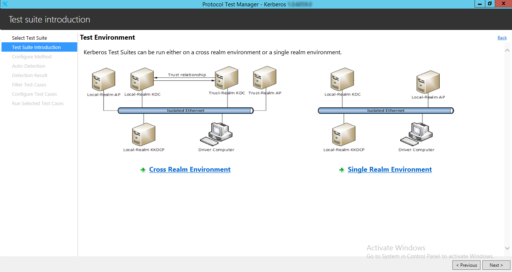
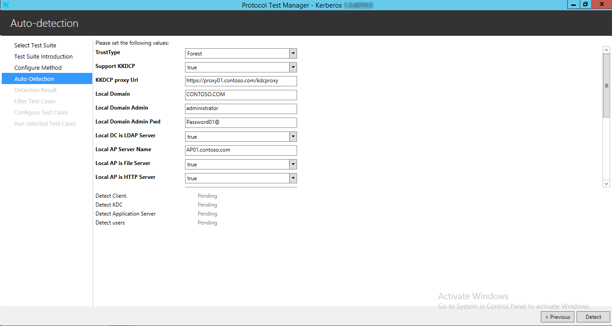
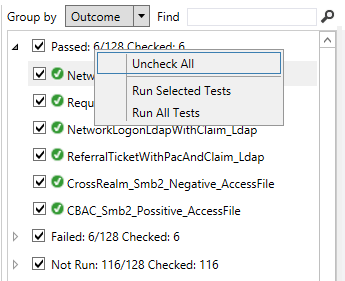

# Kerberos Family Test Suite User Guide

## Contents
* [Introduction](#_Toc427061817)
* [Quick Start Checklist](#_Toc427061819)
* [How Do I?](#_Toc427061821)
* [Requirements](#_Toc427061822)
    * [Network Infrastructure](#_Toc427061823)
    * [Environment](#_Toc427061824)
    * [Local-Realm Key Distribution Center (KDC)](#_Toc427061825)
    * [Trust-Realm Key Distribution Center (KDC)](#_Toc427061826)
    * [Local-Realm Application Server Computer (AP)](#_Toc427061827)
    * [Trust-Realm Application Server Computer (AP)](#_Toc427061828)
    * [Local-Realm Kerberos Key Distribution Center Proxy Server (KKDCP)](#_Toc427061829)
    * [Driver Computer (ENDPOINT)](#_Toc427061830)
    * [Software](#_Toc427061831)
* [Network Setup](#_Toc427061832)
    * [Cross-Forest Trust Environment](#_Toc427061833)
    * [Verify Connectivity](#_Toc427061834)
* [Computer Setup](#_Toc427061835)
    * [Set up the Local-Realm/Trust-Realm KDC Computer](#_Toc427061836)
    * [Set up the Local-Realm/Trust-Realm Application Server Computer](#_Toc427061837)
    * [Set up the Local-Realm KKDCP Computer](#_Toc427061838)
    * [Set up the Driver Computer](#_Toc427061839)
    * [Installed Files and Folders](#_Toc427061840)
* [Configuration](#_Toc427061841)
    * [Configuring Windows-Based Computers](#_Toc427061842)
		* [Configure the Local-Realm KDC Computer](#_Toc427061843)
		* [Configure the Trust-Realm KDC Computer](#_Toc427061844)
		* [Configure the Local-Realm Application Server Computer](#_Toc427061845)
		* [Configure the Trust-Realm Application Server Computer](#_Toc427061846)
		* [Configure the Local-Realm KKDCP Computer](#_Toc427061847)
		* [Configure the Driver Computer](#_Toc427061848)
    * [Configuring Computers Not Based on Windows](#_Toc427061849)
		* [Configuring Local-Realm KDC Computer that is Not Windows-Based](#_Toc427061850)
		* [Configuring Local-Realm Application Server Computer that is Not Windows-Based](#_Toc427061851)
		* [Configuring Cross-Realm Trust between Non-Windows KDC and Windows KDC](#_Toc427061852)
		* [Configuring Cross-Realm Application Server Computer that is Not Windows-Based](#_Toc427061853)
		* [Configuring Local-Realm KKDCP Computer that is Not Windows-Based](#_Toc427061854)
    * [Configuring the Test Suite](#_Toc427061855)
		* [Common Configuration Settings](#_Toc427061856)
		* [Local Realm Configuration Settings](#_Toc427061857)
		* [Trust Realm Configuration Settings](#_Toc427061858)
* [Running Test Cases](#_Toc427061859)
    * [Run Test Cases with Microsoft Protocol Test Manager](#_Toc427061860)
    * [Run All Test Cases with Batch File](#_Toc427061861)
    * [Run Specified Test Cases](#_Toc427061862)
    * [Check Test Results](#_Toc427061863)
		* [Review the Log Files](#_Toc427061864)
		* [Manage the Generation of Log Files](#_Toc427061865)
* [Debugging Test Cases](#_Toc427061866)
* [Troubleshooting](#_Toc427061867)
    * [Ping Failure](#_Toc427061868)
    * [Test Run Issues](#_Toc427061869)

## <a name="_Toc427061817"/>Introduction

This guide provides information about how to install, configure, and run the Kerberos Family Test Suite and its environment. This suite of tools is designed to test implementations of Kerberos Family Protocols, as specified in the Microsoft documents and their referenced dependencies. The Kerberos Network Authentication Service (V5) Family consists of a set of Microsoft protocols including _Kerberos Protocol Extensions [MS-KILE], Privilege Attribute Certificate Data Structure [MS-PAC] and Kerberos Key Distribution Center (KDC) Proxy Protocol [MS-KKDCP]._ The Kerberos Family referenced RFCs include _The Kerberos Network Authentication Service (V5) [RFC4120], A Generalized Framework for Kerberos Pre-Authentication [RFC6113], Kerberos Principal Name Canonicalization and KDC-Generated Cross-Realm Referrals [Referrals-11] and Microsoft Windows 2000 Kerberos Change Password and Set Password Protocols [RFC3244]._ This guide provides information about using the test suite on Microsoft Windows operating systems and on operating systems that are not Windows-based.

This suite of tools tests only the protocol implementation behaviors that are observed on the wire. For detailed information about the scope of this test suite, see _Kerberos Test Design Specification (Kerberos_TestDesignSpecification.md)_.

## <a name="_Toc427061819"/>Quick Start Checklist

The following checklist summarizes the steps required to get the test suite up and running. The checklist also provides references to documentation that can help you get started. 

|  **Check**|  **Task**|  **Topic**| 
| -------------| -------------| ------------- |
| □| Download the test suite for the protocol implementation| For a list of the files that the download package contains, see [Installed Files and Folders](#_Toc427061840).| 
| □| Confirm that your test environment and computers meet the requirements of the test suite| For information about the requirements of the test suite, see [Requirements](#_Toc427061822). | 
| □| Install the software prerequisites| For information about software that must be installed on the computers in your test environment before the test suite is installed, see [Software](#_Toc427061831).| 
| □| Set up the Local-Realm Key Distribution Center (KDC) Computer| See [Set Up the Local-Realm/Trust-Realm KDC Computer](#_Toc427061836).| 
| □| Set up the Trust-Realm Key Distribution Center (KDC) Computer| See [Set Up the Local-Realm/Trust-Realm KDC Computer](#_Toc427061836).| 
| □| Set up the Local-Realm Application Server (AP) Computer| See [Set Up the Local-Realm/Trust-Realm Application Server Computer](#_Toc427061837).| 
| □| Set up the Trust-Realm Application Server (AP) Computer| See [Set Up the Local-Realm/Trust-Realm Application Server Computer](#_Toc427061837).| 
| □| Set up the Local-Realm KKDCP Computer| See [Set up the Local-Realm KKDCP Computer](#_Toc427061838)| 
| □| Set up the Driver (ENDPOINT) Computer| See [Set Up the Driver Computer](#_Toc427061839).| 
| □| Set up the network| See [Network Setup.](#_Toc427061832)| 
| □| Verify the connection from the driver computer to the SUT and other computers| See [Verify Connectivity](#_Toc427061834).| 
| □| Configure the Local-Realm KDC computer| See [Configure the Local-Realm KDC Computer](#_Toc427061847).| 
| □| Configure the Trust-Realm KDC computer| See [Configure the Trust-Realm KDC Computer](#_Toc427061844).| 
| □| Configure the Local-Realm Application Server computer| See [Configure the Local-Realm Application Server Computer](#_Toc427061845).| 
| □| Configure the Trust-Realm Application Server computer| See [Configure the Trust-Realm Application Server Computer](#_Toc427061846).| 
| □| Configure the Local-Realm KKDCP Computer | See [Configure the Local-Realm KKDCP Computer](#_Toc427061847)| 
| □| Configure the driver computer| See [Configure the Driver Computer](#_Toc427061848).| 
| □| Configure test suite settings| See [Configuring the Test Suite](#_Toc427061855).| 

## <a name="_Toc427061821"/>How Do I?
Use the following quick reference to learn how to complete common tasks.

|  **How do I…?**|  **For more information…**| 
| -------------| ------------- |
| Set up the test environment| [Network Setup](#_Toc427061832) and [Computer Setup](#_Toc427061835)| 
| Verify the connection from the driver computer to other computers and between other computers in the test environment| [Verify Connectivity](#_Toc427061834)| 
| Setup the Local-Realm/Trust-Realm KDC Computer| [Set Up the Local-Realm/Trust-Realm KDC Computer](#_Toc427061836)| 
| Setup the Local-Realm/Trust-Realm Application Server Computer| [Set Up the Local-Realm/Trust-Realm Application Server Computer](#_Toc427061837)| 
| Setup the Driver Computer| [Set Up the Driver Computer](#_Toc427061839)| 
| Configure the Local-Realm KDC Computer| [Configure the Local-Realm KDC Computer](#_Toc427061843) or [Configure a KDC Computer that is Not Windows-based](#_Toc427061850)| 
| Configure the Trust-Realm KDC Computer| [Configure the Trust-Realm KDC Computer](#_Toc427061844) or [Configure a KDC Computer that is Not Windows-based](#_Toc427061850)| 
| Configure the Local-Realm Application Server Computer| [Configure the Local-Realm Application Server Computer](#_Toc427061845) | 
| Configure the Trust-Realm Application Server Computer| [Configure the Trust-Realm Application Server Computer](#_Toc427061846) | 
| Configure the Driver Computer| [Configure the Driver Computer](#_Toc427061848)| 
| Configure the test suite settings| [Configuring the Test Suite](#_Toc427061855)| 
| Run test cases| [Run All Test Cases](#_Toc427061860), [Run Specified Test Cases](#_Toc427061862)| 
| Debug my own test cases| [Debugging Test Cases](#_Toc427061866)| 
| Get the results of test runs| [Check Test Results](#_Toc427061863)| 
| Troubleshoot problems| [Troubleshooting](#_Toc427061867)| 

## <a name="_Toc427061822"/>Requirements 

This section describes the requirements for the test environment and computers that are used to run this test suite.

Note 

>The requirements in this section apply only to the Windows-based computers in the test environment. Note that the driver computer must use a Windows-based operating system.

### <a name="_Toc427061823"/>Network Infrastructure

* A test network is required to connect the test computer systems

* It must consist of an isolated hub or switch

* It must not be connected to a production network or used for any other business or personal communications or operations

* It must not be connected to the internet 

* IP addresses must be assigned for a test network

* Computer names should be assigned in a test network infrastructure

* User credentials used on the system must be dedicated to the test network infrastructure

* Details including computer IP addresses, names and credentials are saved in log files

* Refer to the Detailed Logging Support section 

Refer to the Privacy Statement and LICENSE for further information

### <a name="_Toc427061824"/>Environment

Run this test suite in a domain environment that contains the following computers, physical or virtual: 

Note 

>For Windows based computer acting as the Key Distribution Center, it requires an Active Directory working as its database. 

* Need a domain environment for the Cross-Forest Trust to be built upon.

* One computer set up as a Windows-based Local-Realm Key Distribution Center (Local-Realm KDC) or as a Local-Realm KDC that is not based on the Windows operating system. If the computer is running on Windows, it must be running on Microsoft® Windows Server® 2012 R2, 64-bit edition, with the latest updates.

* One computer set up as a Windows-based Trust-Realm Key Distribution Center (Trust-Realm KDC) or as a Trust-Realm KDC that is not based on the Windows operating system. If the computer is running on Windows, it must be running on Microsoft® Windows Server® 2012 R2, 64-bit edition, with the latest updates. The trust should be set up as a cross-forest trust.

* One computer configured as an Application Server (AP) joined to the local realm. If the computer is running on Windows, it must be running on Microsoft® Windows Server® 2012 R2, 64-bit edition, with the latest updates.

* One computer configured as an Application Server (AP) joined to the trust realm. If the computer is running on Windows, it must be running on Microsoft® Windows Server® 2012 R2, 64-bit edition, with the latest updates.

* One computer set up as a Windows-based Local-Realm Kerberos Key Distribution Center Proxy Server (Local-Realm KKDCP) or as a Local-Realm KKDCP that is not based on the Windows operating system. If the computer is running on Windows, it must be running on Microsoft® Windows Server® 2012 R2, 64-bit edition, with the latest updates.

* One driver computer configured as an Application Client (Endpoint) joined to the local realm. If the computer is running on Windows, it must be running on Microsoft® Windows® 8.1, 64-bit edition, with the latest updates.

### <a name="_Toc427061825"/>Local-Realm Key Distribution Center (KDC)

If the KDC is running on Windows, the minimum requirements are as follows:

|  **Requirement**|  **Description**| 
| -------------| ------------- |
| Operating system| Microsoft Windows Server 2012 R2 or later versions| 
| Services| Active Directory Domain Services (AD DS)| 
| | DNS Server| 
| Memory| 1 GB RAM| 
| Disk space| 60 GB| 

### <a name="_Toc427061826"/>Trust-Realm Key Distribution Center (KDC)

If the KDC is running on Windows, the minimum requirements are as follows:

|  **Requirement**|  **Description**| 
| -------------| ------------- |
| Operating system| Microsoft Windows Server 2012 R2 or later versions| 
| Services| Active Directory Domain Services (AD DS)| 
| | DNS Server| 
| Memory| 1 GB RAM| 
| Disk space| 60 GB| 

### <a name="_Toc427061827"/>Local-Realm Application Server Computer (AP)

If the application server computer is running on Windows, the minimum requirements are as follows:

|  **Requirement**|  **Description**| 
| -------------| ------------- |
| Operating system| Microsoft Windows Server 2012 R2 or later versions| 
| Services| File And Storage Service (**File Service Resource Manager** installed)| 
| | Web Server (IIS) (**Windows Authentication** enabled)| 
| Memory| 1 GB RAM| 
| Disk space| 60 GB| 

### <a name="_Toc427061828"/>Trust-Realm Application Server Computer (AP)

If the application server computer is running on Windows, the minimum requirements are as follows:

|  **Requirement**|  **Description**| 
| -------------| ------------- |
| Operating system| Microsoft Windows Server 2012 R2 or later versions| 
| Services| File And Storage Service (**File Service Resource Manager** installed)| 
| | Web Server (IIS) (**Windows Authentication** enabled)| 
| Memory| 1 GB RAM| 
| Disk space| 60 GB| 

### <a name="_Toc427061829"/>Local-Realm Kerberos Key Distribution Center Proxy Server (KKDCP)

If the KKDCP is running on Windows, the minimum requirements are as follows:

|  **Requirement**|  **Description**| 
| -------------| ------------- |
| Operating system| Microsoft Windows Server 2012 R2 or later versions| 
| Services| Web Server (IIS) | 
| Memory| 1 GB RAM| 
| Disk space| 60 GB| 

### <a name="_Toc427061830"/>Driver Computer (ENDPOINT)

The minimum requirements for the driver computer are as follows:

|  **Requirement**|  **Description**| 
| -------------| ------------- |
| Operating system| Microsoft Windows 8.1 or later versions| 
| Memory| 2 GB RAM| 
| Disk space| 60 GB| 

### <a name="_Toc427061831"/>Software 
All of the following software must be installed on the driver computer _before_ the installation of this test suite.

**Required Software**

All common softwares listed in [prerequisites](https://github.com/microsoft/WindowsProtocolTestSuites#prerequisites) for running Windows Protocol Test Suites.

* **Windows PowerShell 3.0 or later**

  **Windows PowerShell 3.0 or later** is required.

**Optional Software**

* **Protocol Test Manager**

    **Protocol Test Manager** provides a graphical user interface (UI) to facilitate configuration and execution of Microsoft® Windows Protocol Test Suite tests. Its use is highly recommended.

* **Microsoft® Message Analyzer**
  
  **Microsoft® Message Analyzer** (MMA) is listed here as an optional tool because the test cases of themselves neither perform live captures or capture verifications during execution. However, MMA can be helpful with debugging test case results, by analyzing ETL files that are generated by the Test Cases, that is, if you enable the the Automatic Network Capturing feature in the Protocol Test Manager (PTM) during test case configuration. The Automatic Network Capturing feature is further described in the [PTF User Guide](https://github.com/Microsoft/ProtocolTestFramework/blob/staging/docs/PTFUserGuide.md#-automatic-network-capturing).

  Note
  
  November 25 2019 - Microsoft Message Analyzer (MMA) has been retired and removed from public-facing sites on microsoft.com. A private MMA build is available for testing purposes; to request it, send an email to [getmma@microsoft.com](mailto:getmma@microsoft.com).

## <a name="_Toc427061832"/>Network Setup

Run this test suite in domain environment with an isolated Ethernet connection. You can use either physical or virtual machines. This section describes the domain test environment using physical computers. 

For information about configuring a virtual machine, see [https://docs.microsoft.com/en-us/virtualization/hyper-v-on-windows/quick-start/create-virtual-machine](https://docs.microsoft.com/en-us/virtualization/hyper-v-on-windows/quick-start/create-virtual-machine). The configuration of virtual machines for use with this test suite is out of scope for this guide. 

### <a name="_Toc427061833"/>Cross-Forest Trust Environment

The forest-trust environment requires interactions between the following computers and server roles: 

* The driver computer runs the test cases by sending requests over the wire in the form of protocol messages. 

* The local-Realm KKDCP run the implementation of the protocol MS-KKDCP that is being tested. The KKDCP relays the messages between the driver computer and the KDCs.

* The Local-Realm KDC and Trust-Realm KDC run the implementation of the protocol that is being tested. The KDCs respond to the requests that the driver computer sends.

* The Local-Realm Application Server Computer and the Trust-Realm Application Server Computer run the implementation of the Server Protocols that utilize the Kerberos Protocol as their authentication method and replies the requests sent by the driver computer.

The following figure shows a forest-trust environment using an isolated Ethernet connection. 

Note 

In the document, local realm name is configured as CONTOSO.COM and trust realm name is KERB.COM. Realm name is case sensitive according to the MS-KILE documentation.

Multiple Domains – Cross Forest Trust

The following table lists a suggested network configurations for all the test machines:

| &#32;| &#32;| &#32;| &#32;| &#32;| &#32; |
| -------------| -------------| -------------| -------------| -------------| ------------- |
| Machine Name/Access Point| Role| Realm Name| IPv4| Subnet Mask| DNS Server| 
| DC01| Local-Realm KDC| CONTOSO.COM| 192.168.0.1| 255.255.255.0| 127.0.0.1; 192.168.0.2| 
| AP01| Local-Realm AP| CONTOSO.COM| 192.168.0.10| 255.255.255.0| 192.168.0.1| 
| PROXY01| Local-Realm KKDCP| CONTOSO.COM| 192.168.0.3| 255.255.255.0| 192.168.0.1;| 
| | | | | | 192.168.0.2| 
| DC02| Trust-Realm KDC| KERB.COM| 192.168.0.2| 255.255.255.0| 127.0.0.1;| 
| | | | | | 192.168.0.1| 
| AP02| Trust-Realm AP| KERB.COM| 192.168.0.20| 255.255.255.0| 192.168.0.2| 
| ENDPOINT01| Driver Computer| CONTOSO.COM| 192.168.0.101| 255.255.255.0| 192.168.0.1;| 
| | | | | | 192.168.0.2| 

### <a name="_Toc427061834"/>Verify Connectivity

After you install the environment, verify the connection from the driver computer to the KDC Computers, and among all other computers in the test environment. The following provides a general list of steps you can use to check for connectivity between two Windows-based computers. For further information, see the administration guide for your operating system.

To check the connection from a Windows-based computer

Note 

* Disable active firewalls in the test environment.

* Press Win Key + R. 

* In the **Run** dialog box, type **cmd** and then click **OK**.

* At the command promote, type **ping** followed by the IP address of the KDC computers or the other computers in the test environment and then press **Enter**. The following example checks the connection to a KDC computer with IP address 192.168.0.1:
 &#62;  ping 192.168.0.1

* If the KDC is named “DC01”, type **ping** followed by the hostname and press **Enter**:
 &#62;  ping DC01

* Repeat to confirm connectivity between all computers in the test environment.

Note 

>Verifying connection using hostname is a must because Kerberos client requires a DNS service for locating KDCs. 

Do not proceed with the installation of the test suite until connectivity is confirmed. Any issues with network connectivity must be resolved before you configure the test suite.

## <a name="_Toc427061835"/>Computer Setup

This section explains how to set up the test computers and configure the network for the test environment.

### <a name="_Toc427061836"/>Set up the Local-Realm/Trust-Realm KDC Computer
This section provides information about how to set up the Windows-based Local-Realm/Trust-Realm KDC Computer for use with this test suite.

To set up a Windows-based Local-Realm/Trust-Realm KDC computer:

* Configure the Computer IP and Computer Name values as you wish.

* Install Active Directory Domain Services and the DNS Server manually. 

* Promote the KDC computer to a Writable Domain Controller and create a new forest. The domain name must be different from the domain name that is created on the other KDC computer. And currently, we support only simple domain like CONTOSO.COM, not subdomain like LOCAL.CONTOSO.COM.

* Copy Kerberos-TestSuite-ServerEP.msi installer on the Windows-based Local-Realm/Trust-Realm KDC.

* Copy Protocol Test Suites Privacy Statement.docx onto the Windows-based Local-Realm/Trust-Realm KDC.

* Run the Kerberos-TestSuite-ServerEP.msi installer on the Windows-based Local-Realm/Trust-Realm KDC.

* When options are promoted, select the option, **Install and configure Windows System Under Test (SUT)**.

To set up a KDC that is not based on the Windows operating system, see [Configuring a KDC Computer that is Not Windows-based](#_Toc427061850).

### <a name="_Toc427061837"/>Set up the Local-Realm/Trust-Realm Application Server Computer
This section provides information about how to set up a Windows-based Local-Realm/Trust-Realm Application Server Computer for use with this test suite.

To set up a Windows-based Local-Realm/Trust-Realm Application Server Computer:

* Join the Application Server Computer to the Local-Realm/Trust-Realm domain.

* Restart Computer.

* Copy Kerberos-TestSuite-ServerEP.msi installer onto the Windows-based Local-Realm/Trust-Realm Application Server Computer.

* Copy Protocol Test Suites Privacy Statement.docx onto the Windows-based Local-Realm/Trust-Realm Application Server Computer.

* Run the Kerberos-TestSuite-ServerEP.msi installer on the Windows-based Local-Realm/Trust-Realm Application Server Computer.

* When options are promoted, select the option, **Install and configure Windows System Under Test (SUT)**.

To set up an Application Server that is not based on the Windows operating system, see [Configuring an Application Server Computer that is Not Windows-based](#_Toc427061851).

### <a name="_Toc427061838"/>Set up the Local-Realm KKDCP Computer
This section provides information about how to set up a Windows-based Local-Realm KKDCP Computer for use with this test suite.

To set up a Windows-based Local-Realm KKDCP:

* Join the KKDCP Computer to the Local-Realm domain.

* Restart Computer.

* Copy Kerberos-TestSuite-ServerEP.msi installer onto the Local-Realm KKDCP Computer.

* Copy Protocol Test Suites Privacy Statement.docx onto the Local-Realm KKDCP Computer.

* Run the Kerberos-TestSuite-ServerEP.msi installer on the Local-Realm KKDCP Computer.

* When options are promoted, select the option, **Install and configure Windows System Under Test (SUT)**.

To set up a KKDCP that is not based on the Windows operating system, see [Configuring a KKDCP that is Not Windows-based](#_Toc427061854).

### <a name="_Toc427061839"/>Set up the Driver Computer
This section provides information about how to set up the Windows-based Driver Computer for use with this test suite.

Important 

>Microsoft Visual Studio 2017, and the Protocol Test Framework must be installed on the driver computer before running the Kerberos-TestSuite-ServerEP.msi installer.

To set up the driver computer:

* Join the Driver Computer to the Local-Realm domain.

* Restart Computer.

* Copy the test suite package to the driver computer.

* Extract the files of the test suite from the package, but do not install them.

* Install the required and optional software described earlier.

* Run the extracted Kerberos-TestSuite-ServerEP.msi file.

* When options are promoted, select the option, **Install Test Suite on Driver Computer**.

### <a name="_Toc427061840"/>Installed Files and Folders

The installation process for this test suite adds the following folders and files to the driver computer at C:\MicrosoftProtocolTests\Kerberos\Server-Endpoint\ &#60; _version &#35;  &#62;_ \.

Note 

The path may vary based on your installation location.
The  &#60; version &#35;  &#62;  placeholder indicates the installed build of the test suite.

|  **File or Folder**|  **Description**| 
| -------------| ------------- |
| Batch| Command files that you can use to run individual test cases, BVT test cases, Categorized test cases or all test cases.| 
| Bin| Test suite binaries and configuration files.| 
| Scripts| Scripts that are used to set up and configure the Driver Computer, the Key Distribution Centers and the Application Servers.| 
| LICENSE.rtf| The End User License Agreement.| 

## <a name="_Toc427061841"/>Configuration

This section explains how to configure the network and computers in the test environment for this test suite.

### <a name="_Toc427061842"/>Configuring Windows-Based Computers

This section explains how to configure the test environment for computers running Windows-based operating systems. For general information about configuring the test environment for computers that are not based on Windows, see [Configuring Computers that are Not Based on Windows.](#_Toc427061849)

#### <a name="_Toc427061843"/>Configure the Local-Realm KDC Computer

This section provides a general list of steps that you can use to configure the Local-Realm KDC computer in a Windows-based test environment. For specific information about how to complete these steps, see the administration guide for your operating system.

To configure the Local-Realm KDC

* Log on the Local-Realm KDC computer as domain administrator. 

* Go to C:\MicrosoftProtocolTests\Kerberos\Server-Endpoint\ _&#60; version &#35;  &#62;_ \Scripts, and open the ParamConfig.xml file.

* Edit the properties as shown in the following table.

| &#32;| &#32; |
| -------------| ------------- |
|  **Property**|  **Description**| 
|  **LogPath**| The log path for configuration logs and test suite adapter script logs. | 
| | Default value: **C:\temp**| 
|  **LocalRealm.RealmName**| The name of the local realm being configured.| 
| | Default value: **contoso.com**| 
|  **LocalRealm.KDC.NetBiosName**| The NetBiosName of the KDC in local realm.| 
| | Default value: **DC01$**| 
|  **LocalRealm.FileShare.NetBiosName**| The NetBiosName of the FileShare Server in the local realm.| 
| | Default value: **AP01$**| 
|  **LocalRealm.FileShare.Password**| The Password of the FileShare Server Account in the local realm.| 
| | Default value: **Password02!**| 
|  **LocalRealm.WebServer.NetBiosName**| The NetBiosName of the WebServer  in the local realm.| 
| | Default value: **AP01$**| 
|  **LocalRealm.WebServer.Password**| The Password of the WebServer  Account in the local realm.| 
| | Default value: **Password02!**| 
|  **LocalRealm.ClientComputer.NetBiosName**| The NetBiosName of the Client Computer in the local realm.| 
| | Default value: **ENDPOINT01$**| 
|  **LocalRealm.ClientComputer.Password**| The Password of the Client Computer in the local realm.| 
| | Default value: **Password05!**| 
|  **LocalRealm.AuthNotRequired.NetBiosName**| The Account Name of the “AuthorizationNotRequired” Service Account in the local realm.| 
| | Default value: **AuthNotRequired$**| 
|  **LocalRealm.AuthNotRequired.Password**| The Password of the Application Server Account in the local realm.| 
| | Default value: **Password01!**| 
|  **LocalRealm.Administrator.Username**| The user name for the administrator account in the local realm.| 
| | Default value: **administrator**| 
|  **LocalRealm.Administrator.Password**| The password for the administrator user account in the local realm.| 
| | Default value: **Password01@**| 
|  **LocalRealm.User01.Username**| The user name for the user account with no claims information.| 
| | Default value: **test01**| 
|  **LocalRealm.User01.Password**| The password for the user account with no claims information.| 
| | Default value: **Password01^**| 
|  **LocalRealm.User01.Group**| The local group the user account is joined.| 
| | Default value: **testGroup**| 
|  **LocalRealm.User02.Username**| The user name for the user account with claims information.| 
| | Default value: **test02**| 
|  **LocalRealm.User02.Password**| The password for the user account with claims information.| 
| | Default value: **Password01&**| 
|  **LocalRealm.User03.Username**| The user name for the user account that is not allowed for delegation.| 
| | Default value: **UserDelegNotAllowed**| 
|  **LocalRealm.User03.Password**| The password for the user account that is not allowed for delegation.| 
| | Default value: **Chenjialuo;**| 
|  **LocalRealm.User04.Username**| The user name for the user account that is trusted for delegation.| 
| | Default value: **UserTrustedForDeleg**| 
|  **LocalRealm.User04.Password**| The password for the user account that is trusted for delegation.| 
| | Default value: **Yuanchengzhi;**| 
|  **LocalRealm.User05.Username**| The user name for the user account that does not have the UPN.| 
| | Default value: **UserWithoutUPN**| 
|  **LocalRealm.User05.Password**| The password for the user account that does not have the UPN.| 
| | Default value: **Zhangwuji;**| 
|  **LocalRealm.User06.Username**| The user name for the user account that does not require pre-authentication.| 
| | Default value: **UserPreAuthNotReq**| 
|  **LocalRealm.User06.Password**| The password for the user account that does not require pre-authentication.| 
| | Default value: **Duanyu;**| 
|  **LocalRealm.User07.Username**| The user name for the user account that has been disabled.| 
| | Default value: **UserDisabled**| 
|  **LocalRealm.User07.Password**| The password for the user account that has been disabled.| 
| | Default value: **Chenjinnan;**| 
|  **LocalRealm.User08.Username**| The user name for the user account that has expired.| 
| | Default value: **UserExpired**| 
|  **LocalRealm.User08.Password**| The password for the user account that has expired.| 
| | Default value: **Guojing;**| 
|  **LocalRealm.User09.Username**| The user name for the user account that has been locked out.| 
| | Default value: **UserLocked**| 
|  **LocalRealm.User09.Password**| The password for the user account that has been locked out.| 
| | Default value: **Qiaofeng;**| 
|  **LocalRealm.User10.Username**| The user name for the user account that is out of logon hours.| 
| | Default value: **UserOutofLogonHours**| 
|  **LocalRealm.User10.Password**| The password for the user account that is out of logon hours.| 
| | Default value: **Huyidao;**| 
|  **LocalRealm.User11.Username**| The user name for the user account that must change password, but the PasswordMustChange is set to a past time.| 
| | Default value: **UserPwdMustChgPast**| 
|  **LocalRealm.User11.Password**| The password for the user account that must change password, but the PasswordMustChange is set to a past time.| 
| | Default value: **Weixiaobao;**| 
|  **LocalRealm.User12.Username**| The user name for the user account that must change password, but the PasswordMustChange is set to zero.| 
| | Default value: **UserPwdMustChgZero**| 
|  **LocalRealm.User12.Password**| The password for the user account that must change password, but the PasswordMustChange is set to zero.| 
| | Default value: **Yangguo;**| 
|  **LocalRealm.ClaimType.DisplayName**| The display name for the newly created claim type.| 
| | Default value: **Department**| 
|  **LocalRealm.ResourceProperties.DisplayName**| The display name for the newly created resource property.| 
| | Default value: **PET_ImpactLevel**| 
|  **LocalRealm.Rules.Name**| The name for the newly created central access rule.| 
| | Default value: **PETAccessRule**| 
|  **LocalRealm.Policy.Name**| The name for the newly created central access policy.| 
| | Default value: **PETAccessPolicy**| 
|  **TrustRealm.RealmName**| The name of the trust realm being configured.| 
| | Default value: **KERB.COM**| 

* Start Windows® PowerShell by right-clicking on the **Windows PowerShell** icon, and then click **Run as Administrator** or, from a Windows PowerShell command window, type:
Start-process powershell -verb runAs

* At the command promote, type Set-ExecutionPolicy Unrestricted -F, and press **Enter**.

* Type cd C:\MicrosoftProtocolTests\Kerberos\Server-Endpoint\ _&#60; version &#35;  &#62;_ \Scripts, and press **Enter**.

* Type .\Configure-DC01.ps1 –WorkingPath “C:\MicrosoftProtocolTests\Kerberos\Server-Endpoint\ _&#60; version &#35;  &#62;_”, and press **Enter**.

* The script will restart the computer automatically. After restart, Administrator account password will be changed as “Password01@”. When there’s UI automatically run, please don’t move the cursor, otherwise some UI automation focus will miss and environment will not be setup correctly.

* After the script finished, check the domain properties in Active Directory Domains and Trusts dialog. Make sure the "The other domain supports Kerberos AES Encryption" checkbox is checked in trusts properties.

* Make sure **config-dc01computer.finished.signal** appears under System Drive.

#### <a name="_Toc427061844"/>Configure the Trust-Realm KDC Computer

This section provides a general list of steps that you can use to configure the Trust-Realm KDC computer in a Windows-based test environment. For specific information about how to complete these steps, see the administration guide for your operating system.

To configure the Trust-Realm KDC

* Verify that the Local-Realm KDC Computer is configured and running.

* Log on the Trust-Realm KDC computer as domain administrator. 

* Go to C:\MicrosoftProtocolTests\Kerberos\Server-Endpoint\ _&#60; version &#35;  &#62;_ \Scripts, and open the ParamConfig.xml file.

* Edit the properties as shown in the following table.

| &#32;| &#32; |
| -------------| ------------- |
|  **Property**|  **Description**| 
|  **LogPath**| The log path for configuration logs and test suite adapter script logs. | 
| | Default value: **C:\TestLogs**| 
|  **LocalRealm.RealmName**| The name of the local realm being configured.| 
| | Default value: **contoso.com**| 
|  **TrustRealm.RealmName**| The name of the trust realm being configured.| 
| | Default value: **kerb.com**| 
|  **TrustRealm.KDC.NetBiosName**| The NetBiosName of the KDC in trust realm.| 
| | Default value: **DC02$**| 
|  **TrustRealm.FileShare.NetBiosName**| The NetBiosName of the FileShare Server in the trust realm.| 
| | Default value: **AP02$**| 
|  **TrustRealm.FileShare.Password**| The Password of the FileShare Server Account in the trust realm.| 
| | Default value: **Password04!**| 
|  **TrustRealm.WebServer.NetBiosName**| The NetBiosName of the WebServer  in the trust realm.| 
| | Default value: **AP02$**| 
|  **TrustRealm.WebServer.Password**| The Password of the WebServer  Account in the trust realm.| 
| | Default value: **Password04!**| 
|  **TrustRealm.Administrator.Username**| The user name for the administrator account in the trust realm.| 
| | Default value: **administrator**| 
|  **TrustRealm.Administrator.Password**| The password for the administrator user account in the trust realm.| 
| | Default value: **Password01 &#35;** | 
|  **TrustRealm.User01.Username**| The user name for the user account with no claims information.| 
| | Default value: **test03**| 
|  **TrustRealm.User01.Password**| The password for the user account with no claims information.| 
| | Default value: **Password01 &#42;** | 
|  **TrustRealm.User01.Group**| The local group the user account is joined.| 
| | Default value: **testGroup**| 
|  **TrustRealm.User02.Username**| The user name for the user account with claims information.| 
| | Default value: **test04**| 
|  **TrustRealm.User02.Password**| The password for the user account with claims information.| 
| | Default value: **Password01(**| 
|  **TrustRealm.ClaimType.DisplayName**| The display name for the newly created claim type.| 
| | Default value: **Department**| 
|  **TrustRealm.ResourceProperties.DisplayName**| The display name for the newly created resource property.| 
| | Default value: **PET_ImpactLevel**| 
|  **TrustRealm.Rules.Name**| The name for the newly created central access rule.| 
| | Default value: **PETAccessRule**| 
|  **TrustRealm.Policy.Name**| The name for the newly created central access policy.| 
| | Default value: **PETAccessPolicy**| 

* Start Windows® PowerShell by right-clicking on the **Windows PowerShell** icon, and then click **Run as Administrator** or, from a Windows PowerShell command window, type:
Start-process powershell -verb runAs

* At the command promote, type Set-ExecutionPolicy Unrestricted -F, and press **Enter**.

* Type cd C:\MicrosoftProtocolTests\Kerberos\Server-Endpoint\ _&#60; version &#35;  &#62;_ \Scripts, and press **Enter**.

* Type .\Configure-DC02.ps1 –WorkingPath “C:\MicrosoftProtocolTests\Kerberos\Server-Endpoint\ _&#60; version &#35;  &#62;_”, and press **Enter**.

* The script will restart the computer automatically. After restart, Administrator account password will be changed as “Password01 &#35; ”. When there’s UI automatically run, please don’t move the cursor, otherwise some UI automation focus will miss and environment will not be setup correctly.

* Make sure **config-dc02computer.finished.signal** appears under System Drive.

#### <a name="_Toc427061845"/>Configure the Local-Realm Application Server Computer 

This section provides a general list of steps that you can use to configure the Local-Realm Application Server computer in a Windows-based test environment. For specific information about how to complete these steps, see the administration guide for your operating system.

To configure the Local-Realm Application Server computer

* Verify that the Local-Realm KDC Computer is configured and running.

* Log on to the Local-Realm Application Server computer as local administrator.

* Go to C:\MicrosoftProtocolTests\Kerberos\Server-Endpoint\ _&#60; version &#35;  &#62;_ \Scripts, and open the ParamConfig.xml file.

* Edit the properties as shown in the following table.

| &#32;| &#32; |
| -------------| ------------- |
|  **Property**|  **Description**| 
|  **LogPath**| The log path for configuration logs and test suite adapter script logs. | 
| | Default value: **C:\temp**| 
|  **LocalRealm.WebServer.wwwroot**| The path of the webserver site wwwroot.| 
| | Default value: **C:\inetpub\wwwroot**| 
|  **LocalRealm.WebServer.user**| The user account that the Webserver is granted privilege to.| 
| | Default value: **contoso\test01**| 
|  **LocalRealm.FileShare.FsrmProperty**| The FsrmProperty to be added to the File Server.| 
| | Default value: **PETImpactLevel**| 
|  **LocalRealm.FileShare.Policy**| The Central Access Policy to be added to the expected share folder.| 
| | Default value: **PETAccessPolicy**| 

* Start Windows® PowerShell by right-clicking on the **Windows PowerShell** icon, and then click **Run as Administrator** or, from a Windows PowerShell command window, type:
Start-process powershell -verb runAs

* At the command promote, type Set-ExecutionPolicy Unrestricted -F, and press **Enter**.

* Type cd C:\MicrosoftProtocolTests\Kerberos\Server-Endpoint\ _&#60; version &#35;  &#62;_ \Scripts, and press **Enter**.

* Type .\Configure-AP01.ps1 –WorkingPath “C:\MicrosoftProtocolTests\Kerberos\Server-Endpoint\ _&#60; version &#35;  &#62;_”, and press **Enter**.

* The script will restart your computer. After restart, Administrator account password will be changed as “Password01@”.

* Make sure **config-ap01computer.finished.signal** appears under System Drive.

#### <a name="_Toc427061846"/>Configure the Trust-Realm Application Server Computer 

This section provides a general list of steps that you can use to configure the Trust-Realm Application Server computer in a Windows-based test environment. For specific information about how to complete these steps, see the administration guide for your operating system.

To configure the Trust-Realm Application Server computer

* Verify that the Trust-Realm KDC Computer is configured and running.

* Log on to the Trust-Realm Application Server computer as local administrator.

* Go to C:\MicrosoftProtocolTests\Kerberos\Server-Endpoint\ _&#60; version &#35;  &#62;_ \Scripts, and open the ParamConfig.xml file.

* Edit the properties as shown in the following table.

| &#32;| &#32; |
| -------------| ------------- |
|  **Property**|  **Description**| 
|  **LogPath**| The log path for configuration logs and test suite adapter script logs. | 
| | Default value: **C:\temp**| 
|  **TrustRealm.WebServer.wwwroot**| The path of the webserver site wwwroot.| 
| | Default value: **C:\inetpub\wwwroot**| 
|  **TrustRealm.WebServer.user**| The user account that the Webserver is granted privilege to.| 
| | Default value: **CONTOSO\test01**| 
|  **TrustRealm.FileShare.FsrmProperty**| The FsrmProperty to be added to the File Server.| 
| | Default value: **PETImpactLevel**| 
|  **TrustRealm.FileShare.Policy**| The Central Access Policy to be added to the expected share folder.| 
| | Default value: **PETAccessPolicy**| 

* Start Windows® PowerShell by right-clicking on the **Windows PowerShell** icon, and then click **Run as Administrator** or, from a Windows PowerShell command window, type:
Start-process powershell -verb runAs

* At the command promote, type Set-ExecutionPolicy Unrestricted -F, and press **Enter**.

* Type cd C:\MicrosoftProtocolTests\Kerberos\Server-Endpoint\ _&#60; version &#35;  &#62;_ \Scripts, and press **Enter**.

* Type .\Configure-AP02.ps1 –WorkingPath “C:\MicrosoftProtocolTests\Kerberos\Server-Endpoint\ _&#60; version &#35;  &#62;_”, and press **Enter**.

* The script will restart your computer. After restart, Administrator account password will be changed as “Password01 &#35; ”

* Make sure **config-ap02computer.finished.signal** appears under System Drive.

#### <a name="_Toc427061847"/>Configure the Local-Realm KKDCP Computer 

This section provides a general list of steps that you can use to configure the Local-Realm KKDCP computer in a Windows-based test environment. For specific information about how to complete these steps, see the administration guide for your operating system.

To configure the Local-Realm KKDCP computer

* Verify that the Local-Realm KDC Computer is configured and running.

* Log on to the Local-Realm KKDCP computer as local administrator.

* Go to C:\MicrosoftProtocolTests\Kerberos\Server-Endpoint\ _&#60; version &#35;  &#62;_ \Scripts, and open the ParamConfig.xml file.

* Edit the properties as shown in the following table.

| &#32;| &#32; |
| -------------| ------------- |
|  **Property**|  **Description**| 
|  **LogPath**| The log path for configuration logs and test suite adapter script logs. | 
| | Default value: **C:\temp**| 
|  **UseProxy**| Whether or not to use the proxy server.| 
| | Default Value: **true**| 
|  **KKDCPServerUrl**| The Url of Kerberos Proxy Service.| 
| | Default Value: **https://proxy01.contoso.com/KdcProxy**| 

* Start Windows® PowerShell by right-clicking on the **Windows PowerShell** icon, and then click **Run as Administrator** or, from a Windows PowerShell command window, type:
Start-process powershell -verb runAs

* At the command promote, type Set-ExecutionPolicy Unrestricted -F, and press **Enter**.

* Type cd C:\MicrosoftProtocolTests\Kerberos\Server-Endpoint\ _&#60; version &#35;  &#62;_ \Scripts, and press **Enter**.

* Type .\Configure-PROXY.ps1 –WorkingPath “C:\MicrosoftProtocolTests\Kerberos\Server-Endpoint\ _&#60; version &#35;  &#62;_”, and press **Enter**.

* The scripts will restart the computer automatically. After restart, Administrator account password will be changed as “Password01@”.

* After reboot, make sure **config-proxy01.finished.signal** appears under System Drive.

#### <a name="_Toc427061848"/>Configure the Driver Computer 

This section provides a general list of steps that you can use to configure the driver computer in a Windows-based test environment. For specific information about how to complete these steps, see the administration guide for your operating system.

To configure the driver computer

* Verify that the other computers are configured and running.

* Log on to the driver computer as domain administrator.

* Go to C:\MicrosoftProtocolTests\Kerberos\Server-Endpoint\ &#60; version &#35;  &#62; \Scripts, and open the ParamConfig.xml file.

* Edit the properties as shown in the following table.

| &#32;| &#32; |
| -------------| ------------- |
|  **Property**|  **Description**| 
|  **LogPath**| The log path for configuration logs and test suite adapter script logs. | 
| | Default value: **C:\temp**| 

* Start Windows® PowerShell by right-clicking on the **Windows PowerShell** icon, and then click **Run as Administrator.** Or, from a Windows PowerShell command window, type:
Start-process powershell -verb runAs

* At the command promote, type Set-ExecutionPolicy Unrestricted -F, and press **Enter**.

* Type cd C:\MicrosoftProtocolTests\Kerberos\Server-Endpoint\ _&#60; version &#35;  &#62;_ \Scripts, and press **Enter**.

* Type .\Configure-ENDPOINT.ps1 –WorkingPath “C:\MicrosoftProtocolTests\Kerberos\Server-Endpoint\ _&#60; version &#35;  &#62;_”, and press **Enter**.

* The script will restart your computer. After restart, Administrator account password will be changed as “Password01@”.

* Make sure **config-drivercomputer.finished.signal** appears under System Drive.

### <a name="_Toc427061849"/>Configuring Computers Not Based on Windows

This guide provides basic information about configuring the test environment for computers that are not running a Windows-based operating system.  

#### <a name="_Toc427061850"/>Configuring Local-Realm KDC Computer that is Not Windows-Based

This section provides basic information about the configuration of a KDC computer that runs an operating system other than the Windows operating system.

For information about how to configure a Windows-based KDC, see [Configure the Local-Realm KDC Computer](#_Toc427061843) or [Configure the Trust-Realm KDC Computer](#_Toc427061844). 

For detailed instructions about how to complete the tasks that this process requires, see the administration guide for your operating system. 

To configure the KDC Computer

* Install operating system.

* Manually configure the hostname and IP address.

* Turn off firewall.

* Setup KDC for the operating system, recommend you to install the latest version of Kerberos V5.

* Create a new forest contoso.com

* Create AD objects

| &#32;| &#32;| &#32; |
| -------------| -------------| ------------- |
| Account name| Account Type| Account Options and Attributes | 
| testgroup| Group|  | 
| testGroup2| Group|  | 
| test01| User | Group: testgroup| 
| | | Password: Password01^| 
| | | Cannot change password: true| 
| | | Enabled: true| 
| | | KerberosEncryptionType: DES,RC4,AES128,AES256| 
| | | PasswordNeverExpires: true| 
| test02| User | Password: Password01&| 
| | | Cannot change password: true| 
| | | Enabled: true| 
| | | CompoundIdentitySupported: true| 
| | | Description: MS-KILE| 
| | | KerberosEncryptionType: DES,RC4,AES128,AES256| 
| | | PasswordNeverExpires: true| 
| UserDelegNotAllowed| User | Password: Chenjialuo;| 
| | | AccountNotDelegated: true| 
| | | Cannot change password: true| 
| | | Enabled: true| 
| | | PasswordNeverExpires: true| 
| UserTrustedForDeleg| User | Password: Yuanchengzhi;| 
| | | Cannot change password: true| 
| | | Enabled: true| 
| | | PasswordNeverExpires: true| 
| | | TrustedForDelegation:true| 
| | | ServiceName: abc/UserTrustedForDeleg| 
| UserWithoutUPN| User | Password: Zhangwuji;| 
| | | Cannot change password: true| 
| | | Enabled: true| 
| | | PasswordNeverExpires: true| 
| UserPreAuthNotReq| User | Password: Duanyu;| 
| | | Cannot change password: true| 
| | | Enabled: true| 
| | | PasswordNeverExpires: true| 
| | | User account control DoesNotRequirePreAuth: true| 
| UserDisabled| User | Password: Chenjinnan;| 
| | | Cannot change password: true| 
| | | Enabled: false| 
| | | PasswordNeverExpires: true| 
| UserExpired| User | Password: Guojing;| 
| | | Cannot change password: true| 
| | | Enabled: false| 
| | | AccountExpirationDate: 1/1/2011| 
| | | PasswordNeverExpires: true| 
| UserLocked| User | Password: Qiaofeng;| 
| | | Cannot change password: true| 
| | | Enabled: false| 
| | | PasswordNeverExpires: true| 
| | | Set Active Directory fine-grained password policy “LockedUser” to user UserLocked| 
| | | Set UserLocked password with wrong password “1234567”| 
| UserOutofLogonHours| User | Password: Huyidao;| 
| | | Cannot change password: true| 
| | | Enabled: false| 
| | | PasswordNeverExpires: true| 
| | | Logonhours:\00\00\00\00\00\00\00\00\00\00\00\00\00\00\00\00\00\00\00| 
| | | Description: “This user is set to be always out of logon hours”| 
| UserPwdMustChgPast| User | Password: Weixiaobao;| 
| | | Cannot change password: true| 
| | | Enabled: false| 
| | | ChangePasswordAtLogon: true| 
| | | DoesNotRequirePreAuth: true| 
| | | Set Active Directory fine-grained password policy “LockedUser” to this user| 
| UserPwdMustChgZero| User | Password: Yangguo;| 
| | | Cannot change password: false| 
| | | Enabled: false| 
| | | ChangePasswordAtLogon: true| 
| | | DoesNotRequirePreAuth: true| 
| UserLocalGroup| User | Password: Yantengda;| 
| | | Group: testGroup2| 
| | | KerberosEncryptionType: DES,RC4,AES128,AES256| 
| | | PasswordNeverExpires: true| 
| | | CannotChangePassword: true| 
| UserDesOnly| User | Password: Renyingying;| 
| | | CannotChangePassword: true| 
| | | KerberosEncryptionType: DES| 
| | | PasswordNeverExpires: true| 
| | | Use des only: true| 
| testpwd| User| Password: Password01!| 
| | | Cannot change password: false| 
| | | Enabled: true| 
| AuthNotRequired| Computer account| Password Password01! CannotChangePassword: true | 
| | | DisplayName: AuthNotRequired| 
| | | Enabled: true| 
| | | ServicePrincipalNames: cifs/ AuthNotRequired.contoso.com, http/ AuthNotRequired.contoso.com | 
| | | PreAuthenticationNotRequired: true| 
| localResource01| Computer Account| Password: Password01!| 
| | | CannotChangePassword: true DisplayName: localResource01| 
| | | Enabled: true| 
| | | ServicePrincipalNames:host/ localResource01.contoso.com| 
| localResource02| Computer Account| Password: Password01!| 
| | | CannotChangePassword: true DisplayName: localResource02| 
| | | Enabled: true| 
| | | ServicePrincipalNames:host/ localResource02.contoso.com | 
| | | SupportedEncryptionTypes:0x80000| 
| Description| Claim Type| For user and computer.| 
| | | Suggested values: MS-KILE, Others| 
| PET_ImpactLevel| ResourceProperties| Suggested values: PET_HBI, PET_LBI, PET_MBI| 
| PETAccessRule| Access Rule| Permission:| 
| | | Allow Authenticated users Full Control when User.Description Any of{“MS-KILE”}| 
| PETAccessPolicy| CAP policy| Rule: PETAccessRule| 

#### <a name="_Toc427061851"/>Configuring Local-Realm Application Server Computer that is Not Windows-Based

This section provides basic information about the configuration of an Application Server that runs an operating system other than the Windows operating system.

For information about how to configure a Windows-based Application Server, see [Configure the Local-Realm Application Server Computer](#_Toc427061845) or [Configure the Trust-Realm Application Server Computer](#_Toc427061846). 

For detailed instructions about how to complete the tasks that this process requires, see the administration guide for your operating system. 

To configure the Application Server Computer

* Install operating system.

* Manually configure the hostname and IP address.

* Turn off firewall.

* Setup the computer as Web-Server, and start the service

* Enable Kerberos Authentication and disable Anonymous Authentication for Web-Server authentication.

* Install File Services

* Install File Services Resource Manager if any.

* Update File Services Resource Manager Classification property definition if any.

* Create a folder and share to everyone with full control with name “share”.

* Apply Resource Property and Central Access Policy to the folder.

* Disable password change for computer Application Server.

* Set the compound supported flag for Application Server.

* Reset Application Server’s password in both local realm DC and Application Server. 

* Restart Application Server.

#### <a name="_Toc427061852"/>Configuring Cross-Realm Trust between Non-Windows KDC and Windows KDC

This section provides basic information about the configuration of a KDC computer that runs an operating system other than the Windows operating system.

For information about how to configure a Windows-based KDC, see [Configure the Local-Realm KDC Computer](#_Toc427061843) or [Configure the Trust-Realm KDC Computer](#_Toc427061844). 
Please refer to the administration guide for your operating system to finish equivalent steps.

**To configure the Windows KDC Computer**

* Install Windows AD with domain  &#60; YourDomain &#62; .

* Add a Non-Windows KDC to DC. 

* Set the Non-Windows KDC Realm Flags Delegation

* Start the Active Directory Domains and Trusts snap-in, Right-click on Properties of your domain, then select the Trusts tab and select New Trust.

* Create a trusted domain relationship with the Non-Windows realm using the following parameters:

* Trust Name:  &#60; Non-Windows Realm  &#62; 

* Trust Type: Realm trust

* Transitivity of Trust: Transitive 

* Direction of Trust: Two-way

* Trust Password:  &#60; provide the password you created for the Non-Windows KDC user: krbtgt@ &#60; NON-Windows Realm &#62; / &#60; Windows Realm &#62; .

* Make sure the trust encryption is AES supported

* Create the testing users. Create Claims, Resource Property, Central Access Rule, Central Access Policy, Claim Transformation Policy and Claim Transformation Link from trusted and trusting realm.

| &#32;| &#32;| &#32; |
| -------------| -------------| ------------- |
| User/Group name| Account Type| Account Options and Attributes| 
| testgroup| Group|  | 
| Test03| User| Password: Password01 &#42; | 
| | | Group: testgroup| 
| | | annotChangePassword: true| 
| | | Enabled: true| 
| | | KerberosEncryptionType: DES,RC4,AES128,AES256 | 
| | | PasswordNeverExpires: true| 
| Test04| User| Password: Password01(| 
| | | CannotChangePassword: true| 
| | | Enabled: true| 
| | | KerberosEncryptionType: DES,RC4,AES128,AES256 | 
| | | PasswordNeverExpires: true| 
| | | CompoundIdentitySupported: true| 
| | | Description: MS-KILE| 
| Description| Claim Type| For user and computer.| 
| | | Suggested values: MS-KILE, Others| 
| PET_ImpactLevel| ResourceProperties| Suggested values: PET_HBI, PET_LBI, PET_MBI| 
| PETAccessRule| Access Rule| Permission:| 
| | | Allow Authenticated users Full Control when User.Description Any of{“MS-KILE”}| 
| PETAccessPolicy| CAP policy| Rule: PETAccessRule| 
| DenyAllClaimsExceptTestedClaimPolicy| Claim Transformation Policy| Description:"Claims transformation policy to deny all claims except description"| 
| | | DenyAllExcept: Description| 
| | | Server:kerb.com| 
|  | ADClaimTransformLink| Link to realm “contoso.com" | 
| | | Claim transformation policy:"DenyAllClaimsExceptTestedClaimPolicy" | 
| | | TrustRole:Trusting| 

**To configure the Non-Windows KDC Computer**

* Setup KDC

* Create users for cross realm trust

* Setup the trust with Windows Forest

* Create account mappings to Windows domain users

* Verify cross-realm trust relationship

Cross-Realm Trust Relationship between MIT KDC and Windows KDC has been documented with more detailed information from the [Appendix](#_Toc427061869). 

#### <a name="_Toc427061853"/>Configuring Cross-Realm Application Server Computer that is Not Windows-Based

Please refer to section [Configuring Local realm Application Server Computer.](#_Toc427061851)

#### <a name="_Toc427061854"/>Configuring Local-Realm KKDCP Computer that is Not Windows-Based

This section provides basic information about the configuration of a KKDCP server that runs an operating system other than the Windows operating system.

For information about how to configure a Windows-based KKDCP, see [Configure the Local-Realm KKDCP Computer](#_Toc427061847). 

For detailed instructions about how to complete the tasks that this process requires, see the administration guide for your operating system. 

To configure the KKDCP Computer

* Install operating system.

* Manually configure the hostname and IP address.

* Join to local-realm domain.

* Turn off firewall.

* Setup the computer as Web-Server, and start the service.

* Edit binding with self-signed certificate.

* Make KDC Proxy Server service (KPS) start automatically.

* Restart KKDCP.

### <a name="_Toc427061855"/>Configuring the Test Suite

This test suite is installed with default configuration settings. You may need to change these settings if you use a customized test environment or if you customize your test runs. 

You can define various required and optional settings for the test suite, such as the following:

* Define the settings of the test environment, including computer names and IP addresses.

* Define the basic options used in the test suite. For example, the protocol version or the version of the target operating system.

* Define the folders used to store output and logs from test runs.

* Define the location of scripts to run before each test run.

* Set time limits on discrete test tasks and for test runs.

* Define whether to use KKDCP server for test runs.

To change configuration settings for this suite, edit the Kerberos _ServerTestSuite.deployment.ptfconfig file. You can find this file in the directory C:\MicrosoftProtocolTests\Kerberos\Server-Endpoint\ &#60; version &#35;  &#62; \Bin.

#### <a name="_Toc427061856"/>Common Configuration Settings

The following table describes the common configuration properties and their values.

| &#32;| &#32; |
| -------------| ------------- |
|  **Property**|  **Description**| 
|  **TransportType**| The default transport type.| 
| | Default value: **tcp**| 
|  **TransportBufferSize**| The default threshold for transferring UDP to TCP.| 
| | Default value: **1465**| 
|  **IpVersion**| The default IP version.| 
| | Default value: **IPv4**| 
|  **IsKileImplemented**| The switch for implementation level. If the implementation supports KILE, the switch is set to true, otherwise, it is set to false.| 
| | Default value: **true**| 
|  **IsClaimSupported**| The switch for implementation level. If the implementation supports Claims, the switch is set to true, otherwise, it is set to false.| 
| | Default value: **true**| 
|  **SupportedOid**| SupportedOid, MSKerberosToken, KerberosToken| 
| | Default value: **MSKerberosToken**| 
|  **TrustType**| The trust type for the environment topology, choice values are Forest, Realm, Child, NoTrust.| 
| | Default Value: **Forest**| 
|  **UseProxy**| Whether or not to use the proxy server.| 
| | Default Value: **false**| 
|  **KKDCPServerUrl**| The Url of Kerberos Proxy Service.| 
| | Default Value: **https://proxy01.contoso.com/KdcProxy**| 
|  **KKDCPClientCertPath**| The client certificate used in Kerberos Proxy Service. Leave it blank if server does not require a client certificate.| 
| | Default Value: “”| 
|  **KKDCPClientCertPassword**| The password used to protect the client certificate. Leave it blank if server does not require a client certificate.| 
| | Default Value: “”| 

#### <a name="_Toc427061857"/>Local Realm Configuration Settings

#####Basic Configuration Settings
Basic configuration settings for local realm are defined in the group “LocalRealm”.
The following table describes the Basic configuration properties and their values.

| &#32;| &#32; |
| -------------| ------------- |
|  **Property**|  **Description**| 
|  **RealmName**| The realm name for the local realm.| 
| | Default value: **contoso.com**| 
|  **DomainControllerFunctionality**| The Domain functional level of local domain. | 
| | Default value: **6**| 

#####Local Realm KDC Configuration Settings:
Local Realm KDC configuration settings are defined in the group “LocalRealm.KDC01”.
The following table describes the configuration properties and their values.

| &#32;| &#32; |
| -------------| ------------- |
|  **NetBiosName**| The NetBiosName for the KDC in the local realm.| 
| | Default value: **DC01$**| 
|  **IsWindows**| Whether the local realm KDC windows operating system.| 
| | Default Value: **true**| 
|  **FQDN**| The FQDN of local Realm KDC.| 
| | Default Value: **DC01.contoso.com**| 
|  **Password**| The password for the KDC computer account in the local realm. | 
| | Default value: **Password01!**| 
|  **IPv4Address**| The IPv4 address for the KDC in the local realm.| 
| | Default value: **192.168.0.1**| 
|  **IPv6Address**| The IPv6 address for the KDC in the local realm.| 
| | Default value: **2012::1**| 
|  **Port**| The port number for the KDC in the local realm.| 
| | Default value: **88**| 

#####Local Realm Client Configuration Settings
Local Realm Client configuration settings are defined in the group “LocalRealm.ClientComputer”.
The following table describes the configuration properties and their values.

| &#32;| &#32; |
| -------------| ------------- |
|  **FQDN**| The FQDN for the Client computer in the local realm.| 
| | Default value: **ENDPOINT01.contoso.com**| 
|  **NetBiosName**| The NetBiosName for the Client computer in the local realm.| 
| | Default value:| 
| |  **ENDPOINT01$**| 
|  **Password**| The password for the client computer in the local realm.| 
| | Default value: **Password05!**| 
|  **IPv4Address**| The IPv4 address for the client computer in the local realm.| 
| | Default value: **192.168.0.101**| 
|  **IPv6Address**| The IPv6 address for the client computer in the local realm.| 
| | Default value: **2012::101**| 
|  **Port**| The port number for the client computer in the local realm.| 
| | Default value: **88**| 
|  **DefaultServiceName**| The default service name for the client computer in the local realm.| 
| | Default value: **host/endpoint01.contoso.com**| 
|  **ServiceSalt**| The default service salt for the client computer in the local realm.| 
| | Default value: **CONTOSO.COMhostendpoint01.contoso.com**| 

#####Accounts Configuration Settings
Local Realm File Server configuration settings are defined in the group “LocalRealm.Users”.
The following table describes the configuration properties and their values.

| &#32;| &#32; |
| -------------| ------------- |
|  **Property**| Description| 
|  **Admin.Username**| The username for the administrator in the local realm.| 
| | Default value: **administrator**| 
|  **Admin.Password**| The password for the administrator in the local realm.| 
| | Default value: **Password01@**| 
|  **User01.Username**| The username for the user01 account in the local realm. For Kerberos Basic Features. | 
| | User properties: KerberosEncryptionType = DES,RC4,AES128,AES256, group = testGroup| 
| | Default value: **test01**| 
|  **User01.Password**| The password for the user01 account in the local realm.| 
| | Default value: **Password01^**| 
|  **User01.Salt**| The salt for the user01 account in the local realm.| 
| | Default value: **CONTOSO.COMtest01**| 
|  **User02.Username**| The username for the user02 account in the local realm. For Compound Identity Features.| 
| | User properties: Support Compound identity, Department = HR, PasswordNeverExpires = true, KerberosEncryptionType DES,RC4,AES128,AES256| 
| | Default value: **test02**| 
|  **User02.Password**| The password for the user02 account in the local realm.| 
| | Default value: **Password01&**| 
|  **User03.Username**| The username for the user03 account in the local realm. For Delegation Features. | 
| | User properties: AccountNotDelegated = true| 
| | Default value: **UserDelegNotAllowed**| 
|  **User03.Password**| The password for the user03 account in the local realm.| 
| | Default value: **Chenjialuo;**| 
|  **User04.Username**| The username for the user04 account in the local realm. For Delegation Features.| 
| | User properties: ServicePrincipalNames = abc/UserTrustedForDeleg，TrustedForDelegation = true| 
| | Default value: **UserTrustedForDeleg**| 
|  **User04.Password**| The password for the user04 account in the local realm.| 
| | Default value: **Yuanchengzhi;**| 
|  **User05.Username**| The username for the user05 account in the local realm. For Kerberos Basic Features.| 
| | User properties: a common user without principal name set| 
| | Default value: **UserWithoutUPN**| 
|  **User05.Password**| The password for the user05 account in the local realm. | 
| | Default value: **Zhangwuji;**| 
|  **User06.Username**| The username for the user06 account in the local realm. For Kerberos Basic Features.| 
| | User properties: DoesNotRequirePreAuth = true| 
| | Default value: **UserPreAuthNotReq**| 
|  **User06.Password**| The password for the user06 account in the local realm.| 
| | Default value: **Duanyu;**| 
|  **User07.Username**| The username for the user07 account in the local realm. For Kerberos Basic Features.| 
| | User properties: user is disabled| 
| | Default value: **UserDisabled**| 
|  **User07.Password**| The password for the user07 account in the local realm.| 
| | Default value: **Chenjinnan;**| 
|  **User08.Username**| The username for the user08 account in the local realm. For Kerberos Basic Features.| 
| | User properties: AccountExpirationDate = 1/1/2011| 
| | Default value: **UserExpired**| 
|  **User08.Password**| The password for the user08 account in the local realm.| 
| | Default value: **Guojing;**| 
|  **User09.Username**| The username for the user09 account in the local realm. For Kerberos Basic Features.| 
| | User properties: user is locked with wrong password| 
| | Default value: **UserLocked**| 
|  **User09.Password**| The password for the user09 account in the local realm.| 
| | Default value: **Qiaofeng;**| 
|  **User10.Username**| The username for the user10 account in the local realm. For Kerberos Basic Features.| 
| | User properties: User is out of logon hours| 
| | Default value: **UserOutofLogonHours**| 
|  **User10.Password**| The password for the user10 account in the local realm.| 
| | Default value: **Huyidao;**| 
|  **User11.Username**| The username for the user11 account in the local realm. For Kerberos Basic Features.| 
| | User properties: user is locked, ChangePasswordAtLogon = true, DoesNotRequirePreAuth = true| 
| | Default value: **UserPwdMustChgPast**| 
|  **User11.Password**| The password for the user11 account in the local realm. | 
| | Default value: **Weixiaobao;**| 
|  **User12.Username**| The username for the user12 account in the local realm. For Kerberos Basic Features.| 
| | User properties: ChangePasswordAtLogon = true, DoesNotRequirePreAuth = true| 
| | Default value: **UserPwdMustChgZero**| 
|  **User12.Password**| The password for the user12 account in the local realm.| 
| | Default value: **Yangguo;**| 
|  **User13.Username**| The username for the user13 account in the local realm. For Kerberos Basic Features.| 
| | User Properties: group = testGroup2, KerberosEncryptionType = DES,RC4,AES128,AES256| 
| | Default value: UserPwdMustChgPast| 
|  **User13.Password**| The password for the user13 account in the local realm. | 
| | Default value: Weixiaobao;| 
|  **User14.Username**| The username for the user14 account in the local realm. For Kerberos Basic Features.| 
| | User properties:UseDESKeyOnly = true, KerberosEncryptionType = DES| 
| | Default value: UserPwdMustChgZero| 
|  **User14.Password**| The password for the user14 account in the local realm.| 
| | Default value: Yangguo;| 
|  **User22.Username**| The username for the user22 account in the local realm. For Kerberos change password Features.| 
| | User properties: CannotChangePassword = false| 
| | Default value: testpwd | 
|  **User22.Password**| The password for the user22 account in the local realm.| 
| | Default value: Password01!| 

#####Application Server Configuration Settings

######File Server Configuration Settings
Local Realm File Server configuration settings are defined in the group “LocalRealm. FileServer01”.
The following table describes the configuration properties and their values.

| &#32;| &#32; |
| -------------| ------------- |
|  **Property**| Description| 
|  **FQDN**| The FQDN for the file server in the local realm.| 
| | Default value: **AP01.contoso.com**| 
|  **NetBiosName**| The NetBiosName for the file server in the local realm.| 
| | Default value: **AP01$**| 
|  **Password**| The Password for the file server in the local realm.| 
| | Default value: **Password02!**| 
|  **IPv4Address**| The IPv4 address for the file server in the local realm.| 
| | Default value: **192.168.0.10**| 
|  **IPv6Address**| The IPv6 address for the file server in the local realm.| 
| | Default value: **2012::10**| 
|  **DefaultServiceName**| The DefaultServiceName for the file server in the local realm.| 
| | Default value: **host/ap01.contoso.com**| 
|  **ServiceSalt**| The ServiceSalt for the file server in the local realm.| 
| | Default value: **CONTOSO.COMhostap01.contoso.com**| 
|  **Smb2ServiceName**| The Smb2ServiceName for the file server in the local realm.| 
| | Default value: **cifs/ap01.contoso.com**| 
|  **Smb2Dialect**| The Smb2Dialect for the file server in the local realm.| 
| | Default value: **Smb302**| 
|  **DACShareFolder**| The share folder for DAC access.| 
| | Default Value: **Share**| 
|  **DACShareFileName**| The file name to be created on the share folder for DAC access.| 
| | Default Value: **dacsharetest.txt**| 
|  **CBACShareFolder**| The share folder for CBAC access.| 
| | Default Value: **Share**| 
|  **CBACShareFileName**| The file name to be created on the share folder for CBAC access.| 
| | Default Value: **cbacsharetest.txt**| 

######LDAP Server Configuration Settings
Local Realm Ldap Server configuration settings are defined in the group “LocalRealm. LdapServer01”.
The following table describes the configuration properties and their values.

| &#32;| &#32; |
| -------------| ------------- |
|  **Property**|  **Description**| 
|  **FQDN**| The FQDN for the ldap server in the local realm.| 
| | Default value: **dc01.contoso.com**| 
|  **NetBiosName**| The NetBiosName for the ldap server in the local realm.| 
| | Default value: **dc01$**| 
|  **Password**| The Password for the ldap server in the local realm.| 
| | Default value: **Password01!**| 
|  **IPv4Address**| The IPv4 address for the ldap server in the local realm.| 
| | Default value: **192.168.0.1**| 
|  **IPv6Address**| The IPv6 address for the ldap server in the local realm.| 
| | Default value: **2012::1**| 
|  **DefaultServiceName**| The DefaultServiceName for the ldap server in the local realm.| 
| | Default value: **host/dc01.contoso.com**| 
|  **ServiceSalt**| The ServiceSalt for the ldap server in the local realm.| 
| | Default value: **CONTOSO.COMhostdc01.contoso.com**| 
|  **LdapServiceName**| The LdapServiceName for the ldap server in the local realm.| 
| | Default value: **ldap/dc01.contoso.com**| 
|  **LdapPort**| The LdapPort for the ldap server in the local realm.| 
| | Default value: **389**| 

######Web Server Configuration Settings
Local Realm Web Server configuration settings are defined in the group “LocalRealm. WebServer01”.
The following table describes the configuration properties and their values.

| &#32;| &#32; |
| -------------| ------------- |
|  **Property**| Description| 
|  **FQDN**| The FQDN for the web server in the local realm.| 
| | Default value: **AP01.contoso.com**| 
|  **NetBiosName**| The NetBiosName for the web server in the local realm.| 
| | Default value: **ap01$**| 
|  **Password**| The Password for the web server in the local realm.| 
| | Default value: **Password02!**| 
|  **IPv4Address**| The IPv4 address for the web server in the local realm.| 
| | Default value: **192.168.0.10**| 
|  **IPv6Address**| The IPv6 address for the web server in the local realm.| 
| | Default value: **2012::10**| 
|  **DefaultServiceName**| The DefaultServiceName for the web server in the local realm.| 
| | Default value: **host/ap01.contoso.com**| 
|  **ServiceSalt**| The ServiceSalt for the web server in the local realm.| 
| | Default value: **CONTOSO.COMhostap01.contoso.com**| 
|  **HttpServiceName**| The HttpServiceName for the web server in the local realm.| 
| | Default value: **http/ap01.contoso.com**| 
|  **HttpUri**| The HttpUri for the web server in the local realm.| 
| | Default value: **http://ap01.contoso.com**| 

######Authentication Policy Configuration Settings
Local Realm authentication policy related configuration settings are defined in the group “LocalRealm.Users”.
The following table describes the configuration properties and their values.

| &#32;| &#32; |
| -------------| ------------- |
|  **Property**| Description| 
|  **User15.Username**| For Silo Features. User properites: group = Protected Users, use des only= false, KerberosEncryptionType = DES | 
| | Default value: **tessilot01**| 
|  **User15.Password**| Default value: **Password01!**| 
|  **User16.Username**| For Silo Features. User properites: group = Protected Users, use des only= false, KerberosEncryptionType = AES, Department = HR, Silo Policy = UserDepartmentRestrictPolicy | 
| | Default value: **testsilo02**| 
|  **User16.Password**| Default value: **Password01**!| 
|  **User17.Username**| For Silo Features. User properites: group = Protected Users, use des only= false, KerberosEncryptionType = RC4 | 
| | Default value: **testsilo03**| 
|  **User17.Password**| Default value: **Password01**!| 
|  **User18.Username**| For Silo Features. User properites: use des only= false, KerberosEncryptionType = DES,RC4,AES128,AES256 | 
| | Default value: **testsilo04**| 
|  **User18.Password**| Default value: **Password01**!| 
|  **User19.Username**| For Silo Features. User properites: group = Protected Users, use des only= false, KerberosEncryptionType = DES,RC4,AES128,AES256, Department = HR Default value: **testsilo06**| 
|  **User19.Password**| Default value: **Password01**!| 

#### <a name="_Toc427061858"/>Trust Realm Configuration Settings

#####Basic Configuration Settings
Trust Realm Basic configuration settings are defined in the group “TrustRealm”.
The following table describes the configuration properties and their values.

| &#32;| &#32; |
| -------------| ------------- |
|  **Property**| Description| 
|  **TrustPassword**| Trust Password between 2 realms.| 
| | Default value: **Password01!**| 
|  **RealmName**| The realm name for the trust realm.| 
| | Default value: **kerb.com**| 
|  **DomainControllerFunctionality**| The Domain functional Level of the trust realm.| 
| | Default value: **6**| 

#####Trust Realm KDC Configuration Settings
Trust Realm KDC configuration settings are defined in the group “TrustRealm.KDC01”.
The following table describes the configuration properties and their values.

| &#32;| &#32; |
| -------------| ------------- |
|  **NetBiosName**| The NetBiosName for the KDC in the trust realm.| 
| | Default value: **DC02$**| 
|  **IsWindows**| Whether the trust realm KDC is windows operating system.| 
| | Default Value: **true**| 
|  **Password**| The password for the KDC in the trust realm.| 
| | Default value: **Password03!**| 
|  **IPv4Address**| The IPv4 address for the KDC in the trust realm.| 
| | Default value: **192.168.0.2**| 
|  **IPv6Address**| The IPv6 address for the KDC in the trust realm.| 
| | Default value: **2012::2**| 
|  **Port**| The port number for the KDC in the trust realm.| 
| | Default value: **88**| 
|  **DefaultServiceName**| The DefaultServiceName for the KDC in the trust realm.| 
| | Default value: **krbtgt/KERB.COM**| 

#####Account Configuration Settings
Trust Realm Account configuration settings are defined in the group “TrustRealm.Users”.
The following table describes the configuration properties and their values.

| &#32;| &#32; |
| -------------| ------------- |
|  **Property**| Description| 
|  **Admin.Username**| The username for the administrator in the trust realm.| 
| | Default value: **administrator**| 
|  **Admin.Password**| The password for the administrator in the trust realm.| 
| | Default value: **Password01 &#35;** | 
|  **User01.Username**| The username for the user01 account in the trust realm.| 
| | Default value: **test03**| 
|  **User01.Password**| The password for the user01 account in the trust realm.| 
| | Default value: **Password01 &#42;** | 
|  **User01.Salt**| The salt for the user01 account in the trust realm.| 
| | Default value: **KERB.COMtest03**| 
|  **User02.Username**| The username for the user02 account in the trust realm.| 
| | Default value: **test04**| 
|  **User02.Password**| The password for the user02 account in the trust realm.| 
| | Default value: **Password01(**| 

#####Application Server Configuration Settings

######File Server Configuration Settings
Trust Realm File Server configuration settings are defined in the group “TrustRealm. FileServer01”.
The following table describes the configuration properties and their values.

| &#32;| &#32; |
| -------------| ------------- |
|  **Property**| Description| 
|  **FQDN**| The FQDN for the file server in the trust realm.| 
| | Default value: **AP02.contoso.com**| 
|  **NetBiosName**| The NetBiosName for the file server in the trust realm.| 
| | Default value: **AP02$**| 
|  **Password**| The Password for the file server in the trust realm.| 
| | Default value: **Password04!**| 
|  **IPv4Address**| The IPv4 address for the file server in the trust realm.| 
| | Default value: **192.168.0.20**| 
|  **IPv6Address**| The IPv6 address for the file server in the trust realm.| 
| | Default value: **2012::20**| 
|  **DefaultServiceName**| The DefaultServiceName for the file server in the trust realm.| 
| | Default value: **host/ap02.kerb.com**| 
|  **ServiceSalt**| The ServiceSalt for the file server in the trust realm.| 
| | Default value: **CONTOSO.COMhostap02.kerb.com**| 
|  **Smb2ServiceName**| The Smb2ServiceName for the file server in the trust realm.| 
| | Default value: **cifs/ap02.kerb.com**| 
|  **FileServer01.Smb2Dialect**| The Smb2Dialect for the file server in the trust realm.| 
| | Default value: **Smb302**| 

######LDAP Server Configuration Settings
Trust Realm Ldap Server configuration settings are defined in the group “TrustRealm. LdapServer01”.
The following table describes the configuration properties and their values.

| &#32;| &#32; |
| -------------| ------------- |
|  **Property**| Description| 
|  **FQDN**| The FQDN for the ldap server in the trust realm.| 
| | Default value: **dc02.kerb.com**| 
|  **NetBiosName**| The NetBiosName for the ldap server in the local realm.| 
| | Default value: **dc02$**| 
|  **Password**| The Password for the ldap server in the trust realm.| 
| | Default value: **Password03!**| 
|  **IPv4Address**| The IPv4 address for the ldap server in the trust realm.| 
| | Default value: **192.168.0.2**| 
|  **IPv6Address**| The IPv6 address for the ldap server in the trust realm.| 
| | Default value: **2012::2**| 
|  **DefaultServiceName**| The DefaultServiceName for the ldap server in the trust realm.| 
| | Default value: **host/dc02.kerb.com**| 
|  **ServiceSalt**| The ServiceSalt for the ldap server in the trust realm.| 
| | Default value: **KERB.COMhostdc02.kerb.com**| 
|  **LdapServiceName**| The LdapServiceName for the ldap server in the trust realm.| 
| | Default value: **ldap/dc02.kerb.com**| 
|  **LdapPort**| The LdapPort for the ldap server in the trust realm.| 
| | Default value: **389**| 
|  **GSSToken**| The GssToken for ldap server.| 
| | Default Value: **GSSAPI**| 

######Web Server Configuration Settings
Trust Realm Web Server configuration settings are defined in the group “TrustRealm. WebServer01”.
The following table describes the configuration properties and their values.

| &#32;| &#32; |
| -------------| ------------- |
|  **Property**| Description| 
|  **FQDN**| The FQDN for the web server in the trust realm.| 
| | Default value: **AP02.kerb.com**| 
|  **NetBiosName**| The NetBiosName for the web server in the trust realm.| 
| | Default value: **ap02$**| 
|  **Password**| The Password for the web server in the trust realm.| 
| | Default value: **Password04!**| 
|  **IPv4Address**| The IPv4 address for the web server in the trust realm.| 
| | Default value: **192.168.0.20**| 
|  **IPv6Address**| The IPv6 address for the web server in the trust realm.| 
| | Default value: **2012::20**| 
|  **DefaultServiceName**| The DefaultServiceName for the web server in the trust realm.| 
| | Default value: **host/ap02.kerb.com**| 
|  **ServiceSalt**| The ServiceSalt for the web server in the trust realm.| 
| | Default value: **KERB.COMhostap02.kerb.com**| 
|  **HttpServiceName**| The HttpServiceName for the web server in the trust realm.| 
| | Default value: **http/ap02.kerb.com**| 
|  **HttpUri**| The HttpUri for the web server in the trust realm.| 
| | Default value: **http://ap02.kerb.com**| 

## <a name="_Toc427061859"/>Running Test Cases

This test suite includes command files that you can use to complete basic test cases. Each test case exercises the protocol implementation based on a given scenario. 

You can find and run these test cases in the following directory: 
C:\MicrosoftProtocolTests\Kerberos\Server-Endpoint\ _&#60; version &#35;  &#62;_ \Batch

You can run these command files at the command promote, or by selecting and clicking one or more of the files from the directory.

Note 

Before run all test cases, please make sure the **msDS-SupportedEncryptionTypes** attribute of AP01 and AP02 are set to the value of SupportedEncryptionTypes. 

### <a name="_Toc427061860"/>Run Test Cases with Microsoft Protocol Test Manager
Protocol Test Manager is a UI tool to help you to configure and run test cases.
You can follow below steps to configure the test suite:

* Double click the Protocol Test Manger shortcut on the desktop to launch the PTM.

* **Select Test Suite**: Press **Configure Wizard**.

* 

* After selected, you can see the test environment by clicking **Deployment Guide**.

* 

* Read the **Test Suite Introduction** page.

* 

* Click **Next**, there are three options of configuration provided.

* 

* **Run Auto-Detection**:

* Click **Run Auto-Detection** and navigate to **Auto-Detection** page.

* For each field in **Auto-Detection** page, you can use the value loaded from ptfconfig file, or change it by assigning an appointed value, and then click **Detect**.

* **Detection Result**: This page shows the detection result, such as whether the SUT supports the specified capabilities. You can check the result by clicking each item.

* **Filter Test Cases**: The checked cases are selected automatically, which means that the features tested in these cases are supported by SUT. You can also edit the selection if needed.

* **Do Manual Configuration**

* Click **Do Manual Configuration** and jump to **Filter Test Cases**.

* **Filter Test Cases**: Select the test cases you want to run.

<a name="_ConfigureMethodPage"/>
* **Load Profile**: The Profile includes the information of previously selected test cases and the configuration. 

* Click **Load Profile**, select an existing profile and jump to **Filter Test Cases**.

* **Filter Test Cases**: The checked cases are selected in the profile. You can also edit the selection if needed.

* **Configure Test Cases**: On this page, you can check the property values which are configured by detection result and user modification. 

* **Run Selected Test Cases**: Run all the test cases by clicking **Run All**; Run one selected test case by clicking **Run Selected Test**.

* After the test cases are run, you can check every item and view the test case log. You can also click the hyperlink at the upper right corner to open the result folder of the test suite. This folder contains the .trx Visual Studio Test Result files and other log files.

* 

* You may right click on the test cases to uncheck all the test cases and then select the specific test cases that you want to run.

* 

* You may group the test cases by either the outcome or the category. If a test case belongs to multiple categories, it is listed in each category. You may also find test cases by name. Enter the keywords in the “Find” text box then press Enter or click the “search” button next to it. Only the test cases which contains the keyword will be listed. The keyword is case-insensitive.

* 

* Click the cross button to remove the keyword and show all the test cases. 

* 

* **Save and Load Configurations**: Click **Save Profile …** to save all the settings as a profile. The settings include the test case selection and the property values. You may load the saved settings by **Load Profile** in the [Configure Method page](#_ConfigureMethodPage).

* 

### <a name="_Toc427061861"/>Run All Test Cases with Batch File

Use the steps below to run all test cases. Shortcuts listed are created during the installation process.

To run all test cases

* From the desktop of the driver computer, double-click the **Run Kerberos Server-Domain_AllTestCases** shortcut. 
Alternatively, go to C:\MicrosoftProtocolTests\Kerberos\Server-Endpoint\ _&#60; version &#35;  &#62;_ \Batch and double-click the **Domain_RunAllTestCases.cmd** file. 

### <a name="_Toc427061862"/>Run Specified Test Cases

Use the steps below to run specific test cases.

To run specified test cases

* From the directory C:\MicrosoftProtocolTests\Kerberos\Server-Endpoint\ _&#60; version &#35;  &#62;_ \Batch, double-click the batch file for the test case that you want to run.

### <a name="_Toc427061863"/>Check Test Results
The handling of test results involves both the review of log files and the management of their generation. This section describes those topics.

#### <a name="_Toc427061864"/>Review the Log Files

By default, the test suite creates log files in the “TestResults” subfolder of the test suite installation folder. The log files that contain test suite results use a  &#42; .trx file name, in which the asterisk (“ &#42; ”) character represents the test case name.

Additional log files are used for requirement coverage information and identification of test issues. Their settings are located in the  &#42; .ptfconfig or  &#42; .deployment.ptfconfig files. You can set the file names, paths, and formats in the Sinks node of the configuration file. 

The following example shows how to prevent log entries for the "Debug" logging sink from being written into the KERBEROS _Log.xml file in the current directory:
 &#60; File id="ReqLog" directory=".\" file="Kerberos_Log.xml" format="xml"/ &#62; 

#### <a name="_Toc427061865"/>Manage the Generation of Log Files

The log files contain a range of information including, but not limited to, the following:

* Test computer client and server names

* Internet Protocol (IP) addresses

* User names and passwords

* Domain names and test domain names

* DHCP and DNS servers, pipes, and mail slots

* Port numbers

* User account settings associated with Windows Active Directory

Note 

None of this information is sent to Microsoft. 

If you do not need the log files for debugging, you can delete them. You can also control the generation of all log files for the test suite, except for test result ( &#42; .trx) files. 

The following describes how to stop the generation of log files using the file name extensions of .txt and .xml. This process should be followed _before_ you run test cases in Visual Studio.

To prevent the generation of .txt and .xml type log files

Note 

* This procedure assumes that the test suite was installed at the **C:** root directory.

* Open the Kerberos_ServerTestSuite.ptfconfig file. You can find this configuration file at the path C:\MicrosoftProtocolTests\Kerberos\Server-Endpoint\ &#60; version &#35;  &#62; \Server\TestCode\TestSuite. Or, if you use batch files to run your test cases, you can find this file at C:\MicrosoftProtocolTests\Kerberos\Server-Endpoint\ &#60; version &#35;  &#62; \Bin.

* Locate the Sinks node and comment out all the entries.

* Locate the Profile node and comment out all the entries.

* Locate the Profile node and add the following entries:

&#60; !--This Rule kind specifies the success status of the console-- &#62; 

&#60; Rule kind="CheckSucceeded" sink="Console" / &#62; 

&#60; !--This Rule kind specifies the comment of the console-- &#62; 

&#60; Rule kind="Comment" sink="Console"/ &#62;         

&#60; !--This Rule kind specifies the default value for the deletion the debug file of console-- &#62; 

&#60; Rule kind="Debug" sink="Console" delete="false" / &#62; 

&#60; !--This Rule kind specifies the success status of the XML log file-- &#62; 

&#60; Rule kind="CheckSucceeded" sink="XMLLog" / &#62; 

&#60; !--This Rule kind specifies the check point of the XML Log-- &#62; 

&#60; Rule kind="Checkpoint" sink="XMLLog" / &#62; 

&#60; !--This Rule kind specifies the entry method of the XML Log-- &#62; 

&#60; Rule kind="EnterMethod" sink="XMLLog" / &#62; 

&#60; !--This Rule kind specifies the exit method of the XML Log-- &#62; 

&#60; Rule kind="ExitMethod" sink="XMLLog" / &#62; 

&#60; !--This Rule kind specifies the exit method of the XML Log-- &#62; 

&#60; Rule kind="Comment" sink="XMLLog" / &#62; 

&#60; !--This Rule kind specifies the success status of the text log file-- &#62; 

&#60; Rule kind="CheckSucceeded" sink="TXTLog" / &#62; 

&#60; !--This Rule kind specifies the check point of the text log file-- &#62; 

&#60; Rule kind="Checkpoint" sink="TXTLog" / &#62; 

&#60; !--This Rule kind specifies the entry method of the text log file-- &#62; 

&#60; Rule kind="EnterMethod" sink="TXTLog" / &#62; 

&#60; !--This Rule kind specifies the exit method of the text log file-- &#62; 

&#60; Rule kind="ExitMethod" sink="TXTLog" / &#62; 

&#60; !--This Rule kind specifies the entry method of beacon logging-- &#62; 

&#60; Rule kind="EnterMethod" sink="BeaconLog" / &#62; 

&#60; !--This Rule kind specifies the exit method of beacon logging-- &#62; 

&#60; Rule kind="ExitMethod" sink="BeaconLog" / &#62; 

&#60; !--This Rule kind specifies the success staus of the Beacon logging-- &#62; 

&#60; Rule kind="CheckSucceeded" sink="BeaconLog" / &#62; 

&#60; !--This Rule kind specifies the failed staus of the Beacon Logging-- &#62; 

&#60; Rule kind="Checkpoint" sink="BeaconLog" / &#62;  

The following gives an example of a Kerberos _ServerTestSuite.ptfconfig file in which the Sinks and Profile nodes are commented out.

&#60; Sinks &#62; 

&#60; !--This File id specifies the path of the XML log file -- &#62; 

&#60; File id="XMLLog" directory=".\TestLog" file="Kerberos_Log.xml" format="xml"/ &#62; 

&#60; !--This File id specifies the path of the text log file -- &#62; 

&#60; File id="TXTLog" directory=".\TestLog" file="Kerboer_Log.txt" format="text"/ &#62; 

&#60; !--This sink id specifies the beacon logging-- &#62; 

&#60; Sink id="BeaconLog" type="Microsoft.Protocols.TestTools.Logging.BeaconLogSink" / &#62; 

&#60; /Sinks &#62; 

&#60; Profiles &#62; 

&#60; !--This profile name specifies the verbose file -- &#62; 

&#60; Profile name="Verbose" extends="Error" &#62; 

&#60; !--This Rule kind specifies the success status of the console-- &#62; 

&#60; Rule kind="CheckSucceeded" sink="Console" / &#62; 

&#60; !--This Rule kind specifies the comment of the console-- &#62; 

&#60; Rule kind="Comment" sink="Console"/ &#62;         

&#60; !--This Rule kind specifies the default value for the deletion the debug file of console-- &#62; 

&#60; Rule kind="Debug" sink="Console" delete="false" / &#62; 

&#60; !--This Rule kind specifies the success status of the XML log file-- &#62; 

&#60; Rule kind="CheckSucceeded" sink="XMLLog" / &#62; 

&#60; !--This Rule kind specifies the check point of the XML Log-- &#62; 

&#60; Rule kind="Checkpoint" sink="XMLLog" / &#62; 

&#60; !--This Rule kind specifies the entry method of the XML Log-- &#62; 

&#60; Rule kind="EnterMethod" sink="XMLLog" / &#62; 

&#60; !--This Rule kind specifies the exit method of the XML Log-- &#62; 

&#60; Rule kind="ExitMethod" sink="XMLLog" / &#62; 

&#60; !--This Rule kind specifies the exit method of the XML Log-- &#62; 

&#60; Rule kind="Comment" sink="XMLLog" / &#62; 

&#60; !--This Rule kind specifies the success status of the text log file-- &#62; 

&#60; Rule kind="CheckSucceeded" sink="TXTLog" / &#62; 

&#60; !--This Rule kind specifies the check point of the text log file-- &#62; 

&#60; Rule kind="Checkpoint" sink="TXTLog" / &#62; 

&#60; !--This Rule kind specifies the entry method of the text log file-- &#62; 

&#60; Rule kind="EnterMethod" sink="TXTLog" / &#62; 

&#60; !--This Rule kind specifies the exit method of the text log file-- &#62; 

&#60; Rule kind="ExitMethod" sink="TXTLog" / &#62; 

&#60; !--This Rule kind specifies the entry method of beacon logging-- &#62; 

&#60; Rule kind="EnterMethod" sink="BeaconLog" / &#62; 

&#60; !--This Rule kind specifies the exit method of beacon logging-- &#62; 

&#60; Rule kind="ExitMethod" sink="BeaconLog" / &#62; 

&#60; !--This Rule kind specifies the success status of the Beacon logging-- &#62; 

&#60; Rule kind="CheckSucceeded" sink="BeaconLog" / &#62; 

&#60; !--This Rule kind specifies the failed staus of the Beacon Logging-- &#62; 

&#60; Rule kind="Checkpoint" sink="BeaconLog" / &#62; 

&#60; /Profile &#62; 

&#60; /Profiles &#62;  

For further information about logging in the Protocol Test Framework (PTF), see the _PTF User Guide_ in the PTF installation directory.

## <a name="_Toc427061866"/>Debugging Test Cases

You can use the Visual Studio solution file (.sln) included with this test suite to debug additional test cases that you create for your protocol implementation. 

Note 

Copy Kerberos_ServerTestSuite.deployment.ptfconfig file from the C:\MicrosoftProtocolTests\Kerberos\Server-Endpoint\ &#60; version &#35;  &#62; \Bin folder to C:\MicrosoftProtocolTests\Kerberos\Server-Endpoint\ &#60; version &#35;  &#62; \Source\Server\TestSuite and replace the original files.

To debug a test case

* On the driver computer, use Visual Studio to open the following solution file:
C:\MicrosoftProtocolTests\Kerberos\Server-Endpoint\ _&#60; version &#35;  &#62;_ \Source\Server\TestCode\Kerberos_Server.sln

* In Visual Studio, in the Solution Explorer window, right-click the ‘**Kerberos_Server’** solution, and select **Build Solution**.

* In the Test Explorer window, select the test case that you want to debug. 

## <a name="_Toc427061867"/>Troubleshooting

This section describes how to troubleshoot common issues in running test cases.

### <a name="_Toc427061868"/>Ping Failure

| &#32;| &#32; |
| -------------| ------------- |
| PROBLEM| The domain controller does not respond to pings from the driver computer.| 
| CAUSE| The driver computer is not in the same subnet as the domain controller, or the domain controller firewall is enabled. | 
| RESOLUTION| Move the driver computer and the domain controller to the same subnet, or disable the domain controller firewall.| 

### <a name="_Toc427061869"/>Test Run Issues

| &#32;| &#32; |
| -------------| ------------- |
| PROBLEM| The test suite is not running as expected| 
| CAUSE| The .ptfconfig file was not found or the configuration property values were not set.| 
| RESOLUTION| Copy the .ptfconfig file to the path C:\MicrosoftProtocolTests\Kerberos\Server-Endpoint\ &#60; version &#35;  &#62; \Server\TestCode\TestSuite and verify the values in the file.| 

| &#32;| &#32; |
| -------------| ------------- |
| PROBLEM| CrossRealm_Smb2_Positive_AccessFile() failed with access deny.| 
| CAUSE| The failure may cause by the Claim Transformation link is not configured correctly on Trust realm KDC.| 
| RESOLUTION| Rerun powershell command in the trust realm KDC.| 
| | Start Windows® PowerShell by right-clicking on the **Windows PowerShell** icon, and then click **Run as Administrator** or, from a Windows PowerShell command window, type:| 
| | Start-process powershell -verb runAs| 
| | At the command promote, type Set-ExecutionPolicy Unrestricted -F, and press **Enter**.| 
| | Set-ADClaimTransformLink -Identity: &#60; domainName &#62;  -Policy: &#60; Central access policy name &#62;  -TrustRole:Trusting | 
| | Where domainName is the **TrustRealm.RealmName** specified in C:\MicrosoftProtocolTests\Kerberos\Server-Endpoint\ _&#60; version &#35;  &#62;_ \Data, and open the ParamConfig.xml file| 
| | Central access policy is the **TrustRealm.Policy.Name**  specified in the C:\MicrosoftProtocolTests\Kerberos\Server-Endpoint\ _&#60; version &#35;  &#62;_ \Data, and open the ParamConfig.xml file| 

