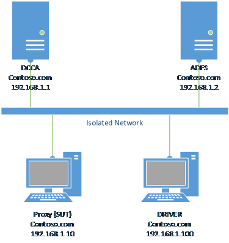

# MS-ADFSPIP Client Test Suite User Guide 

## Contents
* [Introduction](#_Toc374100960)
* [Known Issues](#_Toc374100961)
* [License Information](#_Toc374100962)
* [Further Assistance](#_Toc374100963)
* [Quick Start Checklist](#_Toc374100964)
* [How Do I?](#_Toc374100965)
* [Requirements](#_Toc374100966)
    * [Environment](#_Toc374100967)
    * [Domain Controller & Certificate Authority (DCCA)](#_Toc374100968)
    * [OAuth & Device Registration Server (ADFS)](#_Toc374100969)
    * [Windows Client Device (SUT)](#_Toc374100970)
    * [Non-Windows Client Device (SUT)](#_Toc374100971)
    * [Driver Computer (DRIVER)](#_Toc374100972)
    * [Prerequisite Software](#_Toc374100973)
* [Network Setup](#_Toc374100974)
    * [Domain Environment](#_Toc374100975)
    * [Verify Connectivity from the Driver Computer](#_Toc374100976)
* [Computer Setup](#_Toc374100977)
    * [Set Up a DCCA Computer](#_Toc374100978)
    * [Set Up an ADFS Computer](#_Toc374100979)
    * [Set Up a Windows-based SUT Computer](#_Toc374100980)
    * [Set Up a Driver Computer](#_Toc374100981)
    * [Installed Files and Folders](#_Toc374100982)
* [Configuration](#_Toc374100983)
    * [Configuring Windows-based Computers](#_Toc374100984)
		* [Configure the DCCA Computer](#_Toc374100985)
		* [Configure the ADFS Computer](#_Toc374100986)
		* [Configure the Widnows-based SUT Computer](#_Toc374100987)
		* [Configure the Driver Computer](#_Toc374100988)
    * [Configuring the Test Suite](#_Toc374100989)
		* [Required Configuration Settings](#_Toc374100990)
* [Running Test Cases](#_Toc374100991)
    * [Run All Test Cases](#_Toc374100992)
    * [Run All BVT Test Cases](#_Toc374100993)
    * [Check Test Results](#_Toc374100994)
		* [Review the Log Files](#_Toc374100995)
		* [Manage the Generation of Log Files](#_Toc374100996)
* [Debugging Test Cases](#_Toc374100997)
* [Troubleshooting](#_Toc374100998)
    * [Unable to set the network to Private](#_Toc374100999)
    * [Unable to Specify UPN When Joining Workplace](#_Toc374101000)
    * [Cannot Workplace Join with Build-in Administrator](#_Toc374101001)
    * [Cannot Trigger SUT to Join Workplace](#_Toc374101002)

### <a name="_Toc374100960"/>Introduction

This guide provides information about how to install, configure, and run MS-ADFSPIP Test Suite and its environment. This suite of tools is designed to test the implementation of ADFS Proxy and Web Application Proxy integration, as described in [MS-ADFSPIP]. This guide provides information about using this test suite on the Microsoft® Windows® operating system.

This suite of tools tests only the protocol implementation behaviors that are observed on the wire. For detailed information about the design of this test suite, see MS-ADFSPIP_ClientTestDesignSpecification.md. 

### <a name="_Toc374100961"/>Known Issues

For detailed information about known issues related to this test suite, see the release notes in the installation folder.

### <a name="_Toc374100962"/>License Information

For licensing information, see the End User License Agreement (EULA) that was provided with this test suite. The EULA is contained in the LICENSE.rtf file in the installation folder.

### <a name="_Toc374100963"/>Further Assistance

If you need further information about this test suite or assistance in troubleshooting issues related to this test suite, contact intopdoc@microsoft.com.

## <a name="_Toc374100964"/>Quick Start Checklist

The following checklist summarizes the steps you need to complete to get the test suite up and running. The checklist also provides references to documentation that can help you get started. 

|  **Check**|  **Task**|  **Topic**| 
| -------------| -------------| ------------- |
| □| Download the test suite for the protocol implementation| For a list of the files that the download package contains, see [Installed Files and Folders](#_Toc374100982).| 
| □| Confirm that your test environment and computers meet the requirements of the test suite| For information about the requirements of the test suite, see [Requirements](#_Toc374100966). | 
| □| Install the software prerequisites| For information about software that must be installed on the computers in your test environment before the test suite is installed, see [Prerequisite Software](#_Toc374100973).| 
| □| Set up a Domain Controller & Certificate Authority (DCCA)| See [Set Up a DCCA](#_Toc374100978.| 
| □| Set up an OAuth & Device Registration Server (ADFS)| See [Set Up an ADFS](#_Toc374100979) Computer.| 
| □| Set up a Windows Client Computer (SUT)| See [Set Up a Windows-based SUT](#_Toc374100980) Computer.| 
| □| Set up a Driver Computer (DRIVER)| See [Set Up a Driver Computer](#_Toc374100981)| 
| □| Set up the network| See [Network Setup](#_Toc374100974).| 
| □| Verify the connection from the driver computer to the SUT and other computers| See [Verify Connectivity from the Driver Computer](#_Toc374100976).| 
| □| Configure the DCCA Computer| See [Configure the DCCA](#_Toc374100985) Computer.| 
| □| Configure the ADFS Computer| See [Configure the ADFS](#_Toc374100986) Computer.| 
| □| Configure the SUT Comptuer| See [Configure the Windows-based SUT](#_Toc374100987) Computer.| 
| □| Configure the Driver Computer| See [Configure the Driver Computer](#_Toc374100988) .| 
| □| Configure the Test Suite settings| See [Configuring the Test Suite](#_Toc374100989).| 

## <a name="_Toc374100965"/>How Do I?
Use the following quick reference to learn how to complete common tasks.

|  **How do I…?**|  **For more information…**| 
| -------------| ------------- |
| Set up the test environment| [Network Setup](#_Toc374100974) and [Computer Setup](#_Toc374100977)| 
| Verify the connection from the driver computer to other computers in the test environment| [Verify Connectivity from the Driver Computer](#_Toc374100976)| 
| Configure the Domain Controller & Certificate Authority| See [Configure the DCCA](#_Toc374100985) Computer.| 
| Configure the Device Registration Server| See [Configure the ADFS](#_Toc374100986) Computer.| 
| Configure the Client Computer| See [Configure the Windows-based SUT](#_Toc374100987) Computer.| 
| Configure the Driver Computer| See [Configure the Driver Computer](#_Toc374100988).| 
| Configure the Test Suite settings| See [Configuring the Test Suite](#_Toc374100989).| 
| Run test cases| See [Running Test Cases](#_Toc374100991).| 
| Debug my own test cases| See [Debugging Test Cases](#_Toc374100997).| 
| Get the results of test runs| See [Check Test Results](#_Toc374100994).| 
| Troubleshoot problems| See [Troubleshooting](#_Toc374100998).| 

## <a name="_Toc374100966"/>Requirements 

This section describes the requirements for the test environment that are used to run this test suite.

Note 

>The requirements in this section apply only to the Windows-based computers in the test environment. Note that the driver computer must use a Windows-based operating system.

### <a name="_Toc374100967"/>Environment

Run this test suite in a domain environment that contains the following computers, physical or virtual: 

Note 

If virtual machines with Windows are used, please make sure the Windows computers’ Security Identifiers (SIDs) are different.

* A computer set up as the domain controller and certificate authority, named DCCA, running Microsoft® Windows Server® 2012 R2, Enterprise Edition.

* A computer set up as the ADFS server (Active Directory Federation Service), named ADFS, running Microsoft® Windows Server® 2012 R2, Enterprise Edition.

* A computer set up as the application proxy, named SUT. If the device is a computer running Windows, it should be running Microsoft® Windows Server® 2012 R2, Enterprise Edition.

* A driver computer, named DRIVER, running Microsoft® Windows 8.1.

### <a name="_Toc374100968"/>Domain Controller & Certificate Authority (DCCA)

The minimum requirements for the DCCA are as follows.

|  **Requirement**|  **Description**| 
| -------------| ------------- |
| Operating system| Microsoft® Windows Server® 2012 R2, Enterprise Edition or later versions | 
| Services| Active Directory Domain Services (AD DS) | 
| | Active Directory Certificate Service (AD CS)| 
| Memory| 1 GB RAM| 
| Disk space| 60 GB| 

### <a name="_Toc374100969"/>Active Directory Federation Server (ADFS)

The minimum requirements for the ADFS are as follows.

|  **Requirement**|  **Description**| 
| -------------| ------------- |
| Operating system| Microsoft® Windows Server® 2012 R2, Enterprise Edition or later versions| 
| Services| Active Directory Federation Service (AD FS)| 
| Memory| 1 GB RAM| 
| Disk space| 60 GB| 

### <a name="_Toc374100970"/>Windows Web Application Proxy (SUT)

The minimum requirements for the SUT are as follows.

|  **Requirement**|  **Description**| 
| -------------| ------------- |
| Operating system| Microsoft® Windows Server® 2012 R2, Enterprise Edition or later versions| 
| Services| Web Application Proxy| 
| Memory| 1 GB RAM| 
| Disk space| 60 GB| 

### <a name="_Toc374100971"/>Non-Windows Web Application Proxy (SUT)

The minimum requirements for the SUT are as follows.

|  **Requirement**|  **Description**| 
| -------------| ------------- |
| Operating system| Non-Windows operating systems| 
| Feature | Implement Web Application Proxy feature.| 

### <a name="_Toc374100972"/>Driver Computer (DRIVER)

The minimum requirements for the DRIVER computer are as follows. 

|  **Requirement**|  **Description**| 
| -------------| ------------- |
| Operating system| Microsoft® Windows 8.1 or later versions| 
| Memory| 1 GB RAM| 
| Disk space| 60 GB | 

### <a name="_Toc374100973"/>Prerequisite Software 
All of the following software must be installed on the driver computer _before_ the test suite.

**Required Software**

All common softwares listed in [prerequisites](https://github.com/microsoft/WindowsProtocolTestSuites#prerequisites) for running Windows Protocol Test Suites.

**Optional Software**

* **Protocol Test Manager**

    **Protocol Test Manager** provides a graphical user interface (UI) to facilitate configuration and execution of Microsoft® Windows Protocol Test Suite tests. Its use is highly recommended.

* **Microsoft® Message Analyzer**

  **Microsoft® Message Analyzer** (MMA) is listed here as an optional tool because the test cases of themselves neither perform live captures or capture verifications during execution. However, MMA can be helpful with debugging test case results, by analyzing ETL files that are generated by the Test Cases, that is, if you enable the the Automatic Network Capturing feature in the Protocol Test Manager (PTM) during test case configuration. The Automatic Network Capturing feature is further described in the [PTF User Guide](https://github.com/Microsoft/ProtocolTestFramework/blob/staging/docs/PTFUserGuide.md#-automatic-network-capturing).

  Note
  
  November 25 2019 - Microsoft Message Analyzer (MMA) has been retired and removed from public-facing sites on microsoft.com. A private MMA build is available for testing purposes; to request it, send an email to [getmma@microsoft.com](mailto:getmma@microsoft.com).

## <a name="_Toc374100974"/>Network Setup

Run this test suite in a domain environment using either physical or virtual machines. This section describes the test environment using physical computers. 

For information about configuring a virtual machine, see [https://docs.microsoft.com/en-us/virtualization/hyper-v-on-windows/quick-start/create-virtual-machine](https://docs.microsoft.com/en-us/virtualization/hyper-v-on-windows/quick-start/create-virtual-machine). The configuration of virtual machines for use with this test suite is out of the scope of this guide. 

### <a name="_Toc374100975"/>Domain Environment

The domain environment requires interactions between the following computers and server roles. 

* The DCCA runs an implementation of the domain controller and certificate authority. The DCCA provides the domain environment for the testing, and also the functionality to authorize certificate which is used to identify server and client in device registration process.

* The ADFS runs the active directory federation services, which is a backend server used to generate real access token.

* The SUT runs an implementation of the web application proxy, which is being tested.

* The DRIVER runs the test cases by acting as a synthetic server which responses to the requests from the proxy, which is regarded as the client, to test the proxy’s behavior.

The following figure shows the domain environment.

This following table shows the recommanded IP setting between the machine, all the computer set the static IP for IPV4 and can ping with other computer.

|  **Computer**|  **IP setting**| 
| -------------| ------------- |
| DCCA| IPv4: 192.168.1.1| 
| | DNS: 127.0.0.1| 
| ADFS| IPv4: 192.168.1.2| 
| | DNS: 192.168.1.1| 
| SUT| IPv4: 192.168.1.10| 
| | DNS: 192.168.1.1| 
| DRIVER| IPv4: 192.168.1.100| 
| | DNS: 192.168.1.1| 

### <a name="_Toc374100976"/>Verify Connectivity from the Driver Computer

After you install the environment, verify the connection from the driver computer to the SUT machines, and between all other computers in the test environment. The following provides a general list of steps you can use to check for connectivity between two Windows-based computers. For further information, see the administration guide for your operating system.

To check the connection from the driver computer

Note 

>Disable active firewalls in the test environment.

* Click the **Start** button, and then click **Run**. 

* In the **Run** dialog box, type **cmd** and then click **OK**.

* At the command prompt, type **ping** followed by the hostname or IP address of the SUT, and then press **Enter**. The following example checks the connection to a SUT with IP address 192.168.1.10:
 
 &#62;  ping 192.168.1.10

* Repeat these steps until you confirm connectivity between all computers in the test environment.

Do not proceed with the configuration of the test suite until connectivity is confirmed. Any issues with network connectivity must be resolved before you configure the test suite.

## <a name="_Toc374100977"/>Computer Setup 

This section explains how to set up the computers for the test environment.

Note 

>All values mentioned in below sections are recommend name, if you use other names you can update them to [PTF config](#_Toc374100989)

### <a name="_Toc374100978"/>Set Up a DCCA Computer
This section provides information about how to set up a domain controller & certificate authority for use with this test suite.

To set up a Windows-based DCCA: 

* Install **Active Directory Domain Services** and promote this server to a domain controller. Set the name of the root domain to **contoso.com**, and set administrator password to **Password01!**

* Install **Active Directory Certificate Services** with role service **Certificate Authority**.

### <a name="_Toc374100979"/>Set Up an ADFS Computer
This section provides information about how to set up the OAuthe and device registration server for use with this test suite.

To set up a Windows-based ADFS:

* Install **Active Directory Federation Services.**

### <a name="_Toc374100980"/>Set Up a Windows-based SUT Computer
This section provides information about how to set up a client computer (SUT) for use with this test suite.

To set up a Windows-based Client

* Install **MS-ADFSPIP-TestSuite-ClientEP.msi** with option **Install and configure Windows System Under Test (SUT).**

###Set Up a Driver Computer

This section describes how to set up the driver computer.

Important 

>Microsoft Visual Studio 2017 and Protocol Test Framework must be installed on the driver computer before you run the test suite installer.

To set up the driver computer:

* Install **MS-ADFSPIP-TestSuite-ClientEP.msi** with option **Install Test Suite on Driver Computer**.

### <a name="_Toc374100982"/>Installed Files and Folders

The installation process adds the following folders and files to the driver computer at C:\MicrosoftProtocolTests\MS-ADFSPIP\Client-Endpoint\ &#60; version &#35;  &#62; \.

Note 

>This path may vary based on your installation location.

The  &#60; _version &#35;  &#62;_  placeholder indicates the installed build of the test suite.

|  **File or Folder**|  **Description**| 
| -------------| ------------- |
| Batch| Command files you can use to run individual test cases or all test cases.| 
| Bin| Test suite binaries and configuration files.| 
| Scripts| Scripts that are used to set up and configure the computers.| 
| LICENSE.rtf| The End User License Agreement.| 

## <a name="_Toc374100983"/>Configuration

This section explains how to configure the test environment.

### <a name="_Toc374100984"/>Configuring Windows-based Computers

This section explains how to configure computers for a Windows-based test environment. 

#### <a name="_Toc374100985"/>Configure the DCCA Computer

This section provides a general list of steps that you can use to configure DCCA in a Windows-based test environment. 

To configure the DCCA:

* Log on to the DCCA computer as **domain Administrator**.

* Turn off **Windows Firewall.**

* Disable **DCP** and **AIA** on **Certificate Authority**.

* Modify "**Web Server**" certificate template to allow "**Domain Computers**" group to issue it.

* **In**  **DNS Manager** **, add a**  **new host** **named** **adfs**  **with IP address pointing to the driver** **, i.e.**  **192.168.1.100** **; add a**  **new host**  **named**  **webapp**  **pointing also to the driver; add an**  **alias**  **named**  **enterpriseregistration**  **pointing to**  **adfs.contoso.com** **.**

* **Create a user, e.g.**  **adfsuser** **,**  **to be used for ADFS** **.**

#### <a name="_Toc374100986"/>Configure the ADFS Computer

This section provides a general list of steps that you can use to configure the ADFS in a Windows-based test environment. 

To configure the ADFS 

* Join the computer to domain **contoso.com.**

* Log on to the ADFS computer as **domain administrator.**

* Turn off **Windows Firewall.**

* Request a new **Web Server certificate**; set the **subject name** to be of type **Common name** and value **adfs.contoso.com**; add an **alternative name** with type **DNS** and value **adfs.contoso.com**; add another **alternative name** with type **DNS** and value **enterpriseregistration.contoso.com**; make private key exportable.

* Configure AD FS to use **Farm mode**, use "**adfs.contoso.com**" as name, use "**adfsuser**" to host service, and select certificate from Step 4 as service certificate. 

* Enable **device registration service**.

* Export the **certificate** in Step 4 with **private key**.\

* Add “fed1” relying party trust.

#### <a name="_Toc374100987"/>Configure the Widnows-based SUT Computer

This section provides a general list of steps that you can use to configure the SUT computer in a Windows-based test environment. **Do not initially join the SUT computer to the domain. And do not use the build-in Administrator account.** (See [Troubleshooting](#_Toc374100998) if you encounter problems)

To configure the Windows-based SUT:

* Turn off **Windows Firewall.**

* Make sure the **Network Location** is **Private**, and turn off **password protected sharing.** 

* Change **PowerShell execution policy** to **Unrestricted.**

* Enable **PSRemoting.**

* Import **ADFS certificate**.

* Request an **Web Server Certificate** with **subject name** set to **webapp.contoso.com**.

* Create a folder, say C:\Temp, and share the folder with **Everyone** with **Read/Write** permission.

* Copy all the scripts from C:\MicrosoftProtocolTests\MS-ADFSPIP\Client-Endpoint \ &#60; version &#35;  &#62; \Scripts to C:\Temp. Run **RemoteExecutionListener.ps1.**

* Add RemoteExecutionListener.ps1 into start-up run registry section.

#### <a name="_Toc374100988"/>Configure the Driver Computer

This section provides a general list of steps that you can use to configure the driver computer in a Windows-based test environment. 

To configure the driver computer

* Join the computer to domain **contoso.com**.

* Log on to the driver computer as **domain administrator.**

* Disable **Windows Firewall**.

* Change **PowerShell execution policy** to **Unrestricted**. 

* Import **ADFS certificate**.

* Set local DNS record, pointing ADFS and WebApp to the proxy’s IP. 

### <a name="_Toc374100989"/>Configuring the Test Suite

This test suite is installed with default configuration settings. You may need to change these settings if you use a customized test environment or if you customize your test runs. 

You can configure the test suite for various purposes including, for example, to:

* Define the settings of the test environment, including computer names and IP addresses.

* Define the basic options used in the test suite, for example, the protocol version or the version of the target operating system.

* Define the folders and formats used for output from test runs.

* Define scripts to run before and after each test run.

* Define the case which will break test enviroment

* Set time limits on discrete test tasks and for test runs.

To change configuration settings, edit the MS-ADFSPIP_ClientTestSuite.deployment.ptfconfig file. 

#### <a name="_Toc374100990"/>Required Configuration Settings

The following table describes the configuration properties used in the test suite configuration file and their values. These properties are required.

| &#32;| &#32; |
| -------------| ------------- |
|  **Property**|  **Description**| 
|  **Common.TestDeployment**| The bool value incidating whether testing deployment senerio or not. | 
| | The default value is “True”.| 
|  **Common.SUT.IPAddress**| The IPv4 address of the SUT computer.| 
| | The default value is "192.168.1.10”.| 
|  **Common.SUT.** **MaxDelayBetweenOperationsInSeconds**| The maximum delay in seconds between two successive operations, for example, sending device registration discovery request and sending OAuth request, on the client device.| 
| | This value should be less than 60 seconds, unless the client implementation has very big performance issue.| 
| | The default value is "60".| 
|  **Common.SUT.Share**| The shared folder path on the client.| 
| | The default value is “\\192.168.1.10\temp”.| 
|  **Common.SUT.IsWindows**| The bool value indicating whether the client runs Windows operating system.| 
| | The default value is “True".| 
|  **Common.OAuthService1.Endpoint**| The 1st OAuth service endpoint.| 
| | The default value is “https://adfs.contoso.com/adfs/oauth2/authorize”.| 
|  **Common.OAuthService1.Identifier**| The 1st OAuth service identifier.| 
| | The default value is “http://adfs.contoso.com/adfs/services/trust”.| 
|  **Common.OAuthService2.Endpoint**| The 2nd OAuth service endpoint.| 
| | The default value is “https://adfs.contoso.com/adfs/oauth2/token”.| 
|  **Common.OAuthService2.Identifier**| The 2nd OAuth service identifier.| 
| | The default value is “http://adfs.account.com/adfs/services/trust”.| 
|  **Common.DiscoveryService.DNSName**| The discovery service endpoint.| 
| | The default value is “enterpriseregistration.contoso.com”.| 
|  **Common.EnrollmentService.ResourceId**| The enrollment service resource Id.| 
| | The default value is “urn:ms-drs:adfs.contoso.com”.| 
|  **Common.PassiveService.Endpoint**| The passive service endpoint.| 
| | The default value is "https://adfs.contoso.com/adfs/ls".| 
|  **Common.TLSServerCertificate.FilePath**| The local copy of the ADFS server certificate with private key.| 
| | The default value is “c:\\Adfs.pfx”.| 
|  **Common.TLSServerCertificate.Password**| The password for the .pfx certificate.| 
| | The default value is “123”. | 
|  **Common.User.Name**| The user name used to registration.| 
| | The default value is “TestUser”.| 
|  **Common.User.Domain**| The registration user domain.| 
| | The default value is “contoso.com”.| 
|  **Common.User.Password**| The password for the registration user.| 
| | The default value is “Password01!”.| 
|  **Common.DRS.Ip**| The IPv4 address of the real DRS in backend.| 
| | The default value is “192.168.1.2”.| 
|  **Common.TLSHostName**| The TLS host name of the real DRS.| 
| | The default value is “enterpriseregistration.contoso.com”.| 

## <a name="_Toc374100991"/>Running Test Cases

This test suite includes command files that you can use to complete some basic test cases. Each test case verifies the protocol implementation based on a given scenario.

You can find and run these test cases in the following directory: 
C:\MicrosoftProtocolTests\MS-ADFSPIP\Client-Endpoint\ &#60; version &#35;  &#62; \Batch

You can run these command files at the command prompt, or by selecting and clicking one or more of the files from the directory.

Note 

* Check the values in MS-ADFSPIP_ClientTestSuite.deployment.ptfconfig under C:\MicrosoftProtocolTests\MS-ADFSPIP\Client-Endpoint\ &#60; version &#35;  &#62; \Bin are correct

### <a name="_Toc374100992"/>Run All Test Cases

Use the steps below to run all test cases.

To run all test cases

* From the desktop of the driver computer, double-click the **Run MS-ADFSPIP Client_AllTestCases** shortcut. This shortcut is created during the installation process.
Alternatively, go to C:\MicrosoftProtocolTests\MS-ADFSPIP\Client-Endpoint\ &#60; version &#35;  &#62; \Batch, and double-click the **RunAllTestCases.cmd** file. 

### <a name="_Toc374100993"/>Run All BVT Test Cases

Use the steps below to run all BVT test cases

To run all test cases

* From the desktop of the driver computer, double-click the **Run MS-ADFSPIP Client_BVTTestCases** shortcut. This shortcut is created during the installation process.
Alternatively, go to C:\MicrosoftProtocolTests\MS-ADFSPIP\Client-Endpoint\ &#60; version &#35;  &#62; \Batch, and double-click the **RunBVTTestCases.cmd** file. 

### <a name="_Toc374100994"/>Check Test Results
The handling of test results involves both the review of log files and the management of their generation. This section describes those topics.

#### <a name="_Toc374100995"/>Review the Log Files 

You can find the log files in the "TestResults" directory, a subdirectory of the test suite installation directory. The log files that contain test suite results use a  &#42; .trx file name, in which the asterisk (" &#42; ") character represents the user name, the protocol name, or both.

Additional log files are used for generating requirement coverage reports and diagnosing test issues. Their settings can be found in the  &#42; .ptfconfig or  &#42; .deployment.ptfconfig files. The file names, corresponding paths, and formats can be set in the Sinks node of the configuration file. 

The following instruction provides an example of how to cause log entries for the "Debug" logging sink not to be written into the MS-ADFSPIP_Log.txt file in the current directory:
 
 &#60; File id="Debug" directory=".\" file="MS-ADFSPIP_Log.txt" format="text"/ &#62; 

#### <a name="_Toc374100996"/>Manage the Generation of Log Files

The log files contain a range of information including, but not limited to, the following:

* Test computer client and server names

* Internet Protocol (IP) addresses

* User names and passwords

* Domain names and test domain names

* DHCP and DNS servers, pipes, and mail slots

* Security Identifiers (SIDs) 

* Globally unique identifiers (GUIDs) of domain controllers

* Port numbers

* User account settings associated with Windows Active Directory

* Name of sites which are present or nonexistent.

None of this information is sent to Microsoft. 

If you do not need the log files for debugging, you can delete them. You can also control the generation of all log files for the test suite, except for  &#42; .trx files. 

The following describes how to stop the generation of log files using the file name extensions of .txt and .xml. This process should be followed _before_ you run test cases in Visual Studio.

To prevent the generation of .txt and .xml type log files

Note 

This procedure assumes that the test suite was installed at the root directory **C:**. MS-ADFSPIP represents the protocol name.

* Open the MS-ADFSPIP_ClientTestSuite.ptfconfig file. You can find this configuration file at the path C:\MicrosoftProtocolTests\MS-ADFSPIP\Client-Endpoint\ &#60; version &#35;  &#62; \Source\Client\TestCode\TestSuite. Or, if you use batch files to run your test cases, you can find this file at C:\MicrosoftProtocolTests\MS-ADFSPIP\Client-Endpoint\ &#60; version &#35;  &#62; \Bin.

* Locate the Sinks node and comment out all the entries.

* Locate the Profile node and comment out all the entries.

* Locate the Profile node and add the following entries:

	&#60; Rule kind="CheckSucceeded" sink="Console" delete="false" / &#62; 
	
	&#60; Rule kind="Checkpoint" sink="Console" delete="false"/ &#62; 
	
	&#60; Rule kind="Comment" sink="Console" delete="false"/ &#62; 
	
	&#60; Rule kind="Debug" sink="Console" delete="false" / &#62; 
	
	&#60; !-- Show for XML log -- &#62; 
	
	&#60; Rule kind="CheckSucceeded" sink="XMLLog" delete="false"/ &#62; 
	
	&#60; Rule kind="Comment" sink="XMLLog" delete="false"/ &#62; 
	
	&#60; Rule kind="Checkpoint" sink="XMLLog" delete="false"/ &#62; 
	
	&#60; Rule kind="Debug" sink="XMLLog" delete="false"/ &#62; 
	
	&#60; Rule kind="EnterMethod" sink="XMLLog" delete="false"/ &#62; 
	
	&#60; Rule kind="ExitMethod" sink="XMLLog" delete="false" / &#62; 
	
	&#60; Rule kind="CheckSucceeded" sink="BeaconLog" delete="false"/ &#62; 
	
	&#60; Rule kind="Checkpoint" sink="BeaconLog" delete="false"/ &#62; 
	
	&#60; Rule kind="Comment" sink="BeaconLog" delete="false"/ &#62; 
	
	&#60; Rule kind="Debug" sink="BeaconLog" delete="false" / &#62; 
	
	&#60; Rule kind="CheckSucceeded" sink="Debug" delete="false"/ &#62; 
	
	&#60; Rule kind="Checkpoint" sink="Debug" delete="false"/ &#62; 
	
	&#60; Rule kind="Comment" sink="Debug" delete="false"/ &#62; 
	
	&#60; Rule kind="Debug" sink="Debug" delete="false" / &#62; 

The following gives an example of an MS-ADFSPIP_ClientTestSuite.ptfconfig in which the Sinks and Profile nodes are commented out.

&#60; Sinks &#62; 

&#60; File id="Debug" directory=".\" file="MS-ADFSPIP_Log.txt" format="text"/ &#62; 

&#60; File id="XMLLog" directory=".\" file="MS-ADFSPIP_Log.xml" format="xml"/ &#62; 

&#60; Console id="Console" / &#62; 

&#60; Sink id="BeaconLog" type="Microsoft.Protocols.TestTools.Logging.BeaconLogSink" assembly="Microsoft.Protocols.TestTools"/ &#62; 

&#60; /Sinks &#62; 

&#60; Profiles &#62; 

&#60; Profile name="Verbose" extends="Error" &#62; 

&#60; !-- Show on Console -- &#62; 

&#60; Rule kind="CheckSucceeded" sink="Console" delete="false" / &#62; 

&#60; Rule kind="Checkpoint" sink="Console" delete="false"/ &#62; 

&#60; Rule kind="Comment" sink="Console" delete="false"/ &#62; 

&#60; Rule kind="Debug" sink="Console" delete="false" / &#62; 

&#60; !-- Show for XML log -- &#62; 

&#60; Rule kind="CheckSucceeded" sink="XMLLog" delete="false"/ &#62; 

&#60; Rule kind="Comment" sink="XMLLog" delete="false"/ &#62; 

&#60; Rule kind="Checkpoint" sink="XMLLog" delete="false"/ &#62; 

&#60; Rule kind="Debug" sink="XMLLog" delete="false"/ &#62; 

&#60; Rule kind="EnterMethod" sink="XMLLog" delete="false"/ &#62; 

&#60; Rule kind="ExitMethod" sink="XMLLog" delete="false" / &#62; 

&#60; Rule kind="CheckSucceeded" sink="BeaconLog" delete="false"/ &#62; 

&#60; Rule kind="Checkpoint" sink="BeaconLog" delete="false"/ &#62; 

&#60; Rule kind="Comment" sink="BeaconLog" delete="false"/ &#62; 

&#60; Rule kind="Debug" sink="BeaconLog" delete="false" / &#62; 

&#60; Rule kind="CheckSucceeded" sink="Debug" delete="false"/ &#62; 

&#60; Rule kind="Checkpoint" sink="Debug" delete="false"/ &#62; 

&#60; Rule kind="Comment" sink="Debug" delete="false"/ &#62; 

&#60; Rule kind="Debug" sink="Debug" delete="false" / &#62; 

&#60; /Profile &#62; 

&#60; /Profiles &#62;  

For further information about logging in the Protocol Test Framework (PTF), see the _PTF User Guide_ in the PTF installation directory.

## <a name="_Toc374100997"/>Debugging Test Cases

You can use the Visual Studio solution (.sln) file included with this test suite to debug additional test cases that you create for your protocol implementation. 

Note 

* Check the values in MS-ADFSPIP_ClientTestSuite.deployment.ptfconfig under C:\MicrosoftProtocolTests\MS-ADFSPIP\Client-Endpoint\ &#60; version &#35;  &#62; \Source\Client\TestCode\TestSuite are correct

To debug a test case

* On the driver computer, use Microsoft® Visual Studio® to open the following solution file:
C:\MicrosoftProtocolTests\MS-ADFSPIP\Client-Endpoint\ &#60; version &#35;  &#62; \Source\Client\TestCode\MS-ADFSPIP_Client.sln

* In Visual Studio, in the Solution Explorer window, right-click the **Solution** **‘MS-ADFSPIP_Client’**, and select **Build Solution**.

* In the Solution Items folder, click **MS-ADFSPIP_Client.vsmdi**, and then select the names of the test scenarios that you want to debug. 

## <a name="_Toc374100998"/>Troubleshooting

This section describes how to troubleshoot common issues in running test cases.

### <a name="_Toc374100999"/>Unable to set the network to Private

| &#32;| &#32; |
| -------------| ------------- |
| PROBLEM| The Network Location is set to Public and unable to change to Private. | 
| CAUSE| The Network Location feature provides an easy way to customize your firewall settings based on whether you trust or don’t trust the computers around you. There are three Network Location types - Private, Public and Domain. If your computer is a member of the domain then you won’t be able to change the Network Location type. If your computer is standalone or part of the workgroup, then you can choose what type of network location do you want - Public or Private. Private means that you are a member of the trusted network and you can lower your network security a little bit. Public means that you have no trust for the network outside, and you should not let your guard down.| 
| | The network location is per connection/network card. Every time a new connection is added - the dialog will appear, asking you to choose the network location type. However, there is no direct way to change the network location once it is set at the first time. We can only use PowerShell script to change it.| 
| | Setting the correct network location type is very important for Windows PowerShell Remoting. You cannot enable Windows PowerShell Remoting on your machine if your connections are set to Public. It means you won’t be able to connect to this machine using Windows PowerShell Remoting. | 
| RESOLUTION| Try to run the following PowerShell script:| 
| |  &#35; Skip network location setting for pre-Vista operating systems if([environment]::OSVersion.version.Major -lt 6) { return }  
| |  &#35; Skip network location setting if local machine is joined to a domain. if(1,3,4,5 -contains (Get-WmiObject win32_computersystem).DomainRole) { return }  
| |  &#35; Get network connections $networkListManager = [Activator]::CreateInstance([Type]::GetTypeFromCLSID([Guid] "{DCB00C01-570F-4A9B-8D69-199FDBA5723B}")) $connections = $networkListManager.GetNetworkConnections()  
| |  &#35; Set network location to Private for all networks $connections  &#124;  % {$_.GetNetwork().SetCategory(1)}| 

### <a name="_Toc374101000"/>Unable to Specify UPN When Joining Workplace

| &#32;| &#32; |
| -------------| ------------- |
| PROBLEM| When performing Workplace Join, there is no prompt shown on UI asking for user account or password information.| 
| CAUSE| It is probably because the computer has joined domain. If the computer has joined domain, Windows use WIA to retrieve user credential information, so no prompt will be shown.| 
| RESOLUTION| If you want to use customized account information, quit the computer from domain, and logon with local account.| 

### <a name="_Toc374101001"/>Cannot Workplace Join with Build-in Administrator

| &#32;| &#32; |
| -------------| ------------- |
| PROBLEM| When log on user is the build-in Administrator account, Workplace Join failed after receiving discovery result.| 
| CAUSE| It is by design that build-in Administrator cannot use Workplace Join.| 
| RESOLUTION| Log on with other accounts.| 

### <a name="_Toc374101002"/>Cannot Trigger SUT to Join Workplace

| &#32;| &#32; |
| -------------| ------------- |
| PROBLEM| The scripts to trigger Windows-based SUT to join workplace do not work properly.| 
| CAUSE| The scripts to trigger a Windows-based SUT to join workplace are done by sending keystokes to simulate the actual Workplace Join operations. | 
| | Many uncertain facts will effect this kind of UI automation, such as whether the Windows is activated, or if there is process interrupt the automation.| 
| RESOLUTION| Make sure the automation scripts are running on a clean system, and no other user processes are running except the listener script.| 
| | Check the Windows UI, if there are changes in UI related to Workplace Join, the scripts will fail. Modify the scripts to make sure the keystoke sequence matches the actual UI operations.| 

