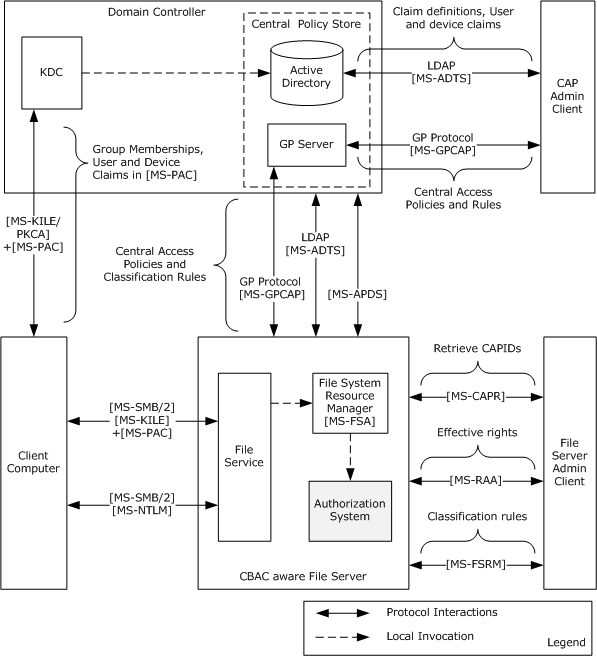
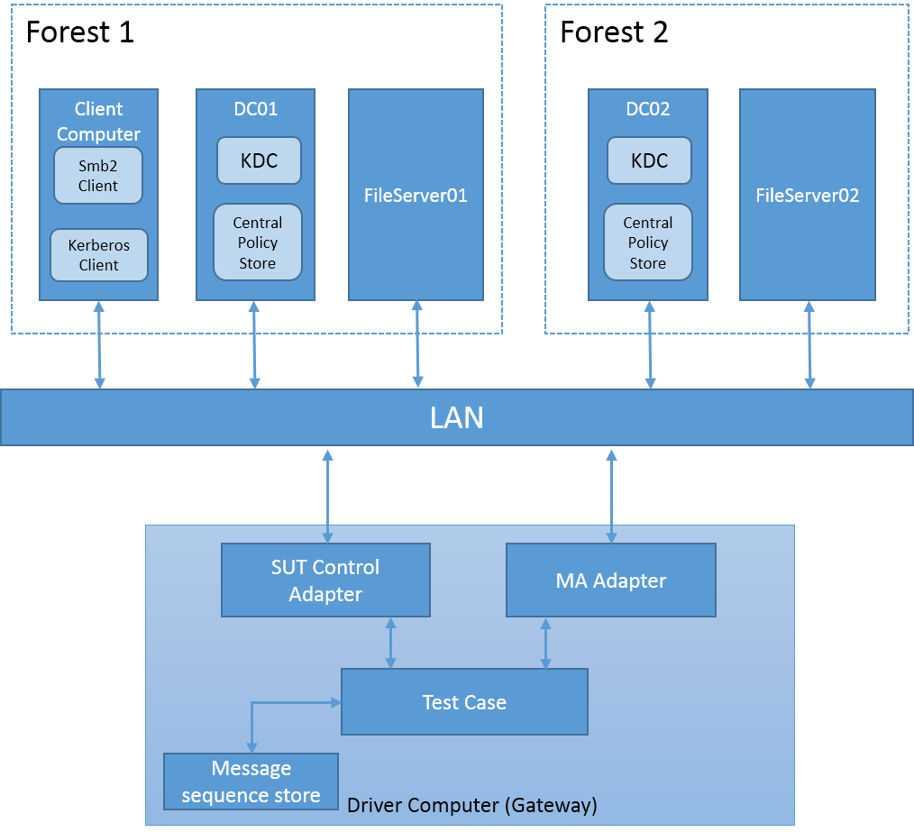
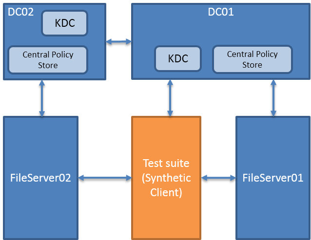

#MS-AZOD Test Design Specification

# Contents
* [Introduction](#_Toc426559895)
* [Technical Document Analysis](#_Toc426559896)
    * [Technical Document Overview](#_Toc426559897)
    * [Relationship to Other Protocols](#_Toc426559898)
* [Test Method](#_Toc426559899)
    * [Assumptions, Scope and Constraints](#_Toc426559900)
    * [Test Approach](#_Toc426559901)
    * [Test Scenarios](#_Toc426559902)
		* [S1_AccessFile_SMB2_CBAC_Kerberos](#_Toc426559903)
		* [S2_AccessFile_SMB2_CBAC_NTLM](#_Toc426559904)
		* [S3_AccessFile_SMB2_SimpleDAC_Kerberos](#_Toc426559905)
		* [S4_AccessFile_SMB2_SimpleDAC_NTLM](#_Toc426559906)
		* [S5_ClaimsAndGroupPolicy_Sync](#_Toc426559907)
* [Test Suite Design](#_Toc426559908)
    * [Test Suite Architecture](#_Toc426559909)
		* [System under Test (SUT)](#_Toc426559910)
		* [Test Suite Architecture](#_Toc426559911)
    * [Technical Dependencies/Considerations](#_Toc426559912)
		* [Dependencies](#_Toc426559913)
		* [Technical Difficulties](#_Toc426559914)
    * [Adapter Design](#_Toc426559915)
		* [Adapter Overview](#_Toc426559916)
		* [Adapter Abstract Level](#_Toc426559917)
		* [Adapter Inner Work](#_Toc426559918)
* [Test Cases Design](#_Toc426559919)
    * [Traditional Test Case Design](#_Toc426559920)
    * [Test Cases Description](#_Toc426559921)
		* [Test Cases](#_Toc426559922)

## <a name="_Toc426559895"/>Introduction
This document provides information about how MS-AZOD is designed to test MS-AZOD technical document usability and accuracy. It gives the analysis of MS-AZOD technical document content, and describes test assumptions, scope and constraints of the test suite. It also specifies test approach, test scenarios, detail test cases, test suite architecture and adapter design.

## <a name="_Toc426559896"/>Technical Document Analysis
The MS-AZOD test suite is used to test authorization process of file sharing, so it depends on protocols MS-AZOD and MS-SMB2.

### <a name="_Toc426559897"/>Technical Document Overview
Authorization Protocols Overview (MS-AZOD) is an overview document, which descripts the authorization process of controlling access to resources. The document introduces 3 authorization models: 

* DAC and CBAC models
* AzMan RBAC model 
* COM+ roles  access control model 

The DAC model is suited for the well-defined persistent resources such as Active Directory, files, and the registry. CBAC is an extension to the DAC model, applicable for file resources on a file server.

The Authorization Manager-based RBAC model provides a natural framework for business process applications that require representing the organizational model within the application security framework. In Microsoft Windows®, remote desktop gateway applications use this model.

The COM+ roles authorization model is applicable for the applications that are developed using COM and COM+ development frameworks.

Therefore, the AZOD with file sharing test suite is focus on the test of DAC and CBAC models. 

**The architecture of CBAC model is shown as following:**

### <a name="_Toc426559898"/>Relationship to Other Protocols 
MS-AZOD is an overview document, so it depends on specific protocols. The following table provides a comprehensive list of the Authorization member protocols and data structures.

|  **Protocol name**|  **Description**|  **Short name**|  **Applicability**| 
| -------------| -------------| -------------| ------------- |
| Privilege Attribute Certificate Data structure| The Privilege Attribute Certificate (PAC) is used by the authentication protocols to carry authorization information. The authorization information consists of group memberships and claims. The PAC also contains additional credential information, profile, policy information, and additional security data.| [MS-PAC]| DAC, CBAC, and COM+ roles access control| 
| Remote Authorization API Protocol | The Remote Authorization API protocol enables applications to remotely create, query, and manipulate authorization context for a given security principal on a target server for the purpose of administrative queries. The protocol initiates creation of a security context, transfers the group and claims information, and accesses requests and result data sent between client and server.| [MS-RAA]| DAC and CBAC| 
| Authorization Manager (AzMan) Policy File Format| The Authorization Manager (AzMan) Policy File Format contains the XML schema definitions of Authorization Manager access control policies.| [MS-AZMP]| AzMan RBAC| 
| Group Policy Central Access Policies Protocol Extension| The Group Policy: Central Access Policies Extension is a group policy file format that communicates the Central Access Policies (CAPs) defined centrally and configured for specific computer accounts and transferred to the file servers through group policy.| [MS-GPCAP]| CBAC| 
| Central Access Policy Identifier (ID) Retrieval Protocol Specification| This protocol enables the applications to query a remote file server for a list of Central Access Policies (CAPs) that have been configured for a remote file server. Specifically, the protocol is used to transfer the CAP IDs.| [MS-CAPR]| CBAC| 
| Claims Transformation Algorithm | This document specifies a grammar for describing transformation rule language and an algorithm for transforming input claims into output claims using a defined set of rules. Transformation of a set of claims is typically used at the authentication trust traversal boundaries to transform claims from sending authority into a form acceptable to receiving authority.| [MS-CTA]| CBAC| 
| Windows Data Types| This document contains the data types and algorithms associated with authorization.| [MS-DTYP]| DAC, CBAC, and COM+ roles| 
| Lightweight Directory Access Protocol | In CBAC: This protocol enables the applications to configure the claim definitions, and the user and devices claims on the Active Directory Server.| [MS-ADTS]| DAC, CBAC, and AzMan RBAC| 
| | In RBAC: This protocol enables the retrieval of authorization policies from the Active Directory Policy Server.| | | 
| | In DAC: [MS-ADTS] section 5.1.3 specifies the authorization rules.| | | 
| Component Object Model Plus (COM+) Remote Administration Protocol| With regards to authorization, this protocol enables the administration interface for the role-based security configuration for the COM+ applications.| [MS-COMA]| COM+ roles access control| 
| Tabular Data Stream Protocols| With regards to authorization, this protocol enables the retrieval of the authorization policies from the SQL Policy Store | [MS-TDS]| AzMan RBAC| 

Besides, there are other protocols related to MS-AZOD:

* [MS-KILE]: Kerberos Protocol Extensions

* [MS-SFU]: Kerberos Protocol Extensions: Service for User and Constrained Delegation Protocol

* [MS-NLMP]: NT LAN Manager (NTLM) Authentication Protocol

* [MS-SMB2]: Server Message Block (SMB) Protocol Versions 2 and 3

## <a name="_Toc426559899"/>Test Method

### <a name="_Toc426559900"/>Assumptions, Scope and Constraints
**Assumptions:**

* The DC and SMB File server should be configurable.

**Scope:**
In scope

* The Client computer, DC and SMB File server will be tested.

* For Windows, the System Under Test (SUT) will be Server SKUs for DC and SMB file server, and will be Client SKUs for Client computer

* Simple DAC and CBAC authorization on file server will be tested

* Authorization data embedded in other protocol will be verified.

* Kerberos, NTLM, and SMB2 messages sequence, which are used to process authorization, will be tested.

Out scope

* Except for authorization data, PAC structure for example, other Kerberos, NTLM, and SMB2 message field need not to be verified.

### <a name="_Toc426559901"/>Test Approach
Test Approach:
The test suite will be developed based on traditional testing.
 
Some tests use an observer to capture and verify message sequence among client computer, DC and file server. These tests depend on Message Analyzer API to capture and parse messages.

Some tests use a synthetic client, Kerberos, NTLM and SMB2 message will be used during these tests, so the test suite depends on these protocols’ SDK. 

Test Approach Comparison

Table 11 illustrates the comparison of test approaches for the MS-AZOD test suite.

| &#32;| &#32;| &#32;| &#32; |
| -------------| -------------| -------------| ------------- |
|  **Factor**|  **MBT**|  **Traditional**|  **Best Choice**| 
|  **Simple logic**| The main logic is simple, if added to the model, the model would become more complicated. Besides, MBT will require more initial effort and will be more difficult to maintain.| Traditional testing is good at dealing with simple logic, which would only increase the complexity if using a model.| Traditional| 
|  **Small test case number**| The test suite focuses on scenarios which is the combination of AZOD and file sharing. The number of test cases is not expected to be very large. | It is easy to create useful test cases with traditional testing. | Traditional| 
|  **Simple parameter combinations**| Parameter combination is not complex. | It is easy to cover all combinations of parameters with traditional testing.| Traditional| 

*Table 11 Test Approach Comparison*

Reasons for choosing Traditional Testing

* The AZOD with file sharing scenarios are stateless and error states are very simple.
* Message exchange is simple (authentication process and file access process).
* Previous artifacts can be reused for traditional testing.
* The combinations of parameters are not complex. Capability settings can be easily configured using the configuration files.

### <a name="_Toc426559902"/>Test Scenarios

|  **Scenario**|  **Priority**|  **Test Approach**|  **Description**| 
| -------------| -------------| -------------| ------------- |
| S1_AccessFile_SMB2_CBAC_Kerberos| 0| Traditional| Verify CBAC file access authorization on a CBAC aware SMB2 file share using Kerberos.| 
| S2_AccessFile_SMB2_CBAC_NTLM| 0| Traditional| Verify CBAC file access authorization on a CBAC aware SMB2 file share using NTLM.| 
| S3_AccessFile_SMB2_SimpleDAC_Kerberos| 0| Traditional| Verify simple file access authorization on a SMB2 file share using Kerberos| 
| S4_AccessFile_SMB2_SimpleDAC_NTLM| 0| Traditional| Verify simple file access authorization on a SMB2 file share using NTLM.| 
| S5_ClaimsAndGroupPolicy_Sync| 0| Traditional| Verify the Central Access Policies and Classification Properties deployment to a File Server.| 
| S6_ResourceProperty_Sync| 0| Traditional| Verify the Resource Property deployment to a File Server.| 
| S7_Claims_Transformation| 2| Traditional| Verify CBAC file access authorization across forest. Client computer access file share on the file server in another forest.| 
| S8_Access_AD_Object| 2| Traditional| Verify AD object authorization on AD server| 

#### <a name="_Toc426559903"/>S1_AccessFile_SMB2_CBAC_Kerberos
Preconditions:

* The client computer and server computer are joined to the same Active Directory domain.

* The client computer, application server and Domain Controller are CBAC aware.

* The file server and file resource manager roles have been configured on the server computer.

* The required user accounts and associated group memberships have been configured on an Account Database (see [MS-ADOD]).

* Created claim types, resource (file) properties, and central access rules (CARs) are configured on DC and then added to the central access policies using the Active Directory Administration center tool.

* The intended central access policies (CAPs) have been targeted to the file server computer using the Group Policy Management tool and the CAPs to the required file shares have been enabled.

* The required association of claims for the user and computer accounts has been set.

* Classification rules have been pushed onto the file server through the LDAP (carried File Classification Infrastructure structures, as described in [MS-FCIADS]) Protocol.

* File share(s) have been created on the server computer and the appropriate shared permissions configured. 

* Central Access Policy is applied to share folder on application server.

Typical Sequence:

The typical scenario sequence is the following:

* The SMB2 client sends **NEGOTIATE Request**.
* SMB2 server reply a **NEGOTIATE Response** with **GSS SpnegoToken** [MS-SPNG].
* The SMB2 Client sends a **KRB_AS_REQ** message to the KDC. This message includes the user principal name and a list of supported encryption types in preferred priority order to encrypt the pre-authentication data, but does not include the pre-authentication data since its function is to discover the supported encryption types.
* Because the request message does not contain the pre-authentication data, the KDC responds with a **KRB_ERROR** and with a list of supported encryption types in its priority order.
* The SMB2 Client sends **KRB_AS_REQ** message for a **ticket-granting ticket (TGT)** with PA-ENC-TIMESTAMP as pre-authentication data to the KDC. The client builds the pre-authentication data by encrypting its timestamp with a secret key derived from the user's password using an agreed-on encryption method. Since domain controller requests **claims** with EnableCBACandArmor set be TRUE, the client adds a PA-PAC-OPTIONS [167] (MS-KILE section 2.2.9) PA-DATA type with the Claims bit set in the KRB_AS_REQ to request claims authorization data.
* The KDC builds the TGT with a PAC that contains group membership (and claims) information in the authorization_data field of the TGT, generates a **KRB_AS_REP** message from the TGT and the session key, and sends the **KRB_AS_REP** message back to the client.
* The SMB2 Client sends a **KRB_TGS_REQ** based on the TGT to obtain a service ticket for the SMB2 server. The KRB_TGS_REQ message includes the TGT, the authenticator, and the Service Principal Name (SPN) as cifs/servername.domain, where servername is the actual name of the SMB2 server computer, and domain is the domain or realm of the client computer.
* The KDC validates the ticket-granting ticket (TGT) and the authenticator. If these are valid, the KDC returns a service ticket for the SMB2 server and a session key for communication between the SMB2 client and the SMB2 server in a **KRB_TGS_REP** message.
* The SMB2 client send **SESSION_SETUP** request with **KRB_AP_REQ** to SMB2 Server. The KRB_AP_REQ is built with a TGT and the authenticator created by encrypting the Username, IP address, and a timestamp with the session key received in step 8.
* The SMB2 server generates a signature and sends the SMB2 client a SMB2 **SESSION_SETUP** Response containing the signature and a GSS security token. The GSS security token contains a **KRB_AP_REP**.
* **TREE_CONNECT**: Client sends SMB2 TREE_CONNECT Request to the Server.
* The Server responses an SMB2 TREE_CONNECT Response. 
* If flags of Packet header contains SMB2_FLAGS_SIGNED, the packet should be signed, client should use **subkey** from **KRP_AP_REP** to sign the packet; otherwise, the signature field of Packet header should be 0.
* **TREE_DISCONNECT**: The client sends SMB2 TREE_DISCONNECT Request to the server
* **LOGOFF**: The client sends SMB2 LOGOFF Request to the server
* **TREE_DISCONNECT**: The server response SMB2 TREE_DISCONNECT Response.
* **LOGOFF**: The server response SMB2 LOGOFF Response.

Scenario Testing:

User can access share folder if satisfying corresponding Central access policies.
Verify the message sequence of accessing CBAC file share using Kerberos when service ticket with user claims.

#### <a name="_Toc426559904"/>S2_AccessFile_SMB2_CBAC_NTLM
Preconditions:

* The client computer and server computer are joined to the same Active Directory domain.
* The application server and Domain Controller are CBAC aware while the client computer is not.
* The file server and file resource manager roles have been configured on the server computer.
* The required user accounts and associated group memberships have been configured on an Account Database (see [MS-ADOD]).
* Created claim types, resource (file) properties, and central access rules (CARs) are configured on DC and then added to the central access policies using the Active Directory Administration center tool.
* The intended central access policies (CAPs) have been targeted to the file server computer using the Group Policy Management tool and the CAPs to the required file shares have been enabled.
* The required association of claims for the user and computer accounts has been set.
* Classification rules have been pushed onto the file server through the LDAP (carried File Classification Infrastructure structures, as described in [MS-FCIADS]) Protocol.
* File share(s) have been created on the server computer and the appropriate shared permissions configured. 
* Central Access Policy is applied to share folder on application server.

Typical Sequence:

The typical scenario sequence is the following:

* The SMB2 client sends **NEGOTIATE Request**.
* SMB2 server reply a **NEGOTIATE Response** with **GSS SpnegoToken** [MS-SPNG].
* The SMB2 Client builds the GSS-API Spnego Token with an **AUTHENTICATE_MESSAGE** ([MS-NLMP] section 2.2.1.3), creates the **SMB2 SESSION_SETUP Request** with the GSS token and sends it to the SMB2 server.
* File server binds to the remote Netlogon RPC endpoint on DC. File server sends **Bind** request to DC.
* The DC response a **Bind** **ACK** to the file server. 
* To validate the security token, the File Server sends NETLOGON_ NETWORK_INFO message to the DC as an input argument **LogonInformation** to the **NetrLogonSamLogonEx** method.
* The Domain Controller validates the request message and returns either the NETLOGON_VALIDATION_SAM_INFO2 or the NETLOGON_VALIDATION_SAM_INFO4 message as an output argument to **NetrLogonSamLogonEx**.
* The file server service sends KRB_TGS_REQ using the S4U2self extension, so as to retrieve a user claim for itself on behalf of the user. The KRB_TGS_REQ has PA-TGS-REQ, PA_S4U_X509_USER, PA-FOR-USER and PA-PAC-OPTIONS as the PAdata.
* The DC returns the service ticket for the user in the KRB_TGS_REP message. The privilege attribute certificate (PAC) returned in the service ticket contains the authorization data.
* The SMB2 server builds the SMB2 SESSION_SETUP Response message and sends it to the SMB2 client.
* **TREE_CONNECT**: Client sends SMB2 TREE_CONNECT Request to the Server
* The file server responses an SMB2 TREE_CONNECT Response.
* **TREE_DISCONNECT**: The client sends SMB2 TREE_DISCONNECT Request to the server
* **LOGOFF**: The client sends SMB2 LOGOFF Request to the server
* **TREE_DISCONNECT**: The server responses SMB2 TREE_DISCONNECT Response.
* **LOGOFF**: The server responses SMB2 LOGOFF Response.

Scenario Testing:

User can access file if satisfying corresponding central access policies.
Verify message sequence of accessing CBAC file share using NTLM.

#### <a name="_Toc426559905"/>S3_AccessFile_SMB2_SimpleDAC_Kerberos
Preconditions:

* The client computer and server computer are joined to the same Active Directory domain.
* The file server and file resource manager roles have been configured on the server computer.
* The required user accounts and associated group memberships have been configured on an Account Database (see [MS-ADOD]).
* File share(s) have been created on the server computer and have appropriate shared permissions. The permissions are either directly configured or inherited from its parent object. 

Typical Sequence:

The typical scenario sequence is as following:

* The SMB2 client sends **NEGOTIATE Request**.
* SMB2 server reply a **NEGOTIATE Response** with **GSS SpnegoToken** [MS-SPNG].
* The SMB2 Client sends a **KRB_AS_REQ** message to the KDC. This message includes the user principal name and a list of supported encryption types in preferred priority order to encrypt the pre-authentication data, but does not include the pre-authentication data since its function is to discover the supported encryption types.
* Because the request message does not contain the pre-authentication data, the KDC responds with a **KRB_ERROR** and with a list of supported encryption types in its priority order.
* The SMB2 Client sends **KRB_AS_REQ** message for a **ticket-granting ticket (TGT)** with PA-ENC-TIMESTAMP as pre-authentication data to the KDC. The client builds the pre-authentication data by encrypting its timestamp with a secret key derived from the user's password using an agreed-on encryption method. 
* The KDC builds the TGT with a PAC that contains group membership information in the authorization_data field of the TGT, generates a **KRB_AS_REP** message from the TGT and the session key, and sends the **KRB_AS_REP** message back to the client.
* The SMB2 Client sends a **KRB_TGS_REQ** based on the TGT to obtain a service ticket for the SMB2 server. The KRB_TGS_REQ message includes the TGT, the authenticator, and the Service Principal Name (SPN) as cifs/servername.domain, where servername is the actual name of the SMB2 server computer, and domain is the domain or realm of the client computer.
* The KDC validates the ticket-granting ticket (TGT) and the authenticator. If these are valid, the KDC returns a service ticket for the SMB2 server and a session key for communication between the SMB2 client and the SMB2 server in a **KRB_TGS_REP** message.
* The SMB2 client sends **SESSION_SETUP** request with **KRB_AP_REQ** to SMB2 Server. The KRB_AP_REQ is built with a TGT and the authenticator created by encrypting the Username, IP address, and a timestamp with the session key received in step 8.
* The SMB2 server uses the S4U2self extension to retrieve a service ticket to itself on behalf of the user and sends the KRB_TGS_REQ to the KDC.
* The KDC returns the service ticket for the user in the KRB_TGS_REP to SMB2 server. The privilege attribute certificate (PAC) returned in the service ticket contains the authorization data, as specified in [MS-PAC] section 3. 
* The SMB2 server generates a signature and sends the SMB2 client a SMB2 **SESSION_SETUP** Response containing the signature and a GSS security token. The GSS security token contains a **KRB_AP_REP**.
* **TREE_CONNECT**: Client sends SMB2 TREE_CONNECT Request to the Server.
* The Server responses a SMB2 TREE_CONNECT Response. If flags of Packet header contains SMB2_FLAGS_SIGNED, the packet should be signed, client should use **subkey** from **KRP_AP_REP** to sign the packet; otherwise, the signature field of Packet header should be 0.
* **TREE_DISCONNECT**: The client sends SMB2 TREE_DISCONNECT Request to the server.
* **LOGOFF**: The client sends SMB2 LOGOFF Request to the server.
* The server responses SMB2 TREE_DISCONNECT Response.
* The server responses SMB2 LOGOFF Response.

Scenario Testing:

* User can access file if having appropriate permission. 

* If user has appropriated access permission for a remote directory, it can access file which inherited permission from the directory.

#### <a name="_Toc426559906"/>S4_AccessFile_SMB2_SimpleDAC_NTLM
Preconditions:

* The client computer and server computer are joined to the same Active Directory domain.
* The file server and file resource manager roles have been configured on the server computer.
* The required user accounts and associated group memberships have been configured on an Account Database (see [MS-ADOD]).
* File share(s) have been created on the server computer and have appropriate shared permissions. The permissions are either directly configured or inherited from its parent object. 

Typical Sequence:

The typical scenario sequence is as following:

* The SMB2 client sends **NEGOTIATE Request**.
* SMB2 server replies a **NEGOTIATE Response** with **GSS SpnegoToken** [MS-SPNG].
* The SMB2 Client builds the GSS-API Spnego Token with an **AUTHENTICATE_MESSAGE** ([MS-NLMP] section 2.2.1.3), creates the **SMB2 SESSION_SETUP Request** with the GSS token and sends it to the SMB2 server.
* File server binds to the remote Netlogon RPC endpoint on DC. File server sends **Bind** request to DC.
* The DC response a **Bind** **ACK** to the file server. 
* To validate the security token, the File Server sends NETLOGON_ NETWORK_INFO message to the DC as an input argument **LogonInformation** to the **NetrLogonSamLogonEx** method.
* The Domain Controller validates the request message and returns either the NETLOGON_VALIDATION_SAM_INFO2 or the NETLOGON_VALIDATION_SAM_INFO4 message as an output argument to **NetrLogonSamLogonEx**.
* The file server service sends KRB_TGS_REQ using the S4U2self extension, so as to retrieve a user claim for itself on behalf of the user. The KRB_TGS_REQ has PA-TGS-REQ, PA_S4U_X509_USER, and PA-FOR-USER as the PAdata.
* The DC returns the service ticket for the user in the KRB_TGS_REP message. The privilege attribute certificate (PAC) returned in the service ticket contains the authorization data.
* The SMB2 server builds the SMB2 SESSION_SETUP Response message and sends it to the SMB2 client.
* **TREE_CONNECT**: Client sends SMB2 TREE_CONNECT Request to the Server.
* The file server responses an SMB2 TREE_CONNECT Response.
* **TREE_DISCONNECT**: The client sends SMB2 TREE_DISCONNECT Request to the server.
* **LOGOFF**: The client sends SMB2 LOGOFF Request to the server.
* **TREE_DISCONNECT**: The server responses SMB2 TREE_DISCONNECT Response.
* **LOGOFF**: The server responses SMB2 LOGOFF Response.

Scenario Testing:

* User can access file if having appropriate permission. 
* User cannot access file if not having appropriate permission.
* If user has appropriated access permission for a remote directory, it can access file which inherited permission from the directory.

#### <a name="_Toc426559907"/>S5_ClaimsAndGroupPolicy_Sync
Preconditions:

* The client computer and server computer are joined to the same Active Directory domain.
* The file server and file resource manager roles have been configured on the server computer.
* The required user accounts and associated group memberships have been configured on an Account Database (see [MS-ADOD]).
* Created claim types, resource (file) properties, and central access rules (CARs) are configured on DC and then added to the central access policies using the Active Directory Administration center tool.

Typical Sequence:

The typical scenario sequence is the following:

* Trigger: On File server, Run cmd gpupdate /force to trigger central access policies deployment.
* Server retrieves version info from  &#60; scoped gpo path &#62; \GPT.ini via RFA protocol file access sequences. 
* Server retrieves the policy file containing the policy settings from the GP FS ( &#60; scoped gpo path &#62; \Microsoft\Windows NT\CAP\cap.inf) via RFA protocol file access sequences.
* Server invokes LDAP to retrieve the authorization rules contained in the CAP objects in Active Directory.

Scenario Testing:

The Message sequence of server’s Central Access Policy Configuration Process. 

## <a name="_Toc426559908"/>Test Suite Design
The audience is looking for the following information:

* The test suite architecture.
* How different components work together.
* Each component’s internal design.
### <a name="_Toc426559909"/>Test Suite Architecture
#### <a name="_Toc426559910"/>System under Test (SUT)

SUTs:

* Domain Controller, CBAC aware, Windows implementation.
* SMB2 CBAC aware File Server, Windows or Non-Windows implementation.
* SMB2 client, CBAC supported or not, Windows or Non-Windows implementation.

#### <a name="_Toc426559911"/>Test Suite Architecture

This test suite includes two types of Architecture, Observer and Synthetic Client.

#####Observer Architecture

Figure 31 AZOD Test Suite Architecture - Observer
As shown in the Figure 3-1, the test suite is installed on Driver Computer. 

* The Driver Computer is running the test suite to trigger client access File Server and verify the result.
* SUT Control Adapter is used to:
* Trigger client computer to access file share on file server.
* Trigger file server to update group policy and resource property.
* MA (Message Analyzer) Adapter is used to:
* Capture and save messages on the LAN. 
* Parse and verify message sequence
* Message sequence store is used to store expected message sequences, which are configured by xml files.
* The test case:
* Use SUT Control Adapter to configure and control client computer and file server
* Get expected message sequence from message sequence store
* Use MA to capture message and verify message sequence

#####Synthetic Client Architecture

Figure 3-2 AZOD Test Suite Architecture – Synthetic client

As shown in the Figure 3-2, the test suite is consisted of a synthetic client and a traffic observer.

Synthetic Client: act as a client computer, trigger authentication, file access and authorization.
Traffic Observer: observe the traffic between File server and DC. The computer running test suite will be configured as network gateway, so that it can observe all the network traffic.

### <a name="_Toc426559912"/>Technical Dependencies/Considerations

#### <a name="_Toc426559913"/>Dependencies
There are no dependencies.

#### <a name="_Toc426559914"/>Technical Difficulties 
There are no technical difficulties.

### <a name="_Toc426559915"/>Adapter Design

#### <a name="_Toc426559916"/>Adapter Overview
There are three adapters used in the test suite: protocol adapter, Message Analyzer adapter and SUT control adapter.

The protocol adapter is used to receive messages from the SUT and to send messages to the SUT. The protocol adapter is built upon the protocol test framework, which is implemented with managed code. 

Message Analyzer adapter is used to capture message, and parse the captured message to verify whether the message sequence is expected.

The SUT control adapter is used to trigger the SUT to make some configurations, or run some powershell/shell scripts during test run, or send messages to the file server or DC.

#### <a name="_Toc426559917"/>Adapter Abstract Level

#####Message Analyzer Adapter
public void **ConfigureAdapter**(Dictionary &#60; string, EndpointRole &#62;  endpointRoles, string capturedMessagesSavePath, string selectedMessagesSavePath, string expectedSequenceFilePath)

* Config Message Analyzer adapter with parameters.

public bool **StartCapture**(bool isVerify=true);

* Start MA to capture messages.

public bool **StopCapture**();

* Stop MA capture. Save captured message to a capture file.

public void **ParseAndVerify**(string captureFilePath, bool saveResult = false)

* Compare captured message sequence and expected message sequence, save the parsed messaged if needed.

#####SUT adapter
bool **CbacKerberosSmb2**()

* Verify CBAC File Access authorization on a CBAC Aware SMB2 File Share using Kerberos.

bool **CbacNtlmSmb2**()

* Verify CBAC File Access authorization on a CBAC Aware SMB2 File Share using NTLM.

bool **DacNtlmSmb2**()

* Verify Simple File access authorization on a SMB2 file share using NTLM.

bool **DacKerberosSmb2**()

* Verify Simple File access authorization on a SMB2 file share using Kerberos.

bool **TriggerGroupPolicySync**()

* Verify the Central Access Policies and Classification Properties deployment to a File Server.

bool **TriggerResourcePropertySync**()

* Verify the Resource Property deployment to a File Server.

#### <a name="_Toc426559918"/>Adapter Inner Work

#####Message Analyzer Adapter
Message Analyzer (MA) adapter use MA API to capture message and parse the captured message to verify message sequence.
Expected message sequence will be configured in an xml file. Therefore, if OPN updated message name, the test suite only need to update these xml file accordingly.
Expected message sequence is defined by set of expected messages with a specific order. Each expected message is consisted of:

* Message Name
* Source
* Destination

For some expected messages, only message name, source and destination cannot make sure whether it is the expected message. So it is necessary to verify message’s field value. Therefore, the MA adapter defines xml node for each message which need to verify field values. 

#####SUT Adapter
In Windows Implementation testing, The SUT control adapter is implemented using PowerShell scripts. The PowerShell scripts remotely run the tasks created on Client and File Server.

## <a name="_Toc426559919"/>Test Cases Design

### <a name="_Toc426559920"/>Traditional Test Case Design 
Purpose:
Describe how to design the traditional test case if the traditional test approach is used in testing.

Checklist:

* What is the rationale for test case selection?

	* What test techniques are used?  (For example, Boundary Testing, Negative Testing, etc…)
	* What is the number of test cases?
	* How will the scenarios be covered by the test cases?

### <a name="_Toc426559921"/>Test Cases Description 

#### <a name="_Toc426559922"/>Test Cases 

#####S1_AccessFile_SMB2_CBAC_Kerberos 

###### CBACKerberosWithUserClaims (Observer)

| &#32;| &#32; |
| -------------| ------------- |
| CBACKerberosWithUserClaims| | 
|  **Test ID**| CbacKerberosSmb2| 
|  **Priority**| P1| 
|  **Description** | Verify the message sequence when client computer accesses share folder on a CBAC aware file server using Kerberos, and service ticket user with user claims got from DC.| 
|  **Prerequisites**| Has Defined test user on Domain controller.| 
| | Client computer, File Server and Domain Controller support claims.| 
| | Create share folder on file server and shared with test user.| 
| | DC configures claims, resource property, access rule and central access policies.| 
| | Central Access Policy is applied to share folder on application server.| 
|  **Test Execution Steps**| Start to capture message by using Message Analyzer on both client computer and KDC computer.| 
| | Trigger **Client Computer** to access file share on **File Server** | 
| | Using test user account.| 
| | Access **File Server** with FQDN address such as \\ap01.contoso.com\share.| 
| | Stop message capture.| 
| | Save captures from KDC and client computer to client computer local path and configured the path to ptfconfig file.| 
| | Verify captured message sequence.| 
| | Client Computer to File Server: SMB2 negotiate Request.| 
| | File Server to Client Computer: SMB2 negotiate Response.| 
| | The SMB2 client sends **NEGOTIATE Request**.| 
| | SMB2 server reply a **NEGOTIATE Response** with **GSS SpnegoToken** [MS-SPNG].| 
| | The SMB2 Client sends a **KRB_AS_REQ** message to the KDC. | 
| | The KDC responds with a **KRB_ERROR**.| 
| | The SMB2 Client sends **KRB_AS_REQ** with PA-ENC-TIMESTAMP [2] and PA-PAC-OPTIONS [167] as pre-authentication data to the KDC. | 
| | The KDC generates a **KRB_AS_REP** and sends the **KRB_AS_REP** message back to the SMB2 client.| 
| | SMB2 Client to DC:  TGS Request (KRB_TGS_REQ), Sname: cifs/[file server name], contains pa-data PA-PAC-OPTIONS OPTIONS with claim bit as true.| 
| | DC to SMB2 Client: TGS Response (KRB_TGS_REP), Cname: [test user name], Sname: cifs/ap01.contoso.com.| 
| | Client to File Server: SMB2 SESSION_SETUP Request (**KRB_AP_REQ)**.| 
| | File Server to Client: SMB2 SESSION_SETUP Response (**KRB_AP_REP)**.| 
| | The following up SMB2 sequence.| 
| | TREE_CONNECT| 
| | CREATE| 
| | TREE_DISCONNECT| 
| | LOGOFF| 

###### CBACKerberosWithoutUserClaims (Observer)

| &#32;| &#32; |
| -------------| ------------- |
| CBACKerberosWithoutUserClaims| | 
|  **Test ID**| CbacKerberosSmb2WithoutClaim| 
|  **Priority**| P1| 
|  **Description** | Verify the CBAC aware SMB2 file server can authorize correctly when user logon without user claim. | 
|  **Prerequisites**| Has Defined test user on Domain controller.| 
| | File Server and Domain Controller support CBAC.| 
| | Client computer does not support CBAC.| 
| | Create share folder on file server and shared with test user.| 
| | DC configures claims, resource property, access rule and central access policies.| 
| | Central Access Policy is applied to share folder on application server.| 
|  **Test Execution Steps**| Start to capture message by using Message Analyzer on both client computer and KDC computer.| 
| | Trigger **Client Computer** to access file share on **File Server** | 
| | Using test user account.| 
| | Access **File Server** with FQDN address such as \\ap01.contoso.com\share.| 
| | Stop message capture.| 
| | Save captures from KDC and client computer to client computer local path and configured the path to ptfconfig file.| 
| | Verify captured message sequence.| 
| | Client Computer to File Server: SMB2 negotiate Request.| 
| | File Server to Client Computer: SMB2 negotiate Response.| 
| | The SMB2 client sends **NEGOTIATE Request**.| 
| | SMB2 server reply a **NEGOTIATE Response** with **GSS SpnegoToken** [MS-SPNG].| 
| | The SMB2 Client sends a **KRB_AS_REQ** message to the KDC. | 
| | The KDC responds with a **KRB_ERROR**.| 
| | The SMB2 Client sends **KRB_AS_REQ** with PA-ENC-TIMESTAMP [2] as pre-authentication data to the KDC. | 
| | The KDC generates a **KRB_AS_REP** and sends the **KRB_AS_REP** message back to the SMB2 client.| 
| | SMB2 Client to DC:  TGS Request (KRB_TGS_REQ), Sname: cifs/[file server name], contains pa-data PA-PAC-OPTIONS OPTIONS with claim bit as false.| 
| | DC to SMB2 Client: TGS Response (KRB_TGS_REP), Cname: [test user name], Sname: cifs/ap01.contoso.com.| 
| | Client to File Server: SMB2 SESSION_SETUP Request (**KRB_AP_REQ)**.| 
| | File Server to DC: KRB-TGS-REQ, with PA-FOR-USER(129) and PA_S4U_X509_USER (130) to get user’s information.| 
| | DC to File Server: KRB-TGS-REP. DC replies to the File Server user’s information with PA_S4U_X509_USER.| 
| | File Server to Client: SMB2 SESSION_SETUP Response (**KRB_AP_REP)**.| 
| | The following up SMB2 sequence.| 
| | TREE_CONNECT| 
| | CREATE| 
| | TREE_DISCONNECT| 
| | LOGOFF| 

###### ClaimTransformation (Observer)

| &#32;| &#32; |
| -------------| ------------- |
| CtaSmb2| | 
|  **Test ID**| CtaSmb2| 
|  **Priority**| P1| 
|  **Description** | Verify the claim transformation algorithm works in cross realm environment. Claim aware SMB2 file server in cross realm can authorize correctly when user logon without user claim transformed. | 
|  **Prerequisites**| Cross realm environment| 
| | Has defined test user on Domain controller.| 
| | File Server and Domain Controller support CBAC.| 
| | Client computer supports CBAC.| 
| | Both DC configure claims, resource property, access rule and central access policies. Cross realm DC defines claim transformation policy and link| 
| | Create share folder on cross realm file server and shared with test user. Central Access Policy is applied to share folder on application server.| 
|  **Test Execution Steps**| Start to capture message by using Message Analyzer on client computer | 
| | Trigger **Client Computer** to access file share on **File Server** | 
| | Using test user account.| 
| | Access **File Server** with FQDN address such as \\ap02.kerb.com\share.| 
| | Stop message capture.| 
| | Verify captured message sequence.| 
| | Client Computer to File Server: SMB2 negotiate Request.| 
| | File Server to Client Computer: SMB2 negotiate Response.| 
| | The SMB2 client sends **NEGOTIATE Request**.| 
| | SMB2 server reply a **NEGOTIATE Response** with **GSS SpnegoToken** [MS-SPNG].| 
| | The SMB2 Client sends a **KRB_AS_REQ** message to the KDC. | 
| | The KDC responds with a **KRB_ERROR**.| 
| | The SMB2 Client sends **KRB_AS_REQ** with PA-ENC-TIMESTAMP [2] as pre-authentication data to the KDC. | 
| | The KDC generates a **KRB_AS_REP** and sends the **KRB_AS_REP** message back to the SMB2 client.| 
| | SMB2 Client to DC:  TGS Request (KRB_TGS_REQ), Sname: cifs/[file server name], contains pa-data PA-PAC-OPTIONS OPTIONS with claim bit as false.| 
| | DC to SMB2 Client: TGS Response (KRB_TGS_REP), Cname: [test user name], Sname: cifs/ap01.contoso.com.| 
| | Client to File Server: SMB2 SESSION_SETUP Request (**KRB_AP_REQ)**.| 
| | File Server to DC: KRB-TGS-REQ, with PA-FOR-USER(129) and PA_S4U_X509_USER (130) to get user’s information.| 
| | DC to File Server: KRB-TGS-REP. DC replies to the File Server user’s information with PA_S4U_X509_USER.| 
| | File Server to Client: SMB2 SESSION_SETUP Response (**KRB_AP_REP)**.| 
| | The following up SMB2 sequence.| 
| | TREE_CONNECT| 
| | CREATE| 
| | TREE_DISCONNECT| 
| | LOGOFF| 

###### ConditionalACE
Table 4-1, 4-3 describe templates of test for ConditionalAce test scenario. Table 4-2 and 4-4 describe which test cases use this template.

In Table 4-1, 4-2, 4-3, and 4-4 the configuration items are below:

Group **IT**

Member: IT Admins, ITmember01

Group **IT Admins** 

Member: ITadmin01

Group **Payroll**

Member: Payroll Admins, ITadmin01, ITmember01, payrollmember01, payrollmember02, payrollmember03 

Group **Payroll Admins**

Member: payrolladmin01 

**ITadmin01**

Group: IT Admins

Attribute department: IT

Attribute countryCode: 156

**ITmember01** 

Group: IT

Attribute department: IT

Attribute countryCode: 392

**Payrollmember01** 

Group: Payroll

Attribute department: Payroll

Attribute countryCode: 156

**Payrollmember02**

Group: Payroll

Attribute department: Payroll

Attribute countryCode: 840

**Payrollmember03** 

Group: Payroll

Attribute department: Payroll

Attribute countryCode: 392

**Payrolladmin01**

Group: Payroll Admins

Attribute department: Payroll

Attribute countryCode: 840

**Claim Types**:

Company

Department

CountryCode

**Resource Properties**:

Display name: **SecurityLevel**

Value type: Single-valued Choice

Suggested Values: 

Value: HBI Display name: HBI

Value: MBI Display name: MBI

Value: LBI Display name: LBI

Display name: **Department**

Value type: Multi-valued Choice

Suggested Values: 

Value: IT Display name: IT

Value: Payroll Display name: Payroll

Display name: **Location**

Suggested Values: 

Value: 156 Display name: CHN

Value: 840 Display name: US

**Central Access Rules:**

* MemberOfEachGroupRule ：

* (XA;;FA;;;AU;(@USER.Group Member of each {IT, IT Admins}) 

* NotMemberOfEachGroupRule 

* (XA;;FA;;;AU;(@USER.Group Not Member of each {IT, IT Admins}) 

* MemberOfAnyGroupRule 

* (XA;;FA;;;AU;(@USER.Group Member of any {IT, IT Admins}) 
* NotMemberOfAnyGroupRule 
* (XA;;FA;;;AU;(@USER.Group Not Member of any {IT, IT Admins}) 
* CountryCodeEquals156Rule 
* (XA;;FA;;;AU;(@User.CountryCode  Equals 156) 
* CountryCodeNotEquals156Rule 
* (XA;;FA;;;AU;(@User.CountryCode  Not Equals 156) 
* CountryCodeLessThan392Rule 
* (XA;;FA;;;AU;(@User.CountryCode  Less than 392) 
* CountryCodeLessThanOrEquals392Rule 
* (XA;;FA;;;AU;(@User.CountryCode  Less than or equals 392) 
* CountryCodeGreaterThan392Rule 
* (XA;;FA;;;AU;(@User.CountryCode  Greater than 392) 
* CountryCodeGreaterThanOrEquals392Rule 
* (XA;;FA;;;AU;(@User.CountryCode  Greater than or equals 392) 
* CountryCodeAnyOf156Or840Rule 
* (XA;;FA;;;AU;(@User.CountryCode  Any of {156,840}) 
* CountryCodeNotAnyOf156Or840Rule 
* (XA;;FA;;;AU;(@User.CountryCode  Not Any of {156,840}) 
* CountryCodeEquals156AndITGroupRule 
* (XA;;FA;;;AU;((@user.CountryCode  Equals 156) And Member of any ({IT, IT Admins})) 
* CountryCodeEquals156OrITGroupRule 
* (XA;;FA;;;AU;((@user.CountryCode  Equals 156) Or Member of any ({IT, IT Admins})) 

**Central Access Policy:**

* MemberOfEachGroupPolicy 
* NotMemberOfEachGroupPolicy 
* MemberOfAnyGroupPolicy 
* NotMemberOfAnyGroupPolicy 
* CountryCodeEquals156Policy 
* CountryCodeNotEquals156Policy 
* CountryCodeLessThan392Policy 
* CountryCodeLessThanOrEquals392Policy 
* CountryCodeGreaterThan392Policy 
* CountryCodeGreaterThanOrEquals392Policy 
* CountryCodeAnyOf156Or840Policy 
* CountryCodeNotAnyOf156Or840Policy 
* CountryCodeEquals156AndITGroupPolicy 
* CountryCodeEquals156OrITGroupPolicy 

Conditional ACE Access Check with User Claim

| &#32;| &#32; |
| -------------| ------------- |
|  &#60; CAP &#62; | | 
|  **Test ID**|   **&#60; CAP &#62;** | 
|  **Description** | This template describes the test cases of access check against a share folder on a CBAC aware file server.| 
|  **Prerequisites**| KDC and all computers in domain should enable CBAC.| 
| | Create user claim on DC: Company. Company claim has suggested values: contoso and kerb.| 
| | Create a central access rule  &#60;  ***CAR***  &#62; .| 
| | Create different users  &#60;  **User**  &#62;  with this user claim &#60;  ***Claims***  &#62;  for same  &#60; CAP &#62; | 
| | Create central access policy  &#60; **CAP** &#62; and add the central access rule  &#60;  ***CAR***  &#62; .| 
| | Add  &#60; **CAP** &#62; to domain group policy.| 
| | Publish group policy to all endpoint in domain with command “gpupdate /force” in DC.| 
| | On file server, create a share folder  &#60;  ***Sharefolder***  &#62;  and apply  &#60; **CAP** &#62; to it.| 
|  **Test Execution Steps**| Enable cbac on client computer| 
| | Cleanup the cached ticket on client| 
| | Different users with different claims on client computer attempts to access file server with user claim and expect to create a file to the folder successfully.| 
| | Client sends a SESSION_SETUP request to the file server| 
| | The file server sends an SMB2 SESSION_SETUP response message to the client.| 
| | Client is authenticated using  &#60; user &#62;  and complete SESSION_SETUP phase through Kerberos.| 
| | Client completes SMB2 TREE_CONNECT phase with file server.| 
| | Client sends SMB2 CREATE request, whose ShareAccess field contains FILE_SHARE_READ and FILE_SHARE_WRITE.| 
| | Expect file server replies a SMB2 CREATE Response| 
| | Client completes the following SMB2 phases with file server| 
| | WRITE| 
| | CLOSE| 
| | TREE_DISCONNECT| 
| | LOGOFF| 
| | The write request will be granted since the user claim meets the CAP requirement. | 

***Table 41 Traditional Test Case: ConditionalAce_AccessCheckWithUserClaim_ &#42;*** 

|  ***Priority***|  ***Sharefolder***|  ***CAP***|  ***CAR***|  **User**|  ***Claims***|  ***Access***| 
| -------------| -------------| -------------| -------------| -------------| -------------| ------------- |
| | | | | | |  ***Check***| 
| | | | | | |  ***Result***| 
| 1| ITConfidential01| MemberOfEachGroupPolicy| FullControl: | PayrollMember01| department: Payroll| NoAccess| 
| | | | User’s Group Member of each {IT, IT Admins}| | | | 
| | | | | | Company: Contoso| | 
| | | | | | Group: Payroll| | 
| 1| ITConfidential01| MemberOfEachGroupPolicy| FullControl: | ITAdmin01| department: IT| FullAccess| 
| | | | User’s Group Member of each {IT, IT Admins}| | | | 
| | | | | | Company: Contoso| | 
| | | | | | Group: ITAdmins| | 
| 1| ITConfidential01| MemberOfEachGroupPolicy| FullControl: | ITMember01| department: IT| FullAccess| 
| | | | User’s Group Member of each {IT, IT Admins}| | | | 
| | | | | | countryCode: 392| | 
| 1| ITConfidential02| MemberOfAnyGroupPolicy| FullControl: | PayrollMember01| department: Payroll| NoAccess| 
| | | | User’s Group Member of any {IT, IT Admins}| | | | 
| | | | | | countryCode: 156| | 
| 1| ITConfidential02| MemberOfAnyGroupPolicy| FullControl: | ITAdmin01| department: IT| FullAccess| 
| | | | User’s Group Member of any {IT, IT Admins}| | | | 
| | | | | | countryCode: 156| | 
| 1| ITConfidential02| MemberOfAnyGroupPolicy| FullControl: | ITMember01| department: IT| FullAccess| 
| | | | User’s Group Member of any {IT, IT Admins}| | | | 
| | | | | | countryCode: 392| | 
| 1| ITBlocked01| NotMemberOfEachGroupPolicy| FullControl: | PayrollMember01| department: Payroll| FullAccess| 
| | | | User’s Group Not member of each {IT, IT Admins}| | | | 
| | | | | | countryCode: 156| | 
| 1| ITBlocked01| NotMemberOfEachGroupPolicy| FullControl: | ITAdmin01| department: IT| NoAccess| 
| | | | User’s Group Not member of each {IT, IT Admins}| | | | 
| | | | | | countryCode: 156| | 
| 1| ITBlocked01| NotMemberOfEachGroupPolicy| FullControl: | ITMember01| department: IT| NoAccess| 
| | | | User’s Group Not member of each {IT, IT Admins}| | | | 
| | | | | | countryCode: 392| | 
| 1| ITBlocked02| NotMemberOfAnyGroupPolicy| FullControl: | PayrollMember01| department: Payroll| FullAccess| 
| | | | User’s Group Not member of any {IT, IT Admins}| | | | 
| | | | | | countryCode: 156| | 
| 1| ITBlocked02| NotMemberOfAnyGroupPolicy| FullControl: | ITAdmin01| department: IT| NoAccess| 
| | | | User’s Group Not member of any {IT, IT Admins}| | | | 
| | | | | | countryCode: 156| | 
| 1| ITBlocked02| NotMemberOfAnyGroupPolicy| FullControl: | ITMember01| department: IT| NoAccess| 
| | | | User’s Group Not member of any {IT, IT Admins}| | | | 
| | | | | | countryCode: 392| | 
| 0| CountryCodeEquals156Allowed| CountryCodeEquals156Policy| CountryCodeEquals156Rule| PayrollMember01| department: Payroll| FullAccess| 
| | | | FullControl: | | | | 
| | | | User.CountryCode  Equals of 156| | | | 
| | | | | | Company:Contoso| | 
| | | | | | countryCode: 156| | 
| 0| CountryCodeEquals156Allowed| CountryCodeEquals156Policy| CountryCodeEquals156Rule| PayrollMember02| department: Payroll| NoAccess| 
| | | | FullControl: | | | | 
| | | | User.CountryCode  Equals of 156| | | | 
| | | | | | Company:Contoso| | 
| | | | | | countryCode: 840| | 
| 0| CountryCodeNotEquals156Allowed| CountryCodeNotEquals156Policy| CountryCodeNotEquals156Rule| PayrollMember01| department: Payroll| NoAccess| 
| | | | FullControl: | | | | 
| | | | User.CountryCode  Not equals of 156| | | | 
| | | | | | Company: Contoso| | 
| | | | | | countryCode: 156| | 
| 0| CountryCodeNotEquals156Allowed| CountryCodeNotEquals156Policy| CountryCodeNotEquals156Rule| PayrollMember02| department: Payroll| FullAccess| 
| | | | FullControl: | | | | 
| | | | User.CountryCode  Not equals of 156| | | | 
| | | | | | Company: Contoso | | 
| | | | | | countryCode: 840| | 
| 0| CountryCodeLessThan392Allowed| CountryCodeLessThan392Policy| CountryCodeLessThan392Rule| PayrollMember01| department: Payroll| FullAccess| 
| | | | FullControl: | | | | 
| | | | User.CountryCode  Less than 392| | | | 
| | | | | | countryCode: 156| | 
| 0| CountryCodeLessThan392Allowed| CountryCodeLessThan392Policy| CountryCodeLessThan392Rule| PayrollMember02| department: Payroll| NoAccess| 
| | | | FullControl: | | | | 
| | | | User.CountryCode  Less than 392| | | | 
| | | | | | countryCode: 840| | 
| 0| CountryCodeLessThan392Allowed| CountryCodeLessThan392Policy| CountryCodeLessThan392Rule| PayrollMember03| department: Payroll| NoAccess| 
| | | | FullControl: | | | | 
| | | | User.CountryCode  Less than 392| | | | 
| | | | | | countryCode: 392| | 
| 0| CountryCodeLessThanOrEquals392Allowed| CountryCodeLessThanOrEquals392Policy| CountryCodeLessThanOrEquals392Rule| PayrollMember01| department: Payroll| FullAccess| 
| | | | FullControl: User.CountryCode  Less than or equal to 392| | | | 
| | | | | | countryCode: 156| | 
| 0| CountryCodeLessThanOrEquals392Allowed| CountryCodeLessThanOrEquals392Policy| CountryCodeLessThanOrEquals392Rule| PayrollMember02| department: Payroll| NoAccess| 
| | | | FullControl: User.CountryCode  Less than or equal to 392| | | | 
| | | | | | countryCode: 840| | 
| 0| CountryCodeLessThanOrEquals392Allowed| CountryCodeLessThanOrEquals392Policy| CountryCodeLessThanOrEquals392Rule| PayrollMember03| department: Payroll| FullAccess| 
| | | | FullControl: User.CountryCode  Less than or equal to 392| | | | 
| | | | | | countryCode: 392| | 
| 0| CountryCodeGreaterThan392Allowed| CountryCodeGreaterThan392Policy| CountryCodeGreaterThan392| PayrollMember01| department: Payroll| NoAccess| 
| | | | FullControl: User.CountryCode  Greater than 392| | | | 
| | | | | | countryCode: 156| | 
| 0| CountryCodeGreaterThan392Allowed| CountryCodeGreaterThan392Policy| CountryCodeGreaterThan392| PayrollMember02| department: Payroll| FullAccess| 
| | | | FullControl: User.CountryCode  Greater than 392| | | | 
| | | | | | countryCode: 840| | 
| 0| CountryCodeGreaterThan392Allowed| CountryCodeGreaterThan392Policy| CountryCodeGreaterThan392| PayrollMember03| department: Payroll| NoAccess| 
| | | | FullControl: User.CountryCode  Greater than 392| | | | 
| | | | | | countryCode: 392| | 
| 0| CountryCodeGreaterThanOrEquals392Allowed| CountryCodeGreaterThanOrEquals392Policy| CountryCodeGreaterThanOrEquals392Rule| PayrollMember01| department: Payroll| NoAccess| 
| | | | FullControl: User.CountryCode  Greater than or equal to 392| | | | 
| | | | | | countryCode: 156| | 
| 0| CountryCodeGreaterThanOrEquals392Allowed| CountryCodeGreaterThanOrEquals392Policy| CountryCodeGreaterThanOrEquals392Rule| PayrollMember02| department: Payroll| FullAccess| 
| | | | FullControl: User.CountryCode  Greater than or equal to 392| | | | 
| | | | | | countryCode: 840| | 
| 0| CountryCodeGreaterThanOrEquals392Allowed| CountryCodeGreaterThanOrEquals392Policy| CountryCodeGreaterThanOrEquals392Rule| PayrollMember03| department: Payroll| FullAccess| 
| | | | FullControl: User.CountryCode  Greater than or equal to 392| | | | 
| | | | | | countryCode: 392| | 
| 1| ResourceCountryCodeContainCHNOrUSAllowed| ResourceCountryCodeContainCHNUSPolicy| FullControl:| PayrollMember01| department: Payroll| FullAccess| 
| | | | Resource.CountryCode Contains each of {“CHN”,”US”}| | | | 
| | | | | | countryCode: 156| | 
| 1| ResourceCountryCodeContainCHNOrUSAllowed| ResourceCountryCodeContainCHNUSPolicy| FullControl：| PayrollMember01| department: Payroll| FullAccess| 
| | | | Resource.CountryCode Contains each of {“CHN”,”US”}| | | | 
| | | | | | countryCode: 156| | 
| 1| ResourceCountryCodeNotContainUSAllowed| ResourceCountryCodeNotContainCHNPolicy| FullControl：| PayrollMember01| department: Payroll| FullAccess| 
| | | | Resource.CountryCode Not contains any of {”US”}| | | | 
| | | | | | countryCode: 156| | 
| 1| ResourceCountryCodeNotContainCHNOrUSAllowed| ResourceCountryCodeNotContainCHNOrUSPolicy| FullControl：| PayrollMember01| department: Payroll| NoAccess| 
| | | | Resource.CountryCode Not contains any of {“CHN”,”US”}| | | | 
| | | | | | countryCode: 156| | 
| 0| CountryCodeAnyOf156Or840Allowed| CountryCodeAnyOf156Or840Policy| CountryCodeAnyOf156Or840Rule| PayrollMember01| department: Payroll| FullControl| 
| | | | FullControl：| | | | 
| | | | User.CountryCode  Any of {156,840}| | | | 
| | | | | | countryCode: 156| | 
| 0| CountryCodeAnyOf156Or840Allowed| CountryCodeAnyOf156Or840Policy| CountryCodeAnyOf156Or840Rule| PayrollMember03| department: Payroll| NoAccess| 
| | | | FullControl：| | | | 
| | | | User.CountryCode  Any of {156,840}| | | | 
| | | | | | countryCode: 392| | 
| 0| CountryCodeNotAnyOf156Or840Allowed| CountryCodeNotAnyOf156Or840Policy| CountryCodeNotAnyOf156Or840Rule| PayrollMember01| department: Payroll| NoAccess| 
| | | | FullControl：| | | | 
| | | | User.CountryCode  Not any of {156,840}| | | | 
| | | | | | countryCode: 156| | 
| 0| CountryCodeNotAnyOf156Or840Allowed| CountryCodeNotAnyOf156Or840Policy| CountryCodeNotAnyOf156Or840Rule| PayrollMember03| department: Payroll| FullControl| 
| | | | FullControl：| | | | 
| | | | User.CountryCode  Not any of {156,840}| | | | 
| | | | | | countryCode: 392| | 
| 1| ExistsResourceCountryCodeAllowed| ExistsResourceCountryCodePolicy| FullControl：| PayrollMember01| department: Payroll| FullControl| 
| | | | Exists (Resource.CountryCode)| | | | 
| | | | | | countryCode: 156| | 
| 1| ExistsResourceCountryCodeAllowed| ExistsResourceCountryCodePolicy| FullControl：| PayrollMember03| department: Payroll| NoAccess| 
| | | | Exists (Resource.CountryCode)| | | | 
| | | | | | countryCode: 392| | 
| 1| NotExistsResourceCountryCodeAllowed| NotExistsResourceCountryCodePolicy| FullControl：| PayrollMember01| department: Payroll| NoAccess| 
| | | | Not exists (Resource.CountryCode)| | | | 
| | | | | | countryCode: 156| | 
| 1| NotExistsResourceCountryCodeAllowed| NotExistsResourceCountryCodePolicy| FullControl：| PayrollMember03| department: Payroll| FullControl| 
| | | | Not exists (Resource.CountryCode)| | | | 
| | | | | | countryCode: 392| | 
| 0| CountryCodeEquals156AndITDepartmentAllowed| CountryCodeEquals156AndITDepartmentPolicy| CountryCodeEquals156AndITDepartmentRule| PayrollMember01| department: Payroll| NoAccess| 
| | | | FullControl：| | | | 
| | | |  ((user.CountryCode  Equals 156) And Department equals IT))| | | | 
| | | | | | countryCode: 156| | 
| 0| CountryCodeEquals156AndITDepartmentAllowed| CountryCodeEquals156AndITDepartmentPolicy| CountryCodeEquals156AndITDepartmentRule| PayrollMember02| department:  Payroll| NoAccess| 
| | | | FullControl：| | | | 
| | | |  ((user.CountryCode  Equals 156) And Department equals IT))| | | | 
| | | | | | countryCode: 840| | 
| 0| CountryCodeEquals156AndITDepartmentAllowed| CountryCodeEquals156AndITDepartmentPolicy| CountryCodeEquals156AndITDepartmentRule| ITMember01| department: IT| NoAccess| 
| | | | FullControl：| | | | 
| | | |  ((user.CountryCode  Equals 156) And Department equals IT))| | | | 
| | | | | | countryCode: 392| | 
| 0| CountryCodeEquals156AndITDepartmentAllowed| CountryCodeEquals156AndITDepartmentPolicy| CountryCodeEquals156AndITDepartmentRule| ITAdmin01| department: IT| FullControl| 
| | | | FullControl：| | | | 
| | | |  ((user.CountryCode  Equals 156) And Department equals IT))| | | | 
| | | | | | countryCode: 156| | 
| 0| CountryCodeEquals156OrITDepartmentAllowed| CountryCodeEquals156OrITDepartmentPolicy| CountryCodeEquals156OrITDepartmentRule| PayrollMember01| department: Payroll| FullControl| 
| | | | FullControl：| | | | 
| | | |  ((user.CountryCode  Equals 156) Or Department equals IT))| | | | 
| | | | | | countryCode: 156| | 
| 0| CountryCodeEquals156OrITDepartmentAllowed| CountryCodeEquals156OrITDepartmentPolicy| CountryCodeEquals156OrITDepartmentRule| ITMember01| department: IT| FullControl| 
| | | | FullControl：| | | | 
| | | |  ((user.CountryCode  Equals 156) Or Department equals IT))| | | | 
| | | | | | countryCode: 392| | 
| 0| CountryCodeEquals156OrITDepartmentAllowed| CountryCodeEquals156OrITDepartmentPolicy| CountryCodeEquals156OrITDepartmentRule| ITAdmin01| department: IT| FullControl| 
| | | | FullControl：| | | | 
| | | |  ((user.CountryCode  Equals 156) Or Department equals IT))| | | | 
| | | | | | countryCode: 156| | 
| 0| CountryCodeEquals156OrITDepartmentAllowed| CountryCodeEquals156OrITDepartmentPolicy| CountryCodeEquals156OrITDepartmentRule| PayrollMember02| department:  Payroll| NoAccess| 
| | | | FullControl：| | | | 
| | | |  ((user.CountryCode  Equals 156) Or Department equals IT))| | | | 
| | | | | | countryCode: 840| | 

***Table 4-2: ConditionalAce_AccessCheckWithUserClaim_ &#42;  Test Cases*** 
Conditional ACE Access Check with User and Device Claims

| &#32;| &#32; |
| -------------| ------------- |
|   **&#60; CAP &#62;** | | 
|  **Test ID**|  ***&#60; CAP*** &#62; | 
|  **Description** | This template describes the test cases of access check against a share folder on a CBAC aware file server.| 
|  **Prerequisites**| KDC and all computers in domain should enable CBAC.| 
| | Create user claim on DC: Company. Company claim has suggested values: contoso and kerb.| 
| | Create a central access rule  &#60;  ***CAR***  &#62; .| 
| | Create different users  &#60;  **User**  &#62;  with this different user claim &#60; ***user Claims***  &#62; .| 
| | Create a computer account with claim  &#60; Device Claim &#62; | 
| | Create central access policy  &#60; **CAP** &#62; and add the central access rule  &#60;  ***CAR***  &#62; .| 
| | Add  &#60; **CAP** &#62; to domain group policy.| 
| | Publish group policy to all endpoint in domain with command “gpupdate /force” in DC.| 
| | On file server, create a share folder  &#60;  ***Sharefolder***  &#62;  and apply  &#60; **CAP** &#62; to it.| 
|  **Test Execution Steps**| Enable cbac on client computer| 
| | Cleanup the cached ticket on client| 
| | Users on client computer attempts to access file server with user claim and expect to create a file to the folder successfully.| 
| | Client sends a SESSION_SETUP request to the file server| 
| | The file server sends an SMB2 SESSION_SETUP response message to the client.| 
| | Client is authenticated using  &#60; User &#62;  and complete SESSION_SETUP phase through Kerberos.| 
| | Client completes SMB2 TREE_CONNECT phase with file server.| 
| | Client sends SMB2 CREATE request, whose ShareAccess field contains FILE_SHARE_READ and FILE_SHARE_WRITE.| 
| | Expect file server replies a SMB2 CREATE Response| 
| | Client completes the following SMB2 phases with file server| 
| | WRITE| 
| | CLOSE| 
| | TREE_DISCONNECT| 
| | LOGOFF| 
| | The write request will be granted since the user claim meets the CAP requirement. | 

***Table 43 Traditional Test Case: ConditionalAce AccessCheckWithUserDeviceClaim***

| ***No***.|  ***Sharefolder***|  ***CAP***|  ***CAR***|  **User**|  ***User Claims***|  ***Device Claims***|  ***Access***| 
| -------------| -------------| -------------| -------------| -------------| -------------| -------------| ------------- |
| | | | | | | |  ***Check***| 
| | | | | | | |  ***Result***| 
| 1| CompoundClaimTestShare01| CompoundClaimPolicy01| FullControl: | PayrollMember01| department: Payroll| Department:| Full Control| 
| | | | User.CountryCode  Less than 392| | | | | 
| | | | And| | | | | 
| | | | User.department equals Payroll| | | | | 
| | | | And| | | | | 
| | | | Device.CountryCode Less than 392 | | | | | 
| | | | And| | | | | 
| | | | Device.department equals Payroll| | | | | 
| | | | And| | | | | 
| | | | Device.Company Equals contoso| | | | | 
| | | | | | countryCode: 156| | | 
| | | | | | | Payroll| | 
| | | | | | | Company:| | 
| | | | | | | Contoso| | 
| | | | | | | CountryCode:| | 
| | | | | | | 156| | 
| 1| CompoundClaimTestShare01| CompoundClaimPolicy01| FullControl: | PayrollMember01| department: Payroll| Department:| No Access| 
| | | | User.CountryCode  Less than 392| | | | | 
| | | | And| | | | | 
| | | | User.department equals Payroll| | | | | 
| | | | And| | | | | 
| | | | Device.CountryCode Less than 392 | | | | | 
| | | | And| | | | | 
| | | | Device.department equals Payroll| | | | | 
| | | | And| | | | | 
| | | | Device.Company Equals contoso| | | | | 
| | | | | | countryCode: 156| | | 
| | | | | | | Payroll| | 
| | | | | | | Company:| | 
| | | | | | | Kerb(sutcontrol adapter to change client computer claim)| | 
| | | | | | | CountryCode:| | 
| | | | | | | 156| | 
| 1| CompoundClaimTestShare01| CompoundClaimPolicy01| FullControl: | PayrollMember01| department: Payroll| Department:| No Access| 
| | | | User.CountryCode  Less than 392| | | | | 
| | | | And| | | | | 
| | | | User.department equals Payroll| | | | | 
| | | | And| | | | | 
| | | | Device.CountryCode Less than 392 | | | | | 
| | | | And| | | | | 
| | | | Device.department equals Payroll| | | | | 
| | | | And| | | | | 
| | | | Device.Company Equals contoso| | | | | 
| | | | | | countryCode: 156| | | 
| | | | | | | Payroll| | 
| | | | | | | Company:| | 
| | | | | | | Contoso| | 
| | | | | | | CountryCode:| | 
| | | | | | | 392(sutcontrol adapter to change client computer claim)| | 

***Table 4-4: ConditionalAce AccessCheckWithUserDeviceClaim Test Cases*** 

###### Resource Property
Table 4-12 describes a template of test for Central Access Policy test scenario. Table 4-13 describes which test cases use this template.

| &#32;| &#32; |
| -------------| ------------- |
| **ResourceProperty_** &#60; ***Share Folder*** &#62; | | 
|  **Test ID**| **ResourceProperty_** &#60; ***Share Folder*** &#62; | 
|  **Description** | This template describes the test cases of access check against a share folder on a CBAC aware file server.| 
|  **Prerequisites**| KDC and all computers in domain should enable CBAC.| 
| | Create user claim on DC: Company. Company claim has suggested values: contoso and kerb. CountryCode with suggested values: 156, 392. Department with suggested values: Payroll, IT. | 
| | Create Resource Property: SecurityLevel with suggested values: HBI, MBI, LBI.| 
| | Create a central access rule  &#60;  ***CAR***  &#62; .| 
| | Create a user  &#60;  **User**  &#62;  with this user claim &#60;  ***Claims***  &#62; .| 
| | Create central access policy  &#60; **CAP** &#62; and add the central access rule  &#60;  ***CAR***  &#62; .| 
| | Add  &#60; **CAP** &#62; to domain group policy.| 
| | Publish group policy to all endpoint in domain with command “gpupdate /force” in DC.| 
| | On file server, create a share folder  &#60;  ***Sharefolder*** &#62; , with  &#60; **Resource property** &#62;  and  &#60; **CAP** &#62;  applied to it.| 
|  **Test Execution Steps**| Enable cbac on client computer| 
| | Cleanup the cached ticket on client| 
| | Users on client computer attempts to access file server with user claim and expect to create a file to the folder successfully.| 
| | Client sends a SESSION_SETUP request to the file server| 
| | The file server sends an SMB2 SESSION_SETUP response message to the client.| 
| | Client is authenticated using  &#60; user &#62;  and complete SESSION_SETUP phase through Kerberos.| 
| | Client completes SMB2 TREE_CONNECT phase with file server.| 
| | Client sends SMB2 CREATE request, whose ShareAccess field contains FILE_SHARE_READ and FILE_SHARE_WRITE.| 
| | Expect file server replies a SMB2 CREATE Response| 
| | Client completes the following SMB2 phases with file server| 
| | WRITE| 
| | CLOSE| 
| | TREE_DISCONNECT| 
| | LOGOFF| 
| | The write request will be granted since the user claim meets the CAP requirement. | 

***Table 4-5: Test Cases Template: Resource Property***

|  ***Priority***|  ***Share Folder***|  ***CentralAccessPolicy***|  ***Claims***|  ***Resource Attribute***|  **User**|  **Access Check Result**| 
| -------------| -------------| -------------| -------------| -------------| -------------| ------------- |
| 1| HBIWithOutCAP| None| department: IT| SecurityLevel is HBI| ITMember01| Full Access| 
| 1| HBIWithCAP| SecurityLevelPolicy:| department: IT| SecurityLevel is HBI| ITMember01| No Access| 
| | | FullControl:| | | | | 
| | | User.Department equals Payroll| | | | | 
| | | and| | | | | 
| | | Target to resource with SecurityLevel equals HBI.| | | | | 
| 1| HBIWithOutCAP| SecurityLevelPolicy:| department: PayRoll| SecurityLevel is HBI| PayRollMember01| Full Access| 
| | | FullControl:| | | | | 
| | | User.Department equals Payroll| | | | | 
| | | and| | | | | 
| | | Target to resource with SecurityLevel equals HBI.| | | | | 
| 1| HBIWithCAP| SecurityLevelPolicy:| department: PayRoll| SecurityLevel is HBI| PayRollMember01| Full Access| 
| | | FullControl:| | | | | 
| | | User.Department equals Payroll| | | | | 
| | | and| | | | | 
| | | Target to resource with SecurityLevel equals HBI.| | | | | 
| 1| MBIWithCAP| SecurityLevelPolicy:| department: IT| SecurityLevel is MBI| ITMember01| Full Access| 
| | | FullControl:| | | | | 
| | | User.Department equals Payroll| | | | | 
| | | and| | | | | 
| | | Target to resource with SecurityLevel equals HBI.| | | | | 
| 1| MBIWithCAP| SecurityLevelPolicy:| department: PayRoll| SecurityLevel is MBI| ITMember01| No Access| 
| | | FullControl:| | | | | 
| | | User.Department equals Payroll| | | | | 
| | | and| | | | | 
| | | Target to resource with SecurityLevel equals HBI.| | | | | 
| 1| NoSecurityLevelWithCAP| SecurityLevelPolicy:| department: IT| None| ITMember01| Full Control| 
| | | FullControl:| | | | | 
| | | User.Department equals Payroll| | | | | 
| | | and| | | | | 
| | | Target to resource with SecurityLevel equals HBI.| | | | | 
| 1| NoSecurityLevelWithCAP| SecurityLevelPolicy:| department: PayRoll| None| PayRollMember01| Full Control| 
| | | FullControl:| | | | | 
| | | User.Department equals Payroll| | | | | 
| | | and| | | | | 
| | | Target to resource with SecurityLevel equals HBI.| | | | | 

***Table 4-6: AccessCheckWithCBAC_ResourceProperty_ &#60; No. &#62;***  ***Test Cases*** 

#####S2_AccessFile_SMB2_CBAC_NTLM

###### CBACNTLMWithUserClaims (observer)

| &#32;| &#32; |
| -------------| ------------- |
| CBACNTLMWithUserClaims| | 
|  **Test ID**| CbacNTLMSmb2| 
|  **Priority**| P1| 
|  **Description** | Verify the message sequence when client access file on a CBAC aware file server using NTLM| 
|  **Prerequisites**| Has Defined test user on Domain controller.| 
| | Client computer, File Server and Domain Controller support claims.| 
| | Create share folder on file server and shared with test user.| 
| | DC configures claims, resource property, access rule and central access policies.| 
| | Central Access Policy is applied to share folder on application server.| 
|  **Test Execution Steps**| Start to capture message by using Message Analyzer on both client computer and KDC computer.| 
| | Trigger **Client Computer** to access file share on **File Server** | 
| | Using test user account.| 
| | Access **File Server** with IP address such as \\192.168.0.2\share.| 
| | Stop message capture.| 
| | Save captures from KDC and client computer to client computer local path and configured the path to ptfconfig file.| 
| | Verify captured message sequence.| 
| | Client to File Server: SMB2 negotiate Request.| 
| | File Server to Client: SMB2 negotiate Response.| 
| | Client to File Server: SMB2 SESSION_SETUP Request (NTLM NEGOTIATE MESSAGE).| 
| | File Server to Client: SMB2 SESSION_SETUP Response (NTLM CHALLENGE MESSAGE).| 
| | Client to File Server: SMB2 SESSION_SETUP Request (NTLM AUTHENTICATE MESSAGE).| 
| | File Server to DC: MSRPCE.PDUType.Bind.| 
| | DC to File Server: MSRPCE.PDUType.BindAck.| 
| | File Server to DC: NetrLogonSamLogonEx Request.| 
| | DC to File Server: NetrLogonSamLogonEx Response.| 
| | File Server to DC:  TGS Request (KRB_TGS_REQ), Sname: krbtgt/contoso| 
| | DC to File Server: TGS Response(KRB_TGS_REP), Cname: [file server name]$| 
| | File Server to DC:  TGS Request (KRB_TGS_REQ), Sname: [file server name][$@contoso.com](mailto:$@contoso.com), with PA_S4U_X509_USER, PA-FOR-USER and PA-PAC-OPTIONS as Padata.  PA-PAC-OPTIONSs has the claims bit set as true.| 
| | DC to File Server: TGS Response (KRB_TGS_REP), Cname: [test user name], with PA_S4U_X509_USER as Padata.| 
| | File Server to Client: SMB2 SESSION_SETUP Response.| 
| | The following up SMB2 sequence.| 
| | TREE_CONNECT| 
| | TREE_DISCONNECT| 
| | LOGOFF| 

#####S2_AccessFile_SMB2_SFU

###### CBACSFU (observer)

| &#32;| &#32; |
| -------------| ------------- |
|  **CbacSfuSmb2**| | 
|  **Test ID**| CbacSfuSmb2| 
|  **Priority**| P1| 
|  **Description** | Verify the message sequence when client access file on a CBAC aware file server using SFU| 
|  **Prerequisites**| Has Defined test user on Domain controller.| 
| | Client computer, File Server and Domain Controller support claims.| 
| | Create share folder on file server and shared with test user.| 
| | DC configures claims, resource property, access rule and central access policies.| 
| | Central Access Policy is applied to share folder on application server.| 
|  **Test Execution Steps**| Start to capture message by using Message Analyzer on both client computer and KDC computer.| 
| | Trigger **Client Computer** to access file share on **File Server** | 
| | Using test user account.| 
| | Access **File Server** with FQDN address such as \\ap01.contoso.com\share.| 
| | Stop message capture.| 
| | Save captures from KDC and client computer to client computer local path and configured the path to ptfconfig file.| 
| | Verify captured message sequence.| 
| | Client to KDC: Kerberos AS request| 
| | KDC to client: Kerberos AS response | 
| | Client to File Server: SMB2 negotiate Request.| 
| | File Server to Client: SMB2 negotiate Response.| 
| | Client to File Server: SMB2 SESSION_SETUP Request.| 
| | File Server to DC:  TGS Request (KRB_TGS_REQ), Sname: krbtqt/contoso| 
| | DC to File Server: TGS Response (KRB_TGS_REP), Cname: [file server name]$| 
| | File Server to DC:  TGS Request (KRB_TGS_REQ), Sname: [file server name][$@contoso.com](mailto:$@contoso.com), with PA_S4U_X509_USER, PA-FOR-USER and PA-PAC-OPTIONS as Padata.  PA-PAC-OPTIONSs has the claims bit set as true.| 
| | DC to File Server: TGS Response (KRB_TGS_REP), Cname: [test user name], with PA_S4U_X509_USER as Padata.| 
| | File Server to Client: SMB2 SESSION_SETUP Response.| 
| | The following up SMB2 sequence.| 
| | TREE_CONNECT| 
| | TREE_DISCONNECT| 
| | LOGOFF| 

###### SFUUserClaimWriteControl

| &#32;| &#32; |
| -------------| ------------- |
| SFUUserClaimWriteControl| | 
|  **Test ID**| SFUUserClaimWriteControl| 
|  **Priority**| P1| 
|  **Description** | Verify the CBAC aware SMB2 file server can authorize correctly when using CAP with a single condition which only contains user claim. | 
|  **Prerequisites**| KDC and File Server in domain should enable CBAC.| 
| |  **Client computer should be disabled CBAC. Test case will disable client CBAC capability automatically. Don’t need to do anything for this step.**| 
| | Create user claim on DC: Company. Company claim has suggested values: contoso and kerb.| 
| | Create a central access rule with this user claim: AZODRule. Full control when **User.Company == Contoso**| 
| | Create a user **test** **11 without any claims defined.**| 
| | Create central access policy AZODPolicy and add the central access rule AZODRule.| 
| | Add AZODPolicy to domain group policy.| 
| | Publish group policy to all endpoint in domain with command “gpupdate /force” in DC.| 
| | On file server, create a share folder and apply AZODPolicy to it.| 
|  **Test Execution Steps**| Disable CBAC on client computer| 
| | Cleanup the cached ticket on client| 
| | **User test12 (test12 has claims on DC, however, the client computer doesn’t support user claim to be wrapped in the Kerberos messages**) on client computer attempts to access file server with user claim and expect to create a file to the folder successfully.| 
| | Client sends a SESSION_SETUP request to the file server| 
| | Client to File Server: SMB2 negotiate Request.| 
| | File Server to Client: SMB2 negotiate Response.| 
| | Client to File Server: SMB2 SESSION_SETUP Request | 
| | File Server to Client: SMB2 SESSION_SETUP Response | 
| | File Server to DC: **File Server turns to KDC to get user claim on behalf of the user.** TGS Request (KRB_TGS_REQ), Sname: [file server name]$@[domainname].com, with PA_S4U_X509_USER, PA-FOR-USER and PA-PAC-OPTIONS as Padata.  PA-PAC-OPTIONSs has the claims bit set as true.| 
| | DC to File Server: **KDC returns user claim to file server.** TGS Response (KRB_TGS_REP), Cname: [test user name], with PA_S4U_X509_USER as Padata.| 
| | File Server to Client: SMB2 SESSION_SETUP Response.| 
| | The following up SMB2 sequence.| 
| | TREE_CONNECT| 
| | TREE_DISCONNECT| 
| | LOGOFF| 
| | The write request will be granted since the user claims have been got by file server on behalf of user, which meets the CAP requirement.| 

#####S3_AccessFile_SMB2_SimpleDAC_Kerberos

###### AccessFile_SMB2_SimpleDAC_Kerberos (observer)

| &#32;| &#32; |
| -------------| ------------- |
|  **DacKerberosSmb2**| | 
|  **Test ID**| DacKerberosSmb2| 
|  **Priority**| P0| 
|  **Description** | Verify the message sequence when client computer accesses share folder on a CBAC aware file server using Kerberos, and service ticket user get from DC contains user claims| 
|  **Prerequisites**| Has Defined test user on Domain controller.| 
| | File Server and Domain Controller support claims, while Client Computer does not support claims.| 
| | Create share folder on file server and shared with test user.| 
| | DC configures claims, resource property, access rule and central access policies.| 
| | Central Access Policy is applied to share folder on application server.| 
|  **Test Execution Steps**| Start to capture message by using Message Analyzer.| 
| | Setup remote powershell session to **File Server.**| 
| | Config **File Server** remotely.| 
| | Remove the remote powershell session to **File Server**.| 
| | Setup remote powershell session to **Client Computer.**| 
| | Config **Client Computer** remotely.| 
| | Trigger **Client Computer** to access file share on **File Server** | 
| | Using test user account.| 
| | Access **File Server** using FDQN name, such as \\ap01.contoso.com\share, instead of IP address.| 
| | Remove the remote powershell session to **Client Computer.**| 
| | Stop message capture.| 
| | Verify captured message sequence.| 
| | Client Computer to File Server: SMB2 negotiate Request.| 
| | File Server to Client Computer: SMB2 negotiate Response.| 
| | The SMB2 client sends **NEGOTIATE Request**.| 
| | SMB2 server reply a **NEGOTIATE Response** with **GSS SpnegoToken** [MS-SPNG].| 
| | The SMB2 Client sends a **KRB_AS_REQ** message to the KDC. | 
| | The KDC responds with a **KRB_ERROR**.| 
| | The SMB2 Client sends **KRB_AS_REQ** with PA-ENC-TIMESTAMP [2] as pre-authentication data to the KDC. | 
| | The KDC generates a **KRB_AS_REP** and sends the **KRB_AS_REP** message back to the SMB2 client.| 
| | SMB2 Client to DC:  TGS Request (KRB_TGS_REQ), Sname: cifs/[file server name], contains pa-data PA-PAC-OPTIONS with claim bit as false.| 
| | DC to SMB2 Client: TGS Response (KRB_TGS_REP), Cname: [test user name], Sname: cifs/ap01.contoso.com.| 
| | Client to File Server: SMB2 SESSION_SETUP Request (**KRB_AP_REQ)**.| 
| | File Server to Client: SMB2 SESSION_SETUP Response (**KRB_AP_REP)**.| 
| | The following up SMB2 sequence.| 
| | TREE_CONNECT| 
| | TREE_DISCONNECT| 
| | LOGOFF| 

#####S4_AccessFile_SMB2_SimpleDAC_NTLM

###### AccessFile_SMB2_SimpleDAC_NTLM(observer)

| &#32;| &#32; |
| -------------| ------------- |
|  **DacNtlmSmb2**| | 
|  **Test ID**| DacNtlmSmb2| 
|  **Priority**| P0| 
|  **Description** | Verify the message sequence when client access file on a CBAC aware file server using NTLM| 
|  **Prerequisites**| Has Defined test user on Domain controller.| 
| | File Server and Domain Controller support claims, while Client computer does not support claims.| 
| | Create share folder on file server and shared with test user.| 
| | DC configures claims, resource property, access rule and central access policies.| 
| | Central Access Policy is applied to share folder on application server.| 
|  **Test Execution Steps**| Start to capture message by using Message Analyzer.| 
| | Setup remote powershell session to **File Server.**| 
| | Config **File Server** remotely.| 
| | Remove the remote powershell session to **File Server**.| 
| | Setup remote powershell session to **Client Computer.**| 
| | Config **Client Computer** remotely.| 
| | Trigger **Client Computer** to access file share on **File Server** | 
| | Using test user account.| 
| | Access **File Server** using FDQN name, such as \\ap01.contoso.com\share, instead of IP address.| 
| | Remove the remote powershell session to **Client Computer.**| 
| | Stop message capture.| 
| | Verify captured message sequence| 
| | Client to File Server: SMB2 negotiate Request.| 
| | File Server to Client: SMB2 negotiate Response.| 
| | Client to File Server: **SMB2 SESSION_SETUP** Request (NTLM NEGOTIATE MESSAGE).| 
| | File Server to Client: **SMB2 SESSION_SETUP** Response (NTLM CHALLENGE MESSAGE).| 
| | Client to File Server: **SMB2 SESSION_SETUP** Request (NTLM AUTHENTICATE MESSAGE).| 
| | File Server to DC: **MSRPCE.PDUType.Bind.**| 
| | DC to File Server: **MSRPCE.PDUType.BindAck.**| 
| | File Server to DC: **NetrLogonSamLogonEx** Request.| 
| | DC to File Server: **NetrLogonSamLogonEx** Response.| 
| | File Server to DC:  TGS Request (**KRB_TGS_REQ),** Sname: krbtqt/contoso| 
| | DC to File Server: TGS Response**(KRB_TGS_REP),** Cname: [file server name]$| 
| | File Server to DC:  TGS Request (**KRB_TGS_REQ**), Sname: [file server name][$@contoso.com](mailto:$@contoso.com), with **PA_S4U_X509_USER, PA-FOR-USER** as Padata. KRB_TGS_REQ has no PA-PAC-OPTIONS as Padata.| 
| | DC to File Server: TGS Response **(KRB_TGS_REP),** Cname: [test user name], with **PA_S4U_X509_USER** as Padata.| 
| | File Server to Client: **SMB2 SESSION_SETUP** Response.| 
| | The following up SMB2 sequence.| 
| | TREE_CONNECT| 
| | TREE_DISCONNECT| 
| | LOGOFF| 

#####S5_GroupPolicy_Sync

###### S5_GroupPolicy_Sync (observer)

| &#32;| &#32; |
| -------------| ------------- |
|  **GroupPolicySync**| | 
|  **Test ID**| GroupPolicySync| 
|  **Priority**| P0| 
|  **Description** | Verify the process of file server retrieving claim definitions from DC.| 
|  **Prerequisites**| There’ are resource properties defined on DC.| 
| | File server is CBAC supported| 
|  **Test Execution Steps**| Start Message capture tool Message Analyzer| 
| | Trigger File server to retrieve resource properties, on windows implementation, run powershell command: | 
| |  **Gpupdate /force**| 
| | Stop Message capture tool.| 
| | Read the capture message, and verify whether the message sequence is as following:| 
| | [LDAP]: Bind Operation| 
| | [LDAP]: Search Operation (baseObject: null, attribute: null)| 
| | [LDAP]: Unbind Operation| 
| | [LDAP]: Bind Operation| 
| | [LDAP]: Search Operation (baseObject: cn=Global Resource Property List, cn= …, attribute: objectClass)| 
| | [LDAP]: Search Operation (baseObject: cn=Global Resource Property List, cn=…, attribute: null)| 
| | For each resource property:| 
| | [LDAP]:Search Operation(baseObject: cn=[Resource Property name], cn=…, attribute: objectClass)| 
| | [LDAP]:Search Operation(baseObject: cn=[Resource Property name], cn=…, attribute: null)| 
| | [LDAP]:Unbind Operation| 

#####S6_ResourceProperty_Sync

###### ResourceProperty_Sync (observer)

| &#32;| &#32; |
| -------------| ------------- |
|  **ResourcePropertySync**| | 
|  **Test ID**| ResourcePropertySync| 
|  **Priority**| P0| 
|  **Description** | Verify the process of file server retrieving claim definitions from DC.| 
|  **Prerequisites**| There’ are resource properties defined on DC.| 
| | File server is CBAC supported| 
|  **Test Execution Steps**| Start Message capture tool Message Analyzer| 
| | Trigger File server to retrieve resource properties, on windows implementation, run powershell command: | 
| | **Update-FsrmClassificationPropertyDefinition**.| 
| | Stop Message capture tool.| 
| | Read the capture message, and verify whether the message sequence is as following:| 
| | [LDAP]: Bind Operation| 
| | [LDAP]: Search Operation (baseObject: null, attribute: null)| 
| | [LDAP]: Unbind Operation| 
| | [LDAP]: Bind Operation| 
| | [LDAP]: Search Operation (baseObject: cn=Global Resource Property List, cn= …, attribute: objectClass)| 
| | [LDAP]: Search Operation (baseObject: cn=Global Resource Property List, cn=…, attribute: null)| 
| | For each resource property:| 
| | [LDAP]:Search Operation(baseObject: cn=[Resource Property name], cn=…, attribute: objectClass)| 
| | [LDAP]:Search Operation(baseObject: cn=[Resource Property name], cn=…, attribute: null)| 
| | [LDAP]:Unbind Operation| 

