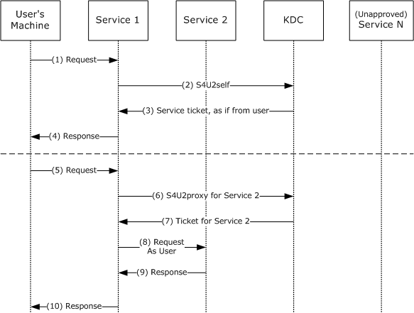


# MS-SFU Server Test Design Specification

## Contents

* [Technical Document Analysis](#_Toc3964682143)
    * [Technical Document Overview](#_Toc3964682144)
    * [Relationship to Other Protocols](#_Toc3964682145)
    * [Protocol Operations/Messages](#_Toc3964682146)
    * [Protocol Properties](#_Toc3964682147)
* [Test Method](#_Toc3964682148)
    * [Assumptions, Scope and Constraints](#_Toc3964682149)
    * [Test Approach](#_Toc3964682150)
    * [Test Scenarios](#_Toc3964682151)
		* [S4U2Self](#_Toc3964682152)
        * [S4U2Proxy](#_Toc4964682132)
* [Test Suite Design](#_Toc3964682160)
    * [Test Suite Architecture](#_Toc3964682161)
		* [System under Test (SUT)](#_Toc3964682162)
		* [Test Suite Architecture](#_Toc3964682163)
    * [Technical Dependencies/Considerations](#_Toc3964682164)
		* [Dependencies](#_Toc3964682165)
		* [Technical Difficulties](#_Toc3964682166)
		* [Encryption Consideration](#_Toc3964682167)
    * [Adapter Design](#_Toc3964682168)
		* [Adapter Overview](#_Toc3964682169)
		* [Technical Feasibility of Adapter Approach](#_Toc3964682170)
		* [Adapter Abstract Level](#_Toc3964682171)
* [Test Cases Design](#_Toc3964682172)
    * [Traditional Test Case Design](#_Toc3964682173)
    * [Test Cases Description](#_Toc3964682174)
		* [S4U2Self](#_Toc3964682175)
        * [S4U2Proxy](#_Toc5964682135)
* [Appendix](#_Toc3964682176)
    * [Glossary](#_Toc3964682177)
    * [Reference](#_Toc3964682178)

## <a name="_Toc3964682143"/>Technical Document Analysis

### <a name="_Toc3964682144"/>Technical Document Overview
This protocol extends Kerberos by specifying Service for User (S4U) extensions in relation to [RFC4120] and [Referrals]. 

S4U supports two subprotocols: Service for User to Self (S4U2self) and Service for User to Proxy (S4U2proxy). Both of these extensions allow a service to request a ticket from the Key Distribution Center (KDC) on behalf of a user. A ticket can be retrieved by the service to itself by using S4U2self or to another service via S4U2proxy. The client name, realm, and authorization data in the service ticket that uses these extensions are of the user, not of the service making the S4U request. This is in contrast to the Kerberos Protocol specified in [RFC4120] where any service tickets requested by a service will have the client name, realm, and authorization data of that requesting service.

### <a name="_Toc3964682145"/>Relationship to Other Protocols
The S4U extensions are based on the Kerberos Protocol, as specified in [RFC4120]. [RFC4120] also details the dependence on lower-layer protocols such as TCP and UDP. Applications using other protocols can use S4U to create a common authorization path within the application.

The S4U2self extension can be used to obtain a privilege attribute certificate (PAC), as specified in [MS-PAC], to determine the authorization capabilities of the user. In addition, the PAC is used in the S4U2proxy extension to validate that S4U2proxy service tickets have not been misused.

The referral mechanism, as specified in [Referrals], is used in the S4U2self protocol extension if the user's realm is different from that of the service trying to obtain an S4U2self service ticket.

Microsoft Kerberos Protocol Extensions, as specified in [MS-KILE], includes extensions that provide platform-specific data to support the encoding of authorization data ([MS-PAC], section 2) in the authorization data field ([RFC4120], sections 5.2.6 and 5.2.7) of the ticket.

### <a name="_Toc3964682146"/>Protocol Operations/Messages
This protocol conforms to messages and sequences defined in [RFC4120].

The following sequence diagram presents an overview of the steps and messages between different endpoints.

### <a name="_Toc3964682147"/>Protocol Properties

* This protocol extends [RFC4120].
* Under-layer transport could either be TCP or UDP.

## <a name="_Toc3964682148"/>Test Method

### <a name="_Toc3964682149"/>Assumptions, Scope and Constraints
**Assumptions:**

* The principals should be configurable and support specific attributes defined in section 3.2.1.

**Scope:**

* The KDC role will be tested as SUT.
* The service role is out of scope.
* External protocols are out of scope.

**Constraint:**
There is no constraint for this test suite.

### <a name="_Toc3964682150"/>Test Approach

Traditional testing is chosen as the test approach in MS-SFU.

Reasons for choosing Traditional Testing

* The protocol is not completely stateful.

* The logic of this protocol is simple.

* For this protocol, all PDUs in the connection/disconnection sequences are sent sequentially.

* The combinations of parameters are not complex.

### <a name="_Toc3964682151"/>Test Scenarios

|  **Scenario** |  **Priority** |  **Test Approach** |  **Description** |
| -------------| -------------| -------------| ------------- |
| S4U2Self| 0 | Traditional | This scenario is used to verify the S4U2Self sequences. |
| S4U2Proxy| 0 | Traditional | This scenario is used to verify the S4U2Proxy sequences. |

_Table 1 Test Suite Scenarios_

#### <a name="_Toc3964682152"/>S4U2Self
**Preconditions:**

KDC supports the S4U2Self extension.

**Typical Sequence:**

The typical scenario sequence is the following:

* Service authenticates to KDC through AS_REQ/AS_REP exchanges.
* Service requests a service ticket for specific user by sending TGS_REQ with PA-FOR-USER.
* KDC returns a service ticket as if it is requested by the user.

The connection sequence is also described in section [Protocol_Operations/Messages](#_Toc3964682146).

**Scenario Testing:**

This scenario tests the following types:

* PA-FOR-USER

#### <a name="_Toc4964682132"/>S4U2Proxy
**Preconditions:**

KDC supports the S4U2Proxy extension.

**Typical Sequence:**

The typical scenario sequence is the following:

* Service authenticates to KDC through AS_REQ/AS_REP exchanges.
* Service requests a service ticket for specific user by sending TGS_REQ with PA-FOR-USER.
* KDC returns a service ticket as if it is requested by the user.
* Service requests ticket of another service by providing the service ticket of the user additionally.
* KDC returns the ticket of another service as if it is requested by the user.

The connection sequence is also described in section [Protocol_Operations/Messages](#_Toc3964682146).

**Scenario Testing:**

This scenario tests the following types:

* S4U_DELEGATION_INFO

## <a name="_Toc3964682160"/>Test Suite Design

### <a name="_Toc3964682161"/>Test Suite Architecture

#### <a name="_Toc3964682162"/>System under Test (SUT)
* From the third party point of view, the SUT is a component that implements MS-SFU KDC role.
* From the Windows implementation point of view, the SUT is the Active Directory domain controller.

#### <a name="_Toc3964682163"/>Test Suite Architecture
Figure 1 illustrates the architecture of the MS-SFU test suite for server endpoint testing.

 _Figure 1 MS-SFU Server Test Suite Architecture_

### <a name="_Toc3964682164"/>Technical Dependencies/Considerations

#### <a name="_Toc3964682165"/>Dependencies
There are no dependencies.

#### <a name="_Toc3964682166"/>Technical Difficulties
There are no technical difficulties.

#### <a name="_Toc3964682167"/>Encryption Consideration

* All key data of protocol are encrypted by secure method provided by [RFC4120].

### <a name="_Toc3964682168"/>Adapter Design

#### <a name="_Toc3964682169"/>Adapter Overview
The MS-SFU Server Test Suite implements a protocol adapter. The protocol adapter is used to receive messages from the SUT and to send messages to the SUT. The protocol adapter is built upon the protocol test suite library, which is implemented with managed code.

#### <a name="_Toc3964682170"/>Technical Feasibility of Adapter Approach
The protocol adapter provides a protocol test client which extends Kerberos protocol test client to exchange PDUs with SUT.

#### <a name="_Toc3964682171"/>Adapter Abstract Level

**Protocol Test Client**

Protocol test client defines three methods. These interfaces can be summarized as following:

* Authenticate
	* Authenticate with KDC by exchanging AS_REQ/AS_REP.
* S4U2Self
	* Get the service ticket by exchanging TGS_REQ/TGS_REP.
* S4U2Proxy
	* Get the ticket of another service by exchanging TGS_REQ/TGS_REP.

## <a name="_Toc3964682172"/>Test Cases Design

### <a name="_Toc3964682173"/>Traditional Test Case Design
The Traditional test approach is used to design all test cases.
The following table shows the number of test cases for each scenario.

|  **Scenario** |  **Test cases** |  **BVT** |  **P0** |  **P1** |
| ------------- | ------------- | ------------- | ------------- | ------------- |
| S4U2Self | 3 | 2 | 1 | 0 |
| S4U2Proxy | 5 | 2 | 3 | 0 |

### <a name="_Toc3964682174"/>Test Cases Description
The test suite is a synthetic Kerberos client which supports MS-SFU. In the following descriptions, all instances of the term “Test Suite” can be understood as the protocol test client.

**Common prerequisites for all test cases:**

* The KDC is configured and can be accessed by specific IP address and port.

* The KDC supports the MS-SFU extension.

* **Service1a** sets `TrustedToAuthenticationForDelegation` to true and `ServicesAllowedToSendForwardedTicketsTo` to include **Service2**.

* **Service2** sets `ServicesAllowedToReceiveForwardedTicketsFrom` to include the token of **Service1b**.

* **Restricteduser** sets `DelegationNotAllowed` to true.

**Common cleanup requirements:**

* The test suite disconnects all connections if any.

The common prerequisites and cleanup requirements are not listed in any of the test cases. Only prerequisites and cleanup requirements unique to the test case are listed in the corresponding test case descriptions.

#### <a name="_Toc3964682175"/>S4U2Self

##### BVT_SingleRealm_S4U2Self_UsingUserName

| **Test ID** | BVT_SingleRealm_S4U2Self_UsingUserName |
| ------------- | ------------- |
|  **Priority** | P0 |
|  **Description** | This test case is used to verify that S4U2Self service ticket could be retrieved using user name of delegated user. |
|  **Prerequisites**| N/A |
|  **Test Execution Steps**| Authenticate with SUT using Service1a. |
| | Exchange S4U2Self with SUT using user name of delegated user. |
| | Verify the below fields in reply, |
| | The cname and crealm are set to those of delegated user. |
| | The FORWARDABLE is set. |
|  **Requirements Covered**| N/A |
|  **Cleanup**| N/A |

##### BVT_SingleRealm_S4U2Self_ResourceBased_UsingUserName

| **Test ID** | BVT_SingleRealm_S4U2Self_ResourceBased_UsingUserName |
| ------------- | ------------- |
|  **Priority** | P0 |
|  **Description** | This test case is used to verify that S4U2Self service ticket could be retrieved using user name of delegated user and resource-based constrained delegation. |
|  **Prerequisites**| N/A |
|  **Test Execution Steps**| Authenticate with SUT using Service1b. |
| | Exchange S4U2Self with SUT using user name of delegated user. |
| | Verify the below fields in reply, |
| | The cname and crealm are set to those of delegated user. |
| | The FORWARDABLE is not set. |
|  **Requirements Covered**| N/A |
|  **Cleanup**| N/A |

##### SingleRealm_S4U2Self_Restricted_UsingUserName

| **Test ID** | SingleRealm_S4U2Self_Restricted_UsingUserName |
| ------------- | ------------- |
|  **Priority** | P0 |
|  **Description** | This test case is used to verify that S4U2Self service ticket could be retrieved using user name of restricted user. |
|  **Prerequisites**| N/A |
|  **Test Execution Steps**| Authenticate with SUT using Service1a. |
| | Exchange S4U2Self with SUT using user name of restricted user. |
| | Verify the below fields in reply, |
| | The cname and crealm are set to those of restricted user. |
| | The FORWARDABLE is not set. |
|  **Requirements Covered**| N/A |
|  **Cleanup**| N/A |

#### <a name="_Toc5964682135"/>S4U2Proxy

##### BVT_SingleRealm_S4U2Proxy_UsingUserName

| **Test ID** | BVT_SingleRealm_S4U2Proxy_UsingUserName |
| ------------- | ------------- |
|  **Priority** | P0 |
|  **Description** | This test case is used to verify that S4U2Proxy service ticket could be retrieved using user name of delegated user. |
|  **Prerequisites**| N/A |
|  **Test Execution Steps**| Authenticate with SUT using Service1a. |
| | Exchange S4U2Self with SUT using user name of delegated user. |
| | Verify the below fields in reply, |
| | The cname and crealm are set to those of delegated user. |
| | The FORWARDABLE is set. |
| | Exchange S4U2Proxy with SUT using Service2. |
| | Verify the below fields in reply, |
| | The cname and crealm are set to those of S4U2Self service ticket. |
| | The FORWARDABLE is set. |
| | There is an S4U_DELEGATION_INFO in PAC. |
|  **Requirements Covered**| N/A |
|  **Cleanup**| N/A |

##### BVT_SingleRealm_S4U2Proxy_ResourceBased_UsingUserName

| **Test ID** | BVT_SingleRealm_S4U2Proxy_ResourceBased_UsingUserName |
| ------------- | ------------- |
|  **Priority** | P0 |
|  **Description** | This test case is used to verify that S4U2Proxy service ticket could be retrieved using user name of delegated user and resource-based constrained delegation. |
|  **Prerequisites**| N/A |
|  **Test Execution Steps**| Authenticate with SUT using Service1b. |
| | Exchange S4U2Self with SUT using user name of delegated user. |
| | Verify the below fields in reply, |
| | The cname and crealm are set to those of delegated user. |
| | The FORWARDABLE is not set. |
| | Exchange S4U2Proxy with SUT using Service2 and resource-based constrained delegation. |
| | Verify the below fields in reply, |
| | The cname and crealm are set to those of S4U2Self service ticket. |
| | The FORWARDABLE is set. |
| | There is an S4U_DELEGATION_INFO in PAC. |
|  **Requirements Covered**| N/A |
|  **Cleanup**| N/A |

##### Negative_SingleRealm_S4U2Proxy_ResourceBased_UsingUserName_FlagNotSet

| **Test ID** | Negative_SingleRealm_S4U2Proxy_ResourceBased_UsingUserName_FlagNotSet |
| ------------- | ------------- |
|  **Priority** | P0 |
|  **Description** | This test case is used to verify that S4U2Proxy service ticket could not be retrieved using user name of delegated user if not specifying resource-based constrained delegation. |
|  **Prerequisites**| N/A |
|  **Test Execution Steps**| Authenticate with SUT using Service1a. |
| | Exchange S4U2Self with SUT using user name of delegated user. |
| | Verify the below fields in reply, |
| | The cname and crealm are set to those of delegated user. |
| | The FORWARDABLE is not set. |
| | Exchange S4U2Proxy with SUT using Service2. |
| | Verify the reply is KRB-ERR-BADOPTION and STATUS_ACCOUNT_RESTRICTION. |
|  **Requirements Covered**| N/A |
|  **Cleanup**| N/A |

##### Negative_SingleRealm_S4U2Proxy_Restricted_UsingUserName

| **Test ID** | Negative_SingleRealm_S4U2Proxy_Restricted_UsingUserName |
| ------------- | ------------- |
|  **Priority** | P0 |
|  **Description** | This test case is used to verify that S4U2Proxy service ticket could not be retrieved for restricted user using user name of restricted user. |
|  **Prerequisites**| N/A |
|  **Test Execution Steps**| Authenticate with SUT using Service1a. |
| | Exchange S4U2Self with SUT using user name of restricted user. |
| | Verify the below fields in reply, |
| | The cname and crealm are set to those of restricted user. |
| | The FORWARDABLE is not set. |
| | Exchange S4U2Proxy with SUT using Service2. |
| | Verify the reply is KRB-ERR-BADOPTION and STATUS_NO_MATCH. |
|  **Requirements Covered**| N/A |
|  **Cleanup**| N/A |

##### Negative_SingleRealm_S4U2Proxy_ResourceBased_Restricted_UsingUserName

| **Test ID** | Negative_SingleRealm_S4U2Proxy_ResourceBased_Restricted_UsingUserName |
| ------------- | ------------- |
|  **Priority** | P0 |
|  **Description** | This test case is used to verify that S4U2Proxy service ticket could not be retrieved using user name of restricted user and resource-based constrained delegation. |
|  **Prerequisites**| N/A |
|  **Test Execution Steps**| Authenticate with SUT using Service1b. |
| | Exchange S4U2Self with SUT using user name of restricted user. |
| | Verify the below fields in reply, |
| | The cname and crealm are set to those of restricted user. |
| | The FORWARDABLE is not set. |
| | Exchange S4U2Proxy with SUT using Service2 and resource-based constrained delegation. |
| | Verify the reply is KRB-ERR-BADOPTION and STATUS_ACCOUNT_RESTRICTION. |
|  **Requirements Covered**| N/A |
|  **Cleanup**| N/A |

## <a name="_Toc3964682176"/>Appendix

### <a name="_Toc3964682177"/>Glossary
**SUT**: System under Test. In this specification, it indicates the MS-SFU KDC role implementation.
**Test Suite**: The synthetic Kerberos client which suppurts MS-SFU extension and is used to test against SUT.

### <a name="_Toc3964682178"/>Reference

* Technical Document: [MS-SFU].pdf
