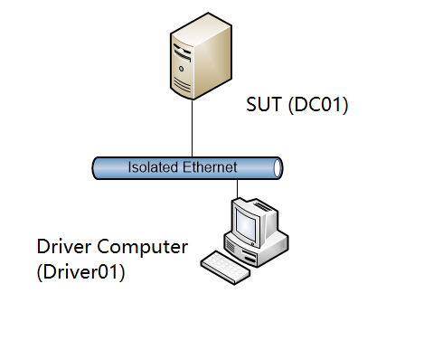

# MS-SFU Server Test Suite User Guide

## Contents

* [Introduction](#introduction)
* [License Information](#license-information)
* [Further Assistance](#further-assistance)
* [Requirements](#requirements)
* [Environment](#environment)
    * [Driver Computer](#driver-computer)
    * [System Under Test](#system-under-test)
    * [Domain Controller](#domain-controller)
    * [Software](#software)
* [Network Setup](#network-setup)
    * [Network Infrastructure](#network-infrastructure)
    * [Domain Environment](#domain-environment)
    * [Verify Connectivity from the Driver Computer](#verify-connectivity-from-the-driver-computer)
* [Computer Setup](#computer-setup)
    * [Set Up the Driver Computer](#set-up-the-driver-computer)
    * [Set Up a Windows-Based SUT](#set-up-a-windows-based-sut)
    * [Set Up a Windows-Based Domain Controller](#set-up-a-windows-based-domain-controller)
* [Configuration](#configuration)
    * [Configure Windows-based Computers](#configure-windows-based-computers)
    * [Configure the Test Suite](#configure-the-test-suite)
		* [Required Configuration Settings](#required-configuration-settings)
		* [Optional Configuration Settings](#optional-configuration-settings)
* [Running Test Cases](#running-test-cases)
 

## Introduction

This guide provides information about how to install, configure, and run the MS-SFU Server Endpoint Test Suite and its environment.

This suite of tools is designed to test implementations of the following protocols:

* _[MS-SFU]: Kerberos Protocol Extensions: Service for User and Constrained Delegation Protocol_

This suite of tools tests only the protocol implementation behaviors that are observed on the wire.

## License Information

For licensing information, see the End User License Agreement (EULA) that was provided with this test suite. The EULA is contained in the License.rtf file in the installation folder.

## Further Assistance

If you need further information about this test suite or assistance in troubleshooting issues related to this test suite, contact dochelp@microsoft.com.

## Requirements

This section describes the requirements for the test environment that are used to run this test suite.

Note

>The requirements in this section apply only to the Windows-based computers in the test environment.

Note

>The driver computer must use a Windows-based operating system.

## Environment

Run this test suite requires a Domain environment that contains the following computers, physical or virtual:

* A driver computer running any version of Windows which is compatible with Visual Studio 2017.

* A computer configured as the SUT (System Under Test). It can be any version of Windows or a SUT implementation that is not based on the Windows operating system.

* A computer configured as a Domain Controller (DC). If this computer is running Windows, it must be running Windows Server 2008 R2 or the later. The DC can be on the SUT.

A computer configured as the SUT (System Under Test). It can be any version of Windows or a SUT implementation that is not based on the Windows operating system.

### Driver Computer

The minimum requirements for the driver computer are as follows.

|  **Requirement**|  **Description**|
| -------------| ------------- |
| Operating system| Any version of Windows which is compatible with Visual Studio 2017.|
| Memory| 4 GB RAM|
| Disk space| 40 GB |

### System Under Test

The minimum requirements for the SUT are as follows.

|  **Requirement**|  **Description**|
| -------------| ------------- |
| Operating system| Any version of Windows or a SUT implementation that is not based on the Windows operating system |
| Memory| 2 GB RAM|
| Disk space| 20 GB|

### Domain Controller

The minimum requirements for the DC are as follows.

|  **Requirement**|  **Description**|
| -------------| ------------- |
| Operating system| Windows Server 2008 R2, Windows 2012, Windows 2012 R2 or a directory domain service implementation that is not based on the Windows operating system|
| Services| Directory domain service (such as the Windows Active Directory Domain Services (AD DS))|
| Memory| 4 GB RAM|
| Disk space| 20 GB|

### Software
All of the following software must be installed on the driver computer _before_ the installation of this test suite.

|  **Required Software**|**Description**|
| -------------| ------------- |
| Microsoft® Visual Studio® 2017 | Required individual components by installing in Visual Studio Installer |
| |.NET desktop development|
| |Testing tools core features|
| | .NET Framework 4.7.1 SDK	| 	
| | C# and Visual Basic Roslyn compilers	| 	
| | Visual C++ 2017 Redistributable Update|
| | Visual Studio C++ core features		|
| | VC++ 2017 version 15.8 v14.15 latest v141 tools	| 	
| | Windows 10 SDK (10.0.16299.0) for Desktop|
| Protocol Test Framework | Build 1.0.6000.0|
| |You can download the Protocol Test Framework from below website.[https://github.com/Microsoft/ProtocolTestFramework/releases](https://github.com/Microsoft/ProtocolTestFramework/releases)|
| Spec Explorer | Build 3.5.3146.0 or later|
|              |You can download Spec Explorer from [http://visualstudiogallery.msdn.microsoft.com/271d0904-f178-4ce9-956b-d9bfa4902745/](http://visualstudiogallery.msdn.microsoft.com/271d0904-f178-4ce9-956b-d9bfa4902745/)|
|  **Optional Software** ||
|       Microsoft Message Analyzer Version |Version 1.4 (Build 4.0.8112.0)|
| |You can download the latest Message Analyzer from [http://www.microsoft.com/en-us/download/details.aspx?id=44226](http://www.microsoft.com/en-us/download/details.aspx?id=44226)|

Note

>Visual Studio 2017 Community is the minimum requirement.

## Network Setup

This section describes the test environment using physical computers. For information about configuring a virtual machine, see [http://www.microsoft.com/virtualization/en/us/solution-appliance-test.aspx](http://www.microsoft.com/virtualization/en/us/solution-appliance-test.aspx).

### Network Infrastructure
Version
* A test network is required to connect the test computer systems

* It must consist of an isolated hub or switch

* It must not be connected to a production network or used for any other business or personal communications or operations

* It must not be connected to the internet

* IP addresses must be assigned for a test network

* Computer names should be assigned in a test network infrastructure

* User credentials used on the system must be dedicated to the test network infrastructure

* Details including computer IP addresses, names and credentials are saved in log files

Refer to the Privacy Statement and EULA for further information.

### Domain Environment

The domain environment requires interactions between the following computers and server roles. Note that the domain controller, required for a domain environment, can be installed on the SUT.

* The driver computer, which runs the test cases by sending requests over the wire in the form of protocol messages.

* The SUT, which runs a client implementation of the protocol that is being tested. The SUT responds to the requests sent by the driver computer.

* The DC provides functionality that is required to test the protocol implementation. Specifically, the DC hosts Active Directory Domain Services (AD DS).

The following figure shows the domain environment.

### Verify Connectivity from the Driver Computer

After you prepare the environment, verify the connection from the driver computer to the SUT, and between all other computers in the test environment. The following provides a general list of steps that you can use to check for connectivity between two Windows-based computers. For further information, see the administration guide for your operating system.

Note

>Disable active firewalls in the test environment.

To check the connection from the driver computer

* Click the **Start** button, and then click **Run**.

* In the **Run** dialog box, type **cmd** and then click **OK**.

* At the command prompt, type **ping** followed by the hostname or IP address of the SUT, and then press **Enter**. The following example checks the connection to a SUT named "SUT01":
 &#62;  ping SUT01

* Repeat these steps until you confirm connectivity between all computers in the test environment.

Do not proceed with the configuration of the test suite until connectivity is confirmed. Any issues with network connectivity must be resolved before you configure the test suite.

## Computer Setup

### Set Up a Windows Based Domain Controller
This section provides information about how to set up a DC for use with this test suite.

To set up a Windows-based DC

* Rename the computer name as DC01
* Install Active Directory Domain Services.
* Follow the wizard to prompt the computer as a domain controller. As an example, the domain name is BLAH.COM. Domain administrator password is configured as "Password01!".
* After reboot, the DC will prompted successfully.
* Start Windows PowerShell by right-clicking on the **Windows PowerShell** icon, and then click **Run as Administrator**, or from a Windows PowerShell command window, type: Start-process powershell -verb runAs
* At the command prompt, type Set-ExecutionPolicy Unrestricted -F, and press **Enter**.
* Create domain user "service1user" with password "Password01!".
  Create domain user "service2user" with password "Password01!"

### Set Up a Windows Based System Under Test (SUT)
This section provides information about how to set up a SUT for use with this test suite.
* Log on to the SUT as administrator
* Rename the computer as SUT01  
* Join the domain BLAH.COM
* After reboot, the domain join will finished
* Start Windows PowerShell by right-clicking on the **Windows PowerShell** icon, and then click **Run as Administrator**, or from a Windows PowerShell command window, type: Start-process powershell -verb runAs

### Set Up a Driver Computer
  This section provides information about how to set up a Driver Computer for use with this test suite.
  * Log on to the Driver Computer as administrator
  * Rename the computer as Driver01  
  * Join the domain BLAH.COM
  * After reboot, the domain join will finished

## Config Computers

### Config Domain controller

Log into the Domain Controller DC01 using domain administrator credentials DC01

Create standard domain users on DC01 with user name "testuser" and password "Password01!"

Create standard domain users on DC01 with user name "service1user" and password "Password01!". This user is for both S4U2Self and S4U2Proxy scenarios.

Create standard domain users on DC01 with user name "service2user" and password "Password01!". This user is for the S4U2Proxy scenario only.

Run PowerShell with administrator privilege:

  _setspn -u -s service1/SUT01@BLAH.COM service1user_

  _Ktpass.exe  /princ service1/SUT01@BLAH.COM /mapuser BLAH\service1user /pass Password01! /out keytab.tab /ptype KRB5_NT_PRINCIPAL Crypto ALL /rawsalt service1_

  _setspn -u -s service2/SUT01@BLAH.COM service2user_

  _Ktpass.exe  /princ service2/SUT01@BLAH.COM /mapuser BLAH\service2user /pass Password01! /out keytab.tab /ptype KRB5_NT_PRINCIPAL Crypto ALL /rawsalt service2_

  _Set-ADUser service2user -PrincipalsAllowedToDelegateToAccount (Get-ADUser service1user)_

  _gpupdate /force_

### Config Driver Computer and Run Test Cases

  
  Important

  >Microsoft Visual Studio 2017 (or later) and Protocol Test Framework (build 1.0.6500.0, https://github.com/Microsoft/ProtocolTestFramework/releases/tag/1.0.6500.0) must be installed on the driver computer before you run the test suite installer.

  * Download the test suite source code to the driver computer and extract code to local drive. For example, the source code is extracted to   C:\\sourcecode.

  * Open the C:\\SourceCode\\WindowsProtocolTestSuites\\TestSuites\\MS-SFU\\src\MS-SFU_Server.sln with Visual Studio 2017.

### Configure the Test Suite

This test suite is installed with default configuration settings. You may need to change these settings if you use a customized test environment or if you customize your test runs.

You can define various options for the test suite, such as the following:

* Define the settings of the test environment, including computer names and IP addresses.

* Define the basic options used in the test suite, for example, the protocol version or the version of the target operating system.

* Define the folders and formats used for output from test runs.

* Define scripts to run before and after each test run.

* Set time limits on discrete test tasks and for test runs.

To change configuration settings, edit the **MS-SFU_ServerTestSuite.deployment.ptfconfig** file. You can find this file in the directory C:\\SourceCode\\WindowsProtocolTestSuites\\TestSuites\\MS-SFU\\src\\TestSuite.

#### Required Configuration Settings

The following table describes the required properties for all the test cases.

|  **Property**|  **Description**|
| -------------| ------------- |
|  **SutHostName**| Indicates the SUT computer name.|
| | Default value is **DC01**.|
|  **RemoteMachinePort**| The remote machine port for test suite transport.|
| | Default value: **88**|
|  **Transport**| The transport of test suite. |
| | Default value: **TCP**.|
|  **Realm1**| The domain name used for test environment.|
| | The default value used in this test suite: **BLAH.COM**|
|  **DelegatedUserName**| The user to be delegated.|
| | Default value: **testuser**|
|  **DelegatedUserType**| The delegated user type.|BLAH.COM
| | Default value: **NT_ENTERPRISE**|
|  **Service1FQDN**| The FQDN of service1. |
| | Default value:**Service1\/SUT01@BLAH.COM**|
|  **Service1Salt**| The salt for service 1.|
| | Default value: **service1**|
|  **Service1Username**| The user service 1 to delegate for.|
| | Default value: **service1user**|
|  **Service1Password**| The password for service1username.|
| | Default value: **Password01!**|
|  **Service2FQDN**| The FQDN of service2.|
| | Default value: **service2\/SUT01@BLAH.COM**|
|  **Service2UserName**| The user name for service 2 to delegate for.|
| | Default value: **service2user**|
|  **Service2Password**| The password for service2username.|
| | Default value: **Password01!**|

## Run and Debug Test Cases

You can use the Visual Studio solution (.sln) file included with this test suite to run or debug test cases that you create for your protocol implementation.

On the driver computer, use Microsoft® Visual Studio® to open the MS-SFU_Server.sln solution file in the source code C:\\SourceCode\\WindowsProtocolTestSuites\\TestSuites\\MS-SFU\\src subfolder.

* In the **Solution Explorer** window, right-click the **Solution** **MS-SFU**, and select **Build Solution**.

* Open the **Test Explorer** window in Visual Studio, select the names of the test cases that you want to debug.

## Troubleshooting

This section describes how to troubleshoot common test suite issues.

### Ping Failure

| | |
| -------------| -------------|
| **PROBLEM**| The SUT does not respond to pings from the driver computer.|
| **CAUSE**| The driver computer was not in the same network segment as the SUT, or the SUT firewall is enabled. |
| **RESOLUTION**| Move the driver computer and the SUT to the same network segment or disable the SUT firewall.|
