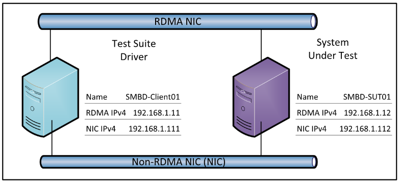

###MS-SMBD Protocol Server Test Design Specification

##Contents
* [Contents](#_Toc427489478)
* [Introduction](#_Toc427489479)
* [Technical Document Analysis](#_Toc427489480)
    * [Technical Document Overview](#_Toc427489481)
    * [Relationship to Other Protocols](#_Toc427489482)
    * [Protocol 	Operations/Messages](#_Toc427489483)
    * [Protocol Properties](#_Toc427489484)
* [Test Method](#_Toc427489485)
    * [Assumptions, Scope and Constraints](#_Toc427489486)
    * [Test Approach](#_Toc427489487)
    * [Test Scenarios](#_Toc427489488)
		* [SmbdNegotiate](#_Toc427489489)
		* [SmbdDataTransfer](#_Toc427489490)
		* [SmbdCreditMgmt](#_Toc427489491)
		* [Smb2OverRdma](#_Toc427489492)
		* [Smb2Multichannel](#_Toc427489493)
		* [RemoteInvalidation](#_Toc427489494)
* [Test Suite Design](#_Toc427489495)
    * [Test Suite Architectures](#_Toc427489496)
		* [System under Test (SUT)](#_Toc427489497)
		* [Test Suite Environment](#_Toc427489498)
		* [Test Suite Architecture](#_Toc427489499)
    * [Technical Dependencies/Considerations](#_Toc427489500)
		* [Dependencies](#_Toc427489501)
		* [Technical Difficulties](#_Toc427489502)
		* [Encryption Consideration](#_Toc427489503)
		* [Other Considerations](#_Toc427489504)
    * [Adapter Design](#_Toc427489505)
		* [Adapter Overview](#_Toc427489506)
		* [Technical Feasibility of Adapter Approach](#_Toc427489507)
		* [Adapter Abstract Level](#_Toc427489508)
		* [Adapter Inner Work](#_Toc427489509)
* [Test Cases Design](#_Toc427489510)
    * [Traditional Test Case Design](#_Toc427489511)
    * [Test Cases Description](#_Toc427489512)
		* [BVT Test Cases](#_Toc427489513)
		* [SmbdNegotiate](#_Toc427489514)
		* [SmbdDataTransfer](#_Toc427489515)
		* [SmbdCreditMgmt](#_Toc427489516)
		* [Smb2OverRdma](#_Toc427489517)
		* [Smb2Multichannel](#_Toc427489518)
		* [RemoteInvalidation](#_Toc427489519)
* [Appendix](#_Toc427489520)
    * [Glossary](#_Toc427489521)
    * [Reference](#_Toc427489522)

## <a name="_Toc427489479"/>Introduction
This document provides information about how MS-SMBD test suite is designed to test MS-SMBD technical document usability and accuracy. It gives the analysis of MS-SMBD technical document content, and describes test assumptions, scope and constraints of the test suite. It also specifies test approach, test scenarios, detail test cases, test suite architecture and adapter design.

## <a name="_Toc427489480"/>Technical Document Analysis

### <a name="_Toc427489481"/>Technical Document Overview
The SMB2 RDMA Transport Protocol defines a framing for the exchange of arbitrary upper-layer data over RDMA-capable networks in a peer-to-peer fashion. The protocol allows for bidirectional traffic of variable size and does not require any particular upper-layer communication pattern, such as client-server. Accordingly, the protocol is well-suited to support SMB2 exchanges, which exhibit a mix of client and server requests and responses, asynchronous unsolicited messages from server to client, unacknowledged requests such as cancellation, and an extremely wide range of sizes.

RDMA networks provide high-bandwidth and low-latency data services, and adapters supporting RDMA typically provide a local control interface offering extremely low processing overhead for sending and receiving messages. Additionally, the RDMA functions of the network provide for further reduction of overhead by moving bulk data directly between memory buffers on each peer, under the control and protection of upper layers such as SMB2. The results can radically reduce network overhead on a cycles per byte transferred basis.

The SMB2 RDMA Transport Protocol also defines interfaces and peer-visible descriptors for registering buffers which enable RDMA access, advertised to the peer for read or write on a specific connection. These buffer descriptors allow the upper layer to steer direct placement traffic, without requiring the upper layer to interface with the RDMA lower layer directly.

### <a name="_Toc427489482"/>Relationship to Other Protocols
RDMA Transports
The RDMA transports most commonly used by SMB2 RDMA Transport Protocol include:

* iWARP, as specified in [[RFC5040]](http://go.microsoft.com/fwlink/?LinkId=230446) and [[RFC5041]](http://go.microsoft.com/fwlink/?LinkId=230447).
* Infiniband Reliable Connected mode, as specified in [[IBARCH]](http://go.microsoft.com/fwlink/?LinkId=230464).
* RDMA over Converged Ethernet (RoCE), as specified in [[ROCE]](http://go.microsoft.com/fwlink/?LinkId=230465).

Protocols Transported by SMB2 RDMA Transport Protocol
The following protocol uses SMB2 RDMA Transport Protocol as a transport and provides access to enhanced data transfer functionality:

* The SMB2 Protocol, when SMB2 dialect 3.x family is negotiated by both client and server and when an RDMA-capable transport is available for connection among the peers.

Additional Related Protocols

* The functionality provided by the SMB2 RDMA Transport Protocol, when accompanied by an RDMA transport, provides similar transport service to that of standard TCP/IP. Protocols such as SMB2 which define an existing layer over TCP can employ either or both to implement communications between peers.

The following block diagram represents the preceding relationships, with optional protocol relationships represented by dashed outlines, subject to appropriate standards to define a mapping.

### <a name="_Toc427489483"/>Protocol Operations/Messages
The following figure shows an initial exchange of SMBD traffic beneath a typical SMB2 Protocol stack.

* The client sends “Negotiate request” to server.

* The server sends back “Negotiate response” to client.
After negotiate, the client can exchange message with server for upper layer message.

* The client sends “Data transfers” to server, with upper layer package “SMB2 traffic” as payload.

* The server sends “RDMA transfers” message to the client with upper layer’s message.
It might send bulk of data according to the size of the message.

### <a name="_Toc427489484"/>Protocol Properties
* MS-SMBD is a block protocol.
* MS-SMBD is WSPP protocol.
* MS-SMBD is not MCPP protocol.
* MS-SMBD is transport-independent.
* MS-SMBD requires only an RDMA lower layer. In the lower layer RDMA transports most commonly used by MS-SMBD include: iWARP, Infiniband Reliable Connected Mode ([[IBARCH]](http://go.microsoft.com/fwlink/?LinkId=230464)) and RDMA over Coverged Ethernet ([[ROCE]](http://go.microsoft.com/fwlink/?LinkId=230465)). 
* MS-SMBD is used by an upper layer protocol [MS-SMB2]. 

## <a name="_Toc427489485"/>Test Method

### <a name="_Toc427489486"/>Assumptions, Scope and Constraints
**Assumptions**

* Test Suite Driver are running in Windows Server 2012 R2 x64 operating system.
* The SUT should support SMB2 dialect 3.x family and SMBD.

**Scope**

* SMBD operations described in [MS-SMBD].
    * SMBD Negotiate request/response;
    * SMBD Data Transfer;
    * SMBD Managing Credits;
* SMB2 operations over RDMA channel.
    * SMB2 READ file over RDMA Channel;
    * SMB2 WRITE file over RDMA Channel;
    * SMB2 Multiple Channels;

**Out of Scope**

* SMBD Register/Deregister Buffer.
* Protocol Client endpoint (SMBD Client), playing the client role, is out of scope for testing. 

**Constraints**
There are no constraints for this protocol.

### <a name="_Toc427489487"/>Test Approach
**Traditional based test approach** is suggested for MS-SMBD Protocol Test Suite Development based on the following factors: 

* Finite-state machine of this protocol is simple.
* Test cases are similar enough to share a substantial amount of code.
* Simple Abstract Data Model. 

Test cases will be generated by hand and checked through a series of assertions to determine test case failure or success.

### <a name="_Toc427489488"/>Test Scenarios
The following list contains all scenarios the test suite will consider:

|  **Category**|  **Scenario**|  **Priority**|  **Description**| 
| -------------| -------------| -------------| ------------- |
| SMBD| SmbdNegotiate| 0| Test SMBD negotiate request & response.| 
| SMBD| SmbdDataTransfer| 0| Test SMBD data transfer message.| 
| SMBD| SmbdCreditMgmt| 1| Test SMBD credit management.| 
| Smb2OverSmbd| Smb2OverRdma| 0| Test SMB2 read/write over RDMA channel.| 
| Smb2OverSmbd| Smb2Multichannel| 1| Test SMB2 multi-channel over RDMA.| 
| Smb2OverSmbd| RemoteInvalidation| 1| Test remote invalidation| 

#### <a name="_Toc427489489"/>SmbdNegotiate
Preconditions:
N/A.

Typical Sequence:
The typical scenario sequence is the following:

* Connect to server over RDMA.
* Send SMBD Negotiate request with variable parameters
* Verify server Negotiate response accordingly

#### <a name="_Toc427489490"/>SmbdDataTransfer
Preconditions:
N/A.

Typical Sequence:
The typical scenario sequence is the following:

* Connect to server over RDMA.
* SMBD negotiate with peer
* Establish SMB2 session and open file.
* Create SMB2 WRITE request package.
* Send SMB2 WRITE request over SMBD data transfer message (single segment or multiple segments).
* Verify received SMBD data transfer message and SMB2 WRITE response. 

#### <a name="_Toc427489491"/>SmbdCreditMgmt
Preconditions:
N/A.

Typical Sequence:
The typical scenario sequence is the following:

* Connect to server over RDMA.
* Send SMBD negotiate request to request specific credits.
* Verify SMBD negotiate response grants credits accordingly.
* Establish SMB2 session and open file.
* Create SMB2 WRITE request package.
* Send SMB2 WRITE request over SMBD data transfer message (single segment or multiple segment).
* Verify received SMBD data transfer message and SMB2 WRITE response. 

#### <a name="_Toc427489492"/>Smb2OverRdma
Preconditions:
N/A.

Typical Sequence 1, SMB2 Read file over RDMA channel:
The typical scenario sequence is the following:

* Connect to server over RDMA.

* SMBD negotiate with peer

* Establish SMB2 session and open file.

* Register buffer for RDMA Write.

* Send SMB2 READ request with RDMA Channel information to server.

* Verify the SMB2 READ response.

Typical Sequence 2, SMB2 Write file over RDMA channel:
The typical scenario sequence is the following:

* Connect to server over RDMA.

* SMBD negotiate with peer

* Establish SMB2 session and open file.

* Register buffer for RDMA Read.

* Write file content into registered buffer.

* Send SMB2 WRITE request with RDMA Channel information to server.

* Verify the SMB2 WRITE response. 

* Register buffer for RDMA Write.

* Send SMB2 READ request with RDMA Channel information to server.

* Verify the SMB2 READ response.

* Verify the read file content is same as written file correct.

#### <a name="_Toc427489493"/>Smb2Multichannel
Preconditions:
N/A.

Typical Sequence:
The typical scenario sequence is the following:

* Connect to server over TCP.

* Establish SMB2 session and open file over TCP.

* Send SMB2 WRITE request to server.

* Verify the SMB2 WRITE response.

* Get RDMA-NIC information via Query Network Interface Info. 

* Connect to server over RDMA.

* Register buffer for RDMA Write.

* Send SMB2 READ request with RDMA Channel information to server.

* Verify the SMB2 READ response.

* Verify the read file content is same as the written.

#### <a name="_Toc427489494"/>RemoteInvalidation
Preconditions:
N/A.

Typical Sequence:
The typical scenario sequence is the following:

* Connect to server over RDMA.

* SMBD negotiate with peer.

* Establish SMB2 session and open file on SMB 3.02 or later dialect.

* Register buffer and bind to a memory window for RDMA Read.

* Write file content into registered buffer.

* Send SMB2 WRITE request using descriptor describes the registered buffer to server with Channel field set to SMB2_CHANNEL_RDMA_V1_INVALIDATE.

* Verify the SMB2 WRITE success.

* Server responds with status success

* Content written is identical with that in step5

* Write file content into same registered buffer.

* Send SMB2 WRITE request using same descriptor to server via RDMA channel.

* Verify the memory window is no longer available for RDMA operation and connection is terminated.

* Delete file on server.

## <a name="_Toc427489495"/>Test Suite Design

### <a name="_Toc427489496"/>Test Suite Architectures

#### <a name="_Toc427489497"/>System under Test (SUT)
From the third party point of view, the SUT is a component that implements MS-SMBD.
From the Windows implementation point of view, the SUT is Windows Server 2012 R2.

#### <a name="_Toc427489498"/>Test Suite Environment

There are one Test Suite Driver and System Under Test (SUT) in MS-SMBD test environment. Both of them are installed RDMA-capable NIC (R-NIC) and non-RDMA-capable NIC (NIC). All R-NICs and NICs are assigned IPv4 or IPv6 address.

#### <a name="_Toc427489499"/>Test Suite Architecture

**Server Under Test:** MS-SMB2, MS-SMBD and TCP/IP protocols MUST be implemented on SUT.
**Test Suite Driver:** There are three main components, including SMBD Test Suite, SMBD and RDMA Test Suite Library. SMBD Test Suite requires SMB2 Test Suite Library to trigger the message sequence on SMBD. And RDMA Test Suite Library use the capability of RDMA NIC with Network Direct User Model Programming Interface (NDSPI). In theory, SMBD test suite can run over all types of RDMA protocols though there are variable RDMA protocols.

### <a name="_Toc427489500"/>Technical Dependencies/Considerations

#### <a name="_Toc427489501"/>Dependencies
There are dependencies listed below.

* [Protocol Test Framework (Latest Version)](https://github.com/microsoft/protocoltestframework)
* It provides the libraries for test case and test class initialization, adapter initialization, test suite configuration, test result validation, and test logging.
* Test Suite Library.
* SMBD Test Suite requires related Test Suite Library for transportation purpose.
* RDMA Driver.
* RDMA drivers are required to installed and configured in both client and server side, so that they could establish RDMA connection.

#### <a name="_Toc427489502"/>Technical Difficulties 
There are some technical difficulties list below:

* It is hard to cover all types of RDMA protocols.

* The RDMA protocols most commonly used by SMBD include: iWARP, Infiniband, RoCE. They require different physical network adapters. 

#### <a name="_Toc427489503"/>Encryption Consideration
There is no encryption consideration.

#### <a name="_Toc427489504"/>Other Considerations

* There are no other considerations.

### <a name="_Toc427489505"/>Adapter Design

#### <a name="_Toc427489506"/>Adapter Overview
The MS-SMBD test suite protocol adapter.

The protocol adapter is used to send message to the SUT and receive message from the SUT. It is built upon the Test Suite Library, which is implemented with managed code.

#### <a name="_Toc427489507"/>Technical Feasibility of Adapter Approach
Protocol Adapter
The protocol adapter uses Test Suite Library to generate protocol messages, which are sent to SUT. The MS-SMBD Test Suite Library will parse and decode the received messages and send them to protocol adapter.

#### <a name="_Toc427489508"/>Adapter Abstract Level

#### <a name="_Toc427489509"/>Adapter Inner Work

## <a name="_Toc427489510"/>Test Cases Design

### <a name="_Toc427489511"/>Traditional Test Case Design
The Traditional test approach is used to design all test cases. The test cases are designed to cover all in-scope testable requirements, including both positive and negative requirements. 

### <a name="_Toc427489512"/>Test Cases Description 

The test suite is a synthetic SMBD client. In the following descriptions, all instance of the term “Test Suite” can be understood as the SMBD client.

Below are some terms which are used in test case description:

* **R-NIC**: RDMA capable network interface

* **Non R-NIC**: None RDMA capable network interface

In this test suite, “Establish SMB2 session and open file” means message sequence of SMB2, including SMB2 NEGOTIATE, SMB2 SESSION_SETUP, SMB2 TREE_CONNECT and SMB2 CREATE.
In this test suite, there is no requirement captured. So “Requirements covered” are “N/A”, all the requirement will check directly in test code using BaseTestSite.Assert.

#### <a name="_Toc427489513"/>BVT Test Cases

| &#32;| &#32; |
| -------------| ------------- |
|  **SmbdNegotiate**| | 
|  **Test ID**|  **BVT_SmbdNegotiate_Basic**| 
|  **Priority**| P0| 
|  **Description** | Verify SMBD negotiate request is working as expected using accepted values.| 
|  **Prerequisites**| N/A| 
|  **Test Execution Steps**| Connect to server over RDMA| 
| | Sends negotiate message with below fields settings| 
| | **MinVersion**: 0x0100| 
| | **MaxVersion**: 0x0100| 
| | **Reserved**: 0x0000| 
| | **CreditsRequested**: 10| 
| | **PreferredSendSize**: 1024 (1 KB)| 
| | **MaxReceiveSize**: 1024 (1 KB)| 
| | **MaxFragmentedSize**: 131072 (128 KB)| 
| | Verify server sends negotiate response as below fields setting| 
| | **MinVersion**: 0x0100| 
| | **MaxVersion**: 0x0100| 
| | **NegotiatedVersion**: 0x0100| 
| | **Reserved**: 0x0000| 
| | **CreditsRequested**: must be greater than 0| 
| | **CreditsGranted**: must be greater than 0 and not great than 0x000A (10) (CreditRequested in Negotiate request)| 
| | **Status**: 0x0000| 
| | **MaxReadWriteSize**: at least 1048576 bytes| 
| | **PreferredSendSize**: at least 128 bytes and not greater than 1024 (1KB)(MaxReceiveSize in Negotiate request)| 
| | **MaxReceiveSize** at least 128 bytes and not greater than 1024 (1 KB)(MaxSendSize in Negotiate request)| 
| | **MaxFragmentedSize**: at least 0x20000 bytes (128 KB)| 
|  **Requirements covered**| N/A| 
|  **Cleanup**| N/A| 

| &#32;| &#32; |
| -------------| ------------- |
|  **SmbdDataTransfer**| | 
|  **Test ID**|  **BVT_SmbdDataTransfer_Basic_SendSmallBytesOfData**| 
|  **Priority**| P0| 
|  **Description** | Verify SMBD data transfer message can transfer small data as payload| 
|  **Prerequisites**| N/A| 
|  **Test Execution Steps**| Connect to server over RDMA| 
| | SMBD negotiate with peer| 
| | •    PreferredSendSize: 1024| 
| | •    MaxReceiveSize: 1024| 
| | Establish SMB2 session and open file| 
| | Create SMB2 WRITE request package, whose size is **small**.| 
| | SMB2 WRITE request over SMBD (Send small amount of data over SMBD)| 
| | •   RemainingDataLength: 0x000000| 
| | •   DataOffset: 24 | 
| | •   DataLength: (Size of SMB2 WRITE request)| 
| | •   Buffer: (SMB2 WRITE request package)| 
| | Sends SMBD data transfer message by RDMA send operation.| 
| | Verify server returned SMBD Data Transfer message as below,| 
| | •   CreditRequest MUST be greater than 0;| 
| | •   RemainingDataLength MUST be 0;| 
| | •   DataOffset MUST be 8-byte align;| 
| | •   DataLength MUST be size of SMB2 WRITE response;| 
| | Verify server returned SMB2 WRITE Response with STATUS_SUCCESS. | 
| | (Verify file content written by SMB2 WRITE request)| 
| | Send SMB2 READ request to read the file just written.| 
| | Receive SMBD Data Transfer messages and reassemble to SMB2 READ response.| 
| | Verify the SMB2 READ response with STATUS_SUCCESS. | 
| | Verify the read content is same as written.| 
|  **Requirements covered**| N/A| 
|  **Cleanup**| N/A| 

| &#32;| &#32; |
| -------------| ------------- |
|  **SmbdDataTransfer**| | 
|  **Test ID**|  **BVT_SmbdDataTransfer_Basic_SendModerateBytesData**| 
|  **Priority**| P0| 
|  **Description** | Verify higher-layer can transfer moderate size data over SMBD.  And SUT can receive several segments of one fragment and reassemble several SMBD Data Transfer message.| 
|  **Prerequisites**| N/A| 
|  **Test Execution Steps**| Connect to server over RDMA| 
| | SMBD negotiate with peer| 
| | •   PreferredSendSize: 1024| 
| | •   MaxReceiveSize: 1024| 
| | Establish SMB2 session and open file| 
| | Create SMB2 WRITE request package, whose size is **moderate**.| 
| | Create fragmented SMBD data transfer messages as below| 
| | The SMBD Data Transfer message fields are set to the following:| 
| | •   RemainingDataLength: (= size of SMB2 WRITE request – 1000)| 
| | •   DataOffset: 24 | 
| | •   DataLength: 1000 (1000 = Negotiated MaxReceiveSize – 24)| 
| | •   Buffer: (1000 bytes of SMB2  WRITE request package)| 
| | The SMBD Data Transfer message fields are set to the following:| 
| | •   RemainingDataLength: (= size of SMB2 WRITE request – 2000)| 
| | •   DataOffset: 24| 
| | •   DataLength: 1000 (1000 = Negotiated MaxReceiveSize – 24)| 
| | •   Buffer: (1000 bytes of SMB2 WRITE request package)| 
| | (Additional intermediate fragments, and pauses, elided…)| 
| | The SMBD Data Transfer message fields are set to the following:| 
| | •   RemainingDataLength: 0x000000000 (final message of fragmented sequence)| 
| | •   DataOffset: 24| 
| | •   DataLength: (remaining data size)| 
| | •   Buffer: (final bytes of SMB2  WRITE request package)| 
| | Sends SMBD data transfer messages.| 
| | After all segments has been sent to server,  verify server returned SMBD Data Transfer message as below,| 
| | •   CreditRequest MUST be greater than 0;| 
| | •   RemainingDataLength MUST be 0;| 
| | •   DataOffset MUST be 8-byte align;| 
| | •   DataLength MUST be size of SMB2 WRITE response;| 
| | Verify server returned SMB2 WRITE Response with STATUS_SUCCESS. | 
| | (Verify file content written by SMB2 WRITE request)| 
| | Send SMB2 READ request to read the file just written.| 
| | Receive SMBD Data Transfer messages and reassemble to SMB2 READ response.| 
| | Verify the SMB2 READ response with STATUS_SUCCESS. | 
| | Verify the read content is same as written.| 
|  **Requirements covered**| N/A| 
|  **Cleanup**| N/A| 

| &#32;| &#32; |
| -------------| ------------- |
|  **SmbdCreditMgmt**| | 
|  **Test ID**|  **BVT_SmbdCreditMgmt_OperationWithMinimumCredits**| 
|  **Priority**| P0| 
|  **Description** | Verify SMBD operation works fine with minimum credits (only 1 credit)| 
|  **Prerequisites**| N/A| 
|  **Test Execution Steps**| Connect to server over RDMA| 
| | SMBD Negotiate with peer| 
| | •   ReceiveCreditMax: 1| 
| | •   SendCreditTarget: 1| 
| | Verify the SMBD only grants 1 credits.| 
| | Establish SMB2 session and open file.| 
| | Create SMB2 WRITE request package, whose size is **moderate**.| 
| | Send SMB2 WRITE request to server. | 
| | Verify server return SMB2 WRITE response with STATUS_SUCCESS.| 
|  **Requirements covered**| N/A| 
|  **Cleanup**| N/A| 

| &#32;| &#32; |
| -------------| ------------- |
|  **Smb2OverRdma**| | 
|  **Test ID**|  **BVT_Smb2OverRdmaChannel_ReadLargeFile**| 
|  **Priority**| P0| 
|  **Description** | Verify SMB2 can read file with large size over RDMA channel| 
|  **Prerequisites**| N/A| 
|  **Test Execution Steps**| Connect to server over RDMA.| 
| | SMBD negotiate with peer.| 
| | Establish SMB2 session and open file.| 
| | Register memory with size **Smb2 Negotiated MaxReadSize** for RDMA Write.| 
| | Create SMB2 READ Request with RDMA Channel Information. The SMB2 READ request will make server RDMA write **large size** data to client.| 
| | Send SMB2 READ Request over SMBD Data Transfer.| 
| | Verify server return SMB2 READ Response with STATUS_SUCCESS.| 
|  **Requirements covered**| N/A| 
|  **Cleanup**| N/A| 

| &#32;| &#32; |
| -------------| ------------- |
|  **Smb2OverRdma**| | 
|  **Test ID**|  **BVT_Smb2OverRdmaChannel_WriteLargeFile**| 
|  **Priority**| P0| 
|  **Description** | Verify SMB2 can write file with large size over RDMA channel| 
|  **Prerequisites**| N/A| 
|  **Test Execution Steps**| Connect to server over RDMA.| 
| | SMBD negotiate with peer.| 
| | Establish SMB2 session and open file.| 
| | Register memory with size **Smb2 Negotiated MaxWriteSize** for RDMA read.| 
| | Copy file content into registered memory.| 
| | Create SMB2 WRITE Request package with RDMA Channel Information. The SMB2 WRITE request will make server RDMA read **large size** data from client.| 
| | Send SMB2 WRITE Request over SMBD Data Transfer.| 
| | Verify server returned SMB2 WRITE Response with STATUS_SUCCESS.| 
| | Register memory with size smaller of **Smb2 Negotiated MaxReadSize** and **SMB2 Negotiated MaxWriteSize** for RDMA write.| 
| | Create SMB2 READ Request package with RDMA Channel Information.| 
| | Send SMB2 READ Request SMBD Data Transfer.| 
| | Verify server returned SMB2 READ Response with STATUS_SUCCESS.| 
| | Verify read content is the same with written content.| 
|  **Requirements covered**| N/A| 
|  **Cleanup**| N/A| 

| &#32;| &#32; |
| -------------| ------------- |
|  **Smb2MultichannelOverRdma**| | 
|  **Test ID**|  **BVT_Smb2MultiChannel_2Channels_DiffNicTypeDiffTransport**| 
|  **Priority**| P0| 
|  **Description** | Verify SMB2 can establish alternate channel over SMBD. Main channel is established over TCP on non RDMA NIC. The alternative channel is over RDMA on RDMA-NIC.| 
|  **Prerequisites**| N/A| 
|  **Test Execution Steps**| Establish connection to server over TCP over NIC| 
| | Establish SMB2 session and open file and get the returned **TreeId** and **FileId**.| 
| | SMB2 WRITE file.| 
| | Query Network interface to find RDMA capable NIC.| 
| | Establish alternate connection over RDMA over R-NIC| 
| | Establish SMB2 session and open file with **TreeId** and **FileId** returned in TCP connection.| 
| | SMB2 READ file over RDMA| 
| | SMB2 CLOSE file| 
| | SMB2 TreeDisconnect| 
| | SMB2 LOGOFF| 
| | Verify the read content is the same with written content.| 
|  **Requirements covered**| N/A| 
|  **Cleanup**| N/A| 

| &#32;| &#32; |
| -------------| ------------- |
|  **RemoteInvalidation**| | 
|  **Test ID**|  **BVT_SMB2OverRdma_SMB302_Write_RemoteInvalidation**| 
|  **Priority**| P0| 
|  **Description** | Verify server responds with additional descriptor over RDMA to invalidate client’s memory window when receives SMB2 WRITE request with SMB2_CHANNEL_RDMA_V1_INVALIDATE on connection negotiated SMB3.02 or later dialect.| 
|  **Prerequisites**| N/A| 
|  **Test Execution Steps**| Connect to server over RDMA.| 
| | SMBD negotiate with peer.| 
| | Establish SMB2 session and open file on **SMB 3.02** or later dialect.| 
| | Register buffer and bind to a memory window for RDMA Read.| 
| | Write file content into registered buffer.| 
| | Send SMB2 WRITE request using descriptor describes the registered buffer to server with Channel field set to **SMB2_CHANNEL_RDMA_V1_INVALIDATE**.| 
| | Verify the SMB2 WRITE success.| 
| | •   _Server responds with status success_| 
| | •    _Content written is identical with that in step5_| 
| | Write file content into same registered buffer.| 
| | Send SMB2 WRITE request using **same descriptor** to server via RDMA channel.| 
| | Verify the memory window is no longer available for RDMA operation and connection is terminated| 
| | Delete file on server.| 
|  **Requirements covered**| N/A| 
|  **Cleanup**| N/A| 

| &#32;| &#32; |
| -------------| ------------- |
|  **RemoteInvalidation**| | 
|  **Test ID**|  **BVT_SMB2OverRdma_SMB302_Read_RemoteInvalidation**| 
|  **Priority**| P0| 
|  **Description** | Verify server responds with additional descriptor over RDMA to invalidate client’s memory window when receives SMB2 READ request with SMB2_CHANNEL_RDMA_V1_INVALIDATE on connection negotiated SMB3.02 or later dialect.| 
|  **Prerequisites**| N/A| 
|  **Test Execution Steps**| Create a file on server with random content for read| 
| | Connect to server over RDMA.| 
| | SMBD negotiate with peer.| 
| | Establish SMB2 session and open file on **SMB 3.02** or later dialect.| 
| | Register buffer and bind to a memory window for RDMA Write.| 
| | Send SMB2 READ request to server using descriptor describes the registered buffer with Channel field set to **SMB2_CHANNEL_RDMA_V1_INVALIDATE**.| 
| | Verify the SMB2 READ success.| 
| | •   _Server responds with status success_| 
| | •   _Content read is identical with that on server_| 
| | Send SMB2 READ request using **same descriptor** to server via RDMA channel.| 
| | Verify the memory window is no longer available for RDMA operation and connection is terminated.| 
| | Delete file on server| 
|  **Requirements covered**| N/A| 
|  **Cleanup**| N/A| 

#### <a name="_Toc427489514"/>SmbdNegotiate

| &#32;| &#32; |
| -------------| ------------- |
|  **SmbdNegotiate**| | 
|  **Test ID**|  **S1_SmbdNegotiate_PreferredSendSizeWithZero**| 
|  **Priority**| P1| 
|  **Description** | Verify SMBD negotiate will be successful when **PreferredSendSize** field is zero.| 
|  **Prerequisites**| N/A| 
|  **Test Execution Steps**| Connect the server over RDMA| 
| | Sends Negotiate request ( **PreferredSendSize** **= 0,** other fields are valid)| 
| | Verify server returned Negotiate responses with **STATUS_SUCCESS**. And **MaxReceiveSize** in Negotiate response must be 128.| 
|  **Requirements Covered**| N/A| 
|  **Cleanup**| N/A| 

| &#32;| &#32; |
| -------------| ------------- |
|  **SmbdNegotiate**| | 
|  **Test ID**|  **S1_SmbdNegotiate_PreferredSendSizeLessThan128**| 
|  **Priority**| P1| 
|  **Description** | Verify SMBD negotiate will be successful when **PreferredSendSize** field is less than 128 bytes.| 
|  **Prerequisites**| N/A| 
|  **Test Execution Steps**| Set **ExpectedSendSize** = 128| 
| | Connect the server over RDMA| 
| | Sends Negotiate request ( **PreferredSendSize** **= ( ExpectedSendSize** **- 1)**, other fields are valid)| 
| | Verify server returned Negotiate response with **STATUS_SUCCESS**. And MaxReceiveSize in Negotiate response must be 128| 
| | Connect the server over RDMA| 
| | Sends Negotiate request ( **PreferredSendSize**  **=  ExpectedSendSize** , other fields are valid)| 
| | Verify server returned Negotiate response with **STATUS_SUCCESS**. And MaxReceiveSize in Negotiate response must be 128| 
|  **Requirements Covered**| N/A| 
|  **Cleanup**| N/A| 

| &#32;| &#32; |
| -------------| ------------- |
|  **S1_SmbdNegotiate**| | 
|  **Test ID**|  **S1_SmbdNegotiate_PreferredSendSizeMaxValue**| 
|  **Priority**| P1| 
|  **Description** | Verify SMBD negotiate will be successful when **PreferredSendSize** field is maximum value of unsigned integer.| 
|  **Prerequisites**| N/A| 
|  **Test Execution Steps**| Connect the server over RDMA| 
| | Sends Negotiate request (**PreferredSendSize** **= uint.MaxValue**, other fields are valid)| 
| | Verify server returned Negotiate response with **STATUS_SUCCESS**.| 
|  **Requirements Covered**| N/A| 
|  **Cleanup**| N/A| 

| &#32;| &#32; |
| -------------| ------------- |
|  **S1_SmbdNegotiate**| | 
|  **Test ID**|  **S1_SmbdNegotiate_Redundancy**| 
|  **Priority**| P1| 
|  **Description** | Verify server can receive SMBD negotiate request with 512 bytes, 20 bytes of SMBD Negotiate request and 492 redundancy bytes| 
|  **Prerequisites**| N/A| 
|  **Test Execution Steps**| Connect the server over RDMA| 
| | Create a Negotiate request| 
| | •    **MinVersion**: 0x0100| 
| | •    **MaxVersion**: 0x0100| 
| | •    **Reserved**: 0x0000| 
| | •    **CreditsRequested**: 10 (10)| 
| | •    **PreferredSendSize**: 1024 (1 KB)| 
| | •    **MaxReceiveSize**: 1024 (1 KB)| 
| | •    **MaxFragmentedSize**: 131072 (128 KB)| 
| | Append 492(=512 – size of (SMBD Negotiate request)) bytes additional bytes to Negotiate request.| 
| | Sends all 512 bytes to peer.| 
| | Verify server returned Negotiate response with STATUS_SUCCESS.| 
|  **Requirements Covered**| N/A| 
|  **Cleanup**| N/A| 

| &#32;| &#32; |
| -------------| ------------- |
|  **SmbdNegotiate**| | 
|  **Test ID**|  **SmbdNegotiate_DisconnectAfterNegotiate**| 
|  **Priority**| P1| 
|  **Description** | Verify server is still available if client disconnect RDMA after SMBD negotiate| 
|  **Prerequisites**| N/A| 
|  **Test Execution Steps**| Connect the server over RDMA.| 
| | Send a Negotiate request.| 
| | Receive and verify server returned Negotiate response with STATUS_SUCCESS.| 
| | Disconnect RDMA connection.| 
| | Connect the server over RDMA to verify server is still available.| 
|  **Requirements Covered**| N/A| 
|  **Cleanup**| N/A| 

| &#32;| &#32; |
| -------------| ------------- |
|  **SmbdNegotiate**| | 
|  **Test ID**|  **SmbdNegotiate_UncompletedMessage**| 
|  **Priority**| P1| 
|  **Description** | Verify server will terminate the connection if received negotiate message is less than 20 bytes.| 
|  **Prerequisites**| N/A| 
|  **Test Execution Steps**| Connect the server over RDMA| 
| | Create a Negotiate request with valid fields.| 
| | Sends only 19 bytes of Negotiate request to peer.| 
| | Verify the connection is terminated.| 
| | Connect the server over RDMA.| 
| | Create a Negotiate request with valid fields.| 
| | Sends the whole 20 bytes of the Negotiate request to peer.| 
| | Verify the connection is not terminated.| 
|  **Requirements Covered**| N/A| 
|  **Cleanup**| N/A| 

| &#32;| &#32; |
| -------------| ------------- |
|  **SmbdNegotiate**| | 
|  **Test ID**|  **SmbdNegotiate_NegativeParameter_MinVersion**| 
|  **Priority**| P1| 
|  **Description** | Verify server responses with STATUS_NOT_SUPPORTED when the **MinVersion** is not set to 0x0100.| 
|  **Prerequisites**| N/A| 
|  **Test Execution Steps**| Connect the server over RDMA| 
| | Sends Negotiate request ( **MinVersion = 0x0000**, other fields are valid)| 
| | Verify server returned Negotiate response with **STATUS_NOT_SUPPORTED**.| 
| | Sends  Negotiate request ( **MinVersion = ushort.MaxValue**, other fields are valid)| 
| | Verify server returned Negotiate response with **STATUS_NOT_SUPPORTED**.| 
| | Go on to SMB2 NEGOTIATE with server.| 
| | Verify server will not response.| 
|  **Requirements Covered**| N/A| 
|  **Cleanup**| N/A| 

| &#32;| &#32; |
| -------------| ------------- |
|  **SmbdNegotiate**| | 
|  **Test ID**|  **SmbdNegotiate_NegativeParameter_MaxVersion**| 
|  **Priority**| P1| 
|  **Description** | Verify server responses with STATUS_NOT_SUPPORTED when the **MaxVersion** is not set to 0x0100.| 
|  **Prerequisites**| N/A| 
|  **Test Execution Steps**| Connect the server over RDMA | 
| | Sends Negotiate request ( **MaxVersion = 0x0000**, other fields are valid)| 
| | Verify server returned Negotiate response with **STATUS_NOT_SUPPORTED**.| 
| | Sends Negotiate request ( **MaxVersion = ushort.MaxValue**, other fields are valid)| 
| | Verify server returned Negotiate response with **STATUS_NOT_SUPPORTED**.| 
| | Go on to SMB2 NEGOTIATE with server.| 
| | Verify server will not response.| 
|  **Requirements Covered**| N/A| 
|  **Cleanup**| N/A| 

| &#32;| &#32; |
| -------------| ------------- |
|  **SmbdNegotiate**| | 
|  **Test ID**|  **SmbdNegotiate_NegativeParameter_CreditsRequested**| 
|  **Priority**| P1| 
|  **Description** | Verify the server will terminate the connection when **CreditsRequested** field is less than or equal to 0.| 
|  **Prerequisites**| N/A| 
|  **Test Execution Steps**| Set **ExpectedCredit = 0**| 
| | Connect the server over RDMA | 
| | Sends Negotiate request (**CreditsRequested** **= ExpectedCredit**, other fields are valid)| 
| | Verify the **connection is terminated**| 
| | Connect the server over RDMA | 
| | Sends Negotiate request (**CreditsRequested** **=  ushort.MaxValue**, other fields are valid)| 
| | Verify server returned Negotiate response with **STATUS_SUCCESS**.| 
|  **Requirements Covered**| N/A| 
|  **Cleanup**| N/A| 

| &#32;| &#32; |
| -------------| ------------- |
|  **SmbdNegotiate**| | 
|  **Test ID**|  **SmbdNegotiate_NegativeParameter_MaxReceiveSize**| 
|  **Priority**| P1| 
|  **Description** | Verify the server will terminate the connection when **MaxReceiveSize** field is less than 128 bytes.| 
|  **Prerequisites**| N/A| 
|  **Test Execution Steps**| Set **ExpectedReceiveSize** = 128| 
| | Connect to the server over RDMA| 
| | Sends Negotiate request (**MaxReceiveSize** **= (ExpectedReceiveSize** **- 1)**, other fields are valid)| 
| | Verify the **connection is terminated**.| 
| | Connect to the server over RDMA| 
| | Sends Negotiate request (**MaxReceiveSize** **= ExpectedReceiveSize**, other fields are valid)| 
| | Verify server returned Negotiate response with **STATUS_SUCCESS**.| 
| | Connect to the server over RDMA| 
| | Sends Negotiate request (**MaxReceiveSize** **= uint.MaxValue**, other fields are valid)| 
| | Verify server returned Negotiate response with **STATUS_SUCCESS**.| 
|  **Requirements Covered**| N/A| 
|  **Cleanup**| N/A| 

| &#32;| &#32; |
| -------------| ------------- |
|  **SmbdNegotiate**| | 
|  **Test ID**|  **SmbdNegotiate_NegativeParameter_MaxFragmentedSize**| 
|  **Priority**| P1| 
|  **Description** | Verify the server will terminate the connection when **MaxFragmentedSize** field is less than 131,072 bytes.| 
|  **Prerequisites**| N/A| 
|  **Test Execution Steps**| Set **ExpectedFragmentedSize** = 131072| 
| | Connect to the server over RDMA| 
| | Sends Negotiate request (**MaxFragmentedSize** **= (ExpectedFragmentedSize** **- 1)**, other fields are valid)| 
| | Verify the **connection is terminated**.| 
| | Connect to the server over RDMA| 
| | Sends Negotiate request (**MaxReceiveSize** **= ExpectedFragmentedSize**, other fields are valid)| 
| | Verify server returned Negotiate response with **STATUS_SUCCESS**.| 
| | Connect to the server over RDMA| 
| | Sends Negotiate request (**MaxReceiveSize** **= uint.MaxValue,** other fields are valid)| 
| | Verify server returned Negotiate response with **STATUS_SUCCESS**.| 
|  **Requirements Covered**| N/A| 
|  **Cleanup**| N/A| 

| &#32;| &#32; |
| -------------| ------------- |
|  **SmbdNegotiate**| | 
|  **Test ID**|  **SmbdNegotiate_NegotiationTimer**| 
|  **Priority**| P1| 
|  **Description** | Verify server will not terminated connection within 5 seconds after RDMA connection is established.| 
|  **Prerequisites**| N/A| 
|  **Test Execution Steps**| Connect the server over RDMA| 
| | Wait 4 seconds.| 
| | Do SMBD Negotiate with server.| 
| | Verify server returned Negotiate response with status **STATUS_SUCCESS**| 
|  **Requirements Covered**| N/A| 
|  **Cleanup**| N/A| 

| &#32;| &#32; |
| -------------| ------------- |
|  **SmbdNegotiate**| | 
|  **Test ID**|  **SmbdNegotiate_NegotiationTimer_Timeout**| 
|  **Priority**| P1| 
|  **Description** | Verify server will terminated connection after 5 seconds when RDMA connection is established.| 
|  **Prerequisites**| N/A| 
|  **Test Execution Steps**| Connect the server over RDMA| 
| | Wait 5 seconds.| 
| | Verify the **connection is terminated**.| 
| | Connect the server over RDMA| 
| | SMBD Negotiate with server| 
| | Verify server returned Negotiate response with status **ND_SUCCESS**| 
|  **Requirements Covered**| N/A| 
|  **Cleanup**| N/A| 

#### <a name="_Toc427489515"/> SmbdDataTransfer

| &#32;| &#32; |
| -------------| ------------- |
|  **SmbdDataTransfer**| | 
|  **Test ID**|  **SmbdDataTransfer_VariableLengthSegment**| 
|  **Priority**| P1| 
|  **Description** | Send moderate size data over SMBD in several segments and **DataLength** in each segment is variable. Verify SUT can receive all segment and reassemble data correctly.| 
|  **Prerequisites**| N/A| 
|  **Test Execution Steps**| Connect to server over RDMA.| 
| | SMBD negotiate with peer.| 
| | •   PreferredSendSize: 1024| 
| | •   MaxReceiveSize: 1024| 
| | •   MaxFragmentedSize: 128  &#42;  1024 (128Kb)| 
| | Establish SMB2 session and open file.| 
| | Create SMB2 WRITE request, whose size is **moderate**.| 
| | Disassemble the SMB2 WRITE request to several segments as below,| 
| | (Send empty SMBD Data Transfer message at the beginning of fragment)| 
| | The SMBD Data Transfer message fields are set to the following:| 
| | •    CreditsRequested: 65 (Number of remaining segments)| 
| | •   CreditsGranted: 1| 
| | •   Flags: 0x0000| 
| | •   Reserved: 0x0000| 
| | •   RemainingDataLength: moderate size| 
| | •   DataOffset: 24 (24)| 
| | •   **DataLength: 0** | 
| | •   Padding: 0x00000000 (4 bytes of 0x00)| 
| | •   **Buffer: empty**| 
| | The SMBD Data Transfer message fields are set to the following:| 
| | •   CreditsRequested: 255 (Number of remaining segments)| 
| | •   CreditsGranted: 1| 
| | •   Flags: 0x0000| 
| | •   Reserved: 0x0000| 
| | •   RemainingDataLength: xxxxx| 
| | •   DataOffset: 24 (24)| 
| | •   **DataLength: 128**| 
| | •   Padding: 0x00000000 (4 bytes of 0x00)| 
| | •   Buffer: (128 bytes of SMB2 WRITE request package)| 
| | The SMBD Data Transfer message fields are set to the following:| 
| | •   CreditsRequested: 255 (Number of remaining segments)| 
| | •   CreditsGranted: 1| 
| | •   Flags: 0x0000| 
| | •   Reserved: 0x0000| 
| | •   RemainingDataLength: xxxxx| 
| | •   DataOffset: 24| 
| | •   **DataLength: 127** | 
| | •   Padding: 0x00000000 (4 bytes of 0x00)| 
| | •   Buffer: (127 bytes of WRITE request package)| 
| | …| 
| | The SMBD Data Transfer message fields are set to the following:| 
| | •   CreditsRequested: 255 (Number of remaining segments)| 
| | •   CreditsGranted: 1| 
| | •   Flags: 0x0000| 
| | •   Reserved: 0x0000| 
| | •   RemainingDataLength: xxxxx| 
| | •   DataOffset: 24| 
| | •   **DataLength: 1** | 
| | •   Padding: 0x00000000 (4 bytes of 0x00)| 
| | •   Buffer: (1 bytes of WRITE request package)| 
| | The SMBD Data Transfer message fields are set to the following:| 
| | •   CreditsRequested: 255 (Number of remaining segments)| 
| | •   CreditsGranted: 1| 
| | •   Flags: 0x0000| 
| | •   Reserved: 0x0000| 
| | •   RemainingDataLength: xxxxx| 
| | •   DataOffset: 24| 
| | •   **DataLength: 0** | 
| | •   Padding: 0x00000000 (4 bytes of 0x00)| 
| | •   Buffer: (0 bytes of WRITE request package)| 
| | The SMBD Data Transfer message fields are set to the following:| 
| | •   CreditsRequested: 255 (Number of remaining segments)| 
| | •   CreditsGranted: 1| 
| | •   Flags: 0x0000| 
| | •   Reserved: 0x0000| 
| | •   RemainingDataLength: xxxxx| 
| | •   DataOffset: 24| 
| | •   **DataLength: 1** | 
| | •   Padding: 0x00000000 (4 bytes of 0x00)| 
| | •   Buffer: (1 bytes of WRITE request package)| 
| | …| 
| | After send all SMBD Data Transfer messages to server, receive SMB2 WRITE response.| 
| | Verify server returned SMBD Data Transfer message as below,| 
| | CreditRequest MUST be greater than 0;| 
| | RemainingDataLength MUST be 0;| 
| | DataOffset MUST be 8-byte align;| 
| | DataLength MUST be size of SMB2 WRITE response;| 
| | Verify server returned SMB2 WRITE Response with STATUS_SUCCESS. | 
| | (Verify file content written by SMB2 WRITE request)| 
| | Send SMB2 READ request to read the file just written.| 
| | Receive SMBD Data Transfer messages and reassemble to SMB2 READ response.| 
| | Verify the SMB2 READ response with STATUS_SUCCESS. | 
| | Verify the read content is same as written.| 
|  **Requirements Covered**| N/A| 
|  **Cleanup**| N/A| 

| &#32;| &#32; |
| -------------| ------------- |
|  **SmbdDataTransfer**| | 
|  **Test ID**|  **SmbdDataTransfer_SmallLengthSegment**| 
|  **Priority**| P1| 
|  **Description** | Send **MaxFragmentSize** data over SMBD in several segments and **DataLength** in each segment is 1 byte. So there are a large number of SMBD Data Transfer messages in one fragment. Verify SUT can receive all segment and reassemble data correctly.| 
|  **Prerequisites**| N/A| 
|  **Test Execution Steps**| Connect to server over RDMA.| 
| | SMBD negotiate with peer.| 
| | PreferredSendSize: 1024| 
| | •   MaxReceiveSize: 1024| 
| | •   MaxFragmentedSize: 128  &#42;  1024 (128Kb)| 
| | Establish SMB2 session and open file.| 
| | Create SMB2 WRITE request package, whose size is **moderate**.| 
| | Disassemble the SMB2 WRITE request package to 1 byte per segment. | 
| | The SMBD Data Transfer message fields are set to the following:| 
| | •   CreditsRequested: 255 (Number of remaining segments)| 
| | •   CreditsGranted: 1| 
| | •   Flags: 0x0000| 
| | •   Reserved: 0x0000| 
| | •   RemainingDataLength: xxxxx| 
| | •   DataOffset: 24 (24)| 
| | •   DataLength: 1| 
| | •   Padding: 0x00000000 (4 bytes of 0x00)| 
| | •   Buffer: (1 bytes of SMB2 WRITE request package)| 
| | The SMBD Data Transfer message fields are set to the following:| 
| | •   CreditsRequested: 255 (Number of remaining segments)| 
| | •   CreditsGranted: 1| 
| | •   Flags: 0x0000| 
| | •   Reserved: 0x0000| 
| | •   RemainingDataLength: xxxxx| 
| | •   DataOffset: 24| 
| | •   DataLength: 1 | 
| | •   Padding: 0x00000000 (4 bytes of 0x00)| 
| | •   Buffer: (1 bytes of WRITE request package)| 
| | …| 
| | The SMBD Data Transfer message fields are set to the following:| 
| | •   CreditsRequested: 255 (Number of remaining segments)| 
| | •   CreditsGranted: 1| 
| | •   Flags: 0x0000| 
| | •   Reserved: 0x0000| 
| | •   RemainingDataLength: 0| 
| | •   DataOffset: 24| 
| | •   DataLength: 1 | 
| | •   Padding: 0x00000000 (4 bytes of 0x00)| 
| | •   Buffer: (1 bytes of WRITE request package)| 
| | Send the SMBD Data Transfer messages to server.| 
| | Verify server returned SMBD Data Transfer message as below,| 
| | CreditRequest MUST be greater than 0;| 
| | RemainingDataLength MUST be 0;| 
| | DataOffset MUST be 8-byte align;| 
| | DataLength MUST be size of SMB2 WRITE response;| 
| | Verify server returned SMB2 WRITE Response with STATUS_SUCCESS. | 
| | (Verify file content written by SMB2 WRITE request)| 
| | Send SMB2 READ request to read the file just written.| 
| | Receive SMBD Data Transfer messages and reassemble to SMB2 READ response.| 
| | Verify the SMB2 READ response with STATUS_SUCCESS. | 
| | Verify the read content is same as written.| 
|  **Requirements Covered**| N/A| 
|  **Cleanup**| N/A| 

| &#32;| &#32; |
| -------------| ------------- |
|  **SmbdDataTransfer**| | 
|  **Test ID**|  **SmbdDataTransfer_Redundancy**| 
|  **Priority**| P1| 
|  **Description** | Verify server can receive SMBD Data Transfer with redundancy bytes at the end of SMBD Data Transfer message.| 
|  **Prerequisites**| N/A| 
|  **Test Execution Steps**| Connect to server over RDMA.| 
| | SMBD negotiate with peer.| 
| | •   PreferredSendSize: 1024| 
| | •   MaxReceiveSize: 1024| 
| | Establish SMB2 session and open file.| 
| | Create SMB2 WRITE request, whose size is **small size**.| 
| | Generate SMBD Data Transfer message with SMB2 WRITE request.| 
| | Append redundancy bytes at the end of the SMBD Data Transfer Message to make the message size as MaxSendSize| 
| | Send the SMBD Data Transfer message to server.| 
| | Verify server returned SMBD Data Transfer message as below,| 
| | •   CreditRequest MUST be greater than 0;| 
| | •   RemainingDataLength MUST be 0;| 
| | •   DataOffset MUST be 8-byte align;| 
| | •   DataLength MUST be size of SMB2 WRITE response;| 
| | Verify server returned SMB2 WRITE Response with STATUS_SUCCESS. | 
| | (Verify file content written by SMB2 WRITE request)| 
| | Send SMB2 READ request to read the file just written.| 
| | Receive SMBD Data Transfer messages and reassemble to SMB2 READ response.| 
|  **Requirements Covered**| N/A| 
|  **Cleanup**| N/A| 

| &#32;| &#32; |
| -------------| ------------- |
|  **SmbdDataTransfer**| | 
|  **Test ID**|  **SmbdDataTransfer_ReceiveMaxReceiveSize**| 
|  **Priority**| P1| 
|  **Description** | Make server send **MaxReceiveSize** size data. Verify the parameters **DataLength**, **DataOffset** and **DataRemainingLength** in received SMBD Data Transfer message| 
|  **Prerequisites**| N/A| 
|  **Test Execution Steps**| Connect to server over RDMA.| 
| | SMBD negotiate with peer.| 
| | •   MaxSendSize = 1024| 
| | •   MaxReceiveSize = 1024| 
| | •   MaxFragmentedSize = 128  &#42;  1024| 
| | Establish SMB2 session and open file.| 
| | Create SMB2 READ request. The file content size in SMB2 READ response should be calculated so that the **size** of SMB2 READ response can be negotiated **MaxReceiveSize – 24 (DataOffset)**.| 
| | Send SMB2 READ request to server.| 
| | Receive and verify SMBD Data Transfer message. | 
| | •   **DataOffset** MUST be 8-byte align;| 
| | •   **DataLength + RemainingDataLength** MUST be equal to size of remaining SMB2 READ response.| 
| | Decode SMB2 READ response from SMBD Data transfer payload.| 
| | Verify the server returned SMB2 READ response with STATUS_SUCCESS.| 
|  **Requirements Covered**| N/A| 
|  **Cleanup**| N/A| 

| &#32;| &#32; |
| -------------| ------------- |
|  **SmbdDataTransfer**| | 
|  **Test ID**|  **SmbdDataTransfer_UncompletedMessage**| 
|  **Priority**| P1| 
|  **Description** | Verify server will terminate the connection if received data transfer message is less than 20 bytes.| 
|  **Prerequisites**| N/A| 
|  **Test Execution Steps**| Connect to server over RDMA.| 
| | SMBD Negotiate with peer.| 
| | Create a SMBD Data Transfer message.| 
| | Sends only 19 bytes of the SMBD Data Transfer message to peer.| 
| | Verify the connection is terminated.| 
|  **Requirements Covered**| N/A| 
|  **Cleanup**| N/A| 

| &#32;| &#32; |
| -------------| ------------- |
|  **SmbdDataTransfer**| | 
|  **Test ID**|  **SmbdDataTransfer_NegativeParameter_DataOffset_Against8ByteAligned**| 
|  **Priority**| P1| 
|  **Description** | Verify the connection will be terminated if **DataOffset** is not 8-byte aligned.| 
|  **Prerequisites**| N/A| 
|  **Test Execution Steps**| Set **ExpectedDataOffset** = 24| 
| | Connect to server over RDMA.| 
| | SMBD negotiate with peer.| 
| | •   MaxSendSize = 1024| 
| | •   MaxReceiveSize = 1024| 
| | •   MaxFragmentedSize = 128  &#42;  1024| 
| | Establish SMB2 session and open file.| 
| | Create SMB2 WRITE request package, whose size is **small**.| 
| | Sends data transfer message (**DataOffset**  **= (ExpectedDataOffset** **- 1),** other fields are valid)| 
| | Verify the connection is terminated.| 
| | Connect to server over RDMA.| 
| | SMBD negotiate peer.| 
| | •   MaxSendSize = 1024| 
| | •   MaxReceiveSize = 1024| 
| | •   MaxFragmentedSize = 128  &#42;  1024| 
| | Establish SMB2 session and open file.| 
| | Create SMB2 WRITE request package, whose size is **small**.| 
| | Sends data transfer message (**DataOffset**  **= (ExpectedDataOffset** **+ 1),** other fields are valid)| 
| | Verify the connection is terminated.| 
|  **Requirements Covered**| N/A| 
|  **Cleanup**| N/A| 

| &#32;| &#32; |
| -------------| ------------- |
|  **SmbdDataTransfer**| | 
|  **Test ID**|  **SmbdDataTransfer_NegativeParameter_DataOffset_AgainstMessageLength**| 
|  **Priority**| P1| 
|  **Description** | Verify the connection will be terminated if **DataOffset + DataLength** is greater than message length. In this case, only change **DataOffset** is to terminate the connection.| 
|  **Prerequisites**| N/A| 
|  **Test Execution Steps**| Set **ExpectedDataOffset** = 24| 
| | Connect to server over RDMA.| 
| | SMBD negotiate with peer.| 
| | •   MaxSendSize = 1024| 
| | •   MaxReceiveSize = 1024| 
| | •   MaxFragmentedSize = 128  &#42;  1024| 
| | Establish SMB2 session and open file.| 
| | Create SMB2 WRITE request package, whose size is **small**.| 
| | Sends data transfer message (**DataOffset**  **= (ExpectedDataOffset** **+  8 ),** other fields are valid)| 
| | Verify the connection is terminated.| 
| | Connect to server over RDMA.| 
| | SMBD negotiate with peer.| 
| | •   MaxSendSize = 1024| 
| | •   MaxReceiveSize = 1024| 
| | •   MaxFragmentedSize = 128  &#42;  1024| 
| | Establish SMB2 session and open file.| 
| | Create SMB2 WRITE request package, whose size is **small**.| 
| | Sends data transfer message (**DataOffset**  **= uint.MaxValue,** other fields are valid)| 
| | Verify the connection is terminated.| 
|  **Requirements Covered**| N/A| 
|  **Cleanup**| N/A| 

| &#32;| &#32; |
| -------------| ------------- |
|  **SmbdDataTransfer**| | 
|  **Test ID**|  **SmbdDataTransfer_NegativeParameter_DataLength_AgainstMessageLength**| 
|  **Priority**| P1| 
|  **Description** | Verify the connection will be terminated if (**DataOffset** + **DataLength)** is greater than the length of the SMBD message. In this test case, update only **DataLength** to terminate the connection.| 
|  **Prerequisites**| N/A| 
|  **Test Execution Steps**| Connect to server over RDMA.| 
| | SMBD negotiate with peer.| 
| | •   MaxSendSize = 1024| 
| | •   MaxReceiveSize = 1024| 
| | •   MaxFragmentedSize = 128  &#42;  1024| 
| | Establish SMB2 session and open file.| 
| | Create SMB2 WRITE request package, whose size is **small**.| 
| | Sends data transfer message (**DataLength = (Original DataLength** **+  1),** other fields are valid)| 
| | Verify the connection is terminated.| 
| | Connect to server over RDMA.| 
| | SMBD negotiate with peer.| 
| | •   MaxSendSize = 1024| 
| | •   MaxReceiveSize = 1024| 
| | •   MaxFragmentedSize = 128  &#42;  1024| 
| | Establish SMB2 session and open file.| 
| | Create SMB2 WRITE request package with **SMBD Negotiated MaxSendSize - 24** | 
| | Sends data transfer message (**DataLength = (Original DataLength** **+  1),** other fields are valid)| 
| | Verify the connection is terminated.| 
| | Connect to server over RDMA.| 
| | SMBD negotiate with peer.| 
| | •   MaxSendSize = 1024| 
| | •   MaxReceiveSize = 1024| 
| | •   MaxFragmentedSize = 128  &#42;  1024| 
| | Establish SMB2 session and open file.| 
| | Create SMB2 WRITE request package, whose size is **small.**| 
| | Sends data transfer message (**DataLength = uint.MaxValue,** other fields are valid)| 
| | Verify the connection is terminated.| 
|  **Requirements Covered**| N/A| 
|  **Cleanup**| N/A| 

| &#32;| &#32; |
| -------------| ------------- |
|  **SmbdDataTransfer**| | 
|  **Test ID**|  **SmbdDataTransfer_NegativeParameter_DataLength_AgainstMaxReceiveSize**| 
|  **Priority**| P1| 
|  **Description** | Verify the connection will be terminated if (**DataOffset** + **DataLength)** is greater than the length of the SMBD message. In this test case, update only **DataLength** to terminate the connection.| 
|  **Prerequisites**| N/A| 
|  **Test Execution Steps**| Connect to server over RDMA.| 
| | SMBD negotiate with peer.| 
| | •   MaxSendSize = 1024| 
| | •   MaxReceiveSize = 1024| 
| | •   MaxFragmentedSize = 128  &#42;  1024| 
| | Establish SMB2 session and open file.| 
| | Create SMB2 WRITE request package, whose size is **SMBD negotiated MaxSendSize – 24 + 1**.| 
| | Sends SMB2 WRITE request over SMBD | 
| | Verify the connection is terminated.| 
| | Connect to server over RDMA.| 
| | SMBD negotiate with peer.| 
| | •   MaxSendSize = 1024| 
| | •   MaxReceiveSize = 1024| 
| | •   MaxFragmentedSize = 128  &#42;  1024| 
| | Establish SMB2 session and open file.| 
| | Create SMB2 WRITE request package, whose **SMBD negotiated MaxSendSize - 24**| 
| | Sends SMB2 WRITE request over SMBD | 
| | Verify server return SMB2 WRITE response with STATUS_SUCCESS.| 
|  **Requirements Covered**| N/A| 
|  **Cleanup**| N/A| 

| &#32;| &#32; |
| -------------| ------------- |
|  **SmbdDataTransfer**| | 
|  **Test ID**|  **SmbdDataTransfer_NegativeParameter_AgainstMaxFragmentedSize**| 
|  **Priority**| P1| 
|  **Description** | Verify the connection will be terminated if (**DataOffset** + **DataLength)** is greater than the length of the SMBD message. In this test case, update only **DataLength** to terminate the connection.| 
|  **Prerequisites**| N/A| 
|  **Test Execution Steps**| Connect to server over RDMA.| 
| | SMBD negotiate with peer.| 
| | •   Get Server’s **MaxFragmentedSize**| 
| | •   Get Server’s **MaxReceiveSize**| 
| | Establish SMB2 session and open file.| 
| | Create SMB2 WRITE request package, whose size is **MaxFragmentedSize + 1.**| 
| | Disassemble SMB2 WRITE request to multiple segments as following,| 
| | The SMBD Data Transfer message fields are set to the following:| 
| | •   CreditsRequested: 255 (Number of remaining segments)| 
| | •   CreditsGranted: 1| 
| | •   Flags: 0x0000| 
| | •   Reserved: 0x0000| 
| | •   RemainingDataLength: xxx **(MaxFragmentedSize – MaxReceiveSize +  24)**| 
| | •   DataOffset: 24 | 
| | •   DataLength: **MaxReceiveSize – 24** | 
| | •   Padding: 0x00000000 (4 bytes of 0x00)| 
| | •   Buffer: (**MaxReceiveSize – 24** bytes of SMB2 WRITE request)| 
| | The SMBD Data Transfer message fields are set to the following:| 
| | •   CreditsRequested: 65 (Number of remaining segments)| 
| | •   CreditsGranted: 1| 
| | •   Flags: 0x0000| 
| | •   Reserved: 0x0000| 
| | •   RemainingDataLength: xxx **(MaxFragmentedSize – MaxReceiveSize  &#42;  2 +  24  &#42;  2)**| 
| | •   DataOffset: 24 | 
| | •   DataLength: **MaxReceiveSize – 24** (**MaxFragmentedSize – MaxReceiveSize +  24**)| 
| | •   Padding: 0x00000000 (4 bytes of 0x00)| 
| | •   Buffer: (**MaxReceiveSize – 24** bytes of SMB2  WRITE request package)| 
| | …| 
| | The SMBD Data Transfer message fields are set to the following:| 
| | •   CreditsRequested: 65 (Number of remaining segments)| 
| | •   CreditsGranted: 1| 
| | •   Flags: 0x0000| 
| | •   Reserved: 0x0000| 
| | •   RemainingDataLength: | 
| | •   DataOffset: 24 | 
| | •   DataLength: **Length of Remaining Data**| 
| | •   Padding: 0x00000000 (4 bytes of 0x00)| 
| | •   Buffer: (**Remaining** bytes of SMB2  WRITE request package)| 
| | Send SMBD Data Transfer messages to server.| 
| | Verify the connection is terminated.| 
| | Connect to server over RDMA.| 
| | SMBD negotiate with peer.| 
| | Get Server’s **MaxFragmentedSize**| 
| | Get Server’s **MaxReceiveSize**| 
| | Establish SMB2 session and open file.| 
| | Create SMB2 WRITE request package, whose size is **MaxFragmentedSize**.| 
| | Disassemble SMB2 WRITE request to multiple segments as following,| 
| | The SMBD Data Transfer message fields are set to the following:| 
| | •   CreditsRequested: 255 (Number of remaining segments)| 
| | •   CreditsGranted: 1| 
| | •   Flags: 0x0000| 
| | •   Reserved: 0x0000| 
| | •   RemainingDataLength: xxx **(MaxFragmentedSize – MaxReceiveSize +  24)**| 
| | •   DataOffset: 24 | 
| | •   DataLength: **MaxReceiveSize – 24** | 
| | •   Padding: 0x00000000 (4 bytes of 0x00)| 
| | •   Buffer: (**MaxReceiveSize – 24** bytes of SMB2 WRITE request)| 
| | The SMBD Data Transfer message fields are set to the following:| 
| | •   CreditsRequested: 65 (Number of remaining segments)| 
| | •   CreditsGranted: 1| 
| | •   Flags: 0x0000| 
| | •   Reserved: 0x0000| 
| | •   RemainingDataLength: xxx **(MaxFragmentedSize – MaxReceiveSize  &#42;  2 +  24  &#42;  2)**| 
| | •   DataOffset: 24 | 
| | •   DataLength: **MaxReceiveSize – 24** (**MaxFragmentedSize – MaxReceiveSize +  24**)| 
| | •   Padding: 0x00000000 (4 bytes of 0x00)| 
| | •   Buffer: (**MaxReceiveSize – 24** bytes of SMB2  WRITE request package)| 
| | …| 
| | The SMBD Data Transfer message fields are set to the following:| 
| | •   CreditsRequested: 65 (Number of remaining segments)| 
| | •   CreditsGranted: 1| 
| | •   Flags: 0x0000| 
| | •   Reserved: 0x0000| 
| | •   RemainingDataLength: | 
| | •   DataOffset: 24 | 
| | •   DataLength: **Length of Remaining Data**| 
| | •   Padding: 0x00000000 (4 bytes of 0x00)| 
| | •   Buffer: (**Remaining** bytes of SMB2  WRITE request package)| 
| | Send SMBD Data Transfer messages to server.| 
| | Verify server returned SMBD Data Transfer message as below,| 
| | •   CreditRequest MUST be greater than 0;| 
| | •   RemainingDataLength MUST be 0;| 
| | •   DataOffset MUST be 8-byte align;| 
| | •   DataLength MUST be size of SMB2 WRITE response;| 
| | Verify server returned SMB2 WRITE Response with STATUS_SUCCESS.| 
|  **Requirements Covered**| N/A| 
|  **Cleanup**| N/A| 

| &#32;| &#32; |
| -------------| ------------- |
|  **SmbdDataTransfer**| | 
|  **Test ID**|  **SmbdDataTransfer_NegativeParameter_RemainingDataLength_AgainstMaxFragmentedSize**| 
|  **Priority**| P1| 
|  **Description** | Verify the connection will be terminated if the summery the current **DataRemainingLength** and **DataLength** field exceed Connection.**MaxFragmentedSize**. In this test case, update only **DataRemainingLength** to terminate the connection.| 
|  **Prerequisites**| N/A| 
|  **Test Execution Steps**| Connect to server over RDMA.| 
| | SMBD negotiate with peer.| 
| | •   MaxSendSize = 1024| 
| | •   MaxReceiveSize = 1024| 
| | •   MaxFragmentedSize = 128  &#42;  1024| 
| | Create empty SMBD Data Transfer message| 
| | Set the **RemainingDataLength =  Connection.MaxFragmentedSize + 1**| 
| | Send SMBD Data Transfer message to peer.| 
| | Verify the connection is terminated.| 
| | Connect to server over RDMA.| 
| | SMBD negotiate with peer.| 
| | Create empty SMBD Data Transfer message| 
| | Set the **RemainingDataLength =  uint.MaxValue**| 
| | Send SMBD Data Transfer message to peer.| 
| | Verify the connection is terminated.| 
|  **Requirements Covered**| N/A| 
|  **Cleanup**| N/A| 

| &#32;| &#32; |
| -------------| ------------- |
|  **SmbdDataTransfer**| | 
|  **Test ID**|  **SmbdDataTransfer_NegativeParameter_RemainingDataLength_Zero**| 
|  **Priority**| P1| 
|  **Description** | Verify the connection will be terminated if **RemainingDataLength** is zero and **Connection.FragmentReassemblyRemaining** is NOT equal to the received **DataLength**.| 
|  **Prerequisites**| N/A| 
|  **Test Execution Steps**| Connect to server over RDMA.| 
| | SMBD negotiate with peer.| 
| | •   MaxSendSize = 1024| 
| | •   MaxReceiveSize = 1024| 
| | •   MaxFragmentedSize = 128  &#42;  1024| 
| | Establish SMB2 session and open file.| 
| | Create SMB2 WRITE request package, whose size is **moderate**.| 
| | Send first SMBD data transfer message with correct data.| 
| | Sends second SMBD data transfer message with (**DataRemainingLength** **= 0),** other fields are valid)| 
| | Verify the connection is terminated.| 
| | Connect to server over RDMA.| 
| | SMBD negotiate with peer.| 
| | •   MaxSendSize = 1024| 
| | •   MaxReceiveSize = 1024| 
| | •   MaxFragmentedSize = 128  &#42;  1024| 
| | Establish SMB2 session and open file.| 
| | Create SMB2 WRITE request package, whose size is **moderate**.| 
| | Disassemble to multiple SMBD Data Transfer messages| 
| | Modify RemainingDataLength to 0 in last second message| 
| | Send SMBD Data Transfer messages to server until the last second message.| 
| | Verify the connection is terminated| 
|  **Requirements Covered**| N/A| 
|  **Cleanup**| N/A| 

| &#32;| &#32; |
| -------------| ------------- |
|  **SmbdDataTransfer**| | 
|  **Test ID**|  **SmbdDataTransfer_NegativeParameter_RemainingDataLength_AgainstFragmentReassemblyRemaining**| 
|  **Priority**| P1| 
|  **Description** | Verify the connection will be terminated if **RemainingDataLength** + **DataLength** is greater than **Connection.FragmentReassemblyRemaining**.| 
|  **Prerequisites**| N/A| 
|  **Test Execution Steps**| Connect to server over RDMA.| 
| | SMBD negotiate with peer.| 
| | •   MaxSendSize = 1024| 
| | •   MaxReceiveSize = 1024| 
| | •   MaxFragmentedSize = 128  &#42;  1024| 
| | Establish SMB2 session and open file.| 
| | Create SMB2 WRITE request package, whose size is **moderate**.| 
| | Disassemble to multiple SMBD Data Transfer messages.| 
| | Modify (**DataRemainingLength** **= (Original DataRemainingLength** **+  1)**  in second SMBD Data Transfer messages| 
| | Verify the connection is terminated after send the second message.| 
|  **Requirements Covered**| N/A| 
|  **Cleanup**| N/A| 

| &#32;| &#32; |
| -------------| ------------- |
|  **SmbdDataTransfer**| | 
|  **Test ID**|  **SmbdDataTransfer_IdleConnection_Client**| 
|  **Priority**| P1| 
|  **Description** | Verify server will response when receive SMBD Data Transfer message with flag SMB_DIRECT_RESPONSE_REQUESTED.| 
|  **Prerequisites**| N/A| 
|  **Test Execution Steps**| Connect to server over RDMA.| 
| | SMBD negotiate with peer.| 
| | Establish SMB2 session and open file.| 
| | SMB2 Close file.| 
| | Stop responding till for **KeepAliveInterval – 1** seconds. | 
| | Send empty SMBD Data Transfer message with SMB_DIRECT_RESPONSE_REQUESTED| 
| | Verify will receive server returned SMBD Data Transfer message in 5 seconds.| 
|  **Requirements Covered**| N/A| 
|  **Cleanup**| N/A| 

| &#32;| &#32; |
| -------------| ------------- |
|  **SmbdDataTransfer**| | 
|  **Test ID**|  **SmbdDataTransfer_IdleConnection_Server**| 
|  **Priority**| P1| 
|  **Description** | Verify server will send SMBD Data Transfer message with SMB_DIRECT_RESPONSE_REQUESTED flag when Idle Connection Timer is expired.| 
|  **Prerequisites**| N/A| 
|  **Test Execution Steps**| Connect to server over RDMA.| 
| | SMBD negotiate with peer.| 
| | Establish SMB2 session and open file.| 
| | SMB2 Close file.| 
| | Stop responding.| 
| | Verify server will send message in **KeepAliveInterval** seconds. | 
| | Verify the received message with SMB_DIRECT_RESPONSE_REQUESTED flag.| 
| | Send empty SMBD Data Transfer message with SMB_DIRECT_RESPONSE_REQUESTED as response.| 
| | Verify will receive server returned SMBD Data Transfer message in 5 seconds.| 
| | Stop responding.| 
| | Verify server will send message in **KeepAliveInterval** seconds. | 
| | Send empty SMBD Data Transfer message as response.| 
|  **Requirements Covered**| N/A| 
|  **Cleanup**| N/A| 

| &#32;| &#32; |
| -------------| ------------- |
|  **SmbdDataTransfer**| | 
|  **Test ID**|  **SmbdDataTransfer_IdleConnection_Server_Timeout**| 
|  **Priority**| P1| 
|  **Description** | Verify server will terminate connection when no response for SMBD Data Transfer message with SMB_DIRECT_RESPONSE_REQUESTED flag.| 
|  **Prerequisites**| N/A| 
|  **Test Execution Steps**| Connect to server over RDMA.| 
| | SMBD negotiate with peer.| 
| | Establish SMB2 session and open file.| 
| | SMB2 Close file.| 
| | Stop responding.| 
| | Verify server will send message in **KeepAliveInterval** seconds. | 
| | Verify the received message with SMB_DIRECT_RESPONSE_REQUESTED flag.| 
| | Do not respond.| 
| | Verify the connection is terminated in 5 seconds.| 
|  **Requirements Covered**| N/A| 
|  **Cleanup**| N/A| 

#### <a name="_Toc427489516"/>SmbdCreditMgmt

| &#32;| &#32; |
| -------------| ------------- |
|  **SmbdCreditMgmt**| | 
|  **Test ID**|  **SmbdCreditMgmt_OperationWithLimitedCredits**| 
|  **Priority**| P0| 
|  **Description** | Verify SMBD operation works fine with limited credits| 
|  **Prerequisites**| N/A| 
|  **Test Execution Steps**| Connect to server over RDMA| 
| | SMBD Negotiate with peer| 
| | •   ReceiveCreditMax: 10| 
| | •   SendCreditTarget: 10| 
| | Verify the SMBD only grants 5 credits.| 
| | Establish SMB2 session and open file.| 
| | Create SMB2 WRITE request package, whose size is **moderate**.| 
| | Send SMB2 WRITE request over SMBD to server.| 
| | Verify server returned SMB2 WRITE response with STATUS_SUCCESS.| 
|  **Requirements covered**| N/A| 
|  **Cleanup**| N/A| 

| &#32;| &#32; |
| -------------| ------------- |
|  **SmbdCreditMgmt**| | 
|  **Test ID**|  **SmbdCreditMgmt_ConsumeAllSendCredits**| 
|  **Priority**| P1| 
|  **Description** | Consume all the send credits on client. Verify server will send empty SMBD data transfer message to grant credits.| 
|  **Prerequisites**| N/A| 
|  **Test Execution Steps**| Connect to server over RDMA.| 
| | SMBD negotiate with peer.| 
| | •   ReceiveCreditMax: 10.| 
| | •   SendCreditTarget: 10.| 
| | Establish SMB2 session and open file.| 
| | Create SMB2 WRITE request package, whose size is **moderate**. | 
| | Disassemble to multiple SMBD Data Transfer messages.| 
| | Send first 10 SMBD data transfer messages to consume all the credits.| 
| | Verify server returned empty SMBD Data Transfer message as below,| 
| | •   CreditGranted MUST be 10 (SendCreditTarget)| 
| | •   CreditRequest MUST be greater than 0| 
|  **Requirements Covered**| N/A| 
|  **Cleanup**| N/A| 

| &#32;| &#32; |
| -------------| ------------- |
|  **SmbdCreditMgmt**| | 
|  **Test ID**|  **SmbdCreditMgmt_ConsumeAllReceiveCredits**| 
|  **Priority**| P1| 
|  **Description** | Make server send several segments and consume all the send credit on server. Verify server will not continue to send SMBD data transfer message until client grant new credits.| 
|  **Prerequisites**| N/A| 
|  **Test Execution Steps**| Connect to server over RDMA.| 
| | SMBD negotiate with peer.| 
| | •   ReceiveCreditMax: 10.| 
| | •   SendCreditTarget: 10.| 
| | Establish SMB2 session and open file.| 
| | Create SMB2 READ request package with **Moderate** size| 
| | Receive 10 SMBD data transfer messages to consume all the credits on server.| 
| | Wait for 4 seconds and verify server will not continue to send SMBD Data Transfer message. Send empty SMBD Data Transfer message with 10 credits.| 
| | Verify server will continue to send SMBD data transfer message.| 
| | Receive 10 SMBD data transfer messages to consume all the credits| 
| | Wait for 4 seconds and verify server will not continue to send SMBD Data Transfer message. Send empty SMBD Data Transfer message with 10 credits.| 
| | Verify server will continue to send SMBD data transfer message.| 
| | Receive 10 SMBD data transfer messages to consume all the credits| 
| | …| 
| | After receiving all SMBD Data Transfer messages, reassemble data. And then verify sever returned SMB2 READ response with STATUS_SUCCESS.| 
|  **Requirements Covered**| N/A| 
|  **Cleanup**| N/A| 

| &#32;| &#32; |
| -------------| ------------- |
|  **SmbdCreditMgmt**| | 
|  **Test ID**|  **SmbdCreditMgmt_ConsumeAllCreditServer_Timeout**| 
|  **Priority**| P1| 
|  **Description** | Verify connection will be terminated because of Send Credit Grant Timer expiration if server with no send credits.| 
|  **Prerequisites**| N/A| 
|  **Test Execution Steps**| Connect to server over RDMA.| 
| | SMBD negotiate with peer| 
| | •   ReceiveCreditMax: 10.| 
| | •   SendCreditTarget: 10.| 
| | Establish SMB2 session and open file.| 
| | Create SMB2 READ request package with **Moderate** size| 
| | Receive 10 SMBD data transfer messages to consume all the credits.| 
| | Do not grant credits to server.| 
| | Wait for 5 seconds and verify the connection is timeout.| 
|  **Requirements Covered**| N/A| 
|  **Cleanup**| N/A| 

| &#32;| &#32; |
| -------------| ------------- |
|  **SmbdCreditMgmt**| | 
|  **Test ID**|  **SmbdCreditMgmt_NegativeParameter_CreditRequested**| 
|  **Priority**| P1| 
|  **Description** | Verify the connection will terminated if CreditsRequested is 0 in SMBD Negotiate Request.| 
|  **Prerequisites**| N/A| 
|  **Test Execution Steps**| Set **ExpectedCreditRequested** = 1| 
| | Connect to the server over RDMA| 
| | Send SMBD negotiate with **(CreditRequested =**  **ExpectedCreditRequested – 1)**| 
| | Verify server is terminated.| 
| | Connect to the server over RDMA| 
| | Send SMBD negotiate with **(CreditRequested =**  **ExpectedCreditRequested)**| 
| | Verify server is not terminated.| 
|  **Requirements Covered**| N/A| 
|  **Cleanup**| N/A| 

#### <a name="_Toc427489517"/>Smb2OverRdma

| &#32;| &#32; |
| -------------| ------------- |
|  **Smb2OverRdma**| | 
|  **Test ID**|  **Smb2OverRdmaChannel_ReadMultipleOperation**| 
|  **Priority**| P1| 
|  **Description** | Verify SMB2 can read file with large size over RDMA channel with multiple SMBD READ requests and responses.| 
|  **Prerequisites**| N/A| 
|  **Test Execution Steps**| Connect to server over RDMA.| 
| | SMBD negotiate with peer| 
| | Establish SMB2 session and open file.| 
| | Register buffer for RDMA Write.| 
| | Send SMB2 READ request over RDMA Channel to read **Smb2ReadSize** bytes of file content.| 
| | Verify the SMB2 READ response with STATUS_SUCCESS.| 
| | Send SMB2 READ request over RDMA Channel to read next **Smb2ReadSize** bytes of file content.| 
| | Verify the SMB2 READ response with STATUS_SUCCESS.| 
| | …| 
| | Read until the end of file.| 
|  **Requirements Covered**| N/A| 
|  **Cleanup**| N/A| 

| &#32;| &#32; |
| -------------| ------------- |
|  **Smb2OverRdma**| | 
|  **Test ID**|  **Smb2OverRdmaChannel_WriteMultipleOperation**| 
|  **Priority**| P1| 
|  **Description** | Verify SMB2 can write file with large size over RDMA channel with multiple SMBD WRITE requests and responses.| 
|  **Prerequisites**| N/A| 
|  **Test Execution Steps**| Connect to server over RDMA.| 
| | SMBD negotiate with peer| 
| | Establish SMB2 session and open file.| 
| | Register buffer for RDMA Read.| 
| | Send SMB2 WRITE request over RDMA Channel to write **Smb2WriteSize** bytes of file content.| 
| | Verify the SMB2 WRITE response with STATUS_SUCCESS.| 
| | Send SMB2 WRITE request over RDMA Channel to write next **Smb2WriteSize** bytes of file content.| 
| | Verify the SMB2 WRITE response with STATUS_SUCCESS.| 
| | …| 
| | Write until the end of file.| 
| | (Read file content to verify the written content)| 
| | Register buffer for RDMA Write.| 
| | Send SMB2 READ request over RDMA Channel to read **Smb2ReadSize** bytes of file content.| 
| | Verify the SMB2 READ response with STATUS_SUCCESS and verify read file content is same as just written.| 
| | Send SMB2 READ request over RDMA Channel to read next **Smb2ReadSize** bytes of file content.| 
| | Verify the SMB2 READ response with STATUS_SUCCESS and verify read file content is same as just written.| 
| | …| 
| | Utill the end of file| 
|  **Requirements Covered**| N/A| 
|  **Cleanup**| N/A| 

| &#32;| &#32; |
| -------------| ------------- |
|  **Smb2OverRdma**| | 
|  **Test ID**|  **Smb2OverRdmaChannel_ReadWriteMultipleBufferDescriptorList**| 
|  **Priority**| P1| 
|  **Description** | Verify server can work with SMB2 READ and WRITE over RDMA channel with multiple buffer descriptors in channel information.| 
|  **Prerequisites**| N/A| 
|  **Test Execution Steps**| Connect to server over RDMA.| 
| | SMBD negotiate with peer| 
| | Establish SMB2 session and open file.| 
| | Register **4095 (ushort.MaxValue / BufferDescriptor Size, supported maximum size of BufferDescriptor List)** buffers for RDMA Read.| 
| | Write file content into **4095** registered buffers.| 
| | Send SMB2 WRITE request over RDMA Channel with Channel information list.| 
| | Verify the SMB2 WRITE response with STATUS_SUCCESS.| 
| | Register **4095** **(ushort.MaxValue / BufferDescriptor Size, supported maximum size of BufferDescriptor List)** buffers for RDMA Write.| 
| | Send SMB2 READ request over RDMA Channel with Channel information list.| 
| | Verify the SMB2 READ response with STATUS_SUCCESS.| 
| | Verify read and written file content is same.| 
|  **Requirements Covered**| N/A| 
|  **Cleanup**| N/A| 

| &#32;| &#32; |
| -------------| ------------- |
|  **Smb2OverRdma**| | 
|  **Test ID**|  **Smb2OverRdmaChannel_InvalidBufferDescriptor_Offset**| 
|  **Priority**| P1| 
|  **Description** | Verify server will not crash if Offset in Buffer Descriptor is not correct.| 
|  **Prerequisites**| N/A| 
|  **Test Execution Steps**| Connect to server over RDMA.| 
| | SMBD negotiate with peer| 
| | Establish SMB2 session and open file.| 
| | Register buffer for RDMA Read and get **BufferDescriptor**| 
| | Modify **Offset = buffer length + 1** in  **BufferDescriptor** | 
| | Send SMB2 READ request over RDMA Channel| 
| | Verify no SMB2 READ response received.| 
|  **Requirements Covered**| N/A| 
|  **Cleanup**| N/A| 

| &#32;| &#32; |
| -------------| ------------- |
|  **Smb2OverRdma**| | 
|  **Test ID**|  **Smb2OverRdmaChannel_InvalidBufferDescriptor_Length**| 
|  **Priority**| P1| 
|  **Description** | Verify server will not crash if Length in Buffer Descriptor is not correct.| 
|  **Prerequisites**| N/A| 
|  **Test Execution Steps**| Connect to server over RDMA.| 
| | SMBD negotiate with peer| 
| | Establish SMB2 session and open file.| 
| | Register buffer for RDMA Write and get **BufferDescriptor**.| 
| | Modify **Length = Original Length + 1** in  **BufferDescriptor** | 
| | Send SMB2 READ request over RDMA Channel| 
| | Verify no SMB2 READ response received.| 
|  **Requirements Covered**| N/A| 
|  **Cleanup**| N/A| 

| &#32;| &#32; |
| -------------| ------------- |
|  **Smb2OverRdma**| | 
|  **Test ID**|  **Smb2OverRdmaChannel_InvalidBufferDescriptor_Token**| 
|  **Priority**| P1| 
|  **Description** | Verify server will not crash if Token in Buffer Descriptor is not correct.| 
|  **Prerequisites**| N/A| 
|  **Test Execution Steps**| Connect to server over RDMA.| 
| | SMBD negotiate with peer| 
| | Establish SMB2 session and open file.| 
| | Register buffer for RDMA Write and get **BufferDescriptor**.| 
| | Modify **Token = Original Token + 1** in  **BufferDescriptor** | 
| | Send SMB2 READ request over RDMA Channel| 
| | Verify no SMB2 READ response received.| 
|  **Requirements Covered**| N/A| 
|  **Cleanup**| N/A| 

| &#32;| &#32; |
| -------------| ------------- |
|  **Smb2OverRdma**| | 
|  **Test ID**|  **Smb2OverRdmaChannel_InvalidBufferDescriptor_DeregisteredBuffer**| 
|  **Priority**| P1| 
|  **Description** | Verify server will not crash if buffer descriptor in channel info is deregistered.| 
|  **Prerequisites**| N/A| 
|  **Test Execution Steps**| Connect to server over RDMA.| 
| | SMBD negotiate with peer| 
| | Establish SMB2 session and open file.| 
| | Register buffer for RDMA Write and get **BufferDescriptor**.| 
| | Deregister the **BufferDescritpor** | 
| | Send SMB2 READ request over RDMA Channel| 
| | Verify no SMB2 READ response received.| 
|  **Requirements Covered**| N/A| 
|  **Cleanup**| N/A| 

#### <a name="_Toc427489518"/>Smb2Multichannel

| &#32;| &#32; |
| -------------| ------------- |
|  **Smb2Multichannel**| | 
|  **Test ID**|  **Smb2Multichannel_2Channels_DiffTransport**| 
|  **Priority**| P1| 
|  **Description** | Verify it is working when establish 2 SMB2 channels using same RDMA capable NIC. One is over TCP, the other is over SMBD| 
|  **Prerequisites**| N/A| 
|  **Test Execution Steps**| Establish connection to server over TCP over R-NIC| 
| | Establish SMB2 session and open file and get the returned **TreeId** and **FileId**.| 
| | SMB2 WRITE file.| 
| | Query Network interface to find RDMA capable NIC.| 
| | Establish alternate connection over RDMA over R-NIC| 
| | Establish SMB2 session and open file with **TreeId** and **FileId** returned in TCP connection.| 
| | SMB2 READ file over RDMA| 
| | SMB2 CLOSE file| 
| | SMB2 TreeDisconnect| 
| | SMB2 LOGOFF| 
| | Verify the read content is the same with written content.| 
|  **Requirements Covered**| N/A| 
|  **Cleanup**| N/A| 

#### <a name="_Toc427489519"/>RemoteInvalidation

| &#32;| &#32; |
| -------------| ------------- |
|  **RemoteInvalidation**| | 
|  **Test ID**|  **SMB2OverRdma_SMB302_Write_NoRemoteInvalidation**| 
|  **Priority**| P0| 
|  **Description** | Verify server still responds correctly when receives SMB2 WRITE request with SMB2_CHANNEL_RDMA_V1 on connection negotiated SMB3.02 or later dialect.| 
|  **Prerequisites**| N/A| 
|  **Test Execution Steps**| Connect to server over RDMA.| 
| | SMBD negotiate with peer.| 
| | Establish SMB2 session and open file on **SMB 3.02** or later dialect.| 
| | Register buffer and bind to a memory window for RDMA Read.| 
| | Write file content into registered buffer.| 
| | Send SMB2 WRITE request to server using descriptor describes the registered buffer with Channel field set to **SMB2_CHANNEL_RDMA_V1**.| 
| | Verify the SMB2 WRITE response success.| 
| | •    _Server responds with status success_| 
| | •    _Content written is identical with that in step5_| 
| | Delete file on server| 
|  **Requirements covered**| N/A| 
|  **Cleanup**| N/A| 

| &#32;| &#32; |
| -------------| ------------- |
|  **RemoteInvalidation**| | 
|  **Test ID**|  **SMB2OverRdma_SMB302_Read_NoRemoteInvalidation**| 
|  **Priority**| P0| 
|  **Description** | Verify server still responds correctly when receives SMB2 READ request with SMB2_CHANNEL_RDMA_V1 on connection negotiated SMB3.02 or later dialect.| 
|  **Prerequisites**| N/A| 
|  **Test Execution Steps**|  _Create a file on server with random content for read_| 
| | Connect to server over RDMA.| 
| | SMBD negotiate with peer.| 
| | Establish SMB2 session and open file on **SMB 3.02** or later dialect.| 
| | Register buffer and bind to a memory window for RDMA Write.| 
| | Send SMB2 READ request to server using descriptor describes the registered buffer with Channel field set to **SMB2_CHANNEL_RDMA_V1**.| 
| | Verify the SMB2 READ success.| 
| | •    _Server responds with status success_| 
| | •    _Content read is identical with that on server_| 
| | Delete file on server| 
|  **Requirements covered**| N/A| 
|  **Cleanup**| N/A| 

| &#32;| &#32; |
| -------------| ------------- |
|  **RemoteInvalidation**| | 
|  **Test ID**|  **SMB2OverRdma_SMB300_Write_RemoteInvalidation**| 
|  **Priority**| P0| 
|  **Description** | Verify server responds without additional descriptor to invalidate client’s memory window when receives SMB2 WRITE request with SMB2_CHANNEL_RDMA_V1_INVALIDATE on connection negotiated SMB3.0 or later dialect.| 
|  **Prerequisites**| N/A| 
|  **Test Execution Steps**| Connect to server over RDMA.| 
| | SMBD negotiate with peer.| 
| | Establish SMB2 session and open file on **SMB 3.0** or later dialect.| 
| | Register buffer and bind to a memory window for RDMA Read.| 
| | Write file content into registered buffer.| 
| | Send SMB2 WRITE request to server using descriptor describes the registered buffer with Channel field set to **SMB2_CHANNEL_RDMA_V1_INVALIDATE**.| 
| | Verify the SMB2 WRITE success.| 
| | •    _Server responds with status success_| 
| | •    _Content written is identical with that in step5_| 
| | Write file content into same registered buffer.| 
| | Send SMB2 WRITE request using **same descriptor** to server via RDMA channel.| 
| | Verify the SMB2 WRITE success.| 
| | •    _Server responds with status success_| 
| | •    _Content written is identical with that in step8_| 
| | Delete file on server| 
|  **Requirements covered**| N/A| 
|  **Cleanup**| N/A| 

| &#32;| &#32; |
| -------------| ------------- |
|  **RemoteInvalidation**| | 
|  **Test ID**|  **SMB2OverRdma_SMB300_Read_RemoteInvalidation**| 
|  **Priority**| P0| 
|  **Description** | Verify server responds without additional descriptor to invalidate client’s memory window when receives SMB2 READ request with SMB2_CHANNEL_RDMA_V1_INVALIDATE on connection negotiated SMB3.0 or later dialect.| 
|  **Prerequisites**| N/A| 
|  **Test Execution Steps**|  _Create a file on server with random content for read_| 
| | Connect to server over RDMA.| 
| | SMBD negotiate with peer.| 
| | Establish SMB2 session and open file on **SMB 3.0** or later dialect.| 
| | Register buffer and bind to a memory window for RDMA Write.| 
| | Send SMB2 READ request to server using descriptor describes the registered buffer with Channel field set to **SMB2_CHANNEL_RDMA_V1_INVALIDATE**.| 
| | Verify the SMB2 READ success.| 
| | •    _Server responds with status success_| 
| | •    _Content read is identical with that on server_| 
| | Send SMB2 READ request using **same descriptor** to server via RDMA channel.| 
| | Verify the SMB2 READ success.| 
| | •    _Server responds with status success_| 
| | •    _Content read is identical with that on server_| 
| | Delete file on server| 
|  **Requirements covered**| N/A| 
|  **Cleanup**| N/A| 

## <a name="_Toc427489520"/>Appendix

### <a name="_Toc427489521"/>Glossary

*	**SUT**: System under Test. In this spec, it’ indicates the MS-RDPBCGR client implementation.
*	**Test Suite**: The synthetic RDP server which is used to test against SUT.
*	**RDMA**: Remote Direct Memory Access.
*	**R-NIC**: RDMA capable network interface card.
*	**Non R-NIC**: None RDMA capable network interface card.
*	**NIC**: None RDMA capable network interface card.

### <a name="_Toc427489522"/>Reference

* Technical Document: [[MS-SMBD].pdf]([MS-SMBD].pdf)