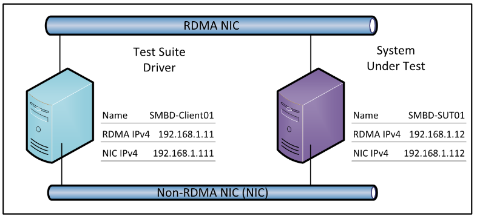

# MS-SMBD Server  Test Suite  User  Guide 

# Contents
* [Introduction](#_Toc395696772)
* [License Information](#_Toc395696775)
* [Further Assistance](#_Toc395696776)
* [Quick Start Checklist](#_Toc395696777)
* [How Do I?](#_Toc395696778)
* [Requirements](#_Toc395696796)
    * [Network Infrastructure](#_Toc395696797)
    * [Environment](#_Toc395696798)
    * [Driver Computer](#_Toc395696799)
    * [System Under Test (SUT)](#_Toc395696800)
    * [Software](#_Toc395696801)
* [Network Setup](#_Toc395696820)
	* [Network Environment](#_Toc395696821)
	* [Verify Connectivity](#_Toc395696822)
* [Computer Setup](#_Toc395696823)
    * [Setup the Driver Computer](#_Toc395696824)
    * [Setup the SUT](#_Toc395696825)
    * [Installed Files and Folders](#_Toc395696826)
* [Configuration](#_Toc395696827)
    * [Configuring the Test Suite](#_Toc395696828)
		* [Required Configuration Settings](#_Toc395696829)
* [Running Test Cases](#_Toc395696830)
    * [Run the BVT Test Cases](#_Toc395696831)
    * [Run All Test Cases](#_Toc395696832)
    * [Check the Test Results](#_Toc395696833)
		* [Review the Log Files](#_Toc395696834)
		* [Manage the Generation of Log Files](#_Toc395696835)
* [Debugging Test Cases](#_Toc395696836)
* [Tested RDMA Adapter](#_Toc395696837)

## <a name="_Toc395696772"/>Introduction

This user guide provides information about how to install, configure, and run the MS-SMBD Test Suite in a test environment. This suite is designed to test the implementations of MS-SMBD protocol, as specified in the Microsoft document _[MS-SMBD]._ This user guide provides information about using this test suite on the Microsoft® Windows® operating system and on operating systems that are not Windows based. 

This test suite only tests the protocol implementation behaviors which can be observed on the wire. For detailed information about the design of this test suite, see [MS-SMBD_ServerTestDesignSpecification](MS-SMBD_ServerTestDesignSpecification.md ).

## <a name="_Toc395696775"/>License Information

For the licensing information, see the End User License Agreement (EULA) that was provided with this test suite. The EULA is EULA.rtf file in the installation folder.

## <a name="_Toc395696776"/>Further Assistance

If you need further information about this test suite or need assistance in troubleshooting the issues related to this test suite, contact dochelp@microsoft.com.

## <a name="_Toc395696777"/>Quick Start Checklist

The following checklist shows the tasks you need to complete in order to set up the test suite and run the test cases. 

Note 

>For the workgroup environment, skip the tasks that are related to setting up and configuring the domain controllers.

|  **Check**|  **Task**|  **Topic**| 
| -------------| -------------| ------------- |
| □| Download the test suite for the protocol implementation.| See [Installed Files and Folders](#_Toc395696826) for a list of the files in the download package.| 
| □| Confirm that your test environment meets the requirements of the test suite.| See [Requirements](#_Toc395696796).| 
| □| Install the required software.| See [Software](#_Toc395696801) for the information about software required for installing the test suite.| 
| □| Set up the driver computer| See [Setup the Driver Computer](#_Toc395696824).| 
| □| Set up the system under test (SUT) | See [Setup the SUT](#_Toc395696825).| 
| □| Set up the network| See [Network Setup](#_Toc395696820).| 
| □| Verify the connection between the driver computer, the SUT and other computers.| See [Verify Connectivity](#_Toc395696822).| 
| □| Configure the test suite.| See [Configuring the Test Suite](#_Toc395696828).| 

## <a name="_Toc395696778"/>How Do I?
Use the following quick reference to learn how to complete common tasks.

|  **How do I…?**|  **For more information…**| 
| -------------| ------------- |
| Set up the test environment| [Network Setup](#_Toc395696820) and [Computer Setup](#_Toc395696823)| 
| Verify the connection from the driver computer to other computers in the test environment| [Verify Connectivity from the Driver Computer](#_Toc395696822)| 
| Setup a SUT| [Setup the SUT](#_Toc395696825)| 
| Configure the test suite settings| [Configuring the Test Suite](#_Toc395696828)| 
| Run a BVT test| [Run the BVT Test](#_Toc395696831)| 
| Run test cases| [Run All Test Cases](#_Toc395696832) | 
| Debug test cases| [Debugging Test Cases](#_Toc395696836)| 
| Get the results of test runs| [Check Test Results](#_Toc395696833)| 

## <a name="_Toc395696796"/>Requirements 

This section describes the requirements for the test environment that are used to run this test suite.

Note 

>The requirements in this section only apply to the Windows-based computers in the test environment. Note that the driver computer must use a Windows-based operating system.

### <a name="_Toc395696797"/>Network Infrastructure

* A test network is required to connect the test computer systems

* It must consist of an isolated hub or switch

* It must not be connected to a production network or used for any other business or personal communications or operations

* It must not be connected to the internet 

* IP addresses must be assigned for a test network

* Computer names should be assigned in a test network infrastructure

* User credentials used on the system must be dedicated to the test network infrastructure

* Details including computer IP addresses, names and credentials are saved in log files

* Refer to the Detailed Logging Support section 

Refer to the Privacy Statement and EULA for further information

[Please refer to the Tested RDMA Adapter](#_Toc395696837)

### <a name="_Toc395696798"/>Environment

Run this test suite in a domain or non-domain environment that contains the following computers (physical or virtual): 

* A driver computer running Microsoft® Windows Server® 2012R2 or later versions

* A system under test running Microsoft® Windows Server® 2012R2 or later versions

### <a name="_Toc395696799"/>Driver Computer 

The minimum requirements for the driver computer are as follows. 

|  **Requirement**|  **Description**| 
| -------------| ------------- |
| Operating system| Microsoft Windows Server 2012R2, Standard Edition or later versions| 
| Feature| An RDMA capable NIC is installed and ready to use| 
| Memory| 2 GB RAM| 
| Disk space| 60 GB | 

### <a name="_Toc395696800"/>System Under Test (SUT)

The minimum requirements for the SUT are as follows.

|  **Requirement**|  **Description**| 
| -------------| ------------- |
| Operating system| Microsoft Windows Server 2012R2, Standard Edition or later versions, or a SUT implementation that is not based on the Windows operating system| 
| Feature| An RDMA capable NIC is installed and ready to use| 
| Memory| 2 GB RAM| 
| Disk space| 60 GB| 

### <a name="_Toc395696801"/>Software 
All of the following software must be installed on the driver computer before installing the test suite. 

**Required Software**

All common softwares listed in [prerequisites](https://github.com/microsoft/WindowsProtocolTestSuites#prerequisites) for running Windows Protocol Test Suites.

* **Windows PowerShell 3.0 or later**

    **Windows PowerShell 3.0 or later** is required.

**Optional Software**

* **Protocol Test Manager**

    **Protocol Test Manager** provides a graphical user interface (UI) to facilitate configuration and execution of Microsoft® Windows Protocol Test Suite tests. Its use is highly recommended.

* **Microsoft® Message Analyzer**

    **Microsoft® Message Analyzer** (MMA) is listed here as an optional tool because the test cases of themselves neither perform live captures or capture verifications during execution. However, MMA can be helpful with debugging test case results, by analyzing ETL files that are generated by the Test Cases, that is, if you enable the the Automatic Network Capturing feature in the Protocol Test Manager (PTM) during test case configuration. The Automatic Network Capturing feature is further described in the [PTF User Guide](https://github.com/Microsoft/ProtocolTestFramework/blob/staging/docs/PTFUserGuide.md#-automatic-network-capturing).

    Note

    November 25 2019 - Microsoft Message Analyzer (MMA) has been retired and removed from public-facing sites on microsoft.com. A private MMA build is available for testing purposes; to request it, send an email to [getmma@microsoft.com](mailto:getmma@microsoft.com).

## <a name="_Toc395696820"/>Network Setup

Run this test suite in a domain or a non-domain environment using either physical or virtual machines. This section is about the non-domain test environment using physical machines. 

For information about configuring a virtual machine, see [https://docs.microsoft.com/en-us/virtualization/hyper-v-on-windows/quick-start/create-virtual-machine](https://docs.microsoft.com/en-us/virtualization/hyper-v-on-windows/quick-start/create-virtual-machine). The configuration of virtual machines for this test suite is not covered in this user guide. 

#### <a name="_Toc395696821"/>Network Environment

The domain environment requires interactions between the following computers and servers. 

* The driver computer runs the test cases by sending requests over the wire in the form of protocol messages. 

* The SUT runs an implementation of the protocol that is being tested. The SUT responds to the requests that the driver computer sends.

The following figure shows the domain environment with recommended network configurations for your reference.

| &#32;| &#32;| &#32;| &#32; |
| -------------| -------------| -------------| ------------- |
| Machine Name/Access Point| NIC Type| IPv4| Subnet Mask| 
| SMBD-Client01| NIC| 192.168.1.111| 255.255.255.0| 
|  | RDMA-NIC| 192.168.1.11| 255.255.255.0| 
| SMBD-SUT01| NIC| 192.168.1.112| 255.255.255.0| 
|  | RDMA-NIC| 192.168.1.12| 255.255.255.0| 

#### <a name="_Toc395696822"/>Verify Connectivity

After you set up the environment, verify the connection between the driver computer and the SUT over both the NIC and the RDMA-NIC. You can use the following steps to check the connectivity between the two Windows-based computers. For further information about other operating systems, see the administration guide for your operating system.

To check the connection from the driver computer

Note 

* Disable active firewalls in the test environment.

* Press WinKey+R to launch **Run**. 

* In the **Run** dialog box, type **cmd** and then click **OK**.

* **Ping** the IP address of the NIC.

* **Ping** the IP address of the RDMA-NIC.

Do not proceed with the configuration of the test suite until connectivity is confirmed. Any issue with the network connectivity must be resolved before configuring the test suite.

## <a name="_Toc395696823"/>Computer Setup 

This section explains how to set up the computers for the test environment.

Note 

>For the workgroup environments, skip the tasks that are related to setting up and configuring the domain controllers.

### <a name="_Toc395696824"/>Setup the Driver Computer

This section describes how to set up the driver computer.

Important 

>Microsoft Visual Studio 2017 and Protocol Test Framework must be installed on the driver computer before you run the test suite installer.

To set up the driver computer

* Install the required and the optional software as mentioned in [6.5](#_Toc395696801).
* Install the related R-NIC Driver.
* Install the MSI on the driver computer. When options are prompted, select the option, **Install Test Suite on Driver Computer**.

### <a name="_Toc395696825"/>Setup the SUT

To set up the SUT

* Install related R-NIC Driver.

* Create local or domain user account.

* Create an SMB2 share folder.

* Create a file with arbitrary content under the SMB2 share folder, and make sure its file size is at least the `MaxWriteSize` supported by the SMB2 implementation of SUT.

### <a name="_Toc395696826"/>Installed Files and Folders

The test suite is installed in folder C:\MicrosoftProtocolTests\MS-SMBD\Server-Endpoint\ _&#60; version &#35;  &#62;_ \.

Note 

>The  &#60; _version &#35;  &#62;_  placeholder indicates the installed build of the test suite.

|  **File or Folder**|  **Description**| 
| -------------| ------------- |
| Batch| The command files which you can use to run individual test case or all the test cases.| 
| Bin| The test suite binaries and the configuration files.| 
| Docs| **[MS-SMBD].pdf** – The technical document that this test suite is based on.| 
| | **MS-SMBD_ServerUserGuide.docx** – A user guide about deploying the test environment and running the test cases.| 
| | **MS-SMBD_ServerTestDesignSpecification.docx** – An overview document about the test environment and the test scenario design.| 
| | **ReleaseNotes.txt** – An overview of recent releases.| 
| EULA.rtf| The End User License Agreement.| 

## <a name="_Toc395696827"/>Configuration

This section explains how to configure the test environment.

### <a name="_Toc395696828"/>Configuring the Test Suite

This test suite is installed with default settings. You may need to change these settings if you use a customized test environment or you would like to customize your test runs. 

To change settings, edit the MS-SMBD_ServerTestSuite.deployment.ptfconfig file in the directory C:\MicrosoftProtocolTests\MS-SMBD\Server-Endpoint\ _&#60; version &#35;  &#62;_ \Bin.

#### <a name="_Toc395696829"/>Required Configuration Settings

The following table describes the most common configuration properties used in the test suite configuration file and their values. These properties are required to run test. To update them, edit file MS-SMBD_ServerTestSuite.deployment.ptfconfig and MS-SMBD_ServerTestSuite.ptfconfig in directory C:\MicrosoftProtocolTests\MS-SMBD\Server-Endpoint\ _&#60; version &#35;  &#62;_ \Bin.

* **SUT Settings.**

| &#32;| &#32; |
| -------------| ------------- |
|  **Property**|  **Description**| 
| SutComputerName| The hostname of SUT.| 
| | The default value is “SMBD-SUT01”| 
| DomainName| The domain name of the test network environment. If it non-domain envrionment, use the SutComputerName as Domain Name.| 
| | The default value is “SMBD-SUT01”| 
| SutUserName| The username of the SUT administrator.| 
| | The default value is “administrator”.| 
| SutPassword| The password of the SUT administrator.| 
| | The default value is “Password01!”.| 
| ClientRNicIp| The IP address of the RDMA-NIC on the Driver computer.| 
| | The default value is “192.168.1.11”.| 
| ServerRNicIp| The IP address of the RDMA-NIC on the SUT.| 
| | The default value is “192.168.1.12”.| 
| ClientNonRNicIp| The IP address of the NIC on the Driver computer.| 
| | The default value is “192.168.1.111”.| 
| ServerNonRNicIp| The IP address of the NIC on the SUT.| 
| | The default value is “192.168.1.112”.| 
| SmbdTcpPort| The TCP port value for SMBD transport.| 
| | The default value is 445. | 
| ShareFolder| The share folder for testing on the SUT.| 
| | The default value is “SMBDTest”.| 
| TestFile_ReadLargeFile| The file name of a large file for the testing the reading file.| 
| | The default value is “testFile_ReadLargeFile.txt”| 
| SmallFileSizeInByte| The size in bytes of a small file.| 
| | The supported value for SmallFileSizeInByte is from 128 bytes to SMBD negotiated MaxSendSize (The default value of SMBD negotiated MaxSendSize is 1364 bytes).| 
| | The default value is 500.| 
| ModerateFileSizeInByte| The size in bytes of a moderate file.| 
| | The supported value for ModerateFileSizeInByte is from SMBD negotiated MaxSendSize (Default value of SMBD negotiated MaxSendSize is 1364 bytes) to SMBD negotiated MaxFragmentedSize (Default value of SMBD negotiated MaxFragmentedSize is 131072 bytes)| 
| | The default value is 65536.| 
| LargeFileSizeInKB| The size in KB of a large file. The size must be large enough for the test suite to transport large data over RDMA.| 
| | Supported value for LargeFileSizeInKB is from SMBD negotiated MaxFragmentedSize (Default value of SMBD negotiated MaxFragmentedSize is 128KB) to smaller of SMB2 negotiated MaxReadSize and MaxWriteSize (Windows Server 2012 without [MSKB-2934016] limits MaxReadWriteSize to 1048576 (1024KB). Otherwise, the limit is 8388608 (8192KB).)| 
| | The default value is 8192.| 
| Smb2ConnectionTimeoutInSeconds| The timeout value for SMB2 operation.| 
| | The default value is 125.| 
| SecurityPackageForSmb2UserAuthentication| The Security Package Type for SMB2 user authentication.| 
| | The supported value is "Negotiate", "Kerberos" or "Ntlm".| 
| | The default value is "Negotiate"| 

* **RDMA Capability Settings.**

| &#32;| &#32; |
| -------------| ------------- |
|  **Property**|  **Description**| 
| InboundEntries| The maximum number of outstanding Receive requests for the RDMA-NIC driver.| 
| | The default value is 63.| 
| OutboundEntries| The maximum number of outstanding Send, SendAndInvalidate, Bind, Invalidate, Read, and Write requests for the RDMA-NIC driver.| 
| | The default value is 63.| 
| InboundReadLimit| The maximum inbound read limit for the RDMA-NIC driver.| 
| | The default value is 10.| 
| EndianOfBufferDescriptor| Endianness of BufferDescriptor returned from the RDMA-NIC driver. In MS-SMBD, all the messages MUST be transported as little-endian. If the buffer descriptor returned from the RDMA-NIC driver is big-endian, the buffer descriptor MUST be reversed to little-endian. | 
| | The supported value is "BigEndian" or "LittleEndian".| 
| | The default value is “BigEndian”.| 

* **MS-SMBD Capabilities Settings.**

The following settings are the capability of the MS-SMBD protocol.

| &#32;| &#32; |
| -------------| ------------- |
|  **Property**|  **Description**| 
| ReceiveCreditMax| The maximum number of credits to grant to the SUT.| 
| | The defualt value is 255.| 
| SendCreditTarget| The initialized Send Credit target to be requested of the SUT.| 
| | The default value is 255.| 
| MaxSendSize| The initialized maximum single-message size in bytes which can be sent.| 
| | The default value is 1364.| 
| MaxFragmentedSize| The maximum fragmented upper-layer payload receive size in bytes.| 
| | The default value is 131072.| 
| MaxReceiveSize| The initialized maximum single-message size in bytes which can be received from the SUT.| 
| | The default value is 8192| 
| KeepAliveInterval| The interval in seconds to initiate send of a keepalive message from the SUT.| 
| | The default value is 120.| 
| DisconnectionTimeoutInSeconds| The timeout value in seconds that the test suite will wait for disconnection.| 
| | The default value is 1.| 

* **MS-SMBD Test Case Switches.**

| &#32;| &#32; |
| -------------| ------------- |
|  **Property**|  **Description**| 
| CheckDataLengthRemainingDataLength| The switch which controls whether the SUT checks “The sum of the received DataOffset and DataLength fields are less than or equal to the length of the received message.”.| 
| | The defualt value is “false”.| 
| RdmaLayerLoggingEnabled| The switch controls whether verbose RDMA layer log is printed. Set to “true” to print the RDMA layer log, otherwise set to “false”.| 
| | The default value is “false”.| 

## <a name="_Toc395696830"/>Running Test Cases

This test suite includes command files that you can use to run some basic test cases. Each test case verifies the protocol implementation based on a given scenario. 

You can find these command files in the following directory: 
C:\MicrosoftProtocolTests\MS-SMBD\Server-Endpoint\ _&#60; version &#35;  &#62;_ \Batch

You can run these command files either in the command prompt or by selecting and clicking in the File Explorer.

### <a name="_Toc395696831"/>Run the BVT Test Cases

This test suite contains a set of basic test cases called Basic Verification Test (BVT). These test cases perform basic functionality tests to evaluate the implementation on the SUT. Use the steps below to run all BVT test cases.

To run the BVT test cases 

* Double-click the **Run MS-SMBD Server-BVTTestCases** shortcut on the desktop of the driver computer.
Alternatively, go to C:\MicrosoftProtocolTests\MS-SMBD\Server-Endpoint\ _&#60; version &#35;  &#62;_ \Batch, and run the **RunBVTTestCases.cmd** file. 

### <a name="_Toc395696832"/>Run All Test Cases

Use the steps below to run all the test cases.

To run all the test cases 

* Double-click the **Run MS-SMBD Server-AllTestCases** shortcut on the desktop of the driver computer.
Alternatively, go to C:\MicrosoftProtocolTests\MS-SMBD\Server-Endpoint\ _&#60; version &#35;  &#62;_ \Batch, and run the **RunAllTestCases.cmd** file. 

### <a name="_Toc395696833"/>Check the Test Results
This section describes the review of log files and the management of their generation.

#### <a name="_Toc395696834"/>Review the Log Files 

You can find the log files in the "TestResults" directory, a subdirectory of Batch folder in the test suite installation directory. The log files that contain test suite results use a  &#42; .trx file name, in which the asterisk (" &#42; ") character represents the user name, the protocol name, or both.

Additional log files are used for generating requirement coverage reports and diagnosing test issues. Their settings can be found in the  &#42; .ptfconfig or  &#42; .deployment.ptfconfig files. The file names, corresponding paths, and formats can be set in the Sinks node of the configuration file. 

The following instruction provides an example of how to cause log entries for the "Debug" logging sink not to be written into the MS-SMBD_Log.xml file in the current directory:
 &#60; File id="XMLLog" directory=".\TestLog" file="MS-SMBD_Log.xml" format="xml"/ &#62;  

#### <a name="_Toc395696835"/>Manage the Generation of Log Files
For further information about logging in the Protocol Test Framework (PTF), see the _PTF User Guide_ in the PTF installation directory

## <a name="_Toc395696836"/>Debugging Test Cases

You can open the Visual Studio Solution file (.sln) installed with this test suite to debug additional test cases that you create for your protocol implementation. 

Note 
Copy SM-SMBD_ServerTestSuite.deployment.ptfconfig from C:\MicrosoftProtocolTests\MS-SMBD\Server-Endpoint\ &#60; version &#35;  &#62; \Bin to C:\MicrosoftProtocolTests\MS-SMBD\Server-Endpoint\ &#60; version &#35;  &#62; \Source\Server\TestSuite and replace the original file

To debug a test case

* On the driver computer, use Microsoft® Visual Studio® to open the following solution file:
C:\MicrosoftProtocolTests\MS-SMBD\Server-Endpoint\ _&#60; version &#35;  &#62;_ \Source\Server\TestCode\MS-SMBD_Server.sln

* You will be prompted to upgrade the project to .Net 4.5, select do not upgrade option.

* In Visual Studio, in the Solution Explorer window, right-click the **Solution ‘MS-SMBD_Server’**, and select **Build Solution**.

## <a name="_Toc395696837"/>Tested RDMA Adapter
Here we list the RDMA adapter we tested.

| &#32;| &#32;| &#32; | &#32; |
| -------------| -------------| ------------- | ------------- |
| Manufacturer| Model| Driver| UserGuide|
| Chelsio | T580-LP-CR| [Unified Wire v6.11.4.0](https://service.chelsio.com/downloads/Microsoft/)| [Chelsio-UnifiedWire-Windows-UserGuide](https://service.chelsio.com/downloads/Microsoft/Drivers/ChelsioUwire_6.11.4.0_WIN_006.0.33/Chelsio-UnifiedWire-Windows-UserGuide.pdf)|
| Mellanox| ConnectX-2 IPoIB| [WinOF v5.50](http://www.mellanox.com/page/products_dyn?product_family=32&mtag=windows_sw_drivers)| [WinOF_VPI_User_Manual_v5.50](http://www.mellanox.com/related-docs/prod_software/WinOF_VPI_User_Manual_v5.50.pdf)|
|  |  |  | 

