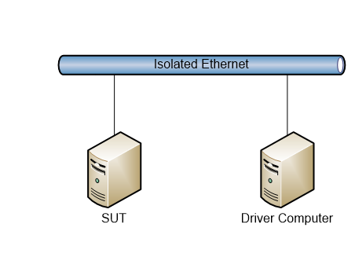
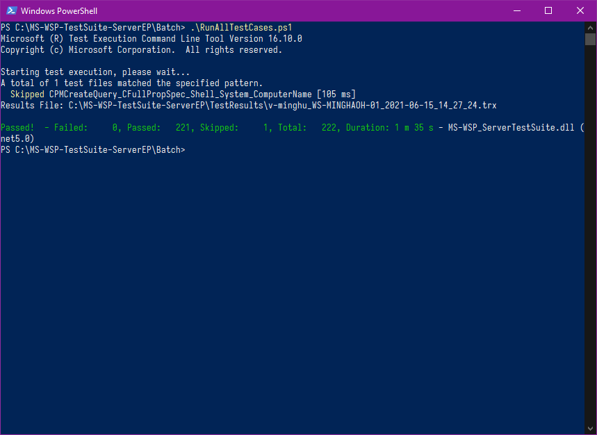
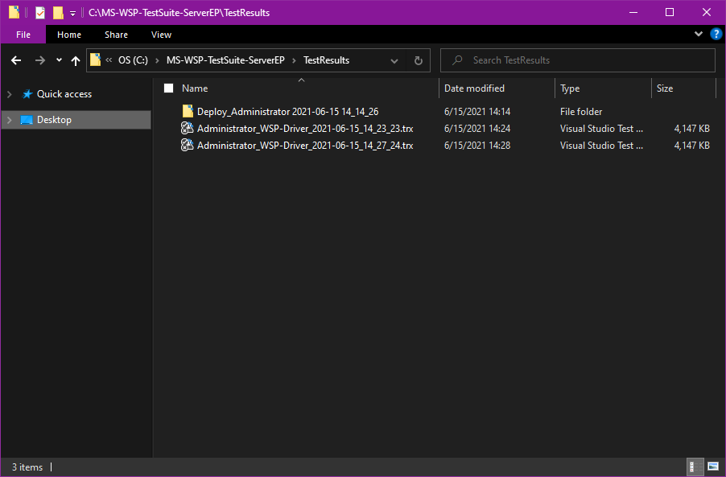
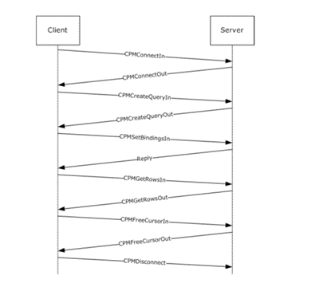
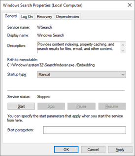
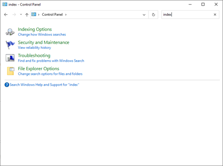
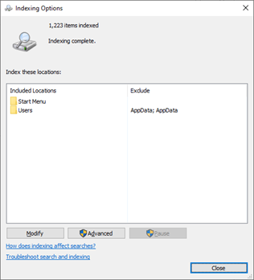
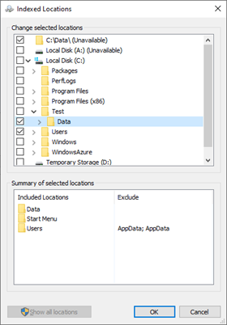

# MS-WSP Test Suite User Guide

## Table of Contents

- [MS-WSP Test Suite User Guide](#ms-wsp-test-suite-user-guide)
  - [Table of Contents](#table-of-contents)
  - [1 Test Environment Requirement](#1-test-environment-requirement)
    - [1.1 Generic Requirements](#11-generic-requirements)
    - [1.2 Network Settings](#12-network-settings)
  - [2 Test Suite Deployment](#2-test-suite-deployment)
    - [2.1 How to configure Driver Computer](#21-how-to-configure-driver-computer)
    - [2.2 How to configure SUT](#22-how-to-configure-sut)
    - [2.3 How to configure Test Suite](#23-how-to-configure-test-suite)
    - [2.4 How to run Test Suite](#24-how-to-run-test-suite)
  - [3 Test Suite Design](#3-test-suite-design)
    - [3.1 Traditional Test Cases](#31-traditional-test-cases)
    - [3.2 Model-based Test Cases](#32-model-based-test-cases)
  - [4 Appendix](#4-appendix)
    - [4.1 How to index files on Windows Server](#41-how-to-index-files-on-windows-server)

## 1 Test Environment Requirement

### 1.1 Generic Requirements

The MS-WSP test suite requires the test environment including:

- 2 machines act as the server and the client.
- Generic software installed on the machines.
- Ethernet network.

| **Device Type** | **Role**        | **Description**                                                  |
| --------------- | --------------- | ---------------------------------------------------------------- |
| Hardware        | SUT             | System Under Test.                                               |
|                 | Driver Computer | Driver computer to run the test suite.                           |
| Service         | SUT             | An implementation of MS-WSP.                                     |
|                 | Driver Computer | None.                                                            |
| Software        | SUT             | None.                                                            |
|                 | Driver Computer | Install the software to enable the running of test suite.        |
| Network         |                 | The network is an isolated hub/switch connected Ethernet network |

### 1.2 Network Settings

SUT and Driver Computer should be under the same isolated network.

They can communicate each other via host names or IP addresses.



## 2 Test Suite Deployment

### 2.1 How to configure Driver Computer

The following software is needed to install on Driver Computer.

- [.NET SDK](https://dotnet.microsoft.com/download/dotnet) of the same version used to build the test suite
- [MS-WSP test suite](https://github.com/microsoft/WindowsProtocolTestSuites/releases)
- Any compatible tool to unzip standard ZIP archives

Please install the MS-WSP test suite by unzipping the package to any available path on the Driver Computer for test.

### 2.2 How to configure SUT

Follow the steps to configure SUT:

- Create a share named **Test** on the SUT.
  
  1. Create a folder named **Test** on the SUT.
  2. Grant the access to the folder created for **Everyone** with the following command.

      ```powershell
      icacls.exe "<Path to the created folder>" /grant "*S-1-1-0:(OI)(CI)(F)" 2>&1 | Write-Host
      ```
  
  3. Share the **Test** folder as an SMB share with the following command. If there is already a share named **Test** existing, please remove the existing share or specify another name for the share under test.

      ```powershell
      New-SMBShare -Name "Test" -Path "<Path to the created folder>" -FullAccess "Everyone"
      ```

- If the MS-WSP test suite is already installed on the Driver Computer, copy the **Data** folder recursively under the installation path (for example: `C:\MS-WSP-TestSuite-ServerEP\Data`) to the share created on the SUT (for example: `C:\Test\Data`).

  1. As a reminder, there may be an issue for some files under `CreateQuery_Size` subfolder occurring during copying the **Data** folder that the values of **CreationTime** property may persist the same after the copying. The issue could cause specific case failures. Please modify the **CreationTime** property of these files to fulfil the test cases requirements after copying the **Data** folder. Run the following command to apply the fix.

      ```powershell
      [array]$dataFiles = Get-ChildItem "<Path to the shared folder>\Data\CreateQuery_Size" -Force
      for ($i = 0; $i -lt $dataFiles.Length; $i++) {
        $dataFile = $dataFiles[$i]
        $dataFile.CreationTime = $dataFile.CreationTime.AddDays(-10 * $i)
        Write-Host "The CreationTime of $($dataFile.FullName) is $($dataFile.CreationTime)"
      }
      ```

- Index the files in the **Data** folder. Please refer to [4.1 How to index files on Windows Server](#41-how-to-index-files-on-windows-server)

### 2.3 How to configure Test Suite

The only file needs to be modified is **MS-WSP_ServerTestSuite.deployment.ptfconfig**, under `<Path to the MS-WSP test suite installation>\Bin` of Driver Computer.

Open **MS-WSP_TestSuite.deployment.ptfconfig**, the following  properties are very likely to be changed before running the test suite:

  ```xml
    <Property name="ServerComputerName" value="SutComputer" />
    <Property name="UserName" value="Administrator" />
    <Property name="Password" value="Password01!" />
    <Property name="ShareName" value="Test" />
    <Property name="ClientName" value="DriverComputer" />
    <Property name="QueryPath" value="file://SutComputer/Test/" />
  ```

There is the description for each property listed in the code block above in the **MS-WSP_ServerTestSuite.deployment.ptfconfig** file, please modify their values according to their descriptions and current test environment.

For example, if the computer name of SUT is `WSP-Server`, then the value of **ServerComputerName** property should be modified to `WSP-Server`, and the value of **QueryPath** property should be modified to `file://WSP-Server/Test/`.

### 2.4 How to run Test Suite

Once the **MS-WSP_ServerTestSuite.deployment.ptfconfig** file is configured according to the current test environment, perform the following steps on Driver Computer to run the test cases.

- Navigate to the path of test suite execution scripts folder, it should be `<Path to the MS-WSP test suite installation>\Batch`.
  
- Start a new PowerShell console window from the test suite execution scripts folder. To start the console window, please right-click with holding **Shift** key down in the free area of the **Explorer** window, and choose the **Open PowerShell window here** context menu item (or choose the **Open command window here** context menu item and type `powershell` and then type **Enter** button in the opened command window) to open a PowerShell console window starting from the current folder.

- Call `RunAllTestCases.ps1` from the PowerShell console window to run all MS-WSP test cases.
  
- When all test cases have been executed, check the test execution summary printed in the PowerShell console window and close the PowerShell console window if you are willing to.
  
  

- The result files can be found under the folder `<Path to the MS-WSP test suite installation>\TestResults`, please review the test suite execution by checking the `.trx` files.
  
  

## 3 Test Suite Design

MS-WSP test suite consists of two kinds of test cases: traditional test cases and model-based test cases.

There are 189 traditional test cases and 33 model-based test cases, 222 cases in total.

### 3.1 Traditional Test Cases

Traditional test cases cover the typical message sequences in the figure below.



Besides the messages above, there are also test cases on messages of CPMGetQueryStatus, CPMGetQueryStatusEx, CPMFetchValue, CPMCiState.

The table below lists all the traditional cases.

| **Test Focus**          | **Description**                                                                                                                                                                                                                               | **Case Count** |
| ----------------------- | --------------------------------------------------------------------------------------------------------------------------------------------------------------------------------------------------------------------------------------------- | -------------- |
| CPMCiState              | Test cases send out CPMCiStateIn in different scenarios (send after CPMConnectIn/CPMCreateQueryIn/CPMSetBindingsIn...) and verify responses.                                                                                                  | 6              |
| CPMConnect              | Test cases send out CPMConnectIn with different fields, including \_iClientVersion, \_fClientIsRemote, CatalogName, cExtPropSet, and verify responses.                                                                                        | 8              |
| CPMCreateQuery          | Test cases send out CPMCreateQueryIn with different fields, including Size, RestrictionArray, ColumnSet, SortSet, CCategorizationSet (with Aggregation), PidMapper (with different CFullPropSpec) and RowSetProperties, and verify responses. | 105            |
| CPMDisconnect           | Test cases send out CPMDisconnect in different scenarios (send after CPMConnectIn/CPMCreateQueryIn/CPMSetBindingsIn...) and verify responses.                                                                                                 | 7              |
| CPMFetchValue           | Test cases send out CPMFetchValueIn to query values of different properties or query values with single/multiple chunks, and verify responses.                                                                                                | 11             |
| CPMFreeCursor           | Test cases send out CPMFreeCursorIn in different scenarios (send after CPMConnectIn/CPMCreateQueryIn/CPMSetBindingsIn...) and verify responses.                                                                                               | 8              |
| CPMGetQueryStatus       | Test cases send out CPMGetQueryStatusIn in different scenarios (send after CPMConnectIn/CPMCreateQueryIn/CPMSetBindingsIn...) and verify responses.                                                                                           | 4              |
| CPMGetQueryStatusEx     | Test cases send out CPMGetQueryStatusExIn in different scenarios (send after CPMConnectIn/CPMCreateQueryIn/CPMSetBindingsIn...) and verify responses.                                                                                         | 5              |
| CPMGetRows              | Test cases send out CPMGetRowsIn with different fields, including \_cRowsToTransfer, \_cbRowWidth, \_cbReadBuffer, \_fBwdFetch, SeekDescription, and verify responses.                                                                        | 25             |
| CPMSetBindings          | Test cases send out CPMSetBindingsIn with different fields, including cColumns and aColumns (for multiple columns, with columns contained or not contained in CPMCreateQueryIn), \_cbRow, \_hCursor, and verify responses.                    | 7              |
| InvalidWspMessageHeader | Test cases send out CPMConnectIn with WspMessageHeader containing invalid fields and verify responses.                                                                                                                                        | 3              |

### 3.2 Model-based Test Cases

The table below lists all the model-based cases.

| **Test Focus**                         | **Description**                                                                                                                                                                                                                   | **Case Count** |
| -------------------------------------- | --------------------------------------------------------------------------------------------------------------------------------------------------------------------------------------------------------------------------------- | -------------- |
| QueryAdminMessages                     | Validates error code returned by the server when connected client doesn’t have a connection to send a CPMCiStateInOut request to the server.                                                                                      | 1              |
| ConnectOut_StatusInvalidParameter      | Validates the error code returned by the server when already connected client sends ConnectIn request.                                                                                                                            | 1              |
| FetchValue_StatusInvalidParameterErr   | Validates the error code returned by the server when FetchValueIn request is sent for the non-existing query.                                                                                                                     | 2              |
| FindIndicesSuccessfully                | Validates the server responses for getting rowset position of the next occurrence of a document identifier                                                                                                                        | 1              |
| FindIndicesInvalidParameter            | Validates the error code returned by the server when FindIndicesIn request is sent for the non-existing query.                                                                                                                    | 1              |
| QueryNotAssociatedCase                 | Validates the error code returned by the server when the client sends different query status requests for any non-existing query.                                                                                                 | 1              |
| QueryOut_CreatingExistingQueryCase     | Validates the error code returned by the server when the client sends the request to create an already existing query.                                                                                                            | 1              |
| FreeCursorIn_E_FailError               | Validates the error code returned by the server when client sends FreeCursorIn request with cursor handle passed are not in the list of the client's cursor handles.                                                              | 1              |
| GetRowsOut_E_FailError                 | Validates the error code returned by the server when client sends GetRowsIn request with cursor handle passed are not in the list of the client's cursor handles.                                                                 | 2              |
| GetRowsetNotifySuccessfully            | Validates the server responses for getting the next rowset event from the server with different eventType and there is or there is no another event of any non-PROPAGATE_NONE type immediately available.                         | 4              |
| GetRowsetNotifyInvalidParameter        | Validates the error code returned by the server when the client sends request for any non-existing query with different eventType and there is or there is no another event of any non-PROPAGATE_NONE type immediately available. | 4              |
| GetScopeStatisticsSuccessfully         | Validates the server responses for statistic number of indexed items when setting the DBPROP_ENABLEROWSETEVENTS property to TRUE or FALSE.                                                                                        | 2              |
| GetScopeStatisticsInvalidParameter     | Validates the error code returned by the server when GetScopeStatisticsIn request is sent for the non-existing query.                                                                                                             | 1              |
| QueryForDifferentQueryStatus           | Validates the server responses for different query status requests sent by the client to the server.                                                                                                                              | 1              |
| QueryForResultSets                     | Validates the server responses for the request sent by the client to connect to the server, query a catalog for result sets, release the cursor and finally free the connection from the server.                                  | 1              |
| SetScopePrioritizationInvalidParameter | Validates the error code returned by the server when SetScopePrioritizationIn request is sent for the non-existing query with the priority set to different value.                                                                | 4              |
| SetScopePrioritizationSuccessfully     | Validates the server response for modifying the indexing priority of documents that may be relevant to query in this action for different value.                                                                                  | 4              |
| QueryStatus_E_FailError                | Validates the error code returned by the server when client sends CPMGetQueryStatusIn request with cursor handle passed are not in the list of the client's cursor handles.                                                       | 1              |

## 4 Appendix

### 4.1 How to index files on Windows Server

- Go to **Start** and type `services.msc` in the search field, press **Enter**. Find out **Windows Search** service and right-click it. Change **Startup type** to **Manual** and Click **Start**.

  - If the **Windows Search** service does not present in the service list, it may be not installed on the current Windows installation. Please refer to the following page [Enable the Windows Search service if you want to use the Search for Shapes feature in Visio 2010 or in Visio 2013](https://docs.microsoft.com/en-us/office/troubleshoot/visio/search-for-shapes-use-windows-search) to enable **Windows Search** service. And the **Windows Search** service can also be installed by running the following command.

    ```powershell
    Install-WindowsFeature Search-Service
    ```



- Go to **Start** and type `Control Panel` in the search field, press **Enter**. Search `Index` in the right upper search box, press **Enter**.



- Click **Indexing Options**, then click **Modify**.



- In the pop-out dialog, select **Data** folder (the folder containing MS-WSP test suite data) or any other folder that is required to be indexed and click **OK**.



- Wait a while for the completion of indexing, then files under **Data** folder selected in the previous step will be indexed.
