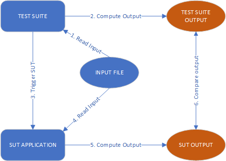
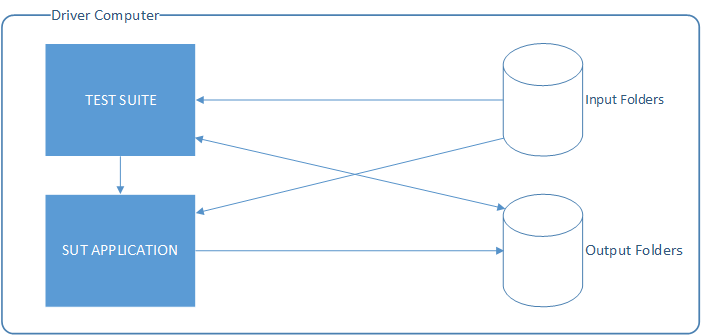

# MS-XCA Test Design Specification

## Contents

* [1 Introduction](#_Introduction)
* [2 MS-XCA Overview](#_MS-XCA-Overview)
* [3 Test Suite Overview](#_Test-Suite-Overview)
* [4 Test Environment](#_Test-Environment)
* [5 Test Types](#_Test_Types)
    * [5.1 Static Data](#_Static_Data)
    * [5.2 User Data](#_User_Data)
* [6 Test Cases](#_Test_Cases)
    * [6.1 Static Data Tests](#_Static_Data_Tests)
    * [6.2 User Data Tests](#_User_Data_Tests)

## <a name="_Introduction"/>1 Introduction

This document provides information about how MS-XCA test suite is designed to test the usability and accuracy of the MS-XCA technical document. It gives an analysis of the MS-XCA technical document content, and describes test assumptions, scope and constraints of the test suite. It also specifies test approach, test scenarios, detail test cases, test suite architecture and adapter design.

## <a name="_MS-XCA-Overview"/>2 MS-XCA Overview

MS-XCA refers to the Xpress Compression Algorithm protocol. It specifies three variants: LZ77+Huffman, Plain LZ77, LZNT1, and their respective decompression algorithms.

## <a name="_Test-Suite-Overview"/>3 Test Suite Overview



The Test Suite is designed to ease the comparison of implementations, and so, it is designed to compare the output it generates for a given input data with another application's output. Every test is a variant of the six steps shown in the diagram above. The Test Suite reads an input file, computes the output using a given algorithm, and triggers the SUT application to perform the same operation on the same input file. Finally, the output from both the Test Suite and the SUT are compared.

## <a name="_Test-Environment"/>4 Test Environment



The Test Suite and the SUT should both be on the same device, referred to as the Driver Computer. The SUT application must be in a location accessible by the permissions available to the Test Suite, and must be executable on the Driver Computer. The input folders must be readable by both the Test Suite and the SUT, the output folder must be Read/Write by the Test Suite, and needs to be writable by the SUT.

## <a name="_Test_Types"/>5 Test Types

### <a name="_Static_Data"/>5.1 Static Data

These tests against static data where the expected output is already known. The data used for these tests are specified in the MS-XCA technical document.

### <a name="_User_Data"/>5.2 User Data

These tests are against input data specified by the Test Suite user. The Test Suite comes with some sample User Data included. The location of the User Data input and output files can be specified in the MS-XCA_TestSuite.deployment.ptfconfig file.


  ```xml
    <Group name="XCA">
        <Property name="UserDataCompressionInputFolder" />
        <Property name="UserDataCompressionOutputFolder" />
        <Property name="UserDataDecompressionInputFolderLZ77" />
        <Property name="UserDataDecompressionInputFolderLZ77Huffman" />
        <Property name="UserDataDecompressionInputFolderLZNT1" />
        <Property name="UserDataDecompressionOutputFolder" />
    </Group>
  ```

## <a name="_Test_Cases"/>6 Test Cases

### <a name="_Static_Data_Tests"/>6.1 Static Data Tests

#### Compression_LZ77_StaticData_01

|    |    |
|----|----|
| **Description** | This tests compression of the ASCII string **abcdefghijklmnopqrstuvwxyz** as specified in MS-XCA document |
| **Categories** | **Compression, StaticData, LZ77** |
| **Prerequisites** | N/A |
| **Test Execution Steps** | Read static data file |
| | Compress data file and write to output |
| | Invoke SUT application with data file |
| | Compare SUT output with TestSuite output |

#### Compression_LZ77_StaticData_02

|    |    |
|----|----|
| **Description** | This tests compression of the 300 byte ASCII string **<br /> abcabcabcabcabcabcabcabcabcabcabcabcabcabcabcabcabcabcabcabc <br /> abcabcabcabcabcabcabcabcabcabcabcabcabcabcabcabcabcabcabcabc <br /> abcabcabcabcabcabcabcabcabcabcabcabcabcabcabcabcabcabcabcabc <br /> abcabcabcabcabcabcabcabcabcabcabcabcabcabcabcabcabcabcabcabc <br /> abcabcabcabcabcabcabcabcabcabcabcabcabcabcabcabcabcabcabcabc <br />** as specified in MS-XCA document |
| **Categories** | **Compression, StaticData, LZ77** |
| **Prerequisites** | N/A |
| **Test Execution Steps** | Read static data file |
| | Compress data file and write to output |
| | Invoke SUT application with data file |
| | Compare SUT output with TestSuite output |

#### Compression_LZ77_StaticData_Large_01

|    |    |
|----|----|
| **Description** | This tests compression of the ASCII string **abcdefghijklmnopqrstuvwxyz** multiplied by 1000 |
| **Categories** | **Compression, StaticData, LZ77** |
| **Prerequisites** | N/A |
| **Test Execution Steps** | Read static data file |
| | Compress data file and write to output |
| | Invoke SUT application with data file |
| | Compare SUT output with TestSuite output |

#### Compression_LZ77_StaticData_Large_02

|    |    |
|----|----|
| **Description** | This tests compression of the 300 byte ASCII string **<br /> abcabcabcabcabcabcabcabcabcabcabcabcabcabcabcabcabcabcabcabc <br /> abcabcabcabcabcabcabcabcabcabcabcabcabcabcabcabcabcabcabcabc <br /> abcabcabcabcabcabcabcabcabcabcabcabcabcabcabcabcabcabcabcabc <br /> abcabcabcabcabcabcabcabcabcabcabcabcabcabcabcabcabcabcabcabc <br /> abcabcabcabcabcabcabcabcabcabcabcabcabcabcabcabcabcabcabcabc <br />** multiplied by 1000 |
| **Categories** | **Compression, StaticData, LZ77** |
| **Prerequisites** | N/A |
| **Test Execution Steps** | Read static data file |
| | Compress data file and write to output |
| | Invoke SUT application with data file |
| | Compare SUT output with TestSuite output |

#### Compression_LZ77Huffman_StaticData_01

|    |    |
|----|----|
| **Description** | This tests compression of the ASCII string **abcdefghijklmnopqrstuvwxyz** as specified in MS-XCA document |
| **Categories** | **Compression, StaticData, LZ77+Huffman** |
| **Prerequisites** | N/A |
| **Test Execution Steps** | Read static data file |
| | Compress data file and write to output |
| | Invoke SUT application with data file |
| | Compare SUT output with TestSuite output |

#### Compression_LZ77Huffman_StaticData_02

|    |    |
|----|----|
| **Description** | This tests compression of the 300 byte ASCII string **<br /> abcabcabcabcabcabcabcabcabcabcabcabcabcabcabcabcabcabcabcabc <br /> abcabcabcabcabcabcabcabcabcabcabcabcabcabcabcabcabcabcabcabc <br /> abcabcabcabcabcabcabcabcabcabcabcabcabcabcabcabcabcabcabcabc <br /> abcabcabcabcabcabcabcabcabcabcabcabcabcabcabcabcabcabcabcabc <br /> abcabcabcabcabcabcabcabcabcabcabcabcabcabcabcabcabcabcabcabc <br />** as specified in MS-XCA document |
| **Categories** | **Compression, StaticData, LZ77+Huffman** |
| **Prerequisites** | N/A |
| **Test Execution Steps** | Read static data file |
| | Compress data file and write to output |
| | Invoke SUT application with data file |
| | Compare SUT output with TestSuite output |

#### Compression_LZ77Huffman_StaticData_Large_01

|    |    |
|----|----|
| **Description** | This tests compression of the ASCII string **abcdefghijklmnopqrstuvwxyz** multiplied by 1000 |
| **Categories** | **Compression, StaticData, LZ77+Huffman** |
| **Prerequisites** | N/A |
| **Test Execution Steps** | Read static data file |
| | Compress data file and write to output |
| | Invoke SUT application with data file |
| | Compare SUT output with TestSuite output |

#### Compression_LZ77Huffman_StaticData_Large_02

|    |    |
|----|----|
| **Description** | This tests compression of the 300 byte ASCII string **<br /> abcabcabcabcabcabcabcabcabcabcabcabcabcabcabcabcabcabcabcabc <br /> abcabcabcabcabcabcabcabcabcabcabcabcabcabcabcabcabcabcabcabc <br /> abcabcabcabcabcabcabcabcabcabcabcabcabcabcabcabcabcabcabcabc <br /> abcabcabcabcabcabcabcabcabcabcabcabcabcabcabcabcabcabcabcabc <br /> abcabcabcabcabcabcabcabcabcabcabcabcabcabcabcabcabcabcabcabc <br />** multiplied by 1000 |
| **Categories** | **Compression, StaticData, LZ77+Huffman** |
| **Prerequisites** | N/A |
| **Test Execution Steps** | Read static data file |
| | Compress data file and write to output |
| | Invoke SUT application with data file |
| | Compare SUT output with TestSuite output |

#### Compression_LZNT1_StaticData

|    |    |
|----|----|
| **Description** | This tests compression of the ASCII string **F# F# G A A G F# E D D E F# F# E E F# F# G A A G F# E D D E F# E D D E E F# D E F# G F# D E F# G F# E D E A F# F# G A A G F# E D D E F# E D D\0** as specified in MS-XCA document |
| **Categories** | **Compression, StaticData, LZNT1** |
| **Prerequisites** | N/A |
| **Test Execution Steps** | Read static data file |
| | Compress data file and write to output |
| | Invoke SUT application with data file |
| | Compare SUT output with TestSuite output |

#### Compression_LZNT1_StaticData_Large

|    |    |
|----|----|
| **Description** | This tests compression of the ASCII string **F# F# G A A G F# E D D E F# F# E E F# F# G A A G F# E D D E F# E D D E E F# D E F# G F# D E F# G F# E D E A F# F# G A A G F# E D D E F# E D D\0** multiplied by 1000 |
| **Categories** | **Compression, StaticData, LZNT1** |
| **Prerequisites** | N/A |
| **Test Execution Steps** | Read static data file |
| | Compress data file and write to output |
| | Invoke SUT application with data file |
| | Compare SUT output with TestSuite output |

#### Decompression_LZ77_StaticData_01

|    |    |
|----|----|
| **Description** | This tests decompression of the ASCII string **abcdefghijklmnopqrstuvwxyz** as specified in MS-XCA document |
| **Categories** | **Decompression, StaticData, LZ77** |
| **Prerequisites** | N/A |
| **Test Execution Steps** | Read static data file |
| | Decompress data file and write to output |
| | Invoke SUT application with data file |
| | Compare SUT output with TestSuite output |

#### Decompression_LZ77_StaticData_02

|    |    |
|----|----|
| **Description** | This tests decompression of the 300 byte ASCII string **<br /> abcabcabcabcabcabcabcabcabcabcabcabcabcabcabcabcabcabcabcabc <br /> abcabcabcabcabcabcabcabcabcabcabcabcabcabcabcabcabcabcabcabc <br /> abcabcabcabcabcabcabcabcabcabcabcabcabcabcabcabcabcabcabcabc <br /> abcabcabcabcabcabcabcabcabcabcabcabcabcabcabcabcabcabcabcabc <br /> abcabcabcabcabcabcabcabcabcabcabcabcabcabcabcabcabcabcabcabc <br />** as specified in MS-XCA document |
| **Categories** | **Decompression, StaticData, LZ77** |
| **Prerequisites** | N/A |
| **Test Execution Steps** | Read static data file |
| | Decompress data file and write to output |
| | Invoke SUT application with data file |
| | Compare SUT output with TestSuite output |

#### Decompression_LZ77_StaticData_Large_01

|    |    |
|----|----|
| **Description** | This tests decompression of the ASCII string **abcdefghijklmnopqrstuvwxyz** multiplied by 1000 |
| **Categories** | **Decompression, StaticData, LZ77** |
| **Prerequisites** | N/A |
| **Test Execution Steps** | Read static data file |
| | Decompress data file and write to output |
| | Invoke SUT application with data file |
| | Compare SUT output with TestSuite output |

#### Decompression_LZ77_StaticData_Large_02

|    |    |
|----|----|
| **Description** | This tests decompression of the 300 byte ASCII string **<br /> abcabcabcabcabcabcabcabcabcabcabcabcabcabcabcabcabcabcabcabc <br /> abcabcabcabcabcabcabcabcabcabcabcabcabcabcabcabcabcabcabcabc <br /> abcabcabcabcabcabcabcabcabcabcabcabcabcabcabcabcabcabcabcabc <br /> abcabcabcabcabcabcabcabcabcabcabcabcabcabcabcabcabcabcabcabc <br /> abcabcabcabcabcabcabcabcabcabcabcabcabcabcabcabcabcabcabcabc <br />** multiplied by 1000 |
| **Categories** | **Decompression, StaticData, LZ77** |
| **Prerequisites** | N/A |
| **Test Execution Steps** | Read static data file |
| | Decompress data file and write to output |
| | Invoke SUT application with data file |
| | Compare SUT output with TestSuite output |

#### Decompression_LZ77Huffman_StaticData_01

|    |    |
|----|----|
| **Description** | This tests decompression of the ASCII string **abcdefghijklmnopqrstuvwxyz** as specified in MS-XCA document |
| **Categories** | **Decompression, StaticData, LZ77+Huffman** |
| **Prerequisites** | N/A |
| **Test Execution Steps** | Read static data file |
| | Decompress data file and write to output |
| | Invoke SUT application with data file |
| | Compare SUT output with TestSuite output |

#### Decompression_LZ77Huffman_StaticData_02

|    |    |
|----|----|
| **Description** | This tests decompression of the 300 byte ASCII string **<br /> abcabcabcabcabcabcabcabcabcabcabcabcabcabcabcabcabcabcabcabc <br /> abcabcabcabcabcabcabcabcabcabcabcabcabcabcabcabcabcabcabcabc <br /> abcabcabcabcabcabcabcabcabcabcabcabcabcabcabcabcabcabcabcabc <br /> abcabcabcabcabcabcabcabcabcabcabcabcabcabcabcabcabcabcabcabc <br /> abcabcabcabcabcabcabcabcabcabcabcabcabcabcabcabcabcabcabcabc <br />** as specified in MS-XCA document |
| **Categories** | **Decompression, StaticData, LZ77+Huffman** |
| **Prerequisites** | N/A |
| **Test Execution Steps** | Read static data file |
| | Decompress data file and write to output |
| | Invoke SUT application with data file |
| | Compare SUT output with TestSuite output |

#### Decompression_LZ77Huffman_StaticData_Large_01

|    |    |
|----|----|
| **Description** | This tests decompression of the ASCII string **abcdefghijklmnopqrstuvwxyz** multiplied by 1000 |
| **Categories** | **Decompression, StaticData, LZ77+Huffman** |
| **Prerequisites** | N/A |
| **Test Execution Steps** | Read static data file |
| | Decompress data file and write to output |
| | Invoke SUT application with data file |
| | Compare SUT output with TestSuite output |

#### Decompression_LZ77Huffman_StaticData_Large_02

|    |    |
|----|----|
| **Description** | This tests decompression of the 300 byte ASCII string **<br /> abcabcabcabcabcabcabcabcabcabcabcabcabcabcabcabcabcabcabcabc <br /> abcabcabcabcabcabcabcabcabcabcabcabcabcabcabcabcabcabcabcabc <br /> abcabcabcabcabcabcabcabcabcabcabcabcabcabcabcabcabcabcabcabc <br /> abcabcabcabcabcabcabcabcabcabcabcabcabcabcabcabcabcabcabcabc <br /> abcabcabcabcabcabcabcabcabcabcabcabcabcabcabcabcabcabcabcabc <br />** multiplied by 1000 |
| **Categories** | **Decompression, StaticData, LZ77+Huffman** |
| **Prerequisites** | N/A |
| **Test Execution Steps** | Read static data file |
| | Decompress data file and write to output |
| | Invoke SUT application with data file |
| | Compare SUT output with TestSuite output |

#### Decompression_LZNT1_StaticData

|    |    |
|----|----|
| **Description** | This tests decompression of the ASCII string **F# F# G A A G F# E D D E F# F# E E F# F# G A A G F# E D D E F# E D D E E F# D E F# G F# D E F# G F# E D E A F# F# G A A G F# E D D E F# E D D\0** as specified in MS-XCA document |
| **Categories** | **Decompression, StaticData, LZNT1** |
| **Prerequisites** | N/A |
| **Test Execution Steps** | Read static data file |
| | Decompress data file and write to output |
| | Invoke SUT application with data file |
| | Compare SUT output with TestSuite output |

#### Decompression_LZNT1_StaticData_Large

|    |    |
|----|----|
| **Description** | This tests decompression of the ASCII string **F# F# G A A G F# E D D E F# F# E E F# F# G A A G F# E D D E F# E D D E E F# D E F# G F# D E F# G F# E D E A F# F# G A A G F# E D D E F# E D D\0** multiplied by 1000 |
| **Categories** | **Decompression, StaticData, LZNT1** |
| **Prerequisites** | N/A |
| **Test Execution Steps** | Read static data file |
| | Decompress data file and write to output |
| | Invoke SUT application with data file |
| | Compare SUT output with TestSuite output |


### <a name="_User_Data_Tests"/>7 User Data Tests

#### Compression_LZ77_UserData

|    |    |
|----|----|
| **Description** | This tests compression of all the files in a User specified folder using the LZ77 algorithm|
| **Categories** | **Compression, UserData, LZ77** |
| **Prerequisites** | N/A |
| **Test Execution Steps** | Get list of files in folder |
| | Read next input file |
| | Compress data file and write to output |
| | Invoke SUT application with data file |
| | Compare SUT output with TestSuite output |
| | If there are more files, return to 'Read next input file' step |
| | Verify that all TestSuite and SUT outputs match

#### Compression_LZ77Huffman_UserData

|    |    |
|----|----|
| **Description** | This tests compression of all the files in a User specified folder using the LZ77 + Huffman algorithm|
| **Categories** | **Compression, UserData, LZ77+Huffman** |
| **Prerequisites** | N/A |
| **Test Execution Steps** | Get list of files in folder |
| | Read next input file |
| | Compress data file and write to output |
| | Invoke SUT application with data file |
| | Compare SUT output with TestSuite output |
| | If there are more files, return to 'Read next input file' step |
| | Verify that all TestSuite and SUT outputs match

#### Compression_LZNT1_UserData

|    |    |
|----|----|
| **Description** | This tests compression of all the files in a User specified folder using the LZ77 algorithm|
| **Categories** | **Compression, UserData, LZNT1** |
| **Prerequisites** | N/A |
| **Test Execution Steps** | Get list of files in folder |
| | Read next input file |
| | Compress data file and write to output |
| | Invoke SUT application with data file |
| | Compare SUT output with TestSuite output |
| | If there are more files, return to 'Read next input file' step |
| | Verify that all TestSuite and SUT outputs match


