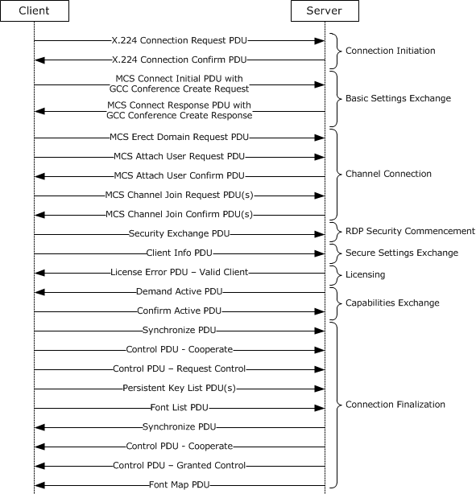

# RDP Client MS-RDPBCGR Test Design Specification 

## Contents

* [Technical Document Analysis](#_Toc427051958)
    * [Technical Document Overview](#_Toc427051959)
    * [Relationship to Other Protocols](#_Toc427051960)
    * [Protocol Operations/Messages](#_Toc427051961)
    * [Protocol Properties](#_Toc427051962)
* [Test Method](#_Toc427051963)
    * [Assumptions, Scope and Constraints](#_Toc427051964)
    * [Test Approach](#_Toc427051965)
    * [Test Scenarios](#_Toc427051966)
		* [S1\_Connection](#_Toc427051967)
		* [S2\_Reactivation](#_Toc427051968)
		* [S3\_AutoReconnect](#_Toc427051969)
		* [S4\_SlowPathInput](#_Toc427051970)
		* [S5\_FastPathInput](#_Toc427051971)
		* [S6\_AutoDetectTest](#_Toc427051972)
		* [S7\_StaticVirtualChannel](#_Toc427051973)
		* [S8\_ServerRedirection](#_Toc427051974)
		* [S9\_HealthMonitoring](#_Toc427051975)
		* [S10\_FastPathOutput](#_Toc427051976)
        * [S11\_RDSTLSAuthentication](#_Toc427052077)
* [Test Suite Design](#_Toc427051977)
    * [Test Suite Architecture](#_Toc427051978)
		* [System under Test (SUT)](#_Toc427051979)
		* [Test Suite Architecture](#_Toc427051980)
    * [Technical Dependencies/Considerations](#_Toc427051981)
		* [Dependencies](#_Toc427051982)
		* [Technical Difficulties](#_Toc427051983)
		* [Encryption Consideration](#_Toc427051984)
    * [Adapter Design](#_Toc427051985)
		* [Adapter Overview](#_Toc427051986)
		* [Technical Feasibility of Adapter Approach](#_Toc427051987)
		* [Adapter Abstract Level](#_Toc427051988)
		* [Adapter Inner Work](#_Toc427051989)
* [Test Cases Design](#_Toc427051990)
    * [Traditional Test Case Design](#_Toc427051991)
    * [Test Cases Description](#_Toc427051992)
		* [BVT Test Cases](#_Toc427051993)
		* [S1\_Connection](#_Toc427051994)
		* [S2\_Reactivation](#_Toc427051995)
		* [S3\_AutoReconnect](#_Toc427051996)
		* [S4\_SlowPathInput](#_Toc427051997)
		* [S5\_FastPathInput](#_Toc427051998)
		* [S6\_AutoDetectTest](#_Toc427051999)
		* [S7\_StaticVirtualChannel](#_Toc427052000)
		* [S8\_ServerRedirection](#_Toc427052001)
		* [S9\_HealthMonitoring](#_Toc427052002)
		* [S10\_FastPathOutput](#_Toc427052003)
        * [S11\_RDSTLSAuthentication](#_Toc427052013)
* [Appendix](#_Toc427052004)
    * [Glossary](#_Toc427052005)
    * [Reference](#_Toc427052006)

## <a name="_Toc427051958"/>Technical Document Analysis

### <a name="_Toc427051959"/>Technical Document Overview
The Remote Desktop Protocol: Basic Connectivity and Graphics Remoting is designed to facilitate user interaction with a remote computer system by transferring graphics display information from the remote computer to the user and transporting input commands from the user to the remote computer, where the input commands are replayed on the remote computer. RDP also provides an extensible transport mechanism which allows specialized communication to take place between components on the user computer and components running on the remote computer.

### <a name="_Toc427051960"/>Relationship to Other Protocols 
[MS-RDPBCGR] is based on the ITU (International Telecommunication Union) T.120 series of protocols. The T.120 standard is composed of a suite of communication and application-layer protocols that enable implementers to create compatible products and services for real-time, multipoint data connections and conferencing.

The following protocols are tunneled within an [MS-RDPBCGR] static virtual channel:

* Multiparty Virtual Channel Extension [MS-RDPEMC]

* Clipboard Virtual Channel Extension [MS-RDPECLIP]

* Audio Output Virtual Channel Extension [MS-RDPEA]

* Remote Programs Virtual Channel Extension [MS-RDPERP]

* Dynamic Channel Virtual Channel Extension [MS-RDPEDYC]

* File System Virtual Channel Extension [MS-RDPEFS]

* Serial Port Virtual Channel Extension [MS-RDPESP]

* Print Virtual Channel Extension [MS-RDPEPC]

* Smart Card Virtual Channel Extension [MS-RDPESC]

### <a name="_Toc427051961"/>Protocol Operations/Messages 
There are 51 protocol data units (PDUs) described by this protocol, and they can be classified into the following message flows:

|  **Message Flows** |  **Number of PDUs**| 
| -------------| ------------- |
| Connection Sequence| 23| 
| Deactivation-Reactivation Sequence| 1| 
| Disconnection Sequences| 3| 
| Automatic Reconnection| 1| 
| Server Error Reporting and Status Updates| 2| 
| Static Virtual Channels| 1| 
| Keyboard and Mouse Input| 4| 
| Basic Output| 4| 
| Logon and Authorization Notifications| 2| 
| Controlling Server Graphics Output| 2| 
| Display Update Notifications| 1| 
| Server Redirection| 2| 
| Network Characteristics Detection| 2| 
| Multitransport Characteristics Detection| 2| 
| Connection Health Monitoring| 1| 

The Connection Sequence is one of the most important message flows; it exchanges client and server settings and negotiates common settings to use for the duration of the connection so that the input, graphics, and other data can be exchanged and processed between the client and server. The Connection Sequence is described in following figure (Figure 1\-1). All message exchanges in this diagram are strictly sequential, except where noted in the text that follows.

Figure 1\-1: Remote Desktop Protocol (RDP) connection sequence

### <a name="_Toc427051962"/>Protocol Properties
* MS-RPCBCGR is a block protocol and is based on TCP.

* In RDPBCGR, the client and the server roles are as mentioned in the protocol document. For example, in a normal connection sequence the client sends the requests and the server responds. After the normal connection sequence, the client sends the keyboard input and the server sends basic output concurrently. 

* In the RDP connection phase, the PDUs exchanged between the client and server are tightly coupled by a sequence that makes the protocol synchronous in this phase. For example, Connection Initialization, Basic Setting Exchange, Channel Connection, and Capabilities Negotiation are synchronous. However, the Connection Finalization is asynchronous, which means there is no need for server to send out a response until a specific request is received.  And after the RDP connection is established, most of the PDUs are sent asynchronously, few of which need a response from the sender. For example, the Keyboard and Mouse Input PDUs are sent from the client and do not require any response from server. 

* RDPBCGR is dependent on protocols like X.224 and T.125. The protocol document specifies that the RDP packets are encapsulated in an X224 and TPKT header.

* MS-RDPBCGR supports external security protocols like TLS, CredSSP, and Standard RDP Security, which is specified in this protocol. 

* The client to server data is always encrypted, and the protocol supports multiple encryption levels.

* The RSA algorithm is used to encrypt the Client Random Number (32 bytes) for transmission to the server, and the RC4 algorithm is extensively used for encrypting the data. 

* In addition to encryption, RDP compresses virtual channel data and some data in PDU’s that are sent from client to server.

* ASN.1 encoding is used to encode and decode the structures.

## <a name="_Toc427051963"/>Test Method

### <a name="_Toc427051964"/>Assumptions, Scope and Constraints
**Assumptions:**

The RDP client machine should be configurable; in order to test some specific features or requirements, the test suite will try to trigger the client to act with specific configuration settings, such as capability set support.

**Scope:**

* The protocol client endpoint (RDP client) playing the client role will be tested. For Windows, the Remote Desktop Client (MSTSC.exe) is the client endpoint.
* The protocol server endpoint (RDP Server) playing the server role is out of scope.
* The virtual channel is out of scope because the MS-RDPBCGR uses the I/O channel as the data transport.
* Testing X.224 and T.125 is out of scope.
* For Windows, the System Under Test (SUT) will be Server SKUs only.
* External protocols are out of scope.
* Compression is out of scope.

**Constraint:**

There is no constraint for this Test Suite.

### <a name="_Toc427051965"/>Test Approach
**Recommended Test Approach** 

Traditional testing is chosen as the test approach in MS-RDPBCGR.

**Test Approach Comparison**
 
Table 1-1 illustrates the comparison of test approaches for the MS-RDPBCGR test suite.

|  **Factor**|  **Model-Based (MBT)**|  **Traditional**|  **Best Choice**| 
| -------------| -------------| -------------| ------------- |
|  **Stateful**| After the RDP connection is established, most of the PDUs sent by both the server and the client are asynchronous; most of them do not require a response, so MBT cannot cover all PDUs in models.| Traditional Testing can handle this situation easily.| Traditional| 
|  **Simple logic**| The logic is not complex. MBT will require more initial effort and will be more difficult to maintain.| Traditional testing will be less effort.| Traditional| 
|  **Large Number of Test Cases**| Based on the newest test suite development process, the number of test cases is not expected to be too large.  But MBT may generate a lot of “garbage” test cases.| It is easy to create useful test cases with Traditional Testing. It can reduce the number of cases and the cost of sustaining.  | Traditional| 
|  **Simple combinations of parameters**| Parameter combination is not complex. The only case to be considered is the support for Capability Sets, which will be addressed with the use of configuration files.  | It is easy to cover all combinations of parameters with Traditional Testing.| Traditional| 

***Table 1-1 Test Approach Comparison***

Reasons for choosing Traditional Testing

* The protocol is not completely stateful.

* The logic of this protocol is simple. 

* Only 14 out of 44 PDUs in the connection/disconnection sequences are sent sequentially.

* The combinations of parameters are not complex. Capability sets are the exception, which will be addressed through the use of configuration files.

### <a name="_Toc427051966"/>Test Scenarios
There are 11 scenarios defined in the MS-RDPBCGR client test suite for verifying client behavior:  

|  **Scenario**|  **Priority**|  **Test Approach**|  **Description**| 
| -------------| -------------| -------------| ------------- |
| [S1\_Connection](#_Toc427051967)| 0| Traditional| Use to verify connection and disconnection sequences.| 
| [S2_Reactivation](#_Toc427051995)| 0| Traditional| Use to verify deactivation and reactivation sequences.| 
| [S3_AutoReconnect](#_Toc427051996)| 1| Traditional| Use to verify auto-reconnect sequences.| 
| [S4_SlowPathInput](#_Toc427051997)| 0| Traditional| Use to verify slow-path input PDUs.| 
| [S5_FastPathInput](#_Toc427051998)| 0| Traditional| Use to verify fast-path input PDUs.| 
| [S6_AutoDetectTest](#_Toc427051999)| 0| Traditional| Use to verify auto-detect PDUs| 
| [S7_StaticVirtualChannel](#_Toc427052000)| 0| Traditional| Use to verify virtual channel PDUs.| 
| [S8_ServerRedirection](#_Toc427052001)| 1| Traditional| Use to verify standard security server redirection PDU and enhanced security server redirection PDUs.| 
| [S9_HealthMonitoring](#_Toc427052002)| 0| Traditional| Use to verify client can receive Server Heartbeat PDU, and will auto-reconnect if not receive heartbeat after certain time| 
| [S10_FastPathOutput](#_Toc427052003)| 1| Traditional| Use to verify client can receive Server fast-path update PDUs to update pointers| 
| [S11_RDSTLSAuthentication](#_Toc427052013)| 1| Traditional| Use to verify client can handle server redirection using RDSTLS authentication| 

**Table 21 MS-RDPBCGR Test Suite Scenarios** 

#### <a name="_Toc427051967"/>S1\_Connection
**Preconditions:**

N/A.

**Typical Sequence:**

The typical scenario sequence is the following:

* The client initiates the connection by sending the server a Class 0 X.224 Connection Request PDU.

* The server responds with a Class 0 X.224 Connection Confirm PDU to the client.

* The client sends the MCS Connect Initial PDU containing a Generic Conference Control (GCC) Conference Create Request to the server.

* The server responds with an MCS Connect Response PDU containing a GCC Conference Create Response to the client. 

* The client sends an MCS Erect Domain Request PDU to the server.

* The client then sends the MCS Attach User Request PDU to the server. 

* The server responds with an MCS Attach User Confirm PDU containing the User Channel ID. 

* The client then sent multiple MCS Channel Join Request PDUs to the server. 

* The server confirms each channel with an MCS Channel Join Confirm PDU. 

* The client sends a Security Exchange PDU to the server.

* The client sends the Client info PDU to the server.

* The server sends a Server License Error PDU – Valid Client to the client.

* The server sends a Server Demand Active PDU to the client.

* The client responds by sending a Client Confirm Active PDU to the server.

* The following PDUs will be sent, in order, by the client after sending the Client Confirm Active PDU:

	* Client Synchronize PDU

	* Client Control PDU - Cooperate

	* Client Control PDU - Request Control

	* Client Persistent Key List PDU

	* Client Font List PDU

* After receiving the Client Confirm Active PDU, the server will respond with the following PDUs:

	* Server Synchronize PDU 

	* Server Control PDU – Cooperate

	* Server Control PDU - Granted Control

	* Server Font Map PDU 

* The server or client initiates a disconnection sequence when the following messages are exchanged:

	* If initiated by server: 

		* The server sends a Deactivate All PDU to the client.

		* The server sends an MCS Disconnect Provider Ultimatum PDU to the client.

	* If initiated by client:

		* The client sends a Shutdown Request PDU to the server.

		* The server may respond with a Shutdown Request Denied PDU.

		* The client may respond with an MCS Disconnect Provider Ultimatum PDU if it received a Shutdown Request Denied PDU and it decides to proceed with the disconnection.

The Connection Sequence is also described in Figure 1\-1, section [1.3](#_Toc427051961).

**Scenario Testing:**
 
This scenario tests the following 27 messages:

* Class 0 X.224 Connection Request PDU

* Class 0 X.224 Connection Confirm PDU 

* MCS Connect Initial PDU With a Generic Conference Control (GCC) Conference Create Request

* MCS Connect Response PDU With a GCC Conference Create Response

* MCS Erect Domain Request PDU 

* MCS Attach User Request PDU 

* MCS Attach User Confirm PDU

* MCS Channel Join Request PDU

* MCS Channel Join Confirm PDU

* Security Exchange PDU

* Client Info PDU

* Server License Error PDU – Valid Client

* Server Demand Active PDU

* Client Confirm Active PDU

* Client Synchronize PDU

* Client Control PDU - Cooperate

* Client Control PDU - Request Control

* Client Persistent Key List PDU

* Client Font List PDU

* Server Synchronize PDU 

* Server Control PDU - Cooperate

* Server Control PDU - Granted Control

* Server Font Map PDU

* Deactivate All PDU

* MCS Disconnect Provider Ultimatum PDU

* Shutdown Request PDU

* Shutdown Request Denied PDU

#### <a name="_Toc427051968"/>S2_Reactivation
**Preconditions:**

The RDP connection has been established.

**Typical Sequence:**

The typical scenario sequence is as following:

* The server sends a Deactivate All PDU to the client.

* The server sends a Server Demand Active PDU to the client.

* The client responds with a Client Confirm Active PDU to the server.

* The following PDU will be sent in order by the client after sending a Client Confirm Active PDU:

	* Client Synchronize PDU

	* Client Control PDU - Cooperate

	* Client Control PDU - Request Control

	* Client Font List PDU

* After receiving Client Confirm Active PDU, the server will send the following responses:

	* Server Synchronize PDU

	* Server Control PDU – Cooperate

	* Server Control PDU - Granted Control

	* Server Font Map PDU 

**Scenario Testing:**

No message is verified in this scenario because all related messages have been verified in Scenario 0 (S0). This scenario is designed to test if the client can proceed with the Deactivation-Reactivation sequence as specified in MS-RDPBCGR.

#### <a name="_Toc427051969"/>S3_AutoReconnect
**Preconditions:**

* There was a disconnection due to a network error, and the client is trying to reconnect.

* The server has sent a Save Session Info PDU to the client before the disconnection and the Automatic Reconnection Cookie is still available.

**Typical Sequence:**

The typical scenario sequence is as following:

* The client initializes a connection sequence.

* In the Secure Settings Exchange phase of the connection sequence, the client sends a cryptographically-modified version of the cookie to the server in the Client Info PDU.

* If server grants the auto-reconnection request, it will continue the connection without requiring the client to resend user credentials.

* If server denies the auto-reconnection request, it will responds with a Server Auto-Reconnect Status PDU. 

	* The client can continue the connection by providing credentials.

**Scenario Testing:**

* Client Info PDU with the Client Auto-Reconnect Packet

#### <a name="_Toc427051970"/>S4_SlowPathInput
**Preconditions:**

N/A

**Typical Sequence:**

The typical scenario sequence is the following:

* The client builds an RDP connection to the server.

* The client sends Slow-Path Input Event PDUs carrying various input events to server.

* The server disconnects.

**Scenario Testing:**

Slow-Path Input Event PDUs with the following input events:

* Keyboard Event

* Unicode Keyboard Event

* Mouse Event

* Extended Mouse Event

* Synchronize Event

#### <a name="_Toc427051971"/>S5_FastPathInput
**Preconditions:**

N/A

**Typical Sequence:**

The typical scenario sequence is as following:

* The client builds an RDP connection to the server.

* The client sends Fast-Path Input Event PDUs carrying various input events to the server.

* The server disconnects.

**Scenario Testing:**

Fast-Path Input Event PDUs with the following input events:

* Keyboard Event

* Unicode Keyboard Event

* Mouse Event

* Extended Mouse Event

* Synchronize Event

#### <a name="_Toc427051972"/>S6_AutoDetectTest
**Preconditions:**

N/A

**Typical Sequence:**

The typical scenario sequence is the following:

* Connect-Time Network Characteristics Detection

	* The client initiates an RDP connection to the server, and completes the Connection Initiation phase, Basic Setting Exchange phase, Channel Connection phase, RDP Security Commencement phase and Secure Setting Exchange Phase.

	* The server send a Server Auto-Detect Request PDU with RDP\_RTT\_REQUEST

	* The client response a Client Auto-Detect Response PDU with RDP\_RTT\_RESPONSE

	* The server send a Server Auto-Detect Request PDU with RDP\_BW\_START

	* The server send several Server Auto-Detect Request PDUs with RDP\_BW\_PAYLOAD

	* The server send a Server Auto-Detect Request PDU with RDP\_BW\_STOP

	* The client response a Client Auto-Detect Response PDU with RDP\_BW\_RESULTS

	* The server send a Server Auto-Detect Request PDU with RDP\_NETCHAR\_RESULT

* Continuous Network Characteristics Detection

	* The client builds an RDP connection to the server.

	* The server send a Security Header with RDP\_RTT\_REQUEST

	* The client response a Client Auto-Detect Response PDU with RDP\_RTT\_RESPONSE

	* The server send a Security Header with RDP\_BW\_START

	* The server send a Security Header with RDP\_BW\_STOP

	* The client response a Client Auto-Detect Response PDU with RDP\_BW\_RESULTS

* Network Characteristics Sync after Auto Reconnection

	* The client builds an RDP connection to the server. During Optional Connect-Time Auto-Detection phase, the server detects the Network Characteristics and sends the result to the client.

	* A disconnection occurred due to a network error, and the client is trying to reconnect.

	* During Optional Connect-Time Auto-Detection phase of the connection, the server send a Server Auto-Detect Request PDU with RDP\_RTT\_REQUEST

	* The client response a Client Auto-Detect Response PDU with RDP\_NETCHAR\_SYNC

**Scenario Testing:**

Server Auto-Detect Request PDUs with the following structures:

* RTT Measure Request (RDP\_RTT\_REQUEST)

* Bandwidth Measure Start (RDP\_BW\_START)

* Bandwidth Measure Payload (RDP\_BW\_PAYLOAD)

* Bandwidth Measure Stop (RDP\_BW\_STOP)

* Network Characteristics Result (RDP\_NETCHAR\_RESULT)

Security Headers with the following structures:

* RTT Measure Request (RDP\_RTT\_REQUEST)

* Bandwidth Measure Start (RDP\_BW\_START)

* Bandwidth Measure Stop (RDP\_BW\_STOP)

Client Auto-Detect Response PDUs with the following structures:

* RTT Measure Response (RDP\_RTT\_RESPONSE)

* Bandwidth Measure Results (RDP\_BW\_RESULTS)

* Network Characteristics Sync (RDP\_NETCHAR\_SYNC) 

#### <a name="_Toc427051973"/>S7_StaticVirtualChannel
**Preconditions:**

N/A

**Typical Sequence:**

The typical scenario sequence is as following:

* The client builds an RDP connection to the server.

* The client sends Virtual Channel PDUs to the server.

* The server disconnects.

**Scenario Testing:**

* Virtual Channel PDU

#### <a name="_Toc427051974"/>S8_ServerRedirection
**Preconditions:**

Server A knows the existing session ID associated with the client in Server B. 

**Typical Sequence:**

The typical scenario sequence is the following:

* The client builds an RDP connection to server A.

* Server A sends a Server Redirection PDU which contains the following information of server B:

	* The name of server B.

	* The login credentials for Server B.

	* The target Session ID.

* The client closes the connection to Server A.

* The client initiates a connection to Server B. As part of the initialization data sent to Server B, the client sends the login credentials and requests a connection to the target Session ID.

* The server successfully completes the connection request.

* The server disconnects.

**Scenario Testing:**

* Server Redirection PDU

#### <a name="_Toc427051975"/>S9_HealthMonitoring
**Preconditions:**

N/A

**Typical Sequence:**

The typical scenario sequence is as following:

* The client and server build an RDP connection to the server.

* The server sends Server Heartbeat PDU periodically, which specified period of each send, how many missed heartbeat will trigger warning, and how many missed heartbeat will trigger a reconnection. 

* Server doesn’t send heart PDU for a period.

* The client tries to do a reconnection.

**Scenario Testing:**

* Server Heartbeat PDU 

#### <a name="_Toc427051976"/>S10_FastPathOutput
**Preconditions:**

N/A

**Typical Sequence:**

The typical scenario sequence is as following:

* The client establishes an RDP connection to the server.

* The server send various fast-path update PDUs to RDP client to update pointers.

* The RDP client update pointer display according to fast-path output PDUs accordingly.

* The server disconnects.

**Scenario Testing:**

Server Fast-Path Update PDUs with the following input events:

* Fast-Path Pointer Position Update

* Fast-Path System Pointer Hidden Update

* Fast-Path System Pointer Default Update

* Fast-Path Color Pointer Update

* Fast-Path New Pointer Update

* Fast-Path Cached Pointer Update

#### <a name="_Toc427052077"/>S11_RDSTLSAuthentication
**Preconditions:**

Client should support server redirection.

**Typical Sequence:**

The typical scenario sequence is as following:

* The client establishes an RDP connection to the server.

* The server sends client Server Redirection PDU which contains the redirection GUID, certificate and credential.

* The client terminates the RDP connection and connects to the server again using RDSTLS authentication.

* The server disconnects.

**Scenario Testing:**

Client could be redirected to server with RDSTLS authentication as following:

* In Client X.224 Connection Request PDU, the requested protocols includes RDSTLS.
* In RDSTLS authentication PDU, the redirection GUID and credentials are expected to be those sent in Server Redirection PDU.
* In Client Cluster Data within Client MCS Connect Initial PDU, the RefirectedSessionID field is expected to be set to the SessionID sent in Server Redirection PDU.
* In Client Info PDU, it's expected that client sets the credentials to that sent in Server Redirection PDU.

## <a name="_Toc427051977"/>Test Suite Design

### <a name="_Toc427051978"/>Test Suite Architecture

#### <a name="_Toc427051979"/>System under Test (SUT)
From the third party point of view, the SUT is a component that implements MS-RDPBCGR.

From the Windows implementation point of view, the SUT is the Remote Desktop Client (Mstsc.exe).

#### <a name="_Toc427051980"/>Test Suite Architecture
Figure 3\-1 illustrates the architecture of the MS-RDPBCGR test suite for client endpoint testing.

 _Figure 3\-1 MS-RDPBCGR Test Suite Architecture_
 
As shown in Figure 3\-1, MS-RDPBCGR is using the synthetic server pattern to design the test suite architecture. The MS-RDPBCGR Test Suite contains the following components:

* The SUT Control Adapter triggers the client to send the request to the server.

* The synthetic server is the MS-RDPBCGR Test Case and the Protocol Adapter.

* The Protocol Adapter invokes the protocol SDK (Software Development Kit) to process the client messages and then sends the corresponding server response message to the client. The Protocol Adapter uses the protocol SDK to receive and parse the messages and then sends the parsed result to the relevant test case for further validation.

* TCP is the transport for test suite communication.

* The SUT is the RDP client.

* Test cases verify the protocol client behaviors specified in MS-RDPBCGR.

### <a name="_Toc427051981"/>Technical Dependencies/Considerations

#### <a name="_Toc427051982"/>Dependencies
There are no dependencies.

#### <a name="_Toc427051983"/>Technical Difficulties 
There are no technical difficulties.

#### <a name="_Toc427051984"/>Encryption Consideration

* When using the RDP standard security mechanism, MS-RDPBCGR messages are encrypted; however, you can turn off server-side encryption by setting the encryption level to low. 

* When using external security protocols, such as TLS and CredSSP, the MS-RDPBCGR transport is encrypted; this encryption cannot be turned off.

### <a name="_Toc427051985"/>Adapter Design

#### <a name="_Toc427051986"/>Adapter Overview
The MS-RDPBCGR Client Test Suite implements 2 adapters: 1 protocol adapter, and 1 SUT control adapter.

The protocol adapter is used to receive messages from the SUT and to send messages to the SUT. The protocol adapter is built upon the protocol test suite library, which is implemented with managed code. 

The SUT control adapter is used to trigger the SUT to send messages to the test suite. PowerShell scripts are provided for Windows testing. For other operating systems, you must either implement the SUT control adapter scripts or use the interactive mode to manually perform test steps.

#### <a name="_Toc427051987"/>Technical Feasibility of Adapter Approach
**Protocol Adapter**

The protocol adapter uses the protocol SDK library to generate protocol messages, which are sent to SUT. Protocol adapter compiler (PAC) is used in the MS-RDPBCGR protocol test suite library. The protocol adapter uses the protocol test suite library to consume protocol messages which are received from the SUT. The MS-RDPBCGR SDK library will parse and decode the received messages and send them to protocol adapter.

**SUT Control Adapter**

In Windows Implementation Testing, The SUT control adapter is implemented using PowerShell scripts. The PowerShell scripts remotely run the tasks created on SUT. For example, a task called Negotiate_RDPConnect is created on the SUT. The task can initiate an RDP connection using the negotiate approach. The _RDPConnectWithNegotiationAppoach_ interface is implemented by RDPConnectWithNegotiationAppoach.ps1 with content below:

_Schtasks.exe /run /s  &#60; SUT Name &#62;  /U  &#60; SUT User &#62;  /P  &#60; SUT User Password &#62;  /TN Negotiate\_RDPConnect_

#### <a name="_Toc427051988"/>Adapter Abstract Level
**Protocol Adapter**

Protocol adapter defined 33 interfaces. Most of the interfaces are directly abstracted from protocol messages, except the interfaces below:

* SetServerCapability: 

	* This interface is used to set server capabilities.

	* There are lots of parameters in capabilities. This interface helps to reduce the number of parameter combinations for the RDP connection sequence. 

* StartRDPListening

	* This interface is used to start RDP listening on server.

* StopRDPListening

	* This interface is used to stop RDP listening on server.

* EstablishRDPConnection

	* This interface is used to complete an RDP connection sequence.

	* The RDP connection sequence includes 23 messages and is used in each test case. Implementing this sequence in one interface simplifies the test case design.

* ServerInitiatedDisconnect

	* This interface is used to initiate a disconnection request from server.

	* Simplifies test case design.

* ExpectClientInitiatedDisconnect

	* This interface is used to expect a client-initiated disconnection sequence from SUT.

	* Simplifies test case design.

* DeactivateReactivate

	* This interface is used to initiate a deactivation-reactivation sequence.

	* Simplifies test case design.

**SUT Control Adapter**

The SUT control adapter defines 4 interfaces:

* _RDPConnectWithDrectTLS_: This method is used to trigger the client to initiate an RDP connection from the RDP client. The client should use Direct Approach with TLS as the security protocol.

* _RDPConnectWithDrectCredSSP_: This method is used to trigger the client to initiate an RDP connection from the RDP client, and the client should use Direct Approach with CredSSP as the security protocol.

* _RDPConnectWithNegotiationAppoach_: This method is used to trigger the client to initiate an RDP connection from the RDP client, and the client should use Negotiation-Based Approach to advertise the support for TLS, CredSSP, or RDP standard security protocol.

* _TriggerClientDisconnect_: This method is used to trigger the RDP client to initiate a disconnection of the current session.

#### <a name="_Toc427051989"/>Adapter Inner Work
There are two adapters defined in the MS-RDPBCGR client test suite: the protocol adapter and the SUT control adapter. The Protocol adapter uses the SUT control adapter to trigger the expected messages from SUT. The SUT control adapter returns the execution status to the protocol adapter for subsequent proceedings.

Figure 3\-1 illustrates the relationship between adapters, test cases and SUT.

## <a name="_Toc427051990"/>Test Cases Design

### <a name="_Toc427051991"/>Traditional Test Case Design
The Traditional test approach is used to design all test cases. The test cases are designed to cover all in-scope testable requirements, including both positive and negative requirements. 

The following table shows the number of test cases for each scenario. 

|  **Scenario**|  **Test Cases**|  **BVTs**|  **P0**|  **P1**|  **P2**| 
| -------------| -------------| -------------| -------------| -------------| ------------- |
| [S1\_Connection](#_Toc427051967)| 87| 7| 11| 31| 27| 
| [S2\_Reactivation](#_Toc427051968)| 2| 1| 1| 1| 0| 
| [S3\_AutoReconnect](#_Toc427051969)| 2| 1| 1| 1| 0| 
| [S4\_SlowPathInput](#_Toc427051970)| 6| 1| 1| 4| 1| 
| [S5\_FastPathInput](#_Toc427051971)| 1| 1| 1| 0| 0| 
| [S6\_AutoDetectTest](#_Toc427051972)| 5| 0| 0| 5| 0| 
| [S7\_StaticVirtualChannel](#_Toc427051973)| 7| 2| 4| 2| 1| 
| [S8\_ServerRedirection](#_Toc427051974)| 2| 1| 1| 1| 0| 
| [S9\_HealthMonitoring](#_Toc427051975)| 1| 1| 1| 0| 0| 
| [S10\_FastPathOutput](#_Toc427051976)| 20| 0| 6| 14| 0| 
| [S11\_RDSTLSAuthentication](#_Toc427052077)| 2| 1| 0| 2 | 0| 

### <a name="_Toc427051992"/>Test Cases Description 
The test suite is a synthetic RDP server. In the following descriptions, all instances of the term “Test Suite” can be understood as the RDP server.

**Common prerequisites for all test cases:**

* The test suite has started the TCP listening service on the port which serves the RDP server.

* The SUT knows the IP address and port number on which test suite is listening.

**Common cleanup requirements:**

* The test suite disconnects all RDP connections if there any.

* The test suite stops the TCP listening service.

* The SUT deletes all data caches from previous RDP connections.   

The common prerequisites and cleanup requirements are not listed in any of the test cases. Only prerequisites and cleanup requirements unique to the test case are listed in the corresponding test case descriptions.

To execute the test cases of S7 (Static Virtual Channel), the SUT should support the MS-RDPEFS protocol (Remote Desktop Protocol: File System Virtual Channel Extension) because this protocol is used to generate static virtual channel traffic.

To simplify the test environment of S8 (Server Redirection), the S8 test cases redirect the SUT to the same machine where the Test Suite is located. This is possible because the specific target machine is not important.

#### <a name="_Toc427051993"/>BVT Test Cases

|  **S1\_Connection**| | 
| -------------| ------------- |
|  **Test ID**| BVT\_ConnectionTest\_ConnectionInitiation_PositiveTest| 
|  **Priority**| P0| 
|  **Description** | This test case tests:| 
| | The correctness of Client X.224 Connection Request PDU.| 
| | SUT can process the valid Server X.224 Connection Confirm PDU correctly.| 
|  **Prerequisites**| N/A| 
|  **Test Execution Steps**| Trigger SUT to initiate an RDP connection by sending a Client X.224 Connection Request PDU.| 
| | Verify the received Client X.224 Connection Request PDU and respond a with valid Server X.224 Connection Confirm PDU.| 
| | Test Suite expects SUT continues the connection sequence by sending a Client MCS Connect Initial PDU with GCC Conference Create Request. | 
|  **Cleanup**| N/A| 

|  **S1\_Connection**| | 
| -------------| ------------- |
|  **Test ID**| BVT\_ConnectionTest\_BasicSettingExchange\_PositiveTest_ExtendedClientDataSupported| 
|  **Priority**| P0| 
|  **Description** | This test case tests:| 
| | The correctness of Client MCS Connect Initial PDU with GCC Conference Create Request when the server advertises support for Extended Client Data Blocks.| 
| | If SUT can process the valid Server MCS Connect Response PDU with GCC Conference Create Response correctly.| 
|  **Prerequisites**| N/A | 
|  **Test Execution Steps**| Trigger SUT to initiate an RDP connection and complete the Connection Initiation phase. Server should set the EXTENDED\_CLIENT\_DATA\_SUPPORTED flag in RDP Negotiation Response. | 
| | Test Suite expects SUT continues the connection sequence by sending a Client MCS Connect Initial PDU with GCC Conference Create Request. | 
| | Verify that received Client MCS Connect Initial PDU with GCC Conference Create Request and responded with a Server MCS Connect Response PDU with GCC Conference Create Response.| 
| | Test Suite expects a Client MCS Erect Domain Request PDU to indicate the successful process of the Server MCS Connect Response PDU with GCC Conference Create Response.| 
|  **Cleanup**| N/A| 

|  **S1\_Connection**| | 
| -------------| ------------- |
|  **Test ID**| BVT\_ConnectionTest\_ChannelConnection_PositiveTest| 
|  **Priority**| P0| 
|  **Description** | This test case is used to verify that SUT can process Channel Connection phase correctly.| 
|  **Prerequisites**| N/A| 
|  **Test Execution Steps**| Trigger SUT to initiate an RDP connection and complete the Connection Initiation phase and Basic Setting Exchange phase.| 
| | Test Suite expects SUT continues the connection by sending a Client MCS Erect Domain Request PDU and a Client MCS Attach User Request PDU.| 
| | Test Suite verifies the received Client MCS Erect Domain Request PDU and Client MCS Attach User Request PDU, and then responds a Server MCS Attach User Confirm PDU to SUT.| 
| | Test Suite expects SUT to start the channel join sequence. SUT should use the MCS Channel Join Request PDU to join the user channel obtained from the Attach User Confirm PDU, the I/O channel and all of the static virtual channels obtained from the Server Network Data structure.| 
| | Test Suite verifies each MCS Channel Join Request PDU and responds with a Server MCS Channel Join Confirm PDU respectively.| 
| | After all MCS Channel Join Confirm PDU are responded, Test Suite expects SUT continues the connection by sending a Client Security Exchange PDU (if Standard RDP Security mechanisms are being employed) or a Client Info PDU.| 
|  **Cleanup**| N/A| 

|  **S1\_Connection**| | 
| -------------| ------------- |
|  **Test ID**| BVT\_ConnectionTest\_SecurityExchange_PositiveTest| 
|  **Priority**| P0| 
|  **Description** | This test case is used to verify client packets within the following phases:| 
| | RDP Security Commencement| 
| | Secure Setting Exchange| 
| | Licensing| 
|  **Prerequisites**| N/A| 
|  **Test Execution Steps**| Trigger SUT to initiate an RDP connection and complete the Connection Initiation phase, Basic Setting Exchange phase, and Channel Connection phase.| 
| | If Standard RDP Security mechanisms are being employed, Test Suite expects SUT continues the connection by sending a Client Security Exchange PDU.| 
| | Test Suite verifies the Client Security Exchange PDU if received.| 
| | Test Suite expects SUT continues the connection by sending a Client Info PDU.| 
| | Test Suite verifies the received Client Info PDU, and then responds with a Server License Error PDU – Valid Client.| 
|  **Cleanup**| N/A| 

|  **S1\_Connection**| | 
| -------------| ------------- |
|  **Test ID**| BVT\_ConnectionTest\_CapabilityExchange_PositiveTest| 
|  **Priority**| P0| 
|  **Description** | This test case is used to ensure SUT can complete the Capability Exchange phase successfully. | 
|  **Prerequisites**| N/A| 
|  **Test Execution Steps**| Trigger SUT to initiate an RDP connection and complete the Connection Initiation phase, Basic Setting Exchange phase, Channel Connection phase, RDP Security Commencement phase, Secure Setting Exchange Phase and Licensing phase.| 
| | Test Suite continues the connection by sending a Server Demand Active PDU to SUT.| 
| | Test Suite expects SUT to respond with a Client confirm Active PDU. When received, Test Suite verifies this PDU.| 
| | Test Suite expects SUT continues the connection by sending a Synchronize PDU or input PDU.| 
|  **Cleanup**| N/A| 

|  **S1\_Connection**| | 
| -------------| ------------- |
|  **Test ID**| BVT\_ConnectionTest\_ConnectionFinalization\_PositiveTest_BitmapHostCacheSupported| 
|  **Priority**| P0| 
|  **Description** | This test case is used to ensure SUT can complete the Connection Finalization phase successfully when the server advertises support for the Bitmap Host Cache Support Capability Set. | 
|  **Prerequisites**| N/A| 
|  **Test Execution Steps**| Trigger SUT to initiate an RDP connection and complete the Connection Initiation phase, Basic Setting Exchange phase, Channel Connection phase, RDP Security Commencement phase, Secure Setting Exchange phase, Licensing phase, and Capabilities Exchange phase.| 
| | SUT continues the connection by sending the following PDUs sequentially:| 
| | Client Synchronize PDU| 
| | Client Control PDU - Cooperate| 
| | Client Control PDU - Request Control| 
| | Client Persistent Key List PDU| 
| | Client Font List PDU| 
| | Test Suite verifies the received PDUs one by one and responds with the following PDUs sequentially:| 
| | Server Synchronize PDU| 
| | Server Control PDU – Cooperate| 
| | Server Control PDU - Granted Control| 
| | Server Font Map PDU| 
|  **Cleanup**| N/A| 

|  **S1\_Connection**| | 
| -------------| ------------- |
|  **Test ID**| BVT\_ConnectionTest\_Disconnection\_PositiveTest_ServerInitiated| 
|  **Priority**| P0| 
|  **Description** | This test case is used to verify the messages and behaviors of the disconnection sequence initiated by server. | 
|  **Prerequisites**| N/A| 
|  **Test Execution Steps**| Trigger SUT to initiate and complete an RDP connection.| 
| | Test Suite initiates a disconnection by sending a Deactivate All PDU.| 
| | Test Suite expects SUT to stop sending input PDUs.| 
| | Test Suite then sends an MCS Disconnect Provider Ultimatum PDU.| 
| | Test suite closes the connection. | 
|  **Cleanup**| N/A| 

|  **S2_Reactivation**| | 
| -------------| ------------- |
|  **Test ID**| BVT\_ReactivationTest\_PositiveTest\_BitmapHostCacheSupported| 
|  **Priority**| P0| 
|  **Description** | This test case is used to ensure SUT can process the Deactivation-Reactivation sequence successfully. | 
|  **Prerequisites**| N/A| 
|  **Test Execution Steps**| Trigger SUT to initiate and complete an RDP connection.| 
| | Test Suite sends a Deactivate All PDU to client.| 
| | Test Suite starts the Deactivation-Reactivation sequence by sending a Server Demand Active PDU to SUT and presents the Bitmap Host Cache Support Capability Set.| 
| | Test Suite expects SUT continue the  Deactivation-Reactivation sequence by sending the following PDUs sequentially:| 
| | Client Confirm Active PDU| 
| | Client Synchronize PDU| 
| | Client Control PDU - Cooperate| 
| | Client Control PDU - Request Control| 
| | Client Font List PDU| 
| | Test suite then sends the following PDUs to SUT sequentially to finish the  Deactivation-Reactivation sequence:| 
| | Server Synchronize PDU| 
| | Server Control PDU – Cooperate| 
| | Server Control PDU - Granted Control| 
| | Server Font Map PDU| 
|  **Cleanup**| N/A| 

|  **S3_AutoReconnect**| | 
| -------------| ------------- |
|  **Test ID**| BVT\_AutoReconnect\_PositiveTest| 
|  **Priority**| P0| 
|  **Description** | This test case is used to ensure SUT can process the Auto-Reconnection sequence successfully. | 
|  **Prerequisites**| SUT supports Auto-Reconnection.| 
|  **Test Execution Steps**| Trigger SUT to initiate and complete an RDP connection. In Capability Exchange phase, Test Suite sets the AUTORECONNECT_SUPPORTED (0x0008) flag within the extraFlags field of the General Capability Set in Server Demand Active PDU.| 
| | Test Suite sends a Save Session Info PDU with a notification type of either INFOTYPE\_LOGON (0x00000000), INFOTYPE\_LOGON\_LONG (0x00000001), or INFOTYPE\_LOGON\_PLAINNOTIFY (0x00000002) to notify the SUT that the user has logged on (how to determine the notification type is described in TD section 3.3.5.10). | 
| | Test Suite sends SUT a Save Session Info PDU with a notification type of Logon Info Extended which presents a Server Auto-Reconnect Packet.| 
| | Trigger SUT to start an Auto-Reconnect sequence. This can be implemented by creating a short-term network failure on the client side. During the reconnection sequence, Test suite expects SUT to present a Client Auto-Reconnect Packet in the Client Info PDU.| 
| | Test suite repeat step 2 again to notify SUT the auto-reconnection has been successful.| 
|  **Cleanup**| N/A| 

|  **S4_SlowPathInput**| | 
| -------------| ------------- |
|  **Test ID**| BVT\_ClientInputTest\_SlowPath| 
|  **Priority**| P0| 
|  **Description** | This test case is used to verify the Client Input Events when Slow-Path is enabled.| 
|  **Prerequisites**| N/A| 
|  **Test Execution Steps**| Trigger SUT to initiate and complete an RDP connection.| 
| | After the connection sequence has been finished, Test Suite sends a Save Session Info PDU with a notification type of the INFOTYPE\_LOGON (0x00000000), INFOTYPE\_LOGON\_LONG (0x00000001),or INFOTYPE\_LOGON\_PLAINNOTIFY (0x00000002) to notify the SUT that the user has logged on (how to determine the notification type is described in TD section 3.3.5.10). | 
| | Trigger SUT to send Client Input Event PDUs which contains Keyboard Event or Unicode Keyboard Event, Mouse Event or Extended Mouse Event.| 
| | Trigger SUT to send Client Refresh Rect PDU and Client Suppress Output PDU.| 
| | Test Suite verifies the received Client Input Event PDU.| 
|  **Cleanup**| N/A| 

|  **S5_FastPathInput**| | 
| -------------| ------------- |
|  **Test ID**| BVT\_ClientInputTest\_FastPath| 
|  **Priority**| P0| 
|  **Description** | This test case is used to verify the Client Input Events when Fast-Path is enabled.| 
|  **Prerequisites**| SUT Support Fast-Path Input (RDP 5.0 or higher).| 
|  **Test Execution Steps**| Trigger SUT to initiate and complete an RDP connection. In Capability Exchange phase, Test Suite set inputFlags field to 0x0008 (RDP 5.0, 5.1) or 0x0020 (RDP 5.2 or higher) in Input Capability Set.| 
| | After the connection sequence has been finished, Test Suite sends a Save Session Info PDU with a notification type of the INFOTYPE\_LOGON (0x00000000), INFOTYPE\_LOGON\_LONG (0x00000001), or INFOTYPE\_LOGON\_PLAINNOTIFY (0x00000002) to notify the SUT that the user has logged on (how to determine the notification type is described in TD section 3.3.5.10). | 
| | Trigger SUT to send a Client Input Event PDU which contains Keyboard Event or Unicode Keyboard Event, Mouse Event or Extended Mouse Event.| 
| | Trigger SUT to send Client Refresh Rect PDU and Client Suppress Output PDU.| 
| | Test Suite verifies the received Client Input Event PDU.| 
|  **Cleanup**| N/A| 

|  **S7_StaticVirtualChannel**| | 
| -------------| ------------- |
|  **Test ID**| BVT\_StaticVirtualChannel\_PositiveTest\_CompressionNotSupported| 
|  **Priority**| P0| 
|  **Description** | This test case is used to verify the uncompressed Static Virtual Channel PDU. | 
|  **Prerequisites**| N/A| 
|  **Test Execution Steps**| Trigger SUT to initiate and complete an RDP connection. In Capability Exchange phase, Test Suite sets the flags field to VCCAPS\_NO\_COMPR (0x00000000) flag in Virtual Channel Capability Set.| 
| | After the connection sequence has been finished, Test Suite sends a Save Session Info PDU with a notification type of either: the INFOTYPE\_LOGON (0x00000000), INFOTYPE\_LOGON\_LONG (0x00000001), or INFOTYPE\_LOGON\_PLAINNOTIFY (0x00000002) to notify the SUT that the user has logged on (how to determine the notification type is described in TD section 3.3.5.10). | 
| | Trigger SUT to send some Static Virtual Channel PDUs.| 
| | Test Suite verifies the received Virtual Channel PDUs and expects these PDUs are not compressed.| 
|  **Cleanup**| N/A| 

|  **S7_StaticVirtualChannel**| | 
| -------------| ------------- |
|  **Test ID**| BVT\_StaticVirtualChannel\_PositiveTest\_VCChunkSizeNotPresent| 
|  **Priority**| P0| 
|  **Description** | This test case is used to verify the Static Virtual Channel PDUs when VCChunkSizeField is not present in server-to-client Virtual Channel Capability Set. | 
|  **Prerequisites**| N/A| 
|  **Test Execution Steps**| Trigger SUT to initiate and complete an RDP connection. In Capability Exchange phase, Test Suite sets the flags field to VCCAPS\_NO\_COMPR (0x00000000) flag and not present the VCChunkSize field in the Virtual Channel Capability Set.| 
| | After the connection sequence has finished, Test Suite sends a Save Session Info PDU with a notification type of either: the INFOTYPE\_LOGON (0x00000000), INFOTYPE\_LOGON\_LONG (0x00000001), or INFOTYPE\_LOGON\_PLAINNOTIFY (0x00000002) to notify the SUT that the user has logged on (how to determine the notification type is described in TD section 3.3.5.10). | 
| | Trigger SUT to send some Static Virtual Channel PDUs.| 
| | Test Suite verifies the received Virtual Channel PDUs and expects the size of PDUs do not exceed CHANNEL\_CHUNK\_LENGTH (1600).|  
|  **Cleanup**| N/A| 

|  **S8_ServerRedirection**| | 
| -------------| ------------- |
|  **Test ID**| BVT\_ServerRedirection\_PositiveTest\_WithoutRoutingToken| 
|  **Priority**| P0| 
|  **Description** | This test case is used to ensure SUT can process server redirection successfully and the routingToken is not expected when server didn’t present LoadBalanceInfo in the Server Redirection PDU.| 
|  **Prerequisites**| SUT supports server redirection.| 
|  **Test Execution Steps**| Trigger SUT to initiate and complete an RDP connection. | 
| | Test Suite sends SUT a Server Redirection PDU which does not present the LoadBalanceInfo field and sets the TargetNetAddress to the same machine where the Test Suite is located.| 
| | Test Suite expects SUT terminates the current connection.| 
| | Test Suite then expects SUT initiates a new connection. Expectation:| 
| | In Client X.224 Connection Request PDU, the routingToken field is expected to be not present.| 
| | In Client Cluster Data within Client MCS Connect Initial PDU, the RedirectedSessionID field is expected to be set to the SessionID sent by server in Step 2.| 
| | In Client Info PDU, it’s expected that SUT sets the credentials to that sent by Test Suite in step 2.|  
|  **Cleanup**| N/A| 

|  **S9_HealthMonitoring**| | 
| -------------| ------------- |
|  **Test ID**| BVT\_HealthMonitoring\_PositiveTest\_SendHeartbeat| 
|  **Priority**| P0| 
|  **Description** | This test verify client can receive Server Heartbeat PDU, and will auto-reconnect if not receive heartbeat after certain time.| 
|  **Prerequisites**| SUT supports server redirection.| 
|  **Test Execution Steps**| Trigger SUT to initiate and complete an RDP connection. | 
| | Test Suite sends a  Server Heartbeat PDU:| 
| | Period is set to 1 (1s)| 
| | Count1 is set to 1 (missed heartbeat number for client-side warning)| 
| | Count2 is set to 2 (missed heartbeat number for reconnection)| 
| | Wait 3 seconds and not send any Server heartbeat PDU.| 
| | Expect client will initialize and complete an auto-reconnect sequence.|  
|  **Cleanup**| N/A| 

|  **S11_RDSTLSAuthentication**| | 
| -------------| ------------- |
|  **Test ID**| BVT\_RDSTLSAuthentication_PositiveTest\_ServerRedirectionWithPasswordCredentials| 
|  **Priority**| P1| 
|  **Description** | This test case is used to ensure SUT can process server redirection successfully through RDSTLS authentication with the information sent in the Server Redirection PDU.| 
|  **Prerequisites**| SUT supports server redirection and RDSTLS authentication.| 
|  **Test Execution Steps**| Trigger SUT to initiate and complete an RDP connection. | 
| | Test Suite sends SUT a Server Redirection PDU which sets the address, credential and certificate to the same machine where the Test Suite is located.| 
| | Test Suite expects SUT terminates the current connection.| 
| | Test Suite then expects SUT initiates a new connection. Expectation:| 
| | In Client X.224 Connection Request PDU, the RDSTLS protocol is enabled.| 
| | In Client RDSTLS Authentication Request PDU with Password Credentials, credential is those given in step 2.| 
| | In Client Info PDU, it’s expected that SUT sets the credentials to that sent by Test Suite in step 2.|  
|  **Cleanup**| N/A| 

#### <a name="_Toc427051994"/>S1\_Connection

##### Connection Initiation Test

|  **S1\_Connection**| | 
| -------------| ------------- |
|  **Test ID**| S1\_ConnectionTest\_ConnectionInitiation\_NegativeTest\_InvalidTPKTHeader| 
|  **Priority**| P1| 
|  **Description** | This test case verifies that SUT drops the connection once receiving a Server X.224 Connection Confirm PDU with an invalid TPKT header from RDP server.| 
|  **Prerequisites**| N/A| 
|  **Test Execution Steps**| Trigger SUT to initiate an RDP connection by sending a Client X.224 Connection Request PDU.| 
| | Test Suite responds with a Server X.224 Connection Confirm PDU and sets the version of TPKT header to an invalid value (non 3).| 
| | Test Suite expects SUT drops the connection.| 
|  **Cleanup**| N/A| 

|  **S1\_Connection**| | 
| -------------| ------------- |
|  **Test ID**| S1\_ConnectionTest\_ConnectionInitiation\_NegativeTest\_InvalidRDPNegData| 
|  **Priority**| P2| 
|  **Description** | This test case verifies that SUT drops the connection when received a Server X.224 Connection Confirm PDU with an invalid RDP Negotiation Data.| 
|  **Prerequisites**| N/A| 
|  **Test Execution Steps**| Trigger SUT to initiate an RDP connection by sending a Client X.224 Connection Request PDU.| 
| | Test Suite responds with a Server X.224 Connection Confirm PDU and sets the rdpNegData field to an invalid structure (neither Negotiation Response structure nor RDP Negotiation Failure structure).| 
| | Test Suite expects SUT drops the connection.| 
|  **Cleanup**|  | 

|  **S1\_Connection**| | 
| -------------| ------------- |
|  **Test ID**| S1\_ConnectionTest\_ConnectionInitiation\_NegativeTest\_RDPNegotiationFailure| 
|  **Priority**| P0| 
|  **Description** | This test case verifies that SUT drops the connection when received a Server X.224 Connection Confirm PDU with an RDP Negotiation Failure structure.| 
|  **Prerequisites**| N/A| 
|  **Test Execution Steps**| Trigger SUT to initiate an RDP connection by sending a Client X.224 Connection Request PDU.| 
| | Test Suite responds with a Server X.224 Connection Confirm PDU and set the rdpNegData field to a valid RDP Negotiation Failure structure.| 
| | Test Suite expects SUT drops the connection.| 
|  **Cleanup**|  | 

|  **S1\_Connection**| | 
| -------------| ------------- |
|  **Test ID**| S1\_ConnectionTest\_ConnectionInitiation\_PositiveTest\_HybridEXSelected| 
|  **Priority**| P1| 
|  **Description** | This test case verifies that SUT support PROTOCOL\_HYBRID\_EX security protocol.| 
|  **Prerequisites**| N/A| 
|  **Test Execution Steps**| Trigger SUT to initiate a RDP connection with sending a Client X.224 Connection Request PDU.| 
| | Test Suite responds a Server X.224 Connection Confirm PDU and set the requestedProtocols field to PROTOCOL\_HYBRID\_EX.| 
| | Test Suite and RDP client complete security headshake and the subsequent connection phase.| 
|  **Cleanup**|  | 

|  **S1\_Connection**| | 
| -------------| ------------- |
|  **Test ID**| S1\_ConnectionTest\_ConnectionInitiation\_PositiveTest\_FlagsOfRdpNegRsp_SupportAllProtocols| 
|  **Priority**| P2| 
|  **Description** | This test case verifies that SUT can process the valid RDP\_NEG\_RSP with supporting all protocols correctly.| 
|  **Prerequisites**| N/A| 
|  **Test Execution Steps**| Trigger SUT to initiate a RDP connection with sending a Client X.224 Connection Request PDU.| 
| | Test Suite responds a Server X.224 Connection Confirm PDU and set the flags field of the RDP\_NEG\_RSP to EXTENDED\_CLIENT\_DATA\_SUPPORTED  &#124;  DYNVC\_GFX\_PROTOCOL_SUPPORTED  &#124;  RESTRICTED\_ADMIN\_MODE_SUPPORTED| 
| | Test Suite expects SUT continues the connection sequence by sending a Client MCS Connect Initial PDU with GCC Conference Create Request.| 
|  **Cleanup**| N/A| 

|  **S1\_Connection**| | 
| -------------| ------------- |
|  **Test ID**| S1\_ConnectionTest\_ConnectionInitiation\_PositiveTest\_RDPNegotiationFailure| 
|  **Priority**| P2| 
|  **Description** | This test case verifies that SUT can process the valid RDP\_NEG\_FAILURE correctly.| 
|  **Prerequisites**| N/A| 
|  **Test Execution Steps**| Trigger SUT to initiate a RDP connection with sending a Client X.224 Connection Request PDU.| 
| | Test Suite responds a Server X.224 Connection Confirm PDU and set a valid failureCode of the RDP\_NEG\_FAILURE according to the Client X.244 Connection Request PDU from SUT.| 
| | Test Suite expects SUT drops the connection.| 
|  **Cleanup**|  | 

##### Basic Setting Exchange Test

|  **S1\_Connection**| | 
| -------------| ------------- |
|  **Test ID**| S1\_ConnectionTest\_BasicSettingExchange\_PositiveTest\_ExtendedClientDataNotSupported| 
|  **Priority**| P0| 
|  **Description** | This test case tests:| 
| | The correctness of Client MCS Connect Initial PDU with GCC Conference Create Request when the server did not advertise support for Extended Client Data Blocks.| 
| | SUT can process the valid Server MCS Connect Response PDU with GCC Conference Create Response correctly.| 
|  **Prerequisites**| N/A  | 
|  **Test Execution Steps**| Trigger SUT to initiate an RDP connection and complete the Connection Initiation phase. Server should not set the EXTENDED\_CLIENT\_DATA\_SUPPORTED flag in the RDP Negotiation Response. | 
| | Test Suite expects SUT continues the connection sequence by sending a Client MCS Connect Initial PDU with GCC Conference Create Request. | 
| | Verify the received Client MCS Connect Initial PDU with GCC Conference Create Request and respond Server MCS Connect Response PDU with GCC Conference Create Response.| 
| | Test Suite expects a Client MCS Erect Domain Request PDU to indicate the process of Server MCS Connect Response PDU with GCC Conference Create Response succeeded.|  
|  **Cleanup**| N/A| 

|  **S1\_Connection**| | 
| -------------| ------------- |
|  **Test ID**| S1\_ConnectionTest\_BasicSettingExchange\_NegativeTest\_MCSConnectResponseFailure|
|  **Priority**| P1| 
|  **Description** | This test case verifies that SUT drops the connection when the result field of the MCS Connect Response PDU is not set to rt-successful (non 0).| 
|  **Prerequisites**| N/A  | 
|  **Test Execution Steps**| Trigger SUT to initiate an RDP connection and complete the Connection Initiation phase. | 
| | Test Suite expects SUT continues the connection sequence by sending a Client MCS Connect Initial PDU with GCC Conference Create Request. | 
| | Test Suite responds with an invalid Server MCS Connect Response PDU with GCC Conference Create Response by setting the result field to a non rt-successful (non 0).| 
| | Test Suite expects SUT drops the connection.|  
|  **Cleanup**| N/A| 

|  **S1\_Connection**| | 
| -------------| ------------- |
|  **Test ID**| S1\_ConnectionTest\_BasicSettingExchange\_NegativeTest\_InvalidH221NonStandardkey| 
|  **Priority**| P1| 
|  **Description** | This test case verifies that SUT drops the connection when the H.221 nonstandard key embedded at the start of x224Ddata field is not ANSI character string “McDn”.| 
|  **Prerequisites**| N/A  | 
|  **Test Execution Steps**| Trigger SUT to initiate an RDP connection and complete the Connection Initiation phase. | 
| | Test Suite expects SUT continues the connection sequence by sending a Client MCS Connect Initial PDU with GCC Conference Create Request. | 
| | Test Suite responds with an invalid Server MCS Connect Response PDU with GCC Conference Create Response by setting the H.221 nonstandard key embedded at the start of x224Ddata field to an invalid value (not ANSI character string “McDn”).| 
| | Test Suite expects SUT drops the connection.|  
|  **Cleanup**| N/A| 

|  **S1\_Connection**| | 
| -------------| ------------- |
|  **Test ID**| S1\_ConnectionTest\_BasicSettingExchange\_NegativeTest\_InvalidEncodedLength| 
|  **Priority**| P1| 
|  **Description** | This test case verifies that SUT drops the connection when the length field of User Data Header is an invalid value (less than actual value).| 
|  **Prerequisites**| N/A  | 
|  **Test Execution Steps**| Trigger SUT to initiate an RDP connection and complete the Connection Initiation phase. | 
| | Test Suite expects SUT continues the connection sequence by sending a Client MCS Connect Initial PDU with GCC Conference Create Request. | 
| | Test Suite responds an invalid Server MCS Connect Response PDU with GCC Conference Create Response by setting the length field of User Data Header to an invalid value (less than actual value).| 
| | Test Suite expects SUT drops the connection.| 
|  **Cleanup**| N/A| 

|  **S1\_Connection**| | 
| -------------| ------------- |
|  **Test ID**| S1\_ConnectionTest\_BasicSettingExchange\_NegativeTest\_InvalidClientReaquestedProtocols| 
|  **Priority**| P1| 
|  **Description** | This test case verifies that SUT drops the connection when the clientReaquestedProtocols field in the Server Core Data is not same as that received in RDP Negotiation Response.| 
|  **Prerequisites**| N/A  | 
|  **Test Execution Steps**| Trigger SUT to initiate an RDP connection and complete the Connection Initiation phase. | 
| | Test Suite SUT expects SUT continues the connection sequence by sending a Client MCS Connect Initial PDU with GCC Conference Create Request. | 
| | Test Suite responds an invalid Server MCS Connect Response PDU with GCC Conference Create Response and sets clientReaquestedProtocols field in the Server Core Data to a value different with that sent in RDP Negotiation Response.| 
| | Test Suite expects SUT drops the connection.| 
|  **Cleanup**| N/A| 

|  **S1\_Connection**| | 
| -------------| ------------- |
|  **Test ID**| S1\_ConnectionTest\_BasicSettingExchange\_NegativeTest\_InvalidEncryptionMethod| 
|  **Priority**| P1| 
|  **Description** | This test case verifies that SUT drops the connection when the encryptionMethod field in the Server Security Data is not valid or not supported.| 
|  **Prerequisites**| SUT should support RDP Standard Security.| 
|  **Test Execution Steps**| Trigger SUT to initiate an RDP connection and complete the Connection Initiation phase. | 
| | Test Suite expects SUT continues the connection sequence by sending a Client MCS Connect Initial PDU with GCC Conference Create Request. | 
| | Test Suite responds an invalid Server MCS Connect Response PDU with GCC Conference Create Response and set the encryptionMethod field in the Server Security Data to an invalid Encryption Method identifier.| 
| | Test Suite expects SUT drops the connection.| 
|  **Cleanup**| N/A| 

|  **S1\_Connection**| | 
| -------------| ------------- |
|  **Test ID**| S1\_ConnectionTest\_BasicSettingExchange\_NegativeTest\_InvalidServerRandomLen| 
|  **Priority**| P1| 
|  **Description** | This test case verifies that SUT drops the connection when the serverRandomLen field in the Server Security Data is not valid.| 
|  **Prerequisites**| SUT should support RDP Standard Security.| 
|  **Test Execution Steps**| Trigger SUT to initiate an RDP connection and complete the Connection Initiation phase. | 
| | Test Suite expects SUT continues the connection sequence by sending a Client MCS Connect Initial PDU with GCC Conference Create Request. | 
| | Test Suite responds an invalid responds with a Server MCS Connect Response PDU with GCC Conference Create Response and set the serverRandomLen field in the Server Security Data to an invalid value (non 32).| 
| | Test Suite expects SUT drops the connection.| 
|  **Cleanup**| N/A| 

|  **S1\_Connection**| | 
| -------------| ------------- |
|  **Test ID**| S1\_ConnectionTest\_BasicSettingExchange\_NegativeTest\_InvalidServerCertificate| 
|  **Priority**| P1| 
|  **Description** | This test case verifies that SUT drops the connection when the serverCertificate field in the Server Security Data is not valid.| 
|  **Prerequisites**| SUT should support RDP Standard Security.| 
|  **Test Execution Steps**| Trigger SUT to initiate an RDP connection and complete the Connection Initiation phase. | 
| | Test Suite expects SUT continues the connection sequence by sending a Client MCS Connect Initial PDU with GCC Conference Create Request. | 
| | Test Suite responds an invalid responds with a Server MCS Connect Response PDU with GCC Conference Create Response and set the serverCertificate field in the Server Security Data to an invalid value.| 
| | Test Suite expects SUT drops the connection.|  
|  **Cleanup**| N/A| 

|  **S1\_Connection**| | 
| -------------| ------------- |
|  **Test ID**| S1\_ConnectionTest\_BasicSettingExchange\_PositiveTest\_V10Server| 
|  **Priority**| P2| 
|  **Description** | This test case verifies that SUT can connect to a RDP 10.0 Server| 
|  **Prerequisites**|  | 
|  **Test Execution Steps**| Trigger SUT to initiate an RDP connection and complete the Connection Initiation phase.| 
| | Test Suite expects SUT continues the connection sequence by sending a Client MCS Connect Initial PDU with GCC Conference Create Request. | 
| | Verify that received Client MCS Connect Initial PDU with GCC Conference Create Request and Test Suite responds  a Server MCS Connect Response PDU with GCC Conference Create Response and set the version field in the TS\_UD\_SC\_CORE to 0x00080005 (RDP 10.0 servers).| 
| | Test Suite expects SUT complete the connection process successful.| 
|  **Cleanup**| N/A| 

|  **S1\_Connection**| | 
| -------------| ------------- |
|  **Test ID**| A_S1\_ConnectionTest\_BasicSettingExchange\_PositiveTest\_V1RnsUdScEdgeActionsSupported| 
|  **Priority**| P2| 
|  **Description** | This test case verifies that SUT can process the earlyCapabilityFlags of the TS\_US\_SC\_CORE correctly with supporting version 1 RNS\_UD\_SC\_EDGE\_ACTIONS.| 
|  **Prerequisites**|  | 
|  **Test Execution Steps**| Trigger SUT to initiate an RDP connection and complete the Connection Initiation phase.| 
| | Test Suite expects SUT continues the connection sequence by sending a Client MCS Connect Initial PDU with GCC Conference Create Request. | 
| | Verify that received Client MCS Connect Initial PDU with GCC Conference Create Request and Test Suite responds a Server MCS Connect Response PDU with GCC Conference Create Response and set the earlyCapabilityFlags of the TS\_UD\_SC\_CORE to RNS\_UD\_SC\_EDGE\_ACTIONS\_SUPPORTED\_V1.| 
| | Test Suite expects a Client MCS Erect Domain Request PDU to indicate the successful process of the Server MCS Connect Response PDU with GCC Conference Create Response.| 
|  **Cleanup**| N/A| 

|  **S1\_Connection**| | 
| -------------| ------------- |
|  **Test ID**| S1\_ConnectionTest\_BasicSettingExchange\_PositiveTest\_V2RnsUdScEdgeActionsSupported| 
|  **Priority**| P2| 
|  **Description** | This test case verifies that SUT can process the earlyCapabilityFlags of the TS\_US\_SC\_CORE correctly with supporting version 2 RNS\_UD\_EDGE_ACTIONS.| 
|  **Prerequisites**|  | 
|  **Test Execution Steps**| Trigger SUT to initiate an RDP connection and complete the Connection Initiation phase.| 
| | Test Suite expects SUT continues the connection sequence by sending a Client MCS Connect Initial PDU with GCC Conference Create Request. | 
| | Verify that received Client MCS Connect Initial PDU with GCC Conference Create Request and Test Suite responds a Server MCS Connect Response PDU with GCC Conference Create Response and set the earlyCapabilityFlags of the TS\_UD\_SC\_CORE to RNS\_UD\_SC\_EDGE\_ACTIONS\_SUPPORTED_V2.| 
| | Test Suite expects a Client MCS Erect Domain Request PDU to indicate the successful process of the Server MCS Connect Response PDU with GCC Conference Create Response.| 
|  **Cleanup**| N/A| 

|  **S1\_Connection**| | 
| -------------| ------------- |
|  **Test ID**| S1\_ConnectionTest\_BasicSettingExchange\_PositiveTest\_V1andV2RnsUdScEdgeActionsSupported| 
|  **Priority**| P2| 
|  **Description** | This test case verifies that SUT can process the earlyCapabilityFlags of the TS\_US\_SC\_CORE correctly with supporting version 1 and version 2 RNS\_UD\_SC\_EDGE\_ACTIONS.| 
|  **Prerequisites**|  | 
|  **Test Execution Steps**| Trigger SUT to initiate an RDP connection and complete the Connection Initiation phase.| 
| | Test Suite expects SUT continues the connection sequence by sending a Client MCS Connect Initial PDU with GCC Conference Create Request. | 
| | Verify that received Client MCS Connect Initial PDU with GCC Conference Create Request and Test Suite responds a Server MCS Connect Response PDU with GCC Conference Create Response and set the earlyCapabilityFlags of the TS\_UD\_SC\_CORE to   RNS\_UD\_SC\_EDGE\_ACTIONS\_SUPPORTED\_V1  &#124;  RNS\_UD\_SC\_EDGE\_ACTIONS\_SUPPORTED\_V2.| 
| | Test Suite expects a Client MCS Erect Domain Request PDU to indicate the successful process of the Server MCS Connect Response PDU with GCC Conference Create Response.| 
|  **Cleanup**| N/A| 

|  **S1\_Connection**| | 
| -------------| ------------- |
|  **Test ID**| S1\_ConnectionTest\_BasicSettingExchange\_PositiveTest\_RnsUdScDynamicDstSupported| 
|  **Priority**| P2| 
|  **Description** | This test case verifies that SUT can process the earlyCapabilityFlags of the TS\_US\_SC\_CORE correctly with supporting RNS\_UD\_SC\_DYNAMIC\_DST.| 
|  **Prerequisites**|  | 
|  **Test Execution Steps**| Trigger SUT to initiate an RDP connection and complete the Connection Initiation phase.| 
| | Test Suite expects SUT continues the connection sequence by sending a Client MCS Connect Initial PDU with GCC Conference Create Request. | 
| | Verify that received Client MCS Connect Initial PDU with GCC Conference Create Request and Test Suite responds a Server MCS Connect Response PDU with GCC Conference Create Response and set the earlyCapabilityFlags of the TS\_UD\_SC\_CORE to RNS\_UD\_SC\_DYNAMIC\_DST_SUPPORTED| 
| | Test Suite expects a Client MCS Erect Domain Request PDU to indicate the successful process of the Server MCS Connect Response PDU with GCC Conference Create Response.| 
|  **Cleanup**| N/A| 

|  **S1\_Connection**| | 
| -------------| ------------- |
|  **Test ID**| S1\_ConnectionTest\_BasicSettingExchange\_PositiveTest\_EncryptionMethodandLevel| 
|  **Priority**| P2| 
|  **Description** | This test case verifies that SUT can process the encryptionMethod and encryptionLevel of the TS\_UD\_SC\_SEC1 correctly.| 
|  **Prerequisites**| Using Standard RDP Security.| 
|  **Test Execution Steps**| Trigger SUT to initiate an RDP connection and complete the Connection Initiation phase.| 
| | Test Suite expects SUT continues the connection sequence by sending a Client MCS Connect Initial PDU with GCC Conference Create Request. | 
| | Verify that received Client MCS Connect Initial PDU with GCC Conference Create Request and Test Suite set the encryptionMethod to ENCRYPTION\_METHOD\_56BIT and encryptionLevel to ENCRYPTION\_LEVEL\_HIGH in the Server Security Data of Server MCS Connect Response PDU with GCC Conference Create Response.| 
| | Test Suite expects a Client MCS Erect Domain Request PDU to indicate the successful process of the Server MCS Connect Response PDU with GCC Conference Create Response.| 
|  **Cleanup**| N/A| 

|  **S1\_Connection**| | 
| -------------| ------------- |
|  **Test ID**| S1\_ConnectionTest\_BasicSettingExchange\_PositiveTest\_MCSChannelIdOfServerNetworkData_LessMaxValue| 
|  **Priority**| P2| 
|  **Description** | This test case verifies that SUT can process the boundary value (65534) of MCSChannelId field in Server Network Data.| 
|  **Prerequisites**|  | 
|  **Test Execution Steps**| Trigger SUT to initiate an RDP connection and complete the Connection Initiation phase.| 
| | Test Suite expects SUT continues the connection sequence by sending a Client MCS Connect Initial PDU with GCC Conference Create Request. | 
| | Verify that received Client MCS Connect Initial PDU with GCC Conference Create Request and Test Suite responds a Server MCS Connect Response PDU with GCC Conference Create Response and set the MCSChannel field of the Server Network Data to 65534.| 
| | Test Suite expects a Client MCS Erect Domain Request PDU to indicate the successful process of the Server MCS Connect Response PDU with GCC Conference Create Response.| 
|  **Cleanup**| N/A| 

|  **S1\_Connection**| | 
| -------------| ------------- |
|  **Test ID**| S1\_ConnectionTest\_BasicSettingExchange\_PositiveTest\_MCSChannelIdOfServerNetworkData_ONE| 
|  **Priority**| P2| 
|  **Description** | This test case verifies that SUT can process the boundary value (1) of MCSChannelId field in Server Network Data.| 
|  **Prerequisites**|  | 
|  **Test Execution Steps**| Trigger SUT to initiate an RDP connection and complete the Connection Initiation phase.| 
| | Test Suite expects SUT continues the connection sequence by sending a Client MCS Connect Initial PDU with GCC Conference Create Request. | 
| | Verify that received Client MCS Connect Initial PDU with GCC Conference Create Request and Test Suite responds a Server MCS Connect Response PDU with GCC Conference Create Response and set the MCSChannel field of the Server Network Data to 1.| 
| | Test Suite expects a Client MCS Erect Domain Request PDU to indicate the successful process of the Server MCS Connect Response PDU with GCC Conference Create Response.| 
|  **Cleanup**| N/A| 

|  **S1\_Connection**| | 
| -------------| ------------- |
|  **Test ID**| S1\_ConnectionTest\_BasicSettingExchange\_PositiveTest\_MCSChannelIdOfServerNetworkData_ZERO| 
|  **Priority**| P2| 
|  **Description** | This test case verifies that SUT can process the boundary value (0) of MCSChannelId field in Server Network Data.| 
|  **Prerequisites**|  | 
|  **Test Execution Steps**| Trigger SUT to initiate an RDP connection and complete the Connection Initiation phase.| 
| | Test Suite expects SUT continues the connection sequence by sending a Client MCS Connect Initial PDU with GCC Conference Create Request. | 
| | Verify that received Client MCS Connect Initial PDU with GCC Conference Create Request and Test Suite responds a Server MCS Connect Response PDU with GCC Conference Create Response and set the MCSChannel field of the Server Network Data to 0.| 
| | Test Suite expects a Client MCS Erect Domain Request PDU to indicate the successful process of the Server MCS Connect Response PDU with GCC Conference Create Response.| 
|  **Cleanup**| N/A| 

|  **S1\_Connection**| | 
| -------------| ------------- |
|  **Test ID**| S1\_ConnectionTest\_BasicSettingExchange\_PositiveTest\_MCSChannelIdOfServerMessageChannelData_MaxValue| 
|  **Priority**| P2| 
|  **Description** | This test case verifies that SUT can process the boundary value (65535) of MCSChannelId field in Server Message Channel Data.| 
|  **Prerequisites**|  | 
|  **Test Execution Steps**| Trigger SUT to initiate an RDP connection and complete the Connection Initiation phase.| 
| | Test Suite expects SUT continues the connection sequence by sending a Client MCS Connect Initial PDU with GCC Conference Create Request. | 
| | Verify that received Client MCS Connect Initial PDU with GCC Conference Create Request and Test Suite responds a Server MCS Connect Response PDU with GCC Conference Create Response and set the MCSChannel field of the Server Message Channel Data to 65535.| 
| | Test Suite expects a Client MCS Erect Domain Request PDU to indicate the successful process of the Server MCS Connect Response PDU with GCC Conference Create Response.| 
|  **Cleanup**| N/A| 

|  **S1\_Connection**| | 
| -------------| ------------- |
|  **Test ID**| S1\_ConnectionTest\_BasicSettingExchange\_PositiveTest\_MCSChannelIdOfServerNetworkData_LessMaxValue| 
|  **Priority**| P2| 
|  **Description** | This test case verifies that SUT can process the boundary value (65534) of MCSChannelId field in Server Message Channel Data.| 
|  **Prerequisites**|  | 
|  **Test Execution Steps**| Trigger SUT to initiate an RDP connection and complete the Connection Initiation phase.| 
| | Test Suite expects SUT continues the connection sequence by sending a Client MCS Connect Initial PDU with GCC Conference Create Request. | 
| | Verify that received Client MCS Connect Initial PDU with GCC Conference Create Request and Test Suite responds a Server MCS Connect Response PDU with GCC Conference Create Response and set the MCSChannel field of the Server Message Channel Data to 65534.| 
| | Test Suite expects a Client MCS Erect Domain Request PDU to indicate the successful process of the Server MCS Connect Response PDU with GCC Conference Create Response.| 
|  **Cleanup**| N/A| 

|  **S1\_Connection**| | 
| -------------| ------------- |
|  **Test ID**| S1\_ConnectionTest\_BasicSettingExchange\_PositiveTest\_MCSChannelIdOfServerMessageChannelData_ONE| 
|  **Priority**| P2| 
|  **Description** | This test case verifies that SUT can process the boundary value (1) of MCSChannelId field in Server Message Channel Data.| 
|  **Prerequisites**|  | 
|  **Test Execution Steps**| Trigger SUT to initiate an RDP connection and complete the Connection Initiation phase.| 
| | Test Suite expects SUT continues the connection sequence by sending a Client MCS Connect Initial PDU with GCC Conference Create Request. | 
| | Verify that received Client MCS Connect Initial PDU with GCC Conference Create Request and Test Suite responds a Server MCS Connect Response PDU with GCC Conference Create Response and set the MCSChannel field of the Server Message Channel Data to 1.| 
| | Test Suite expects a Client MCS Erect Domain Request PDU to indicate the successful process of the Server MCS Connect Response PDU with GCC Conference Create Response.| 
|  **Cleanup**| N/A| 

|  **S1\_Connection**| | 
|  **Test ID**| S1\_ConnectionTest\_BasicSettingExchange\_PositiveTest\_MCSChannelIdOfServerMessageChannelData_ZERO| 
|  **Priority**| P2| 
|  **Description** | This test case verifies that SUT can process the boundary value (0) of MCSChannelId field in Server Message Channel Data.| 
|  **Prerequisites**|  | 
|  **Test Execution Steps**| Trigger SUT to initiate an RDP connection and complete the Connection Initiation phase.| 
| | Test Suite expects SUT continues the connection sequence by sending a Client MCS Connect Initial PDU with GCC Conference Create Request. | 
| | Verify that received Client MCS Connect Initial PDU with GCC Conference Create Request and Test Suite responds a Server MCS Connect Response PDU with GCC Conference Create Response and set the MCSChannel field of the Server Message Channel Data to 0.| 
| | Test Suite expects a Client MCS Erect Domain Request PDU to indicate the successful process of the Server MCS Connect Response PDU with GCC Conference Create Response.| 
|  **Cleanup**| N/A| 

##### Channel Connection Test

|  **S1\_Connection**| | 
| -------------| ------------- |
|  **Test ID**| S1\_ConnectionTest\_ChannelConnection\_NegativeTest\_MCSAttachUserConfirm_InvalidTPKTLength | 
|  **Priority**| P2| 
|  **Description** | This test case is used to verify that SUT drops the connection if the length field within tpktHeader in MCS Attach User Confirm PDU is not consistent with the received data.| 
|  **Prerequisites**| N/A| 
|  **Test Execution Steps**| Trigger SUT to initiate an RDP connection and complete the Connection Initiation phase and Basic Setting Exchange phase.| 
| | Test Suite expects SUT continues the connection by sending a Client MCS Erect Domain Request PDU and a Client MCS Attach User Request PDU.| 
| | Test Suite responds a Server MCS Attach User Confirm PDU to SUT and set the length field of tpktHeader to an invalid value (less than 11).| 
| | Test Suite expects SUT drops the connection.|  
|  **Cleanup**| N/A| 

|  **S1\_Connection**| | 
| -------------| ------------- |
|  **Test ID**| S1\_ConnectionTest\_ChannelConnection\_NegativeTest\_MCSAttachUserConfirm_Failure| 
|  **Priority**| P1| 
|  **Description** | This test case is used to verify that SUT drops the connection if the result field in MCS Attach User Confirm PDU is not set to rt-successful (0).| 
|  **Prerequisites**| N/A| 
|  **Test Execution Steps**| Trigger SUT to initiate an RDP connection and complete the Connection Initiation phase and Basic Setting Exchange phase.| 
| | Test Suite SUT expects SUT continues the connection by sending a Client MCS Erect Domain Request PDU and a Client MCS Attach User Request PDU.| 
| | Test Suite responds a Server MCS Attach User Confirm PDU to SUT and the result field in MCS Attach User Confirm PDU is not set to rt-successful (0).| 
| | Test Suite expects SUT drops the connection.| 
|  **Cleanup**| N/A| 

|  **S1\_Connection**| | 
| -------------| ------------- |
|  **Test ID**| S1\_ConnectionTest\_ChannelConnection\_NegativeTest\_MCSAttachUserConfirm_InitiatorNotPresent| 
|  **Priority**| P1| 
|  **Description** | This test case is used to verify that SUT drops the connection if the initiator field in MCS Attach User Confirm PDU is not present| 
|  **Prerequisites**| N/A| 
|  **Test Execution Steps**| Trigger SUT to initiate an RDP connection and complete the Connection Initiation phase and Basic Setting Exchange phase.| 
| | Test Suite expects SUT continues the connection by sending a Client MCS Erect Domain Request PDU and a Client MCS Attach User Request PDU.| 
| | Test Suite responds a Server MCS Attach User Confirm PDU to SUT and does not present initiator field.| 
| | Test Suite expects SUT drops the connection.|  
|  **Cleanup**| N/A| 

|  **S1\_Connection**| | 
| -------------| ------------- |
|  **Test ID**| S1\_ConnectionTest\_ChannelConnection\_NegativeTest\_MCSChannelJoinConfirm_InvalidTPKTLength| 
|  **Priority**| P1| 
|  **Description** | This test case is used to verify that SUT drops the connection if the length field within tpktHeader in MCS Channel Join Confirm PDU is not consistent with the received data.| 
|  **Prerequisites**| N/A| 
|  **Test Execution Steps**| Trigger SUT to initiate an RDP connection and complete the Connection Initiation phase and Basic Setting Exchange phase.| 
| | Test Suite SUT continues the connection expects SUT continues the connection by sending a Client MCS Erect Domain Request PDU and a Client MCS Attach User Request PDU.| 
| | Test Suite verifies the received Client MCS Erect Domain Request PDU and Client MCS Attach User Request PDU, and then responds with a Server MCS Attach User Confirm PDU to SUT.| 
| | Test Suite expects SUT starts the channel join sequence. SUT should use the MCS Channel Join Request PDU to join the user channel obtained from the Attach User Confirm PDU, the I/O channel and all of the static virtual channels obtained from the Server Network Data structure.| 
| | After Test Suite received the first MCS Channel Join Request PDU, it responds a Server MCS Channel Join Confirm PDU and sets the length field within tpktHeader to an invalid value (less than the actual value).| 
| | Test Suite expects SUT drops the connection.|  
|  **Cleanup**| N/A| 

|  **S1\_Connection**| | 
| -------------| ------------- |
|  **Test ID**| S1\_ConnectionTest\_ChannelConnection\_NegativeTest\_MCSChannelJoinConfirm_ChannelIdNotPresent| 
|  **Priority**| P1| 
|  **Description** | This test case is used to verify that SUT drops the connection if the channelId field is not present in MCS Channel Join Confirm PDU.| 
|  **Prerequisites**| N/A| 
|  **Test Execution Steps**| Trigger SUT to initiate an RDP connection and complete the Connection Initiation phase and Basic Setting Exchange phase.| 
| | Test Suite expects SUT continues the connection by sending a Client MCS Erect Domain Request PDU and a Client MCS Attach User Request PDU.| 
| | Test Suite verifies the received Client MCS Erect Domain Request PDU and Client MCS Attach User Request PDU, and then responds with a Server MCS Attach User Confirm PDU to SUT.| 
| | Test Suite expects SUT starts the channel join sequence. SUT should use the MCS Channel Join Request PDU to join the user channel obtained from the Attach User Confirm PDU, the I/O channel and all of the static virtual channels obtained from the Server Network Data structure.| 
| | After Test Suite received the first MCS Channel Join Request PDU, it responds a Server MCS Channel Join Confirm PDU and does not present the channelId field.| 
| | Test Suite expects SUT drops the connection.|  
|  **Cleanup**| N/A| 

|  **S1\_Connection**| | 
| -------------| ------------- |
|  **Test ID**| S1\_ConnectionTest\_ChannelConnection\_NegativeTest\_MCSChannelJoinConfirm_Failure| 
|  **Priority**| P1| 
|  **Description** | This test case is used to verity that SUT drops the connection if the result field is not set to rt-successful (0) in MCS Channel Join Confirm PDU.| 
|  **Prerequisites**| N/A| 
|  **Test Execution Steps**| Trigger SUT to initiate an RDP connection and complete the Connection Initiation phase and Basic Setting Exchange phase.| 
| | Test Suite expects SUT continues the connection by sending a Client MCS Erect Domain Request PDU and a Client MCS Attach User Request PDU.| 
| | Test Suite verifies the received Client MCS Erect Domain Request PDU and Client MCS Attach User Request PDU, and then responds with a Server MCS Attach User Confirm PDU to SUT.| 
| | Test Suite expects SUT starts the channel join sequence. SUT should use the MCS Channel Join Request PDU to join the user channel obtained from the Attach User Confirm PDU, the I/O channel and all of the static virtual channels obtained from the Server Network Data structure.| 
| | After Test Suite received the first MCS Channel Join Request PDU, it responds a Server MCS Channel Join Confirm PDU and does not set the result field to rt-successful (0).| 
| | Test Suite expects SUT drops the connection.|  
|  **Cleanup**| N/A| 

|  **S1\_Connection**| | 
| -------------| ------------- |
|  **Test ID**| S1\_ConnectionTest\_ChannelConnection\_NegativeTest\_MCSChannelJoinConfirm_InvalidChannelId| 
|  **Priority**| P1| 
|  **Description** | This test case is used to verify that SUT drops the connection if the channelId field is not valid in MCS Channel Join Confirm PDU.| 
|  **Prerequisites**| N/A| 
|  **Test Execution Steps**| Trigger SUT to initiate an RDP connection and complete the Connection Initiation phase and Basic Setting Exchange phase.| 
| | Test Suite expects SUT continues the connection by sending a Client MCS Erect Domain Request PDU and a Client MCS Attach User Request PDU.| 
| | Test Suite verifies the received Client MCS Erect Domain Request PDU and Client MCS Attach User Request PDU, and then responds with a Server MCS Attach User Confirm PDU to SUT.| 
| | Test Suite expects SUT starts the channel join sequence. SUT should use the MCS Channel Join Request PDU to join the user channel obtained from the Attach User Confirm PDU, the I/O channel and all of the static virtual channels obtained from the Server Network Data structure.| 
| | After Test Suite received the first MCS Channel Join Request PDU, it responds with a Server MCS Channel Join Confirm PDU and set the channelId field to an invalid value that not correspond with the value of the channelId field received in MCS Channel Join Request PDU.| 
| | Test Suite expects SUT drops the connection.|  
|  **Cleanup**| N/A| 

##### Security Setting Exchange Test

|  **S1\_Connection**| | 
| -------------| ------------- |
|  **Test ID**| S1\_ConnectionTest\_SecurityExchange\_NegativeTest\_LicenseError_InvalidTKPKLength| 
|  **Priority**| P1| 
|  **Description** | This test case is used to verify SUT drops the connection if the length field within tpktHeader in License Error PDU is not consistent with the received data.| 
|  **Prerequisites**| N/A| 
|  **Test Execution Steps**| Trigger SUT to initiate an RDP connection and complete the Connection Initiation phase, Basic Setting Exchange phase, Channel Connection phase.| 
| | If Standard RDP Security mechanisms are being employed, Test Suite expects SUT continues the connection by sending a Client Security Exchange PDU.| 
| | Test Suite expects SUT continues the connection by sending a Client Info PDU.| 
| | Test Suite responds a Server License Error PDU with setting the length of tpktHeader to an invalid value (less than actual value).| 
| | Test Suite expects SUT drops the connection.|  
|  **Cleanup**| N/A| 

|  **S1\_Connection**| | 
| -------------| ------------- |
|  **Test ID**| S1\_ConnectionTest\_SecurityExchange\_NegativeTest\_LicenseError_InvalidMCSLength| 
|  **Priority**| P1| 
|  **Description** | This test case is used to verify that SUT drops the connection if the length field within MCS Header in License Error PDU is not consistent with the received data.| 
|  **Prerequisites**| N/A| 
|  **Test Execution Steps**| Trigger SUT to initiate an RDP connection and complete the Connection Initiation phase, Basic Setting Exchange phase, Channel Connection phase.| 
| | If Standard RDP Security mechanisms are being employed, Test Suite expects SUT continues the connection by sending a Client Security Exchange PDU.| 
| | Test Suite expects SUT continues the connection by sending a Client Info PDU.| 
| | Test Suite responds a Server License Error PDU with setting the length of MCS Header to an invalid value (less than actual value).| 
| | Test Suite expects SUT drops the connection.|  
|  **Cleanup**| N/A| 

|  **S1\_Connection**| | 
| -------------| ------------- |
|  **Test ID**| S1\_ConnectionTest\_SecurityExchange\_NegativeTest\_LicenseError_InvalidFlag| 
|  **Priority**| P1| 
|  **Description** | This test case is used to verify that SUT drops the connection if the SEC\_LICENSE\_PKT (0x0080) flag within securityHeader in License Error PDU is not present.| 
|  **Prerequisites**| N/A| 
|  **Test Execution Steps**| Trigger SUT to initiate an RDP connection and complete the Connection Initiation phase, Basic Setting Exchange phase, Channel Connection phase.| 
| | If Standard RDP Security mechanisms are being employed, Test Suite expects SUT continues the connection by sending a Client Security Exchange PDU.| 
| | Test Suite expects SUT continues the connection by sending a Client Info PDU.| 
| | Test Suite responds a Server License Error PDU and doesn’t present the SEC\_LICENSE\_PKT (0x0080) flag within securityHeader.| 
| | Test Suite expects SUT drops the connection.|  
|  **Cleanup**| N/A| 

|  **S1\_Connection**| | 
| -------------| ------------- |
|  **Test ID**| S1\_ConnectionTest\_SecurityExchange\_NegativeTest\_LicenseError_InvalidSignature| 
|  **Priority**| P1| 
|  **Description** | This test case is used to verify that SUT drops the connection if MAC signature within securityHeader in License Error PDU is not valid and SEC_ENCRYPT (0x0008) flag is present.| 
|  **Prerequisites**| N/A| 
|  **Test Execution Steps**| Trigger SUT to initiate an RDP connection and complete the Connection Initiation phase, Basic Setting Exchange phase, Channel Connection phase.| 
| | If Standard RDP Security mechanisms are being employed, Test Suite expects SUT continues the connection by sending a Client Security Exchange PDU.| 
| | Test Suite expects SUT continues the connection by sending a Client Info PDU.| 
| | Test Suite responds a Server License Error PDU with the SEC_ENCRYPT flag is present and the signature within securityHeader is invalid.| 
| | Test Suite expects SUT drops the connection.|  
|  **Cleanup**| N/A| 

##### Capability Exchange Test

|  **S1\_Connection**| | 
| -------------| ------------- |
|  **Test ID**| S1\_ConnectionTest\_CapabilityExchange\_NegativeTest\_DemandActive_InvalidTKPKLength| 
|  **Priority**| P1| 
|  **Description** | This test case is used to verify that SUT drops the connection if the length field within tpktHeader in Server Demand Active PDU is not consistent with the received data.| 
|  **Prerequisites**| N/A| 
|  **Test Execution Steps**| Trigger SUT to initiate an RDP connection and complete the Connection Initiation phase, Basic Setting Exchange phase, Channel Connection phase, RDP Security Commencement phase, Secure Setting Exchange Phase and Licensing phase.| 
| | Test Suite continues the connection by sending a Server Demand Active PDU to SUT and set the length field within tpktHeader to an invalid value (less than actual value).| 
| | Test Suite expects SUT drops the connection.|  
|  **Cleanup**| N/A| 

|  **S1\_Connection**| | 
| -------------| ------------- |
|  **Test ID**| S1\_ConnectionTest\_CapabilityExchange\_NegativeTest\_DemandActive_InvalidMCSLength| 
|  **Priority**| P2| 
|  **Description** | This test case is used to verify that SUT drops the connection if the length field within MCS Header in Server Demand Active PDU is not consistent with the received data.| 
|  **Prerequisites**| N/A| 
|  **Test Execution Steps**| Trigger SUT to initiate an RDP connection and complete the Connection Initiation phase, Basic Setting Exchange phase, Channel Connection phase, RDP Security Commencement phase, Secure Setting Exchange Phase and Licensing phase.| 
| | Test Suite continues the connection by sending a Server Demand Active PDU to SUT and set the length field within MCS Header to an invalid value (less than actual value).| 
| | Test Suite expects SUT drops the connection.|  
|  **Cleanup**| N/A| 

|  **S1\_Connection**| | 
| -------------| ------------- |
|  **Test ID**| S1\_ConnectionTest\_CapabilityExchange\_NegativeTest\_DemandActive_IncorrectSignature| 
|  **Priority**| P1| 
|  **Description** | This test case is used to verify that SUT drops the connection if the MAC signature field within securityHeader in Server Demand Active PDU is incorrect data.| 
|  **Prerequisites**| N/A| 
|  **Test Execution Steps**| Trigger SUT to initiate an RDP connection and complete the Connection Initiation phase, Basic Setting Exchange phase, Channel Connection phase, RDP Security Commencement phase, Secure Setting Exchange Phase and Licensing phase.| 
| | Test Suite continues the connection by sending a Server Demand Active PDU to SUT and set the MAC signature to an incorrect value.| 
| | Test Suite expects SUT drops the connection.|  
|  **Cleanup**| N/A| 

|  **S1\_Connection**| | 
| -------------| ------------- |
|  **Test ID**| S1\_ConnectionTest\_CapabilityExchange\_NegativeTest\_DemandActive_InvalidPDULength| 
|  **Priority**| P1| 
|  **Description** | This test case is used to verify that SUT drops the connection if the totalLength field within shareControlHeader in Server Demand Active PDU is invalid.| 
|  **Prerequisites**| N/A| 
|  **Test Execution Steps**| Trigger SUT to initiate an RDP connection and complete the Connection Initiation phase, Basic Setting Exchange phase, Channel Connection phase, RDP Security Commencement phase, Secure Setting Exchange Phase and Licensing phase.| 
| | Test Suite continues the connection by sending a Server Demand Active PDU to SUT and set the totalLength field within shareControlHeader to an invalid value (less than actual value).| 
| | Test Suite expects SUT drops the connection.|  
|  **Cleanup**| N/A| 

|  **S1\_Connection**| | 
| -------------| ------------- |
|  **Test ID**| S1\_ConnectionTest\_CapabilityExchange\_PositiveTest\_GeneralCapSet_OSTypeWindowsRT| 
|  **Priority**| P1| 
|  **Description** | This test case is used to ensure SUT can process TS\_GENERAL\_CAPABILITYSET in Server Demand Active PDU correctly when OS type is set to Windows RT.| 
|  **Prerequisites**| N/A| 
|  **Test Execution Steps**| Trigger SUT to initiate a RDP connection and complete the Connection Initiation phase, Basic Setting Exchange phase, Channel Connection phase, RDP Security Commencement phase, Secure Setting Exchange phase and Licensing phase.| 
| | Test Suite continues the connection with sending a Server Demand Active PDU to SUT, osMajorType of TS\_GENERAL\_CAPABILITYSET is set to OSMAJORTYPE_WINDOWS (0x0001), osMinorType is set to OSMINORTYPE_WINDOWS RT (0x0009).| 
| | Test Suite expects SUT respond a Client confirm Active PDU. When received, Test Suite verifies this PDU.| 
| | Test Suite expects SUT continue the connection with sending a Synchronize PDU or input PDU.| | -------------| ------------- |
|  **Cleanup**| N/A| 

|  **S1\_Connection**| | 
| -------------| ------------- |
|  **Test ID**| S1\_ConnectionTest\_CapabilityExchange\_PositiveTest\_GeneralCapSet_OSTypeUnspecified| 
|  **Priority**| P2| 
|  **Description** | This test case is used to ensure SUT can process TS\_GENERAL\_CAPABILITYSET in Server Demand Active PDU correctly when OS type is set to unspecified.| 
|  **Prerequisites**| N/A| 
|  **Test Execution Steps**| Trigger SUT to initiate a RDP connection and complete the Connection Initiation phase, Basic Setting Exchange phase, Channel Connection phase, RDP Security Commencement phase, Secure Setting Exchange phase and Licensing phase. | 
| | Test Suite continues the connection with sending a Server Demand Active PDU to SUT, osMajorType of TS\_GENERAL\_CAPABILITYSET is set to OSMAJORTYPE\_UNSPECIFIED (0x0000), osMinorType is set to OSMINORTYPE_UNSPECIFIED (0x0000).| 
| | Test Suite expects SUT respond a Client confirm Active PDU. When received, Test Suite verifies this PDU.| 
| | Test Suite expects SUT continue the connection with sending a Synchronize PDU or input PDU.| 
|  **Cleanup**| N/A| 

|  **S1\_Connection**| | 
| -------------| ------------- |
|  **Test ID**| S1\_ConnectionTest\_CapabilityExchange\_PositiveTest\_GeneralCapSet_FPOutputNotSupported| 
|  **Priority**| P2| 
|  **Description** | This test case is used to ensure SUT can process TS\_GENERAL\_CAPABILITYSET in Server Demand Active PDU correctly when fast-path output is not supported.| 
|  **Prerequisites**| N/A| 
|  **Test Execution Steps**| Trigger SUT to initiate a RDP connection and complete the Connection Initiation phase, Basic Setting Exchange phase, Channel Connection phase, RDP Security Commencement phase, Secure Setting Exchange phase and Licensing phase.| 
| | Test Suite continues the connection with sending a Server Demand Active PDU to SUT, not set FASTPATH\_OUTPUT\_SUPPORTED or LONG\_CREDENTIALS\_SUPPORTED in extraFlags of TS\_GENERAL\_CAPABILITYSET.| 
| | Test Suite expects SUT respond a Client confirm Active PDU. When received, Test Suite verifies this PDU.| 
| | Test Suite expects SUT continue the connection with sending a Synchronize PDU or input PDU.| 
|  **Cleanup**| N/A| 

|  **S1\_Connection**| | 
| -------------| ------------- |
|  **Test ID**| S1\_ConnectionTest\_CapabilityExchange\_PositiveTest\_GeneralCapSet_RefreshRectNotSupported| 
|  **Priority**| P2| 
|  **Description** | This test case is used to ensure SUT can process TS\_GENERAL\_CAPABILITYSET in Server Demand Active PDU correctly when Refresh Rect PDU is not supported.| 
|  **Prerequisites**| N/A| 
|  **Test Execution Steps**| Trigger SUT to initiate a RDP connection and complete the Connection Initiation phase, Basic Setting Exchange phase, Channel Connection phase, RDP Security Commencement phase, Secure Setting Exchange phase and Licensing phase.| 
| |  Test Suite continues the connection with sending a Server Demand Active PDU to SUT, refreshRectSupport of TS\_GENERAL\_CAPABILITYSET is false (0x00).| 
| | Test Suite expects SUT respond a Client confirm Active PDU. When received, Test Suite verifies this PDU.| 
| | Test Suite expects SUT continue the connection with sending a Synchronize PDU or input PDU.| 
|  **Cleanup**| N/A| 

|  **S1\_Connection**| | 
| -------------| ------------- |
|  **Test ID**| S1\_ConnectionTest\_CapabilityExchange\_PositiveTest\_GeneralCapSet_SuppressOutputNotSupported| 
|  **Priority**| P2| 
|  **Description** | This test case is used to ensure SUT can process TS\_GENERAL\_CAPABILITYSET in Server Demand Active PDU correctly when Suppress output PDU is not supported.| 
|  **Prerequisites**| N/A| 
|  **Test Execution Steps**| Trigger SUT to initiate a RDP connection and complete the Connection Initiation phase, Basic Setting Exchange phase, Connection phase, RDP Security Commencement phase, Secure Setting Exchange phase and Licensing phase.| 
| | Test Suite continues the connection with sending a Server Demand Active PDU to SUT, suppressOutputSupport of TS\_GENERAL\_CAPABILITYSET is false (0x00).| 
| | Test Suite expects SUT respond a Client confirm Active PDU. When received, Test Suite verifies this PDU.| 
| | Test Suite expects SUT continue the connection with sending a Synchronize PDU or input PDU.| 
|  **Cleanup**| N/A| 

|  **S1\_Connection**| | 
| -------------| ------------- |
|  **Test ID**| S1\_ConnectionTest\_CapabilityExchange\_PositiveTest\_BitmapCapSet_24ColorDepth| 
|  **Priority**| P1| 
|  **Description** | This test case is used to ensure SUT can process TS\_BITMAP\_CAPABILITYSET in Server Demand Active PDU correctly when preferredBitsPerPixel is set to 24.| 
|  **Prerequisites**| N/A| 
|  **Test Execution Steps**| Trigger SUT to initiate a RDP connection and complete the Connection Initiation phase, Basic Setting Exchange phase, Channel Connection phase, RDP Security Commencement phase, Secure Setting Exchange phase and Licensing phase.| 
| | Test Suite continues the connection with sending a Server Demand Active PDU to SUT, set preferredBitsPerPixel of TS\_BITMAP\_CAPABILITYSET to 24.| 
| | Test Suite expects SUT respond a Client confirm Active PDU. When received, Test Suite verifies this PDU.| 
| | Test Suite expects SUT continue the connection with sending a Synchronize PDU or input PDU.| 
|  **Cleanup**| N/A| 

|  **S1\_Connection**| | 
| -------------| ------------- |
|  **Test ID**| S1\_ConnectionTest\_CapabilityExchange\_PositiveTest\_BitmapCapSet_MaxDesktopWidth| 
|  **Priority**| P2| 
|  **Description** | This test case is used to ensure SUT can process TS\_BITMAP\_CAPABILITYSET in Server Demand Active PDU correctly when desktopWidth is set to maximum allowed value on server (8192).| 
|  **Prerequisites**| N/A| 
|  **Test Execution Steps**| Trigger SUT to initiate a RDP connection and complete the Connection Initiation phase, Basic Setting Exchange phase, Channel Connection phase, RDP Security Commencement phase, Secure Setting Exchange phase and Licensing phase.| 
| | Test Suite continues the connection with sending a Server Demand Active PDU to SUT, set desktopWidth of TS\_BITMAP\_CAPABILITYSET to maximum allowed value on server (8192).| 
| | Test Suite expects SUT respond a Client confirm Active PDU. When received, Test Suite verifies this PDU.| 
| | Test Suite expects SUT continue the connection with sending a Synchronize PDU or input PDU.| 
|  **Cleanup**| N/A| 

|  **S1\_Connection**| | 
| -------------| ------------- |
|  **Test ID**| S1\_ConnectionTest\_CapabilityExchange\_PositiveTest\_BitmapCapSet_MaxDesktopHeight| 
|  **Priority**| P2| 
|  **Description** | This test case is used to ensure SUT can process TS\_BITMAP\_CAPABILITYSET in Server Demand Active PDU correctly when desktopHeight is set to maximum allowed value on server (8192).| 
|  **Prerequisites**| N/A| 
|  **Test Execution Steps**| Trigger SUT to initiate a RDP connection and complete the Connection Initiation phase, Basic Setting Exchange phase, Channel Connection phase, RDP Security Commencement phase, Secure Setting Exchange phase and Licensing phase.| 
| | Test Suite continues the connection with sending a Server Demand Active PDU to SUT, set desktopHeight of TS\_BITMAP\_CAPABILITYSET to maximum allowed value on server (8192).| 
| | Test Suite expects SUT respond a Client confirm Active PDU. When received, Test Suite verifies this PDU.| 
| | Test Suite expects SUT continue the connection with sending a Synchronize PDU or input PDU.| 
|  **Cleanup**| N/A| 

|  **S1\_Connection**| | 
| -------------| ------------- |
|  **Test ID**| S1\_ConnectionTest\_CapabilityExchange\_PositiveTest\_BitmapCapSet_DesktopResizeNotSupported| 
|  **Priority**| P2| 
|  **Description** | This test case is used to ensure SUT can process TS\_BITMAP\_CAPABILITYSET in Server Demand Active PDU correctly when desktopResizeFlag is set to False (0x0000).| 
|  **Prerequisites**| N/A| 
|  **Test Execution Steps**| Trigger SUT to initiate a RDP connection and complete the Connection Initiation phase, Basic Setting Exchange phase, Channel Connection phase, RDP Security Commencement phase, Secure Setting Exchange phase and Licensing phase.| 
| | Test Suite continues the connection with sending a Server Demand Active PDU to SUT, set desktopResizeFlag of TS\_BITMAP\_CAPABILITYSET to False (0x0000).| 
| | Test Suite expects SUT respond a Client confirm Active PDU. When received, Test Suite verifies this PDU.| 
| | Test Suite expects SUT continue the connection with sending a Synchronize PDU or input PDU.| 
|  **Cleanup**| N/A| 

|  **S1\_Connection**| | 
| -------------| ------------- |
|  **Test ID**| S1\_ConnectionTest\_CapabilityExchange\_PositiveTest\_BitmapCapSet_DrawingFlagsNotSet| 
|  **Priority**| P2| 
|  **Description** | This test case is used to ensure SUT can process TS\_BITMAP\_CAPABILITYSET in Server Demand Active PDU correctly when drawingFlags is set to 0 (All not supported).| 
|  **Prerequisites**| N/A| 
|  **Test Execution Steps**| Trigger SUT to initiate a RDP connection and complete the Connection Initiation phase, Basic Setting Exchange phase, Channel Connection phase, RDP Security Commencement phase, Secure Setting Exchange phase and Licensing phase.| 
| | Test Suite continues the connection with sending a Server Demand Active PDU to SUT, set drawingFlags of TS\_BITMAP\_CAPABILITYSET to 0.| 
| | Test Suite expects SUT respond a Client confirm Active PDU. When received, Test Suite verifies this PDU.| 
| | Test Suite expects SUT continue the connection with sending a Synchronize PDU or input PDU.| 
|  **Cleanup**| N/A| 

|  **S1\_Connection**| | 
| -------------| ------------- |
|  **Test ID**| S1\_ConnectionTest\_CapabilityExchange\_PositiveTest\_OrderCapSet_SolidPatternBrushOnly| 
|  **Priority**| P2| 
|  **Description** | This test case is used to ensure SUT can process TS\_ORDER\_CAPABILITYSET in Server Demand Active PDU correctly when SOLIDPATTERNBRUSHONLY flag is set on orderFlags.| 
|  **Prerequisites**| N/A| 
|  **Test Execution Steps**| Trigger SUT to initiate a RDP connection and complete the Connection Initiation phase, Basic Setting Exchange phase, Channel Connection phase, RDP Security Commencement phase, Secure Setting Exchange phase and Licensing phase.| 
| | Test Suite continues the connection with sending a Server Demand Active PDU to SUT, set SOLIDPATTERNBRUSHONLY flag on orderFlags of TS\_ORDER\_CAPABILITYSET.| 
| | Test Suite expects SUT respond a Client confirm Active PDU. When received, Test Suite verifies this PDU.| 
| | Test Suite expects SUT continue the connection with sending a Synchronize PDU or input PDU.| 
|  **Cleanup**| N/A| 

|  **S1\_Connection**| | 
| -------------| ------------- |
|  **Test ID**| S1\_ConnectionTest\_CapabilityExchange\_PositiveTest\_OrderCapSet_ExtraFlagNotValid| 
|  **Priority**| P2| 
|  **Description** | This test case is used to ensure SUT can process TS\_ORDER\_CAPABILITYSET in Server Demand Active PDU correctly when ORDERFLAGS\_EXTRA\_FLAGS flag is not set on orderFlags.| 
|  **Prerequisites**| N/A| 
|  **Test Execution Steps**| Trigger SUT to initiate a RDP connection and complete the Connection Initiation phase, Basic Setting Exchange phase, Channel Connection phase, RDP Security Commencement phase, Secure Setting Exchange phase and Licensing phase.| 
| | Test Suite continues the connection with sending a Server Demand Active PDU to SUT, ORDERFLAGS\_EXTRA\_FLAGS flag on orderFlags of TS\_ORDER\_CAPABILITYSET is not set.| 
| | Test Suite expects SUT respond a Client confirm Active PDU. When received, Test Suite verifies this PDU.| 
| | Test Suite expects SUT continue the connection with sending a Synchronize PDU or input PDU.| 
|  **Cleanup**| N/A| 

|  **S1\_Connection**| | 
| -------------| ------------- |
|  **Test ID**| S1\_ConnectionTest\_CapabilityExchange\_PositiveTest\_PointerCapSet\_ColorPointerCacheSize_0| 
|  **Priority**| P2| 
|  **Description** | This test case is used to ensure SUT can process TS\_POINTER\_CAPABILITYSET in Server Demand Active PDU correctly when colorPointerCacheSize is set to 0.| 
|  **Prerequisites**| N/A| 
|  **Test Execution Steps**| Trigger SUT to initiate a RDP connection and complete the Connection Initiation phase, Basic Setting Exchange phase, Channel Connection phase, RDP Security Commencement phase, Secure Setting Exchange phase and Licensing phase.| 
| | Test Suite continues the connection with sending a Server Demand Active PDU to SUT, set colorPointerCacheSize of TS\_POINTER\_CAPABILITYSET to 0.| 
| | Test Suite expects SUT respond a Client confirm Active PDU. When received, Test Suite verifies this PDU.| 
| | Test Suite expects SUT continue the connection with sending a Synchronize PDU or input PDU.| 
|  **Cleanup**| N/A| 

|  **S1\_Connection**| | 
| -------------| ------------- |
|  **Test ID**| S1\_ConnectionTest\_CapabilityExchange\_PositiveTest\_PointerCapSet\_PointerCacheSize_0| 
|  **Priority**| P2| 
|  **Description** | This test case is used to ensure SUT can process TS\_POINTER\_CAPABILITYSET in Server Demand Active PDU correctly when pointerCacheSize is set to 0.| 
|  **Prerequisites**| N/A| 
|  **Test Execution Steps**| Trigger SUT to initiate a RDP connection and complete the Connection Initiation phase, Basic Setting Exchange phase, Channel Connection phase, RDP Security Commencement phase, Secure Setting Exchange phase and Licensing phase.| 
| | Test Suite continues the connection with sending a Server Demand Active PDU to SUT, set pointerCacheSize of TS\_POINTER\_CAPABILITYSET to 0.| 
| | Test Suite expects SUT respond a Client confirm Active PDU. When received, Test Suite verifies this PDU.| 
| | Test Suite expects SUT continue the connection with sending a Synchronize PDU or input PDU.| 
|  **Cleanup**| N/A| 

|  **S1\_Connection**| | 
| -------------| ------------- |
|  **Test ID**| S1\_ConnectionTest\_CapabilityExchange\_PositiveTest\_InputCapSet_OnlySupportScanCodes| 
|  **Priority**| P1| 
|  **Description** | This test case is used to ensure SUT can process TS\_INPUT\_CAPABILITYSET in Server Demand Active PDU correctly when inputFlags only set INPUT\_FLAG\_SCANCODES flag.| 
|  **Prerequisites**| N/A| 
|  **Test Execution Steps**| Trigger SUT to initiate a RDP connection and complete the Connection Initiation phase, Basic Setting Exchange phase, Channel Connection phase, RDP Security Commencement phase, Secure Setting Exchange phase and Licensing phase.| 
| | Test Suite continues the connection with sending a Server Demand Active PDU to SUT, only set INPUT\_FLAG\_SCANCODES flag on inputFlags of TS\_INPUT\_CAPABILITYSET.| 
| | Test Suite expects SUT respond a Client confirm Active PDU. When received, Test Suite verifies this PDU.| 
| | Test Suite expects SUT continue the connection with sending a Synchronize PDU or input PDU.| 
|  **Cleanup**| N/A| 

|  **S1\_Connection**| | 
| -------------| ------------- |
|  **Test ID**| S1\_ConnectionTest\_CapabilityExchange\_PositiveTest\_VirtualChannelCapSet_CompressionNotSupport| 
|  **Priority**| P1| 
|  **Description** | This test case is used to ensure SUT can process TS\_VIRTUALCHANNEL\_CAPABILITYSET in Server Demand Active PDU correctly when flags is set to VCCAPS\_NO\_COMPR flag.| 
|  **Prerequisites**| N/A| 
|  **Test Execution Steps**| Trigger SUT to initiate a RDP connection and complete the Connection Initiation phase, Basic Setting Exchange phase, Channel Connection phase, RDP Security Commencement phase, Secure Setting Exchange phase and Licensing phase.| 
| | Test Suite continues the connection with sending a Server Demand Active PDU to SUT, flags of TS\_VIRTUALCHANNEL\_CAPABILITYSET is set to VCCAPS\_NO\_COMPR.| 
| | Test Suite expects SUT respond a Client confirm Active PDU. When received, Test Suite verifies this PDU.| 
| | Test Suite expects SUT continue the connection with sending a Synchronize PDU or input PDU.| 
|  **Cleanup**| N/A| 

|  **S1\_Connection**| | 
| -------------| ------------- |
|  **Test ID**| S1\_ConnectionTest\_CapabilityExchange\_PositiveTest\_VirtualChannelCapSet_VCChunkSizeNotPresent| 
|  **Priority**| P1| 
|  **Description** | This test case is used to ensure SUT can process TS\_VIRTUALCHANNEL\_CAPABILITYSET in Server Demand Active PDU correctly when VCChunkSize is not present.| 
|  **Prerequisites**| N/A| 
|  **Test Execution Steps**| Trigger SUT to initiate a RDP connection and complete the Connection Initiation phase, Basic Setting Exchange phase, Channel Connection phase, RDP Security Commencement phase, Secure Setting Exchange phase and Licensing phase.| 
| | Test Suite continues the connection with sending a Server Demand Active PDU to SUT, VCChunkSize is not present in TS\_VIRTUALCHANNEL\_CAPABILITYSET.| 
| | Test Suite expects SUT respond a Client confirm Active PDU. When received, Test Suite verifies this PDU.| 
| | Test Suite expects SUT continue the connection with sending a Synchronize PDU or input PDU.| 
|  **Cleanup**| N/A| 

|  **S1\_Connection**| | 
| -------------| ------------- |
|  **Test ID**| S1\_ConnectionTest\_CapabilityExchange\_PositiveTest\_VirtualChannelCapSet_MaxVCChunkSize| 
|  **Priority**| P1| 
|  **Description** | This test case is used to ensure SUT can process TS\_VIRTUALCHANNEL\_CAPABILITYSET in Server Demand Active PDU correctly when VCChunkSize is set to max value.| 
|  **Prerequisites**| N/A| 
|  **Test Execution Steps**| Trigger SUT to initiate a RDP connection and complete the Connection Initiation phase, Basic Setting Exchange phase, Channel Connection phase, RDP Security Commencement phase, Secure Setting Exchange phase and Licensing phase.| 
| | Test Suite continues the connection with sending a Server Demand Active PDU to SUT, VCChunkSize of TS\_VIRTUALCHANNEL\_CAPABILITYSET is set to max value.| 
| | Test Suite expects SUT respond a Client confirm Active PDU. When received, Test Suite verifies this PDU.| 
| | Test Suite expects SUT continue the connection with sending a Synchronize PDU or input PDU.| 
|  **Cleanup**| N/A| 

|  **S1\_Connection**| | 
| -------------| ------------- |
|  **Test ID**| S1\_ConnectionTest\_CapabilityExchange\_PositiveTest\_BitmapCacheHostSupportCapSet_NotPresent| 
|  **Priority**| P2| 
|  **Description** | This test case is used to ensure SUT can process Server Demand Active PDU correctly when TS\_BITMAPCACHE\_HOSTSUPPORT_CAPABILITYSET is not present.| 
|  **Prerequisites**| N/A| 
|  **Test Execution Steps**| Trigger SUT to initiate a RDP connection and complete the Connection Initiation phase, Basic Setting Exchange phase, Channel Connection phase, RDP Security Commencement phase, Secure Setting Exchange phase and Licensing phase.| 
| | Test Suite continues the connection with sending a Server Demand Active PDU to SUT, TS\_BITMAPCACHE\_HOSTSUPPORT_CAPABILITYSET is not present.| 
| | Test Suite expects SUT respond a Client confirm Active PDU. When received, Test Suite verifies this PDU.| 
| | Test Suite expects SUT continue the connection with sending a Synchronize PDU or input PDU.| 
|  **Cleanup**| N/A| 

|  **S1\_Connection**| | 
| -------------| ------------- |
|  **Test ID**| S1\_ConnectionTest\_CapabilityExchange\_PositiveTest\_FontCapSet_NotPresent| 
|  **Priority**| P2| 
|  **Description** | This test case is used to ensure SUT can process Server Demand Active PDU correctly when TS\_FONT\_CAPABILITYSET is not present.| 
|  **Prerequisites**| N/A| 
|  **Test Execution Steps**| Trigger SUT to initiate a RDP connection and complete the Connection Initiation phase, Basic Setting Exchange phase, Channel Connection phase, RDP Security Commencement phase, Secure Setting Exchange phase and Licensing phase.| 
| | Test Suite continues the connection with sending a Server Demand Active PDU to SUT, TS\_FONT\_CAPABILITYSET is not present.| 
| | Test Suite expects SUT respond a Client confirm Active PDU. When received, Test Suite verifies this PDU.| 
| | Test Suite expects SUT continue the connection with sending a Synchronize PDU or input PDU.| 
|  **Cleanup**| N/A| 

|  **S1\_Connection**| | 
| -------------| ------------- |
|  **Test ID**| S1\_ConnectionTest\_CapabilityExchange\_PositiveTest\_MultifragmentUpdateCapSet_NotPresent| 
|  **Priority**| P2| 
|  **Description** | This test case is used to ensure SUT can process Server Demand Active PDU correctly when TS\_MULTIFRAGMENTUPDATE\_CAPABILITYSET is not present.| 
|  **Prerequisites**| N/A| 
|  **Test Execution Steps**| Trigger SUT to initiate a RDP connection and complete the Connection Initiation phase, Basic Setting Exchange phase, Channel Connection phase, RDP Security Commencement phase, Secure Setting Exchange phase and Licensing phase.| 
| | Test Suite continues the connection with sending a Server Demand Active PDU to SUT, TS\_MULTIFRAGMENTUPDATE\_CAPABILITYSET is not present. | 
| | Test Suite expects SUT respond a Client confirm Active PDU. When received, Test Suite verifies this PDU. | 
| | Test Suite expects SUT continue the connection with sending a Synchronize PDU or input PDU.| 
|  **Cleanup**| N/A| 

|  **S1\_Connection**| | 
| -------------| ------------- |
|  **Test ID**| S1\_ConnectionTest\_CapabilityExchange\_PositiveTest\_MultifragmentUpdateCapSet_MaxRequestSizeLargeValue| 
|  **Priority**| P2| 
|  **Description** | This test case is used to ensure SUT can process Server Demand Active PDU correctly when MaxRequestSize of TS\_MULTIFRAGMENTUPDATE\_CAPABILITYSET is set to a large value.| 
|  **Prerequisites**| N/A| 
|  **Test Execution Steps**| Trigger SUT to initiate a RDP connection and complete the Connection Initiation phase, Basic Setting Exchange phase, Channel Connection phase, RDP Security Commencement phase, Secure Setting Exchange phase and Licensing phase.| 
| | Test Suite continues the connection with sending a Server Demand Active PDU to SUT, MaxRequestSize of TS\_MULTIFRAGMENTUPDATE\_CAPABILITYSET is set to a large value.| 
| | Test Suite expects SUT respond a Client confirm Active PDU. When received, Test Suite verifies this PDU.| 
| | Test Suite expects SUT continue the connection with sending a Synchronize PDU or input PDU.| 
|  **Cleanup**| N/A| 

|  **S1\_Connection**| | 
| -------------| ------------- |
|  **Test ID**| S1\_ConnectionTest\_CapabilityExchange\_PositiveTest\_LargePointerCapSet_NotPresent| 
|  **Priority**| P2| 
|  **Description** | This test case is used to ensure SUT can process Server Demand Active PDU correctly when TS\_LARGE\_POINTER_CAPABILITYSET is not present.| 
|  **Prerequisites**| N/A| 
|  **Test Execution Steps**| Trigger SUT to initiate a RDP connection and complete the Connection Initiation phase, Basic Setting Exchange phase, Channel Connection phase, RDP Security Commencement phase, Secure Setting Exchange phase and Licensing phase.| 
| | Test Suite continues the connection with sending a Server Demand Active PDU to SUT, TS\_LARGE\_POINTER_CAPABILITYSET is not present.| 
| | Test Suite expects SUT respond a Client confirm Active PDU. When received, Test Suite verifies this PDU.| 
| | Test Suite expects SUT continue the connection with sending a Synchronize PDU or input PDU.| 
|  **Cleanup**| N/A| 

|  **S1\_Connection**| | 
| -------------| ------------- |
|  **Test ID**| S1\_ConnectionTest\_CapabilityExchange\_PositiveTest\_LargePointerCapSet_LargePointerNotSupport| 
|  **Priority**| P2| 
|  **Description** | This test case is used to ensure SUT can process Server Demand Active PDU correctly when largePointerSupportFlags of TS\_LARGE\_POINTER_CAPABILITYSET is set to 0.| 
|  **Prerequisites**| N/A| 
|  **Test Execution Steps**| Trigger SUT to initiate a RDP connection and complete the Connection Initiation phase, Basic Setting Exchange phase, Channel Connection phase, RDP Security Commencement phase, Secure Setting Exchange phase and Licensing phase.| 
| | Test Suite continues the connection with sending a Server Demand Active PDU to SUT, largePointerSupportFlags of TS\_LARGE\_POINTER_CAPABILITYSET is set to 0.| 
| | Test Suite expects SUT respond a Client confirm Active PDU. When received, Test Suite verifies this PDU.| 
| | Test Suite expects SUT continue the connection with sending a Synchronize PDU or input PDU.| 
|  **Cleanup**| N/A| 

|  **S1\_Connection**| | 
| -------------| ------------- |
|  **Test ID**| S1\_ConnectionTest\_CapabilityExchange\_PositiveTest\_DesktopCompositionCapSet_NotPresent| 
|  **Priority**| P2| 
|  **Description** | This test case is used to ensure SUT can process Server Demand Active PDU correctly when TS\_COMPDESK\_CAPABILITYSET is not present.| 
|  **Prerequisites**| N/A| 
|  **Test Execution Steps**| Trigger SUT to initiate a RDP connection and complete the Connection Initiation phase, Basic Setting Exchange phase, Channel Connection phase, RDP Security Commencement phase, Secure Setting Exchange phase and Licensing phase.| 
| | Test Suite continues the connection with sending a Server Demand Active PDU to SUT, TS\_COMPDESK\_CAPABILITYSET is not present.| 
| | Test Suite expects SUT respond a Client confirm Active PDU. When received, Test Suite verifies this PDU.| 
| | Test Suite expects SUT continue the connection with sending a Synchronize PDU or input PDU.| 
|  **Cleanup**| N/A| 

|  **S1\_Connection**| |
| -------------| ------------- | 
|  **Test ID**| S1\_ConnectionTest\_CapabilityExchange\_PositiveTest\_DesktopCompositionCapSet_CompositionNotSupport| 
|  **Priority**| P2| 
|  **Description** | This test case is used to ensure SUT can process Server Demand Active PDU correctly when CompDeskSupportLevel of TS\_COMPDESK\_CAPABILITYSET is set to COMPDESK\_NOT\_SUPPORTED (0x0000).| 
|  **Prerequisites**| N/A| 
|  **Test Execution Steps**| Trigger SUT to initiate a RDP connection and complete the Connection Initiation phase, Basic Setting Exchange phase, Channel Connection phase, RDP Security Commencement phase, Secure Setting Exchange phase and Licensing phase.| 
| | Test Suite continues the connection with sending a Server Demand Active PDU to SUT, CompDeskSupportLevel of TS\_COMPDESK\_CAPABILITYSET is set to COMPDESK\_NOT\_SUPPORTED (0x0000).| 
| | Test Suite expects SUT respond a Client confirm Active PDU. When received, Test Suite verifies this PDU.| 
| | Test Suite expects SUT continue the connection with sending a Synchronize PDU or input PDU.| 
|  **Cleanup**| N/A| 

|  **S1\_Connection**| | 
| -------------| ------------- |
|  **Test ID**| S1\_ConnectionTest\_CapabilityExchange\_PositiveTest\_SurfaceCommandsCapSet_NotPresent| 
|  **Priority**| P2| 
|  **Description** | This test case is used to ensure SUT can process Server Demand Active PDU correctly when TS\_SURFCMDS\_CAPABILITYSET is not present.| 
|  **Prerequisites**| N/A| 
|  **Test Execution Steps**| Trigger SUT to initiate a RDP connection and complete the Connection Initiation phase, Basic Setting Exchange phase, Channel Connection phase, RDP Security Commencement phase, Secure Setting Exchange phase and Licensing phase.| 
| | Test Suite continues the connection with sending a Server Demand Active PDU to SUT, TS\_SURFCMDS\_CAPABILITYSET is not present.| 
| | Test Suite expects SUT respond a Client confirm Active PDU. When received, Test Suite verifies this PDU.| 
| | Test Suite expects SUT continue the connection with sending a Synchronize PDU or input PDU.| 
|  **Cleanup**| N/A| 

|  **S1\_Connection**| | 
| -------------| ------------- |
|  **Test ID**| S1\_ConnectionTest\_CapabilityExchange\_PositiveTest\_SurfaceCommandsCapSet_StreamSurfaceBitsNotSupported| 
|  **Priority**| P2| 
|  **Description** | This test case is used to ensure SUT can process Server Demand Active PDU correctly when cmdFlags of TS\_SURFCMDS\_CAPABILITYSET is set not support Stream Surface Bits Command.| 
|  **Prerequisites**| N/A| 
|  **Test Execution Steps**| Trigger SUT to initiate a RDP connection and complete the Connection Initiation phase, Basic Setting Exchange phase, Channel Connection phase, RDP Security Commencement phase, Secure Setting Exchange phase and Licensing phase.| 
| | Test Suite continues the connection with sending a Server Demand Active PDU to SUT, cmdFlags of TS\_SURFCMDS\_CAPABILITYSET is set not support Stream Surface Bits Command.| 
| | Test Suite expects SUT respond a Client confirm Active PDU. When received, Test Suite verifies this PDU.| 
| | Test Suite expects SUT continue the connection with sending a Synchronize PDU or input PDU.| 
|  **Cleanup**| N/A| 

|  **S1\_Connection**| | 
|  **Test ID**| S1\_ConnectionTest\_CapabilityExchange\_PositiveTest\_BitmapCodecsCapSet\_NotPresent| 
|  **Priority**| P2| 
|  **Description** | This test case is used to ensure SUT can process Server Demand Active PDU correctly when TS\_BITMAPCODECS\_CAPABILITYSET is not present.| 
|  **Prerequisites**| N/A| 
|  **Test Execution Steps**| Trigger SUT to initiate a RDP connection and complete the Connection Initiation phase, Basic Setting Exchange phase, Channel Connection phase, RDP Security Commencement phase, Secure Setting Exchange phase and Licensing phase.| 
| | Test Suite continues the connection with sending a Server Demand Active PDU to SUT, TS\_BITMAPCODECS\_CAPABILITYSET is not present.| 
| | Test Suite expects SUT respond a Client confirm Active PDU. When received, Test Suite verifies this PDU.| 
| | Test Suite expects SUT continue the connection with sending a Synchronize PDU or input PDU.| 
|  **Cleanup**| N/A| 

|  **S1\_Connection**| | 
| -------------| ------------- |
|  **Test ID**| S1\_ConnectionTest\_CapabilityExchange\_PositiveTest\_BitmapCodecsCapSet\_NoBitmapCodec| 
|  **Priority**| P2| 
|  **Description** | This test case is used to ensure SUT can process Server Demand Active PDU correctly when TS\_BITMAPCODECS\_CAPABILITYSET contains no codec (bitmapCodecCount of TS_BITMAPCODECS is 0).| 
|  **Prerequisites**| N/A| 
|  **Test Execution Steps**| Trigger SUT to initiate a RDP connection and complete the Connection Initiation phase, Basic Setting Exchange phase, Channel Connection phase, RDP Security Commencement phase, Secure Setting Exchange phase and Licensing phase.| 
| | Test Suite continues the connection with sending a Server Demand Active PDU to SUT, TS\_BITMAPCODECS\_CAPABILITYSET contains no codec (bitmapCodecCount of TS_BITMAPCODECS is 0).| 
| | Test Suite expects SUT respond a Client confirm Active PDU. When received, Test Suite verifies this PDU.| 
| | Test Suite expects SUT continue the connection with sending a Synchronize PDU or input PDU.| 
|  **Cleanup**| N/A| 

|  **S1\_Connection**| | 
| -------------| ------------- |
|  **Test ID**| S1\_ConnectionTest\_CapabilityExchange\_PositiveTest\_BitmapCodecsCapSet\_BitmapCodecCount_LargeValue| 
|  **Priority**| P1| 
|  **Description** | This test case is used to ensure SUT can process Server Demand Active PDU correctly when TS\_BITMAPCODECS\_CAPABILITYSET contains many bitmap codecs (some are unknown codecs).| 
|  **Prerequisites**| N/A| 
|  **Test Execution Steps**| Trigger SUT to initiate a RDP connection and complete the Connection Initiation phase, Basic Setting Exchange phase, Channel Connection phase, RDP Security Commencement phase, Secure Setting Exchange phase and Licensing phase.| 
| | Test Suite continues the connection with sending a Server Demand Active PDU to SUT, TS\_BITMAPCODECS\_CAPABILITYSET contains many bitmap codecs (some are unknown codecs).| 
| | Test Suite expects SUT respond a Client confirm Active PDU. When received, Test Suite verifies this PDU.| 
| | Test Suite expects SUT continue the connection with sending a Synchronize PDU or input PDU.| 
|  **Cleanup**| N/A| 

|  **S1\_Connection**| | 
| -------------| ------------- |
|  **Test ID**| S1\_ConnectionTest\_CapabilityExchange\_PositiveTest\_BitmapCodecsCapSet\_BitmapCodecCount_MaxValue| 
|  **Priority**| P2| 
|  **Description** | This test case is used to ensure SUT can process Server Demand Active PDU correctly when TS\_BITMAPCODECS\_CAPABILITYSET contains max number of bitmap codecs (some are unknown codecs).| 
|  **Prerequisites**| N/A| 
|  **Test Execution Steps**| Trigger SUT to initiate a RDP connection and complete the Connection Initiation phase, Basic Setting Exchange phase, Channel Connection phase, RDP Security Commencement phase, Secure Setting Exchange phase and Licensing phase.| 
| | Test Suite continues the connection with sending a Server Demand Active PDU to SUT, TS\_BITMAPCODECS\_CAPABILITYSET contains max number of bitmap codecs (some are unknown codecs).| 
| | Test Suite expects SUT respond a Client confirm Active PDU. When received, Test Suite verifies this PDU.| 
| | Test Suite expects SUT continue the connection with sending a Synchronize PDU or input PDU.| 
|  **Cleanup**| N/A| 

##### Connection Finalization Test

|  **S1\_Connection**| | 
| -------------| ------------- |
|  **Test ID**| S1\_ConnectionTest\_ConnectionFinalization\_PositiveTest\_BitmapHostCacheNotSupported| 
|  **Priority**| P0| 
|  **Description** | This test case is used to verify that SUT can complete the Connection Finalization phase successfully when the server didn’t advertise support for the Bitmap Host Cache Support Capability Set.| 
|  **Prerequisites**| N/A| 
|  **Test Execution Steps**| Trigger SUT to initiate an RDP connection and complete the Connection Initiation phase, Basic Setting Exchange phase, Channel Connection phase, RDP Security Commencement phase, Secure Setting Exchange phase, Licensing phase and Capabilities Exchange phase.| 
| | SUT continues the connection by sending the following PDUs sequentially: Client Synchronize PDU| 
| | Client Synchronize PDU| 
| | Client Control PDU - Cooperate| 
| | Client Control PDU - Request Control| 
| | Client Font List PDU| 
| | Test Suite verifies the received PDUs one by one and responds with the following PDUs sequentially:| 
| | Server Synchronize PDU| 
| | Server Control PDU – Cooperate| 
| | Server Control PDU - Granted Control| 
| | Server Font Map PDU|  
|  **Cleanup**| N/A| 

|  **S1\_Connection**| | 
| -------------| ------------- |
|  **Test ID**| S1\_ConnectionTest\_ConnectionFinalization\_PositiveTest\_BitmapHostCacheSupported\_sequenceTest_1| 
|  **Priority**| P2| 
|  **Description** | This test case is used to ensure SUT can complete the Connection Finalization phase successfully with a valid sending and receiving PDU sequences. | 
| | The concrete sequences is: | 
| | Server Synchronize PDU - &#62;  Client Synchronize PDU - &#62;  Client Control PDU – Cooperate - &#62;  Server Control PDU – Cooperate - &#62;  Client Control PDU - Request Control - &#62;  Client Persistent Key List PDU - &#62;  Server Control PDU – Granted Control - &#62;  Client Font List PDU - &#62;  Server Font Map PDU.| 
|  **Prerequisites**| N/A| 
|  **Test Execution Steps**| Trigger SUT to initiate an RDP connection and complete the Connection Initiation phase, Basic Setting Exchange phase, Channel Connection phase, RDP Security Commencement phase, Secure Setting Exchange phase, Licensing phase and Capabilities Exchange phase.| 
| | Test Suite continue the connection with sending and receiving the following PDUs sequentially:| 
| | Server Synchronize PDU| 
| | Client Synchronize PDU| 
| | Client Control PDU – Cooperate| 
| | Server Control PDU – Cooperate| 
| | Client Control PDU – Request Control| 
| | Client Persistent Key List PDU| 
| | Server Control PDU – Granted Control| 
| | Client Font List PDU| 
| | Server Font Map PDU | 
|  **Cleanup**| N/A| 

|  **S1\_Connection**| | 
| -------------| ------------- |
|  **Test ID**| S1\_ConnectionTest\_ConnectionFinalization\_PositiveTest\_BitmapHostCacheSupported\_sequenceTest_2| 
|  **Priority**| P2| 
|  **Description** | This test case is used to ensure SUT can complete the Connection Finalization phase successfully with a valid sending and receiving PDU sequences. | 
| | The concrete sequences is: | 
| | Client Synchronize PDU - &#62;  Client Control PDU – Cooperate - &#62;  Server Synchronize PDU - &#62;  Client Control PDU - Request Control - &#62;  Server Control PDU – Cooperate - &#62;  Client Persistent Key List PDU - &#62;  Client Font List PDU - &#62;  Server Control PDU – Granted Control - &#62;  Server Font Map PDU.| 
|  **Prerequisites**| N/A| 
|  **Test Execution Steps**| Trigger SUT to initiate an RDP connection and complete the Connection Initiation phase, Basic Setting Exchange phase, Channel Connection phase, RDP Security Commencement phase, Secure Setting Exchange phase, Licensing phase and Capabilities Exchange phase.| 
| | Test Suite continue the connection with sending and receiving the following PDUs sequentially:| 
| | Client Synchronize PDU| 
| | Client Control PDU – Cooperate| 
| | Server Synchronize PDU| 
| | Client Control PDU – Request Control| 
| | Server Control PDU - Cooperate| 
| | Client Persistent Key List PDU| 
| | Client Font List PDU| 
| | Server Control PDU – Granted Control| 
| | Server Font Map PDU | 
|  **Cleanup**| N/A| 

|  **S1\_Connection**| | 
| -------------| ------------- |
|  **Test ID**| S1\_ConnectionTest\_ConnectionFinalization\_PositiveTest\_BitmapHostCacheSupported\_sequenceTest_3| 
|  **Priority**| P2| 
|  **Description** | This test case is used to ensure SUT can complete the Connection Finalization phase successfully with a valid sending and receiving PDU sequences.  | 
| | The concrete sequences is:| 
| | Server Synchronize PDU - &#62;   Server Control PDU – Cooperate - &#62;  Client Synchronize PDU - &#62;  Client Control PDU – Cooperate - &#62;  Client Control PDU - Request Control - &#62;  Client Persistent Key List PDU - &#62;  Server Control PDU – Granted Control - &#62;  Client Font List PDU - &#62;  Server Font Map PDU.| 
|  **Prerequisites**| N/A| 
|  **Test Execution Steps**| Trigger SUT to initiate an RDP connection and complete the Connection Initiation phase, Basic Setting Exchange phase, Channel Connection phase, RDP Security Commencement phase, Secure Setting Exchange phase, Licensing phase and Capabilities Exchange phase.| 
| | Test Suite continue the connection with sending and receiving the following PDUs sequentially:| 
| | Server Synchronize PDU| 
| | Server Control PDU – Cooperate| 
| | Client Synchronize PDU| 
| | Client Control PDU – Cooperate| 
| | Client Control PDU – Request Control| 
| | Client Persistent Key List PDU| 
| | Server Control PDU – Granted Control| 
| | Client Font List PDU| 
| | Server Font Map PDU | 
|  **Cleanup**| N/A| 

##### Disconnection Test

|  **S1\_Connection**| | 
| -------------| ------------- |
|  **Test ID**| S1\_ConnectionTest\_Disconnection\_PositiveTest\_ClientInitiated| 
|  **Priority**| P0| 
|  **Description** | This test case is used to verify the messages and behaviors of the disconnection sequence initiated by SUT. | 
|  **Prerequisites**| N/A| 
|  **Test Execution Steps**| Trigger SUT to initiate and complete an RDP connection.| 
| | Trigger Client to initiate a disconnection by sending a Shutdown Request PDU.| 
| | Test Suite verifies the received Shutdown Request PDU and responds with a Shutdown Request Denied PDU.| 
| | Test Suite expects SUT sends an MCS Disconnect Provider Ultimatum PDU and closes the connection. |  
|  **Cleanup**| N/A| 

|  **S1\_Connection**| | 
| -------------| ------------- |
|  **Test ID**| S1\_ConnectionTest\_Disconnection\_NegativeTest\_MCSDisconnectProviderUltimatum_InvalidTPKTLength| 
|  **Priority**| P1| 
|  **Description** | This test case is used to verify that SUT drops the connection when the length field within tpktHeader of MCS Disconnect Provider Ultimatum PDU is inconsistent with the received data. | 
|  **Prerequisites**| N/A| 
|  **Test Execution Steps**| Trigger SUT to initiate and complete an RDP connection.| 
| | Test Suite initiates a disconnection by sending a Deactivate All PDU.| 
| | Test Suite then sends an MCS Disconnect Provider Ultimatum PDU and set the length field within tpktHeader to an invalid value (less than actual value).| 
| | Test suite expects SUT drops the connection. | 
|  **Cleanup**| N/A| 

#### <a name="_Toc427051995"/>S2_Reactivation

|  **S2_Reactivation**| | 
| -------------| ------------- |
|  **Test ID**| S2\_ReactivationTest\_PositiveTest\_BitmapHostCacheNotSupported| 
|  **Priority**| P1| 
|  **Description** | This test case is used to verify that SUT can process the Deactivation-Reactivation successfully. | 
|  **Prerequisites**| N/A| 
|  **Test Execution Steps**| Trigger SUT to initiate and complete an RDP connection.| 
| | Test Suite start the Deactivation-Reactivation sequence by sending a Deactivate All PDU.| 
| | Test Suite expects SUT to stop sending input PDUs (verify it in 20 seconds).| 
| | Test Suite starts the Deactivation-Reactivation sequence by sending a Server Demand Active PDU to SUT and does not present the Bitmap Host Cache Support Capability Set.| 
| | Test Suite expects SUT continue the  Deactivation-Reactivation sequence by sending the following PDUs sequentially:| 
| | Client Confirm Active PDU| 
| | Client Synchronize PDU| 
| | Client Control PDU - Cooperate| 
| | Client Control PDU - Request Control| 
| | Client Font List PDU| 
| | Test suite then sends the following PDUs to SUT sequentially to finish the  Deactivation-Reactivation sequence:| 
| | Server Synchronize PDU| 
| | Server Control PDU – Cooperate| 
| | Server Control PDU - Granted Control| 
| | Server Font Map PDU| 
|  **Cleanup**| N/A| 

#### <a name="_Toc427051996"/>S3_AutoReconnect

|  **S3_AutoReconnect**| | 
| -------------| ------------- |
|  **Test ID**| S3\_AutoReconnection\_NegativeTest\_AutoReconnectionFailed| 
|  **Priority**| P1| 
|  **Description** | This test case is used to verify that SUT will continue with the reconnection attempt after receiving the Server Auto-Reconnect Status PDU. | 
|  **Prerequisites**| SUT supports Auto-Reconnection.| 
|  **Test Execution Steps**| Trigger SUT to initiate and complete an RDP connection. In Capability Exchange phase, Test Suite sets the AUTORECONNECT_SUPPORTED (0x0008) flag within extraFlags field of General Capability Set in Server Demand Active PDU.| 
| | Test Suite sends a Save Session Info PDU with a notification type of either: the INFOTYPE\_LOGON (0x00000000), INFOTYPE\_LOGON\_LONG (0x00000001), or INFOTYPE\_LOGON\_PLAINNOTIFY (0x00000002) notification types to notify the client that the user has logged on (how to determine the notification type is described in TD section 3.3.5.10).| 
| | Test Suite sends a Save Session Info PDU with a notification type of Logon Info Extended which presents a Server Auto-Reconnect Packet.| 
| | Trigger SUT to start an Auto-Reconnect sequence. This can be implemented by creating a short-term network failure on client side. During the reconnection sequence, Test suite expects SUT presents a Client Auto-Reconnect Packet in the Client Info PDU.| 
| | After the connection sequence is finished, Test suite sends SUT a Server Auto-Reconnect Status PDU to indicate the automatic reconnection has failed.| 
| | Test Suite expects SUT continue the reconnection attempt (it can be verified if SUT didn’t disconnect after a period).  | 
|  **Cleanup**| N/A| 

#### <a name="_Toc427051997"/>S4_SlowPathInput

|  **S4_SlowPathInput**| | 
| -------------| ------------- |
|  **Test ID**| S4\_SlowPathInputTest\_NegativeTest\_ServerToClientSlowPath_InvalidTPKTLength| 
|  **Priority**| P1| 
|  **Description** | This test case is used to verify that SUT drops the connection when received a Server-to-Client Slow-Path output PDU and the length field within tpktHeader is invalid.| 
|  **Prerequisites**| N/A| 
|  **Test Execution Steps**| Trigger SUT to initiate and complete an RDP connection. After the connection sequence has finished, Test Suite sends a Save Session Info PDU with a notification type of either: the INFOTYPE\_LOGON (0x00000000), INFOTYPE\_LOGON\_LONG (0x00000001), or INFOTYPE\_LOGON\_PLAINNOTIFY (0x00000002) to notify the SUT that the user has logged on (how to determine the notification type is described in TD section 3.3.5.10). | 
| | Test Suite sends SUT a Slow-Path output PDU, the length field within tpktHeader is set to an invalid value (less than actual sent data).| 
| | Test Suite expects SUT drops the connection.| 
|  **Cleanup**| N/A| 

|  **S4_SlowPathInput**| | 
| -------------| ------------- |
|  **Test ID**| S4\_SlowPathInputTest\_NegativeTest\_ServerToClientSlowPath_InvalidMCSLength| 
|  **Priority**| P2| 
|  **Description** | This test case is used to verify that SUT drops the connection when received a Server-to-Client Slow-Path output PDU and the length field within mcsSDin is invalid.| 
|  **Prerequisites**| N/A| 
|  **Test Execution Steps**| Trigger SUT to initiate and complete an RDP connection. | 
| | After the connection sequence has finished, Test Suite sends a Save Session Info PDU with a notification type of either: the INFOTYPE\_LOGON (0x00000000), INFOTYPE\_LOGON\_LONG (0x00000001), or INFOTYPE\_LOGON\_PLAINNOTIFY (0x00000002) to notify the SUT that the user has logged on (how to determine the notification type is described in TD section 3.3.5.10). | 
| | Test Suite sends SUT a Slow-Path output PDU, the length field within mcsSDin is set to an invalid value (less than actual sent data).| 
| | Test Suite expects SUT drops the connection.| 
|  **Cleanup**| N/A| 

|  **S4_SlowPathInput**| | 
| -------------| ------------- |
|  **Test ID**| S4\_SlowPathInputTest\_NegativeTest\_ServerToClientSlowPath_InvalidSignature| 
|  **Priority**| P1| 
|  **Description** | This test case is used to verify that SUT drops the connection when received a Server-to-Client Slow-Path output PDU and the signature field within security is invalid.| 
|  **Prerequisites**| SUT supports RDP Standard Security mechanism.| 
|  **Test Execution Steps**| Trigger SUT to initiate and complete an RDP connection, the RDP Standard Security mechanism should be in effect.| 
| | After the connection sequence has finished, Test Suite sends a Save Session Info PDU with a notification type of either: the INFOTYPE\_LOGON (0x00000000), INFOTYPE\_LOGON\_LONG (0x00000001), or INFOTYPE\_LOGON\_PLAINNOTIFY (0x00000002) to notify the SUT that the user has logged on (how to determine the notification type is described in TD section 3.3.5.10). | 
| | Test Suite sends SUT a Slow-Path output PDU, the signature within securityHeader is set to incorrect data.| 
| | Test Suite expects SUT drops the connection.| 
|  **Cleanup**| N/A| 

|  **S4_SlowPathInput**| | 
| -------------| ------------- |
|  **Test ID**| S4\_SlowPathInputTest\_NegativeTest\_ServerToClientSlowPath_InvalidEncryptFlag| 
|  **Priority**| P1| 
|  **Description** | This test case is used to verify that SUT drops the connection when received a Server-to-Client Slow-Path output PDU and the SEC_ENCRYPT flag within securityHeader is set.| 
|  **Prerequisites**| SUT supports at least one Enhanced RDP Security protocol.| 
|  **Test Execution Steps**| Trigger SUT to initiate and complete an RDP connection. The Enhanced RDP Security protocol should be in effect.| 
| | After the connection sequence has finished, Test Suite sends a Save Session Info PDU with a notification type of either: the INFOTYPE\_LOGON (0x00000000), INFOTYPE\_LOGON\_LONG (0x00000001), or INFOTYPE\_LOGON\_PLAINNOTIFY (0x00000002) to notify the SUT that the user has logged on (how to determine the notification type is described in TD section 3.3.5.10). | 
| | Test Suite sends SUT a Slow-Path output PDU, the SEC_ENCRYPT flag within securityHeader is set.| 
| | Test Suite expects SUT drops the connection.| 
|  **Cleanup**| N/A| 

|  **S4_SlowPathInput**| | 
| -------------| ------------- |
|  **Test ID**| S4\_SlowPathInputTest\_NegativeTest\_ServerToClientSlowPath_InvalidTotalLenth| 
|  **Priority**| P1| 
|  **Description** | This test case is used to verify that SUT drops the connection when received a Server-to-Client Slow-Path output PDU and the totalLength field within shareDataHeader is invalid.| 
|  **Prerequisites**| N/A| 
|  **Test Execution Steps**| Trigger SUT to initiate and complete an RDP connection. The Enhanced RDP Security protocol should be in effect.| 
| | After the connection sequence has finished, Test Suite sends a Save Session Info PDU with a notification type of either: the INFOTYPE\_LOGON (0x00000000), INFOTYPE\_LOGON\_LONG (0x00000001), or INFOTYPE\_LOGON\_PLAINNOTIFY (0x00000002) to notify the SUT that the user has logged on (how to determine the notification type is described in TD section 3.3.5.10). | 
| | Test Suite sends SUT a Slow-Path output PDU, the totalLength field within shareDataHeader is inconsistent with the sent data (less than actual sent data).| 
| | Test Suite expects SUT drops the connection.| 
|  **Cleanup**| N/A| 

#### <a name="_Toc427051998"/>S5_FastPathInput
Please refer to “[BVT Test Cases](#_Toc427051993)”.

#### <a name="_Toc427051999"/>S6_AutoDetectTest

|  **S6_AutoDetectTest**| | 
| -------------| ------------- |
|  **Test ID**| S6\_AutoDetection\_ConnectTime_RTT| 
|  **Priority**| P1| 
|  **Description** | This test case is used to ensure the SUT can complete a auto detection for RTT during connection phase.| 
|  **Prerequisites**| N/A| 
|  **Test Execution Steps**| Trigger SUT to initiate an RDP connection, and complete the Connection Initiation phase, Basic Setting Exchange phase, Channel Connection phase,  RDP Security Commencement phase and Secure Setting Exchange Phase.| 
| | Test suite continues to send a Server Auto-Detect Request PDU with RDP\_RTT\_REQUEST.| 
| | Test suite expects SUT to send a  Client Auto-Detect Response PDU with RDP\_RTT\_RESPONSE.| 
| | Check the received Client Auto-Detect Response PDU.| 
|  **Cleanup**| N/A| 

|  **S6_AutoDetectTest**| | 
| -------------| ------------- |
|  **Test ID**| S6\_AutoDetection\_ConnectTime_bandwidth| 
|  **Priority**| P1| 
|  **Description** | This test case is used to ensure the SUT can complete a auto detection for bandwidth during connection phase.| 
|  **Prerequisites**| N/A| 
|  **Test Execution Steps**| Trigger SUT to initiate an RDP connection, and complete the Connection Initiation phase, Basic Setting Exchange phase, Channel Connection phase, RDP Security Commencement phase and Secure Setting Exchange Phase.| 
| | Test suite continues to send a Server Auto-Detect Request PDU with RDP\_BW\_START.| 
| | Test suite continues to send a Server Auto-Detect Request PDU with RDP\_BW\_PAYLOAD.| 
| | Test suite continues to send a Server Auto-Detect Request PDU with RDP\_BW\_STOP.| 
| | Test suite expects SUT to send a Client Auto-Detect Response PDU with RDP\_BW\_RESULTS.| 
| | Check the received Client Auto-Detect Response PDU.| 
|  **Cleanup**| N/A| 

|  **S6_AutoDetectTest**| | 
| -------------| ------------- |
|  **Test ID**| S6\_AutoDetection\_Continuous_RTT| 
|  **Priority**| P1| 
|  **Description** | This test case is used to ensure the SUT can complete a auto detection for RTT after connection phase.| 
|  **Prerequisites**| N/A| 
|  **Test Execution Steps**| Trigger SUT to initiate and complete an RDP connection.| 
| | Test suite continues to send a TS\_SECURITY\_HEADER with RDP\_RTT\_REQUEST.| 
| | Test suite expects SUT to send a Client Auto-Detect Response PDU with RDP\_RTT\_RESPONSE.| 
| | Check the received Client Auto-Detect Response PDU.| 
|  **Cleanup**| N/A| 

|  **S6_AutoDetectTest**| | 
| -------------| ------------- |
|  **Test ID**| S6\_AutoDetection\_Continuous_bandwidth| 
|  **Priority**| P1| 
|  **Description** | This test case is used to ensure the SUT can complete an auto detection for bandwidth after connection phase.| 
|  **Prerequisites**| N/A| 
|  **Test Execution Steps**| Trigger SUT to initiate and complete an RDP connection.| 
| | Test suite continues to send a TS\_SECURITY\_HEADER with RDP\_BW\_START.| 
| | Test suite continues to send a TS\_SECURITY\_HEADER with RDP\_BW\_PAYLOAD.| 
| | Test suite continues to send a TS\_SECURITY\_HEADER with RDP\_BW\_STOP.| 
| | Test suite expects SUT to send a Client Auto-Detect Response PDU with RDP\_BW\_RESULTS with RDP\_BW\_RESULTS.| 
| | Check the received Client Auto-Detect Response PDU.| 
|  **Cleanup**| N/A| 

|  **S6_AutoDetectTest**| | 
| -------------| ------------- |
|  **Test ID**| S6\_AutoDetection\_NetworkCharacteristicsSync\_After_AutoReconnect| 
|  **Priority**| P1| 
|  **Description** | This test case is used to ensure the SUT can Sync its network characteristic with server after auto Reconnection| 
|  **Prerequisites**| N/A| 
|  **Test Execution Steps**| Trigger SUT to initiate and complete an RDP connection. During Connect-Time Auto-Detection phase, detect RTT and bandwidth, and send Auto-Detect Request PDU with RDP\_NETCHAR\_RESULT.| 
| | Trigger SUT to start an Auto-Reconnect sequence. This can be implemented by creating a short-term network failure on client side.| 
| | In the Connect-Time Auto-Detection phase of the connect sequence, Test suite send a Server Auto-Detect Request PDU with RDP\_RTT\_REQUEST.| 
| | Test suite expects SUT to send a  Client Auto-Detect Response PDU with RDP\_BW\_RESULTS with RDP\_NETCHAR\_SYNC| 
| | Check the received Client Auto-Detect Response PDU.| 
|  **Cleanup**| N/A| 

#### <a name="_Toc427052000"/>S7_StaticVirtualChannel

|  **S7_StaticVirtualChannel**| |
| -------------| ------------- | 
|  **Test ID**| S7\_StaticVirtualChannel\_PositiveTest\_CompressionSupported| 
|  **Priority**| P0| 
|  **Description** | This test case is used to verify the compressed Static Virtual Channel PDU. | 
|  **Prerequisites**| SUT supports virtual channel compression.| 
|  **Test Execution Steps**| Trigger SUT to initiate and complete an RDP connection. In Capability Exchange phase, Test Suite sets the flags field to VCCAPS\_COMPR\_CS_8K (0x00000002) flag in Virtual Channel Capability Set.| 
| | After the connection sequence has finished, Test Suite sends a Save Session Info PDU with a notification type of either: the INFOTYPE\_LOGON (0x00000000), INFOTYPE\_LOGON\_LONG (0x00000001), or INFOTYPE\_LOGON\_PLAINNOTIFY (0x00000002) to notify the SUT that the user has logged on (how to determine the notification type is described in TD section 3.3.5.10). | 
| | Trigger SUT to send some Static Virtual Channel PDUS.| 
| | Test Suite verifies the received Virtual Channel PDUs and expects these PDU are compressed.| 
|  **Cleanup**| N/A| 

|  **S7_StaticVirtualChannel**| | 
| -------------| ------------- |
|  **Test ID**| S7\_StaticVirtualChannel\_PositiveTest\_VCChunkSizePresent| 
|  **Priority**| P0| 
|  **Description** | This test case is used to verify the Static Virtual Channel PDUs when VCChunkSizeField is present in server-to-client Virtual Channel Capability Set. | 
|  **Prerequisites**| N/A| 
|  **Test Execution Steps**| Trigger SUT to initiate and complete an RDP connection. In Capability Exchange phase, Test Suite sets the flags field to VCCAPS\_NO\_COMPR (0x00000000) flag and presents the VCChunkSize field in Virtual Channel Capability Set.| 
| | After the connection sequence has finished, Test Suite sends a Save Session Info PDU with a notification type of either: the INFOTYPE\_LOGON (0x00000000), INFOTYPE\_LOGON\_LONG (0x00000001), or INFOTYPE\_LOGON\_PLAINNOTIFY (0x00000002) to notify the SUT that the user has logged on (how to determine the notification type is described in TD section 3.3.5.10). | 
| | Trigger SUT to send some Static Virtual Channel PDUs.| 
| | Test Suite verifies the received Virtual Channel PDUs and expects the size of PDUs do not exceed the one set in VCChunkSize.| 
|  **Cleanup**| N/A| 

|  **S7_StaticVirtualChannel**| | 
| -------------| ------------- |
|  **Test ID**| S7\_StaticVirtualChannel\_NegativeTest\_InvalidTPKTLength| 
|  **Priority**| P1| 
|  **Description** | This test case is used to verify that SUT drops the connection when the length field of tpktHeader is invalid. | 
|  **Prerequisites**| N/A| 
|  **Test Execution Steps**| Trigger SUT to initiate and complete an RDP connection. After the connection sequence has finished, Test Suite sends a Save Session Info PDU with a notification type of either: the INFOTYPE\_LOGON (0x00000000), INFOTYPE\_LOGON\_LONG (0x00000001), or INFOTYPE\_LOGON\_PLAINNOTIFY (0x00000002) to notify the SUT that the user has logged on (how to determine the notification type is described in TD section 3.3.5.10). | 
| | Test Suite sends SUT a Static Virtual Channel PDU and sets the length field of tpktHeader to an invalid value (less than actual value).| 
| | Test Suite expects SUT drops the connection.| 
|  **Cleanup**| N/A| 

|  **S7_StaticVirtualChannel**| | 
| -------------| ------------- |
|  **Test ID**| S7\_StaticVirtualChannel\_NegativeTest\_InvalidMCSLength| 
|  **Priority**| P2| 
|  **Description** | This test case is used to verify that SUT drops the connection when the length field of mcsPdu is invalid. | 
|  **Prerequisites**| N/A| 
|  **Test Execution Steps**| Trigger SUT to initiate and complete an RDP connection. | 
| | After the connection sequence has finished, Test Suite sends a Save Session Info PDU with a notification type of either: the INFOTYPE\_LOGON (0x00000000), INFOTYPE\_LOGON\_LONG (0x00000001), or INFOTYPE\_LOGON\_PLAINNOTIFY (0x00000002) to notify the SUT that the user has logged on (how to determine the notification type is described in TD section 3.3.5.10). | 
| | Test Suite sends SUT a Static Virtual Channel PDU and set the length field of mcsPdu to an invalid value (less than actual value).| 
| | Test Suite expects SUT drops the connection.| 
|  **Cleanup**| N/A| 

|  **S7_StaticVirtualChannel**| | 
| -------------| ------------- |
|  **Test ID**| S7\_StaticVirtualChannel\_NegativeTest\_InvalidSignature| 
|  **Priority**| P1| 
|  **Description** | This test case is used to verify that SUT drops the connection when the signature field of securityHeader is invalid. | 
|  **Prerequisites**| SUT support RDP Standard security mechanism.| 
|  **Test Execution Steps**| Trigger SUT to initiate and complete an RDP connection.| 
| | After the connection sequence has finished, Test Suite sends a Save Session Info PDU with a notification type of either: the INFOTYPE\_LOGON (0x00000000), INFOTYPE\_LOGON\_LONG (0x00000001), or INFOTYPE\_LOGON\_PLAINNOTIFY (0x00000002) to notify the SUT that the user has logged on (how to determine the notification type is described in TD section 3.3.5.10). | 
| | Test Suite sends SUT a Static Virtual Channel PDU and set the signature field of SecurityHeader to an incorrect value.| 
| | Test Suite expects SUT drops the connection.| 
|  **Cleanup**| N/A| 

#### <a name="_Toc427052001"/>S8_ServerRedirection

|  **S8_ServerRedirection**| | 
| -------------| ------------- |
|  **Test ID**| S8\_ServerRedirection\_PositiveTest\_WithRoutingToken| 
|  **Priority**| P1| 
|  **Description** | This test case is used to verify that SUT can process server redirection successfully and the routingToken is expected when server present LoadBalanceInfo in the Server Redirection PDU.| 
|  **Prerequisites**| SUT supports server redirection.| 
|  **Test Execution Steps**| Trigger SUT to initiate and complete an RDP connection. | 
| | Test Suite sends SUT a Server Redirection PDU which presents the LoadBalanceInfo field and sets the TargetNetAddress to the same machine where the Test Suite locates.| 
| | Test Suite expects SUT terminates the current connection.| 
| | Test Suite then expects SUT initiates a new connection. Expectation:| 
| | In Client X.224 Connection Request PDU, the routingToken field is expected to be present.| 
| | In Client Cluster Data within Client MCS Connect Initial PDU, the RefirectedSessionID field is expected to be set to the SessionID sent by Test Suite in Step 2.| 
| | In Client Info PDU, it’s expected that SUT sets the credentials to that sent by Test Suite in step 2.| 
|  **Cleanup**| N/A| 

#### <a name="_Toc427052002"/>S9_HealthMonitoring
This scenario only contains BVT test case.

#### <a name="_Toc427052003"/>S10_FastPathOutput

|  **S10_FastPathOutput**| | 
| -------------| ------------- |
|  **Test ID**| S10\_FastPathOutput\_PositiveTest\_PointerHidden| 
|  **Priority**| P0| 
|  **Description** | This test case is used to verify RDP client can hide the pointer correctly when receiving a Fast-Path System Pointer Hidden Update message.| 
|  **Prerequisites**| SUT supports Server Fast-Path Update PDUs.| 
|  **Test Execution Steps**| Trigger SUT to initiate and complete a RDP connection. | 
| | After the connection sequence has been finished, Test Suite sends a Save Session Info PDU with a notification type of the INFOTYPE\_LOGON (0x00000000), INFOTYPE\_LOGON\_LONG (0x00000001), or INFOTYPE\_LOGON\_PLAINNOTIFY (0x00000002) to notify the SUT that the user has logged on. | 
| | Test Suite sends a Fast-Path Color Pointer Update (TS\_FP\_COLORPOINTERATTRIBUTE) to the client to set pointer shape.| 
| | Test Suite sends a Fast-Path Pointer Position Update (TS\_FP\_POINTERPOSATTRIBUTE) to the client to set pointer position.| 
| | Test Suite sends a Fast-Path System Pointer Hidden Update (TS\_FP\_SYSTEMPOINTERHIDDENATTRIBUTE) to the client to hide the pointer.| 
|  **Cleanup**| N/A| 

|  **S10_FastPathOutput**| | 
| -------------| ------------- |
|  **Test ID**| S10\_FastPathOutput\_PositiveTest\_PointerPosUpdate_PointerMove| 
|  **Priority**| P0| 
|  **Description** | This test case is used to verify RDP client can move the pointer correctly when receiving Fast-Path Pointer Position Update messages.| 
|  **Prerequisites**| SUT supports Server Fast-Path Update PDUs.| 
|  **Test Execution Steps**| Trigger SUT to initiate and complete a RDP connection. | 
| | After the connection sequence has been finished, Test Suite sends a Save Session Info PDU with a notification type of the INFOTYPE\_LOGON (0x00000000), INFOTYPE\_LOGON\_LONG (0x00000001), or INFOTYPE\_LOGON\_PLAINNOTIFY (0x00000002) to notify the SUT that the user has logged on. | 
| | Test Suite sends a Fast-Path Color Pointer Update (TS\_FP\_COLORPOINTERATTRIBUTE) to the client to set pointer shape.| 
| | Test Suite sends several Fast-Path Pointer Position Update (TS\_FP\_POINTERPOSATTRIBUTE) to the client to move the pointer.| 
|  **Cleanup**| N/A| 

|  **S10_FastPathOutput**| | 
| -------------| ------------- |
|  **Test ID**| S10\_FastPathOutput\_PositiveTest\_PointerPosUpdate_PointerOnTheBorderOfScreen| 
|  **Priority**| P1| 
|  **Description** | This test case is used to verify RDP client can locate the pointer correctly when receiving Fast-Path Pointer Position Update messages with pointer positions on the border of screen.| 
|  **Prerequisites**| SUT supports Server Fast-Path Update PDUs.| 
|  **Test Execution Steps**| Trigger SUT to initiate and complete a RDP connection. | 
| | After the connection sequence has been finished, Test Suite sends a Save Session Info PDU with a notification type of the INFOTYPE\_LOGON (0x00000000), INFOTYPE\_LOGON\_LONG (0x00000001), or INFOTYPE\_LOGON\_PLAINNOTIFY (0x00000002) to notify the SUT that the user has logged on. | 
| | Test Suite sends a Fast-Path Color Pointer Update (TS\_FP\_COLORPOINTERATTRIBUTE) to the client to set pointer shape.| 
| | Test Suite sends a Fast-Path Pointer Position Update (TS\_FP\_POINTERPOSATTRIBUTE) to the client to set pointer position to (0, 0).| 
| | Test Suite sends a Fast-Path Pointer Position Update (TS\_FP\_POINTERPOSATTRIBUTE) to the client to set pointer position to (desktopWidth - 1, 0).| 
| | Test Suite sends a Fast-Path Pointer Position Update (TS\_FP\_POINTERPOSATTRIBUTE) to the client to set pointer position to (0, desktopHeight - 1).| 
| | Test Suite sends a Fast-Path Pointer Position Update (TS\_FP\_POINTERPOSATTRIBUTE) to the client to set pointer position to (desktopWidth - 1, desktopHeight - 1).| 
|  **Cleanup**| N/A| 

|  **S10_FastPathOutput**| | 
| -------------| ------------- |
|  **Test ID**| S10\_FastPathOutput\_PositiveTest\_ColorPointer_InitPointer| 
|  **Priority**| P1| 
|  **Description** | This test case is used to verify RDP client can show the pointer correctly when receiving a Fast-Path Color Pointer Update message.| 
|  **Prerequisites**| SUT supports Server Fast-Path Update PDUs.| 
|  **Test Execution Steps**| Trigger SUT to initiate and complete a RDP connection. | 
| | After the connection sequence has been finished, Test Suite sends a Save Session Info PDU with a notification type of the INFOTYPE\_LOGON (0x00000000), INFOTYPE\_LOGON\_LONG (0x00000001), or INFOTYPE\_LOGON\_PLAINNOTIFY (0x00000002) to notify the SUT that the user has logged on. | 
| | Test Suite sends a Fast-Path Color Pointer Update (TS\_FP\_COLORPOINTERATTRIBUTE) to the client to set pointer shape.| 
| | Test Suite sends a Fast-Path Pointer Position Update (TS\_FP\_POINTERPOSATTRIBUTE) to the client to show the pointer on a specific position.| 
|  **Cleanup**| N/A| 

|  **S10_FastPathOutput**| | 
| -------------| ------------- |
|  **Test ID**| S10\_FastPathOutput\_PositiveTest\_ColorPointer_UpdatePointer| 
|  **Priority**| P1| 
|  **Description** | This test case is used to verify RDP client can update the pointer correctly when receiving multiple Fast-Path Color Pointer Update message.| 
|  **Prerequisites**| SUT supports Server Fast-Path Update PDUs.| 
|  **Test Execution Steps**| Trigger SUT to initiate and complete a RDP connection. | 
| | After the connection sequence has been finished, Test Suite sends a Save Session Info PDU with a notification type of the INFOTYPE\_LOGON (0x00000000), INFOTYPE\_LOGON\_LONG (0x00000001), or INFOTYPE\_LOGON\_PLAINNOTIFY (0x00000002) to notify the SUT that the user has logged on. | 
| | Test Suite sends a Fast-Path Color Pointer Update (TS\_FP\_COLORPOINTERATTRIBUTE) to the client to set pointer shape.| 
| | Test Suite sends a Fast-Path Pointer Position Update (TS\_FP\_POINTERPOSATTRIBUTE) to the client to show the pointer on a specific position.| 
| | Test Suite sends another Fast-Path Color Pointer Update (TS\_FP\_COLORPOINTERATTRIBUTE) to the client to update pointer shape.| 
|  **Cleanup**| N/A| 

|  **S10_FastPathOutput**| | 
| -------------| ------------- |
|  **Test ID**| S10\_FastPathOutput\_PositiveTest\_ColorPointer_MaxAllowedWidthHeightLargePointerNotSupported| 
|  **Priority**| P1| 
|  **Description** | This test case is used to verify RDP client can show the pointer correctly when receiving a Fast-Path Color Pointer Update message, the pointer's width and height are set to maximum allowed value when large pointer is not supported.| 
|  **Prerequisites**| SUT supports Server Fast-Path Update PDUs.| 
|  **Test Execution Steps**| Trigger SUT to initiate and complete a RDP connection. In Capability Exchange phase, Test Suite doesn't send Large Pointer Capability Set.| 
| | After the connection sequence has been finished, Test Suite sends a Save Session Info PDU with a notification type of the INFOTYPE\_LOGON (0x00000000), INFOTYPE\_LOGON\_LONG (0x00000001), or INFOTYPE\_LOGON\_PLAINNOTIFY (0x00000002) to notify the SUT that the user has logged on. | 
| | Test Suite sends a Fast-Path Color Pointer Update (TS\_FP\_COLORPOINTERATTRIBUTE) to the client to set pointer shape, set width and height to maximum allowed value 32x32| 
| | Test Suite sends a Fast-Path Pointer Position Update (TS\_FP\_POINTERPOSATTRIBUTE) to the client to show the pointer on a specific position.| 
|  **Cleanup**| N/A| 

|  **S10_FastPathOutput**| | 
| -------------| ------------- |
|  **Test ID**| S10\_FastPathOutput\_PositiveTest\_ColorPointer_MaxAllowedCacheIndex| 
|  **Priority**| P1| 
|  **Description** | This test case is used to verify RDP client can show the pointer correctly when receiving a Fast-Path Color Pointer Update message, the cacheIndex is set to maximum allowed value according to capability change.| 
|  **Prerequisites**| SUT supports Server Fast-Path Update PDUs.| 
|  **Test Execution Steps**| Trigger SUT to initiate and complete a RDP connection.| 
| | After the connection sequence has been finished, Test Suite sends a Save Session Info PDU with a notification type of the INFOTYPE\_LOGON (0x00000000), INFOTYPE\_LOGON\_LONG (0x00000001), or INFOTYPE\_LOGON\_PLAINNOTIFY (0x00000002) to notify the SUT that the user has logged on. | 
| | Test Suite sends a Fast-Path Color Pointer Update (TS\_FP\_COLORPOINTERATTRIBUTE) to the client to set pointer shape, the cacheIndex is set to maximum allowed value according to capability change| 
| |  Test Suite sends a Fast-Path Pointer Position Update (TS\_FP\_POINTERPOSATTRIBUTE) to the client to show the pointer on a specific position.| 
|  **Cleanup**| N/A| 

|  **S10_FastPathOutput**| | 
| -------------| ------------- |
|  **Test ID**| S10\_FastPathOutput\_PositiveTest\_ColorPointer_HotSpotOnTheBorderOfPointer| 
|  **Priority**| P1| 
|  **Description** | This test case is used to verify RDP client can show the pointer correctly when receiving a Fast-Path Color Pointer Update message with hotspot on the border of pointer.| 
|  **Prerequisites**| SUT supports Server Fast-Path Update PDUs.| 
|  **Test Execution Steps**| Trigger SUT to initiate and complete a RDP connection.| 
| | After the connection sequence has been finished, Test Suite sends a Save Session Info PDU with a notification type of the INFOTYPE\_LOGON (0x00000000), INFOTYPE\_LOGON\_LONG (0x00000001), or INFOTYPE\_LOGON\_PLAINNOTIFY (0x00000002) to notify the SUT that the user has logged on. | 
| | Test Suite sends a Fast-Path Color Pointer Update (TS\_FP\_COLORPOINTERATTRIBUTE) to the client to set pointer shape, set the hotspot on the right-bottom border of the pointer (PointerWidth-1, PointerHeight-1).| 
| |  Test Suite sends a Fast-Path Pointer Position Update (TS\_FP\_POINTERPOSATTRIBUTE) to the client to show the pointer on a specific position.| 
|  **Cleanup**| N/A| 

|  **S10_FastPathOutput**| | 
| -------------| ------------- |
|  **Test ID**| S10\_FastPathOutput\_PositiveTest\_ColorPointer_OddWidth| 
|  **Priority**| P1| 
|  **Description** | This test case is used to verify RDP client can show the pointer correctly when receiving a Fast-Path Color Pointer Update message with xorMaskData with padded data (set pointer's width to an odd value).| 
|  **Prerequisites**| SUT supports Server Fast-Path Update PDUs.| 
|  **Test Execution Steps**| Trigger SUT to initiate and complete a RDP connection.| 
| | After the connection sequence has been finished, Test Suite sends a Save Session Info PDU with a notification type of the INFOTYPE\_LOGON (0x00000000), INFOTYPE\_LOGON\_LONG (0x00000001), or INFOTYPE\_LOGON\_PLAINNOTIFY (0x00000002) to notify the SUT that the user has logged on. | 
| | Test Suite sends a Fast-Path Color Pointer Update (TS\_FP\_COLORPOINTERATTRIBUTE) to the client to set pointer shape, the xorMaskData contains padded data (set pointer's width to an odd value).| 
| | Test Suite sends a Fast-Path Pointer Position Update (TS\_FP\_POINTERPOSATTRIBUTE) to the client to show the pointer on a specific position.| 
|  **Cleanup**| N/A| 

|  **S10_FastPathOutput**| | 
| -------------| ------------- |
|  **Test ID**| S10\_FastPathOutput\_PositiveTest\_NewPointer\_InitPointer| 
|  **Priority**| P0| 
|  **Description** | This test case is used to verify RDP client can show the pointer correctly when receiving a Fast-Path New Pointer Update message.| 
|  **Prerequisites**| SUT supports Server Fast-Path Update PDUs.| 
|  **Test Execution Steps**| Trigger SUT to initiate and complete a RDP connection. | 
| | After the connection sequence has been finished, Test Suite sends a Save Session Info PDU with a notification type of the INFOTYPE\_LOGON (0x00000000), INFOTYPE\_LOGON\_LONG (0x00000001), or INFOTYPE\_LOGON\_PLAINNOTIFY (0x00000002) to notify the SUT that the user has logged on. | 
| | Test Suite sends a Fast-Path New Pointer Update (TS\_FP\_POINTERATTRIBUTE) to the client to set pointer shape.| 
| | Test Suite sends a Fast-Path Pointer Position Update (TS\_FP\_POINTERPOSATTRIBUTE) to the client to show the pointer on a specific position.| 
|  **Cleanup**| N/A| 

|  **S10_FastPathOutput**| | 
| -------------| ------------- |
|  **Test ID**| S10\_FastPathOutput\_PositiveTest\_NewPointer\_UpdatePointer| 
|  **Priority**| P0| 
|  **Description** | This test case is used to verify RDP client can update the pointer correctly when receiving multiple Fast-Path New Pointer Update messages.| 
|  **Prerequisites**| SUT supports Server Fast-Path Update PDUs.| 
|  **Test Execution Steps**| Trigger SUT to initiate and complete a RDP connection. | 
| | After the connection sequence has been finished, Test Suite sends a Save Session Info PDU with a notification type of the INFOTYPE\_LOGON (0x00000000), INFOTYPE\_LOGON\_LONG (0x00000001), or INFOTYPE\_LOGON\_PLAINNOTIFY (0x00000002) to notify the SUT that the user has logged on. | 
| | Test Suite sends a Fast-Path New Pointer Update (TS\_FP\_POINTERATTRIBUTE) to the client to set pointer shape.| 
| | Test Suite sends a Fast-Path Pointer Position Update (TS\_FP\_POINTERPOSATTRIBUTE) to the client to show the pointer on a specific position.| 
| | Test Suite sends another Fast-Path New Pointer Update (TS\_FP\_POINTERATTRIBUTE) to the client to update pointer shape.| 
|  **Cleanup**| N/A| 

|  **S10_FastPathOutput**| | 
| -------------| ------------- |
|  **Test ID**| S10\_FastPathOutput\_PositiveTest\_NewPointer\_MaxAllowedWidthHeightLargePointerNotSupported| 
|  **Priority**| P1| 
|  **Description** | This test case is used to verify RDP client can show the pointer correctly when receiving a Fast-Path New Pointer Update message, the pointer's width and height are set to maximum allowed value when large pointer is not supported.| 
|  **Prerequisites**| SUT supports Server Fast-Path Update PDUs.| 
|  **Test Execution Steps**| Trigger SUT to initiate and complete a RDP connection. In Capability Exchange phase, Test Suite doesn't send Large Pointer Capability Set.| 
| | After the connection sequence has been finished, Test Suite sends a Save Session Info PDU with a notification type of the INFOTYPE\_LOGON (0x00000000), INFOTYPE\_LOGON\_LONG (0x00000001), or INFOTYPE\_LOGON\_PLAINNOTIFY (0x00000002) to notify the SUT that the user has logged on. | 
| | Test Suite sends a Fast-Path New Pointer Update (TS\_FP\_POINTERATTRIBUTE) to the client to set pointer shape, set width and height to maximum allowed value 32x32| 
| | Test Suite sends a Fast-Path Pointer Position Update (TS\_FP\_POINTERPOSATTRIBUTE) to the client to show the pointer on a specific position.| 
|  **Cleanup**| N/A| 

|  **S10_FastPathOutput**| |
| -------------| ------------- | 
|  **Test ID**| S10\_FastPathOutput\_PositiveTest\_NewPointer\_MaxAllowedCacheIndex| 
|  **Priority**| P1| 
|  **Description** | This test case is used to verify RDP client can show the pointer correctly when receiving a Fast-Path New Pointer Update message, the cacheIndex is set to maximum allowed value according to capability change.| 
|  **Prerequisites**| SUT supports Server Fast-Path Update PDUs.| 
|  **Test Execution Steps**| Trigger SUT to initiate and complete a RDP connection.| 
| | After the connection sequence has been finished, Test Suite sends a Save Session Info PDU with a notification type of the INFOTYPE\_LOGON (0x00000000), INFOTYPE\_LOGON\_LONG (0x00000001), or INFOTYPE\_LOGON\_PLAINNOTIFY (0x00000002) to notify the SUT that the user has logged on. | 
| | Test Suite sends a Fast-Path New Pointer Update (TS\_FP\_POINTERATTRIBUTE) to the client to set pointer shape, the cacheIndex is set to maximum allowed value according to capability change| 
| | Test Suite sends a Fast-Path Pointer Position Update (TS\_FP\_POINTERPOSATTRIBUTE) to the client to show the pointer on a specific position.| 
|  **Cleanup**| N/A| 

|  **S10_FastPathOutput**| | 
| -------------| ------------- |
|  **Test ID**| S10\_FastPathOutput\_PositiveTest\_NewPointer\_HotSpotOnTheBorderOfPointer| 
|  **Priority**| P1| 
|  **Description** | This test case is used to verify RDP client can show the pointer correctly when receiving a Fast-Path New Pointer Update message with hotspot on the border of pointer.| 
|  **Prerequisites**| SUT supports Server Fast-Path Update PDUs.| 
|  **Test Execution Steps**| Trigger SUT to initiate and complete a RDP connection.| 
| | After the connection sequence has been finished, Test Suite sends a Save Session Info PDU with a notification type of the INFOTYPE\_LOGON (0x00000000), INFOTYPE\_LOGON\_LONG (0x00000001), or INFOTYPE\_LOGON\_PLAINNOTIFY (0x00000002) to notify the SUT that the user has logged on. | 
| | Test Suite sends a Fast-Path New Pointer Update (TS\_FP\_POINTERATTRIBUTE) to the client to set pointer shape, set the hotspot on the right-bottom border of the pointer (PointerWidth-1, PointerHeight-1).| 
| | Test Suite sends a Fast-Path Pointer Position Update (TS\_FP\_POINTERPOSATTRIBUTE) to the client to show the pointer on a specific position.| 
|  **Cleanup**| N/A| 

|  **S10_FastPathOutput**| | 
| -------------| ------------- |
|  **Test ID**| S10\_FastPathOutput\_PositiveTest\_NewPointer\_OddWidth| 
|  **Priority**| P1| 
|  **Description** | This test case is used to verify RDP client can show the pointer correctly when receiving a Fast-Path New Pointer Update message with xorMaskData with padded data (set pointer's width to an odd value).| 
|  **Prerequisites**| SUT supports Server Fast-Path Update PDUs.| 
|  **Test Execution Steps**| Trigger SUT to initiate and complete a RDP connection.| 
| | After the connection sequence has been finished, Test Suite sends a Save Session Info PDU with a notification type of the INFOTYPE\_LOGON (0x00000000), INFOTYPE\_LOGON\_LONG (0x00000001), or INFOTYPE\_LOGON\_PLAINNOTIFY (0x00000002) to notify the SUT that the user has logged on. | 
| | Test Suite sends a Fast-Path New Pointer Update (TS\_FP\_POINTERATTRIBUTE) to the client to set pointer shape, the xorMaskData contains padded data (set pointer's width to an odd value).| 
| | Test Suite sends a Fast-Path Pointer Position Update (TS\_FP\_POINTERPOSATTRIBUTE) to the client to show the pointer on a specific position.| 
|  **Cleanup**| N/A| 

|  **S10_FastPathOutput**| | 
| -------------| ------------- |
|  **Test ID**| S10\_FastPathOutput\_PositiveTest\_NewPointer\_XorBpp_32| 
|  **Priority**| P0| 
|  **Description** | This test case is used to verify RDP client can show the pointer correctly when receiving a Fast-Path New Pointer Update message with XorBpp be set to 32.| 
|  **Prerequisites**| SUT supports Server Fast-Path Update PDUs.| 
|  **Test Execution Steps**| Trigger SUT to initiate and complete a RDP connection.| 
| | After the connection sequence has been finished, Test Suite sends a Save Session Info PDU with a notification type of the INFOTYPE\_LOGON (0x00000000), INFOTYPE\_LOGON\_LONG (0x00000001), or INFOTYPE\_LOGON\_PLAINNOTIFY (0x00000002) to notify the SUT that the user has logged on. | 
| | Test Suite sends a Fast-Path New Pointer Update (TS\_FP\_POINTERATTRIBUTE) to the client to set pointer shape, set XorBpp to 32.| 
| | Test Suite sends a Fast-Path Pointer Position Update (TS\_FP\_POINTERPOSATTRIBUTE) to the client to show the pointer on a specific position.| 
|  **Cleanup**| N/A| 

|  **S10_FastPathOutput**| | 
| -------------| ------------- |
|  **Test ID**| S10\_FastPathOutput\_PositiveTest\_CachedPointer\_WithColorPointer| 
|  **Priority**| P1| 
|  **Description** | This test case is used to verify RDP client can show the pointer correctly when receiving a Fast-Path Cached Pointer Update message to update the pointer to the shape cached from previous Fast-Path Color Pointer Update message.| 
|  **Prerequisites**| SUT supports Server Fast-Path Update PDUs.| 
|  **Test Execution Steps**| Trigger SUT to initiate and complete a RDP connection. | 
| | After the connection sequence has been finished, Test Suite sends a Save Session Info PDU with a notification type of the INFOTYPE\_LOGON (0x00000000), INFOTYPE\_LOGON\_LONG (0x00000001), or INFOTYPE\_LOGON\_PLAINNOTIFY (0x00000002) to notify the SUT that the user has logged on. | 
| | Test Suite sends a Fast-Path Color Pointer Update (TS\_FP\_COLORPOINTERATTRIBUTE) to the client to set pointer shape.| 
| | Test Suite sends a Fast-Path Pointer Position Update (TS\_FP\_POINTERPOSATTRIBUTE) to the client to set pointer position.| 
| | Test Suite sends a Fast-Path System Pointer Hidden Update (TS\_FP\_SYSTEMPOINTERHIDDENATTRIBUTE) to the client to hide the pointer.| 
| | Test Suite sends a Fast-Path Cached Pointer Update (TS\_FP\_CACHEDPOINTERATTRIBUTE) to the client to show the pointer again.| 
|  **Cleanup**| N/A| 

|  **S10_FastPathOutput**| | 
| -------------| ------------- |
|  **Test ID**| S10\_FastPathOutput\_PositiveTest\_CachedPointer\_WithNewPointer| 
|  **Priority**| P0| 
|  **Description** | This test case is used to verify RDP client can show the pointer correctly when receiving a Fast-Path Cached Pointer Update message to update the pointer to the shape cached from previous Fast-Path New Pointer Update message.| 
|  **Prerequisites**| SUT supports Server Fast-Path Update PDUs.| 
|  **Test Execution Steps**| Trigger SUT to initiate and complete a RDP connection. | 
| | After the connection sequence has been finished, Test Suite sends a Save Session Info PDU with a notification type of the INFOTYPE\_LOGON (0x00000000), INFOTYPE\_LOGON\_LONG (0x00000001), or INFOTYPE\_LOGON\_PLAINNOTIFY (0x00000002) to notify the SUT that the user has logged on. | 
| | Test Suite sends a Fast-Path New Pointer Update (TS\_FP\_POINTERATTRIBUTE) to the client to set pointer shape.| 
| | Test Suite sends a Fast-Path Pointer Position Update (TS\_FP\_POINTERPOSATTRIBUTE) to the client to set pointer position.| 
| | Test Suite sends a Fast-Path System Pointer Hidden Update (TS\_FP\_SYSTEMPOINTERHIDDENATTRIBUTE) to the client to hide the pointer.| 
| | Test Suite sends a Fast-Path Cached Pointer Update (TS\_FP\_CACHEDPOINTERATTRIBUTE) to the client to show the pointer again.| 
|  **Cleanup**| N/A| 

|  **S10_FastPathOutput**| | 
| -------------| ------------- |
|  **Test ID**| S10\_FastPathOutput\_PositiveTest\_CachedPointer\_WithNewPointer_ReuseCacheIndex| 
|  **Priority**| P1| 
|  **Description** | This test case is used to verify RDP client can process correctly when receiving two Fast-Path New Pointer Update messages with the same cacheIndex.| 
|  **Prerequisites**| SUT supports Server Fast-Path Update PDUs.| 
|  **Test Execution Steps**| Trigger SUT to initiate and complete a RDP connection. | 
| | After the connection sequence has been finished, Test Suite sends a Save Session Info PDU with a notification type of the INFOTYPE\_LOGON (0x00000000), INFOTYPE\_LOGON\_LONG (0x00000001), or INFOTYPE\_LOGON\_PLAINNOTIFY (0x00000002) to notify the SUT that the user has logged on. | 
| | Test Suite sends a Fast-Path New Pointer Update (TS\_FP\_POINTERATTRIBUTE) to the client to set pointer shape.| 
| | Test Suite sends a Fast-Path Pointer Position Update (TS\_FP\_POINTERPOSATTRIBUTE) to the client to set pointer position.| 
| | Test Suite sends another Fast-Path New Pointer Update (TS\_FP\_POINTERATTRIBUTE) to the client to set pointer shape, using the same cacheIndex as the first one.| 
| | Test Suite sends a Fast-Path System Pointer Hidden Update (TS\_FP\_SYSTEMPOINTERHIDDENATTRIBUTE) to the client to hide the pointer.| 
| | Test Suite sends a Fast-Path Cached Pointer Update (TS\_FP\_CACHEDPOINTERATTRIBUTE) to the client to show the pointer, expect display the second pointer shape.| 
|  **Cleanup**| N/A| 

|  **S10_FastPathOutput**| | 
| -------------| ------------- |
|  **Test ID**| S10\_FastPathOutput\_PositiveTest\_CachedPointer\_WithNewPointer_MultiCachedPointers| 
|  **Priority**| P1| 
|  **Description** | This test case is used to verify RDP client can process correctly when cached multiple pointer shapes from Fast-Path New Pointer Update messages.| 
|  **Prerequisites**| SUT supports Server Fast-Path Update PDUs.| 
|  **Test Execution Steps**| Trigger SUT to initiate and complete a RDP connection. | 
| | After the connection sequence has been finished, Test Suite sends a Save Session Info PDU with a notification type of the INFOTYPE\_LOGON (0x00000000), INFOTYPE\_LOGON\_LONG (0x00000001), or INFOTYPE\_LOGON\_PLAINNOTIFY (0x00000002) to notify the SUT that the user has logged on. | 
| | Test Suite sends a Fast-Path New Pointer Update (TS\_FP\_POINTERATTRIBUTE) to the client to set pointer shape, set cacheIndex to 0.| 
| | Test Suite sends a Fast-Path Pointer Position Update (TS\_FP\_POINTERPOSATTRIBUTE) to the client to set pointer position.| 
| | Test Suite sends another Fast-Path New Pointer Update (TS\_FP\_POINTERATTRIBUTE) to the client to set pointer shape, set cacheIndex to 1.| 
| | Test Suite sends a Fast-Path Cached Pointer Update (TS\_FP\_CACHEDPOINTERATTRIBUTE) to the client to show the first pointer shape (cacheIndex = 0).| 
| | Test Suite sends a Fast-Path Cached Pointer Update (TS\_FP\_CACHEDPOINTERATTRIBUTE) to the client to show the second pointer shape (cacheIndex = 1).| 
|  **Cleanup**| N/A| 

#### <a name="_Toc427052013"/>S11_RDSTLSAuthentication

|  **S11_RDSTLSAuthentication**| | 
| -------------| ------------- |
|  **Test ID**| S11\_RDSTLSAuthentication\_PositiveTest_ServerRedirectionAndAutoReconnectWithCookie| 
|  **Priority**| P1| 
|  **Description** | This test case is used to ensure SUT can handle auto-reconnect through RDSTLS protocol successfully after server redirection by returning cookie obtained in Server Save Session Info PDU.| 
|  **Prerequisites**| SUT supports server redirection, auto-reconnect and RDSTLS authentication.| 
|  **Test Execution Steps**| Trigger SUT to initiate and complete an RDP connection. | 
| | Test Suite sends SUT a Server Redirection PDU which sets the address, credential and certificate to the same machine where the Test Suite is located.| 
| | Test Suite expects SUT terminates the current connection.| 
| | Test Suite then expects SUT initiates a new connection. Expectation:| 
| | In Client X.224 Connection Request PDU, the RDSTLS protocol is enabled.| 
| | In Client RDSTLS Authentication Request PDU with Password Credentials, credential is those given in step 2.| 
| | In Client Info PDU, it’s expected that SUT sets the credentials to that sent by Test Suite in step 2.|  
| | Test Suite sends SUT with the auto-reconnect cookie in Server Save Session Info PDU.| 
| | Test Suite then triggers a network failure and expects SUT reconnect through RDSTLS authentication. Expectation:| 
| | In Client X.224 Connection Request PDU, the requested protocols includes RDSTLS.| 
| | In RDSTLS authentication PDU, the auto-reconnect cookie is expected to that sent by Test Suite in Step 5.| 
|  **Cleanup**| N/A| 

## <a name="_Toc427052004"/>Appendix

### <a name="_Toc427052005"/>Glossary
**SUT**: System under Test. In this spec, it’ indicates the MS-RDPBCGR client implementation.

**Test Suite**: The synthetic RDP server which is used to test against SUT.

### <a name="_Toc427052006"/>Reference

* Technical Document: 

	**[MS-RDPBCGR].pdf** 
