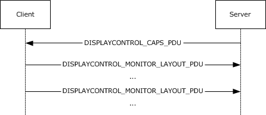

# RDP Client MS-RDPEDISP  Test Design Specification 

## Contents

* [Technical Document Analysis](#_Toc427063069)
    * [Technical Document Overview](#_Toc427063070)
    * [Relationship to Other Protocols](#_Toc427063071)
    * [Protocol Operations/Messages](#_Toc427063072)
    * [Protocol Properties](#_Toc427063073)
* [Test Method](#_Toc427063074)
    * [Assumptions, Scope and Constraints](#_Toc427063075)
    * [Test Approach](#_Toc427063076)
    * [Test Scenarios](#_Toc427063077)
		* [S1_ResolutionChange](#_Toc427063078)
		* [S2_OrientationChange](#_Toc427063079)
		* [S3_MonitorAdditionRemoval](#_Toc427063080)
		* [S4_MonitorReposition](#_Toc427063081)
* [Test Suite Design](#_Toc427063082)
    * [Test Suite Architecture](#_Toc427063083)
		* [System under Test (SUT)](#_Toc427063084)
		* [Test Suite Architecture](#_Toc427063085)
    * [Technical Dependencies/Considerations](#_Toc427063086)
		* [Dependencies](#_Toc427063087)
		* [Technical Difficulties](#_Toc427063088)
		* [Encryption Consideration](#_Toc427063089)
* [Test Cases Design](#_Toc427063090)
    * [Traditional Test Case Design](#_Toc427063091)
    * [Test Cases Description](#_Toc427063092)
		* [S1_ResolutionChange](#_Toc427063093)
		* [S2_OrientationChange](#_Toc427063094)
		* [S3_MonitorAdditionRemoval](#_Toc427063095)
		* [S4_MonitorReposition](#_Toc427063096)
* [Appendix](#_Toc427063097)
    * [Glossary (Optional)](#_Toc427063098)
    * [Reference](#_Toc427063099)

## <a name="_Toc427063069"/>Technical Document Analysis

### <a name="_Toc427063070"/>Technical Document Overview
Remote Desktop Protocol: Display Control Channel Extension is an extension to the Remote Desktop Protocol: Basic Connectivity and Graphics Remoting, as specified in [MS-RDPBCGR] sections 1 to 5. This control protocol is used by the server to request display configuration changes in a remote session. Display configuration changes include the addition, removal and repositioning of monitors, resolution updates, and orientation updates.

### <a name="_Toc427063071"/>Relationship to Other Protocols 
The Remote Desktop Protocol: Display Control Virtual Channel Extension is embedded in a dynamic virtual channel transport, as specified in [MS-RDPEDYC] sections 1 to 3. Deactivation-Reactivation Sequence as specified in [MS-RDPBCGR] section 1.3.1.3 and surface management commands specified in [MS-RDPEGFX]] section 1.3 are used to update client RDP session configuration.

### <a name="_Toc427063072"/>Protocol Operations/Messages 
There are 4 structures described by this protocol.

* DISPLAYCONTROL_HEADER 

* DISPLAYCONTROL\_CAPS_PDU

* DISPLAYCONTROL\_MONITOR\_LAYOUT_PDU

* DISPLAYCONTROL\_MONITOR_LAYOUT

The sequence of messages exchanged by the Remote Desktop Protocol: Display Control Virtual Channel Extension is described in the following figure. The messages exchanged in this diagram are strictly sequential.

Figure 1: The Display Control message sequence

### <a name="_Toc427063073"/>Protocol Properties
* RDPEDISP is a block protocol and an extension of MS-RDPBCGR.
* RDPEDISP is embedded in a RDPEDYC dynamic virtual channel transport.
* RDPEDISP operates only after the dynamic virtual channel transport is fully established. If the dynamic virtual channel transport is terminated, the RDPEDISP is also terminated.
* The protocol is terminated by closing the underlying virtual channel.

## <a name="_Toc427063074"/>Test Method

### <a name="_Toc427063075"/>Assumptions, Scope and Constraints
**Assumptions:**

* The RDP client machine should support display configuration changes. Display configuration changes include the addition, removal and repositioning of monitors, resolution updates, and orientation updates.

**Scope:**

* The protocol client endpoint (RDP client) playing the client role will be tested. For Windows, the Remote Desktop Client (MSTSC.exe) is the client endpoint.
* The protocol server endpoint (RDP Server) playing the server role is out of scope.
* For Windows, the System under Test (SUT) will be mstsc.exe.
* External protocols are out of scope.
* Compression and encryption are out of scope.

**Constraint:**

There is no constraint for this Test Suite.

### <a name="_Toc427063076"/>Test Approach
Because the MS-RDPEDISP client test code is merged into the MS-RDPBCGR test code, it applies the same test approach used for MS-RDPBCGR: traditional testing. 

For more details about the reason for choosing traditional testing, please refer to **MS-RDPBCGR_ClientTestDesignSpecificaitoin.md**.

### <a name="_Toc427063077"/>Test Scenarios
There are 4 scenarios defined in the MS-RDPEDISP client test suite for verifying the client behavior. See Table 2-1 MS-RDPEDISP Test Suite Scenarios for more information.

|  **Scenario**|  **Priority**|  **Test Approach**|  **Description**| 
| -------------| -------------| -------------| ------------- |
| S1_ResolutionChange| 0| Traditional| Verify RDPEDISP resolution updates sequence| 
| S2_OrientationChange| 0| Traditional| Verify RDPEDISP orientation updates sequence| 
| S3_MonitorAdditionRemoval| 1| Traditional| Verify RDPEDISP addition, removal of monitors sequence| 
| S4_MonitorReposition| 1| Traditional| Verify RDPEDISP repositioning of monitors sequence| 

***Table 2-1 MS-RDPEMT Test Suite Scenarios***

#### <a name="_Toc427063078"/>S1_ResolutionChange
**Preconditions:**

* RDP Client should not be thin client.

* RDP Server and Client version should be higher than 8.1.

* The SUT can change screen resolution.

* The RDP connection has been established.

* RDPEDYC dynamic virtual channel established.

**Typical Sequence:**

The typical scenario sequence is the following:

* RDP server sends a DISPLAYCONTROL\_CAPS\_PDU PDU through RDPEDYC dynamic virtual channel whose name is "Microsoft::Windows::RDS::DisplayControl" specified in [MS-RDPEDYC] section 2.2.2.1.

* RDP Client sends a DISPLAYCONTROL\_MONITOR\_LAYOUT_PDU PDU when screen resolution on client is updated.

**Scenario Testing:**

This scenario will test the following structures:

* DISPLAYCONTROL_HEADER 

* DISPLAYCONTROL\_CAPS_PDU

* DISPLAYCONTROL\_MONITOR\_LAYOUT_PDU

* DISPLAYCONTROL\_MONITOR_LAYOUT

#### <a name="_Toc427063079"/>S2_OrientationChange
**Preconditions:**

* RDP Client should not be thin client.

* RDP Server and Client version should be higher than 8.1.

* The SUT can change screen resolution.

* The RDP connection has been established.

* RDPEDYC dynamic virtual channel established.

**Typical Sequence:**

The typical scenario sequence is the following:

* RDP server sends a DISPLAYCONTROL\_CAPS\_PDU PDU through RDPEDYC dynamic virtual channel whose name is "Microsoft::Windows::RDS::DisplayControl" specified in [MS-RDPEDYC] section 2.2.2.1.

* RDP Client sends a DISPLAYCONTROL\_MONITOR\_LAYOUT_PDU PDU when screen orientation on client is updated.

**Scenario Testing:**

This scenario will test the following structures:

* DISPLAYCONTROL_HEADER 

* DISPLAYCONTROL\_CAPS_PDU

* DISPLAYCONTROL\_MONITOR\_LAYOUT_PDU

* DISPLAYCONTROL\_MONITOR_LAYOUT

#### <a name="_Toc427063080"/>S3_MonitorAdditionRemoval
**Preconditions:**

* RDP Client should not be thin client.

* RDP Server and Client version should be higher than 8.1.

* The SUT can change screen resolution.

* The RDP connection has been established.

* RDPEDYC dynamic virtual channel established.

**Typical Sequence:**

The typical scenario sequence is the following:

* RDP server sends a DISPLAYCONTROL\_CAPS_PDU PDU through RDPEDYC dynamic virtual channel whose name is "Microsoft::Windows::RDS::DisplayControl" specified in [MS-RDPEDYC] section 2.2.2.1.

* RDP Client sends a DISPLAYCONTROL\_MONITOR\_LAYOUT_PDU PDU when addition or removal of monitors happens. 

**Scenario Testing:**

This scenario will test the following structures:

* DISPLAYCONTROL_HEADER 

* DISPLAYCONTROL\_CAPS_PDU

* DISPLAYCONTROL\_MONITOR\_LAYOUT_PDU

* DISPLAYCONTROL\_MONITOR_LAYOUT

#### <a name="_Toc427063081"/>S4_MonitorReposition
**Preconditions:**

* RDP Client should not be thin client.

* RDP Server and Client version should be higher than 8.1.

* The SUT can change screen resolution.

* The RDP connection has been established.

* RDPEDYC dynamic virtual channel established.

**Typical Sequence:**

The typical scenario sequence is the following:

* RDP server sends a DISPLAYCONTROL\_CAPS_PDU PDU through RDPEDYC dynamic virtual channel whose name is "Microsoft::Windows::RDS::DisplayControl" specified in [MS-RDPEDYC] section 2.2.2.1.

* RDP Client sends a DISPLAYCONTROL\_MONITOR\_LAYOUT_PDU PDU when position of monitors is updated.

**Scenario Testing:**

This scenario will test the following structures:

* DISPLAYCONTROL_HEADER 

* DISPLAYCONTROL\_CAPS_PDU

* DISPLAYCONTROL\_MONITOR\_LAYOUT_PDU

* DISPLAYCONTROL\_MONITOR_LAYOUT

## <a name="_Toc427063082"/>Test Suite Design

### <a name="_Toc427063083"/>Test Suite Architecture

#### <a name="_Toc427063084"/>System under Test (SUT)
* From the third party point of view, the SUT is a component which implements MS-RDPEDISP.

* From the Windows implementation point of view, the SUT is the Remote Desktop Client (Mstsc.exe).

#### <a name="_Toc427063085"/>Test Suite Architecture
Figure 3-1 illustrates the architecture of the MS-RDPEDISP test suite for client endpoint testing.

Figure 3-1 MS-RDPEDISP Test Suite Architecture

As shown in Figure 3-1, MS-RDPEDISP is using the synthetic server pattern to design the test suite architecture. MS-RDPEDISP Test Suite contains the following components:

* The SUT Control Adapter is used by the test case to trigger the client to send the request to the server.

* The Test suite invokes the protocol SDK (test suite library) to process the client messages and then sends the corresponding server response message to the client.

* The MS-RDPEDISP Test Suite uses RDPEDYC dynamic virtual channel as the transport to communicate with SUT.

* The SUT for the MS-RDPEDISP Test Suite is the RDP Client.

The MS-RDPEDISP Test Case will verify the protocol client behaviors specified in MS-RDPEDISP.

### <a name="_Toc427063086"/>Technical Dependencies/Considerations

#### <a name="_Toc427063087"/>Dependencies
Transport: Both TCP and UDP transport are used. The main RDP connection use TCP transport, and the RDPEDISP messages are transmitted on RDPEDYC dynamic virtual channel base on TCP or UDP transport.

#### <a name="_Toc427063088"/>Technical Difficulties 
None.

#### <a name="_Toc427063089"/>Encryption Consideration
None.

## <a name="_Toc427063090"/>Test Cases Design

### <a name="_Toc427063091"/>Traditional Test Case Design

|  **Scenario**|  **Test Cases**|  **BVTs**|  **P0**|  **P1**| 
| -------------| -------------| -------------| -------------| ------------- |
| S1_ResolutionChange| 2| 2| 2| 0| 
| S2_OrientationChange| 5| 2| 2| 2| 
| S3_MonitorAdditionRemoval| 2| 0| 0| 2| 
| S4_MonitorReposition| 2| 0| 0| 2| 

### <a name="_Toc427063092"/>Test Cases Description 
The test suite is a synthetic RDP server. In the following descriptions, all instances of the term “Test Suite” can be understood as the RDP server.

Common prerequisites for all test cases:

* The test suite has established the main RDP connection.
* The test suite has established RDPEDYC dynamic virtual channel.

Common cleanup requirements:

* The test suite disconnects all RDP connections if there any.
* The test suite stops the TCP and UDP listening service.
* The SUT deletes all data caches from previous RDP connections.   

The common prerequisites and clean requirements are not listed in any of the test cases. Only prerequisites and cleanup requirements unique to the test case are listed in the corresponding test case descriptions.

#### <a name="_Toc427063093"/>S1_ResolutionChange

|  **S1_ResolutionChange**| | 
| -------------| ------------- |
|  **Test ID**| S1\_RDPEDISP\_ResolutionChange_DeactivationReactivation| 
|  **Priority**| P0| 
|  **Description** | Verify the RDP client can change the screen resolution of remote desktop session by sending Display Control Messages and receiving the Deactivation-Reactivation from the remote desktop session host.| 
|  **Prerequisites**| RDP Client should not be thin client.| 
| | RDP Server and Client version should be higher than 8.1.| 
| | The SUT can change screen resolution.| 
|  **Test Execution Steps**| Establish the RDP connection between server and client.| 
| | Open a Display Control dynamic virtual channel named "Microsoft::Windows::RDS::DisplayControl".| 
| | Test suite should send a **DISPLAYCONTROL\_CAPS\_PDU** to client.| 
| | Trigger SUT to change screen resolution and maximize the window of RDP session.| 
| | Expect **DISPLAYCONTROL\_MONITOR\_LAYOUT\_PDU** from client and verify this message:| 
| | All of the fields specified in the DISPLAYCONTROL\_MONITOR\_LAYOUT_PDU message are valid, consistent and within range. | 
| | None of the specified monitors overlap.| 
| | Each monitor is adjacent to at least one other monitor (even if only at a single point).| 
| | If the above requirements are all satisfied, test suite should initiate a Deactivation-Reactivation Sequence.| 
| | Expect client to change screen resolution of the remote desktop session.|  
|  **Cleanup**| Restore the screen resolution of SUT.| 

|  **S1_Connection**| | 
| -------------| ------------- |
|  **Test ID**| S1\_RDPEDISP\_ResolutionChange_RestartGraphicsPipeline| 
|  **Priority**| P0| 
|  **Description** | Verify the RDP client can change the screen resolution of remote desktop session by sending Display Control Messages and receiving the surface management commands to restart the graphics pipeline from the remote desktop session host.| 
|  **Prerequisites**| RDP Client should not be thin client.| 
| | RDP Server and Client version should be higher than 8.1.| 
| | The SUT can change screen resolution.| 
|  **Test Execution Steps**| Establish the RDP connection between server and client.| 
| | Open a Display Control dynamic virtual channel named "Microsoft::Windows::RDS::DisplayControl".| 
| | Test suite should send a **DISPLAYCONTROL\_CAPS_PDU** to client.| 
| | Trigger SUT to change screen resolution and maximize the window of RDP session.| 
| | Expect **DISPLAYCONTROL\_MONITOR\_LAYOUT_PDU** from client and verify this message:| 
| | All of the fields specified in the DISPLAYCONTROL\_MONITOR\_LAYOUT_PDU message are valid, consistent and within range. | 
| | None of the specified monitors overlap.| 
| | Each monitor is adjacent to at least one other monitor (even if only at a single point).| 
| | If the above requirements are all satisfied, test suite should send surface management commands to restart the graphics pipeline.| 
| | Expect client to change screen resolution of the remote desktop session.| 
|  **Cleanup**| Restore the screen resolution of SUT.| 

#### <a name="_Toc427063094"/>S2_OrientationChange

|  **S2_OrientationChange**| | 
| -------------| ------------- |
|  **Test ID**| S2\_RDPEDISP\_OrientationChange_DeactivationReactivation| 
|  **Priority**| P0| 
|  **Description** | Verify the RDP client can change the screen orientation of remote desktop session by sending Display Control Messages and receiving the Deactivation-Reactivation from the remote desktop session host.| 
|  **Prerequisites**| RDP Client should not be thin client.| 
| | RDP Server and Client version should be higher than 8.1.| 
| | The SUT can change screen orientation.| 
|  **Test Execution Steps**| Establish the RDP connection between server and client.| 
| | Open a Display Control dynamic virtual channel named "Microsoft::Windows::RDS::DisplayControl".| 
| | Test suite should send a **DISPLAYCONTROL\_CAPS_PDU** to client.| 
| | Trigger client to change screen orientation from Landscape to Portrait and maximize the window of RDP session.| 
| | Expect **DISPLAYCONTROL\_MONITOR\_LAYOUT_PDU** from client and verify this message:| 
| | All of the fields specified in the DISPLAYCONTROL\_MONITOR\_LAYOUT_PDU message are valid, consistent and within range. | 
| | None of the specified monitors overlap.| 
| | Each monitor is adjacent to at least one other monitor (even if only at a single point).| 
| | If the above requirements are all satisfied, test suite should initiate a Deactivation-Reactivation Sequence.| 
| | Expect client to change screen orientation of the remote desktop session.| 
|  **Cleanup**| Restore the screen orientation of SUT.| 

|  **S2_OrientationChange**| | 
| -------------| ------------- |
|  **Test ID**| S2\_RDPEDISP\_OrientationChange_RestartGraphicsPipeline| 
|  **Priority**| P0| 
|  **Description** | Verify the RDP client can change the screen orientation of remote desktop session by sending Display Control Messages and receiving the surface management commands to restart the graphics pipeline from the remote desktop session host.| 
|  **Prerequisites**| RDP Client should not be thin client.| 
| | RDP Server and Client version should be higher than 8.1.| 
| | The SUT can change screen orientation.| 
|  **Test Execution Steps**| Establish the RDP connection between server and client.| 
| | Open a Display Control dynamic virtual channel named "Microsoft::Windows::RDS::DisplayControl".| 
| | Test suite should send a **DISPLAYCONTROL\_CAPS_PDU** to client.| 
| | Trigger client to change screen orientation from Landscape to Portrait and maximize the window of RDP session.| 
| | Expect **DISPLAYCONTROL\_MONITOR\_LAYOUT_PDU** from client and verify this message:| 
| | All of the fields specified in the DISPLAYCONTROL\_MONITOR\_LAYOUT_PDU message are valid, consistent and within range. | 
| | None of the specified monitors overlap.| 
| | Each monitor is adjacent to at least one other monitor (even if only at a single point).| 
| | If the above requirements are all satisfied, test suite should send surface management commands to restart the graphics pipeline.| 
| | Expect client to change screen orientation of the remote desktop session.| 
|  **Cleanup**| Restore the screen orientation of SUT.| 

|  **S2_OrientationChange**| | 
| -------------| ------------- |
|  **Test ID**| S2\_RDPEDISP\_OrientationAllChange_EnhancedAdapterDemo| 
|  **Priority**| P1| 
|  **Description** | Verify the RDP client can change the screen orientation of remote desktop session by sending Display Control Messages and receiving the surface management commands to restart the graphics pipeline from the remote desktop session host. Test case will instruct tester to test.| 
|  **Prerequisites**| RDP Client should not be thin client.| 
| | RDP Server and Client version should be higher than 8.1.| 
| | The SUT can change screen orientation.| 
|  **Test Execution Steps**| Establish the RDP connection between server and client.| 
| | Open a Display Control dynamic virtual channel named "Microsoft::Windows::RDS::DisplayControl".| 
| | Test suite should send a **DISPLAYCONTROL\_CAPS_PDU** to client.| 
| | Test suite sends pictures of instruction and tester should operate according to the instructions.| 
| | Expect **DISPLAYCONTROL\_MONITOR\_LAYOUT_PDU** from client and verify this message:| 
| | All of the fields specified in the DISPLAYCONTROL\_MONITOR\_LAYOUT_PDU message are valid, consistent and within range. | 
| | None of the specified monitors overlap.| 
| | Each monitor is adjacent to at least one other monitor (even if only at a single point).| 
| | If the above requirements are all satisfied, test suite should send surface management commands to restart the graphics pipeline.| 
| | Expect client to change screen orientation of the remote desktop session.| 
| | Repeat Step 11 to 14 until test case finishes.| 
|  **Cleanup**| Restore the screen orientation of SUT.| 

|  **S2_OrientationChange**| | 
| -------------| ------------- |
|  **Test ID**| S2\_RDPEDISP\_OrientationAllChange_DeactivationReactivation| 
|  **Priority**| P1| 
|  **Description** | Verify the RDP client can change the screen orientation of remote desktop session by sending Display Control Messages and receiving the Deactivation-Reactivation from the remote desktop session host.| 
|  **Prerequisites**| RDP Client should not be thin client.| 
| | RDP Server and Client version should be higher than 8.1.| 
| | The SUT can change screen orientation.| 
|  **Test Execution Steps**| Establish the RDP connection between server and client.| 
| | Open a Display Control dynamic virtual channel named "Microsoft::Windows::RDS::DisplayControl".| 
| | Test suite should send a **DISPLAYCONTROL\_CAPS_PDU** to client.| 
| | Trigger client to change screen orientation from Portrait to Landscape (flipped) and maximize the window of RDP session.| 
| | Expect **DISPLAYCONTROL\_MONITOR\_LAYOUT_PDU** from client and verify this message:| 
| | All of the fields specified in the DISPLAYCONTROL\_MONITOR\_LAYOUT_PDU message are valid, consistent and within range. | 
| | None of the specified monitors overlap.| 
| | Each monitor is adjacent to at least one other monitor (even if only at a single point).| 
| | If the above requirements are all satisfied, test suite should initiate a Deactivation-Reactivation Sequence.| 
| | Expect client to change screen orientation of the remote desktop session.| 
| | Trigger client to change screen orientation from Landscape (flipped) to Portrait (flipped) and maximize the window of RDP session.| 
| | Repeat Step 5 to 7.| 
| | Trigger client to change screen orientation from Portrait (flipped) to Landscape to and maximize the window of RDP session.| 
| | Repeat Step 5 to 7.| 
|  **Cleanup**| Restore the screen orientation of SUT.| 

|  **S2_OrientationChange**| | 
| -------------| ------------- |
|  **Test ID**| S2\_RDPEDISP\_OrientationAllChange_RestartGraphicsPipeline| 
|  **Priority**| P1| 
|  **Description** | Verify the RDP client can change the screen orientation of remote desktop session by sending Display Control Messages and receiving the surface management commands to restart the graphics pipeline from the remote desktop session host.| 
|  **Prerequisites**| RDP Client should not be thin client.| 
| | RDP Server and Client version should be higher than 8.1.| 
| | The SUT can change screen orientation.| 
|  **Test Execution Steps**| Establish the RDP connection between server and client.| 
| | Open a Display Control dynamic virtual channel named "Microsoft::Windows::RDS::DisplayControl".| 
| | Test suite should send a **DISPLAYCONTROL\_CAPS_PDU** to client.| 
| | Trigger client to change screen orientation from Portrait to Landscape (flipped) and maximize the window of RDP session.| 
| | Expect **DISPLAYCONTROL\_MONITOR\_LAYOUT_PDU** from client and verify this message:| 
| | All of the fields specified in the DISPLAYCONTROL\_MONITOR\_LAYOUT_PDU message are valid, consistent and within range. | 
| | None of the specified monitors overlap.| 
| | Each monitor is adjacent to at least one other monitor (even if only at a single point).| 
| | If the above requirements are all satisfied, test suite should send surface management commands to restart the graphics pipeline.| 
| | Expect client to change screen orientation of the remote desktop session.| 
| | Trigger client to change screen orientation from Landscape (flipped) to Portrait (flipped) and maximize the window of RDP session.| 
| | Repeat Step 5 to 7.| 
| | Trigger client to change screen orientation from Portrait (flipped) to Landscape and maximize the window of RDP session.| 
| | Repeat Step 5 to 7.| 
|  **Cleanup**| Restore the screen orientation of SUT.| 

#### <a name="_Toc427063095"/>S3_MonitorAdditionRemoval

|  **S3_MonitorAdditionRemoval**| | 
| -------------| ------------- |
|  **Test ID**| S3\_RDPEDISP\_MonitorAdditionRemoval_DeactivationReactivation| 
|  **Priority**| P1| 
|  **Description** | Verify the RDP client can change the number of monitors for remote desktop session by sending Display Control Messages and receiving the Deactivation-Reactivation from the remote desktop session host.| 
|  **Prerequisites**| RDP Client should not be thin client.| 
| | RDP Server and Client version should be higher than 8.1.| 
| | The SUT has the ability of addition and removal of monitors.| 
|  **Test Execution Steps**| Establish the RDP connection between server and client.| 
| | Open a Display Control dynamic virtual channel named "Microsoft::Windows::RDS::DisplayControl".| 
| | Test suite should send a **DISPLAYCONTROL\_CAPS_PDU** to client.| 
| | Trigger client to change number of monitors by adding a monitor and maximize the window of RDP session.| 
| | Expect **DISPLAYCONTROL\_MONITOR\_LAYOUT_PDU** from client and verify this message:| 
| | All of the fields specified in the DISPLAYCONTROL\_MONITOR\_LAYOUT_PDU message are valid, consistent and within range. | 
| | None of the specified monitors overlap.| 
| | Each monitor is adjacent to at least one other monitor (even if only at a single point).| 
| | If the above requirements are all satisfied, test suite should initiate a Deactivation-Reactivation Sequence.| 
| | Expect client to change number or monitors for the remote desktop session.| 
| | Trigger client to change number of monitors by removing a monitor and maximize the window of RDP session.| 
| | Repeat Step 5 to 7.| 
|  **Cleanup**| Restore the number of monitors to default.| 

|  **S3_MonitorAdditionRemoval**| | 
| -------------| ------------- |
|  **Test ID**| S3\_RDPEDISP\_MonitorAdditionRemoval_RestartGraphicsPipeline| 
|  **Priority**| P1| 
|  **Description** | Verify the RDP client can change the number of monitors for remote desktop session by sending Display Control Messages and receiving the surface management commands to restart the graphics pipeline from the remote desktop session host.| 
|  **Prerequisites**| RDP Client should not be thin client.| 
| | RDP Server and Client version should be higher than 8.1.| 
| | The SUT has the ability of addition and removal of monitors.| 
|  **Test Execution Steps**| Establish the RDP connection between server and client.| 
| | Open a Display Control dynamic virtual channel named "Microsoft::Windows::RDS::DisplayControl".| 
| | Test suite should send a **DISPLAYCONTROL\_CAPS_PDU** to client.| 
| | Trigger client to change number of monitors by adding a monitor and maximize the window of RDP session.| 
| | Expect **DISPLAYCONTROL\_MONITOR\_LAYOUT_PDU** from client and verify this message:| 
| | All of the fields specified in the DISPLAYCONTROL\_MONITOR\_LAYOUT_PDU message are valid, consistent and within range. | 
| | None of the specified monitors overlap.| 
| | Each monitor is adjacent to at least one other monitor (even if only at a single point).| 
| | If the above requirements are all satisfied, test suite should send surface management commands to restart the graphics pipeline.| 
| | Expect client to change number of monitors for the remote desktop session.| 
| | Trigger client to change number of monitors by removing a monitor and maximize the window of RDP session.| 
| | Repeat step 5 to 7.| 
|  **Cleanup**| Restore the number of monitors to default.| 

#### <a name="_Toc427063096"/>S4_MonitorReposition

|  **S4_MonitorReposition**| | 
| -------------| ------------- |
|  **Test ID**| S4\_RDPEDISP\_MonitorReposition_DeactivationReactivation| 
|  **Priority**| P1| 
|  **Description** | Verify the RDP client can change the position of monitors for remote desktop session by sending Display Control Messages and receiving the Deactivation-Reactivation from the remote desktop session host.| 
|  **Prerequisites**| RDP Client should not be thin client.| 
| | RDP Server and Client version should be higher than 8.1.| 
| | The SUT has at least two monitors.| 
|  **Test Execution Steps**| Establish the RDP connection between server and client.| 
| | Open a Display Control dynamic virtual channel named "Microsoft::Windows::RDS::DisplayControl".| 
| | Test suite should send a **DISPLAYCONTROL\_CAPS_PDU** to client.| 
| | Trigger client to change position of monitors and maximize the window of RDP session.| 
| | Expect **DISPLAYCONTROL\_MONITOR\_LAYOUT_PDU** from client and verify this message:| 
| | All of the fields specified in the DISPLAYCONTROL\_MONITOR\_LAYOUT_PDU message are valid, consistent and within range. | 
| | None of the specified monitors overlap.| 
| | Each monitor is adjacent to at least one other monitor (even if only at a single point).| 
| | If the above requirements are all satisfied, test suite should initiate a Deactivation-Reactivation Sequence.| 
| | Expect client to change position of monitors for the remote desktop session.| 
|  **Cleanup**| Restore the position of monitors to default.| 

|  **S4_MonitorReposition**| | 
| -------------| ------------- |
|  **Test ID**| S4\_RDPEDISP\_MonitorReposition_RestartGraphicsPipeline| 
|  **Priority**| P1| 
|  **Description** | Verify the RDP client can change the position of monitors for remote desktop session by sending Display Control Messages and receiving the surface management commands to restart the graphics pipeline from the remote desktop session host.| 
|  **Prerequisites**| RDP Client should not be thin client.| 
| | RDP Server and Client version should be higher than 8.1.| 
| | The SUT has at least two monitors.| 
|  **Test Execution Steps**| Establish the RDP connection between server and client.| 
| | Open a Display Control dynamic virtual channel named "Microsoft::Windows::RDS::DisplayControl".| 
| | Test suite should send a **DISPLAYCONTROL\_CAPS_PDU** to client.| 
| | Trigger client to change position of monitors and maximize the window of RDP session.| 
| | Expect **DISPLAYCONTROL\_MONITOR\_LAYOUT_PDU** from client and verify this message:| 
| | All of the fields specified in the DISPLAYCONTROL\_MONITOR\_LAYOUT_PDU message are valid, consistent and within range. | 
| | None of the specified monitors overlap.| 
| | Each monitor is adjacent to at least one other monitor (even if only at a single point).| 
| | If the above requirements are all satisfied, test suite should send surface management commands to restart the graphics pipeline.| 
| | Expect client to change position of monitors for the remote desktop session.| 
|  **Cleanup**| Restore the position of monitors to default.| 

## <a name="_Toc427063097"/>Appendix

### <a name="_Toc427063098"/>Glossary (Optional)
**SUT**: System under Test. In this spec, it indicates the MS-RDPEDISP client implementation.

**Test Suite**: The synthetic RDP server which is used to test against SUT.

### <a name="_Toc427063099"/>Reference

* Technical Document: **[MS-RDPEDISP].pdf**

