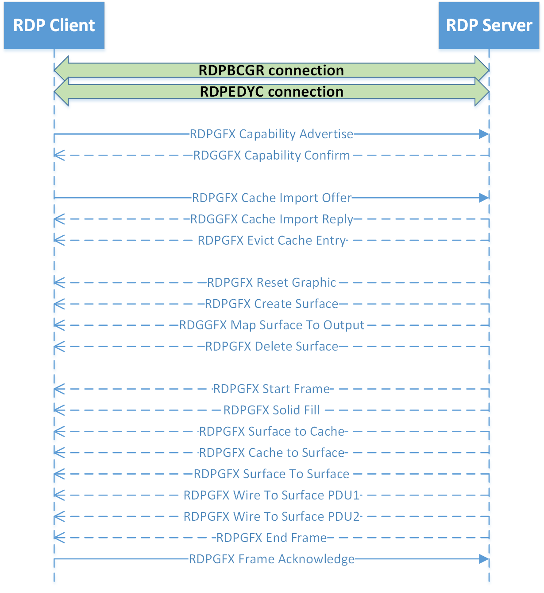
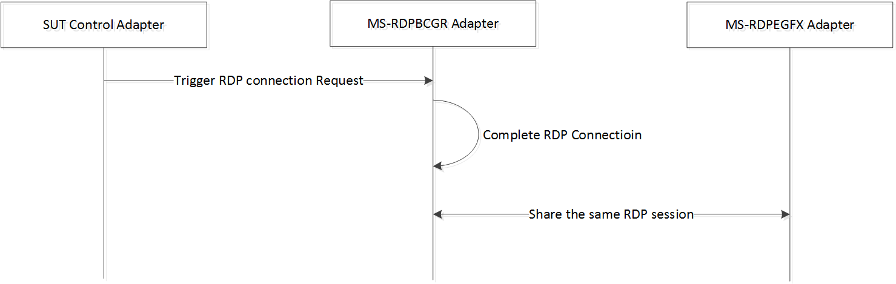

# RDP Client MS-RDPEGFX Test Design Specification

## Contents

* [Technical Document Analysis](#technical_codument_analysis)
    * [Technical Document Overview](#techinical_document_overview)
    * [Relationship to Other Protocols](#relationship_to_other_protocols)
    * [Protocol Operations/Messages](#protocol_operations\/messages)
    * [Protocol Properties](#protocol_properites)
* [Test Method](#test_method)
    * [Assumptions, Scope and Constraints](#assumptions_scope_and_constraints)
    * [Test Approach](#test_approach)
    * [Test Scenarios](#test_scenarios)
		* [Capability exchange Test](#capability_exchange_test)
		* [Surface to Screen Test](#surface_to_screen_test)
		* [Cache Management Test](#cache_management_test)
		* [Surface to Surface Test](#surface_to_surface_test)
		* [Wire to Surface Test](#wire_to_surface_test)
		* [ClearCodec Stream Test](#clearcodec_stream_test)
		* [RFX progressive Codec Stream Test](#rfx_progressive_codec_stream_test)
		* [Frame Fragmentation Test](#frame_fragmentation_test)
		* [Compression Test](#compression_test)
		* [RemoteFX Codec Test](#remotefx_codec_test)
		* [H264 Codec Test](#h264_codec_test)
* [Test Suite Design](#test_suite_design)
    * [Test Suite Architecture](#test_suite_architecture)
		* [System under Test (SUT)](#system_under_test\(sut\))
		* [Test Suite Architecture](#test_suite_architecture)
    * [Technical Dependencies/Considerations](#technical_dependencies\/considerations)
		* [Dependencies](#dependencies)
		* [Technical Difficulties](#technical_difficulites)
		* [Encryption Consideration](#encryption_consideration)
    * [Adapter Design](#adapter_design)
		* [Adapter Overview](#adapter_overview)
		* [Technical Feasibility of Adapter Approach](#techinical_feasibility_of_adapter_approach)
		* [Adapter Abstract Level](#adapter_abstract_level)
		* [Adapter Inner Work](#adapter_inner_work)
* [Test Cases Design](#test_case_design)
    * [Traditional Test Case Design](#traditional_test_case_design)
    * [Test Cases Description](#test_case_description)
		* [BVT Test Cases](#bvt_test_cases)
		* [Non BVT Test Cases](#non_bvt_test_case)
* [Appendix](#appendix)
    * [Glossary](#glossary)
    * [Reference](#reference)

### Technical Document Analysis

### Technical Document Overview
* The Remote Desktop Protocol: Graphics Pipeline Extension applies to the Remote Desktop Protocol: Basic Connectivity and Graphics Remoting, as specified in [MS-RDPBCGR]. The graphics protocol is used to efficiently encode graphics display data generated in a session associated with a remote user on a terminal server so that the data can be sent on the wire, received, decoded, and rendered by a compatible client.

* The graphics protocol introduces bitmap cache and two new graphics encoding technique (ClearCodec and RemoteFX Progressive Codec) to improve the efficiency of transferring graphics bitmap data.

### Relationship to Other Protocols
* [MS-RDPEGFX] is embedded in the dynamic virtual channel transport, as specified in [MS-RDPEDYC].

* [MS-RDPEGFX] can also transmit graphic bitmap data encoded by image codecs specified in [MS-RDPRFX], [MS-RDPNSC], and [MS-RDPEGDI].

### Protocol Operations/Messages
* This protocol describes 5 types of messages as below:

* 1.**Cache management** commands are used to evict entries from a bitmap cache and to notify the server of cache entries stored in a client-side persistent bitmap cache.

  RDPGFX\_EVICT\_CACHE\_ENTRY_PDU

  RDPGFX\_CACHE\_IMPORT\_OFFER_PDU

  RDPGFX\_CACHE\_IMPORT\_REPLY_PDU

* 2.**Surface management** commands are used to manage the lifetime of offscreen surfaces, to map offscreen surfaces to the graphics output buffer, and to adjust the dimensions of the graphics output buffer.

  RDPGFX\_CREATE\_SURFACE\_PDU

  RDPGFX\_DELETE\_SURFACE\_PDU

  RDPGFX\_RESET\_GRAPHICS

  RDPGFX\_MAP\_SURFACE\_TO\_OUTPUT_PDU

* 3.**Framing** commands are used to group graphics commands into logical frames and to indicate to the server that a frame has been decoded.

  RDPGFX\_START\_FRAME\_PDU

  RDPGFX\_END\_FRAME\_PDU

  RDPGFX\_FRAME\_ACKNOWLEDGE_PDU

* 4.**Capability exchange** commands are used to exchange capability sets.

  RDPGFX\_CAPS\_ADVERTISE_PDU

  RDPGFX\_CAPS\_CONFIRM_PDU

* 5.**Blit** commands are used to transfer bitmaps from the server to an offscreen surface on the client, transfer bitmaps between offscreen surfaces, transfer bitmaps between offscreen surfaces and a bitmap cache, and to fill a rectangular region on an offscreen surface with a predefined color.

  RDPGFX\_WIRE\_TO\_SURFACE\_PDU_1

  RDPGFX\_WIRE\_TO\_SURFACE\_PDU_2

  RDPGFX\_DELETE\_ENCODING_\CONTEXT\_PDU

  RDPGFX\_SOLIDFILL_PDU

  RDPGFX\_SURFACE\_TO\_SURFACE\_PDU

  RDPGFX\_SURFACE\_TO\_CACHE_PDU

  RDPGFX\_CACHE\_TO\_SURFACE\_PDU

  The typical message flow of this protocol is described in following figures.

_Figure 1-1: MS-RDPEGFX typical message flow_

### Protocol Properties
* MS-RDPEGFX is a block protocol.

* MS-RDPEGFX is an extension to MS-RDPBCGR and all packets are transmitted in dynamic virtual channels which described in MS-RDPEDYC.

* MS-RDPEGFX is a Microsoft Communication Protocol Program (MCPP) protocol.

* MS-RDPEGFX is asynchronous because most of the messages don’t need any response.

## Test Method

### Assumptions, Scope and Constraints
  **Assumptions:**

  None.

  **Scope:**

  1. Protocol client endpoint, playing the client role, will be tested. For Windows, Terminal Client (MSTSC.exe) is the RDP client endpoint.

  2. Protocol Server endpoint, playing the server role, is out of scope for testing.

  3. The validation of the client decode behaviors if out of scope, because it cannot be observed on the wire.  

  **Constraint:**

  None.

### Test Approach
**Recommended Test Approach**

Traditional testing is chosen as the test approach in MS-RDPEGFX.

**Test Approach Comparison**

  Table 11 illustrates the comparison of test approaches for the MS-RDPEGFX test suite.

|  **Factor**|  **Model-Based (MBT)**|  **Traditional**|  **Best Choice**|
| -------------| -------------| -------------| ------------- |
|  **Stateful**| After the RDP capability exchange is done, all of the PDUs sent by both the server and the client are asynchronous; most of them do not require a response, so MBT is NOT suitable to cover all PDU combination cases in models.| Traditional Testing can handle this situation easily.| Traditional|
|  **Simple logic**| The logic is not complex. MBT will require more initial effort and will be more difficult to maintain.| Traditional testing will be less effort.| Traditional|
|  **Large Number of Test Cases**| Based on the newest test suite development process, the number of test cases is not expected to be too large.  But MBT may generate a lot of “garbage” test cases.| It is easy to create useful test cases with Traditional Testing. It can reduce the number of cases and the cost of sustaining.  | Traditional|

  Reasons for choosing Traditional Testing

  * The protocol is not stateful.

  * The logic of this protocol is simple.

  * Only 2 out of 19 PDUs in the connection/disconnection sequences are sent sequentially.

  * The combinations of parameters are not complex.

### Test Scenarios

* There are 10 scenarios designed for MS-RDPEGFX client testing. Please refer to “Table 2-1 Scenarios of MS-RDPEGFX Test Suite” for more information.  

|  **Scenario**|  **Priority**|  **Test Approach**|  **Description**|
| -------------| -------------| -------------| ------------- |
| Capability Exchange Test| P0| Traditional| Exchange MS-RDPEGFX capabilities. |
| Surface to Screen Test| P0| Traditional| Basic scenario. Create a surface and map bitmap data of a surface to output.|
| Cache Management Test| P0| Traditional| Instruct client to save bitmap of surface into cache and copy it back to a surface.|
| Surface to Surface Test| P0| Traditional| Copy bitmap data inter-surfaces or intra-surfaces|
| Wire to Surface Test| P0| Traditional| Server send uncompressed bitmap data to surface.|
| ClearCodec Test| P0| Traditional| Server send surface bitmap data, which is encoded via Clear Codec, to client|
| RFX Progressive Codec Test| P0| Traditional| Server send surface bitmap data, which is encoded via RFX progressive Codec, to client|
| Frame Segmentation Test| P0| Traditional| Server fragments big RDPEGFX frames and sends them to client|
| Compression Test| P0| Traditional| Server compresses RDPEGFX fragmentations and sends them to client|
| RemoteFX Codec Test| P1| Traditional| Server send surface bitmap stream, which is encoded via RemoteFX, which is specified in [MS-RDPRFX]|
| H264 Codec Test| P1| Traditional| Server send surface bitmap data, which is encoded via H264 Codec, to client|

**Table 2-1 Scenarios of MS-RDPEGFX Test Suite**

#### Capability exchange Test
  **Preconditions:**

  N/A.

  **Typical Sequence:**

  The typical scenario sequence is the following:

  * RDP client and server establish a RDP connection (described in MS-RDPBCGR)

  * RDP client and server create a dynamic virtual channel (described in MS-RDPEDYC), which is named “Microsoft::Windows::RDS:Graphics” , the following RDPEGFX messages should be compressed by RDP8.0

  * RDP Client and RDP Server negotiate the supported capabilities

  * Close the RDP connection

  **Scenario Testing:**

  This scenario will test the following messages:

  * RDPGFX\_CAPS\_ADVERTISE_PDU

  * RDPGFX\_CAPS\_CONFIRM_PDU

#### Surface to Screen Test
  **Preconditions:**

  N/A.

  **Typical Sequence:**

  The typical scenario sequence is the following:

  * RDP client and server establish a RDP connection (described in MS-RDPBCGR)

  * RDP client and server create a dynamic virtual channel (described in MS-RDPEDYC), which is named “Microsoft::Windows::RDS:Graphics” , the following RDPEGFX messages should be compressed by RDP8.0

  * RDP Client and RDP Server negotiate supported capabilities.

  * RDP server resets client desktop size by sending a RDPGFX\_RESET\_GRAPHICS message.

  * RDP server instruct client to create a new surface by sending RDPGFX\_CREATE\_SURFACE\_PDU.

  * RDP Server instruct client to fill the surface with solid color by sending RDPGFX\_SOLIDFILL_PDU.

  * RDP server instruct client to map the new surface to scaled output by sending RDPGFX\_MAP\_SURFACE\_TO\_SCALEDOUTPUT_PDU

  * RDP Server instructs client to delete the surface by sending RDPGFX\_DELETE\_SURFACE\_PDU

  * Close the connection

  **Scenario Testing:**

  This scenario will test the following messages:

  * RDPGFX\_RESET\_GRAPHICS

  * RDPGFX\_CREATE\_SURFACE\_PDU

  * RDPGFX\_DELETE\_SURFACE\_PDU

  * RDPGFX\_MAP\_SURFACE\_TO\_OUTPUT_PDU

  * RDPGFX\_MAP\_SURFACE\_TO\_SCALEDOUTPUT_PDU

  * RDPGFX\_SOLIDFILL_PDU

  * RDPGFX\_START\_FRAME\_PDU

  * RDPGFX\_END\_FRAME\_PDU

  * RDPGFX\_FRAME\_ACKNOWLEDGE_PDU

#### Cache Management Test
**Preconditions:**

N/A.

**Typical Sequence:**

  The typical scenario sequence is the following:

  * RDP client and server establish a RDP connection (described in MS-RDPBCGR).

  * RDP client and server create a dynamic virtual channel (described in MS-RDPEDYC), which is named “Microsoft::Windows::RDS:Graphics”, the following RDPEGFX messages should be compressed by RDP8.0

  * RDP Client and Server negotiate supported capabilities

  * RDP Server instructs client to reset client desktop size and create a new surface.

  * RDP Server instructs client to fill solid color to the surface.

  * RDP Server instructs client to copy a rectangular on the surface to cache by sending RDPGFX\_SURFACE\_TO\_CACHE_PDU.

  * RDP Server instructs client to delete current surface and create a new one.

  * RDP Server instructs client to copy cache image to the new surface by sending RDPGFX\_CACHE\_TO\_SURFACE\_PDU.

  * RDP Server instructs client to delete a cache slot by sending RDPGFX\_EVICT\_CACHE\_ENTRY_PDU.

  * RDP Server instructs client to delete created surface

  * Close the connection

**Scenario Testing:**

  This scenario will test the following messages:

  * RDPGFX\_EVICT\_CACHE\_ENTRY_PDU

  * RDPGFX\_\SURFACE\_TO\_CACHE_PDU

  * RDPGFX\_CACHE\_TO\_SURFACE\_PDU

#### Surface to Surface Test
  **Preconditions:**

  N/A.

  **Typical Sequence:**

  The typical scenario sequence is the following:

  * RDP client and server establish a RDP connection (described in MS-RDPBCGR).

  * RDP client and server create a dynamic virtual channel (described in MS-RDPEDYC), which is named “Microsoft::Windows::RDS:Graphics” , the following RDPEGFX messages should be compressed by RDP8.0

  * RDP Client and RDP Server negotiate supported capabilities

  * RDP Server instructs client to reset client desktop size and create 2 new surfaces: surface 1 and surface 2.

  * RDP Server instructs client to fill surface1 with solid color.

  * RDP Server instructs client to copy the rectangle area of surface 1 to surface 2 by sending RDPGFX\_SURFACE\_TO\_SURFACE\_PDU.

  * RDP Server instructs client to copy the rectangle area internally in surface 1 by sending RDPGFX\_SURFACE\_TO\_SURFACE\_PDU.

  * RDP Server instructs client to delete created surface 1 and surface 2.

  * Close the connection

  **Scenario Testing:**

  This scenario will test the following messages:

  * RDPGFX\_SURFACE\_TO\_SURFACE\_PDU

#### Wire to Surface Test
  **Preconditions:**

  N/A.

  **Typical Sequence:**

  The typical scenario sequence is the following:

  * RDP client and server establish a RDP connection (described in MS-RDPBCGR).

  * RDP client and server create a dynamic virtual channel (described in MS-RDPEDYC), which is named “Microsoft::Windows::RDS:Graphics”, the following RDPEGFX messages should be compressed by RDP8.0.

  * RDP Client and Server negotiate supported capabilities.

  * RDP Server instructs client to reset client desktop size and create a new surface.

  * RDP Server instructs client to fill the surface with a solid color.

  * RDP Server send an uncompressed bitmap to the surface by sending RDPGFX\_WIRE\_TO\_SURFACE\_PDU_1.

  * RDP Server instructs client to delete created surface.

  * Close the connection.

  **Scenario Testing:**

  This scenario will test the following messages:

  * RDPGFX\_WIRE\_TO\_SURFACE\_PDU_1

#### ClearCodec Stream Test
  **Preconditions:**

  N/A.

  **Typical Sequence:**

  The typical scenario sequence is the following:

  * RDP client and server establish a RDP connection (described in MS-RDPBCGR).

  * RDP client and server create a dynamic virtual channel (described in MS-RDPEDYC), which is named “Microsoft::Windows::RDS:Graphics”, the following RDPEGFX messages should be compressed by RDP8.0.

  * RDP Client and Server negotiate supported capabilities.

  * RDP Server instructs client to reset client desktop size and create a new surface.

  * RDP Server instructs client to fill the surface with a solid color.

  * RDP Server encodes a bitmap files into 3 layer structures of ClearCodec stream and send them to Client by sending RDPGFX\_WIRE\_TO\_SURFACE\_PDU_1.

  * RDP Server instructs client to delete created surface.

  * Close the connection.

  **Scenario Testing:**

  This scenario will test the following messages:

  * RDPGFX\_WIRE\_TO\_SURFACE\_PDU_1

  * CLEARCODEC\_BITMAP_STREAM

#### RFX progressive Codec Stream Test
  **Preconditions:**

  N/A.

  **Typical Sequence:**

  The typical scenario sequence is the following:

  * RDP client and server establish a RDP connection (described in MS-RDPBCGR).

  * RDP client and server create a dynamic virtual channel (described in MS-RDPEDYC), which is named “Microsoft::Windows::RDS:Graphics”, the following RDPEGFX messages should be compressed by RDP8.0

  * RDP Client and Server negotiate supported capabilities

  * RDP Server instructs client to reset client desktop size and create a new surface.

  * RDP Server instructs client to fill the surface with a solid color.

  * RDP Server encodes a bitmap file into RFX progressive structures and send them to Client by sending RDPGFX\_WIRE\_TO\_SURFACE\_PDU_2.

  * RDP Server instructs client to delete created surface

  * Close the connection

  **Scenario Testing:**

  This scenario will test the following messages:

  * RDPGFX\_WIRE\_TO\_SURFACE\_PDU_2

  * RFX\_PROGRESSIVE\_BITMAP_STREAM

#### Frame Fragmentation Test
  **Preconditions:**

  N/A.

  **Typical Sequence:**

  The typical scenario sequence is the following:

  * RDP client and server establish a RDP connection (described in MS-RDPBCGR).

  * RDP client and server create a dynamic virtual channel (described in MS-RDPEDYC), which is named “Microsoft::Windows::RDS:Graphics”, the following RDPEGFX messages should be compressed by RDP8.0.

  * RDP Client and Server negotiate supported capabilities.

  * RDP Server instructs client to reset client desktop size and create a new surface.

  * RDP Server instructs client to fill the surface with a solid color.

  * RDP Server encodes a bitmap file without any codec and fragment data into RDP\_SEGMENTED_DATA with multiple segmentations

  * RDP Server sends segmentations to client and client can show bitmap correctly after all segmentations are received.

  * RDP Server instructs client to delete created surface.

  * Close the connection.

  **Scenario Testing:**

  This scenario will test the following messages:

  * RDP\_SEGMENTED_DATA

#### Compression Test
  **Preconditions:**

  N/A.

  **Typical Sequence:**

  The typical scenario sequence is the following:

  * RDP client and server establish a RDP connection (described in MS-RDPBCGR).

  * RDP client and server create a dynamic virtual channel (described in MS-RDPEDYC), which is named “Microsoft::Windows::RDS:Graphics”, the following RDPEGFX messages should be compressed by RDP8.0.

  * RDP Client and Server negotiate supported capabilities.

  * RDP Server instructs client to reset client desktop size and create a new surface.

  * RDP Server instructs client to fill the surface with a solid color.

  * RDP Server encodes a bitmap file without any codec and compress it.

  * RDP Server sends compressed data to client and client can un-compress data and show bitmap correctly.

  * RDP Server instructs client to delete created surface.

  * Close the connection.

  **Scenario Testing:**

  This scenario will test the following messages:

  * RDP\_DATA\_SEGMENT

  * RDP8\_BULK\_ENCODED_DATA

#### RemoteFX Codec Test
  **Preconditions:**

  N/A.

  **Typical Sequence:**

  The typical scenario sequence is the following:

  * RDP client and server establish a RDP connection (described in MS-RDPBCGR).

  * RDP client and server create a dynamic virtual channel (described in MS-RDPEDYC), which is named “Microsoft::Windows::RDS:Graphics”, the following RDPEGFX messages should be compressed by RDP8.0

  * RDP Client and Server negotiate supported capabilities

  * RDP Server instructs client to reset client desktop size and create a new surface.

  * RDP Server instructs client to fill the surface with a solid color.

  * RDP Server encodes a bitmap file into RemoteFX codec and send them to Client

  * RDP Server instructs client to delete created surface

  Close the connection

  **Scenario Testing:**

  This scenario will test the following messages:

  * RDPGFX\_WIRE\_TO\_SURFACE\_PDU_1

#### H264 Codec Test
  **Preconditions:**

  N/A.

  **Typical Sequence:**

  The typical scenario sequence is the following:

  * RDP client and server establish a RDP connection (described in MS-RDPBCGR).

  * RDP client and server create a dynamic virtual channel (described in MS-RDPEDYC), which is named “Microsoft::Windows::RDS:Graphics”, the following RDPEGFX messages should be compressed by RDP8.0

  * RDP Client and Server negotiate supported capabilities

  * RDP Server instructs client to reset client desktop size and create a new surface.

  * RDP Server instructs client to fill the surface with a solid color.

  * RDP Server send a H264 encoded image, using AVC420 mode, AVC444 mode or AVC444v2 mode, to the surface.

  * RDP Server instructs client to delete created surface

  Close the connection

  **Scenario Testing:**

  This scenario will test the following messages:

  * RDPGFX\_WIRE\_TO\_SURFACE\_PDU_1

  * RFX\_AVC444\_BITMAP\_STREAM

  * RFX\_AVC444V2\_BITMAP\_STREAM

## Test Suite Design

### Test Suite Architecture

#### System under Test (SUT)
  From the third party point of view, the SUT is a component which implements MS-RDPEGFX.

  From the Windows implementation point of view, the SUT is the Remote Desktop Client (Mstsc.exe).

#### Test Suite Architecture
  Figure 3-1 illustrates the architecture of the MS-RDPBCGR test suite for client endpoint testing.

  

   _Figure 3-1 MS-RDPEGFX Test Suite Architecture_

  As shown in Figure 31, MS-RDPEGFX is using the synthetic server pattern to design the test suite architecture. MS-RDPEGFX Test Suite contains the following components:

  * The SUT Control Adapter is used by the test case to trigger the client to send the request to the server.

  * The synthetic server is MS-RDPEGFX Test Case and Protocol Adapter.

  * The Protocol Adapter invokes the protocol SDK (test suite library) to process the client messages and then sends the corresponding server response message to the client. Then the Protocol Adapter will use the protocol SDK to receive and parse the messages. Later the Protocol Adapter will send the parsed result to the relevant test case for further validation.

  * The transport is TCP in MS-RDPEGFX Test Suite to communicate with SUT.

  * The SUT for MS-RDPEGFX Test Suite is RDP Client.

  MS-RDPEGFX Test Case will verify the protocol client behaviors specified in MS-RDPEGFX.

### Technical Dependencies/Considerations

#### Dependencies
None.

#### Technical Difficulties
None.

#### Encryption Consideration
None.

### Adapter Design

#### <Adapter Overview
  The MS-RDPEGFX Client test suite implements one adapter: the protocol adapter of MS-RDPEGFX. It uses the SUT control adapter and the protocol adapter of MS-RDPBCGR.

  The protocol adapter of MS-RDPEGFX is used to receive messages from SUT and to send out the messages to the SUT. This adapter is built upon the Protocol Test Suite Library, so it is implemented with managed code.

  For the details about the SUT control adapter and the protocol adapter of MS-RDPBCGR, please refer to **MS-RDPBCGR_ClientTestDesignSpecification.md**.

#### Technical Feasibility of Adapter Approach
  Message Consumption:

  All the protocol messages are marshaled and unmarshaled by protocol adapter.

  Protocol Adapter depends on MS-RDPEDYC test suite library to send and receive messages.

  SUT Control Adapter:

  MS-RDPEGFX test suite reuses the SUT control adapter of MS-RDPBCGR. Please refer to section 3.3.2 of **MS-RDPBCGR_ClientTestDesignSpecificaitoin.md** for the technical feasibility information of SUT control adapter.

#### Adapter Abstract Level
  Protocol Adapter of MS-RDPEGFX

  This protocol adapter defines 24 methods:

  * **AttachDvcClient**: used to attach a dynamic virtual channel manager which can send messages to and receive messages from RDP client.

  * **ProtocolInitialize**: used to initiate this protocol by creating the graphics dynamic virtual channel.

  * **SetTestType**: used to switch the test type from positive test and negative tests.

  * **ExpectCapabilityAdvertise**: used to receive, decode and validate capability advertise message.

  * **SendCapabilityConfirm**: use to send out capability confirm message.

  * **ExpectFrameAck**: used to receive, decode and validate frame acknowledge message.

  * **ResetGraphics**: used to instruct client to reset size of virtual desktop.

  * **CreateAndOutputSurface**: used to instruct client to create a surface.

  * **SolidFillSurface**: used to instruct client to fill surface with solid color.

  * **SendNestedFrames**: used to send a nested egfx logical frame to client.

  * **CacheSurface**: used to instruct client to copy bitmap data from a source surface to the bitmap cache.

  * **FillSurfaceByCachedBitmap**: used to instruct client to copy bitmap data from a source surface to the bitmap cache and copy bitmap data from the bitmap cache to a destination surface.

  * **IntraSurfaceCopy**: instruct the client to replicate bitmap data within the same surface.

  * **InterSurfaceCopy**: used to instruct the client to copy bitmap data from a source surface to a destination surface

  * **DeleteSurface**: used to instruct client to delete a surface.

  * **SendRdpegfxFrameInSegment**: used to pack rdpegfx frame into segment header and send it.

  * **RemoteFXCodecEncode**: used to encode a bitmap data by RemoteFX codec.

  * **SendRfxProgressiveCodecPduWithoutImage**: used to send RFX Progressive codec Pdu without image data to client.

  * **RfxProgressiveCodecEncode**: used to encode bitmap data in RFX Progressive codec.

  * **GetUsedRfxProgssiveCodecContextId**: used to get a used RfxProgssiveCodec context Id.

  * **DeleteRfxProgssiveCodecContextId**: used to instruct the client to delete a compression context that was sent before.

  * **SendImageWithClearCodec**: used to send ClearCodec encoded bitmap.

  * **SendClearCodecGlyphInBatch**: used to send ClearCodec encoded glyph in batch.

  * **SendImageCompress**: used to send bitmap data in compress/uncompress mode.

#### Adapter Inner Work
  Totally 3 adapters are involved in MS-RDPEGFX client test suite. They are:

  * Protocol adapter of MS-RDPBCGR

  * Protocol adapter of MS-RDPEGFX

  * SUT control adapter

  The SUT control adapter is used to trigger client to initiate the connection to server and clean up the test environment.

  Protocol adapter of MS-RDPBCGR is used to establish the RDP connection between server and client.

  Protocol adapter for MS-RDPEGFX is used to send protocol messages to client and receive protocol messages from client. It also contains the main functionality of message encoding, decoding, and verification.

  The three protocol adapters share the same RDP session.

  Figure 3-2 illustrates the inner work flow of these four adapters.

  

   _Figure 3-2 MS-RDPEGFX Adapter Inner Work_

## Test Cases Design

### Traditional Test Case Design
  The Traditional test approach is used to design all test cases. The test cases are designed to cover all in-scope testable requirements, including both positive and negative requirements.

  Below table shows the test case number of each scenario.

|  **Scenario**|  **Test Case Number**|  **BVT**|  **P0**|  **P1**|  **P2**|
| -------------| -------------| -------------| -------------| -------------| ------------- |
| Capability Exchange Test| 3| 1| 1| 2| 0|
| Surface To Screen Test| 21| 2| 2| 19| 0|
| Cache Management Test| 15| 1| 3| 12| 0|
| Surface to Surface Test| 11| 2| 2| 9| 0|
| Wire to Surface Test| 2| 1| 1| 1| 0|
| ClearCodec Test| 32| 2| 7| 25| 0|
| RFX progressive Codec Test| 36| 2| 4| 32| 0|
| Frame Segmentation Test| 11| 0| 1| 10| 0|
| RDP8 Compression Test| 4| 1| 1| 3| 0|
| RemoteFX Codec Test| 4| 1| 1| 3| 0|
| H264 Codec Test| 14| 3| 4| 10| 0|
|  **Summary**|  **151**| **16**|  **25**|  **126**| 0|

  The total BVT case number is 16, non-BVT case is 135, P2 case is 0 and the all case number is 151.

### Test Cases Description
  The test suite is a synthetic RDP server. In the following descriptions, all instances of the term “Test Suite” can be understood as the RDP server.

  The common prerequisites for all test cases are listed below:

  * Test Suite has started the TCP listening on the port which serves the RDP server.

  * SUT knows the IP address and port number which test suite is listening on.

  * Test Suite has created a Dynamic Virtual Channel named “Microsoft::Windows::RDS:Graphics”.

  * The SUT (RDP client) side message are never segmented and RDP8.0 compressed

  * The Test Suite (RDP server) side messages are packed into 1 segment and are RDP8.0 compressed by default.

  The common cleanup requirements are listed below:

  * Test Suite disconnects all RDP connections if any.

  * Test Suite stops the TCP listening.

  * SUT deletes all data caches from previous RDP connection.   

  In order to keep it simple, the common prerequisites and clean requirements are not listed in any of the test cases. Only prerequisites and cleanup requirements unique to the test case are listed in the corresponding test case description.

#### BVT Test Cases

|  **Capability Exchange Test**| |
| -------------| ------------- |
|  **Test ID**| RDPEGFX\_CapabilityExchange\_PositiveTest|
|  **Priority**| P0|
|  **Description** | Check capability version and flag sent from client, negotiate a capability between client and server.|
|  **Prerequisites**| N/A|
|  **Test Execution Steps**| Step 1: Expect SUT send a capability advertise request|
| | Step 2: Validate version( RDPGFX\_CAPVERSION_8),  capsDataLength(4)  and flags(0,1 or 2) in the request is OK|
| | Step 3: Choose the first capset in request and send response to client.|
|  **Cleanup**| N/A|

|  **Surface To Screen  Test**| |
| -------------| ------------- |
|  **Test ID**| RDPEGFX\_SurfaceToScreen\_PositiveTest\_MapAndFill|
|  **Priority**| P0|
|  **Description** | This test case is used to test create surface, map to output, solid fill, and delete surface command.|
|  **Prerequisites**| N/A|
|  **Test Execution Steps**| Step 1: Capability Exchange|
| | Step 2: Create a surface and instruct client to map the surface to output|
| | Step 3: Sever encode a message to solid fill surface on client with green color|
| | Step 4: Server pack the message into a frame and sent it to client|
| | Step 5: Expect a frame acknowledge and validate frameId.|
| | Step 6: If the test suite is configured to verify image display, verify the graphic rendered on SUT.|
| | Step 7: Delete the surface|
|  **Cleanup**| N/A|

|  **Surface To Screen  Test**| |
| -------------| ------------- |
|  **Test ID**| RDPEGFX\_SurfaceToScreen\_PositiveTest\_FillAndMap|
|  **Priority**| P0|
|  **Description** | This test case is used to test create surface, solid fill, map to output, and delete surface command.|
|  **Prerequisites**| N/A|
|  **Test Execution Steps**| Step 1: Capability Exchange.|
| | Step 2: Instruct client to create a surface.|
| | Step 3: Sever encode a message to solid fill surface on client with green color.|
| | Step 4: Server pack the message into a frame and sent it to client.|
| | Step 5: Expect a frame acknowledge and validate frameId.|
| | Step 6: Instruct client to map the surface to output.|
| | Step 7: If the test suite is configured to verify image display, verify the graphic rendered on SUT.|
| | Step 8: Delete the surface|
|  **Cleanup**| N/A|

|  **Cache Management Test**| |
| -------------| ------------- |
|  **Test ID**| RDPEGFX\_CacheManagement\_PositiveTest|
|  **Priority**| P0|
|  **Description** | Verify the procedure of cache slot and reusing the cache slot for another bitmap.|
|  **Prerequisites**| N/A|
|  **Test Execution Steps**| Step 1: Capability Exchange|
| | Step 2: Create a surface, instruct client to output bitmap data of surface |
| | Step 3: Server encode a message to send a rectangle to client and instruct client to copy the rectangle of bitmap area of the surface to cache slot 0x01|
| | Step 4: Server encode a message to instruct client to copy bitmap area saved in slot 0x01 to other positions in the surface to cover all area of the surface.|
| | Step 5: Server pack messages in 3, 4 into a frame and sent it to client |
| | Step 6: Expect a frame acknowledge and validate frameId.|
| | Step 7: If the test suite is configured to verify image display, verify the graphic rendered on SUT|
| | Step 8: Delete the surface.|
|  **Cleanup**| N/A|

|  **Surface To Surface Test**| |
| -------------| ------------- |
|  **Test ID**| RDPEGFX\_SurfaceToSurface\_PositiveTest\_InterSurfaceCopy|
|  **Priority**| P0|
|  **Description** | Copy bitmap data of one surface to another surface|
|  **Prerequisites**| N/A|
|  **Test Execution Steps**| Step 1: Capability Exchange|
| | Step 2: Create a surface, instruct client to output bitmap data of surface and fill the surface with green color.|
| | Step 3: Fill one surface with blue color, another with green color, and instruct client to output bitmap data of surfaces|
| | Step 4: Copy bitmap of smaller surface to larger surface.|
| | Step 5: Expect a frame acknowledge and validate frameId.|
| | Step 6: If the test suite is configured to verify image display, verify the graphic rendered on SUT|
| | Step 7: Delete the 2 surfaces|
|  **Cleanup**| N/A|

|  **Surface to Surface Test**| |
| -------------| ------------- |
|  **Test ID**| RDPEGFX\_SurfaceToSurface\_PositiveTest\_IntraSurfaceCopy|
|  **Priority**| P0|
|  **Description** | Copy bitmap data of one surface to another surface|
|  **Prerequisites**| N/A|
|  **Test Execution Steps**| Step 1: Capability Exchange|
| | Step 2: Create a surface, instruct client to output bitmap data of surface and fill the surface with green color.|
| | Step 3: Fill a rectangle of surface with blue color, |
| | Step 4: Copy bitmap of rectangle to another position of the surface|
| | Step 5: Expect a frame acknowledge and validate frameId.|
| | Step 6: If the test suite is configured to verify image display, verify the graphic rendered on SUT|
| | Step 7: Delete the surface|
|  **Cleanup**| N/A|

|  **Wire To Surface Test**| |
| -------------| ------------- |
|  **Test ID**| RDPEGFX\_WireToSurface\_PositiveTest|
|  **Priority**| P1|
|  **Description** | This test case is used to verify whether RDP client can accept a RDPGFX\_WIRE\_TO\_SURFACE\_PDU_1 message with an uncompressed image.|
|  **Prerequisites**| N/A|
|  **Test Execution Steps**| Step 1: Capability Exchange|
| | Step 2: Create a surface, instruct client to map it to output and fill the surface with green color.|
| | Step 3: Send an uncompressed bitmap to the surface by using RDPGFX\_WIRE\_TO\_SURFACE\_PDU_1.|
| | Step 4.  Expect a frame acknowledge and validate frameId.|
| | Step 5: If the test suite is configured to verify image display, verify the graphic rendered on SUT.|
| | Step 6: Delete the surface.|
|  **Cleanup**| N/A|

|  **ClearCodec Test**| |
| -------------| ------------- |
|  **Test ID**| RDPEGFX\_ClearCodec\_PositiveTest\_ResidualBandLayer|
|  **Priority**| P0|
|  **Description** | Send surface bitmap data with residual and band layers only, and the band layer vbar cache is reset.|
|  **Prerequisites**| N/A|
|  **Test Execution Steps**| Step 1: Capability Exchange|
| | Step 2: Create a surface, instruct client to output bitmap data of surface and fill the surface with green color.|
| | Step 3: Set ClearCodec stream flags to 0x0, |
| | Step 4: Encode a bitmap data into residual layer and  band layer |
| | Step 5: Encode the data in step 3, 4 into RDPGFX\_WIRE\_TO\_SURFACE\_PDU_1 and send it as a frame to client|
| | Step 6: Expect a frame acknowledge and validate frameId.|
| | Step 7: If the test suite is configured to verify image display, verify the graphic rendered on SUT|
| | Step 8: Delete the surface|
|  **Cleanup**| N/A|

|  **ClearCodec Stream Test**| |
| -------------| ------------- |
|  **Test ID**| RDPEGFX\_ClearCodec\_PositiveTest\_ResidualSubcodecLayer|
|  **Priority**| P0|
|  **Description** | Send surface bitmap data  with band layer encoded with short vbar cache hit structure and SubCodec layer is encoded as RLEX|
|  **Prerequisites**| N/A|
|  **Test Execution Steps**| Step 1: Capability Exchange|
| | Step 2: Create a surface, instruct client to output bitmap data of surface and fill the surface with green color.|
| | Step 3: Set ClearCodec stream flags to 0x0, |
| | Step 4: Encode a bitmap data into residual layer and  subcodec(RLEX) layer|
| | Step 5: Encode the data in step 3, 4 into RDPGFX\_WIRE\_TO\_SURFACE\_PDU_1 and send it as a frame to client|
| | Step 6: Expect a frame acknowledge and validate frameId.|
| | Step 7: If the test suite is configured to verify image display, verify the graphic rendered on SUT|
| | Step 8: Delete the surface|
|  **Cleanup**| N/A|

|  **RFX Progressive Codec Test**| |
| -------------| ------------- |
|  **Test ID**| RDPEGFX\_RfxProgressiveCodec\_PositiveTest\_NonProgressiveEncoding_Default|
|  **Priority**| P0|
|  **Description** | Send surface bitmap stream to client, the stream is encoded by RemoteFX Progressive Codec without progressive compression, but with using DWT reduce extrapolate method. |
|  **Prerequisites**| N/A|
|  **Test Execution Steps**| Step 1: Capability Exchange|
| | Step 2: Create a surface, instruct client to output bitmap data of surface and fill the surface with green color.|
| | Step 3: set no sync block, has  progressive_context block and non-progressive compression|
| | Step 4: Encode progressive\_region block with flags is RFX\_DWT\_REDUCE\_EXTRAPOLATE (0x01)|
| | Step 5: Encode bitmap data into tiles with block type:RFX\_PROGRESSIVE\_TILE\_SIMPLE, then  pack tiles into progressive frame|
| | Step 6: Encoded  data in step 3~5 into a RDPGFX\_WIRE\_TO\_SURFACE\_PDU_2  frame and send them to client|
| | Step 7: Expect a frame acknowledge and validate frameId|
| | Step 8: If the test suite is configured to verify image display, verify the graphic rendered on SUT|
| | Step 9: Delete the surface|
|  **Cleanup**| N/A|

|  **RFX Progressive Codec Stream Test**| |
| -------------| ------------- |
|  **Test ID**| RDPEGFX\_RfxProgressiveCodec\_PositiveTest\_ProgressiveEncoding_Default|
|  **Priority**| P0|
|  **Description** | Send surface bitmap stream to client, the stream is encoded by RemoteFX Progressive Codec with progressive compression, but with using DWT reduce extrapolate method.|
|  **Prerequisites**| N/A|
|  **Test Execution Steps**| Step 1: Capability Exchange|
| | Step 2: Create a surface, instruct client to output bitmap data of surface and fill the surface with green color.|
| | Step 3: set no sync block, has  progressive_context block and progressive compression|
| | Step 4: Encode progressive\_region block with flags is RFX\_DWT\_REDUCE\_EXTRAPOLATE (0x01)|
| | Step 5: Encode bitmap data into tiles with block type:RFX\_PROGRESSIVE\_TILE\_FIRST/UPGRADE, then  pack tiles into progressive frame|
| | Step 6: Encoded  data in step 3~5 into multiple RDPGFX\_WIRE\_TO\_SURFACE\_PDU_2  frames and send them to client|
| | Step 7: Expect a frame acknowledge for each sent frame and validate frameId|
| | Step 8: If the test suite is configured to verify image display, verify the graphic rendered on SUT|
| | Step 9: Delete the surface|
|  **Cleanup**| N/A|

|  **RFX Codec Stream Test**| |
| -------------| ------------- |
|  **Test ID**| RDPEGFX\_RemoteFXCodec\_PositiveTest\_ImageMode_RLGR1|
|  **Priority**| P0|
|  **Description** | Send surface bitmap stream to client, the stream is encoded by RemoteFX Codec (RLGR1)|
|  **Prerequisites**| N/A|
|  **Test Execution Steps**| Step 1: Capability Exchange|
| | Step 2: Create a surface, instruct client to output bitmap data of surface and fill the surface with green color|
| | Step 3: Encoded  a bitmap as  RemoteFX Codec  and save it into RDPGFX\_WIRE\_TO\_SURFACE\_PDU_1 and send it as a frame to client|
| | Step 4: Expect a frame acknowledge and validate frameId|
| | Step 5: If the test suite is configured to verify image display, verify the graphic rendered on SUT|
| | Step 6: Delete the surface|
|  **Cleanup**| N/A|

|  **RDP 8 Compression Test**| |
| -------------| ------------- |
|  **Test ID**| RDPEGFX\_Compression\_PositiveTest|
|  **Priority**| P1|
|  **Description** | Check if client can handle a message with is RDP8 compressed|
|  **Prerequisites**| N/A|
|  **Test Execution Steps**| Step 1: Capability Exchange|
| | Step 2: Create a surface, instruct client to output bitmap data of surface and fill the surface with green color|
| | Step 3: Encode  a bitmap into RDPGFX\_WIRE\_TO\_SURFACE\_PDU_1 frame|
| | Step 4: Do RDP8 compression for frame and sent it to client|
| | Step 5: Expect a frame acknowledge and validate frameId|
| | Step 6: If the test suite is configured to verify image display, verify the graphic rendered on SUT|
| | Step 7: Delete the surface|
|  **Cleanup**| N/A|

|  **H264 Codec Test**| |
| -------------| ------------- |
|  **Test ID**| RDPEGFX\_H264Codec\_PositiveTest\_AVC420_MainProfile|
|  **Priority**| P0|
|  **Description** | Verify client can accept a RFX\_AVC420\_BITMAP\_STREAM structure with H264 encoded bitmap using YUV420p mode and Main profile.|
|  **Prerequisites**| N/A|
|  **Test Execution Steps**| Step 1: Capability Exchange|
| | Step 2: Create a surface, instruct client to output bitmap data of surface and fill the surface with green color.|
| | Step 3: Get H264 encoded data frames, the H264 data is encoded as following:|
| | Using YUV420p mode|
| | Using Main profile|
| | Step 4: For each frame:|
| | Create a RFX\_AVC420\_BITMAP\_STREAM structure.|
| | Encode the  RFX\_AVC420\_BITMAP\_STREAM structure into RDPGFX\_WIRE\_TO\_SURFACE\_PDU_1 and send it as a frame to client|
| | Expect a frame acknowledge and validate frameId.|
| | If the test suite is configured to verify image display, verify the graphic rendered on SUT.|
| | Step 4: Delete the surface.|
|  **Cleanup**| N/A|

|  **H264 Codec Test**| |
| -------------| ------------- |
|  **Test ID**| RDPEGFX\_H264Codec\_PositiveTest\_AVC444\_YUV420Only\_MainProfile|
|  **Priority**| P0|
|  **Description** | Verify client can accept a RFX\_AVC444\_BITMAP\_STREAM structure with H264 encoded bitmap using YUV420p mode and Main profile.|
|  **Prerequisites**| N/A|
|  **Test Execution Steps**| Step 1: Capability Exchange|
| | Step 2: Create a surface, instruct client to output bitmap data of surface and fill the surface with green color.|
| | Step 3: Get H264 encoded data frames, the H264 data is encoded as following:|
| | Using YUV420p mode|
| | Using Main profile|
| | Step 4: For each frame:|
| | Create a RFX\_AVC444\_BITMAP\_STREAM structure. Set LC to 0x1|
| | Encode the  RFX\_AVC444\_BITMAP\_STREAM structure into RDPGFX\_WIRE\_TO\_SURFACE\_PDU_1 and send it as a frame to client|
| | Expect a frame acknowledge and validate frameId.|
| | If the test suite is configured to verify image display, verify the graphic rendered on SUT.|
| | Step 5: Delete the surface.|
|  **Cleanup**| N/A|

|  **H264 Codec Test**| |
| -------------| ------------- |
|  **Test ID**| RDPEGFX\_H264Codec\_PositiveTest\_AVC444\_YUV420Chroma420Separated_MainProfile|
|  **Priority**| P0|
|  **Description** | Verify client can accept a RFX\_AVC444\_BITMAP\_STREAM structure with H264 encoded bitmap using YUV444 mode and Main profile, luma frame and chroma frame are separated in two RFX\_AVC444\_BITMAP\_STREAM structures.|
|  **Prerequisites**| N/A|
|  **Test Execution Steps**| Step 1: Capability Exchange|
| | Step 2: Create a surface, instruct client to output bitmap data of surface and fill the surface with green color.|
| | Step 3: Get H264 encoded data frames, the H264 data is encoded as following:|
| | Using YUV444 mode|
| | Using Main profile|
| | Step 4: For each frame:|
| | Create a RFX\_AVC444\_BITMAP\_STREAM structure for its luma frame, set LC to 0x1.|
| | Encode the  RFX\_AVC444\_BITMAP\_STREAM structure into RDPGFX\_WIRE\_TO\_SURFACE\_PDU_1 and send it as a frame to client|
| | Expect a frame acknowledge and validate frameId.|
| | If the test suite is configured to verify image display, verify the graphic rendered on SUT.|
| | Create a RFX\_AVC444\_BITMAP\_STREAM structure for its chroma frame, set LC to 0x2.|
| | Encode the  RFX\_AVC444\_BITMAP\_STREAM structure into RDPGFX\_WIRE\_TO\_SURFACE\_PDU_1 and send it as a frame to client|
| | Expect a frame acknowledge and validate frameId.|
| | If the test suite is configured to verify image display, verify the graphic rendered on SUT.|
| | Step 5: Delete the surface.|
|  **Cleanup**| N/A|

#### Non BVT Test Cases

##### Capability Exchange Test

|  **Capability Exchange Test**| |
| -------------| ------------- |
|  **Test ID**| RDPEGFX\_CapabilityExchange\_Negative\_IncorrectVersion  |
|  **Priority**| P1|
|  **Description** | Server set an incorrect capability version in CapabilityConfirm response|
|  **Prerequisites**| N/A|
|  **Test Execution Steps**| Step 1: Expect SUT send a capability advertise request|
| | Step 2: Validate version and flags in the request is OK|
| | Step 3: set an incorrect version(e.g 0x01) in RDPGFX\_CAPSET_VERSION8 structure and send capability confirm PDU to client|
| | Step 4: Expect the client to drop the connection|
|  **Cleanup**| N/A|

|  **Capability Exchange Test**| |
| -------------| ------------- |
|  **Test ID**| RDPEGFX\_CapabilityExchange\_Negative\_IncorrectCapsDataLength |
|  **Priority**| P1|
|  **Description** | Server set an incorrect CapsDataLength in CapabilityConfirm response|
|  **Prerequisites**| N/A|
|  **Test Execution Steps**| Step 1: Expect SUT send a capability advertise request|
| | Step 2: Validate version and flags in the request is OK|
| | Step 3: set an  incorrect  CapsDataLength (e.g 0x01)) in RDPGFX\_CAPSET_VERSION8 structure and send capability confirm PDU to client|
| | Step 4: Expect the client to drop the connection|
|  **Cleanup**| N/A|

##### Surface to Screen Test

|  **Surface To Screen  Test**| |
| -------------| ------------- |
|  **Test ID**| RDPEGFX\_SurfaceToScreen\_PositiveTest\_ScaledOutput|
|  **Priority**| P1|
|  **Description** | This test case is used to test create surface, solid fill,  map to scaled output, and delete surface command.|
|  **Prerequisites**| N/A|
|  **Test Execution Steps**| Step 1: Capability Exchange.|
| | Step 2: Instruct client to create a surface.|
| | Step 3: Sever encode a message to solid fill surface on client with green color.|
| | Step 4: Server pack the message into a frame and sent it to client.|
| | Step 5: Expect a frame acknowledge and validate frameId.|
| | Step 6: Instruct client to map the surface to scaled output. |
| | Step 7: If the test suite is configured to verify image display, verify the graphic rendered on SUT.|
| | Step 8: Delete the surface|
|  **Cleanup**| N/A|

|  **Surface To Screen Test**| |
| -------------| ------------- |
|  **Test ID**| RDPEGFX\_SurfaceToScreen\_PositiveTest\_MultiSurfaceOverlap |
|  **Priority**| P1|
|  **Description** | Verify the SUT can display correctly when there are multiple surfaces overlapped|
|  **Prerequisites**| N/A|
|  **Test Execution Steps**| Step 1: Capability Exchange|
| | Step 2:  Create a surface, instruct client to output bitmap data of surface and fill the surface with green color.|
| | Step 3:  Encode the data in step 2 into RDPGFX\_WIRE\_TO\_SURFACE\_PDU_1 and send it as a frame to client|
| | Step 4:  If the test suite is configured to verify image display, verify the graphic rendered on SUT|
| | Step 5:  Create a surface, instruct client to output bitmap data of surface and fill the surface with blue color, the new surface overlapped part of previous one.|
| | Step 6:  Encode the data in step 5 into RDPGFX\_WIRE\_TO\_SURFACE\_PDU_1 and send it as a frame to client|
| | Step 7:  If the test suite is configured to verify image display, verify the graphic rendered on SUT|
| | Step 8: repeat the step 5 ~ step 7 two times, using different color: red and yellow.|
| | Step 9: delete all 4 surfaces|
|  **Cleanup**| N/A|

|  **Surface To Screen Test**| |
| -------------| ------------- |
|  **Test ID**| RDPEGFX\_SurfaceToScreen\_PositiveTest\_FillOverlappedSurface|
|  **Priority**| P1|
|  **Description** | This test case is used to verify whether RDP client can process correctly when fill color to an overlapped surface.|
|  **Prerequisites**| N/A|
|  **Test Execution Steps**| Step 1: Capability Exchange|
| | Step 2: Instruct client to create a surface and map it to the output.|
| | Step 3: Instruct client to create another surface and map it the output, this surface is partially overlap with the first surface.|
| | Step 4: Instruct client to fill the first surface with solid green color. |
| | Step 5:  If the test suite is configured to verify image display, verify the graphic rendered on SUT.|
| | Step 6: delete the two surfaces|
|  **Cleanup**| N/A|

|  **Surface To Screen Test**| |
| -------------| ------------- |
|  **Test ID**| RDPEGFX\_SurfaceToScreen\_PositiveTest\_CreateSurface_MaxSurfaceId|
|  **Priority**| P1|
|  **Description** | This test case is used to verify RDP client can create a surface with max surfaceId: UINT16.max.|
|  **Prerequisites**| N/A|
|  **Test Execution Steps**| Step 1: Capability Exchange|
| | Step 2: Instruct client to create a surface and map the surface to output, the surface ID is specified to max value of unsigned short.|
| | Step 3: Sever encode a message to solid fill surface on client with green color|
| | Step 4: Server pack the message into a frame and sent it to client|
| | Step 5: Expect a frame acknowledge and validate frameId.|
| | Step 6: If the test suite is configured to verify image display, verify the graphic rendered on SUT.|
| | Step 7: Delete the surface|
|  **Cleanup**| N/A|

|  **Surface To Screen Test**| |
| -------------| ------------- |
|  **Test ID**| RDPEGFX\_SurfaceToScreen\_PositiveTest\_CreateSurface_FullWindow|
|  **Priority**| P1|
|  **Description** | This test case is used to verify RDP client can create a surface which just cover the full RDP window.|
|  **Prerequisites**| N/A|
|  **Test Execution Steps**| Step 1: Capability Exchange|
| | Step 2: Instruct client to create a surface and map the surface to output, the surface covers the full RDP window.|
| | Step 3: Sever encode a message to solid fill surface on client with green color|
| | Step 4: Server pack the message into a frame and sent it to client|
| | Step 5: Expect a frame acknowledge and validate frameId.|
| | Step 6: Delete the surface|
|  **Cleanup**| N/A|

|  **Surface To Screen Test**| |
| -------------| ------------- |
|  **Test ID**| RDPEGFX\_SurfaceToScreen\_PositiveTest\_CreateSurface\_MaxWidth|
|  **Priority**| P1|
|  **Description** | This test case is used to verify RDP client can create a surface which have max width.|
|  **Prerequisites**| N/A|
|  **Test Execution Steps**| Step 1: Capability Exchange|
| | Step 2: Instruct client to reset desktop size, set width to 32766|
| | Step 3: Instruct client to create a surface and map the surface to output, the width of surface is 32766.|
| | Step 4: Sever encode a message to solid fill surface on client with green color.|
| | Step 5: Server pack the message into a frame and sent it to client.|
| | Step 6: Expect a frame acknowledge and validate frameId.|
| | Step 7: Delete the surface|
|  **Cleanup**| N/A|

|  **Surface To Screen Test**| |
| -------------| ------------- |
|  **Test ID**| RDPEGFX\_SurfaceToScreen\_PositiveTest\_MapSurface_SurfaceBorderOverlapWindow|
|  **Priority**| P1|
|  **Description** | This test case is used to verify RDP client can process correctly when receiving a RDPGFX\_MAP\_SURFACE\_TO\_OUTPUT_PDU to map a surface whose specific borders are overlapped with RDP window.|
|  **Prerequisites**| N/A|
|  **Test Execution Steps**| Step 1: Capability Exchange|
| | Step 2: Instruct client to create a surface and map the surface to output, the surface is on the right-bottom corner of window, right and bottom borders are overlapped with window borders.|
| | Step 3: Sever encode a message to solid fill surface on client with green color.|
| | Step 4: Server pack the message into a frame and sent it to client.|
| | Step 5: Expect a frame acknowledge and validate frameId.|
| | Step 6:  If the test suite is configured to verify image display, verify the graphic rendered on SUT.|
| | Step 7: Delete the surface|
|  **Cleanup**| N/A|

|  **Surface To Screen Test**| |
| -------------| ------------- |
|  **Test ID**| RDPEGFX\_SurfaceToScreen\_PositiveTest\_DeleteSurface|
|  **Priority**| P1|
|  **Description** | This test case is used to verify RDP client can delete a surface.|
|  **Prerequisites**| N/A|
|  **Test Execution Steps**| Step 1: Capability Exchange|
| | Step 2: Instruct client to create a surface and map the surface to output.|
| | Step 3:  Delete the surface.|
| | Step 4:  Map the deleted surface to output again.|
| | Step 5:  Expect the client drop the connection.|
|  **Cleanup**| N/A|

|  **Surface To Screen Test**| |
| -------------| ------------- |
|  **Test ID**| RDPEGFX\_SurfaceToScreen\_PositiveTest\_ReuseSurfaceId|
|  **Priority**| P1|
|  **Description** | This test case is used to verify RDP client can reuse surface Id after a surface is deleted.|
|  **Prerequisites**| N/A|
|  **Test Execution Steps**| Step 1: Capability Exchange|
| | Step 2: Instruct client to create a surface and map the surface to output.|
| | Step 3:  Delete the surface.|
| | Step 4:  Create a new surface and use the same surface ID.|
| | Step 5:  Delete the surface.|
|  **Cleanup**| N/A|

|  **Surface To Screen Test**| |
| -------------| ------------- |
|  **Test ID**| RDPEGFX\_SurfaceToScreen\_PositiveTest\_StartFrame_MaxFrameId|
|  **Priority**| P1|
|  **Description** | This test case is used to verify RDP client can process correctly when receiving a RDPGFX\_START\_FRAME\_PDU with maximum frameId.|
|  **Prerequisites**| N/A|
|  **Test Execution Steps**| Step 1: Capability Exchange|
| | Step 2: Instruct client to create a surface and map the surface to output.|
| | Step 3: Sever encode a message to solid fill surface on client with green color.|
| | Step 4: Server pack the message into a frame and sent it to client, use the max value of unsigned Integer as frameId.|
| | Step 5: Expect a frame acknowledge and validate frameId.|
| | Step 6: If the test suite is configured to verify image display, verify the graphic rendered on SUT.|
| | Step 7: Delete the surface|
|  **Cleanup**| N/A|

|  **Surface To Screen Test**| |
| -------------| ------------- |
|  **Test ID**| RDPEGFX\_SurfaceToScreen\_PositiveTest\_SolidFill_ManyFillRects|
|  **Priority**| P1|
|  **Description** | This test case is used to verify whether RDP client can process correctly when receive a RDPGFX\_SOLIDFILL_PDU with many fillRects.|
|  **Prerequisites**| N/A|
|  **Test Execution Steps**| Step 1: Capability Exchange|
| | Step 2: Instruct client to create a surface and map the surface to output.|
| | Step 3: Sever encode a message to solid fill surface on client with green color, the message contains many fillRects.|
| | Step 4: Server pack the message into a frame and sent it to client.|
| | Step 5: Expect a frame acknowledge and validate frameId.|
| | Step 6: If the test suite is configured to verify image display, verify the graphic rendered on SUT.|
| | Step 7: Delete the surface|
|  **Cleanup**| N/A|

|  **Surface To Screen Test**| |
| -------------| ------------- |
|  **Test ID**| RDPEGFX\_SurfaceToScreen\_PositiveTest\_SolidFill_FillRectsBorderOverlapSurface|
|  **Priority**| P1|
|  **Description** | This test case is used to verify whether RDP client can process correctly when receive a RDPGFX\_SOLIDFILL_PDU with fillRects whose specific borders are overlapped with surface.|
|  **Prerequisites**| N/A|
|  **Test Execution Steps**| Step 1: Capability Exchange|
| | Step 2: Instruct client to create a surface and map the surface to output.|
| | Step 3: Sever encode a message to solid fill surface on client with green color, the message contains 3 fillRects, in right-top, right-bottom and left-bottom corners of surface respectively.|
| | Step 4: Server pack the message into a frame and sent it to client.|
| | Step 5: Expect a frame acknowledge and validate frameId.|
| | Step 6: If the test suite is configured to verify image display, verify the graphic rendered on SUT.|
| | Step 7: Delete the surface|
|  **Cleanup**| N/A|

|  **Surface To Screen Test**| |
| -------------| ------------- |
|  **Test ID**| RDPEGFX\_SurfaceToScreen\_PositiveTest\_SolidFill_MultiFillRectsOverlapped|
|  **Priority**| P1|
|  **Description** | This test case is used to verify whether RDP client can process correctly when receive a RDPGFX\_SOLIDFILL_PDU with fillRects overlapped partially.|
|  **Prerequisites**| N/A|
|  **Test Execution Steps**| Step 1: Capability Exchange|
| | Step 2: Instruct client to create a surface and map the surface to output.|
| | Step 3: Sever encode a message to solid fill surface on client with green color, the message contains 2 fillRects overlapped partially with each other.|
| | Step 4: Server pack the message into a frame and sent it to client.|
| | Step 5: Expect a frame acknowledge and validate frameId.|
| | Step 6: If the test suite is configured to verify image display, verify the graphic rendered on SUT.|
| | Step 7: Delete the surface|
|  **Cleanup**| N/A|

|  **Surface To Screen Test**| |
| -------------| ------------- |
|  **Test ID**| RDPEGFX\_SurfaceToScreen\_PositiveTest\_ResetGraphic_MaxHeighWidth|
|  **Priority**| P1|
|  **Description** | This test case is used to verify RDP client can process correctly when receiving a RDPGFX\_RESET\_GRAPHICS_PDU whose width and height are max value (32766)."|
|  **Prerequisites**| N/A|
|  **Test Execution Steps**| Step 1: Capability Exchange|
| | Step 2: Instruct client to reset desktop size, set width to 32766|
| | Step 3: Instruct client to reset desktop size again, set height to 32766|
|  **Cleanup**| N/A|

|  **Surface To Screen Test**| |
| -------------| ------------- |
|  **Test ID**| RDPEGFX\_SurfaceToScreen\_PositiveTest\_ResetGraphic_MaxMonitorCount|
|  **Priority**| P1|
|  **Description** | This test case is used to verify RDP client can process correctly when receiving a RDPGFX\_RESET\_GRAPHICS_PDU whose monitorCount is max value (16).|
|  **Prerequisites**| N/A|
|  **Test Execution Steps**| Step 1: Capability Exchange|
| | Step 2: Instruct client to reset desktop size, set monitor count to max value (16).|
|  **Cleanup**| N/A|

|  **Surface To Screen Test**| |
| -------------| ------------- |
|  **Test ID**| RDPEGFX\_SurfaceToScreen\_Negative\_CreateDuplicatedSurface  |
|  **Priority**| P1|
|  **Description** | Create a new surface with surfaceId is duplicated with another surface|
|  **Prerequisites**| N/A|
|  **Test Execution Steps**| Step 1: Capability Exchange|
| | Step 2: Create a surface with surfaceId is 0, and instruct client to output bitmap data of surface.|
| | Step 3: Create another surface with surfaceId is 0, and different width & height|
| | Step 4: Expect the client to drop the connection|
|  **Cleanup**| N/A|

|  **Surface To Screen Test**| |
| -------------| ------------- |
|  **Test ID**| RDPEGFX\_SurfaceToScreen\_Negative\_DeleteInexistentSurface  |
|  **Priority**| P1|
|  **Description** | Attempt to delete a surface, which has inexistent surfaceId|
|  **Prerequisites**| N/A|
|  **Test Execution Steps**| Step 1: Capability Exchange|
| | Step 2:  Create a surface with surfaceId 0 and instruct client to output bitmap data of surface|
| | Step 3: Delete the surface with surfaceId 0|
| | Step 4: Delete again the surface with surfaceId 0(Currently the surface 0 is inexistent)|
| | Step 4: Expect the client to drop the connection|
|  **Cleanup**| N/A|

|  **Surface To Screen Test**| |
| -------------| ------------- |
|  **Test ID**| RDPEGFX\_SurfaceToScreen\_Negative\_MapInexistentSurfaceToOutput  |
|  **Priority**| P1|
|  **Description** | Attempt to map bitmap of  an Inexistent surface to output|
|  **Prerequisites**| N/A|
|  **Test Execution Steps**| Step 1: Capability Exchange|
| | Step 2: Create a surface with surfaceId is 0|
| | Step 3: Map the surface to output with surfaceId is 0xffff|
| | Step 4: Expect the client to drop the connection|
|  **Cleanup**| N/A|

|  **Surface To Screen Test**| |
| -------------| ------------- |
|  **Test ID**| RDPEGFX\_SurfaceToScreen\_Negative\_SolidFillToInexistentSurface  |
|  **Priority**| P1|
|  **Description** | Attempt to fill solid color to an Inexistent surface|
|  **Prerequisites**| N/A|
|  **Test Execution Steps**| Step 1: Capability Exchange|
| | Step 2:  Create a surface with surfaceId 0 and instruct client to output bitmap data of surface|
| | Step 3: Make a frame with one  RDPGFX\_SOLIDFILL_PDU (surfaceId is 0xffff)  and send it to client|
| | Step 4: Expect the client to drop the connection|
|  **Cleanup**| N/A|

|  **Surface To Screen Test**| |
| -------------| ------------- |
|  **Test ID**| RDPEGFX\_SurfaceToScreen\_Negative\_IncorrectPduLengthInHeader|
|  **Priority**| P1|
|  **Description** | Check if client can handle a message with incorrect pdu length in RDPGFX\_HEADER|
|  **Prerequisites**| N/A|
|  **Test Execution Steps**| Step 1: Establish RDP connection|
| | Step 2: Create dynamic virtual channels for MS-RDPEGFX|
| | Step 3: Send Capability Confirm with incorrect PDU length in RDPEGFX_HEADER to client|
| | Step 4: Expect the client to drop the connection|
|  **Cleanup**| N/A|

##### CacheManagement Test

|  **Cache Management Test**| |
| -------------| ------------- |
|  **Test ID**| RDPEGFX\_CacheManagement\_PositiveTest\_SurfaceToCache_MaxCacheSlot|
|  **Priority**| P1|
|  **Description** | This test case is used to verify RDP client can process cache correctly when receiving RDPGFX\_SURFACE\_TO\_CACHE_PDU with the max cacheSlot number.|
|  **Prerequisites**| N/A|
|  **Test Execution Steps**| Step 1: Capability Exchange|
| | Step 2: Create a surface, instruct client to map it to output |
| | Step 3: Server encode a message to send a rectangle to client and instruct client to copy the rectangle of bitmap area of the surface to cache slot 25600 (4096 if client is small cache)|
| | Step 4: Server encode a message to instruct client to copy bitmap area saved in above slot to other position in the surface.|
| | Step 5: Server pack messages in 3, 4 into a frame and sent it to client |
| | Step 6: Expect a frame acknowledge and validate frameId.|
| | Step 7: If the test suite is configured to verify image display, verify the graphic rendered on SUT|
| | Step 8: Delete the surface.|
|  **Cleanup**| N/A|

|  **Cache Management Test**| |
| -------------| ------------- |
|  **Test ID**| RDPEGFX\_CacheManagement\_PositiveTest\_SurfaceToCache_MaxCacheSize|
|  **Priority**| P1|
|  **Description** | This test case is used to verify RDP client can process cache correctly when its cache reached max size.|
|  **Prerequisites**| N/A|
|  **Test Execution Steps**| Step 1: Capability Exchange|
| | Step 2: Create a surface, instruct client to map it to output |
| | Step 3: Server encode a message to send a rectangle to client and instruct client to copy the rectangle of bitmap area of the surface to cache.|
| | Step 4: Server pack the message into a frame and sent it to client. |
| | Step 5: Expect a frame acknowledge and validate frameId.|
| | Step 6: Repeat step 3 - 5 to make the cache reach to max size (100M or 16M for small cache). |
| | Step 7: Delete the surface.|
|  **Cleanup**| N/A|

|  **Cache Management Test**| |
| -------------| ------------- |
|  **Test ID**| RDPEGFX\_CacheManagement\_PositiveTest\_SurfaceToCache_SrcRectBorderOverlapSurface|
|  **Priority**| P1|
|  **Description** | This test case is used to verify RDP client can process correctly when receiving RDPGFX\_SURFACE\_TO\_CACHE_PDU whose srcRect specific borders overlapped with surface.|
|  **Prerequisites**| N/A|
|  **Test Execution Steps**| Step 1: Capability Exchange|
| | Step 2: Create a surface, instruct client to map it to output |
| | Step 3: Server encode a message to send a rectangle to client and instruct client to copy the rectangle of bitmap area of the surface to cache slot 0x01, the rectangle is in the bottom-right corner of surface.|
| | Step 4: Server encode a message to instruct client to copy bitmap area saved in slot 0x01 to other position in the surface.|
| | Step 5: Server pack messages in 3, 4 into a frame and sent it to client |
| | Step 6: Expect a frame acknowledge and validate frameId.|
| | Step 7: If the test suite is configured to verify image display, verify the graphic rendered on SUT|
| | Step 8: Delete the surface.|
|  **Cleanup**| N/A|

|  **Cache Management Test**| |
| -------------| ------------- |
|  **Test ID**| RDPEGFX\_CacheManagement\_PositiveTest\_SurfaceToCache_UpdateCache|
|  **Priority**| P1|
|  **Description** | This test case is used to verify RDP client can process cache correctly when receiving RDPGFX\_SURFACE\_TO\_CACHE_PDU with a used cacheSlot number.|
|  **Prerequisites**| N/A|
|  **Test Execution Steps**| Step 1: Capability Exchange|
| | Step 2: Create a surface, instruct client to map it to output |
| | Step 3: Server encode a message to send a rectangle to client and instruct client to copy the rectangle of bitmap area of the surface to cache slot 0x01.|
| | Step 4: Server pack messages into a frame and sent it to client |
| | Step 5: Expect a frame acknowledge and validate frameId.|
| | Step 6: Server encode a message to send a rectangle to client and instruct client to copy the rectangle of bitmap area of the surface to cache slot 0x01 too.|
| | Step 7: Server pack messages into a frame and sent it to client |
| | Step 8: Expect a frame acknowledge and validate frameId.|
| | Step 9: Server encode a message to instruct client to copy bitmap area saved in slot 0x01 to other position in the surface.|
| | Step 10: Server pack messages into a frame and sent it to client |
| | Step 11: Expect a frame acknowledge and validate frameId.|
| | Step 12: If the test suite is configured to verify image display, verify the graphic rendered on SUT|
| | Step 13: Delete the surface.|
|  **Cleanup**| N/A|

|  **Cache Management Test**| |
| -------------| ------------- |
|  **Test ID**| RDPEGFX\_CacheManagement\_PositiveTest\_CacheToSurface_DestRectsBorderOverlapSurface|
|  **Priority**| P1|
|  **Description** | This test case is used to verify RDP client can process cache correctly when receiving RDPGFX\_CACHE\_TO\_SURFACE\_PDU whose destRects specific borders overlapped with surface.|
|  **Prerequisites**| N/A|
|  **Test Execution Steps**| Step 1: Capability Exchange|
| | Step 2: Create a surface, instruct client to map it to output |
| | Step 3: Server encode a message to send a rectangle to client and instruct client to copy the rectangle of bitmap area of the surface to cache slot 0x01.|
| | Step 4: Server encode a message to instruct client to copy bitmap area saved in slot 0x01 to other position in the surface, the new position is just in the bottom-right corner of surface.|
| | Step 5: Server pack messages in 3, 4 into a frame and sent it to client |
| | Step 6: Expect a frame acknowledge and validate frameId.|
| | Step 7: If the test suite is configured to verify image display, verify the graphic rendered on SUT|
| | Step 8: Delete the surface.|
|  **Cleanup**| N/A|

|  **Cache Management Test**| |
| -------------| ------------- |
|  **Test ID**| RDPEGFX\_CacheManagement\_PositiveTest\_CacheToSurface_DestRectsOverlapped|
|  **Priority**| P1|
|  **Description** | This test case is used to verify RDP client can process cache correctly when receiving RDPGFX\_CACHE\_TO\_SURFACE\_PDU whose destRects partially overlapped with each other.|
|  **Prerequisites**| N/A|
|  **Test Execution Steps**| Step 1: Capability Exchange|
| | Step 2: Create a surface, instruct client to map it to output |
| | Step 3: Server encode a message to send a rectangle to client and instruct client to copy the rectangle of bitmap area of the surface to cache slot 0x01.|
| | Step 4: Server encode a message to instruct client to copy bitmap area saved in slot 0x01 to other two positions in the surface, the destRects are partially overlapped with each other.|
| | Step 5: Server pack messages in 3, 4 into a frame and sent it to client |
| | Step 6: Expect a frame acknowledge and validate frameId.|
| | Step 7: If the test suite is configured to verify image display, verify the graphic rendered on SUT|
| | Step 8: Delete the surface.|
|  **Cleanup**| N/A|

|  **Cache Management Test**| |
| -------------| ------------- |
|  **Test ID**| RDPEGFX\_CacheManagement\_PositiveTest\_EvictCache|
|  **Priority**| P1|
|  **Description** | This test case is used to verify RDP client can process cache correctly when receiving RDPGFX\_EVICT\_CACHE\_ENTRY_PDU to delete a slot.|
|  **Prerequisites**| N/A|
|  **Test Execution Steps**| Step 1: Capability Exchange|
| | Step 2: Create a surface, instruct client to map it to output |
| | Step 3: Server encode a message to send a rectangle to client and instruct client to copy the rectangle of bitmap area of the surface to cache slot 0x01.|
| | Step 4: Server pack messages into a frame and sent it to client |
| | Step 5: Expect a frame acknowledge and validate frameId.|
| | Step 6: Instruct client to evict this cache entry|
| | Step 7: Expect a frame acknowledge and validate frameId.|
| | Step 8: Instruct client to evict this cache entry again.|
| | Step 9: Expect a frame acknowledge and validate frameId.|
|  **Cleanup**| N/A|

|  **Cache Management Test**| |
| -------------| ------------- |
|  **Test ID**| RDPEGFX\_CacheManagement\_PositiveTest\_EvictCache_DeleteCacheSlot|
|  **Priority**| P1|
|  **Description** | This test case is used to verify RDP client can process cache correctly when receiving RDPGFX\_EVICT\_CACHE\_ENTRY_PDU to delete a slot.|
|  **Prerequisites**| N/A|
|  **Test Execution Steps**| Step 1: Capability Exchange|
| | Step 2: Create a surface, instruct client to map it to output |
| | Step 3: Server encode a message to send a rectangle to client and instruct client to copy the rectangle of bitmap area of the surface to cache slot 0x01.|
| | Step 4: Server pack messages into a frame and sent it to client |
| | Step 5: Expect a frame acknowledge and validate frameId.|
| | Step 6: Instruct client to evict this cache entry|
| | Step 7: Server encode a message to instruct client to copy bitmap area saved in slot 0x01 to other position in the surface.|
| | Step 8: Server pack messages into a frame and sent it to client |
| | Step 9: Expect client drop the connection.|
|  **Cleanup**| N/A|

|  **Cache Management Test** | |
| -------------| ------------- |
|  **Test ID**| RDPEGFX\_CacheManagement\_Negative\_Default_ExceedMaxCacheSize   |
|  **Priority**| P1|
|  **Description** | Server attempt to allocate cache slots which exceeds size upper limitation|
|  **Prerequisites**| N/A|
|  **Test Execution Steps**| Step 1: Capability Exchange with cap flag is 0 |
| | Step 2: Create a surface, and instruct client to output bitmap data of surface|
| | Step 3: Make a frame with 101 RDPGFX\_SURFACE\_TO\_CACHE_PDUs, which have 1M bitmap data for each cache entry and send it to client|
| | Step 4: Expect the client to drop the connection|
|  **Cleanup**| N/A|

|  **Cache Management Test**| |
| -------------| ------------- |
|  **Test ID**| RDPEGFX\_CacheManagement\_Negative\_SurfaceToCache_InexistentSurface|
|  **Priority**| P1|
|  **Description** | Check if client can use an  inexistent surface as source for cache successfully|
|  **Prerequisites**| N/A|
|  **Test Execution Steps**| Step 1: Capability Exchange|
| | Step 2: Create a surface and solid fill it with green color|
| | Step 3: Make a frame with one RDPGFX\_SURFACE\_TO\_CACHE_PDU(surfaceId is 0xffff)  and send it to client|
| | Step 4:  Expect the client to drop the connection|
|  **Cleanup**| N/A|

|  **Cache Management Test**| |
| -------------| ------------- |
|  **Test ID**| RDPEGFX\_CacheManagement\_Negative\_CacheToSurface_InexistentSurface|
|  **Priority**| P1|
|  **Description** | Check if client can copy cached bitmap data to an inexistent surface|
|  **Prerequisites**| N/A|
|  **Test Execution Steps**| Step 1: Capability Exchange|
| | Step 2: Reset virtual desktop size on client|
| | Step 3: Create a surface(surfaceId: 0), and instruct client to output bitmap data of surface|
| | Step 4: Make a frame with  one RDPGFX\_SURFACE\_TO\_CACHE\_PDU(surfaceId is 0, cache slot 0x01) and one RDPGFX\_CACHE\_TO\_SURFACE\_PDU(surfaceId is 0xffff,  cache slot 0x01)  and send it to client|
| | Step 5:  Expect the client to drop  the connection|
|  **Cleanup**| N/A|

|  **Cache Management Test**| |
| -------------| ------------- |
|  **Test ID**| RDPEGFX\_CacheManagement\_Negative\_CacheToSurface_InexistentCacheSlot |
|  **Priority**| P1|
|  **Description** | Check if client can copy bitmap data from an inexistent cache slot to surface|
|  **Prerequisites**| N/A|
|  **Test Execution Steps**| Step 1: Capability Exchange|
| | Step 2: Create a surface(surfaceId: 0), and instruct client to output bitmap data of surface|
| | Step 3: Make a frame with one RDPGFX\_CACHE\_TO\_SURFACE\_PDU(surfaceId is 0,  cache slot 0xfefe)  and send it to client|
| | Step 4:  Expect a frame acknowledge and validate frameId.|
|  **Cleanup**| N/A|

|  **Cache Management Test**| |
| -------------| ------------- |
|  **Test ID**| RDPEGFX\_CacheManagement\_Negative\_Delete_InexistentCacheSlot  |
|  **Priority**| P1|
|  **Description** | Check if client can handle a request of deleting an inexistent cache slot successfully|
|  **Prerequisites**| N/A|
|  **Test Execution Steps**| Step 1: Capability Exchange|
| | Step 2: Create a surface, and instruct client to output bitmap data of surface|
| | Step 3: Make a frame with a RDPGFX\_EVICT\_CACHE\_ENTRY_PDU(cache slot is 0xfefe)|
| | Step 4:  Expect the client to drop the connection|
|  **Cleanup**| N/A|

|  **Cache Management Test**| |
| -------------| ------------- |
|  **Test ID**| RDPEGFX\_CacheManagement\_PositiveTest\_OverUDP\_Lossy\_SoftSync|
|  **Priority**| P1|
|  **Description** | This test case is used to verify RDP client can process cache correctly when receiving RDPGFX\_SURFACE\_TO\_CACHE_PDU with the max cacheSlot number.|
|  **Prerequisites**| N/A|
|  **Test Execution Steps**| Step 1: Create Lossy UDP connection and complete Soft Sync negotiation then finish capability Exchange|
| | Step 2: Create a surface, instruct client to map it to output |
| | Step 3: Server encode a message to send a rectangle to client and instruct client to copy the rectangle of bitmap area of the surface to cache slot 25600 (4096 if client is small cache)|
| | Step 4: Server encode a message to instruct client to copy bitmap area saved in above slot to other position in the surface.|
| | Step 5: Server pack messages in 3, 4 into a frame and sent it to client |
| | Step 6: Expect a frame acknowledge and validate frameId.|
| | Step 7: If the test suite is configured to verify image display, verify the graphic rendered on SUT|
| | Step 8: Delete the surface.|
|  **Cleanup**| N/A|

|  **Cache Management Test**| |
| -------------| ------------- |
|  **Test ID**| RDPEGFX\_CacheManagement\_PositiveTest\_OverUDP\_Reliable\_SoftSync|
|  **Priority**| P1|
|  **Description** | This test case is used to verify RDP client can process cache correctly when receiving RDPGFX\_SURFACE\_TO\_CACHE_PDU with the max cacheSlot number.|
|  **Prerequisites**| N/A|
|  **Test Execution Steps**| Step 1: Create Reliable UDP connection and complete Soft Sync negotiation then finish capability Exchange|
| | Step 2: Create a surface, instruct client to map it to output |
| | Step 3: Server encode a message to send a rectangle to client and instruct client to copy the rectangle of bitmap area of the surface to cache slot 25600 (4096 if client is small cache)|
| | Step 4: Server encode a message to instruct client to copy bitmap area saved in above slot to other position in the surface.|
| | Step 5: Server pack messages in 3, 4 into a frame and sent it to client |
| | Step 6: Expect a frame acknowledge and validate frameId.|
| | Step 7: If the test suite is configured to verify image display, verify the graphic rendered on SUT|
| | Step 8: Delete the surface.|
|  **Cleanup**| N/A|

##### Surface to Surface Test

|  **Surface To Surface Test**| |
| -------------| ------------- |
|  **Test ID**| RDPEGFX\_SurfaceToSurface\_PositiveTest\_SrcRectBorderOverlapSurface|
|  **Priority**| P1|
|  **Description** | This test case is used to verify whether RDP client can process correctly when receive a RDPGFX\_SURFACE\_TO\_SURFACE\_PDU message with source RECT whose specific borders are overlapped with surface.|
|  **Prerequisites**| N/A|
|  **Test Execution Steps**| Step 1: Capability Exchange|
| | Step 2: Create a surface, instruct client to map it to output and fill the surface with green color.|
| | Step 3: Create another surface, instruct client to map it to output and fill the surface with blue color, the two surfaces are not overlapped.|
| | Step 4: Copy a RECT in bottom-right corner of the first surface to the second surface.|
| | Step 5: Expect a frame acknowledge and validate frameId.|
| | Step 6: If the test suite is configured to verify image display, verify the graphic rendered on SUT|
| | Step 7: Delete the 2 surfaces|
|  **Cleanup**| N/A|

|  **Surface To Surface Test**| |
| -------------| ------------- |
|  **Test ID**| RDPEGFX\_SurfaceToSurface\_PositiveTest\_DestRectsBorderOverlapSurface|
|  **Priority**| P1|
|  **Description** | This test case is used to verify whether RDP client can process correctly when receive a RDPGFX\_SURFACE\_TO\_SURFACE\_PDU message with destRects whose specific borders are overlapped with surface.|
|  **Prerequisites**| N/A|
|  **Test Execution Steps**| Step 1: Capability Exchange|
| | Step 2: Create a surface, instruct client to map it to output and fill the surface with green color.|
| | Step 3: Create another surface, instruct client to map it to output and fill the surface with blue color, the two surfaces are not overlapped.|
| | Step 4: Copy a RECT of the first surface to the second surface, destRects contain 3 RECTs in right-top, right-bottom and left-bottom corners respectively.|
| | Step 5: Expect a frame acknowledge and validate frameId.|
| | Step 6: If the test suite is configured to verify image display, verify the graphic rendered on SUT|
| | Step 7: Delete the 2 surfaces|
|  **Cleanup**| N/A|

|  **Surface To Surface Test**| |
| -------------| ------------- |
|  **Test ID**| RDPEGFX\_SurfaceToSurface\_PositiveTest\_DestRectsOverlapped|
|  **Priority**| P1|
|  **Description** | This test case is used to verify whether RDP client can process correctly when receive a RDPGFX\_SURFACE\_TO\_SURFACE\_PDU message with destRects partially overlapped with each other.|
|  **Prerequisites**| N/A|
|  **Test Execution Steps**| Step 1: Capability Exchange|
| | Step 2: Create a surface, instruct client to map it to output and fill the surface with green color.|
| | Step 3: Create another surface, instruct client to map it to output and fill the surface with blue color, the two surfaces are not overlapped.|
| | Step 4: Copy a RECT of the first surface to the second surface, destRects contain 2 RECTs and partially overlapped with each other.|
| | Step 5: Expect a frame acknowledge and validate frameId.|
| | Step 6: If the test suite is configured to verify image display, verify the graphic rendered on SUT|
| | Step 7: Delete the 2 surfaces|
|  **Cleanup**| N/A|

|  **Surface To Surface Test**| |
| -------------| ------------- |
|  **Test ID**| RDPEGFX\_SurfaceToSurface\_PositiveTest\_DestRectOverlapSourceRect|
|  **Priority**| P1|
|  **Description** | This test case is used to verify whether RDP client can process correctly when receive a RDPGFX\_SURFACE\_TO\_SURFACE\_PDU message whose destRects is partially overlapped with srcRect.|
|  **Prerequisites**| N/A|
|  **Test Execution Steps**| Step 1: Capability Exchange|
| | Step 2: Create a surface, instruct client to map it to output.|
| | Step 3: Instruct client to fill the surface with green and red color.|
| | Step 4: Internally copy a RECT of the surface to another RECT in the same surface. The srcRect and destRect are partially overlapped with each other.|
| | Step 5: Expect a frame acknowledge and validate frameId.|
| | Step 6: If the test suite is configured to verify image display, verify the graphic rendered on SUT|
| | Step 7: Delete the 2 surfaces|
|  **Cleanup**| N/A|

|  **Surface To Surface Test**| |
| -------------| ------------- |
|  **Test ID**| RDPEGFX\_SurfaceToSurface\_Negative\_InterSurfaceCopy_InexistentSrc|
|  **Priority**| P1|
|  **Description** | Attempt to copy bitmap from inexistent source surface or to inexistent destination surface|
|  **Prerequisites**| N/A|
|  **Test Execution Steps**| Step 1: Capability Exchange|
| | Step 2: Create a surface(surfaceId is 0),  and instruct client to output bitmap data of surface|
| | Step 3:  Send bitmap frame, solid fill surface 0 with green color|
| | Step 4: Create a second surface(surfaceId is 1), and instruct client to output bitmap data of the surface|
| | Step 5: Send message with RDPGFX\_SURFACE\_TO\_ SURFACE _PDUs (src surfaced: 0xffff, dest surfaceId: 0x00) to client|
| | Step 6:  Expect the client to drop the connection|
|  **Cleanup**| N/A|

|  **Surface To Surface Test**| |
| -------------| ------------- |
|  **Test ID**| RDPEGFX\_SurfaceToSurface\_Negative\_InterSurfaceCopy_InexistentDest  |
|  **Priority**| P1|
|  **Description** | Attempt to copy bitmap from inexistent source surface or to inexistent destination surface|
|  **Prerequisites**| N/A|
|  **Test Execution Steps**| Step 1: Capability Exchange|
| | Step 2: Create a surface(surfaceId is 0),  and instruct client to output bitmap data of surface|
| | Step 3:  Send bitmap frame, solid fill surface 0 with green color|
| | Step 4:  Create a second surface(surfaceId is 1), and instruct client to output bitmap data of the surface|
| | Step 5: Send message with one RDPGFX\_SURFACE\_TO\_CACHE_PDU (o src surfaced: 0x00, dest surfaceId: 0xffff)  and to client|
| | Step 6: Expect the client to drop the connection|
|  **Cleanup**| N/A|

|  **Surface To Surface Test**| |
| -------------| ------------- |
|  **Test ID**| RDPEGFX\_SurfaceToSurface\_Negative\_InterSurfaceCopy_SrcOutOfBoundary|
|  **Priority**| P1|
|  **Description** | Attempt to copy bitmap with boundary out of source to destination surface|
|  **Prerequisites**| N/A|
|  **Test Execution Steps**| Step 1: Capability Exchange|
| | Step 2: Create a surface(surfaceId is 0),with width 256 and height 256,  and instruct client to output bitmap data of surface|
| | Step 3:  Send bitmap frame, solid fill surface 0 with green color|
| | Step 4:  Create a second surface(surfaceId is 1), and instruct client to output bitmap data of the surface|
| | Step 5: Send message with one RDPGFX\_SURFACE\_TO\_CACHE_PDU to trigger client copy a bitmap with width 512, height 512 from surface 0 to surface 1|
| | Step 6: Expect the client to drop the connection|
|  **Cleanup**| N/A|

|  **Surface To Surface Test**| |
| -------------| ------------- |
|  **Test ID**| RDPEGFX\_SurfaceToSurface\_Negative\_InterSurfaceCopy_DestOutOfBoundary|
|  **Priority**| P1|
|  **Description** | Attempt to copy bitmap of source surface to illegal position outside the destination surface|
|  **Prerequisites**| N/A|
|  **Test Execution Steps**| Step 1: Capability Exchange|
| | Step 2: Create a surface(surfaceId is 0),with width 256 and height 256,  and instruct client to output bitmap data of surface|
| | Step 3:  Send bitmap frame, solid fill surface 0 with green color|
| | Step 4:  Create a second surface(surfaceId is 1) with width 356 and height 356, and instruct client to output bitmap data of the surface|
| | Step 5: Send message with one RDPGFX\_SURFACE\_TO\_CACHE_PDU to trigger client copy a bitmap with width 64, height 64 from surface 0 to position (512, 512) that outside the surface 1|
| | Step 6: Expect the client to drop the connection|
|  **Cleanup**| N/A|

|  **Surface To Surface Test**| |
| -------------| ------------- |
|  **Test ID**| RDPEGFX\_SurfaceToSurface\_Negative\_DestPtsMismatch|
|  **Priority**| P1|
|  **Description** | Check if client can handle the situation where value of destPtsCount and the length of destPts doesn’t match|
|  **Prerequisites**| N/A|
|  **Test Execution Steps**| Step 1: Capability Exchange|
| | Step 2: Create a surface(surfaceId is 0),with width 256 and height 256,  and instruct client to output bitmap data of surface|
| | Step 3:  Send bitmap frame, solid fill surface 0 with green color|
| | Step 4:  Create a second surface(surfaceId is 1) with width 356 and height 356, and instruct client to output bitmap data of the surface|
| | Step 5: Send message with one RDPGFX\_SURFACE\_TO\_CACHE_PDU to trigger client copy a bitmap from source to destination, in which the value of destPtsCount and the length of destPts doesn’t match|
| | Step 6: Expect the client to drop the connection|
|  **Cleanup**| N/A|

##### Wire to Surface Test

|  **Wire To Surface Test**| |
| -------------| ------------- |
|  **Test ID**| RDPEGFX\_WireToSurface\_PositiveTest\_ImageBorderOverlapSurface|
|  **Priority**| P1|
|  **Description** | This test case is used to verify whether RDP client can process correctly when accept a RDPGFX\_WIRE\_TO\_SURFACE\_PDU_1 message with an uncompressed image whose specific borders are overlapped with surface.|
|  **Prerequisites**| N/A|
|  **Test Execution Steps**| Step 1: Capability Exchange|
| | Step 2: Create a surface, instruct client to map it to output and fill the surface with green color.|
| | Step 3: Send an uncompressed bitmap to the surface by using RDPGFX\_WIRE\_TO\_SURFACE\_PDU_1, bitmap in the right-top corner of surface.|
| | Step 4: If the test suite is configured to verify image display, verify the graphic rendered on SUT.|
| | Step 5: Send an uncompressed bitmap to the surface by using RDPGFX\_WIRE\_TO\_SURFACE\_PDU_1, bitmap in the right-bottom corner of surface.|
| | Step 6: If the test suite is configured to verify image display, verify the graphic rendered on SUT.|
| | Step 7: Send an uncompressed bitmap to the surface by using RDPGFX\_WIRE\_TO\_SURFACE\_PDU_1, bitmap in the left-bottom corner of surface.|
| | Step 8: If the test suite is configured to verify image display, verify the graphic rendered on SUT.|
| | Step 9: Delete the surface.|
|  **Cleanup**| N/A|

##### ClearCodec Test

|  **ClearCodec Stream Test**| |
| -------------| ------------- |
|  **Test ID**| RDPEGFX\_ClearCodec\_PositiveTest\_NotResetVbarCache|
|  **Priority**| P0|
|  **Description** | Check if client can handle vbar structures in band layer without reset vbar cache on client|
|  **Prerequisites**| N/A|
|  **Test Execution Steps**| Step 1: Capability Exchange|
| | Step 2: Create a surface, instruct client to output bitmap data of surface and fill the surface with green color.|
| | Step 3: Set ClearCodec stream flags to 0x00|
| | Step 4: Encode a bitmap into residual and band layer|
| | Step 5: Encode the data in step 3, 4 into RDPGFX\_WIRE\_TO\_SURFACE\_PDU_1 and send it as a frame to client|
| | Step 6: Expect a frame acknowledge and validate frameId.|
| | Step 7: If the test suite is configured to verify image display, verify the graphic rendered on SUT|
| | Step 8: Delete the surface|
|  **Cleanup**| N/A|

|  **ClearCodec Stream Test**| |
| -------------| ------------- |
|  **Test ID**| RDPEGFX\_ClearCodec\_PositiveTest\_multipleBands|
|  **Priority**| P0|
|  **Description** | Check if client can handle multiple bands in ClearCodec stream|
|  **Prerequisites**| N/A|
|  **Test Execution Steps**| Step 1: Capability Exchange|
| | Step 2: Create a surface, instruct client to output bitmap data of surface and fill the surface with green color.|
| | Step 3: Set ClearCodec stream flags to 0x00|
| | Step 4: Encode a bitmap with multiple bands|
| | Step 5: Encode the data in step 3, 4 into RDPGFX\_WIRE\_TO\_SURFACE\_PDU_1 and send it as a frame to client|
| | Step 6: Expect a frame acknowledge and validate frameId.|
| | Step 7: If the test suite is configured to verify image display, verify the graphic rendered on SUT|
| | Step 8: Delete the surface|
|  **Cleanup**| N/A|

|  **ClearCodec Stream Test**| |
| -------------| ------------- |
|  **Test ID**| RDPEGFX\_ClearCodec\_PositiveTest\_MultipleFramesPduWithCache|
|  **Priority**| P0|
|  **Description** | Check if band vbar cache in previous PDU can be used in second PDU.|
|  **Prerequisites**| N/A|
|  **Test Execution Steps**| Step 1: Capability Exchange|
| | Step 2: Create a surface, instruct client to output bitmap data of surface and fill the surface with green color.|
| | Step 3: Set ClearCodec stream flags to 0x04|
| | Step 4: Encode a bitmap into residual layer|
| | Step 5: Encode a bitmap into band layer|
| | Step 6: Encode the data in step 3, 4, 5 into RDPGFX\_WIRE\_TO\_SURFACE\_PDU_1 and send it as a frame to client|
| | Step 7: Expect a frame acknowledge and validate frameId.|
| | Step 8: If the test suite is configured to verify image display, verify the graphic rendered on SUT|
| | Step 9: Set ClearCodec stream flags to 0x00|
| | Step 10: Encode a bitmap data into residual layer|
| | Step 11: Encode same band bitmap as step 6 into band layer|
| | Step 12: Encode the data in step 8, 9, 10 into RDPGFX\_WIRE\_TO\_SURFACE\_PDU_1 and send it as a frame to client|
| | Step 13: Expect a frame acknowledge and validate frameId.|
| | Step 14: If the test suite is configured to verify image display, verify the graphic rendered on SUT|
| | Step 15: Delete the surface|
|  **Cleanup**| N/A|

|  **ClearCodec Stream Test**| |
| -------------| ------------- |
|  **Test ID**| RDPEGFX\_ClearCodec\_PositiveTest\_SubCodecUncompressed|
|  **Priority**| P0|
|  **Description** | Send ClearCodec Stream with uncompressed SubCodec layer |
|  **Prerequisites**| N/A|
|  **Test Execution Steps**| Step 1: Capability Exchange|
| | Step 2: Create a surface, instruct client to output bitmap data of surface and fill the surface with green color.|
| | Step 3: Set  ClearCodec stream flags to 0x00, set  ClearCodec subCodecId to 0x00|
| | Step 4: Encode a bitmap data into SubCodec layer|
| | Step 5: Encode the data in step 3, 4 into RDPGFX\_WIRE\_TO\_SURFACE\_PDU_1 and send it as a frame to client|
| | Step 6: Expect a frame acknowledge and validate frameId.|
| | Step 7: If the test suite is configured to verify image display, verify the graphic rendered on SUT|
| | Step 8: Delete the surface|
|  **Cleanup**| N/A|

|  **ClearCodec Stream Test**| |
| -------------| ------------- |
|  **Test ID**| RDPEGFX\_ClearCodec\_PositiveTest\_MultipleSubCodecArea|
|  **Priority**| P0|
|  **Description** | Send ClearCodec Stream with uncompressed SubCodec layer |
|  **Prerequisites**| N/A|
|  **Test Execution Steps**| Step 1: Capability Exchange|
| | Step 2: Create a surface, instruct client to output bitmap data of surface and fill the surface with green color.|
| | Step 3: Set ClearCodec stream flags to 0x00, set  ClearCodec subCodecId to 0x00|
| | Step 4: Encode multiple bitmaps into SubCodec layer|
| | Step 5: Encode the data in step 3, 4 into RDPGFX\_WIRE\_TO\_SURFACE\_PDU_1 and send it as a frame to client|
| | Step 6: Expect a frame acknowledge and validate frameId.|
| | Step 7: If the test suite is configured to verify image display, verify the graphic rendered on SUT|
| | Step 8: Delete the surface|
|  **Cleanup**| N/A|

|  **ClearCodec Test**| |
| -------------| ------------- |
|  **Test ID**| RDPEGFX\_ClearCodec\_PositiveTest\_GlyphIndexEnabled|
|  **Priority**| P1|
|  **Description** | Check if ClearCodec stream with glyph index can be handled by client.|
|  **Prerequisites**| N/A|
|  **Test Execution Steps**| Step 1: Capability Exchange|
| | Step 2: Create a surface, instruct client to output bitmap data of surface and fill the surface with green color.|
| | Step 3: Set ClearCodec stream flags to 0x01, set glyphIndex to 0x9999|
| | Step 4: Encode a bitmap data (50  &#42;  20 size) into band layer|
| | Step 5: encode data in step 3, 4 into RDPGFX\_WIRE\_TO\_SURFACE\_PDU_1 |
| | Step 6: Send it as a frame to client|
| | Step 7: Expect a frame acknowledge and validate frameId.|
| | Step 8: If the test suite is configured to verify image display, verify the graphic rendered on SUT|
| | Step 9: Delete the surface|
|  **Cleanup**| N/A|

|  **ClearCodec Test**| |
| -------------| ------------- |
|  **Test ID**| RDPEGFX\_ClearCodec\_PositiveTest\_MaxGlyphSize|
|  **Priority**| P1|
|  **Description** | Send ClearCodec Stream with a 1024 square pixels glyph but glyph_hit flag is not present|
|  **Prerequisites**| N/A|
|  **Test Execution Steps**| Step 1: Capability Exchange|
| | Step 2: Create a surface, instruct client to output bitmap data of surface and fill the surface with green color.|
| | Step 3: Set ClearCodec stream flags to 0x01, set glyphIndex to 0x9999|
| | Step 4: Encode a bitmap data (64  &#42;  16 size) into band layer|
| | Step 5: encode data in step 3, 4 into RDPGFX\_WIRE\_TO\_SURFACE\_PDU_1 |
| | Step 6: Send it as a frame to client|
| | Step 7: Expect a frame acknowledge and validate frameId.|
| | Step 8: If the test suite is configured to verify image display, verify the graphic rendered on SUT|
| | Step 9: Delete the surface|
|  **Cleanup**| N/A|

|  **ClearCodec Test**| |
| -------------| ------------- |
|  **Test ID**| RDPEGFX\_ClearCodec\_PositiveTest\_MaxNumGlyphSlot|
|  **Priority**| P1|
|  **Description** | This test case is used to test if client can support max(4000) ClearCodec glyph slot.|
|  **Prerequisites**| N/A|
|  **Test Execution Steps**| Step 1: Capability Exchange|
| | Step 2: Create a surface, instruct client to output bitmap data of surface and fill the surface with green color.|
| | Step 3: Set ClearCodec stream flags to 0x01, set glyphIndex to 0x0|
| | Step 4: Encode a bitmap data (Violet color, 1  &#42;  2 size) into band layer|
| | Step 5: encode data in step 4 & 5 into RDPGFX\_WIRE\_TO\_SURFACE\_PDU_1 |
| | Step 6: Repeat step 3~5, with glyphIndex added by 1 and band position move right by 1 pixel each time.|
| | Step 7: Send it as a frame to client|
| | Step 8: Expect a frame acknowledge and validate frameId.|
| | Step 9: If the test suite is configured to verify image display, verify the graphic rendered on SUT|
| | Step 10: Delete the surface|
|  **Cleanup**| N/A|

|  **ClearCodec Stream Test**| |
| -------------| ------------- |
|  **Test ID**| RDPEGFX\_ClearCodec\_PositiveTest\_GlyphHitEnabled_SameRect|
|  **Priority**| P1|
|  **Description** | Send ClearCodec Stream with glyph index and a valid glyph_hit flag is present(no composite payload)|
|  **Prerequisites**| N/A|
|  **Test Execution Steps**| Step 1: Capability Exchange|
| | Step 2: Create a surface, instruct client to output bitmap data of surface and fill the surface with green color.|
| | Step 3: Set ClearCodec stream flags to 0x01, set glyphIndex to 0x0|
| | Step 4: Encode a bitmap data ( 50  &#42;  20 size) into band layer|
| | Step 5: encode data in step 3, 4 into RDPGFX\_WIRE\_TO\_SURFACE\_PDU_1 and send it as a frame to client|
| | Step 6: Expect a frame acknowledge and validate frameId (now bitmap data in glyphIndex 0 is cached).|
| | Step 7: If the test suite is configured to verify image display, verify the graphic rendered on SUT|
| | Step 8: encode a ClearCodec stream with ClearCodec stream flags to 0x03, and with glyphIndex to 0x0,|
| | Step 9: encode the ClearCodec stream in step 7 into  RDPGFX\_WIRE\_TO\_SURFACE\_PDU_1 and send it as a frame to client|
| | Step 10: Expect a frame acknowledge and validate frameId.|
| | Step 11: If the test suite is configured to verify image display, verify the graphic rendered on SUT|
| | Step 12: Delete the surface|
|  **Cleanup**| N/A|

|  **ClearCodec Stream Test**| |
| -------------| ------------- |
|  **Test ID**| RDPEGFX\_ClearCodec\_PositiveTest\_GlyphHitEnabled_DiffRect|
|  **Priority**| P1|
|  **Description** | Send ClearCodec Stream with glyph index and a valid glyph_hit flag is present(no composite payload)|
|  **Prerequisites**| N/A|
|  **Test Execution Steps**| Step 1: Capability Exchange|
| | Step 2: Create a surface, instruct client to output bitmap data of surface and fill the surface with green color.|
| | Step 3: Set ClearCodec stream flags to 0x01, set glyphIndex to 0x0|
| | Step 4: Encode a bitmap data (50  &#42;  20 size) into band layer|
| | Step 5: encode data in step 3 & 4 into RDPGFX\_WIRE\_TO\_SURFACE\_PDU_1 and send it as a frame to client|
| | Step 6: Expect a frame acknowledge and validate frameId (now bitmap data in glyphIndex 0 is cached).|
| | Step 7: If the test suite is configured to verify image display, verify the graphic rendered on SUT|
| | Step 8: encode a ClearCodec stream with ClearCodec stream flags to 0x03, and with glyphIndex to 0x0,|
| | Step 9: encode data in step 8 into RDPGFX\_WIRE\_TO\_SURFACE\_PDU_1 with  Rect area is 20  &#42;  50 and send it as a frame to client|
| | Step 10: Expect a frame acknowledge and validate frameId.|
| | Step 11: Delete the surface|
|  **Cleanup**| N/A|

|  **ClearCodec Stream Test**| |
| -------------| ------------- |
|  **Test ID**| RDPEGFX\_ClearCodec\_PositiveTest\_MaxWidthBitmap|
|  **Priority**| P1|
|  **Description** | Check if client can handle a clear codec stream with bitmap width  is 32766 pixels|
|  **Prerequisites**| N/A|
|  **Test Execution Steps**| Step 1: Capability Exchange|
| | Step 2: Reset virtual desktop width is 32766 on client|
| | Step 3: Create a surface, instruct client to output bitmap data of surface |
| | Step 4: Encode a bitmap data (32766  &#42; 256  size) into residual layer|
| | Step 5: Encode ClearCodec stream in step 4 into RDPGFX\_WIRE\_TO\_SURFACE\_PDU_1|
| | Step 6: Send PDU as a frame to client|
| | Step 7: Expect a frame acknowledge and validate frameId.|
| | Step 8: Delete the surface|
|  **Cleanup**| N/A|

|  **ClearCodec Stream Test**| |
| -------------| ------------- |
|  **Test ID**| RDPEGFX\_ClearCodec\_PositiveTest\_MaxHeightBitmap|
|  **Priority**| P1|
|  **Description** | Check if client can handle a clear codec stream with bitmap height  is 32766 pixels|
|  **Prerequisites**| N/A|
|  **Test Execution Steps**| Step 1: Capability Exchange|
| | Step 2: Reset virtual desktop height is 32766 on client|
| | Step 3: Create a surface, instruct client to output bitmap data of surface |
| | Step 4: Encode a bitmap data (256  &#42;  32766 size) into residual layer|
| | Step 5: Encode ClearCodec stream in step 4 into RDPGFX\_WIRE\_TO\_SURFACE\_PDU_1|
| | Step 6: Send PDU as a frame to client|
| | Step 7: Expect a frame acknowledge and validate frameId.|
| | Step 8: Delete the surface|
|  **Cleanup**| N/A|

|  **ClearCodec Stream Test**| |
| -------------| ------------- |
|  **Test ID**| RDPEGFX\_ClearCodec\_PositiveTest\_Residual_ZeroRunLengthFactor|
|  **Priority**| P1|
|  **Description** | Check if client can handle a clear codec stream with zero run length factor in residual layer|
|  **Prerequisites**| N/A|
|  **Test Execution Steps**| Step 1: Capability Exchange|
| | Step 2: Create a surface, instruct client to output bitmap data of surface and fill the surface with green color.|
| | Step 3: Encode a bitmap data with run length factor of last  pixel is zero  Step 4: Encode ClearCodec stream in step 3 into RDPGFX\_WIRE\_TO\_SURFACE\_PDU_1|
| | Step 5: Send PDU as a frame to client|
| | Step 6: Expect a frame acknowledge and validate frameId.|
| | Step 7: Delete the surface|
|  **Cleanup**| N/A|

|  **ClearCodec Stream Test**| |
| -------------| ------------- |
|  **Test ID**| RDPEGFX\_ClearCodec\_PositiveTest\_MaxBandHeight|
|  **Priority**| P1|
|  **Description** | Check if client can handle a clear codec stream with 52 pixels in band layer|
|  **Prerequisites**| N/A|
|  **Test Execution Steps**| Step 1: Capability Exchange|
| | Step 2: Create a surface, instruct client to output bitmap data of surface and fill the surface with green color.|
| | Step 3: Encode a bitmap band with height is 52 pixels |
| | Step 4: Encode ClearCodec stream in step 3 into RDPGFX\_WIRE\_TO\_SURFACE\_PDU_1|
| | Step 5: Send PDU as a frame to client|
| | Step 6: Expect a frame acknowledge and validate frameId.|
| | Step 7: Delete the surface|
|  **Cleanup**| N/A|

|  **ClearCodec Stream Test**| |
| -------------| ------------- |
|  **Test ID**| RDPEGFX\_ClearCodec\_PositiveTest\_Subcodec_MaxPlatteColor|
|  **Priority**| P1|
|  **Description** | Check if client can handle a clear codec stream with max(127) colore in SubCodec layer platte|
|  **Prerequisites**| N/A|
|  **Test Execution Steps**| Step 1: Capability Exchange|
| | Step 2: Create a surface, instruct client to output bitmap data of surface and fill the surface with green color.|
| | Step 3: Encode a bitmap area with only 127 colors |
| | Step 4: Encode ClearCodec stream in step 3 into RDPGFX\_WIRE\_TO\_SURFACE\_PDU_1|
| | Step 5: Send PDU as a frame to client|
| | Step 6: Expect a frame acknowledge and validate frameId.|
| | Step 7: Delete the surface|
|  **Cleanup**| N/A|

|  **ClearCodec Stream Test**| |
| -------------| ------------- |
|  **Test ID**| RDPEGFX\_ClearCodec\_NegativeTest\_ToobigWidthBitmap|
|  **Priority**| P1|
|  **Description** | Check if client can handle a clear codec stream with bitmap width larger than 32766 pixels|
|  **Prerequisites**| N/A|
|  **Test Execution Steps**| Step 1: Capability Exchange|
| | Step 2: Reset virtual desktop size with max width 32766 pixels  on client|
| | Step 3: Create a surface with width 32766 pixels, instruct client to output bitmap data of surface and fill the surface with green color.|
| | Step 4: Create a bitmap with width 32767 pixels|
| | Step 5: Encode the bitmap into RDPGFX\_WIRE\_TO\_SURFACE\_PDU_1 and send it to client as a frame|
| | Step 6: Expect RDP Connection is stopped|
|  **Cleanup**| N/A|

|  **ClearCodec Stream Test**| |
| -------------| ------------- |
|  **Test ID**| RDPEGFX\_ClearCodec\_NegativeTest\_ToobigHeightBitmap|
|  **Priority**| P1|
|  **Description** | Check if client can handle a clear codec stream with bitmap height  larger than 32766 pixels|
|  **Prerequisites**| N/A|
|  **Test Execution Steps**| Step 1: Capability Exchange|
| | Step 2: Reset virtual desktop size with height 32766 pixels  on client|
| | Step 3: Create a surface with height 32766 pixels, instruct client to output bitmap data of surface and fill the surface with green color.|
| | Step 4: Create a bitmap with height 32767 pixels|
| | Step 5: Encode the bitmap into RDPGFX\_WIRE\_TO\_SURFACE\_PDU_1 and send it to client as a frame|
| | Step 6: Expect RDP Connection is stopped|
|  **Cleanup**| N/A|

|  **ClearCodec Stream Test**| |
| -------------| ------------- |
|  **Test ID**| RDPEGFX\_ClearCodec\_NegativeTest\_ToobigGlyph|
|  **Priority**| P1|
|  **Description** | Check if client can handle a clear codec stream with glyph size larger than 32  &#42;  32 pixels|
|  **Prerequisites**| N/A|
|  **Test Execution Steps**| Step 1: Capability Exchange|
| | Step 2: Create a surface, instruct client to output bitmap data of surface and fill the surface with green color.|
| | Step 3: Set ClearCodec stream flag to 0x01|
| | Step 4: Encode a glyph with 41  &#42;  25 pixels size into band layer|
| | Step 5: Encode ClearCodec stream in step 4  into RDPGFX\_WIRE\_TO\_SURFACE\_PDU_1 and send it as a frame to client|
| | Step 6: Expect RDP Connection is stopped |
|  **Cleanup**| N/A|

|  **ClearCodec Stream Test**| |
| -------------| ------------- |
|  **Test ID**| RDPEGFX\_ClearCodec\_NegativeTest\_GlyphHitFlagSet_GlyphIndexFlagNotSet|
|  **Priority**| P1|
|  **Description** | Check if client can handle a clear codec stream with glyph_hit flag is set but glyph index flag is NOT set.|
|  **Prerequisites**| N/A|
|  **Test Execution Steps**| Step 1: Capability Exchange|
| | Step 2: Create a surface, instruct client to output bitmap data of surface and fill the surface with green color.|
| | Step 3: Set ClearCodec stream flag to 0x02|
| | Step 4: Encode a ClearCodec stream into RDPGFX\_WIRE\_TO\_SURFACE\_PDU_1 and send it as a frame to client|
| | Step 5: Expect RDP Connection is stopped |
|  **Cleanup**| N/A|

|  **ClearCodec Stream Test**| |
| -------------| ------------- |
|  **Test ID**| RDPEGFX\_ClearCodec\_NegativeTest\_UnusedGlyphIndex|
|  **Priority**| P1|
|  **Description** | Check if client can handle a clear codec stream with glyph_hit flag and glyph index flag is set, but glyph index is unused (no cache data on client for the index).|
|  **Prerequisites**| N/A|
|  **Test Execution Steps**| Step 1: Capability Exchange|
| | Step 2: Create a surface, instruct client to output bitmap data of surface and fill the surface with green color.|
| | Step 3: Set ClearCodec stream flag to 0x03, set glyph index 999. |
| | Step 4: Encode ClearCodec stream with config in step 4  into RDPGFX\_WIRE\_TO\_SURFACE\_PDU_1 and send it as a frame to client|
| | Step 5: Expect RDP Connection is stopped |
|  **Cleanup**| N/A|

|  **ClearCodec Stream Test**| |
| -------------| ------------- |
|  **Test ID**| RDPEGFX\_ClearCodec\_NegativeTest\_ToobigGlyphIndex|
|  **Priority**| P1|
|  **Description** | Check if client can handle a clear codec stream with glyph_hit flag and glyph index flag is set, but glyph index is invalid (larger than 3999).|
|  **Prerequisites**| N/A|
|  **Test Execution Steps**| Step 1: Capability Exchange|
| | Step 2: Create a surface, instruct client to output bitmap data of surface and fill the surface with green color.|
| | Step 3: Set ClearCodec stream flag to 0x03, set glyph index 4000. |
| | Step 4: Encode ClearCodec stream with config in step 3  into RDPGFX\_WIRE\_TO\_SURFACE\_PDU_1 and send it as a frame to client|
| | Step 5: Expect RDP Connection is stopped|
|  **Cleanup**| N/A|

|  **ClearCodec Stream Test**| |
| -------------| ------------- |
|  **Test ID**| RDPEGFX\_ClearCodec\_NegativeTest\_TooMuchGlyphSlot|
|  **Priority**| P1|
|  **Description** | Check if client can handle more than 4000 glyph cache slots.|
|  **Prerequisites**| N/A|
|  **Test Execution Steps**| Step 1: Capability Exchange|
| | Step 2: Create a surface, instruct client to output bitmap data of surface and fill the surface with green color.|
| | Step 3: Set ClearCodec stream flag to 0x02|
| | Step 4: Encode 4001 glyph with different glyph index into band layer|
| | Step 5: Encode bitmap data with config in step 3 and 5 into RDPGFX\_WIRE\_TO\_SURFACE\_PDU_1 and send it as a frame to client|
| | Step 6: Expect RDP Connection is stopped |
|  **Cleanup**| N/A|

|  **ClearCodec Stream Test**| |
| -------------| ------------- |
|  **Test ID**| RDPEGFX\_ClearCodec\_NegativeTest\_GlyphIndexHitSet_CompositePayloadExists|
|  **Priority**| P1|
|  **Description** | Check if client can handle a clear codec stream with glyph_hit flag and glyph index flag are set, but with compsitepayload also.|
|  **Prerequisites**| N/A|
|  **Test Execution Steps**| Step 1: Capability Exchange|
| | Step 2: Create a surface, instruct client to output bitmap data of surface and fill the surface with green color|
| | Step 3: Set ClearCodec stream flag to 0x01|
| | Step 4: Encode bitmap data with glyph index is 999 into RDPGFX\_WIRE\_TO\_SURFACE\_PDU_1 and send it as a frame to client|
| | Step 5: Expect frame ack from client|
| | Step 6: Set ClearCodec stream flag to 0x03|
| | Step 7: Encode bitmap data into compsitepayload field and also set glyph index with 999, then pack them into RDPGFX\_WIRE\_TO\_SURFACE\_PDU_1 and send it as a frame to client|
| | Step 8: Expect RDP Connection is stopped|
|  **Cleanup**| N/A|

|  **ClearCodec Stream Test**| |
| -------------| ------------- |
|  **Test ID**| RDPEGFX\_ClearCodec\_NegativeTest\_RedundantRunLengthFactor2|
|  **Priority**| P1|
|  **Description** | Check if client can handle a clear codec stream, in Residual layer of the stream, runlengthFactor1 is less than 0xff but runlengthFactor2 & 3 exists.|
|  **Prerequisites**| N/A|
|  **Test Execution Steps**| Step 1: Capability Exchange|
| | Step 2: Create a surface, instruct client to output bitmap data of surface and fill the surface with green color|
| | Step 3: Set ClearCodec stream flag to 0x00|
| | Step 4: Encode Residual layer with runlengthFactor1 is 0x0f, and runlengthFactor2 is 0xf0f0|
| | Step 5: Encode data in step 3,4  into RDPGFX\_WIRE\_TO\_SURFACE\_PDU_1 and send it as a frame to client|
| | Step 6: Expect RDP Connection is stopped|
|  **Cleanup**| N/A|

|  **ClearCodec Stream Test**| |
| -------------| ------------- |
|  **Test ID**| RDPEGFX\_ClearCodec\_NegativeTest\_AbsentRunLengthFactor2|
|  **Priority**| P1|
|  **Description** | Check if client can handle a clear codec stream, in Residual layer of the stream, runlengthFactor1 is 0xff but runlengthFactor2 doesn’t exists.|
|  **Prerequisites**| N/A|
|  **Test Execution Steps**| Step 1: Capability Exchange|
| | Step 2: Create a surface, instruct client to output bitmap data of surface and fill the surface with green color|
| | Step 3: Set ClearCodec stream flag to 0x00|
| | Step 4: Encode Residual layer with runlengthFactor1 is 0xff, and no runlengthFactor2|
| | Step 5: Encode data in step 3,4  into RDPGFX\_WIRE\_TO\_SURFACE\_PDU_1 and send it as a frame to client|
| | Step 6: Expect RDP Connection is stopped|
|  **Cleanup**| N/A|

|  **ClearCodec Stream Test**| |
| -------------| ------------- |
|  **Test ID**| RDPEGFX\_ClearCodec\_NegativeTest\_RedundantRunLengthFactor3|
|  **Priority**| P1|
|  **Description** | Check if client can handle a clear codec stream, in Residual layer of the stream, runlengthFactor2 is less than 0xff but runlengthFactor3 exists.|
|  **Prerequisites**| N/A|
|  **Test Execution Steps**| Step 1: Capability Exchange|
| | Step 2: Create a surface, instruct client to output bitmap data of surface and fill the surface with green color|
| | Step 3: Set ClearCodec stream flag to 0x00|
| | Step 4: Encode Residual layer with runlengthFactor1 is 0xff, runlengthFactor2 is 0x0f0f, and runlengthFactor3 is 0xf0f0f0f0|
| | Step 5: Encode data in step 3,4  into RDPGFX\_WIRE\_TO\_SURFACE\_PDU_1 and send it as a frame to client|
| | Step 6: Expect RDP Connection is stopped|
|  **Cleanup**| N/A|

|  **ClearCodec Stream Test**| |
| -------------| ------------- |
|  **Test ID**| RDPEGFX\_ClearCodec\_NegativeTest\_AbsentRunLengthFactor3|
|  **Priority**| P1|
|  **Description** | Check if client can handle a clear codec stream, in Residual layer of the stream, runlengthFactor2 is 0xffff but runlengthFactor3 doesn’t exist.|
|  **Prerequisites**| N/A|
|  **Test Execution Steps**| Step 1: Capability Exchange|
| | Step 2: Create a surface, instruct client to output bitmap data of surface and fill the surface with green color|
| | Step 3: Set ClearCodec stream flag to 0x00|
| | Step 4: Encode Residual layer with runlengthFactor1 is 0xff, runlengthFactor2 is 0xffff, and no runlengthFactor3 |
| | Step 5: Encode data in step 3,4  into RDPGFX\_WIRE\_TO\_SURFACE\_PDU_1 and send it as a frame to client|
| | Step 6: Expect RDP Connection is stopped|
|  **Cleanup**| N/A|

|  **ClearCodec Stream Test**| |
| -------------| ------------- |
|  **Test ID**| RDPEGFX\_ClearCodec\_NegativeTest\_TooBigBandHeight|
|  **Priority**| P1|
|  **Description** | Check if client can handle a clear codec stream with  band height larger than 52 pixels|
|  **Prerequisites**| N/A|
|  **Test Execution Steps**| Step 1: Capability Exchange|
| | Step 2: Create a surface, instruct client to output bitmap data of surface and fill the surface with green color|
| | Step 3: Set ClearCodec stream flag to 0x00|
| | Step 4: Encode a band bitmap with height 53 pixels|
| | Step 5: Encode the data in step 3, 4 into RDPGFX\_WIRE\_TO\_SURFACE\_PDU_1 and send it as a frame to client|
| | Step 6: Expect RDP Connection is stopped|
|  **Cleanup**| N/A|

|  **ClearCodec Stream Test**| |
| -------------| ------------- |
|  **Test ID**| RDPEGFX\_ClearCodec\_NegativeTest\_SubCodecRLEX_EncodedBytesTooMuch|
|  **Priority**| P1|
|  **Description** | Check if client can handle a clear codec stream with bitmapDataByteCount of SubCodec layer is larger than (3  &#42;  width  &#42;  height), here width, height is related to SubCodec layer area.|
|  **Prerequisites**| N/A|
|  **Test Execution Steps**| Step 1: Capability Exchange|
| | Step 2: Create a surface, instruct client to output bitmap data of surface and fill the surface with green color|
| | Step 3: Set ClearCodec stream flag to 0x00|
| | Step 4: Create a bitmap with width 16, height 8, and each column has same color.|
| | Step 5: Encode a bitmap data by RLEX SubCodec and pack the data into|
| | RDPGFX\_WIRE\_TO\_SURFACE\_PDU_1 and send it as a frame to client|
| | Step 6: Expect RDP Connection is stopped|
|  **Cleanup**| N/A|

|  **ClearCodec Stream Test**| |
| -------------| ------------- |
|  **Test ID**| RDPEGFX\_ClearCodec\_NegativeTest\_SubcodecRLEX_IncorrectPlatteCount|
|  **Priority**| P1|
|  **Description** | Check if client can handle a clear codec stream, in SubCodec RLEX layer, the paletteEntries is not equal to paletteCount|
|  **Prerequisites**| N/A|
|  **Test Execution Steps**| Step 1: Capability Exchange|
| | Step 2: Create a surface, instruct client to output bitmap data of surface and fill the surface with green color|
| | Step 3: Set ClearCodec stream flag to 0x00|
| | Step 4: Encode a bitmap data by RLEX SubCodec layer with paletteCount is 17 but actual paletteEntries is 16.|
| | Step 5: Encode the data in step 3, 4 into RDPGFX\_WIRE\_TO\_SURFACE\_PDU_1 and send it as a frame to client|
| | Step 6: Expect RDP Connection is stopped|
|  **Cleanup**| N/A|

##### RemoteFX Progressive Codec Test

|  **RFX Progressive Codec Stream Test**| |
| -------------| ------------- |
|  **Test ID**| RDPEGFX\_RfxProgressiveCodec\_PositiveTest\_NonProgressiveEncodingWithTileDiff|
|  **Priority**| P0|
|  **Description** | Send surface a similar bitmap in 2nd time to client, the stream is encoded by RemoteFX Progressive Codec without progressive compression, with tile diff flag enabled and using DWT reduce extrapolate method. |
|  **Prerequisites**| N/A|
|  **Test Execution Steps**| Step 1: Capability Exchange|
| | Step 2: Create a surface, instruct client to output bitmap data of surface and fill the surface with green color |
| | Step 3: Encode a bitmap without RFXprogressive compression and send it to Client.|
| | Step 4: If the test suite is configured to verify image display, verify the graphic rendered on SUT|
| | Step 5: Encode another similar bitmap(add a [diagonal](app:ds:diagonal) on original bitmap in step 3) with progressive\_context block with RFX\_SUBBAND\_DIFFING(0x01) flags|
| | Step 6: Encode progressive\_region block with flags is RFX\_DWT\_REDUCE\_EXTRAPOLATE (0x01)|
| | Step 7: Encode bitmap data with block type:RFX\_PROGRESSIVE\_TILE\_SIMPLE|
| | Step 8: Pack data in step 5, 6, 7 into progressive frame|
| | Step 9: Encoded  data in step 5, 8 into RDPGFX\_WIRE\_TO\_SURFACE\_PDU_2 and send it as a frame to client|
| | Step 10: Check the sent Tile\_Simple PDU with RFX\_TILE\_DIFFERENCE flags set |
| | Step 11: Expect a frame acknowledge and validate frameId|
| | Step 12: If the test suite is configured to verify image display, verify the graphic rendered on SUT|
| | Step 13: Delete the surface|
|  **Cleanup**| N/A|

|  **RFX Progressive Codec Stream Test**| |
| -------------| ------------- |
|  **Test ID**| RDPEGFX\_RfxProgressiveCodec\_PositiveTest\_ProgressiveEncodingWithTileDiff|
|  **Priority**| P0|
|  **Description** | Send surface a similar bitmap in 2nd time to client, the stream is encoded by RemoteFX Progressive Codec with progressive compression, with tile diff flag enabled and using DWT reduce extrapolate method.|
|  **Prerequisites**| N/A|
|  **Test Execution Steps**| Step 1: Capability Exchange|
| | Step 2: Create a surface, instruct client to output bitmap data of surface and fill the surface with green color |
| | Step 3: Encode a bitmap without RFXprogressive compression and send it to Client.|
| | Step 4: If the test suite is configured to verify image display, verify the graphic rendered on SUT|
| | Step 5: Encode another similar bitmap (add a [diagonal](app:ds:diagonal) on original bitmap in step 3) with Encode progressive\_context block with RFX\_SUBBAND\_DIFFING(0x01) flags|
| | Step 6: Encode progressive\_region block with flags is RFX\_DWT\_REDUCE\_EXTRAPOLATE (0x01)|
| | Step 7: Encode bitmap data with block type:RFX\_PROGRESSIVE\_TILE\_FIRST andRFX\_PROGRESSIVE\_TILE\_UPGRADE|
| | Step 8: Pack blocks in step 5, 6, 7 into progressive frame|
| | Step 9: Encoded  data in step 5, 8 into RDPGFX\_WIRE\_TO\_SURFACE\_PDU_2 and send it as a frame to client|
| | Step 10: Check the sent Tile\_Simple PDU with RFX\_TILE\_DIFFERENCE flags set |
| | Step 11: Expect a frame acknowledge and validate frameId|
| | Step 12: If the test suite is configured to verify image display, verify the graphic rendered on SUT|
| | Step 13: Delete the surface|
|  **Cleanup**| N/A|

|  **RFX Progressive Codec Stream Test**| |
| -------------| ------------- |
|  **Test ID**| RDPEGFX\_RfxProgressiveCodec\_PositiveTest\_NonProgressiveEncoding_SurfaceNotTileAligned|
|  **Priority**| P1|
|  **Description** | Send RemoteFX Progressive Codec stream ( Non Progressive Encoding) with surface size is not tile aligned|
|  **Prerequisites**| N/A|
|  **Test Execution Steps**| Step 1: Capability Exchange|
| | Step 2: Create a surface, instruct client to output bitmap data of surface and fill the surface with green color |
| | Step 3: Add a bitmap at position (100, 100) of surface to create a new surface bitmap|
| | Step 4: set no progressive\_sync & progressive_context block, and no progressive compression.|
| | Step 5: Encode surface bitmap intoRFX\_PROGRESSIVE\_TILE\_SIMPLE block data and Pack data into a progressive frame|
| | Step 6: Encoded  data in step 4, 5 into RDPGFX\_WIRE\_TO\_SURFACE\_PDU_2 and send it as a frame to client t|
| | Step 7: Expect a frame acknowledge and validate frameId.|
| | Step 8: If the test suite is configured to verify image display, verify the graphic rendered on SUT|
| | Step 9: Delete the surface|
|  **Cleanup**| N/A|

|  **RFX Progressive Codec Stream Test**| |
| -------------| ------------- |
|  **Test ID**| RDPEGFX\_RfxProgressiveCodec\_PositiveTest\_ProgressiveEncoding_SurfaceNotTileAligned|
|  **Priority**| P1|
|  **Description** | Send RemoteFX Progressive Codec stream (Progressive Encoding) with surface size is not tile aligned|
|  **Prerequisites**| N/A|
|  **Test Execution Steps**| Step 1: Capability Exchange|
| | Step 2: Create a surface, instruct client to output bitmap data of surface and fill the surface with green color |
| | Step 3: Add a bitmap at position (100, 100) of surface to create a new surface bitmap|
| | Step 4: set no progressive\_sync & progressive_context block, and progressive compression.|
| | Step 5: Encode surface bitmap intoRFX\_PROGRESSIVE\_TILE\_FIRST and  RFX\_PROGRESSIVE\_TILE\_UPGRADE block data and Pack data into a progressive frame|
| | Step 6: Encoded  data in step 4, 5 into RDPGFX\_WIRE\_TO\_SURFACE\_PDU_2 and send it as a frame to client t|
| | Step 7: Expect a frame acknowledge and validate frameId.|
| | Step 8: If the test suite is configured to verify image display, verify the graphic rendered on SUT|
| | Step 9: Delete the surface|
|  **Cleanup**| N/A|

|  **RFX Progressive Codec Stream Test**| |
| -------------| ------------- |
|  **Test ID**| RDPEGFX\_RfxProgressiveCodec\_PositiveTest\_WithSyncBlock|
|  **Priority**| P1|
|  **Description** | Send RemoteFX Progressive Codec stream  with progressive sync block|
|  **Prerequisites**| N/A|
|  **Test Execution Steps**| Step 1: Capability Exchange|
| | Step 2: Create a surface, instruct client to output bitmap data of surface and fill the surface with green color|
| | Step 3: set no progressive compression.|
| | Step 4: Encode a sync block and progressive_context block|
| | Step 5: Encode bitmap data with block type:RFX\_PROGRESSIVE\_TILE\_SIMPLE and pack it into progressive frame|
| | Step 6: Encoded  data in step 4, 5 into RDPGFX\_WIRE\_TO\_SURFACE\_PDU_2 and send it as a frame to client|
| | Step 7: Expect a frame acknowledge and validate frameId.|
| | Step 8: If the test suite is configured to verify image display, verify the graphic rendered on SUT|
| | Step 9: Delete the surface|
|  **Cleanup**| N/A|

|  **RFX Progressive Codec Stream Test**| |
| -------------| ------------- |
|  **Test ID**| RDPEGFX\_RfxProgressiveCodec\_PositiveTest\_WithoutContextBlock|
|  **Priority**| P1|
|  **Description** | Send RemoteFX Progressive Codec stream without progressive context block|
|  **Prerequisites**| N/A|
|  **Test Execution Steps**| Step 1: Capability Exchange|
| | Step 2: Create a surface, instruct client to output bitmap data of surface and fill the surface with green color|
| | Step 3: set no sync block, no progressive_context block, and non-progressive compression.|
| | Step 4: Encode bitmap data with block type:RFX\_PROGRESSIVE\_TILE\_SIMPLE and pack it into progressive frame|
| | Step 5: Encoded  data in step 3, 4 into RDPGFX\_WIRE\_TO\_SURFACE\_PDU_2 and send it as a frame to client|
| | Step 6: Expect a frame acknowledge and validate frameId|
| | Step 7: If the test suite is configured to verify image display, verify the graphic rendered on SUT|
| | Step 8: Delete the surface|
|  **Cleanup**| N/A|

|  **RFX Progressive Codec Stream Test**| |
| -------------| ------------- |
|  **Test ID**| RDPEGFX\_RfxProgressiveCodec\_PositiveTest\_ProgressiveEncoding_SubBandDiffDisabled|
|  **Priority**| P1|
|  **Description** | Check if client can accept 2nd RemoteFX Progressive Codec stream which is progressively encoded when sub-band diffing is disabled|
|  **Prerequisites**| N/A|
|  **Test Execution Steps**| Step 1: Capability Exchange|
| | Step 2: Create a surface, instruct client to output bitmap data of surface and fill the surface with green color|
| | Step 3: set no sync block, and progressive compression.|
| | Step 4: Encode a context block with subband_diffing flags is 0x00|
| | Step 5: Encode bitmap data with block type:RFX\_PROGRESSIVE\_TILE\_FIRST/UPGRADE and pack it into progressive frame|
| | Step 6: Encoded  data in step 4, 5, 6 into RDPGFX\_WIRE\_TO\_SURFACE\_PDU_2 and send it as a frame to client|
| | Step 7: Expect a frame acknowledge and validate frameId|
| | Step 8: If the test suite is configured to verify image display, verify the graphic rendered on SUT|
| | Step 9: repeat step 3~6 to send a w2s\_2 frame and check tile\_diff is false in w2s_2 frame|
| | Step 10: Expect a frame acknowledge and validate frameId|
| | Step 11: If the test suite is configured to verify image display, verify the graphic rendered on SUT|
| | Step 12: Delete the surface|
|  **Cleanup**| N/A|

|  **RFX Progressive Codec Stream Test**| |
| -------------| ------------- |
|  **Test ID**| RDPEGFX\_RfxProgressiveCodec\_PositiveTest\_NonProgressiveEncoding_SubBandDiffDisabled|
|  **Priority**| P1|
|  **Description** | Check if client can accept 2nd RemoteFX Progressive Codec stream which is non-progressively encoded when sub-band diffing is disabled|
|  **Prerequisites**| N/A|
|  **Test Execution Steps**| Step 1: Capability Exchange|
| | Step 2: Create a surface, instruct client to output bitmap data of surface and fill the surface with green color|
| | Step 3: set no sync block, and non-progressive compression.|
| | Step 4: Encode a context block with subband_diffing flags is 0x00|
| | Step 5: Encode bitmap data with block type:RFX\_PROGRESSIVE\_TILE\_SIPLE and pack it into progressive frame|
| | Step 6: Encoded  data in step 4, 5, 6 into RDPGFX\_WIRE\_TO\_SURFACE\_PDU_2 and send it as a frame to client|
| | Step 7: Expect a frame acknowledge and validate frameId|
| | Step 8: If the test suite is configured to verify image display, verify the graphic rendered on SUT|
| | Step 9: repeat step 3~6 to send a w2s\_2 frame and check tile\_diff is false in w2s_2 frame|
| | Step 10: Expect a frame acknowledge and validate frameId|
| | Step 11: If the test suite is configured to verify image display, verify the graphic rendered on SUT|
| | Step 12: Delete the surface|
|  **Cleanup**| N/A|

|  **RFX Progressive Codec Stream Test**| |
| -------------| ------------- |
|  **Test ID**| RDPEGFX\_RfxProgressiveCodec\_PositiveTest\_ProgressiveEncoding_ReduceExtrapolateDisabled|
|  **Priority**| P1|
|  **Description** | Check if client can accept RemoteFX Progressive Codec stream which is progressively encoded when ReduceExtrapolate is disabled|
|  **Prerequisites**| N/A|
|  **Test Execution Steps**| Step 1: Capability Exchange|
| | Step 2: Create a surface, instruct client to output bitmap data of surface and fill the surface with green color|
| | Step 3: set no sync block, has progressive_context block, and progressive compression.|
| | Step 4: Encode bitmap data with block type:RFX\_PROGRESSIVE\_TILE\_FIRST/UPGRADE without using ReduceExtrapolate method and pack it into progressive frame|
| | Step 5: Encoded  data in step 3, 4 into RDPGFX\_WIRE\_TO\_SURFACE\_PDU_2 and send it as a frame to client|
| | Step 6: Expect a frame acknowledge and validate frameId|
| | Step 7: If the test suite is configured to verify image display, verify the graphic rendered on SUT|
| | Step 8: Delete the surface|
|  **Cleanup**| N/A|

|  **RFX Progressive Codec Stream Test**| |
| -------------| ------------- |
|  **Test ID**| RDPEGFX\_RfxProgressiveCodec\_PositiveTest\_NonProgressiveEncoding_ReduceExtrapolateDisabled|
|  **Priority**| P1|
|  **Description** | Check if client can accept RemoteFX Progressive Codec stream which is non-progressively encoded when ReduceExtrapolate is disabled|
|  **Prerequisites**| N/A|
|  **Test Execution Steps**| Step 1: Capability Exchange|
| | Step 2: Create a surface, instruct client to output bitmap data of surface and fill the surface with green color|
| | Step 3: set no sync block, has progressive_context block, and non-progressive compression.|
| | Step 4: Encode bitmap data with block type:RFX\_PROGRESSIVE\_TILE\_SIMPLE without using ReduceExtrapolate method and pack it into progressive frame|
| | Step 5: Encoded  data in step 3, 4 into RDPGFX\_WIRE\_TO\_SURFACE\_PDU_2 and send it as a frame to client|
| | Step 6: Expect a frame acknowledge and validate frameId|
| | Step 7: If the test suite is configured to verify image display, verify the graphic rendered on SUT|
| | Step 8: Delete the surface|
|  **Cleanup**| N/A|

|  **RFX Progressive Codec Stream Test**| |
| -------------| ------------- |
|  **Test ID**| RDPEGFX\_RfxProgressiveCodec\_PositiveTest\_DeleteContext|
|  **Priority**| P1|
|  **Description** | Send RemoteFX Progressive Codec stream to Delete a compressed context, which is previously transferred.|
|  **Prerequisites**| N/A|
|  **Test Execution Steps**| Step 1: Capability Exchange|
| | Step 2: Create a surface, instruct client to output bitmap data of surface and fill the surface with green color|
| | Step 3: Encoded a RDPGFX\_WIRE\_TO\_SURFACE\_PDU_2 message and send it as a frame to client|
| | Step 4: Expect a frame acknowledge and validate frameId|
| | Step 5: Get the last  codecContextId sent in step 3 and Encode it into a RDPGFX\_DELETE\_ENCODING\_CONTEXT\_PDU|
| | Step 6: Pack data in step 5 into a RDPGFX\_WIRE\_TO\_SURFACE\_PDU_2 message and send it as a frame to client|
| | Step 7: Expect a frame acknowledge and validate frameId|
| | Step 8: Delete the surface|
|  **Cleanup**| N/A|

|  **RFX Progressive Codec Stream Test**| |
| -------------| ------------- |
|  **Test ID**| RDPEGFX\_RFXProgressiveCodec\_NegativeTest\_InexistSurface|
|  **Priority**| P1|
|  **Description** | Check if client can accept a RFX Progressive codec stream which is sent to an inexist surface.|
|  **Prerequisites**| N/A|
|  **Test Execution Steps**| Step 1: Capability Exchange|
| | Step 2: Create a surface with surfaced is 0, instruct client to output bitmap data of surface and fill the surface with green color |
| | Step 3: Delete surface 0 on client|
| | Step 4: Encode bitmap data with block type:RFX\_PROGRESSIVE\_TILE\_SIMPLE and pack it into progressive frame|
| | Step 5: Pack data in step 4 RDPGFX\_WIRE\_TO\_SURFACE\_PDU_2 and send it as a frame to surface 0 on client|
| | Step 6: Expect RDP Connection is stopped|
|  **Cleanup**| N/A|

|  **RFX Progressive Codec Stream Test**| |
| -------------| ------------- |
|  **Test ID**| RDPEGFX\_RFXProgressiveCodec\_NegativeTest\_SyncBlock_IncorrectBlockLen  |
|  **Priority**| P1|
|  **Description** | Send RemoteFX Progressive Codec stream with sync block length is not 12 bytes|
|  **Prerequisites**| N/A|
|  **Test Execution Steps**| Step 1: Capability Exchange|
| | Step 2: Create a surface, instruct client to output bitmap data of surface and fill the surface with green color |
| | Step 3: set has progressive_context block, and no progressive compression.|
| | Step 4: Encode a sync blocks with length is 0x0D(13)|
| | Step 5: Encode bitmap data with block type:RFX\_PROGRESSIVE\_TILE\_SIMPLE and pack it into progressive frame|
| | Step 6: Encoded  data in step 3, 4, 5 into RDPGFX\_WIRE\_TO\_SURFACE\_PDU_2 and send it as a frame to client|
| | Step 7: Expect RDP Connection is stopped|
|  **Cleanup**| N/A|

|  **RFX Progressive Codec Stream Test**| |
| -------------| ------------- |
|  **Test ID**| RDPEGFX\_RFXProgressiveCodec\_NegativeTest\_DuplicatedFrameBeginBlock|
|  **Priority**| P1|
|  **Description** | Send RemoteFX Progressive Codec stream with duplicated frame begin block|
|  **Prerequisites**| N/A|
|  **Test Execution Steps**| Step 1: Capability Exchange|
| | Step 2: Create a surface, instruct client to output bitmap data of surface and fill the surface with green color |
| | Step 3: set no sync block, has progressive_context block, and no progressive compression.|
| | Step 4: Encode 2 rfx\_progressive\_frame_begin blocks|
| | Step 5: Encode bitmap data with block type:RFX\_PROGRESSIVE\_TILE\_SIMPLE|
| | Step 6: Encode a rfx\_progressive\_frame_end block|
| | Step 7: Encoded  data in step 3~6 into RDPGFX\_WIRE\_TO\_SURFACE\_PDU_2 and send it as a frame to client|
| | Step 8: Expect RDP Connection is stopped|
|  **Cleanup**| N/A|

|  **RFX Progressive Codec Stream Test**| |
| -------------| ------------- |
|  **Test ID**| RDPEGFX\_RFXProgressiveCodec\_NegativeTest\_MissedFrameBeginBlock|
|  **Priority**| P1|
|  **Description** | Send RemoteFX Progressive Codec stream with nested frame block|
|  **Prerequisites**| N/A|
|  **Test Execution Steps**| Step 1: Capability Exchange|
| | Step 2: Create a surface, instruct client to output bitmap data of surface and fill the surface with green color |
| | Step 3: set no sync block, has progressive_context block, and no progressive compression.|
| | Step 4: Don’t Encode rfx\_progressive\_frame_begin block|
| | Step 5: Encode bitmap data with block type:RFX\_PROGRESSIVE\_TILE\_SIMPLE|
| | Step 6: Encode a rfx\_progressive\_frame_end block|
| | Step 7: Encoded  data in step 3~6 into RDPGFX\_WIRE\_TO\_SURFACE\_PDU_2 and send it as a frame to client|
| | Step 8: Expect RDP Connection is stopped|
|  **Cleanup**| N/A|

|  **RFX Progressive Codec Stream Test**| |
| -------------| ------------- |
|  **Test ID**| RDPEGFX\_RFXProgressiveCodec\_NegativeTest\_NestedFrameBlock|
|  **Priority**| P1|
|  **Description** | Send RemoteFX Progressive Codec stream with nested frame block|
|  **Prerequisites**| N/A|
|  **Test Execution Steps**| Step 1: Capability Exchange|
| | Step 2: Create a surface, instruct client to output bitmap data of surface and fill the surface with green color |
| | Step 3: set no sync block, has progressive_context block, and no progressive compression.|
| | Step 4: Encode 2 rfx\_progressive\_frame_begin blocks|
| | Step 5: Encode bitmap data with block type:RFX\_PROGRESSIVE\_TILE\_SIMPLE|
| | Step 6: Encode 2 rfx\_progressive\_frame_end blocks|
| | Step 7: Encoded  data in step 3~6 into RDPGFX\_WIRE\_TO\_SURFACE\_PDU_2 and send it as a frame to client|
| | Step 8: Expect RDP Connection is stopped|
|  **Cleanup**| N/A|

|  **RFX Progressive Codec Stream Test**| |
| -------------| ------------- |
|  **Test ID**| RDPEGFX\_RFXProgressiveCodec\_NegativeTest\_FrameBeginBlock_IncorrectLength|
|  **Priority**| P1|
|  **Description** | Send RemoteFX Progressive Codec stream with frame begin block length is not 12|
|  **Prerequisites**| N/A|
|  **Test Execution Steps**| Step 1: Capability Exchange|
| | Step 2: Create a surface, instruct client to output bitmap data of surface and fill the surface with green color |
| | Step 3: set no sync block, has progressive_context block, and no progressive compression.|
| | Step 4: Encode a rfx\_progressive\_frame_begin block with blockLen is  0x0D(13)|
| | Step 5: Encode bitmap data with block type:RFX\_PROGRESSIVE\_TILE\_SIMPLE|
| | Step 6: Encode a rfx\_progressive\_frame_end block|
| | Step 7: Encoded  data in step 3~6 into RDPGFX\_WIRE\_TO\_SURFACE\_PDU_2 and send it as a frame to client|
| | Step 8: Expect RDP Connection is stopped|
|  **Cleanup**| N/A|

|  **RFX Progressive Codec Stream Test**| |
| -------------| ------------- |
|  **Test ID**| RDPEGFX\_RFXProgressiveCodec\_NegativeTest\_MissedFrameEndBlock|
|  **Priority**| P1|
|  **Description** | Send RemoteFX Progressive Codec stream with  missed frame end block|
|  **Prerequisites**| N/A|
|  **Test Execution Steps**| Step 1: Capability Exchange|
| | Step 2: Create a surface, instruct client to output bitmap data of surface and fill the surface with green color |
| | Step 3: set no sync block, has progressive_context block, and no progressive compression.|
| | Step 4: Encode a rfx\_progressive\_frame_begin blocks|
| | Step 5: Encode bitmap data with block type:RFX\_PROGRESSIVE\_TILE\_SIMPLE|
| | Step 6: Encode no rfx\_progressive\_frame_end block|
| | Step 7: Encoded  data in step 3~6 into RDPGFX\_WIRE\_TO\_SURFACE\_PDU_2 and send it as a frame to client|
| | Step 8: Expect RDP Connection is stopped|
|  **Cleanup**| N/A|

|  **RFX Progressive Codec Stream Test**| |
| -------------| ------------- |
|  **Test ID**| RDPEGFX\_RFXProgressiveCodec\_NegativeTest\_FrameEndBlockIncorrectLength|
|  **Priority**| P1|
|  **Description** | Send RemoteFX Progressive Codec stream with frame end block length is not 6|
|  **Prerequisites**| N/A|
|  **Test Execution Steps**| Step 1: Capability Exchange|
| | Step 2: Create a surface, instruct client to output bitmap data of surface and fill the surface with green color |
| | Step 3: set no sync block, has progressive_context block, and no progressive compression.|
| | Step 4: Encode a rfx\_progressive\_frame_begin blocks|
| | Step 5: Encode bitmap data with block type:RFX\_PROGRESSIVE\_TILE\_SIMPLE|
| | Step 6: Encode a rfx\_progressive\_frame_end block with blockLen is  0x05|
| | Step 7: Encoded  data in step 3~6 into RDPGFX\_WIRE\_TO\_SURFACE\_PDU_2 and send it as a frame to client|
| | Step 8: Expect RDP Connection is stopped|
|  **Cleanup**| N/A|

|  **RFX Progressive Codec Stream Test**| |
| -------------| ------------- |
|  **Test ID**| RDPEGFX\_RFXProgressiveCodec\_NegativeTest\_ContextBlock_IncorrectLength|
|  **Priority**| P1|
|  **Description** | Send RemoteFX Progressive Codec stream with context block length is not 10|
|  **Prerequisites**| N/A|
|  **Test Execution Steps**| Step 1: Capability Exchange|
| | Step 2: Create a surface, instruct client to output bitmap data of surface and fill the surface with green color |
| | Step 3: set no sync block, and no progressive compression.|
| | Step 4: Encode a progressive context block with blockLen is 0x0B(11)|
| | Step 5: Encode bitmap data with block type:RFX\_PROGRESSIVE\_TILE\_SIMPLE and pack it into progressive frame|
| | Step 6: Encoded  data in step 3~5 into RDPGFX\_WIRE\_TO\_SURFACE\_PDU_2 and send it as a frame to client|
| | Step 7: Expect RDP Connection is stopped|
|  **Cleanup**| N/A|

|  **RFX Progressive Codec Stream Test**| |
| -------------| ------------- |
|  **Test ID**| RDPEGFX\_RFXProgressiveCodec\_NegativeTest\_ContextBlock_IncorrectTilesize|
|  **Priority**| P1|
|  **Description** | Send RemoteFX Progressive Codec stream with tileSize is not 0x0040|
|  **Prerequisites**| N/A|
|  **Test Execution Steps**| Step 1: Capability Exchange|
| | Step 2: Create a surface, instruct client to output bitmap data of surface and fill the surface with green color |
| | Step 3: set no sync block, and no progressive compression.|
| | Step 4: Encode a progressive context block with tileSize is 0x0041|
| | Step 5: Encode bitmap data with block type:RFX\_PROGRESSIVE\_TILE\_SIMPLE and pack it into progressive frame|
| | Step 6: Encoded  data in step 3~5 into RDPGFX\_WIRE\_TO\_SURFACE\_PDU_2 and send it as a frame to client|
| | Step 7: Expect RDP Connection is stopped|
|  **Cleanup**| N/A|

|  **RFX Progressive Codec Stream Test**| |
| -------------| ------------- |
|  **Test ID**| RDPEGFX\_RFXProgressiveCodec\_NegativeTest\_RegionBlock_BeforeFrameBeginBlock|
|  **Priority**| P1|
|  **Description** | Send RemoteFX Progressive Codec stream with region block is before frame begin block|
|  **Prerequisites**| N/A|
|  **Test Execution Steps**| Step 1: Capability Exchange|
| | Step 2: Create a surface, instruct client to output bitmap data of surface and fill the surface with green color |
| | Step 3: set no sync block, has progressive context block and no progressive compression.|
| | Step 4: Encode bitmap data into a block region with block type:RFX\_PROGRESSIVE\_TILE\_SIMPLE|
| | Step 5: Encode a rfx\_progressive\_frame_begin block|
| | Step 6: Encode a rfx\_progressive\_frame_end block|
| | Step 7: Encoded data in step 3~6 into RDPGFX\_WIRE\_TO\_SURFACE\_PDU_2 and send it as a frame to client|
| | Step 8: Expect RDP Connection is stopped|
|  **Cleanup**| N/A|

|  **RFX Progressive Codec Stream Test**| |
| -------------| ------------- |
|  **Test ID**| RDPEGFX\_RFXProgressiveCodec\_NegativeTest\_RegionBlock_IncorrectLen|
|  **Priority**| P1|
|  **Description** | Send RemoteFX Progressive Codec stream with block length in region block is wrong|
|  **Prerequisites**| N/A|
|  **Test Execution Steps**| Step 1: Capability Exchange|
| | Step 2: Create a surface, instruct client to output bitmap data of surface and fill the surface with green color |
| | Step 3: set no sync block, has progressive context block and no progressive compression|
| | Step 4: Encode an rfx\_progressive\_region block with block length is larger 1 than correct length.|
| | Step 5: Encoded data in step 3~4 into RDPGFX\_WIRE\_TO\_SURFACE\_PDU_2 and send it as a frame to client|
| | Step 6: Expect RDP Connection is stopped|
|  **Cleanup**| N/A|

|  **RFX Progressive Codec Stream Test**| |
| -------------| ------------- |
|  **Test ID**| RDPEGFX\_RFXProgressiveCodec\_NegativeTest\_RegionBlock_IncorrectTilesize|
|  **Priority**| P1|
|  **Description** | Send RemoteFX Progressive Codec stream with tileSize in region block is not 0x40|
|  **Prerequisites**| N/A|
|  **Test Execution Steps**| Step 1: Capability Exchange|
| | Step 2: Create a surface, instruct client to output bitmap data of surface and fill the surface with green color |
| | Step 3: set no sync block, has progressive context block and no progressive compression|
| | Step 4: Encode a rfx\_progressive\_region with  tieSize is 0x0041|
| | Step 5: Encoded data in step 3~4 into RDPGFX\_WIRE\_TO\_SURFACE\_PDU_2 and send it as a frame to client|
| | Step 6: Expect RDP Connection is stopped|
|  **Cleanup**| N/A|

|  **RFX Progressive Codec Stream Test**| |
| -------------| ------------- |
|  **Test ID**| RDPEGFX\_RFXProgressiveCodec\_NegativeTest\_RegionBlock_IncorrectRectsNumber|
|  **Priority**| P1|
|  **Description** | Send RemoteFX Progressive Codec stream with numRects in region block is wrong|
|  **Prerequisites**| N/A|
|  **Test Execution Steps**| Step 1: Capability Exchange|
| | Step 2: Create a surface, instruct client to output bitmap data of surface and fill the surface with green color |
| | Step 3: set no sync block, has progressive context block and no progressive compression|
| | Step 4: Encode an rfx\_progressive\_region with numRects is 0x02 but rects field has only one TS\_RFX\_RECT.|
| | Step 5: Encoded data in step 3~4 into RDPGFX\_WIRE\_TO\_SURFACE\_PDU_2 and send it as a frame to client|
| | Step 6: Expect RDP Connection is stopped|
|  **Cleanup**| N/A|

|  **RFX Progressive Codec Stream Test**| |
| -------------| ------------- |
|  **Test ID**| RDPEGFX\_RFXProgressiveCodec\_NegativeTest\_RegionBlock_ZeroRectsNumber|
|  **Priority**| P1|
|  **Description** | Send RemoteFX Progressive Codec stream with numRects in region block is 0|
|  **Prerequisites**| N/A|
|  **Test Execution Steps**| Step 1: Capability Exchange|
| | Step 2: Create a surface, instruct client to output bitmap data of surface and fill the surface with green color |
| | Step 3: set no sync block, has progressive context block and no progressive compression|
| | Step 4: Encode a rfx\_progressive\_region with numRects is 0x0 but rects field is null|
| | Step 5: Encoded data in step 3~4 into RDPGFX\_WIRE\_TO\_SURFACE\_PDU_2 and send it as a frame to client|
| | Step 6: Expect RDP Connection is stopped|
|  **Cleanup**| N/A|

|  **RFX Progressive Codec Stream Test**| |
| -------------| ------------- |
|  **Test ID**| RDPEGFX\_RFXProgressiveCodec\_NegativeTest\_RegionBlock_IncorrectQuantNumber|
|  **Priority**| P1|
|  **Description** | Send RemoteFX Progressive Codec stream with numQuant in region block is wrong|
|  **Prerequisites**| N/A|
|  **Test Execution Steps**| Step 1: Capability Exchange|
| | Step 2: Create a surface, instruct client to output bitmap data of surface and fill the surface with green color |
| | Step 3: set no sync block, has progressive context block and no progressive compression|
| | Step 4: Encode an rfx\_progressive\_region with numQuant is 0x02 and quantVals has only 1 TS\_RFX\_CODEC_QUANT structure. |
| | Step 5: Encoded data in step 3~4 into RDPGFX\_WIRE\_TO\_SURFACE\_PDU_2 and send it as a frame to client|
| | Step 6: Expect RDP Connection is stopped|
|  **Cleanup**| N/A|

|  **RFX Progressive Codec Stream Test**| |
| -------------| ------------- |
|  **Test ID**| RDPEGFX\_RFXProgressiveCodec\_NegativeTest\_RegionBlock_ZeroQuantNumber|
|  **Priority**| P1|
|  **Description** | Send RemoteFX Progressive Codec stream with numQuant in region block is zero|
|  **Prerequisites**| N/A|
|  **Test Execution Steps**| Step 1: Capability Exchange|
| | Step 2: Create a surface, instruct client to output bitmap data of surface and fill the surface with green color |
| | Step 3: set no sync block, has progressive context block and no progressive compression|
| | Step 4: Encode a rfx\_progressive\_region with numQuant is 0x0 and quantVals is null|
| | Step 5: Encoded data in step 3~4 into RDPGFX\_WIRE\_TO\_SURFACE\_PDU_2 and send it as a frame to client|
| | Step 6: Expect RDP Connection is stopped|
|  **Cleanup**| N/A|

|  **RFX Progressive Codec Stream Test**| |
| -------------| ------------- |
|  **Test ID**| RDPEGFX\_RFXProgressiveCodec\_NegativeTest\_RegionBlock_IncorrectProgQuantNumber|
|  **Priority**| P1|
|  **Description** | Send RemoteFX Progressive Codec stream with numProgQuant in region block is wrong|
|  **Prerequisites**| N/A|
|  **Test Execution Steps**| Step 1: Capability Exchange|
| | Step 2: Create a surface, instruct client to output bitmap data of surface and fill the surface with green color |
| | Step 3: set no sync block, has progressive context block and no progressive compression|
| | Step 4: Encode a rfx\_progressive\_region with numProgQuant is 0x02 and quantProgVals has only 1 rfx\_progressive\_CODEC_QUANT structure|
| | Step 5: Encoded data in step 3~4 into RDPGFX\_WIRE\_TO\_SURFACE\_PDU_2 and send it as a frame to client|
| | Step 6: Expect RDP Connection is stopped|
|  **Cleanup**| N/A|

|  **RFX Progressive Codec Stream Test**| |
| -------------| ------------- |
|  **Test ID**| RDPEGFX\_RFXProgressiveCodec\_NegativeTest\_RegionBlock_IncorrectTileBlockNumber|
|  **Priority**| P1|
|  **Description** | Send RemoteFX Progressive Codec stream with tile block number is wrong|
|  **Prerequisites**| N/A|
|  **Test Execution Steps**| Step 1: Capability Exchange|
| | Step 2: Create a surface, instruct client to output bitmap data of surface and fill the surface with green color |
| | Step 3: set no sync block, has progressive context block and no progressive compression|
| | Step 4: Encode a rfx\_progressive\_region with numTiles is 0x02 and tiles fields has only 1 tile data block|
| | Step 5: Encoded data in step 3~4 into RDPGFX\_WIRE\_TO\_SURFACE\_PDU_2 and send it as a frame to client|
| | Step 6: Expect RDP Connection is stopped|
|  **Cleanup**| N/A|

|  **RFX Progressive Codec Stream Test**| |
| -------------| ------------- |
|  **Test ID**| RDPEGFX\_RFXProgressiveCodec\_NegativeTest\_RegionBlock_InvalidTileBlockType|
|  **Priority**| P1|
|  **Description** | Send RemoteFX Progressive Codec stream with block type of tiles field in region block is not WBT\_TILE\_SIMPLE,  WBT\_TILE\_PROGRESSIVE\_FIRST, or WBT\_TILE\_PROGRESSIVE_UPGRADE|
|  **Prerequisites**| N/A|
|  **Test Execution Steps**| Step 1: Capability Exchange|
| | Step 2: Create a surface, instruct client to output bitmap data of surface and fill the surface with green color |
| | Step 3: set no sync block, has progressive context block and no progressive compression|
| | Step 4: Encode a rfx\_progressive\_region block with tile type is 0xffff|
| | Step 5: Encoded data in step 3~4 into RDPGFX\_WIRE\_TO\_SURFACE\_PDU_2 and send it as a frame to client|
| | Step 6: Expect RDP Connection is stopped|
|  **Cleanup**| N/A|

|  **RFX Progressive Codec Stream Test**| |
| -------------| ------------- |
|  **Test ID**| RDPEGFX\_RFXProgressiveCodec\_NegativeTest\_RegionBlockNumberMismatch|
|  **Priority**| P1|
|  **Description** | Send RemoteFX Progressive Codec stream with only 1 region block but regions field of frame_begin block indicates 2 region blocks|
|  **Prerequisites**| N/A|
|  **Test Execution Steps**| Step 1: Capability Exchange|
| | Step 2: Create a surface, instruct client to output bitmap data of surface and fill the surface with green color |
| | Step 3: set no sync block, has progressive context block and no progressive compression|
| | Step 4: Encode a rfx\_progressive\_frame_begin with region number is 2|
| | Step 5: Encode only one rfx\_progressive\_region block|
| | Step 6: Encoded data in step 3~5 into RDPGFX\_WIRE\_TO\_SURFACE\_PDU_2 and send it as a frame to client|
| | Step 7: Expect RDP Connection is stopped|
|  **Cleanup**| N/A|

|  **RFX Progressive Codec Stream Test**| |
| -------------| ------------- |
|  **Test ID**| RDPEGFX\_RFXProgressiveCodec\_NegativeTest\_RegionBlock_DeleteInexistContext|
|  **Priority**| P1|
|  **Description** | Send RemoteFX Progressive Codec stream to Delete a inexsistent compressed context|
|  **Prerequisites**| N/A|
|  **Test Execution Steps**| Step 1: Capability Exchange|
| | Step 2: Create a surface, instruct client to output bitmap data of surface and fill the surface with green color|
| | Step 3: Send a RFX progressive codec encoded bitmap stream to client Step 4: Get last sent codecContextId|
| | Step 5: Encode codecContextId get from step 4 into a RDPGFX\_DELETE\_ENCODING\_CONTEXT\_PDU and send it as a frame to client|
| | Step 6: Expect a frame acknowledge and validate frameId|
| | Step 7: repeat step 5 again|
| | Step 8: Expect RDP connection is stopped|
|  **Cleanup**| N/A|

|  **RFX Progressive Codec Stream Test**| |
| -------------| ------------- |
|  **Test ID**| RDPEGFX\_RFXProgressiveCodec\_NegativeTest\_DeleteContextFromInexistSurface|
|  **Priority**| P1|
|  **Description** | Send RemoteFX Progressive Codec stream to Delete a compressed context from an Inexsitent Surface|
|  **Prerequisites**| N/A|
|  **Test Execution Steps**| Step 1: Capability Exchange|
| | Step 2: Create a surface, instruct client to output bitmap data of surface and fill the surface with green color|
| | Step 3: Send a RFX progressive codec encoded bitmap stream to client Step 4: Get last sent codecContextId|
| | Step 5: Delete the created surface in step 2|
| | Step 6: Encode codecContextId get from step 4 into a RDPGFX\_DELETE\_ENCODING\_CONTEXT\_PDU and send it as a frame to client|
| | Step 7: Expect RDP connection is stopped|
|  **Cleanup**| N/A|

##### Frame Segmentation Test

|  **Frame Segmentation Test**| |
| -------------| ------------- |
|  **Test ID**| RDPEGFX\_Segmentation\_Negative\_UncompressedNoSegmentHeader |
|  **Priority**| P1|
|  **Description** | Check if client can handle an uncompressed message without segment header |
|  **Prerequisites**| N/A|
|  **Test Execution Steps**| Step 1: Expect SUT send a capability advertise request|
| | Step 2: Validate version and flags in the request is OK|
| | Step 3: Encode a capability confirm PDU without segment header in RDP\_SEGMENTED\_DATA and send it to the client.|
| | Step 4: Expect the client to drop the connection|
|  **Cleanup**| N/A|

|  **Frame Segmentation Test**| |
| -------------| ------------- |
|  **Test ID**| RDPEGFX\_Segmentation\_Positive\_MultipleSegmentedPacking   |
|  **Priority**| P0|
|  **Description** | Verify if the segmented messages, the compress flag, and RDPEGFX Header can be handled correctly by RDP client|
|  **Prerequisites**| RDP client/server sends uncompressed messages|
|  **Test Execution Steps**| Step 1: Capability Exchange|
| | Step 2: Create a surface,  and instruct client to output bitmap data of surface|
| | Step 3: pack a big size bitmap with raw data exceeds 65535 bytes, use multiple segmented packing for this message|
| | Step 4: Send the multiple segments as a frame to Client|
| | Step 5: Expect a frame acknowledge and validate frameId.|
| | Step 6: Delete the surface|
|  **Cleanup**| N/A|

|  **Frame Segmentation Test**| |
| -------------| ------------- |
|  **Test ID**| RDPEGFX\_Segmentation\_Positive\_UncompressedSegmentHeader |
|  **Priority**| P1|
|  **Description** | Check if client can handle an uncompressed message with segment header |
|  **Prerequisites**| N/A|
|  **Test Execution Steps**| Step 1: Capability exchange|
| | Step 2: Reset virtual desktop size on client|
| | Step 3: Create a surface and instruct client to output bitmap data of surface|
| | Step 4: Send bitmap frame, which is filled with blue color|
| | Step 5: Expect a frame acknowledge and validate frameId.|
| | Step 6: Delete the surface|
|  **Cleanup**| N/A|

|  **Frame Segmentation Test**| |
| -------------| ------------- |
|  **Test ID**| RDPEGFX\_Segmentation\_Negative\_CompressedNoSegmentHeader |
|  **Priority**| P1|
|  **Description** | Check if client can handle a compressed message without segment header|
|  **Prerequisites**| N/A|
|  **Test Execution Steps**| Step 1: Expect SUT send a capability advertise request|
| | Step 2: Validate version and flags in the request is OK|
| | Step 3: Encode a capability confirm PDU with compress flag is 0x20 but without segment header in RDP\_SEGMEMNTED\_DATA to send it to the client.|
| | Step 4: Expect the client to drop the connection|
|  **Cleanup**| N/A|

|  **Frame Segmentation Test**| |
| -------------| ------------- |
|  **Test ID**| RDPEGFX\_Segmentation\_Negative\_IncorrectSegmentDescriptor  |
|  **Priority**| P1|
|  **Description** | Check if client can handle a message with segment descriptor is neither 0xE0 nor 0xE1|
|  **Prerequisites**| N/A|
|  **Test Execution Steps**| Step 1: Expect SUT send a capability advertise request|
| | Step 2: Validate version and flags in the request is OK |
| | Step 3: Encode a capability confirm PDU with segment descriptor 0xff in RDP\_SEGMEMNTED\_DATA and send it to client.|
| | Step 4: Expect the client to drop the connection.|
|  **Cleanup**| N/A|

|  **Frame Segmentation Test**| |
| -------------| ------------- |
|  **Test ID**| RDPEGFX\_Segmentation\_Negative\_SingleSegmentWithSegmentCount   |
|  **Priority**| P1|
|  **Description** | Check if client can handle a message with single segment with segmentCount field|
|  **Prerequisites**| N/A|
|  **Test Execution Steps**| Step 1: Expect SUT send a capability advertise request|
| | Step 2: Validate version and flags in the request is OK|
| | Step 3: Encode a capability confirm PDU with segment descriptor is 0xe0, segmentcount is 1 in RDP\_SEGMEMNTED\_DATA and send it to client.|
| | Step 4: Expect the client to drop the connection|
|  **Cleanup**| N/A|

|  **Frame Segmentation Test**| |
| -------------| ------------- |
|  **Test ID**| RDPEGFX\_Segmentation\_Negative\_SingleSegmentWithUncompressedSize |
|  **Priority**| P1|
|  **Description** | Check if client can handle a message with single segment with UncompressedSize field|
|  **Prerequisites**| N/A|
|  **Test Execution Steps**| Step 1: Expect SUT send a capability advertise request|
| | Step 2: Validate version and flags in the request is OK|
| | Step 3: Encode a response with segment descriptor is 0xe0, UncompressedSize is 0x000000ff to client.|
|  **Cleanup**| N/A|

|  **Frame Segmentation Test**| |
| -------------| ------------- |
|  **Test ID**| RDPEGFX\_Segmentation\_Negative\_SingleSegmentWithSegmentArray |
|  **Priority**| P1|
|  **Description** | Check if client can handle a message with  single segment with SegmentArrary field|
|  **Prerequisites**| N/A|
|  **Test Execution Steps**| Step 1: Expect SUT send a capability advertise request|
| | Step 2: Validate version and flags in the request is OK|
| | Step 3: Encode a capability confirm PDU with segment descriptor is 0xe0, SegmentArrary exist in RDP\_SEGMEMNTED\_DATA and send it to client.|
| | Step 4: Expect the client to drop the connection.|
|  **Cleanup**| N/A|

|  **Frame Segmentation Test**| |
| -------------| ------------- |
|  **Test ID**| RDPEGFX\_Segmentation\_Negative\_MultiSegmentNoSegmentCount  |
|  **Priority**| P1|
|  **Description** | Check if client can handle a message with multiple segment without SegmentCountfield|
|  **Prerequisites**| N/A|
|  **Test Execution Steps**| Step 1: Expect SUT send a capability advertise request|
| | Step 2: Validate version and flags in the request is OK|
| | Step 3: Encode a capability confirm PDU with segment descriptor is 0xe1, without Segment Count  in RDP\_SEGMEMNTED\_DATA  and send it to client.|
| | Step 4: Expect the client to drop the connection.|
|  **Cleanup**| N/A|

|  **Frame Segmentation Test**| |
| -------------| ------------- |
|  **Test ID**| RDPEGFX\_Segmentation\_Negative\_MultiSegmentNoUncompressedSize  |
|  **Priority**| P1|
|  **Description** | Check if client can handle a message with multiple segment without UncompressedSizefield|
|  **Prerequisites**| N/A|
|  **Test Execution Steps**| Step 1: Expect SUT send a capability advertise request|
| | Step 2: Validate version and flags in the request is OK|
| | Step 3: Encode  a capability confirm PDU with segment descriptor is 0xe1, without UncompressedSize  in RDP\_SEGMEMNTED\_DATA  and send it to client|
| | Step 4: Expect the client to drop the connection|
|  **Cleanup**| N/A|

|  **Frame Segmentation Test**| |
| -------------| ------------- |
|  **Test ID**| RDPEGFX\_Segmentation\_Negative\_MultiSegmentNoSegmentArray |
|  **Priority**| P1|
|  **Description** | Check if client can handle a message with multiple segment without SegmentArrary field|
|  **Prerequisites**| N/A|
|  **Test Execution Steps**| Step 1: Expect SUT send a capability advertise request|
| | Step 2: Validate version and flags in the request is OK|
| | Step 3: Encode  a capability confirm PDU  with segment descriptor is 0xe1, without SegmentArrary  in RDP\_SEGMEMNTED\_DATA  and send it to client|
| | Step 4: Expect the client to drop the connection|
|  **Cleanup**| N/A|

##### RDP 8 Compression Test

|  **RDP 8 Compression Test**| |
| -------------| ------------- |
|  **Test ID**| RDPEGFX\_Compression\_NegativeTest\_IncorrectCompressFlag|
|  **Priority**| P1|
|  **Description** | Check if client can handle a message with compress flag is not 0x20|
|  **Prerequisites**| N/A|
|  **Test Execution Steps**| Step 1: Expect SUT send a capability advertise request|
| | Step 2: Validate version and flags in the request is OK|
| | Step 3: Encode  a capability confirm PDU  with compress flag is 0x40 in RDP\_BULK\_ENCODED_DATA structure and send it  to client.|
| | Step 4: Expect the client to drop the connection|
|  **Cleanup**| N/A|

|  **RDP 8 Compression Test**| |
| -------------| ------------- |
|  **Test ID**| RDPEGFX\_Compression\_NegativeTest\_IncorrectCompressType|
|  **Priority**| P1|
|  **Description** | Check if client can handle a message with compress type is not 0x04|
|  **Prerequisites**| N/A|
|  **Test Execution Steps**| Step 1: Expect SUT send a capability advertise request|
| | Step 2: Validate version and flags in the request is OK|
| | Step 3: Encode a capability confirm PDU with compress type is 0x02 in RDP\_BULK\_ENCODED_DATA structure and send it to client.|
| | Step 4: Expect the client to drop the connection.|
|  **Cleanup**| N/A|

|  **RDP 8 Compression Test**| |
| -------------| ------------- |
|  **Test ID**| RDPEGFX\_Compression\_NegativeTest\_InvalidCompressPdu|
|  **Priority**| P1|
|  **Description** | Check if client can handle a message with incorrect compressed pdu|
|  **Prerequisites**| N/A|
|  **Test Execution Steps**| Step 1: Expect SUT send a capability advertise request|
| | Step 2: Validate version and flags in the request is OK|
| | Step 3: Encode  a capability confirm PDU with compress flag is 0x24, but PDU is not compressed raw data  RDP\_BULK\_ENCODED_DATA structure and send it to client.|
| | Step 4: Expect the client to drop the connection.|
|  **Cleanup**| N/A|

##### RemoteFX Codec Test

|  **RFX Codec Stream Test**| |
| -------------| ------------- |
|  **Test ID**| RDPEGFX\_RemoteFXCodec\_PositiveTest\_ImageMode_RLGR3|
|  **Priority**| P1|
|  **Description** | Send surface bitmap stream to client, the stream is encoded by RLGR3 RemoteFX Codec |
|  **Prerequisites**| N/A|
|  **Test Execution Steps**| Step 1: Capability Exchange|
| | Step 2: Create a surface, instruct client to output bitmap data of surface and fill the surface with green color.|
| | Step 3: Encoded  a bitmap as  RLGR3 RemoteFX Codec  and save it into RDPGFX\_WIRE\_TO\_SURFACE\_PDU_1 and send it as a frame to client|
| | Step 4: Expect a frame acknowledge and validate frameId|
| | Step 5: If the test suite is configured to verify image display, verify the graphic rendered on SUT|
| | Step 6: Delete the surface|
|  **Cleanup**| N/A|

|  **RFX Codec Stream Test**| |
| -------------| ------------- |
|  **Test ID**| RDPEGFX\_RemoteFXCodec\_PositiveTest\_VideoMode_RLGR1|
|  **Priority**| P1|
|  **Description** | Send surface video stream to client, the stream is encoded by  RLGR1 RemoteFX Codec |
|  **Prerequisites**| N/A|
|  **Test Execution Steps**| Step 1: Capability Exchange|
| | Step 2: Create a surface, instruct client to output bitmap data of surface and fill the surface with green color.|
| | Step 3: Encoded  a video stream as  RLGR1 RemoteFX Codec  and save it into RDPGFX\_WIRE\_TO\_SURFACE\_PDU_1 and send it as a frame to client|
| | Step 4: Expect a frame acknowledge and validate frameId|
| | Step 5: If the test suite is configured to verify image display, verify the graphic rendered on SUT|
| | Step 6: Delete the surface|
|  **Cleanup**| N/A|

|  **RFX Codec Stream Test**| |
| -------------| ------------- |
|  **Test ID**| RDPEGFX\_RemoteFXCodec\_PositiveTest\_VideoMode_RLGR3|
|  **Priority**| P1|
|  **Description** | Send surface video stream to client, the stream is encoded by  RLGR3 RemoteFX Codec |
|  **Prerequisites**| N/A|
|  **Test Execution Steps**| Step 1: Capability Exchange|
| | Step 2: Create a surface, instruct client to output bitmap data of surface and fill the surface with green color.|
| | Step 3: Encoded  a video stream as  RLGR1 RemoteFX Codec  and save it into RDPGFX\_WIRE\_TO\_SURFACE\_PDU_1 and send it as a frame to client|
| | Step 4: Expect a frame acknowledge and validate frameId|
| | Step 5: If the test suite is configured to verify image display, verify the graphic rendered on SUT|
| | Step 6: Delete the surface|
|  **Cleanup**| N/A|

##### H264 Codec Test

|  **H264 Codec Test**| |
| -------------| ------------- |
|  **Test ID**| RDPEGFX\_H264Codec\_PositiveTest\_AVC444v2|
|  **Priority**| P1|
|  **Description** | Verify client can accept a RFX\_AVC444V2\_BITMAP\_STREAM structure with H264 encoded bitmap using YUV444v2 mode.|
|  **Prerequisites**| N/A|
|  **Test Execution Steps**| Step 1: Capability Exchange|
| | Step 2: Create a surface, instruct client to output bitmap data of surface and fill the surface with green color.|
| | Step 3: Get H264 encoded data frames, the H264 data is encoded as following:|
| | Using YUV444v2 mode|
| | Step 4: For each frame:|
| | Create a RFX\_AVC444V2\_BITMAP\_STREAM structure for its frame.|
| | Encode the  RFX\_AVC444V2\_BITMAP\_STREAM structure into RDPGFX\_WIRE\_TO\_SURFACE\_PDU_1 and send it as a frame to client.|
| | Expect a frame acknowledge and validate frameId.|
| | If the test suite is configured to verify image display, verify the graphic rendered on SUT.|
| | Step 5: Delete the surface.|
|  **Cleanup**| N/A|

|  **H264 Codec Test**| |
| -------------| ------------- |
|  **Test ID**| RDPEGFX\_H264Codec\_PositiveTest\_H264Support|
|  **Priority**| P1|
|  **Description** | Verify the client support H264 codec in RDPEGFX|
|  **Prerequisites**| N/A|
|  **Test Execution Steps**| Step 1: Expect SUT send a capability advertise request|
| | Step 2: Verify the capability request include a CAPSET as following|
| | If the version is RDPGFX\_CAPVERSION\_81, flags should contains RDPGFX\_CAPS\_FLAG\_H264ENABLED and RDPGFX\_CAPS\_FLAG\_SMALL_CACHE.|
| | Or if the version is RDPGFX\_CAPVERSION\_10, flags not contains RDPGFX\_CAPS\_FLAG\_AVC_DISABLED|
|  **Cleanup**| N/A|

|  **H264 Codec Test**| |
| -------------| ------------- |
|  **Test ID**| RDPEGFX\_H264Codec\_PositiveTest\_AVC444\_YUV420Chroma420Together_MainProfile|
|  **Priority**| P0|
|  **Description** | Verify client can accept a RFX\_AVC444\_BITMAP\_STREAM structure with H264 encoded bitmap using YUV444 mode and Main profile, luma frame and chroma frame are together in one RFX\_AVC444\_BITMAP\_STREAM structure.|
|  **Prerequisites**| N/A|
|  **Test Execution Steps**| Step 1: Capability Exchange|
| | Step 2: Create a surface, instruct client to output bitmap data of surface and fill the surface with green color.|
| | Step 3: Get H264 encoded data frames, the H264 data is encoded as following:|
| | Using YUV444 mode|
| | Using Main profile|
| | Step 4: For each frame:|
| | Create a RFX\_AVC444\_BITMAP\_STREAM structure, including both its luma frame and chroma frame, set LC to 0x0.|
| | Encode the  RFX\_AVC444\_BITMAP\_STREAM structure into RDPGFX\_WIRE\_TO\_SURFACE\_PDU_1 and send it as a frame to client|
| | Expect a frame acknowledge and validate frameId.|
| | If the test suite is configured to verify image display, verify the graphic rendered on SUT.|
| | Step 4: Delete the surface.|
|  **Cleanup**| N/A|

|  **H264 Codec Test**| |
| -------------| ------------- |
|  **Test ID**| RDPEGFX\_H264Codec\_PositiveTest\_AVC420_BaseProfile|
|  **Priority**| P1|
|  **Description** | Verify client can accept a RFX\_AVC420\_BITMAP\_STREAM structure with H264 encoded bitmap using YUV420p mode and Base profile.|
|  **Prerequisites**| N/A|
|  **Test Execution Steps**| Step 1: Capability Exchange|
| | Step 2: Create a surface, instruct client to output bitmap data of surface and fill the surface with green color.|
| | Step 3: Get H264 encoded data frames, the H264 data is encoded as following:|
| | Using YUV420p mode|
| | Using Base profile|
| | Step 4: For each frame:|
| | Create a RFX\_AVC420\_BITMAP\_STREAM structure.|
| | Encode the  RFX\_AVC420\_BITMAP\_STREAM structure into RDPGFX\_WIRE\_TO\_SURFACE\_PDU_1 and send it as a frame to client|
| | Expect a frame acknowledge and validate frameId.|
| | If the test suite is configured to verify image display, verify the graphic rendered on SUT.|
| | Step 4: Delete the surface.|
|  **Cleanup**| N/A|

|  **H264 Codec Test**| |
| -------------| ------------- |
|  **Test ID**| RDPEGFX\_H264Codec\_PositiveTest\_AVC420_HighProfile|
|  **Priority**| P1|
|  **Description** | Verify client can accept a RFX\_AVC420\_BITMAP\_STREAM structure with H264 encoded bitmap using YUV420p mode and High profile.|
|  **Prerequisites**| N/A|
|  **Test Execution Steps**| Step 1: Capability Exchange|
| | Step 2: Create a surface, instruct client to output bitmap data of surface and fill the surface with green color.|
| | Step 3: Get H264 encoded data frames, the H264 data is encoded as following:|
| | Using YUV420p mode|
| | Using Main profile|
| | Step 4: For each frame:|
| | Create a RFX\_AVC420\_BITMAP\_STREAM structure.|
| | Encode the  RFX\_AVC420\_BITMAP\_STREAM structure into RDPGFX\_WIRE\_TO\_SURFACE\_PDU_1 and send it as a frame to client|
| | Expect a frame acknowledge and validate frameId.|
| | If the test suite is configured to verify image display, verify the graphic rendered on SUT.|
| | Step 4: Delete the surface.|
|  **Cleanup**| N/A|

|  **H264 Codec Test**| |
| -------------| ------------- |
|  **Test ID**| RDPEGFX\_H264Codec\_PositiveTest\_AVC420\_MainProfile\_CABACEnabled|
|  **Priority**| P1|
|  **Description** | Verify client can accept a RFX\_AVC420\_BITMAP\_STREAM structure with H264 encoded bitmap using YUV420p mode, Main profile and CABAC entropy coding mode.|
|  **Prerequisites**| N/A|
|  **Test Execution Steps**| Step 1: Capability Exchange|
| | Step 2: Create a surface, instruct client to output bitmap data of surface and fill the surface with green color.|
| | Step 3: Get H264 encoded data frames, the H264 data is encoded as following:|
| | Using YUV420p mode|
| | Using Main profile|
| | Using CABAC entropy coding mode|
| | Step 4: For each frame:|
| | Create a RFX\_AVC420\_BITMAP\_STREAM structure.|
| | Encode the  RFX\_AVC420\_BITMAP\_STREAM structure into RDPGFX\_WIRE\_TO\_SURFACE\_PDU_1 and send it as a frame to client|
| | Expect a frame acknowledge and validate frameId.|
| | If the test suite is configured to verify image display, verify the graphic rendered on SUT.|
| | Step 4: Delete the surface.|
|  **Cleanup**| N/A|

|  **H264 Codec Test**| |
| -------------| ------------- |
|  **Test ID**| RDPEGFX\_H264Codec\_PositiveTest\_AVC444\_YUV420Chroma420Together\_MainProfile\_LargeSize|
|  **Priority**| P1|
|  **Description** | Verify client can accept a RFX\_AVC444\_BITMAP\_STREAM structure with H264 encoded bitmap using YUV444 mode and Main profile, the image size is large (1024 &#42; 768), luma frame and chroma frame are together in one RFX\_AVC444\_BITMAP\_STREAM structure.|
|  **Prerequisites**| N/A|
|  **Test Execution Steps**| Step 1: Capability Exchange|
| | Step 2: Create a surface, instruct client to output bitmap data of surface and fill the surface with green color.|
| | Step 3: Get H264 encoded data frames, the H264 data is encoded as following:|
| | Using large images (1024 &#42; 768)|
| | Using YUV444 mode|
| | Using Main profile|
| | Step 4: For each frame:|
| | Create a RFX\_AVC444\_BITMAP\_STREAM structure, including both its luma frame and chroma frame, set LC to 0x0.|
| | Encode the  RFX\_AVC444\_BITMAP\_STREAM structure into RDPGFX\_WIRE\_TO\_SURFACE\_PDU_1 and send it as a frame to client|
| | Expect a frame acknowledge and validate frameId.|
| | If the test suite is configured to verify image display, verify the graphic rendered on SUT.|
| | Step 4: Delete the surface.|
|  **Cleanup**| N/A|

|  **H264 Codec Test**| |
| -------------| ------------- |
|  **Test ID**| RDPEGFX\_H264Codec\_PositiveTest\_AVC444\_YUV420Only\_BaseProfile|
|  **Priority**| P1|
|  **Description** | Verify client can accept a RFX\_AVC444\_BITMAP\_STREAM structure with H264 encoded bitmap using YUV420p mode and Base profile.|
|  **Prerequisites**| N/A|
|  **Test Execution Steps**| Step 1: Capability Exchange|
| | Step 2: Create a surface, instruct client to output bitmap data of surface and fill the surface with green color.|
| | Step 3: Get H264 encoded data frames, the H264 data is encoded as following:|
| | Using YUV420p mode|
| | Using Base profile|
| | Step 4: For each frame:|
| | Create a RFX\_AVC444\_BITMAP\_STREAM structure. Set LC to 0x1|
| | Encode the  RFX\_AVC444\_BITMAP\_STREAM structure into RDPGFX\_WIRE\_TO\_SURFACE\_PDU_1 and send it as a frame to client|
| | Expect a frame acknowledge and validate frameId.|
| | If the test suite is configured to verify image display, verify the graphic rendered on SUT.|
| | Step 4: Delete the surface.|
|  **Cleanup**| N/A|

|  **H264 Codec Test**| |
| -------------| ------------- |
|  **Test ID**| RDPEGFX\_H264Codec\_PositiveTest\_AVC444\_YUV420Only\_HighProfile|
|  **Priority**| P1|
|  **Description** | Verify client can accept a RFX\_AVC444\_BITMAP\_STREAM structure with H264 encoded bitmap using YUV420p mode and High profile.|
|  **Prerequisites**| N/A|
|  **Test Execution Steps**| Step 1: Capability Exchange|
| | Step 2: Create a surface, instruct client to output bitmap data of surface and fill the surface with green color.|
| | Step 3: Get H264 encoded data frames, the H264 data is encoded as following:|
| | Using YUV420p mode|
| | Using High profile|
| | Step 4: For each frame:|
| | Create a RFX\_AVC444\_BITMAP\_STREAM structure. Set LC to 0x1|
| | Encode the  RFX\_AVC444\_BITMAP\_STREAM structure into RDPGFX\_WIRE\_TO\_SURFACE\_PDU_1 and send it as a frame to client|
| | Expect a frame acknowledge and validate frameId.|
| | If the test suite is configured to verify image display, verify the graphic rendered on SUT.|
| | Step 4: Delete the surface.|
|  **Cleanup**| N/A|

|  **H264 Codec Test**| |
| -------------| ------------- |
|  **Test ID**| RDPEGFX\_H264Codec\_PositiveTest\_AVC444\_YUV420Only\_MainProfile_CABACEnabled|
|  **Priority**| P1|
|  **Description** | Verify client can accept a RFX\_AVC444\_BITMAP\_STREAM structure with H264 encoded bitmap using YUV420p mode, Main profile and CABAC entropy coding mode.|
|  **Prerequisites**| N/A|
|  **Test Execution Steps**| Step 1: Capability Exchange|
| | Step 2: Create a surface, instruct client to output bitmap data of surface and fill the surface with green color.|
| | Step 3: Get H264 encoded data frames, the H264 data is encoded as following:|
| | Using YUV420p mode|
| | Using Main profile|
| | Using CABAC entropy coding mode|
| | Step 4: For each frame:|
| | Create a RFX\_AVC444\_BITMAP\_STREAM structure. Set LC to 0x1|
| | Encode the  RFX\_AVC444\_BITMAP\_STREAM structure into RDPGFX\_WIRE\_TO\_SURFACE\_PDU_1 and send it as a frame to client|
| | Expect a frame acknowledge and validate frameId.|
| | If the test suite is configured to verify image display, verify the graphic rendered on SUT.|
| | Step 4: Delete the surface.|
|  **Cleanup**| N/A|

|  **H264 Codec Test**| |
| -------------| ------------- |
|  **Test ID**| RDPEGFX\_H264Codec\_PositiveTest\_AVC444\_YUV420Only\_MainProfile_ISliceOnly|
|  **Priority**| P1|
|  **Description** | Verify client can accept a RFX\_AVC444\_BITMAP\_STREAM structure with H264 encoded bitmap using YUV420p mode and Main profile, only send the first frame (I slice)|
|  **Prerequisites**| N/A|
|  **Test Execution Steps**| Step 1: Capability Exchange|
| | Step 2: Create a surface, instruct client to output bitmap data of surface and fill the surface with green color.|
| | Step 3: Get H264 encoded data frames, the H264 data is encoded as following:|
| | Using YUV420p mode|
| | Using Main profile|
| | Step 4: Create a RFX\_AVC444\_BITMAP\_STREAM structure. Set LC to 0x1|
| | Step 5: Encode the  RFX\_AVC444\_BITMAP\_STREAM structure into RDPGFX\_WIRE\_TO\_SURFACE\_PDU_1 and send it as a frame to client|
| | Step 6: Expect a frame acknowledge and validate frameId.|
| | Step 7: If the test suite is configured to verify image display, verify the graphic rendered on SUT.|
| | Step 8: Delete the surface.|
|  **Cleanup**| N/A|

|  **H264 Codec Test**| |
| -------------| ------------- |
|  **Test ID**| RDPEGFX\_H264Codec\_PositiveTest\_AVC444\_YUV420Only\_MainProfile_LargeSize|
|  **Priority**| P1|
|  **Description** | Verify client can accept a RFX\_AVC444\_BITMAP\_STREAM structure with H264 encoded bitmap using YUV420p mode and Main profile, the image size is large (1024 &#42; 768).|
|  **Prerequisites**| N/A|
|  **Test Execution Steps**| Step 1: Capability Exchange|
| | Step 2: Create a surface, instruct client to output bitmap data of surface and fill the surface with green color.|
| | Step 3: Get H264 encoded data frames, the H264 data is encoded as following:|
| | Using large images (1024 &#42; 768)|
| | Using YUV420p mode|
| | Using Main profile|
| | Step 4: For each frame:|
| | Create a RFX\_AVC444\_BITMAP\_STREAM structure, set LC to 0x1.|
| | Encode the  RFX\_AVC444\_BITMAP\_STREAM structure into RDPGFX\_WIRE\_TO\_SURFACE\_PDU_1 and send it as a frame to client|
| | Expect a frame acknowledge and validate frameId.|
| | If the test suite is configured to verify image display, verify the graphic rendered on SUT.|
| | Step 4: Delete the surface.|
|  **Cleanup**| N/A|

## Appendix

### Glossary
**SUT**: System under Test. In this spec, it indicates the MS-RDPBCGR client implementation.

**Test Suite**: The synthetic RDP server which is used to test against SUT.

### Reference

* Technical Document: **[MS-RDPEGFX].pdf**

* Technical Document: **[MS-RDPBCGR].pdf**

* Technical Document: **[MS-RDPEDYC].pdf**

* Technical Document: **[MS-RDPRFX].pdf**

* Test Suite Design Document: **MS-RDPBCGR_ClientTestDesignSpecification.md**
