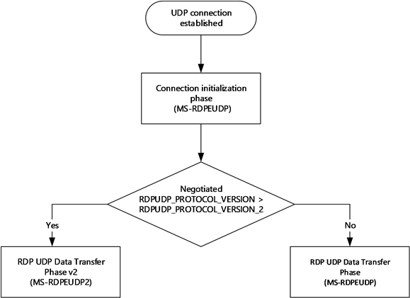
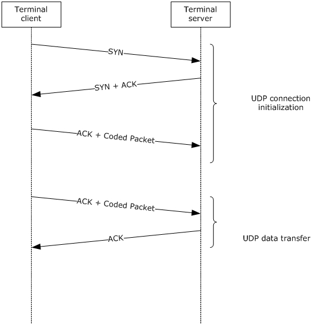

# RDP Client MS-RDPEUDP2  Test Design Specification 

## Contents

* [Technical Document Analysis](#_Toc350342292)
    * [Technical Document Overview](#_Toc350342293)
    * [Relationship to Other Protocols](#_Toc350342294)
    * [Prerequisites/Preconditions](#_Toc350342295)
    * [Messages](#_Toc350342296)
    * [Protocol Properties](#_Toc350342297)
* [Test Method](#_Toc350342298)
    * [Assumptions, Scope and Constraints](#_Toc350342299)
    * [Test Approach](#_Toc350342300)
    * [Test Scenarios](#_Toc350342301)
		* [S3_DataTransfer_v2](#_Toc350342302)
* [Test Suite Design](#_Toc350342303)
    * [Test Suite Architecture](#_Toc350342304)
		* [System under Test (SUT)](#_Toc350342305)
		* [Test Suite Architecture](#_Toc350342306)
    * [Technical Dependencies/Considerations](#_Toc350342307)
		* [Dependencies](#_Toc350342308)
		* [Technical Difficulties](#_Toc350342309)
		* [Encryption Consideration](#_Toc3503423010)
* [Test Cases Design](#_Toc350342311)
    * [Traditional Test Case Design](#_Toc350342312)
    * [Test Cases Description](#_Toc350342313)
		* [S3_DataTransfer_v2](#_Toc350342314)
* [Appendix](#_Toc350342315)
    * [Glossary (Optional)](#_Toc350342316)
    * [Reference](#_Toc350342317)

## <a name="_Toc350342292"/>Technical Document Analysis

### <a name="_Toc350342293"/>Technical Document Overview
The Remote Desktop Protocol: The RDP-UDP2 transport specifies an extension mode to the RDP-UDP transport defined in the document [MS-RDPEUDP]. This document describes the operational behaviors of the transport protocol when operating in the RDP-UDP2 mode. It has been designed to improve the performance of 
the network connectivity compared to a corresponding RDP-UDP connection and RDP-TCP connection, especially on wide area networks (WANs) or wireless networks with inherent packet loss noise.

It has the following two primary goals:

* Utilize a higher network bandwidth share while reducing the variation in packet transit delays.

* Share network resources fairly with other competing network flows.

To achieve these goals, the protocol shares some of the essential elements from both the RDP-UDP and the RDP-TCP protocols, but with improved flow control and loss-delay management. The RDPUDP2 transport is composed of a terminal client and terminal server which are treated as peers and 
operates with the same protocol throughout the life time of the entire session. The connection between the two endpoints is bidirectional; data and acknowledgments can be transmitted in both directions independently and simultaneously. Logically, each single RDP-UDP2 transport connection 
can be viewed as two unidirectional connections. Both of these unidirectional connections are symmetrical and each endpoint has both a Sender and a Receiver entity. In the following figure, the Sender from the Endpoint A and the Receiver from the Endpoint B form one connection, whereas the Sender from the Endpoint B and the Receiver from the Endpoint A form the other connection. This is 
similar to the RDP-UDP protocol.

### <a name="_Toc350342294"/>Relationship to Other Protocols 
The Remote Desktop Protocol: UDP Transport Extension Protocol works on top of the User Datagram Protocol (UDP).

### <a name="_Toc350342295"/>Prerequisites/Preconditions
This extension requires an RDP-UDP protocol to exist and its initialization phase to be completed. After this initialization phase, the flow of messages will be directed either through the RDP-UDP data transfer stack or the RDP-UDP2 data transfer stack, depending on the version check.

### <a name="_Toc350342296"/>Messages 
**Structures and Messages**

There are 9 structures described by this protocol.

* RDPUDP2\_HEADER 

* RDPUDP2\_OPTIONAL\_ACK_PAYLOAD

* RDPUDP2\_OPTIONAL\_OVERHEADSIZE_PAYLOAD

* RDPUDP2\_OPTIONAL\_DELAYACKINFO_PAYLOAD

* RDPUDP2\_OPTIONAL\_AOA_PAYLOAD

* RDPUDP2\_OPTIONAL\_DATAHEADER_PAYLOAD

* RDPUDP2\_OPTIONAL\_ACKVEC_PAYLOAD

* RDPUDP2\_OPTIONAL\_DATABODY_PAYLOAD

* RDPUDP2\_PACKET_PREFIX _BYTE

**Message Flows:** 

The two endpoints, the terminal client and the terminal server, first set up a connection.

After this phase is completed successfully and an RDPUDP_PROTOCOL_VERSION is negotiated, this value is used to determine which version of the UDP transport extension will be used for the Data Transfer phase. 

If the negotiated RDPUDP_PROTOCOL_VERSION is RDPUDP_PROTOCOL_VERSION_2 or earlier, the protocol enters the RDP-UDP Data Transfer phase, where Coded Packets are exchanged according to the protocol described in the [MS-RDPEUDP] document. 

If the negotiated RDPUDP_PROTOCOL_VERSION value is greater than RDPUDP_PROTOCOL_VERSION_2, the protocol enters the v2 Data Transfer phase, where Coded Packets are exchanged according to the protocol described in the current document.

This is described in the figure below.

The data transfer is described in the figure below, taken from section 1.3.2 Message Flows [MS-RDPEUDP]

### <a name="_Toc350342297"/>Protocol Properties
* MS-RDPEUDP2 is a block protocol and an extension of MS-RDPEUDP.

* The transport of MS-RDPEUDP2 is UDP.

* MS-RDPEUDP2 doesn’t have any authentication, encryption and compression methods.

## <a name="_Toc350342298"/>Test Method

### <a name="_Toc350342299"/>Assumptions, Scope and Constraints
**Assumptions:**

The RDP client machine should Support using RDP-UDP transport.

**Scope:**

* The protocol client endpoint (RDP client) playing the client role will be tested. For Windows, the Remote Desktop Client (MSTSC.exe) is the client endpoint.

* The protocol server endpoint (RDP Server) playing the server role is out of scope.

* For Windows, the System under Test (SUT) will be mstsc.exe.

* External protocols are out of scope.

* Compression and encryption are out of scope.

* Initiation and connection are out of scope as this has already been dealt with under [MS-RDPEUDP] tests.

**Constraint:**

* This extension requires an RDP-UDP protocol to exist and its initialization phase to be completed.

* If the negotiated RDPUDP_PROTOCOL_VERSION value is greater than RDPUDP_PROTOCOL_VERSION_2, the protocol enters the v2 Data Transfer phase, where Coded Packets are exchanged according to the protocol described in the current document.

* The RDP-UDP2 transport only supports reliable UDP mode. In this mode, any packet that has been detected as lost must be retransmitted. This transport does not include an FEC layer.

### <a name="_Toc350342300"/>Test Approach
Because the MS-RDPEUDP2 client test code is merged into the MS-RDPEUDP test code, it applies the same test approach used for MS-RDPBCGR: traditional testing. 

For more details about the reason for choosing traditional testing, please refer to MS-RDPBCGR_ClientTestDesignSpecificaitoin.docx.

### <a name="_Toc350342301"/>Test Scenarios
There is 1 scenario defined in the MS-RDPEUDP2 client test suite for verifying the client behavior. See Table 2-1 MS-RDPEUDP2 Test Suite Scenarios for more information.

|  **Scenario**|  **Priority**|  **Test Approach**|  **Description**| 
| -------------| -------------| -------------| ------------- |
| S3_DataTransfer_V2| 0| Traditional| Verify data transfer of RDPUDP Packet 2 over RDP-UDP connection.| 

_Table 2-1 MS-RDPEUDP Test Suite Scenarios_

#### <a name="_Toc350342302"/>S3_DataTransfer_v2
**Preconditions:**

* The RDP connection has been established.

**Typical Sequence:**

The typical scenario sequence is the following:

* RDP server and RDP client establish a RDP-UDP connection.

* RDP server sends RDPUDP2 packets over RDP-UDP connection

* RDP client sends RDPUDP2 packets to acknowledge the receipt of the sender packets, combined with data packets (which are both in the RDPUDP2 packet).

**Scenario Testing:**

This scenario will test the following messages:

* RDPUDP2 Packet (The acknowledgment packets for the received packets can be combined with the data packets in the same RDP-UDP2 packet because they are both sent to the same endpoint)

## <a name="_Toc350342303"/>Test Suite Design

### <a name="_Toc350342304"/>Test Suite Architecture

#### <a name="_Toc350342305"/>System under Test (SUT)
* From the third party point of view, the SUT is a component which implements MS-RDPEUDP.

* From the Windows implementation point of view, the SUT is the Remote Desktop Client (Mstsc.exe).

#### <a name="_Toc350342306"/>Test Suite Architecture
Figure 3-1 illustrates the architecture of the MS-RDPEUDP test suite for client endpoint testing.

 _Figure 3-1 MS-RDPEUDP Test Suite Architecture_
 
As shown in Figure 3-1, MS-RDPEUDP2 is using the synthetic server pattern to design the test suite architecture. MS-RDPEUDP2 Test Suite contains the following components:

* The SUT Control Adapter is used by the test case to trigger the client to send the request to the server.

* The synthetic server is the MS-RDPEUDP2 Test Case.

* The Test suite invokes the protocol SDK (test suite library) to process the client messages and then sends the corresponding server response message to the client.

* The MS-RDPEUDP Test Suite uses both TCP and UDP as the transport to communicate with SUT.

* The SUT for the MS-RDPEUDP2 Test Suite is the RDP Client.

The MS-RDPEUDP2 Test Case will verify the protocol client behaviors specified in MS-RDPEUDP2.

### <a name="_Toc350342307"/>Technical Dependencies/Considerations

#### <a name="_Toc350342308"/>Dependencies
Transport: Both TCP and UDP transport are used. The main RDP connection use TCP transport and the RDPEUDP messages are transmitted on UDP transport.

#### <a name="_Toc350342309"/>Technical Difficulties 
None.

#### <a name="_Toc350342310"/>Encryption Consideration
None.

## <a name="_Toc350342311"/>Test Cases Design

### <a name="_Toc350342312"/>Traditional Test Case Design 
The Traditional test approach is used to design all test cases. The test cases are designed to cover all in-scope testable requirements, including both positive and negative requirements. 

The following table shows the number of test cases for each scenario. 

|  **Scenario**|  **Test Cases**|  **BVTs**|  **P0**|  **P1**|  **P2**| 
| -------------| -------------| -------------| -------------| -------------| ------------- |
| S3_DataTransfer_V2| 4| 1| 3| 0| 0| 

### <a name="_Toc350342313"/>Test Cases Description 
The test suite is a synthetic RDP server. In the following descriptions, all instances of the term “Test Suite” can be understood as the RDP server.

**Common prerequisites for all test cases:**

* The test suite has established main RDP connection.

* The test suite has started the UDP listening service on the port which serves the RDP server.

**Common cleanup requirements:**

* The test suite disconnects all RDP connections if there any.

* The test suite stops the TCP and UDP listening service.

* The SUT deletes all data caches from previous RDP connections.   

The common prerequisites and clean requirements are not listed in any of the test cases. Only prerequisites and cleanup requirements unique to the test case are listed in the corresponding test case descriptions.

#### <a name="_Toc350342314"/>S3_DataTransfer_v2

##### Data Transfer Test

|  **S3_DataTransfer_v2**| | 
| -------------| ------------- |
|  **Test ID**| S3_DataTransfer_V2_ClientReceiveData| 
|  **Priority**| BVT| 
|  **Description** | Verify the RDP client can acknowledge the receipt of data from RDP-UDP connection| 
|  **Prerequisites**| N/A| 
|  **Test Execution Steps**| For Reliable  mode, do the following:| 
| | Test suite trigger RDP client to create a RDP-UDP, reliable (as MS-RDPEUDP2 only supports reliable UDP mode) transport mode.| 
| | In the connection and initiation phase, set UDP version to RDPUDP_PROTOCOL_VERSION_3.| 
| | In the RDP-UDP connection, Construct and send one **RDPUDP2 Packet (excluding optional payloads)**.| 
| | In the RDP-UDP connection, Expect RDP client response an RDPUDP2 Packet containing only the Acknowledgement Payload for proof of receipts of set packets. And verify:| 
| | Obtain both the channel sequence number and the sequence number from the received payload and verify its equal to the generated channel sequence mapped to the sent package.| 
|  **Cleanup**| N/A| 

|  **S3_DataTransfer_v2**| | 
| -------------| ------------- |
|  **Test ID**| S3_DataTransfer_V2_AcknowledgeLostPacket| 
|  **Priority**| P0| 
|  **Description** | Verify the RDP client will send a ACK to acknowledge the package loss when detect a package loss in a reliable connection| 
|  **Prerequisites**| N/A| 
|  **Test Execution Steps**| For Reliable and Lossy transport mode, do the following respectively:| 
| | Test suite trigger RDP client to create a RDP-UDP, reliable (as MS-RDPEUDP2 only supports reliable UDP mode) transport mode | 
| | Establish the RDPEMT connection.| 
| | In the RDP-UDP connection, create 3 sequential **RDPUDP2 Packets** and send only the first packet and last packet| 
| | The receiver responds with a Acknowledgement Vector payload with the missing **RDPUDP2 Packet** sequence number returned as the Base Sequence Number.| 
| | Confirm that the Data Sequence Number of the packet sent equals the Base Sequence Number of the Acknowledgement Vector payload.| | 
| | Test suite sends the lost **RDPUDP2 Packet**.| 
| | Expect a RDPUDP2 Packet to acknowledge the receipt of all  **RDPUDP2 Packets**  | 
|  **Cleanup**| N/A| 

|  **S3_DataTransfer_v2**| | 
| -------------| ------------- |
|  **Test ID**| S3_DataTransfer_V2_DataPacketWithACK| 
|  **Priority**| P0| 
|  **Description** | Verify that the final OnWire version of the RDP2 Packet sent is evaluated to a specific output as shared in Section 4.4.6 of the RDPEUDP2 document| 
|  **Prerequisites**| N/A| 
|  **Test Execution Steps**| For Reliable transport mode, do the following respectively:| 
| | Test suite trigger RDP client to create a RDP-UDP, reliable (as MS-RDPEUDP2 only supports reliable UDP mode) transport mode | 
| | Establish the RDPEMT connection.| 
| | In the RDP-UDP connection, test suite prepare one **RDPUDP2 Packet** with the packet values given in section 4.4 of the RDPEUDP2 document| 
| | Before sending the packet, verify that the on-wire version has been evaluated to the output given in section 4.4.6| 
| | Expect a RDPUDP2 Packet to acknowledge the receipt of  **RDPUDP2 Packet**  | 
|  **Cleanup**| N/A| 

## <a name="_Toc350342315"/>Appendix

### <a name="_Toc350342316"/>Glossary (Optional)
**SUT**: System under Test. In this spec, it indicates the MS-RDPEUDP2 client implementation.

**Test Suite**: The synthetic RDP server which is used to test against SUT.

### <a name="_Toc350342317"/>Reference

* Technical Document: **[MS-RDPEUDP2].pdf**