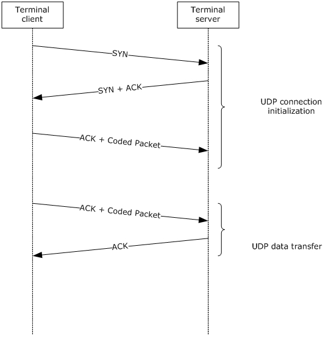
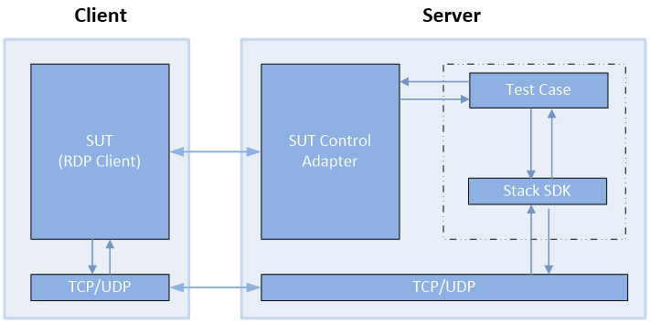

# RDP Client MS-RDPEUDP  Test Design Specification 

## Contents

* [Technical Document Analysis](#_Toc350342265)
    * [Technical Document Overview](#_Toc350342266)
    * [Relationship to Other Protocols](#_Toc350342267)
    * [Protocol Operations/Messages](#_Toc350342268)
    * [Protocol Properties](#_Toc350342269)
* [Test Method](#_Toc350342270)
    * [Assumptions, Scope and Constraints](#_Toc350342271)
    * [Test Approach](#_Toc350342272)
    * [Test Scenarios](#_Toc350342273)
		* [S1_Connection](#_Toc350342274)
		* [S2_DataTransfer](#_Toc350342275)
* [Test Suite Design](#_Toc350342276)
    * [Test Suite Architecture](#_Toc350342277)
		* [System under Test (SUT)](#_Toc350342278)
		* [Test Suite Architecture](#_Toc350342279)
    * [Technical Dependencies/Considerations](#_Toc350342280)
		* [Dependencies](#_Toc350342281)
		* [Technical Difficulties](#_Toc350342282)
		* [Encryption Consideration](#_Toc350342283)
* [Test Cases Design](#_Toc350342284)
    * [Traditional Test Case Design](#_Toc350342285)
    * [Test Cases Description](#_Toc350342286)
		* [S1_Connection](#_Toc350342287)
		* [S2_DataTransfer](#_Toc350342288)
* [Appendix](#_Toc350342289)
    * [Glossary (Optional)](#_Toc350342290)
    * [Reference](#_Toc350342291)

## <a name="_Toc350342265"/>Technical Document Analysis

### <a name="_Toc350342266"/>Technical Document Overview
The Remote Desktop Protocol: UDP Transport Extension Protocol has been designed to improve the performance of the network connectivity compared to a corresponding RDP-TCP connection, especially on wide area networks (WANs) or wireless networks.

It has the following two primary goals:

* Gain a higher network share while reducing the variation in packet transit delays.

* Share network resources with other users.

To achieve these goals, the protocol has two modes of operation. The first mode is a reliable mode where data is transferred reliably through persistent retransmits. The second mode is an unreliable mode, where no guarantees are made about reliability and the timeliness of data is preserved by avoiding retransmits. In addition, the Remote Desktop Protocol: UDP Transport Extension Protocol includes a forward error correction (FEC) logic that can be used to recover from random packet losses.

### <a name="_Toc350342267"/>Relationship to Other Protocols 
The Remote Desktop Protocol: UDP Transport Extension Protocol works on top of the User Datagram Protocol (UDP).

### <a name="_Toc350342268"/>Protocol Operations/Messages 
**Structures and Messages**

There are 7 structures described by this protocol.

* RDPUDP\_FEC_HEADER

* RDPUDP\_FEC\_PAYLOAD_HEADER 

* RDPUDP\_PAYLOAD_PREFIX 

* RDPUDP\_SOURCE\_PAYLOAD_HEADER 

* RDPUDP\_SYNDATA_PAYLOAD 

* RDPUDP\_ACK\_OF\_ACKVECTOR_HEADER 

* RDPUDP\_ACK\_OF\_ACKVECTOR_HEADER

There are 5 messages consisted of the above structures.

* SYN Datagrams

* ACK Datagrams

* SYN and ACK Datagrams

* ACK and Source Packets Data

* ACK and FEC Packets Data

**Message Flows:** 

The two endpoints, the terminal client and the terminal server, first set up a connection, and then transfer the data as shown in the following figure. 

### <a name="_Toc350342269"/>Protocol Properties
* RDPEUDP is a block protocol and an extension of MS-RDPBCGR.

* RDPEUDP specifies network connectivity between the user's machine and a remote computer system over the User Datagram Protocol (UDP).

* The transport of RDPEUDP is UDP.

* RDPEUDP doesn’t have any authentication, encryption and compression methods.

## <a name="_Toc350342270"/>Test Method

### <a name="_Toc350342271"/>Assumptions, Scope and Constraints
**Assumptions:**

The RDP client machine should Support using RDP-UDP transport.

**Scope:**

* The protocol client endpoint (RDP client) playing the client role will be tested. For Windows, the Remote Desktop Client (MSTSC.exe) is the client endpoint.

* The protocol server endpoint (RDP Server) playing the server role is out of scope.

* For Windows, the System under Test (SUT) will be mstsc.exe.

* External protocols are out of scope.

* Compression and encryption are out of scope.

**Constraint:**

There is no constraint for this Test Suite.

### <a name="_Toc350342272"/>Test Approach
Because the MS-RDPEUDP client test code is merged into the MS-RDPBCGR test code, it applies the same test approach used for MS-RDPBCGR: traditional testing. 

For more details about the reason for choosing traditional testing, please refer to MS-RDPBCGR_ClientTestDesignSpecificaitoin.docx.

### <a name="_Toc350342273"/>Test Scenarios
There are 2 scenarios defined in the MS-RDPEUDP client test suite for verifying the client behavior. See Table 2-1 MS-RDPEUDP Test Suite Scenarios for more information.

|  **Scenario**|  **Priority**|  **Test Approach**|  **Description**| 
| -------------| -------------| -------------| ------------- |
| S1_Connection| 0| Traditional| Verify the RDP-UDP connection phase and keep alive behavior.| 
| S2_DataTransfer| 0| Traditional| Verify data transfer over RDP-UDP connection.| 

_Table 2-1 MS-RDPEUDP Test Suite Scenarios_

#### <a name="_Toc350342274"/>S1_Connection
**Preconditions:**

* The RDP connection has been established.

**Typical Sequence:**

The typical scenario sequence is the following:

* RDP server sends a Server Initiate Multitransport Request PDU through main RDP connection (described in MS-RDPBCGR).

* RDP Client establish a UDP connection with the RDP server

* RDP client sends a SYN datagram over UDP connection.

* RDP server responds a SYN and ACK datagram over UDP connection.

* RDP client responds an ACK and source packet datagram over UDP connection.

**Scenario Testing:**

This scenario will test the following messages:

* SYN datagram

* SYN and ACK datagram

#### <a name="_Toc350342275"/>S2_DataTransfer
**Preconditions:**

* The RDP connection has been established.

**Typical Sequence:**

The typical scenario sequence is the following:

* RDP server and RDP client establish a RDP-UDP connection.

* RDP server sends ACK and source packets over RDP-UDP connection

* RDP client send ACK or ACK and source packets to acknowledge the receipt of these source packets.

**Scenario Testing:**

This scenario will test the following messages:

* ACK datagram

* ACK and Source datagram

## <a name="_Toc350342276"/>Test Suite Design

### <a name="_Toc350342277"/>Test Suite Architecture

#### <a name="_Toc350342278"/>System under Test (SUT)
* From the third party point of view, the SUT is a component which implements MS-RDPEUDP.

* From the Windows implementation point of view, the SUT is the Remote Desktop Client (Mstsc.exe).

#### <a name="_Toc350342279"/>Test Suite Architecture
Figure 3-1 illustrates the architecture of the MS-RDPEUDP test suite for client endpoint testing.

 _Figure 3-1 MS-RDPEUDP Test Suite Architecture_
 
As shown in Figure 3-1, MS-RDPEUDP is using the synthetic server pattern to design the test suite architecture. MS-RDPEUDP Test Suite contains the following components:

* The SUT Control Adapter is used by the test case to trigger the client to send the request to the server.

* The synthetic server is the MS-RDPEUDP Test Case.

* The Test suite invokes the protocol SDK (test suite library) to process the client messages and then sends the corresponding server response message to the client.

* The MS-RDPEUDP Test Suite uses both TCP and UDP as the transport to communicate with SUT.

* The SUT for the MS-RDPEUDP Test Suite is the RDP Client.

The MS-RDPEUDP Test Case will verify the protocol client behaviors specified in MS-RDPEUDP.

### <a name="_Toc350342280"/>Technical Dependencies/Considerations

#### <a name="_Toc350342281"/>Dependencies
Transport: Both TCP and UDP transport are used. The main RDP connection use TCP transport and the RDPEUDP messages are transmitted on UDP transport.

#### <a name="_Toc350342282"/>Technical Difficulties 
None.

#### <a name="_Toc350342283"/>Encryption Consideration
None.

## <a name="_Toc350342284"/>Test Cases Design

### <a name="_Toc350342285"/>Traditional Test Case Design 
The Traditional test approach is used to design all test cases. The test cases are designed to cover all in-scope testable requirements, including both positive and negative requirements. 

The following table shows the number of test cases for each scenario. 

|  **Scenario**|  **Test Cases**|  **BVTs**|  **P0**|  **P1**|  **P2**| 
| -------------| -------------| -------------| -------------| -------------| ------------- |
| S1_Connection| 2| 1| 1| 1| 0| 
| S2_DataTransfer| 8| 5| 5| 2| 1| 

### <a name="_Toc350342286"/>Test Cases Description 
The test suite is a synthetic RDP server. In the following descriptions, all instances of the term “Test Suite” can be understood as the RDP server.

**Common prerequisites for all test cases:**

* The test suite has established main RDP connection.

* The test suite has started the UDP listening service on the port which serves the RDP server.

**Common cleanup requirements:**

* The test suite disconnects all RDP connections if there any.

* The test suite stops the TCP and UDP listening service.

* The SUT deletes all data caches from previous RDP connections.   

The common prerequisites and clean requirements are not listed in any of the test cases. Only prerequisites and cleanup requirements unique to the test case are listed in the corresponding test case descriptions.

#### <a name="_Toc350342287"/>S1_Connection

##### Connection Initialization

|  **S1_Connection**| | 
| -------------| ------------- |
|  **Test ID**| S1_Connection_Initialization_InitialUDPConnection| 
|  **Priority**| P0| 
|  **Description** | Verify the RDP client can initiate a reliable RDP-UDP (RDP-UDP-R) connection and a lossy RDP-UDP (RDP-UDP-L) connection| 
|  **Prerequisites**| N/A| 
|  **Test Execution Steps**| For Reliable and Lossy transport mode, do the following respectively:| 
| | In the RDP-TCP connection, test suite sends a Server Initiate Multitransport Request PDU, and set its requestedProtocol field to INITITATE\_REQUEST\_PROTOCOL\_UDPFECR (0x01) or INITITATE\_REQUEST\_PROTOCOL_UDPFECL (0x02) according to its transport mode.| 
| | Test suite expect for a UDP connection from RDP client| 
| | In the UDP connection, Test suite expects a SYN datagram from RDP client, and verify:| 
| | The snSourceAck variable MUST be set to -1| 
| | uReceiveWindowSize must larger than 0.| 
| | The RDPUDP\_FLAG_SYN flag MUST be set.| 
| | If transport mode is reliable, the RDPUDP\_FLAG\_SYNLOSSY flag must not be set. Otherwise, the RDPUDP\_FLAG_SYNLOSSY flag must be set.| 
| | The uUpStreamMtu and uDownStreamMtu must be in [1132, 1232].| 
| | This datagram MUST be zero-padded to increase the size of this datagram to 1232 bytes.| 
| | In the UDP connection, test suite sends a SYN and ACK Datagram.| 
| | In the UDP connection, test suite expects a ACK Datagram to acknowledge the receipt of the SYN and ACK Datagram, verify:| 
| | The RDPUDP\_FLAG_ACK flag MUST be set| 
| | If contain source package, the sequence number must be **snInitialSequenceNumber** +1| 
|  **Cleanup**| N/A| 

|  **S1_Connection**| | 
| -------------| ------------- |
|  **Test ID**| S1_Connection_Initialization_InitialUDPConnection_UUDPVer1| 
|  **Priority**| P0| 
|  **Description** | Verify the RDP client can initiate a reliable RDP-UDP (RDP-UDP-R) connection and a lossy RDP-UDP (RDP-UDP-L) connection. Server supports only RDPUDP_PROTOCOL_VERSION_1.| 
|  **Prerequisites**| N/A| 
|  **Test Execution Steps**| For Reliable and Lossy transport mode, do the following respectively:| 
| | In the RDP-TCP connection, test suite sends a Server Initiate Multitransport Request PDU, and set its requestedProtocol field to INITITATE\_REQUEST\_PROTOCOL\_UDPFECR (0x01) or INITITATE\_REQUEST\_PROTOCOL_UDPFECL (0x02) according to its transport mode.| 
| | Test suite expect for a UDP connection from RDP client| 
| | In the UDP connection, Test suite expects a SYN datagram from RDP client, and verify:| 
| | The snSourceAck variable MUST be set to -1| 
| | uReceiveWindowSize must larger than 0.| 
| | The RDPUDP\_FLAG_SYN flag MUST be set.| 
| | If transport mode is reliable, the RDPUDP\_FLAG\_SYNLOSSY flag must not be set. Otherwise, the RDPUDP\_FLAG_SYNLOSSY flag must be set.| 
| | The uUpStreamMtu and uDownStreamMtu must be in [1132, 1232].| 
| | This datagram MUST be zero-padded to increase the size of this datagram to 1232 bytes.| 
| | In the UDP connection, test suite sends a SYN and ACK Datagram with UDP version set to RDPUDP_PROTOCOL_VERSION_1.| 
| | In the UDP connection, test suite expects a ACK Datagram to acknowledge the receipt of the SYN and ACK Datagram, verify:| 
| | The RDPUDP\_FLAG_ACK flag MUST be set| 
| | If contain source package, the sequence number must be **snInitialSequenceNumber** +1| 
|  **Cleanup**| N/A| 

|  **S1_Connection**| | 
| -------------| ------------- |
|  **Test ID**| S1_Connection_Initialization_InitialUDPConnection_UUDPVer2| 
|  **Priority**| P0| 
|  **Description** | Verify the RDP client can initiate a reliable RDP-UDP (RDP-UDP-R) connection and a lossy RDP-UDP (RDP-UDP-L) connection. Server supports highest version RDPUDP_PROTOCOL_VERSION_2.| 
|  **Prerequisites**| N/A| 
|  **Test Execution Steps**| For Reliable and Lossy transport mode, do the following respectively:| 
| | In the RDP-TCP connection, test suite sends a Server Initiate Multitransport Request PDU, and set its requestedProtocol field to INITITATE\_REQUEST\_PROTOCOL\_UDPFECR (0x01) or INITITATE\_REQUEST\_PROTOCOL_UDPFECL (0x02) according to its transport mode.| 
| | Test suite expect for a UDP connection from RDP client| 
| | In the UDP connection, Test suite expects a SYN datagram from RDP client, and verify:| 
| | The snSourceAck variable MUST be set to -1| 
| | uReceiveWindowSize must larger than 0.| 
| | The RDPUDP\_FLAG_SYN flag MUST be set.| 
| | If transport mode is reliable, the RDPUDP\_FLAG\_SYNLOSSY flag must not be set. Otherwise, the RDPUDP\_FLAG_SYNLOSSY flag must be set.| 
| | The uUpStreamMtu and uDownStreamMtu must be in [1132, 1232].| 
| | This datagram MUST be zero-padded to increase the size of this datagram to 1232 bytes.| 
| | In the UDP connection, test suite sends a SYN and ACK Datagram with UDP version set to RDPUDP_PROTOCOL_VERSION_1 | RDPUDP_PROTOCOL_VERSION_2.| 
| | In the UDP connection, test suite expects a ACK Datagram to acknowledge the receipt of the SYN and ACK Datagram, verify:| 
| | The RDPUDP\_FLAG_ACK flag MUST be set| 
| | If contain source package, the sequence number must be **snInitialSequenceNumber** +1| 
|  **Cleanup**| N/A| 

##### Connection Keep Alive

|  **S1_Connection**| | 
| -------------| ------------- |
|  **Test ID**| S1_Connection_Keepalive_ClientSendKeepAlive| 
|  **Priority**| p1| 
|  **Description** | Verify the RDP client can send Keep alive package to keep the connection | 
|  **Prerequisites**| N/A| 
|  **Test Execution Steps**| For Reliable and Lossy transport mode, do the following respectively:| 
| | Test suite trigger RDP client to create a RDP-UDP, reliable or lossy, depending on its transport mode.| 
| | Establish RDPEMT connection.| 
| | The test suite expects the client to send an ACK to acknowledge the receipt of the source packet (The source packet contain a RDP\_TUNNEL_CREATERESPONSE structure).| 
| | The test suite wait for 65/2 seconds, expects the client to send the ACK again as a keep alive packet.| 
|  **Cleanup**| N/A| 

#### <a name="_Toc350342288"/>S2_DataTransfer

##### Data Transfer Test

|  **S2_DataTransfer**| | 
| -------------| ------------- |
|  **Test ID**| S2_DataTransfer_ClientReceiveData| 
|  **Priority**| P0| 
|  **Description** | Verify the RDP client can acknowledge the receipt of data from RDP-UDP connection| 
|  **Prerequisites**| N/A| 
|  **Test Execution Steps**| For Reliable and Lossy transport mode, do the following respectively:| 
| | Test suite trigger RDP client to create a RDP-UDP, reliable or lossy, depending on its transport mode.| 
| | In the RDP-UDP connection, Test suite Send one **ACK and Source Packets Data**.| 
| | In the RDP-UDP connection, Expect RDP client response an ACK datagram to acknowledge the receipt of the source packets. And verify:| 
| | The RDPUDP_FLAG_ACK flag MUST be set.| 
| | ACK Vector in the RDPUDP_ACK_VECTOR_HEADER Structure|  
|  **Cleanup**| N/A| 

##### Acknowledge Test

|  **S2_DataTransfer**| | 
| -------------| ------------- |
|  **Test ID**| S2_DataTransfer_AcknowledgeTest_AcknowlegeLossyPackage| 
|  **Priority**| P0| 
|  **Description** | Verify the RDP client will send a ACK to acknowledge the package loss when detect a package loss in a reliable connection| 
|  **Prerequisites**| N/A| 
|  **Test Execution Steps**| For Reliable and Lossy transport mode, do the following respectively:| 
| | Test suite trigger RDP client to create a RDP-UDP, reliable or lossy, depending on its transport mode | 
| | Establish the RDPEMT connection.| 
| | In the RDP-UDP connection, test suite send one  **ACK and Source Packet**| 
| | Test suite creates an **ACK and Source Packet** as a lost packet and don’t send it.| 
| | Test suite send another two  **ACK and Source Packets**| 
| | Expect ACK datagrams from RDP client, to acknowledge the receipt of the 1st, 3rd, 4th packet and the loss of the 2nd package. | 
| | Test suite sends the lost **ACK and Source Packet**.| 
| | Expect a ACK datagrams to acknowledge the receipt of all  **ACK and Source Packets**  | 
|  **Cleanup**| N/A| 

|  **S2_DataTransfer**| | 
| -------------| ------------- |
|  **Test ID**| S2_DataTransfer_SequenceNumberWrapAround| 
|  **Priority**| P1| 
|  **Description** | Verify the RDP client will send ACK correctly when sequence number is wrapped around.| 
|  **Prerequisites**| N/A| 
|  **Test Execution Steps**| For Reliable and Lossy transport mode, do the following respectively:| 
| | Test suite trigger RDP client to create a RDP-UDP, reliable or lossy, depending on its transport mode. Set the snInitialSequenceNumber to uint.maxValue-3. | 
| | Establish the RDPEMT connection.| 
| | If the source sequence number is not wrapped around, send **ACK and Source Packet** until the sequence number wrapped around. | 
| | Test suite sends 3 **ACK and Source Packets**.| 
| | Expect an ACK datagram to acknowledge the receipt of all **ACK and Source Packets** correctly.|  
|  **Cleanup**| N/A| 

|  **S2_DataTransfer**| | 
| -------------| ------------- |
|  **Test ID**| S2_DataTransfer_ClientAckDelay| 
|  **Priority**| P1| 
|  **Description** | Verify the RDP client will send a ACK to acknowledge the package loss when detect a package loss in a reliable connection| 
|  **Prerequisites**| N/A| 
|  **Test Execution Steps**| For Reliable and Lossy transport mode, do the following respectively:| 
| | Test suite trigger RDP client to create a RDP-UDP, reliable or lossy, depending on its transport mode | 
| | Establish the RDPEMT connection.| 
| | In the RDP-UDP connection, test suite sends three **ACK and Source Packet,** wait 200 ms before each send.| 
| | Expect the ACK datagrams to acknowledge the receipt of the 3 **ACK and Source Packet**, at least one of them must contain  RDPUDP\_FLAG_ACKDELAYED flag.| 
|  **Cleanup**| N/A| 

##### Data Retransmit Test

|  **S2_DataTransfer**| | 
| -------------| ------------- |
|  **Test ID**| S2_DataTransfer_RetransmitTest_ClientRetransmit| 
|  **Priority**| P2| 
|  **Description** | Verify the RDP client can retransmit source package in the reliable RDP-UDP connection if not receiving ACK acknowledged for a specified time.| 
|  **Prerequisites**| N/A| 
|  **Test Execution Steps**| Test suite trigger RDP client to create a reliable RDP-UDP connection.| 
| | Test suite receive the first  **ACK and Source Packet,** which is from the third step of connection creation| 
| | Test suite sends an **ACK and Source Packet**, but not acknowledges the receipt of the 1st source packet.| 
| | Test suite wait for a while.| 
| | Test suite expects Client to resend the 1st **ACK and Source Packet.**|  
|  **Cleanup**| N/A| 

##### Security Channel Creation

|  **S2_DataTransfer**| | 
| -------------| ------------- |
|  **Test ID**| S2_DataTransfer_SecurityChannelCreation_ReliableConnection| 
|  **Priority**| P0| 
|  **Description** | Verify the TLS handshake process on the reliable RDP-UDP connection| 
|  **Prerequisites**| N/A| 
|  **Test Execution Steps**| Test suite trigger RDP client to create a reliable RDP-UDP connection| 
| | Complete TLS handshake.| 
| | Test suite expects for a ACK and Source Packets( The high-layer data is encrypted RDP_TUNNEL_CREATEREQUEST PDU);| 
|  **Cleanup**| N/A| 

|  **S2_DataTransfer**| | 
| -------------| ------------- |
|  **Test ID**| S2_DataTransfer_SecurityChannelCreation_LossyConnection| 
|  **Priority**| P0| 
|  **Description** | Verify the DTLS handshake process on the lossy RDP-UDP connection| 
|  **Prerequisites**| N/A| 
|  **Test Execution Steps**| Test suite trigger RDP client to create a lossy RDP-UDP connection| 
| | Complete DTLS handshake.| 
| | Test suite expects for a ACK and Source Packets( The high-layer data is encrypted RDP_TUNNEL_CREATEREQUEST PDU);|  
|  **Cleanup**| N/A| 

##### Congestion Control test

|  **S2_DataTransfer**| | 
| -------------| ------------- |
|  **Test ID**| S2_DataTransfer_CongestionControlTest_ClientReceiveData| 
|  **Priority**| P0| 
|  **Description** | Verify the RDP client support congestion control as a receiver.| 
|  **Prerequisites**| N/A| 
|  **Test Execution Steps**| For Reliable and Lossy transport mode, do the following respectively:| 
| | Test suite trigger RDP client to create a RDP-UDP, reliable or lossy, depending on its transport mode | 
| | Establish the RDPEMT connection.| 
| | In the RDP-UDP connection, test suite send one  **ACK and Source Packet**| 
| | Test suite creates an **ACK and Source Packet** as a lost packet and don’t send it.| 
| | Test suite send another 3  **ACK and Source Packets**| 
| | Test suite expect ACK datagrams, and RDPUDP_FLAG_CN flag is still set| 
| | Test suite send An  **ACK and Source Packets**, and set the RDPUDP_FLAG_CWR flag| 
| | Expect ACK datagrams, and RDPUDP_FLAG_CN flag is not set| 
|  **Cleanup**| N/A| 

## <a name="_Toc350342289"/>Appendix

### <a name="_Toc350342290"/>Glossary (Optional)
**SUT**: System under Test. In this spec, it indicates the MS-RDPEUDP client implementation.

**Test Suite**: The synthetic RDP server which is used to test against SUT.

### <a name="_Toc350342291"/>Reference

* Technical Document: **[MS-RDPEUDP].pdf**

