# RDP Client Test Suite User Guide

**Table of Contents**

[Introduction](#introduction)

[Getting Started with RDP Client Test Suite](#getting-started-with-rdp-client-test-suite)

-    [License Information](#license-information)

-    [Further Assistance](#further-assistance)

-    [RDP Client Test Suite Setup Overview](#rdp-client-test-suite-setup-overview)

      -    [Choosing the RDP Test Case Execution Method](#choosing-the-rdp-test-case-execution-method)

[Test Environment Requirements](#test-environment-requirements)

-    [Test Environment Computer Requirements](#test-environment-computer-requirements)

      -    [Driver Computer](#driver-computer)

      -    [System Under Test (SUT)](#system-under-test-sut)

      -    [Domain Controller](#domain-controller)

-    [Software Installation](#software-installation)

      -    [Required Prerequisite Software](#required-prerequisite-software)

      -    [RDP Client Test Suite Software Installation](#rdp-client-test-suite-software-installation)

            -    [Other RDP Client Test Suite Acquisition Methods](#other-rdp-client-test-suite-acquisition-methods)

      -    [Optional Software](#optional-software)

-    [Network Configuration](#network-configuration)

      -    [Network Infrastructure](#network-infrastructure)

      -    [Workgroup Environment](#workgroup-environment)

      -    [Domain Environment](#domain-environment)

-    [Verifying Test Environment Connectivity](#verifying-test-environment-connectivity)

[Setting up Test Environment Computers](#setting-up-test-environment-computers)

-    [Extracted Files and Folders](#extracted-files-and-folders)

-    [Setting Up the Driver Computer](#setting-up-the-driver-computer)

-    [Setting Up the Windows-Based SUT](#setting-up-the-windows-based-sut)

-    [Setting Up the Windows-Based Domain Controller](#setting-up-the-windows-based-domain-controller)

-    [Reviewing Installed Files and Folders](#reviewing-installed-files-and-folders)

-    [Configuring Windows Test Environment Computers](#configuring-windows-test-environment-computers)

-    [Configuring the SUT](#configuring-the-sut)

-    [Configuring the Driver Computer](#configuring-the-driver-computer)

-    [Configuring Non-Windows Test Environment Computers](#configuring-non-windows-test-environment-computers)

[Configuring the Test Suite](#configuring-the-test-suite)

-    [Required Configuration Settings](#required-configuration-settings)

      -    [Common Required Property Settings](#common-required-property-settings)

      -    [Property Settings Required for RDP Protocol Extension Test Cases](#property-settings-required-for-rdp-protocol-extension-test-cases)

            -    [MS-RDPBCGR Required Property Settings](#ms-rdpbcgr-required-property-settings)

            -    [MS-RDPEUSB Required Property Settings](#ms-rdpeusb-required-property-settings)

            -    [MS-RDPRFX Required Property Settings](#ms-rdprfx-required-property-settings)

            -    [MS-RDPEGFX Required Property Settings](#ms-rdpegfx-required-property-settings)

            -    [MS-RDPEDISP Required Property Settings](#ms-rdpedisp-required-property-settings)

            -    [MS-RDPEI Required Property Settings](#ms-rdpei-required-property-settings)

-    [Optional Configuration Settings](#optional-configuration-settings)

[Running Test Cases](#running-test-cases)

-    [Test Run Pre-Configuration](#test-run-pre-configuration)

      -    [Configuring Common Test Suite Mode Settings](#configuring-common-test-suite-mode-settings)

            -    [Controlling the RDP Client on a Windows SUT Computer](#controlling-the-rdp-client-on-a-windows-sut-computer)

            -    [Running Test Cases in the Test Suite Modes](#running-test-cases-in-the-test-suite-modes)

      -    [Configuring the Test Suite Mode for MS-RDPEI Events](#configuring-the-test-suite-mode-for-ms-rdpei-events)

            -    [Choosing a Test Suite Mode Setting for MS-RDPEI Test Cases](#choosing-a-test-suite-mode-setting-for-ms-rdpei-test-cases)

            -    [Running MS-RDPEI Test Cases in the Test Suite Modes](#running-ms-rdpei-test-cases-in-the-test-suite-modes)

      -    [Configuring the Test Suite Mode for MS-RDPEDISP Events](#configuring-the-test-suite-mode-for-ms-rdpedisp-events)

            -    [Choosing a Test Suite Mode Setting for MS-RDPEDISP Test Cases](#choosing-a-test-suite-mode-setting-for-ms-rdpedisp-test-cases)

            -    [Running MS-RDPEDISP Test Cases in the Test Suite Modes](#running-ms-rdpedisp-test-cases-in-the-test-suite-modes)

-    [Running Verification Tests](#running-verification-tests)

-    [Running All Test Cases](#running-all-test-cases)

-    [Running Specific Test Cases](#running-specific-test-cases)

-    [Example: Running Test Cases in Interactive Mode](#example-running-test-cases-in-interactive-mode)

-    [Example: Running RDPEI Test Cases in Interactive Mode](#example-running-rdpei-test-cases-in-interactive-mode)

-    [Viewing Test Results](#viewing-test-results)

-    [Running and Debugging Test Cases with Visual Studio](#running-and-debugging-test-cases-with-visual-studio)

[Using Protocol Test Manager](#using-protocol-test-manager)

-    [Installing the Protocol Test Manager](#installing-the-protocol-test-manager)

-    [Running the Protocol Test Manager](#running-the-protocol-test-manager)

      -    [Monitoring Test Case Execution](#monitoring-test-case-execution)

      -    [Running the Test Cases](#running-the-test-cases)

      -    [Reviewing the Test Results](#reviewing-the-test-results)

            -    [Test Results Output Status Indicators](#test-results-output-status-indicators)

            -    [StandardOut Category Status Indicators](#standardout-category-status-indicators)

            -    [ErrorStackTrace Category](#errorstacktrace-category)

            -    [ErrorMessage Category](#errormessage-category)

-    [Other PTM Configuration and Execution Methods](#other-ptm-configuration-and-execution-methods)

      -    [Manual Configuration of Test Cases and Properties](#manual-configuration-of-test-cases-and-properties)

      -    [Working with Profiles](#working-with-profiles)

            -    [Saving a Profile](#saving-a-profile)

            -    [Loading a Profile](#loading-a-profile)

      -    [Executing Test Cases from the Command Line](#executing-test-cases-from-the-command-line)

[Viewing RDP Output Data with Message Analyzer](#viewing-rdp-output-data-with-message-analyzer)

-    [Install and Configure Microsoft Message Analyzer](#install-and-configure-microsoft-message-analyzer)

-    [Capturing RDP Traffic with Microsoft Message Analyzer](#capturing-rdp-traffic-with-microsoft-message-analyzer)

[Troubleshooting](#troubleshooting)

-    [Ping Failure](#ping-failure)

-    [Test Run Issues](#test-run-issues)

-    [RDPEUSB Test Cases Fail](#rdpeusb-test-cases-fail)

-    [RDPEUDP and RDPEMT Test Cases Fail](#rdpeudp-and-rdpemt-test-cases-fail)

-    [RDPBCGR Test Cases Fail When Running in PowerShell Mode](#rdpbcgr-test-cases-fail-when-running-in-powershell-mode)

-    [RDPEGFX Test Cases Require H264 Enabled on SUT](#rdpegfx-test-cases-require-h264-enabled-on-sut)

-    [Test Cases Fail When Using the TLS or CredSSP Protocol](#test-cases-fail-when-using-the-tls-or-credssp-protocol)

[Resources and References](#resources-and-references)

**List of Figures**

[Figure 1. Workgroup Environment architecture](#figure-1-workgroup-environment-architecture)

[Figure 2. Domain Environment architecture](#figure-2-domain-environment-architecture)

[Figure 3. RDPConnectWithNegotiationApproach dialog](#figure-3-rDPConnectWithNegotiationApproach-dialog)

[Figure 4. TriggerClientDisconnectAll dialog](#figure-4-triggerclientdisconnectall-dialog)

[Figure 5. RDP Touch screen prompt](#figure-5-rdp-touch-screen-prompt)

[Figure 6. RDP Touch screen response](#figure-6-rdp-touch-screen-response)

[Figure 7. Protocol Test Manager: Launching the Configuration Wizard for RDP Client Test Suite](#figure-7-protocol-test-manager-launching-the-configuration-wizard-for-rdp-client-test-suite)

[Figure 8. Protocol Test Manager: Selecting RDP Client Test Suite Folder Path](#figure-8-protocol-test-manager-selecting-rdp-client-test-suite-folder-path)

[Figure 9. Protocol Test Manager: Reviewing the RDP Test Suite family of protocols](#figure-9-protocol-test-manager-reviewing-the-rdp-test-suite-family-of-protocols)

[Figure 10. Protocol Test Manager: Choosing the configuration method](#figure-10-protocol-test-manager-choosing-the-configuration-method)

[Figure 11. Protocol Test Manager: Verifying SUT connection parameters](#figure-11-protocol-test-manager-verifying-sut-connection-parameters)

[Figure 12. Protocol Test Manager: Reviewing the Detection Results](#figure-12-protocol-test-manager-reviewing-the-detection-results)

[Figure 13. Protocol Test Manager: Selecting (filtering) Test Cases](#figure-13-protocol-test-manager-selecting-filtering-test-cases)

[Figure 14. Protocol Test Manager: Reviewing/configuring Test Case properties](#figure-14-protocol-test-manager-reviewingconfiguring-test-case-properties)

[Figure 15. Protocol Test Manager: Configuring the Adapters](#figure-15-protocol-test-manager-configuring-the-adapters)

[Figure 16. Protocol Test Manager: Running the selected Test Cases](#figure-16-protocol-test-manager-running-the-selected-test-cases)

[Figure 17. Protocol Test Manager: Removing Test Cases from execution](#figure-17-protocol-test-manager-removing-test-cases-from-execution)

[Figure 18. Protocol Test Manager: Context menu commands for Test Case execution](#figure-18-protocol-test-manager-context-menu-commands-for-test-case-execution)

[Figure 19. Protocol Test Manager: RDP Category grouping \| Expanded ErrorMessage result](#figure-19-protocol-test-manager-rdp-category-grouping--expanded-errormessage-result)

[Figure 20. Protocol Test Manager: RDP BVT test category \| StandardOut node](#figure-20-protocol-test-manager-rdp-bvt-test-category--standardout-node)

[Figure 21. Protocol Test Manager: Case List HTML test results display](#figure-21-protocol-test-manager-case-list-html-test-results-display)

[Figure 22. Protocol Test Manager: Saving a test case Profile](#figure-22-protocol-test-manager-saving-a-test-case-profile)

[Figure 23. Message Analyzer Select Items to Import dialog](#figure-23-message-analyzer-select-items-to-import-dialog)

[Figure 24. Message Analyzer session message providers](#figure-24-message-analyzer-session-message-providers)

[Figure 25. Message Analyzer trace results with filtering](#figure-25-message-analyzer-trace-results-with-filtering)

[Figure 26. Message Analyzer Grouping viewer with RDP data](#figure-26-message-analyzer-grouping-viewer-with-rdp-data)

[Figure 27. Message Analyzer Grouping viewer analysis](#figure-27-message-analyzer-grouping-viewer-analysis)

# Introduction

This User Guide provides the fundamentals for using the **RDP Client
Endpoint Test Suite**, hereinafter referred to as the **RDP Client Test
Suite** or simply the **Test Suite**. In this guide, you will learn how
to do the following:

-   Configure the network for the Test Environment.

-   Set up the **Driver** computer, **SUT** computer (system under
    test), and optionally a **DC** computer.

-   Install and configure the **Test Suite**.

-   Choose the test execution method (.ps1 scripts or UI-based) and
    define a Test Case configuration.

-   Run the Test Cases to exercise the functions of various RDP protocol
    implementations.

-   Review output data logs or use the output data displays in Protocol
    Test Manager (PTM) for analysis.

The **RDP Client Endpoint Test Suite** is designed to test
implementations of the following protocols, the documentation for which
is located on the [Technical
Documents](https://docs.microsoft.com/en-us/openspecs/windows_protocols/MS-WINPROTLP/e36c976a-6263-42a8-b119-7a3cc41ddd2a)
site:

-   \[MS-RDPBCGR\]: Remote Desktop Protocol: Basic Connectivity and
    Graphics Remoting Specification

-   \[MS-RDPEUSB\]: Remote Desktop Protocol: USB Devices Virtual Channel
    Extension

-   \[MS-RDPEVOR\]: Remote Desktop Protocol: Video Optimized Remoting
    Virtual Channel Extension

-   \[MS-RDPRFX\]: Remote Desktop Protocol: RemoteFX Codec Extension

-   \[MS-RDPEUDP\]: Remote Desktop Protocol: UDP Transport Extension

-   \[MS-RDPEMT\]: Remote Desktop Protocol: Multitransport Extension

-   \[MS-RDPEI\]: Remote Desktop Protocol: Input Virtual Channel
    Extension

-   \[MS-RDPEGFX\]: Remote Desktop Protocol: Graphics Pipeline Extension

-   \[MS-RDPEDISP\]: Remote Desktop Protocol: Display Update Virtual
    Channel Extension

-   \[MS-RDPEDYC\]: Remote Desktop Protocol: Dynamic Channel Virtual
    Channel Extension

-   \[MS-RDPEGT\]: Remote Desktop Protocol: Geometry Tracking Virtual
    Channel Protocol Extension

 The content of this User
Guide is organized under the following major topics:

&emsp;&emsp;[Getting Started with the RDP Client Test Suite](#getting-started-with-rdp-client-test-suite)

&emsp;&emsp;[Test Environment Requirements](#test-environment-requirements)

&emsp;&emsp;[Setting Up Test Environment Computers](#setting-up-test-environment-computers)

&emsp;&emsp;[Configuring the Test Suite](#configuring-the-test-suite)

&emsp;&emsp;[Running Test Cases](#running-test-cases)

&emsp;&emsp;[Using the Protocol Test Manager](#using-protocol-test-manager)

&emsp;&emsp;[Viewing RDP Output Data with Message Analyzer](#viewing-rdp-output-data-with-message-analyzer)

&emsp;&emsp;[Troubleshooting](#troubleshooting)

&emsp;&emsp;[Resources and References](#resources-and-references)

*More Information*

**To learn more** about the Test Suite and Test Environment in which
protocol implementations are tested, you can link off to the following
documents from the [Resources and References](#resources-and-references) section of this User Guide.

-   RDP Overview Client Test Design Specification --- learn more about
    **RDP Client Test Suite** design.

-   Getting Started Guide for PTF --- learn more about the common
    environment in which Test Cases are run for all Test Suites.

Important

The **RDP Client Test Suite** tests protocol implementation behaviors
that are observable on the wire only.

# Getting Started with RDP Client Test Suite

To help you get started with the tasks that must be completed to set up
the **RDP Client Test Suite** and the test environment in which it
operates, this User Guide provides a setup overview that lays out all
the required tasks in a tabular-checklist format.

The tasks are organized by the order in which they should be performed.
A brief description of each task is accompanied by a link to the section
of this User Guide in which the task procedures are specified.

The task overview is just ahead in the topic [RDP Client Test Suite
Setup Overview](#rdp-client-test-suite-setup-overview).

## License Information

For licensing information, an End User License Agreement (EULA) is
provided with this **Test Suite**. It is located in the License.rtf file
in the installation folder; see [Reviewing Installed Files and
Folders](#reviewing-installed-files-and-folders).

## Further Assistance

If you need further information about this **Test Suite** or assistance
in troubleshooting issues related to this **Test Suite**, contact
<dochelp@microsoft.com>.

## RDP Client Test Suite Setup Overview

The following table summarizes the tasks that are required to get the
**RDP Client** **Test Suite** and supporting computers up and running.
Each task in the list also provides one or more links to related topics
in this User Guide that you can review prior to actually performing the
tasks. After you review (or complete) each task, you can optionally
print out the table below as a template and you can optionally check off
completed items in the Table below that you have printed out as a
template.

Note

For the [**Workgroup**](#workgroup-environment) environment, skip all
tasks that are related to domain controller (DC) setup and
configuration.

**Table 1. Overview of RDP Test Suite setup tasks**

| **Check** | **Task**                  | **Topic/Description**     |
|-----------|---------------------------|---------------------------|
| □ | Download the test suite for the protocol implementation. | For a list of the files that the download package contains, see [Extracted Files and Folders](#extracted-files-and-folders).|
| □ | Confirm that your Test Environment and computers meet the requirements of the **RDP Client Test Suite**. | For Test Environment requirements information about the RDP Client Test Suite, see [Test Environment Computer Requirements](#test-environment-computer-requirements). |
| □ | Install the software prerequisites. | For information about software that must be installed on the computers in your Test Environment before the **RDP Client Test Suite** is installed, see [Software Installation](#software-installation). |
| □ | Set up the **Driver** computer.| See [Setting Up the Driver Computer](#setting-up-the-driver-computer). The **RDP Client Test Suite** will be installed on the **Driver** computer in the procedure of this section. From the **Driver** computer, you will use the **Test Suite** to run the Test Cases that test the protocol implementations on the **SUT** computer.  **Note** After the installation is complete, the Driver installation files will be in the directory location specified in [Reviewing Installed Files and Folders](#reviewing-installed-files-and-folders). |
| □ | Set up the **SUT** computer (system under test). | See [Setting Up the Windows-Based SUT](#setting-up-the-windows-based-sut).  The **RDP Client Test Suite** will be installed on the **SUT** computer in the procedure of this section. This computer will host the protocol implementations under test.   **Note**  After the installation is complete, the **SUT** installation files will be in the directory location specified in [Reviewing Installed Files and Folders](#reviewing-installed-files-and-folders). |
| □ | Set up the Domain Controller (**DC**)(optional). | See [Setting Up the Windows-Based Domain Controller](#setting-up-the-windows-based-domain-controller).  In this section, you will set up the **DC** by installing Active Directory Domain Services.
| □ | Set up the network and choose the working environment. | See [Network Configuration](#network-configuration).  In this section, you will review the Network Infrastructure requirements and choose either the **Domain** or **Workgroup** environment in which to run the **RDP Client Test Suite**. |
| □ | Verify connectivity among all test environment computers. | See [Verifying Test Environment Connectivity](#verifying-test-environment-connectivity).   In this section, you will use the Ping command to verify connectivity of all the computers in your test environment. |
| □ | Configure the **SUT** computer. | See [Configuring Windows Test Environment Computers](#configuring-windows-test-environment-computers) and [Configuring the SUT](#configuring-the-sut). The latter section specifies the preliminary configuration tasks that you will perform on the **SUT** computer.  **Note**  To configure a non-Windows based computer as **SUT**, see below. |
| □ | Configure the **Driver** computer. | See [Configuring the Driver Computer](#configuring-the-driver-computer).  This section specifies the preliminary configuration tasks that you will perform on the **Driver** computer. |
| □ | Configure non-Windows based computers, including the optional **DC**, that is, if it is not using the Windows operating system. | See [Configuring Non-Windows Test Environment Computers](#configuring-non-windows-test-environment-computers). This section describes limited configuration tasks that you can perform on the **DC** and the **SUT** computers, as this User Guide does not provide detailed instructions for non-Windows configuration. |
| □ | Configure the **RDP Client Test Suite** settings. | See [Configuring the Test Suite](#configuring-the-test-suite).  In this section, you will validate or change default configuration settings and property values that are set during the **RDP Client Test Suite** installation.  This can include unique test environment and **Test Suite** settings and others, to accommodate your Test Environment or to customize your Test Case runs. |
| □ | Configure **RDP Client Test Suite** mode settings | See [Test Run Pre-Configuration](#test-run-pre-configuration).  In this section, you will configure common Test Suite mode settings along with mode settings for specific protocols such as RDPEI and RDPEDISP. |
| □ | Run Verification tests as a pre-execution check of **RDP Client Test Suite** readiness.  | See [Running Verification Tests](#running-verification-tests).  In this section, you will run command-based build verification tests (BVT), also known as [scenario S1 tests](https://github.com/microsoft/WindowsProtocolTestSuites/blob/main/TestSuites/RDP/Client/docs/RDP_Overview_ClientTestDesignSpecification.md), to verify that the **RDP Client Test Suite** is properly configured and ready to run Test Cases. |
| □ | Choose how you will run the preconfigured Test Cases of the **RDP Client Test Suite**. | See [Choosing the RDP Test Case Execution Method](#choosing-the-rdp-test-case-execution-method). |
| | | |

### Choosing the RDP Test Case Execution Method

After you complete all the tasks specified in the [RDP Client Test Suite
Setup Overview](#rdp-client-test-suite-setup-overview), you are ready to
run the preconfigured Test Cases via command line scripts (.ps1), or you
may use the Protocol Test Manager (PTM) UI-based tool to automate or
simplify the performance of various functions.

Among the most important of these functions are the following:

-   Reviewing the execution environment (**Domain** or **Workgroup**).

-   Automatically detecting, inspecting, and validating the **SUT**
    computer environment configuration and capabilities for test
    readiness.

-   Creating a default set of Test Cases, based on the assessed **SUT**
    environment.

-   Selecting (filtering) Test Cases to create an execution test set.

-   Executing Test Cases.

-   Viewing test results with built-in output data analysis features.

*More Information*

To execute Test Cases via .ps1 scripts, see [Running All Test
Cases](#running-all-test-cases) and [Running Specific Test
Cases](#running-specific-test-cases).

To execute Test Cases via the **PTM**, see [Using the Protocol Test
Manager](#using-protocol-test-manager).

Tips

Once you have the **PTM** set up with specific set of Test Cases that
you run repeatedly for a particular purpose, you can save the test set
as a **Profile** and thereafter trigger Test Cases to run on demand from
the command line, as described in [Working with a Profile](#working-with-profiles).

You can also use the **Load Profile** feature of **PTM** to load the
Test Cases of a previously save **Profile** into PTM to run a baseline
set of Test Cases, for example to troubleshoot RDP protocol
implementation changes.

Note that the built-in Test Case results viewing and analysis features
of **PTM** can help you to very quickly identify issues and failures
that occurred during test execution, as described in [Reviewing the Test
Results](#reviewing-the-test-results).

# Test Environment Requirements

This section describes the requirements for the Test Environment in
which the **RDP Client Test Suite** operates. The Test Environment
architecture can consist of two different types, as described
immediately below. The circumstances in which you might choose one over
the other are also described here:

-   **Workgroup Environment** --- you might choose the **Workgroup
    Environment** if you are new to the protocol Test Suites or if you
    want to simplify the setup and environment in which to perform Test
    Cases.

-   **Domain Environment** --- you might need to choose the **Domain
    Environment** if your RDP protocol implementations require Active
    Directory for certain Test Cases.

    You may also choose the **Domain Environment** if you want to run Test
    Cases against your implementation in a more comprehensive environment
    that more closely resembles a real world environment containing a
    Domain Controller.

To review the architectures of these environments, see the [Workgroup
Environment](#workgroup-environment) and [Domain Environment](#domain-environment) topics. Hardware and other
requirements for these environments are described ahead in [Test
Environment Computer
Requirements](#test-environment-computer-requirements).

 The major topics covered
in this section include the following:

&emsp;&emsp;[Test Environment Computer Requirements](#test-environment-computer-requirements)

&emsp;&emsp;[Software Installation](#software-installation)

&emsp;&emsp;[Network Configuration](#network-configuration)

&emsp;&emsp;[Verifying Test Environment Connectivity](#verifying-test-environment-connectivity)

Important

The section that follows specifies the Test Environment requirements for
Windows-based computers only, which includes **Driver**, **SUT**, and
**Domain Controller** computers. However, it is permissible for the
**SUT** computer to be running a non-Windows operating system version,
although this User Guide provides no information about such
configurations.

Also, please be advised that a **Workgroup Environment** does not
require a domain controller (DC) and that in a **Domain Environment**,
the **DC** can be located on the **SUT** computer.

## Test Environment Computer Requirements

If you run the **RDP Client Test Suite** in a **Domain Environment**, it
should contain the following physical or virtual computers:

-   **Driver computer** --- This computer hosts the **RDP Client Test
    Suite**, from which Test Case execution is launched. It is
    recommended to run the Windows Server 2019 operating system on the
    **Driver** computer. See [Driver Computer](#driver-computer) for
    more requirements information.

-   **SUT computer** --- This computer hosts the RDP protocol
    implementations to be tested by the **RDP Test Suite**. It is
    recommended to run the Windows 10 Client operating system on the
    **SUT** computer. See [System Under Test
    (SUT)](#system-under-test-sut) for more requirements information.

-   **DC computer** --- this computer is configured as a domain
    controller (DC). If this computer is running Windows, it must be the
    Windows Server 2008 R2 operating system version or later. See
    [Domain Controller](#domain-controller) for more requirements
    information.

If you run the **RDP Client Test Suite** in a **Workgroup Environment**,
it should contain the following physical or virtual computers:

-   A **Driver** computer --- same as above.

-   An **SUT** computer --- same as above.

Important

Test Cases that require the Interactive mode to run do not execute
automatically. If your SUT is running a non-Windows based operating
system, be sure that your installation conforms with the requirements
that apply to your operating system by reviewing the special test
environment requirements in the table below.

The table that follows outlines various constraints that apply in the
Test Environment when executing Test Cases for certain protocols. These
constraints include the need to run the Test Cases against RDPEUSB and
RDPEI implementations in the **Interactive** mode, where some manual
operations must be performed by the user in order to continue test
execution.

Note

If you are using the Protocol Test Manager (PTM) for execution of Test
Cases, you can set an adapter to the **Interactive** mode as part of
test setup in the PTM Wizard. However, you should only select
**RDPEUSB** or **RDPEI** under the **Protocol** node on the **Filter
Test Cases** page of the PTM Wizard to ensure execution of the specific
Test Cases that require user interaction. Otherwise, Test Cases for
other selected protocols will unnecessarily display interactive dialogs
for each Test Case.

If you are using batch command scripts for execution of Test Cases, you
can set the Interactive mode for the Test Suite in the
RDP_ClientTestSuite.ptfconfig configuration file, as described in
[Configuring Common Test Suite Mode
Settings](#configuring-common-test-suite-mode-settings).

**Table 2. Test environment special execution requirements**

| **Implementation Test Cases** | **Requirements**                    |
|-------------------------------|-------------------------------------|
| MS-RDPEUSB | - **SUT** must be a physical machine. - One OSR USB FX2 board needs to be plugged into the SUT computer before running the MS-RDPEUSB Test Cases.  - Purchase an OSR USB FX2 board at the [OSR Online Store](https://store.osr.com/) and install it.   - Test Cases for RDPEUSB implementations must use the Interactive mode. |
| MS-RDPEI | - The **SUT** must be touch-enabled.  - Test Cases for RDPEI implementations must use the Interactive mode, as described in [Running MS-RDPEI Test Cases in the Test Suite Modes](#running-ms-rdpei-test-cases-in-the-test-suite-modes). |
| MS-RDPEVOR | The **SUT** must be running the Windows 8.1 or later operating system.  |
| MS-RDPEDISP | The **SUT** operating system must support display configuration changes, including:   &emsp;&emsp;- Addition, removal, and repositioning of monitors.   &emsp;&emsp;- Resolution and orientation updates.  &emsp;&emsp;- Enable Enhanced Session Mode to connect to the SUT VM in Hyper-V. |
|                               |                                     |

### Driver Computer

The minimum requirements for the **Driver** **computer** are listed in
the table that follows.

**Table 3. Driver computer requirements**

| **Requirement**  | **Description**                                  |
|------------------|--------------------------------------------------|
| Operating system | It is recommended to run the Windows Server 2019 operating system on the **Driver** computer. However, it can also be running any Windows operating system version, such as Windows 8.1 client or Windows Server 2012 R2 and later, and be running Linux-based operation system, such as Ubuntu 18.04 or Ubuntu 20.04. All the operating systems would install [.NET 8.0](https://dotnet.microsoft.com/download/dotnet/8.0/). |
| Memory           | 2 GB RAM                                         |
| Disk space       | 60 GB                                            |
|                  |                                                  |

### System Under Test (SUT)

The minimum requirements for the **SUT** computer are listed in the
table that follows.

Note

If your **SUT** is running a non-Windows based operating system, be sure
that your installation conforms with the requirements that apply to your
operating system, by reviewing the special test environment requirements
table in [Test Environment Computer
Requirements](#test-environment-computer-requirements).

**Table 4. SUT computer requirements**

| **Requirement**  | **Description**                                  |
|------------------|--------------------------------------------------|
| Operating system | It is recommended to run the Windows 10 Client operating system on the SUT computer. However, given that this computer has some flexibility as the system under test (SUT), it can also be running the Windows 8.1 client and later or Windows Server 2012 R2 and later operating system, with support for the MSTSC command line tool. Note that the SUT computer could be running a non-Windows based operating system version as well. All the operating systems would install [.NET 8.0](https://dotnet.microsoft.com/download/dotnet/8.0/). |
| Memory           | 1 GB RAM                                         |
| Disk space       | 60 GB                                            |
|                  |                                                  |

### Domain Controller

The minimum requirements for the **DC** are listed in the table that
follows.

**Table 5. DC computer requirements**

| **Requirement**  | **Description**                                  |
|------------------|--------------------------------------------------|
| Operating system | It is recommended to run the Windows Server 2012 R2 operating system version or later on the **DC** computer, although a non-Windows base operating system is permissible. Note that the **DC** can be on the **SUT**, although this configuration could interfere with the Test Case execution requirements of certain protocols, as described in the table of the [Test Environment Computer Requirements](#test-environment-computer-requirements) section of this document. |
| Services         | Domain directory service, such as Windows Active Directory Domain Services (AD DS). |
| Memory           | 1 GB RAM                                         |
| Disk space       | 60 GB                                            |
|                  |                                                  |

## Software Installation

The required prerequisite software specified in this section must be
installed on the **Driver** computer *before* installing the **RDP
Client Test Suite**. Other specified software is optional. As of this
writing, the latest Test Suite version is 4.23.9.0.

### Required Prerequisite Software

The required software for running any Windows Protocol Test Suite is
listed in the *Prerequisites* section of the Windows Protocol Test
Suites
[Readme](https://github.com/microsoft/WindowsProtocolTestSuites/blob/main/README.md)
documentation on GitHub. You can install the prerequisites with the
**InstallPrerequisites.ps1** PowerShell script that you will find on
[this
page](https://github.com/microsoft/WindowsProtocolTestSuites/tree/main/InstallPrerequisites).

In addition, the following is required software:

-   Windows PowerShell 3.0 or later --- enables you to run Test Cases
    with .ps1 script files.

Note

Windows PowerShell is installed by default with every Windows 7 SP1 and
later operating system and with every Windows Server 2008 R2 SP1 and
later operating system. However, if you need to ensure that you have the
latest version of PowerShell, go to [Installing PowerShell on
Windows](https://docs.microsoft.com/en-us/powershell/scripting/install/installing-powershell-core-on-windows?view=powershell-7).

### RDP Client Test Suite Software Installation

The **RDP Client Test Suite** software consists of single installation
package (.zip) that you extract separately on both the **Driver
computer** and **SUT computer** with specific installation options for
each.

You will find the official **RDP Test Suite** installers
[here](https://github.com/microsoft/WindowsProtocolTestSuites/releases)
under the *Assets* topic on GitHub, which includes the
**RDP-TestSuite-ClientEP.zip** and **PTMCli.zip** files.

#### **Other RDP Client Test Suite Acquisition Methods**

You can utilize other options to acquire the **RDP Client Test Suite**,
as described below:

**Cloning a Repository** --- you can clone (copy) the GitHub repository
for the **RDP Client** **Test Suite** to create a locally-synched copy
on your computer, as described in [Cloning a
Repository](https://docs.github.com/en/github/creating-cloning-and-archiving-repositories/cloning-a-repository).
From the cloned copy of **Test Suite** files, you can use the
**build.ps1** file to build the RDP client, RDP server, and the Protocol
Test Manager separately.

Note

If you are planning to create your own Test Cases, you might want to
review [Running and Debugging Test Cases With Visual
Studio](#running-and-debugging-test-cases-with-visual-studio) for more
information.

**Building a Test Suite** --- you can also build the **RDP Client Test
Suite** from the open source code with the use of the **build. ps1**
file, which enables you to create the **Test Suite** and **Protocol Test
Manager** components.

*More Information*

**To learn more** about the RDP source code, see the [RDP
source](https://github.com/microsoft/WindowsProtocolTestSuites/tree/main/TestSuites/RDP)
for Client and Server components which includes the RDP_client.sln and
RDP_server.sln solution files for creating associated projects in
[Visual Studio 2017
Community](https://aka.ms/vs/15/release/vs_community.exe) version. You
can download the source code from [this
page](https://github.com/microsoft/WindowsProtocolTestSuites/releases).

**To learn more** about creating Test Suites, see *Creating a Test Suite
Manually* in the [Getting Started Guide for
PTF](https://github.com/Microsoft/ProtocolTestFramework/blob/main/docs/PTFUserGuide.md#-creating-a-protocol-test-suite-manually).
The **Protocol Test Framework (PTF)** provides the framework for the
Test environment. You might want to learn more about the framework if
you intend to build your own Test Suite.

### Optional Software

**Protocol Test Manager** **(PTM)** --- provides a graphical user
interface (UI) to facilitate configuration and execution of **RDP Client
Test Suite** Test Cases. Its use is ***highly*
*recommended***, as it automates many of the otherwise manual
configuration steps. The PTM installer (**ProtocolTestManager.msi**) is
located
[here](https://github.com/microsoft/WindowsProtocolTestSuites/releases)
under the *Assets* topic on GitHub.

For more information about PTM, see the topic [Using Protocol Test
Manager](#using-protocol-test-manager).

**Microsoft® Message Analyzer** (MMA) **---** listed here as an optional
tool given that the Test Cases of themselves neither perform live
captures nor capture integrity verifications during execution. However,
MMA can be helpful with debugging Test Case results, by analyzing ETL
files that are generated by the Test Cases, that is, if you configure
the **NetworkCapture** **Properties** on the **PTF** tab of the
**Configure Test Cases** page in the PTM Wizard during Test Case
configuration. This feature is referred to as Automatic Network
Capturing, which is further described in the [Getting Started Guide for
the Protocol Test
Framework](https://github.com/Microsoft/ProtocolTestFramework/blob/main/docs/PTFUserGuide.md#getting-started-guide-for-the-protocol-test-framework).

In addition, you can use Message Analyzer to capture messages that are
generated by the **Protocol-Test-Suite** message provider that you
select when you are configuring a Message Analyzer session. See
[Capturing RDP Traffic with Microsoft Message
Analyzer](#capturing-rdp-traffic-with-microsoft-message-analyzer) for
additional information.

Lastly, you can use Message Analyzer to capture **Driver** and **SUT**
computer communications as Test Cases are executing, with the use of the
Microsoft-Windows-NDIS-PacketCapture provider.

Important

November 25 2019 - Microsoft Message Analyzer (MMA) was retired and
removed from public-facing sites on microsoft.com. A private MMA build
is available for testing purposes; to request it, send an email to
<getmma@microsoft.com>. Note that Message Analyzer will no longer be
supported in this **Test Suite** after **RDP Client Endpoint Test
Suite** version 3.20.1.0.

## Network Configuration

You can run the **RDP Test Suite** in a
[**Workgroup**](#workgroup-environment) or
[**Domain**](#workgroup-environment) environment using either physical
or virtual machines. This User Guide describes the Test Environment
using physical computers only. For information about configuring virtual
machines, see [https://docs.microsoft.com/en-us/virtualization/hyper-v-on-windows/quick-start/create-virtual-machine](https://docs.microsoft.com/en-us/virtualization/hyper-v-on-windows/quick-start/create-virtual-machine).

For information about choosing the **Workgroup** or **Domain**
environment in which to run your Test Cases, see [Test Environment
Requirements](#test-environment-requirements).

### Network Infrastructure

A separate test network is required to connect the Test Environment
computer systems. The network infrastructure in which the computers will
reside must meet the following requirements:

-   It must utilize an isolated hub or switch.

-   It must not be connected to a production network or used for any
    other business, personal, private, or communications operation.

-   It must not be connected to the internet.

-   IP addresses and computer names must be assigned to the computers of
    the test network.

-   Specified user credentials must be dedicated to the test network.

-   Network details including computer IP addresses, names, and
    credentials should be saved in a log file or other convenient
    storage.

### Workgroup Environment

The **Workgroup Environment** component computers interact in the
following ways:

-   **Driver computer** --- runs the Test Cases by sending requests over
    the wire in the form of protocol messages.

-   **SUT computer** --- hosts a client implementation of the protocol
    being tested and responds to Test Case requests sent by the **Driver
    computer**.

The following figure illustrates the basic **Workgroup Environment**
architecture:

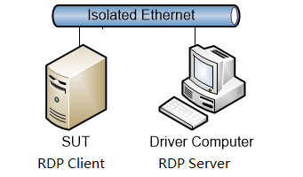

#### **Figure 1. Workgroup Environment architecture**

### Domain Environment

The **Domain Environment** component computers interact in the following
ways. Note that a domain controller is a requirement for the **Domain
Environment**.

-   **Driver computer** --- runs Test Cases by sending requests over the
    wire in the form of protocol messages.

-   **SUT computer** --- hosts a client implementation of the protocol/s
    being tested and responds to Test Case requests sent by the **Driver
    computer**.

-   **DC** --- provides functionality in Active Directory Domain
    Services (AD DS) that provides directory service security for Driver
    and SUT Computer and User accounts.

The following figure illustrates the basic **Domain Environment**
architecture.

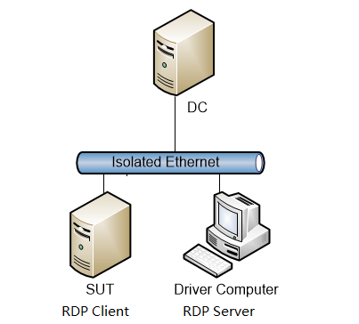

#### **Figure 2. Domain Environment architecture**

## Verifying Test Environment Connectivity

After you prepare the Test Environment in accordance with earlier topics
of this section, you should verify connectivity between the **Driver
computer** and the **SUT computer**. You should then test connectivity
between all other computers in your Test Environment.

The procedure immediately below provides steps you can follow to check
for connectivity between any two Windows-based computers. For
information about testing connectivity with non-Windows based computers,
see the administrative documentation for your operating system.

Important

Before performing the procedure that follows, you will need to disable
all active firewalls in the Test Environment by running the following
command string in the Windows command console:

    netsh advfirewall set allprofiles state off

- **To check connectivity from the Driver computer to a specific computer:**

  1. Right-click the **Start** button and then click **Run**.

  2. In the **Run** dialog, type **cmd** and then click **OK**.

  3. At the Windows command prompt, type **ping** followed by the hostname or IP address of the **SUT** or other computer in the Test Environment, and then press the **Enter** key on the keyboard.

      For example, the command immediately below checks connectivity to an **SUT computer** with hostname SUT01:

          > ping SUT01

      If the connection succeeds, you will see four ping replies at the command line, along with the time in milliseconds that it took to receive the reply from the pinged computer. Otherwise, you will see **Request timed out** messages that indicate that the connection failed.

  4. Repeat step 3 while substituting the name of each computer in your Test Environment for which you will test connectivity to and from every other computer in the environment.

Important

Do not proceed with **Test Suite** configuration until you confirm that
connectivity succeeded, to eliminate the potential for network
connectivity issues.

# Setting up Test Environment Computers

In this section you will set up the Test Environment computers to work
with the **RDP Client Test Suite**.

For **Workgroup** environments, skip all tasks in this section that are
related to setup and configuration of a domain controller (DC).

-   The major topics covered in this section include the following:

    [Extracted Files and Folders](#extracted-files-and-folders)

    [Setting Up the Driver Computer](#setting-up-the-driver-computer)

    [Setting Up the Windows-Based SUT](#setting-up-the-windows-based-sut)

    [Setting Up the Windows-Based Domain Controller](#setting-up-the-windows-based-sut)

    [Reviewing Installed Files and Folders](#reviewing-installed-files-and-folders)

    [Configuring Windows Test Environment Computers](#configuring-windows-test-environment-computers)

    [Configuring the SUT](#configuring-the-sut)

    [Configuring the Driver Computer](#configuring-the-driver-computer)

    [Configuring Non-Windows Test Environment Computers](#configuring-non-windows-test-environment-computers)

## Extracted Files and Folders

After you download the **RDP-TestSuite-ClientEP.zip** package from [here](https://github.com/microsoft/WindowsProtocolTestSuites/releases) to the
driver computer and SUT, you can extract it to a local path, for
example: C:\\RDP-TestSuite-ClientEP on Windows
or \$HOME/RDP-TestSuite-ClientEP on Linux.

**Table 6. File and Folder Description about RDP-TestSuite-ClientEP.zip**

| **File or Folder** | **Description** |
|------------------- |-----------------|
| **Batch**          | Command files that you can use to run individual Test Cases or all Test Cases. |
| **Bin**            | Test Suite binaries, configuration files, PowerShell scripts, and others. |
| **Data**           | Data files that are used by scripts to set up and configure the **Driver**, Windows-based **SUT**, and **DC** computers. |
| **Scripts**        | Scripts that are used to set up and configure the **Driver**, Windows-based **SUT**, and **DC** computers. |
| **TestData**       |  Data files that used by test suite for sending to **SUT** |
| **License.rtf**    | The End User License Agreement (EULA). |
|                    |                 |

## Setting Up the Driver Computer

In the procedure below, you will set up the **Driver Computer** for use
with the **RDP Client Test Suite**.

Important

See the *Prerequisites* topic in the Windows Protocol Test Suites
[Readme](https://github.com/microsoft/WindowsProtocolTestSuites/blob/main/README.md)
documentation on GitHub for the .msi files required for the
prerequisites installations.

-   **To set up the Driver computer, perform the steps that follow**:

    1. Install the required software, as described in [Required Prerequisite Software](#required-prerequisite-software).

    2. Install the optional software per your requirements, as described in [Optional Software](#optional-software).

    3. From the **Driver** computer, locate the official **RDP Client Test Suite** zip package (**RDP-TestSuite-ClientEP.zip** ) on the [Windows Protocol Test Suites](https://github.com/microsoft/WindowsProtocolTestSuites/releases) site under the *Assets* topic on GitHub.

    4. Download and extract the **RDP-TestSuite-ClientEP.zip** package to the driver computer C:\\ path.

## Setting Up the Windows-Based SUT

In the procedure of this section, you will set up an **SUT** **Computer** for use with the **RDP Client Test Suite**.

-   **To set up a Windows-based SUT computer, perform the steps that follow:**

    1. From the **SUT** computer, locate the official **RDP Client Test Suite** zip package (**RDP-TestSuite-ClientEP.zip** ) on the [Windows Protocol Test Suites](https://github.com/microsoft/WindowsProtocolTestSuites/releases) site under the Assets topic on GitHub.

    2. Install the required software, as described in Required Prerequisite Software.

    3. Download and extract the **RDP-TestSuite-ClientEP.zip** package to the SUT computer system C:\\ path.

Note

If you have a non-Windows **SUT** computer to set up, see [Configuring Non-Windows Test Environment Computers](#configuring-non-windows-test-environment-computers).

## Setting Up the Windows-Based Domain Controller

If you plan to run your Test Cases in a **Domain Environment**, follow
the procedure in this section to set up the **DC** for use with the
**RDP Client Test Suite**.

Note

If you are planning to run your Test Cases in a **Workgroup**
**Environment**, skip this section.

-   **To set up a Windows-based DC, perform the step that follows:**

    1. Install Active Directory Domain Services on the **DC** computer using **Server Manager**.

    2. Follow the installation instructions that are provided.

Tip

If you have a non-Windows **DC** computer to set up, see [Configuring Non-Windows Test Environment Computers](#configuring-non-windows-test-environment-computers).

## Reviewing Installed Files and Folders

During the previous **Driver computer** setup process, the files and
folders specified in the table below are installed to the following
directory location on the **Driver** computer:

    C:\RDP-TestSuite-ClientEP\

## Configuring Windows Test Environment Computers

In this section, you will configure computers for a Windows-based Test Environment.

For general information about configuring computers that are not based on Windows, see [Configuring Non-Windows Test Environment Computers](#configuring-non-windows-test-environment-computers).

Important

Certain property values of the .ptfconfig file are set when you
configure them in the procedures that follow. For this reason, in a
Windows-based Test Environment, configure the **SUT** computer and the
**DC** (if using the **Domain** **Environment**) before you configure
the **Driver** computer.

Note

If you are using a **Workgroup Environment**, skip all tasks that are related to the setup and configuration of a **DC** computer.

## Configuring the SUT

In this section, you will perform a procedure for preliminary configuration of the **SUT** computer in tasks such as the following:

-   Setting execution policy

-   Reviewing and potentially updating ParamConfig.xml file settings

-   Configuring certain Group Policy settings

-   Enabling redirection for MS-RDPEUSB Test Cases

-   Enabling Windows Remote Management

-   Editing .rdp files

**To configure the SUT computer, perform the steps that follow:**

  1.  Log on to the **SUT** computer as a local Administrator, or with a user account that has administrative privileges.

      Note

      You must use the local Administrator account when logging on to the **SUT** computer. If the local **Administrator** account is disabled, enable it as follows:

        &emsp;&emsp;a. In **Control Panel** open **System and Security**, **Administrative Tools**, and then open **Computer Management**.

        &emsp;&emsp;b. In the left panel, open **Local Users and Groups** under **System Tools**, and then select **Users**.

        &emsp;&emsp;c. In the right panel, double-click **Administrator** and then unselect the **Account is disabled** check box.

        &emsp;&emsp;d. Right-click **Administrator**, click **Set Password**..., then in the **Set Password for Administrator** dialog, click **Proceed**..

        &emsp;&emsp;&emsp;Thereafter, specify "Password01!" (without the quotes) in the **New Password** and **Confirm Password** fields.

        &emsp;&emsp;e. Click **OK** to save the password for the local Administrator account.

      Tip

      You can also run the following commands at the Windows command line to activate the local Administrator account and set the password:

          net user /active administrator

          net user administrator Password01!

  2. Navigate to the directory immediately below and open the ParamConfig.xml file:

         C:\RDP-TestSuite-ClientEP\Scripts

  3.  Review the properties and descriptions in the ParamConfig.xml file on the **SUT** computer with respect to those in the table that follows and update the file as necessary to match values.

      **Table 7. SUT computer ParamConfig File properties**

      | **Property Name**            | **Description/Values**               |
      |------------------------------|--------------------------------------|
      | **LogPath**                  | The file path for storing the logs during configuration.  Default value: **...\Logs** |
      | **LogFile**                  | The name of log file.  Default value: **...\Logs\Config-DriverComputer.ps1.log** |
      | **userNameInTC**             | The local administrator account that is used to log on to the **SUT** computer.  Required value: **Administrator** |
      | **userPwdInTC**              | The password that is used to log on to the local administrator account of the **SUT** computer.  Default value: **Password01!** |
      | **domainName**               | The domain name that is configured in the **DC** computer, leave it blank if not domain in the environment.  Default value: **contoso.com** |
      | **dcComputerName**           | The machine name or IP address of the DC computer, leave it blank if not domain in the environment.  Default value: **DC01** |
      | **tcComputerName**           | The machine name or IP address of the **SUT** computer.  Default value: **SUT01** |
      | **driverComputerName**       | The machine name or IP address of the **Driver** computer.  Default value: **DriverComputer** |
      | **RDPListeningPort**         | The listening port for the Driver computer.  Default value: **3389** |
      | **ipVersion**                | The IP version that is used in the test environment.  Default value: **IPv4** |
      | **workgroupDomain**          | The Test Environment type. If you are using the **Domain Environment**, set the value below to **Domain**. If you are using the **Workgroup Environment**, ensure the value below is set to **Workgroup**. Default value: **Workgroup** |
      | **compressionInTC**          | Determine whether compression is used in the RDP connection. If compression is used, set the value to **Yes**; otherwise, set the value to **No**. Default value: **No** |
      | **CredSSPUser**              | The user name used in CredSSP authentication. The user should be a member of the RDP User Group on the **Driver** computer.  Default value: **Administrator** |
      | **CredSSPPwd**               | The password for the CredSSPUser.  Default value: **“Password01!”** (without the quotes) |
      | **securityProtocol**         | The security protocol that is used to establish an RDP connection. **CredSSP** or **RDP** are also permissible values. Default value: **TLS** |
      | **negotiationBasedApproach** | If the value is true, the connection sequence uses  the Negotiation-Based Approach, as described in [MS-RDPBCGR section 5.4.2.1](https://docs.microsoft.com/en-us/openspecs/windows_protocols/ms-rdpbcgr/db98be23-733a-4fd2-b086-002cd2ba02e5). If the value is False, it specifies that the Direct Approach will be used, as described in [MS-RDPBCGR section 5.4.2.2](https://docs.microsoft.com/en-us/openspecs/windows_protocols/ms-rdpbcgr/b2bd18fa-0066-4a57-ac25-9139c0df31e0).  Default value: **True** |
      | **osVersion**                | The operating system of the RDP connection. This value can be set to **Windows** or **NonWindows**.  Default value: **Windows** |
      | **RDPVersion**               | The RDP version in use.  Can also be set to version 7.0, 7.1, or 8.0.  Default value: **8.1** |
      | **agentPort**                | The listening port of the SUT Agent.  Default value: **4488** |
      |                              |                                      |

  4.  If Windows PowerShell is not running, start it by typing
    "PowerShell" at the **Start** menu, right-click **Windows
    PowerShell**, and then select **Run as Administrator** in the
    context menu that appears:

  5.  To set the execution policy to Unrestricted, type the command that
    follows at the PowerShell command prompt, then press the **Enter**
    key on your keyboard.

            Set-ExecutionPolicy Unrestricted -F

  6. To change to the \Scripts directory, type the following at the
    PowerShell command prompt and then press the **Enter** key on your
    keyboard:

            cd C:\RDP-TestSuite-ClientEP\Scripts

  7.  If you plan to run MS-RDPEUSB Test Cases, type the following at the
    PowerShell command prompt and then press the **Enter** key on your
    keyboard:

            .\Enable-USBRedirection.ps1

  8.  To enable Windows Remote Management, type the following at the
    command prompt and then press the **Enter** key on your keyboard:

            .\Enable-WinRM.ps1

  9.  To configure the SUT computer, type the following at the command
    prompt, then press the **Enter** key on your keyboard:

            .\Config-TerminalClient.ps1

  10.  Configure Group Policy to create an AVC 444-supported environment:

        a.  Set Group policy for RDP USB redirection as follows:

        - Type **gpedit.msc** in the **Run** dialog and press **OK** to start the **Local Group Policy Editor**.

        - Navigate to the following location:

          Local Computer Policy\\Computer Configuration\\Administrative Templates\\Windows Components\\Remote Desktop Services\\Remote Desktop Connection Client\\RemoteFX USB Device Redirection

        -   Right-click the policy **Allow RDP redirection of other supported RemoteFX USB devices from this computer** and select **Edit** to open the **Policy Settings** dialog.

        -   Select **Enabled** and click **OK** to exit the dialog.

        -   Reboot the **SUT** computer and plug in an OSR USB FX2 board. See [Test Environment Computer Requirements](#test-environment-computer-requirements) if you need to purchase an OSR USB FX2 board.

        b.  Optionally you can configure group policy for the RDPEGFX AVC 444 feature as specified below:

          Note

          To enable AVC 444 mode in Windows 10 or Windows Server 2016 and later versions, you will need to configure *two new Group Policies* via the **Local Group Policy Editor**:

          -   Open the **Local Group Policy Editor** by typing **gpedit.msc** in the Start menu and then press the **Enter** key on your keyboard.

          -   Under **Local Computer Policy**, navigate to the following location:

              Computer Configuration\\Administrative Templates\\Windows Components\\Remote Desktop Services\\Remote Desktop Session Host\\Remote Session Environment

          -   **Enable AVC 444** --- enable this through group policy by performing the steps that follow:

              1. Right-click the policy **Prioritize H.264/AVC 444 Graphics mode for Remote Desktop connections** and select **Edit** to open the **Policy Settings** dialog.

              2. Select **Enabled** and click **OK** to exit the dialog.

                  When enabled on the RDP Server, the H.264/AVC 444 mode will be prioritized when the RDP Client (SUT) and RDP Server (Driver) both support the AVC/H.264 and AVC 444 modes.

                 Note

                  For Remote Desktop Session Host (RDSH) environments, only full desktop sessions are supported with H.264/AVC 444, as RemoteApp sessions still use the proprietary codecs for now.
          -   **Enable H.264/AVC hardware encoding** --- enable through group policy by performing the steps that follow:

              3.  Right-click the policy **Configure** **H.264/AVC hardware encoding for Remote Desktop connections** and select **Edit** to open the **Policy Settings** dialog.

              4.  Select **Enabled** and click **OK** to exit the dialog.

                  Note

                  This policy enables hardware encoding for AVC/H.264 when used in conjunction with the AVC 444 mode. When enabled, each remote desktop 
                  monitor will use up to one AVC/H.264 encoder on the server. If all AVC/H.264 encoders are in use, the RDP server will automatically
                  fallback to using software encoding.
        
        Important

        The steps that follow are required for the MS-RDPEUSB Test Cases only. If you are not planning to run these Test Cases, skip steps 11, 12.

  11. Navigate to the directory below:

             C:\RDP-TestSuite-ClientEP\Data

  12. Edit the **Negotiate.rdp**, **DirectTls.rdp**, and **DirectCredSSP.rdp** files by performing the steps that follow for each file:

      a. Right-click the respective RDP file, then click **Edit**.

      b. Select the **Local Resources** tab, click **More...**, and then select the **OSR USB-FX2 LK** check box.

      c. Select the **General** tab.

      d. Click **Save**.
  13. If the SUT (System Under Test) computer is running Windows 11 or later, execute the following script to configure SSL.
    
    # Copyright (c) Microsoft. All rights reserved.
	# Licensed under the MIT license. See LICENSE file in the project root for full license information.
	
    # Set ciphersuites SSL setting.
	$cipherSuitesAsString = 'TLS_ECDHE_RSA_WITH_AES_256_GCM_SHA384,TLS_ECDHE_RSA_WITH_AES_128_GCM_SHA256,TLS_ECDHE_RSA_WITH_AES_256_CBC_SHA384,TLS_ECDHE_RSA_WITH_AES_128_CBC_SHA256,TLS_ECDHE_RSA_WITH_AES_256_CBC_SHA,TLS_ECDHE_RSA_WITH_AES_128_CBC_SHA,TLS_ECDHE_ECDSA_WITH_AES_256_GCM_SHA384,TLS_ECDHE_ECDSA_WITH_AES_128_GCM_SHA256,TLS_ECDHE_ECDSA_WITH_AES_256_CBC_SHA384,TLS_ECDHE_ECDSA_WITH_AES_128_CBC_SHA256,TLS_ECDHE_ECDSA_WITH_AES_256_CBC_SHA,TLS_ECDHE_ECDSA_WITH_AES_128_CBC_SHA,TLS_RSA_WITH_AES_256_GCM_SHA384,TLS_RSA_WITH_AES_128_GCM_SHA256,TLS_RSA_WITH_AES_256_CBC_SHA256,TLS_RSA_WITH_AES_128_CBC_SHA256,TLS_RSA_WITH_AES_256_CBC_SHA,TLS_RSA_WITH_AES_128_CBC_SHA,TLS_RSA_WITH_3DES_EDE_CBC_SHA'
	New-Item 'HKLM:\SOFTWARE\Policies\Microsoft\Cryptography\Configuration\SSL\00010002' -ErrorAction SilentlyContinue
	New-ItemProperty -path 'HKLM:\SOFTWARE\Policies\Microsoft\Cryptography\Configuration\SSL\00010002' -name 'Functions' -value $cipherSuitesAsString -PropertyType 'String' -Force | Out-Null
	# Re-create the ciphers key.
	New-Item 'HKLM:SYSTEM\CurrentControlSet\Control\SecurityProviders\SCHANNEL\Ciphers' -Force | Out-Null
	# Enable AES and DES ciphers.
	$myCiphers = @(
	  'AES 128/128',
	  'AES 256/256',
	  'DES 56/56',
	  'Triple DES 168'
	)
	Foreach ($myCipher in $myCiphers) {
	  $key = (Get-Item HKLM:\).OpenSubKey('SYSTEM\CurrentControlSet\Control\SecurityProviders\SCHANNEL\Ciphers', $true).CreateSubKey($myCipher)
	  New-ItemProperty -path "HKLM:\SYSTEM\CurrentControlSet\Control\SecurityProviders\SCHANNEL\Ciphers\$myCipher" -name 'Enabled' -value '0xffffffff' -PropertyType 'DWord' -Force | Out-Null
	  $key.close()
	  Write-Host "The cipher $myCipher has been enabled."
	}
	# Set hashes configuration.
	New-Item 'HKLM:SYSTEM\CurrentControlSet\Control\SecurityProviders\SCHANNEL\Hashes' -Force | Out-Null
	$secureHashes = @(
	  'SHA',
	  'SHA256',
	  'SHA384',
	  'SHA512'
	)
	Foreach ($secureHash in $secureHashes) {
	  $key = (Get-Item HKLM:\).OpenSubKey('SYSTEM\CurrentControlSet\Control\SecurityProviders\SCHANNEL\Hashes', $true).CreateSubKey($secureHash)
	  New-ItemProperty -path "HKLM:\SYSTEM\CurrentControlSet\Control\SecurityProviders\SCHANNEL\Hashes\$secureHash" -name 'Enabled' -value '0xffffffff' -PropertyType 'DWord' -Force | Out-Null
	  $key.close()
	  Write-Host "Hash $secureHash has been enabled."
	}
	# Set KeyExchangeAlgorithms configuration.
	New-Item 'HKLM:SYSTEM\CurrentControlSet\Control\SecurityProviders\SCHANNEL\KeyExchangeAlgorithms' -Force | Out-Null
	$secureKeyExchangeAlgorithm='ECDH'
	$key = (Get-Item HKLM:\).OpenSubKey('SYSTEM\CurrentControlSet\Control\SecurityProviders\SCHANNEL\KeyExchangeAlgorithms', $true).CreateSubKey($secureKeyExchangeAlgorithm)
	New-ItemProperty -path "HKLM:\SYSTEM\CurrentControlSet\Control\SecurityProviders\SCHANNEL\KeyExchangeAlgorithms\$secureKeyExchangeAlgorithm" -name 'Enabled' -value '0xffffffff' -PropertyType 'DWord' -Force | Out-Null
	$key.close()
	Write-Host "KeyExchangeAlgorithm $secureKeyExchangeAlgorithm has been enabled."

## Configuring the Driver Computer

In this section, you will perform several tasks that are necessary for configuration of the **Driver** computer in the Test Environment. These include the following:

  -   Updating the ParamConfig.xml file

  -   Using PowerShell to execute various configuration cmdlets

  -   Optionally installing a test certificate file on the **Driver** computer

  -   Configuring Group Policy to enable support for the RDPEFGX AVC 444
    feature

  **To configure the Driver computer, perform the steps that follow:**

  1. Log on to the **Driver** computer with the local Administrator account.

  2. Navigate to the following directory location and open the ParamConfig.xml file.

          C:\RDP-TestSuite-ClientEP\Scripts

  3. Review the properties and descriptions in the ParamConfig.xml file on the **Driver** computer with respect to those in the table that follows and update as necessary for value matching.

     **Table 8. Driver computer ParamConfig File properties**

     | **Property Name**      | **Description/Value**                      |
     | ---------------------- | ------------------------------------------ |
     | **LogPath**            | The file path for storing the logs during configuration.  Default value: **...\Logs** |
     | **LogFile**            | The name of log file.  Default value: **...\Logs\Config-DriverComputer.ps1.log** |
     | **userNameInTC**       | The local administrator account that is used to log on to the **SUT** computer. Required value: **Administrator** |
     | **userPwdInTC**        | The local administrator account password that is used to log on to the **SUT** computer.  Default value: **“Password01!”** (without the quotes) |
     | **CredSSPUser**        | The user name used in CredSSP authentication.  Default value: **Administrator**  Should be a member of the RDP User Group on the **Driver** computer. |
     | **CredSSPPwd**         | The user password for the **CredSSPUser**.  Default value: **“Password01!”**  (no quotes) |
     | **domainName**         | The domain name that is configured in the **DC** computer, leave it blank if not domain in the environment.  Default value: **contoso.com** |
     | **dcComputerName**     | The machine name or IP address of the **DC** computer, leave it blank if not domain in the environment.  Default value: **DC01** |
     | **tcComputerName**     | The machine name or IP address of the **SUT** computer.  Default value: **SUT01** |
     | **driverComputerName** | The machine name or IP address of the **Driver** computer.  Default value: **DriverComputer** |
     | **RDPListeningPort**   | The listening port for the **Driver** computer.  Default value: **3389** |
     | **ipVersion**          | The IP version that is used in the test environment.  Default value: **IPv4** |
     | **osVersion**          | The operating system of the RDP client (**SUT**), which can be either a Windows or non-Windows operating system.  Default value: **Windows** |
     | **workgroupDomain**    | The Test Environment type. If you are using the **Domain Environment**, set the value below to **Domain**. If you are using the **Workgroup Environment**, ensure the value below is set to **Workgroup**.  Default value: **Workgroup** |
     | **tcSystemDrive**      | The system drive letter of the **SUT** machine, which applies only to an **SUT** that is running a Windows operating system.  Default value: **C** |
     |                        |                                            |

  4.  If Windows PowerShell is not running, start it by typing
    "PowerShell" at the **Start** menu, right-click **Windows
    PowerShell**, and then select **Run as Administrator** in the
    context menu that appears.

  5.  To set the execution policy to Unrestricted, type the following at
    the PowerShell command prompt, and then press the **Enter** key on
    your keyboard:

          Set-ExecutionPolicy Unrestricted -F

  6.  To change to the \Scripts directory, type the following at the
    PowerShell command prompt and then press the **Enter**. key on your
    keyboard.

          cd C:\RDP-TestSuite-ClientEP\Scripts

  7.  To configure the Driver computer, type the following at the
    PowerShell command prompt and then press the **Enter** key on your
    keyboard.

          .\Config-DriverComputer.ps1

       Note

       After the automation script *.\\Config-DriverComputer.ps1* in the previous step runs, the following occurs:

       -   The script will change the Remote Desktop Service port to 4488 and restart this service (that is, if the value of the **RDPListeningPort** was previously set to 3389 and the Remote Desktop Service is running on the **Driver** computer).

       -   The following files are generated in the C:\\ directory:

           ComputerName.cer

           ComputerName.pfx

The **ComputerName** specification above represents the **Driver** computer name that you configured earlier in the ParamConfig.xml file.

Important

The certificate **ComputerName**.cer is generated for testing purposes
and is *not* from a trusted Certificate Authority. Therefore, when you
run Test Cases, a dialog may pop up with a warning statement such as:
**The identity of the remote computer cannot be verified. Do you want to
connect anyway?** If so, click **Yes** and then select the **Don\'t ask
me again for connections to this computer** checkbox to prevent this
dialog from displaying again.

However, you can optionally install this certificate on the **SUT**
computer to avoid display of the above warning dialog each time you
attempt a remote **SUT** connection to run your Test Cases, by copying
the ComputerName.cer file to the **SUT** in the steps that follow.

**To install the ComputerName.cer certificate on the SUT computer:**

  1.  On the **SUT** computer, click **Start** and then type "Run", to open the **Run** dialog.

  2.  In the **Run** dialog, type "MMC" and then click **OK**.

  3.  From the **File** menu of the Microsoft Management Console, click **Add/Remove Snap-in.**

  4.  In the **Add or Remove Snap-ins** dialog, select **Certificates** and click **Add**.

  5.  In the **Certificates snap-in** dialog that displays, select the **Computer account** option and click **Next**.

  6.  In the **Select Computer** dialog, accept the default **Local computer: (the computer this console is running on)** option and click **Finish**.

  7.  In the **Add or Remove Snap-ins** dialog, click **OK**.

  8.  In the left pane of the Microsoft Management Console, expand the **Certificates (Local Computer)** node, and then expand the **Trusted Root Certification Authorities** folder.

  9.  Under **Trusted Root Certification Authorities**, right-click the **Certificates** subfolder, click **All Tasks**, and then click **Import**.

  10. On the **Certificate Import Wizard Welcome** page, click **Next**.

  11. On the **File to Import** page of the wizard, click **Browse**.  Browse to the location of the ***ComputerName***.cer file, select the file, then click **Open**.

  12. On the **File to Import** page of the wizard, click **Next**.

  13. On the **Certificate Store** page of the wizard, accept the default selection, and then click **Next**.

  14. On the **Completing the Certificate Import Wizard** page, click **Finish**.

At this point, you can optionally configure Group Policy for the RDPEGFX AVC 444 feature in the steps that follow.

Note

To enable AVC 444 mode in Windows 10 or Windows Server 2016 and later versions, you will need to configure Group Policy in the **Group Policy Editor**. In the procedure that follows, you will set up an AVC 444-supported environment.

  **To configure Group Policy for the RDPEFGX AVC 444 feature:**

  1.  Open the **Local Group Policy Editor** by typing "gpedit.msc" in the **Run** dialog and clicking **OK**.

  2.  Navigate to the location immediately below:

      Computer Configuration\\Administrative Templates\\Windows Components\\Remote Desktop Services\\Remote Desktop Session Host\\Remote Session Environment

  3.  Enable AVC 444 by doing the following:

      a.  Right-click the **Configure H.264/AVC hardware encoding for Remote Desktop connections** setting and select **Edit** in the context menu that displays.

      b.  In the **Configure H.264/AVC hardware encoding for Remote Desktop connections** settings dialog, select the **Enabled** option, click **Apply**, and then click **OK** to exit the dialog.

  This policy enables hardware encoding for AVC/H.264 when used in conjunction with the AVC 444 mode. When enabled, each remote desktop monitor will use up to one AVC/H.264 encoder on the server. If all AVC/H.264 encoders are in use, the RDP Server will automatically fallback to using software encoding.

## Configuring Non-Windows Test Environment Computers

This User Guide provides only the following limited information on configuring the Test Environment to support non-Windows based computers.

  **To configure non-Windows computers, perform the steps that follow:**

  1.  For domain environments, join all computers to the domain of the **DC computer**.

  2.  Disable active firewalls on all computers as described in [Verifying Test Environment Connectivity](#verifying-test-environment-connectivity) from the Driver Computer.

  3.  To configure the **SUT computer**, perform the following steps:

      a.  Set up the client implementations of the protocols to be tested.

      b.  Enable redirection for USB devices.

      c.  Plug in the OSR USB FX2 board.
           &emsp;See the table in [Test Environment Computer Requirements](#test-environment-computer-requirements) if you need to purchase an OSR USB FX2 board.

      d.  On the **SUT** computer, optionally install the Certificate that was generated on the **Driver computer**. See [Configuring the Driver Computer](#configuring-the-driver-computer) for the installation process.

  4.  To configure the **DC** computer, install the appropriate domain directory services.

      Note

      To perform the previous step, you may need to consult the administrative documentation for your operating system.

# Configuring the Test Suite

**The RDP Client Test Suite** is installed with default configuration
settings that include property values that are automatically populated
to the RDP_ClientTestSuite.deployment.ptfconfig file during **Test
Suite** installation. It is likely you will need to change some of these
settings to accommodate your Test Environment or if you want to
customize your test runs. If so, you can optionally change the following
settings of the **Test Suite**:

  -   **Unique Test Environment settings** --- including computer names and IP addresses.

  -   **Unique Test Suite settings** --- including the RDP protocol version and target operating system version.

  -   **Timers** --- set time limits on discrete test tasks and on test run duration using the **WaitTime** property.

To modify any configuration settings you will need to open the
RDP_ClientTestSuite.deployment.ptfconfig file from the following
**Driver** computer directory location:

    C:\RDP-TestSuite-ClientEP\Bin

 The tasks for configuring the **RDP Test Suite** are described in the following topics:

  &emsp;&emsp;&emsp;[Required Configuration Settings](#required-configuration-settings)

  &emsp;&emsp;&emsp;[Optional Configuration Settings](#optional-configuration-settings)

## Required Configuration Settings

This section describes the configuration settings that are required for
running the **RDP Client Test Suite** Test Cases. Some are required
settings that must be verified in the appropriate configuration file.
For example, you will need to verify the
RDP_ClientTestSuite.deployment.ptfconfig file against the properties and
values described in [Common Required Property
Settings](#common-required-property-settings) that follow.

In other cases, specific property settings are required for particular
RDP protocol extensions, as described in [Property Settings Required for
RDP Protocol Extension Test
Cases](#property-settings-required-for-rdp-protocol-extension-test-cases).
These will also be set in the RDP_ClientTestSuite.deployment.ptfconfig
file, which you should also verify for valid values.

Note

If a data table is not provided in the latter-specified section for a
specific RDP protocol extension, it means that no additional
configuration settings are required for the Test Cases of that protocol
implementation.

### Common Required Property Settings

The following table describes the common property settings that are
required for all Test Cases, as specified in the
RDP_ClientTestSuite.deployment.ptfconfig file.

**Table 9. Required property settings for all RDP Test Cases**

| **Property**                        | **Description/Value**            |
|----------------------------------   |----------------------------------|
| **ServerPort**                      | The port number that listens for RDP connection requests.  The default value used in this **Test Suite: 3389** |
| **IPVersion**                       | The IP version used in Test Environment.  Default value: **Ipv4** |
| **Version**                         | The core RDP protocol version running on the **SUT** computer.  Default value: **10.6** |
| **Negotiation**                     | The **Negotiation** is in **Security** group, possible value is **True** or **False**.  If the value is **True**, it indicates that the **Test Suite** uses the “Negotiation-Based Approach” to select a security mechanism, as described in [MS-RDPBCGR section 5.4.2.1](https://docs.microsoft.com/en-us/openspecs/windows_protocols/ms-rdpbcgr/db98be23-733a-4fd2-b086-002cd2ba02e5).  If the value is False, it indicates that the “Direct Approach” will be used, as described in [MS-RDPBCGR section 5.4.2.2](https://docs.microsoft.com/en-us/openspecs/windows_protocols/ms-rdpbcgr/b2bd18fa-0066-4a57-ac25-9139c0df31e0). Default value: **True** |
| **Protocol**                        | The **Protocol** is in **Security** group and this security protocol used to secure the RDP session. The possible values are enhanced **TLS, CredSSP**, and standard **RDP**. Default value: **TLS**   Note  Test Cases of the MS-RDPEUDP and MS-RDPEMT protocols must be run under TLS or CredSSP security. |
| **Level**                           | The **Level** is in **Security** group and **Encryption** subgroup. It is encryption level of the RDP session. The possible values are **None**, **Low**, **Client**, **High**, and **FIPS**.  Default value: **None**   Note  If the **Protocol** value is set to **TLS** or **CredSSP**, the encryption level property must be set to **None**. Otherwise, use one of the other encryption levels. |
| **Method**                          | The **Method** is in **Security** group and **Encryption** subgroup. It is encryption method of the RDP session. The possible values are, **None**, **40bit**, **56bit**, **128bit**, **FIPS**.  Default value: **None**   Note  If the **Protocol** value is set to **TLS** or **CredSSP**, this property must be set to **None**. If the **Level** value is set to **FIPS**, this property must be set to **FIPS**. |
| **IsClientToServerEncrypted**       | The **IsClientToServerEncrypted** is in **Security** group and indicates whether or not client-to-server traffic is encrypted. The possible values are **True** and **False**.  Default value: **True** |
| **IsWindowsImplementation**         | Indicates if the **SUT** computer is hosting a Windows implementation. The possible values are **True** and **False**. Default value: **True** |
| **DropConnectionForInvalidRequest** | The **DropConnectionForInvalidRequest** is in **Security** group and indicates if the **SUT** computer will drop the connection when an invalid request is received. The possible values are **True** and **False**.  Default value: **True** |
| **CertificatePath**                 | The Personal Information Exchange (.pfx) certificate used to secure TLS or CrepSSP transports. If the**Protocol** value is set to **TLS** or **CrepSSP**, this property must be set. Default value: C:\DriverComputer.pfx |
| **CertificatePassword**             | The password of the certificate identified in the **CertificatePath** value. Default value: **Password01!** |
| **VerifyRdpbcgrMessage**            | Enables or disables message field verification as defined in MS-RDPBCGR. Set to **True** to enable, otherwise set to **False** to disable. Default value: True |
| **Enable**                          | The **Enable** is in **VerifySUTDisplay** group and it indicates enable or disable display verification on the **SUT** Computer. This function is only available when running the Test Suite in the protocol-based mode. For related information, see [Configuring Common Test Suite Mode Settings](#configuring-common-test-suite-mode-settings).  Default value: **False** |
| **BitmapSavePath**                  | The **BitmapSavePath** is in **VerifySUTDisplay** group and this path for saving screenshots on the **SUT** computer. If the **Enable** property is false, ignore this property.  Default value: **../../ScreenShot** |
| **Algorithm**                       | The **Algorithm** is in **VerifySUTDisplay** group and **IQA** subgroup. The algorithm that is used to assess whether two images are similar. The algorithm should be one of the following: &emsp;•	**SSIM: Structural Similarity Index** &emsp;•	**MS-SSIM: Multiscale-SSIM** &emsp;•	**G-SSIM: Gradient-Based-SSIM**  These algorithms are used to verify the image encoded by using the RemoteFX codec, as described in [MS-RDPRFX](https://docs.microsoft.com/en-us/openspecs/windows_protocols/ms-rdprfx/62495a4a-a495-46ea-b459-5cde04c44549).  If Enable is set to false, ignore this property.  Default value: **MS-SSIM** |
| **AssessValuethereshold**             | The **AssessValueThreshold** is in **VerifySUTDisplay** group and **IQA** subgroup. Threshold for the expected assess value, which is used by the image quality assessment (IQA) algorithm when verifying RemoteFX codec output. The Test Suite concludes that two images are similar if the IQA value falls within the threshold boundaries that follow.  The value should be a floating point number in the range:  0 ≤ AssessValueThreshold ≤ 1.  If **Enable** is false, ignore this property.  Default value: **0.98** |
| **ShiftX**                          | The **ShiftX** is in **VerifySUTDisplay** group and it verifies the horizontal position of the RDP client (**SUT**) window relative to the top-left position of the screen.  If **Enable** is set to false, ignore this property. Default value: **0** |
| **ShiftY**                          | The **ShiftY** is in **VerifySUTDisplay** group and it verifies the vertical position of the RDP client (**SUT**) window relative to the top-left position of the screen. If **Enable** is set to false, ignore this property. Default value: **0** |
|                                     |                                  |

### Property Settings Required for RDP Protocol Extension Test Cases

This section describes the property settings that are required for the
Test Cases of specific RDP protocol extensions that are part of the
**SUT** computer implementation configuration. The protocols that
require property setting verification include the following:

-   MS- RDPBCGR

-   MS- RDPEUSB

-   MS- RDPRFX

-   MS- RDPEGFX

-   MS- RDPEDISP

-   MS- RDPEI

If a particular RDP extension protocol is not listed here in a data
table, then no additional configuration verification is required for the
Test Cases of that protocol.

#### **MS-RDPBCGR Required Property Settings**

The following data table describes the property settings required for
MS-RDPBCGR Test Cases only.

**Table 10. Required property settings for MS- RDPBCGR Test Cases**

| **Property**                 | **Description/Value**                |
|------------------------------|--------------------------------------|
| **SupportFastPathInput**     | Indicates whether the remote desktop client (**SUT** computer) installation supports Fast-Path Input. Possible values are **True** and **False**.  Default value: **True** |
| **SupportAutoReconnect**     | Indicates if the remote desktop client (**SUT**) installation supports Auto-Reconnect. Possible values are **True** and **False**.  Default value: **True** |
| **SupportRDPEFS**            | Indicates if the remote desktop client (**SUT**) installation supports File System Virtual Channel Extension (see [MS-RDPEFS](https://docs.microsoft.com/en-us/openspecs/windows_protocols/ms-rdpefs/34d9de58-b2b5-40b6-b970-f82d4603bdb5)). Possible values are True and False. Default value: **True** |
| **SupportServerRedirection** | Indicates if the remote desktop client (**SUT**) installation supports Server Redirection. The possible values are **True** and **False**. Default value: **True** |
|                              |                                      |

#### **MS-RDPEUSB Required Property Settings**

The following data table describes the property settings required for
MS-RDPEUSB Test Cases only.

**Table 11. Required property settings for MS- RDPEUSB Test Cases**

| **Property**                 | **Description/Value**                |
|------------------------------|--------------------------------------|
| **SupportEUSBDevice**        | Indicates if the remote desktop client (**SUT**) installation supports EUSB device. The possible values are **True** and **False**. Default value: **False** |
|                              |                                      |

#### **MS-RDPRFX Required Property Settings**

The following data table describes the property settings required for
MS-RDPRFX Test Cases only.

**Table 12. Required property settings for MS- RDPRFX Test Cases**

| **Property**             | **Description/Value**                    |
|--------------------------|------------------------------------------|
| **RDPRFXImage**          | Determines how **RDP Test Suite** acquires image data that is used by MS-RDPRFX Test Cases to send image information to the RDP client (SUT). The value setting can be either Screen, or the path to an image file. Default value: **../TestData/Rdprfx.bmp** |
| **RDPRFXVideoModeImage** | Determine how test suite get the image data for video mode, which is used by RDPRFX test cases to send image to the client. It should be set to Screen, or the path of an image file. Default value: **../TestData/RdprfxVideoMode.bmp** |
|                          |                                          |

#### **MS-RDPEGFX Required Property Settings**

The following data table describes the property settings required for
MS-RDPEGFX Test Cases only

**Table 13. Required property settings for MS- RDPEGFX Test Cases**

| **Property**                 | **Description/Value**                |
|------------------------------|--------------------------------------|
| **ClearCodecImage**          | The path to an image file that is used to perform the ClearCodec test.  The requirements for the image consist of the following:   Size : 256 * 256 pixels  The top-left 64 * 64 pixel rectangle should have a different color from background, for example, the image should have some text or sign in a different color.  Default value: **../TestData/RdpegfxClearCodecTestImage.bmp**  Note that this image is included in the RDP Test Suite in the following directory location on the Driver computer:  &emsp; C:\RDP-TestSuite-ClientEP\ |
| **RfxProgressiveCodecImage** | The path to an image file that is used to perform the RemoteFx Progressive Codec test.  The requirement for the image consists of the following:  Size : 256 * 256 pixels  Default value: **../TestData/RdpegfxRfxProgressiveCodecTestImage.bmp**. This image is included in the RDP Test Suite in the following directory location on the **Driver** computer:  &emsp;C:\RDP-TestSuite-ClientEP\ |
| **RdpegfxH264TestDataPath**  | The path to data files that are used to test the H264 codec. Default value: **../TestData/** |
|                              |                                      |

#### **MS-RDPEDISP Required Property Settings**

The following data table describes the property settings required for MS-RDPEDISP Test Cases only.

**Table 14. Required property settings for MS- RDPEDISP Test Cases**

| **Property**              | **Description/Value**                   |
|---------------------------|-----------------------------------------|
| **RdpedispTestImage**     | The path to an image file that is used to in the performance of an RDPEDISP test case.  Default value: **../TestData/RdpedispTestImage.bmp**. This image is included in the **RDP Test Suite**.    There is no specific requirement for the image. |
| **OriginalDesktopWidth**  | The original screen resolution width.   Default value: **1024** |
| **OriginalDesktopHeight** | The original screen resolution height.   Default value: **768** |
| **ChangedDesktopWidth**   | The changed screen resolution width.   Default value: **1152** |
| **ChangedDesktopHeight**  | The changed screen resolution height.   Default value: **864** |
| **OriginalMonitorNumber** | The original number of screens.   Default value: **1** |
| **ChangedMonitorNumber**  | The changed number of screens.   Default value: **2**  |
|                           |                                         |

#### **MS-RDPEI Required Property Settings**

The following data table describes the property settings required for
MS-RDPEI Test Cases only.

**Table 15. Required property settings for MS- RDPEI Test Cases**

| **Property**                 | **Description/Value**                |
|------------------------------|--------------------------------------|
| **SupportRDPEI**             | Indicates if RDP client (**SUT**) support [MS-RDPEI]: Remote Desktop Protocol: Input Virtual Channel Extension. The possible values are **True** and **False**. Default value: **False** |
|                              |                                      |

## Optional Configuration Settings

The following table describes optionally configurable properties and suggested value settings in the RDP_ClientTestSuite.deployment.ptfconfig file.

**Table 16. Optional property settings**

| **Property**           | **Description/Value**                      |
|------------------------|--------------------------------------------|
| **ServerDomain**       | If you are using CredSSP security, set this property value to define the domain name where the **Driver** computer  resides. If the computer is not in a  domain, then use the computer IP or computer name.   Default value: **contoso.com**             |
| **ServerUserName**     | If using CredSSP security, set this property value to define the security account user name.   Default value: **Administrator** |
| **ServerUserPassword** | The password for the **ServerUserName** account.   Default value: **Password01!** |
| **SUTName**            | Specify the computer name or IP address of  the **SUT computer**.   Default value: **SUT01** |
| **SUTUserName**        | If the **SUT** is using a Windows operating system, specify the local administrator account used to log on to  the machine.   Required value: **Administrator** |
| **SUTUserPassword**    | The password that is used to log on to the local administrator account of the **SUT**.   Default value: **Password01!** |
| **SUTSystemDrive**     | If the **SUT** is using a Windows operating system, specify the system drive letter of the machine. Default value: **C** |
| **WaitTime**           | The maximum time in seconds to wait for one **SUT** computer response message.   Default value: **40** |
|                        |                                            |

# Running Test Cases

The **RDP Test Suite** includes command files that you can use to
execute the Test Cases. Each Test Case verifies a protocol
implementation based on a preconfigured scenario.

The directory location that follows contains the command files for all
the Test Cases:

    C:\RDP-TestSuite-ClientEP\Batch

You can use any of the following methods to run your Test Cases:

-   Run the Test Cases via PowerShell scripts, as described in [Running
    Test Cases in the Test Suite
    Modes](#running-test-cases-in-the-test-suite-modes).

-   Run the Test Cases using the Protocol Test Manager (PTM) graphical
    user interface (UI), as described in [Using Protocol Test
    Manager](#using-protocol-test-manager).

Note

If you choose the latter option, PTM will need to be installed and
configured to generate a set of Test Cases that you can modify or
execute as is.

 The major topics covered
in this section include the following:

  &emsp;&emsp;[Test Run Pre-Configuration](#test-run-pre-configuration)

  &emsp;&emsp;[Running Verification Tests](#running-verification-tests)
  
  &emsp;&emsp;[Running All Test Cases](#running-all-test-cases)
  
  &emsp;&emsp;[Running Specific Test Cases](#running-specific-test-cases)
  
  &emsp;&emsp;[Example : Running Test Cases in Interactive Mode](#example-running-test-cases-in-interactive-mode)

  &emsp;&emsp;[Example : Running RDPEI Test Cases in Interactive Mode](#example-running-rdpei-test-cases-in-interactive-mode)

  &emsp;&emsp;[Viewing Test Results](#viewing-test-results)

  &emsp;&emsp;[Running and Debugging Test Cases With Visual Studio](#running-and-debugging-test-cases-with-visual-studio)

## Test Run Pre-Configuration

Before you actually run the Test Cases, some additional configuration is
required for the **Test Suite** and Test Cases for several protocol
implementations under test, as specified in the topics that follow:

  -   [Configuring Common Test Suite Mode Settings](#configuring-common-test-suite-mode-settings)

  -   [Configuring the Test Suite Mode for MS-RDPEI Events](#configuring-the-test-suite-mode-for-ms-rdpei-events)

  -   [Configuring the Test Suite Mode for MS-RDPEDISP Events](#configuring-the-test-suite-mode-for-ms-rdpedisp-events)

### Configuring Common Test Suite Mode Settings

Test Cases control the RDP client system (**SUT** computer) and typically generate common events such as the following:

**Connection** --- event is triggered by RDP connection setup.

**Disconnection** --- event is triggered by RDP disconnection.

**User input** --- event is triggered from user input, such as keyboard
or mouse input.

These events are generated in the three different Test Suite modes you
can use to control the RDP client, as follows:

-   **PowerShell**

-   **Interactive**

-   **Managed**

Note

If you plan to run Test Cases in PowerShell mode, you must log on with the local Administrator account.

The functions that are provided by these **Test Suite** modes are described in [Running Test Cases in the Test Suite Modes](#running-test-cases-in-the-test-suite-modes).

#### **Controlling the RDP Client on a Windows SUT Computer**

The procedure that follows enables you to configure the **Test Suite**
using one of three different modes to control the RDP client system on a
Windows-based **SUT**.

To configure the Test Suite mode for Windows-based RDP clients:

  1.  Open the RDP_ClientTestSuite.ptfconfig configuration file from the following directory location:

          C:\RDP-TestSuite-ClientEP\Bin

  2.  In the .ptfconfig file, locate the \< Adapter xsi:type=\"*powershell*\" name=\"IRdpSutControlAdapter\" scriptdir =\".\" / \> option in the **adapters** node.
      
      Note that the default **Test Suite** mode is **Powershell**.

  3.  To change the **Test Suite** mode from the default, do either of the following as required:

      -   To use the **Interactive** mode, set the xsi:type value to
    "interactive", as in: \< Adapter xsi:type \"*interactive*\"
    name=\"IRdpSutControlAdapter\" / \>.

      -   To use the **Managed** mode, set the xsi:type value to "managed", as
    in: \< Adapter xsi:type=\"*managed*\" name=\"IRdpSutControlAdapter\"
    adaptertype=
    \"Microsoft.Protocols.TestSuites.Rdp.ProtocolBasedRdpSUTControlAdapter\"/ \>
    .

#### **Running Test Cases in the Test Suite Modes**

This section describes the functions of each mode and the common actions that occur when running Test Cases in the different **Test Suite** modes.

**PowerShell Mode** When using the **PowerShell** adapter mode, Test
Cases automatically control the RDP client (**SUT**) via the PowerShell
script that is executing. To customize PowerShell operations in these
scripts, you can modify them, providing that you are familiar with the
technologies involved. Note that the name of each script below specifies
the operation/s that are performed by it:

  -   RDPConnectWithDirectCredSSP.ps1

  -   RDPConnectWithDirectTLS.ps1

  -   RDPConnectWithNegotiationApproach.ps1

  -   RDPConnectWithDirectCredSSPFullScreen.ps1

  -   RDPConnectWithDirectTLSFullScreen.ps1

  -   RDPConnectWithNegotiationApproachFullScreen.ps1

  -   TriggerClientAutoReconnect.ps1

  -   TriggerClientDisconnect.ps1

  -   TriggerClientDisconnectAll.ps1

  -   TriggerInputEvents.ps1

*More Information*

**To learn more** about PowerShell scripting, go to [Starting Windows PowerShell.](https://docs.microsoft.com/en-us/powershell/scripting/windows-powershell/starting-windows-powershell?view=powershell-7)

**Interactive Mode** When you are using the **Interactive** mode, Test Cases will display dialog boxes that guide you in the manual performance
of test steps, making the implementation of PowerShell scripts unnecessary in this mode.

**Managed Mode** When you are using the **Managed** mode, Test Cases use certain features to control the RDP client system. To facilitate this
mode, an agent must be implemented on the RDP client (**SUT**) in accordance with the [RDP SUT Remote Control Protocol](https://github.com/microsoft/WindowsProtocolTestSuites/tree/main/TestSuites/RDP/RDPSUTControlAgent/Docs)
documentation. The agent is used to receive **SUT** control requests
from the **Test Suite** and to thereafter facilitate Test Case execution
on the **SUT**.

### Configuring the Test Suite Mode for MS-RDPEI Events

With exception of the common events described earlier in [Test Suite Mode Configuration](#configuring-common-test-suite-mode-settings), the
MS-RDPEI Test Cases must control the RDP client (**SUT** computer) to generate Touch events. The three different modes to control the RDP
client system (SUT) for MS-RDPEI Test Cases are listed immediately below:

  -   **Interactive**

  -   **PowerShell**

  -   **Managed**

The functions that are provided by these **Test Suite** modes are described in [Running MS-RDPEI Test Cases in the Test Suite Modes](#running-ms-rdpei-test-cases-in-the-test-suite-modes).

#### **Choosing a Test Suite Mode Setting for MS-RDPEI Test Cases**

In the procedure that follows you can configure the **Test Suite** to enable the MS-RDPEI Test Cases to control the RDP client system
(**SUT**) using one of the previously listed modes.

To configure the Test Suite mode to enable RDPEI control of the RDP client:

  1.  Open the *RDP_ClientTestSuite.ptfconfig* configuration file that is located in the following directory location on the **Driver** computer:

          C:\RDP-TestSuite-ClientEP\Bin

  2.  In the .ptfconfig file, locate the \< Adapter xsi:type=\"*interactive*\" name=\"IRdpeiSUTControlAdapter\" / \> option in the **adapters** node.

      Note that the default mode in this scenario is **Interactive**.

  3.  To change the **Test Suite** mode from the default, do either of the following as required:

      -   To use the **PowerShell** mode, set the xsi:type value to "PowerShell ", as in: \< Adapter xsi:type=\"*PowerShell*\" name=\"IRdpeiSUTControlAdapter\" adaptertype=\"Microsoft.Protocols.TestSuites.Rdpei.RdpeiSUTControlAdapter\"/ \>.

      -   To use the **Managed** mode, set the xsi:type value to "managed", as in: \< Adapter xsi:type=\"*managed*\" name=\"IRdpeiSUTControlAdapter\" adaptertype= \"Microsoft.Protocols.TestSuites.Rdp.ProtocolBasedRdpeiSUTControlAdapter\"/ \>.

#### **Running MS-RDPEI Test Cases in the Test Suite Modes**

This section describes the functions of each mode and the actions that occur when running MS-RDPEI Test Cases in the different **Test Suite** modes.

**Interactive Mode** When you are using the **Interactive** mode, Test Cases will display dialog boxes that guide you in the manual performance of test steps.

**PowerShell Mode** The RDP client system must support MS-RDPRFX features when using the **PowerShell** mode. In the **PowerShell** mode, 
you can trigger Touch events to change the SUT computer screen via PowerShell scripts.

**Managed Mode** When you are using the **Managed** mode, an agent must be implemented on the **SUT**, as described in the [RDP SUT Remote Control
Protocol](https://github.com/microsoft/WindowsProtocolTestSuites/tree/main/TestSuites/RDP/RDPSUTControlAgent/Docs) documentation. This agent receives **SUT** control requests from the
**Test Suite** and thereafter facilitates Test Case execution on the RDP client (**SUT**).

### Configuring the Test Suite Mode for MS-RDPEDISP Events

With exception of the common events described earlier in [Test Suite Mode Configuration](#configuring-common-test-suite-mode-settings), the
MS-RDPEDISP Test Cases must control the RDP client (**SUT computer**) to generate display events. The three different modes to control the RDP
client for MS-RDPEDISP Test Cases are listed immediately below:

  -   **PowerShell**

  -   **Interactive**

  -   **Managed**

The functions that are provided by these **Test Suite** modes are described in [Running MS-RDPEDISP Test Cases in the Test Suite Modes](#running-ms-rdpedisp-test-cases-in-the-test-suite-modes).

#### **Choosing a Test Suite Mode Setting for MS-RDPEDISP Test Cases**

In the procedure that follows you can configure the Test Suite to enable the MS-RDPEDISP Test Cases to control the RDP client (SUT) using one of the previously mentioned modes.

**To configure the Test Suite mode to enable MS-RDPEDISP control of the RDP client:**

  1.  Open the *RDP_ClientTestSuite.ptfconfig* configuration file from the following directory location:

          C:\RDP-TestSuite-ClientEP\Bin

  2.  In the .ptfconfig file, locate the \< Adapter xsi:type=\"*powershell*\" name=\"IRdpedispSUTControlAdapter\" scriptdir=\".\" / \> option in the **adapters** node.

      Note that the default mode in this scenario is **Powershell**.

  3.  To change the **Test Suite** mode from the default, do either of the following as required:

      -   To use the **Interactive** mode, set the xsi:type value to "interactive", as in: \< Adapter xsi:type=\"*interactive*\" name=\"IRdpedispSUTControlAdapter\" / \>.

      -   To use the **Managed** mode, set the xsi:type value to "managed", as in: \< Adapter xsi:type=\"*managed*\" name=\"IRdpedispSUTControlAdapter\" adaptertype=\"Microsoft.Protocols.TestSuites.Rdp.ProtocolBasedRdpedispSUTControlAdapter\"/ \>.

#### **Running MS-RDPEDISP Test Cases in the Test Suite Modes**

This section describes the functions of each mode and the actions that occur when running MS-RDPEDISP Test Cases in the different Test Suite modes.

**PowerShell Mode** When using the **PowerShell** mode, Test Cases set up the RDP connection to automatically trigger the **SUT** by
\[PowerShell Core Remoting over SSH\] to connect to the **RDP Client Test Suite** and change the <u>**SUT** display</u> configuration.

**Interactive Mode** When using the **Interactive** mode, Test Cases will display dialog boxes that guide you in the manual performance of test steps.

**Managed Mode** When using the **Managed** mode, an agent must be implemented on the **SUT** computer, as described in the [RDP SUT Remote Control Protocol](https://github.com/microsoft/WindowsProtocolTestSuites/tree/main/TestSuites/RDP/RDPSUTControlAgent/Docs)
documentation. This agent receives **SUT** control requests from the **Test Suite** and thereafter facilitates Test Case execution on the RDP client (**SUT**).

## Running Verification Tests

The **RDP Client Test Suite** includes a set of basic tests known as build verification tests (BVTs). The BVTs are a set of Scenario S1 Test
Cases, as specified in the [RDP Client Test Design Specification](https://github.com/microsoft/WindowsProtocolTestSuites/blob/main/TestSuites/RDP/Client/docs/RDP_Overview_ClientTestDesignSpecification.md),
that together perform verification tests that confirm whether the **Test Suite** is properly configured and ready to run Test Cases. To run Scenario S1 Test Cases, execute each command file specified in the table
that follows.

You will find the BVT command files (.ps1) in the directory location below on the **Driver** computer:

    C:\RDP-TestSuite-ClientEP\Batch\

Note that the command files (.ps1) in this directory are accessible from a directory shortcut named **Run Test Cases Scripts** on your **Driver** computer desktop, 
which is created during the **Test Suite** installation process.

**Table 17. Verification tests and executable command files on the Driver computer**

|  **Verification Test Entity** |  **Verification Command File**|
|------------------------------ |-------------------------------|
| All BVT                       | RunTestCasesByFilter.ps1 -Filter \"TestCategory=BVT\" |
| MS-RDPBCGR                    | RunTestCasesByFilter.ps1 -Filter \"TestCategory=BVT&TestCategory=RDPBCGR\" |
| MS-RDPEUSB                    | RunTestCasesByFilter.ps1 -Filter \"TestCategory=BVT&TestCategory=RDPEUSB\" |
| MS-RDPRFX                     | RunTestCasesByFilter.ps1 -Filter \"TestCategory=BVT&TestCategory=RDPRFX\" |
| MS-RDPEVOR                    | RunTestCasesByFilter.ps1 -Filter \"TestCategory=BVT&TestCategory=RDPEVOR\" |
| MS-RDPEUDP                    | RunTestCasesByFilter.ps1 -Filter \"TestCategory=BVT&TestCategory=RDPEUDP\" |
| MS-RDPEMT                     | RunTestCasesByFilter.ps1 -Filter \"TestCategory=BVT&TestCategory=RDPEMT\" |
| MS-RDPEI                      | RunTestCasesByFilter.ps1 -Filter \"TestCategory=BVT&TestCategory=RDPEI\" |
| MS-RDPEGFX                    | RunTestCasesByFilter.ps1 -Filter \"TestCategory=BVT&TestCategory=RDPEGFX\" |
| MS-RDPEDISP                   | RunTestCasesByFilter.ps1 -Filter \"TestCategory=BVT&TestCategory=RDPEDISP\" |
|                               |                               |

## Running All Test Cases

The table that follows specifies test case entities, command files, and the action to take to execute them. You can access the command files
(.ps1) for all the Test Cases from the directory location immediately below:

      C:\RDP-TestSuite-ClientEP\Batch\

Note that the command files (.ps1) in the above directory are accessible from a directory shortcut named **Run Test Cases Scripts**, which is
created on your **Driver computer** desktop during the **Test Suite** installation process.

**Table 18. Test Cases and executable command files on the Driver computer**

|  **Verification Test Entity** |  **Verification Command File**|
|------------------------------ |-------------------------------|
| All BVT                       | RunAllTestCases.ps1           |
| MS-RDPBCGR                    | RunTestCasesByFilter.ps1 -Filter "TestCategory=RDPBCGR"           |
| MS-RDPEUSB                    | RunTestCasesByFilter.ps1 -Filter "TestCategory=RDPEUSB"           |
| MS-RDPRFX                     | RunTestCasesByFilter.ps1 -Filter "TestCategory=RDPRFX"            |
| MS-RDPEVOR                    | RunTestCasesByFilter.ps1 -Filter "TestCategory=RDPEVOR"           |
| MS-RDPEUDP                    | RunTestCasesByFilter.ps1 -Filter "TestCategory=RDPEUDP"           |
| MS-RDPEMT                     | RunTestCasesByFilter.ps1 -Filter "TestCategory=RDPEMT"            |
| MS-RDPEI                      | RunTestCasesByFilter.ps1 -Filter "TestCategory=RDPEI"             |
| MS-RDPEGFX                    | RunTestCasesByFilter.ps1 -Filter "TestCategory=RDPEGFX"           |
| MS-RDPEDISP                   | RunTestCasesByFilter.ps1 -Filter "TestCategory=RDPEDISP"          |
|                               |                               |

## Running Specific Test Cases

To run a specific test case from the **Driver** computer, execute the following command strings from an elevated command prompt:

From the PowerShell command, run C:\RDP-TestSuite-ClientEP\Batch\RunTestCasesByFilter.ps1 -Filter "Name=<TestCaseName>" to run specific test case.

Note that Test Case names can be found in the [RDP Overview Client Test Design Specification](https://github.com/microsoft/WindowsProtocolTestSuites/blob/main/TestSuites/RDP/Client/docs/RDP_Overview_ClientTestDesignSpecification.md)
document on GitHub.

## Example: Running Test Cases in Interactive Mode

This section provides an example of how to run a Test Case in **Interactive** mode. To test this example on the **Driver computer**,
perform the procedure below and follow the interactive instructions.

**To run Test Cases in an Interactive mode example:**

  1.  On the **Driver** computer, configure the **Test Suite** mode to **Interactive**, as described in [Configuring Common Test Suite Mode Settings](#configuring-common-test-suite-mode-settings).

  2.  On the **Driver** computer, run the following command:

          C:\RDP-TestSuite-ClientEP\Batch\RunTestCasesByFilter.ps1 -Filter "Name=BVT_ConnectionTest_CapabilityExchange_PositiveTest"

      When this **Test Case** begins running, the following dialog is displayed:

       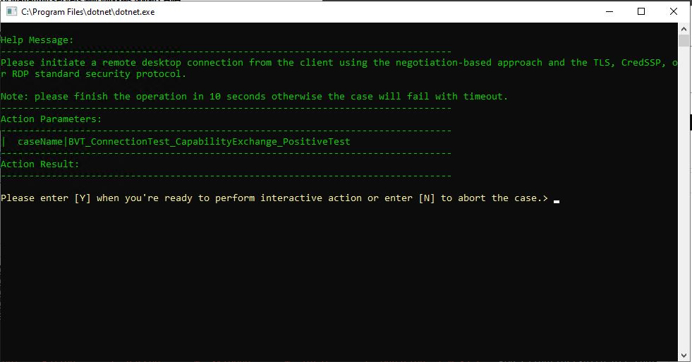

        #### **Figure 3. RDPConnectWithNegotiationApproach dialog**

        Read the **Help Message** in the dialog for instructions on manually performing the specified operations. To further accommodate the instructions, additional explanations are indicated below:

        -   On the **SUT computer**, start a remote desktop (RDP) connection to
            the **Driver** computer using the negotiation-based approach (see
            [MS-RDPBCGR section 5.4.2.1](https://docs.microsoft.com/en-us/openspecs/windows_protocols/ms-rdpbcgr/db98be23-733a-4fd2-b086-002cd2ba02e5))
            and specify either the TLS, Cress, or RDP standard security protocol to secure the RDP session. Once you start the RDP connection
            successfully, on the driver computer, input \'Y\' and press \"Enter\" key on the console. Otherwise, if you want to abort the
            case, input \'N\' and press \"Enter\" key on the console.The test case will continue to run if you press \"Enter\" key, otherwise, it
            will end and fail.

            *More Information* 
             **To learn more** about using the RDP standard security and RDP enhanced security, see MS-RDPBCGR sections [5.3](https://docs.microsoft.com/en-us/openspecs/windows_protocols/ms-rdpbcgr/8e8b2cca-c1fa-456c-8ecb-a82fc60b2322)
            and [5.4](https://docs.microsoft.com/en-us/openspecs/windows_protocols/ms-rdpbcgr/592a0337-dc91-4de3-a901-e1829665291d).

        -   After the RDP connection successfully starts, then in the **RDPConnectWithNegotiationApproach** dialog on the **Driver** computer, specify a non-negative number (such as 0) as the **Return
            Value** in the **Action Results** field, and then click the **Succeed** button. Otherwise, if you cannot start the RDP connection, specify a negative number (such as -1) as the **Return
            Value** in the **Action Results** field, specify the error message in the **Failure Message** field, and then click **Fail**.

  3.  After the formerly running **Test Case** finishes, observe that the following dialog displays on the **Driver** computer:

       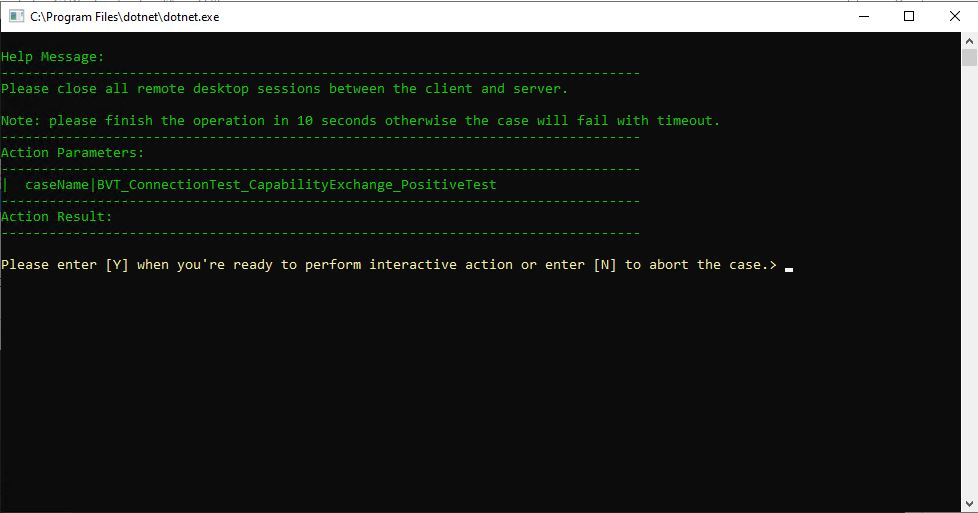
         #### **Figure 4. TriggerClientDisconnectAll dialog**

         According to the **Help Message**, you will do:

      -   On the SUT, close all the RDP connections to driver computer.

          On the driver computer, input \'Y\' on the console and press \"Enter\" key if you close all the RDP connections successfully. Otherwise, if you want to abort the case, input \'N\' and press \"Enter\" key on the console.

## Example: Running RDPEI Test Cases in Interactive Mode

This section provides an example of how to run RDPEI Test Cases in **Interactive** mode. However, note that the RDP connection is
configured in **PowerShell** mode. To test this example on the **Driver** computer, perform the procedure below and follow the interactive instructions.

**To run RDPEI test cases in an Interactive mode, example:**

  1.  On the **Driver** computer, configure the **Test Suite** mode to **Interactive**, as described in [Configuring the Test Suite Mode for MS-RDPEI Events](#configuring-the-test-suite-mode-for-ms-rdpei-events).

  2.  On the **Driver** computer, run the following Test Case:

          C:\RDP-TestSuite-ClientEP\Batch\RunTestCasesByFilter.ps1 -Filter "Name= Rdpei_TouchInputTest_Positive_SingleTouchEvent"

       When the Test Case begins running, the **SUT** computer initiates a remote desktop (RDP) connection to the **Driver** computer 
       using the negotiation-based approach (see [MS-RDPBCGR section 5.4.2.1](https://docs.microsoft.com/en-us/openspecs/windows_protocols/ms-rdpbcgr/db98be23-733a-4fd2-b086-002cd2ba02e5)),
       and specifies either the TLS, CredSSP, or RDP standard security protocol to secure the RDP session.

   3.  Observe that the following RDP **Negotiate** screen displays on the **SUT** computer:

       

         #### **Figure 5. RDP Touch screen prompt**

   4.  In the RDP **Negotiate** screen, manually touch the screen as requested.

   5.  Observe that the following response occurs in the **Negotiate** screen shown in the figure below, as an indication of Test Case success.

   6. When the Test Case is done, wait until the **SUT** computer disconnects from the **Driver** computer, which signifies the end of the Test Case.

       

         #### **Figure 6. RDP Touch screen response**

## Viewing Test Results

The **RDP Client Test Suite** test results output is located in different directory paths depending on the method used to execute the
Test Cases. The table that follows identifies the test mode and the related directory locations from where you can view test results data:

**Table 19. Test Case results directories**

| **Test Mode**                              | **Test Results Directory**                  |
|--------------------------------------------|---------------------------------------------|
| Batch files (.ps1)                         | C:\RDP-TestSuite-ClientEP\Batch\TestResults\ |
| Visual Studio                              | C:\RDP-TestSuite-ClientEP\Source\Client\TestCode\TestResults\ |
| Protocol Test Manager   and PTMCli.exe | C:\RDP-TestSuite-ClientEP\HtmlTestResults   C:\RDP-TestSuite-ClientEP\HtmlTestResults\DebugLog\ |
|                                            |                                              |

For further information about test log settings, see the [PTF User Guide](https://github.com/Microsoft/ProtocolTestFramework/blob/main/docs/PTFUserGuide.md).

## Running and Debugging Test Cases with Visual Studio

If you are creating your own Test Cases, typically in a C\# project, you can use the RDP_Client.sln solution file for Visual Studio to create a
project for your environment in which you can run and debug your Test Cases. This solution file is available [here](https://github.com/microsoft/WindowsProtocolTestSuites/tree/main/TestSuites/RDP/Client/src)
on GitHub.

Important

To proceed with Visual Studio debugging, you will need to have created a Visual Studio project for the **RDP Test Suite** from the RDP source
code, as described earlier in [Other RDP Test Suite Acquisition Methods](#other-rdp-client-test-suite-acquisition-methods). If you did not yet acquire the source code, do the following:

**To acquire the RDP Client Test Suite source code files, perform the following steps:**

  1.  Locate the **RDP Test Suite** code on GitHub in [this directory](https://github.com/microsoft/WindowsProtocolTestSuites/tree/main).

  2.  Download the **RDP Test Suite** files from all the folders in the previously specified directory location on GitHub, to a local directory location such as the following:

           C:\RDPTestSuiteSource\

       Note
         You should be able to click the **Code** button at the formerly specified GitHub directory and download a .zip file with all the RDP directories required for cloning.

To proceed with running and debugging your custom Test Cases, perform the steps that follow:

**To run and debug test cases using an RDP Client Test Suite installation built from source code:**

  1.  On the **Driver computer**, use Microsoft® Visual Studio® to open the RDP_Client.sln from the path you specified in the last procedure. Look under the .../TestSuites/RDP/Client/src subdirectory
    for the .sln file.

  2.  In the Visual Studio **Solution Explorer** window, right-click the **Solution** '**RDP_Client'** and select **Build Solution** from the context menu that appears.

  3.  Configure the RDP_ClientTestSuite.deployment.ptfconfig and RDP_ClientTestSuite.ptfconfig files as described in [Configuring the
    Test Suite](#configuring-the-test-suite). You can locate the .ptfconfig files in the following directory location, providing that
    you downloaded the **RDP Test Suite** files in accordance with the last procedure:

          C:\RDPTestSuiteSource\WindowsProtocolTestSuites\TestSuites\RDP\Client\src\TestSuite\

  4.  From the Visual Studio **Test** menu, navigate to **Windows** and click **Test Explorer** to open the list of Test Cases and then select the name/s of the Test Case/s that you want to run and debug.

  5.  While Test Cases are running, monitor the VS Output Window and debug errors and warnings as they appear.

# Using Protocol Test Manager

Protocol Test Manager (PTM) is a graphical front-end for all Windows
protocol **Test Suites**, which means that you can configure the **RDP
Client Test Suite** environment, execute the Test Cases, and thereafter
analyze all test results right from the PTM user interface (UI). The PTM
also has a **Configuration Wizard** that guides you through all the
review, configuration, and test execution processes. When test execution
is complete, the PTM provides several formats in which to view test
results data and other features with which you can conduct test results
analysis.

With the use of PTM, you can simplify detection and configuration of the
test environment and you can create your own customized test
configuration arrangements. The list that follows summarizes a
combination of tasks, some that PTM automates and others that PTM
exposes for you to perform:

-   PTM automates the following tasks:

    -   Reviewing the execution environment (**Domain** or **Workgroup**).

    -   Providing the **Auto-Detect** process to detect, inspect, and
        validate the **SUT computer** environment configuration and
        capabilities for test readiness.

    -   Creating a default set of Test Cases, based on the assessed **SUT**
        environment.

-   PTM exposes the features that enable you to do the following:

    -   Modify the default output of the **Auto-Detection** process, by selecting/unselecting (filtering) Test Cases to create a
        unique test configuration that will focus on a specific set of test results.

    -   Review and optionally configure Test Case properties.

    -   Trigger execution of a set of Test Cases.

    -   Save a test case **Profile** that preserves a specific Test Case
        configuration so that you can re-run it at any time by loading
        the **Profile** Test Cases into the PTM, or by using the
        PTMCli.exe command line tool to execute the Test Cases.

    -   Analyze the results of Test Case execution.

 The major topics covered in this section
include the following:

  &emsp;&emsp;[Installing the Protocol Test Manager](#installing-the-protocol-test-manager)

  &emsp;&emsp;[Running the Protocol Test Manager](#running-the-protocol-test-manager)

  &emsp;&emsp;[Other PTM Configuration and Execution Methods](#other-ptm-configuration-and-execution-methods)

## Installing the Protocol Test Manager

If you have not done so already, you will need to install the Protocol
Test Manager (PTM) now. Ensure that the **RDP Test Suite** and all of
its dependencies are installed before you do so, as described in
[Software Installation](#software-installation). When ready, install the
PTM on your **Driver computer** with the official
**ProtocolTestManager.msi**, as follows:

**To install the Protocol Test Manager:**

  1.  From the **Driver** computer, navigate
    [here](https://github.com/microsoft/WindowsProtocolTestSuites/releases)
    to locate the **ProtocolTestManager.msi** under the *Assets* topic
    on GitHub.

  2.  From the **Driver** computer, double-click the
    **ProtocolTestManager.msi** to run the installer.

  3.  Follow the installer instructions to complete the installation.

## Running the Protocol Test Manager

During PTM installation, a shortcut to the application is created on
your desktop. Thereafter, to start the PTM and perform the test
environment configuration and Test Case execution processes, complete
the following steps:

**To run the Protocol Test Manager**

  1.  Double-click the **Protocol Test Manager** icon/shortcut on your desktop.

        The **Select Test Suite** tab displays several Test Suites including  **File Sharing**, **Security**, **RDP**, and so on. Note that the only
          active **Test Suite** on the opening page of the PTM Wizard is **RDP**, as indicated by the live **Run** and **Configuration Wizard** links on the right side of the UI.

      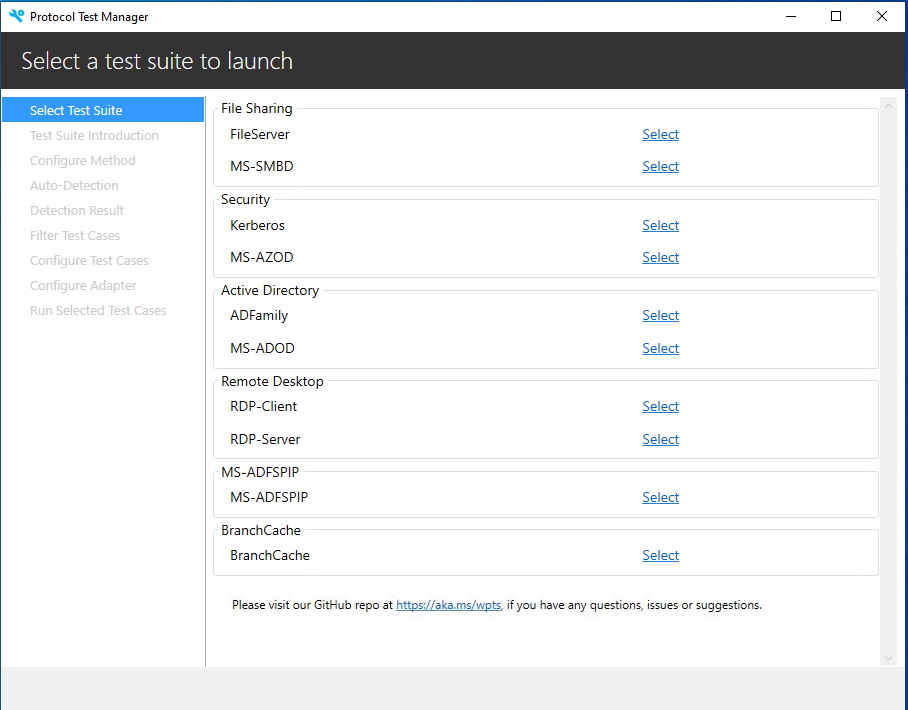

         #### **Figure 7. Protocol Test Manager: Launching the Configuration Wizard for RDP Client Test Suite**

         You need to select a protocol test suite as following.

      
         #### **Figure 8. Protocol Test Manager: Selecting RDP Client Test Suite Folder Path**

  2.  Click the **Configuration Wizard** link to begin the **Test Suite** configuration process.

      Note

      If this is for first time use, click the **Configuration Wizard** link
      to start the **RDP Test Suite** configuration process. Thereafter,
      while no Test Cases are running and if the **Test Suite** requires no
      further configuration changes, you can simply click **Run** to execute
      the existing (last) configuration of Test Cases while still retaining
      the existing **Test Suite** configuration settings.

      At any time, you can resume configuration of the **Test Suite**, by clicking **Configuration Wizard**.

       

         #### **Figure 9. Protocol Test Manager: Reviewing the RDP Test Suite family of protocols**

  3.  Read the information presented on the **Test Suite Introduction** page of the PTM Wizard and click the **Deployment Guide** link to
      review general information about the test environment in which you will run your Test Cases.

  4.  Click **Next** to display the **Choose configuration method** page of the PTM Wizard.

      Note

      It is unnecessary to click the **Configure Environment** link after reviewing the test environment, given that you will have already performed the indicated procedures earlier in this User Guide.

  5.  On the **Choose configuration method** page of the PTM Wizard shown in the figure that follows, click **Run Auto-Detection** to start
      the process of retrieving the capabilities of the SUT implementation (also click **Yes** to the **Warning** message that displays). The retrieved capabilities are used to automatically configure the
      **Test Suite** and select a default set of Test Cases for the assessed environment.

       Caution

        Unless you are adept at Microsoft RDP testing technologies and you understand how to assess the **SUT** environment with respect to
        manually choosing the correct Test Cases and configuring their properties, you are advised to not use the **Do Manual Configuration**
        option on the **Choose configuration method** page of the PTM Wizard. Also note that the **Load Profile** option is discussed in further
        detail ahead in [Working with a Profile](#working-with-profiles).

      *More Information*
  
      **To learn more** about the **Do Manual Configuration** feature, see [Manually Configuring Test Cases and Properties](#manual-configuration-of-test-cases-and-properties).

      

      #### **Figure 10. Protocol Test Manager: Choosing the configuration method**

      After you click **Run Auto-Detection**, the **Auto-Detection** page of the PTM Wizard displays, as shown in the figure that follows.

      

      #### **Figure 11. Protocol Test Manager: Verifying SUT connection parameters**

6.  On the **Auto-Detection** page of the PTM Wizard, verify that the values for such items as **SUT Name**, **SUT User Name**, **SUT
    Password**, and **Agent Listen Port** are correct in your environment, to ensure that the PTM can connect with the **SUT
    computer** and perform an accurate assessment of SUT capabilities.

7.  When verification is complete, click the **Detect** button in the lower-right sector of the **Auto-Detection** page (changes to the **Cancel** button, as in the previous figure).
     As the detection process proceeds, you will see the **Pending** indications beneath the data entry fields change to **Finished** as detection progress continues.

8.  After the initial detection process completes, click **Next** to display the **Detection Result** page of the PTM Wizard, as shown in the figure that follows:

    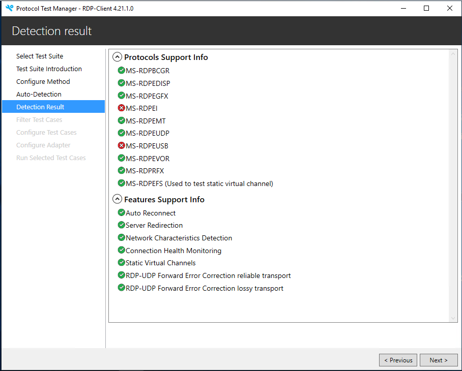

      #### **Figure 12. Protocol Test Manager: Reviewing the Detection Results**

9.  In the **Detection Result** page of the Wizard, review the data that appears under the **Protocols Support Info** 
    and **Feature Support Info** nodes to ensure that the supported protocols and features are as you expect.

    Tip

    If there are unexpected unsupported entities in the detection results,
    you may want to consider re-examining the SUT configuration processes
    that you performed earlier in this User Guide, for example, in
    [Configuring the Test Suite](#configuring-the-test-suite).
     Otherwise, click **Next** to display the **Filter Test** **Cases** page of the PTM Wizard.

10. From the **Filter Test Cases** page of the PTM Wizard shown in the figure that follows, select different combinations of Test Cases
    from the categories that follow. However, you will need to select at least one of the sub-nodes in the **Priority** category and one
    in the **Protocol** category to activate and display associated Test Cases for a test run:

    -   **Protocol** --- contains the RDP protocols under test (**SUT** implementation).

    -   **Priority** --- enables you to specify the type of tests to run (**BVT** or **NonBVT**).

    -   **Enable Supported Feature** --- activates Test Cases for supported features discovered in **Auto Detect**.

    -   **Specific Requirements** --- enables you to specify the Interactive mode of testing described earlier in [Test Run Pre-Configuration](#test-run-pre-configuration).

    Each time you select a Test Case node, the total number of selected Test Cases appears just to the right of the **Selected Test Cases** label. 
    Take note that if a Test Case belongs to multiple categories, it is listed in each category.

    Important

    If the detection status of a feature or protocol is not supported, it will appear in italics and will provide a tool tip message to that
    effect, that is, if you mouse-hover over that particular component. See *RDPEUSB* in the figure below as an example.

    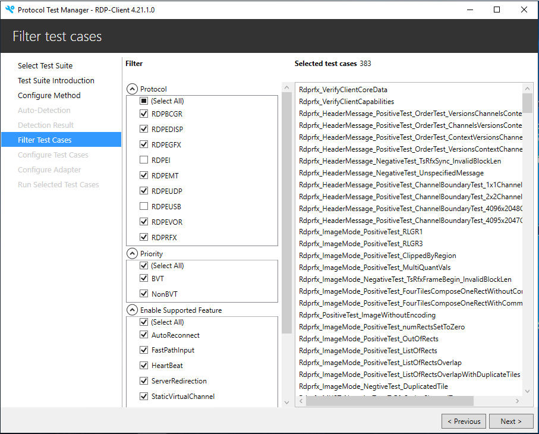

      #### **Figure 13. Protocol Test Manager: Selecting (filtering) Test Cases**

11. Create a hypothetical Test Case configuration in the steps that follow:

    a.  In the four categories described in the previous step, unselect the **Select All** node in each category.

    b.  In the **Protocol** category, select a protocol such as **RDPBCGR**.

    c.  In the **Priority** category, select either the **BVT** or **NonBVT** check box.

    d.  Observe that the Test Cases that apply to the selected protocol display in the Test Cases list view along with 
        the number of tests in the **Selected Test Cases** label, as similar to the previous figure. If you selected **BVT**, you will run the basic build verification
        Test Cases for the **Protocol** you selected, as described in [Running Verification Tests](#running-verification-tests), otherwise, the **NonBVT** tests for 
        that **Protocol** will apply to the test run.

    e.  Click **Next** to display the **Configure Test Cases** page of the Wizard, as shown in the figure that follows.

      

      #### **Figure 14. Protocol Test Manager: Reviewing/configuring Test Case properties**

12. On the **Configure Test Cases** page, click the **Default Group** to
    display the RDP properties that you verified (or revised) in
    [Configuring the Test Suite](#configuring-the-test-suite).

13. Scroll through the property values to ensure they are correct.

14. Select the **PTF** group to display the **Network Capture**
    properties that enable your Test Cases to create event trace log
    (ETL) data that you can analyze with a protocol analysis tool such
    as Microsoft Message Analyzer (MMA).
     Note that if you want to utilize this feature, you will need to have
    installed MMA as described in [Optional Software](#optional-software).
    If you want to proceed, follow these sub-steps:

    a.  Click the **NetworkCapture** node to display the data entry fields,
    if not displayed already.

    b.  Set the **StopRunningOnError** field to false, if it is not already
    set that way.

    c.  Ensure that the **CaptureFileFolder** path is set to
    "C:\\RDPClient_CaptureFileDirectory" and also verify that this
    folder actually exists on the **Driver** computer.
    If it does not, then please create it in the specified location.

    d.  Set the **Enabled** field to true.

    e.  When complete, click **Next** to display the **Configure Adapters**
    page of the Wizard, as shown in the figure that follows.

    

      #### **Figure 15. Protocol Test Manager: Configuring the Adapters**

15. In the **Configure Adapters** page of the PTM Wizard, observe the following Adapters and the indicated topics to which the adapter settings correspond:

    **Table 20. Control Adapter configuration setting instructions**

    |**Adapter Name**               |**Related Topic**|
    |-------------------------------|-----------------|
    | Basic RDP SUT Control Adapter | [Configuring Common Test Suite Mode Settings](#configuring-common-test-suite-mode-settings)|
    | RDPEI SUT Control Adapter     | [Configuring the Test Suite Mode for MS-RDPEI Events](#configuring-the-test-suite-mode-for-ms-rdpei-events)|
    | RDPEDISP SUT Control Adapter  | [Configuring the Test Suite Mode for MS-RDPEDISP Events](#configuring-the-test-suite-mode-for-ms-rdpedisp-events)|
    |                               |                 |

16. Click the drop-down arrow for each Adapter and select the
    appropriate mode setting from the following options, while noting
    that **PowerShell** is the default setting:

    -   **Interactive** --- the Interactive adapter displays a dialog that enables you to manually perform operations and to thereafter enter results in the dialog.

    -   **Managed** --- the Managed adapter uses managed code to implement the adapter's methods.

    -   **PowerShell** --- the PowerShell adapter uses PowerShell scripts to implement the adapter\'s methods.

    -   **Shell** --- an additional option that enables Unix shell scripts to implement the adapter\'s methods.

    *More Information*
     **To learn more** about adapter settings, see the topic [Test Run Pre-Configuration](#test-run-pre-configuration).

17. When complete, click **Next** to display the **Run selected test cases** page of the PTM Wizard, as shown in the figure that follows.

    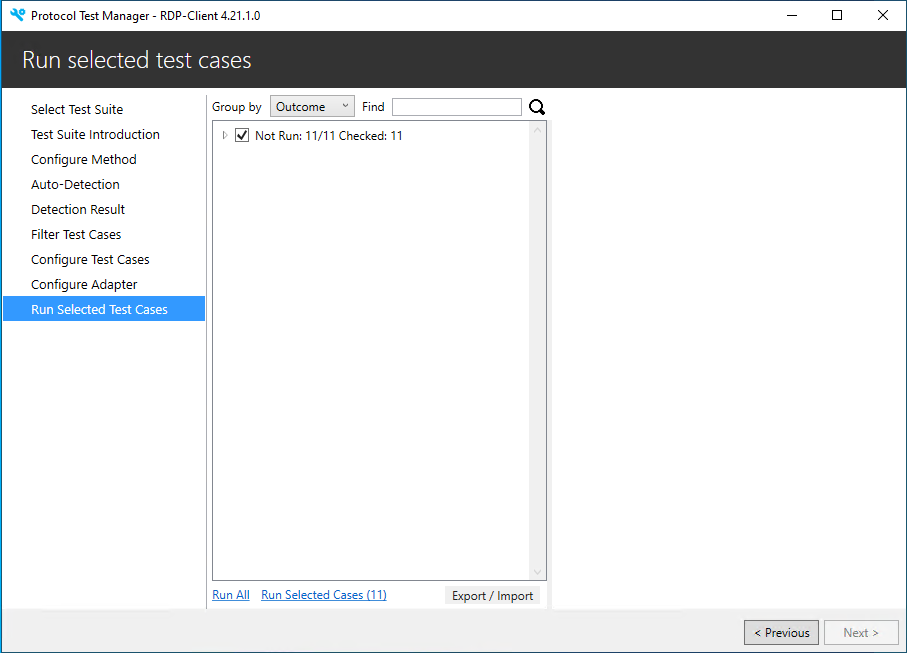

    #### **Figure 16. Protocol Test Manager: Running the selected Test Cases**

18. Observe that the following options in the lower sector of the UI are available for running Test Cases from the **Run Selected Test Cases** tab of the PTM:

    Important

    Do not execute Test Cases** **now! Only execute the tests from [Running the Test Cases](#running-the-test-cases) ahead**.

    -   **Run All** --- clicking this link will run all Test Cases.

        If you select this option, all Test Cases that exist under the **Not
        Run** checkbox on the **Run Selected Test Cases** tab of PTM will be
        executed, whether the Test Cases are actually selected. These Test
        Cases are the ones that you selected/filtered earlier on the **Filter
        Test Cases** tab of PTM and therefore appear on the **Run Selected
        Test Cases** tab.

        This option *does not* *mean* you will be executing *all* the default
        Test Cases returned from auto-detection of the SUT configuration, but
        rather the *set* of Test Cases you filtered from the default set.

    -   **Run Selected Cases** --- clicking this link will execute the *selected* Test Cases only.

If you are ready to run your Test Cases, go to the procedure: [Running the Test Cases](#running-the-test-cases). Otherwise, proceed to the next
topic for additional information about indications you can expect during Test Case execution.

### Monitoring Test Case Execution

After you start Test Cases execution in [Running the Test Cases](#running-the-test-cases) ahead, two command shells will display
with test execution data, which includes success and failure indications. After execution is complete, you can view Test Case logs to
the right of the Test Case list view, by selecting any Test Case in the list view.

As the tests are running in PTM, you can view high level results in the following three categories. As Test Case execution progresses, you can
observe these categories being incrementally updated:

  -   **Passed** --- provides a dynamic indication of how many tests have passed, out of the total number selected for execution.

  -   **Failed** --- provides a dynamic indication of how many tests have failed, out of the total number selected for execution.

  -   **Inconclusive** --- indicates the tests that were inappropriate, unsupported, or the result of misconfiguration in the test environment.

      For example, if a property set in the > RDPTestSuite.Deployment.ptfconfig file is incorrectly configured, or a Test Case conflicts with an unexpected or invalid property value, that Test Case can finish as Inconclusive.

Note

In the PTM, you can drag the separator between the Test Case list view and the right-hand side output log pane to adjust the width of the window for better viewing.

Important

If any of the core/preconfigured Test Cases in a test environment do not
support certain features, errors will appear in the command console and
PTM with respect to methods that failed when attempting to test those
features. Notwithstanding errors from actual failures, you can avoid
this outcome by running only the Test Cases that support the features of
your environment.

*More Information*

**To learn more** about Test Cases and the tests they perform, review
their descriptions in the *Test Scenarios* section of the [RDP Client Test Design Specification](https://github.com/microsoft/WindowsProtocolTestSuites/blob/main/TestSuites/RDP/Client/docs/RDP_Overview_ClientTestDesignSpecification.md#2.2.1).

### Running the Test Cases

To run your Test Cases, perform the steps of the procedure that follows.

**To run the Test Cases**:

  1.  On the **Run Selected Test Cases** page of the **PTM** wizard,
      select the **Not Run** check box if it is not already selected and
      then click the **Run Selected Cases** link below the Test Cases list
      view, as shown in the figure that follows.

      Given that the **Not Run** checkbox is selected, all the Test Cases
      under the checkbox are also selected and will run when you click the
      **Run Selected Cases** link, as described earlier in this section.

  2.  To prevent any Test Case in the selected test set from running,
      click the down-arrow to the left of the **Not Run** checkbox and
      unselect one or more tests to exclude them from running, as shown in
      the figure that follows.

      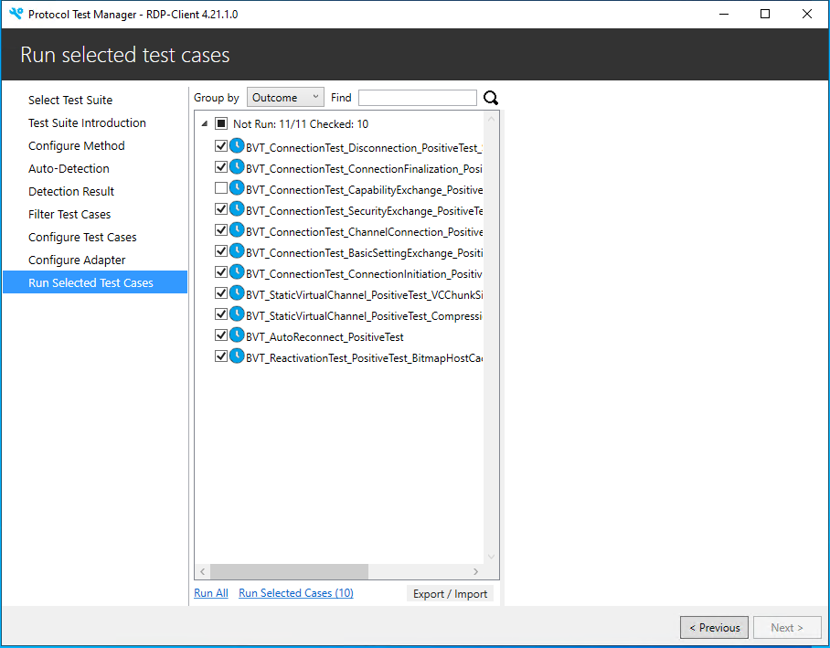

      #### **Figure 17. Protocol Test Manager: Removing Test Cases from execution**

      Tip

      You can also run Test Cases from the context menu that appears when
      you right-click in the Test Case list view itself. The context menu
      provides commands such as **Run Selected Cases** and **Run All
      Cases**, as shown in the following figure. In addition, you can select
      the **Uncheck All** command to uncheck all selected Test Cases.

      Whether you select the **Run Selected Cases** or the **Run All Cases**
      context menu command, the effect will be as described
      earlier. In addition, if you select the **Uncheck
      All** context menu command, then no Test Cases will run afterwards
      when you click the **Run Selected Cases** context menu command.
      However, if you select the **Run All** context menu command
      afterwards, all Test Cases listed under the **Not Run** checkbox will
      execute.

      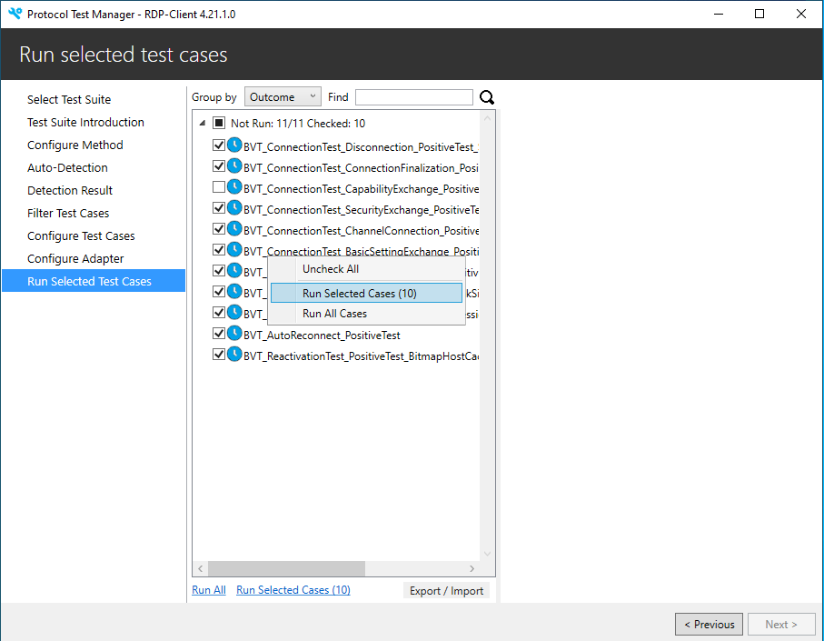

      #### **Figure 18. Protocol Test Manager: Context menu commands for Test Case execution**

3.  To display the context menu shown in the figure immediately above,
    click the down-arrow to the left of the **Not Run** check box in the
    Test Cases list view, then right-click the list of tests to display
    the menu. If Test Case execution is currently *not* *in progress*,
    click the **Run Selected Cases** command in the context menu to
    begin test execution.

4.  While the Test Cases are executing, observe the indications that
    appear in the **Passed**, **Failed**, and **Inconclusive** check box
    labels as described in [Monitoring Test Case
    Execution](#monitoring-test-case-execution).

    Note

    You can also view the results of Test Case execution in the command consoles that host test execution. However, note that the PTM makes
    the results more accessible and understandable through categorization, summaries, status indicators, and built-in logs, as described just ahead.

### Reviewing the Test Results

After Test Case execution is complete, you can view the details of the
execution results. The results that are likely to be of the most
interest are the Test Cases that failed. The PTM provides a number of
tools that can quickly point you to what the causes of a failure might
be.

The PTM enables you to utilize various status indicators, stack
messages, error messages, icons, logs, and other highlighted indications
that can pinpoint the cause of failures very rapidly. In addition, you
can launch an HTML-based display of output results that independently
reproduces the PTM output data displays.

Note

As a developer who is using a Microsoft Test Suite to test real-world
protocol implementations, you can utilize the PTM analysis features to
verify the outcome of custom Test Case execution as **Passed**,
**Failed**, or **Inconclusive**. Each of these indications can be of
equal importance when it comes to resolving issues that are critical to
a successfully functioning protocol.

#### **Test Results Output Status Indicators**

Some of the status indicators that you will encounter as you review your
test results are described in the table that follows:

**Table 21. Test results status indicators**

| **Status Indicator** | **Description**      | **UI Location**      |
|----------------------|----------------------|----------------------|
| Initial test results status summary | Results display in either of these configurations:The number of Test Cases that passed, failed, or were inconclusive. The number of Test Cases that executed for specific RDP operations, where the number of tests that were run are identified. | 1.	The first results display configuration is shown as expandable **Passed**, **Failed**, and **Inconclusive** results category check box nodes in the left-hand Test Cases pane of the PTM. Appears when selecting the **Outcome** item in the **Group by** drop-down list.  2.	The second results display configuration is broken down into the various categories of RDP operations or protocols being tested, for example **ServerRedirection** or **StaticVirtualChannel**, where the number of Test Cases associated with the operation or protocol is indicated, while the number of tests having issues is specified by a **Checked** indicator. Appears when selecting the Category item in the **Group by** drop-down list. |
| **Start Time** and **End Time** | Exposes the overall duration of Test Case execution. | Appears in the upper left sector of the right-hand test results pane for any selected Test Case in any results category. |
| **Result**                     | The results category for a particular Test Case, for example: **Passed**, **Failed**, or **Inconclusive**. | Appears in the upper left sector of the right-hand test results pane for any selected Test Case in any results category. |
| Test Case functionality | The general purpose of a Test Case. | Typically described in a **[Comment]** tag that appears in the [StandardOut](#standardout-category-status-indicators) category of results. |
| Debug output data | Informative data that is displayed in tags in the [StandardOut](#standardout-category-status-indicators) category of results. | Includes data that displays in information tags such as the following:  &emsp;-	[TestInProgress]  &emsp;-	[Comment]  &emsp;-	[Debug]  &emsp;-	[CheckPoint]  &emsp;-	[CheckSucceeded]  &emsp;-	[CheckFailed]  &emsp;-	 [TestStep]  &emsp;-	[TestPassed]  &emsp;-	[TestFailed]  See [StandardOut Category Status Indicators](#standardout-category-status-indicators) for descriptions. |
| Error output data | Holds data that you can analyze to identify the source of Test Case failures. | Appears in the [ErrorStackTrace](#errorStackTrace-category) and [ErrorMessage](#errorMessage-category) categories of results. |
| Test case status |  — indicates the executed Test Case status as **Passed**.    — indicates the executed Test Case status as **Inconclusive**.   — indicates the Test Case status is **Not Run**.   — indicates the executed Test Case status as **Failed**.                | These indicators appear immediately to the right of the Test Case check box after test execution, to indicate the test result status; the exception is the blue **Not Run** status indicator, which appears prior to test execution and persists this status if a Text Case did not run.  |
|                  |                          |                      |

*This same information is repeated as the text of a hyperlink that appears in the upper-right-hand sector of the PTM. This hyperlink opens an HTML-based display of test results.

The figure that follows is an example of the **Category** grouping for
Test Cases (grouped by RDP operations that contain the Test Cases), and
also shows the three results output categories for test analysis in the
right-hand pane of the PTM.

Note that in the expanded **RDP7.1** test result node below, **RDPEUSB**
errors occurred because it is an unsupported feature, as described
earlier in the Auto detect portion of [Running the Protocol Test Manager](#installing-the-protocol-test-manager).

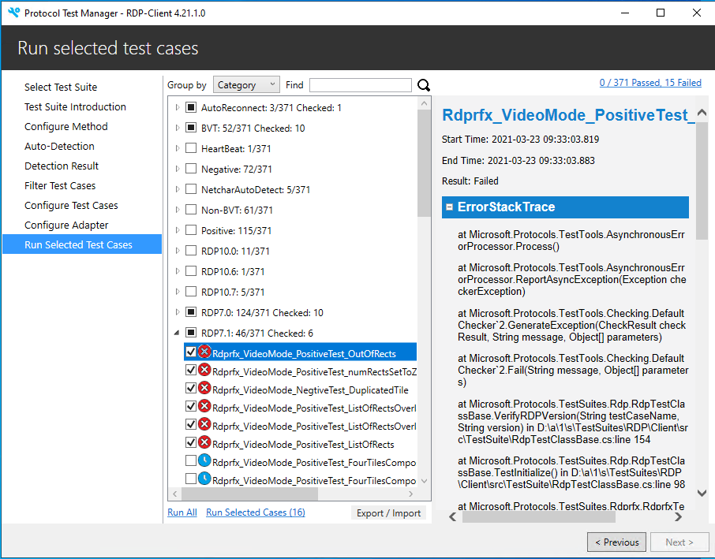

#### **Figure 19. Protocol Test Manager: RDP Category grouping \| Expanded ErrorMessage result**

#### **StandardOut Category Status Indicators**

Some of the low-level indicators of the **StandardOut** category that
are directly associated with the incremental step-by-step record of how
the tests were conducted, along with interim results, are described as
below. Note that the **\[CheckSucceeded\]**, **\[Comment\]**, and
**\[Debug\]** information tags are shown in the figure that follows.

**\[TestStep\]** --- highlighted in **Blue**. Describes the details of a
particular step in a Test Case.

**\[Debug\]** --- no highlighting, plain text. Describes actions that
were taken during a portion of a Test Case, such as connecting to a
server over TCP, as part of the **\[TestStep\]** in which it exists.

**\[Checkpoint\]** --- no highlighting, plain text. Provides values at
key points during a test that can elicit insights into the causes of an
imminent failure. Can also include pointers to protocol specification
sections that define acceptable data type values and ranges, to assist
in troubleshooting.

**\[CheckSucceeded\]** --- highlighted in **Green**. Indicates that the
actions taken at a particular check point of a **\[TestStep\]** were
successful.

**\[CheckFailed\]** --- highlighted in **Red**. Indicates that the
actions taken at a particular check point were unsuccessful.

**\[TestPassed\]** --- highlighted in **Green**. Indicates that the Test
Case passed.

**\[TestFailed\]** --- highlighted in **Red**. Indicates that the Test
Case failed.

**\[Comment\]** --- no highlighting, plain text. Provides other
information such as brief descriptions of Test Case actions, states,
values, and so on.

Note

Most of the above information tags are also returned from the
**Protocol-Test-Suite** message provider that you can use to detect
local RDP messages in a Message Analyzer trace session, as described in
[Capturing RDP Traffic with Message
Analyzer](#capturing-rdp-traffic-with-microsoft-message-analyzer)

The figure that follows shows the **BVT** category of tests and the
expanded **StandardOut** node with several of the above information tags
displayed. In the case of the selected
**BVT_AutoReconnect_PositiveTest** in the figure, the
**\[CheckSucceeded\]** tag verifies that the **SUT** should support the
**Auto-Reconnect** feature.

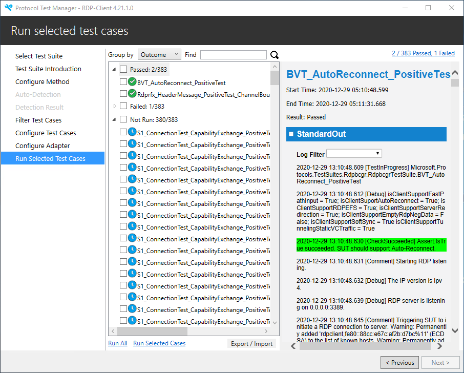

#### **Figure 20. Protocol Test Manager: RDP BVT test category \| StandardOut node**

Note

You can display Test Cases that meet specified search criteria by typing
a search term in the **Find** text box and pressing the **Enter** key on
your keyboard.

**Test Results in HTML Format** If you click the link in the upper-right
sector of the PTM UI, an HTML-based display of test results appears with
various options for reviewing the results, as shown in the next figure.

In the **Case List** pane of the HTML display in the figure, you have
the following options for grouping the Test Cases to expose different
analysis perspectives of the data, as follows:

  -   **None** --- provides a flat list of Test Cases that are listed in
    ascending sorted order.

  -   **Test Results** --- groups the Test Case results in **Failed**,
    **Inconclusive**, and **Passed** nodes.

  -   **Category** --- groups the Test Case results under various
    operation or feature names.

  -   **Class** --- groups the Test Case results in nodes that contain the
    name of the protocols under test.

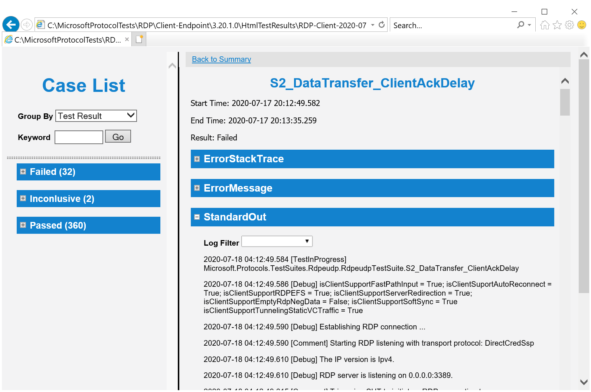

#### **Figure 21. Protocol Test Manager: Case List HTML test results display**

Note

You can also search for Test Cases by typing a search term in the
**Keyword** text box and clicking the **Go** button. You can also filter
the **StandardOut** results via a **Log Filter**.

#### **ErrorStackTrace Category**

Provides a visual indication of the call stack where a failure occurred.
The Error message itself displays at the end of the **ErrorStackTrace**
information, which extends into the **ErrorMessage** category.

#### **ErrorMessage Category** 

Provides details and comments that can identify the source of the error
event and the conditions that existed when the error event occurred. As
an aid to further inspection of the error event, the PTM can provide
comments that point you to the related sections of a Microsoft RDP
protocol specification, which may shed light on what the underlying
failure may be related to, such as expected states, values, parameters,
event data, and so on.

## Other PTM Configuration and Execution Methods

This section provides a brief overview of the manual configuration of
Test Cases and properties and the disadvantages of proceeding without
the **Auto-Detect** feature of the PTM.

This section also discusses how to create a **Profile** that
encapsulates a chosen set of Test Cases, so that you can re-run such a
set of tests on demand. One such use of the **Profile** feature might be
to compare test results before and after the following:

  -   Changes to the RDP_ClientTestSuite.deployment.ptfconfig file.

  -   Revisions to PowerShell script files (.ps1).

  -   Code fixes in one or more Test Cases (providing that you are creating your own Test Cases).

You could also perform periodic re-runs of Test Cases to achieve other
goals that are specific to your custom environment.

Lastly, this section describes how to run Test Cases from a command line
tool known as PTMCli.exe.

The following topics in this section cover the concepts that are described above:

&emsp;&emsp;[Manual Configuration of Test Cases and Properties](#manual-configuration-of-test-cases-and-properties)

&emsp;&emsp;[Working with Profiles](#working-with-profiles)

&emsp;&emsp;[Executing Test Cases from the Command Line](#executing-test-cases-from-the-command-line)

### Manual Configuration of Test Cases and Properties

To perform manual configuration of Test Cases, you will need to click
the **Do Manual Configuration** option on the **Configure Method** page
of the PTM Wizard. This takes you directly to the **Filter Test Cases**
page and by-passes the use of **Auto-Detection**.

By doing so, you will be unable to take advantage of the automatic
detection and assessment of the **SUT computer** environment so that you
can obtain a recommended set of default Test Cases to run, in addition
to automatically-specified Test Case properties. As a result of working
in this mode of operation, you will need to do the following manually:

-   Select a set of Test Cases for configuration and execution.

-   Configure the Test Case properties.

-   Configure the control Adapters.

-   Select the final set of Test Cases to execute.

-   Click **Run Selected Cases** to begin test execution.

When you are working on the basis of manual Test Case selection and
property configuration, you should be very familiar with which Test
Cases will support your **SUT** environment, the features that are
supported in the **SUT** environment, and the property values necessary
for successful Test Case execution. A lack of knowledge in this regard
could result in errors that occur because of unsupported features or
improper/missing property values, thus hindering the primary goal of
detecting errors that are related to actual Test Case failures.

### Working with Profiles

This section describes how to save a **Profile** and how to use it to
run the Test Cases the **Profile** contains from the **Load Profile**
option in PTM.

#### **Saving a Profile**

After you complete test execution based on a particular Test Case
configuration in [Running the Test Cases](#running-the-test-cases), you
have the option to use the PTM to save the configuration as a
**Profile** that you can re-run on demand simply by locating
the **Profile** in a specified directory and loading it directly into
the PTM or by executing it from the command line. Thereafter, you can
analyze the data in HTML or text log format.

In order to utilize a **Profile** in the stated manner, it is
recommended that you run the **RDP Client Test Suite** at least once and
then save a **Profile** that extracts the selected Test Cases and
related configuration information.

Important

If you want to save specific Test Cases in a **Profile**, you must
select them before your save the **Profile**, otherwise the **Profile**
will not contain any Test Cases.

Note that you can also optionally save a **Profile** *before* actually
running your Test Case configuration, but in this case, you will not
have the advantage of knowing if the Test Case configuration performed
well or not, and whether you really want to save it --- for example, as
a test results baseline for a certain set of features you plan to
re-test for comparison after making changes in a protocol
implementation.

After you save a **Profile**, you can then use it in subsequent re-runs
of the profiled test environment where you use the **Load Profile**
option in PTM, as described in [Loading a Profile](#loading-a-profile);
or you can use the PTMCli.exe command line tool to launch Test Case
execution (see [Executing Test Cases From the Command
Line](#executing-test-cases-from-the-command-line)).

You can save a **Profile** by performing the steps that follow.

**To save a Profile that encapsulates the currently *selected* Test Case configuration**

1.  In the **Run Selected Test Cases** page of the PTM Wizard, select
    the Test Cases that you want in your **Profile**.

    Important

    Please ensure that you *select* Test Cases *before* saving your
    **Profile**. This is especially important if you intend to use the
    PTMCli.exe command line with the -s switch, which specifies that only
    selected Test Cases will be executed in the **Profile**. See
    [Executing Test Cases From the Command Line](#executing-test-cases-from-the-command-line) for more
    information about PTMCli.exe.

2.  Just below the PTM Test Cases list view on the **Run Selected Test
    Cases** page of the PTM Wizard, click the **Export/Import** link, as
    shown in the figure that follows, and then click the **Save
    Profile...** drop-down menu item to save the selected Test Cases in
    the current test configuration along with all the underlying related
    properties.

    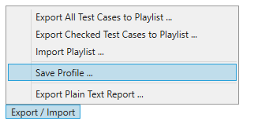
    #### **Figure 22. Protocol Test Manager: Saving a test case Profile**

    This action should open a **Save** dialog. By default, the **Profile**
    is saved in the user **Documents** folder, but you can change the
    default by navigating to another directory location as necessary.

3.  Specify an appropriate name for the **Profile** and then close the
    open **Save** dialog.

#### **Loading a Profile**

After you have saved a **Profile** as described in [Saving a
Profile](#saving-a-profile), you can load the Test Case configuration of
the saved **Profile** into the PTM where you can execute the Test Case
configuration as is, or modify it before executing. To load a
**Profile**, perform the steps of the following procedure.

**To load a saved Profile into the PTM and execute the Test Case configuration**

  1.  On the **Configure Method** page of the PTM Wizard, click **Load Profile**. The Test Case configuration of the **Profile** displays in the **Run
  Selected Test Cases** tab of PTM.

  2.  To run all Test Cases of the **Profile**, click the **Run All** command beneath the Test Case list view. The Test Cases will run the same as any other set of Test Cases do
      with all the status indications that occur during normal Test Case execution progress.

  3.  To only run selected Test Cases from the **Profile**, first select
      the Test Cases you want to run and then click the **Run Selected
      Test Cases** command beneath the Test Case list view.

  4.  In either execution mode, observe that Test Case execution provides
      all the normal indicators as the tests progress to completion.

### Executing Test Cases from the Command Line

The PTM enables you execute the Test Case configuration of a previously
saved **Profile** with the use of a simple command string. In this mode
of Test Case execution, you will trigger this process from outside the
PTM UI test environment, which could also potentially be from a remote
location.

The application that enables you to do this is known as PTMCli.exe. The
PTMCli.exe is in PTMCli.zip that can be download from GitHub . then
extract this zip package to C: \\PTMCli

To execute the Test Cases of a **Profile** by using a command string,
perform the procedure that follows:

Important

You *should not* run the PTMCli.exe application while the PTM is either
open or has Test Case execution in progress. If you do, the PTMCli.exe
application will not start or an error will occur, respectively.

**To load a Profile from the command line**

  1.  From the **Start** menu, type "Cmd" and then double-click the
    **Command Prompt** icon.
     Note that you might need to run the command console as Administrator.

  2.  From the command line, navigate to the following directory location
    on the **Driver** computer with the cd command:

          cd C:\PTMCli\

  3.  At the command line, type the following command string:

          PTMCli.exe -p <profilepath> -s

       Note
       
       The -p switch requires you to specify the directory path to a saved
        **Profile** and the -s switch in this command enforces execution of
       selected Test Cases only.
       
       If you are using the -s switch and you have not selected any Test
       Cases, as described in [Saving a Profile](#saving-a-profile), the
       PTMCli.exe will report shortly after it begins running that it
       "Finished running test cases", which means that no tests were actually
       run. If this occurs, simply remove the -s switch from the PTMCli.exe
       command string and run PTMCli.exe again.

  4.  Confirm that the Test Case execution results begin to appear in the command console.

       With PTMCli.exe, test progress typically appears as % complete at the
       command line while the test results scroll through the command shell
       display.
       
Note

For additional information about functionality that is available with the PTMCli tool, use the -help switch to display it:

    PTMCli.exe <-help | -h>

# Viewing RDP Output Data with Message Analyzer

The **RDP Client Test Suite** output data consists of text logs and
HTML-based logs that you can read manually or as Test Case result
displays that are built into the PTM, as described in [Reviewing the
Test Results](#reviewing-the-test-results). You can also use Message
Analyzer to capture **RDP** **Client Test Suite** output data with the
use of the following message providers:

**Protocol-Test-Suite** --- enables you to capture the **Test Suite**
output log data and to highlight and expose specific types of messages
of interest with the use of Message Analyzer's **Color Rule** feature.

**Windows-NDIS-PacketCapture** --- enables you to capture **Driver** and
**SUT** computer communications on the wire as Test Cases are executing.

In merging these two sources of data into a single Message Analyzer
session, it is much easier to understand what the Test Suite is doing
when you are debugging Test Cases; as Message Analyzer has many types of
filtering that you can apply to manipulate the data display to expose
and isolate target data of interest.

Important

As of November 25 2019 - Microsoft Message Analyzer (MMA) was retired
and removed from public-facing sites on microsoft.com. A private MMA
build is available for testing purposes; to request it, send an email to
<getmma@microsoft.com>. However, note that Message Analyzer will
continue to be supported in this Test Suite only up until **RDP Client
Endpoint Test Suite** version 3.20.1.0. After that, a different tracing
and message analysis tool will take its place in this test suite.

This section describes how to install and configure MMA for use with the
**RDP Client Test Suite**, which includes deploying a set of **Color
Rules** for detection of certain **RDP Client Test Suite** output
message types.

 The major topics covered in this section
include the following:

  &emsp;&emsp;[Install and Configure Microsoft Message Analyzer](#install-and-configure-microsoft-message-analyzer)

  &emsp;&emsp;[Capturing RDP Traffic with Microsoft Message Analyzer](#capturing-rdp-traffic-with-microsoft-message-analyzer)

## Install and Configure Microsoft Message Analyzer

Microsoft Message Analyzer (MMA) is used to capture data on the wire and
merge it with data dumped by the **RDP Client Test Suite**. To install
and configure MMA for use with the **RDP Client Test Suite**, perform
the steps that follow:

**To configure MMA for use with the RDP Test Suite**

  1.  Install Microsoft Message Analyzer v1.4, if you have not already
    done so. See [Optional Software](#optional-software) for details on
    how to obtain the MMA installer.

  2.  Copy the OPN files in the directory that follows to your clipboard:

          C:\RDP-TestSuite-ClientEP\Data\SuperLogViewer\OPNs\*.opn

  3.  Paste the clipboard contents to the following MMA installation directory:

          C:\Program Files\Microsoft Message Analyzer\OPNAndConfiguration\OPNs\Microsoft\Windows\RemoteDesktop\

      Caution
      
      If this is not the first startup of MMA, then copy the OPN files to the following directory instead:

          C:\Users\<username>\AppData\Local\Microsoft\MessageAnalyzer\OPNAndConfiguration\OPNs\Microsoft\Windows\RemoteDesktop

  4.  Start MMA by running as Administrator.

  5.  Click **Start Local Trace** to begin tracing in order to expose the **Color Rules** drop-down on the **Analysis Grid** toolbar.

  6.  Stop tracing by clicking the **Stop** button on the Message Analyzer ribbon.

  7.  Click the **Color Rules** drop-down in the **Analysis Grid** toolbar and select **Manage Color Rules**.

  8.  In the **Manage Color Rule** dialog, click the **Import** button and navigate to the following directory location on the **Driver** computer:

          C:\RDP-TestSuite-ClientEP\Data\SuperLogViewer\

  9.  Select the **RDPColorRule.asset** file and then click **Open** in the **Select Library to Open** dialog to import the RDP **Color Rule** library.

      Observe that the RDP **Color Rules** display in the **Network** category, as shown in the figure that follows.

      

      #### **Figure 23. Message Analyzer Select Items to Import dialog**

  10. Click **OK** in the **Select Items to Import** dialog.

  11. In the **Manage Color Rule** dialog that appears, ensure that all the RDP **Color Rules** are selected in the **Network** category under **My Items**.

       Note
       
       When you are reviewing trace results, all the RDP **Color Rules**
       should be selected and highlighting the appropriate messages. However,
       note that only one of the following **Color Rules** will display in
       the trace results, depending on whether RDP session security is set to
       use standard RDP Security or enhanced RDP Security (TLS):

       -   **RDP_Decrypted**

       -   **TLS_Decrypted**

       See [Common Required Property Settings](#common-required-property-settings) for further information.

## Capturing RDP Traffic with Microsoft Message Analyzer

After importing the RDP **Color Rules** for Microsoft Message Analyzer,
perform the steps that follow to capture RDP traffic and apply **Color
Rules** for identification of certain RDP messages.

**To configure an MMA session and capture local RDP traffic during Test Case execution**

  1.  On the Message Analyzer ribbon, click the **New Session** button to display the **New Session** dialog.

  2.  On the **New Session** dialog, click the **Live Trace** button to display the configuration for a new session.

  3.  In the **ETW Providers** pane, click **Add Providers** and then click **Add System Providers** in the context menu to display the **Available System Providers** list.

  4.  In the search text box, type **Protocol-Test-Suite**. When this provider displays in the list, select it and then click **Add To**.

      The **Protocol-Test-Suite** provider enables you to aggregate the data from **RDP Client Test Suite** logging.

  5.  Repeat the previous step for **Windows-NDIS-PacketCapture**. Click **OK** when done.

      This message provider enables you to capture data on the wire, such as any wire data that is produced by **Driver** and **SUT** computers during Test Case execution.

      The specified message providers should display in the **New Session** dialog, as shown in the figure that follows:

      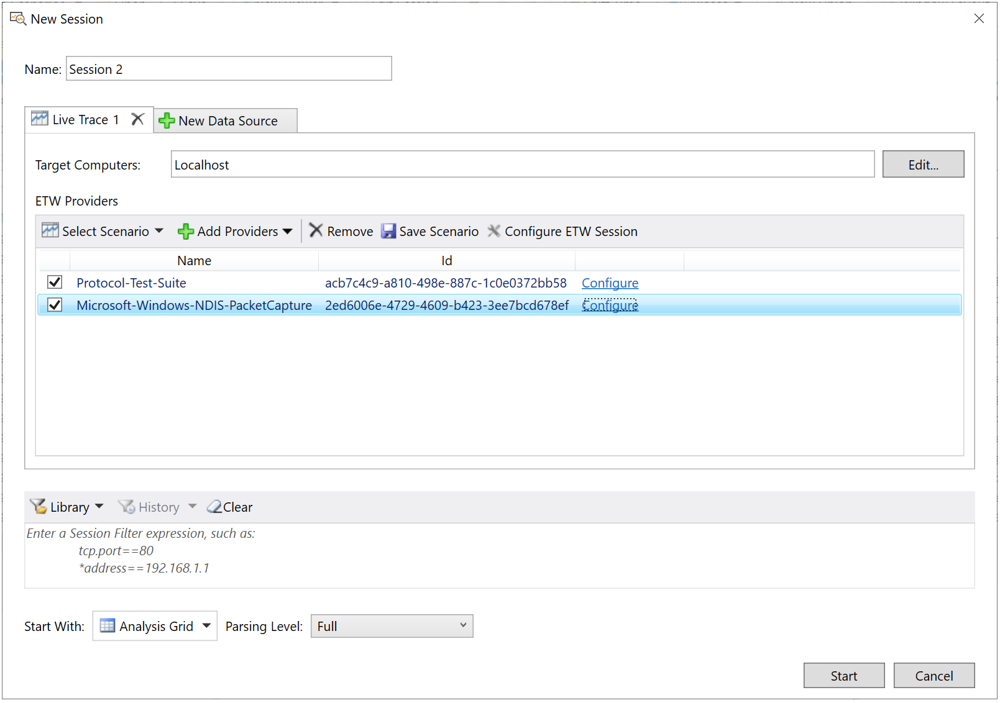

      #### **Figure 24. Message Analyzer session message providers**

  6.  Start Test Case execution from the Protocol Test Manager (PTM) or by
      executing a specific protocol .ps1 file on which you want to focus.

  7.  In the **New Session** dialog of Message Analyzer, click the
      **Start** button to begin tracing.

  8.  As messages accumulate in Message Analyzer, observe that some of
      them will be highlighted with the activated **Color Rules**.

  9.  When PTM Test Case execution is complete, stop Message Analyzer
      tracing.

  10. Apply a filter to the test results by typing "Protocol_Test_Suite"
      in the Filtering text box and then click the filter **Apply** button
      in the Filtering panel under the session ID tab of the Message
      Analyzer user interface (UI), as shown in the figure that follows.

      Only the test result messages that originated from the **Protocol Test
      Suite** module should display in the Message Analyzer default **Analysis
      Grid** viewer. This should provide a simple way to get at the RDP output
      logging messages while filtering out all the others, as shown
      immediately below.

      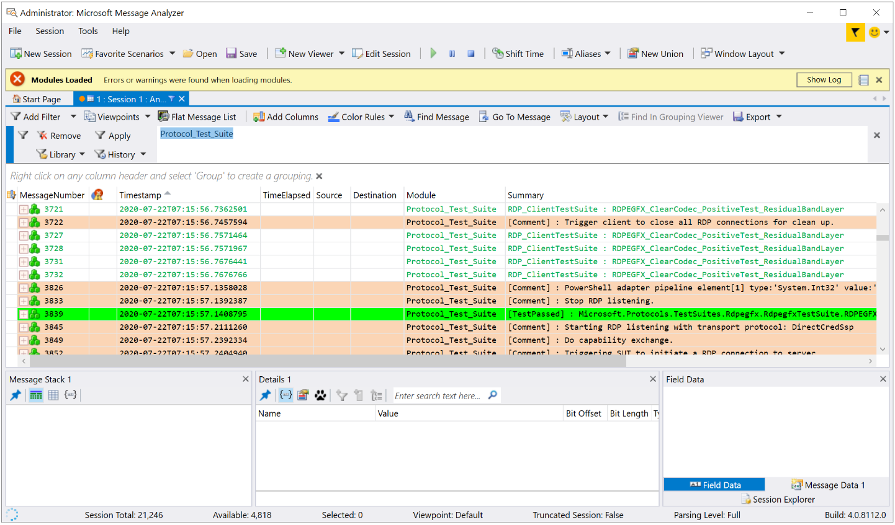

      #### **Figure 25. Message Analyzer trace results with filtering**

      Note

      At any point, you can merge the messages captured by the
      Microsoft-Windows-NDIS-PacketCapture provider back into the **Analysis
      Grid** display, by simply clicking the **Remove** button in the Filter
      panel under the session ID tab of the Message Analyzer UI to remove
      the filter you added.

      The table that follows describes the **Color Rules** and the origin of the messages that trigger them to display:

      **Table 22. Message Analyzer Color Rule data for RDP Test Suite**

      | **Color Rule**       | **Rule Activation Trigger**    | **Description**      |
      |----------------------|--------------------------------|----------------------|
      | **RDP_CheckFailed**  | RDP Test Suite/Test Cases      | Red background indicating that a check made in a Test Case failed. These are the same **[CheckFailed]** messages you will find in **StandardOut** category data in the PTM when selecting a Test Case following test execution. |
      | **RDP_Comment**      | RDP Test Suite Logs            | Brown background indicating a log message was dumped by the RDP Test Suite. These are the same **[Comment]** messages that you will find in **StandardOut** category data in the PTM when selecting a Test Case following test execution.  |
      | **RDP_Decompressed** | RDP Test Suite/Test Cases      | Blue text indicating an RDP message was decompressed. |
      | **RDP_Decrypted**    | RDP Test Suite/Test Cases      | Light green text indicating a decrypted message that used RDP security in the RDP session. |
      | **RDP_TestFailed**   | RDP Test Suite/Test Cases      | Red background indicating that a test failed, with which the message is associated.  These are the same **[TestFailed]** messages that you will find at the end of **StandardOut** category data in the PTM when selecting a Test Case following test execution. |
      | **RDP_TestPassed**   | RDP Test Suite/Test Cases      | Green background indicating that a test passed, with which the message is associated.  These are the same **[TestPassed]** messages that you will find at the end of **StandardOut** category data in the PTM when selecting a Test Case following test execution. |
      | **TLS_Decrypted**    | RDP Test Suite/Test Cases      | Light green text indicating a decrypted message that used TLS security in the RDP session. |

  11. The **\[CheckFailed\]** information tag and the others mentioned in
      this table are specified in [Test Results Output Status Indicators](#test-results-output-status-indicators). You might also
      consider using the Message Analyzer **Grouping Viewer** to isolate
      and organize the RDP data according to certain criteria, such as
      **Case Name**, **Message Name**, and **Comments**. If you do so, you
      may see your data organized in the **Grouping Viewer** in a fashion
      similar to what is shown in the figure that follows:

      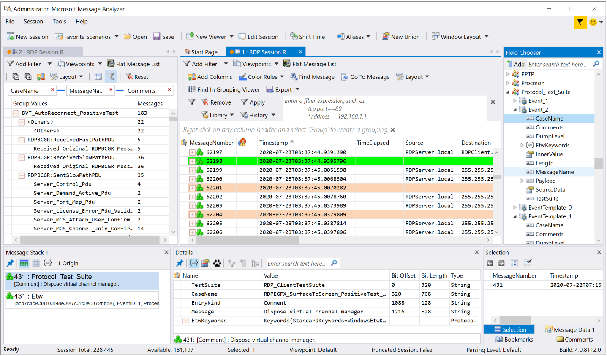

      #### **Figure 26. Message Analyzer Grouping viewer with RDP data**

      In the figure, note the Grouping viewer to the left of the **Analysis
      Grid**. The groups are organized such that you see the **CaseName**
      group data at top level with the **MessageName** and **Comments**
      group data nested successively underneath. Group data is defined by
      the Group identifiers above and is delineated by indented lines below.
      
      For example, in the figure that follows, observe how the data is
       nested in the graphic part of the viewer with the
      **Server_Control_PDU** line (**Comments** node data) under the message
      **RDPBCGR : SentSlowPathPDU** (**MessageName** node data) and this
      latter message under the test **BVT_AutoReconnect_PositiveTest**
      (**CaseName** node data).
      
       Also, when the **Server_Control_PDU** node is clicked, the number of
      messages captured for that operation are shown to the right in the
      **Analysis Grid** viewer. When you click one of those messages, you
      can get more message information in the MMA **Details** view.
      
      Note that the message groups are determined by the field selections
      you make under the **Protocol_Test_Suite** node in **Field Chooser**
      when you are setting up the **Grouping Viewer**, as shown in the right
      sector of the UI in the figure that follows.
      
      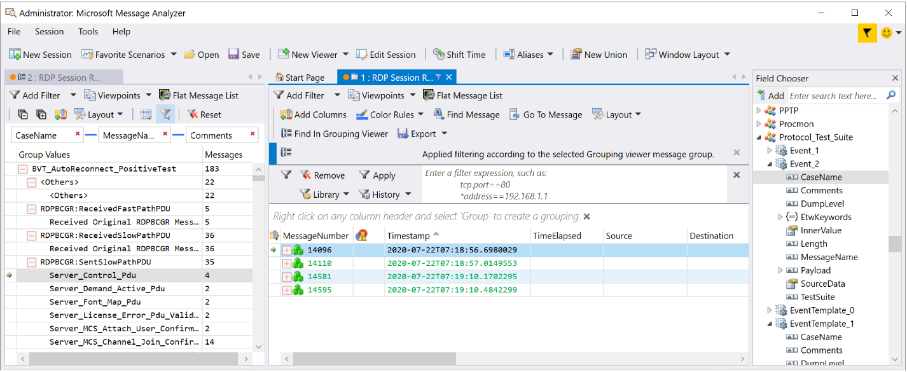

      #### **Figure 27. Message Analyzer Grouping viewer analysis**

      *More Information*

      **To learn more** about Message Analyzer operations, including [Using
      and Managing Color
      Rules](https://docs.microsoft.com/en-us/message-analyzer/using-and-managing-color-rules)
      and the [Grouping
      Viewer](https://docs.microsoft.com/en-us/message-analyzer/grouping-viewer),
      see the [Message Analyzer Operating
      Guide](https://docs.microsoft.com/en-us/message-analyzer/microsoft-message-analyzer-operating-guide).

# Troubleshooting

In this section you will find information about troubleshooting common
**RDP Client Test Suite** and environment issues.

 The major topics covered in this section include the following:

  &emsp;&emsp;[Ping Failure](#ping-failure)

  &emsp;&emsp;[Test Run Issues](#test-run-issues)

  &emsp;&emsp;[RDPEUSB Test Cases Fail](#rdpeusb-test-cases-fail)

  &emsp;&emsp;[RDPEUDP and RDPEMT Test Cases Fail](#rdpeudp-and-rdpemt-test-cases-fail)

  &emsp;&emsp;[RDPBCGR Test Cases Fail When Running in PowerShell Mode](#rdpbcgr-test-cases-fail-when-running-in-powershell-mode)

  &emsp;&emsp;[RDPEGFX Test Cases Require H264 Enabled on SUT](#rdpegfx-test-cases-require-h264-enabled-on-sut)

  &emsp;&emsp;[Test Cases Fail When Using the TLS or CredSSP Protocol](#test-cases-fail-when-using-the-tls-or-credssp-protocol)

## Ping Failure

**Table 23. Problem, Cause, and Resolution of Ping failures**
|                  |                                                                            |
|------------------|----------------------------------------------------------------------------|
|  **PROBLEM**     | The **SUT** computer does not respond to pings from the **Driver** computer.|
|  **CAUSE**       | The **Driver** computer is not in the same network segment as the **SUT** computer, or the **SUT** computer firewall is enabled.|
|  **RESOLUTION**  | Move the **Driver** computer and the **SUT** computer to the same network segment or disable the **SUT** computer firewall.|
|                  |                                                                            |

## Test Run Issues

**Table 24. Problem, Cause, and Resolution of Test Case execution issues**

|                  |                                                                            |
|------------------|----------------------------------------------------------------------------|
| **PROBLEM 1**    | One or more Test Cases failed with a message such as "Timeout when expecting \<Message Type\> ".   |
| **CAUSE 1**      | For Windows RDP clients, the Test Suite must be run under the Administrator account. For non-Windows RDP clients, the SUT computer control adapter may be not implemented properly. See [RDPSUTControlAgent](#https://github.com/microsoft/WindowsProtocolTestSuites/tree/main/TestSuites/RDP/) for development information. |
| **RESOLUTION 1** | For Windows RDP clients, enable the Administrator account and log on as Administrator, as described in [Configuring the SUT](#configuring-the-sut). |
|                  |                                                  |
| **PROBLEM 2**    | One or more Test Cases failed with the Exception “The handle is invalid”. |
| **CAUSE 2**      | The **Driver** computer is locked while Test Cases are running. |
| **RESOLUTION 2** | Unlock the **Driver** computer when Test Cases are running. |
|                  |                                                                            |

## RDPEUSB Test Cases Fail

**Table 25. Problem, Cause, and Resolution of RDPEUSB Test Case execution issues**

|                |                                                    |
|----------------|----------------------------------------------------|
| **PROBLEM**    | A significant number of MS-RDPEUSB Test Cases are failing. |
| **CAUSE**      | The OSR USB FX2 board is not plugged into the SUT computer or the USB Redirection feature is not enabled in the SUT computer. |
| **RESOLUTION** | Plug an OSR USB FX2 board into the SUT computer USB hub. If you need to purchase an OSR USB FX2 board, see Table 2 in [Test Environment Computer Requirements](#test-environment-computer-requirements).  Enable RDP USB Redirection via the Local Group Policy Editor, as described in [Configuring the SUT](#configuring-the-sut). |
|                |                                                                            |

## RDPEUDP and RDPEMT Test Cases Fail

**Table 26. Problem, Cause, and Resolution of RDPEUDP and RDPEMT Test Case execution issues**

|                |                                                    |
|----------------|----------------------------------------------------|
| **PROBLEM**    | A significant number of MS-RDPEUDP and MS-RDPEMT Test Cases are failing.|
| **CAUSE**      | Some MS-RDPEUDP and MS-RDPEMT Test Cases create an RDP-UDP connection, which must use the TLS or CredSSP security protocol to secure the RDP session.
| **RESOLUTION** | In the RDP_ClientTestSuite.deployment.ptfconfig file, configure the RDP.Security.Protocol to TLS or CredSSP, as described in [Common Required Property Settings](#common-required-property-settings).
|                |                                                    |

## RDPBCGR Test Cases Fail When Running in PowerShell Mode

**Table 27. Problem, Cause, and Resolution of RDPBCGR Test Case failures**

|                |                                                    |
|----------------|----------------------------------------------------|
| **RESOLUTION** |Run each RDPBCGR Test Case above using the following command:   &emsp;&emsp;RunTestCasesByFilter.ps1 -Filter "Name=TestCaseName" |
|                |                                                    |

## RDPEGFX Test Cases Require H264 Enabled on SUT

**Table 28. Problem, Cause, and Resolution of RDPEGFX Test Case failures**

|                |                                                    |
|----------------|----------------------------------------------------|
| **PROBLEM**    | If the SUT computer is a thin client that does not support the H264 codec of RDPEGFX, it is expected that the following three Test Cases will fail:  -	RDPEGFX_H264Codec_PositiveTest_H264Support   - RDPEGFX_H264Codec_PositiveTest_SendH264Stream   - RDPEGFX_H264Codec_NegativeTest_IncorrectRegionRectsNum |
| **CAUSE**      | The H264 is not enabled for testing the H264 codec in RDPEGFX on a thin RDP client.|
| **RESOLUTION** | Enable H264 by configuring H.264/AVC hardware encoding for Remote Desktop connections, as described in [Configuring the SUT](#configuring-the-sut) and [Configuring the Driver Computer](#configuring-the-driver-computer). |
|                |                                                    |

## Test Cases Fail When Using the TLS or CredSSP Protocol

**Table 29. Problem, Cause, and Resolution of Test Case failures associated with TLS and CredSSP use**

|                  |                                                    |
|------------------|----------------------------------------------------|
| **PROBLEM 1**    | When using the TLS or CredSSP protocol, a significant number of Test Cases fail with a Timeout exception. |
| **CAUSE 1**      | The TLS and CredSSP protocol need more time to complete encryption and decryption processes. |
| **RESOLUTION 1** | In the **RDP_ClientTestSuite.deployment.ptfconfig** file, increase the value of the **WaitTime** property. To specify additional **WaitTime**, see [Optional Configuration Settings](#optional-configuration-settings).  The .ptfconfig file is located in the following **Driver** computer directory:  &emsp;&emsp;C:\\RDP-TestSuite-ClientEP\\Bin\\                                      |
|                  |                                                  |
| **PROBLEM 2**    | When using the TLS or CredSSP protocol, Test Cases fail with the following Exception: “The system cannot find the file specified.” |
| **CAUSE 2**      | The certificate file that is used to secure the TLS or CrepSSP transport did not successfully generate. |
| **RESOLUTION 2** | Re-run the script **Config-DriverComputer.ps1** on the **Driver** computer to regenerate a valid  certificate. This script is located in the following Driver computer directory: &emsp;&emsp;C:\RDP-TestSuite-ClientEP\Scripts\  For the execution command line, see step 7 in the first procedure of [Configuring the Driver Computer](#configuring-the-driver-computer). |

# Resources and References

The list that follows provides links to various sources of information
that are related to the operations of the **RDP Client Test Suite**
described in this User Guide:

[Software Prerequisites](https://github.com/microsoft/WindowsProtocolTestSuites/blob/main/README.md)

[RDP Test Suite Installers](https://github.com/microsoft/WindowsProtocolTestSuites/releases) -- includes:

  &emsp;&emsp;RDP-TestSuite-ClientEP.zip
  
  &emsp;&emsp;RDP-TestSuite-ServerEP. zip
  
  &emsp;&emsp;ProtocolTestManager.msi
  
  &emsp;&emsp;InstallerPrerequisites.zip

  &emsp;&emsp;SourceCode files (WindowsProtocolTestSuites)

[RDP_Overview_Client Test Design Specification](https://github.com/microsoft/WindowsProtocolTestSuites/blob/main/TestSuites/RDP/Client/docs/RDP_Overview_ClientTestDesignSpecification.md)

[Protocol Test Framework (PTF) Requirements](https://github.com/microsoft/protocoltestframework)

[Getting Started Guide for PTF](https://github.com/Microsoft/ProtocolTestFramework/blob/main/docs/PTFUserGuide.md)

[Protocol Test Framework (PTF) Installer](https://github.com/Microsoft/ProtocolTestFramework/releases/tag/1.0.7500.0)

[Message Analyzer Operating Guide](https://docs.microsoft.com/en-us/message-analyzer/microsoft-message-analyzer-operating-guide)
