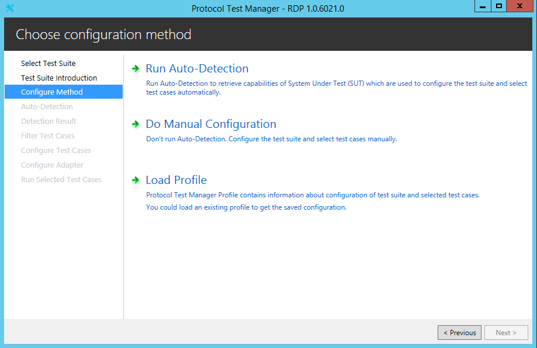
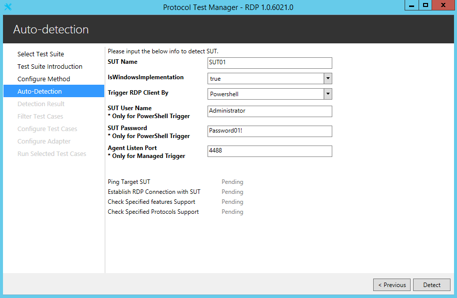
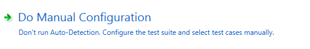
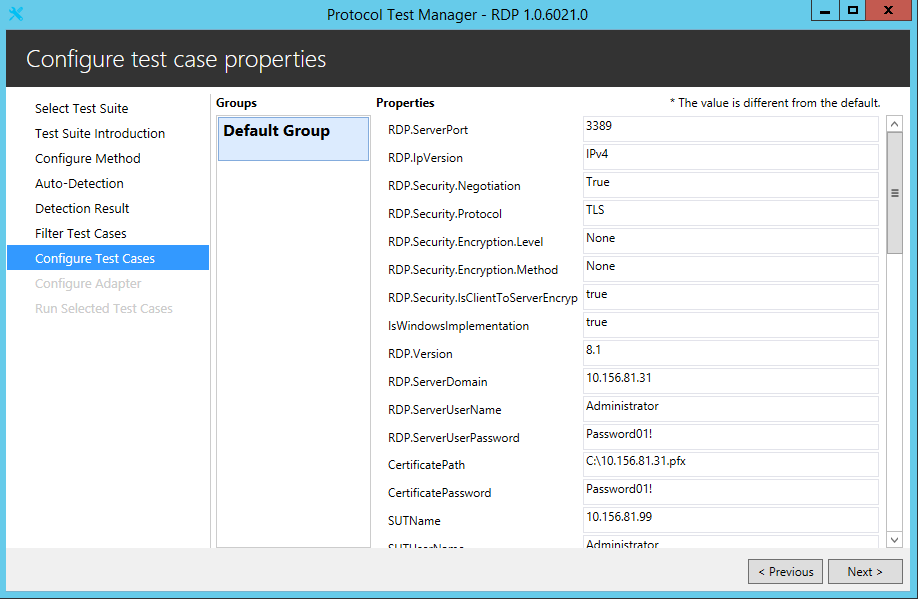
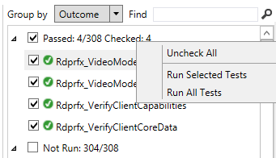
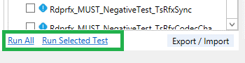
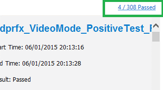
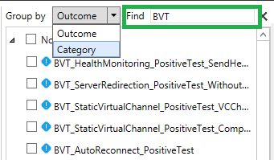
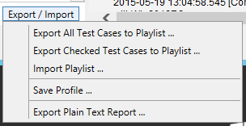
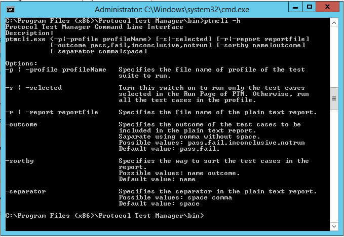

# RDP Client Test Suite User Guide

## Contents

* [Introduction](#introduction)
* [License Information](#license-information)
* [Further Assistance](#further-assistance)
* [Quick Start Checklist](#quick-start-checklist)
* [How Do I](#how-do-i)
* [Requirements](#requirements)
* [Environment](#environment)
    * [Driver Computer](#driver-computer)
    * [System Under Test](#system-under-test)
    * [Domain Controller](#domain-controller)
    * [Software](#software)
* [Network Setup](#network-setup)
    * [Network Infrastructure](#network-infrastructure)
    * [Domain Environment](#domain-environment)
    * [Workgroup Environment](#workgroup-environment)
    * [Verify Connectivity from the Driver Computer](#verify-connectivity-from-the-driver-computer)
* [Computer Setup](#computer-setup)
    * [Set Up the Driver Computer](#set-up-the-driver-computer)
    * [Set Up a Windows-Based SUT](#set-up-a-windows-based-sut)
    * [Set Up a Windows-Based Domain Controller](#set-up-a-windows-based-domain-controller)
    * [Installed Files and Folders](#installed-files-and-folders)
* [Configuration](#configuration)
    * [Configure Windows-based Computers](#configure-windows-based-computers)
    * [Configure Computers that are Not Based on Windows](#configure-computers-that-are-not-based-on-windows)
    * [Configure the Test Suite](#configure-the-test-suite)
		* [Required Configuration Settings](#required-configuration-settings)
		* [Optional Configuration Settings](#optional-configuration-settings)
* [Running Test Cases](#running-test-cases)
    * [Configure the Test Suite Mode](#configure-the-test-suite-mode)
		* [Common Configuration](#common-configuration)
		* [Configuration for RDPEI](#configuration-for-rdpei)
		* [Configuration for RDPEDISP](#configuration-for-rdpedisp)
    * [Run the Smoke Test](#run-the-smoke-test)
    * [Run All Test Cases](#run-all-test-cases)
    * [Run Specified Test Cases](#run-specified-test-cases)
    * [Example of How to Run Test Case under Interactive Mode](#example-of-how-to-run-test-case-under-interactive-mode)
    * [Example of How to Run RDPEI Test Case under Enhanced Interactive Mode](#example-of-how-to-run-rdpei-test-case-under-enhanced-interactive-mode)
    * [Check Test Results](#check-test-results)
* [Debugging Test Cases](#debugging-test-cases)
* [Using Protocol Test Manager](#using-protocol-test-manager)
    * [Install Protocol Test Manager](#install-protocol-test-manager)
    * [Start Protocol Test Manager](#start-protocol-test-manager)
    * [Test Suite Introduction](#test-suite-introduction)
    * [Configure the Test Suite](#configure-the-test-suite)
		* [Configure the Test Suite with Auto-detection](#configure-the-test-suite-with-auto-detection)
		* [Configure Test Suite Manually](#configure-test-suite-manually)
		* [Load Profile](#load-profile)
		* [Filter Test Cases](#filter-test-cases)
		* [Configure Test Cases](#configure-test-cases)
		* [Configure Adapter](#configure-adapter)
    * [Run Selected Test Cases](#run-selected-test-cases)
    * [Export Results](#export-results)
    * [Command Line Interface](#command-line-interface)
* [Using Super Log Viewer](#using-super-log-viewer)
    * [Install and Configure Microsoft Message Analyzer](#install-and-configure-microsoft-message-analyzer)
    * [Capture Traffic Using Microsoft Message Analyzer](#capture-traffic-using-microsoft-message-analyzer)
* [Troubleshooting](#troubleshooting)
    * [Ping Failure](#ping-failure)
    * [Test Run Issues](#test-run-issues)
    * [Most RDPEUSB Test Cases Failed](#most-rdpeusb-test-cases-failed)
    * [Most RDPEUDP and RDPEMT Test Cases Failed](#most-rdpeudp-and-rdpemt-test-cases-failed)
    * [3 RDPBCGR Test Cases Must be Run Under Interactive Mode](#3-rdpbcgr-test-cases-must-be-run-under-interactive-mode)
    * [3 RDPEGFX Test Cases Require H264 Enabled on SUT](#3-rdpegfx-test-cases-require-h264-enabled-on-sut)
    * [Most Test Cases Failed When Using TLS/CredSSP protocol](#most-test-cases-failed-when-using-tlscredssp-protocol)

## Introduction

This guide provides information about how to install, configure, and run the RDP Client Endpoint Test Suite and its environment.

This suite of tools is designed to test implementations of the following protocols:

* _[MS-RDPBCGR]: Remote Desktop Protocol: Basic Connectivity and Graphics Remoting Specification_

* _[MS-RDPEUSB]: Remote Desktop Protocol: USB Devices Virtual Channel Extension_

* _[MS-RDPEVOR]: Remote Desktop Protocol: Video Optimized Remoting Virtual Channel Extension_

* _[MS-RDPRFX]: Remote Desktop Protocol: RemoteFX Codec Extension_

* _[MS-RDPEUDP]: Remote Desktop Protocol: UDP Transport Extension_

* _[MS-RDPEMT]: Remote Desktop Protocol: Multitransport Extension_

* _[MS-RDPEI]: Remote Desktop Protocol: Input Virtual Channel Extension_

* _[MS-RDPEGFX]: Remote Desktop Protocol: Graphics Pipeline Extension_

* _[MS-RDPEDISP]: Remote Desktop Protocol: Display Update Virtual Channel Extension_

* _[MS-RDPEDYC]: Remote Desktop Protocol: Dynamic Channel Virtual Channel Extension_

* _[MS-RDPEGT]: Remote Desktop Protocol: Geometry Tracking Virtual Channel Protocol Extension_

This suite of tools tests only the protocol implementation behaviors that are observed on the wire. For detailed information about the design of this test suite, see RDP_Overview_ClientTestDesignSpecification.md.

## License Information

For licensing information, see the End User License Agreement (EULA) that was provided with this test suite. The EULA is contained in the License.rtf file in the installation folder.

## Further Assistance

If you need further information about this test suite or assistance in troubleshooting issues related to this test suite, contact dochelp@microsoft.com.

## Quick Start Checklist

The following checklist summarizes the steps required to get the test suite up and running. The checklist also provides references to documentation that can help you get started.

Note

>For workgroup environments, skip tasks that are related to the setup and configuration of DC.

|  **Check**|  **Task**|  **Topic**|
| -------------| -------------| ------------- |
| | Download the test suite for the protocol implementation.| For a list of the files that the download package contains, see [Installed Files and Folders](#installed-files-and-folders).|
| | Confirm that your test environment and computers meet the requirements of the test suite.| For information about the requirements of the test suite, see [Requirements](#requirements). |
| | Install the software prerequisites.| For information about software that must be installed on the computers in your test environment before the test suite is installed, see [Software](#software).|
| | Set up the driver computer.| See [Set Up the Driver Computer](#set-up-the-driver-computer).|
| | Set up the system under test (SUT).| See [Set Up a Windows Based SUT](#set-up-a-windows-based-sut).|
| | Set up the Domain Controller (DC). (optional)| See [Set Up a Windows Based Domain Controller](#set-up-a-windows-based-domain-controller). |
| | Set up the network.| See [Network Setup](#network-setup).|
| | Verify the connection from the driver computer to the SUT and other computers.| See [Verify Connectivity from the Driver Computer](#verify-connectivity-from-the-driver-computer).|
| | Configure the SUT.| See [Configure Windows based Computers](#configure-windows-based-computers) or |
| | | [Configure Computers that are Not Based on Windows](#configure-computers-that-are-not-based-on-windows)|
| | Configure the DC. (optional)| See [Configure Computers that are Not Based on Windows](#configure-computers-that-are-not-based-on-windows) |
| | Configure the driver computer.| See [Configure Windows-based Computers](#configure-windows-based-computers)|
| | Configure the test suite settings.| See [Configure the Test Suite](#configure-the-test-suite).|
| | Run a smoke test to verify that the test suite is properly installed and configured| See [Run the Smoke Test](#run-the-smoke-test).|

## How Do I
Use the following quick reference to learn how to complete common tasks.

|  **How do I…?**|  **For more information…**|
| -------------| ------------- |
| Set up the test environment| [Network Setup](#network-setup) and [Computer Setup](#computer-setup)|
| Verify the connection from the driver computer to other computers in the test environment| [Verify Connectivity from the Driver Computer](#verify-connectivity-from-the-driver-computer)|
| Configure a SUT| [Configure the SUT](#configure-windows-based-computers) or [Configure Computers that are Not Based on Windows](#configure-computers-that-are-not-based-on-windows)|
| Configure a DC| [Configure Computers that are Not Based on Windows](#configure-computers-that-are-not-based-on-windows)|
| Configure the driver computer| [Configure Windows-based Computers](#configure-windows-based-computers)|
| Configure the test suite settings| [Configure the Test Suite](#configure-the-test-suite)|
| Run a smoke test| [Run the Smoke Test](#run-the-smoke-test).|
| Run test cases| [Run All Test Cases](#run-all-test-cases), [Run Specified Test Cases](#run-specified-test-cases)|
| Debug my own test cases| [Debugging Test Cases](#debugging-test-cases)|
| Get the results of test runs| [Check Test Results](#check-test-results)|
| Troubleshoot problems| [Troubleshooting](#Troubleshooting)|

## Requirements

This section describes the requirements for the test environment that are used to run this test suite.

Note

>The requirements in this section apply only to the Windows-based computers in the test environment.

Note

>The driver computer must use a Windows-based operating system.

Note

>Workgroup environment does not require a domain controller.

## Environment

Run this test suite in a Domain environment that contains the following computers, physical or virtual:

* A driver computer running any version of Windows which is compatible with Visual Studio 2017.

* A computer configured as the SUT (System Under Test). It can be any version of Windows or a SUT implementation that is not based on the Windows operating system.

* A computer configured as a Domain Controller (DC). If this computer is running Windows, it must be running Windows Server 2008 R2 or the later. The DC can be on the SUT.

Run this test suite in a Workgroup environment that contains the following computers, physical or virtual:

* A driver computer running any version of Windows which is compatible with Visual Studio 2017.

A computer configured as the SUT (System Under Test). It can be any version of Windows or a SUT implementation that is not based on the Windows operating system.

Note

>If SUT computer is an implementation that is not based on Windows operating system or its version is below Windows 7, part of test cases cannot be executed automatically.

Note

>The RDP test suite has a known issue when used with the Windows 10 November Update. Previous releases of Windows 10 do not have this issue, and the issue should be fixed in the next update of Windows 10.

Note

>To run the MS-RDPEUSB test cases, the SUT must be a physical machine, and **one OSR USB FX2 board is required**. Plug the OSR USB FX2 board into the SUT computer before running MS-RDPEUSB test cases.

>The OSR USB FX2 board can be bought from the [OSR Online Store](https://www.osronline.com/custom.cfm?name=index_fullframeset.cfm&pageURL=https://www.osronline.com/store/index.cfm).

Note

>To run the MS-RDPEI test cases, the SUT must be touch enabled.

Note

>To run the MS-RDPEVOR test cases, the SUT must be Windows 8, Windows 8.1 or Windows 10.

Note

>To run the MS-RDPEDISP test cases, the OS on SUT must support display configuration changes including the addition, removal and repositioning of monitors, resolution updates, and orientation updates.

### Driver Computer

The minimum requirements for the driver computer are as follows.

|  **Requirement**|  **Description**|
| -------------| ------------- |
| Operating system| Any version of Windows which is compatible with Visual Studio 2017.|
| Memory| 2 GB RAM|
| Disk space| 60 GB |

### System Under Test

The minimum requirements for the SUT are as follows.

Note

>If SUT computer is an implementation that is not based on Windows operating system or its version is below Windows 7, external work is needed to execute test cases automatically, for more details, please refer to [Configure the Test Suite Mode](#configure-the-test-suite-mode).

|  **Requirement**|  **Description**|
| -------------| ------------- |
| Operating system| Any version of Windows or a SUT implementation that is not based on the Windows operating system |
| Memory| 1 GB RAM|
| Disk space| 60 GB|

### Domain Controller

The minimum requirements for the DC are as follows.

Note

>DC is optional. Workgroup environments do not require a domain controller.

|  **Requirement**|  **Description**|
| -------------| ------------- |
| Operating system| Windows Server 2008 R2, Windows 2012, Windows 2012 R2 or a directory domain service implementation that is not based on the Windows operating system|
| Services| Directory domain service (such as the Windows Active Directory Domain Services (AD DS))|
| Memory| 1 GB RAM|
| Disk space| 60 GB|

### Software
All of the following software must be installed on the driver computer _before_ the installation of this test suite.

**Required Software**

All common softwares listed in [prerequisites](https://github.com/microsoft/WindowsProtocolTestSuites#prerequisites) for running Windows Protocol Test Suites.

* **Windows PowerShell 3.0 or later**

  **Windows PowerShell 3.0 or later** is required.

**Optional Software**

* **Protocol Test Manager**

    **Protocol Test Manager** provides a graphical user interface (UI) to facilitate configuration and execution of Microsoft® Windows Protocol Test Suite tests. Its use is highly recommended.

* **Microsoft® Message Analyzer**

  **Microsoft® Message Analyzer** (MMA) is listed here as an optional tool because the test cases of themselves neither perform live captures or capture verifications during execution. However, MMA can be helpful with debugging test case results, by analyzing ETL files that are generated by the Test Cases, that is, if you enable the the Automatic Network Capturing feature in the Protocol Test Manager (PTM) during test case configuration. The Automatic Network Capturing feature is further described in the [PTF User Guide](https://github.com/Microsoft/ProtocolTestFramework/blob/staging/docs/PTFUserGuide.md#-automatic-network-capturing).

  Note
  
  November 25 2019 - Microsoft Message Analyzer (MMA) has been retired and removed from public-facing sites on microsoft.com. A private MMA build is available for testing purposes; to request it, send an email to [getmma@microsoft.com](mailto:getmma@microsoft.com).

## Network Setup

You can run this test suite in a workgroup or domain environment using either physical or virtual machines. This section describes the test environment using physical computers. For information about configuring a virtual machine, see [https://docs.microsoft.com/en-us/virtualization/hyper-v-on-windows/quick-start/create-virtual-machine](https://docs.microsoft.com/en-us/virtualization/hyper-v-on-windows/quick-start/create-virtual-machine).

### Network Infrastructure

* A test network is required to connect the test computer systems

* It must consist of an isolated hub or switch

* It must not be connected to a production network or used for any other business or personal communications or operations

* It must not be connected to the internet

* IP addresses must be assigned for a test network

* Computer names should be assigned in a test network infrastructure

* User credentials used on the system must be dedicated to the test network infrastructure

* Details including computer IP addresses, names and credentials are saved in log files

Refer to the Privacy Statement and EULA for further information.

### Domain Environment

The domain environment requires interactions between the following computers and server roles. Note that the domain controller, required for a domain environment, can be installed on the SUT.

* The driver computer, which runs the test cases by sending requests over the wire in the form of protocol messages.

* The SUT, which runs a client implementation of the protocol that is being tested. The SUT responds to the requests sent by the driver computer.

* The DC provides functionality that is required to test the protocol implementation. Specifically, the DC hosts Active Directory Domain Services (AD DS).

The following figure shows the domain environment.

### Workgroup Environment

The workgroup environment requires interactions between the following computers:

* The driver computer, which runs the test cases by sending requests over the wire in the form of protocol messages.

* The SUT, which runs a client implementation of the protocol that is being tested. The SUT responds to the requests that the driver computer sends.

The following figure shows the workgroup environment:

### Verify Connectivity from the Driver Computer

After you prepare the environment, verify the connection from the driver computer to the SUT, and between all other computers in the test environment. The following provides a general list of steps that you can use to check for connectivity between two Windows-based computers. For further information, see the administration guide for your operating system.

Note

>Disable active firewalls in the test environment(Run Disable_Firewall.ps1 or do it manually).

To check the connection from the driver computer

* Click the **Start** button, and then click **Run**.

* In the **Run** dialog box, type **cmd** and then click **OK**.

* At the command prompt, type **ping** followed by the hostname or IP address of the SUT, and then press **Enter**. The following example checks the connection to a SUT named "SUT01":
 &#62;  ping SUT01

* Repeat these steps until you confirm connectivity between all computers in the test environment.

Do not proceed with the configuration of the test suite until connectivity is confirmed. Any issues with network connectivity must be resolved before you configure the test suite.

## Computer Setup

This section explains how to set up the computers for the test environment.

Note

>For workgroup environments, skip tasks that are related to the setup and configuration of DC.

### Set Up the Driver Computer

This section describes how to set up the driver computer.

Important

>Microsoft Visual Studio 2017 (or later), Spec Explorer (build 3.5.3146.0) and Protocol Test Framework must be installed on the driver computer before you run the test suite installer.

To set up the driver computer

* Copy the test suite package to the driver computer.

* Extract the files of the test suite from the package.

* Install the required and optional software described earlier.

* Run **RDP-TestSuite-ClientEP.msi** on the driver computer.

* On the **Options** dialog box, select **Install Test Suite on Driver Computer**.

### Set Up a Windows Based SUT
This section provides information about how to set up a SUT for use with this test suite.

To set up a Windows-based SUT

* Copy the test suite package to the Windows-based SUT.

* Extract the files of the test suite from the package.

* Run **RDP-TestSuite-ClientEP.msi** on the Windows-based SUT.

* On the **Options** dialog box, select **Install Configuration Scripts on System Under Test (SUT)**.

To set up a SUT that is not based on the Windows operating system, see [Configure Computers that are Not Based on Windows](#configure-computers-that-are-not-based-on-windows).

### Set Up a Windows Based Domain Controller
This section provides information about how to set up a DC for use with this test suite.

Note

>DC is optional. Skip this step if the test environment is workgroup.

To set up a Windows-based DC

* Install Active Directory Domain Services.

To set up a DC that is not based on the Windows operating system, see [Configure Computers that are Not Based on Windows](#configure-computers-that-are-not-based-on-windows).

### Installed Files and Folders

The installation process adds the following folders and files to the driver computer at C:\MicrosoftProtocolTests\RDP\Client-Endpoint\ _&#60; version &#35;  &#62;_ \.

Note

>The  _&#60; version &#35;  &#62;_  placeholder indicates the installed build of the test suite.

|  **File or Folder**|  **Description**|
| -------------| ------------- |
| Batch| Command files that you can use to run individual test cases or all test cases|
| Bin| Test suite binaries and configuration files|
| Docs| The version of each of the following protocol specifications used to develop this test suite:|
| | **MS-RDPBCGR.pdf** |
| | **MS-RDPEUSB.pdf** |
| | **MS-RDPRFX.pdf** |
| | **MS-RDPEVOR.pdf** |
| |  **MS-RDPEUDP.pdf** |
| |  **MS-RDPEMT.pdf** |
| |  **MS-RDPEI.pdf** |
| |  **MS-RDPEGFX.pdf** |
| |  **MS-RDPEDISP.pdf** |
| |  **MS-RDPEDYC.pdf** |
| |  **MS-RDPEGT.pdf** |
| | **RDP_ClientUserGuide.md** – A user guide that explains how to install and configure the driver computer, the SUT, and the DC, as well as how to run test cases|
| | **RDP_Overview_ClientTestDesignSpecification.md** – An overview document containing references to the test suite design for MS-RDPBCGR, MS-RDPEUSB, MS-RDPRFX, MS-RDPEVOR, MS-RDPEUDP, MS-RDPEMT, MS-RDPEI and MS-RDPEGFX.|
| | **Test suite design documents**, containing conceptual information about the protocol, including probable use, relationships to other protocols, message flow, state diagrams, a short list of properties, and justification for the test and adapter design choices:|
| |  **MS-RDPBCGR_ClientTestDesignSpecification.md** |
| |  **MS-RDPEUSB_ClientTestDesignSpecification.md** |
| |  **MS-RDPRFX_ClientTestDesignSpecification.md** |
| |  **MS-RDPEVOR_ClientTestDesignSpecification.md** |
| |  **MS-RDPEUDP_ClientTestDesignSpecification.md** |
| |  **MS-RDPEMT_ClientTestDesignSpecification.md** |
| |  **MS-RDPEI_ClientTestDesignSpecification.md** |
| |  **MS-RDPEGFX_ClientTestDesignSpecification.md** |
| |  **MS-RDPEDISP_ClientTestDesignSpecification.md** |
| Scripts| Scripts that are used to set up and configure the driver computer, the Windows-based SUT, and the DC|
| Data| Data files that used to by scripts to set up and configure the driver computer, the Windows-based SUT, and the DC|
| License.rtf| The End User License Agreement|

The installation process adds the following files and folders to the Windows-based SUT at C:\MicrosoftProtocolTests\RDP\Client-Endpoint\ _&#60; version &#35;  &#62;_ \.

|  **File or Folder**|  **Description**|
| -------------| ------------- |
| Scripts| Scripts that are used to set up and configure the driver computer, the Windows-based SUT, and the DC|
| Data| Data files that used to by scripts to set up and configure the driver computer, the Windows-based SUT, and the DC|
| License.rtf| The End User License Agreement.|

## Configuration

This section explains how to configure the test environment.

Note

>For workgroup environments, skip tasks that are related to the setup and configuration of DC.

### Configure Windows Based Computers

This section explains how to configure computers for a Windows-based test environment. For general information about configuring computers that are not based on Windows, see [Configure Computers that are Not Based on Windows](#configure-computers-that-are-not-based-on-windows).

Note

>The property values of the .ptfconfig file are automatically set during the configuration process. For this reason, in a Windows-based test environment, configure the SUT and any other servers before you configure the driver computer.

**To configure the SUT**

* Log on to the SUT as administrator.

Note

>You must use the Administrator account on the SUT. If the Administrator account is disabled, you can enable it as follows:

>	* In **Control Panel**, open **Administrative Tools** and then open **Computer Management**.

>	* In the left panel, open **Local Users and** **Groups** under **System Tools,** and then select **Users**.

>	* In the right panel, double click **Administrator** and then uncheck the **Account is disabled** box.

>	* Right click **Administrator** and then click the **Set Password…** pop up menu, then ”Proceed” button, and then input the “Password01!” in the New Password and Confirm Password fields. Click OK to save the password for local administrator user.

>	* Or run commands: ”net user /active administrator” “net user administrator Password01!” to enable the local administrator and set the password.

* Go to C:\MicrosoftProtocolTests\RDP\Client-Endpoint\ _&#60; version &#35;  &#62;_ \Scripts, and open the ParamConfig.xml file.

* Review the properties shown in the following table, updating the property values as necessary.

|  **Property**|  **Description**|
| -------------| ------------- |
|  **LogPath**| The file path for storing the logs during configuration|
| | Default value: **.\..\Logs**|
|  **LogFile**| The name of log file.|
| | Default value: **.\..\Logs\Config-DriverComputer.ps1.log**|
|  **userNameInTC**| The local administrator account that is used to log on to the SUT.|
| | Required value: **Administrator**|
|  **userPwdInTC**| The password that is used to log on to the local administrator account of SUT.|
| | Default value: **Password01!**|
|  **domainName**| The domain name that is configured in DC.|
| | Default value: **contoso.com**|
|  **dcComputerName**| The machine name or IP address of DC.|
| | Default value: **DC01**|
|  **tcComputerName**| The machine name or IP address of SUT.|
| | Default value: **SUT01**|
|  **driverComputerName**| The machine name or IP address of driver computer.|
| | Default value: **DriverComputer**|
|  **RDPListeningPort**| The listening port of driver computer.|
| | Default value: **3389**|
|  **ipVersion**| The IP version that is used in test. |
| | Default value: **IPv4**|
|  **workgroupDomain**| The test environment. If it is in domain environment, set the value to **Domain**; if it is in workgroup environment, set the value to **Workgroup**.|
| | Default value: **Workgroup**|
|  **compressionInTC**| Determine whether compression is used in terminal client. If compression is used, set the value to **Yes**; otherwise, set the value to **No**. |
| | Default value: **No**|

* Start Windows PowerShell by right-clicking on the **Windows PowerShell** icon, and then click **Run as Administrator**, or from a Windows PowerShell command window, type: Start-process powershell -verb runAs

* At the command prompt, type Set-ExecutionPolicy Unrestricted -F, and press **Enter**.

* Type cd C:\MicrosoftProtocolTests\RDP \Client-Endpoint\ _&#60; version &#35;  &#62;_ \Scripts, and press **Enter**.

* Type .\Enable-USBRedirection.ps1 and press **Enter** if you want to test MS-RDPEUSB cases.

* Type .\Enable-WinRM.ps1 and press **Enter**.

* Type .\Config-TerminalClient.ps1 and press **Enter**.

* Config Group Policy:

  * Group policy for RDP redirection
    * Enable the policy "**Allow RDP redirection of other supported RemoteFX USB devices from this computer**" by opening **Local Group Policy Editor** by typing gpedit.msc and press **Enter**.

    * Explore to the group policy: Local Computer Policy\Computer Configuration\Administrative Templates\Windows Components\Remote Desktop Services\Remote Desktop Connection Client\RemoteFX USB Device Redirection.

    * Reboot the SUT computer and plug in the OSR USB FX2 board.
  * Optionally, you can config group policy for RDPEGFX AVC 444 feature:

    * To enable AVC 444 mode in Windows 10,  Windows Server 2016 and later versions, two new group policies need to be configured in the Group Policy Editor.

    * Open **Local Group Policy Editor** by typing gpedit.msc and press **Enter**.

    * Explore to the group policy: Computer Configuration\Administrative Templates\Windows Components\Remote Desktop Services\Remote Desktop Session Host\Remote Session Environment

    * Enable AVC 444 by group policy configuration

      1. Prioritize H.264/AVC 444 Graphics mode for Remote Desktop connections

       When enabled on the RDP Server, H.264/AVC 444 mode will be prioritized when the RDP 10 client and server both support AVC/H.264 and support the AVC 444 mode. Note: For Remote Desktop Session Host (RDSH) environments only full desktop sessions are supported with H.264/AVC 444, RemoteApp sessions still use the proprietary codecs for now.

     2. Configure H.264/AVC hardware encoding for Remote Desktop connections

       This policy lets you enable hardware encoding for AVC/H.264, when used in conjunction with the AVC 444 mode. When enabled, each remote desktop monitor will use up to one AVC/H.264 encoder on the server. If all AVC/H.264 encoders are in use, the RDP server will automatically fallback to using software encoding.           

   * Enabling the 2 group policies will help you set up an AVC 444 supported environment.

* Go to C:\MicrosoftProtocolTests\RDP\Client-Endpoint\ _&#60; version &#35;  &#62;_ \Data, and edit **Negotiate.RDP**, **DirectTls.RDP** and **DirectCredSSP.RDP** files respectively:

	* Right-click on the RDP file, and then click **Edit**.

	* Select the **Local Resources** tab, click **More…**, and then click to select the **OSR USB-FX2 LK** check box.

	* Select the **General** tab, and click **Save**.

Note

>Last 3 steps are only required for MS-RDPEUSB test cases.

Note

>You must use the user Administrator logon if you run test cases with PowerShell mode. For more details, please refer to [Configure the Test Suite Mode](#configure-the-test-suite-mode).

**To configure the driver computer**

* Log on to the driver computer as Administrator.

* Go to C:\MicrosoftProtocolTests\RDP\Client-Endpoint\ _&#60; version &#35;  &#62;_ \Scripts, and open the ParamConfig.xml file.

* Edit the properties as shown in the following table.

|  **Property**|  **Description**|
| -------------| ------------- |
|  **LogPath**| The file path for storing the logs during configuration|
| | Default value: **.\..\Logs**|
|  **LogFile**| The name of log file.|
| | Default value: **.\..\Logs\Config-DriverComputer.ps1.log**|
|  **userNameInTC**| The local administrator account that is used to log on to the SUT.|
| | Required value: **Administrator**|
|  **userPwdInTC**| The password that is used to log on to the local administrator account of SUT.|
| | Default value: **Password01!**|
|  **CredSSPUser**| User name used in CredSSP authentication. |
| | It should be a member of RDP User Group on Drive Computer.|
| | Default value: **Administrator**|
|  **CredSSPPwd**| The user password of “CredSSPUser**”.**|
| | Default value: **Password01!**|
|  **domainName**| The domain name that is configured in DC.|
| | Default value: **contoso.com**|
|  **dcComputerName**| The machine name or IP address of DC.|
| | Default value: **DC01**|
|  **tcComputerName**| The machine name or IP address of SUT.|
| | Default value: **SUT01**|
|  **driverComputerName**| The machine name or IP address of driver computer.|
| | Default value: **DriverComputer**|
|  **RDPListeningPort**| The listening port of driver computer.|
| | Default value: **3389**|
|  **ipVersion**| The IP version that is used in test.|
| | Default value: **IPv4** |
|  **osVersion**| The operating system of terminal client.|
| | It can be Windows, or NonWindows.|
| | Default value: **Windows**|
|  **workgroupDomain**| The test environment. If it is in domain environment, set the value to “Domain”; if it is in workgroup environment, set the value to “Workgroup”.|
| | Default value: **Workgroup**|
|  **tcSystemDrive**| The system drive letter of SUT machine.|
| | Only apply to Windows SUT.|
| | Default value: **C**|

* Start Windows PowerShell by right-clicking on the **Windows PowerShell** icon, and then click **Run as Administrator**, or from a Windows PowerShell command window, type:
Start-process powershell -verb runAs

* At the command prompt, type Set-ExecutionPolicy Unrestricted -F, and press **Enter**.

* Type cd C:\MicrosoftProtocolTests\RDP\Client-Endpoint\ _&#60; version &#35;  &#62;_ \Scripts, and press **Enter**.

* Type .\Config-DriverComputer.ps1, and press **Enter**.

Note

>If the value of **RDPListeningPort** is set to 3389 and the Remote Desktop Service is running on the Driver Computer, the automation script will change the port of Remote Desktop Service to 4488 and restart this service.

Note

>After run Config-DriverComputer.ps1, two files are generated under C:\, as follows:

>	* ***ComputerName***.cer

>	* ***ComputerName***.pfx

>***ComputerName*** represents driver computer’s name as you configured in ParamConfig.xml.

Note

>The certificate, **ComputerName**.cer, is generated for testing purpose, not from a trusted Certificate Authority. So when you run test cases, a dialog may be popped up with warning statements: "**The identity of the remote computer cannot be verified. Do you want to connect anyway?**", then you can selected the checkbox of "**Don't ask me again for connections to this computer**" before click **Yes** to avoid this dialog popped up again.

* Optionally, you can install this certificate on **SUT** as following to avoid warning dialog:

* Copy the ***ComputerName***.cer file to the **SUT**.

* On the SUT, click **Start** and then click **Run**, in the command line, type **MMC** and then click **Ok**.

* In the **Microsoft Management Console**, on the **File** menu, **click Add/Remove Snap-in.**

* In the **Add or Remove Snap-ins dialog box**, select Certificates and then click **Add**.

* In the popped up **Certificates snap-in** dialog box, select the **Computer account** radio button, and then click **Next**.

* In the **Select Computer** dialog box, leave the default Local computer: (the computer this console is running on) selected and then click **Finish**.

* In the **Add or Remove Snap-ins dialog box**, click **Ok**.

* In the left pane of **Microsoft Management Console**, expand the **Certificates (Local Computer)** node, and then expand the **Trusted Root Certification Authorities** folder.

* Under **Trusted Root Certification Authorities**, right-click the Certificates subfolder, click **All Tasks**, and then click **Import**.

* On the **Certificate Import Wizard welcome screen**, click **Next**.

* On the **File to Import screen**, click Browse. Browse to the location of the the ***ComputerName***.cer file copied in Step 1, select the file, and then click **Open**.

* On the **File to Import screen**, click **Next**.

* On the **Certificate Store screen**, accept the default choice and then click **Next**.

* On the **Completing the Certificate Import Wizard screen**, click **Finish**.

* Optionally, you can config group policy for RDPEGFX AVC 444 feature:

* To enable AVC 444 mode in Windows 10, Windows Server 2016 and later versions, group policy needs to be configured in the Group Policy Editor.

* Open **Local Group Policy Editor** by typing gpedit.msc and press **Enter**.

* Explore to the group policy: Computer Configuration\Administrative Templates\Windows Components\Remote Desktop Services\Remote Desktop Session Host\Remote Session Environment

* Enable AVC 444 by group policy configuration

  * Configure H.264/AVC hardware encoding for Remote Desktop connections

   This policy will let you enable hardware encoding for AVC/H.264, when used in conjunction with the AVC 444 mode. When enabled, each remote desktop monitor will use up to one AVC/H.264 encoder on the server. If all AVC/H.264 encoders are in use, the RDP server will automatically fallback to using software encoding.           

* Enabling the group policy will help you set up an AVC 444 supported environment.

### Configure Computers that are Not Based on Windows

This guide provides only basic information about configuring the test environment for computers that are not running Windows-based operating systems.

* For domain environments, join all computers to the domain of the domain controller.

* Disable active firewalls on all computers.

For detailed instructions about how to complete the tasks that this process requires, see the administration guide for your operating system.

**To configure the SUT**

* Install and enable the client implementations of the protocols to be tested.

* Enable the USB devices redirection feature.

* Plug in the OSR USB FX2 board.

* Install Certificate generated on the driver computer (Optional).

**To configure the DC**

* Install directory domain services.

### Configure the Test Suite

This test suite is installed with default configuration settings. You may need to change these settings if you use a customized test environment or if you customize your test runs.

Note

>The property values of the .ptfconfig file are automatically set during the configuration process.

You can define various options for the test suite, such as the following:

* Define the settings of the test environment, including computer names and IP addresses.

* Define the basic options used in the test suite, for example, the protocol version or the version of the target operating system.

* Define the folders and formats used for output from test runs.

* Define scripts to run before and after each test run.

* Set time limits on discrete test tasks and for test runs.

To change configuration settings, edit the **RDP_ClientTestSuite.deployment.ptfconfig** file. You can find this file in the directory C:\MicrosoftProtocolTests\RDP\Client-Endpoint\ _&#60; version &#35;  &#62;_ \Bin.

#### Required Configuration Settings

##### Common Required Properties
The following table describes the required properties for all the test cases.

|  **Property**|  **Description**|
| -------------| ------------- |
|  **RDP.ServerPort**| The port number used to listen for RDP connection requests.|
| | The default value used in this test suite: **3389**|
|  **RDP.IPVersion**| The IP version used in test environment.|
| | Default value: **Ipv4**|
|  **RDP.Version**| The RDP version of the SUT.|
| | Default value: **7.0**|
|  **RDP.Security.Negotiation**| Indicates if the test suite uses the “Negotiation Approach” to select the security mechanism.|
| | The possible values are **True** and **False.** If the value is set to **False**, it indicates that the “Direct Approach” will be used.|
| | Default value: **True**|
|  **RDP.Security.Protocol**| The security protocol used to secure the RDP session. The possible values are **TLS**, **CredSSP** and **RDP**.|
| | Default value: **TLS**|
|  **RDP.Security.Encryption.Level**| The encryption level of the RDP session. The possible values are **None**, **Low**, **Client**, **High**, and **FIPS**.|
| | If the RDP.Security.Protocol value is set to **TLS** or **CredSSP**, this property must be set to **None**. Otherwise, the property must not be set to **None**.|
| | Default value: **None**|
|  **RDP.Security.Encryption.Method**| The encryption method of the RDP session. |
| | The possible values are **None**, **40bit**, **56bit**, **128bit**, **FIPS**.|
| | If the **RDP.Security.Protocol** value is set to **TLS** or **CredSSP**, this property must be set to **None**. If the **RDP.Security.Encryption.Level** value is set to **FIPS**, this property must be set to **FIPS**.|
| | Default value: **None**|
|  **RDP.Security.IsClientToServerEncrypted**| Indicates if the client-to-server traffic is encrypted. The possible values are **True** and **False**.|
| | Default value: **True**|
|  **IsWindowsImplementation**| Indicates if the SUT is a Windows implementation. The possible values are **True** and **False**.|
| | Default value: **True**|
|  **DropConnectionForInvalidRequest**| Indicates if SUT drops the connection when an invalid request received. The possible values are **True** and **False**.|
| | Default value: **True**|
|  **RDP.Version**| The version of the RDP intends to test, it should be one of **7.0**, **7.1**, **8.0**, **8.1**, **10.0**, **10.1**, **10.2**, **10.3 or later**.|
| | Default value: **8.1**|
|  **CertificatePath**| The Personal Information Exchange (.pfx) certificate used to secure TLS or CrepSSP transports. If the **RDP.Security.Protocol** value is set to **TLS** or **CrepSSP**, this property must be set.|
| | Default value: **C:\DriverComputer.pfx**|
|  **CertificatePassword**| The password of the certificate identified in the **CertificatePath** value**.**|
| | Default value: **Password01**!|
|  **VerifyRdpbcgrMessage**| Enables or disables message verification as defined in MS-RDPBCGR. Set to **True** to enable, otherwise set to **False**. |
| | Default value: **True**|
|  **VerifySUTDisplay.Enable**| Enable or disable the verification of display on RDP Client (SUT). This function is only available when running test suite under protocol-based mode. For more details, Please refer to [Configure the Test Suite Mode](#configure-the-test-suite-mode).|
| | Default value: **False**|
|  **VerifySUTDisplay.BitmapSavePath**| Path used to save screenshot on SUT. If VerifySUTDisplay.Enable is false, this property should be ignored.|
| | Default value: **..\..\ScreenShot\**|
|  **VerifySUTDisplay.IQA.Algorithm**| The algorithm used to assess whether two images are similar, the algorithm should be one of:|
| | **SSIM**: Structural Similarity Index|
| | **MS-SSIM**: Multiscale-SSIM|
| | **G-SSIM**: Gradient-Based-SSIM|
| | These algorithms are used to verify the image encoded by using RemoteFX codec. If VerifySUTDisplay.Enable is false, this property should be ignored.|
| | Default value: **MS-SSIM**|
|  **VerifySUTDisplay.IQA.AssessValueThreshold**| Threshold for expected assess value, which is used for IQA algorithm when verifying RemoteFX codec, the test suite concludes two images similar if the IQA value is not smaller than this threshold. The value should be a float number satisfying 0 ≤ VerifySUTDisplay.IQA.AssessValueThreshold ≤ 1. If VerifySUTDisplay.Enable is false, this property should be ignored.|
| | Default value: **0.98**|
|  **VerifySUTDisplay.Shift.X**| Horizontal position of the RDP client window relative to left-top of the screen.|
| | If VerifySUTDisplay.Enable is false, this property should be ignored.|
| | Default value: **0**|
|  **VerifySUTDisplay.Shift.Y**| Vertical position of the RDP client window relative to left-top of the screen.|
| | If VerifySUTDisplay.Enable is false, this property should be ignored.|
| | Default value: **0**|

##### Required Properties for RDPBCGR
The following table describes the properties which are only required for test cases of RDPBCGR.

|  **Property**|  **Description**|
| -------------| ------------- |
|  **RDP.Client.SupportFastPathInput**| Indicates if the remote desktop client (SUT) supports Fast-Path Input.|
| | The possible values are **True** and **False**.|
| | Default value: **True**|
|  **RDP.Client.SupportAutoReconnect**| Indicates if the remote desktop client (SUT) supports Auto-Reconnect. The possible values are **True** and **False**.|
| | Default value: **True**|
|  **RDP.Client.SupportRDPEFS**| Indicates if the remote desktop client (SUT) supports File System Virtual Channel Extension (MS-RDPEFS). The possible values are **True** and **False**.|
| | Default value: **True**|
|  **RDP.Client.SupportServerRedirection**| Indicates if the remote desktop client (SUT) supports Server Redirection. The possible values are **True** and **False**.|
| | Default value: **True**|

##### Required Properties for RDPEUSB
There’s no other required property for test cases of RDPEUSB.

##### Required Properties for RDPEVOR
There’s no other required property for test cases of RDPEVOR.

##### Required Properties for RDPRFX
The following table describes the properties which are only required for test cases of RDPRFX.

|  **Property**|  **Description**|
| -------------| ------------- |
|  **RDPRFX.Image**| Determine how test suite get the image data, which is used by RDPRFX test cases to send image to the client. It should be Screen, or the path of an image file.|
| | Default value: **Screen**|

##### Required Properties for RDPEUDP
There’s no other required property for test cases of RDPEUDP.

Note

>RDPEUDP test cases must be run under TLS or CredSSP security protocols.

##### Required Properties for RDPEMT
There’s no other required property for test cases of RDPEMT.

Note

>RDPEMT test cases must be run under TLS or CredSSP security protocols.

##### Required Properties for RDPEI
There’s no other required property for test cases of RDPEI.

##### Required Properties for RDPEGFX
The following table describes the properties which are only required for test cases of RDPEGFX.

|  **Property**|  **Description**|
| -------------| ------------- |
|  **ClearCodecImage**| The path of an image file, which is used to do ClearCodec test.|
| | The requirement for the image:|
| | Size :  256  &#42;  256 pixels|
| | The top-left 64  &#42;  64 rectangle should have some different color from background, like text, sign, … etc|
| | Default value: **.\RdpegfxClearCodecTestImage.bmp**. This image is included in the RDP test suite.|
|  **RfxProgressiveCodecImage**| The path of an image file, which is used to do RemoteFx Progressive Codec test.|
| | The requirement for the image:|
| | Size :  256  &#42;  256 pixels|
| | Default value: **.\RdpegfxRfxProgressiveCodecTestImage.bmp** **.** This image is included in the RDP test suite.|
|  **RdpegfxH264TestDataPath**| The path of data files, which is used to test H264 codec.|
| | Default value: **.\**|

##### Required Properties for RDPEDISP

|  **Property**|  **Description**|
| -------------| ------------- |
|  **RdpedispTestImage**| The path of an image file, which is used to do RDPEDISP test.|
| | There are no specific requirements for the image.|
| | Default value: **.\RdpedispTestImage.bmp**. This image is included in the RDP test suite.|
|  **originalDesktopWidth**| The original width of screen resolution.|
| | Default value: **1024**|
|  **originalDesktopHeight**| The original height of screen resolution|
| | Default value: **768**|
|  **changedDesktopWidth**| The changed width of screen resolution|
| | Default value: **1152**|
|  **changedDesktopHeight**| The changed height of screen resolution|
| | Default value: **864**|
|  **originalMonitorNumber**| The original number of screens|
| | Default value: **1**|
|  **changedMonitorNumber**| The changed number of screens|
| | Default value: **2**|

#### Optional Configuration Settings

The following table describes the optional configuration properties and provides sample values.

|  **Property**|  **Description**|
| -------------| ------------- |
|  **RDP.ServerDomain**| If using CredSSP security, use this setting to define the domain name of the driver computer. If the computer is not in a domain, then use the IP or computer name.|
| | Default value: **contoso.com**|
|  **RDP.ServerUserName**| If using CredSSP security, use this setting to define the security account user name. |
| | Default value: **Administrator**|
|  **RDP.ServerUserPassword**| The password for the RDP.ServerUserName account.|
| | Default value: **Password01!**|
|  **SUTName**| Specify the computer name or IP address of the SUT.|
| | Default value: **SUT01**|
|  **SUTUserName**| If the SUT is using a Windows operating system, specify the local administrator account used to log on to the SUT.|
| | Required value: **Administrator**|
|  **SUTUserPassword**| The password that is used to log on to the local administrator account of SUT.|
| | Default value: **Password01!**|
|  **SUTSystemDrive**| If the SUT is using a Windows operating system, specify the system drive letter of SUT machine.|
| | Default value: **C**|
|  **WaitTime**| The maximum time in seconds to wait for one SUT message.|
| | Default value: **40**|  

## Running Test Cases

This test suite includes command files that you can use to complete some basic test cases. Each test case verifies the protocol implementation based on a given scenario.

You can find all command files for test cases in the following directories:

* C:\MicrosoftProtocolTests\RDP\Client-Endpoint\ _&#60; version &#35;  &#62;_ \Batch

You can run these command files at the command prompt or via the graphical user interface.

### Configure the Test Suite Mode

#### Common Configuration

Test cases control the remote desktop client on the SUT to generate events, such as connection, disconnection, and user input. There are three modes to control the client: **PowerShell,** **interactive** and **protocol-based**.

**To configure the test suite mode for Windows-based clients:**

* Open _RDP_ClientTestSuite.ptfconfig_ configuration file from C:\MicrosoftProtocolTests\RDP\Client-Endpoint\ _&#60; version &#35;  &#62;_ \Bin

* Find the  &#60; Adapter xsi:type="powershell" name="IRdpSutControlAdapter" scriptdir ="." / &#62;  option in the **adapters** node. The default mode is **PowerShell**. To use **interactive** mode, replace it to  &#60; Adapter xsi:type="interactive" name="IRdpSutControlAdapter" / &#62; .

* To use **protocol-based** mode, replace it to  &#60; Adapter xsi:type="managed" name="IRdpSutControlAdapter" adaptertype="Microsoft.Protocols.TestSuites.Rdp.ProtocolBasedRdpSUTControlAdapter"/ &#62; .

When using the PowerShell mode, test cases control the client automatically via the PowerShell script. You can change the following scripts to customize the PowerShell operation.

* RDPConnectWithDirectCredSSP.ps1

* RDPConnectWithDirectTLS.ps1

* RDPConnectWithNegotiationAppoach.ps1

* RDPConnectWithDirectCredSSPFullScreen.ps1

* RDPConnectWithDirectTLSFullScreen.ps1

* RDPConnectWithNegotiationAppoachFullScreen.ps1

* TriggerClientAutoReconnect.ps1

* TriggerClientDisconnect.ps1

* TriggerClientDisconnectAll.ps1

* TriggerInputEvents.ps1

When using the interactive mode, test cases will pop up dialogs and guide you to perform testing steps manually. The implementation of PowerShell scripts is not necessary when use this mode.

When using the protocol-based mode, test cases use a protocol-based manner to control the RDP client. An agent must be implemented on SUT according to [RDP SUT control protocol](SUT\_Remote\_Control\_Protocol.pdf), the agent is used to receive SUT control request from test suite and operate RDP client on SUT accordingly.

**To configure the test suite mode for other operating systems:**

If running test cases on operating systems that are not based on Windows, you can still use the three modes. However, if you are using PowerShell, you must do the following:

* Implement all the features that are listed in C:\MicrosoftProtocolTests\RDP\Client-Endpoint\ _&#60; version &#35;  &#62;_ \Bin\NonWindowsSUTImplementation\

* Copy and replace all files from C:\MicrosoftProtocolTests\RDP\Client-Endpoint\ _&#60; version &#35;  &#62;_ \Bin\NonWindowsSUTImplementation\**to** C:\MicrosoftProtocolTests\RDP\Client-Endpoint\ _&#60; version &#35;  &#62;_ \Bin\

Note

>The following RDPBCGR test cases must be run under “interactive” mode, and will fail when running under “Powershell” mode

>	* BVT\_ClientInputTest_FastPath

>	* BVT\_ClientInputTest_SlowPath

>	* S1\_ConnectionTest\_Disconnection\_PositiveTest_ClientInitiated

#### Configuration for RDPEI

Except common events, MS-RDPEI test cases need to control remote desktop client on SUT to generate different touch events. There are also several modes to control the client: **interactive, enhanced interactive** and **protocol-based**.

**To configure the test suite mode for remote desktop clients:**

* Open _RDP_ClientTestSuite.ptfconfig_ configuration file from C:\MicrosoftProtocolTests\RDP\Client-Endpoint\ _&#60; version &#35;  &#62;_ \Bin

* Find the  &#60; Adapter xsi:type="interactive" name="IRdpeiSUTControlAdapter" / &#62;  option in the **adapters** node. The default mode is **interactive**.

* To use **enhanced interactive** mode, replace it to &#60; Adapter xsi:type="managed" name="IRdpeiSUTControlAdapter" adaptertype="Microsoft.Protocols.TestSuites.Rdpei.RdpeiSUTControlAdapter"/ &#62; .

* To use **protocol-based** mode, replace it to &#60; Adapter xsi:type="managed" name="IRdpeiSUTControlAdapter" adaptertype="Microsoft.Protocols.TestSuites.Rdp.ProtocolBasedRdpeiSUTControlAdapter"/ &#62;

When using the **interactive** mode, test cases will pop up dialogs and guide you to perform testing steps manually.

The remote desktop client must support RDPRFX if using **enhanced interactive** mode. When using the **enhanced interactive** mode, test cases instruct you via sending instruction images to the remote desktop client on the SUT. You can trigger touch events according to the instructions shown on the screen of SUT.

When using the **protocol-based** mode, an agent is also need on SUT according to **SUT\_Remote\_Control_Protocol.pdf**, the agent is used to receive SUT control request from test suite and operate RDP client on SUT accordingly.

#### Configuration for RDPEDISP

For MS-RDPEDISP, test suite also need to control SUT to trigger some specific events. There are also three modes to control the client: **PowerShell, interactive,** and **protocol-based**.

**To configure the test suite mode for remote desktop clients:**

* Open _RDP_ClientTestSuite.ptfconfig_ configuration file from C:\MicrosoftProtocolTests\RDP\Client-Endpoint\ _&#60; version &#35;  &#62;_ \Bin

* Find  &#60; Adapter xsi:type="powershell" name="IRdpedispSUTControlAdapter" scriptdir="." / &#62;  option in the **adapters** node. The default mode is **powershell**.

* To use **interactive** mode, replace it to &#60; Adapter xsi:type="interactive" name="IRdpedispSUTControlAdapter" / &#62; .

* To use **protocol-based** mode, replace it to &#60; Adapter xsi:type="managed" name="IRdpedispSUTControlAdapter" adaptertype="Microsoft.Protocols.TestSuites.Rdp.ProtocolBasedRdpedispSUTControlAdapter"/ &#62;

When using the **powershell** mode, test cases automatically trigger SUT to connect to the test suite and change display configuration of SUT.

When using the **interactive** mode, test cases pop up dialogs and guide you to perform testing steps manually.

When using the **protocol-based** mode, an agent is also needed on SUT according to **SUT\_Remote\_Control\_Protocol.pdf**, the agent is used to receive SUT control request from test suite and operate RDP client on SUT accordingly.

### Run the Smoke Test

This test suite includes a set of basic tests called build verification tests (BVTs). Together these test cases perform a simple smoke test to confirm that the test suite is properly configured and ready to run. Use the steps below to run all scenario0 test cases.

Note: Desktop shortcuts referenced below are created during the installation process.

**To run all smoke tests**

* Go to C:\MicrosoftProtocolTests\RDP\Client-Endpoint\ _&#60; version &#35;  &#62;_ \Batch, and double-click the **RunBVTTestCases.cmd** file.

**To run the smoke test of MS-RDPBCGR**

* Go to C:\MicrosoftProtocolTests\RDP\Client-Endpoint\ _&#60; version &#35;  &#62;_ \Batch, and double-click the **Rdpbcgr_RunBVTTestCases.cmd** file.

**To run the smoke test of MS-RDPEUSB**

* Go to C:\MicrosoftProtocolTests\RDP\Client-Endpoint\ _&#60; version &#35;  &#62;_ \Batch, and double-click the **Rdpeusb_RunBVTTestCases.cmd** file.

**To run the smoke test of MS-RDPRFX**

* Go to C:\MicrosoftProtocolTests\RDP\Client-Endpoint\ _&#60; version &#35;  &#62;_ \Batch, and double-click the **Rdprfx_RunBVTTestCases.cmd** file.

**To run the smoke test of MS-RDPEVOR**

* Go to C:\MicrosoftProtocolTests\RDP\Client-Endpoint\ _&#60; version &#35;  &#62;_ \Batch, and double-click the **Rdpevor_RunBVTTestCases.cmd** file.

**To run the smoke test of MS-RDPEUDP**

* Go to C:\MicrosoftProtocolTests\RDP\Client-Endpoint\ _&#60; version &#35;  &#62;_ \Batch, and double-click the **Rdpeudp_RunBVTTestCases.cmd** file.

**To run the smoke test of MS-RDPEMT**

* Go to C:\MicrosoftProtocolTests\RDP\Client-Endpoint\ _&#60; version &#35;  &#62;_ \Batch, and double-click the **Rdpemt_RunBVTTestCases.cmd** file.

**To run the smoke test of MS-RDPEI**

* Go to C:\MicrosoftProtocolTests\RDP\Client-Endpoint\ _&#60; version &#35;  &#62;_ \Batch, and double-click the **Rdpei_RunBVTTestCases.cmd** file.

**To run the smoke test of MS-RDPEGFX**

* Go to C:\MicrosoftProtocolTests\RDP\Client-Endpoint\ _&#60; version &#35;  &#62;_ \Batch, and double-click the **Rdpegfx_RunBVTTestCases.cmd** file.

**To run the smoke test of MS-RDPEDISP**

* Go to C:\MicrosoftProtocolTests\RDP\Client-Endpoint\ _&#60; version &#35;  &#62;_ \Batch, and double-click the **Rdpedisp_RunBVTTestCases.cmd** file.

### Run All Test Cases

Use the steps below to run all test cases.

**To run all test cases**

* From the desktop of the driver computer, double-click the **Run All Test Cases** shortcut.
* Alternatively, go to C:\MicrosoftProtocolTests\RDP\Client-Endpoint\ _&#60; version &#35;  &#62;_ \Batch, and double-click the **RunAllTestCases.cmd** file.

**To run all test cases of MS-RDPBCGR**

* Go to C:\MicrosoftProtocolTests\RDP\Client-Endpoint\ _&#60; version &#35;  &#62;_ \Batch, and double-click the **Rdpbcgr_RunAllTestCases.cmd** file.

**To run all test cases of MS-RDPEUSB**

* Go to C:\MicrosoftProtocolTests\RDP\Client-Endpoint\ _&#60; version &#35;  &#62;_ \Batch, and double-click the **Rdpeusb_RunAllTestCases.cmd** file.

**To run all test cases of MS-RDPRFX**

* Go to C:\MicrosoftProtocolTests\RDP\Client-Endpoint\ _&#60; version &#35;  &#62;_ \Batch, and double-click the **Rdprfx_RunAllTestCases.cmd** file.

**To run all test cases of MS-RDPEVOR**

* Go to C:\MicrosoftProtocolTests\RDP\Client-Endpoint\ _&#60; version &#35;  &#62;_ \Batch, and double-click the **Rdpevor_RunAllTestCases.cmd** file.

**To run all test cases of MS-RDPEUDP**

* Go to C:\MicrosoftProtocolTests\RDP\Client-Endpoint\ _&#60; version &#35;  &#62;_ \Batch, and double-click the **Rdpeudp_RunAllTestCases.cmd** file.

**To run all test cases of MS-RDPEMT**

* Go to C:\MicrosoftProtocolTests\RDP\Client-Endpoint\ _&#60; version &#35;  &#62;_ \Batch, and double-click the **Rdpemt_RunAllTestCases.cmd** file.

**To run all test cases of MS-RDPEI**

* Go to C:\MicrosoftProtocolTests\RDP\Client-Endpoint\ _&#60; version &#35;  &#62;_ \Batch, and double-click the **Rdpei_RunAllTestCases.cmd** file.

**To run all test cases of MS-RDPEGFX**

* Go to C:\MicrosoftProtocolTests\RDP\Client-Endpoint\ _&#60; version &#35;  &#62;_ \Batch, and double-click the **Rdpegfx_RunAllTestCases.cmd** file.

**To run all test cases of MS-RDPEDISP**

* Go to C:\MicrosoftProtocolTests\RDP\Client-Endpoint\ _&#60; version &#35;  &#62;_ \Batch, and double-click the **Rdpedisp_RunAllTestCases.cmd** file.

### Run Specified Test Cases

Use the step below to run specific test cases.

**To run specified test cases**

* From the command prompt, run C:\MicrosoftProtocolTests\RDP\Client-Endpoint\ _&#60; version &#35;  &#62;_ \Batch\CommonRunSingleCase.cmd\ &#60; TestCaseName &#62; to run specific test case.

### Example of How to Run Test Case Under Interactive Mode
The following example illustrates how to run test case under interactive mode.

On the driver computer, configure the test suite mode to interactive mode. For the details, please refer to [Configure the Test Suite Mode](#configure-the-test-suite-mode).

* On the driver computer, from the directory C:\MicrosoftProtocolTests\RDP\Client-Endpoint\ _&#60; version &#35;  &#62;_ \Batch\_RDPBCGR_\, double-click the **BVT_ConnectionTest_CapabilityExchange_PositiveTest.cmd** file to run this test case.

* When the test case start to run, a dialog will be popped up, as following:

Please read the **Help Message** shown in the dialog to perform the operations manually. In this case, you will do:

	On the SUT, start a remote desktop (RDP) connection to the driver computer using the negotiation-based approach, and either of the TLS, CredSSP or RDP standard security protocol.

	Once you start the RDP connection successfully, on the driver computer, fill a non-negative number (such as 0) in Return Value field and click Succeed button. Otherwise, if you cannot start the RDP connection, fill a negative number (such as -1) in Return Value field, and fill the error message in the Failure Message field, then click Fail.

	The test case will continue to run if you click the Succeed button, otherwise, it will end and fail.

* After the test finished, another dialog will be popped up on the driver computer, as following:

According to the **Help Message**, you will do:

	On the SUT, close all the RDP connections to driver computer.

	On the driver computer, fill a non-negative number (such as 0) in Return Value and click Succeed if you close all the RDP connections successfully. Otherwise, if you cannot stop any of the existing RDP connections, fill a negative number (such as -1) in Return Value field, and fill the error message in the Failure Message field, then click Fail.

### Example of How to Run RDPEI Test Case Under Enhanced Interactive Mode
The following example illustrates how to run MS-RDPEI test case under **enhanced interactive** mode with **connection** under powershell mode.

On the driver computer, configure the MS-RDPEI test suite mode to enhanced interactive mode. For the details, please refer to [Configure the Test Suite Mode](#configure-the-test-suite-mode).

* On the driver computer, run the test case named **Rdpei_TouchInputTest_Positive_SingleTouchEvent**.

* When the test case start to run, the SUT will start a remote desktop (RDP) connection to the driver computer using the negotiation-based approach, and either of the TLS, CredSSP or RDP standard security protocol. The remote desktop window on SUT will show as follows:

* Please read the instruction message shown on the SUT and perform the operations manually. According to the instruction message in this case, you should touch the screen, and then the case succeeds if you see the window on the SUT shows as follows:

* After the test finished, wait for the SUT to disconnect from the Driver Computer.

### Check Test Results
Test suite generates test result files in different paths based on the way how test case is executed.

* For running test case with batch: _C:\MicrosoftProtocolTests\RDP\Client-Endpoint\ &#60; version &#35;  &#62; \Batch\TestResults_

* For running test case with Visual Studio: _C:\MicrosoftProtocolTests\RDP\Client-Endpoint\ &#60; version &#35;  &#62; \Source\Client\TestCode\TestResults_

* For further information about test log settings, see the PTF User Guide in the PTF installation directory.

## Debugging Test Cases
You can use the Visual Studio solution (.sln) file included with this test suite to debug additional test cases that you create for your protocol implementation.

Clone or download the WindowsProtocolTestSuites from https://github.com/Microsoft/WindowsProtocolTestSuites/ and save to Driver Computer local directory.

**To debug a test case**

* On the driver computer, use Microsoft® Visual Studio® to open the RDP_Client.sln solution file in the cloned or downloaded source code ..\TestSuites\RDP\src subfolder.

Note

>Copy _RDP_ClientTestSuite.deployment.ptfconfig_ and _RDP_ClientTestSuite.ptfconfig_ from C:\MicrosoftProtocolTests\RDP\Client-Endpoint\ &#60; version &#35;  &#62; \Bin to Driver Computer cloned or downloaded source code local directory ..\TestSuites\RDP\src\TestSuite subfolder and replace the original file.

* In the **Solution Explorer** window, right-click the **Solution** ‘**RDP_Client’**, and select **Build Solution**.

* Open the **Test Explorer** window in Visual Studio, select the names of the test cases that you want to debug.

## Using Protocol Test Manager

Protocol Test Manager (PTM) is a graphical front-end for Windows protocol test suites. You can configure and run this test suite from the Protocol Test Manager.

### Install Protocol Test Manager

Install the test suite and all its dependencies.

Launch the ProtocolTestManager.msi and install the Protocol Test Manager.

### Start Protocol Test Manager

Open the Protocol Test Manager from the shortcut on the desktop.

Only the installed protocol test suite is usable. The first time you need to click “Configure Wizard” to configure the protocol test suite. Once the test suite is configured with PTM, you can click “Run” to run the test suite with last settings.

### Test Suite Introduction

The test suite introduction page provide you some general information about the test suite. You may click the hyperlinks in this page to see more details about the test environment.

All the steps are listed in the left part of the window. You may go back to the previous steps from the list. If you change any settings, you need to click Next to apply you changes.

You may press Alt button to show the access keys:

For example: Alt+P for Previous, Alt+N for Next.

This page is for your information. You may click Next to choose how to configure the test suite.

### Configure the Test Suite

Protocol Test Manager supports three ways to configure the test suite. Auto-detection, manual configuration and load a saved profile.

#### Configure the Test Suite with Auto Detection

* Choose Run Auto-Detection to begin auto-detection.

* Set the properties need for auto-detection.

* Click Detect to begin the detection.

* The detection steps are listed.

When the detection is finished, click Next to see the detection result.

Click Next to filter the test cases.

#### Configure Test Suite Manually

Click Do Manual Configuration on the Configure Method page to go to the Filter Test Cases page directly without using auto-detection.

You may select the test cases and configure the properties manually.

#### Load Profile

A test profile contains all the test settings including the values of the properties and the test case selections.

You can save all you settings in the Export / Import menu of the Run Selected Test Cases page.

#### Filter Test Cases

Filter the test cases.

Click Next to configure the properties of the test suite.

#### Configure Test Cases

#### Configure Adapter

### Run Selected Test Cases

You can run the selected test cases in the run page.

The selected test cases are listed. If a test case is executed, you can click this test case and the test log of the case is shown in the test logs window.

You may drag the separator between the case list and the log to adjust the width of the window.

You may right click on the test cases to uncheck all the test cases.

Click “Run All” to run all the test cases. Click “Run Selected Test” to run only the checked test cases.

After the test cases are run, you can click the hyperlink at the upper-right corner to open the Result folder of the test suite.

You may group the test cases by either the outcome or the category.

If a test case belongs to multiple categories, it is listed in each category.

You may also find test cases by name. Enter the keywords in the text box then press Enter or click the button next to the text box. Only the test cases which contains the keyword is listed.

Click the cross button to remove the keyword and show all the test cases.

The keyword is case-insensitive.

### Export Results

You can export the test cases from the Export / Import menu.

Playlist is a test case list supported by the Microsoft Visual Studio.

Profile is used for saving all your settings and case selections.

You can also save the test case list in a text file.

### Command Line Interface

Protocol Test Manager has a command line interface (ptmcli.exe) which can be used for automation test run.

The command line interface ptmcli.exe is located in the bin folder of the Protocol Test Framework installation folder. To use PTM, you need to provide a profile using –p option.

You can use ptmcli.exe –h to show more information.

## Using Super Log Viewer
Super Log Viewer is a logging feature of RDP test suite which combines all test logs, data on the wire, decrypted data and decompressed data in Microsoft Message Analyzer. Using Super Log viewer it is much easier to debug test cases because all necessary informations dumped by test suite are all displayed in one window. This section describes how to use Super Log viewer.

### Install and Configure Microsoft Message Analyzer
Microsoft Message Analyzer (MMA) is used to capture the data on wire and the data dumped by RDP test suite. You can follow below steps to configure MMA.

* Install Micorsoft Message Analyzer v1.4 and PTF according to Section 7.4

* Copy OPNs to MMA

	Copy C:\MicrosoftProtocolTests\RDP\Client-Endpoint\ &#60; version &#35;  &#62; \Data\SuperLogViewer\OPNs\ &#42; .opn to  &#60; MMA installation directory &#62; \OPNAndConfiguration\OPNs\Microsoft\Windows\RemoteDesktop and start the MMA.

Note

>If it is not the first time MMA starts up, OPNs should be copied to _C:\Users\ &#60; user &#62; \AppData\Local\Microsoft\MessageAnalyzer\OPNAndConfiguration\OPNs\Microsoft\Windows\RemoteDesktop_ and restart MMA

* Apply the color rule.

	Open **Session****Analysis Grid****Color Rules****Manage Color Rules****Import**, and import the color rule in _C:\MicrosoftProtocolTests\RDP\Client-Endpoint\ &#60; version &#35;  &#62; \Data\SuperLogViewer\RDPColorRule.asset_ and add all the color rule to MMA.

* Select color rule

	All color rules above should be selected when viewing logs in MMA except for the **RDP_Decrypted** and **TLS_Decrypted**. When the RDP test suite using Standard RDP Security **RDP_Decrypted** color rule should be selected and when Enhanced RDP Security (TLS) is used **TLS_Decrypted** should be selected.

### Capture Traffic using Microsoft Message Analyzer
After configuring Microsoft Message Analyzer, you can follow below steps to capture traffics.

* Open **File****New SessionLive Trace**, in the **ETW Providers** add the **Protocol-Test-Suite** provider to capture messaged dumped by test suite. If you also want to capture data on the wire, **Microsoft-Windows-NDIS-PacketCapture** provider should also be selected. At last click start to capture traffics using that trace configuration.

* After the correct color rule is selected, all test suite logs will be displayed in a brown background. Decrypted message will be shown in green color and the decompressed message in blue color.

## Troubleshooting

This section describes how to troubleshoot common test suite issues.

### Ping Failure

| | |
| -------------| -------------|
| **PROBLEM**| The SUT does not respond to pings from the driver computer.|
| **CAUSE**| The driver computer was not in the same network segment as the SUT, or the SUT firewall is enabled. |
| **RESOLUTION**| Move the driver computer and the SUT to the same network segment or disable the SUT firewall.|

### Test Run Issues

| | |
| -------------| -------------|
| **PROBLEM**| Test cases failed with message like “Timeout when expecting  &#60; Message Type &#62; ”.|
| **CAUSE**| For Windows RDP client, the test suites must be run using the Administrator account.|
| | For non-Windows RDP client, the SUT control adapter may be not implemented properly. |
| **RESOLUTION**| For Windows RDP client, enable Administrator and log on.|
| | For non-Windows RDP client, Please refer to [Configure the Test Suite Mode](#configure-the-test-suite-mode).|

| | |
| -------------| -------------|
| **PROBLEM**| Test cases failed with exception “The handle is invalid”.|
| **CAUSE**| The driver computer’s screen is locked when running test cases. |
| **RESOLUTION**| Do not lock the screen of the driver computer when running test cases. |

### Most RDPEUSB Test Cases Failed

| | |
| -------------| -------------|
| **PROBLEM**| Most MS-RDPEUSB test cases are failed.|
| **CAUSE**| The OSR USB FX2 board is not plugged into the SUT or the USB Redirection is not enabled by the SUT. |
| **RESOLUTION**| Plug OSR USB FX2 board into the SUT and enable the USB Redirection in the Local Group Policy Editor. For more details, please refer to [Configure Windows Based Computers](#configure-windows-based-computers).|

### Most RDPEUDP and RDPEMT Test Cases Failed

| | |
| -------------| -------------|
| **PROBLEM**| Most MS-RDPEUDP/MS-RDPEMT test cases are failed.|
| **CAUSE**| Some MS-RDPEUDP and MS-RDPEMT test cases create RDP-UDP connection, which need to use TLS or CredSSP security protocol. |
| **RESOLUTION**| In **RDP_ClientTestSuite.deployment.ptfconfig,** configure **RDP.Security.Protocol** to TLS or CredSSP. For more details, please refer to [Configure the Test Suite](#configure-the-test-suite)|

### 3 RDPBCGR Test Cases Must be Run Under Interactive Mode

| | |
| -------------| -------------|
| **PROBLEM**| The following RDPBCGR test cases will fail when running under “Powershell” mode:|
| | BVT_ClientInputTest_FastPath |
| | BVT_ClientInputTest_SlowPath |
| | S1_ConnectionTest_Disconnection_PositiveTest_ClientInitiated|
| **CAUSE**| These test cases must be run under the “interactive” mode.|
| **RESOLUTION**| Use the “interactive” mode when running these test cases. For more details, please refer to [Configure the Test Suite Mode](#configure-the-test-suite-mode).|

### 3 RDPEGFX Test Cases Require H264 Enabled on SUT

| | |
| -------------| -------------|
| **PROBLEM**| The following test cases will fail:|
| | RDPEGFX\_H264Codec\_PositiveTest_H264Support|
| | RDPEGFX\_H264Codec\_PositiveTest_SendH264Stream|
| | RDPEGFX\_H264Codec\_NegativeTest_IncorrectRegionRectsNum|
| **CAUSE**| These test cases are used to test H264 codec of RDPEGFX on thin client, so they are failed if H264 is not enabled.|
| **RESOLUTION**| If the SUT is not a thin client which supports H264 codec of RDPEGFX, these failures are expected. You can enable H264 by configuring H.264/AVC hardware encoding for Remote Desktop connections.|

### Most Test Cases Failed When Using TLS/CredSSP protocol

| | |
| -------------| -------------|
| **PROBLEM**| When using TLS or CredSSP protocol, test cases are failed with Timeout exception. |
| **CAUSE**| TLS and CredSSP protocol need more time on encryption and decryption. |
| **RESOLUTION**| In **RDP_ClientTestSuite.deployment.ptfconfig,** configure **WaitTime** to give more waiting time. For more details, please refer to [Configure the Test Suite](#configure-the-test-suite)|

| | |
| -------------| -------------|
| **PROBLEM**| When using TLS or CredSSP protocol, test cases are failed with exception: The system cannot find the file specified.|
| **CAUSE**| The certificate files, which are used to secure TLS or CrepSSP transports, are not generated successfully. |
| **RESOLUTION**| Re-run **Config-DriverComputer.ps1** on the driver computer. For more details, please refer to [Configure Windows Based Computers](#configure-windows-based-computers).|
