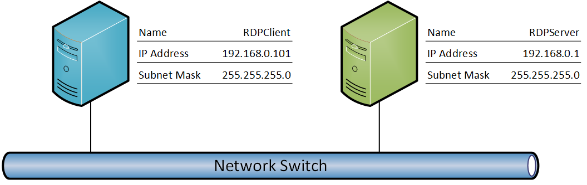

# RDP Client Test Design Specification

## Contents

* [Test Environment](#1)
* [Test Method](#2)
	* [Test Scope](#2.1)
		* [Test Target](#2.1.1)
		* [Protocols Included in the Test Suite](#2.1.2)
	* [ Test Scenarios](#2.2)
		* [MS-RDPBCGR Scenarios](#2.2.1)
		* [MS-RDPEUSB Scenarios](#2.2.2)
		* [MS-RDPRFX Scenarios](#2.2.3)
		* [MS-RDPEVOR Scenarios](#2.2.4)
		* [MS-RDPEUDP Scenarios](#2.2.5)
		* [MS-RDPEMT Scenarios](#2.2.6)
		* [MS-RDPEI Scenarios](#2.2.7)
		* [MS-RDPEGFX Scenarios](#2.2.8)
		* [MS-RDPEDISP Scenarios](#2.2.9)
* [References](#3)

## <a name="1"/>Test Environment
The RDP test environment includes two endpoints: a RDP server and a RDP client. The RDP server hosts the test suite and the RDP client hosts the RDP client to be tested.

For most of the test cases, the RDP server and RDP client can be a physical or a virtual machine. However, to run the MS-RDPEUSB test cases, the RDP client machine should be a physical machine because this test case requires that a specific USB device be connected to the RDP client. 

**Operating System Requirements**

|  **Endpoint**|  **Operating System**| 
| -------------| ------------- |
| RDPServer | Windows 10, Windows 8 or Windows 7  | 
| RDPClient| A system with RDP client installed| 

**Network Overview**

## <a name="2"/>Test Method

### <a name="2.1"/>Test Scope

#### <a name="2.1.1"/>Test Target
The test target is the RDP client endpoint (RDP client), which is performing the client role.

#### <a name="2.1.2"/>Protocols Included in the Test Suite

The RDP test suite includes test cases for the following protocols: 

* MS-RDPBCGR

* MS-RDPEUSB

* MS-RDPRFX

* MS-RDPEVOR

* MS-RDPEUDP

* MS-RDPEMT

* MS-RDPEI

* MS-RDPEGFX

* MS-RDPEDISP

### <a name="2.2"/> Test Scenarios

#### <a name="2.2.1"/>MS-RDPBCGR Scenarios

There are seven scenarios defined in the MS-RDPBCGR client test suite for verifying client behavior:

|  **Scenario**|  **Description**|  **Test Cases**|  **BVTs**| 
| -------------| -------------| -------------| ------------- |
| S1_Connection| Use to verify connection and disconnection sequences.| 87| 7| 
| S2_Reactivation| Use to verify deactivation and reactivation sequences.| 2| 1| 
| S3_AutoReconnect| Use to verify auto-reconnect sequences.| 2| 1| 
| S4_SlowPathInput| Use to verify slow-path input PDUs.| 6| 1| 
| S5_FastPathInput| Use to verify fast-path input PDUs.| 1| 1| 
| S6_AutoDetectTest| Use to verify auto-detect PDUs.| 5| 0| 
| S7_StaticVirtualChannel| Use to verify virtual channel PDUs.| 7| 2| 
| S8_ServerRedirection| Use to verify standard security server redirection PDU and enhanced security server redirection PDUs.| 2| 1| 
| S9_HealthMonitoring| Use to verify client can receive Server Heartbeat PDU, and will auto-reconnect if not receive heartbeat after certain time.| 1| 1| 
| S10_FastPathOutput| Use to verify client can receive Server fast-path update PDUs to update pointers.| 20| 0| 

For more details about MS-RDPBCGR scenario design, please refer to sections 2.2 and 2.3 of **MS-RDPBCGR_ClientTestDesignSpecification.md**.

#### <a name="2.2.2"/>MS-RDPEUSB Scenarios

There are three scenarios defined in the MS-RDPEUSB client test suite for verifying client behavior:

|  **Scenario**|  **Description**|  **Test Cases**|  **BVTs**| 
| -------------| -------------| -------------| ------------- |
| S1_OperateDeviceChannel| Use to verify the creation of device channels and responses to the retract request.| 2| 1| 
| S2_CancelRequest| Use to verify the cancelation of an outstanding IO request.| 3| 3| 
| S3_OperateIo| Use to verify IO request sequences.| 24| 4| 

For more details about MS-RDPEUSB scenario design, please refer to sections 2.2 and 2.3 of **MS-RDPEUSB_ClientTestDesignSpecification.md**.

#### <a name="2.2.3"/>MS-RDPRFX Scenarios

There are four scenarios defined in the MS-RDPRFX client test suite for verifying client behavior:

|  **Scenario**|  **Description**|  **Test Cases**|  **BVTs**| 
| -------------| -------------| -------------| ------------- |
| Exchange Capabilities| Use to exchange MS-RDPRFX capabilities.| 2| 2| 
| Send Encode Header Messages| Use to send encode header messages to the client.| 12| 1| 
| Send Encode Data Messages in Image Mode| Use to send encode data messages to the client in image mode.| 15| 2| 
| Send Encode Data Messages in Video Mode| Use to send encode data messages to client in video mode.| 17| 2| 

For more details about MS-RDPRFX scenario design, please refer to sections 2.2 and 2.3 of **MS-RDPRFX_ClientTestDesignSpecification.md**.

#### <a name="2.2.4"/>MS-RDPEVOR Scenarios

MS-RDPEVOR has one scenario:

|  **Scenario**|  **Description**|  **Test Cases**|  **BVTs**| 
| -------------| -------------| -------------| ------------- |
| Video Streaming Test| Use to verify all messages.| 6| 3| 

For more details about MS-RDPEVOR scenario design, please refer to sections 2.2 and 2.3 of **MS-RDPEVOR_ClientTestDesignSpecification.md**.

#### <a name="2.2.5"/>MS-RDPEUDP Scenarios

MS-RDPEUDP has two scenarios:

|  **Scenario**|  **Description**|  **Test Cases**|  **BVTs**| 
| -------------| -------------| -------------| ------------- |
| S1_Connection| Verify the RDP-UDP connection phase and keep alive behavior.| 2| 1| 
| S2_DataTransfer| Verify data transfer over RDP-UDP connection.| 8| 5| 

For more details about MS-RDPEUDP scenarios design, please refer to sections 2.2 and 2.3 of **MS-RDPEUDP_ClientTestDesignSpecification.md**.

#### <a name="2.2.6"/>MS-RDPEMT Scenarios

MS-RDPEMT has two scenarios:

|  **Scenario**|  **Description**|  **Test Cases**|  **BVTs**| 
| -------------| -------------| -------------| ------------- |
| S1_Connection| Verify the RDPEMT connection phase.| 4| 2| 
| S2_AutoDetection| Verify auto detection over RDPEMT tunnel.| 4| 0| 

For more details about MS-RDPEMT scenarios design, please refer to sections 2.2 and 2.3 of **MS-RDPEMT_ClientTestDesignSpecification.md**.

#### <a name="2.2.7"/>MS-RDPEI Scenarios

MS-RDPEI has two scenarios:

|  **Scenario**|  **Description**|  **Test Cases**|  **BVTs**| 
| -------------| -------------| -------------| ------------- |
| S1_Touch_Input_Test| Verify the initializing phase and touch input event.| 9| 2| 
| S2_Touch_Control_Test| Verify the touch control messages in running phase.| 7| 2| 

For more details about MS-RDPEMT scenarios design, please refer to sections 2.2 and 2.3 of **MS-RDPEI_ClientTestDesignSpecification.md**.

#### <a name="2.2.8"/>MS-RDPEGFX Scenarios

MS-RDPEGFX has below scenarios:

|  **Scenario**| **Description**|  **Test Cases**|  **BVTs**| 
| -------------| -------------| -------------| ------------- |
| Capability Exchange Test| Exchange MS-RDPEGFX capabilities. | 3| 1| 
| Surface to Scren Test| Basic scenario. Create a surface and map bitmap data of a surface to output.| 21| 2| 
| Surface to Cache to Surface Test| Instruct client to save bitmap of surface into cache and copy it back to a surface.| 13| 1| 
| Surface to Surface Test| Copy bitmap data inter-surfaces or intra-surfaces.| 11| 2| 
| ClearCodec Test| Server send surface bitmap data, which is encoded via Clear Codec, to client.| 32| 2| 
| RFX Progressive Codec Test| Server send surface bitmap data, which is encoded via RFX progressive Codec, to client.| 36| 2| 
| Frame Segmentation Test| Server fragments big RDPEGFX frames and sends them to client.| 11| 0| 
| RDP8 Compression Test| Server compresses RDPEGFX fragmentations and sends them to client.| 4| 0| 
| RemoteFX Codec Test| Server send surface bitmap stream, which is encoded via NSCodec, which is specified in [MS-RDPRFX]| 4| 1| 
| H264 Codec Test| Server send surface bitmap data, which is encoded via H264 Codec, to client.| 14| 3| 
| Wire to Surface Test| Server send uncompressed bitmap data to surface.| 2| 1| 

For more details about MS-RDPEGFX scenarios design, please refer to sections 2.2 and 2.3 of **MS-RDPEGFX_ClientTestDesignSpecification.md**.

#### <a name="2.2.9"/>MS-RDPEDISP Scenarios

There are four scenarios defined in the MS-RDPEDISP client test suite for verifying client behavior:

|  **Scenario**|  **Description**|  **Test Cases**|  **BVTs**| 
| -------------| -------------| -------------| ------------- |
| S1_ResolutionChange| Verify RDPEDISP resolution updates sequence| 2| 2| 
| S2_OrientationChange| Verify RDPEDISP orientation updates sequence| 5| 2| 
| S3_MonitorAdditionRemoval| Verify RDPEDISP addition, removal of monitors sequence| 2| 0| 
| S4_MonitorReposition| Verify RDPEDISP repositioning of monitors sequence| 2| 0| 

For more details about MS-RDPEDISP scenario design, please refer to sections 2.2 and 2.3 of **MS-RDPEDISP_ClientTestDesignSpecification.md**.

## <a name="3"/>References

Refer to the following documents for additional information about the RDP test suite:

* **Technical Documents:**

* [MS-RDPBCGR].pdf

* [MS-RDPEUSB].pdf

* [MS-RDPEVOR].pdf

* [MS-RDPRFX].pdf

* [MS-RDPEUDP].pdf

* [MS-RDPEMT].pdf

* [MS-RDPEI].pdf

* [MS-RDPEGFX].pdf

* [MS-RDPEDISP].pdf]

* **Test Suite Design Specs:**

* MS-RDPBCGR_ClientTestDesignSpecification.md

* MS-RDPEUSB_ClientTestDesignSpecification.md

* MS-RDPRFX_ClientTestDesignSpecification.md

* MS-RDPEVOR_ClientTestDesignSpecification.md

* MS-RDPEUDP_ClientTestDesignSpecification.md

* MS-RDPEMT_ClientTestDesignSpecification.md

* MS-RDPEI_ClientTestDesignSpecification.md

* MS-RDPEGFX_ClientTestDesignSpecification.md

* MS-RDPEDISP_ClientTestDesignSpecification.md

* **User Guide:** 

* RDP_ClientUserGuide.md
