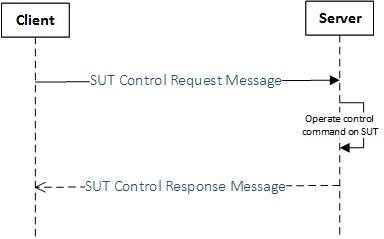
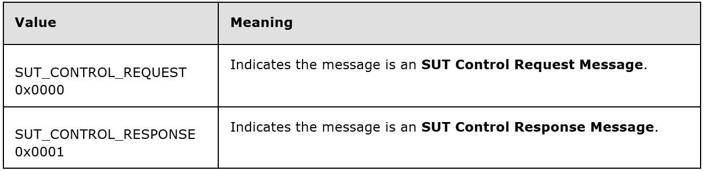
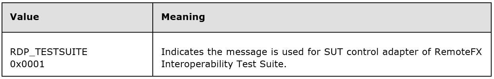
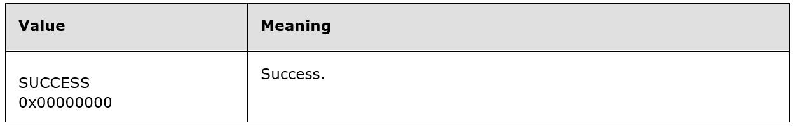
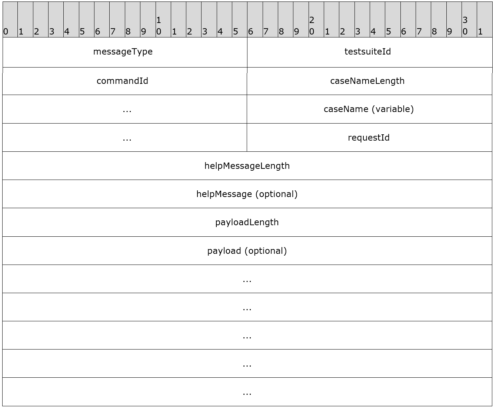
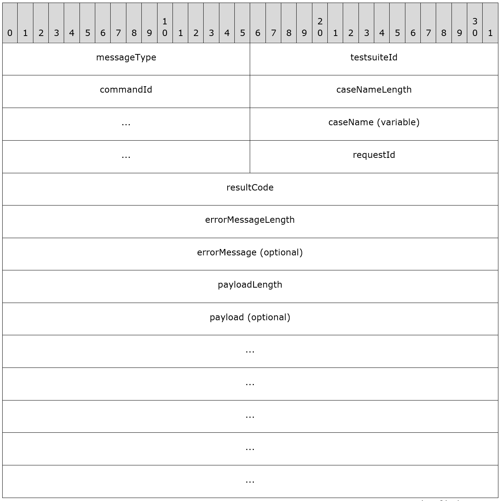

# SUT Remote Control Protocol for Windows Protocol Test Suites

## Contents
* [1 Introduction](#1-Introduction)
  * [1.1 Glossary](#1.1-Glossary)
  * [1.2 References](#1.2-References)
  * [1.3 Overview](#1.3-Overview)
  * [1.4 Relationship to Other Protocols](#1.4-Relationship-to-Other-Protocols)
  * [1.5 Prerequisites/Preconditions](#1.5-Prerequisites/Preconditions)
  * [1.6 Applicability Statement](#1.6-Applicability-Statement)
  * [1.7 Versioning and Capability Negotiation](#1.7-Versioning-and-Capability-Negotiation)
  * [1.8 Vendor-Extensible Fields](#1.8-Vendor-Extensible-Fields)
  * [1.9 Standards Assignments](#1.9-Standards-Assignments)
* [2 Messages](#2-Messages)
  * [2.1 Transport](#2.1-Transport)
  * [2.2 Message Syntax](#2.2-Message-Syntax)
    * [2.2.1 Enumerations](#2.2.1-Enumerations)
    * [2.2.2 Messages](#2.2.1-Messages)
* [3 Protocol Details](#3-Protocol-Details )
  * [3.1 Server Details](#3.1-Server-Details)
  * [3.2 Client Details](#3.2-Client-Details)
* [4 Protocol Examples](#4-Protocol-Examples )

## 1 Introduction

This document specifies the protocol used for Microsoft Protocol Interoperability Test Suites to remote control SUT (System under test), which runs over a TCP or UDP transport. The purpose of this protocol is to provide a protocol-based manner to control SUT. The protocol can be used to transfer SUT control command to SUT, and transfer parameters and execute result between Interoperability Test Suites and SUT. 

This document specifies the SUT Remote Control (SUTRC) Protocol. 

The SUT Remote Control Protocol is designed to provide a protocol-based manner to change or query the states of SUT when running Interoperability Test Suites. 
Sections 1.8, 2, and 3 of this specification are normative and can contain the terms MAY, SHOULD, MUST, MUST NOT, and SHOULD NOT as defined in RFC 2119. Sections 1.5 and 1.9 are also normative but cannot contain those terms. All other sections and examples in this specification are informative. 

### 1.1 Glossary

The following terms are specific to this document:

**SUT:** System under test.

**MAY, SHOULD, MUST, SHOULD NOT, MUST NOT:** These terms (in all caps) are used as described in [RFC2119]. All statements of optional behavior use either MAY, SHOULD, or SHOULD NOT.

### 1.2 References

#### **1.2.1 Normative References**

#### **1.2.2 Informative References**

### 1.3 Overview

SUT Remote Control protocol is used for Interoperability Test Suites to remote control SUT, this protocol provides a protocol-based manner to control SUT.  

There are two roles in this protocol: server and client.  

The protocol client is part of the Interoperability Test Suites implementation. It sends commands to server for changing or querying the SUT states. 

The protocol server runs in SUT. It listens for control commands from client side. When server receives a control command, it needs to do the operation required by client and return the operation result to the client. 

The main scenario to use SUT remote control protocol is showed as following figure. 

1. Client sends **SUT Control Request Message** to Server, the message contains operations (and parameters) need to be processed on SUT.
2. Server receives **SUT Control Request Message,** and processes operations on SUT.
3. Server responds with **SUT Control Response Message** to sends result to the client.

### 1.4  Relationship to Other Protocols

None.

### 1.5  Prerequisites/Preconditions

None.

### 1.6 Applicability Statement

None.

### 1.7 Versioning and Capability Negotiation

This protocol contains no versioning and capability negotiation.

### 1.8 Vendor-Extensible Fields

This protocol defined test suite ID (testsuiteId field, Section 2.2.2.1) and command ID (commandId field, Section 2.2.2.1) in each message, vendors can define their own test suite ID and command ID to extend this protocol.

Besides, all the messages contain payload field, which is used to transfer parameters or execution results. Vendors can extend this protocol by defining payload structure for each command ID their defined.

### 1.9 Standards Assignments

This protocol contains no standards assignments.

## 2   Messages

### 2.1 Transport

This protocol uses TCP or UDP as transport. All the messages and structures defined in this protocol and its extensions are encoded using little-endian format.

### 2.2  Message Syntax

#### 2.2.1 Enumerations

##### 2.2.1.1 MESSAGE\_TYPE\_ENUM 

##### 2.2.1.2 TESTSUITE\_ID\_ENUM

 
##### 2.2.1.3 RESULTCODE\_ENUM

 
#### 2.2.2  Messages

##### 2.2.2.1 SUT Control Request Message

**SUT control request message** is sent from client to server, which is used to transfer SUT control command to server.
 

**messageType (2 bytes)**:  A 16-bit unsigneds integer indicating the message type. This filed MUST be 0x0000 (MESSAGE\_TYPE\_ENUM.SUT\_CONTROL\_REQUEST).

**testsuiteId (2 bytes)**:  A 16-bit unsigned integer indicating ID of interoperability test suite. This field should be one of TESTSUITE\_ID\_ENUM, or other value extends this enumeration.

**commandId (2 bytes)**:  A 16-bit unsigned integer indicating ID of command expected to be transferred to server. Each interoperability test suite extension defined their own command id. 

**caseNameLength (4 bytes)**： A 32-bit unsigned integer indicating the length of **caseName** field.

**caseName (variable)**: A UTF-8 string for the case name of this command. The size in byte of this field MUST be equal to value of **caseNameLength** field. If **caseNameLength** is zero, this field MUST NOT be present.

**requestId (2 bytes)**: A 16-bit unsigned integer used to correspond with **SUT Control Response Message**.

**helpMessageLength (4 bytes)**: A 32-bit unsigned integer indicating the byte length of 
**helpMessage** filed.

**helpMessage (variable)**: A UTF-8 string for the help message of this command. The size in byte of this field MUST be equal to value of **helpMessageLength** field. If **helpMessageLength** is zero, this field MUST NOT be present. 

**payloadLength** (4 bytes):  A 32-bit unsigned integer indicating the byte length of **payload** field.

**payload (variable)**:  A byte array contains extra information of this SUT control command. The specific structure of the payload is defined for each SUT control command in corresponding extension protocol. The size in byte of this field MUST be equal to **payloadLength** , if **payloadLength** is zero, this field MUST NOT be present.

##### 2.2.2.2  SUT Control Response Message

This message is sent from server to client to respond to **SUT Control Request Message**.

**messageType (2 bytes)**: A 16-bit unsigned integer indicating the message type. This filed MUST be 0x0001 (MESSAGE\_TYPE\_ENUM.SUT\_CONTROL\_RESPONSE).

**testsuiteId (2 bytes)**:  A 16-bit unsigned integer indicating ID of interoperability test suite. This field should be one of TESTSUITE\_ID\_ENUM, or other value extends this enumeration.

**commandId (2 bytes)**:  A 16-bit unsigned integer indicating ID of command expected to be transferred to client. Each interoperability test suite extension defined their own command id. 

**caseNameLength (4 bytes)**: A 32-bit unsigned integer indicating the length of **caseName** field. 

**caseName (variable)**: A UTF-8 string for the case name of this command. The size in byte of this field MUST be equal to value of **caseNameLength** field. If **caseNameLength** is zero, this field MUST NOT be present.

**requestId (2 bytes)**: A 16-bit unsigned integer used to correspond with **SUT Control Request Message**. The value in this field MUST be same as **requestId** field in corresponding **SUT Control Request Message**.

**payloadLength (4 bytes)**:  A 32-bit unsigned integer indicating the byte length of payload field.

**resultCode (4 bytes)**:  A 32-bit unsigned integer indicating the result of command of SUT Control Request Message. This field should be one of **RESULTCODE\_NUM** , or other value extends this enumeration.

**errorMessageLength (4 bytes)**:  A 32-bit unsigned integer indicating the byte length of **errorMessage** filed.

**errorMessage (variable)**:  A UTF-8 string for the error message of operating this command. The size in byte of this field MUST equal value of **errorMessageLength** field. If **errorMessageLength** is zero, this field MUST NOT be present. **payloadLength (4 bytes):  **A 32-bit unsigned integer indicating the byte length of **payload** field.

**payload (variable)**:  A byte array contains extra return value of this SUT control command. The specific structure of the payload is defined for each SUT control command in corresponding extension protocols. The size in byte of this field MUST be equal to **payloadLength** , if **payloadLength** is zero, this field MUST NOT be present.

## 3.   Protocol Details

### 3.1   Server Details

#### 3.1.1   Abstract Data Model

No abstract data model on server.

#### 3.1.2   Timers

None

#### 3.1.3   Initialization

The server should start listening a pre-defined port using TCP or UDP.

#### 3.1.4   Higher-Layer Triggered Events

None

#### 3.1.5   Message Processing Events and Sequencing Rules

##### 3.1.5.1   Processing a SUT Control Request Message

The SUT Control Request message is the only message received by server. This message includes SUT control command and necessary parameters. The **messageType** field MUST be 0x0000, the **testsuiteId** field MUST be a pre-defined test suite Id, and the **commandId** field MUST be a predefined command ID in corresponding extension protocol.

After receiving SUT Control Request Message, the server should perform the corresponding operation on SUT and then construct the SUT Control Response Message based on the request.

##### 3.1.5.2   Sending a SUT Control Response Message

Server should respond with **SUT Control Response Message** immediately after it operates command from the SUT Control Request Message.

The **messageType** field MUST be 0x0001, the **testsuiteId** , **commandId** , and **requestId** field MUST be equal to the correspond fields in SUT Control Request message.

If the operation of command succeeds, the **resultCode** field should be 0x00000000(SUCCESS), otherwise it should contain a **resultCode** defined in corresponding extension protocols.

Optionally, the server can add error message into **errorMessage** field of SUT Control Response Message. The test suite can log this error message.

#### 3.1.6   Timer Events

None

#### 3.1.7   Other Local Events**

None

### 3.2   Client Details

#### 3.2.1   Abstract Data Model

No abstract data model on server.

#### 3.3.2   Timers

None

#### 3.3.3   Initialization

If using TCP as transport, the client should establish a TCP connection with server.

#### 3.3.4   Higher-Layer Triggered Events

The interoperability test suite is invoking the protocol client to send control messages to server.

#### 3.3.5   Message Processing Events and Sequencing Rules

##### 3.3.5.1   Sending a SUT Control Request Message

The **messageType** field MUST be 0x0000, the **testsuiteId** field MUST be a pre-defined test suite Id, and the **commandId** field MUST be a pre-defined command ID which should be defined in corresponding extension protocols.

The client should establish TCP connection if it uses TCP as transport.

Optionally, the client can send help message in **helpMessage** field of SUT Control request message.

##### 3.3.5.2   Processing a SUT Control Response Message

Client process the SUT Control Response Message response by the server to get the result of operation.

The **messageType** field MUST be 0x0001, the **testsuiteId** , **commandId** , and **requestId** field MUST be equal to the correspond fields in SUT Control Request message.

If the **resultCode** field is 0x00000000(SUCCESS), the operation is successful; otherwise client should log the **resultCode** , and error message if the **errorMessage** field is present.

If using TCP as transport, the client should disconnect TCP connection immediately after it received SUT Control Response Message.

#### 3.3.6   Timer Events

None

#### 3.3.7   Other Local Events

None

## 4.   Protocol Examples

None