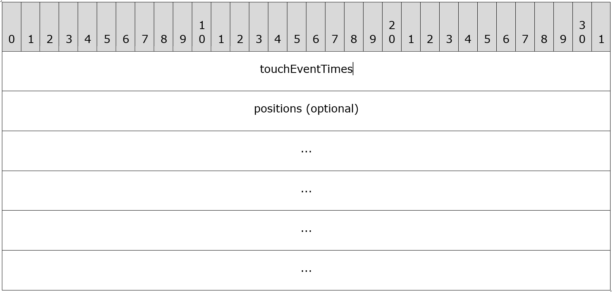

# SUT Remote Control Protocol for Windows Protocol Test Suites: RDP Extension

## Contents
* [1 Introduction](#1-Introduction)
  * [1.1 Glossary](#1.1-Glossary)
  * [1.2 References](#1.2-References)
  * [1.3 Overview](#1.3-Overview)
  * [1.4 Relationship to Other Protocols](#1.4-Relationship-to-Other-Protocols)
  * [1.5 Prerequisites/Preconditions](#1.5-Prerequisites/Preconditions)
  * [1.6 Applicability Statement](#1.6-Applicability-Statement)
  * [1.7 Versioning and Capability Negotiation](#1.7-Versioning-and-Capability-Negotiation)
  * [1.8 Vendor-Extensible Fields](#1.8-Vendor-Extensible-Fields)
  * [1.9 Standards Assignments](#1.9-Standards-Assignments)
* [2 Messages](#2-Messages)
  * [2.1 Transport](#2.1-Transport)
  * [2.2 Message Syntax](#2.2-Message-Syntax)
    * [2.2.1 Enumerations](#2.2.1-Enumerations)
    * [2.2.2 Messages](#2.2.1-Messages)
* [3 Protocol Details](#3-Protocol-Details )
  * [3.1 Server Details](#3.1-Server-Details)
  * [3.2 Client Details](#3.2-Client-Details)
* [4 Protocol Examples](#4-Protocol-Examples )

## 1 Introduction

This document specifies the RDP extension for SUT Remote Control Protocol for Microsoft ProtocolInteroperability Test Suites, which runs over a TCP or UDP transport. The purpose of this protocol is to provide a protocol-based manner to control RDP client implementation on SUT. The protocol can be used to transfer RDP SUT control commands (with parameters) to SUT, and get execution result from SUT.

Sections 1.8, 2, and 3 of this specification are normative and can contain the terms MAY, SHOULD, MUST, MUST NOT, and SHOULD NOT as defined in RFC 2119. Sections 1.5 and 1.9 are also normative but cannot contain those terms. All other sections and examples in this specification are informative.

### 1.1 Glossary

The following terms are specific to this document:

**SUT:** System under test.

**RDP** : Remote Desktop Protocol

**SUT Remote Control Protocol** : SUT Remote Control Protocol for Microsoft Protocol Interoperability Test Suites.

**MAY, SHOULD, MUST, SHOULD NOT, MUST NOT:** These terms (in all caps) are used as described in [RFC2119]. All statements of optional behavior use either MAY, SHOULD, or SHOULD NOT.

### 1.2 References
#### 1.2.1 Normative References
#### 1.2.2 Informative References
### 1.3 Overview

SUT Remote Control Protocol for Microsoft Protocol Interoperability Test Suites: RDP Extension is used for RDP Interoperability Test Suite. This protocol extends SUT Remote Control Protocol, and defines 11 RDP SUT control commands for RemoteFX Interoperability Test Suite. RemoteFX Interoperability Test Suite uses this protocol to transfer RDP SUT control commands to SUT, and gets result data from SUT.

There are two roles as described in SUT Remote Control Protocol for Microsoft Protocol InteroperabilityTest Suites: server and client.

The server role is an implementation on SUT, which is used to receive control commands from client and do operations on SUT which required by client.

The client role is the SUT control adapter component in RemoteFX Interoperability Test Suite, which is used by test cases to send RDP SUT control commands.

### 1.4 Relationship to Other Protocols

This protocol is an extension of SUT Remote Control Protocol for Microsoft Protocol InteroperabilityTest Suites.

### 1.5 Prerequisites/Preconditions
### 1.6 Applicability Statement
### 1.7 Versioning and Capability Negotiation
### 1.8 Vendor-Extensible Fields
### 1.9 Standards Assignments
## 2 Messages
### 2.1 Transport

This protocol uses the same transport as SUT Remote Control Protocol. Both TCP and UDP can be used as transport.

### 2.2 Message Syntax
#### 2.2.1 Enumerations
##### 2.2.1.1 RDP\_SUT\_CONTROL\_COMMAND\_ENUM

| **Value** | **Meaning** |
| --- | --- |
| START\_RDP\_CONNECTION 0x0001 | Trigger SUT to start a RDP connection |
| CLOSE\_RDP\_CONNECTION 0x0002 | Trigger SUT to close all RDP connection |
| AUTO\_RECONNECT 0x0003 | Trigger SUT to start an auto reconnect |
| BASIC\_INPUT 0x0004 | Trigger SUT to do basic input on RDP client |
| SCREEN\_SHOT 0x0005 | Do a screen shot on RDP client and send graphic data back |
| TOUCH\_EVENT\_SINGLE 0x0101 | Ask SUT to trigger single touch event on RDP client |
| TOUCH\_EVENT\_MULTIPLE 0x0102 | Ask SUT to trigger multiple touch event on RDP client |
| TOUCH\_EVENT\_DISMISS\_HOVERING\_CONTACT 0x0103 | Ask SUT to trigger a dismiss hovering contact event on RDP client |
| DISPLAY\_UPDATE\_RESOLUTION 0x0201 | Ask SUT to trigger RDPEDISP message to update display resolution |
| DISPLAY\_UPDATE\_MONITORS 0x0202 | Ask SUT to trigger RDPEDISP message to update monitor setting, such as add a monitor, remove a monitor or change monitor position |
| DISPLAY\_FULLSCREEN 0x0203 | Ask SUT to change RDP client to full screen. |

#### 2.2.2 Messages
##### 2.2.2.1 Basic RDP SUT Commands
###### 2.2.2.1.1 START\_RDP\_CONNECTION

START\_RDP\_CONNECTION command is used to control SUT to start a RDP connection.

**2.2.2.1.1.1 SUT Control Request Message**

The request message used for this command is an SUT Control Request Message of SUT Remote Control protocol.

The **testsuiteId** field must be RDP\_TESTSUITE (0x0001).

The **commandId** field must be START\_RDP\_CONNECTION (0x0001).

The **payload** field is an RDP\_Connection\_Payload structures.

**2.2.2.1.1.1.1 RDP\_Connection\_Payload Structure**

**payloadType (4 bytes)**:A 32-bit unsigned integer indicate the payload type.

| **Value** | **Meaning** |
| --- | --- |
| RDP\_FILE 0x0000 | Payload is the content of a RDP file |
| PARAMETERS\_STRUCT 0x0001 | Payload is a RDP\_CONNECTION\_CONFIGURE\_PARAMETER structure. |

**payload (variable)**: If payloadType is RDP\_FILE (0x0000), this filed MUST be a Unicode-8 string for content of a RDP file; if payload Type is PARAMETERS\_STRUCT (0x0001), this filed MUST be a RDP\_CONNECTION\_CONFIGURE\_PARAMETER structure.

 **2.2.2.1.1.1.1.1** RDP\_CONNECTION\_CONFIGURE\_PARAMETER

**port (2 bytes)**: A 16-bit unsigned integer indicates the port RDP test suite listen to.

**screenType (2 bytes)**: A 16-bit unsigned integer indicates whether the RDP client using full screen.

| **Value** | **Meaning** |
| --- | --- |
| NORMAL 0x0000 | Not full screen |
| FULL\_SCREEN 0x0001 | Full screen |

**desktopWidth (2 bytes)**: A 16-bit unsigned integer indicate the width of RDP client window.

**desktopHeight (2 bytes)**: A 16-bit unsigned integer indicate the height of RDP client window.

**connectApproach (2 bytes)**: A 16-bit unsigned integer indicates the connect approach.

| **Value** | **Meaning** |
| --- | --- |
| Negotiate  0x0000| Use negotiate connect method |
| Direct 0x0001 | Use direct connect method |

**addressLength (2 bytes)**: A 16-bit unsigned integer indicate the length of address field.

**address (variable)**: A Unicode-8 string for address of RDP Server. The size in byte of this field must equal to **addressLength** field.

**2.2.2.1.1.2** SUT Control Response Message

This is an optional message as the response of SUT Control Request Message of START\_RDP\_CONNECTION command.

The **payloadLength** filed MUST be 0, and the **payload** field MUST not appear.

###### 2.2.2.1.2 CLOSE\_RDP\_CONNECTION
**2.2.2.1.2.1** SUT Control Request Message

The request message used for this command is a SUT Control Request Message of SUT Remote Control protocol.

The **testsuiteId** field must be RDP\_TESTSUITE (0x0001).

The **commandId** field must be CLOSE\_RDP\_CONNECTION (0x0002).

The **payloadLength** filed MUST be 0, and the **payload** field MUST NOT appear.

**2.2.2.1.2.2** SUT Control Response Message

This is an optional message as the response of SUT Control Request Message of STOP\_RDP\_CONNECTION command.

The **payloadLength** filed MUST be 0, and the **payload** field MUST NOT appear.

###### 2.2.2.1.3 AUTO\_RECONNECT
**2.2.2.1.3.1** SUT Control Request Message

The request message used for this command is a SUT Control Request Message of SUT Remote Control protocol.

The **testsuiteId** field must be RDP\_TESTSUITE (0x0001).

The **commandId** field must be AUTO\_RECONNECT (0x0003).

The **payloadLength** filed MUST be 0, and the **payload** field MUST NOT appear.

**2.2.2.1.3.2** SUT Control Response Message

This is an optional message as the response of SUT Control Request Message of AUTO\_RECONNECT command.

The **payloadLength** filed MUST be 0, and the **payload** field MUST NOT appear.

###### **2.2.2.1.4** BASIC\_INPUT
**2.2.2.1.4.1** SUT Control Request Message

The request message used for this command is a SUT Control Request Message of SUT Remote Control protocol.

The **testsuiteId** field must be RDP\_TESTSUITE (0x0001).

The **commandId** field must be BASIC\_INPUT (0x0004).

The **payloadLength** filed MUST be 4.

The **payload** field is a 32-bit unsigned integer flag used to indicate basic inputs need for SUT

| **Value** | **Meaning** |
| --- | --- |
| 0x00000001 | Input for Keyboard Event |
| 0x00000002 | Input for Unicode Keyboard Event |
| 0x00000004 | Input for Mouse Event |
| 0x00000008 | Input for Extended Mouse Event |
| 0x00000010 | Input for Synchronize Event |
| 0x00000020 | Control output by Refresh Rect PDU |
| 0x00000040 | Control output by Suppress Output PDU |

**2.2.2.1.4.2** SUT Control Response Message

This is an optional message as the response of SUT Control Request Message of BASIC\_INPUT command.

The **payloadLength** filed MUST be 0, and the **payload** field MUST NOT appear.

###### **2.2.2.1.5** SCREEN\_SHOT
**2.2.2.1.5.1** SUT Control Request Message

The request message used for this command is a SUT Control Request Message of SUT Remote Control protocol.

The **testsuiteId** field must be RDP\_TESTSUITE (0x0001).

The **commandId** field must be SCREEN\_SHOT (0x0005).

The **payloadLength** filed MUST be 0, and the **payload** field MUST NOT appear.

**2.2.2.1.5.2** SUT Control Response Message

This is a message MUST be sent as the response of SUT Control Request Message of SCREEN\_SHOT.

If **resultCode** is SUCCESS (0x00000000), payload must be a GRAPHIC\_DATA structure, which contains data of screenshot graphic.

If **resultCode** is not SUCCESS, the payload MUST NOT be appeared.

**2.2.2.1.5.2.1** GRAPHIC\_DATA

**width (4 bytes)**: A 32-bit unsigned integer indicate the width of the graphic.

**height (4 bytes)**: A 32-bit unsigned integer indicate the height of the graphic.

**graphicData (variable):** an array of PIXEL\_DATA structure, each PIXEL\_DATA descript a pixel of the graphic. The pixels are arranged from top to down, left to right sequence.

**PIXEL\_DATA:**

**R (1 byte):** red dimension

**G (1 byte):** green dimension

**B (1 byte):** blue dimension

##### **2.2.2.2** RDPEI SUT Commands
###### **2.2.2.2.1** TOUCH\_EVENT\_SINGLE
**2.2.2.2.1.1** SUT Control Request Message

The request message used for this command is a SUT Control Request Message of SUT Remote Control protocol.

The **testsuiteId** field must be RDP\_TESTSUITE (0x0001).

The **commandId** field must be TOUCH\_EVENT\_SINGLE (0x0101).

The **payload** filed MUST be the following structure.

**touchEventTimes (4 bytes)**: A 32-bit unsigned integer indicates how many single touch event need to be triggered.

**positions (variable, optional)**: optional field contains an array of POSITION structure used to indicate touch position, if exists, the number of POSITION structure MUST be equal to the value in **touchEventTimes** field.

**POSITION:**

**X (4 byte):** X coordinate of the position

**Y (4 byte):** Y coordinate of the position

**2.2.2.2.1.2** SUT Control Response Message

This is an optional message as the response of SUT Control Request Message of TOUCH\_EVENT\_SINGLE command.

The **payloadLength** filed MUST be 0, and the **payload** field MUST NOT appear.

###### **2.2.2.2.2** TOUCH\_EVENT\_MULTIPLE
**2.2.2.2.2.1** SUT Control Request Message

The request message used for this command is a SUT Control Request Message of SUT Remote Control protocol.

The **testsuiteId** field must be RDP\_TESTSUITE (0x0001).

The **commandId** field must be TOUCH\_EVENT\_MULTIPLE (0x0102).

The **payload** filed MUST be the following structure.

**touchPositionCount (4 bytes)**:  A 32-bit unsigned integer indicate how many position a multi touch event contains.

**positions (variable)**:  optional field contains an array of POSITION structure used to indicate touch position, if existed, the number of POSITION structure MUST be equal to the value in **touchPositionCount** field.

**POSITION:**

**X (4 byte):** X coordinate of the position
**Y (4 byte):** Y coordinate of the position

**2.2.2.2.2.2** SUT Control Response Message

This is an optional message as the response of SUT Control Request Message of TOUCH\_EVENT\_MULTIPLE command.

The **payloadLength** filed MUST be 0, and the **payload** field MUST NOT appear.

###### **2.2.2.2.3** TOUCH\_EVENT\_DISMISS\_HOVERING\_CONTACT
 **2.2.2.2.3.1** SUT Control Request Message

The request message used for this command is a SUT Control Request Message of SUT Remote Control protocol.

The **testsuiteId** field must be RDP\_TESTSUITE (0x0001).

The **commandId** field must be TOUCH\_EVENT\_DISMISS\_HOVERING\_CONTACT (0x0103).

The **payloadLength** filed MUST be 0, and the **payload** field MUST NOT appear.

**2.2.2.2.3.2** SUT Control Response Message

This is an optional message as the response of SUT Control Request Message of TOUCH\_EVENT\_DISMISS\_HOVERING\_CONTACT command.

The **payloadLength** filed MUST be 0, and the **payload** field MUST NOT appear.

##### **2.2.2.3** RDPEDISP SUT Commands
###### **2.2.2.3.1** DISPLAY\_UPDATE\_RESOLUTION
**2.2.2.3.1.1** SUT Control Request Message

The request message used for this command is a SUT Control Request Message of SUT Remote Control protocol.

The **testsuiteId** field must be RDP\_TESTSUITE (0x0001).

The **commandId** field must be DISPLAY\_UPDATE\_RESOLUTION (0x0201).

The **payload** field MUST be the following structure.

**operation (4 bytes)**: A 32-bit unsigned integer flag indicate display resolution update operations.

| **flag** | **Meaning** |
| --- | --- |
| UPDATE\_RESOLUTION 0x00000001 | Update display resolution |
| UPDATE\_ORIENTATION 0x00000002 | Update the orientation |

**width (2 bytes)**:  optional field indicate new resolution width of screen, this field MUST be present if operation field contains UPDATE\_RESOLUTION (0x00000001) flag.

**height ( 2 bytes)**:  optional field indicate new resolution height of screen, this field MUST be present if operation field contains UPDATE\_RESOLUTION (0x00000001) flag.

**orientation (4 bytes)**: optional field indicate new orientation of screen, this field MUST be present if operation field contains UPDATE\_ORIENTATION (0x00000002) flag.

**2.2.2.3.1.2** SUT Control Response Message

This is an optional message as the response of SUT Control Request Message of DISPLAY\_UPDATE\_RESOLUTION command.

The **payloadLength** filed MUST be 0, and the **payload** field MUST NOT appear.

###### **2.2.2.3.2** DISPLAY\_UPDATE\_MONITORS
 **2.2.2.3.2.1** SUT Control Request Message

The request message used for this command is a SUT Control Request Message of SUT Remote Control protocol.

The **testsuiteId** field must be RDP\_TESTSUITE (0x0001).

The **commandId** field must be DISPLAY\_UPDATE\_MONITORS (0x0202).

The **payload** field MUST be a 4 bytes unsigned integer flag used to indicate monitors update operation.

| **flag** | **Meaning** |
| --- | --- |
| ADD\_MONITOR 0x00000001 | Add a monitor |
| REMOVE\_MONITOR 0x00000002 | Remove a monitor |
| MOVE\_MONITOR\_POSITION 0x00000004 | Move monitor position |

**2.2.2.3.2.2** SUT Control Response Message

This is an optional message as the response of SUT Control Request Message of DISPLAY\_UPDATE\_MONITORS command.

The **payloadLength** filed MUST be 0, and the **payload** field MUST NOT appear.

###### **2.2.2.3.3** DISPLAY\_FULLSCREEN
 **2.2.2.3.3.1** SUT Control Request Message

The request message used for this command is a SUT Control Request Message of SUT Remote Control protocol.

The **testsuiteId** field must be RDP\_TESTSUITE (0x0001).

The **commandId** field must be DISPLAY\_FULLSCREEN (0x0203).

The **payloadLength** filed MUST be 0, and the **payload** field MUST NOT appear.

  **2.2.2.3.3.2** SUT Control Response Message

This is an optional message as the response of SUT Control Request Message of DISPLAY\_FULLSCREEN command.

The **payloadLength** filed MUST be 0, and the **payload** field MUST NOT appear.

## **3** Protocol Details
### **3.1** Server Details
#### **3.1.1** Abstract Data Model

No abstract data model on server.

#### **3.1.2** Timers

None

#### **3.1.3** Initialization

The server should start listening to a pre-defined port using TCP or UDP.

#### **3.1.4** Higher-Layer Triggered Events

None

### **3.1.5** Message Processing Events and Sequencing Rules
##### **3.1.5.1** Processing a SUT Control Request Message

The server should process SUT Control Request Message as section 3.1.5.1 of SUT Remote Controlprotocol. The **testsuiteId** field must be RDP\_TESTSUITE (0x0001).

###### **3.1.5.1.1** START\_RDP\_CONNECTION

If the **commandId** field is START\_RDP\_CONNECTION (0x0001). The server should start a RDP connection according to the information in the payload field, then send the corresponding SUT Control Response message to the client.

###### **3.1.5.1.2** CLOSE\_RDP\_CONNECTION

If the **commandId** field is CLOSE\_RDP\_CONNECTION (0x0002). The server should close all RDP connection on SUT,then send the corresponding SUT Control Response message to the client.

###### **3.1.5.1.3** AUTO\_RECONNECT

If the **commandId** field is AUTO\_RECONNECT (0x0003). The server should send the corresponding SUT Control Response message to the client firstly and then trigger the auto-reconnect event.

###### **3.1.5.1.4** BASIC\_INPUT

If the **commandId** field is  BASIC\_INPUT (0x0004). The server should perform corresponding basic input event according to the value in payload field, then send the corresponding SUT Control Response message to the client.

###### **3.1.5.1.5** SCREEN\_SHOT

If the **commandId** field is SCREEN\_SHOT (0x0005). The server should take a screen shot on RDP client, then send the picture as the payload of SUT Control Response message to the client.

###### **3.1.5.1.6** TOUCH\_EVENT\_SINGLE

If the **commandId** field is  TOUCH\_EVENT\_SINGLE (0x0101). The server should trigger single touch event on RDP client. The times of event should be larger or equal to **touchEventTimes** field in payload. If **positions** field in payload is present, the single touch event should be triggered on corresponding positions. After triggered these single touch events, the server then should send the corresponding SUT Control Response message.

###### **3.1.5.1.7** TOUCH\_EVENT\_MULTIPLE

If the **commandId** field is  TOUCH\_EVENT\_MULTIPLE (0x0102). The server should trigger multiple touch event on RDP client. The count of multi-touch should be equal to **touchPositionCount** field in payload. If **positions** field in payload is present, the multiple touch event should be triggered on corresponding positions. After triggered the multiple touch event, the server then should send the corresponding SUT Control Response message.

###### **3.1.5.1.8** TOUCH\_EVENT\_DISMISS\_HOVERING\_CONTACT

If the **commandId** field is  TOUCH\_EVENT\_DISMISS\_HOVERING\_CONTACT (0x0103). The server should trigger a DISMISS\_HOVERING\_CONTACT event on RDP client, and then send the corresponding SUT Control Response message.

###### **3.1.5.1.9** DISPLAY\_UPDATE\_RESOLUTION

If the **commandId** field is  DISPLAY\_UPDATE\_RESOLUTION (0x0201). The server should change the display resolution on SUT. If the **operation** field in payload contains **UPDATE\_RESOLUTION** (0x00000001), change the resolution of desktop using new width and height value in payload; if the operation field in payload contains **UPDATE\_ORIENTATION** (0x00000002), update the orientation of the desktop according to **orientation** field in payload, then send the corresponding SUT Control Response message.

###### **3.1.5.1.10** DISPLAY\_UPDATE\_MONITORS

If the **commandId** field is  DISPLAY\_UPDATE\_MONITORS (0x0202). The server should update monitors of the SUT, add a monitor, remove a monitor, or change monitors position according to the value of payload, then send the corresponding SUT Control Response message.

###### **3.1.5.1.11** DISPLAY\_FULLSCREEN

If the **commandId** field is  DISPLAY\_FULLSCREEN (0x0203). The server should change the RDP client window to full screen, and then send the corresponding SUT Control Response message.

##### **3.1.5.2** Sending a SUT Control Response Message

Server should response SUT Control Response Message as section 3.1.5.2 of SUT Remote Controlprotocol.

#### **3.1.6** Timer Events

None

#### **3.1.7** Other Local Events

None

### **3.2** Client Details
#### **3.2.1** Abstract Data Model

No abstract data model on server.

#### **3.2.2** Timers

None

#### **3.2.3** Initialization

If using TCP as transport, the client should establish a TCP connection with server.

#### **3.2.4** Higher-Layer Triggered Events

None

#### **3.2.5** Message Processing Events and Sequencing Rules
##### **3.2.5.1** Sending a SUT Control Request Message

Client should send SUT Control Request Message as section 3.2.5.1 of SUT Remote Control protocol.

##### **3.2.5.2** Processing a SUT Control Response Message

Client should process SUT Control Response Message as section 3.2.5.2 of SUT Remote Controlprotocol.

#### **3.2.6** Timer Events

None

#### **3.2.7** Other Local Events

None

## **4** Protocol Examples

None