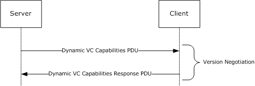
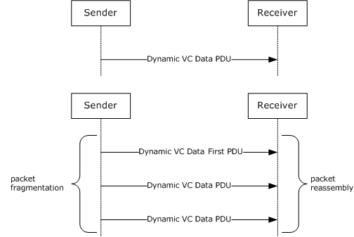
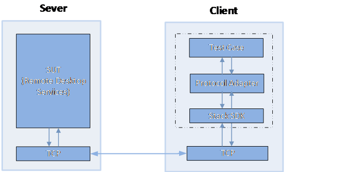

# MS-RDPEDYC Server Test Design Specification

## Contents

* [Technical Document Analysis](#_Toc3964682143)
    * [Technical Document Overview](#_Toc3964682144)
    * [Relationship to Other Protocols](#_Toc3964682145)
    * [Protocol Operations/Messages](#_Toc3964682146)
    * [Protocol Properties](#_Toc3964682147)
* [Test Method](#_Toc3964682148)
    * [Assumptions, Scope and Constraints](#_Toc3964682149)
    * [Test Approach](#_Toc3964682150)
    * [Test Scenarios](#_Toc3964682151)
		* [S1_EDYCBasicTest](#_Toc396468179)
* [Test Suite Design](#_Toc3964682160)
    * [Test Suite Architecture](#_Toc3964682161)
		* [System under Test (SUT)](#_Toc3964682162)
		* [Test Suite Architecture](#_Toc3964682163)
    * [Technical Dependencies/Considerations](#_Toc3964682164)
		* [Dependencies](#_Toc3964682165)
		* [Technical Difficulties](#_Toc3964682166)
		* [Encryption Consideration](#_Toc3964682167)
    * [Adapter Design](#_Toc3964682168)
		* [Adapter Overview](#_Toc3964682169)
		* [Technical Feasibility of Adapter Approach](#_Toc3964682170)
		* [Adapter Abstract Level](#_Toc3964682171)
* [Test Cases Design](#_Toc3964682172)
    * [Traditional Test Case Design](#_Toc3964682173)
    * [Test Cases Description](#_Toc3964682174)
		* [S1_MultitransportConnectionInitiation](#_Toc3964682175)
* [Appendix](#_Toc3964682176)
    * [Glossary](#_Toc3964682177)
    * [Reference](#_Toc3964682178)

## <a name="_Toc3964682143"/>Technical Document Analysis

### <a name="_Toc3964682144"/>Technical Document Overview

The Remote Desktop Protocol: Dynamic Channel Virtual Channel Extension, which supports features such as classes of priority (that may be used to implement bandwidth allocation) and individually connected endpoints using dynamic virtual channel (DVC) listeners.

### <a name="_Toc3964682145"/>Relationship to Other Protocols
The Remote Desktop Protocol: Multitransport Extension operates over the RDP-UDP protocol, as defined in [MS-RDPEUDP] section 1, 2, and 3. Protocol traffic is secured by using Transport Layer Security (TLS) ([RFC2246], [RFC4346] and [RFC5246]) for reliable RDP-UDP streams and Datagram Transport Layer Security (DTLS) ([RFC4347]) for unreliable (lossy) RDP-UDP streams. The TLS or DTLS handshake, as well as the encrypted payload, are embedded in the RDPUDP_SOURCE_PAYLOAD_HEADER as defined in [MS-RDPEUDP].
A multitransport connection is initiated by an RDP server sending the Initiate Multitransport Request PDU ([MS-RDPBCGR] section 2.2.1.15.1) to an RDP client over the main RDP connection.

### <a name="_Toc3964682146"/>Protocol Operations/Messages
There are 14 protocol data units (PDUs) described by [MS-RDPEDYC] protocol, and they can be classified into the following message flows:

| -------------| ------------- |
|  **Message Flows** |  **Number of PDUs**|
| DVC Capabilities Exchange| 4|
| Open DVC| 2|
| Send and receive DVC data| 4|
| Close DVC| 1|
| Soft-sync| 3|

The following sequence diagram presents an overview of these messages and protocols.

The open dvc, send and receive data, close dvc message flows are defined in [MS-RDPEDYC]. The Connection Sequence is described in following figure (Figure 1-2, 1-3, 1-4 and 1-5). All message exchanges in this diagram are strictly sequential, except where noted in the text that follows.

Figure 1-1: MS-RDPEDYC open DVC message Sequence

Figure 1-2: MS-RDPEDYC open DVC message Sequence

Figure 1-3: MS-RDPEDYC send and receive data message Sequence

Figure 1-4: MS-RDPEDYC close DVC message Sequence

### <a name="_Toc3964682147"/>Protocol Properties

* Remote Desktop Protocol: Dynamic Virtual Channel Extension messages are passed between a DVC manager on a server and a DVC manager on a client, and are transmitted over one of the following underlying transport mechanisms:
* A static virtual channel ([MS-RDPBCGR] sections 1.3.3 and 2.2.6), where the name of the channel is the ANSI character string "DRDYNVC" and bulk compression is enabled.
* A lossy or reliable UDP multitransport connection ([MS-RDPEMT] sections 1.3 and 2.2.2.3).
* The Remote Desktop Protocol: Dynamic Virtual Channel Extension does not establish any transport connections.

## <a name="_Toc3964682148"/>Test Method

### <a name="_Toc3964682149"/>Assumptions, Scope and Constraints
**Assumptions:**

* The RDP server machine should be configurable; in order to test some specific features or requirements, the test suite will try to trigger the server to act with specific configuration settings, such as capability set support.

**Scope:**

* The protocol server endpoint (RDP server) playing the server role will be tested. For Windows, the Remote Desktop Service (TermService) is the server endpoint.
* The protocol client endpoint (RDP client) playing the client role is out of scope.
* For Windows, the System Under Test (SUT) will be both Server SKUs and Client SKUs.
* External protocols are out of scope.

**Constraint:**
There is no constraint for this Test Suite.

### <a name="_Toc3964682150"/>Test Approach

Traditional testing is chosen as the test approach in MS-RDPEDYC.

Reasons for choosing Traditional Testing

* The protocol is not completely stateful.

* The logic of this protocol is simple.

* For [MS-RDPBCGR], only 14 out of 50 PDUs in the connection/disconnection sequences are sent sequentially.

* For this protocol, all PDUs in the connection/disconnection sequences are sent sequentially.

* The combinations of parameters are not complex. Capability sets are the exception, which will be addressed through the use of configuration files.

### <a name="_Toc3964682151"/>Test Scenarios

|  **Scenario**|  **Priority**|  **Test Approach**|  **Description**|
| -------------| -------------| -------------| ------------- |
| S1_EDYCBasicTest| 0| Traditional| This scenario is used to Verify MS-RDPEDYC open channel, send and receive data, close channel and soft-sync PDUs|

_Table 1 Test Suite Scenarios_

#### <a name="_Toc3964682152"/>S1_EDYCBasicTest
**Preconditions:**

MS-RDPBCGR connection is setup.

RDPServer supports EDYC.

**Typical Sequence:**

The typical scenario sequence is as follows:

* The client and server build an RDPBCGR connection to the server.

* The server sends DVC Capability exchange request and gets client response.

* The server sends create DVC channel request and gets client response.

* The client sends DVC data (compressed/uncompressed) to server and gets response.

* The server sends DVC close channel request and close the channel.

## <a name="_Toc3964682160"/>Test Suite Design

### <a name="_Toc3964682161"/>Test Suite Architecture

#### <a name="_Toc3964682162"/>System under Test (SUT)
* From the third party point of view, the SUT is a component that implements MS-RDPEDYC Server.
* From the Windows implementation point of view, the SUT is the Remote Desktop Service (TermService).

#### <a name="_Toc3964682163"/>Test Suite Architecture
Figure 1 illustrates the architecture of the MS-RDPEDYC test suite for server endpoint testing.

 _Figure 1 RDP Server Test Suite Architecture_

### <a name="_Toc3964682164"/>Technical Dependencies/Considerations

#### <a name="_Toc3964682165"/>Dependencies
There are no dependencies.

#### <a name="_Toc3964682166"/>Technical Difficulties
There are no technical difficulties.

#### <a name="_Toc3964682167"/>Encryption Consideration

* When using the RDP standard security mechanism, MS-RDPBCGR messages are encrypted; however, you can turn off server-side encryption by setting the encryption level to low.

* When using external security protocols, such as TLS and CredSSP, the MS-RDPBCGR transport is encrypted; this encryption cannot be turned off.

* The MS-RDPEDYC messages are encrypted by selected underlying transport protocol TLS or DTLS.

### <a name="_Toc3964682168"/>Adapter Design

#### <a name="_Toc3964682169"/>Adapter Overview
The MS-RDPEDYC Server Test Suite implements a protocol adapter. The protocol adapter is used to receive messages from the SUT and to send messages to the SUT. The protocol adapter is built upon the protocol test suite library, which is implemented with managed code.

#### <a name="_Toc3964682170"/>Technical Feasibility of Adapter Approach
The protocol adapter uses the protocol SDK library to generate protocol messages, which are sent to SUT. The protocol adapter uses the protocol test suite library to consume protocol messages which are received from the SUT. The MS-RDPBCGR and MS-RDPEDYC SDK libraries will parse and decode the received messages and send them to protocol adapter.

#### <a name="_Toc3964682171"/>Adapter Abstract Level

**Protocol Adapter**

Protocol adapter defined tens of interfaces. These interfaces can be summarized as following:

* Send Message interfaces
	* Send interface for each client-to-server message.
* Receive Message events
	* Receive event for each server-to-client message.
* Other interfaces
	* **StartMultitransportConnect**: Establish the underlying multitransport connection with SUT
	* **Disconnect**: Disconnect all underlying multitransport connection with SUT.

## <a name="_Toc3964682172"/>Test Cases Design

### <a name="_Toc3964682173"/>Traditional Test Case Design
The Traditional test approach is used to design all test cases.
The following table shows the number of test cases for each scenario.

|  **Scenario**|  **Test cases**|  **BVT**|  **P0**|  **P1**|
| -------------| -------------| -------------| -------------| ------------- |
| S1_EDYCBasicTest| 3| 1| 1| 2|

### <a name="_Toc3964682174"/>Test Cases Description
The test suite is a synthetic RDP client. In the following descriptions, all instances of the term “Test Suite” can be understood as the RDP client.

**Common prerequisites for all test cases:**

* The RDP service is started and listening the service port which serves as the RDP server.

* The test suite knows the IP address and port number on which RDP server is listening.

* The RDP server supports the dynamic virtual channel.

**Common cleanup requirements:**

* The test suite disconnects all RDP connections if any.

* The SUT deletes all data caches from previous RDP connections.

The common prerequisites and cleanup requirements are not listed in any of the test cases. Only prerequisites and cleanup requirements unique to the test case are listed in the corresponding test case descriptions.

#### S1_EDYC_CreateAndCloseChannel
| &#32;| &#32; |
| -------------| ------------- |
|  **S1_EDYCBasicTest**| |
|  **Test ID**| S1_EDYC_CreateAndCloseChannel|
|  **Priority**| P0|
|  **Description** | This test case is used to verify SUT can create and close DVC channel. |
|  **Prerequisites**| RDPBCGR connection is setup|
|  **Test Execution Steps**| Initiate and complete an RDP connection to RDP Server (SUT).|
| | RDP Server sends Capability exchange pdu|
| | RDP Server requests to create DVC channel|
| | RDP Server requests to close DVC channel|
|  **Cleanup**| N/A|

#### S1_EDYC_SendCompressedDataSequence
| &#32;| &#32; |
| -------------| ------------- |
|  **S1_EDYCBasicTest**| |
|  **Test ID**| S1_EDYC_SendCompressedDataSequence|
|  **Priority**| P0|
|  **Description** | This test case is used to verify SUT can create and close DVC channel. |
|  **Prerequisites**| RDPBCGR connection is setup|
|  **Test Execution Steps**| Initiate and complete an RDP connection to RDP Server (SUT).|
| | RDP Server sends Capability exchange pdu|
| | RDP Server requests to create DVC channel|
| | RDP Client sends data to server and expect response|
| | RDP Server requests to close DVC channel|
|  **Cleanup**| N/A|

#### S1_EDYC_SendCompressedDataSequence
| &#32;| &#32; |
| -------------| ------------- |
|  **S1_EDYCBasicTest**| |
|  **Test ID**| S1_EDYC_SendCompressedDataSequence|
|  **Priority**| P0|
|  **Description** | This test case is used to verify SUT can create and close DVC channel. |
|  **Prerequisites**| RDPBCGR connection is setup|
|  **Test Execution Steps**| Initiate and complete an RDP connection to RDP Server (SUT).|
| | RDP Server sends Capability exchange pdu|
| | RDP Server requests to create DVC channel|
| | RDP Client sends data sequence (bigger than 1,590 bytes) to server and expect response|
| | RDP Server requests to close DVC channel|
|  **Cleanup**| N/A|

## <a name="_Toc3964682176"/>Appendix

### <a name="_Toc3964682177"/>Glossary
**SUT**: System under Test. In this spec, it’ indicates the MS-RDPEDYC server implementation.
**Test Suite**: The synthetic RDP client which is used to test against SUT.

### <a name="_Toc3964682178"/>Reference

* Technical Document: [MS-RDPEDYC].pdf
