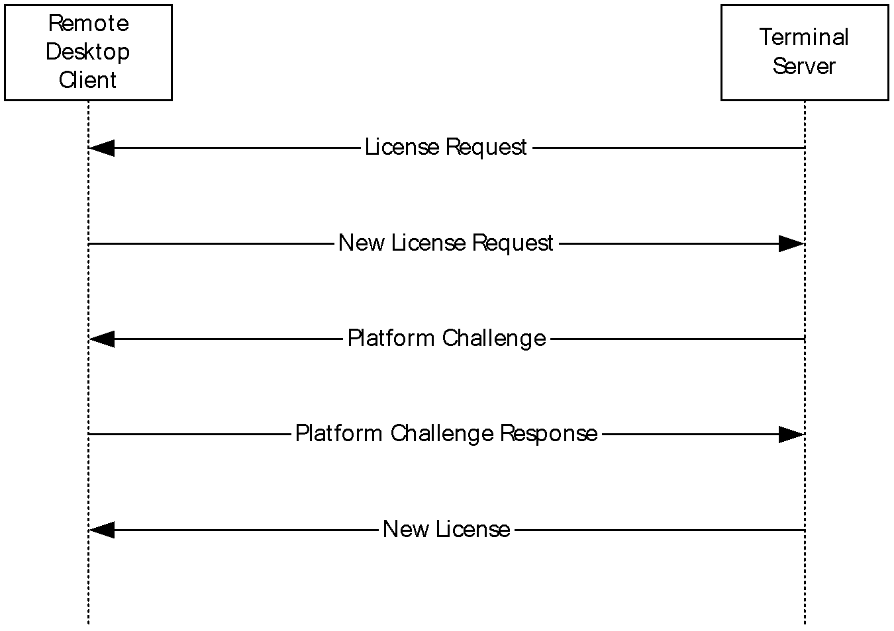
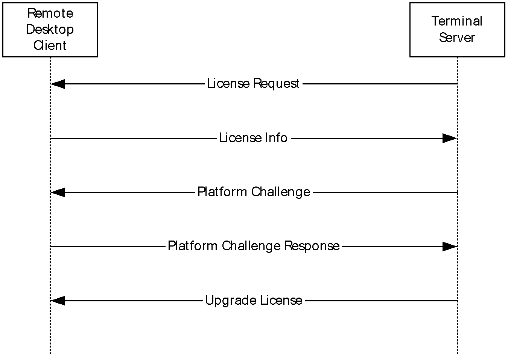
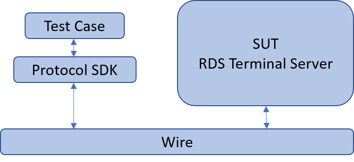
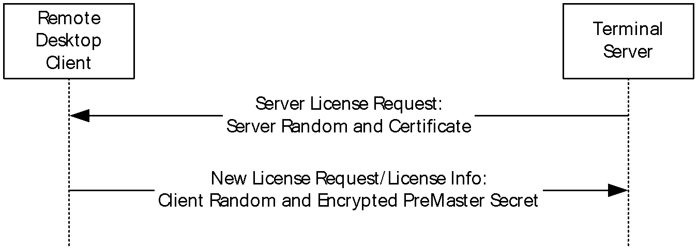


# MS-RDPELE Server Test Design Specification

## Contents

* [Technical Document Analysis](#Technical_Document_Analysis)
   * [Technical Document Overview](#Technical__Document_Overview)
   * [Relationship to Other Protocols](#Relationship_to_Other_Protocols)
   * [Protocol Operations/Messages](#Protocol_Operations_Messages)
* [Test Suite Design](#Test_Suite_Design)
   * [Test Suite Architecture](#Test_Suite_Architecture)
	* [Encryption Consideration](#Encryption_Consideration)
* [Test Cases Design](#Test_Cases_Design)
    * [S1_NewLicenseRequest](#S1_NewLicenseRequest)
    * [S2_LicenseInfo](#S2_LicenseInfo)
## <a name="Technical_Document_Analysis"/>Technical Document Analysis

### <a name="Technical__Document_Overview"/>Technical Document Overview
The Remote Desktop Protocol: Licensing Extension is designed to allow authorized remote desktop clients or users to connect to a terminal server (A reference to terminal server in this document generally implies a terminal server in app-server mode). It involves communication between a Remote Desktop client, a terminal server, and a license server. The terminal server can be configured to function in per-device or per-user license mode. Client access licenses (CALs) are installed on a license server, so that when a terminal server requests a license on a client's behalf, the license server issues a license out of its available pool of licenses.

### <a name="Relationship_to_Other_Protocols"/>Relationship to Other Protocols
The Remote Desktop Protocol: Licensing Extension extends the Remote Desktop Protocol: Basic Connectivity and Graphics Remoting (as specified in [MS-RDPBCGR]) by adding licensing capabilities.

The licensing protocol sequence is started by the server during the Remote Desktop Protocol (RDP) standard connection sequence after receiving the Client Info PDU (see [MS-RDPELE] sections 1.3.1.1 and 2.2.11). If exchange of licensing information is required, the server sends a Server License Request ([MS-RDPELE] section 2.2.2.1) to the client at this point. Otherwise, the RDP standard connection sequence continues (see [MS-RDPELE] section 1.3.1.1).

### <a name="Protocol_Operations_Messages"/>Protocol Operations/Messages

This protocol contains 8 kinds of license PDUs:
 * LICENSE_REQUEST
 * PLATFORM_CHALLENGE
 * NEW_LICENSE
 * UPGRADE_LICENSE
 * LICENSE_INFO
 * NEW_LICENSE_REQUEST
 * PLATFORM_CHALLENGE_RESPONSE
 * ERROR_ALERT

Also, there are 2 licensing PDU flows:

 _Figure 1 Remote Desktop client new license flow_

_Figure 2 Remote Desktop client upgrade license flow_

## <a name="Test_Suite_Design"/>Test Suite Design

### <a name="Test_Suite_Architecture"/>Test Suite Architecture

Figure 1 illustrates the architecture of the MS-RDPEMT test suite for server endpoint testing.

 _Figure 3 RDPELE Server Test Suite Architecture_

Note:
  * From the third party point of view, the SUT is a component that implements MS-RDPELE Server.
  * From the Windows implementation point of view, the SUT is the Remote Desktop Service (TermService).

### <a name="Encryption_Consideration"/>Encryption Consideration

The Remote Desktop Protocol: Licensing Extension uses its own security layer in addition to the RDP security layer (see [MS-RDPBCGR] section 5). 

There are two ways of encryption in RDPELE:

* The **PreMaster Secret** is encrypted by the server's public key (embedded in the Server Certificate in the Server License Request message).
  

* Certain fields of licensing messages (see sections 2.2.2.1 through 2.2.2.7) are protected by encryption based on the **license encryption key**.  

Both ways are implemented in the Protocol SDK.

## <a name="Test_Cases_Design"/>Test Cases Design

The test suite is a synthetic RDP client. In the following descriptions, all instances of the term "Test Suite" can be understood as the RDP client.

**Typical Sequence:**

The typical scenario sequence is the following:

* Test Suite initiates an RDP connection to server and complete the Connection Initiation phase, Basic Setting Exchange phase, Channel Connection phase, RDP Security Commencement phase, Secure Setting Exchange phase.
* Test Suite sends Client Info PDU to the server and starts the Licensing phase. 
* Test Suite expects the Server returns License Request PDU.
* Test Suite sends New License Request or License Info PDU to the server.
* Test Suite expects Platform Challenge PDU and returns Platform Challenge Response PDU to the server.
* Test Suite expects New License or Upgrade License PDU from the server.

The connection sequence is also described in section [Protocol Operations/Messages](#Protocol_Operations_Messages).

**Common prerequisites for all test cases:**

* The RDP service is started and listening the service port which serves as the RDP server.
* The test suite knows the IP address and port number on which RDP server is listening.

**Common cleanup requirements:**

* The test suite disconnects all RDP connections if any.
* The SUT deletes all data caches from previous RDP connections.

The common prerequisites and cleanup requirements are not listed in any of the test cases. Only prerequisites and cleanup requirements unique to the test case are listed in the corresponding test case descriptions.

The table below lists the two test secenarios.

|  **Scenario**|  **Priority**| **Description**|
| -------------| -------------| ------------- |
| S1_NewLicenseRequest| 0| This scenario is used to verify whether SUT can handle Client New License Request correctly.|
| S2_LicenseInfo |0|This scenario is used to verify whether SUT can handle License Info correctly.|

_Table 1 Test Suite Scenarios_

### <a name="S1_NewLicenseRequest"/>S1_NewLicenseRequest

The following table shows the number of test cases for each scenario.

|  **Scenario**|  **Test cases**|  **BVT**|  **P0**|  **P1**|
| -------------| -------------| -------------| -------------| ------------- |
| S1_NewLicenseRequest| 1| 1| 1| 0|

_Table 2 Scenario 1_

#### S1_ELE_NewLicenseRequest

| | |
| -------------| ------------- |
|  **Priority**| P0|
|  **Description** | This test case is used to verify SUT can handle Client New License Request correctly.|
|  **Test Execution Steps**| Test Suite initiates an RDP connection to server and complete the Connection Initiation phase, Basic Setting Exchange phase, Channel Connection phase, RDP Security Commencement phase, Secure Setting Exchange phase.|
| | Test Suite sends Client Info PDU to the server|
| | Test Suite expects the Server returns License Request PDU.|
| | Test Suite sends Client New License Request PDU to the server.|
| | Test Suite expects Platform Challenge PDU from the server.|
| | Test Suite sends Platform Challenge Response PDU to the server.|
| | Test Suite expects New License PDU from the server.|
|  **Requirements Covered**| N/A|
|  **Cleanup**| N/A|

### <a name="S2_LicenseInfo"/>S2_LicenseInfo

The following table shows the number of test cases for each scenario.

|  **Scenario**|  **Test cases**|  **BVT**|  **P0**|  **P1**|
| -------------| -------------| -------------| -------------| ------------- |
| S2_LicenseInfo| 1| 1| 1| 0|

_Table 3 Scenario 2_

#### S2_ELE_LicenseInfo

| | |
| -------------| ------------- |
|  **Priority**| P0|
|  **Description** | This test case is used to verify SUT can handle Client License Information message correctly.|
|  **Test Execution Steps**| Test Suite initiates an RDP connection to the server and complete the Connection Initiation phase, Basic Setting Exchange phase, Channel Connection phase, RDP Security Commencement phase, Secure Setting Exchange phase.|
| | Test Suite sends Client Info PDU to the server|
| | Test Suite expects the Server returns License Request PDU.|
| | Test Suite sends Client New License Request PDU to the server.|
| | Test Suite expects Platform Challenge PDU from the server.|
| | Test Suite sends Platform Challenge Response PDU to the server.|
| | Test Suite expects New License PDU from the server.|
| | Test Suite saves the license info from the PDU for future use.|
| | Test Suite initiates a second RDP connection to the server and complete the Connection Initiation phase, Basic Setting Exchange phase, Channel Connection phase, RDP Security Commencement phase, Secure Setting Exchange phase.|
| | Test Suite sends Client Info PDU to the server|
| | Test Suite expects the Server returns License Request PDU.|
| | Test Suite sends License Info PDU with the license info saved earlier to the server.|
| | Test Suite expects Platform Challenge PDU from the server.|
| | Test Suite sends Platform Challenge Response PDU to the server.|
| | Test Suite expects Upgrade License PDU from the server.|
|  **Requirements Covered**| N/A|
|  **Cleanup**| N/A|