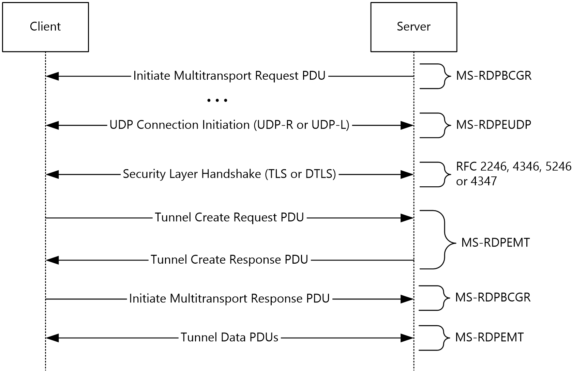


# MS-RDPEMT Server Test Design Specification

## Contents

* [Technical Document Analysis](#_Toc3964682143)
    * [Technical Document Overview](#_Toc3964682144)
    * [Relationship to Other Protocols](#_Toc3964682145)
    * [Protocol Operations/Messages](#_Toc3964682146)
    * [Protocol Properties](#_Toc3964682147)
* [Test Method](#_Toc3964682148)
    * [Assumptions, Scope and Constraints](#_Toc3964682149)
    * [Test Approach](#_Toc3964682150)
    * [Test Scenarios](#_Toc3964682151)
		* [S1_MultitransportConnectionInitiation](#_Toc3964682152)
* [Test Suite Design](#_Toc3964682160)
    * [Test Suite Architecture](#_Toc3964682161)
		* [System under Test (SUT)](#_Toc3964682162)
		* [Test Suite Architecture](#_Toc3964682163)
    * [Technical Dependencies/Considerations](#_Toc3964682164)
		* [Dependencies](#_Toc3964682165)
		* [Technical Difficulties](#_Toc3964682166)
		* [Encryption Consideration](#_Toc3964682167)
    * [Adapter Design](#_Toc3964682168)
		* [Adapter Overview](#_Toc3964682169)
		* [Technical Feasibility of Adapter Approach](#_Toc3964682170)
		* [Adapter Abstract Level](#_Toc3964682171)
* [Test Cases Design](#_Toc3964682172)
    * [Traditional Test Case Design](#_Toc3964682173)
    * [Test Cases Description](#_Toc3964682174)
		* [S1_MultitransportConnectionInitiation](#_Toc3964682175)
* [Appendix](#_Toc3964682176)
    * [Glossary](#_Toc3964682177)
    * [Reference](#_Toc3964682178)

## <a name="_Toc3964682143"/>Technical Document Analysis

### <a name="_Toc3964682144"/>Technical Document Overview
The Remote Desktop Protocol: Multitransport Extension enables multiple side-band channels (also referred to as "multitransport connections") between an RDP client and server over different underlying transport protocols such as reliable UDP, or lossy UDP ([MS-RDPEUDP] section 1.3.1). Each multitransport connection leverages the strengths of the underlying transport protocol to efficiently deliver different types of RDP content, thereby improving the user's experience, especially on WAN or wireless networks. 

### <a name="_Toc3964682145"/>Relationship to Other Protocols
The Remote Desktop Protocol: Multitransport Extension operates over the RDP-UDP protocol, as defined in [MS-RDPEUDP] section 1, 2, and 3. Protocol traffic is secured by using Transport Layer Security (TLS) ([RFC2246], [RFC4346] and [RFC5246]) for reliable RDP-UDP streams and Datagram Transport Layer Security (DTLS) ([RFC4347]) for unreliable (lossy) RDP-UDP streams. The TLS or DTLS handshake, as well as the encrypted payload, are embedded in the RDPUDP_SOURCE_PAYLOAD_HEADER as defined in [MS-RDPEUDP].
A multitransport connection is initiated by an RDP server sending the Initiate Multitransport Request PDU ([MS-RDPBCGR] section 2.2.1.15.1) to an RDP client over the main RDP connection.

### <a name="_Toc3964682146"/>Protocol Operations/Messages
There are 2 common data types shared by every multitransport PDU which are:

* Tunnel PDU Header (RDP_TUNNEL_HEADER)
* Tunnel PDU Subheader (RDP_TUNNEL_SUBHEADER)

Also, 3 types of multitransport PDUs are defined which are:

* Tunnel Create Request PDU (RDP_TUNNEL_CREATEREQUEST)
* Tunnel Create Response PDU (RDP_TUNNEL_CREATERESPONSE)
* Tunnel Data PDU (RDP_TUNNEL_DATA)

Bootstrapping, creating, securing and finalizing a multitransport connection uses messages from a number of protocols. The following sequence diagram presents an overview of these messages and protocols.

### <a name="_Toc3964682147"/>Protocol Properties

* This protocol operates over the RDP-UDP protocol, as defined in [MS-RDPEUDP], sections 1, 2 and 3.
* After the transport of RDP-UDP protocol has been successfully set up, the connection is secured by using Transport Layer Security (TLS) or Datagram Transport Layer Security (DTLS) to set up a secure channel.
* TLS ([RFC2246], [RFC4346] and [RFC5246]) is used to secure reliable UDP transport connections.
* DTLS ([RFC4347]) is used to secure lossy UDP transport connections.

## <a name="_Toc3964682148"/>Test Method

### <a name="_Toc3964682149"/>Assumptions, Scope and Constraints
**Assumptions:**

* The RDP server machine should be configurable; in order to test some specific features or requirements, the test suite will try to trigger the server to act with specific configuration settings, such as capability set support.

**Scope:**

* The protocol server endpoint (RDP server) playing the server role will be tested. For Windows, the Remote Desktop Service (TermService) is the server endpoint.
* The protocol client endpoint (RDP client) playing the client role is out of scope.
* Testing [MS-RDPEUDP] is out of scope.
* For Windows, the System Under Test (SUT) will be both Server SKUs and Client SKUs.
* External protocols are out of scope.

**Constraint:**
There is no constraint for this Test Suite.

### <a name="_Toc3964682150"/>Test Approach

Traditional testing is chosen as the test approach in MS-RDPBEMT.

Reasons for choosing Traditional Testing

* The protocol is not completely stateful.

* The logic of this protocol is simple.

* For [MS-RDPBCGR], only 14 out of 50 PDUs in the connection/disconnection sequences are sent sequentially.

* For this protocol, all PDUs in the connection/disconnection sequences are sent sequentially.

* The combinations of parameters are not complex. Capability sets are the exception, which will be addressed through the use of configuration files.

### <a name="_Toc3964682151"/>Test Scenarios

|  **Scenario**|  **Priority**|  **Test Approach**|  **Description**|
| -------------| -------------| -------------| ------------- |
| S1_MultitransportConnectionInitiation| 0| Traditional| This scenario is used to verify the multitransport connection initiation sequences.|

_Table 1 Test Suite Scenarios_

#### <a name="_Toc3964682152"/>S1_MultitransportConnectionInitiation
**Preconditions:**

The server indicates support of multitransport by sending the Initiate Multitransport Request PDUs.

**Typical Sequence:**

The typical scenario sequence is the following:

* Client initiates an RDP connection to server and complete the Connection Initiation phase, Basic Setting Exchange phase, Channel Connection phase, RDP Security Commencement phase, Secure Setting Exchange Phase and Licensing phase. Indicate support for both reliable and lossy multitransport in basic setting exchange phase.
* Client expects the Server Initiate Multitransport Request PDUs with requestedProtocol supported by server.
* Client starts the underlying multitransport connect with server.
* Client sends the Tunnel Create Request PDU to server.
* Client expects the Tunnel Create Response from server.

The connection sequence is also described in section [Protocol_Operations/Messages](#_Toc3964682146).

**Scenario Testing:**

This scenario tests the following types:

* Tunnel PDU Header (RDP_TUNNEL_HEADER)
* Tunnel PDU Subheader (RDP_TUNNEL_SUBHEADER)
* Tunnel Create Response PDU (RDP_TUNNEL_CREATERESPONSE)
* Tunnel Data PDU (RDP_TUNNEL_DATA)

## <a name="_Toc3964682160"/>Test Suite Design

### <a name="_Toc3964682161"/>Test Suite Architecture

#### <a name="_Toc3964682162"/>System under Test (SUT)
* From the third party point of view, the SUT is a component that implements MS-RDPEMT Server.
* From the Windows implementation point of view, the SUT is the Remote Desktop Service (TermService).

#### <a name="_Toc3964682163"/>Test Suite Architecture
Figure 1 illustrates the architecture of the MS-RDPEMT test suite for server endpoint testing.

 _Figure 1 RDP Server Test Suite Architecture_

### <a name="_Toc3964682164"/>Technical Dependencies/Considerations

#### <a name="_Toc3964682165"/>Dependencies
There are no dependencies.

#### <a name="_Toc3964682166"/>Technical Difficulties
There are no technical difficulties.

#### <a name="_Toc3964682167"/>Encryption Consideration

* When using the RDP standard security mechanism, MS-RDPBCGR messages are encrypted; however, you can turn off server-side encryption by setting the encryption level to low.

* When using external security protocols, such as TLS and CredSSP, the MS-RDPBCGR transport is encrypted; this encryption cannot be turned off.

* The MS-RDPEMT messages are encrypted by selected underlying transport protocol TLS or DTLS.

### <a name="_Toc3964682168"/>Adapter Design

#### <a name="_Toc3964682169"/>Adapter Overview
The MS-RDPEMT Server Test Suite implements a protocol adapter. The protocol adapter is used to receive messages from the SUT and to send messages to the SUT. The protocol adapter is built upon the protocol test suite library, which is implemented with managed code.

#### <a name="_Toc3964682170"/>Technical Feasibility of Adapter Approach
The protocol adapter uses the protocol SDK library to generate protocol messages, which are sent to SUT. Protocol adapter compiler (PAC) is used in the MS-RDPEMT protocol test suite library. The protocol adapter uses the protocol test suite library to consume protocol messages which are received from the SUT. The MS-RDPEMT SDK library will parse and decode the received messages and send them to protocol adapter.

#### <a name="_Toc3964682171"/>Adapter Abstract Level

**Protocol Adapter**

Protocol adapter defined tens of interfaces. These interfaces can be summarized as following:

* Send Message interfaces
	* Send interface for each client-to-server message.
* Receive Message events
	* Receive event for each server-to-client message.
* Other interfaces
	* **StartMultitransportConnect**: Establish the underlying multitransport connection with SUT
	* **Disconnect**: Disconnect all underlying multitransport connection with SUT.

## <a name="_Toc3964682172"/>Test Cases Design

### <a name="_Toc3964682173"/>Traditional Test Case Design
The Traditional test approach is used to design all test cases.
The following table shows the number of test cases for each scenario.

|  **Scenario**|  **Test cases**|  **BVT**|  **P0**|  **P1**|
| -------------| -------------| -------------| -------------| ------------- |
| S1_MultitransportConnectionInitiation| 4| 1| 1| 3|

### <a name="_Toc3964682174"/>Test Cases Description
The test suite is a synthetic RDP client. In the following descriptions, all instances of the term “Test Suite” can be understood as the RDP client.

**Common prerequisites for all test cases:**

* The RDP service is started and listening the service port which serves as the RDP server.

* The test suite knows the IP address and port number on which RDP server is listening.

* The RDP server supports the multitransport extension and its underlying transport protocol.

**Common cleanup requirements:**

* The test suite disconnects all RDP connections if any.

* The SUT deletes all data caches from previous RDP connections.

The common prerequisites and cleanup requirements are not listed in any of the test cases. Only prerequisites and cleanup requirements unique to the test case are listed in the corresponding test case descriptions.

#### <a name="_Toc3964682175"/>S1_MultitransportConnectionInitiation

##### S1_MultitransportConnectionInitiation_PositiveTest

| **S1_Connection**| |
| -------------| ------------- |
|  **Test ID**| S1_MultitransportConnectionInitiation_PositiveTest|
|  **Priority**| P0|
|  **Description** | This test case is used to ensure multistranport connection can initiated successfully with SUT.|
|  **Prerequisites**| SUT support multitransport extension.|
|  **Test Execution Steps**| Initiate an RDP connection to RDP server (SUT) and complete the Connection Initiation phase, Basic Setting Exchange phase, Channel Connection phase, RDP Security Commencement phase, Secure Setting Exchange Phase and Licensing phase. Indicate support for both reliable and lossy multitransport in basic setting exchange phase.|
| | Test Suite expects the Server Initiate Multitransport Request PDUs with requestedProtocol supported by SUT. When received, Test Suite verifies this PDUs.|
| | Start the underlying multitransport connect with SUT.|
| | Send the Tunnel Create Request PDU to SUT.|
| | Expect the Tunnel Create Response from SUT and verify.|
|  **Requirements Covered**| N/A|
|  **Cleanup**| N/A|

##### S1_MultitransportConnectionInitiation_NegativeTest_InvalidRequestID

| **S1_Connection**| |
| -------------| ------------- |
|  **Test ID**| S1_MultitransportConnectionInitiation_NegativeTest_InvalidRequestID|
|  **Priority**| P1|
|  **Description** | This test case is used to ensure SUT will fail as expect if RequestID is invalid during multitransport connection initiation.|
|  **Prerequisites**| SUT support multitransport extension.|
|  **Test Execution Steps**| Initiate an RDP connection to RDP server (SUT) and complete the Connection Initiation phase, Basic Setting Exchange phase, Channel Connection phase, RDP Security Commencement phase, Secure Setting Exchange Phase and Licensing phase. Indicate support for both reliable and lossy multitransport in basic setting exchange phase.|
| | Test Suite expects the Server Initiate Multitransport Request PDUs with requestedProtocol supported by SUT. When received, Test Suite verifies this PDUs.|
| | Start the underlying multitransport connect with SUT.|
| | Send the Tunnel Create Request PDU to SUT with invalid RequestID.|
| | Expect SUT will either close the connection or respond Tunnel Create Response with HRESULT code indicating failure.|
|  **Requirements Covered**| N/A|
|  **Cleanup**| N/A|

##### S1_MultitransportConnectionInitiation_NegativeTest_InvalidSecurityCookie

| **S1_Connection**| |
| -------------| ------------- |
|  **Test ID**| S1_MultitransportConnectionInitiation_NegativeTest_InvalidSecurityCookie|
|  **Priority**| P1|
|  **Description** | This test case is used to ensure SUT will fail as expect if SecurityCookie is invalid during multitransport connection initiation.|
|  **Prerequisites**| SUT support multitransport extension.|
|  **Test Execution Steps**| Initiate an RDP connection to RDP server (SUT) and complete the Connection Initiation phase, Basic Setting Exchange phase, Channel Connection phase, RDP Security Commencement phase, Secure Setting Exchange Phase and Licensing phase. Indicate support for both reliable and lossy multitransport in basic setting exchange phase.|
| | Test Suite expects the Server Initiate Multitransport Request PDUs with requestedProtocol supported by SUT. When received, Test Suite verifies this PDUs.|
| | Start the underlying multitransport connect with SUT.|
| | Send the Tunnel Create Request PDU to SUT with invalid SecurityCookie.|
| | Expect SUT will either close the connection or respond Tunnel Create Response with HRESULT code indicating failure.|
|  **Requirements Covered**| N/A|
|  **Cleanup**| N/A|

##### S1_MultitransportConnectionInitiation_NegativeTest_InvalidRequestIDAndSecurityCookie

| **S1_Connection**| |
| -------------| ------------- |
|  **Test ID**| S1_MultitransportConnectionInitiation_NegativeTest_InvalidRequestIDAndSecurityCookie|
|  **Priority**| P1|
|  **Description** | This test case is used to ensure SUT will fail as expect if neither RequestID nor SecurityCookie is valid during multitransport connection initiation.|
|  **Prerequisites**| SUT support multitransport extension.|
|  **Test Execution Steps**| Initiate an RDP connection to RDP server (SUT) and complete the Connection Initiation phase, Basic Setting Exchange phase, Channel Connection phase, RDP Security Commencement phase, Secure Setting Exchange Phase and Licensing phase. Indicate support for both reliable and lossy multitransport in basic setting exchange phase.|
| | Test Suite expects the Server Initiate Multitransport Request PDUs with requestedProtocol supported by SUT. When received, Test Suite verifies this PDUs.|
| | Start the underlying multitransport connect with SUT.|
| | Send the Tunnel Create Request PDU to SUT with invalid RequestID and SecurityCookie.|
| | Expect SUT will either close the connection or respond Tunnel Create Response with HRESULT code indicating failure.|
|  **Requirements Covered**| N/A|
|  **Cleanup**| N/A|

## <a name="_Toc3964682176"/>Appendix

### <a name="_Toc3964682177"/>Glossary
**SUT**: System under Test. In this spec, it’ indicates the MS-RDPEMT server implementation.
**Test Suite**: The synthetic RDP client which is used to test against SUT.

### <a name="_Toc3964682178"/>Reference

* Technical Document: [MS-RDPEMT].pdf
