# RDP Server Test Suite User Guide

## Contents

* [Introduction](#_Toc396908219)
* [Quick Start Checklist](#_Toc396908222)
* [How Do I?](#_Toc396908223)
* [Requirements](#_Toc396908224)
* [Environment](#_Toc396908225)
    * [Driver Computer](#_Toc396908226)
    * [System Under Test (SUT)](#_Toc396908227)
    * [Domain Controller (DC)](#_Toc396908228)
    * [Software](#_Toc396908229)
* [Network Setup](#_Toc396908230)
    * [Network Infrastructure](#_Toc396908231)
    * [Domain Environment](#_Toc396908232)
    * [Workgroup Environment](#_Toc396908233)
    * [Verify Connectivity from the Driver Computer](#_Toc396908234)
* [Computer Setup](#_Toc396908235)
    * [Set Up a Windows-Based Domain Controller (DC)](#_Toc396908238)
    * [Set Up a Windows-Based SUT](#_Toc396908237)    
    * [Set Up the Driver Computer](#_Toc396908236)
    * [Set up Computers that are Not Based on Windows](#_Toc396908242)    
* [Installed Files and Folders](#_Toc396908239)
* [Configure and Run Test Cases](#_Toc396908244)
    * [Configure the Test Suite](#_Toc396908243)
    * [Run All Test Cases](#_Toc396908245)
    * [Check Test Results](#_Toc396908246)
* [Debug Test Cases](#_Toc396908247)
* [Troubleshooting](#_Toc396908248)
    * [Ping Failure](#_Toc396908249)

## <a name="_Toc396908219"/>Introduction

This guide provides information about how to install, configure, and run the RDP Server Endpoint Test Suite and its environment.

This suite of tools is designed to test implementations of the following protocols:

* _[MS-RDPBCGR]: Remote Desktop Protocol: Basic Connectivity and Graphics Remoting Specification_

* _[MS-RDPEDYC]: Remote Desktop Protocol: Dynamic Channel Virtual Channel Extension_

* _[MS-RDPEMT]: Remote Desktop Protocol: Multitransport Extension_

* _[MS-RDPELE]: Remote Desktop Protocol: Licensing Extension_

This suite of tools tests only the protocol implementation behaviors that are observed on the wire. For detailed information about the design of this test suite, see [MS-RDPBCGR_ServerTestDesignSpecification](MS-RDPBCGR_ServerTestDesignSpecification.md), [MS-RDPEDYCServerTestDesignSpecification](MS-RDPEDYC_ServerTestDesignSpecification.md), [MS-RDPEMT_ServerTestDesignSpecification](MS-RDPEMT_ServerTestDesignSpecification.md), [MS-RDPELE_ServerTestDesignSpecification](MS-RDPELE_ServerTestDesignSpecification.md). 

## <a name="_Toc396908222"/>Quick Start Checklist

The following checklist summarizes the steps required to get the test suite up and running. The checklist also provides references to documentation that can help you get started. 

Note 

>For workgroup environments, skip tasks that are related to the setup and configuration of DC.

|  **Check**|  **Task**|  **Topic**| 
| -------------| -------------| ------------- |
| □| Download the test suite for the protocol implementation.| For a list of the files that the download package contains, see [Installed Files and Folders](#_Toc396908239).| 
| □| Confirm that your test environment and computers meet the requirements of the test suite.| For information about the requirements of the test suite, see [Requirements](#_Toc396908224). | 
| □| Install the software prerequisites.| For information about software that must be installed on the computers in your test environment before the test suite is installed, see [Software](#_Toc396908229).| 
| □| Set up the network.| See [Network Setup](#_Toc396908230).| 
| □| Set up the Domain Controller (DC). (optional)| See [Set Up the DC](#_Toc396908238). | 
| □| Set up the system under test (SUT).| See [Set Up the SUT](#_Toc396908237).| 
| □| Set up the driver computer.| See [Set Up the Driver Computer](#_Toc396908236).| 
| □| Verify the connection from the driver computer to the SUT and other computers.| See [Verify Connectivity from the Driver Computer](#_Toc396908234).| 
| □| Configure the test suite settings.| See [Configure the Test Suite](#_Toc396908243).| 
| □| Run test cases to verify that the test suite is properly installed and configured| See [Running Test Cases](#_Toc396908244).| 

## <a name="_Toc396908223"/>How Do I?
Use the following quick reference to learn how to complete common tasks.

|  **How do I…?**|  **For more information…**| 
| -------------| ------------- |
| Set up the test environment| [Network Setup](#_Toc396908230) and [Computer Setup](#_Toc396908235)| 
| Verify the connection from the driver computer to other computers in the test environment| [Verify Connectivity from the Driver Computer](#_Toc396908234)| 
| Configure the test suite settings| [Configure the Test Suite](#_Toc396908243)| 
| Run test cases| [Run All Test Cases](#_Toc396908245)| 
| Debug my own test cases| [Debugging Test Cases](#_Toc396908247)| 
| Get the results of test runs| [Check Test Results](#_Toc396908246)| 
| Troubleshoot problems| [Troubleshooting](#_Toc396908248)| 

## <a name="_Toc396908224"/>Requirements 

This section describes the requirements for the test environment that are used to run this test suite.

Note 

>The requirements in this section apply only to the Windows-based computers in the test environment. 

Note 

>The driver computer must be a Windows-based operating system.

Note 

>Workgroup environment does not require a domain controller.

## <a name="_Toc396908225"/>Environment

Run this test suite in a Domain environment that contains the following computers, physical or virtual: 

* A driver computer running any version of Windows which is compatible with Visual Studio 2017.

* A computer configured as the SUT (System Under Test). It can be any version of Windows or a SUT implementation that is not based on the Windows operating system.

* A computer configured as a Domain Controller (DC). If this computer is running Windows, it must be running Windows Server 2012 R2, Windows Server 2016 or later. The DC can be on the SUT.

Run this test suite in a Workgroup environment that contains the following computers, physical or virtual: 

* A driver computer running any version of Windows which is compatible with Visual Studio 2017.

* A computer configured as the SUT (System Under Test). It  can be any version of Windows or a SUT implementation that is not based on the Windows operating system.

### <a name="_Toc396908226"/>Driver Computer 

The minimum requirements for the driver computer are as follows. 

|  **Requirement**|  **Description**| 
| -------------| ------------- |
| Operating system| Any version of Windows which is compatible with Visual Studio 2017.| 
| Memory| 2 GB RAM| 
| Disk space| 60 GB | 

### <a name="_Toc396908227"/>System Under Test (SUT)

The minimum requirements for the SUT are as follows.

|  **Requirement**|  **Description**| 
| -------------| ------------- |
| Operating system| Any version of Windows or a SUT implementation that is not based on the Windows operating system | 
| Memory| 1 GB RAM| 
| Disk space| 60 GB| 

### <a name="_Toc396908228"/>Domain Controller (DC)

The minimum requirements for the DC are as follows.

Note 

>DC is optional. Workgroup environment does not require a domain controller.

|  **Requirement**|  **Description**| 
| -------------| ------------- |
| Operating system| Windows 2012 R2, Windows 2016 or later or a directory domain service implementation that is not based on the Windows operating system| 
| Services| Directory domain service (such as the Windows Active Directory Domain Services (AD DS))| 
| Memory| 1 GB RAM| 
| Disk space| 60 GB| 

### <a name="_Toc396908229"/>Software 
All of the following software must be installed on the driver computer _before_ the installation of this test suite. 

**Required Software**

All common softwares listed in [prerequisites](https://github.com/microsoft/WindowsProtocolTestSuites#prerequisites) for running Windows Protocol Test Suites.

**Optional Software**

* **Protocol Test Manager**

    **Protocol Test Manager** provides a graphical user interface (UI) to facilitate configuration and execution of Microsoft® Windows Protocol Test Suite tests. Its use is highly recommended.

* **Microsoft® Message Analyzer**

    **Microsoft® Message Analyzer** (MMA) is listed here as an optional tool because the test cases of themselves neither perform live captures or capture verifications during execution. However, MMA can be helpful with debugging test case results, by analyzing ETL files that are generated by the Test Cases, that is, if you enable the the Automatic Network Capturing feature in the Protocol Test Manager (PTM) during test case configuration. The Automatic Network Capturing feature is further described in the [PTF User Guide](https://github.com/Microsoft/ProtocolTestFramework/blob/staging/docs/PTFUserGuide.md#-automatic-network-capturing).

    Note

    November 25 2019 - Microsoft Message Analyzer (MMA) has been retired and removed from public-facing sites on microsoft.com. A private MMA build is available for testing purposes; to request it, send an email to [getmma@microsoft.com](mailto:getmma@microsoft.com).

## <a name="_Toc396908230"/>Network Setup

You can run this test suite in a workgroup or domain environment using either physical or virtual machines. This section describes the test environment using physical computers. For information about configuring a virtual machine, see [https://docs.microsoft.com/en-us/virtualization/hyper-v-on-windows/quick-start/create-virtual-machine](https://docs.microsoft.com/en-us/virtualization/hyper-v-on-windows/quick-start/create-virtual-machine). 

### <a name="_Toc396908231"/>Network Infrastructure

* A test network is required to connect the test computer systems

* It must consist of an isolated hub or switch

* It must not be connected to a production network or used for any other business or personal communications or operations

* It must not be connected to the internet 

* IP addresses must be assigned for a test network

* Computer names should be assigned in a test network infrastructure

* User credentials used on the system must be dedicated to the test network infrastructure

* Details including computer IP addresses, names and credentials are saved in log files

### <a name="_Toc396908232"/>Domain Environment

The domain environment requires interactions between the following computers and server roles. Note that the domain controller, required for a domain environment, can be installed on the SUT. 

* The driver computer, which runs the test cases by sending requests over the wire in the form of protocol messages. 

* The SUT, which runs a server implementation of the protocol that is being tested. The SUT responds to the requests sent by the driver computer. 

    * Note: if you want to test [MS-RDPELE] protocol, then SUT must be connected to internet besides the test network.

* The DC provides functionality that is required to test the protocol implementation. Specifically, the DC hosts Active Directory Domain Services (AD DS).

The following figure shows the domain environment. 

### <a name="_Toc396908233"/>Workgroup Environment

The workgroup environment requires interactions between the following computers:

* The driver computer, which runs the test cases by sending requests over the wire in the form of protocol messages. 

* The SUT, which runs a server implementation of the protocol that is being tested. The SUT responds to the requests that the driver computer sends.

    * Note: if you want to test [MS-RDPELE] protocol, then SUT must be connected to internet besides the test network.

The following figure shows the workgroup environment:

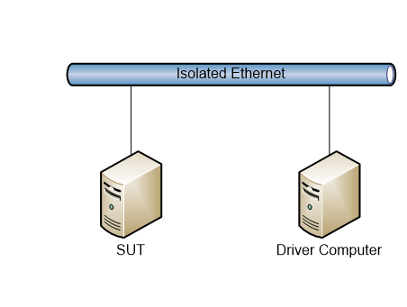

### <a name="_Toc396908234"/>Verify Connectivity from the Driver Computer

After you prepare the environment, verify the connection from the driver computer to the SUT, and between all other computers in the test environment. The following provides a general list of steps that you can use to check for connectivity between two Windows-based computers. For further information, see the administration guide for your operating system.

Note 

>Disable active firewalls in the test environment.

To check the connection from the driver computer

* Click the **Start** button, and then click **Run**. 

* In the **Run** dialog box, type **cmd** and then click **OK**.

* At the command prompt, type **ping** followed by the hostname or IP address of the SUT, and then press **Enter**. The following example checks the connection to a SUT named "SUT01":
 
    &#62;  ping SUT01

* Repeat these steps until you confirm connectivity between all computers in the test environment.

Do not proceed with the configuration of the test suite until connectivity is confirmed. Any issues with network connectivity must be resolved before you configure the test suite.

## <a name="_Toc396908235"/>Computer Setup 

This section explains how to set up the computers for the test environment.

Note 

>For workgroup environments, skip tasks that are related to the setup and configuration of DC.

### <a name="_Toc396908238"/>Set Up a Windows-Based Domain Controller (DC)
This section provides information about how to set up a DC for use with this test suite.

Note 

DC is optional. Skip this step if the test environment is workgroup.

To set up a Windows-based DC

* Install Active Directory Domain Services.

To set up a DC that is not based on the Windows operating system, see [Configuring Computers that are Not Based on Windows](#_Toc396908242)**.**

### <a name="_Toc396908237"/>Set Up a Windows-Based SUT
This section provides information about how to set up a SUT for use with this test suite.

1. Log into the SUT as administrator.

    
    Note

    You must use the Administrator account on the SUT. If the Administrator account is disabled, you can enable it as follows: 

    * In **Control Panel**, open **Administrative Tools** and then open **Computer Management**.

    * In the left panel, open **Local Users and** **Groups** under **System Tools,** and then select **Users**.

    * In the right panel, double click **Administrator** and then uncheck the **Account is disabled** box.

1. Join the SUT to the domain provided by the DC if you are using domain environment.

1. Install **Remote Desktop Services**
    * In **Server Manager**, click **Manage**, then select **Add Roles and Features**, click **Next** repeatly until it comes to **Server Roles** tab. Select **Remote Desktop Services** and click **Next**.

    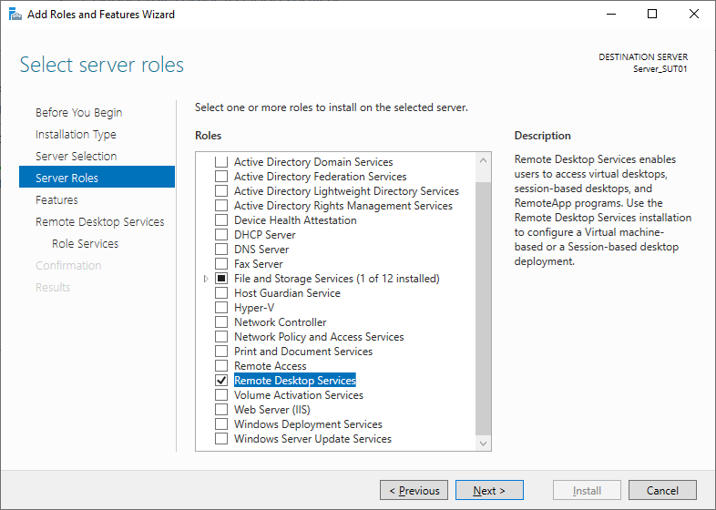

    * Click **Next** repeatly until it comes to **Role Services** tab. Select **Remote Desktop Licensing**. In the prompt wizard, click **Add Features**

    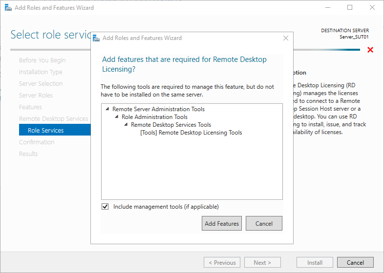

    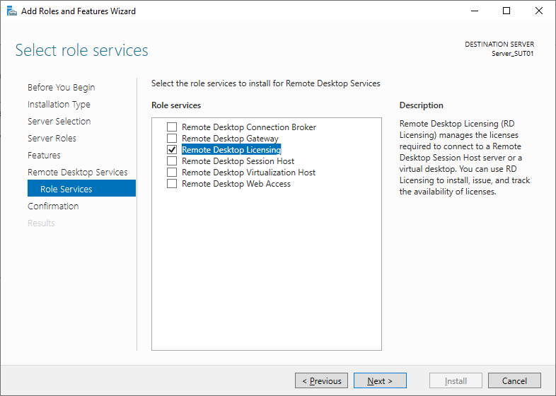

    Then select **Remote Desktop Session Host**. In the prompt wizard, click **Add Features**

    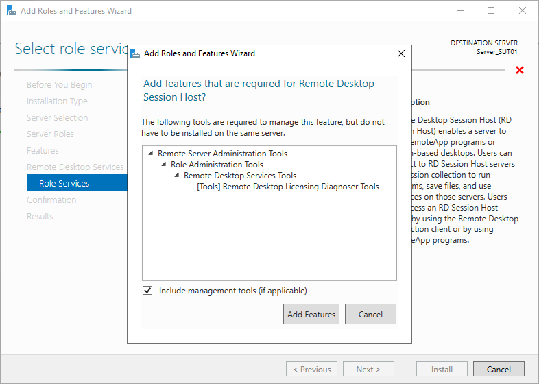

    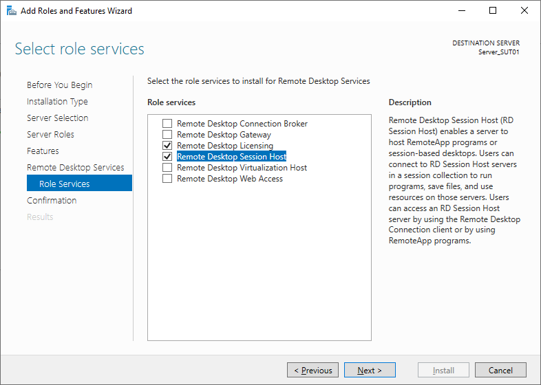
    
    * Click **Next**, in **Confirmation** tab, click **Install**

    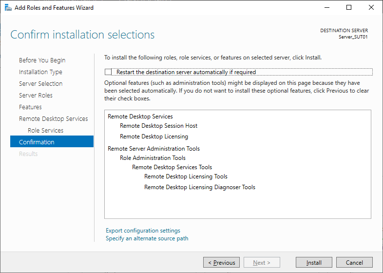

    * Restart the computer after installation is finished.

1. Activate RDP License server and install license
    * Open **Windows Administrative Tools**

    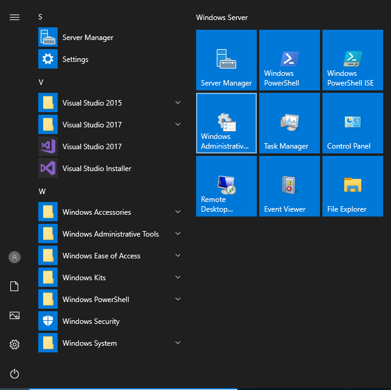   

    * Enter **Remote Desktop Services** folder

    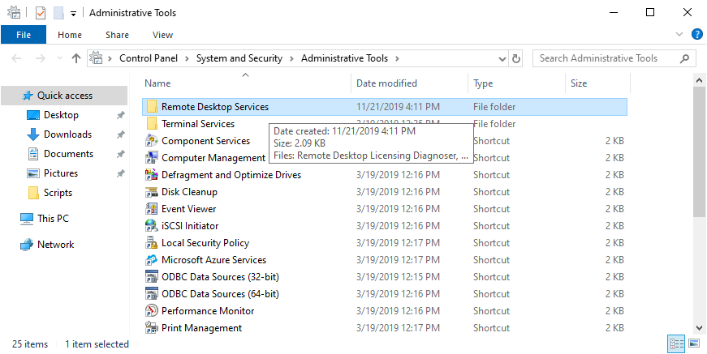   

    * Open **Remote Desktop Licensing Manager**

    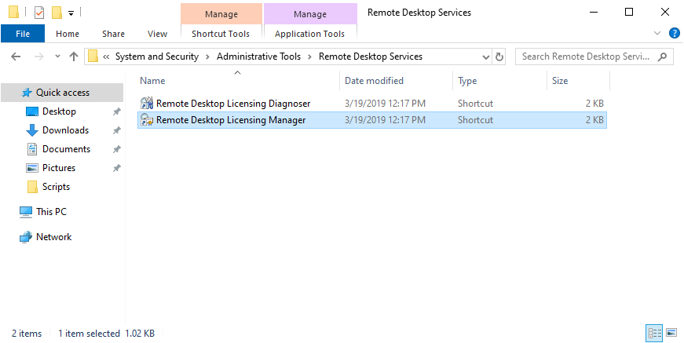       

    * In the left panel, right-click the computer name of the SUT, and click **Activate Server**.
    
    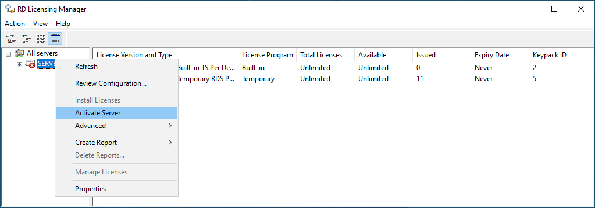 

    * Click **Next**, and in next step, keep the default method **Automatic connection(recommended)**
    
    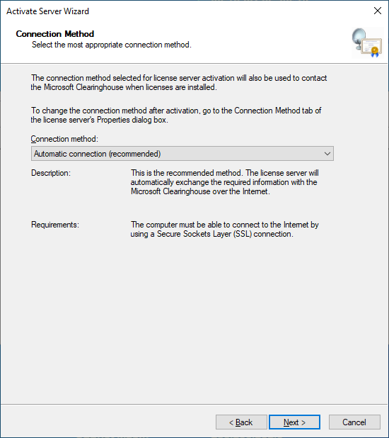 

    * Input your **First name**, **Last name**, **Company**, and select one country from the drop down list

    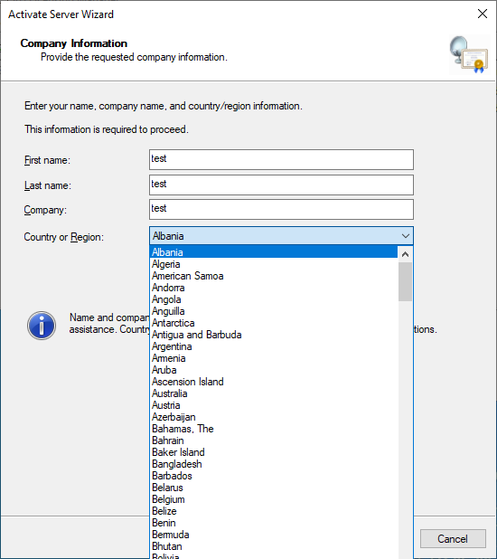 

    * Click **Next**

    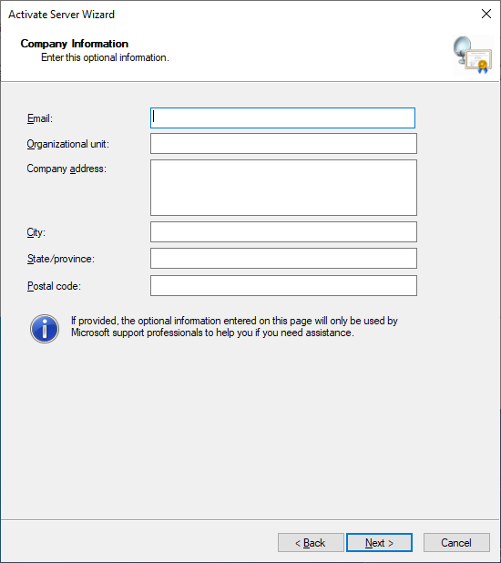 

    * Click **Next** again

    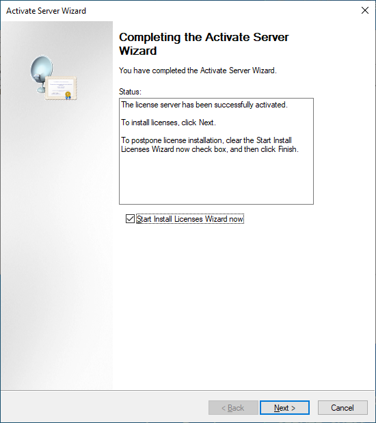 

    * Then start to **Install Licenses**, click **Next**, then select **Enterprise Agreement**, and click **Next**

    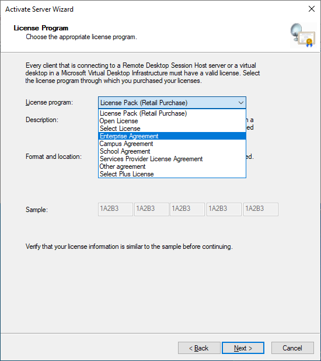 

    * Type **1234567** as the agreement number and click **Next**

    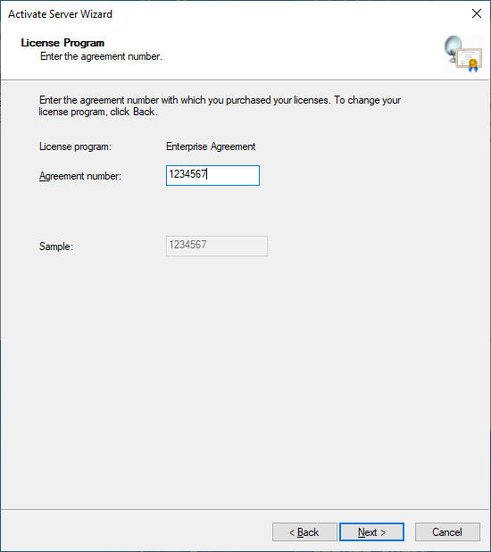 

    * Select the appropriate **Product version** according to the OS version of the SUT, choose **RDS Per Device CAL** as **License type**, and input **250** as Quantity. And then click **Next** to install the license.

     

1. Configure the Remote Desktop Session Host

    * Start **Command Prompt**, type **gpedit.msc** and press **Enter**.
    
    * On the **Local Group Policy Editor**, navigate to **Local Computer Policy\Computer Configuration\Administrative Templates\Windows Components\Remote Desktop Services\Remote Desktop Session Host\Licensing**.    

    * Double click **Use the specified Remote Desktop license servers**, click **Enabled**, input the computer name of the SUT as the license server name, and click **OK**.
    
    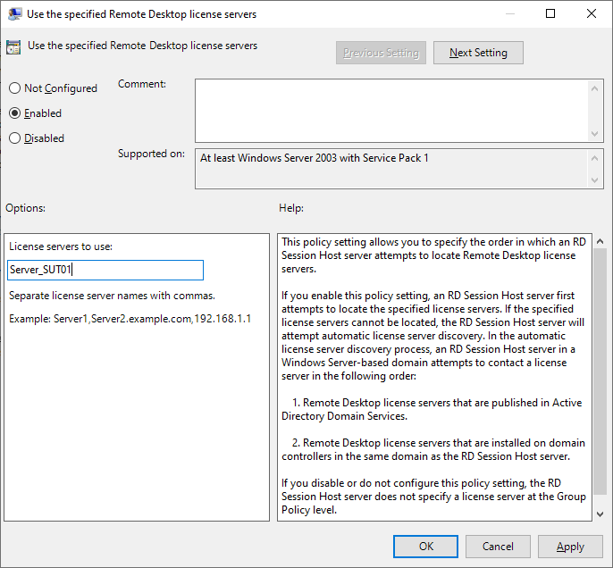 

    * Double click **Set the Remote Desktop licensing mode**, click **Enabled**, choose **Per Device** as the licensing mode, and click **OK**.

    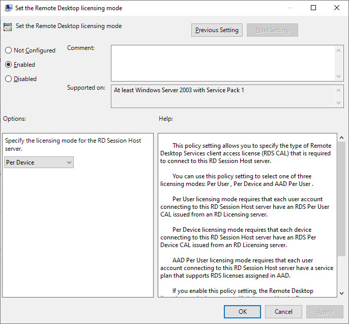 

1. Start Remote Desktop Services

    * In **Control Panel**, open **System**.

    * Click **Remote Settings** on the left. Then you can see **Remote** tab on **System Properties** dialog.

    * Select **Allow remote connections to this computer**, and uncheck the check box before **Allow connections only from computers running Remote Desktop with Network Level Authentication (recommend)**.

    * Press **OK** to close **System Properties**.

    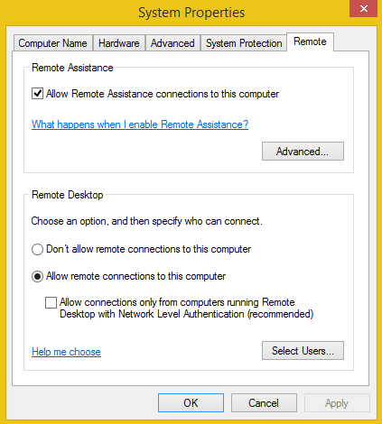

1. Configure Network detection on RDP Server.

    * Start **Command Prompt**, type **gpedit.msc** and press **Enter**.

    * On the **Local Group Policy Editor**, navigate to **Local Computer Policy\Computer Configuration\Administrative Templates\Windows Components\Remote Desktop Services\Remote Desktop Session Host\Connections**.

    * Double click **Select network detection on the server**, on the poped up dialog, click **Enabled** and select **Use both Connect Time Detect and Continuous Network Detect**.

    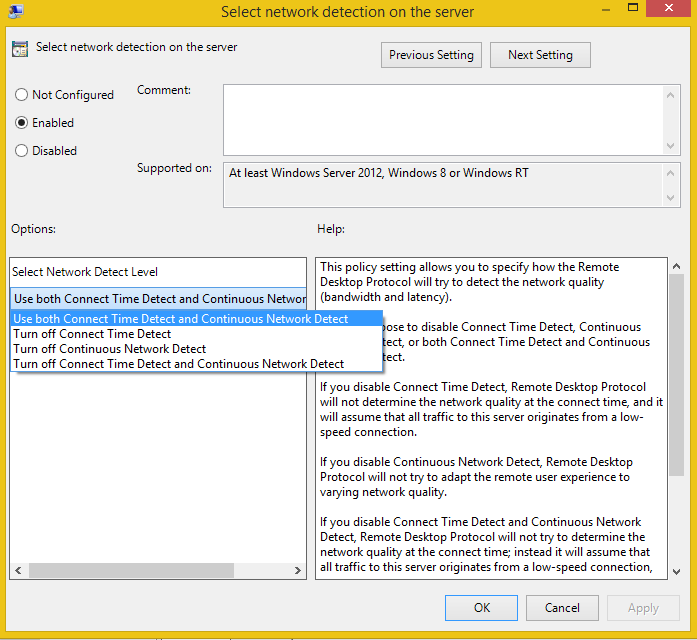

To set up a SUT that is not based on the Windows operating system, see [Configuring Computers that are Not Based on Windows](#_Toc396908242)**.**

### <a name="_Toc396908236"/>Set Up the Driver Computer

This section describes how to set up the driver computer.

Important 

>Microsoft Visual Studio 2017 and Protocol Test Framework must be installed on the driver computer before you run the test suite installer.

To set up the driver computer

1. Join the Driver computer to the domain provided by the DC if you are using domain environment.

1. Install the required and optional software described earlier.

1. Build the test suite from source code or download **RDP-TestSuite-ServerEP.msi** from [GitHub](https://github.com/microsoft/WindowsProtocolTestSuites/releases)

1. Run **RDP-TestSuite-ServerEP.msi** on the driver computer.

### <a name="_Toc396908242"/>Set Up Computers that are Not Based on Windows

This guide provides only basic information about configuring the test environment for computers that are not running Windows-based operating systems. 

* For domain environments, join all computers to the domain of the domain controller.

* Disable active firewalls on all computers.

For detailed instructions about how to complete the tasks that this process requires, see the administration guide for your operating system. 

To configure the SUT

* Install and enable the server implementations of the protocols to be tested.

To configure the DC 

* Install directory domain services.

### <a name="_Toc396908239"/>Installed Files and Folders

The installation process adds the following folders and files to the driver computer at C:\MicrosoftProtocolTests\RDP\Server-Endpoint\\&#60;version&#35;&#62;\\.

Note 

>The _&#60;version&#35;&#62;_ placeholder indicates the installed build of the test suite.

|  **File or Folder**|  **Description**| 
| -------------| ------------- |
| Batch| Command files that you can use to run individual test cases or all test cases| 
| Bin| Test suite binaries and configuration files| 
| Scripts| The scripts used to configure computers and the test suite| 

## <a name="_Toc396908244"/>Configure and Run Test Cases

### <a name="_Toc396908243"/>Configure the Test Suite

This test suite is installed with default configuration settings. You may need to change these settings if you use a customized test environment or if you customize your test runs. 

You can define various options for the test suite, such as the following:

* Define the settings of the test environment, including computer names and IP addresses.

* Define the basic options used in the test suite, for example, the protocol version or the version of the target operating system.

* Define the folders and formats used for output from test runs.

* Define scripts to run before and after each test run.

* Set time limits on discrete test tasks and for test runs.

To change configuration settings, edit the **RDP_ServerTestSuite.deployment.ptfconfig** file. You can find this file in the directory C:\MicrosoftProtocolTests\RDP\Server-Endpoint\\_&#60;version&#35;&#62;_\Bin.

### <a name="_Toc396908245"/>Run All Test Cases

This test suite includes command files that you can use to complete some basic test cases. Each test case verifies the protocol implementation based on a given scenario. 

You can find and run all test cases in the following directories: 
 C:\MicrosoftProtocolTests\RDP\Server-Endpoint\\_&#60;version&#35;&#62;_\Batch

You can run test cases via the graphical user interface or the command files:

* Via GUI (Protocol Test Manager)

    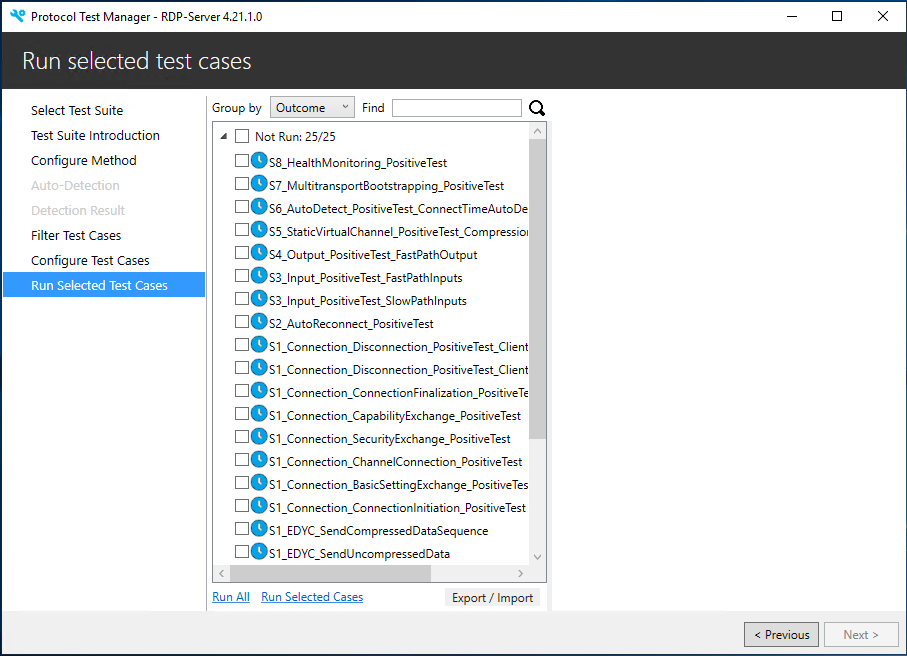

* Via command files

    From the desktop of the driver computer, double-click the **Run All Test Cases** shortcut.
    Alternatively, go to C:\MicrosoftProtocolTests\RDP\Server-Endpoint\\_&#60;version&#35;&#62;_\Batch, and double-click the **RunAllTestCases.cmd** file. 

### <a name="_Toc396908246"/>Check Test Results
Test suite generates test result files in different paths based on the way how test case is executed.

* For running test cases with PTM: _C:\MicrosoftProtocolTests\RDP\Server-Endpoint\\&#60;version&#35;&#62;\HtmlTestResults_

* For running test cases with batch: _C:\MicrosoftProtocolTests\RDP\Server-Endpoint\\&#60;version&#35;&#62;\Batch\TestResults_

* For running test cases with Visual Studio: _C:\MicrosoftProtocolTests\RDP\Server-Endpoint\\&#60;version&#35;&#62;\Source\Server\TestCode\TestResults_

For further information about test log settings, see the PTF User Guide in the PTF installation directory.

## <a name="_Toc396908247"/>Debug Test Cases

Note 
You can get test suite source code from github [https://github.com/Microsoft/WindowsProtocolTestSuites](https://github.com/Microsoft/WindowsProtocolTestSuites)

You can use the Visual Studio solution (.sln) file included with this test suite to debug additional test cases that you create for your protocol implementation. 

To debug a test case

* On the driver computer, use Visual Studio to open the following solution file:

WindowsProtocolTestSuites\TestSuites\RDP\Server\src\RDP_Server.sln

* In the **Solution Explorer** window, right-click the **Solution** **RDP_Server**, and select **Build Solution**.

* Open the **Test Explorer** window in Visual Studio, select the names of the test cases that you want to debug.

## <a name="_Toc396908248"/>Troubleshooting

This section describes how to troubleshoot common test suite issues.

### <a name="_Toc396908249"/>Ping Failure

| &#32;| &#32; |
| -------------| ------------- |
| PROBLEM| The SUT does not respond to pings from the driver computer.| 
| CAUSE| The driver computer was not in the same network segment as the SUT, or the SUT firewall is enabled. | 
| RESOLUTION| Move the driver computer and the SUT to the same network segment or disable the SUT firewall.| 

