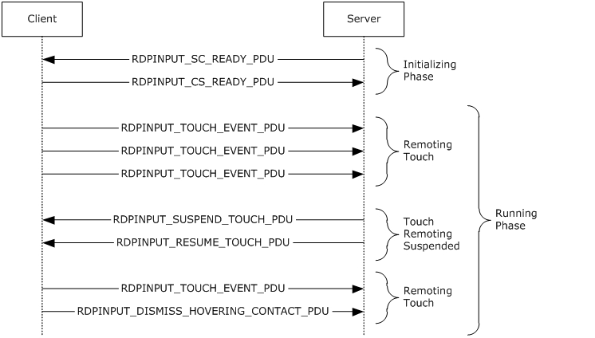
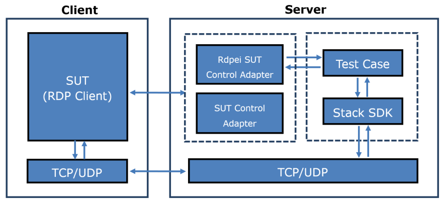

# RDP Client MS-RDPEI  Test Design Specification 

## Contents

* [Technical Document Analysis](#_Toc347752028)
    * [Technical Document Overview](#_Toc347752029)
    * [Relationship to Other Protocols](#_Toc347752030)
    * [Protocol Operations/Messages](#_Toc347752031)
    * [Protocol Properties](#_Toc347752032)
* [Test Method](#_Toc347752033)
    * [Assumptions, Scope and Constraints](#_Toc347752034)
    * [Test Approach](#_Toc347752035)
    * [Test Scenarios](#_Toc347752036)
		* [Touch Input Test](#_Toc347752037)
		* [Touch Control Test](#_Toc347752038)
* [Test Suite Design](#_Toc347752039)
    * [Test Suite Architecture](#_Toc347752040)
		* [System under Test (SUT)](#_Toc347752041)
		* [Test Suite Architecture](#_Toc347752042)
    * [Technical Dependencies/Considerations](#_Toc347752043)
		* [Dependencies](#_Toc347752044)
		* [Technical Difficulties](#_Toc347752045)
		* [Encryption Consideration](#_Toc347752046)
    * [Adapter Design](#_Toc347752047)
		* [Adapter Overview](#_Toc347752048)
		* [Technical Feasibility of Adapter Approach](#_Toc347752049)
		* [Adapter Abstract Level](#_Toc347752050)
		* [Adapter Inner Work](#_Toc347752051)
    * [SDK Design](#_Toc347752052)
		* [Common](#_Toc347752053)
		* [Server](#_Toc347752054)
		* [Client](#_Toc347752055)
* [Test Cases Design](#_Toc347752056)
    * [Traditional Test Case Design](#_Toc347752057)
    * [Test Cases Description](#_Toc347752058)
		* [BVT Test Cases](#_Toc347752059)
		* [Non BVT Test Cases](#_Toc347752060)
* [Appendix](#_Toc347752061)
    * [Glossary (Optional)](#_Toc347752062)
    * [Reference](#_Toc347752063)

## <a name="_Toc347752028"/>Technical Document Analysis

### <a name="_Toc347752029"/>Technical Document Overview
The [MS-RDPEI] is the input virtual channel extension which applies to  [MS-RDPBCGR]. It runs over a dynamic virtual channel, as specified in [MS-RDPEDYC]. The [MS-RDPEI] is used to remote multitouch input frames from a terminal server client to a terminal server.

### <a name="_Toc347752030"/>Relationship to Other Protocols 
This protocol is embedded in a dynamic virtual channel transport, as specified in [MS-RDPEDYC].

### <a name="_Toc347752031"/>Protocol Operations/Messages 
This protocol describes 6 messages, and these messages are divided into two distinct phases.

* Initializing phase

	* RDPINPUT\_SC\_READY_PDU: this message is sent by the sever endpoint to indicate readiness to commence with touch remoting transactions.

	* RDPINPUT\_CS\_READY_PDU: this message is sent by the client endpoint to indicate readiness to commence with touch remoting transactions.

* Running phase

	* RDPINPUT\_TOUCH\_EVENT_PDU: this message is sent by the client endpoint to remote a collection of touch frames.

	* RDPINPUT\_SUSPEND\_TOUCH\_PDU: this message is sent by the server endpoint to instruct the client to suspend the transmission of the RDPINPUT\_TOUCH\_EVENT_PDU.

	* RDPINPUT\_RESUME\_TOUCH\_PDU: this message is sent by the server endpoint to instruct the client to resume the transmission of the RDPINPUT\_TOUCH\_EVENT_PDU.

	* RDPINPUT\_DISMISS\_HOVERING\_CONTACT_PDU: this message is sent by the client endpoint to instruct the server to transition a contact in the “hovering” state to the “out of range” state.

The typical message flow of this protocol is described in following figure (Figure 1-1).

Figure 1-1: MS-RDPEI typical message flow

### <a name="_Toc347752032"/>Protocol Properties

* MS-RDPEI is a block protocol.

* MS-RDPEI is an extension to MS-RDPBCGR and all packets are transmitted in dynamic virtual channels as described in MS-RDPEDYC.

* MS-RDPEI is a Microsoft Communication Protocol Program (MCPP) protocol.

* MS-RDPEI is asynchronous because most of the messages don’t need any response.

## <a name="_Toc347752033"/>Test Method

### <a name="_Toc347752034"/>Assumptions, Scope and Constraints
**Assumptions:**

None.

**Scope:**

In scope:

Protocol client endpoint (RDP client), playing the client role, will be tested. For Windows, Terminal Client (MSTSC.exe) is the client endpoint. 

Out of scope:

Protocol Server endpoint (RDP Server), playing the server role, is out of scope for testing. 

**Constraint:**

None.

### <a name="_Toc347752035"/>Test Approach
Because MS-RDPEI client test code is merged into MS-RDPBCGR test code, so it applies the same test approach of MS-RDPBCGR: traditional testing. For more details about the reason to choose traditional testing, please refer to **MS-RDPBCGR_ClientTestDesignSpecificaitoin.md**.

### <a name="_Toc347752036"/>Test Scenarios
Two scenarios are designed for MS-RDPEI client testing. 

|  **Scenario**|  **Priority**|  **Test Approach**|  **Description**| 
| -------------| -------------| -------------| ------------- |
| Touch Input Test| P0| | This scenario covers the test of initializing phase and touch input event.| 
| Touch Control Test| P0| Traditional| This scenario covers the test of touch control messages.| 

***Table Scenarios***

#### <a name="_Toc347752037"/>Touch Input Test
**Preconditions:**

None.

**Typical Sequence:**

* RDP client and server establish the connection (described in MS-RDPBCGR).

* RDP server sends to the client a RDPINPUT\_SC\_READY_PDU message to initialize the touch remoting transaction.

* RDP client sends to the server a RDPINPUT\_CS\_READY_PDU message to initialize the touch remoting transaction.

* RDP client sends to the server multiple RDPINPUT\_TOUCH\_EVENT_PDU messages to remote a collection of touch frames.

* RDP client sends to the server a RDPINPUT\_DISMISS\_HOVERING\_CONTACT_PDU to instruct the server to transition a contact in the “hovering” state to the “out of range” state.

**Scenario Testing:**

This scenario will test the following messages:

* RDPINPUT\_SC\_READY_PDU

* RDPINPUT\_CS\_READY_PDU

* RDPINPUT\_TOUCH\_EVENT_PDU

* RDPINPUT\_DISMISS\_HOVERING\_CONTACT_PDU

#### <a name="_Toc347752038"/>Touch Control Test

* RDP client and server establish the connection (described in MS-RDPBCGR).

* RDP server sends to the client a RDPINPUT\_SC\_READY_PDU message to initialize the touch remoting transaction.

* RDP client sends to the server a RDPINPUT\_CS\_READY_PDU message to initialize the touch remoting transaction.

* RDP client sends to the server multiple RDPINPUT\_TOUCH\_EVENT_PDU messages to remote a collection of touch frames.

* RDP server sends to the client a RDPINPUT\_SUSPEND\_TOUCH\_PDU message to instruct the client to suspend the transmission of the RDPINPUT\_TOUCH\_EVENT_PDU message.

* RDP server sends to the client a RDPINPUT\_RESUME\_TOUCH\_PDU message to instruct the client to resume the transmission of the RDPINPUT\_TOUCH\_EVENT_PDU message.

* RDP client sends to the server multiple RDPINPUT\_TOUCH\_EVENT_PDU messages to remote a collection of touch frames.

**Scenario Testing:**

This scenario will test the following messages:

* RDPINPUT\_SUSPEND\_TOUCH_PDU

* RDPINPUT\_RESUME\_TOUCH_PDU

## <a name="_Toc347752039"/>Test Suite Design

### <a name="_Toc347752040"/>Test Suite Architecture

#### <a name="_Toc347752041"/>System under Test (SUT)
* From the third party point of view, the SUT is a component which implements MS-RDPEI.

* From the Windows implementation point of view, the SUT is a Remote Desktop Client (Mstsc.exe).

#### <a name="_Toc347752042"/>Test Suite Architecture
Figure 3-1 illustrates the architecture of the MS-RDPEI test suite for client endpoint testing.

_Figure 3-1 MS-RDPEI Test Suite Architecture_

As shown in Figure 3-1, MS-RDPEI is using the synthetic server pattern to design the test suite architecture. MS-RDPEI Test Suite contains the following components:

* The test case uses one SUT Control Adapter to trigger the client start the RDP connection to the server, and disconnect from the server.

* The test case uses another Rdpei SUT Control Adapter to interactively trigger the client send touch input messages to the server.

* The synthetic server is composed of the MS-RDPEI Test Case and the SDK (test suite library).

* The test cases invoke the protocol SDK (test suite library) to send the server messages to the client, process the received client messages, and validate the received client messages.

* The transport is TCP or UDP in MS-RDPEI Test Suite to communicate with SUT.

* The SUT for MS-RDPEI Test Suite is RDP Client.

MS-RDPEI Test Case will verify the protocol client behaviors specified in MS-RDPEI.

### <a name="_Toc347752043"/>Technical Dependencies/Considerations

#### <a name="_Toc347752044"/>Dependencies
Transport: All messages are transmitted over a dynamic virtual channel, as specified in [MS-RDPEDYC].

#### <a name="_Toc347752045"/>Technical Difficulties
None.

#### <a name="_Toc347752046"/>Encryption Consideration
None.

### <a name="_Toc347752047"/>Adapter Design

#### <a name="_Toc347752048"/>Adapter Overview
The MS-RDPEI Client Test Suite implements no protocol adapter. It uses the SUT control adapter and the protocol adapter of MS-RDPBCGR. 

Moreover, the MS-RDPEI Client Test Suite also uses another Rdpei SUT control adapter for interactive testing. 

For the details about the SUT control adapter and the protocol adapter of MS-RDPBCGR, please refer to **MS-RDPBCGR_ClientTestDesignSpecificaitoin.md**.

#### <a name="_Toc347752049"/>Technical Feasibility of Adapter Approach
**SUT Control Adapter:**

MS-RDPEI test suite reuses the SUT control adapter of MS-RDPBCGR. Please refer to section 3.3.3 of **MS-RDPBCGR_ClientTestDesignSpecificaitoin.md** for the technical feasibility information of SUT control adapter.

MS-RDPEI test suite also uses another Rdpei SUT control adapter for interactive tesing. The approach of this adapter is alternative. If the client implements MS-RDPRFX, it can be configured as “managed” adapter, which sends instruction images to the client to instruct user to trigger the client. If the client doesn’t implement MS-RDPRFX, it should be configured as “interactive” adapter.

#### <a name="_Toc347752050"/>Adapter Abstract Level
**SUT Control Adapter of MS-RDPEI**

The SUT control adapter of MS-RDPEI defines 5 interfaces:

**TriggerOneTouchEventOnClient**: This method is used to instruct user to trigger a touch event on the RDP client.

**TriggerContinuousTouchEventOnClient**: This method is used to instruct user to trigger continuous touch events on the RDP client.

**TriggerMultiTouchEventOnClient**: This method is used to instruct user to trigger multitouch event on the RDP client, the touch contact number of the multitouch event is specified in the parameter.

**TriggerPositionSpecifiedTouchEventOnClient**: This method is used to instruct user to trigger single touch event on the RDP client, and the position of the touch is specified by test case. This method is only valid under **managed** mode.

**TriggerDismissHoveringContactPduOnClient**: This method is used to instruct user to trigger RDPINPUT_DISMISS_HOVERING_CONTACT_PDU on the RDP client.

#### <a name="_Toc347752051"/>Adapter Inner Work
None.

### <a name="_Toc347752052"/>SDK Design

#### <a name="_Toc347752053"/>Common

* Common types and messages (P0)

* Marshal and unmarshal methods of each message (p0)

* Touch Contact State Transitions (P1)

#### <a name="_Toc347752054"/>Server

* Create and send following packets to the client

	* RDPINPUT\_SC\_READY_PDU (P0)

	* RDPINPUT\_SUSPEND\_TOUCH_PDU (P0)

	* RDPINPUT\_RESUME\_TOUCH_PDU (P0)

* Handling the following packets received from the client

	* RPDINPUT\_CS\_READY_PDU (P0)

	* RDPINPUT\_TOUCH\_EVENT_PDU (P0)

	* RDPINPUT\_DISMISS\_HOVERING\_CONTACT_PDU (P1)

* Create dynamic virtual channel (P0)

* Call back on receiving a message from the dynamic virtual channel (P0)

#### <a name="_Toc347752055"/>Client

* Create and send following packets to the server

	* RPDINPUT\_CS\_READY_PDU (P0)

	* RDPINPUT\_TOUCH\_EVENT_PDU (P0)

	* RDPINPUT\_DISMISS\_HOVERING\_CONTACT_PDU (P1)

* Handling the following packets received from the server

	* RDPINPUT\_SC\_READY_PDU (P0)

	* RDPINPUT\_SUSPEND\_TOUCH_PDU (P0)

	* RDPINPUT\_RESUME\_TOUCH_PDU (P0)

* Call back on receiving a message from the dynamic virtual channel (P0)

## <a name="_Toc347752056"/>Test Cases Design

### <a name="_Toc347752057"/>Traditional Test Case Design
The Traditional test approach is used to design all test cases. The test cases are designed to cover all in-scope testable requirements, including both positive and negative requirements. 

Below table shows the test case number of each scenario. 

|  **Scenario**|  **Test Case Number**|  **BVT**|  **P0**|  **P1**| 
| -------------| -------------| -------------| -------------| ------------- |
| Touch Input Test| 9| 2| 2| 7| 
| Touch Control Test| 7| 2| 2| 5| 

### <a name="_Toc347752058"/>Test Cases Description 
The test suite is a synthetic RDP server. In the following descriptions, all instances of the term “Test Suite” can be understood as the RDP server.

The common prerequisites for all test cases are listed below:

* Test Suite has started the TCP/UDP listening on the port which serves the RDP server.

* SUT knows the IP address and port number which test suite is listening on.

The common cleanup requirements are listed below:

* Test Suite disconnects all RDP connections if any.

* Test Suite stops the TCP/UDP listening.

* SUT deletes all data caches from previous RDP connection.   

In order to keep it simple, the common prerequisites and clean requirements are not listed in any of the test cases. Only prerequisites and cleanup requirements unique to the test case are listed in the corresponding test case description.

#### <a name="_Toc347752059"/>BVT Test Cases

#####Touch Input Test

|  **Touch Input Test**| | 
| -------------| ------------- |
|  **Test ID**| Rdpei\_TouchInputTest\_Positive_TouchReadiness| 
|  **Priority**| P0| 
|  **Description** | This test case is used to test the initialization of touch remoting transactions| 
|  **Prerequisites**| N/A| 
|  **Test Execution Steps**| Establish the RDP connection between server and client.| 
| | Create the dynamic virtual channel named “Microsoft::Windows::RDS::Input” with client, if the creation fails, then the test case fails.| 
| | Send a RDPINPUT\_SC\_READY_PDU to the client.| 
| | Expect a RDPINPUT\_CS\_READY_PDU from the client and verify the message content.| 
| | Trigger the client to terminate the connection.| 
|  **Cleanup**| N/A| 

|  **Touch Input Test**| | 
| -------------| ------------- |
|  **Test ID**| Rdpei\_TouchInputTest\_Positive_SingleTouchEvent| 
|  **Priority**| P0| 
|  **Description** | This test case is used to test the RDPINPUT\_TOUCH\_EVENT_PDU message.| 
|  **Prerequisites**| N/A| 
|  **Test Execution Steps**| Establish the RDP connection between server and client.| 
| | Create the dynamic virtual channel named “Microsoft::Windows::RDS::Input” with client.| 
| | Send a RDPINPUT\_SC\_READY_PDU to the client.| 
| | Expect a RDPINPUT\_CS\_READY_PDU from the client.| 
| | Trigger a touch event on the client and expect a RDPINPUT\_TOUCH\_EVENT_PDU from the client and verify the message content.| 
| | Trigger the client to terminate the connection.| 
|  **Cleanup**| N/A| 

#####Touch Control Test

|  **Touch Control Test**| | 
| -------------| ------------- |
|  **Test ID**| Rdpei\_TouchControlTest\_Positive_Suspend| 
|  **Priority**| P0| 
|  **Description** | This test case is used to ensure the client suspend the transmission of the RDPINPUT\_TOUCH\_EVENT\_PDU if receive a RDPINPUT\_SUSPEND\_TOUCH_PDU.| 
|  **Prerequisites**| N/A| 
|  **Test Execution Steps**| Establish the RDP connection between server and client.| 
| | Create the dynamic virtual channel named “Microsoft::Windows::RDS::Input” with client.| 
| | Send a RDPINPUT\_SC\_READY_PDU to the client.| 
| | Expect a RDPINPUT\_CS\_READY_PDU from the client.| 
| | Send a RDPINPUT\_SUSPEND\_TOUCH_PDU to the client.| 
| | Trigger several touch events on the client and expect no RDPINPUT\_TOUCH\_EVENT\_PDU or RDPINPUT\_DISMISS\_HOVERING\_CONTACT_PDU from the client within 40 seconds.| 
| | Trigger the client to terminate the connection.| 
|  **Cleanup**| N/A| 

|  **Touch Control Test**| | 
| -------------| ------------- |
|  **Test ID**| Rdpei\_TouchControlTest\_Positive_Resume| 
|  **Priority**| P0| 
|  **Description** | This test case is used to ensure the client resume the transmission of the RDPINPUT\_TOUCH\_EVENT\_PDU if receive a RDPINPUT\_RESUME\_TOUCH\_PDU after receiving a RDPINPUT\_SUSPEND\_TOUCH_PDU.| 
|  **Prerequisites**| N/A| 
|  **Test Execution Steps**| Establish the RDP connection between server and client.| 
| | Create the dynamic virtual channel named “Microsoft::Windows::RDS::Input” with client.| 
| | Send a RDPINPUT\_SC\_READY_PDU to the client. | 
| | Expect a RDPINPUT\_CS\_READY_PDU from the client. | 
| | Send a RDPINPUT\_SUSPEND\_TOUCH_PDU to the client.| 
| | Send a RDPINPUT\_RESUME\_TOUCH_PDU to the client.| 
| | Trigger a touch event on the client and expect a RDPINPUT\_TOUCH\_EVENT_PDU message from the client.| 
| | Trigger the client to terminate the connection.| 
|  **Cleanup**| N/A| 

#### <a name="_Toc347752060"/>Non BVT Test Cases

#####Touch Input Test

|  **Touch Input Test**| | 
| -------------| ------------- |
|  **Test ID**| Rdpei\_TouchInputTest\_Positive_MultiTouchEvent| 
|  **Priority**| P1| 
|  **Description** | This test case is used to test the multitouch of RDPINPUT\_TOUCH\_EVENT_PDU.| 
|  **Prerequisites**| N/A| 
|  **Test Execution Steps**| Establish the RDP connection between server and client.| 
| | Create the dynamic virtual channel named “Microsoft::Windows::RDS::Input” with client.| 
| | Send a RDPINPUT\_SC\_READY_PDU to the client.| 
| | Expect a RDPINPUT\_CS\_READY_PDU from the client.| 
| | According to the value of field maxContactCount in the received RDPINPUT\_CS\_READY_PDU, trigger multitouch event with maxContactCount fingers on the client (If maxContactCount  &#62;  10, trigger multitouch with 10 fingers).| 
| | Expect a RDPINPUT\_TOUCH\_EVENT_PDU with maxContactCount (or 10 if maxContactCount  &#62;  10) contacts in frames[0].| 
| | Trigger the client to terminate the connection.| 
|  **Cleanup**| N/A| 

|  **Touch Input Test**| | 
| -------------| ------------- |
|  **Test ID**| Rdpei\_TouchInputTest\_Positive_DismissHoveringContact| 
|  **Priority**| P1| 
|  **Description** | This test case is used to test RDPINPUT\_DISMISS\_HOVERING\_CONTACT_PDU message.| 
|  **Prerequisites**| N/A| 
|  **Test Execution Steps**| Establish the RDP connection between server and client.| 
| | Create the dynamic virtual channel named “Microsoft::Windows::RDS::Input” with client.| 
| | Send a RDPINPUT\_SC\_READY_PDU to the client.| 
| | Expect a RDPINPUT\_CS\_READY_PDU from the client.| 
| | Trigger the client to send a RDPINPUT\_DISMISS\_HOVERING\_CONTACT_PDU, verify the message content and the contactId is the ID of a valid hovering contact.| 
| | Trigger the client to terminate the connection.| 
|  **Cleanup**| N/A| 

|  **Touch Input Test**| | 
| -------------| ------------- |
|  **Test ID**| Rdpei\_TouchInputTest\_Positive_SingleTouchContactPosition| 
|  **Priority**| P1| 
|  **Description** | This test case is used to test the position of the contacts in RDPINPUT\_TOUCH\_EVENT_PDU message.| 
|  **Prerequisites**| N/A| 
|  **Test Execution Steps**| Establish the RDP connection between server and client.| 
| | Create the dynamic virtual channel named “Microsoft::Windows::RDS::Input” with client.| 
| | Send a RDPINPUT\_SC\_READY_PDU to the client.| 
| | Expect a RDPINPUT\_CS\_READY_PDU from the client.| 
| | Loop 5 times| 
| | [RDPBCGR] send Frame Maker Command (Begin) to the client. | 
| | [RDPRFX] Send Encode Header Messages to client. | 
| | [RDPRFX] Send one frame of Encode Data Messages (encoded with RLGR1) to the client. (Each time send to a different position. Four times to the corner of the screen, one time to a random position.)| 
| | [RDPBCGR] send Frame Maker Command (End) to the client. | 
| | Touch the image on the client and expect a RDPINPUT\_TOUCH\_EVENT_PDU message with expected value of x and y in the contact.| 
| | [RDPBCGR & RDPRFX] Update bitmaps resulted by touch event.| 
| | Trigger the client to terminate the connection.| 
|  **Cleanup**| N/A| 

|  **Touch Input Test**| | 
| -------------| ------------- |
|  **Test ID**| Rdpei\_TouchInputTest\_Positive_ContactStateTransition| 
|  **Priority**| P1| 
|  **Description** | This test case is used to test the transition states of the contacts in RDPINPUT\_TOUCH\_EVENT\_PDU and RDPINPUT\_DISMISS\_HOVERING\_CONTACT_PDU messages.| 
|  **Prerequisites**| N/A| 
|  **Test Execution Steps**| Establish the RDP connection between server and client.| 
| | Create the dynamic virtual channel named “Microsoft::Windows::RDS::Input” with client.| 
| | Send a RDPINPUT\_SC\_READY_PDU to the client.| 
| | Expect a RDPINPUT\_CS\_READY_PDU from the client.| 
| | Trigger several touch events on the client.| 
| | Expect some  RDPINPUT\_TOUCH\_EVENT\_PDU and  RDPINPUT\_DISMISS\_HOVERING\_CONTACT_PDU messages. Check the state transition of the contacts specified in these messages.| 
| | Trigger the client to terminate the connection.| 
|  **Cleanup**| N/A| 

|  **Touch Input Test**| | 
| -------------| ------------- |
|  **Test ID**| Rdpei\_TouchInputTest\_Negative_InvalidEventIdInInitializingPhase| 
|  **Priority**| P1| 
|  **Description** | This test case is used to ensure the client will ignore the message with invalid eventId in initializing phase.| 
|  **Prerequisites**| N/A| 
|  **Test Execution Steps**| Establish the RDP connection between server and client.| 
| | Create the dynamic virtual channel named “Microsoft::Windows::RDS::Input” with client.| 
| | Send a RDPINPUT_SC_READY_PDU with invalid eventId (0xFFFF) to the client.| 
| | Expect no response from the client within 5 seconds, if the client responds then the test case fails.| 
| | Trigger the client to terminate the connection.| 
|  **Cleanup**| N/A| 

|  **Touch Input Test**| | 
| -------------| ------------- |
|  **Test ID**| Rdpei\_TouchInputTest\_Negative_TouchEventWithoutNegotiation| 
|  **Priority**| P1| 
|  **Description** | This test case is used to ensure the client will not send RDPINPUT\_TOUCH\_EVENT_PDU message to the server without negotiation.| 
|  **Prerequisites**| N/A| 
|  **Test Execution Steps**| Establish the RDP connection between server and client.| 
| | Create the dynamic virtual channel named “Microsoft::Windows::RDS::Input” with client.| 
| | Trigger touch events on the client.| 
| | Expect receive nothing from the client within 40 seconds.| 
| | Trigger the client to terminate the connection.| 
|  **Cleanup**| N/A| 

|  **Touch Input Test**| | 
| -------------| ------------- |
|  **Test ID**| Rdpei\_TouchInputTest\_Negative_InvalidScReadyPduLength| 
|  **Priority**| P1| 
|  **Description** | This test case is used to ensure the client will ignore the message when the pduLength is inconsistent with the length of the message.| 
|  **Prerequisites**| N/A| 
|  **Test Execution Steps**| Establish the RDP connection between server and client.| 
| | Create the dynamic virtual channel named “Microsoft::Windows::RDS::Input” with client.| 
| | Send a RDPINPUT\_SC\_READY_PDU with incorrect pduLength (0x6) to the client.| 
| | Expect no response from the client within 5 seconds, if the client responds then the test case fails.| 
|  **Cleanup**| N/A| 

#####Touch Control Test

|  **Touch Control Test**| | 
| -------------| ------------- |
|  **Test ID**| Rdpei\_TouchControlTest\_Negative_InvalidSuspendPduLength| 
|  **Priority**| P1| 
|  **Description** | This test case is used to ensure the client will ignore the message when the pduLength is inconsistent with the length of the message.| 
|  **Prerequisites**| N/A| 
|  **Test Execution Steps**| Establish the RDP connection between server and client.| 
| | Create the dynamic virtual channel named “Microsoft::Windows::RDS::Input” with client.| 
| | Send a RDPINPUT\_SC\_READY_PDU to the client.| 
| | Expect a RDPINPUT\_CS\_READY_PDU from the client.| 
| | Send a RDPINPUT\_SUSPEND\_TOUCH_PDU with incorrect pduLength (0x10) to the client.| 
| | Trigger a touch event on the client and expect a RDPINPUT\_TOUCH\_EVENT_PDU message from the client.| 
| | Trigger the client to terminate the connection.| 
|  **Cleanup**| N/A| 

|  **Touch Control Test**| | 
| -------------| ------------- |
|  **Test ID**| Rdpei\_TouchControlTest\_Negative_InvalidResumePduLength| 
|  **Priority**| P1| 
|  **Description** | This test case is used to ensure the client will ignore the message when the pduLength is inconsistent with the length of the message.| 
|  **Prerequisites**| N/A| 
|  **Test Execution Steps**| Establish the RDP connection between server and client.| 
| | Create the dynamic virtual channel named “Microsoft::Windows::RDS::Input” with client.| 
| | Send a RDPINPUT\_SC\_READY_PDU to the client.| 
| | Expect a RDPINPUT\_CS\_READY_PDU from the client.| 
| | Send a RDPINPUT\_SUSPEND\_TOUCH_PDU to the client.| 
| | Send a RDPINPUT\_RESUME\_TOUCH_PDU with incorrect pduLength (0x10) to the client.| 
| | Trigger some touch events on the client and expect to receive nothing from the client within 40 seconds.| 
| | Trigger the client to terminate the connection.| 
|  **Cleanup**| N/A| 

|  **Touch Control Test**| | 
| -------------| ------------- |
|  **Test ID**| Rdpei\_TouchControlTest\_Negative_InvalidEventIdInRunningPhase| 
|  **Priority**| P1| 
|  **Description** | This test case is used to ensure the client will ignore the message with invalid eventId during running phase.| 
|  **Prerequisites**| N/A| 
|  **Test Execution Steps**| Establish the RDP connection between server and client.| 
| | Create the dynamic virtual channel named “Microsoft::Windows::RDS::Input” with client.| 
| | Send a RDPINPUT\_SC\_READY_PDU to the client.| 
| | Expect a RDPINPUT\_CS\_READY_PDU from the client.| 
| | Send a RDPINPUT\_SUSPEND\_TOUCH_PDU with invalid eventId(0xFFFF).| 
| | Trigger touch event on the client.| 
| | Expect the client to send RDPINPUT\_TOUCH\_EVENT_PDU to the client.| 
| | Trigger the client to terminate the connection.| 
|  **Cleanup**| N/A| 

|  **Touch Control Test**| | 
| -------------| ------------- |
|  **Test ID**| Rdpei\_TouchControlTest\_Negative_DuplicatedSuspend| 
|  **Priority**| P1| 
|  **Description** | This test case is used to ensure the client will ignore the duplicated RDPINPUT_SUSPEND_TOUCH_PDU.| 
|  **Prerequisites**| N/A| 
|  **Test Execution Steps**| Establish the RDP connection between server and client.| 
| | Create the dynamic virtual channel named “Microsoft::Windows::RDS::Input”with client.| 
| | Send a RDPINPUT\_SC\_READY_PDU to the client.| 
| | Expect a RDPINPUT\_CS\_READY_PDU from the client.| 
| | Send a RDPINPUT\_SUSPEND\_TOUCH_PDU to the client.| 
| | Send a duplicated RDPINPUT\_SUSPEND\_TOUCH_PDU to the client.| 
| | Trigger some touch events on the client and expect no message received from the client within 40 seconds.| 
| | Trigger the client to terminate the connection.| 
|  **Cleanup**| N/A| 

|  **Touch Control Test**| | 
| -------------| ------------- |
|  **Test ID**| Rdpei\_TouchControlTest\_Negative_DuplicatedResume| 
|  **Priority**| P1| 
|  **Description** | This test case is used to ensure the client will ignore the duplicated RDPINPUT_RESUME_TOUCH_PDU.| 
|  **Prerequisites**| N/A| 
|  **Test Execution Steps**| Establish the RDP connection between server and client.| 
| | Create the dynamic virtual channel named “Microsoft::Windows::RDS::Input” with client.| 
| | Send a RDPINPUT\_SC\_READY_PDU to the client.| 
| | Expect a RDPINPUT\_CS\_READY_PDU from the client.| 
| | Send a RDPINPUT\_SUSPEND\_TOUCH_PDU to the client.| 
| | Send a RDPINPUT\_RESUME\_TOUCH_PDU to the client.| 
| | Send a duplicated RDPINPUT\_RESUME\_TOUCH_PDU to the client.| 
| | Trigger a touch event on the client and expect a RDPINPUT\_TOUCH\_EVENT_PDU message received from the client.| 
| | Trigger the client to terminate the connection.| 
|  **Cleanup**| N/A| 

## <a name="_Toc347752061"/>Appendix

### <a name="_Toc347752062"/>Glossary (Optional)
**SUT**: System under Test. In this spec, it indicates the MS-RDPBCGR client implementation.

**Test Suite**: The synthetic RDP server which is used to test against SUT.

### <a name="_Toc347752063"/>Reference

* Technical Document: **[MS-RDPEI].pdf**

* Test Suite Design Document: **MS-RDPBCGR_ClientTestDesignSpecificaitoin.md**

