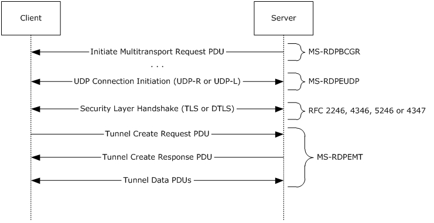

# RDP Client MS-RDPEMT  Test Design Specification 

## Contents

* [Technical Document Analysis](#_Toc350340308)
    * [Technical Document Overview](#_Toc350340309)
    * [Relationship to Other Protocols](#_Toc350340310)
    * [Protocol Operations/Messages](#_Toc350340311)
    * [Protocol Properties](#_Toc350340312)
* [Test Method](#_Toc350340313)
    * [Assumptions, Scope and Constraints](#_Toc350340314)
    * [Test Approach](#_Toc350340315)
    * [Test Scenarios](#_Toc350340316)
		* [S1_Connection](#_Toc350340317)
		* [S2_AutoDetect](#_Toc350340318)
		* [S3_Tunneling_StaticVC_Traffic](#_Toc350340335)
* [Test Suite Design](#_Toc350340319)
    * [Test Suite Architecture](#_Toc350340320)
		* [System under Test (SUT)](#_Toc350340321)
		* [Test Suite Architecture](#_Toc350340322)
    * [Technical Dependencies/Considerations](#_Toc350340323)
		* [Dependencies](#_Toc350340324)
		* [Technical Difficulties](#_Toc350340325)
		* [Encryption Consideration](#_Toc350340326)
* [Test Cases Design](#_Toc350340327)
    * [Traditional Test Case Design](#_Toc350340328)
    * [Test Cases Description](#_Toc350340329)
		* [S1_Connection](#_Toc350340330)
		* [S2_AutoDetect](#_Toc350340331)
		* [S3_Tunneling_StaticVC_Traffic](#_Toc350340336)
* [Appendix](#_Toc350340332)
    * [Glossary (Optional)](#_Toc350340333)
    * [Reference](#_Toc350340334)

## <a name="_Toc350340308"/>Technical Document Analysis

### <a name="_Toc350340309"/>Technical Document Overview
The Remote Desktop Protocol: Multitransport Extension enables multiple side-band channels (also referred to as "multitransport connections") between an RDP client and server over different underlying transport protocols such as reliable UDP, or lossy UDP ([MS-RDPEUDP] section 1.3.1). Each multitransport connection leverages the strengths of the underlying transport protocol to efficiently deliver different types of RDP content, thereby improving the user’s experience, especially on WAN or wireless networks. 

### <a name="_Toc350340310"/>Relationship to Other Protocols 
The Remote Desktop Protocol: Multitransport Extension operates over the RDP-UDP protocol, as defined in [MS-RDPEUDP] sections 1, 2 and 3. Protocol traffic (section 2.2) is secured by using Transport Layer Security (TLS) ([[RFC2246]](http://go.microsoft.com/fwlink/?LinkId=90324), [[RFC4346]](http://go.microsoft.com/fwlink/?LinkId=90474) and [[RFC5246]](http://go.microsoft.com/fwlink/?LinkId=129803)) for reliable RDP-UDP streams and Datagram Transport Layer Security (DTLS) ([[RFC4347]](http://go.microsoft.com/fwlink/?LinkId=227111)) for unreliable (lossy) RDP-UDP streams.

A multitransport connection is initiated by an RDP server sending the Initiate Multitransport Request PDU ([MS-RDPBCGR] section 2.2.15.1) to an RDP client over the main RDP connection.

### <a name="_Toc350340311"/>Protocol Operations/Messages 
There are 5 structures described by this protocol.

* RDP\_TUNNEL_HEADER

* RDP\_TUNNEL_SUBHEADER

* RDP\_TUNNEL_CREATEREQUEST

* RDP\_TUNNEL_CREATERESPONSE

* RDP\_TUNNEL_DATA

Bootstrapping, creating, securing and finalizing a multitransport connection uses messages from a number of protocols. The following sequence diagram presents an overview of these messages and protocols.

Figure 1: Messages used by multitransport connections

### <a name="_Toc350340312"/>Protocol Properties
* RDPEMT is a block protocol and an extension of MS-RDPBCGR.
* RDPEMT operates over the RDP-UDP protocol, as defined in [MS-RDPEUDP]).
* All multitransport connections are secured by using either Transport Layer Security (TLS) ([[RFC2246]](http://go.microsoft.com/fwlink/?LinkId=90324), [[RFC4346]](http://go.microsoft.com/fwlink/?LinkId=90474) and [[RFC5246]](http://go.microsoft.com/fwlink/?LinkId=129803)) or Datagram Transport Layer Security (DTLS) ([[RFC4347]](http://go.microsoft.com/fwlink/?LinkId=227111)).

## <a name="_Toc350340313"/>Test Method

### <a name="_Toc350340314"/>Assumptions, Scope and Constraints
**Assumptions:**
* The RDP client machine should support using RDP-UDP transport.

**Scope:**
* The protocol client endpoint (RDP client) playing the client role will be tested. For Windows, the Remote Desktop Client (MSTSC.exe) is the client endpoint.
* The protocol server endpoint (RDP Server) playing the server role is out of scope.
* For Windows, the System under Test (SUT) will be mstsc.exe.
* External protocols are out of scope.
* Compression and encryption are out of scope.

**Constraint:**

There is no constraint for this Test Suite.

### <a name="_Toc350340315"/>Test Approach
Because the MS-RDPEMT client test code is merged into the MS-RDPBCGR test code, it applies the same test approach used for MS-RDPBCGR: traditional testing. 

For more details about the reason for choosing traditional testing, please refer to **MS-RDPBCGR_ClientTestDesignSpecificaitoin.md**

### <a name="_Toc350340316"/>Test Scenarios
There are 2 scenarios defined in the MS-RDPEMT client test suite for verifying the client behavior. See Table 2-1 MS-RDPEMT Test Suite Scenarios for more information.

|  **Scenario**|  **Priority**|  **Test Approach**|  **Description**| 
| -------------| -------------| -------------| ------------- |
| **S1_Connection**| 0| Traditional| Verify the RDPEMT connection phase.| 
| **S2_AutoDetect**| 0| Traditional| Verify auto detection over RDPEMT tunnel.|
| **S3_Tunneling_StaticVC_Traffic**| 1| Traditional| Verify static VC data over reliable UDP.|

***Table 21 MS-RDPEMT Test Suite Scenarios***

#### <a name="_Toc350340317"/>S1_Connection
**Preconditions:**

* The RDP connection has been established.

**Typical Sequence:**

The typical scenario sequence is the following:

* RDP server sends a Server Initiate Multitransport Request PDU through main RDP connection (described in [MS-RDPBCGR]).

* RDP Client establish a RDPEUDP connection with the RDP server

* RDP client sends Tunnel Create Request PDU over RDPEUDP connection.

* RDP server responds a Tunnel Create Response PDU over RDPEUDP connection.

**Scenario Testing:**

This scenario will test the following structures:

* RDP\_TUNNEL_HEADER

* RDP\_TUNNEL_CREATEREQUEST

* RDP\_TUNNEL_CREATERESPONSE

#### <a name="_Toc350340318"/>S2_AutoDetect
**Preconditions:**

* The RDP connection has been established.

**Typical Sequence:**

The typical scenario sequence is the following:

* RDP server and RDP client establish a RDPEUDP connection.

* RDP server and RDP client establish a RDPEMT connection.

* RDP server sends RTT Measure Request or Bandwidth Measure Messages to RDP client.

* RDP client responds a RTT Measure Response or Bandwidth Measure Results.

* RDP server sends a Network Characteristics Result.

**Scenario Testing:**

This scenario will test the following structures:

* RDP\_TUNNEL_HEADER

* RDP\_TUNNEL_SUBHEADER

* RDP\_TUNNEL_DATA

#### <a name="_Toc350340335"/>S3_Tunneling_StaticVC_Traffic
**Preconditions:**

* The RDP connection has been established.

**Typical Sequence:**

The typical scenario sequence is the following:

* RDP server and RDP client establish a RDPEUDP connection.

* RDP server and RDP client establish a RDPEMT connection.

* RDP server and RDP client Soft-Sync negotiation.

* RDP server and RDP client send and receive data.

**Scenario Testing:**

This scenario will test the following structures:

* RDP\_TUNNEL_HEADER

* RDP\_TUNNEL_DATA

* DYNVC\_SOFT\_SYNC\_REQUEST

* DYNVC\_SOFT\_SYNC\_RESPONSE

## <a name="_Toc350340319"/>Test Suite Design

### <a name="_Toc350340320"/>Test Suite Architecture

#### <a name="_Toc350340321"/>System under Test (SUT)
* From the third party point of view, the SUT is a component which implements MS-RDPEMT.

* From the Windows implementation point of view, the SUT is the Remote Desktop Client (Mstsc.exe).

#### <a name="_Toc350340322"/>Test Suite Architecture
Figure 3-1 illustrates the architecture of the MS-RDPEMT test suite for client endpoint testing.

 _Figure 3-1 MS-RDPEMT Test Suite Architecture_
 
As shown in Figure 3-1, MS-RDPEMT is using the synthetic server pattern to design the test suite architecture. MS-RDPEMT Test Suite contains the following components:

* The SUT Control Adapter is used by the test case to trigger the client to send the request to the server.

* The Test suite invokes the protocol SDK (test suite library) to process the client messages and then sends the corresponding server response message to the client.

* The MS-RDPEMT Test Suite uses both TCP and UDP as the transport to communicate with SUT.

* The SUT for the MS-RDPEMT Test Suite is the RDP Client.

The MS-RDPEMT Test Case will verify the protocol client behaviors specified in MS-RDPEMT.

### <a name="_Toc350340323"/>Technical Dependencies/Considerations

#### <a name="_Toc350340324"/>Dependencies
Transport: Both TCP and UDP transport are used. The main RDP connection use TCP transport, and the RDPEMT messages are transmitted on UDP transport.

#### <a name="_Toc350340325"/>Technical Difficulties 
None.

#### <a name="_Toc350340326"/>Encryption Consideration
All multitransport connections are secured by using either Transport Layer Security (TLS) ([[RFC2246]](http://go.microsoft.com/fwlink/?LinkId=90324), [[RFC4346]](http://go.microsoft.com/fwlink/?LinkId=90474) and [[RFC5246]](http://go.microsoft.com/fwlink/?LinkId=129803)) or Datagram Transport Layer Security (DTLS) ([[RFC4347]](http://go.microsoft.com/fwlink/?LinkId=227111)).

## <a name="_Toc350340327"/>Test Cases Design

### <a name="_Toc350340328"/>Traditional Test Case Design

|  **Scenario**|  **Test Cases**|  **BVTs**|  **P0**|  **P1**| 
| -------------| -------------| -------------| -------------| ------------- |
| S1_Connection| 6| 2| 2| 4| 
| S2_AutoDetection| 4| 0| 2| 2| 
| S3_Tunneling_StaticVC_Traffic| 0| 0| 0| 1| 

### <a name="_Toc350340329"/>Test Cases Description 
The test suite is a synthetic RDP server. In the following descriptions, all instances of the term “Test Suite” can be understood as the RDP server.
Common prerequisites for all test cases:

* The test suite has established the main RDP connection.
* The test suite has started the UDP listening service on the port which serves the RDP server.

Common cleanup requirements:

* The test suite disconnects all RDP connections if there any.
* The test suite stops the TCP and UDP listening service.
* The SUT deletes all data caches from previous RDP connections.   

The common prerequisites and clean requirements are not listed in any of the test cases. Only prerequisites and cleanup requirements unique to the test case are listed in the corresponding test case descriptions.

#### <a name="_Toc350340330"/>S1_Connection

|  **S1_Connection**| | 
| -------------| ------------- |
|  **Test ID**| S1\_Connection\_Initialization_InitialReliableConnection| 
|  **Priority**| P0| 
|  **Description** | Verify the RDP client can set up a RDPEMT connection upon a reliable RDP-UDP connection.| 
|  **Prerequisites**| N/A| 
|  **Test Execution Steps**| Test suite trigger RDP client to create a reliable RDP-UDP connection and initialize a TLS encrypted channel| 
| | Test suite expect for a Tunnel Create Request PDU from RDP client and verify:| 
| | The **Action** field in RDP\_TUNNEL\_HEADER structure MUST be set to RDPTUNNEL\_ACTION_CREATEREQUEST (0x0)| 
| | The **Flags** field in RDP\_TUNNEL_HEADER structure MUST be set to zero| 
| | The **PayloadLength** field in RDP\_TUNNEL_HEADER structure MUST be set to 24| 
| | The **HeaderLength** field in RDP\_TUNNEL_HEADER structure MUST be set to 0x04| 
| | The **RequestID** field MUST contain the request ID included in the Initiate Multitransport Request PDU that was sent over the main RDP connection| 
| | The **Reserved** field set to zero| 
| | The **SecurityCookie** field MUST contain the security cookie included in the Initiate Multitransport Request PDU that was sent over the main RDP connection| 
| | If the above requirements are all satisfied, test suite should sent a Tunnel Create Response PDU with an **HrResponse** code of S_OK(0x0)| 
|  **Cleanup**| N/A| 

|  **S1_Connection**| | 
| -------------| ------------- |
|  **Test ID**| S1\_Connection\_Initialization_InitialLossyConnection| 
|  **Priority**| P0| 
|  **Description** | Verify the RDP client can set up a RDPEMT connection upon a Lossy RDP-UDP connection.| 
|  **Prerequisites**| N/A| 
|  **Test Execution Steps**| Test suite trigger RDP client to create a lossy RDP-UDP connection and initialize a DTLS encrypted channel| 
| | Test suite expect for a Tunnel Create Request PDU from RDP client and verify:| 
| | The **Action** field in RDP\_TUNNEL\_HEADER structure MUST be set to RDPTUNNEL\_ACTION_CREATEREQUEST (0x0)| 
| | The **Flags** field in RDP\_TUNNEL_HEADER structure MUST be set to zero| 
| | The **PayloadLength** field in RDP\_TUNNEL_HEADER structure MUST be set to 24| 
| | The **HeaderLength** field in RDP\_TUNNEL_HEADER structure MUST be set to 0x04| 
| | The **RequestID** field MUST contain the request ID included in the Initiate Multitransport Request PDU that was sent over the main RDP connection| 
| | The **Reserved** field set to zero| 
| | The **SecurityCookie** field MUST contain the security cookie included in the Initiate Multitransport Request PDU that was sent over the main RDP connection| 
| | If the above requirements are all satisfied, test suite should sent a Tunnel Create Response PDU with an **HrResponse** code of S_OK(0x0)| 
|  **Cleanup**| N/A| 

|  **S1_Connection**| | 
| -------------| ------------- |
|  **Test ID**| S1\_Connection\_Initialization\_NegativeTest\_InitialReliableConnection_RDPEncryption| 
|  **Priority**| P1| 
|  **Description** | Verify the RDP client will drop the RDP-UDP reliable connection if RDP-TCP connection uses RDP encryption method.| 
|  **Prerequisites**| RDP encryption method is selected when establishing main RDP connection.| 
|  **Test Execution Steps**| Test suite trigger RDP client to create a reliable RDP-UDP connection | 
| | Test suite and RDP client complete TLS handshake to initialize a TLS encrypted channel.| 
| | Test suite expect RDP client to send a Client Initiate Multitransport Error PDU.| 
|  **Cleanup**| N/A| 

|  **S1_Connection**| | 
| -------------| ------------- |
|  **Test ID**| S1\_Connection\_Initialization\_NegativeTest\_InitialLossyConnection_RDPEncryption| 
|  **Priority**| P1| 
|  **Description** | Verify the RDP client will drop the RDP-UDP lossy connection if RDP-TCP connection uses RDP encryption method.| 
|  **Prerequisites**| RDP encryption method is selected when establishing main RDP connection.| 
|  **Test Execution Steps**| Test suite trigger RDP client to create a lossy RDP-UDP connection | 
| | Test suite and RDP client complete DTLS handshake to initialize a DTLS encrypted channel.| 
| | Test suite expect RDP client to send a Client Initiate Multitransport Error PDU.| 
|  **Cleanup**| N/A| 

|  **S1_Connection**| | 
| -------------| ------------- |
|  **Test ID**| S1\_Connection\_SoftSync\_Lossy| 
|  **Priority**| P1| 
|  **Description** | Verify the RDP client can handle soft sync connection using RDP-UDP-L.| 
|  **Prerequisites**| Both RDP server and client support Soft Sync.| 
|  **Test Execution Steps**| Test suite trigger RDP client to create a lossy RDP-UDP connection | 
| | Test suite and RDP client complete DTLS handshake to initialize a DTLS encrypted channel.|
| | Test suite sends Initiate Multitransport Request PDU.| 
| | Test suite expect RDP client to send a Client Initiate Multitransport Response PDU.|
| | Test suite sends Soft-Sync Request PDU.|
| | Test suite expect RDP client to send a Soft-Sync Response PDU.| 
|  **Cleanup**| N/A| 

|  **S1_Connection**| | 
| -------------| ------------- |
|  **Test ID**| S1\_Connection\_SoftSync\_Reliable| 
|  **Priority**| P1| 
|  **Description** | Verify the RDP client can handle soft sync connection using RDP-UDP-R.| 
|  **Prerequisites**| Both RDP server and client support Soft Sync.| 
|  **Test Execution Steps**| Test suite trigger RDP client to create a reliable RDP-UDP connection | 
| | Test suite and RDP client complete TLS handshake to initialize a TLS encrypted channel.| 
| | Test suite sends Initiate Multitransport Request PDU.| 
| | Test suite expect RDP client to send a Client Initiate Multitransport Response PDU.|
| | Test suite sends Soft-Sync Request PDU.|
| | Test suite expect RDP client to send a Soft-Sync Response PDU.| 
|  **Cleanup**| N/A| 

#### <a name="_Toc350340331"/>S2_AutoDetect

|  **S2_AutoDetect**| | 
| -------------| ------------- |
|  **Test ID**| S2\_AutoDetect_RTTMeasure| 
|  **Priority**| P1| 
|  **Description** | Verify the RDP client can response to round-trip measurement operations initiated by the RTT Measure Request correctly| 
|  **Prerequisites**| N/A| 
|  **Test Execution Steps**| Test suite trigger RDP client to create an encrypted reliable or lossy RDP-UDP connection.| 
| | Test suite expect for a RDPEMT connection from the client| 
| | Test suite send a RTT Measure Request message encapsulated in the SubHeaderData field of an RDP_TUNNEL_SUBHEADER structure to the client| 
| | Test suite expect for a RTT Measure Response PDU embedded in an Auto-Detect Response PDU and verify:| 
| | The **headerLength** field MUST be set to 0x06| 
| | The **headerTypeID** field MUST be set to TYPE\_ID\_AUTODETECT_RESPONSE (0x01)| 
| | The **sequenceNumber** field SHOULD be set to the same value as the sequenceNumber field of the most recent RTT Measure Request message received from the server| 
| | The **responseType** MUST be set to 0x0000| 
|  **Cleanup**| N/A| 

|  **S2_AutoDetect**| | 
| -------------| ------------- |
|  **Test ID**| S2\_AutoDetect_ReliableBandwidthMeasure| 
|  **Priority**| P0| 
|  **Description** | Verify the RDP client can complete the bandwidth measure auto detection in a reliable UDP transport| 
|  **Prerequisites**| N/A| 
|  **Test Execution Steps**| Test suite trigger RDP client to create an reliable RDP-UDP connection and initialize a TLS encrypted channel| 
| | Test suite expect for a RDPEMT connection from the client| 
| | Test suite send a Bandwidth Measure Start message encapsulated in the SubHeaderData field of an RDP_TUNNEL_SUBHEADER structure to the client| 
| | Test suite send amounts of bytes to the client| 
| | Test suite send a Bandwidth Measure Stop message encapsulated in the SubHeaderData field of an RDP_TUNNEL_SUBHEADER structure to the client| 
| | Test suite expect for a Bandwidth Measure Result PDU from the client and verify:| 
| | The **headerLength** field MUST be set to 0x0E| 
| | The **headerTypeId** field MUST be set to TYPE\_ID\_AUTODETECT_RESPONSE (0x01)| 
| | The **requestType** field MUST be set to 0x000B| 
| | The **timeDelta** field MUST specify the time delta, in milliseconds, between the receipt of the Bandwidth Measure Start and the Bandwidth Measure Stop messages| 
|  **Cleanup**| N/A| 

|  **S2_AutoDetect**| | 
| -------------| ------------- |
|  **Test ID**| S2\_AutoDetect_LossyBandwidthMeasure| 
|  **Priority**| P0| 
|  **Description** | Verify the RDP client can complete the bandwidth measure auto detection in a lossy UDP transport| 
|  **Prerequisites**| N/A| 
|  **Test Execution Steps**| Test suite trigger RDP client to create a lossy RDP-UDP connection and initialize a DTLS encrypted channel.| 
| | Test suite expect for a RDPEMT connection from the client| 
| | Test suite send a Bandwidth Measure Start message encapsulated in the SubHeaderData field of an RDP_TUNNEL_SUBHEADER structure to the client| 
| | Test suite send amounts of bytes to the client| 
| | Test suite send a Bandwidth Measure Stop message encapsulated in the SubHeaderData field of an RDP_TUNNEL_SUBHEADER structure to the client. The sequenceNumber field in Bandwidth Measure Stop should be set the same as Bandwidth Measure Start message| 
| | Test suite expect for a Bandwidth Measure Result PDU from the client and verify:| 
| | The **headerLength** field MUST be set to ox0E| 
| | The **headerTypeId** field MUST be set to TYPE\_ID\_AUTODETECT_RESPONSE (0x01)| 
| | The **sequenceNumber** field SHOULD be set to the same value as the sequenceNumber field of the most recent Bandwidth Measure Stop message received from the server| 
| | The **requestType** field MUST be set to 0x000B| 
| | The **timeDelta** field MUST specify the time delta, in milliseconds, between the receipt of the Bandwidth Measure Start and the Bandwidth Measure Stop messages| 
|  **Cleanup**| N/A| 

|  **S2_AutoDetect**| | 
| -------------| ------------- |
|  **Test ID**| S2\_AutoDetect_NegtiveLossyBandwidthMeasure| 
|  **Priority**| P1| 
|  **Description** | Verify the RDP client doesn’t respond Bandwidth detection request in a lossy UDP transport if the sequenceNumber field in the Bandwidth Measure Stop structure is not the same as that in the Bandwidth Measure Start structure.| 
|  **Prerequisites**| N/A| 
|  **Test Execution Steps**| Test suite trigger RDP client to create a lossy RDP-UDP connection and initialize a DTLS encrypted channel| 
| | Test suite expect for a RDPEMT connection from the client| 
| | Test suite send a Bandwidth Measure Start message encapsulated in the SubHeaderData field of an RDP_TUNNEL_SUBHEADER structure to the client| 
| | Test suite send amounts of bytes to the client| 
| | Test suite send a Bandwidth Measure Stop message encapsulated in the SubHeaderData field of an RDP_TUNNEL_SUBHEADER structure to the client. The sequenceNumber field in Bandwidth Measure Stop is set a different value from Bandwidth Measure Start message| 
| | The client should skip the response step and test suite SHOULD NOT get a Bandwidth Measure Result PDU from the client| 
|  **Cleanup**| N/A|

#### <a name="_Toc350340336"/>S3_Tunneling_StaticVC_Traffic 
|  **S3_Tunneling_StaticVC_Traffic**| | 
| -------------| ------------- |
|  **Test ID**| S3\_Tunneling\_StaticVirtualChannel\_PositiveTest| 
|  **Priority**| P1| 
|  **Description** | This test case is used to verify client could tunnelling static virtual channel traffic over UDP.| 
|  **Prerequisites**| N/A| 
|  **Test Execution Steps**| Test suite trigger RDP client to create a reliable RDP-UDP connection and initialize a TLS encrypted channel| 
| | Test suite expect for a RDPEMT connection from the client|
| | Test suite and RDP client create Soft-Sync negotiation|
| | Test suite and RDP client create dynamic VC for MS-RDPEFS|
| | Test suite and RDP client send and receive MS-RDPEFS data on DVC over reliable UDP.| 

|  **Cleanup**| N/A|

## <a name="_Toc350340332"/>Appendix

### <a name="_Toc350340333"/>Glossary (Optional)
**SUT**: System under Test. In this spec, it indicates the MS-RDPEMT client implementation.

**Test Suite**: The synthetic RDP server which is used to test against SUT.

### <a name="_Toc350340334"/>Reference

* Technical Document: **[MS-RDPEMT].pdf**

