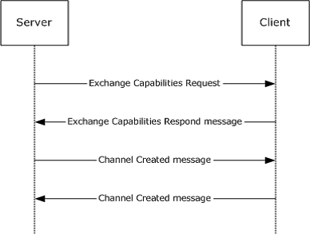
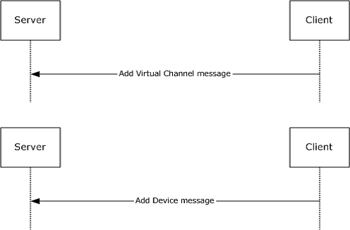
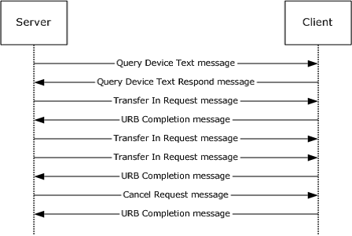
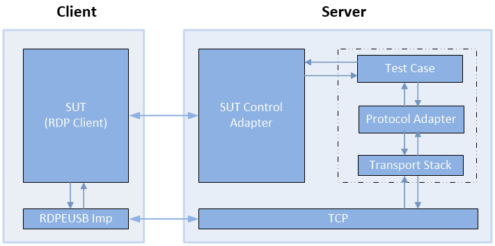

# RDP Client MS-RDPEUSB  Test Design Specification 

## Contents

* [Technical Document Analysis](#_Toc326658498)
    * [Technical Document Overview](#_Toc326658499)
    * [Relationship to Other Protocols](#_Toc326658500)
    * [Protocol Operations/Messages](#_Toc326658501)
    * [Protocol Properties](#_Toc326658502)
* [Test Method](#_Toc326658503)
    * [Assumptions, Scope and Constraints](#_Toc326658504)
    * [Test Approach](#_Toc326658505)
    * [Test Scenarios](#_Toc326658506)
		* [S1_OperateDeviceChannel](#_Toc326658507)
		* [S2_CancelRequest](#_Toc326658508)
		* [S3_OperateIo](#_Toc326658509)
* [Test Suite Design](#_Toc326658510)
    * [Test Suite Architecture](#_Toc326658511)
		* [System under Test (SUT)](#_Toc326658512)
		* [Test Suite Architecture](#_Toc326658513)
    * [Technical Dependencies/Considerations](#_Toc326658514)
		* [Dependencies](#_Toc326658515)
		* [Technical Difficulties](#_Toc326658516)
		* [Encryption Consideration](#_Toc326658517)
    * [Adapter Design](#_Toc326658518)
		* [Adapter Overview](#_Toc326658519)
		* [Technical Feasibility of Adapter Approach](#_Toc326658520)
		* [Adapter Abstract Level](#_Toc326658521)
		* [Adapter Inner Work](#_Toc326658522)
* [Test Cases Design](#_Toc326658523)
    * [Traditional Test Case Design](#_Toc326658524)
    * [Test Cases Description](#_Toc326658525)
		* [BVT Test Cases](#_Toc326658526)
		* [S1_OperateDeviceChannel](#_Toc326658527)
		* [S2_CancelRequest](#_Toc326658528)
		* [S3_OperateIo](#_Toc326658529)
* [Appendix](#_Toc326658530)
    * [Glossary](#_Toc326658531)
    * [Reference](#_Toc326658532)

## <a name="_Toc326658498"/>Technical Document Analysis

### <a name="_Toc326658499"/>Technical Document Overview
The Remote Desktop Protocol: USB Devices Virtual Channel Extension is used to transfer USB packets from a terminal server to a terminal client. The client forwards the USB packets to a physical device. Then the client returns the results after the physical device reassembles the packets.

### <a name="_Toc326658500"/>Relationship to Other Protocols 
The Remote Desktop Protocol: USB Devices Virtual Channel Extension is embedded in a dynamic virtual channel transport, as specified in [MS-RDPEDYC].

### <a name="_Toc326658501"/>Protocol Operations/Messages 
There are 17 protocol data units (PDUs) described by this protocol, and they can be classified into the following message flows:

|  **Message Flows**|  **Number of PDUs** | 
| -------------| ------------- |
| Interface Manipulation Exchange Capabilities Interface| 2| 
| Device Sink Interface| 2| 
| Channel Notification Interface| 1| 
| USB Device Interface| 9| 
| Request Completion Interface| 3| 

The Remote Desktop Protocol: USB Devices Virtual Channel Extension is divided into the following logical sequences:

**Channel setup sequence**: A channel is opened, and capabilities are exchanged. The channel is assigned a specific identifier that is used by the client and the server to identify the USB device.

**New device sequence**: The client notifies the server about the arrival of a new device. The server creates a device on the server machine that corresponds to the device reported by the client. 

**I/O sequence**: The server sends USB packets to the client and the client forwards the USB packets to the physical device and sends back the results after the physical device reassembles the packets.

### <a name="_Toc326658502"/>Protocol Properties
* RDPEUSB is a block protocol and is based on the RDPEDYC dynamic channel.

* RDPEUSB is a client-server protocol. The server role is responsible for creating and maintaining virtual channels. The server also receives redirected USB traffics from the client and sends USB packets to the client. The client role is responsible for notifying the USB device status and redirecting USB packets to the server. 

* RDPEUSB is synchronized for the channel setup sequence and new device sequence, but asynchronized for the I/O sequence.

* RDPEUSB is dependent on RDPEDYC and RDPBCGR.

* RDPEUSB doesn’t have any encryption methods. It only relies on the security methods of the transport protocol.

## <a name="_Toc326658503"/>Test Method

### <a name="_Toc326658504"/>Assumptions, Scope and Constraints
**Assumptions:**

* The RDP client machine should be configurable to redirect the specific USB devices.

**Scope:**

* The protocol client endpoint (RDP client) playing the client role will be tested. For Windows, the Remote Desktop Client (MSTSC.exe) is the client endpoint.

* The protocol server endpoint (RDP Server) playing the server role is out of scope.

* Transport protocols (MS-RDPBCGR and MS-RDPEDYC) are out of scope.

* For Windows, the System under Test (SUT) will be mstsc.exe.

* External protocols are out of scope.

* Compression and encryption are out of scope.

**Constraint:**

There is no constraint for this Test Suite.

### <a name="_Toc326658505"/>Test Approach
**Recommended Test Approach**
 
Traditional testing is chosen as the test approach for MS-RDPEUSB.

**Test Approach Comparison**

Table 1-1 illustrates the comparison of test approaches for the MS-RDPEUSB test suite.

|  ***Factor***|  ***Model-Based (MBT)***|  ***Traditional***|  ***Best Choice***| 
| -------------| -------------| -------------| ------------- |
|  **State-ful**| After the lower-layer virtual channels are established, I/O transfer state is very simple.| Traditional Testing can handle this situation easily.| Traditional| 
| | This test suite will be designed to only accept a few USB devices to be redirected.| | | 
|  **Simple logic**| The logic is not complex. MBT will require more effort and will be more difficult to maintain.| Traditional testing will be less effort.| Traditional| 
|  **Large Number of Test Cases**| Based on the newest test suite development process, the number of test cases is not expected to be too large.  But MBT may generate a lot of “garbage” test cases.| It is easy to create useful test cases with Traditional Testing. It can reduce the number of cases and the cost of sustaining.  | Traditional| 
|  **Simple combinations of parameters**| Parameter combination is not complex.  | It is easy to cover all combinations of parameters with Traditional Testing.| Traditional| 

***Table 1-1 Test Approach Comparison***

**Reasons for choosing Traditional Testing**

* The protocol is not complete state-ful.

* The logic of this protocol is simple. 

* The combinations of parameters are not complex. Except the Capability setting, this will be taken care of by the configuration files.

* Limited development resources.

### <a name="_Toc326658506"/>Test Scenarios
There are three scenarios defined in the MS-RDPEUSB client test suite for verifying the client behavior. See Table 2-1 MS-RDPEUSB Test Suite Scenarios for more information.  

|  **Scenario**|  **Priority**|  **Test Approach**|  **Description**| 
| -------------| -------------| -------------| ------------- |
| S1_OperateDeviceChannel| 0| Traditional| Use to verify the creation of  device channels and responses to the retract request.| 
| S2_CancelRequest| 0| Traditional| Use to verify the cancelation of an outstanding IO request.| 
| S3_OperateIO| 1| Traditional| Use to verify IO request sequences.| 

_Table 2-1 MS-RDPEUSB Test Suite Scenarios_

#### <a name="_Toc326658507"/>S1_OperateDeviceChannel
**Preconditions:**

* The RDP connection has been established.

* The dynamic virtual channel has been initialized.

**Typical Sequence:**

The typical scenario sequence is the following:

* Creates the control virtual channel, exchanges capabilities then notifies that the channel is created.

* Receives an add virtual channel request. 

* Creates a new virtual channel for the device. 

* Receives an add device request.

* Sends retract device request and the channel for the device is expected to be closed.

**Scenario Testing:**

This scenario will test the following major messages:

* RIM\_EXCHANGE\_CAPABILITY_REQUEST

* RIM\_EXCHANGE\_CAPABILITY_REQUEST

* RIM\_EXCHANGE\_CAPABILITY_RESPONSE

* ADD\_VIRTUAL_CHANNEL

* ADD_DEVICE

* CHANNEL_CREATED

* RETRACT_DEVICE

#### <a name="_Toc326658508"/>S2_CancelRequest
**Preconditions:**

* The RDP connection has been established.

* The dynamic virtual channel has been initialized.

* The cancel request is received by the client before the I/O request is completed. That’s due to the client behavior that cancel request will be ignored if the I/O request has been completed.

**Typical Sequence:**

The typical scenario sequence is the following:

* Creates the control virtual channel, exchanges capabilities then notifies that the channel is created.

* Receives an add virtual channel request.

* Creates a new virtual channel for the device.

* Receives an add device request.

* Register a callback to provide the Request Completion Interface to the client.

* Sends an IO control or an internal IO control or a transfer in request.

* Sends a cancel request with the request ID specified in the request.

* Check if a completion message is received.

* Sends retract device request and the channel for the device is expected to be closed.

**Scenario Testing:**

Check if the corresponding completion message is received. If the completion message is not received, it means the cancel request has been handled correctly. If the completion message is received, it means the previous request may be finished or the cancel request may not be handled. The test is inconclusive for the latter case.

#### <a name="_Toc326658509"/>S3_OperateIo
**Preconditions:**

* The RDP connection has been established.

* The dynamic virtual channel has been initialized.

**Typical Sequence:**

The typical scenario sequence is the following:

* Creates the control virtual channel, exchanges capabilities then notifies that the channel is created.

* Receives an add virtual channel request.

* Creates a new virtual channel for the device.

* Receives an add device request.

* Register a callback to provide the Request Completion Interface to the client.

* Sends one of below:

	* IO control request

	* Internal IO request

	* Transfer in request

	* Transfer out request

	* Device text request

* Check if a completion message or the device text response is received.

* Sends retract device request and the channel for the device is expected to be closed.

**Scenario Testing:**

* Verify all device interface related behaviors and cover all possible structures.

## <a name="_Toc326658510"/>Test Suite Design

### <a name="_Toc326658511"/>Test Suite Architecture

#### <a name="_Toc326658512"/>System under Test (SUT)
* For the third party implementation, the SUT is a component that implements MS-RDPEUSB client role.

* For the Windows implementation, the SUT is the Remote Desktop Client (Mstsc.exe).

#### <a name="_Toc326658513"/>Test Suite Architecture
Figure 3-1 illustrates the architecture of the MS-RDPEUSB test suite for client endpoint testing.

 _Figure 3-1 MS-SMB Test Suite Architecture_
 
As shown in Figure 3-1, MS-RDPEUSB is using the synthetic server pattern to design the test suite. The MS-RDPEUSB test suite contains the following components:

* The SUT Control Adapter is used by the test case to trigger the client to send the request and redirect USB packets to the server.

* The synthetic server is the endpoint which the MS-RDPEUSB test suite is running on. The test suite is composite of test cases and the protocol adapter.

* The protocol adapter invokes the RDPEDYC and RDPBCGR transport stacks in the protocol test suite library to process the client packets and then send the corresponding server response packets to the client. Then the protocol adapter will drive the transport stacks to receive packets. The protocol adapter also parses the received packets for test cases.

* The adapter also drives the MS-RDPBCGR adapter to set up the RDP connections.

* The raw data will be transferred on TCP to communicate with the SUT.

* The SUT is the RDP client.

* MS-RDPEUSB test cases will verify the protocol client behaviors specified in MS-RDPEUSB. The adapter will verify the message syntax of messages sent by the SUT.

### <a name="_Toc326658514"/>Technical Dependencies/Considerations

#### <a name="_Toc326658515"/>Dependencies
This test suite depends on RDPEDYC and RDPBCGR library in the protocol test suite library, and the set up functions of MS-RDPBCGR test suite adapter.

#### <a name="_Toc326658516"/>Technical Difficulties 
There are no technical difficulties.

#### <a name="_Toc326658517"/>Encryption Consideration
N/A

### <a name="_Toc326658518"/>Adapter Design

#### <a name="_Toc326658519"/>Adapter Overview
The MS-RDPEUSB Client Test Suite implements only one protocol adapter, but leverages functions of the MS-RDPBCGR protocol adapter and the MS-RDPBCGR SUT control adapter.

The protocol adapter is used to receive messages from SUT and to send out messages to the SUT. The Protocol Adapter is built upon the Protocol Test Suite Library.

The protocol adapter leverages the MS-RDPBCGR protocol adapter to initialize the RDP connection and the MS-RDPBCGR SUT control adapter to trigger SUT. For more details about functions of MS-RDPBCGR adapters, please refer to **MS-RDPBCGR Client Test Design Specification.md**.

#### <a name="_Toc326658520"/>Technical Feasibility of Adapter Approach
**Protocol Adapter**

The protocol adapter uses the Protocol test suite library to generate protocol messages which sent to SUT. Protocol adapter compiler (PAC) is used in the MS-RDPBCGR test suite library.

The protocol adapter uses the protocol test suite library to consume protocol messages which are received from SUT. The MS-RDPBCGR protocol test suite library will parse and decode the received messages and send it to protocol adapter.

#### <a name="_Toc326658521"/>Adapter Abstract Level
**Protocol Adapter**

Protocol adapter defined 14 interfaces. Most of the interfaces are directly abstracted from protocol messages:

* CreateVirtualChannel
    * Creates a dynamic virtual channel with specified channel ID and return the status of the channel creation.

* NegotiateCapability
    * Negotiates the capability with the connected RDP client. 
    * This is the synchronized method. If the parameters are valid, this method will be blocked until the corresponding capability response is received. Otherwise, the channel will be closed.

* ChannelCreated
    * Sends the channel created notification to the client.
    * This is a synchronized method.

* ExpectAddVirtualChannel 
    * This method blocks until an add-virtual-channel request is received from the client.

* ExpectAddDevice
    * This method blocks until an add-device request is received from the client.

* RetractDevice
    * Sends a retract device request to the client to retract the specified device.

* QueryDeviceText
    * Queries the USB device's text from the client.

* RegisterCallback
    * Registers a request completion interface on the client for a specific device.

* IoControl
    * Submits an IO control request to the USB device on the client.
    * This method is an asynchronized method.

* InternalIoControl
    * Submits an internal IO control request to the USB device on the client.
    * This method is an asynchronized method.

* TransferInRequest
    * Requests data from the USB device on the client.
    * This method is an asynchronized method.

* TransferOutRequest
    * Submits data to the USB device on the client.
    * This method is an asynchronized method.

* CancelRequest
    * Cancels a specified outstanding IO request.

* ExpectCompletion
    * Blocks until completion request is received from the client.
    * Corresponding completion request will be parsed and returned.

**SUT Control Adapter**

The protocol adapter leverages SUT control adapter of RDPBCGR.

**RDPBCGR protocol adapter**

The protocol adapter leverages the RDPBCGR protocol adapter to establish the RDP connection.

#### <a name="_Toc326658522"/>Adapter Inner Work
The protocol adapter leverages the RDPBCGR adapters to initialize the RDP level connections and the RDPEDYC test suite library to establish the virtual channel transport. The protocol adapter implements the functions of sending and receiving protocol messages, and also responses to marshal and parse protocol messages.

Figure 3-1 illustrates the relationship between adapters, test cases and SUT.

## <a name="_Toc326658523"/>Test Cases Design

### <a name="_Toc326658524"/>Traditional Test Case Design
The Traditional test approach is used to design all test cases. The test cases are designed to cover all in-scope testable requirements, including both positive and negative requirements. 

The following table shows the number of test cases for each scenario.

|  **Scenario**|  **Test Cases**|  **BVTs**|  **P0**|  **P1**|  **P2**| 
| -------------| -------------| -------------| -------------| -------------| ------------- |
| S1_OperateDeviceChannel| 2| 1| 1| 1| 0| 
| S2_CancelRequest| 3| 3| 3| 0| 0| 
| S3_OperateIo| 24| 4| 4| 14| 6| 

### <a name="_Toc326658525"/>Test Cases Description 
The test suite is a synthetic RDP server. In the following descriptions, all instances of the term “Test Suite” can be understood as the RDPEUSB server.

Common prerequisites for all test cases:

* The Test suite has started the TCP listening server on the port which serves the RDP server.

* The SUT knows the IP address and the port number on which test suite is listening.

Common cleanup requirements:

* The test suite disconnects all RDP connections if there any.

* The test suite stops the TCP listening server.

* The SUT deletes all data caches from previous RDP connections.   

The common prerequisites and cleanup requirements are not listed in any of the test cases. Only prerequisites and cleanup requirements unique to the test case are listed in the corresponding test case descriptions.

#### <a name="_Toc326658526"/>BVT Test Cases

|  **S1_OperateDeviceChannel**| | 
| -------------| ------------- |
|  **Test ID**| BVT\_EUSB_OperateDeviceChannel| 
|  **Priority**| P0| 
|  **Description** | This test case tests:| 
| | The basic behaviors for creating the control channel and a device channel.| 
|  **Prerequisites**| N/A| 
|  **Test Execution Steps**| Creates the control virtual channel, exchanges capabilities then notifies that the channel is created.| 
| | Receives an add virtual channel request.| 
| | Creates a new virtual channel for the device.| 
| | Receives an add device request.| 
| | Sends retract device request and the channel for the device is expected to be closed.|  
|  **Cleanup**| N/A| 

|  **S2_CancelRequest**| | 
| -------------| ------------- |
|  **Test ID**| BVT\_EUSB\_CancelRequest_IoControl| 
|  **Priority**| P0| 
|  **Description** | This test case tests:| 
| | Verify behaviors of canceling an IO control request.| 
|  **Prerequisites**| N/A| 
|  **Test Execution Steps**| Creates the control virtual channel, exchanges capabilities then notifies that the channel is created.| 
| | Receives an add virtual channel request.| 
| | Creates a new virtual channel for the device.| 
| | Receives an add device request.| 
| | Register a callback to provide the Request Completion Interface to the client.| 
| | Sends an IO request.| 
| | Sends a cancel request with the request ID specified in the IO request.| 
| | Expects not to receive a completion message.| 
| | Sends retract device request and the channel for the device is expected to be closed.|  
|  **Cleanup**| N/A| 

|  **S2_CancelRequest**| | 
| -------------| ------------- |
|  **Test ID**| BVT\_EUSB\_CancelRequest_InternalIoControl| 
|  **Priority**| P0| 
|  **Description** | This test case tests:| 
| | Verify behaviors of canceling an internal IO control request.| 
|  **Prerequisites**| N/A| 
|  **Test Execution Steps**| Creates the control virtual channel, exchanges capabilities then notifies that the channel is created.| 
| | Receives an add virtual channel request.| 
| | Creates a new virtual channel for the device.| 
| | Receives an add device request.| 
| | Register a callback to provide the Request Completion Interface to the client.| 
| | Sends an internal IO request.| 
| | Sends a cancel request with the request ID specified in the IO request.| 
| | Expects not to receive a completion message.| 
| | Sends retract device request and the channel for the device is expected to be closed.|  
|  **Cleanup**| N/A| 

|  **S2_CancelRequest**| |
| -------------| ------------- | 
|  **Test ID**| BVT\_EUSB\_CancelRequest_TransferInRequest| 
|  **Priority**| P0| 
|  **Description** | This test case tests:| 
| | Verify behaviors of canceling a transfer in request.| 
|  **Prerequisites**| N/A| 
|  **Test Execution Steps**| Creates the control virtual channel, exchanges capabilities then notifies that the channel is created.| 
| | Receives an add virtual channel request.| 
| | Creates a new virtual channel for the device.| 
| | Receives an add device request.| 
| | Register a callback to provide the Request Completion Interface to the client.| 
| | Sends TS\_URB\_CONTROL\_DESCRIPTOR_REQUEST within a transfer in request.| 
| | Sends a cancel request with the request ID specified in the IO request.| 
| | Expects not to receive a completion message.| 
| | Sends retract device request and the channel for the device is expected to be closed.|  
|  **Cleanup**| N/A| 

|  **S3_OperateIo**| | 
| -------------| ------------- |
|  **Test ID**| BVT\_EUSB\_OperateIo_IoControl| 
|  **Priority**| P0| 
|  **Description** | This test case tests:| 
| | Verify behaviors of sending an IO control request and receiving related responses.| 
|  **Prerequisites**| N/A| 
|  **Test Execution Steps**| Creates the control virtual channel, exchanges capabilities then notifies that the channel is created.| 
| | Receives an add virtual channel request.| 
| | Creates a new virtual channel for the device.| 
| | Receives an add device request.| 
| | Registers a callback to provide the Request Completion Interface to the client.| 
| | Sends an IO request.| 
| | Expects to receive a completion message.| 
| | Sends retract device request and the channel for the device is expected to be closed.|  
|  **Cleanup**| N/A| 

|  **S3_OperateIo**| | 
| -------------| ------------- |
|  **Test ID**| BVT\_EUSB\_OperateIo_InternalIoControl| 
|  **Priority**| P0| 
|  **Description** | This test case tests:| 
| | Verify behaviors of sending an internal IO control request and receiving related responses.| 
|  **Prerequisites**| N/A| 
|  **Test Execution Steps**| Creates the control virtual channel, exchanges capabilities then notifies that the channel is created.| 
| | Receives an add virtual channel request.| 
| | Creates a new virtual channel for the device.| 
| | Receives an add device request.| 
| | Registers a callback to provide the Request Completion Interface to the client.| 
| | Sends an internal IO request.| 
| | Expects to receive a completion message.| 
| | Sends retract device request and the channel for the device is expected to be closed.|  
|  **Cleanup**| N/A| 

|  **S3_OperateIo**| | 
| -------------| ------------- |
|  **Test ID**| BVT\_EUSB\_OperateIo_TransferIn| 
|  **Priority**| P0| 
|  **Description** | This test case tests:| 
| | Verify behaviors of sending a transfer in request and receiving related reponses.| 
|  **Prerequisites**| N/A| 
|  **Test Execution Steps**| Creates the control virtual channel, exchanges capabilities then notifies that the channel is created.| 
| | Receives an add virtual channel request.| 
| | Creates a new virtual channel for the device.| 
| | Receives an add device request.| 
| | Registers a callback to provide the Request Completion Interface to the client.| 
| | Sends TS\_URB\_CONTROL\_DESCRIPTOR_REQUEST, the buffer size is set as the size of USB\_STRING_DESCRIPTOR.| 
| | Receives a completion message to retrieve the descriptor size specified as the member bLength in the USB\_STRING_DESCRIPTOR.| 
| | Sends TS\_URB\_CONTROL\_DESCRIPTOR_REQUEST with the buffer size as bLength.| 
| | Receives and parses the descriptor result.| 
| | Sends retract device request and the channel for the device is expected to be closed.|  
|  **Cleanup**| N/A| 

|  **S3_OperateIo**| | 
| -------------| ------------- |
|  **Test ID**| BVT\_EUSB\_OperateIo_QueryDeviceText| 
|  **Priority**| P0| 
|  **Description** | This test case tests:| 
| | Verify behaviors of sending the query device text request and receiving related responses.| 
|  **Prerequisites**| N/A| 
|  **Test Execution Steps**| Creates the control virtual channel, exchanges capabilities then notifies that the channel is created.| 
| | Receives an add virtual channel request.| 
| | Creates a new virtual channel for the device.| 
| | Receives an add device request.| 
| | Sends QUERY\_DEVICE_TEXT request and receives corresponding response.| 
| | Sends retract device request and the channel for the device is expected to be closed.|  
|  **Cleanup**| N/A| 

#### <a name="_Toc326658527"/>S1_OperateDeviceChannel

|  **S1_OperateDeviceChannel**| | 
| -------------| ------------- |
|  **Test ID**| S1\_EUSB\_RdpeusbOperateDeviceChannel\_Invalid_MajorVersion| 
|  **Priority**| P1| 
|  **Description** | This test case verifies the client behaviors which response to an invalid CHANNEL_CREATED message.| 
|  **Prerequisites**| N/A| 
|  **Test Execution Steps**| Creates the control channel.| 
| | Exchanges capabilities.| 
| | Sends a CHANNEL_CREATED message with an invalid major version. | 
| | Expect the virtual channel to be closed.|  
|  **Cleanup**| N/A| 

#### <a name="_Toc326658528"/>S2_CancelRequest
Please refer to “[BVT Test Cases](#_BVT_Test_Cases)”.

#### <a name="_Toc326658529"/>S3_OperateIo

|  **S3_OperateIo**| | 
| -------------| ------------- |
|  **Test ID**| S3\_EUSB\_OperateIo_SelectConfiguration| 
|  **Priority**| P1| 
|  **Description** | This test case verifies behaviors of the select-configuration process for the directed USB device.| 
|  **Prerequisites**| N/A| 
|  **Test Execution Steps**| Creates the control virtual channel, exchanges capabilities then notifies that the channel is created.| 
| | Receives an add virtual channel request.| 
| | Creates a new virtual channel for the device.| 
| | Receives an add device request.| 
| | Registers a callback to provide the Request Completion Interface to the client.| 
| | Sends TS\_URB\_CONTROL\_DESCRIPTOR_REQUEST with the descriptor type of USB\_DEVICE\_DESCRIPTOR_TYPE.| 
| | Receives a completion message with the result for USB\_DEVICE_DESCRIPTOR.| 
| | Sends TS\_URB\_CONTROL\_DESCRIPTOR_REQUEST with the descriptor type of USB\_CONFIGURATION\_DESCRIPTOR_TYPE to query the total length of the configuration.| 
| | Receives a completion message with the result for USB\_CONFIGURATION_DESCRIPTOR.| 
| | Sends TS\_URB\_CONTROL\_DESCRIPTOR_REQUEST with the actual length of USB\_CONFIGURATION_DESCRIPTOR result.| 
| | Receives a completion message with the complete result for USB\_CONFIGURATION_DESCRIPTOR.| 
| | Sends TS\_URB\_SELECT_CONFIGURATION URB request.| 
| | Receives a completion message with the result for configuration selection.| 
| | Sends retract device request and the channel for the device is expected to be closed. |  
|  **Cleanup**| N/A| 

|  **S3_OperateIo**| | 
| -------------| ------------- |
|  **Test ID**| S3\_EUSB\_OperateIo_SelectInterface| 
|  **Priority**| P1| 
|  **Description** | This test case verifies behaviors of the select-interface process for the directed USB device.| 
|  **Prerequisites**| N/A| 
|  **Test Execution Steps**| Creates the control virtual channel, exchanges capabilities then notifies that the channel is created.| 
| | Receives an add virtual channel request.| 
| | Creates a new virtual channel for the device.| 
| | Receives an add device request.| 
| | Registers a callback to provide the Request Completion Interface to the client.| 
| | Select the configuration with index 0.| 
| | Select the interface with index 0 by sending TS\_URB\_SELECT_INTERFACE request.| 
| | Receives a completion message with the result for interface selection.| 
| | Sends retract device request and the channel for the device is expected to be closed.|  
|  **Cleanup**| N/A| 

|  **S3_OperateIo**| | 
| -------------| ------------- |
|  **Test ID**| S3\_EUSB\_OperateIo_PipeRequest| 
|  **Priority**| P1| 
|  **Description** | This test case verifies behaviors of clearing a stall condition of the directed USB device.| 
|  **Prerequisites**| N/A| 
|  **Test Execution Steps**| Creates the control virtual channel, exchanges capabilities then notifies that the channel is created.| 
| | Receives an add virtual channel request.| 
| | Creates a new virtual channel for the device.| 
| | Receives an add device request.| 
| | Registers a callback to provide the Request Completion Interface to the client.| 
| | Select the configuration with index 0.| 
| | Searches the first bulk or interrupt pipe handle in the results of the configuration-selection.| 
| | Sends the TS\_URB\_PIPE_REQUEST with URB\_FUNCTION\_SYNC\_RESET_PIPE and verifies the result.| 
| | Sends the TS\_URB\_PIPE_REQUEST with URB\_FUNCTION\_ABORT_PIPE and verifies the result.| 
| | Sends retract device request and the channel for the device is expected to be closed.|  
|  **Cleanup**| N/A| 

|  **S3_OperateIo**| | 
| -------------| ------------- |
|  **Test ID**| S3\_EUSB\_OperateIo_GetCurrentFrameNumber| 
|  **Priority**| P1| 
|  **Description** | This test case verifies behaviors of retrieving the current frame number of the directed USB device.| 
|  **Prerequisites**| N/A| 
|  **Test Execution Steps**| Creates the control virtual channel, exchanges capabilities then notifies that the channel is created.| 
| | Receives an add virtual channel request.| 
| | Creates a new virtual channel for the device.| 
| | Receives an add device request.| 
| | Registers a callback to provide the Request Completion Interface to the client.| 
| | Sends TS\_URB\_GET\_CURRENT\_FRAME_NUMBER request.| 
| | Receives TS\_URB\_GET\_CURRENT\_FRAME\_NUMBER_RESULT in the URB\_COMPLETION\_NO_DATA message.| 
| | Sends retract device request and the channel for the device is expected to be closed. |  
|  **Cleanup**| N/A| 

|  **S3_OperateIo**| | 
| -------------| ------------- |
|  **Test ID**| S3\_EUSB\_OperateIo_GetStatus| 
|  **Priority**| P1| 
|  **Description** | This test case verifies behaviors of retrieving status from a device, an interface, and an endpoint of the directed USB device.| 
|  **Prerequisites**| N/A| 
|  **Test Execution Steps**| Creates the control virtual channel, exchanges capabilities then notifies that the channel is created.| 
| | Receives an add virtual channel request.| 
| | Creates a new virtual channel for the device.| 
| | Receives an add device request.| 
| | Registers a callback to provide the Request Completion Interface to the client.| 
| | Selects the device configuration.| 
| | Retrieves the status from the device by sending TS\_URB\_CONTROL\_GET\_STATUS_REQUEST and verifies the response.| 
| | Enumerates all interfaces and endpoints of the device and retrieves their status.| 
| | Sends retract device request and the channel for the device is expected to be closed.|  
|  **Cleanup**| N/A| 

|  **S3_OperateIo**| | 
| -------------| ------------- |
|  **Test ID**| S3\_EUSB\_OperateIo_GetConfiguration| 
|  **Priority**| P1| 
|  **Description** | This test case verifies behaviors of retrieving the current configuration for the directed USB device.| 
|  **Prerequisites**| N/A| 
|  **Test Execution Steps**| Creates the control virtual channel, exchanges capabilities then notifies that the channel is created.| 
| | Receives an add virtual channel request.| 
| | Creates a new virtual channel for the device.| 
| | Receives an add device request.| 
| | Registers a callback to provide the Request Completion Interface to the client.| 
| | Sends TS\_URB\_CONTROL\_GET\_CONFIGURATION\_REQUEST and verifies the response.| 
| | Sends retract device request and the channel for the device is expected to be closed. .|  
|  **Cleanup**| N/A| 

|  **S3_OperateIo**| |
| -------------| ------------- | 
|  **Test ID**| S3\_EUSB\_OperateIo_GetInterface| 
|  **Priority**| P1| 
|  **Description** | This test case verifies behaviors of retrieving the current alternate interface setting for an interface in the current configuration.| 
|  **Prerequisites**| N/A| 
|  **Test Execution Steps**| Creates the control virtual channel, exchanges capabilities then notifies that the channel is created.| 
| | Receives an add virtual channel request.| 
| | Creates a new virtual channel for the device.| 
| | Receives an add device request.| 
| | Registers a callback to provide the Request Completion Interface to the client.| 
| | Sends TS\_URB\_CONTROL\_GET\_CONFIGURATION_REQUEST and verifies the response.| 
| | Sends retract device request and the channel for the device is expected to be closed. .|  
|  **Cleanup**| N/A| 

|  **S3_OperateIo**| | 
| -------------| ------------- |
|  **Test ID**| S3\_EUSB\_OperateIo_OsFeatureDescriptor| 
|  **Priority**| P1| 
|  **Description** | This test case verifies behaviors of retrieving Microsoft OS Feature Descriptors from the directed USB device or an interface on the directed USB device.| 
|  **Prerequisites**| N/A| 
|  **Test Execution Steps**| Creates the control virtual channel, exchanges capabilities then notifies that the channel is created.| 
| | Receives an add virtual channel request.| 
| | Creates a new virtual channel for the device.| 
| | Receives an add device request.| 
| | Registers a callback to provide the Request Completion Interface to the client.| 
| | Sends TS\_URB\_CONTROL\_GET\_CONFIGURATION_REQUEST and verifies the response.| 
| | Sends retract device request and the channel for the device is expected to be closed. .|  
|  **Cleanup**| N/A| 

|  **S3_OperateIo**| | 
| -------------| ------------- |
|  **Test ID**| S3\_EUSB\_OperateIo_ResetPort| 
|  **Priority**| P1| 
|  **Description** | This test case verifies behaviors of the process to reset the upstream port of the directed USB device.| 
|  **Prerequisites**| N/A| 
|  **Test Execution Steps**| Creates the control virtual channel, exchanges capabilities then notifies that the channel is created.| 
| | Receives an add virtual channel request.| 
| | Creates a new virtual channel for the device.| 
| | Receives an add device request.| 
| | Registers a callback to provide the Request Completion Interface to the client.| 
| | Sends an IOCTL\_INTERNAL\_USB\_RESET_PORT request.| 
| | Receives a completion message.| 
| | Sends retract device request and the channel for the device is expected to be closed.|  
|  **Cleanup**| N/A| 

|  **S3_OperateIo**| | 
| -------------| ------------- |
|  **Test ID**| S3\_EUSB\_OperateIo_GetPortStatus| 
|  **Priority**| P1| 
|  **Description** | This test case verifies behaviors of querying the status of the PDO.| 
|  **Prerequisites**| N/A| 
|  **Test Execution Steps**| Creates the control virtual channel, exchanges capabilities then notifies that the channel is created.| 
| | Receives an add virtual channel request.| 
| | Creates a new virtual channel for the device.| 
| | Receives an add device request.| 
| | Registers a callback to provide the Request Completion Interface to the client.| 
| | Sends an IOCTL\_INTERNAL\_USB\_GET\_PORT_STATUS request.| 
| | Receives a completion message.| 
| | Sends retract device request and the channel for the device is expected to be closed.|  
|  **Cleanup**| N/A| 

|  **S3_OperateIo**| | 
| -------------| ------------- |
|  **Test ID**| S3\_EUSB\_OperateIo_GetHubCount| 
|  **Priority**| P1| 
|  **Description** | This test case verifies behaviors of querying the count of the USB hub on the client.| 
|  **Prerequisites**| N/A| 
|  **Test Execution Steps**| Creates the control virtual channel, exchanges capabilities then notifies that the channel is created.| 
| | Receives an add virtual channel request.| 
| | Creates a new virtual channel for the device.| 
| | Receives an add device request.| 
| | Registers a callback to provide the Request Completion Interface to the client.| 
| | Sends an IOCTL\_INTERNAL\_USB\_GET\_HUB_COUNT request.| 
| | Receives a completion message.| 
| | Sends retract device request and the channel for the device is expected to be closed.|  
|  **Cleanup**| N/A| 

|  **S3_OperateIo**| | 
| -------------| ------------- |
|  **Test ID**| S3\_EUSB\_OperateIo_CyclePort| 
|  **Priority**| P1| 
|  **Description** | This test case verifies behaviors of simulating a device unplug and replug on the port associated with the PDO.| 
|  **Prerequisites**| N/A| 
|  **Test Execution Steps**| Creates the control virtual channel, exchanges capabilities then notifies that the channel is created.| 
| | Receives an add virtual channel request.| 
| | Creates a new virtual channel for the device.| 
| | Receives an add device request.| 
| | Registers a callback to provide the Request Completion Interface to the client.| 
| | Sends an IOCTL\_INTERNAL\_USB\_CYCLE_PORT request.| 
| | Receives a completion message.| 
| | Sends retract device request and the channel for the device is expected to be closed.|  
|  **Cleanup**| N/A| 

|  **S3_OperateIo**| | 
| -------------| ------------- |
|  **Test ID**| S3\_EUSB\_OperateIo_GetBusInfo| 
|  **Priority**| P1| 
|  **Description** | This test case verifies behaviors of querying the bus driver for certain bus information on the client.| 
|  **Prerequisites**| N/A| 
|  **Test Execution Steps**| Creates the control virtual channel, exchanges capabilities then notifies that the channel is created.| 
| | Receives an add virtual channel request.| 
| | Creates a new virtual channel for the device.| 
| | Receives an add device request.| 
| | Registers a callback to provide the Request Completion Interface to the client.| 
| | Sends an IOCTL\_INTERNAL\_USB\_GET\_BUS_INFO request.| 
| | Receives a completion message.| 
| | Sends retract device request and the channel for the device is expected to be closed.|  
|  **Cleanup**| N/A| 

|  **S3_OperateIo**| | 
| -------------| ------------- |
|  **Test ID**| S3\_EUSB\_OperateIo_GetControllerName| 
|  **Priority**| P1| 
|  **Description** | This test case verifies behaviors of querying the bus driver for the device name of the USB host controller on the client.| 
|  **Prerequisites**| N/A| 
|  **Test Execution Steps**| Creates the control virtual channel, exchanges capabilities then notifies that the channel is created.| 
| | Receives an add virtual channel request.| 
| | Creates a new virtual channel for the device.| 
| | Receives an add device request.| 
| | Registers a callback to provide the Request Completion Interface to the client.| 
| | Sends an IOCTL\_INTERNAL\_USB\_GET\_CONTROLLER_NAME request.| 
| | Receives a completion message.| 
| | Sends retract device request and the channel for the device is expected to be closed.|  
|  **Cleanup**| N/A| 

|  **S3_OperateIo**| | 
| -------------| ------------- |
|  **Test ID**| S3\_EUSB\_OperateIo\_OSRFX2_BargraphDisplay| 
|  **Priority**| P2| 
|  **Description** | This test case verifies behaviors of issuing OSR FX2 Device vendor commands, SET/READ BARGRAPH DISPLAY, to the directed device.| 
|  **Prerequisites**| N/A| 
|  **Test Execution Steps**| Creates the control virtual channel, exchanges capabilities then notifies that the channel is created.| 
| | Receives an add virtual channel request.| 
| | Creates a new virtual channel for the device.| 
| | Receives an add device request.| 
| | Registers a callback to provide the Request Completion Interface to the client. | 
| | Sends several TS\_URB\_CONTROL\_VENDOR\_OR\_CLASS\_REQUESTs with the vendor command code SET\_BARGRAPH\_DISPLAY to change state of the bar graph display on the device, then READ\_BARGRAPH_DISPLAY to retrieve the state.| 
| | Sends retract device request and the channel for the device is expected to be closed.|  
|  **Cleanup**| N/A| 

|  **S3_OperateIo**| | 
| -------------| ------------- |
|  **Test ID**| S3\_EUSB\_OperateIo\_OSRFX2_SegmentDisplay| 
|  **Priority**| P2| 
|  **Description** | This test case verifies behaviors of issuing OSR FX2 Device vendor commands, SET/READ 7 SEGMENT DISPLAY, to the directed device.| 
|  **Prerequisites**| N/A| 
|  **Test Execution Steps**| Creates the control virtual channel, exchanges capabilities then notifies that the channel is created.| 
| | Receives an add virtual channel request.| 
| | Creates a new virtual channel for the device.| 
| | Receives an add device request.| 
| | Registers a callback to provide the Request Completion Interface to the client. | 
| | Sends several TS\_URB\_CONTROL\_VENDOR\_OR\_CLASS\_REQUESTs with the vendor command code SET\_\7\_SEGMENT\_DISPLAY to change state of the 7-segment display on the device, then READ\_7\_SEGMENT_DISPLAY to retrieve the state.| 
| | Sends retract device request and the channel for the device is expected to be closed.|  
|  **Cleanup**| N/A| 

|  **S3_OperateIo**| | 
| -------------| ------------- |
|  **Test ID**| S3\_EUSB\_OperateIo\_OSRFX2\_IsHighSpeed| 
|  **Priority**| P2| 
|  **Description** | This test case verifies behaviors of issuing the OSR FX2 Device vendor command, IS HIGH SPEED, to the directed device.| 
|  **Prerequisites**| N/A| 
|  **Test Execution Steps**| Creates the control virtual channel, exchanges capabilities then notifies that the channel is created.| 
| | Receives an add virtual channel request.| 
| | Creates a new virtual channel for the device.| 
| | Receives an add device request.| 
| | Registers a callback to provide the Request Completion Interface to the client. | 
| | Sends TS\_URB\_CONTROL\_VENDOR\_OR\_CLASS\_REQUEST with the vendor command code IS\_HIGH_SPEED to check the state of the device.| 
| | Sends retract device request and the channel for the device is expected to be closed.|  
|  **Cleanup**| N/A| 

|  **S3_OperateIo**| | 
| -------------| ------------- |
|  **Test ID**| S3\_EUSB\_OperateIo\_OSRFX2_ReadSwitches| 
|  **Priority**| P2| 
|  **Description** | This test case verifies behaviors of issuing the OSR FX2 Device vendor command, READ SWITCHES, to the directed device.| 
|  **Prerequisites**| N/A| 
|  **Test Execution Steps**| Creates the control virtual channel, exchanges capabilities then notifies that the channel is created.| 
| | Receives an add virtual channel request.| 
| | Creates a new virtual channel for the device.| 
| | Receives an add device request.| 
| | Registers a callback to provide the Request Completion Interface to the client. | 
| | Sends TS\_URB\_CONTROL\_VENDOR\_OR\_CLASS\_REQUEST with the vendor command code READ_SWITCHES to check the switch state of the device.| 
| | Sends retract device request and the channel for the device is expected to be closed.|  
|  **Cleanup**| N/A| 

|  **S3_OperateIo**| | 
| -------------| ------------- |
|  **Test ID**| S3\_EUSB\_OperateIo\_OSRFX2_InterruptIn| 
|  **Priority**| P2| 
|  **Description** | This test case verifies behaviors of using the interrupt endpoint to read the switch states on the directed device.| 
|  **Prerequisites**| N/A| 
|  **Test Execution Steps**| Creates the control virtual channel, exchanges capabilities then notifies that the channel is created.| 
| | Receives an add virtual channel request.| 
| | Creates a new virtual channel for the device.| 
| | Receives an add device request.| 
| | Registers a callback to provide the Request Completion Interface to the client.| 
| | Select the configuration with index 0.| 
| | Query the switch states from the interrupt endpoint for serveral times.| 
| | Sends retract device request and the channel for the device is expected to be closed. |  
|  **Cleanup**| N/A| 

|  **S3_OperateIo**| | 
| -------------| ------------- |
|  **Test ID**| S3\_EUSB\_OperateIo\_OSRFX2_BulkWriteRead| 
|  **Priority**| P2| 
|  **Description** | This test case verifies behaviors of using the bulk read and write endpoints of the directed OSR FX2 Device.| 
|  **Prerequisites**| N/A| 
|  **Test Execution Steps**| Creates the control virtual channel, exchanges capabilities then notifies that the channel is created.| 
| | Receives an add virtual channel request.| 
| | Creates a new virtual channel for the device.| 
| | Receives an add device request.| 
| | Registers a callback to provide the Request Completion Interface to the client.| 
| | Select the configuration with index 0.| 
| | Writes test data to the bulk write endpoint.| 
| | Reads data from the bulk read endpoint and verifies they read are same as written data.| 
| | Sends retract device request and the channel for the device is expected to be closed.|  
|  **Cleanup**| N/A| 

## <a name="_Toc326658530"/>Appendix

### <a name="_Toc326658531"/>Glossary
**SUT**: System under Test. In this spec, it’ indicates the MS-RDPEUSB client implementation.

**Test Suite**: The synthetic RDPEUSB server which is used to test against SUT.

### <a name="_Toc326658532"/>Reference

* Technical Document: **[MS-RDPEUSB].pdf**