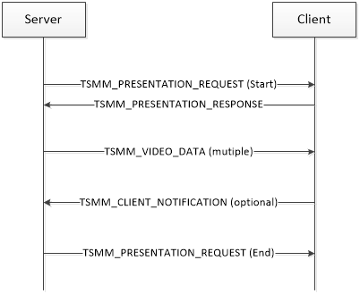
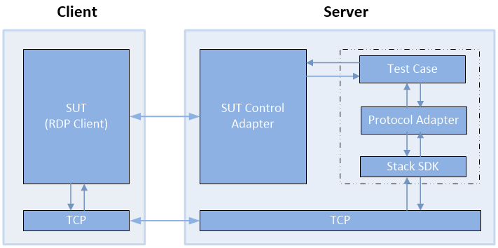
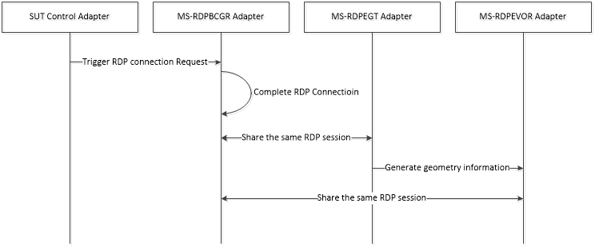

# RDP Client MS-RDPEVOR  Test Design Specification 

## Contents

* [Technical Document Analysis](#_Toc326664418)
    * [Technical Document Overview](#_Toc326664419)
    * [Relationship to Other Protocols](#_Toc326664420)
    * [Protocol Operations/Messages](#_Toc326664421)
    * [Protocol Properties](#_Toc326664422)
* [Test Method](#_Toc326664423)
    * [Assumptions, Scope and Constraints](#_Toc326664424)
    * [Test Approach](#_Toc326664425)
    * [Test Scenarios](#_Toc326664426)
		* [Video Streaming Test](#_Toc326664427)
* [Test Suite Design](#_Toc326664428)
    * [Test Suite Architecture](#_Toc326664429)
		* [System under Test (SUT)](#_Toc326664430)
		* [Test Suite Architecture](#_Toc326664431)
    * [Technical Dependencies/Considerations](#_Toc326664432)
		* [Dependencies](#_Toc326664433)
		* [Technical Difficulties](#_Toc326664434)
		* [Encryption Consideration](#_Toc326664435)
    * [Adapter Design](#_Toc326664436)
		* [Adapter Overview](#_Toc326664437)
		* [Technical Feasibility of Adapter Approach](#_Toc326664438)
		* [Adapter Abstract Level](#_Toc326664439)
		* [Adapter Inner Work](#_Toc326664440)
* [Test Cases Design](#_Toc326664441)
    * [Traditional Test Case Design](#_Toc326664442)
    * [Test Cases Description](#_Toc326664443)
		* [BVT Test Cases](#_Toc326664444)
		* [Non BVT Test Cases](#_Toc326664445)
* [Appendix](#_Toc326664446)
    * [Glossary (Optional)](#_Toc326664447)
    * [Reference](#_Toc326664448)

## <a name="_Toc326664418"/>Technical Document Analysis

### <a name="_Toc326664419"/>Technical Document Overview
 [MS-RDPEVOR] is an extension of [MS-RDPBCGR], which runs over a dynamic virtual channel, as specified in [MS-RDPEDYC]. The MS-RDPEVOR protocol is used to redirect certain rapidly changing graphics content as a video stream from the remote desktop host to the remote desktop client. This protocol specifies the communication between a remote desktop host and a remote desktop client.

### <a name="_Toc326664420"/>Relationship to Other Protocols 
[MS-RDPEVOR] is embedded in the dynamic virtual channel transport, as specified in [MS-RDPEDYC]. 

This protocol is concerned with transmitting the raw video stream from the server to the client.  Knowing where the content should be rendered is handled by the Remote Desktop Protocol: Geometry Tracking Virtual Channel Extension is specified in [MS-RDPEGT].

### <a name="_Toc326664421"/>Protocol Operations/Messages 
This protocol describes four messages as follows:

* TSMM\_PRESENTATION\_REQUEST: this message is sent from the server to the client to indicate that a video stream is either starting or stopping.

* TSMM\_PRESENTATION\_RESPONSE: this message is sent from the client to the server in response to a TSMM\_PRESENTATION\_REQUEST message with the Command field set to 0x01 (Start Presentation). 

* TSMM\_CLIENT\_NOTIFICATION: this message is sent from the client to the server to notify of certain events happening on the client.

* TSMM\_VIDEO\_DATA: this message contains a potentially fragmented video sample and sends from host to client.

The typical message flow of this protocol is described in following figure (Figure 1-1).

Figure 1-1: MS-RDPEVOR typical message flow

### <a name="_Toc326664422"/>Protocol Properties
* MS-RDPEVOR is a block protocol.

* MS-RDPEVOR is an extension of MS-RDPBCGR and all packets are transmitted in dynamic virtual channels which described in MS-RDPEDYC.

* MS-RDPEVOR is asynchronous because most of the messages don’t need any response. 

## <a name="_Toc326664423"/>Test Method

### <a name="_Toc326664424"/>Assumptions, Scope and Constraints
**Assumptions:**

None.

**Scope:**

In Scope:

The protocol client endpoint (RDP client), playing the client role, will be tested. For Windows, the Remote Desktop Client (MSTSC.exe) is the client endpoint.

Out of Scope:

The protocol server endpoint (RDP Server), playing the server role, is out of scope.

**Constraint:**

There is no constraint for this Test Suite.

### <a name="_Toc326664425"/>Test Approach
Because the MS-RDPEVOR client test code is merged into the MS-RDPBCGR test code, it applies the same test approach used for MS-RDPBCGR: traditional testing. 

For more details about the reason for choosing traditional testing, please refer to **[MS-RDPBCGR_ClientTestDesignSpecificaitoin.md]**
### <a name="_Toc326664426"/>Test Scenarios

* Only one scenario is defined for MS-RDPEVOR client testing.  

|  **Scenario**|  **Priority**|  **Test Approach**|  **Description**| 
| -------------| -------------| -------------| ------------- |
| Video Streaming Test| P0| Traditional| Use to verify all messages.| 

_Table 2-1 MS-RDPEVOR Test Suite Scenarios_

#### <a name="_Toc326664427"/>Video Streaming Test
**Preconditions:**

N/A.

**Typical Sequence:**

The typical scenario sequence is the following:

* RDP client and server establish the connection (described in MS-RDPBCGR).

* RDP server sends geometry mapping information to client (described in MS-RDPEGT).

* RDP server sends client a TSMM\_PRESENTATION_REQUEST to start a presentation.

* RDP client responds a TSMM\_PRESENTATION_RESPONSE.

* RDP server sends client multiple TSMM\_VIDEO_DATA messages which carry the raw video data.

* RDP client may send TSMM\_CLIENT_NOTIFICATION messages to server if certain events happen on client.

* RDP server sends TSMM\_PRESENTATION_REQUEST to stop the presentation.

**Scenario Testing:**

This scenario will test the following messages:

* TSMM\_PRESENTATION_REQUEST

* TSMM\_PRESENTATION_RESPONSE

* TSMM\_CLIENT_NOTIFICATION

* TSMM\_VIDEO_DATA

## <a name="_Toc326664428"/>Test Suite Design

### <a name="_Toc326664429"/>Test Suite Architecture

#### <a name="_Toc326664430"/>System under Test (SUT)
* From the third party point of view, the SUT is a component which implements MS-RDPEVOR.

* From the Windows implementation point of view, the SUT is the Remote Desktop Client (Mstsc.exe).

#### <a name="_Toc326664431"/>Test Suite Architecture
Figure 3-1 illustrates the architecture of the MS-RDPEVOR test suite for client endpoint testing.

 _Figure 3-1 MS-RDPEVOR Test Suite Architecture_
 
As shown in Figure 3-1, MS-RDPEVOR is using the synthetic server pattern to design the test suite architecture. MS-RDPEVOR Test Suite contains the following components:

* The SUT Control Adapter is used by the test case to trigger the client to send the request to the server.

* The synthetic server is the MS-RDPEVOR Test Case and Protocol Adapter.

* The Protocol Adapter invokes the protocol SDK (test suite library) to process the client messages and then sends the corresponding server response message to the client. Then the Protocol Adapter will use the protocol SDK to receive and parse the messages. Later the Protocol Adapter will send the parsed result to the relevant test case for further validation.

* The MS-RDPEVOR Test Suite uses TCP as the transport to communicate with SUT.

* The SUT for the MS-RDPEVOR Test Suite is the RDP Client.

The MS-RDPEVOR Test Case will verify the protocol client behaviors specified in MS-RDPEVOR.

### <a name="_Toc326664432"/>Technical Dependencies/Considerations

#### <a name="_Toc326664433"/>Dependencies
Transport: all messages are transmitted using TCP as transport in this test pass. UDP is not tested since it has not been documented.

#### <a name="_Toc326664434"/>Technical Difficulties 
None.

#### <a name="_Toc326664435"/>Encryption Consideration
None.

### <a name="_Toc326664436"/>Adapter Design

#### <a name="_Toc326664437"/>Adapter Overview
The MS-RDPEVOR Client test suite implements two adapters: the protocol adapter of MS-RDPEVOR and the protocol adapter of MS-RDPEGT. Meanwhile it uses the SUT control adapter and the protocol adapter of MS-RDPBCGR.

The protocol adapter of MS-RDPEVOR is used to receive messages from SUT and to send out the messages to the SUT. This adapter is built upon the Protocol Test Suite Library, so it is implemented with managed code. 

The protocol adapter of MS-RDPEGT is used to send geometry mapping information to the client. With this information, the client knows where to render the video content. This adapter is built upon the Protocol Test Suite Library, so it is implemented with managed code. 

For the details about the SUT control adapter and the protocol adapter of MS-RDPBCGR, please refer to **[MS-RDPBCGR_ClientTestDesignSpecificaitoin.md]**

#### <a name="_Toc326664438"/>Technical Feasibility of Adapter Approach
**Message Generation:**

Protocol Adapter Compiler (PAC) is not used because there is no available xml format document, so all message types are generated by hand. 

**Message Consumption:**

All the protocol messages are marshaled and unmarshaled by protocol adapter. 
Protocol Adapter depends on the MS-RDPEDYC test suite library to send and receive messages.

**SUT Control Adapter:**

The MS-RDPEVOR test suite reuses the SUT control adapter of MS-RDPBCGR. Please refer to section 3.3.3 of **[MS-RDPBCGR_ClientTestDesignSpecificaitoin.docx]** for the technical feasibility information of SUT control adapter.

#### <a name="_Toc326664439"/>Adapter Abstract Level
**Protocol Adapter of MS-RDPEGT**

This protocol adapter defines two interfaces; one of them is abstracted directly from the protocol message. The following one interface is not abstracted from protocol message directly:

* **AttachDVCClient:** used to attach a dynamic virtual channel manager which can send messages to the RDP client.

**Protocol Adapter of MS-RDPEVOR**

This protocol adapter defines eight interfaces; four of them are abstracted directly from the protocol messages. The following four interfaces are not abstracted from protocol messages directly:

* **AttachDvcClient**: used to attach a dynamic virtual channel manager which can send messages to and receive messages from RDP client.

* **ProtocolInitialize**: used to initiate this protocol by creating the control channel and data channel.

* **SendVideoSample**: used to send one video sample to the client which may be fragmented into multiple TSMM_VIDEO_DATA packets.

* **SetTestType**: use to switch the test type between positive and negative tests.

#### <a name="_Toc326664440"/>Adapter Inner Work
In total, four adapters are involved in MS-RDPEVOR client test suite. They are:

* Protocol adapter of MS-RDPBCGR

* Protocol adapter of MS-RDPEGT

* Protocol adapter of MS-RDPEVOR

* SUT control adapter

The SUT control adapter is used to trigger the client to initiate the connection to server and clean up the test environment.

Protocol adapter of MS-RDPBCGR is used to establish the RDP connection between server and client.

Protocol adapter of MS-RDPEGT is used to send geometry mapping information to client, so that client can know where to render the video content.

The protocol adapter for MS-RDPEVOR is used to send protocol messages to the client and receive protocol messages from client. It also contains the main functionality of message encoding, decoding, and verification.

The three protocol adapters share the same RDP session.

Figure 3-2 illustrates the inner work flow of these four adapters.

 _Figure 3-2 MS-RDPEVOR Adapter Inner Work_

## <a name="_Toc326664441"/>Test Cases Design

### <a name="_Toc326664442"/>Traditional Test Case Design
The Traditional test approach is used to design all test cases. The test cases are designed to cover all in-scope testable requirements, including both positive and negative requirements. 

The following table shows the number of test cases for each scenario. 

|  **Scenario**|  **Test Cases**|  **BVTs**|  **P0**|  **P1**|  **P2**| 
| -------------| -------------| -------------| -------------| -------------| ------------- |
| **Video Streaming Test**| 6| 3| 3| 3| 0| 

### <a name="_Toc326664443"/>Test Cases Description 
The test suite is a synthetic RDP server. In the following descriptions, all instances of the term “Test Suite” can be understood as the RDP server.

Common prerequisites for all test cases:

* The test suite has started the TCP listening server on the port which serves the RDP server.

* The SUT knows the IP address and port number on which test suite is listening.

Common cleanup requirements:

* Test Suite disconnects all RDP connections if any.

* Test Suite stops the TCP listening server.

* SUT deletes all data caches from previous RDP connection.   

The common prerequisites and clean requirements are not listed in any of the test cases. Only prerequisites and cleanup requirements unique to the test case are listed in the corresponding test case descriptions.

#### <a name="_Toc326664444"/>BVT Test Cases

|  **Video Streaming Test**| | 
| -------------| ------------- |
|  **Test ID**| Rdpevor_ProtocolSupportTest_Positive| 
|  **Priority**| P0| 
|  **Description** | This test case is used to test if MS-RDPEVOR is supported by SUT (RDP client).| 
|  **Prerequisites**| N/A| 
|  **Test Execution Steps**| Step 1: establish the RDP connection between server and client.| 
| | Step 2: try to create the control and data channels with client, if the creation fails, it indicates client doesn’t support this protocol, then fail this test case.| 
|  **Cleanup**| N/A| 

|  **Video Streaming Test**| | 
| -------------| ------------- |
|  **Test ID**| Rdpevor_VideoControlTest_Positive| 
|  **Priority**| P0| 
|  **Description** | This test case is used to test video control messages such as presentation request and response.| 
|  **Prerequisites**| N/A| 
|  **Test Execution Steps**| Step 1: establish the RDP connection between server and client.| 
| | Step 2: create the control and data channels with client.| 
| | Step 3: send client a MAPPED_GEOMETRY_PACKET to create a geometry mapping (described in MS-RDPEGT).| 
| | Step 4: Send client a TSMM_PRESENTATION_REQUEST to start a presentation.| 
| | Step 5: Expect a TSMM_PRESENTATION_RESPONSE from client and verify the message content.| 
| | Step 6: Send client a TSMM_PRESENTATION_REQUEST to stop the presentation.| 
|  **Cleanup**| N/A| 

|  **Video Streaming Test**| | 
| -------------| ------------- |
|  **Test ID**| Rdpevor_VideoStreamingTest_Positive| 
|  **Priority**| P0| 
|  **Description** | This test case is used to test video streaming, SUT (RDP client) is expected to decode and render the video.| 
|  **Prerequisites**| N/A| 
|  **Test Execution Steps**| Step 1: establish the RDP connection between server and client.| 
| | Step 2: create the control and data channels with client.| 
| | Step 3: send client a MAPPED_GEOMETRY_PACKET to create a geometry mapping (described in MS-RDPEGT).| 
| | Step 4: Send client a TSMM_PRESENTATION_REQUEST to start a presentation.| 
| | Step 5: Expect a TSMM_PRESENTATION_RESPONSE from client and verify the message content.| 
| | Step 6: Send multiple video samples to client. Client is expected to render this video content in certain position which indicates by the geometry information received in Step 3.| 
| | Step 7: Send client a TSMM_PRESENTATION_REQUEST to stop the presentation.| 
|  **Cleanup**| N/A| 

#### <a name="_Toc326664445"/>Non BVT Test Cases

|  **Video Streaming Test**| | 
| -------------| ------------- |
|  **Test ID**| Rdpevor_VideoControlTest_Negative_InvalidPacketLength| 
|  **Priority**| P1| 
|  **Description** | This test case is used to ensure RDP client drop the connection if the packet length of Presentation Request is invalid.| 
|  **Prerequisites**| N/A| 
|  **Test Execution Steps**| Step 1: establish the RDP connection between server and client.| 
| | Step 2: create the control and data channels with client.| 
| | Step 3: send client a MAPPED_GEOMETRY_PACKET to create a geometry mapping (described in MS-RDPEGT).| 
| | Step 4: Send client a TSMM_PRESENTATION_REQUEST to start a presentation, set the packet length to invalid value (less than actual).| 
| | Step 5: Expect client to terminate the connection.| 
|  **Cleanup**| N/A| 

|  **Video Streaming Test**| | 
| -------------| ------------- |
|  **Test ID**| Rdpevor_VideoStreamingTest_Negative_InvalidPacketLength| 
|  **Priority**| P1| 
|  **Description** | This test case is used to ensure RDP client drop the connection when the packet length of TSMM_VIDEO_DATA is invalid.| 
|  **Prerequisites**| N/A| 
|  **Test Execution Steps**| Step 1: establish the RDP connection between server and client.| 
| | Step 2: create the control and data channels with client.| 
| | Step 3: send client a MAPPED_GEOMETRY_PACKET to create a geometry mapping (described in MS-RDPEGT).| 
| | Step 4: Send client a TSMM_PRESENTATION_REQUEST to start a presentation.| 
| | Step 5: Expect a TSMM_PRESENTATION_RESPONSE from client and verify the message content.| 
| | Step 6:  Send a TSMM_VIDEO_DATA to client, set the packet length to invalid value (less than actual).| 
| | Step 7: Expect client to terminate the connection.| 
|  **Cleanup**| N/A| 

|  **Video Streaming Test**| | 
| -------------| ------------- |
|  **Test ID**| Rdpevor_VideoStreamingTest_Positive_OverUDPTransport| 
|  **Priority**| P1| 
|  **Description** | This test case is used to test video streaming over UDP transport, SUT (RDP client) is expected to decode and render the video.| 
|  **Prerequisites**| N/A| 
|  **Test Execution Steps**| Step 1: establish the RDP connection between server and client.| 
| | Step 2: establish RDP-UDP connection and establish reliable RDPEMT connection| 
| | Step 3: create the control and data channels with client over RDP-UDP.| 
| | Step 3: send client a MAPPED_GEOMETRY_PACKET to create a geometry mapping (described in MS-RDPEGT).| 
| | Step 4: Send client a TSMM_PRESENTATION_REQUEST over RDP-UDP to start a presentation.| 
| | Step 5: Expect a TSMM_PRESENTATION_RESPONSE from client and verify the message content.| 
| | Step 6: Send multiple video samples to client over RDP-UDP. Client is expected to render this video content in certain position which indicates by the geometry information received in Step 3.| 
| | Step 7: Send client a TSMM_PRESENTATION_REQUEST over RDP-UDP to stop the presentation.| 
|  **Cleanup**| N/A| 

## <a name="_Toc326664446"/>Appendix

### <a name="_Toc326664447"/>Glossary (Optional)
**SUT**: System under Test. In this spec, it indicates the MS-RDPEVOR client implementation.

**Test Suite**: The synthetic RDP server which is used to test against SUT.

### <a name="_Toc326664448"/>Reference

* Technical Document: **[MS-RDPEVOR].pdf**

