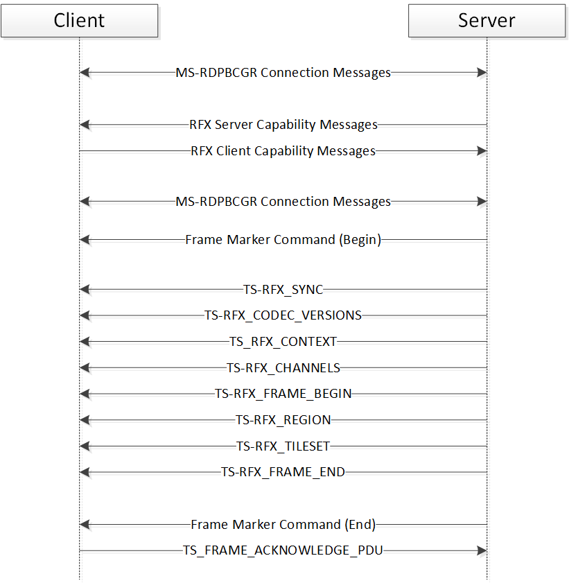

# RDP Client MS-RDPRFX Test Design Specification 

## Contents

* [Technical Document Analysis](#_Toc326663474)
    * [Technical Document Overview](#_Toc326663475)
    * [Relationship to Other Protocols](#_Toc326663476)
    * [Protocol Operations/Messages](#_Toc326663477)
    * [Protocol Properties](#_Toc326663478)
* [Test Method](#_Toc326663479)
    * [Assumptions, Scope and Constraints](#_Toc326663480)
    * [Test Approach](#_Toc326663481)
    * [Test Scenarios](#_Toc326663482)
		* [Exchange Capabilities](#_Toc326663483)
		* [Send Encode Header Messages](#_Toc326663484)
		* [Send Encode Data Messages in Image Mode](#_Toc326663485)
		* [Send Encode Data Messages in Video Mode](#_Toc326663486)
* [Test Suite Design](#_Toc326663487)
    * [Test Suite Architecture](#_Toc326663488)
		* [System under Test (SUT)](#_Toc326663489)
		* [Test Suite Architecture](#_Toc326663490)
    * [Technical Dependencies/Considerations](#_Toc326663491)
		* [Dependencies](#_Toc326663492)
		* [Technical Difficulties](#_Toc326663493)
		* [Encryption Consideration](#_Toc326663494)
    * [Adapter Design](#_Toc326663495)
		* [Adapter Overview](#_Toc326663496)
		* [Technical Feasibility of Adapter Approach](#_Toc326663497)
		* [Adapter Abstract Level](#_Toc326663498)
		* [Adapter Inner Work](#_Toc326663499)
* [Test Cases Design](#_Toc326663500)
    * [Traditional Test Case Design](#_Toc326663501)
    * [Test Cases Description](#_Toc326663502)
		* [BVT Test Cases](#_Toc326663503)
		* [Exchange Capabilities](#_Toc326663504)
		* [Send Encode Header Messages](#_Toc326663505)
		* [Send Encode Data Messages in Image Mode](#_Toc326663506)
		* [Send Encode Data Messages in Video Mode](#_Toc326663507)
* [Appendix](#_Toc326663508)
    * [Glossary (Optional)](#_Toc326663509)
    * [Reference](#_Toc326663510)

## <a name="_Toc326663474"/>Technical Document Analysis

### <a name="_Toc326663475"/>Technical Document Overview
The Remote Desktop Protocol: RemoteFX Codec Extension reduces the bandwidth associated with desktop remoting by efficiently compressing images. This is achieved by using the RemoteFX codec.

### <a name="_Toc326663476"/>Relationship to Other Protocols 
This protocol extends the Remote Desktop Protocol: Basic Connectivity and Graphics Remoting [MS-RDPBCGR] by adding advanced compression techniques.

### <a name="_Toc326663477"/>Protocol Operations/Messages 
This protocol describes 3 capability structures and 9 protocol messages which can be classified into 3 groups:

**Capabilities Messages:**

* TS\_RFX\_CLNT\_CAPS\_CONTAINER

* TS\_RFX\_SRVR\_CAPS\_CONTAINER

* TS\_FRAME\_ACKNOWLEDGE\_CAPABILITYSET

**Encode Messages:**

* TS\_RFX\_SYNC

* TS\_RFX\_CODEC\_VERSIONS

* TS\_RFX\_CHANNELS

* TS\_RFX\_CONTEXT

* TS\_RFX\_FRAME\_BEGIN

* TS\_RFX\_FRAME\_END

* TS\_RFX\_REGION

* TS\_RFX\_TILESET

**Control Messages**

* TS\_FRAME\_ACKNOWLEDGE\_PDU

The typical message flow of this protocol is described in following figure (Figure 1-1).

_Figure 1-1: MS-RDPRFX typical message flow_

### <a name="_Toc326663478"/>Protocol Properties
* RDPRFX is a block protocol.

* This protocol is an extension of RDPBCGR and all packets are tunneled within the RDP transport.

* The client-to-server data is always encrypted.

* RDPRFX specifies an algorithm to encode and decode images. 

* RDPRFX is designed to work in LAN environment. 

## <a name="_Toc326663479"/>Test Method

### <a name="_Toc326663480"/>Assumptions, Scope and Constraints
**Assumptions:**

None.

**Scope:**

* The protocol client endpoint (RDP client), playing the client role, will be tested. For Windows, the Remote Desktop Client (MSTSC.exe) is the client endpoint.

* The protocol Server endpoint (RDP Server), playing the server role, is out of scope.

* The validation of the client decode behaviors is out of scope, because it cannot be observed on the wire.

* For Windows, the System Under Test (SUT) will be client SKUs only.

**Constraint:**

None.

### <a name="_Toc326663481"/>Test Approach
Because the MS-RDPRFX client test code is merged into the MS-RDPBCGR test code, so it applies the same test approach of MS-RDPBCGR: traditional testing. 

For more details about the reason to choose traditional testing, please refer to **MS-RDPBCGR_ClientTestDesignSpecificaitoin.md**.

### <a name="_Toc326663482"/>Test Scenarios
There are four scenarios defined in the MS-RDPRFX client test suite for verifying the client behavior. 

|  **Scenario**|  **Priority**|  **Test Approach**|  **Description**| 
| -------------| -------------| -------------| ------------- |
| Exchange Capabilities| P0| Traditional| Use to exchange MS-RDPRFX capabilities.| 
| Send Encode Header Messages| P0| Traditional| Use to send encode header messages to the client.| 
| Send Encode Data Messages in Image Mode| P0| Traditional| Use to send encode data messages to the client in image mode.| 
| Send Encode Data Messages in Video Mode| P0| Traditional| Use to send encode data messages to client in video mode.| 

**Table 2-1 MS-RDPRFX Test Suite Scenarios**

#### <a name="_Toc326663483"/>Exchange Capabilities
**Preconditions:**

N/A.

** Typical Sequence:**

The typical scenario sequence is the following:

* The RDP client starts the connecting to RDP server.

* The RDP server and client exchange their capabilities in connection sequence.

* Complete the RDP connection.

**Scenario Testing:**

This scenario will test the following messages:

* Client Core Data in MCS Connect Initial PDU

* TS\_RFX\_CLNT\_CAPS\_CONTAINER

* TS\_FRAME\_ACKNOWLEDGE\_CAPABILITYSET

#### <a name="_Toc326663484"/>Send Encode Header Messages
**Preconditions:**

N/A.

**Typical Sequence:**

The typical scenario sequence is the following:

* The RDP client establishes the connection to RDP server.

* The RDP server sends client the encode header messages.

* The RDP client proceeds the encode header messages.

**Scenario Testing:**

This scenario will test the following messages:

* TS\_RFX\_SYNC

* TS\_RFX\_CODEC\_VERSIONS

* TS\_RFX\_CHANNELS

* TS\_RFX\_CONTEXT

#### <a name="_Toc326663485"/>Send Encode Data Messages in Image Mode
**Preconditions:**

N/A.

**Typical Sequence:**

The typical scenario sequence is the following:

* The RDP client establishes the connection to RDP server.

* The RDP server sends Frame Marker Command (begin) to client.

* The RDP server sends the encode header messages to client.

* The RDP server sends the one frame of encode data messages to client.

* The RDP server sends Frame Marker Command (end) to client.

* The RDP client responds a TS\_FRAME\_ACKNOWLEDGE\_PDU to server.

**Scenario Testing:**

This scenario will test the following messages:

* TS\_RFX\_FRAME\_BEGIN

* TS\_RFX\_FRAME\_END

* TS\_RFX\_REGION

* TS\_RFX\_TILESET

* TS\_FRAME\_ACKNOWLEDGE\_PDU

#### <a name="_Toc326663486"/>Send Encode Data Messages in Video Mode
**Preconditions:**

N/A.

**Typical Sequence:**

The typical scenario sequence is the following:

* The RDP client establishes the connection to RDP server.

* The RDP server sends Frame Marker Command (begin) to client.

* The RDP server sends the encode header messages to client.

* The RDP server sends the multiple frames of encode data messages to client.

* The RDP server sends Frame Marker Command (end) to client.

* The RDP client responds a TS\_FRAME\_ACKNOWLEDGE\_PDU to server.

**Scenario Testing:**

This scenario will test the following messages:

* TS\_RFX\_FRAME\_BEGIN

* TS\_RFX\_FRAME\_END

* TS\_RFX\_REGION

* TS\_RFX\_TILESET

* TS\_FRAME\_ACKNOWLEDGE\_PDU

## <a name="_Toc326663487"/>Test Suite Design

### <a name="_Toc326663488"/>Test Suite Architecture

#### <a name="_Toc326663489"/>System under Test (SUT)
* From the third party point of view, the SUT is a component that implements MS-RDPRFX.

* From the Windows implementation point of view, the SUT is the Remote Desktop Client (Mstsc.exe).

#### <a name="_Toc326663490"/>Test Suite Architecture
Figure 3-1 illustrates the architecture of the MS-RDPRFX test suite for client endpoint testing.

 _Figure 3-1 MS-RDPRFX Test Suite Architecture_
 
As shown in Figure 3-1, MS-RDPRFX is using the synthetic server pattern to design the test suite architecture. The MS-RDPRFX Test Suite contains the following components:

* The SUT Control Adapter is used by the test case to trigger the client to send the request to the server.

* The synthetic server is the MS-RDPRFX Test Case and the Protocol Adapter.

* The protocol adapter invokes the protocol test suite library to process the client messages and then sends the corresponding server response message to the client. Then the protocol adapter will use the protocol test suite library to receive and parse messages. Later the protocol adapter will send the parsed result to the relevant test case for further validation.

* The MS-RDPRFX test suite uses TCP as transport to communicate with SUT.

* The SUT for the MS-RDPRFX test suite is RDP Client.

The MS-RDPRFX test case will verify the protocol client behaviors specified in MS-RDPRFX.

### <a name="_Toc326663491"/>Technical Dependencies/Considerations

#### <a name="_Toc326663492"/>Dependencies
None.

#### <a name="_Toc326663493"/>Technical Difficulties 
None.

#### <a name="_Toc326663494"/>Encryption Consideration
None.

### <a name="_Toc326663495"/>Adapter Design

#### <a name="_Toc326663496"/>Adapter Overview
The MS-RDPRFX client test suite implements one adapter: the protocol adapter of MS-RDPRFX. Meanwhile it uses the SUT control adapter and the protocol adapter of MS-RDPBCGR.

The protocol adapter of MS-RDPRFX is used to receive messages from SUT and to send out messages to the SUT. This adapter is built upon the Protocol Test Suite Library, so it is implemented with managed code. 

For the details about the SUT control adapter and the protocol adapter of MS-RDPBCGR, please refer to **MS-RDPBCGR_ClientTestDesignSpecificaitoin.md**.

#### <a name="_Toc326663497"/>Technical Feasibility of Adapter Approach
**Protocol Adapter of MS-RDPRFX**

The protocol adapter can generate protocol messages which are sent to the SUT. 

The protocol adapter uses MS-RDPBCGR test suite library to encode the protocol messages and send it to the SUT.

The protocol adapter uses MS-RDPBCGR test suite library to parse the protocol messages which received from SUT.

The protocol adapter consumes the protocol messages which are received from SUT. 

#### <a name="_Toc326663498"/>Adapter Abstract Level
**Protocol Adapter**

Protocol adapter defines 16 interfaces. Nine of the interfaces are directly abstracted from protocol messages. The following seven interfaces are not abstracted from protocol messages directly:

* **Accept**: used to accept the context of an established RDP connection.

* **CheckIfClientSupports**: used to check RDP client if support the input encoding property.

* **FlushEncodedData**: used to flush all the pending encode messages.

* **ReceiveAndCheckClientCapabilities**: used to check client capabilities.

* **ReceiveAndCheckClientCoreData**: used to check Client Core Data.

* **SendImageToClient**: used to send client an image which encoded with RemoteFX algorithm.

* **SetTestType**: used to set the invalid type for negative testing.

#### <a name="_Toc326663499"/>Adapter Inner Work
None.

## <a name="_Toc326663500"/>Test Cases Design

### <a name="_Toc326663501"/>Traditional Test Case Design
The Traditional test approach is used to design all test cases. The test cases are designed to cover all in-scope testable requirements, including both positive and negative requirements. 

The following table shows the number of test cases for each scenario. 

|  **Scenario**|  **Test Cases**|  **BVTs**|  **P0**|  **P1**|  **P2**| 
| -------------| -------------| -------------| -------------| -------------| ------------- |
| Exchange Capabilities| 2| 2| 2| 0| 0| 
| Header Messages| 12| 1| 4| 6| 2| 
| Image Mode| 15| 2| 4| 10| 1| 
| Video Mode| 17| 2| 6| 11| 0| 

### <a name="_Toc326663502"/>Test Cases Description 
The test suite is a synthetic RDP server. In the following descriptions, all instances of the term “Test Suite” can be understood as the RDP server.

Common prerequisites for all test cases:

* The test suite has started the TCP listening server on the port which serves the RDP server.

* The SUT knows the IP address and the port number on which test suite is listening.

Common cleanup requirements:

* The test suite disconnects all RDP connections if any.

* The test suite stops the TCP listening.

* The SUT deletes all data caches from previous RDP connection.   

The common prerequisites and cleanup requirements are not listed in any of the test cases. Only prerequisites and cleanup requirements unique to the test case are listed in the corresponding test case descriptions.

#### <a name="_Toc326663503"/>BVT Test Cases

|  **Exchange Capabilities**| | 
| -------------| ------------- |
|  **Test ID**| Rdprfx_VerifyClientCoreData| 
|  **Priority**| P0| 
|  **Description** | Verify the connection type and color depth within Client Core Data.| 
|  **Prerequisites**| N/A| 
|  **Test Execution Steps**| Step 1: trigger SUT initial a connection request.| 
| | Step 2: complete the connection initialization phase.| 
| | Step 3: expect SUT send a MCS Connect Initial Request.| 
| | Step 4: verify the connection Type and color depth support of SUT.| 
|  **Cleanup**| N/A| 

|  **Exchange Capabilities**| | 
| -------------| ------------- |
|  **Test ID**| Rdprfx_VerifyClientCapabilities| 
|  **Priority**| P0| 
|  **Description** | Verify the client capabilities.| 
|  **Prerequisites**| N/A| 
|  **Test Execution Steps**| Step 1: trigger SUT initial a connection request.| 
| | Step 2: continue the connection until Capabilities Exchange phase.| 
| | Step 3: server sends Demand Active PDU to SUT.| 
| | Step 4: Expect SUT responds a Confirm Active PDU and verify this PDU.| 
|  **Cleanup**| N/A| 

|  **Send Encode Header Messages**| | 
| -------------| ------------- |
|  **Test ID**| Rdprfx\_HeaderMessage\_PositiveTest\_OrderTest\_VersionsChannelsContext| 
|  **Priority**| P0| 
|  **Description** | Verify the encode header messages can be sent in order of Sync - &#62;  Versions - &#62;  Channels - &#62;  Context.| 
|  **Prerequisites**| N/A| 
|  **Test Execution Steps**| Step 1: [RDPBCGR] establishing the connection.| 
| | Step 2: [RDPBCGR] send Frame Maker Command (Begin) to SUT.| 
| | Step 3: [RDPRFX] Send Encode Header Messages to SUT in order of TS\_RFX\_SYNC - &#62;  TS\_RFX\_CODECVERSIONS - &#62;  TS\_RFX\_CHANNELS - &#62;  TS\_RFX\_CONTEXT.| 
| | Step 4: [RDPRFX] Send one frame of Encode Data Messages to SUT.| 
| | Step 5: [RDPBCGR] send Frame Maker Command (End) to SUT.| 
| | Step 6: [RDPRFX] Expect SUT sends a TS\_FRAME\_ACKNOWLEDGE\_PDU.| 
|  **Cleanup**| N/A| 

|  **Send Encode Data Messages in Image Mode**| | 
| -------------| ------------- |
|  **Test ID**| Rdprfx\_ImageMode\_PositiveTest_RLGR1| 
|  **Priority**| P0| 
|  **Description** | Sending client an encoded bitmap data which encoded with RLGR1 algorithm.| 
|  **Prerequisites**| N/A| 
|  **Test Execution Steps**| Step 1: [RDPBCGR] establishing the connection.| 
| | Step 2: [RDPBCGR] send Frame Maker Command (Begin) to SUT.| 
| | Step 3: [RDPRFX] Send Encode Header Messages to SUT.| 
| | Step 4: [RDPRFX] Send one frame of Encode Data Messages (encoded with RLGR1) to SUT.| 
| | Step 5: [RDPBCGR] send Frame Maker Command (End) to SUT.| 
| | Step 6: [RDPRFX] Expect SUT sends a TS\_FRAME\_ACKNOWLEDGE_PDU.| 
| | Step 7: If the test suite is configured to verify image display, verify the graphic rendered on SUT | 
|  **Cleanup**| N/A| 

|  **Send Encode Data Messages in Image Mode**| | 
| -------------| ------------- |
|  **Test ID**| Rdprfx\_ImageMode\_PositiveTest_RLGR3| 
|  **Priority**| P0| 
|  **Description** | Sending client an encoded bitmap data which encoded with RLGR3 algorithm.| 
|  **Prerequisites**| N/A| 
|  **Test Execution Steps**| Step 1: [RDPBCGR] establishing the connection.| 
| | Step 2: [RDPBCGR] send Frame Maker Command (Begin) to SUT.| 
| | Step 3: [RDPRFX] Send Encode Header Messages to SUT.| 
| | Step 4: [RDPRFX] Send one frame of Encode Data Messages (encoded with RLGR3) to SUT.| 
| | Step 5: [RDPBCGR] send Frame Maker Command (End) to SUT.| 
| | Step 6: [RDPRFX] Expect SUT sends a TS\_FRAME\_ACKNOWLEDGE\_PDU.| 
| | Step 7: If the test suite is configured to verify image display, verify the graphic rendered on SUT| 
|  **Cleanup**| N/A| 

|  **Send Encode Data Messages in Video Mode**| | 
| -------------| ------------- |
|  **Test ID**| Rdprfx\_VideoMode\_PositiveTest_RLGR1| 
|  **Priority**| P0| 
|  **Description** | Sending client an encoded bitmap data which encoded with RLGR1 algorithm.| 
|  **Prerequisites**| N/A| 
|  **Test Execution Steps**| Step 1: [RDPBCGR] establishing the connection.|
||Step 2: [RDPBCGR] send Frame Maker Command (Begin) to SUT.|
||Step 3: [RDPRFX] Send Encode Header Messages to SUT.|
||Step 4: [RDPRFX] Send multiple frames of Encode Data Messages (encoded with RLGR1) to SUT.|
||Step 5: [RDPBCGR] send Frame Maker Command (End) to SUT.|
||Step 6: [RDPRFX] Expect SUT sends a TS\_FRAME\_ACKNOWLEDGE\_PDU.| 
| | Step 7: If the test suite is configured to verify image display, verify the graphic rendered on SUT| 
|  **Cleanup**| N/A| 

|  **Send Encode Data Messages in Video Mode**| | 
| -------------| ------------- |
|  **Test ID**| Rdprfx\_VideoMode\_PositiveTest_RLGR3| 
|  **Priority**| P0| 
|  **Description** | Sending client an encoded bitmap data which encoded with RLGR3 algorithm.| 
|  **Prerequisites**| N/A| 
|  **Test Execution Steps**| Step 1: [RDPBCGR] establishing the connection.|
||Step 2: [RDPBCGR] send Frame Maker Command (Begin) to SUT.|
||Step 3: [RDPRFX] Send Encode Header Messages to SUT.|
||Step 4: [RDPRFX] Send multiple frames of Encode Data Messages (encoded with RLGR3) to SUT.|
||Step 5: [RDPBCGR] send Frame Maker Command (End) to SUT.|
||Step 6: [RDPRFX] Expect SUT sends a TS\_FRAME\_ACKNOWLEDGE\_PDU.| 
| | Step 7: If the test suite is configured to verify image display, verify the graphic rendered on SUT| 
|  **Cleanup**| N/A| 

#### <a name="_Toc326663504"/>Exchange Capabilities
Please refer to “**BVT Test Cases**”.

#### <a name="_Toc326663505"/>Send Encode Header Messages

|  **Send Encode Header Messages**| | 
| -------------| ------------- |
|  **Test ID**| Rdprfx\_HeaderMessage\_PositiveTest\_OrderTest_ChannelsVersionsContext| 
|  **Priority**| P0| 
|  **Description** | Verify the encode header messages can be sent in order of Sync - &#62;  Channels - &#62;  Versions - &#62;  Context.| 
|  **Prerequisites**| N/A| 
|  **Test Execution Steps**| Step 1: [RDPBCGR] establishing the connection.|
||Step 2: [RDPBCGR] send Frame Maker Command (Begin) to SUT.|
||Step 3: [RDPRFX] Send Encode Header Messages to SUT in order of TS\_RFX\_SYNC - &#62;  TS\_RFX\_CHANNELS - &#62;  TS\_RFX\_CODECVERSIONS - &#62;  TS\_RFX\_CONTEXT.|
||Step 4: [RDPRFX] Send one frame of Encode Data Messages to SUT.|
||Step 5: [RDPBCGR] send Frame Maker Command (End) to SUT.Step 6: [RDPRFX] Expect SUT sends a TS\_FRAME\_ACKNOWLEDGE\_PDU.| 
|  **Cleanup**| N/A| 

|  **Send Encode Header Messages**| | 
| -------------| ------------- |
|  **Test ID**| Rdprfx\_HeaderMessage\_PositiveTest\_OrderTest_ContextVersionsChannels| 
|  **Priority**| P0| 
|  **Description** | Verify the encode header messages can be sent in order of Sync - &#62;  Context - &#62;  Versions - &#62;  Channels.| 
|  **Prerequisites**| N/A| 
|  **Test Execution Steps**| Step 1: [RDPBCGR] establishing the connection.|
||Step 2: [RDPBCGR] send Frame Maker Command (Begin) to SUT.
||Step 3: [RDPRFX] Send Encode Header Messages to SUT in order of TS\_RFX\_SYNC - &#62;  TS\_RFX\_CONTEXT - &#62;  TS\_RFX\_CODECVERSIONS - &#62;  TS\_RFX\_CHANNELS.|
||Step 4: [RDPRFX] Send one frame of Encode Data Messages to SUT.|
||Step 5: [RDPBCGR] send Frame Maker Command (End) to SUT.Step 6: [RDPRFX] Expect SUT sends a TS\_FRAME\_ACKNOWLEDGE\_PDU.| 
|  **Cleanup**| N/A| 

|  **Send Encode Header Messages**| | 
| -------------| ------------- |
|  **Test ID**| Rdprfx\_HeaderMessage\_PositiveTest\_OrderTest_VersionsContextChannels| 
|  **Priority**| P0| 
|  **Description** | Verify the encode header messages can be sent in order of Sync - &#62;  Versions - &#62;  Context - &#62;  Channels.| 
|  **Prerequisites**| N/A| 
|  **Test Execution Steps**| Step 1: [RDPBCGR] establishing the connection.Step 2: [RDPBCGR] send Frame Maker Command (Begin) to SUT.Step 3: [RDPRFX] Send Encode Header Messages to SUT in order of TS\_RFX\_SYNC - &#62;  TS_RFX_VERSIONS - &#62;  TS\_RFX\_CONTEXT - &#62;  TS\_RFX\_CHANNELS.Step 4: [RDPRFX] Send one frame of Encode Data Messages to SUT.Step 5: [RDPBCGR] send Frame Maker Command (End) to SUT.Step 6: [RDPRFX] Expect SUT sends a TS\_FRAME\_ACKNOWLEDGE\_PDU.| 
|  **Cleanup**| N/A| 

|  **Send Encode Header Messages**| | 
| -------------| ------------- |
|  **Test ID**| Rdprfx\_HeaderMessage\_NegativeTest\_TsRfxSync\_InvalidBlockLen| 
|  **Priority**| P1| 
|  **Description** | Ensure client terminate the RDP connection when received a TS\_RFX\_SYNC message with the blockLen field set to an invalid value.| 
|  **Prerequisites**| N/A| 
|  **Test Execution Steps**| Step 1: [RDPBCGR] establish the RDP connection.Step |
||2: [RDPRFX] send one frame of Encode Header and Data Messages to SUT, and set the blockLen field of TS\_RFX\_SYNC to an invalid value (less than actual).Step |
||3: [RDPRFX] expect SUT terminate the RDP connection.| 
|  **Cleanup**| N/A| 

|  **Send Encode Header Messages**| | 
| -------------| ------------- |
|  **Test ID**| Rdprfx\_HeaderMessage\_NegativeTest_UnspecifiedMessage| 
|  **Priority**| P1| 
|  **Description** | Ensure client terminate the RDP connection when received an unspecified type of message.| 
|  **Prerequisites**| N/A| 
|  **Test Execution Steps**| Step 1: [RDPBCGR] establish the RDP connection.|
||Step 2: [RDPRFX] send one unspecified message to client.|
||Step 3: [RDPRFX] expect SUT terminate the RDP connection.| 
|  **Cleanup**| N/A| 

|  **Send Encode Header Messages**| | 
| -------------| ------------- |
|  **Test ID**| Rdprfx\_MUST\_NegativeTest_TsRfxSync| 
|  **Priority**| P2| 
|  **Description** | Ensure client terminate the RDP connection when received a TS\_RFX\_SYNC message with:| 
| | The magic field set to an invalid value (other than 0xCACCACCA).| 
| | The version field set to an invalid value.| 
|  **Prerequisites**| N/A| 
|  **Test Execution Steps**| Step 1: [RDPBCGR] establish the RDP connection.| 
| | Step 2: [RDPRFX] send one frame of Encode Header and Data Messages to SUT, and set the magic field of TS\_RFX\_SYNC to an invalid value.| 
| | Step 3: [RDPRFX] expect SUT terminate the RDP connection.| 
| | Step 4: [RDPBCGR] establish the RDP connection.| 
| | Step 5: [RDPRFX] send one frame of Encode Header and Data Messages to SUT, and set the version field of TS\_RFX\_SYNC to an invalid value.| 
| | Step 6: [RDPRFX] expect SUT terminate the RDP connection.| 
|  **Cleanup**| N/A| 

|  **Send Encode Header Messages**| | 
| -------------| ------------- |
|  **Test ID**| Rdprfx\_MUST\_NegativeTest_TsRfxChannels| 
|  **Priority**| P2| 
|  **Description** | Ensure client terminate the RDP connection when received a  TS\_RFX\_CHANNELS message with:| 
| | An invalid channel Id.| 
|  **Prerequisites**| N/A| 
|  **Test Execution Steps**| Step 1: [RDPBCGR] establish the RDP connection.| 
| | Step 2: [RDPRFX] send one frame of Encode Header and Data Messages to SUT, and set an invalid channelId  to TS_RFX_CHANNELT structure in TS\_RFX\_CHANNELS| 
| | Step 3: [RDPRFX] expect SUT terminate the RDP connection.| 
|  **Cleanup**| N/A| 

|  **Send Encode Header Messages**| | 
| -------------| ------------- |
|  **Test ID**| Rdprfx\_MUST\_NegativeTest_TsRfxCodecChannelT| 
|  **Priority**| P2| 
|  **Description** | Ensure client terminate the RDP connection when received a   TS\_RFX\_FRAME\_BEGIN and its  TS\_RFX\_CODEC\_CHANNELT structure:| 
| | has an invalid codecId| 
| | has an invalid channelId| 
|  **Prerequisites**| N/A| 
|  **Test Execution Steps**| Step 1: [RDPBCGR] establish the RDP connection.| 
| | Step 2: [RDPRFX] send one frame of Encode Header and Data Messages to SUT, and set the codecId field of TS\_RFX\_CODEC\_CHANNELT in TS\_RFX\_FRAME\_BEGIN to an invalid value.| 
| | Step 3: [RDPRFX] expect SUT terminate the RDP connection.| 
| | Step 4: [RDPBCGR] establish the RDP connection.| 
| | Step 5: [RDPRFX] send one frame of Encode Header and Data Messages to SUT, and set the channelId field of TS\_RFX\_CODEC\_CHANNELT in TS\_RFX\_FRAME\_BEGIN to an invalid value.| 
| | Step 6: [RDPRFX] expect SUT terminate the RDP connection.| 
|  **Cleanup**| N/A| 

|  **Send Encode Header Messages**| | 
| -------------| ------------- |
|  **Test ID**| Rdprfx_HeaderMessage\_PositiveTest\_ChannelBoundaryTest_1x1Channel| 
|  **Priority**| P1| 
|  **Description** | Verify the client can support the smallest channel 1x1.| 
|  **Prerequisites**| N/A| 
|  **Test Execution Steps**| Step 1: [RDPBCGR] establishing the connection.| 
| | Step 2: [RDPBCGR] send Frame Maker Command (Begin) to SUT.| 
| | Step 3: [RDPRFX] Send the smallest channel 1x1 to SUT.| 
| | Step 4: [RDPRFX] Send one frame of Encode Data Messages to SUT.| 
| | Step 5: [RDPBCGR] send Frame Maker Command (End) to SUT.| 
| | Step 6: [RDPRFX] Expect SUT sends a TS\_FRAME\_ACKNOWLEDGE\_PDU.| 
|  **Cleanup**| N/A| 

|  **Send Encode Header Messages**| | 
| -------------| ------------- |
|  **Test ID**| Rdprfx_HeaderMessage\_PositiveTest\_ChannelBoundaryTest_2x2Channel| 
|  **Priority**| P1| 
|  **Description** | Verify the client can support the channel 2x2.| 
|  **Prerequisites**| N/A| 
|  **Test Execution Steps**| Step 1: [RDPBCGR] establishing the connection.| 
| | Step 2: [RDPBCGR] send Frame Maker Command (Begin) to SUT.| 
| | Step 3: [RDPRFX] Send the channel 2x2 to SUT.| 
| | Step 4: [RDPRFX] Send one frame of Encode Data Messages to SUT.| 
| | Step 5: [RDPBCGR] send Frame Maker Command (End) to SUT.| 
| | Step 6: [RDPRFX] Expect SUT sends a TS\_FRAME\_ACKNOWLEDGE\_PDU.| 
|  **Cleanup**| N/A| 

|  **Send Encode Header Messages**| | 
| -------------| ------------- |
|  **Test ID**| Rdprfx_HeaderMessage\_PositiveTest\_ChannelBoundaryTest_4096x2048Channel| 
|  **Priority**| P1| 
|  **Description** | Verify the client can support the largest channel 4096x2048.| 
|  **Prerequisites**| N/A| 
|  **Test Execution Steps**| Step 1: [RDPBCGR] establishing the connection.| 
| | Step 2: [RDPBCGR] send Frame Maker Command (Begin) to SUT.| 
| | Step 3: [RDPRFX] Send the largest channel 4096x2048 to SUT.| 
| | Step 4: [RDPRFX] Send one frame of Encode Data Messages to SUT.| 
| | Step 5: [RDPBCGR] send Frame Maker Command (End) to SUT.| 
| | Step 6: [RDPRFX] Expect SUT sends a TS\_FRAME\_ACKNOWLEDGE\_PDU.| 
|  **Cleanup**| N/A| 

|  **Send Encode Header Messages**| | 
| -------------| ------------- |
|  **Test ID**| Rdprfx_HeaderMessage\_PositiveTest\_ChannelBoundaryTest_4095x2047Channel| 
|  **Priority**| P1| 
|  **Description** | Verify the client can support the smallest channel 4095x2047.| 
|  **Prerequisites**| N/A| 
|  **Test Execution Steps**| Step 1: [RDPBCGR] establishing the connection.| 
| | Step 2: [RDPBCGR] send Frame Maker Command (Begin) to SUT.| 
| | Step 3: [RDPRFX] Send the channel 4095x2047 to SUT.| 
| | Step 4: [RDPRFX] Send one frame of Encode Data Messages to SUT.| 
| | Step 5: [RDPBCGR] send Frame Maker Command (End) to SUT.| 
| | Step 6: [RDPRFX] Expect SUT sends a TS\_FRAME\_ACKNOWLEDGE\_PDU.| 
|  **Cleanup**| N/A| 

#### <a name="_Toc326663506"/>Send Encode Data Messages in Image Mode

|  **Send Encode Data Messages in Image Mode**| | 
| -------------| ------------- |
|  **Test ID**| Rdprfx\_ImageMode\_PositiveTest_ClippedByRegion| 
|  **Priority**| P0| 
|  **Description** | Verify the client can decode a RemoteFX encoded bitmap and render correctly when the bitmap should be clipped by rectangular in TS\_RFX\_REGION.| 
|  **Prerequisites**| N/A| 
|  **Test Execution Steps**| Step 1: [RDPBCGR] establishing the connection.| 
| | Step 2: [RDPBCGR] send Frame Maker Command (Begin) to SUT.| 
| | Step 3: [RDPRFX] Send Encode Header Messages to SUT.| 
| | Step 4: [RDPRFX] Send one frame of Encode Data Messages (the TS\_RFX\_REGION structure contains rectangular which will clip the encoded bitmap) to SUT.| 
| | Step 5: [RDPBCGR] send Frame Maker Command (End) to SUT.| 
| | Step 6: [RDPRFX] Expect SUT sends a TS\_FRAME\_ACKNOWLEDGE\_PDU.| 
| | Step 7: If the test suite is configured to verify image display, verify the graphic rendered on SUT | 
|  **Cleanup**| N/A| 

|  **Send Encode Data Messages in Image Mode**| | 
| -------------| ------------- |
|  **Test ID**| Rdprfx\_ImageMode\_PositiveTest_MultiQuantVals| 
|  **Priority**| P0| 
|  **Description** | Verify the client can decode a RemoteFX encoded bitmap successfully when each component use different quantization value.| 
|  **Prerequisites**| N/A| 
|  **Test Execution Steps**| Step 1: [RDPBCGR] establishing the connection.| 
| | Step 2: [RDPBCGR] send Frame Maker Command (Begin) to SUT.| 
| | Step 3: [RDPRFX] Send Encode Header Messages to SUT.| 
| | Step 4: [RDPRFX] Send one frame of Encode Data Messages (encoded with RLGR1) to SUT, each component use different quantization value.| 
| | Step 5: [RDPBCGR] send Frame Maker Command (End) to SUT.| 
| | Step 6: [RDPRFX] Expect SUT sends a TS\_FRAME\_ACKNOWLEDGE\_PDU.| 
| | Step 7: If the test suite is configured to verify image display, verify the graphic rendered on SUT | 
|  **Cleanup**| N/A| 

|  **Send Encode Data Messages in Image Mode**| | 
| -------------| ------------- |
|  **Test ID**| Rdprfx\_ImageMode\_NegativeTest\_TsRfxFrameBegin_InvalidBlockLen| 
|  **Priority**| P1| 
|  **Description** | Ensure client terminate the RDP connection when received a TS\_RFX\_FRAME\_BEGIN with the blockLen field set to an invalid value.| 
|  **Prerequisites**| N/A| 
|  **Test Execution Steps**| Step 1: [RDPBCGR] establishing the connection.|
||Step 2: [RDPRFX] send one frame of Encode Header and Data Messages to client, set the blockLen field of TS\_RFX\_FRAME\_BEGIN to an invalid value (less than actual).|
||Step 3: [RDPRFX] expect client terminate the RDP connection.| 
|  **Cleanup**| N/A| 

|  **Send Encode Data Messages in Image Mode**| | 
| -------------| ------------- |
|  **Test ID**| Rdprfx\_ImageMode\_NegtiveTest_DuplicatedTile| 
|  **Priority**| P2| 
|  **Description** | Verify the client can handle a duplicated tile correctly.| 
|  **Prerequisites**| N/A| 
|  **Test Execution Steps**| Step 1: [RDPBCGR] establishing the connection.| 
| | Step 2: [RDPBCGR] send Frame Maker Command (Begin) to SUT.| 
| | Step 3: [RDPRFX] Send Encode Header Messages to SUT.| 
| | Step 4: [RDPRFX] Send one frame of Encode Data Messages (encoded with RLGR1) to SUT, the TS\_RFX\_REGION structure contains rectangular which contains a duplicated tile.| 
| | Step 5: [RDPRFX] Expect client terminate the RDP connection.| 
|  **Cleanup**| N/A| 

|  **Send Encode Data Messages in Image Mode**| | 
| -------------| ------------- |
|  **Test ID**| Rdprfx\_ImageMode\_PositiveTest_FourTilesComposeOneRectWithoutCommonBoundary| 
|  **Priority**| P1| 
|  **Description** | Verify the client can decode a RemoteFX encoded bitmap and render correctly when one rectangular is composed by four tiles in the corner in TS\_RFX\_REGION.| 
|  **Prerequisites**| N/A| 
|  **Test Execution Steps**| Step 1: [RDPBCGR] establishing the connection.| 
| | Step 2: [RDPBCGR] send Frame Maker Command (Begin) to SUT.| 
| | Step 3: [RDPRFX] Send Encode Header Messages to SUT.| 
| | Step 4: [RDPRFX] Send one frame of Encode Data Messages (encoded with RLGR1) to SUT, the TS\_RFX\_REGION structure contains rectangular which is composed by four tiles.| 
| | Step 5: [RDPBCGR] send Frame Maker Command (End) to SUT.| 
| | Step 6: [RDPRFX] Expect SUT sends a TS\_FRAME\_ACKNOWLEDGE\_PDU.| 
|  **Cleanup**| N/A| 

|  **Send Encode Data Messages in Image Mode**| | 
| -------------| ------------- |
|  **Test ID**| Rdprfx\_ImageMode\_PositiveTest_FourTilesComposeOneRectWithCommonBoundary| 
|  **Priority**| P1| 
|  **Description** | Verify the client can decode a RemoteFX encoded bitmap and render correctly when one rectangular is composed by four tiles in the corner in TS\_RFX\_REGION.| 
|  **Prerequisites**| N/A| 
|  **Test Execution Steps**| Step 1: [RDPBCGR] establishing the connection.| 
| | Step 2: [RDPBCGR] send Frame Maker Command (Begin) to SUT.| 
| | Step 3: [RDPRFX] Send Encode Header Messages to SUT.| 
| | Step 4: [RDPRFX] Send one frame of Encode Data Messages (encoded with RLGR1) to SUT, the TS\_RFX\_REGION structure contains rectangular which is composed by four tiles.| 
| | Step 5: [RDPBCGR] send Frame Maker Command (End) to SUT.| 
| | Step 6: [RDPRFX] Expect SUT sends a TS\_FRAME\_ACKNOWLEDGE\_PDU.| 
|  **Cleanup**| N/A| 

|  **Send Encode Data Messages in Image Mode**| | 
| -------------| ------------- |
|  **Test ID**| Rdprfx\_ImageMode\_PositiveTest_ListOfRects| 
|  **Priority**| P1| 
|  **Description** | Verify the client can decode a RemoteFX encoded bitmap and render correctly when send a list of rectangle.| 
|  **Prerequisites**| N/A| 
|  **Test Execution Steps**| Step 1: [RDPBCGR] establishing the connection.| 
| | Step 2: [RDPBCGR] send Frame Maker Command (Begin) to SUT.| 
| | Step 3: [RDPRFX] Send Encode Header Messages to SUT.| 
| | Step 4: [RDPRFX] Send one frame of Encode Data Messages (encoded with RLGR1) to SUT, the TS\_RFX\_REGION structure contains a list of rectangles.| 
| | Step 5: [RDPBCGR] send Frame Maker Command (End) to SUT.| 
| | Step 6: [RDPRFX] Expect SUT sends a TS\_FRAME\_ACKNOWLEDGE\_PDU.| 
|  **Cleanup**| N/A| 

|  **Send Encode Data Messages in Image Mode**| | 
| -------------| ------------- |
|  **Test ID**| Rdprfx\_ImageMode\_PositiveTest_ListOfRectsOverlap| 
|  **Priority**| P1| 
|  **Description** | Verify the client can decode a RemoteFX encoded bitmap and render correctly when send a list of rectangle with overlapping.| 
|  **Prerequisites**| N/A| 
|  **Test Execution Steps**| Step 1: [RDPBCGR] establishing the connection.| 
| | Step 2: [RDPBCGR] send Frame Maker Command (Begin) to SUT.| 
| | Step 3: [RDPRFX] Send Encode Header Messages to SUT.| 
| | Step 4: [RDPRFX] Send one frame of Encode Data Messages (encoded with RLGR1) to SUT, the TS\_RFX\_REGION structure contains a list of rectangular which overlap with each other.| 
| | Step 5: [RDPBCGR] send Frame Maker Command (End) to SUT.| 
| | Step 6: [RDPRFX] Expect SUT sends a TS\_FRAME\_ACKNOWLEDGE\_PDU.| 
|  **Cleanup**| N/A| 

|  **Send Encode Data Messages in Image Mode**| | 
| -------------| ------------- |
|  **Test ID**| Rdprfx\_ImageMode\_PositiveTest_ListOfRectsOverlapWithDuplicateTiles| 
|  **Priority**| P1| 
|  **Description** | Verify the client can decode a RemoteFX encoded bitmap and render correctly when send a list of rectangle with overlapping and duplicated tile.| 
|  **Prerequisites**| N/A| 
|  **Test Execution Steps**| Step 1: [RDPBCGR] establishing the connection.| 
| | Step 2: [RDPBCGR] send Frame Maker Command (Begin) to SUT.| 
| | Step 3: [RDPRFX] Send Encode Header Messages to SUT.| 
| | Step 4: [RDPRFX] Send one frame of Encode Data Messages (encoded with RLGR1) to SUT, the TS\_RFX\_REGION structure contains a list of rectangular which overlap with each other and contains a duplicated tile.| 
| | Step 5: [RDPBCGR] send Frame Maker Command (End) to SUT.| 
| | Step 6: [RDPRFX] Expect SUT sends a TS\_FRAME\_ACKNOWLEDGE\_PDU.| 
|  **Cleanup**| N/A| 

|  **Send Encode Data Messages in Image Mode**| | 
| -------------| ------------- |
|  **Test ID**| Rdprfx\_ImageMode\_PositiveTest_numRectsSetToZero| 
|  **Priority**| P1| 
|  **Description** | Verify the client can decode a RemoteFX encoded bitmap and render correctly when the numRects field of TS\_RFX\_REGION is set to zero.| 
|  **Prerequisites**| N/A| 
|  **Test Execution Steps**| Step 1: [RDPBCGR] establishing the connection.| 
| | Step 2: [RDPBCGR] send Frame Maker Command (Begin) to SUT.| 
| | Step 3: [RDPRFX] Send Encode Header Messages to SUT.| 
| | Step 4: [RDPRFX] Send one frame of Encode Data Messages (encoded with RLGR1) to SUT, the TS\_RFX\_REGION structure contains numRects field of TS\_RFX\_REGION which is set to zero.| 
| | Step 5: [RDPBCGR] send Frame Maker Command (End) to SUT.| 
| | Step 6: [RDPRFX] Expect SUT sends a TS\_FRAME\_ACKNOWLEDGE\_PDU.| 
|  **Cleanup**| N/A| 

|  **Send Encode Data Messages in Image Mode**| | 
| -------------| ------------- |
|  **Test ID**| Rdprfx\_ImageMode\_PositiveTest_OutOfRects| 
|  **Priority**| P1| 
|  **Description** | Verify the client can decode a RemoteFX encoded bitmap and render correctly when some tiles are out of the rectangle in TS\_RFX\_REGION.| 
|  **Prerequisites**| N/A| 
|  **Test Execution Steps**| Step 1: [RDPBCGR] establishing the connection.| 
| | Step 2: [RDPBCGR] send Frame Maker Command (Begin) to SUT.| 
| | Step 3: [RDPRFX] Send Encode Header Messages to SUT.| 
| | Step 4: [RDPRFX] Send one frame of Encode Data Messages (encoded with RLGR1) to SUT, when some tiles are out of the rectangle in TS\_RFX\_REGION.| 
| | Step 5: [RDPBCGR] send Frame Maker Command (End) to SUT.| 
| | Step 6: [RDPRFX] Expect SUT sends a TS\_FRAME\_ACKNOWLEDGE\_PDU.| 
|  **Cleanup**| N/A| 

|  **Send Encode Data Messages in Image Mode**| | 
| -------------| ------------- |
|  **Test ID**| Rdprfx\_PositiveTest\_ImageWithoutEncoding| 
|  **Priority**| P1| 
|  **Description** | Verify the client can deal with the images without encoding.| 
|  **Prerequisites**| N/A| 
|  **Test Execution Steps**| Step 1: [RDPBCGR] establishing the connection.| 
| | Step 2: [RDPBCGR] send Frame Maker Command (Begin) to SUT.| 
| | Step 3: [RDPRFX] Send Encode Header Messages to SUT.| 
| | Step 4: [RDPRFX] Send one frame of Data Messages (not encoded) to SUT, the client should handle the unencoded image.| 
| | Step 5: [RDPBCGR] send Frame Maker Command (End) to SUT.| 
| | Step 6: [RDPRFX] Expect SUT sends a TS\_FRAME\_ACKNOWLEDGE\_PDU.| 
|  **Cleanup**| N/A| 

#### <a name="_Toc326663507"/>Send Encode Data Messages in Video Mode

|  **Send Encode Data Messages in Video Mode**| | 
| -------------| ------------- |
|  **Test ID**| Rdprfx\_VideoMode\_PositiveTest\_SendTsRfxSyncInStream| 
|  **Priority**| P0| 
|  **Description** | Send a TS\_RFX\_SYNC message among frames of the video mode stream.| 
|  **Prerequisites**| N/A| 
|  **Test Execution Steps**| Step 1: [RDPBCGR] establishing the connection.|
||Step 2: [RDPBCGR] send Frame Maker Command (Begin) to SUT.|
||Step 3: [RDPRFX] set operation mode to video mode, send one pair of Encode Header Messages to client.|
||Step 4: [RDPRFX] send one frame of Encode Data Messages to client.|
||Step 5: [RDPRFX] send a TS\_RFX\_SYNC message to client.|
||Step 6: [RDPRFX] send another frame of Encode Data Messages to client.|
||Step 7: [RDPBCGR] send Frame Maker Command (End) to SUT.|
||Step 8: [RDPRFX] Expect SUT sends a TS\_FRAME\_ACKNOWLEDGE\_PDU.| 
|  **Cleanup**| N/A| 

|  **Send Encode Data Messages in Video Mode**| | 
| -------------| ------------- |
|  **Test ID**| Rdprfx\_VideoMode\_PositiveTest\_SendTsRfxCodecVersioinsInStream| 
|  **Priority**| P0| 
|  **Description** | Send a TS\_RFX\_CODEC\_VERSIONS message among frames of the video mode stream.| 
|  **Prerequisites**| N/A| 
|  **Test Execution Steps**| Step 1: [RDPBCGR] establishing the connection.|
||Step 2: [RDPBCGR] send Frame Maker Command (Begin) to SUT.|
||Step 3: [RDPRFX] set operation mode to video mode, send one pair of Encode Header Messages to client.|
||Step 4: [RDPRFX] send one frame of Encode Data Messages to client.|
||Step 5: [RDPRFX] send a TS\_RFX\_CODEC\_VERSIONS message to client.|
||Step 6: [RDPRFX] send another frame of Encode Data Messages to client.|
||Step 7: [RDPBCGR] send Frame Maker Command (End) to SUT.|
||Step 8: [RDPRFX] Expect SUT sends a TS\_FRAME\_ACKNOWLEDGE\_PDU.| 
|  **Cleanup**| N/A| 

|  **Send Encode Data Messages in Video Mode**| | 
| -------------| ------------- |
|  **Test ID**| Rdprfx\_VideoMode\_PositiveTest\_SendTsRfxChannelsInStream| 
|  **Priority**| P0| 
|  **Description** | Send a TS\_RFX\_CHANNELS message among frames of the video mode stream.| 
|  **Prerequisites**| N/A| 
|  **Test Execution Steps**| Step 1: [RDPBCGR] establishing the connection.|
||Step 2: [RDPBCGR] send Frame Maker Command (Begin) to SUT.|
||Step 3: [RDPRFX] set operation mode to video mode, send one pair of Encode Header Messages to client.|
||Step 4: [RDPRFX] send one frame of Encode Data Messages to client.|
||Step 5: [RDPRFX] send a TS\_RFX\_CHANNELS message to client.|
||Step 6: [RDPRFX] send another frame of Encode Data Messages to client.|
||Step 7: [RDPBCGR] send Frame Maker Command (End) to SUT.|
||Step 8: [RDPRFX] Expect SUT sends a TS\_FRAME\_ACKNOWLEDGE\_PDU.| 
|  **Cleanup**| N/A| 

|  **Send Encode Data Messages in Video Mode**| | 
| -------------| ------------- |
|  **Test ID**| Rdprfx\_VideoMode\_PositiveTest\_SendTsRfxContextInStream| 
|  **Priority**| P0| 
|  **Description** | Send a TS\_RFX\_CONTEXT message among frames of the video mode stream.| 
|  **Prerequisites**| N/A| 
|  **Test Execution Steps**| Step 1: [RDPBCGR] establishing the connection.|
||Step 2: [RDPBCGR] send Frame Maker Command (Begin) to SUT.|
||Step 3: [RDPRFX] set operation mode to video mode, send one pair of Encode Header Messages to client.|
||Step 4: [RDPRFX] send one frame of Encode Data Messages to client.|
||Step 5: [RDPRFX] send a TS\_RFX\_CONTEXT message to client.|
||Step 6: [RDPRFX] send another frame of Encode Data Messages to client.|
||Step 7: [RDPBCGR] send Frame Maker Command (End) to SUT.|
||Step 8: [RDPRFX] Expect SUT sends a TS\_FRAME\_ACKNOWLEDGE\_PDU.| 
|  **Cleanup**| N/A| 

|  **Send Encode Data Messages in Video Mode**| | 
| -------------| ------------- |
|  **Test ID**| Rdprfx\_VideoMode\_NegativeTest\_UnsupportedEntropyAlgorithm| 
|  **Priority**| P1| 
|  **Description** | When Video Mode is in effect, ensure client terminate the RDP connection when server use an unsupported entropy algorithm to encode data.| 
|  **Prerequisites**| N/A| 
|  **Test Execution Steps**| Step 1: [RDPBCGR] establishing the connection.|
||Step 2: [RDPRFX] send one frame of Encode Header and Data Messages to client, the bitmap is encoded with an entropy algorithm that client not supported.|
||Step 3: [RDPRFX] expect client terminate the RDP connection.| 
|  **Cleanup**|  | 

|  **Send Encode Data Messages in Video Mode**| | 
| -------------| ------------- |
|  **Test ID**| Rdprfx\_VideoMode\_NegativeTest\_TsRfxFrameBegin_InvalidBlockLen| 
|  **Priority**| P1| 
|  **Description** | Ensure client terminate the RDP connection when received a TS\_RFX\_FRAME\_BEGIN with the blockLen field set to an invalid value.| 
|  **Prerequisites**| N/A| 
|  **Test Execution Steps**| Step 1: [RDPBCGR] establishing the connection.|
||Step 2: [RDPRFX] send one frame of Encode Header and Data Messages to client, set the blockLen field of TS\_RFX\_FRAME\_BEGIN to an invalid value (less than actual).|
||Step 3: [RDPRFX] expect client terminate the RDP connection.| 
|  **Cleanup**| N/A| 

|  **Send Encode Data Messages in Video Mode**| | 
| -------------| ------------- |
|  **Test ID**| Rdprfx\_VideoMode\_NegtiveTest_DuplicatedTile| 
|  **Priority**| P2| 
|  **Description** | Verify the client can handle a duplicated tile correctly.| 
|  **Prerequisites**| N/A| 
|  **Test Execution Steps**| Step 1: [RDPBCGR] establishing the connection.| 
| | Step 2: [RDPBCGR] send Frame Maker Command (Begin) to SUT.| 
| | Step 3: [RDPRFX] Send Encode Header Messages to SUT.| 
| | Step 4: [RDPRFX] Send one frame of Encode Data Messages (encoded with RLGR1) to SUT, the TS\_RFX\_REGION structure contains rectangular which contains a duplicated tile.| 
| | Step 5: [RDPRFX] Expect client terminate the RDP connection.| 
|  **Cleanup**| N/A| 

|  **Send Encode Data Messages in Video Mode**| | 
| -------------| ------------- |
|  **Test ID**| Rdprfx\_VideoMode\_PositiveTest\_FourTilesComposeOneRectWithoutCommonBoundary| 
|  **Priority**| P1| 
|  **Description** | Verify the client can decode a RemoteFX encoded bitmap and render correctly when one rectangular is composed by four tiles in the corner in TS\_RFX\_REGION.| 
|  **Prerequisites**| N/A| 
|  **Test Execution Steps**| Step 1: [RDPBCGR] establishing the connection.| 
| | Step 2: [RDPBCGR] send Frame Maker Command (Begin) to SUT.| 
| | Step 3: [RDPRFX] Send Encode Header Messages to SUT.| 
| | Step 4: [RDPRFX] Send one frame of Encode Data Messages (encoded with RLGR1) to SUT, the TS\_RFX\_REGION structure contains rectangular which is composed by four tiles.| 
| | Step 5: [RDPBCGR] send Frame Maker Command (End) to SUT.| 
| | Step 6: [RDPRFX] Expect SUT sends a TS\_FRAME\_ACKNOWLEDGE\_PDU.| 
|  **Cleanup**| N/A| 

|  **Send Encode Data Messages in Video Mode**| | 
| -------------| ------------- |
|  **Test ID**| Rdprfx\_VideoMode\_PositiveTest\_FourTilesComposeOneRectWithCommonBoundary| 
|  **Priority**| P1| 
|  **Description** | Verify the client can decode a RemoteFX encoded bitmap and render correctly when one rectangular is composed by four tiles in the corner in TS\_RFX\_REGION.| 
|  **Prerequisites**| N/A| 
|  **Test Execution Steps**| Step 1: [RDPBCGR] establishing the connection.| 
| | Step 2: [RDPBCGR] send Frame Maker Command (Begin) to SUT.| 
| | Step 3: [RDPRFX] Send Encode Header Messages to SUT.| 
| | Step 4: [RDPRFX] Send one frame of Encode Data Messages (encoded with RLGR1) to SUT, the TS\_RFX\_REGION structure contains rectangular which is composed by four tiles.| 
| | Step 5: [RDPBCGR] send Frame Maker Command (End) to SUT.| 
| | Step 6: [RDPRFX] Expect SUT sends a TS\_FRAME\_ACKNOWLEDGE\_PDU.| 
|  **Cleanup**| N/A| 

|  **Send Encode Data Messages in Video Mode**| | 
| -------------| ------------- |
|  **Test ID**| Rdprfx\_VideoMode\_PositiveTest\_ListOfRects| 
|  **Priority**| P1| 
|  **Description** | Verify the client can decode a RemoteFX encoded bitmap and render correctly when send a list of rectangle.| 
|  **Prerequisites**| N/A| 
|  **Test Execution Steps**| Step 1: [RDPBCGR] establishing the connection.| 
| | Step 2: [RDPBCGR] send Frame Maker Command (Begin) to SUT.| 
| | Step 3: [RDPRFX] Send Encode Header Messages to SUT.| 
| | Step 4: [RDPRFX] Send one frame of Encode Data Messages (encoded with RLGR1) to SUT, the TS\_RFX\_REGION structure contains a list of rectangles.| 
| | Step 5: [RDPBCGR] send Frame Maker Command (End) to SUT.| 
| | Step 6: [RDPRFX] Expect SUT sends a TS\_FRAME\_ACKNOWLEDGE\_PDU.| 
|  **Cleanup**| N/A| 

|  **Send Encode Data Messages in Video Mode**| | 
| -------------| ------------- |
|  **Test ID**| Rdprfx\_VideoMode\_PositiveTest\_ListOfRectsOverlap| 
|  **Priority**| P1| 
|  **Description** | Verify the client can decode a RemoteFX encoded bitmap and render correctly when send a list of rectangle with overlapping.| 
|  **Prerequisites**| N/A| 
|  **Test Execution Steps**| Step 1: [RDPBCGR] establishing the connection.| 
| | Step 2: [RDPBCGR] send Frame Maker Command (Begin) to SUT.| 
| | Step 3: [RDPRFX] Send Encode Header Messages to SUT.| 
| | Step 4: [RDPRFX] Send one frame of Encode Data Messages (encoded with RLGR1) to SUT, the TS\_RFX\_REGION structure contains a list of rectangular which overlap with each other.| 
| | Step 5: [RDPBCGR] send Frame Maker Command (End) to SUT.| 
| | Step 6: [RDPRFX] Expect SUT sends a TS\_FRAME\_ACKNOWLEDGE\_PDU.| 
|  **Cleanup**| N/A| 

|  **Send Encode Data Messages in Video Mode**| | 
| -------------| ------------- |
|  **Test ID**| Rdprfx\_VideoMode\_PositiveTest\_ListOfRectsOverlapWithDuplicateTiles| 
|  **Priority**| P1| 
|  **Description** | Verify the client can decode a RemoteFX encoded bitmap and render correctly when send a list of rectangle with overlapping and duplicated tile.| 
|  **Prerequisites**| N/A| 
|  **Test Execution Steps**| Step 1: [RDPBCGR] establishing the connection.| 
| | Step 2: [RDPBCGR] send Frame Maker Command (Begin) to SUT.| 
| | Step 3: [RDPRFX] Send Encode Header Messages to SUT.| 
| | Step 4: [RDPRFX] Send one frame of Encode Data Messages (encoded with RLGR1) to SUT, the TS\_RFX\_REGION structure contains a list of rectangular which overlap with each other and contains a duplicated tile.| 
| | Step 5: [RDPBCGR] send Frame Maker Command (End) to SUT.| 
| | Step 6: [RDPRFX] Expect SUT sends a TS\_FRAME\_ACKNOWLEDGE\_PDU.| 
|  **Cleanup**| N/A| 

|  **Send Encode Data Messages in Video Mode**| | 
| -------------| ------------- |
|  **Test ID**| Rdprfx\_VideoMode\_PositiveTest\_numRectsSetToZero| 
|  **Priority**| P1| 
|  **Description** | Verify the client can decode a RemoteFX encoded bitmap and render correctly when the numRects field of TS\_RFX\_REGION is set to zero.| 
|  **Prerequisites**| N/A| 
|  **Test Execution Steps**| Step 1: [RDPBCGR] establishing the connection.| 
| | Step 2: [RDPBCGR] send Frame Maker Command (Begin) to SUT.| 
| | Step 3: [RDPRFX] Send Encode Header Messages to SUT.| 
| | Step 4: [RDPRFX] Send one frame of Encode Data Messages (encoded with RLGR1) to SUT, the TS\_RFX\_REGION structure contains numRects field of TS\_RFX\_REGION which is set to zero.| 
| | Step 5: [RDPBCGR] send Frame Maker Command (End) to SUT.| 
| | Step 6: [RDPRFX] Expect SUT sends a TS\_FRAME\_ACKNOWLEDGE\_PDU.| 
|  **Cleanup**| N/A| 

|  **Send Encode Data Messages in Video Mode**| | 
| -------------| ------------- |
|  **Test ID**| Rdprfx\_VideoMode\_PositiveTest\_OutOfRects| 
|  **Priority**| P1| 
|  **Description** | Verify the client can decode a RemoteFX encoded bitmap and render correctly when some tiles are out of the rectangle in TS\_RFX\_REGION.| 
|  **Prerequisites**| N/A| 
|  **Test Execution Steps**| Step 1: [RDPBCGR] establishing the connection.| 
| | Step 2: [RDPBCGR] send Frame Maker Command (Begin) to SUT.| 
| | Step 3: [RDPRFX] Send Encode Header Messages to SUT.| 
| | Step 4: [RDPRFX] Send one frame of Encode Data Messages (encoded with RLGR1) to SUT, when some tiles are out of the rectangle in TS\_RFX\_REGION.| 
| | Step 5: [RDPBCGR] send Frame Maker Command (End) to SUT.| 
| | Step 6: [RDPRFX] Expect SUT sends a TS\_FRAME\_ACKNOWLEDGE\_PDU.| 
|  **Cleanup**| N/A| 

|  **Send Encode Data Messages in Video Mode**| | 
| -------------| ------------- |
|  **Test ID**| Rdprfx\_VideoMode\_PositiveTest\_Differencing| 
|  **Priority**| P1| 
|  **Description** | Verify the client can deal with differencing scenario.| 
|  **Prerequisites**| N/A| 
|  **Test Execution Steps**| Step 1: [RDPBCGR] establishing the connection.| 
| | Step 2: [RDPBCGR] send Frame Maker Command (Begin) to SUT.| 
| | Step 3: [RDPRFX] Send Encode Header Messages to SUT.| 
| | Step 4: [RDPRFX] Send multiple frames of Encode Data Messages (encoded with RLGR1) to SUT.| 
| | Step 4: [RDPRFX] Send multiple frames with one frame no changes (encoded with RLGR1) to SUT.| 
| | Step 5: [RDPBCGR] send Frame Maker Command (End) to SUT.| 
| | Step 6: [RDPRFX] Expect SUT sends a TS\_FRAME\_ACKNOWLEDGE\_PDU.| 
|  **Cleanup**| N/A| 

## <a name="_Toc326663508"/>Appendix

### <a name="_Toc326663509"/>Glossary (Optional)
**SUT**: 
System under Test. In this spec, it indicates the MS-RDPBCGR client implementation.

**Test Suite**: 
The synthetic RDP server which is used to test against SUT.

### <a name="_Toc326663510"/>Reference

* Technical Document: **[MS-RDPRFX].pdf**

