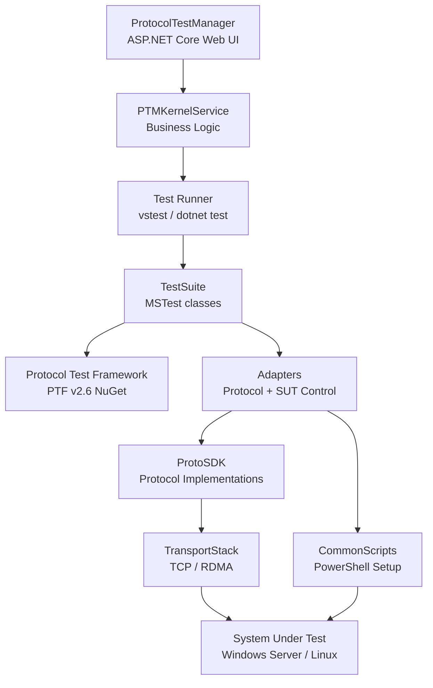

# Architecture Overview — Windows Protocol Test Suites

## What This Repository Is

Windows Protocol Test Suites is a .NET-based interoperability testing framework for Microsoft Open Specification protocols. It was originally developed at Microsoft for internal validation of protocol implementations and is used extensively at Plugfests and interoperability labs to test partner implementations against Windows behavior.

A test suite evaluates whether a protocol implementation meets specific interoperability requirements. The suites do not certify implementations or cover every protocol requirement, but they provide a useful conformance signal. Tests run against a live System Under Test (SUT) over the actual protocol wire — they are not unit tests of internal logic.

## Repository Root

`c:\Users\jomitiran\source\repos\WindowsProtocolTestSuites`

## Top-Level Directory Map

```
WindowsProtocolTestSuites/
├── ProtoSDK/           Protocol SDK — message structures, encode/decode, transport, per-protocol client/server
├── TestSuites/         One subfolder per test suite family
├── ProtocolTestManager/ PTMService — ASP.NET Core web UI for configuring and running test suites
├── CommonScripts/      Shared PowerShell scripts for environment setup (AD, DFS, shares, etc.)
├── InstallPrerequisites/ Scripts to install build and runtime prerequisites
├── pipelines/          Azure Pipelines YAML CI/CD definitions
├── common/             Shared batch runner scripts (RunTestCasesByBinariesAndFilter.*)
├── AssemblyInfo/       Version file shared across projects
├── MessageAnalyzerLibrary/ Legacy message analyzer support
├── Doc/ docs/          Documentation (user guides, test design specs)
└── RemoteRun/          Remote test execution support
```

## Component Map

### ProtoSDK

The protocol library. Every protocol has its own subdirectory. Each directory contains:
- Message/PDU structures (C# structs and classes)
- Encoder/decoder implementations
- Client and/or server state machines
- Transport bindings

ProtoSDK has no dependency on any test framework. It is a pure protocol implementation library that test suites consume as a NuGet package or project reference.

**Key subdirectories:**

| Directory | Protocol |
|---|---|
| `MS-SMB2/` | SMB2/SMB3 file sharing |
| `MS-SMBD/` | SMB over RDMA transport |
| `MS-RDPBCGR/` | RDP basic connectivity and graphics |
| `MS-RDPEGFX/`, `MS-RDPEDYC/`, etc. | RDP virtual channel extensions |
| `KerberosLib/` | Kerberos authentication |
| `MS-NLMP/` | NTLM authentication |
| `MS-FSCC/` | File System Control Codes (shared types) |
| `MS-DFSC/` | DFS Referral |
| `MS-FSRVP/` | File Server Remote VSS |
| `MS-RSVD/` | Remote Shared Virtual Disk |
| `MS-SQOS/` | Storage QoS |
| `MS-SWN/` | Service Witness |
| `MS-WSP/` | Windows Search Protocol |
| `MS-XCA/` | Xpress Compression Algorithm |
| `MS-RPCE/` | RPC over SMB Extensions |
| `MS-SAMR/` | Security Account Manager Remote |
| `MS-DRSR/` | Directory Replication Service |
| `MS-NRPC/` | Netlogon Remote Protocol |
| `MS-PAC/` | Privilege Attribute Certificate |
| `MS-SPNG/` | Simple Protected Negotiation |
| `MS-CSSP/` | Credential Security Support Provider |
| `Asn1Base/` | ASN.1 encoding base library |
| `CryptoLib/` | Cryptographic utilities |
| `TransportStack/` | TCP/NetBIOS transport abstraction |
| `Common/` | Shared types (StackPacket, PduMarshaler, NtStatus, etc.) |
| `Sspi/` `SspiLib/` `SspiService/` | Security Support Provider Interface |
| `RDMA/` `RdmaLinux/` | RDMA native adapter (C++/P-Invoke and Linux) |

### TestSuites

One directory per test suite. Each suite builds independently.

| Directory | What it tests |
|---|---|
| `FileServer/` | SMB2, DFSC, SWN, FSRVP, FSA, FSCC, RSVD, SQOS |
| `RDP/Client/` | RDP client protocols (RDPBCGR, RDPEDISP, RDPEDYC, RDPEGFX, etc.) |
| `RDP/Server/` | RDP server protocols (RDPBCGR, RDPEDYC, RDPEMT, RDPELE) |
| `Kerberos/` | MS-KILE, MS-KKDCP, MS-PAC |
| `MS-SMBD/` | SMB2 over RDMA (MS-SMBD + MS-SMB2) |
| `BranchCache/` | MS-PCCRTP, MS-PCCRR, MS-PCHC, MS-PCCRC |
| `ADFamily/` | Active Directory protocols (MS-ADTS, MS-ADA1-3, MS-DRSR, MS-SAMR, MS-NRPC, etc.) |
| `MS-AZOD/` | Azure Object Discovery |
| `MS-ADFSPIP/` | ADFS Proxy and Web Application Proxy integration |
| `MS-ADOD/` | Active Directory Domain Operations |
| `MS-WSP/` | Windows Search Protocol |
| `MS-XCA/` | Xpress Compression Algorithm |

### ProtocolTestManager (PTM)

An ASP.NET Core 8.0 web application that provides a browser-based UI for:
- Installing test suite packages
- Configuring test suite properties (`.ptfconfig` settings)
- Running auto-detection of SUT capabilities
- Executing test cases with filtering
- Viewing test results

**Key PTM subdirectories:**

| Directory | Purpose |
|---|---|
| `PTMService/PTMService/` | ASP.NET Core host, controllers, React SPA |
| `PTMService/PTMKernelService/` | Business logic: test suite management, configuration, test execution |
| `PTMService/Abstractions/` | Interfaces (`IPTMKernelService`, `ITestSuite`, `IConfiguration`, `ITestRun`) |
| `PTMService/Database/` | EF Core database context |
| `PTMService/Storage/` | File system storage abstraction |
| `Plugins/` | Per-test-suite PTM detector plugins (auto-detection of SUT capabilities) |

### CommonScripts

PowerShell scripts for environment setup shared across test suites. Covers: domain join, AD user/group creation, DFS namespace setup, share configuration, certificate creation, network configuration, SSH setup, etc.

### InstallPrerequisites

`InstallPrerequisites.ps1` reads `PrerequisitesConfig.xml` and installs required tools: Visual Studio 2022, .NET SDK 6.0, PowerShell Core 7, Win32-OpenSSH, NetworkDirect DDK (for RDMA).

## Technology Stack

| Layer | Technology |
|---|---|
| Primary language | C# targeting .NET 8.0 |
| Test framework | MSTest v2 (`Microsoft.VisualStudio.TestTools.UnitTesting`) |
| Protocol Test Framework | PTF v2.6 (`Microsoft.Protocols.TestTools`) — NuGet |
| Build tooling | `dotnet publish`, PowerShell (`build.ps1`), `build.sh` for Linux |
| C++ components | MSVC 2022 — ADFamily test suite, MS-SMBD RDMA adapter |
| Web UI | ASP.NET Core 8.0 + React (in `PTMService/PTMService/ClientApp/`) |
| Database (PTM) | SQLite via Entity Framework Core |
| CI | Azure Pipelines (YAML in `pipelines/`) |
| Test execution | `vstest.console.exe` or `dotnet test`, invoked by PTM or batch scripts |

## How the Pieces Fit Together

A test case execution flow looks like this:

1. **PTM (or batch script)** launches the test binary with vstest.
2. **MSTest** discovers and runs `[TestMethod]`-attributed methods.
3. Each test class inherits from `TestClassBase` (PTF) → suite-specific base (e.g., `SMB2TestBase`) → protocol base (e.g., `CommonTestBase`).
4. `TestInitialize` creates a **ProtoSDK client** (e.g., `Smb2FunctionalClient`) pointing at the configured SUT IP/hostname.
5. The test sends protocol messages via ProtoSDK, which uses `TransportStack` over TCP (or RDMA for SMBD).
6. Responses are decoded by ProtoSDK decoders. The test asserts on decoded fields.
7. `TestCleanup` disconnects and cleans up test files/directories via adapter calls.
8. PTF logs results to XML and text files; PTM's `PipeSink` captures them in real time.

## Key Architectural Patterns

### Adapter Pattern
Test cases do not manipulate the SUT directly. They use two adapter types:
- `ISutProtocolControlAdapter`: sends protocol commands to the SUT using the protocol under test (implemented in C# using ProtoSDK).
- `ISutCommonControlAdapter`: performs out-of-band setup (create shares, users, etc.) using PowerShell scripts or a managed C# implementation via LDAP/WMI.

Adapters are declared in `.ptfconfig` XML files and injected via PTF's `BaseTestSite.GetAdapter<T>()`.

### PTF Configuration (ptfconfig)
Each test suite ships two config files:
- `<Suite>.ptfconfig` — default settings (property groups, adapter bindings, log sinks).
- `<Suite>.deployment.ptfconfig` — environment-specific overrides (SUT hostname, credentials, IP addresses). This file is populated during deployment.

### Functional Client vs. Raw SDK
Most test suites use a higher-level "functional client" (e.g., `Smb2FunctionalClient` in `TestSuites/FileServer/src/Common/Adapter/`) that wraps the raw ProtoSDK client (`Smb2Client`) with convenience methods, automatic reconnect, and assertion helpers. The raw SDK is in `ProtoSDK/`.

## Component Relationship Diagram



## Solution Files

Each test suite builds from a `.sln` file in its `src/` directory:

| Suite | Solution |
|---|---|
| FileServer | `TestSuites/FileServer/src/FileServer.sln` |
| RDP Client | `TestSuites/RDP/Client/src/RDP_Client.sln` |
| RDP Server | `TestSuites/RDP/Server/src/RDP_Server.sln` |
| Kerberos | `TestSuites/Kerberos/src/Kerberos_Server.sln` |
| MS-SMBD | `TestSuites/MS-SMBD/src/MS-SMBD_Server.sln` |
| MS-WSP | `TestSuites/MS-WSP/src/MS-WSP_Server.sln` |
| MS-XCA | `TestSuites/MS-XCA/src/MS-XCA.sln` |
| ADFamily | `TestSuites/ADFamily/src/AD_Server.sln` |
| BranchCache | `TestSuites/BranchCache/src/BranchCache.sln` |
| PTMService | `ProtocolTestManager/PTMService/PTMService.sln` |
